Chapter 12  
Playing Games

The childhood game of Noughts and Crosses is a combinatorial problem of a large but manageable size. Let us review the rules, and then see if we can build the game tree (that is, a structure describing all possible games), and draw some statistics from it.

A 3-by-3 grid is constructed. Two players (O and X) take turns, beginning with O, to place their piece in an empty space. The game is won if or when a player forms three pieces in a row, column, or diagonally. The game is drawn if the board is full and no such pattern has been formed. For example, in this board, player O has won, building a diagonal:

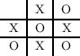

Let us consider the shape of the game tree. Clearly, at the top level, it will branch nine ways, since O can be placed in any square. Then eight ways, seven ways and so on. Once we reach the fifth level, some of the games have been won (since three pieces from player O may form a line), and so the number of branches may be reduced. The tree must end after nine levels, since the board must at least be full, even if no-one has won. A fragment of the game tree is shown in Figure 12.1. Let us begin to construct the program. We will need a type to represent X, O and the empty square:

------------------------------------------------------------------------

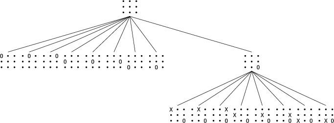          

> Figure 12.1:

------------------------------------------------------------------------

`type turn = O | X | E`

It would be natural to use a nine-tuple, since the board is of a fixed size. Then, though, we lose the ability to use the standard list-processing functions such as `List.map `over the boards. So, at the cost of a little inelegance, we will use a list of length nine instead – in other words a `turn` `list`.

We need to terminate the tree when X has won, O has won, or the board is full. Thus we will need to check all the rows, columns, and diagonals. We do not want to replicate the logic several times or build a huge pattern match, so it is easiest to write a function which takes a list of nine booleans and just checks for lines of `true`. We can then use `List.map `on the board itself to build these intermediate lists of booleans.

> 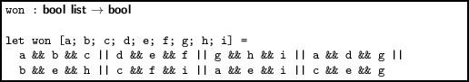

We can number the positions in our board:

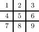

Now, we can use functions from the List module to write a function to return the numbers of the positions which are currently empty:

> 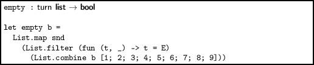

This works by building the list of tuples `[(X, 1); (E, 2); (E, 3) `…`(O, 9)]`, filtering out any which are not empty, and extracting the list of empty positions `[2, 3 `…`]`. It is also simple to write a function which, given a board like `[E; E; E; E; X; E; O; E; E]`, a turn like `O `and a number such as 8, will fill in the correct slot in the board to produce `[E; E; E; E; X; E; O; X; E]`. The `take `and `drop `functions from our Util module (described on page xiii) are ideal:

> 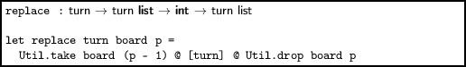

One more simple function is required before we can write the main tree-building function, and that is to change whose turn it is:

> 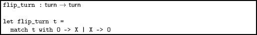

What should the type of the game tree be? Each node needs a list of turn elements representing the board, and a list of zero or more trees representing the game resulting from each possible move. Since the list can have zero elements, we need no separate leaf constructor:

`type tree = Move of turn list * tree list`

Now we may construct the main function. Our job is to build, given a turn (X or O) and the current board, the tree starting at that board. If the board has been won by either player, the list of next nodes is empty, and the recursion stops. If not, we calculate the empty positions, build a new board with each empty position filled in with the current turn, and then map `next_moves `over each of those.

> 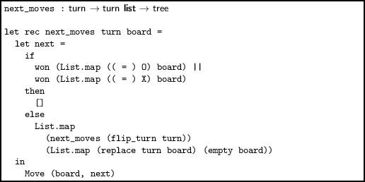

Note that the recursion stops when a board is full (drawn) because `empty `returns the empty list in this case. Now we can build the game tree itself, which might take a second or so:

> 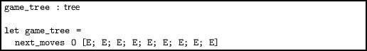

This results in the tree shown below.

> 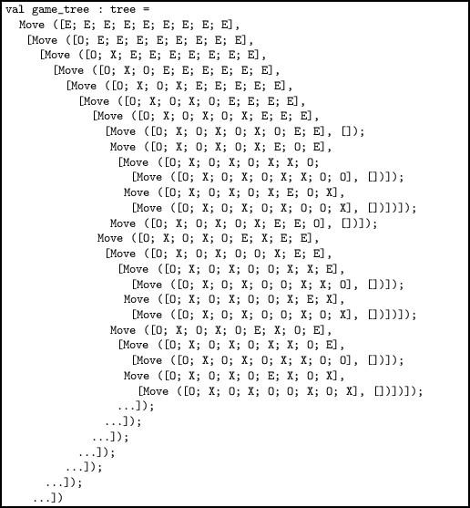

You can see the first ending position in this game tree is `[O; X; O; X; O; X; O; E; E]`. You can also see several drawn games. We can now use this game tree to calculate how many games are won by a given player:

> 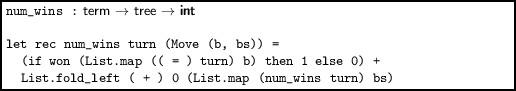

This tells us, reasonably quickly, that O wins 131184 games. The questions at the end of this chapter ask you to work out more of these numbers. Here is the full code in one place:

> 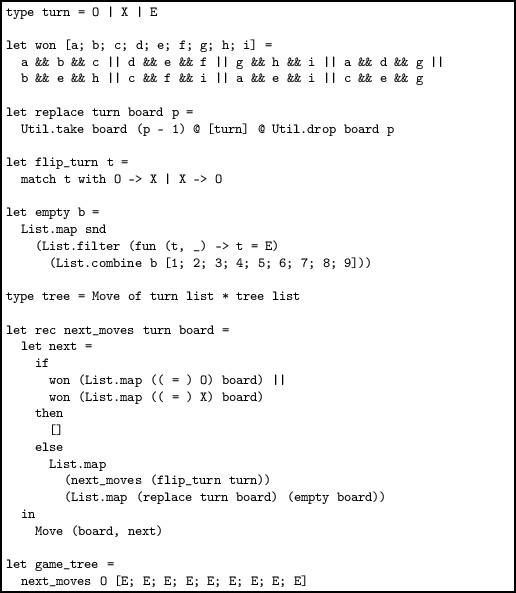

In the questions, you will extract the rest of the statistics from the tree, and build some alternative representations.

Questions

1.  In how many cases does X win? How many possible different games are there? How many end in a draw?

2.  Build a lazy version of our game tree, where nodes are only created when explored. Now write a function to work out how many times O and X win or the game is drawn if O goes first and picks the centre slot. What about if O picks a corner? The middle of a side?

3.  Another way to check if someone has won is to rearrange the board numbers into a so-called magic square, where each row, column or diagonal sums to 15:

    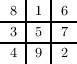

    Now, a player has won if they have any three positions summing to 15. Re-implement our game tree program using this alternative representation.