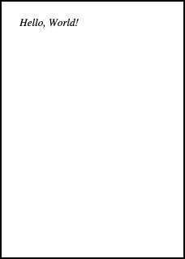

Chapter 13  
Representing Documents

In this chapter we will define a data type for representing a PDF document. PDF is a structured format for describing a wide variety of graphical and textual data. The PDF file format itself is large and complex, but we will introduce only the parts required for our examples. It is relatively easy to write PDF files but rather harder to read them, so we will concentrate on creating PDF data structures in memory, and then writing them to valid files. Here is an example PDF, as it might be displayed in a PDF viewer:

Here is the corresponding code, which you would see if you opened the PDF file in a plain text editor:

` %PDF-1.1  `  
`1 0 obj  `  
`<</Type /Page  `  
`  /Parent 3 0 R  `  
`  /Resources  `  
`    <>>>>>  `  
`       /MediaBox [0 0 595.275590551 841.88976378]  `  
`       /Rotate 0 /Contents [4 0 R] >>  `  
`endobj  `  
`2 0 obj  `  
`<</Type /Catalog /Pages 3 0 R>>  `  
`endobj  `  
`3 0 obj  `  
`<</Type /Pages /Kids [1 0 R] /Count 1>>  `  
`endobj  `  
`4 0 obj  `  
`<</Length 53>>  `  
`stream  `  
`1 0 0 1 50 770 cm BT /F0 36 Tf (Hello, World!) Tj ET  `  
`endstream  `  
`endobj  `  
`xref  `  
`0 5  `  
`0000000000 65535 f  `  
`0000000015 00000 n  `  
`0000000200 00000 n  `  
`0000000245 00000 n  `  
`0000000296 00000 n  `  
`trailer  `  
`<</Size 5 /Root 2 0 R>>  `  
`startxref  `  
`397  `  
`%%EOF `

Rather complicated, as we can see. Our first job is to define a pleasant OCaml data type for PDF documents, which can then be flattened to the format above when written to a file.

The main body of a PDF file is a set of numbered objects – there are four in the example above, from `1 0` `obj `to `4 0 obj`. Each one contains some structured data, such as the dictionary `<</Type /Pages /Kids [1 0` `R] /Count 1>> `which associates the keys `/Type`, `/Kids`, and `/Count `to the name `/Pages`, the array `[1 0 R]`, and the integer `1 `respectively. Before and after the main body is some ancillary data, most of which we do not need to hold in our data structure – it is generated upon writing. Here are all the kinds of data we will be using:

- Booleans, like `true `and `false`
- Integers, such as 4, 256, -1
- Floating-point numbers such as 1.585
- Strings, like `(a string) `which are sequences of characters within parentheses
- Names, like `/Name`
- Ordered arrays of objects such as `[1 2 4]`
- Dictionaries, which are unordered collections of key-value pairs, where the keys are names. For example, `<</One 1 /Two 2 /Three 3>>`.
- Streams, like object 4 in the example above, which are arbitrary sequences of bytes.
- Indirect references, like `4 0 R `which point to another object by its number (here, object 4).

Here is an OCaml data type to hold such data:

`type pdfobject =`  
`  Boolean of bool`  
`| Integer of int`  
`| Float of float`  
`| String of string`  
`| Name of string`  
`| Array of pdfobject list`  
`| Dictionary of (string * pdfobject) list`  
`| Stream of pdfobject * string`  
`| Indirect of int`

Note that it is recursive, mirroring the structure of the data. For example, object 3 in the example above, that is `<</Type /Pages /Kids [1 0 R] /Count 1>>`, will be represented as:

`Dictionary`  
`  [("/Type", Name "/Pages"); ("/Kids", Array [Indirect 1]); ("/Count", Integer 1)]`

Now, we need a type to represent the whole document, which contains a list of these objects, the PDF version number (1.1 in the example above), and the trailer dictionary (`<</Size 5 /Root 2 0 R>> `above). Everything else is generated upon writing. It is traditional to name the main type of a module t:

`type t =`  
`  {version : int * int;`  
`   objects : (int * pdfobject) list;`  
`   trailer : pdfobject}`  

We put these two types into `pdf.ml `and `pdf.mli`. Here is how we might build an instance of this data type representing our example PDF:

`let objects =`  
`  [(1,`  
`     Pdf.Dictionary`  
`       [("/Type", Pdf.Name "/Page");`  
`        ("/Parent", Pdf.Indirect 3);`  
`        ("/Resources",`  
`           Pdf.Dictionary`  
`             [("/Font",`  
`              Pdf.Dictionary`  
`                [("/F0",`  
`                  Pdf.Dictionary`  
`                    [("/Type", Pdf.Name "/Font");`  
`                     ("/Subtype", Pdf.Name "/Type1");`  
`                     ("/BaseFont", Pdf.Name "/Times-Italic")])])]);`  
`        ("/MediaBox",`  
`          Pdf.Array`  
`            [Pdf.Float 0.; Pdf.Float 0.;`  
`             Pdf.Float 595.275590551; Pdf.Float 841.88976378]);`  
`        ("/Rotate", Pdf.Integer 0);`  
`        ("/Contents", Pdf.Array [Pdf.Indirect 4])]);`  
`   (2,`  
`     Pdf.Dictionary`  
`       [("/Type", Pdf.Name "/Catalog");`  
`        ("/Pages", Pdf.Indirect 3)]);`  
`   (3,`  
`     Pdf.Dictionary`  
`       [("/Type", Pdf.Name "/Pages");`  
`        ("/Kids", Pdf.Array [Pdf.Indirect 1]);`  
`        ("/Count", Pdf.Integer 1)]);`  
`   (4,`  
`     Pdf.Stream`  
`       (Pdf.Dictionary [("/Length", Pdf.Integer 53)],`  
`        "1 0 0 1 50 770 cm BT /F0 36 Tf (Hello, World!) Tj ET"))]`  
  
`let hello =`  
`  {Pdf.version = (1, 1);`  
`   Pdf.objects = objects;`  
`   Pdf.trailer =`  
`   Pdf.Dictionary`  
`    [("/Size", Pdf.Integer 5);`  
`     ("/Root", Pdf.Indirect 2)]}`  

The advantage of using this data structure as opposed to generating the PDF file directly is that it may be programmatically manipulated with ease, using pattern matching and other standard OCaml techniques. Note that the content of the page itself `"1 0 0 1 50 770 cm BT /F0 36 Tf (Hello, World!) Tj ET" `remains a plain string. We shall look at this separate language soon.

In the next three chapters, we will learn how to write this representation to a file, and add our own text and graphics to the page.

Questions

1.  Draw the graph of the relationships, via indirect references such as `3 0 R`, of the objects 1, 2, 3, 4 and the trailer dictionary.

2.  Represent the following PDF objects using our data type:
    - `/Name`
    - `(Quartz Crystal)`
    - `<</Type /ObjStm /N 100 /First 807 /Length 1836 /Filter /FlateDecode>>`
    - `[1 2 1.5 (black)]`
    - `[1 2 0 R]`

3.  PDF files can contain arbitrary objects, which will be ignored by a PDF reader if they are not understood. Design a way of representing items of the following type using one or more PDF objects:

       `type tree = Lf | Br of tree * int * tree`

4.  Write a function of type pdfobject → pdfobject which, given an object, replaces the value of any dictionary entry with key `/Rotate `to `90`.