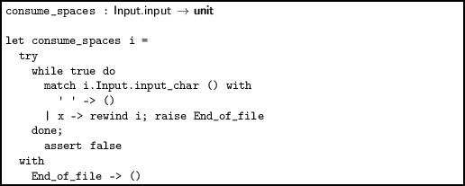
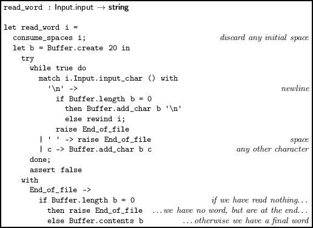
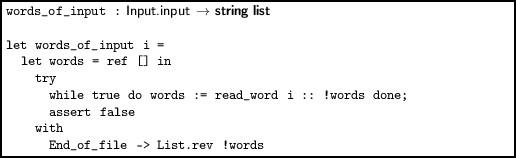
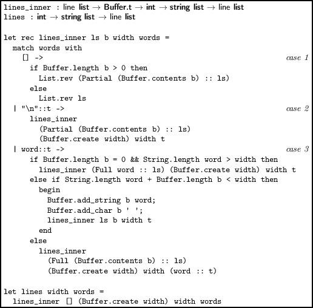
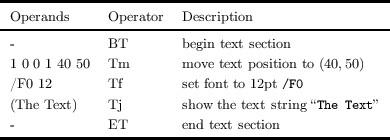
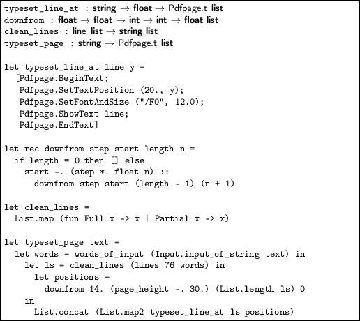
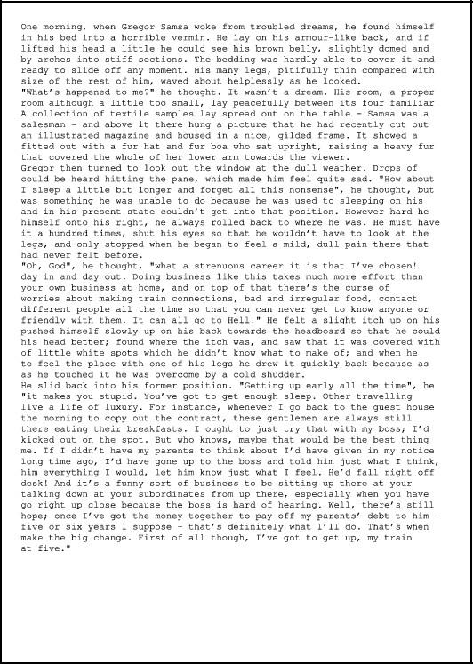

Chapter 16  
Adding Text

In this chapter, we will develop a very simple typesetter. Given a string representing the page content, it will split it into words, break them across lines and place them on the page. In the questions at the end of the chapter, the typesetter will be extended to use full justification, to indent paragraphs, and to produce multi-page documents.

To begin with, some of our numbers (lines per page, margins etc.) will be hard coded – we will then factor them out as we generalize the code. But let us define names for the page width and height for an A4 page first, to prevent excessive duplication:

> 

We first need to split our text into words. For our purposes, a word is anything separated from another word by one or more spaces. To preserve the paragraph breaks, the new line character `\n `will be considered a word also. So, for example, the string `"He stopped.\n Looking around, he saw he was enveloped in smoke."` would be split into the list of words `["He"; "stopped."; "\n"; "Looking"; "around,"; "he"; "saw";` `"he"; "was"; "enveloped"; "in"; "smoke."]`.

The function `consume_spaces`, given an input, places the input position at the first non-space character at or after its current position. If the end of the input is reached, no exception is raised.

> 

Now we can write a function to read a word. First, we consume any spaces present. Then, we repeatedly read characters into a buffer until either a space occurs, a newline occurs, or we reach the end of a file. If a space occurs, we have finished reading the word. If a newline occurs, we have finished also, but we rewind so the newline will be picked up as its own word next time. If we reach the end of the input, we return the contents of the buffer so far.

> 

Now it is simple to collect all the words in an input by repeatedly calling `read_word`, and accumulating the result is a list.

> 

We shall consider the opening paragraphs of Kafka’s “Metamorphosis”:

` One morning, when Gregor Samsa woke from troubled dreams, he found  `  
`himself transformed in his bed into a horrible vermin.  He lay on  `  
`his armour-like back, and if he lifted his head a little he could  `  
`see his brown belly, slightly domed and divided by arches into stiff  `  
`sections.  The bedding was hardly able to cover it and seemed ready  `  
`to slide off any moment.  His many legs, pitifully thin compared  `  
`with the size of the rest of him, waved about helplessly as he  `  
`looked.  `  
`        "What's happened to me?" he thought. It wasn't a dream. His  `  
`room, a proper human room although a little too small, lay peacefully  `  
`between its four familiar walls. A collection of textile samples lay  `  
`spread out on the table - Samsa was a travelling salesman - and above  `  
`it there hung a picture that he had recently cut out of an  `  
`illustrated magazine and housed in a nice, gilded frame. It showed a  `  
`lady fitted out with a fur hat and fur boa who sat upright, raising a  `  
`heavy fur muff that covered the whole of her lower arm towards the  `  
`viewer. `

So, for our text, we get:

` ["One"; "morning,"; "when"; "Gregor"; "Samsa"; "woke"; "from"; "troubled";  `  
` "dreams,"; "he"; "found"; "himself"; "transformed"; "in"; "his"; "bed";  `  
` "into"; "a"; "horrible"; "vermin."; "He"; "lay"; "on"; "his"; "armour-like";  `  
` "back,"; "and"; "if"; "he"; "lifted"; "his"; "head"; "a"; "little"; "he";  `  
` "could"; "see"; "his"; "brown"; "belly,"; "slightly"; "domed"; "and";  `  
` "divided"; "by"; "arches"; "into"; "stiff"; "sections."; "The"; "bedding";  `  
` "was"; "hardly"; "able"; "to"; "cover"; "it"; "and"; "seemed"; "ready";  `  
` "to"; "slide"; "off"; "any"; "moment."; "His"; "many"; "legs,"; "pitifully";  `  
` "thin"; "compared"; "with"; "the"; "size"; "of"; "the"; "rest"; "of";  `  
` "him,"; "waved"; "about"; "helplessly"; "as"; "he"; "looked."; "\n";  `  
` "\"What's"; "happened"; "to"; "me?\""; "he"; "thought."; "It"; ...] `

Notice the newline as a word on its own. Our next task is to break this sequence of words into lines of a given width. We will have two kinds of line. A `Full `line is one we had to break at the end of. A `Partial `line is one which ended because of a newline or end-of-input. In our first example, we will not need to distinguish these two, but when it comes to justification and more advanced examples, it will be invaluable. The type is trivial:

`type line =`  
`     Full of string`  
`   | Partial of string`

Now the line breaking function. The function `lines `takes a maximum width in characters, and a list of words, and returns a line list. There are three cases in the `lines_inner `function:

 

1.  If we have reached the end of the list of words, return the list of collected `line`s, adding one for anything in the current line buffer, if it is non-empty.
2.  If we have a newline word, create a `Partial `line from the current buffer (even if it is empty – this allows blank lines to be inserted using multiple newlines), and carry on.
3.  If we have any other word, see how long it and the buffer are. If the word is longer than the whole line and we are at the beginning of that line, we output an over-sized line (an alternative would be to wrap or hyphenate the word in some way). Otherwise, we see if the current word will fit. If it will, we add it and a space to the buffer and carry on. It not, we output a `Full `line, and start with the word on the next line.

> 

For example, here is our text split into lines of no more than twenty characters each:

` [Text.Full "One morning, when "; Text.Full "Samsa woke from ";  `  
` Text.Full "dreams, he found "; Text.Full "transformed in his ";  `  
` Text.Full "into a horrible "; Text.Full "He lay on his ";  `  
` Text.Full "back, and if he "; Text.Full "his head a little ";  `  
` Text.Full "could see his brown "; Text.Full "slightly domed and ";  `  
` Text.Full "by arches into "; Text.Full "sections. The ";  `  
` Text.Full "was hardly able to "; Text.Full "it and seemed ready ";  `  
` Text.Full "slide off any "; Text.Full "His many legs, ";  `  
` Text.Full "thin compared with "; Text.Full "size of the rest of ";  `  
` Text.Full "waved about "; Text.Partial "as he looked. ";  `  
` Text.Full "\"What's happened to "; Text.Full "he thought. It ";  `  
` Text.Full "a dream. His room, "; Text.Full "proper human room ";  `  
` Text.Full "a little too small, "; Text.Full "peacefully between "; ...] `

Now we need to add appropriate text-showing operators to our Pdfpage module, and then produce a list of operators for showing a line, using it repeatedly to show the whole page. A text section in a PDF operator stream looks something like this:

` BT 1 0 0 1 40 50 Tm /F0 12 Tf (The text) Tj ET `

This contains the following operators and operands:

Here are the fragments added to the Pdfpage.t type…

`  | BeginText`  
`  | EndText`  
`  | SetTextPosition of float * float`  
`  | SetFontAndSize of string * float`  
`  | ShowText of string`

…and the `string_of_op `function:

`  | BeginText -> "BT"`  
`  | EndText -> "ET"`  
`  | SetTextPosition (x, y) -> Printf.sprintf "1 0 0 1 %f %f Tm" x y`  
`  | SetFontAndSize (font, size) -> Printf.sprintf "%s %f Tf" font size`  
`  | ShowText t -> Printf.sprintf "(%s) Tj" t`

Consider Figure 16.1. The function `typeset_line_at `builds a single line at x position 20 and a given y coordinate. The function `downfrom `builds a list of y positions for a number of lines. The utility function `clean_lines `makes plain strings from a list of `line`s, and the function `typeset_page `puts it all together, generating a big list of Pdfpage.t operations. The resulting PDF is shown in Figure 16.2. The full code for this chapter is included in the online resources – it should be consulted before attempting the questions.

------------------------------------------------------------------------

> 

 

> Figure 16.1:

------------------------------------------------------------------------

------------------------------------------------------------------------

>   

> Figure 16.2:

------------------------------------------------------------------------

Questions

 

1.  Factor out the font size, line height, margin height and automatically calculate the number of characters in a line (the number of characters in a line can be calculated by the formula 5w∕3f where w is the width of a line and f is the font size). The program should now work for any page size.
2.  The first line of each paragraph (save for the first) should be indented by eight characters. Implement this.
3.  Implement full justification. This gives a clean left and right margin except for the left margin of the first line in a paragraph and the right margin of the last line of a paragraph. This can be done by altering the spacing between characters and words. Of course, `Partial `lines should not be stretched.
4.  Allow the program to generate multiple pages, should the length of the text demand it. This can be done by extending the `/Kids `entry in the PDF file, and producing multiple page objects.