Answers to Questions

Hints may be found on page 309.

1 (Unravelling “Fold”)

1

This can be achieved by folding the subtraction operator over the deductions, with the starting accumulator set to the budget:

> 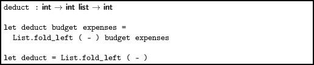

Partial application can be used, as in the second definition.

2

We can use an accumulator starting at zero, and increment it once for each element processed:

> 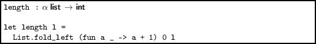

Since we ignore the element itself, the function is polymorphic.

3

If the list is empty, we return `None`, otherwise we use a left fold which simply replaces the accumulator with each successive element from the list. We must initialize the accumulator, so we pick the first element for that (we have already eliminated the case where there are no elements, so `List.hd `will succeed).

> 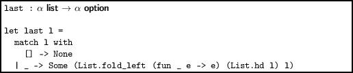

Not quite idiomatic.

4

If we start from the left, consing each element to the accumulator (which is initially the empty list), the list will be reversed.

> 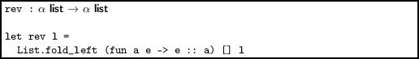

Since the accumulator is the empty list (which has type α list), the function remains polymorphic, having the type we would expect.

5

The accumulator begins set to `false`. For each element, we calculate the logical OR of the element tested for equality and the accumulator. If at least one `true `occurs, the result will be `true`.

> 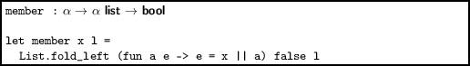

Note that this is less efficient than `List.mem `because there is no early exit – the whole list is processed in every case.

6

This is a classic problem. We either need to

 

- add a space after each word except for the last; or
- add a space before each word except for the first.

With `fold_left `we can detect when we are at the first word, by inspecting the accumulator, and use the second method.

> 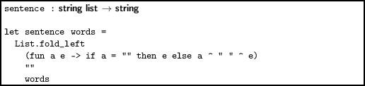

Note that the requirement that the words be non-empty is important here. The efficiency is poor, however, since each string concatenation builds a new string. The Standard Library Buffer module is a better approach here.

7

We can use the built-in `max `function to update the accumulator.

> 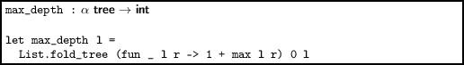

The current element is ignored.

8

We can compare the speed of `List.mem `and `member `with the help of the `Unix.gettimeofday `function, as shown in Figure A.1. On the Author’s machine, this results in:

------------------------------------------------------------------------

> 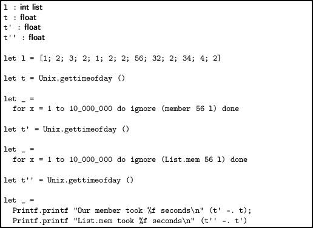

 

> Figure A.1:

------------------------------------------------------------------------

` Our member took 2.513232 seconds  `  
`List.mem took 1.162159 seconds `

There is a significant speed penalty in our version of the member function, at least for this scenario.

2 (Being Lazy)

1

This is similar to the `lseq `function in the text, but we double every time instead of adding one.

> 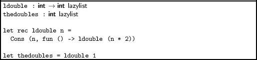

Having written the function which, given a number, doubles from that point, we then just code the list itself by starting at 1.

2

If we are asked to fetch the 0th element, we already have it – as the head of the lazy list. If not, we force evaluation of the tail, and recurse.

> 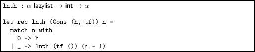

Of course, this does not terminate on bad inputs (when n \< 0). Error detection should be added.

3

Below, the function `lrepeating_inner `takes the current list `c `and the original list `l`. Matching on `c`, we build the lazy list. If we reach the last element of the input list, we start again, with the original list, which is always retained.

> 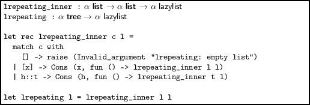

Note that we cannot build from an empty list, since there could be no head.

4

The first two fibonacci numbers are defined to be 0 and 1. Thereafter, we keep the current and previous number, and generate the lazy list.

> 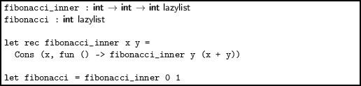

5

This is slightly delicate. We must force the tail twice, to reveal new elements for the heads of the two output lists, and the final tail for the next time each list is forced.

> 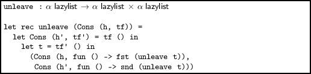

Note that we cannot hoist the calculation of `unleave t `into a `let `so as to do it once, since to do so would not delay evaluation.

6

If we write a function which, given a number, gives the correct string, then the lazy list itself is easy to build with `lmap `and `lseq`.

> 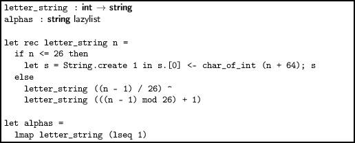

3 (Named Tuples with Records)

1

Since a reference is just a record with a mutable field `contents`, we can use the `<- `construct:

`        OCaml`  
  
`# let x = ref 0;;`  
`val x : int ref = {contents = 0}`  
`# x.contents <- 1;;`  
`- : unit = ()`  
`# x;;`  
`- : int ref = {contents = 1}`

There is no reason to use this rather than `:= `of course.

2

The function `Unix.time `returns the current time. The function `Unix.localtime `builds from this a record of type Unix.tm. First we will need two ancillary functions:

> 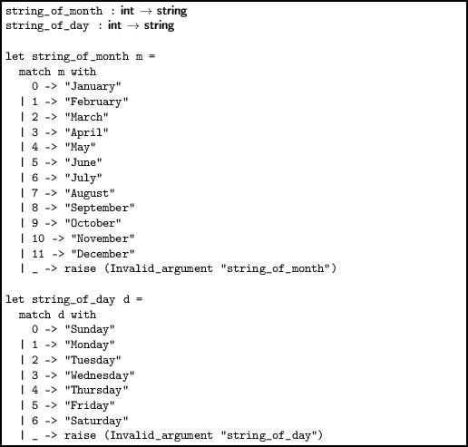

Now the main function, which both uses the shortened form of a record pattern, and names only the fields we need:

> 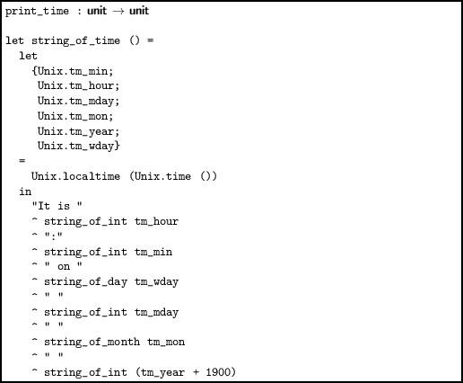

Note that the names bound by the pattern do not include the `Unix `prefix.

3

The construct `type t = {x : int ref} `is a record type containing a reference to an integer. We can build it using an existing reference, and can extract the reference for use elsewhere. We can share a single reference between two or more instances of this data type. The construct `type t = {mutable x : int} `is a record with a single, mutable field. We must use `<- `rather than `:= `to mutate it, and it may not be shared.

4

We can use multiple type parameters (which are written with parentheses and commas) and then use these types for the fields in the appropriate way:

`type ('a, 'b, 'c) t =`  
`  {a : 'a;`  
`   b : 'a;`  
`   c : 'b;`  
`   d : 'b;`  
`   e : 'c;`  
`   f : 'c}`

5

For the first part, we can use the function `Gc.stat `to return a Gc.stat record. Then we can write various components to the given file (here, we have chosen just a few):

> 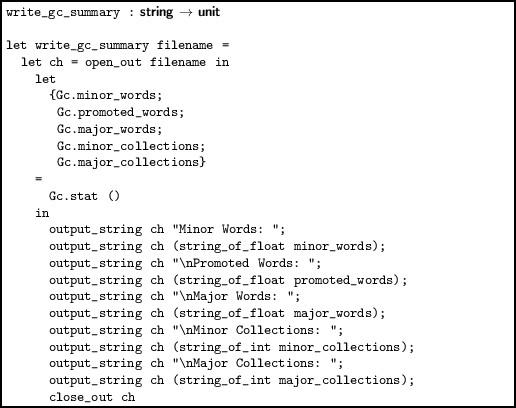

For the second part, we define names for the magic numbers given in the documentation. We can then write a function `change_verbosity `which adds them up to make the new flags field, and uses `Gc.get `together with the `with `syntax to build a new record to be passed to `Gc.set`:

> 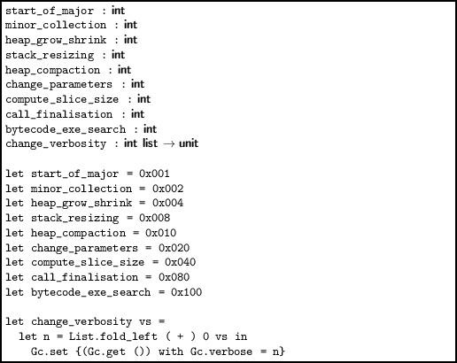

4 (Generalized Input/Output)

1

This is a simple modification of `input_of_string `from the text, replacing string operators with array ones.

> 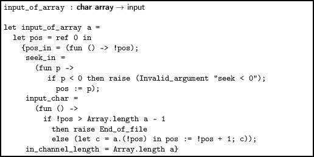

Note that an array of characters like this requires much more space as a string.

2

We create a Buffer.t, attempt to read the specified number of characters, and then return the contents. If one of the calls to `i.input_char () `raises the `End_of_file `exception, we return the buffer contents anyway – it will contain the characters read so far.

> 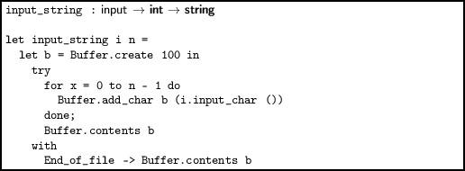

3

We add a function of the expected type to the input. The option `None `will represent the end of the file.

`type input =`  
`  {pos_in : unit -> int;`  
`   seek_in : int -> unit;`  
`   input_char : unit -> char;`  
`   input_char_opt : unit -> char option;`  
`   in_channel_length : int}`

Now for a new `input_of_channel`. We try to build the `Some `option, returning `None `if the `End_of_file` exception is raised.

> 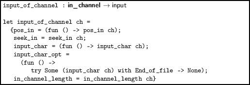

The `input_of_string `function is another similar modification. This time, there is no need for exception handling.

> 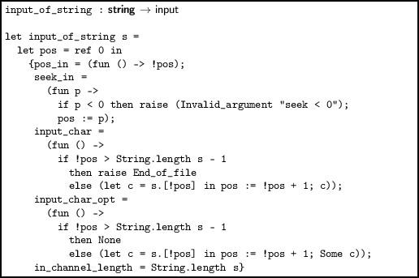

4

We add the function of type unit → int.

`type input =`  
`  {pos_in : unit -> int;`  
`   seek_in : int -> unit;`  
`   input_char : unit -> char;`  
`   input_byte : unit -> int;`  
`   in_channel_length : int}`

Now, having defined as a convenience, the name `no_more `for the -1, we can modify `input_of_channel `and `input_of_string `easily:

> 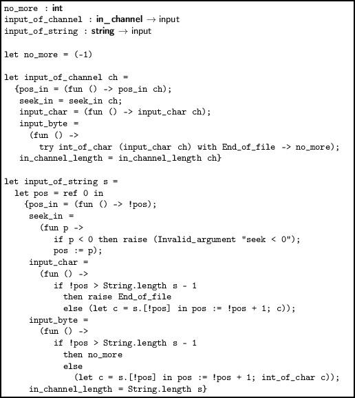

These functions have none of the advantages of the exception-raising or option-returning ones, but they are very fast indeed.

5

We alter `input_of_channel `to check for a newline and raise `End_of_file `in that case.

> 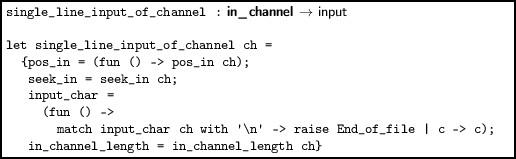

Now we can create one of these special inputs from standard input, and use our `input_string `function to build a string from the user’s input, ending when the return key is pressed. For example:

`# input_string (single_line_input_of_channel stdin) max_int;;`  
`Some input`  
`- : string = "Some input"`

6

Ideal functions to use when defining the new type already exist in the Buffer module. Then, we can build an example, where we give a name to the buffer, build an input from it and process it, retrieving its contents afterwards.

> 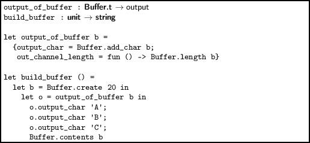

5 (Streams of Bits)

1

We can read quickly if the number of bits wanted is 8 and we happen to be at the beginning of a byte. In this case we can call the underlying output’s `input_char `function directly.

> 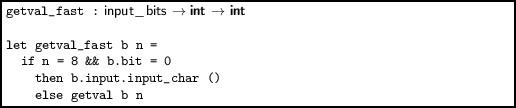

If the conditions are not met, we fall back to the old `getval `function. This will be faster if we frequently read data aligned-byte-by-aligned-byte, but we still need the flexibility of a stream of bits when required.

2

We simply replace the int operators with those for Int32.t:

> 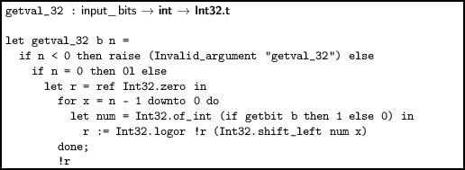

3

Our precondition this time is that the number of bits to be written is 8 and the `obit `field is set to its initial value, 7. Then we can use the `output_char `function of the underlying output.

> 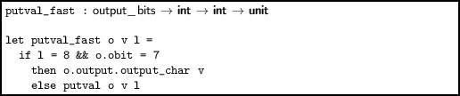

Otherwise, we fall back to the old `putval `function.

4

The integer functions are replaced by ones from the Int32 module:

> 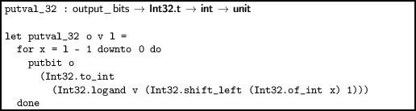

5

We add a field `rewind `which will move the position in the output backwards one byte, if possible. This is the new type:

`type output =`  
`     {output_char : char -> unit;`  
`      rewind : unit -> unit;`  
`      out_channel_length : unit -> int}`

Now we can rewrite, for example, `output_of_string `for this new type:

> 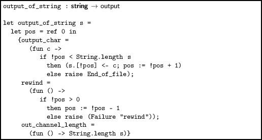

We alter `putbit `appropriately:

> 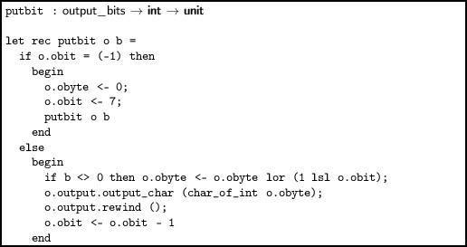

6 (Compressing Data)

1

We will need to look through the input list of integers (bytes), finding same and different runs and building a new list. For clarity, we will produce the output runs using a new type, producing the actual bytes later:

`type run = Same of int * int | Diff of int list`

The `Same `case holds a (length, value) pair and `Diff `just a list of bytes. Now we can write a function `get_same` which, given the first value, the current count, and the list, returns a pair of the final count of like characters, and the remaining list:

> 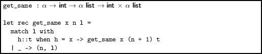

Similarly, we can define a function to read a different run into an accumulator, returning the run and the remaining list. This function will be called only when `get_same `returned a run of length one.

> 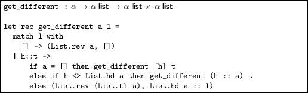

Now we can write a function which uses both of these functions to get a single run, creating an instance of our new data type:

> 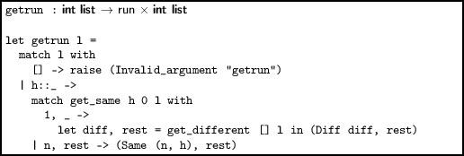

Now, we use the defined rules to build a function which makes a list of bytes from a run:

> 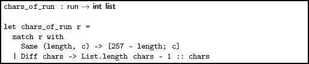

With all this done, it is easy to define the compression function itself, which accumulates runs, concatenating them when all the data has been processed. We must be sure to add the EOD marker at the end.

> 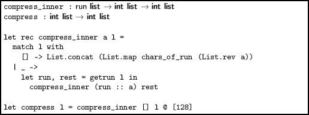

Decompression is rather simpler, making use of our `take `and `drop `functions from the Util module described on page xiii. We read each run and expand it to a list of bytes, accumulating them until end of data.

> 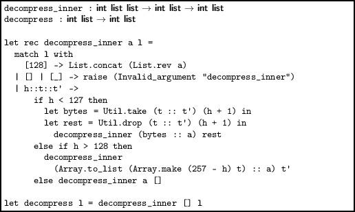

Note a little cheat – we use functions from the Array module to expand the `Same `run.

2

The tree carries no information in its branches (since no code can be a prefix of another code). Leaves can carry or not carry information, depending on whether there is a code there. In order to avoid option types, we can just split into three cases, `Lf `for empty leaves, `Code `for full ones, and `Br `for a branch, where 0 goes left and 1 goes right.

`type tree = Lf | Code of int | Br of tree * tree`

Now, we can define the function to add a code to an existing tree. For example, `add_elt Lf ([0; 1], 67)` adds the code `[0; 1] `for the run length 67. This will build the tree `Br (Br (Lf, Code 67), Lf)`. We match on the code, building the tree as we go left or right.

> 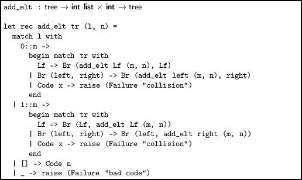

Now, to build the whole tree, we just use repeated insertion with `fold_left`, having built the (code, run length) pairs:

> 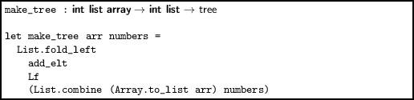

Now, for example, we can build the white terminating codes as a tree:

> 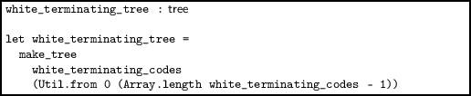

(`Util.from a b `gives the list of numbers starting at `a `and ending at `b `in ascending order). The function succeeds, verifying that there are no collisions, and yields:

`   Br  `  
`   (Br  `  
`     (Br  `  
`       (Br  `  
`         (Br  `  
`           (Br (Br (Lf, Br (Code 29, Code 30)),  `  
`             Br (Br (Code 45, Code 46), Code 22)),  `  
`           Br (Br (Code 23, Br (Code 47, Code 48)), Code 13)),  `  
`         Br  `  
`          (Br (Br (Code 20, Br (Code 33, Code 34)),  `  
`            Br (Br (Code 35, Code 36), Br (Code 37, Code 38))),  `  
`          Br (Br (Code 19, Br (Code 31, Code 32)), Code 1))),  `  
`       Br  `  
`        (Br (Br (Code 12, Br (Br (Code 53, Code 54), Code 26)),  `  
`          Br (Br (Br (Code 39, Code 40), Br (Code 41, Code 42)),  `  
`           Br (Br (Code 43, Code 44), Code 21))),  `  
`        Br  `  
`         (Br (Br (Code 28, Br (Code 61, Code 62)),  `  
`           Br (Br (Code 63, Code 0), Lf)),  `  
`         Code 10))),  `  
`     Br  `  
`      (Br  `  
`        (Br (Code 11,  `  
`          Br (Br (Code 27, Br (Code 59, Code 60)), Br (Lf, Code 18))),  `  
`        Br  `  
`         (Br (Br (Code 24, Br (Code 49, Code 50)),  `  
`           Br (Br (Code 51, Code 52), Code 25)),  `  
`         Br (Br (Br (Code 55, Code 56), Br (Code 57, Code 58)), Lf))),  `  
`      Br (Lf, Code 2))),  `  
`   Br  `  
`    (Br (Br (Code 3, Br (Lf, Code 8)),  `  
`      Br (Br (Code 9, Br (Code 16, Code 17)), Code 4)),  `  
`    Br (Br (Code 5, Br (Br (Code 14, Code 15), Lf)), Br (Code 6, Code 7)))) `

3

Compressing our data with `compress_string input_data 1680 1 `instead of `compress_string input_data` `80 21 `generates a string of length 110 bytes rather than 120 bytes. This is because we could generate one run for the white section at the end of one line followed by a white section at the beginning of the next, instead of splitting at line boundaries.

If we try to re-compress this data, with `compress_string compressed 880 1`, the data size increases to 197 bytes. This is unsurprising, since the job of the white and black codes is to be information-dense and the compression algorithm works best on data which is information-sparse.

4

We can re-use the `read_up_to `function to build our histogram. Given white and black arrays, each of length 1792 and with elements initialized to zero, the input bits and the width and height, we can repeatedly call `read_up_to`. We must maintain a count of how many pixels are left to be read, and an additional count of how many are left in this line, so the correct width can be passed to the `read_up_to` function.

> 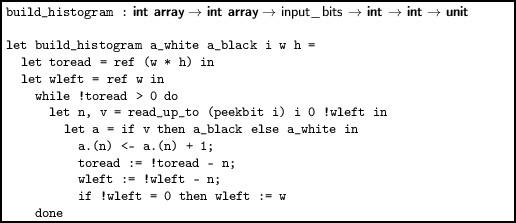

Now it is easy to build two histograms – one for white and one for black, and return them:

> 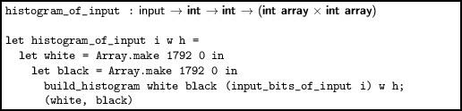

We can define a simple function to print the histogram, eliding any zero counts:

> 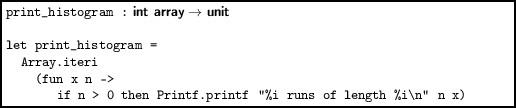

Here is the histogram for white runs on our example data:

` # print_histogram white;;  `  
`5 runs of length 1  `  
`7 runs of length 2  `  
`15 runs of length 3  `  
`15 runs of length 4  `  
`34 runs of length 5  `  
`20 runs of length 6  `  
`4 runs of length 7  `  
`4 runs of length 8  `  
`4 runs of length 9  `  
`3 runs of length 10  `  
`3 runs of length 11  `  
`7 runs of length 12  `  
`1 runs of length 13  `  
`1 runs of length 14  `  
`1 runs of length 15  `  
`3 runs of length 16  `  
`1 runs of length 17  `  
`1 runs of length 20  `  
`1 runs of length 21  `  
`3 runs of length 35  `  
`1 runs of length 39  `  
`1 runs of length 46  `  
`1 runs of length 47  `  
`1 runs of length 73  `  
`3 runs of length 80  `  
`- : unit = () `

And here is the histogram for black runs:

` # print_histogram black;;  `  
`12 runs of length 1  `  
`55 runs of length 2  `  
`38 runs of length 3  `  
`5 runs of length 4  `  
`2 runs of length 5  `  
`1 runs of length 6  `  
`1 runs of length 7  `  
`1 runs of length 8  `  
`2 runs of length 9  `  
`2 runs of length 10  `  
`- : unit = () `

7 (Labelled and Optional Arguments)

1

If α is int then the first and second argument can be confused. We can fix this by adding labels and calling `Array.make`. Notice the use of punning here.

> 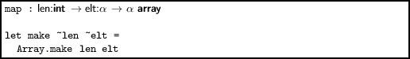

Now the function can be called without confusion:

`         OCaml  `  
`  `  
`# make ~len:5 ~elt:4;;  `  
`- : int array = [|4; 4; 4; 4; 4|] `

Of course, it can still be called without labels.

2

We can define separate types for the start and length so that their names must be mentioned when calling the function.

> 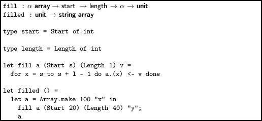

Not nearly as convenient as labels, though.

3

There are three functions where confusion may arise, and we can label them with simple wrappers. They are the functions where multiple arguments have the same type, and so may be confused.

> 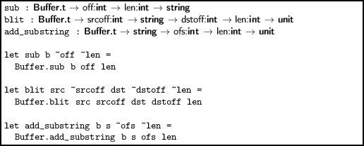

4

We can make the accumulator an optional argument. Now the caller can call the function as if it were the same as `List.map`.

> 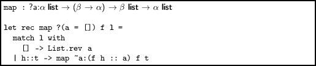

The optional argument must still appear in the interface, of course, so we might still prefer the old approach of wrapping it up and only exposing the wrapper.

8 (Formatted Printing)

1

We can use `Printf.bprintf `to accumulate the individual parts, making sure to deal with the final element specially. The outer function sets everything up.

> 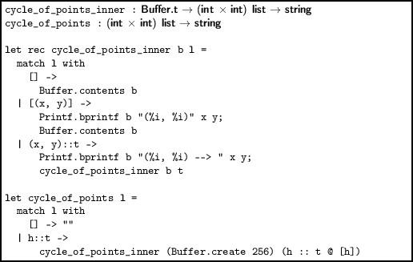

2

Again, `Printf.bprintf `is the key. This time, we can calculate the initial buffer size exactly.

> 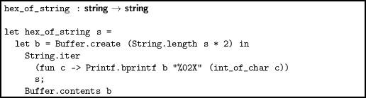

We have used a width specifier of `2 `and the `0 `flag to make sure that characters with code 0..15 are padded with a zero.

3

The format string for `Printf.printf `must be known at compile time. The solution for printing the result of `mkstring `using `printf `is the `%s `format specification:

`Printf.printf "%s" (mkstring ())`

4

The `* `character can be used as a width or precision specifier, to indicate that the width or precision is given as an argument. We use `* `for the width, and pass in 10.

`Printf.sprintf "(%*i)" 10 1`

So, the result is:

`(         1)`

We can use `List.iter `to print a table by applying this to each of a list of numbers in turn.

> 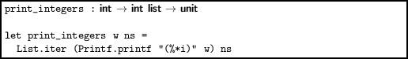

9 (Searching for Things)

1

For the first part, where all matches are considered, we can rewrite `search `with an extra argument to count the matches, restructuring its logic so as not to finish upon the first match.

> 

There is no need to rewrite the `at `function. Now, for the version which considers only non-overlapping matches, we just jump by the length of the pattern `ss `upon a match:

> 

2

It is simple to write a function which returns the length of the longest matching prefix at the beginning of a list:

> 

Now, we can write a function which keeps track of the position and length of the longest prefix found, returning them when the whole list has been searched.

> 

Here, `currpos `is the current position, `bestpos `the position of the longest matching prefix found so far, and `bestlen `the length of the longest prefix so far.

3

We can write a simple profiling function which, given a search function, measures its running time. This allows us to compare the naive and better versions of `search `we wrote for searching in strings:

> 

Compiling with `ocamlc `on the Author’s machine:

` Naive version took 7.608291 seconds  `  
`Better version tool 3.388830 seconds `

Now, compiling with `ocamlopt`:

` Naive version took 2.966211 seconds  `  
`Better version tool 0.450546 seconds `

4

We can add a case to the main search. We must check the character following the backslash for a match, assuming there is such a next character. If so, we move two positions in the pattern and one in the string. Otherwise, the match has failed.

`| '\\'->`  
`    if`  
`      sp < String.length s &&`  
`      ssp < String.length ss - 1 &&`  
`      ss.[ssp + 1] = s.[sp]`  
`    then`  
`      Some (2, 1)`  
`    else`  
`      None`

5

The Standard Library function `String.uppercase `can be used, in conjunction with the optional boolean argument:

> 

Both the pattern and string must be upper case, of course.

10 (Finding Permutations)

1

The combinations of a list can be generated by calculating the combinations of the tail. Then consider two possibilities – the head is included in this combination, or it is not:

> 

Note the base case is the list containing the empty list, not just the empty list.

2

We build this from `perms `and the `combinations `function we just wrote:

> 

We used the tail-recursive version of `perms`, of course.

3

This has roughly the same shape as `combinations`, with two differences: we keep a counter to make sure the computation ends, and we always add something to the list – either `true `or `false`.

> 

4

We repeatedly swap elements from opposite ends of the sub-array, given an array, offset and length:

> 

It is important to make sure it works for the empty range, an even-length sub-array and an odd-length sub-array. You could add detection of invalid arguments to this function.

5

The two functions `first `and `last `turn out to be even more awkward than their imperative counterparts. The function `first`, given a list, returns a tuple of three things: the elements before the “first” item, the first item itself, and those afterward. This is done by reversing the input list and looking for the first appropriate item, since this is easier than looking for the last appropriate item in the original input:

> 

The `last `function is still more verbose: we locate the correct item by sorting and finding the smallest item greater than `f`. Then we can call `split_at `to return the item before and after the instance of `f`.

> 

Now, the `next_permutation `function calls `first `and `last`, and stitches everything together:

> 

Here is the equivalent `non_increasing `function, which is simple:

> 

The final `all_permutations `function is now easy.

> 

Conclusion: converting an imperative algorithm mechanically to a functional style is not always useful.

11 (Making Sets)

1

It is not possible to measure directly the memory used by an OCaml data structure (though one could calculate it by reading the section in the OCaml manual about data representation), but we can use the Gc module to measure the number of words allocated whilst building the structure, by using the data in `Gc.counters `before and after building each structure, and the given formula “memory used since start of program = minor words + major words - promoted words”:

Notice that a huge amount more is required for the tree structures, because every time a new element is inserted, part of the tree is rewritten. In the case of the Red-Black tree, rotations involve allocating new memory too.

2

We can add the type for the `union `function to our signature:

> 

For lists, the `union `function is easy, we just insert each element of `b `into the list `a`. Duplicates will be removed correctly:

`let union a b = List.fold_left (fun x y -> insert y x) a b`

For trees and Red-Black trees, we must turn `b `into a list first, so `fold_left `can be used, but the solution is broadly the same.

`let union a b = List.fold_left (fun x y -> insert y x) a (list_of_set b)`

For hash tables, to preserve the previous tables, we must build lists from both sets, and then build a new set from the concatenation of those too lists:

`let union a b = set_of_list (list_of_set a @ list_of_set b)`

The built-in Set module, which is considered in Question 3, provides a particularly efficient union operation.

3

We write a version of our set signature which is specialized to integers. Then, we use the syntax given in the question to build the module S. This contains the type S.t, the value `S.empty `and the functions `S.elements`, `S.add`, `S.mem`, and `S.cardinal`, which we can use to write the functions to match our signature.

> 

Now the benchmarking for insertion and membership is simple:

> 

Here is the output:

`For ordered, insertion took 0.056586, membership 0.019593`  
`For unordered, insertion took 0.087148, membership 0.021295`

4

We can change the type thus, with `BrR `for red and `BrB `for black:

`type 'a t =`  
`  Lf`  
`| BrR of 'a t * 'a * 'a t`  
`| BrB of 'a t * 'a * 'a t`  

Now, the solutions are tedious to write out, but not difficult. The result is Figure A.2.

------------------------------------------------------------------------

> 

 

> Figure A.2:

------------------------------------------------------------------------

12 (Playing Games)

1

We already know that O wins 131184 times. By a similar use of `num_wins `we find that X wins 77904 times. So, as expected, going first is an advantage. We must write another function to find how many draws there are. A board is drawn if it is full but does not contain a winning configuration of either X or O:

> 

This tells us that there are 46080 drawn games. Since each game must be either won or drawn, the total number of possible games is 131184 + 77904 + 46080 = 255168. We can check this by writing a function to find the terminal nodes directly:

> 

This gives 255168 too.

2

We need make only two small changes. Delaying evaluation in the type…

`type tree = Move of turn list * (unit -> tree list)`

…and altering `next_moves `to insert that delay:

> 

Now, we can carefully write a function `select_case `which, given a starting board such as `[E; E; E; E; O;` `E; E; E; E] `and the game tree, returns the portion of the game tree matching that board. Due to laziness, the rest of the tree is now not explored.

We can now alter `num_wins `easily for the delayed case, and write a function `pos_wins `which returns the number of wins starting from a position like `[E; E; E; E; O; E; E; E; E]`.

> 

Similarly, we can modify the `drawn `function to work with the new lazy structure, and write a new function `draws `to count the drawn positions from a given starting board such as `[E; E; E; E; O; E; E; E;` `E]`:

> 

Now we can define starting boards for the centre spot, the middle of a side, and a corner. We can now use `pos_wins `and `draws`, taking account of symmetry to enumerate all the cases:

> 

This gives the following:

` val centre_x_wins : int = 5616  `  
`val centre_o_wins : int = 15648  `  
`val centre_drawn : int = 4608  `  
`val side_x_wins : int = 40704  `  
`val side_o_wins : int = 56928  `  
`val side_drawn : int = 20736  `  
`val corner_x_wins : int = 31584  `  
`val corner_o_wins : int = 58608  `  
`val corner_drawn : int = 20736 `

The total is 255168, of course.

3

The strategy of using the magic square representation is to build a problem which is isomorphic (has the same essential characteristics – literally the same shape) to the original one, but is easier to work with. Before building the tree tree, we will need five little functions:

 

- `sum`, which checks if a list sums to 15;
- `threes`, which finds all the combinations of numbers from a list of numbers which are of length three (the `combinations `function is from Chapter 10);
- `won`, which uses `threes `to check if a list of integers contains a combination of three numbers which sum to 15;
- `drawn `which, given the integer lists for X and O, works out if the game has been drawn; and
- `possibles `which, given all the non-empty squares, lists the empty ones.

> 

Now, the type contains a list of X positions, a list of O positions, and the list of child nodes:

`type tree = Move of int list * int list * tree list`

We do not need a type for the turn this time – we can just use a boolean. The function `next_moves `follows the usual pattern – if the game is won or drawn, the list of child nodes is empty. Otherwise, we build child nodes for each possible position the next player could place his piece.

> 

------------------------------------------------------------------------

> 

 

> Figure A.3:

------------------------------------------------------------------------

The game tree is shown in Figure A.3. We can write a simple `xwins `function to test our new function returns the same result as the original.

> 

13 (Representing Documents)

1

Writing `T `for the trailer dictionary, we have the graph `T `→ `2 `→ `3` ←→ `1 `→ `4`.

2

These can be written out by reference to the data structure:

 

- `Name "/Name"`
- `String "Quartz Crystal"`
- `Dictionary [("/Type", Name "/ObjStm"); ("/N", Integer 100); ("/First", Integer` `807); ("/Last", Integer 1836); ("/Filter", Name "/FlateDecode")]`
- `Array [Integer 1; Integer 2; Float 1.5; String "black"]`
- `Array [Integer 1; Indirect 2]`

In the last two examples, we assumed integer where appropriate. Notice that in the last example, the parsing is somewhat ambiguous – we would need to read all the way to the `R `to be sure it was not an array of several integers.

3

Consider the tree `Br (Br (Lf, 1, Lf), 2, Br (Lf, 3, Lf))`. We will represent it by using nested PDF dictionaries. A branch will have a `/Type `key with value `/Br`. It will have `/Left `and `/Right` entries for the sub-trees. A leaf is indicated simply by `/Lf`. In the PDF file we would write it like this:

` <</Type /Br  `  
`  /Value 2  `  
`  /Left <</Type /Br /Value 1 /Left /Lf /Right /Lf>>  `  
`  /Right <</Type /Br /Value 3 /Left /Lf /Right /Lf>>>> `

To construct it from our data type in OCaml:

`let tree =`  
`  Pdf.Dictionary`  
`    [("/Type", Pdf.Name "/Br");`  
`     ("/Value", Pdf.Integer 2);`  
`     ("/Left",`  
`        Pdf.Dictionary`  
`          [("/Type", Pdf.Name "/Br");`  
`           ("/Value", Pdf.Integer 1);`  
`           ("/Left", Pdf.Name "/Lf");`  
`           ("/Right", Pdf.Name "/Lf")]);`  
`     ("/Right",`  
`         Pdf.Dictionary`  
`           [("/Type", Pdf.Name "/Br");`  
`            ("/Value", Pdf.Integer 3);`  
`            ("/Left", Pdf.Name "/Lf");`  
`            ("/Right", Pdf.Name "/Lf")])]`

4

We must search for dictionary entries inside `Pdf.Dictionary`, of course, but also inside `Pdf.Stream`, which contains a dictionary, and `Pdf.Array `which may do so too. Two mutually-recursive functions will do:

> 

14 (Writing Documents)

1

We can alter the functions `string_of_array `and `string_of_dictionary `to simply not output the space preceding the closing bracket. To remove the initial space requires a little trick. We inspect the length of the buffer to determine if we are about to output the first item. In that case, no space is written. This is shown in Figure A.4.

------------------------------------------------------------------------

> 

 

> Figure A.4:

------------------------------------------------------------------------

2

The full code can be found in the online resources. We make the following changes:

 

- Change `/Count `from `1 `to `3`.
- Move the `/Resources `to its own object, number `5`.
- Write two new pages, objects `6 `and `7`.
- Write two new page content streams, `8 `and `9`.
- Change the `/Size `from `5 `to `10 `to account for the new objects.

3

The full code can be found in the online resources. See the hint for a little more help.

15 (Pretty Pictures)

1

Since we are working with circles, let us define π:

> 

We can write a simple function to return the point at a given angle, distance `r `from point (`x`, `y`):

> 

Now, we can build a list of all these points, remembering to stop before we have been around the whole circle. The argument `step `is the angle between successive points.

> 

Finally, we generate a `Move `to the first points, `Line`s to the rest, and a final `Close`.

> 

For our example, we made a filled circle of radius 100 centred at (300, 300) with `Pdfpage.Fill`:

2

First, a function to build a pseudo-random circle somewhere on our page, making sure to overlap the edges:

> 

Now, a little utility function to build a list of n things when given a function which generates them, such as `random_circle`:

> 

Now it is simple to build a hundred random grey filled circles and append them all together with `List.concat`:

> 

3

We can add `FillColourRGB of float * float * float `and `StrokeColourRGB of float * float * float` to the data type and associated functions, and then modify our previous example:

> 

If you are reading the PDF ebook version of this book, the following image is in colour:

4

We add `LineWidth of float `to the data type and associated functions. Now we set the line width and stroke colour and draw the large circle:

> 

5

We add `SetClip `to the data type and associated functions. Then we set the clip before stroking.

> 

The single path is used both for clipping and for the stroke:

16 (Adding Text)

1

We can pull out font size, line spacing and margin easily, defining them at the top of the page. The text width is derived from the page width and margin. The maximum number of characters in a line can be calculated using the formula given in the question:

`let font_size = 10.0`  
  
`let line_spacing = 1.1`  
  
`let margin = 40.0`  
  
`let text_width = page_width -. margin -. margin`  
  
`let max_chars = int_of_float (text_width /. font_size *. (5. /. 3))`

We can now insert these new names into `typeset_line_at`:

`Pdfpage.SetTextPosition (margin, y);`  
`Pdfpage.SetFontAndSize ("/F0", font_size);`

We pass `max_chars `to `clean_lines `and alter our call to `downfrom`:

`let ls = clean_lines (lines max_chars words) in`  
  
`downfrom`  
`  (font_size *. line_spacing)`  
`  (page_height -. margin -. line_spacing) (List.length ls) 0`

Here is an example of the new program, with text typeset on a much smaller page (it runs off the bottom, of course):

2

We can implement this by manually inserting space characters into the buffer in `lines_inner `following every newline (i.e. at the beginning of the second and subsequent paragraphs). This is shown in Figure A.5.

------------------------------------------------------------------------

> 

 

> Figure A.5:

------------------------------------------------------------------------

Notice the use of an optional argument in `lines`. We can now alter one line in `typeset_page`:

`let ls = clean_lines (lines max_chars ~indent:8 words) in`

The result is shown in Figure A.6.

------------------------------------------------------------------------

>   

> Figure A.6:

------------------------------------------------------------------------

3

The page height can be calculated easily:

`let text_height = page_height -. margin -. margin`

Now, we can use `Pdfpage.SetCharacterSpacing `in `typeset_line_at`, adding an extra argument for the spacing:

> 

The spacing is calculated as prescribed, only for `Full `lines:

> 

In a revised `typeset_page`, we can calculate the correct spacings, passing them to `typeset_line_at`:

> 

Here is an example page. You can see that the lines are fully justified – flush to the left and right margins.

4

The answer to this question is too long to be contained in the text. Consult the online resources for the program itself. An example multi-page output is shown in Figure A.7.

------------------------------------------------------------------------

  

  

  

> Figure A.7:

------------------------------------------------------------------------