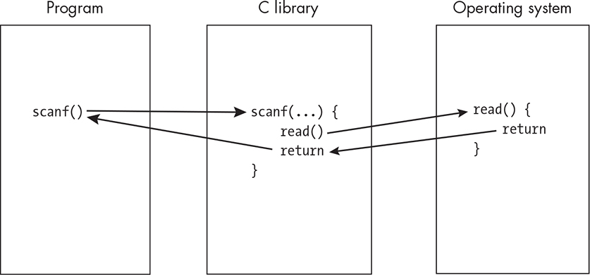
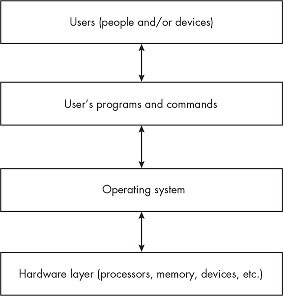
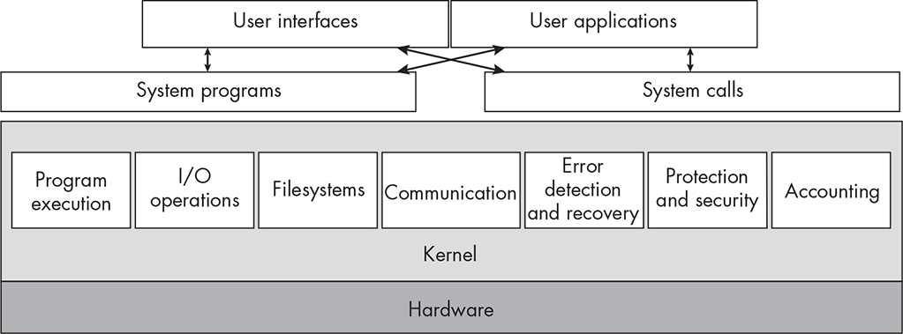
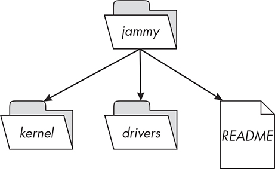
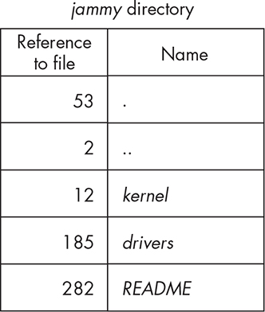
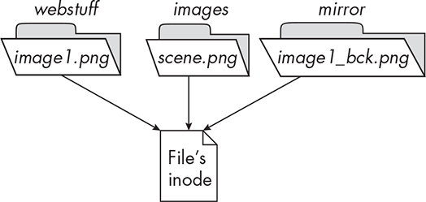
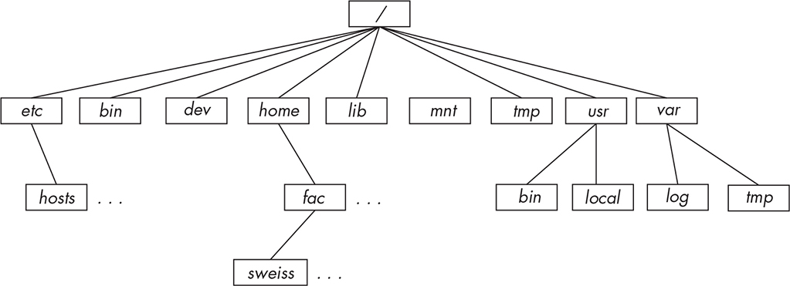

1 CORE CONCEPTS

This first chapter presents the big picture of system programming and

basic background information on Unix. We begin with an exploration of

what system programs are and how they are different from other kinds

of programs. Next, I’ll introduce many of the fundamental concepts that underlie the Unix family of operating systems, and we’ll conclude with a brief discussion of the history and standardization of Unix and the C

programming language.

When we examine the various concepts that make Unix what it is,

we start with the kernel because it is essentially the core of a Unix

system. From there, we move on to Unix shells, which are the

programmable, interchangeable user interfaces in Unix systems,

separate and distinct from the Unix kernel. After that, we’ll cover the concepts of users and groups. I then explain how the distinction

between privileged and unprivileged instructions in Unix enables the

kernel to manage resources securely and efficiently. Next, I’ll introduce the concept of a user *process*, a representation of a running user program managed by the kernel, and *threads*, which are particular types of processes in Unix. I’ll also explain the idea of an *environment list*, which is a set of variables and values passed to new processes, and I’ll describe the Unix directory hierarchy and present an overview of files,

directories, and permissions.

One important part of any Unix system is its online documentation, which plays a critical role in how you’ll learn system programming in

this book. We’ll cover its organization and use in this chapter as well.

What Is System Programming?

The first programs people learn to write are simple ones, but despite

their simplicity, we can use them to explain what system programming

is. The simplest possible program that actually does something has no

input and just prints a message onto the screen. One such program is

the ubiquitous “Hello, world” program that you most likely wrote at the beginning of your development as a programmer. The first C version of

this program appeared in Kernighan and Ritchie’s *The C Programming* *Language* (Prentice Hall, 1978) and has since become the de facto first program that students learn to write when they are learning a new

programming language. Listing 1-1 shows the original version of that program.

*hello_world.c*

\#include \<stdio.h\>

void main()

{

printf("hello, world\n");

}

*Listing 1-1: Kernighan and Ritchie’s original “Hello, world” program* The first line is an *include directive*, which starts with the keyword

\#include and is followed by the specification of a file. It tells the C

preprocessor to read the contents of the file, in this case, the C header *stdio.h*, at that point in the program. We need that action to take place because the main program makes a call to the C printf() function, whose declaration is in *stdio.h*. Without it, the compiler could not tell whether printf() was being called properly. The C preprocessor has to find the header file before it can read it, and header files can be in many possible places. The angle brackets (\<\>) around the name of the file tell the preprocessor that it’s in one of the standard places that it searches.

*The Magic of Input and Output*

The printf() function is one way in C to print information on the screen.

I’m using the word *screen* as a synonym for the more technical term, *terminal window*. In this simple example, printf() has a single string,

"hello, world.\n", as its argument. The \n is the *newline* character, which causes the next character following it to appear at the beginning of the next line on the screen.

Let’s assume that this code is stored in a file named *hel o_world.c* and that we’ve already compiled it into an executable program named

*hel o_world*. Because we don’t want to be sidetracked by the details of how to compile code on a Unix system, we omit that compilation

procedure here.

Running this program in a terminal window causes the string "hello, world" to be displayed, and then the prompt reappears. To run the program, we enter its name, preceded by ./, and press ENTER:

\$ **./hello_world**

hello, world

\$

For someone who has never written a program before, this seems

like magic. All you have to do is include the *stdio.h* header file in the code and give the printf() function the string that you want to print, and voilá: When you run the program, the string appears.

It clearly isn’t magic though, and a lot must be going on behind the

scenes to make the characters appear on the screen. C has given us a

very powerful tool, printf(), so that we can write programs that print to the screen without needing to learn a lot about terminals and other

technology.

Let’s take this one step further. The preceding program outputs text

but has no input. Listing 1-2 performs both input and output.

*hello.c*

\#include \<stdio.h\>

void main() {

➊ char username\[256\];

printf("Enter your name: ");

➋ scanf("%255s", username);

printf("hello, %s\n", username);

}

*Listing 1-2: A program that performs both input and output*

This program begins with a declaration of a char array named username

of length 256 ➊. This array can store up to 255 characters plus a

terminating NULL byte. A *NULL* *byte* is the nonprinting character whose code is zero. As a character, it’s written as \0. In many programming

languages, a NULL byte is required at the end of a string. The program then prints a prompt message to the screen asking the user to enter

their name. Then the C scanf() function ➋ reads characters from the

keyboard until either 255 characters are entered or it finds a whitespace character (blank, tab, or newline), and it stores this data into the username array. The program prints hello followed by the contents of that array.

THE SCANF() FUNCTION

The scanf() function is the C library’s formatted input function. It

reads input, by default from the keyboard, following a format that

you give it. In general, its first parameter is a string enclosed in

double quotes followed by one or more pointers. The double-

quoted string is called the *format specification*. In this example, it is

"%255s", which specifies that the input data should be stored as a string (s for string) with a maximum width of 255 characters. The

argument following the format specification must be a pointer to

the start of a character array large enough to hold 255 characters

plus the NULL byte. Since array names can be used in C wherever a

constant pointer is expected, the array username is a valid argument.

Let’s think about how this input and output actually take place. The

program makes calls to the scanf() and printf() functions, but where is

their code and how is it executed? Many beginning programmers mistakenly believe that the header files included by their programs

contain the function implementations because all they have to do is put appropriate \#include directives into their programs for them to work.

However, those implementations are not in the header files.

*The Role of the C Library in I/O*

In general, when functions are not defined in the same file as the code calling them, they need to be linked into that code. When a compiler is processing a file and finds a function call not defined in the same file, it marks the call as an *unresolved symbol* because it can’t assign an address for that function. The same is true if it finds unknown type names,

variable names, and so on. Linking is the act of assigning addresses to these unresolved symbols. The compiler does not link. The *linker* is the component of the compiler collection that resolves undefined symbols.

A *compiler col ection* is a set of programs that build programs from source code.

The C language provides no built-in facilities for performing

operations such as input/output, memory management, and string

manipulation. Instead, they’re defined in a standard library, which you link into your program. In the case of scanf() and printf(), their

definitions are part of the C Standard Library. The linker automatically searches through this library without your needing to do anything

special, thereby finding the function definitions. In “Object Libraries”

on page 50, I explain exactly what a library is and how you can see what it contains.

Inside that library, the scanf() function makes calls to a lower-level function named read(). The code that implements read() is not part of

the library; it’s part of the Unix operating system itself. You’ll get a better picture of this in the following section, “System Resources,” and a more detailed explanation in Chapter 2. The read() code performs the actual transfer of bytes from the input device to the program’s memory.

Similarly, the printf() function makes calls to a lower-level function named write(), which is also implemented within the operating system.

The write() code handles all of the details of writing to the output

device. In short, the operating system performs all transfers of data to and from the output device, which is often the terminal. Figure 1-1

illustrates how this happens.

*Figure 1-1: The execution flow of input operation*

When we run a program like *hel o.c* in Listing 1-2, we have the illusion that the program is connected directly to the keyboard and the display device via C library functions. If you run the program on your own personal computing device, this illusion may not be far from reality.

However, we can also run it on a multiuser system in a terminal window, and the results will be exactly the same. This fact complicates the

picture even further. In a Unix system, and in almost all modern

operating systems, many people can work on the system at the same

time, and programs belonging to different people can run at the same

time, each receiving input from a different keyboard and sending output to a different display. Each person will see the same output as if they had run the program on a single-user machine. The operating system is

what makes this possible. It has to ensure that each user’s programs do not interfere with each other.

*System Resources*

We can frame this problem in terms of resources. *Resources* are objects that software uses and/or modifies. For example, a program’s input and output data are resources, as are the values that it stores in its internal data structures. A program has the privilege to access or modify any of its own resources.

In Unix systems, some resources are protected from access by

ordinary programs and are accessible only by the operating system.

These protected resources are called *system resources*. System resources include hardware, such as the CPU, physical memory, screen displays,

storage devices, and network connections. They also include objects that aren’t hardware, such as system data structures and files. These are

sometimes called *soft resources*. Figure 1-2 illustrates the way an operating system is layered in order to control access to system

resources.

*Figure 1-2: An operating system has layers to protect resources.*

A modern operating system such as Unix provides an interface that

programs can use for requesting access to system resources. This

interface is called its *application programming interface (API)*. In computer science jargon, the term *application* is often used to refer to programs intended to be run by ordinary users. An API typically consists of a

collection of function, type, and constant definitions and sometimes

variable definitions as well. The API that an operating system provides

in effect defines the means by which an application can request services from it. The functions in the API are called *system cal s*.

NOTE

*If you’re familiar with object-oriented programming, you may notice a* *resemblance between the operating system’s API and a class interface.*

*Both provide a set of methods for accessing protected data only through a* *wel -defined set of access points.*

*System Programs Explained*

We’ve now set the stage to make a distinction between ordinary

programs and system programs. A program that’s not a system program

is designed as if it has exclusive access to all of the resources it uses. It doesn’t deal with the complexity of connecting to monitors and

keyboards and isn’t cognizant of the fact that the operating system must manage these resources.

In contrast, a program that makes direct requests for the services

exposed in an operating system’s API is called a *system program*, and when we write this kind of program we are *system programming*. System programs make requests for resources and services directly from the

operating system. Sometimes people write them to extend the

functionality of the operating system itself or provide functions that higher-level applications can use. For example, we could write a

program that gets the current time from the operating system’s internal clock and displays it in various formats for any user. This would be a system program.

The term *system program* also applies to any program that can run independently of the operating system and extend its functionality, even if it doesn’t make any direct calls to the API. Tools such as compilers, assemblers, linkers, terminal emulators, and so on are considered to be system programs, and they play a fundamental role in a computer

system. As Richard Stallman wrote, “The kernel is an essential part of an operating system, but useless by itself; it can function only in the

context of a complete operating system” \[40\]. In this view, system

programs are like an extension to the operating system, even though their definition is a bit fuzzy. The primary purpose of this book is to show you how you can write programs of this nature, namely those that

interact directly with the operating system and, in effect, act like a part of that system.

Fundamental Concepts of Unix

This section introduces the core concepts that underlie the design of

the Unix operating system. From its beginning, Unix was designed

around a small set of clever ideas, as its authors, Dennis Ritchie and Ken Thompson, put it: “The success of UNIX lies not so much in new

inventions but rather in the full exploitation of a carefully selected set of fertile ideas, and especially in showing that they can be keys to the

implementation of a small yet powerful operating system” [\[33\]](index_split_014.html#p1239). Those

“fertile ideas” included, in the order in which we discuss them, the

concepts of a programmable shell, users and groups, privileged and

unprivileged instructions, environments, files and the directory

hierarchy, device-independent input and output, and most important,

processes. I describe these concepts in this section, not in great detail, preceded by a brief overview of that “small yet powerful operating

system” itself, now known as the Unix *kernel*. Along the way, I introduce some Unix commands to demonstrate the concepts.

Before we dive into all of this material, we need to address one sticky point having to do with standards. Unix has many different varieties,

which many people call *flavors*. This is a consequence of its history, and in “Unix History and Standards” on page 41, I’ll summarize this problem and how it’s been resolved, in particular by making reference to the most important family of standards: POSIX, an acronym for

Portable Operating System Interface. Between here and that section, I’ll sometimes make reference to the fact that something does or does not

conform with POSIX.1-2024, which is the most recent version as of this writing. We cannot overstate the importance of conformance;

commands and functions that are either not specified by or not

conforming to the POSIX.1 standard are not portable and not

guaranteed to work on all Unix systems that conform to the standard.

I’ll point this out when it is relevant.

*The Unix Kernel*

It is perhaps unfortunate that the term *operating system* has no single, universally agreed upon definition. If you look at almost any textbook on operating systems \[[37, 41\]](index_split_014.html#p1239), you’ll find two different views of what constitutes an operating system:

The operating system is the collection of all software that provides

services to applications and users and manages and protects all

hardware resources. In this view, tools like user interfaces and

browsers are part of the operating system.

The operating system is only the program that is loaded into

memory on startup and remains in memory, controlling all

computer resources, until the computer is powered off.

Regardless of which definition you decide to adopt, the term *kernel* is unambiguously used as another name for the second definition. It’s an appropriate name, since it’s the core of the Unix system. In the seminal book on the design of the 4.4BSD operating system, *The Design and*

*Implementation of the 4.4BSD Operating System*, McKusick and co-authors define a kernel as “a small nucleus of software that provides only the minimal facilities necessary for implementing additional operating system services” [\[26\]](index_split_014.html#p1238). In this book, I use the narrow definition of an *operating system*, namely that it is the kernel and nothing more.

The *kernel* is a program, or a collection of interacting programs, depending on the particular implementation of Unix, with many entry

points. An *entry point* is an instruction in a program at which execution can begin. Each of these entry points provides a service that the kernel performs. If you are used to thinking of programs as always starting at their first line, this may be disconcerting.

Most likely, in the programs that you have written so far, there has

been a single entry point, namely the main() function. However, it’s

possible to create code that can have several entry points. Software

libraries are code modules with multiple entry points. You can think of entry points as functions that can be called by other programs. They

perform services such as opening, reading, and writing files, creating new processes, allocating memory, and so on. Each of these functions

expects a certain number of arguments of certain types and produces

well-defined results. The collection of kernel entry points makes up a large part of its API. In fact, you can think of the kernel as containing a collection of separate functions, bundled together into a large package, and its API as the collection of signatures or prototypes of these

functions.

Kernel Roles and Responsibilities

What are the kernel’s responsibilities, and what does it do? The goal for now is to paint a picture of *what* the kernel does and not to describe *how* it does this.

When a Unix system boots, a combination of firmware and software

loads the kernel into the portion of memory called *system space* or *kernel* *space*, where it stays until the machine is shut down. User programs are not allowed to access system space. If they try, the kernel terminates them.

The kernel has full access to all of the hardware attached to the

computer. The kernel maintains various system resources in order to

perform services for user programs. These system resources include

many different data structures that keep track of input/output (I/O),

memory, and device usage, for example.

The Unix kernel manages and protects all of these resources and

provides an operating environment that allows all users to work

efficiently, safely, and happily. It prevents users and the programs that they run from accessing any hardware resources directly. In other

words, if a user’s running program wants to read from or write to a disk, it must ask the kernel to do that on its behalf, rather than doing it on its own. The kernel will perform the task and transfer any data to or from a portion of memory that the user’s program can access.

To understand why this is necessary, consider what would happen if users’ programs could access the hard disk directly. A user could run a program that could try to acquire all disk space, or even worse, try to erase the disk, subverting the kernel’s ability to protect its resources.

The Unix kernel also protects users from each other and protects

itself from users, while simultaneously giving users the impression that they each have the computer entirely to themselves. This is precisely the illusion described in the section “What Is System Programming?” on

page 2. Somehow, everyone is able to run programs that seem as if they have the computer all to themselves, as if no one else were using the

machine. Users have their own disk space, their own private portion of memory, their fair share of time on the CPU, and so on.

In order to achieve these objectives, the inventors of Unix

incorporated several key principles into its design:

The system designates two levels of privilege (user privilege and

kernel privilege) such that certain instructions can be executed only

with kernel privilege.

Each user has a unique identity. A privileged user can create groups

of users, and those groups have unique identities as well. These

user and group identifiers are assigned privileges and protections

for all user resources such as disk storage, running programs, and

so on.

The system of files supports creation, modification, retrieval, and

removal of persisted data and programs, as well as privacy,

protection, and the ability to share software and data.

Physical memory is divided into two regions: *user space*, where ordinary user programs are loaded, and *system space*, which is where the operating system itself is stored.

The kernel has exclusive control of the use of the processor, and it

decides at any given time what runs next.

The kernel has the exclusive ability to load programs into memory,

run them, and terminate them. A running program cannot even

terminate itself; the best it can do is to ask the kernel to terminate it!

The kernel has complete and exclusive control of all computer

hardware.

We’ll describe each of these principles in more depth in the

remaining sections of this chapter.

Kernel Services

I’ve mentioned reading and writing files and terminal I/O as some of

the types of services that the kernel provides, but to give you an even better sense of the scope of its services, the following list shows the types of services it performs:

Process scheduling and management

I/O handling

Physical and virtual memory management

Device management

Filesystem management

Signaling and interprocess communication

Multithreading

Protection and security

Networking services

Figure 1-3 depicts how users and their programs access system resources and services through the kernel’s application programming

interface.

*Figure 1-3: A schematic view of the role of the kernel*

Each of the boxes inside the kernel region represents a different

service category. The box labeled “System calls” represents the part of the API that programs use to request and obtain these services, whereas the box labeled “System programs” is the set of stand-alone programs

that users can run to obtain these services.

*Shells and Commands*

The kernel provides services to running programs, but not directly to

users; instead, users interact with Unix by entering commands through a command line interpreter running in a terminal window or by

interacting with a graphical user interface (GUI), which I do not discuss in this book. A *command line interpreter* is a program that reads commands and carries them out.

Commands

A *command* is an instruction that you enter by inputting text, usually (but not always) using a keyboard. Commands may have options and

arguments following the command name. *Options* modify the behavior of the command, whereas *arguments* are the command’s inputs. For example:

\$ **gcc -g -o myprog myprog.c**

The following list explains each part of that command line:

**gcc** The command name (the GNU Compiler Collection).

**-g** An option to gcc that tells it to include debugging information in the generated executable.

**-o myprog** An option with an option argument, myprog. The -o option tells gcc to put the output into the file named immediately after it, in this case, *myprog*, which is its argument.

**myprog.c** The command’s only argument, which is the name of its input file.

The command line is everything that you type up to but not

including the newline character produced when you press ENTER. In

this example, the command is the entire command line, but sometimes a

single line can have multiple commands separated by command-

separator characters such as the semicolon, as in:

\$ **gcc -g -o myprog myprog.c ; gcc -g -o hello hello.c**

Technically, a *simple command* is a single command, not a sequence of commands. When we use the term *command*, we usually mean a simple command.

In GNU/Linux and some other Unix systems, some commands have

two kinds of command options, *short* and *long*:

Short options begin with a single dash (-) and are a single character, as in -a and -H.

Long options start with a double dash (--) and can be words, such

as --date and --file-type.

POSIX.1-2024 does not require conforming systems to provide long options, but GNU/Linux has them.

Both types of options can have option arguments. For example, in

\$ **gcc -g -o myprog myprog.c**

the -o option has the myprog argument.

In Unix systems that conform to the POSIX.1-2024 standard, if an

option has an argument, the argument is required; you cannot omit it.

On the other hand, GNU/Linux permits a command to have options

with nonrequired arguments. For example, you can enter the Firefox

web browser’s name to start it from the command line in GNU/Linux:

\$ **firefox**

If you give it the -P myprofile option, it starts up with the user profile named myprofile. If you enter just

\$ **firefox -P**

it displays a dialog asking you to pick a profile from a list. The profile name is a nonrequired argument to -P.

The rules for giving option arguments are:

The argument to a short option follows it immediately, possibly

with intervening space or TAB characters, as in -ohello or -o hello.

The one exception is that nonrequired arguments can’t have space

before them.

The argument to a long option follows the = operator *without*

*intervening space*, as in --date='Jan 01,1970'.

The typical command consists of the command name followed by

options and then arguments, but some commands allow the options and

arguments to be intermixed. For example:

\$ **gcc -g myprog.c**

\$ **gcc myprog.c -g**

These command lines are equivalent.

Shells

The word *shel* is the Unix term for a particular type of command line interpreter. Command line interpreters have been provided with

operating systems since their inception. Early mainframes and personal computer operating systems required people to interact with them

exclusively through a command line interpreter. DOS, for example,

provided a command line interpreter, which became the basis for the

Microsoft Command window, which was simply a DOS emulator.

A command line interpreter presents a prompt of some kind,

indicating that it’s waiting for you to enter a command. At the prompt, you type a command and press ENTER, causing the command to be

executed, after which the prompt reappears:

\$ **hostname**

harpo

\$

If you enter the hostname command, it shows the name of the

computer on which you’re working. Here it printed harpo, the name of

my computer, and redisplayed the prompt. The shell continues to run

until you give it a command to terminate itself, such as exit.

In Unix, a shell is not just a command line interpreter; it’s also a

programming language interpreter. You can use it to define variables,

evaluate expressions, perform I/O, use conditional control-of-flow

statements such as loops and branching statements, define and call

functions, and much more. In short, it has most of the features of a

high-level programming language such as C. You can save a sequence of

shell commands into a file to be executed at another time. Such a file is called a *shel script*. You can arrange for the shell to execute these shell scripts in a few different ways.

Most shells also implement various frequently used commands as

functions inside the shell itself, which are called *shel builtins* or just *builtins*. Building a command directly into the shell speeds up its execution because calling a function takes much less time than starting a separate program, which requires kernel intervention.

In a typical Unix system, you can choose which shell you’d like to use from among several different shells, depending on your preferences.

The oldest of the most commonly distributed shells, which was part

of Seventh Edition UNIX (released in 1979 by Bell Labs), is known as

the *Bourne shel* , so named because it was written by Stephen Bourne \[3\].

The name of the shell program was sh, which is what you had to enter to run it. It was the first extension to the original UNIX shell, written by Ken Thompson. The Bourne shell is important because it is always part

of any Unix distribution and many administrative scripts are written in it, requiring that it’s installed. Some commands will fail if it isn’t found on the system.

Other common shells that have been around a long time include the

C shell (csh) and the Korn shell (ksh).

However, the most commonly used shell in GNU/Linux systems is

the Bourne Again SHell, whose program name is bash, and that is the

shell we’ll use in this book. The GNU Project created bash by extending the Bourne shell with features from the Korn shell and the C shell

( [*https://www.gnu.org/software/bash/*)](https://www.gnu.org/software/bash/).

*Users and Groups*

Historically, *users* in Unix were people who were given access to the system and could run programs and own files. Part of the security of

Unix rests on the principle that every user of the system must be

authenticated. *Authentication* is a form of security clearance, like showing an ID card before entering a building or passing through a

scanner at an airport.

The traditional method of authentication in Unix gives every user a

unique username and an associated unique, nonnegative integer user ID, or UID for short. The username is the name a person enters to log in to the system. Each user also has an associated password. Unix uses the

username/password pair to authenticate a user attempting to log in. If the username does not exist or the password doesn’t match it, the

system rejects the user. System files store passwords in an encrypted

form.

LOGGING IN

To *log in* to a system is to *log* into it. One of the dictionary meanings of the verb *to log* that existed long before computers did is to record something in a logbook, as a sea captain or airplane

pilot does. The term *login* conveys the idea that the action is being recorded in a logbook. In Unix, logins are recorded in a file that

acts like a logbook. The system maintains a list of names of users

who are allowed to log in. We take this term for granted. We use

the noun *login* as a single word only because it has become a single word on millions of login screens around the world. To log in, as a

verb, really means to log *into* something; it requires an indirect object.

To be precise, in modern Unix systems, a user is any entity that can

run programs and own files. This entity need not be an actual person.

For various reasons, the definition of a user was generalized to allow abstract entities as well as programs to be users as well. For example, root, syslog, and lp are each nonperson users.

A *group* is a set of users. Just as each user has a username and user ID, each group has a unique group name and an associated unique,

nonnegative integer group ID, or GID for short. Unix uses groups to

provide a means of resource sharing. For example, a file can be

associated with a group, and all users in that group would have the same access rights to that file. Since a program is just an executable file, the same is true of programs; an executable program can be associated with a group so that all members of that group will have the same right to

run that program.

Every user belongs to at least one group, called the user’s *primary* *group*. You can use the id command to print your username and user ID

and the group name and group ID of all groups to which you belong:

\$ **id**

uid=500(stewart) gid=500(stewart)

groups=500(stewart),4(adm),24(cdrom),27(sudo)

In fact, you can supply id with any username, and it will list their

information:

\$ **id syslog**

uid=102(syslog) gid=106(syslog) groups=106(syslog),4(adm),5(tty)

Alternatively, you can use the groups command to print a list of groups to which you (or another user) belongs:

\$ **groups**

stewart adm cdrom sudo

\$ **groups syslog**

syslog : syslog adm tty

In Unix, the *superuser* is a distinguished user whose username is (usually) root and whose UID is 0. The superuser can perform actions

that ordinary users cannot, such as changing a person’s username or

modifying the operating system’s configuration. Anyone who can log in

as root in Unix has absolute power over that system. For this reason,

most Unix systems record every attempt to log in as root, so that a

system administrator can monitor and catch break-in attempts.

*Privileged and Nonprivileged Instructions*

In order to prevent ordinary users and their programs from accessing

hardware and performing other operations that may corrupt the state of the computer system, Unix requires that the processor support two

modes of operation, known as *privileged* and *unprivileged* mode. These modes are also known as *supervisor mode* and *user mode*, respectively.

*Privileged instructions* are instructions that can alter system resources, directly or indirectly. Examples of privileged instructions include:

Acquiring more memory

Changing the system time

Raising the priority of the running process

Reading from or writing to the disk

Entering privileged mode

*Only the kernel is al owed to execute privileged instructions*. Programs run by ordinary users can execute only unprivileged instructions. The security, reliability, and integrity of the operating system depend upon this

separation of powers.

*Environments*

When a program is run in Unix, one of the steps that the kernel takes

prior to running the program is to make available to it an array of

name-value pairs called the *environment list*, or simply the *environment*.

Each name-value pair in this list is a string of the form *name=value*, where *value* is a NULL-terminated C string and there are no spaces around the =

character. The *name* is called an *environment variable* and *name=value* is called an *environment string*. For example

LOGNAME=stewart

is an environment string that specifies that the variable named LOGNAME

has the value stewart. Variable names are not allowed to contain the =

character, but otherwise they have no restrictions. However, for

portability of any programs that use these variables, and by convention, they should contain only uppercase letters, digits, and underscores and should not begin with a digit (see *The Open Group Base Specifications*, Issue 7, 2018, Chapter 8 \[[14\]](index_split_014.html#p1237)).

In this example

COLUMNS=80

COLUMNS is an environment variable whose value is 80. Even though 80 is a number, it is stored as a string inside the environment list. If this

environment variable exists, it stores the number of columns in the

currently open terminal window, and as you resize the window, its value changes accordingly.

Environment variables can influence the behavior of many programs, including the shell itself. When you log in to a Unix system, the operating system creates the environment for you, using

configuration information from various files in the system. From that

point forward, whenever you run a program, it inherits a copy of the

current values of the environment. That program can use the

environment variables to customize its behavior, and it can also modify its own copy of the environment. In the online chapter “Working in the Command Interface,” available in the online resources for the book at

[*https://nostarch.com/introduction-system-programming-linux*](https://nostarch.com/introduction-system-programming-linux), I explain how the environment is passed to a program, how it affects the behavior of the shell, and how you can customize it. In Chapter 10, I explain in detail how the environment is represented and where it is stored in

memory when a program is running.

You can see the values of environment variables from the command

line in various ways. The printenv command displays the values of all

environment variables, as does the env command. Both may produce

more lines than one screen can display. Soon you’ll see how to *page* output one screenful at a time. If you want to see the values of selected environment variables, give their names as arguments to the printenv

command:

\$ **printenv LINES COLUMNS SHELL**

23

80

/bin/bash

A program can call the getenv() function to retrieve a particular

environment string. To demonstrate, the following small program,

named *getenv_demo.c*, prints out the name of the user’s shell:

*getenv_demo.c*

\#include \<stdio.h\>

\#include \<stdlib.h\>

void main()

{

char \*shell = getenv("SHELL");

printf("The current shell is %s.\n", shell);

}

The program needs to include the *stdio.h* header file because it calls the printf() function and the *stdlib.h* header file because it calls getenv(), which is declared in that header. We compile it and run it as follows: \$ **gcc getenv_demo.c -o getenv_demo**

\$ **./getenv_demo**

The current shell is /bin/bash.

This is a sneak preview of how we compile code using the GNU gcc

compiler. We give gcc the name of the source code file, *getenv_demo.c*, and the option -o getenv_demo to store the output of the compiler in the executable file named *getenv_demo*. Without that option, it would store the executable in a file named *a.out*. In the next chapter we’ll explain thoroughly the process of building executable code.

*Files, Directories, and the Single Directory Hierarchy*

In their seminal article, “The UNIX Time-Sharing System,” Ritchie

and Thompson stated that the single most important role of the

operating system is to provide a filesystem \[33\]. Kernighan and Pike, in their now-famous book on programming in the Unix environment, *The*

*UNIX Programming Environment*, point out that the very first aspect of Unix that Ritchie and Thompson discussed while designing the system

was the structure of its system of files because that determined how

everything else was going to work; they went so far as to state that

“everything in the UNIX system is a file” \[19\].

Files

For most people who use computers, files are simply objects that store information. These objects usually reside on *nonvolatile storage* devices, which are storage devices that retain data even when power is not

applied to them, such as magnetic tapes and magnetic, optical, and

electronic disks. (In contrast, *volatile storage*, such as main memory, does

not retain data when it is powered off.) These nonvolatile storage devices are called *secondary storage* devices or *external storage* devices, even though they might appear to you to be “inside” the computer. The

nomenclature is a historical artifact.

In many non-Unix systems, the operating system recognizes

different types of files, each having its own specific structure, such as word processor documents, image files, or spreadsheets. In fact, in those systems, files often have names or extensions that can be used to infer their structure or even cause a specific program to load them.

In Unix, however, the story is very different. From the kernel’s

viewpoint, an ordinary file is just an object that contains a linear

sequence of bytes. It does not impose any structure on the contents of this kind of file; any structure that it might have is given to it by the user or program that creates it. These files are called *regular* or *plain* files.

Some of these files are what we commonly call *text files* because when we open them we see plaintext. These files contain sequences of

characters with lines demarcated by newline characters; programs that

are designed to display them use the embedded newline characters to

create the line structure on the screen. *Binary files*, in contrast, are files that contain byte sequences that are not necessarily text characters, such as a program’s executable code.

File Types

The Unix kernel does define a small set of file types other than these regular files:

Directories

Device files

Pipes

Sockets

Symbolic links

Directories are described in “Directories” on page 19. Device files, pipes, and sockets are collectively called *special files*. Special files are an

unusual feature of the Unix system of files. They were invented to provide a method of programming I/O in a device-independent way.

Chapters 6 and 13 cover device files, pipes, and device-independent I/O.

*Sockets* are a type of device file that allows processes to communicate with each other, and they’re primarily used in network communication.

Because they are a complex topic that can fill a book by themselves, I don’t cover them in this book. I define and discuss symbolic links in

“Symbolic Links” on page 24.

File Attributes, Permissions, and Contents

All files, regardless of their type, have *attributes*. Attributes include all of the important information about the file, such as the time the file was last modified, the time it was last accessed, the user ID of its owner, its size expressed as a number of bytes, who is allowed various types of

access to the file, and so on. The attributes that describe restrictions on access to the file are called the *file mode* or the file’s *permissions*.

Permissions play an important role in the security of a Unix system.

We’ll explore them in detail in Chapter 4.

The attributes of a file are collectively called the *file status*. The word *status* may sound misleading, but it’s the word that was used by Ritchie and Thompson in the original UNIX system. Another word often used

to describe a file’s attributes or status is *metadata*. Unix systems make a clear distinction between the contents of a file and its status. *Contents* are a file’s data; most, but not all, files have contents. Some files, such as device files and certain other special files, do not have contents; they do not store data. They are interfaces that the kernel uses to implement

device-independent input and output.

The contents of a file don’t contain any status information. They

have no end-of-file characters to denote the end of the file, for example, or any other means of representing its length. The contents and status aren’t even stored together. The status is stored in a data structure called an *inode*, whereas the contents may be spread out in multiple blocks on the same storage device as the inode.

An important fact about files is that *filenames are not part of the status* *of the file.* In fact, a nondirectory file can have multiple names, and those

names aren’t an inherent property of the file itself, but of the directories that contain them.

Directories

A *directory*, often called a *folder* in other operating systems, is a type of file that, from the user’s perspective, appears to contain other files. We tend to visualize them as shown in Figure 1-4.

*Figure 1-4: A directory with three children*

This is only an illusion; directories don’t contain files any more than the table of contents contains the chapters of the book. What then is a directory?

To be precise, a directory is a file that contains a table of *directory* *entries*, which are properly called links. A *link* is an object that associates a filename to an actual file. It has two components: the filename and a reference to a file’s inode. The links may reference any type of file, including directories, implying that directories can be members of

directories. However, a link isn’t allowed to refer to a file that’s on a different device from the directory itself.

Directories are never empty because every directory contains two

links, named *.* (dot) and *.* (dot-dot). These entries have a predefined meaning: *.* is a link to the directory itself, and *.* is a link to the directory

containing this directory, which is called the *parent* directory. Figure 1-5

shows what the actual directory table for the directory named *jammy* in

Figure 1-4 looks like.

*Figure 1-5: A table for the* jammy *directory*

The numbers in the left-hand column are just illustrative and are

supposed to represent references to the inodes for the given files. For example, drivers is the name in this directory for the file whose inode has number 185.

When you work in a shell, it maintains a unique directory for you

called the current working directory. The *current working directory* is the one in which you’re working. The idea of being “in a directory”

deserves clarification.

We often say when speaking out loud about a computing session

that we’re “in a directory.” Give a moment’s thought to this statement.

What does it actually mean? It’s more intuitive when you work in a GUI and the file browser displays a window whose contents are the files

inside a single directory. In this case, the directory whose files are in that

window is the directory in which you’re currently working. The same thing is true in a command line interface; you have a unique working

directory.

Two directory-related commands will demonstrate these ideas. The

ls command can display the contents of directories. Entering ls without arguments displays the contents of the current working directory:

\$ **ls**

chapters/ fonts/ images/ main.tex main.bib

Alternatively, we can give ls one or more directory names as its

arguments to see their contents:

\$ **ls chapters images**

chapters:

appendix_a.tex chapter_02.tex chapter_05.tex preface.tex

back_matter.tex chapter_03.tex front_matter.tex

chapter_01.tex chapter_04.tex intro.tex

images:

chapter_01/ chapter_2/ chapter_3/ chapter_4/ chapter_5/

Notice that each directory’s name appears first, followed by the files that are in that directory. The number of columns that ls uses is based on

how many names the directory has and their lengths.

We can change the current working directory with the cd command:

\$ **cd chapters**

\$ **ls**

appendix_a.tex chapter_02.tex chapter_05.tex preface.tex

back_matter.tex chapter_03.tex front_matter.tex

chapter_01.tex chapter_04.tex intro.tex

Notice that now the ls command displays the contents of the new

working directory, which is *chapters*. We can return to the previous directory via the *.* link:

\$ **cd ..**

\$ **ls**

chapters/ fonts/ images/ main.tex main.bib

The output of ls shows that the working directory is once again the

parent of *chapters*, since the list of filenames is the same as it was before we changed directory to *chapters*.

Filenames

Files and filenames, as noted earlier, are different things. A *filename* is a string that names a file. It is part of the link contained inside a directory.

A single nondirectory file may have names in different directories (on the same logical device) and can therefore appear to be a member of

many directories. However, files exist independently of the directories in which they appear. If the same file has names in different directories, the references associated to those names in the links all point to the exact same inode, namely the unique inode for that file. It’s like a person

traveling with several passports. The passports might have different

names for the person and be used in different countries, but they each represent the same person. Figure 1-6 illustrates this idea.

*Figure 1-6: A file with three names*

In this figure, one file is known by three different names, each being a link to a different directory.

Filenames are allowed to be quite long. The maximum number of

characters in a filename is defined by a system-dependent constant

NAME_MAX, which is usually 255 characters. They can contain almost any character except a forward slash ( */*) and the NULL character ( *\0*), but you shouldn’t use certain characters in filenames even if they’re allowed. For example, a filename can have spaces and newlines, but if it does, you’ll usually need to put quotes around the name to use it as an argument to commands. Certain characters, such as *\$*, *&* , *\**, and others, have a distinct meaning to various programs and must be *escaped* by preceding them with a backslash if they’re used in those contexts, so it’s best to avoid them. The convention is to use only alphanumeric characters, the underscore, and the hyphen in filenames. Unix is case-sensitive, such

that *source* and *Source* would be treated as two different filenames.

Unlike most other operating systems, Unix doesn’t use filename

extensions for any purpose, although user-level software such as

compilers and word processors might use them as guides. Desktop

environments such as GNOME and KDE can create associations based

on filename extensions in much the same way that Windows and

macOS do, but Unix itself doesn’t have a notion of file type based on

content, and it provides the same set of operations for all files,

regardless of their type. In Unix, we use the word *suffix* for the part of a filename after a period, such as the *c* in *myprog.c*.

The Directory Hierarchy

Unix organizes files into a tree-like hierarchy that most people

erroneously call the filesystem. It’s more accurately called the *directory* *hierarchy* because the term *filesystem* refers to a set of data structures written onto an unstructured disk device to enable the creation and

management of files and directories.

Each node in this tree-like hierarchy is either a nondirectory file or a directory. Each edge is a *directed edge* from a nonempty directory to each file that is contained in that directory, including files that are directories, and we call the contained files the *children* or *child nodes* of that directory.

The directory is called the *parent* of those child nodes. This hierarchy’s base is a single *root* directory whose name is the */* character. Even though the base is named */*, when people refer to this directory, they

usually call it the root directory, since saying “forward slash” is not very descriptive and is also a mouthful.

Because a single file can have names in different directories, a file

may have more than one parent node, as shown in Figure 1-6. This is why the hierarchy is tree-like but not a tree, since in a tree, every node has a unique parent.

In a typical, modern Unix system, the directory hierarchy is a *directed* *acyclic graph*, which is a directed graph that contains no cycles. It has no cycles because a directory, unlike a nondirectory file, can’t have more than one name, which implies that it’s an entry in exactly one parent

directory. This implies that no edge can be pointing to it from any

descendant node, and hence the graph has no cycles. Some Unix

implementations do allow the superuser to give directories more than

one name, in which case, it is possible for the hierarchy to have cycles.

This idea of a single directory hierarchy is a defining characteristic of Unix. Other operating systems, such as Microsoft Windows, have

separate directory hierarchies for each distinct device. In Unix, even though the files in this single tree might be on different devices, the directory hierarchy on any device can be attached to the single tree by a procedure called *mounting*. After that hierarchy is mounted on the tree, its files can be accessed in the same way as all other files.

The typical Unix directory hierarchy, a portion of which is

illustrated in Figure 1-7, has several directories just under the root.

These directories are called the *top-level directories*.

*Figure 1-7: A portion of the top of a typical UNIX directory hierarchy* The following list describes the top-level directories present in most Unix systems. The only directories actually required by POSIX.1-2024

are */dev* and */tmp*.

*bin* All essential binary executables, including those shell

commands that must be available when the computer is running in

single-user mode (something like safe mode in Windows).

*boot* Static files of the bootloader.

*dev* Essential device files (covered in Chapters 6 and 18).

*etc* Almost all host configuration files, roughly like the registry file of Windows.

*home* If present, all users’ home directories.

*lib* Essential shared libraries and kernel modules.

*media* Mount point for removable media.

*mnt* Mount point for mounting a filesystem temporarily.

*opt* Add-on application software packages.

*sbin* Essential system binaries.

*srv* Data for services provided by this system.

*tmp* Temporary files created by applications.

*usr* Originally, this was the top of the hierarchy of user data files, but now it’s the top of a hierarchy containing nonessential binaries,

libraries, and sources. Typical subdirectories are */usr/bin* and */usr/sbin*, which contain binaries; */usr/lib*, containing library files; and */usr/local*, the top of a third level of local programs and data.

*var* *Variable* files, meaning files whose contents can change.

All files, including directories, can be characterized by two

independent binary properties: their shareability and their variability.

*Shareable* files can be stored on one host and used on others. *Unshareable* files aren’t shareable. For example, the files in user home directories are shareable because they don’t depend on where they are stored, whereas

bootloader files are specific to a given machine and aren’t shareable.

*Variable* files are files whose contents can change, whereas *static* files are those whose contents cannot. They include, for example, executable binaries, libraries, documentation files, and other files that don’t

normally change in the day-to-day operation of the computer. In

modern Unix systems, the shareability and variability of files are factors in deciding which ones are in which parts of the hierarchy. Files that differ in either of these attributes are placed into different directories, which makes it easy to store files with different usage characteristics on different filesystems and also makes backing up easier. For example, the

*/etc* directory is unshareable—it contains files specific to the particular computer—and it’s static because its contents are configuration files that are modified only when we apply updates, install new software, or the

superuser decides to change configurations. The */var* directory is so named because it is variable. It contains many different types of logfiles that the kernel and applications update on a regular basis. Some of its subdirectories, such as */var/mail*, may be shareable, whereas others such

as */var/log* may be unshareable. The */usr* directory is shareable and static. It contains application binaries, libraries, and static data.

Symbolic Links

An ordinary link is a directory entry that points to the inode for a file, but a *symbolic link* is a file whose contents are just the name of another file. The file to which the link points is called the *target* of the link. The inode for a symbolic link identifies that file as a symbolic link. It’s similar to a *shortcut* in the Windows operating system. Symbolic links are often called *soft links* in contrast to ordinary links, which are called *hard links*.

Usually, commands, programs, and the kernel itself, when they are

given a symbolic link when a filename is expected, will operate on the target of the link, not the link itself. They can easily see that the file is a symbolic link because the inode indicates it. We say that a link is

*dereferenced* or is *fol owed* when the link is opened to access its target.

Symbolic links pose hazards for the operating system and

applications because of the possibility of circular references and infinite loops. The danger is that a symbolic link can point to a directory, which means that if a program follows symbolic links, it might return to a

directory that it already visited and end up in a cycle. Chapters 6 and 7

address issues related to symbolic links in more detail.

Pathnames

A *pathname* is a character string that identifies a file. There are two types of pathnames: absolute and relative. An *absolute* pathname starts at the root of the directory hierarchy and starts with a leading forward slash, */*.

Zero or more filenames separated by slashes follow that leading slash, such as */data/jammy/kernel/sched/sched.h*. All filenames except the last must be directory names or symbolic links whose targets are directory

names. Each of the names in the example pathname except *sched.h* is a directory. The last name in the path may be any type of file. Other

examples of absolute pathnames are */usr/bin/*, */usr/local/share/man*, and

*/home/stewart/unixbook/figures/ figure01.png*.

Terminating a pathname with a slash is acceptable if the last filename in it is a directory, as in the pathname */usr/bin/*.

If you accidentally insert more than one slash between the names in

the path, it will be ignored. The two absolute pathnames

*/usr/local/share/man* and */usr/local///share/man* are the same.

If a pathname doesn’t start with a leading slash, it’s called a *relative* *pathname*. A relative pathname starts in the current working directory, which we can now accurately define. The *current working directory* (also called the *present working directory*) is the directory that any running program uses to resolve pathnames that do not begin with a */*. For example, if the current working directory is */home/stewart/unix_book*, the pathname *chapters/chapter_01* refers to a file whose absolute pathname is

*/home/stewart/unix_book/chapters/ chapter_01*.

The environment variable PWD contains the absolute pathname of the

current working directory. The pwd command prints the value of PWD:

\$ **pwd**

/home/stewart/unix_book

\$ **printenv PWD**

/home/stewart/unix_book

Pathnames can become very long if they contain symbolic links, and

Unix systems limit their length, expressed in bytes. POSIX.1-2024

specifies that the constant PATH_MAX is the maximum number of bytes

allowed in a pathname, including the terminating NULL byte. On many

Linux systems, it is 4096 bytes.

*Processes*

People (and sometimes programs) write programs. Programs are

sequences of instructions to the computer, written in a programming

language. The language might be a high-level one, such as C or C++, or it might be a low-level one, such as an assembly language. In general, programs can’t be executed in the form in which they’re written; they

must be translated into an executable form. The exceptions to this are programs written in scripting languages, such as JavaScript, PHP, and

BASIC. These aren’t translated into an executable; an interpreter

program reads the source code directly and executes their instructions one after another.

We call the first form of a program the *source code* and the second form the *executable code* or, simply, the *executable*. For example, the source file *hel o_world.c* from Listing 1-1 is a human-readable text file. You can use the GNU C compiler to build an executable from it named

*hel o_world* with the following command:

\$ **gcc hello_world.c -o hello_world**

The file *hel o_world* will be an executable file residing, by default, in the same directory as *hel o_world.c*. You can’t use ordinary text editors to see or modify the contents of this file because it’s not plaintext; it’s a binary file.

Perhaps surprisingly, even running a program is a complex

procedure (we’ll cover the details in Chapter 11). The executable form of most programs isn’t something we can actually run. We can’t just load it into memory and tell the machine to start running that file from its first byte. That file is usually a conglomeration of executable code,

various tables, and instructions to a linker/loader. When you enter the command

\$ **./hello_world**

a sequence of actions takes place that causes a linker/loader to use the information in that *hel o_world* executable to load the file, as well as any shared objects that it needs, into memory, prepare the program for

execution, and run that program.

Many users can run a single program at the same time on a given

machine, or a single user can run one multiple times in different

terminal windows. Either way, it means that one executable can have

many running instances, which is what leads us to distinguish between

programs and processes. A *process* is an instance of a running program.

Each separate instance is a different process, although each and every one of them is executing the exact same executable file.

This formal definition of a process doesn’t really tell you what a process is in concrete terms, even though it’s the one you’ll likely see in an operating systems textbook. It’s like defining a baseball game as an instance of the implementation of the set of rules created by Alexander Cartwright in 1845 by which two teams compete against each other on

a playing field. Neither definition gives you a mental picture of what’s being defined. Let’s make it more concrete.

When a program is run on a computer, it uses resources such as

primary memory and secondary storage space; kernel memory (kernel

space) for mappings and tables of various kinds, such as a table of which parts of primary memory it uses; privileges, such as the right to read or write certain files or devices; and much, much more. As a result, at any moment of time, a process is associated with the collection of all

resources allocated to that instance of the running program, as well as any other properties and settings that characterize that instance, such as the values of the processor’s registers. Thus, although the idea of a

process sounds like an abstract idea, it is, in fact, a very concrete thing, and an operating system must manage it.

Unix systems assign to each process a unique nonnegative integer

called its *process identifier*, or *PID* for short. We can learn a bit about processes using the ps command, which can display a list of running

processes, as well as selected information about each of them. It has

various options to control which processes it displays and what

information it outputs. In its simplest form, with no options, we can use it to see the PIDs of our own running processes:

\$ **ps**

PID TTY TIME CMD

10278 pts/0 00:00:00 bash

11087 pts/0 00:00:00 ps

This lists two processes: one running bash and the other running the ps command itself. They use so little time that it shows up as zeros, and their respective PIDs are 10278 and 11087. They’re both running in a

terminal whose device name is pts/0.

At the programming language level, we can call the getpid() function to obtain the PID of the process that invokes it. We demonstrate this in the *getpid_demo.c* program:

*getpid_demo.c*

\#include \<stdio.h\>

➊ \#include \<unistd.h\>

void main()

{

➋ printf("I am the process with process-id %d\n", getpid());

}

All this program does is print its own PID, but it illustrates how to use getpid(). The program includes the header file \<unistd.h\> ➊ because the getpid() function, called inside the argument list of printf() ➋, is a system call, and almost all system call declarations are in \<unistd.h\>. This is our first program to make a system call.

The return value of getpid() is the PID of the process that calls it.

Because PIDs are integers in the format string of printf(), we use the %d format specification to print the return value as a fixed decimal numeral.

Assuming that *getpid_demo.c* is in our working directory, we can compile and run it with these commands:

\$ **gcc getpid_demo.c -o getpid_demo**

\$ **./getpid_demo**

I am the process with process-id 18805

If we were to run this same program again, it would print a different

PID, proving a new process is created whenever it is run.

*Threads*

The programs that we’ve described so far in this chapter are assumed to have a single thread of control. A *thread of control* is a single sequence of instructions that’s executed one instruction at a time, one after the other, during the execution of a program. Originally, all programs had a single thread of control. As the cost of computer processors became smaller

and smaller, hardware vendors started building computers containing

multiple processors, and computer scientists sought ways to take advantage of this new technology. They designed and created

programming languages and libraries that would allow a program to

contain more than one thread of control, each of which could run on

the separate processors simultaneously. These threads of control were

named *threads* for simplicity.

POSIX.1-2024 formally defines a *thread* as a single flow of control through a process together with the required system resources to

support a flow of control \[14\].

The traditional Unix process is a single thread, but in modern

operating systems, processes in general can have multiple threads.

When a process has multiple threads, it’s called a *multithreaded process*. A multithreaded process has two types of resources: those that are shared among all of its threads, which are generally called *global* or *shared*, and those that are unique to each thread, commonly called either *thread* *local*, *private*, or *per-thread*. In Chapter 15, we detail exactly which process resources are shared and which are thread local.

Unix systems in general support multithreading, and Linux in

particular supports several different types of threads. Linux handles

threads in an interesting way; it treats all threads as standard processes.

It doesn’t provide any special scheduling or data structures for threads.

To the Linux kernel, processes and threads are both called *tasks* and are both represented internally by the same data structure, called a

task_struct \[[4\]](index_split_014.html#p1236). In Linux, a *task* is an entity that’s assigned system resources and can be scheduled on a processor. The difference between

threads and ordinary processes in Linux is that threads can share

resources, such as their address space, whereas processes don’t share any resources.

In many Unix implementations, a thread has a *thread identifier (TID)* that is unique in the operating system, but POSIX.1-2024 doesn’t

require this. It requires only that within a single process, each thread’s TID is unique. Linux handles TIDs with a two-pronged approach: In a

single-threaded process, the TID is equal to the process ID, whereas in a multithreaded process, all threads have the same PID, but each one

has a unique TID. In Linux, a thread can call the gettid() function to obtain its thread ID. The *gettid_demo.c* program demonstrates this idea: *gettid_demo.c*

\#define \_GNU_SOURCE

\#include \<stdio.h\>

\#include \<unistd.h\>

\#include \<sys/types.h\>

void main()

{

printf("I am a thread with thread ID %d\n", gettid());

}

The program uses the C preprocessor \#define directive to define the

symbol \_GNU_SOURCE. Unless this symbol is defined, the compiler won’t see the various declarations in the header files that are needed for the

program to call gettid(). This is an example of a *feature test macro*, which is explained in “Portability” in Chapter 2. The \#define directive must appear before all include directives. We can compile and run it as shown in the following sample session:

\$ **gcc gettid_demo.c -o gettid_demo**

\$ **gettid_demo**

I am a thread with thread ID 1810

If we run this program again, it too will display a different TID each time for the same reasons as before: A new process runs, and its TID is the same as its PID when it has one thread.

*Online Documentation*

Unix systems provide several different types of online documentation.

In this context, *online* means on the computer that you are using, not on the World Wide Web.

The Man Pages

In 1971, shortly after the release of First Edition UNIX, Dennis Ritchie and Ken Thompson, with help from Joseph Ossanna and Robert

Morris, wrote the first *UNIX Programmer’s Manual*, which is still available online ( [*https://www.nokia.com/bel -labs/about/dennis-m-*](https://www.nokia.com/bell-labs/about/dennis-m-ritchie/1stEdman.xhtml)

[*ritchie/1stEdman.xhtml*](https://www.nokia.com/bell-labs/about/dennis-m-ritchie/1stEdman.xhtml)). This manual was initially a single volume, but in short order it grew into a set of seven volumes, organized by topic. It was available in both printed form and as formatted files suitable for display on an ordinary character display device. Over time it grew in

size. Every Unix distribution now comes with this set of manual pages, called *man pages* for short. The manual usually has eight numbered sections in a typical Unix system as of this writing, as shown in Table 1-

1. Some Unix systems have additional sections.

Table 1-1: Manual Sections

Number Common name

Description

1 User commands

Executable programs and shell

commands

2 System calls

Functions provided by the

kernel

3 Library calls

Functions within program

libraries

4 Special files

Files usually found in */dev*

5 File formats and

Formats of system files

conventions

6 Games

Various games and humorous

programs

7 Miscellaneous

Macro packages and

conventions

8 System administration

Usually only for root

commands

The man pages are an important part of Unix documentation. They act as an online reference when you want to learn about any part of the Unix system, such as a command, a function from one of the libraries, a system call, a device interface, a system file, various file formats, and much more. Although the documentation is very thorough and detailed,

it’s usually not tutorial in nature. It can be overwhelming sometimes, but many pages have code examples that you can compile, modify, and run.

Over the years in which I taught Unix system programming,

students would sometimes say that they didn’t need to learn how to use the man pages because all that information is on the web and they just had to google it. It’s true that you can find copies of the man pages on many websites and read posts on discussion boards, but the reasons for reading the man pages on your own Unix installation go beyond this:

The versions of the man pages on your system were installed at the

time that the software they document was installed, and they are

updated whenever you update the software itself and the software

has updates to apply to them.

Man pages are written by the people who wrote and maintain the

software and are trustworthy and accurate.

The man pages on your system are self-contained in the sense that

any cross references they make are also on your system.

You can read them even if your internet connection isn’t available.

To view the man page for a given topic, enter **man** followed by the topic in which you’re interested, meaning the command name, function

name, and so on. For example, enter **man man** to read the man page for the man command itself:

\$ **man man**

MAN(1) Manual pager utils MAN(1) NAME

man - an interface to the system reference manuals

*--snip--*

The output is just the first few lines of that page. The first line shows that the man command is in Section 1 of the man pages because

the title contains MAN(1). The text Manual pager utils is not the name of Section 1; we’ll call it the *man page header* or the *header* when the meaning is clear. Different man pages in Section 1 may have different

headers. After the word NAME is the name of the command followed by a

very brief description of what the command does. This is the very first man page you should read, and we’ll revisit it shortly.

All POSIX-conforming Unix systems are required to contain man

pages for all of the header files that might be included by a function in the kernel’s API. To put it more precisely, each function in the System Interfaces volume of POSIX.1-2024 specifies the headers that an

application must include to use that function, and a POSIX-conforming

system must have a man page for each of those headers. They may not

be installed on the system you’re using, but they’re available. They’re installed only if the system administrator installed the application

development files.

The man page for the scanf() function starts with the following lines: SCANF(3) Linux Programmer's Manual SCANF(3) NAME

scanf, fscanf, sscanf, vscanf, vsscanf, vfscanf

\- input format conversion

SYNOPSIS

\#include \<stdio.h\>

*--snip--*

It tells us that we need the header file *stdio.h* to use scanf(). We can enter **man stdio.h** to read about that header file, which outputs the following: stdio.h(7POSIX) POSIX Programmer's Manual stdio.h(7POSIX) PROLOG

This manual page is part of the POSIX Programmer's Manual. The Linux

implementation of this interface may differ (consult the corresponding Linux manual page for details of Linux behavior), or the interface may

not be implemented on Linux.

NAME

stdio.h - standard buffered input/output

*--snip--*

Notice that this man page is in a section whose number is 7posix. On

your system, this page might be in a different section, such as Section 0.

One challenge with using the man pages is that you need to know

the name of the command or function in which you’re interested for

them to be of help. The man pages do have a relatively simple search

mechanism, but they are really intended as a reference manual for

people who already have a sense of what it is they need to look up, so if you know what you want to do but don’t know the command name, the

challenge is how to find it.

The man pages play a key role in helping you solve problems on

your own. My method of teaching how to write system programs is

based on using the man pages to guide the learning process. They’re

inextricably linked to learning system programming in this book, so I’ve included a separate section, “Using the Manual Pages” on page 34, that explains their structure and how to use them in greater depth, including the syntax they use for specifying options and arguments.

The Info Documentation System

Because of some deficiencies in the man pages, the GNU project

developed an alternative documentation system named *Info*, which it based on the *Texinfo* documentation system. Texinfo (pronounced

“Tekinfo”) is a documentation system that uses a single source file to produce both online and printed output. It’s based on a help system that Richard M. Stallman created for the Emacs text editor in 1975 and 1976

( [*https://www.gnu.org/software/texinfo/manual/texinfo/html_node/History.xht*](https://www.gnu.org/software/texinfo/manual/texinfo/html_node/History.xhtml)

[*ml*](https://www.gnu.org/software/texinfo/manual/texinfo/html_node/History.xhtml)).

The Info pages for various commands and utility programs

sometimes contain much more information than their man page

counterparts. In some cases, the man page for a command refers the

reader to the Info page. To read an Info page, enter the info command (lowercase). For example, to learn about the ls command, enter **info ls**: \$ **info ls**

Next: dir invocation, Up: Directory listing

10.1 'ls': List directory contents

==================================

The 'ls' program lists information about files (of any type, including

directories). Options and file arguments can be intermixed arbitrarily, as usual.

*--snip--*

When there isn’t a page for a particular topic in the Info system, the Info reader opens up the man page for that topic instead.

The Info pages use a method of navigation similar to the one in

Emacs, which people often find hard to use. There’s a method of

reading an Info document and bypassing the navigation in it by piping

its output into a pager program such as more or less, as shown here:

\$ **info ls \| more**

File: coreutils.info, Node: ls invocation, Next: dir invocation, Up: Directory listing

10.1 'ls': List directory contents

==================================

The 'ls' program lists information about files (of any type, including

directories). Options and file arguments can be intermixed arbitrarily, as usual.

*--snip--*

The same information is displayed, but it also mentions the file in which it’s contained: *coreutils.info*. We’ll explain how this works and what pagers are in “The Pager” on page 34.

Application-Provided Documentation

Sometimes you can also find information about a particular application or program in one of the directories in */usr/share/doc*. Many applications and higher-level program installers place their documentation there.

This documentation sometimes includes extensive usage examples,

development notes, and hints on where to find further information.

Some commands have a means of displaying their own help, usually

by providing an option such as --help:

\$ **ls --help**

Usage: ls \[OPTION\]... \[FILE\]...

List information about the FILEs (the current directory by default).

Sort entries alphabetically if none of -cftuvSUX nor --sort is specified.

*--snip--*

The rest of the output is primarily a description of the various options of ls and their arguments.

Shell Help

Certain shells have a help feature for commands that are built into the shell. In particular, bash has a help command, which when entered

without arguments prints a two-column list of all bash builtins with

options and arguments listed:

\$ **help**

GNU bash, version 5.1.16(1)-release (x86_64-pc-linux-gnu)

These shell commands are defined internally. Typèhelp' to see this list.

Typèhelp name' to find out more about the function \`name'.

Use ìnfo bash' to find out more about the shell in general.

Usèman -k' or ìnfo' to find out more about commands not in this list.

A star (\*) next to a name means that the command is disabled.

job_spec \[&\] history \[-c\] \[-d offset\] \[n\] or hist\> (( expression )) if COMMANDS; then COMMANDS; \[ elif C\>

. filename \[arguments\] jobs \[-lnprs\] \[jobspec ...\] or jobs \>

: kill \[-s sigspec \| -n signum \| -sigs\>

\[ arg... \] let arg \[arg ...\]

\[\[ expression \]\] local \[option\] name\[=value\] ...

alias \[-p\] \[name\[=value\] ... \] logout \[n\]

bg \[job_spec ...\] mapfile \[-d delim\] \[-n count\] \[-O or\> bind \[-lpsvPSVX\] \[-m keymap\] \[-f file\> popd \[-n\] \[+N \| -N\]

break \[n\] printf \[-v var\] format \[arguments\]

builtin \[shell-builtin \[arg ...\]\] pushd \[-n\] \[+N \| -N \| dir\]

*--snip--*

When given the name of a particular bash builtin, it prints a short

summary of how to use that command:

\$ **help pwd**

pwd: pwd \[-LP\]

Print the name of the current working directory.

Options:

-L

print the value of \$PWD if it names the current working directory

-P

print the physical directory, without any symbolic links

By default, \`pwd' behaves as if \`-L' were specified. Exit Status:

Returns 0 unless an invalid option is given or the current directory

cannot be read.

\$

The help command uses the same syntax as the man pages.

Other Sources of Documentation

You can download many manuals from the organizations that wrote and

maintain the code. The single most important manual to have on hand

is the GNU C Library Reference Manual, available at

[*https://www.gnu.org/software/libc/manual/*](https://www.gnu.org/software/libc/manual/).

Using the Manual Pages

To make the most of the man pages, you need to learn how to use the

pager that displays the pages and to read the man page for the man

command itself, so that you can understand man page structure and what options the man command has.

*The Pager*

A *pager* is a program that displays its input one screen at a time. The man pages are stored in a compressed format in the directory hierarchy.

The man command decompresses and formats them and then displays

them with its pager. The default pager is actually named pager, but it’s usually a symbolic link to the less command. Therefore, when you view

a page, you’ll most likely be using less. The : at the bottom of the screen is followed by your cursor because the : is the less command’s prompt

for you to type something on the keyboard. You can change the pager

that man uses by changing the value of the PAGER environment variable.

The following list describes some of the basic navigation controls when you use the default pager:

To see the next screen, press SPACEBAR or enter **f** (for forward).

To go back one screen, enter **b** (for backward).

To stop reading, enter **q** for quit.

To go to line *N*, enter ***N*****G**. If you just enter **G**, you’ll go to the bottom of the page.

To search forward for *keyword*, enter **/ *keyword***. Enter **n** to find the next occurrence downward, or enter **N** to search upward.

To search backward for *keyword*, enter **?\<keyword\>** . Enter **n** to find the next occurrence upward, or enter **N** to search downward.

To see the list of all possible navigation operators, read the man page for the pager. Both of the search operators accept patterns with

wildcards, which you can read about in the man page for the pager

command.

*The Structure of Man Pages*

Entering **man** followed by the name of any command or topic that has a man page displays that man page. We saw earlier that the man command

has a page for itself as well. We’re about to study that page, but before we do, let’s take a look at a couple of other, simpler pages.

Since we’ve already seen the echo command in the Introduction, let’s

start with that. If you want to learn more about how to use echo, you’d enter **man echo** and you’d see several screens of output, beginning with: echo(1) User Commands echo(1) NAME

echo - display a line of text

SYNOPSIS

echo \[SHORT-OPTION\]... \[STRING\]...

echo LONG-OPTION

DESCRIPTION

Echo the STRING(s) to standard output.

-n do not output the trailing newline

-e enable interpretation of backslash escapes

-E disable interpretation of backslash escapes (default)

*--snip--*

The top of the page often has everything you need to know, such as

what options are available and whether there are multiple forms of the command.

Sometimes the name of the man page man displays is different from

the name of the command that you entered as an argument. For

example, entering **man view** produces the following output:

VIM(1) General Commands Manual VIM(1) NAME

vim - Vi IMproved, a programmer's text editor

SYNOPSIS

vim \[options\] \[file ..\]

vim \[options\] -

*--snip--*

ex

view

gvim gview evim eview

rvim rview rgvim rgview

*--snip--*

This is the page for vim, but the view command is listed on that page.

Sometimes a single man page provides information about related

commands. Notice too that instead of the title User Commands, this page’s title is General Commands Manual. People who write man pages follow a

standard, but that standard allows some variation, such as in the title of the page.

The sections of a man page are somewhat standardized. A few

sections are required, but most sections are optional. The following list shows some common section names and describes their contents:

**NAME** The name of this manual page

**SYNOPSIS** A brief summary of the command’s or function’s interface **DESCRIPTION** An explanation of what the program, function, or format does

**OPTIONS** For commands only; a description of the command line

options accepted by a program and how they change its behavior

**USAGE** For commands; a more thorough description of the use of the command

**ENVIRONMENT VARIABLES** A list of all environment variables that affect the command or function and how they affect it

**EXIT STATUS** For commands; a list of exit values returned by the command

**RETURN VALUE** For functions; a list of the values the function will return to the caller and the conditions that cause these values to be

returned

**ERRORS** For functions; a list of the values that may be placed in the static variable errno in the event of an error, along with information

about the cause of the errors

**FILES** A list of the files used by the command or function, and files that might be modified

**ATTRIBUTES** Architectures on which it runs, availability, code

independence, and so on

**VERSIONS** A brief summary of the kernel or library versions where a function appeared or changed significantly in its operation

**CONFORMING TO** The standards to which the implementation conforms **BUGS** A list of limitations, known defects or inconveniences, and other questionable activities

**EXAMPLES** If present, examples of how to use the command or

function

**AUTHORS** A list of authors of the documentation or program

**SEE ALSO** A list of commands related to this command

**NOTES** General comments that do not fit elsewhere

NOTE

*It’s unfortunate nomenclature that the word* section *is used in two* *different ways. Do not confuse the sections of a man page with the* *sections of the manual.*

The most important sections to study when reading a man page for

the first time are NAME, SYNOPSIS, DESCRIPTION, and SEE ALSO, and if you’re reading about a command, check the OPTIONS section also. The SYNOPSIS

section contains a brief summary of the command or function’s

interface. If there’s an EXAMPLES section, I often look at it at right after reading the SYNOPSIS, which is usually my first stop on the page. The

examples typically include programs you can copy and run or

commands that you can try out.

The SYNOPSIS section for commands shows the command’s syntax,

including all arguments and options. Square brackets (\[ \]) surround

optional elements, a vertical bar (\|) (sometimes called an *alternation* operator) separates choices among elements, angle brackets (\< \>) surround placeholders, and an ellipsis (...) represents elements that can be repeated. When multiple option letters are enclosed in square

brackets, such as in \[-aHvW\], all of them can be given together. If it were written as \[-a \| -H \| -v \| -W\], only one of the choices would be allowed.

To illustrate, the git command, which is a version control program, has the following complex synopsis:

git \[--version\] \[--help\] \[-C \<path\>\] \[➊ -c \<name\>=\<value\>\]

\[--exec-path\[=\<path\>\]\] \[--html-path\] \[--man-path\] \[--info-path\]

➋ \[-p\|--paginate\|-P\|--no-pager\] \[--no-replace-objects\] \[--bare\]

\[--git-dir=\<path\>\] \[--work-tree=\<path\>\] \[--namespace=\<name\>\]

➌ \[--super-prefix=\<path\>\] \[--config-env=\<name\>=\<envvar\>\]

➍ \<command\> \[\<args\>\]

From this synopsis we can conclude several rules:

The placeholder \<command\> ➍ is the only required element after the command name.

The element \[-c \<name\>=\<value\>\] ➊ is an option to git, but if the -c is present, it must be followed by the name-value assignment.

The vertical bar \| ➋ is used to indicate that at most one of -p, --

paginate, -P, or --no-pager can be used.

--super-prefix ➌ is a long option that has a required argument.

For functions, the SYNOPSIS shows any required data declarations or

\#include directives, followed by the function declaration. If there are *feature test macro* requirements, which we cover in “Feature Test Macros” on page 67, these are described as well. When you read about a function, you must read the ERRORS and RETURN VALUE sections; they tell you what possible errors the function reports, what values it can return, and how you need to handle them.

For learning how to use commands and functions, the man page by

itself is usually sufficient. To understand how a command interacts with the operating system or how it might be implemented, we’ll need to do

more research. In Chapter 3, we’ll go through an exercise that shows how to use the man pages in more detail.

*Searching Through the Man Pages*

The man command has a number of options for performing searches.

Let’s look at the beginning of the man page for man:

MAN(1) Manual pager utils MAN(1) NAME

man - an interface to the system reference manuals

SYNOPSIS

man \[man options\] \[\[section\] page ...\] ...

man -k \[apropos options\] regexp ...

man -K \[man options\] \[section\] term ...

man -f \[whatis options\] page ...

man -l \[man options\] file ...

man -w\|-W \[man options\] page ...

DESCRIPTION

man is the system's manual pager. Each page argument given to man is

normally the name of a program, utility or function. The manual page

associated with each of these arguments is then found and displayed. A section, if provided, will direct man to look only in that section of

the manual. The default action is to search in all of the available

sections following a pre-defined order (see DEFAULTS), and to show only the first page found, even if page exists in several sections.

*--snip--*

You may not see all of the options that appear here. The POSIX.1-2024

standard

( [*https://pubs.opengroup.org/onlinepubs/9699919799/utilities/man.xhtml*)](https://pubs.opengroup.org/onlinepubs/9699919799/utilities/man.xhtml)

requires only the -k option, but most implementations provide more.

The output shown in this example is from the most recent version of

the man page from the the Linux man-pages Project

( [*https://www.kernel.org/doc/man-pages/*)](https://www.kernel.org/doc/man-pages/), which provides and standardizes

man pages separately from the POSIX.1-2024 standard. A number of Linux distributions, including Debian, Fedora, Gentoo, openSUSE, and

Ubuntu, as well as macOS and a few proprietary Unix systems, conform

to this latter standard. (See *https://man-db.gitlab.io/man-db/* for an alternative set of man pages that can be installed on other systems.)

The most important options for us are -k and -K, which allow us to

search through the man pages for keywords. If you read further in the

man page, you’ll see the following example:

man -k printf

Search the short descriptions and manual page names for the

keyword printf as regular expression. Print out any matches.

Equivalent to apropos printf.

Further down the page, you’ll see a description of what this and the -K

do:

-k, --apropos

Equivalent to apropos. Search the short manual page descriptions

for keywords and display any matches. See apropos(1) for details.

-K, --global-apropos

Search for text in all manual pages. This is a brute-force

search, and is likely to take some time; if you can, you should

specify a section to reduce the number of pages that need to be

searched. Search terms may be simple strings (the default), or

regular expressions if the --regex option is used.

The -k option allows us to search through all man pages to find those

short descriptions that match the word we give it. The *short description* is the NAME section and its one-line description. The -K option searches the entire page, not just the short description, for a match. We are warned that this is slow, but we may occasionally find use for it.

The page also suggests that we should read about the apropos

command. If we look at its man page, we find exactly what we need:

\$ **man apropos**

APROPOS(1) Manual pager utils APROPOS(1)

NAME

apropos - search the manual page names and descriptions

SYNOPSIS

apropos \[-dalv?V\] \[-e\|-w\|-r\] \[-s list\] \[-m system\[,...\]\] \[-M path\] \[-L

locale\] \[-C file\] keyword ...

DESCRIPTION

Each manual page has a short description available within it. apropos

searches the descriptions for instances of keyword.

keyword is usually a regular expression, as if (-r) was used, or may

contain wildcards (-w), or match the exact keyword (-e). Using these

options, it may be necessary to quote the keyword or escape (\\ the

special characters to stop the shell from interpreting them.

*--snip--*

We can use apropos for searching. If we give it the -r option, we can

supply a regular expression, which is a particular type of pattern, or we can give it -w and use a different kind of pattern called *wildcards*, which are patterns used for matching filenames. If we give it the -e option, it will match the keyword exactly.

If we read more in this page, we’ll see that by default, matching is

case-insensitive. Also by default, apropos searches through all sections (volumes) of the manual, but we can limit searches to specific sections with the -s option. The -a option forces the match to return only those pages that match all of the search terms rather than any of the search terms. A few examples will demonstrate:

\$ **apropos case**

\$ **apropos Case**

Both of these match any line containing the word *case*, case insensitively.

Matches can include lines that contain words that have *case* as a substring, such as *lowercase*, *case-insensitive*, and so on, and the search will check all sections. Here are two examples that clarify this:

\$ **apropos -s2,3 file**

\$ **apropos -e file**

The first command limits the search to Sections 2 and 3 and matches

descriptions with any words containing *file*, such as *filename*, *FileProducer*, and so on. The second matches only lines that have the exact word *file*, so it excludes *filename*, *FileProducer*, and so on.

NOTE

*The* *apropos* *command may be implemented differently on your system* *than what I describe here. The options may have slightly different usage.*

*For example, in Ubuntu Linux, the option* *-s3* *searches through Sections* *3, 3posix, 3perl, and so on. On your system, you may have to specify al* *sections explicitly. You should base your use of it on what your system’s* *apropos* *man page states.*

Consider this example:

\$ **apropos -a convert case**

This command matches all pages whose short descriptions contain the

two words *convert* and *case*, not necessarily next to each other, such as *convert lowercase*.

The following command matches just those lines containing a word

starting with *case* or a word in which *case* is part of a hyphenated word such as *case-sensitive*:

\$ **apropos ' case' 'case-'**

alsaucm (1) - ALSA Use Case Manager

strcasecmp (3) - compare two strings ignoring case

strcasecmp (3posix) - case-insensitive string comparisons

strncasecmp (3) - compare two strings ignoring case

strncasecmp (3posix) - case-insensitive string comparisons

wcscasecmp (3) - compare two wide-character strings, ignoring case wcscasecmp (3posix) - case-insensitive wide-character string comparison

wcsncasecmp (3) - compare two fixed-size wide-character strings, ignor...

wcsncasecmp (3posix) - case-insensitive wide-character string comparison In summary, apropos is a valuable tool for searching for help. We’ll be using it extensively in the rest of the book when we need to do

background research to implement various system programs.

Unix History and Standards

*Final y, the number of UNIX instal ations has grown to 10, with more expected.*

—Ken Thompson and Dennis Ritchie, *UNIX Programmer’s Manual*, 2nd edition, 1972

Why should you learn anything about the history of Unix if all that you care about is how to write system programs? The most compelling

answer is that Unix’s complex, haphazard history is the cause of its lack of a single standard and the consequent need to read documentation

very carefully to decide whether your code will be portable or even be able to run on your own system. By knowing something about its

history you’ll see that certain features originated in different Unix

distributions and are sometimes incompatible and that some are fusions of ideas from different branches of the Unix family tree.

Unix has a colorful history filled with many stories \[36\]. Many articles, websites, and books describe that history in great detail, and at the end of this section I include references to several of them. Here, I describe the major milestones on the path from its birth as an

experimental platform for Ken Thompson’s “Space Travel” game

through the present.

*The Birth of UNIX*

Ken Thompson wrote the first version of UNIX in assembly language

in 1969 while he was working for AT&T Bell Labs. He also revised an old programming language named B so that the system would have a

compiler to build programs to run on this new system. By 1970, Dennis

Ritchie began working with Thompson on his system. From 1971

through 1973, he worked on a new language, C (based on B), to

facilitate the development of Unix, and in 1973, almost all of the UNIX

kernel was rewritten in C. This made it possible to port UNIX to any

machine with a C compiler. This was the first time an operating system was made portable, and it’s also why so much of modern Unix is based

on C. In 1974, they presented their ideas in a seminal paper at the ACM

Symposium on Operating Systems at IBM Yorktown Heights, the result

of which was that awareness of this new operating system grew rapidly.

Meanwhile, work on UNIX continued in Bell Labs, and its

popularity within the Labs spread as well. In those early years, the

UNIX systems were called *research systems* by Bell Labs, and each new release was called an *edition*, with their numbers corresponding to the numbers of the *UNIX Programmer’s Manual* released at the same time.

These editions were given the names V1, V2, and so on. In 1974, AT&T

began licensing UNIX to universities. Because of government

restrictions, it wasn’t allowed to sell it.

*Early Branches*

The University of California at Berkeley (UCB) was one of the

universities that obtained a copy of V4 from AT&T, and it embarked on a mission to add more features to the operating system, thereby starting a new fork in its development. When Ken Thompson spent 1975 and

1976 visiting UCB, he and the students there added even more features

to their copy of Unix. These features weren’t present in the AT&T

system from which it derived.

From 1974 to 1979, UCB and AT&T worked on independent copies

of Unix. By 1978, the various versions of Unix had most of the features found in it today, but not all in one system. In the late 1970s, legal actions began under US antitrust legislation to break up AT&T, the result of which was that by 1982, when the breakup was complete, it was allowed to sell its own brand of UNIX. AT&T then staked proprietary rights to this UNIX and sold it commercially. AT&T’s first major

commercial Unix was called System V, released in 1983.

The versions of Unix developed at UCB were named Berkeley

Software Distributions (BSDs) and had names such as 1BSD, 2BSD, and

so on. BSD systems were released under a much more generous license

than AT&T’s and didn’t require a license fee or a requirement to be distributed with source code. The result was that much BSD source

code was incorporated into various commercial Unix variants. By the

time that 4.3BSD was written, almost none of the original AT&T

source code was left in it. FreeBSD, NetBSD, and OpenBSD were all

forks of 4.3BSD, having none of the original AT&T source code and no right to the UNIX trademark, but much of their code found its way into commercial Unix operating systems as well. In short, two major versions of UNIX had emerged: those based on the BSD family and those based

on the AT&T version.

*The Free Software Foundation and GNU*

In 1983, another event changed the face of computing. Richard

Stallman, who had worked in the Artificial Intelligence Lab at the

Massachusetts Institute of Technology (MIT), published *The GNU*

*Manifesto*. His idea, radical at the time, was that software should be free: not free of cost, but free as in *freedom*. He founded the Free Software Foundation (FSF) in order to campaign and advocate for software

whose source code would always be open and free, and for other

freedoms associated with its use. He also started the GNU Project

under the auspices of the FSF. (GNU is a recursive acronym for GNU’s

Not Unix.)

The objective of the GNU Project was to build a free alternative

Unix system, starting from scratch. The project also developed a vast

collection of free software tools and libraries, including compilers, text editors, debuggers, and so on. Although the kernel of the operating

system, known as Hurd, did not receive widespread use, the collection

of tools and libraries that GNU created has been adopted in Unix

systems worldwide.

*The Rise of Linux*

In 1991, the picture was further complicated by the creation of a new

kernel named Linux. The Linux kernel was developed from scratch,

unlike the BSD systems, which made Linux a lot less like AT&T UNIX

than BSD was. Because Linux was just a kernel, without any tools or

libraries, it was bundled together with the GNU Project software to turn it into a full-fledged operating system.

Linux was started by Linus Torvalds, who at the time was a student

at the University of Helsinki. Many of his ideas were based on the Minix operating system written by Andrew Tanenbaum, who was a professor in

Vrije Universiteit in Amsterdam. Tanenbaum made the sources for

Minix available with copies of his book on operating systems [\[41\]](index_split_014.html#p1239). Minix ran on Intel 386 processors but wasn’t efficient. Torvalds wanted to

build a Unix kernel to run more efficiently on the Intel 386.

*Many Unixes*

In 1993, AT&T divested itself of UNIX, selling it to Novell, which one year later sold the trademark to an industry consortium known as

X/Open. There are now dozens of different Unix distributions, each

with its own behavior. There are systems such as Solaris and UnixWare

that are based on SVR4, the AT&T version released in 1989, and

FreeBSD and OpenBSD based on the UCB distributions. Systems such

as Linux are hybrids, as are AIX, IRIX, and HP-UX.

It is natural to ask what makes a system Unix. The answer is that

over the course of the past 30 years or so, standards have been

developed in order to define Unix. Operating systems can be branded as conforming to one standard or another. In the next section, we’ll

explore the various Unix standards.

You can read more about the history of various aspects of Unix in

resources such as Dennis Ritchie’s telling of its history \[31\]; Salus and Reed’s *The Daemon, the Gnu, and the Penguin* \[36\]; Salus’s comprehensive telling in *A Quarter Century of UNIX* [\[35\]](index_split_014.html#p1239); Brian Kernighan’s memoir, *Unix: A History and a Memoir* \[17\]; *UNIX Internals* \[[28\]](index_split_014.html#p1238); and *The Design* *and Implementation of the 4.4BSD Operating System* \[26\]. You can read transcripts of interviews with many UNIX developers in the *Oral*

*History of UNIX* [\[23\]](index_split_014.html#p1238) and read the history of the GNU project at

[*https://www.gnu.org/gnu/gnu.xhtml*.](https://www.gnu.org/gnu/gnu.xhtml) Torvalds and Diamond published an account of Linux development \[[46\]](index_split_014.html#p1240), and Appendix A of *Open Sources:* *Voices from the Open Source Revolution* \[7\] has an interesting exchange of ideas between Torvalds and Tanenbaum germane to the design of the

Linux kernel. The bibliography also has additional references on Unix history \[20\] \[32\] [\[35\]](index_split_014.html#p1239) \[38\].

*Unix and Related Standards*

One widely accepted Unix standard is the POSIX standard, an acronym

for Portable Operating System Interface. Technically, POSIX doesn’t

define Unix in particular; it’s more general than that. POSIX is a family of standards known formally as IEEE 1003. It was also published by the International Standards Organization (ISO) with the name ISO/IEC

9945:2003; these were one and the same document.

NOTE

*The most recent version of POSIX as of this writing is IEEE Std* *1003.1-2024, also known as POSIX.1-2024. It is simultaneously* *known as the Open Group Base Specifications Issue 8. The POSIX.1-2024 standard consolidates the major standards preceding it, including* *POSIX.1, and the Single UNIX Specification, Version 4 (SuSV4).*

The spirit of POSIX is to define a Unix system, as is stated in the

introduction to the specification

( [*http://pubs.opengroup.org/onlinepubs/9799919799/*)](http://pubs.opengroup.org/onlinepubs/9799919799/): POSIX.1-2024 defines a standard operating system interface and environment, including a command interpreter (or “shell”), and common utility programs to support applications portability at the source code level. It is intended to be used by both application developers and system implementors.

The Single UNIX Specification was derived from an earlier standard

written in 1994 known as the X/Open System Interface, which itself was developed around a Unix portability guide called the *Spec 1170*

*Initiative*, which contained a description of exactly 1,170 distinct system calls, headers, commands, and utilities covered in the spec.

The Single UNIX Specification was revised many times starting in

1997 by The Open Group, which was formed in 1996 as a merger of

X/Open and the Open Software Foundation (OSF), both industry

consortia. The Open Group owns the UNIX trademark. It uses the

Single UNIX Specification to define the interfaces an implementation must support to call itself a UNIX system. The most recent edition,

revised in 2018, contains 1,833 distinct interfaces.

The specification standardizes the collection of all system calls,

libraries, and those utility programs such as grep, awk, and sed that make Unix feel like Unix. The collection of system calls is what defines the Unix kernel. The system calls and libraries together constitute the Unix application programming interface, whereas the utility programs

constitute the Unix user interface.

There are four major parts to the standard:

Base definitions General terms, concepts, and interfaces common

to all volumes of the standard, including utility conventions and C

language header definitions

System interfaces Definitions for system service functions and

subroutines; language-specific system services for the C

programming language; function issues, including portability, error

handling, and error recovery

Shell and utilities Definitions for a standard source code–level

interface to command interpreters and common utility programs for

application programs

Rationale An informative section, which contains historical

information concerning the contents of POSIX.1-2024 and why

features were included or discarded by the standard developers

POSIX.1-2024 also defines areas as being outside of its scope:

Graphics interfaces

Database management system interfaces

Record I/O considerations

Object or binary code portability

System configuration and resource availability

All interfaces defined by POSIX are written in C because much of Unix was originally developed in C. Therefore, POSIX depends upon a

standard definition of C; in particular, POSIX.1-2024 is based on C17, whose official standard is ISO/IEC 9899:2018. I’ll discuss more about C

standards in the next section.

The Single UNIX Specification, Version 4, from 2018 is essentially

the same as POSIX.1-2024, except that it includes a standard for the

*ncurses* library, which is a terminal control library that can be used to create interactive programs that run in terminal windows, such as text editors and games.

The fact that there are standards doesn’t imply that all Unix

implementations adhere to them. Although there are systems such as

AIX, Solaris, and macOS that are fully POSIX conformant, most are

partly compliant. Systems such as FreeBSD and various versions of

Linux fall into this category.

Any single Unix system may have features and interfaces that do not

comply with a standard. The challenge in system programming is being

able to write programs that will run on a broad range of systems in spite of this.

A Unix man page generally shows to which standards the topic of

the man page conforms. The standards man page, in Section 7, lists all of the names used for the standards referenced in the man pages. If you

enter the command **man standards**, you will see the full list. In Chapter 2,

we’ll go over how feature test macros are used to provide a means to

compile a single program on a variety of different Unix systems.

C Standards

The C programming language has undergone several revisions since it

was first invented by Dennis Ritchie, each adding new features and

sometimes fixing defects. The most recent version as of this writing is C23. You can download the latest free draft of the C23 standard as well as drafts of older versions from various websites, such as [*https://iso-*](https://iso-9899.info/wiki/The_Standard)

[*9899.info/wiki/The_Standard*.](https://iso-9899.info/wiki/The_Standard) It’s a good idea to keep a local copy of the

current standard for those times when you encounter an unfamiliar construct in a program.

Because POSIX specifies not just what Unix must do but what the

various parts of the C Standard Library must do, in effect, it specifies an extension to the C language. Therefore, a Unix system that is POSIX

conformant contains all of the library functions of the C language, such as the C Standard I/O Library and the C Math Library, all part of what’s commonly called the C Standard Library.

The C Standard Library provided for Linux as well as several other

Unix distributions is the GNU C Library, called GNU libc, or glibc.

GNU often extends the C library, and not everything in it conforms to

the ISO standard, nor to POSIX. What all of this amounts to is that the version of the C library on one system is not necessarily the same as that found on another system.

This is one reason why it’s important to know the standard and

know what it does and doesn’t define. In general, the C standard

describes what’s required, what’s prohibited, and what’s allowed within certain limits. Specifically, it describes the following:

The representation of C programs

The syntax and constraints of the C language

The semantic rules for interpreting C programs

The representation of input data to be processed by C programs

The representation of output data produced by C programs

The restrictions and limits imposed by a conforming

implementation of C

Not all compilers and C runtime libraries comply with the standard, and this complicates programming in C.

The GNU compiler has command line options that let you compile

according to various standards. For example, if we wanted our *hel o.c* program to be compiled against the ANSI standard, we would enter:

\$ **gcc -ansi hello.c -o hello**

Since C90 is the same standard as ANSI, we could also enter: \$ **gcc -std=c90 hello.c -o hello**

As another example, to compile *hel o.c* against the ISO C11 standard, we could enter:

\$ **gcc -std=c11 hello.c -o hello**

Even though there are later ISO C standards, if we use the previous

command, it will apply the most recent C standard anyway.

Understanding how to write programs for Unix requires knowing

which features are part of C and which are there because they are part of Unix. In other words, you’ll need to understand what the C libraries do and what the underlying Unix system defines. Having a good grasp

of the C standard will make this easier.

Summary

System programs are fundamentally different from the kinds of

programs that most beginning students learn how to write because they

access protected resources inside the computer system. What actually

happens when a program makes a relatively simple call to print onto the terminal window involves much more than what meets the eye. The

sequence of steps includes the use of system calls, which are function calls into the kernel code. The kernel is the core of the operating

system, the part that is memory resident as long as the computer is

powered on, and is responsible for protecting, managing, and making

available the wide range of resources in the computer system.

Unix introduced many novel ideas in the design of operating

systems. Some of the most innovative ideas that made it so successful

are the following:

A programmable, interchangeable command line interpreter, called

a shell, that runs in userspace rather than as a part of the kernel

The concept of processes and the method of process creation

The use of two levels of privilege to provide protection of the kernel and its resources

Device-independent I/O operations

The representation of files as sequences of bytes without structure

I/O redirection and pipes in particular

The concepts of users and groups and file permissions

The single directory hierarchy

The environment concept

The growth and spread of Unix led to many different Unix varieties

and distributions and a need for standardization. This in turn led to the creation of a consortium that created the POSIX standards for its

interfaces and behavior.

Exercises

1\. Who are the authors of the bash shell? (Hint: Use the man pages to

find out.)

2\. What is the return type of the read() system call?

3\. Using the man pages, find the names of all of the header files that you would need to include to use the following functions in a

program. There might be more than one needed for some of these.

\(a\) \_exit()

\(b\) setuid()

\(c\) fstat()

4\. If your current working directory is */usr/share/gcc/python*, what is the shortest relative pathname of the file */usr/lib32/libc.so.6*?

5\. What command can be used to print the creation date of a file?

(Hint: This information is part of a file’s status.)