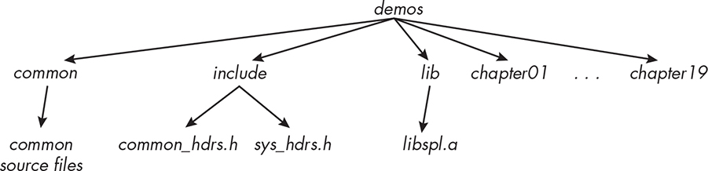
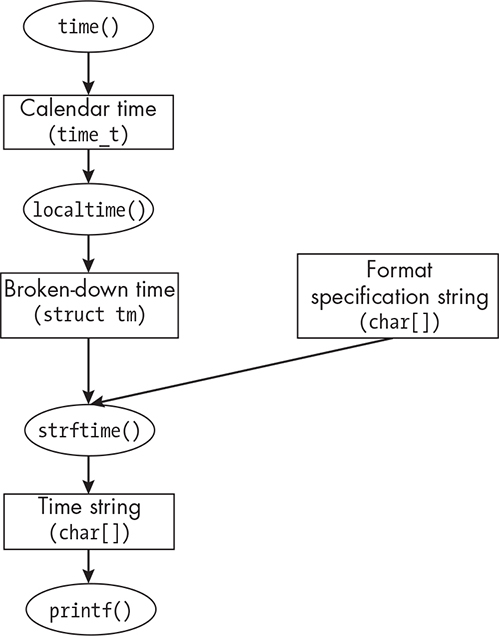
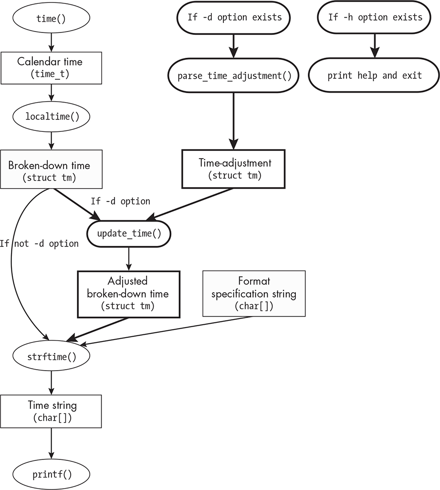

3 TIME, DATES, AND LOCALES

In this chapter, I introduce the paradigm we’ll employ to design and

implement system programs in the rest of this book. I’ll present the

common code used by the projects that we’ll develop and explain its

organization. We’ll also explore how Unix represents dates, times, and other information that depends on regional and cultural norms, such as character sets, monetary units, and numbers. Finally, I’ll explain the concept and implementation of locales and describe the steps needed to internationalize programs so that their interfaces conform to the

settings users choose for their locales.

Learning System Programming

Trying to learn all of the intricacies and details of the kernel API by reading through reference manuals and other documentation is not just

a painstaking task but an ineffective means for learning how to write

system programs. There are too many system calls and library functions to remember. My experience teaching computer science for roughly 40

years is that people often learn well by following examples and then

solving programming problems related to the examples, using them as

starting points for their code, and this is the paradigm I use here.

Rather than concentrating exclusively on the manuals and knowledge bases, you’ll learn the API little by little by writing programs that use it and exploring the documentation as needed to understand

how to use the relevant parts of the API. We’ll start with simple

programs and over time increase the complexity of the projects.

This method wouldn’t be possible if we were using a different

operating system. Linux, like several other Unix distributions, is an open source operating system. Not only can we see its source code, but

because of its licensing, we also can share it, redistribute it, and even modify it. For us, this means we’re not infringing on any copyright

when we share those sources here or elsewhere.

This strategy is not my own invention. In his book *Understanding*

*Unix/Linux Programming* \[27\], Bruce Molay uses a similar strategy for teaching system programming. Here, we’ll use the following procedure:

1\. Choose an existing command or program that interacts with the

kernel, such as a shell utility.

2\. Read the man page for that command to make sure we understand

what the command does and what system resources it uses.

3\. Using the man pages and other online information, investigate the

system calls and kernel data structures that we discovered it uses.

4\. Write a similar version of that command, not one that is identical, but one that adds, modifies, or removes features and that uses

those same system resources.

5\. After finishing the given exercise, evaluate how well we did,

identifying areas in which we could improve the program.

By repeating this procedure, we’ll gradually familiarize ourselves

with the relevant portions of the API as well as the resources needed to learn about it. Finding information in the man pages will become easier the more we do this, and with enough practice, we’ll be more

comfortable in tackling a more difficult and complex command. When

we first try to read the actual sources, we won’t understand much, but over time it will get easier and easier.

The content of the man pages may not be identical from one system to another, since it depends on factors such as which version of Unix

you’re using, which updates have been applied, and what third-party

software is installed. The man pages I present in this book are the latest versions at the time of this writing. Pages in Sections 2 through 7 are from the Linux man-pages Project, [*https://www.kernel.org/doc/man-*](https://www.kernel.org/doc/man-pages/)

[*pages/*.](https://www.kernel.org/doc/man-pages/) Pages in Sections 1 and 8 of the man pages are mostly from the GNU Project, [*https://www.gnu.org*](https://www.gnu.org/). When following along, compare the pages to which you have access to these, and make sure the programs

you write are based on the man pages for your specific system.

Organization of Common Code

As we develop the programs in this book, we’ll discover that certain

functions are common to multiple projects. For example, in many

projects, we’ll need functions to extract the numeric values of command line arguments, as well as functions to handle errors of various kinds.

Rather than implementing these functions in every project

independently, we’ll put their implementations into a single common

directory and put their prototypes into header files in another common directory. We’ll also create a static library containing all of the object modules for these shared functions and link that library to every

program that needs them.

The same holds true for definitions of various types and macro

constants that we might need. We’ll place macros that define the

maximum sizes of strings and other programming elements into a

header file named *common_hdrs.h*.

For the programs that we’ll create in this book, header files fall into one of two separate categories:

System-wide headers Those provided by the operating system

distribution

Local headers Those containing declarations specific to the book’s

projects

The source code repository that accompanies the book, at

[*https://github.com/stewartweiss/intro-linux-sys-prog*,](https://github.com/stewartweiss/intro-linux-sys-prog) has two top-level directories, named *include* and *lib*. The *include* directory contains header files, and *lib* contains libraries and object modules created for the book.

All system-wide header files that may be needed in more than one

project are included in the file *include/sys_hdrs.h*. The file

*include/common_hdrs.h* includes *sys_hdrs.h* as well as local headers, and therefore, by including *common_hdrs.h* in a project, we include the system header files as well as the ones we’ve created ourselves.

A fragment of *sys_hdrs.h* follows (the source distribution for the book contains the complete listing): \#include \<sys/types.h\> /\* Type

definitions used by many programs \*/ \#include \<stdlib.h\> /\* Prototypes of many C functions and macros \*/ \#include \<stdio.h\> /\* C standard I/O

library \*/ \#include \<string.h\> /\* String functions \*/ \#include \<limits.h\>

/\* System limit constants \*/ \#include \<unistd.h\> /\* Prototypes of most system calls \*/ \#include \<errno.h\> /\* errno and error constants and functions \*/

Listing 3-1 contains the complete *common_hdrs.h* header.

*common_hdrs.h*

\#ifndef COMMON_HDRS_H

\#define COMMON_HDRS_H

\#include "sys_hdrs.h"

/\* Non-system headers \*/

\#include "get_nums.h" /\* String to number conversions \*/ \#include

"error_exits.h" /\* Error-handling and exit functions \*/

/\* Define various constants and types used throughout the examples. \*/

\#define STRING_MAX 1024

\#define MAXLEN STRING_MAX /\* Maximum size of message string \*/

/\* Create a BOOL type. \*/

\#ifdef FALSE

\#undef FALSE

\#endif

\#ifdef TRUE

\#undef TRUE

\#endif

\#ifdef BOOL

\#undef BOOL

\#endif

typedef enum{FALSE, TRUE} BOOL;

/\* Definitions used by locale-related programs \*/

\#define FORMAT "%c" /\* Default format string \*/

\#define BAD_FORMAT_ERROR -1 /\* Error in format string \*/

\#define TIME_ADJUST_ERROR -2 /\* Error to return if parsing problem \*/

\#define LOCALE_ERROR -3 /\* Non-specific error from setlocale() \*/

/\* General errors \*/

\#define READ_ERROR -4 /\* Incomplete read of a file \*/

\#define MEM_ERROR -5 /\* Insufficient memory \*/

\#endif /\* COMMON_HDRS_H \*/

*Listing 3-1: The* common_hdrs.h *include file* The following lines are called a *header guard*:

\#ifndef COMMON_HDRS_H \#define COMMON_HDRS_H *--snip--* \#endif /\*

COMMON_HDRS_H \*/

See the “Header Guards” box if these are unfamiliar to you. Every

header file should have a header guard to prevent multiple-definition

errors.

HEADER GUARDS

Suppose that a file named *func.c* contains the directive \#include

"common.h". When the macro preprocessor cpp sees this directive, it copies the named file *common.h* into a copy of *func.c* at the point at which the \#include directive was found. Every included file is copied

into this temporary copy of the file that cpp is processing.

Suppose that a second header file, *mylist.h*, which contains the prototypes for functions in *mylist.c*, uses some functions declared in *common.h* (as well as other functions), and it therefore includes *common.h*. Finally, suppose that the main program, *main.c*, uses

functions declared in both *common.h* and *mylist.h*. Then *main.c* will contain these directives: \#include "common.h" \#include "mylist.h"

When you run the compiler to build the executable for *main.c*, cpp sees the \#include directive to copy *common.h* and will copy it into its temporary copy of *main.c*. It then sees the \#include "mylist.h"

directive and copies the file *mylist.h* after it. But this file also includes *common.h*, so any definitions in *common.h* will now appear twice in the copy of *main.c* that cpp passes to the compiler, which will cause the compiler to report definition errors.

A *header guard*, also called an *include guard*, is a conditional macro-based construction designed to prevent this.

By enclosing a header file, say one named *file.h*, in a conditional macro of the following form, we prevent the file from being

included twice: \#ifndef FILE_H \#define FILE_H *--snip--* \#endif

This is because the first line \#ifndef FILE_H has the meaning, “If the macro symbol FILE_H is not defined, continue reading and

processing code until the matching occurrence of \#endif.” In this

case, the line immediately after this conditional test, \#define FILE_H, causes cpp to store the definition of FILE_H.

On the other hand, if when \#ifndef FILE_H is executed, the symbol

FILE_H is defined, then cpp skips reading code until immediately

after the matching \#endif. This implies that any code enclosed in

the header guard will be included only once, and the multiple

definitions cannot occur.

Notice that the *common_hdrs.h* file in Listing 3-1 includes a header named *get_nums.h* as well as *error_exits.h*. In the following section, we discuss the first of these, and in “Common Error-Handling Functions”

on page 102, we discuss the second.

*Functions for Extracting Numbers*

The *get_nums.h* header declares prototypes and constants for functions that extract the numeric values of string data. (In Chapter 2, we saw how to use strtol() for this purpose.) The header contains prototypes for two functions based on the use of strtol() as well as associated constants that those functions use.

We create these functions because the error handling that should be

done after calling the library functions can be lengthy. Rather than

putting that error-handling code into every program that calls the

function, we can integrate it into separate functions, like wrapper

functions, making the calling programs smaller.

We name the two functions in that header get_long() and get_int().

Listing 3-2 shows the part of the header file containing the get_long() prototype and the defined constants.

\#ifndef GET_NUMS_H

\#define GET_NUMS_H

\#include "sys_hdrs.h"

➊ /\* Flags to pass to functions \*/

\#define NO_TRAILING 1 /\* Forbid trailing characters. \*/

\#define NON_NEG_ONLY 2 /\* Forbid negative numbers. \*/

\#define ONLY_DIGITS 4 /\* Forbid strings with no digits. \*/

\#define POS_ONLY 8 /\* Forbid zero and negative numbers. \*/

\#define PURE NO_TRAILING \| ONLY_DIGITS

➋ /\* Return codes \*/

\#define VALID_NUMBER 0 /\* Successful processing \*/

\#define FATAL_ERROR -1 /\* ERANGE or EINVAL returned by strtol() \*/

\#define TRAILING_CHARS_FOUND -2 /\* Characters found after number \*/

\#define OUT_OF_RANGE -3 /\* int requested but out of int range \*/

\#define NO_DIGITS_FOUND -4 /\* No digits in string \*/

\#define NEG_NUM_FOUND -5 /\* Negative number found but not allowed \*/

/\*\* get_long()

On successful processing, it returns VALID_NUMBER and stores the resulting number in \*value; otherwise, it returns one of the nonzero error codes

and puts a suitable message into \*msg. flags is used to decide whether trailing characters, negative values, and zeros for strings without any digits are allowed or should be errors.

\* @param char\* arg \[IN\] String to parse

\* @param int flags \[IN\] Flag specifying how to handle anomalies

\* @param long\* value \[OUT\] Returned long int

\* @param char\* msg \[OUT\] If not empty, error message

\* @return int VALID_NUMBER or a negative error code indicating the type of error

\*/

int get_long(char \*arg, int flags, long \*value, char \*msg);

*--snip--*

\#endif

*Listing 3-2: Portions of the* get_nums.h *header file* The get_long() function is designed to allow the caller to specify whether to accept certain types of strings, such as those with trailing nonnumeric characters, or to accept a zero when the string has no digit at all, or to report negative values. Its return value, if negative, indicates some type of anomaly or error ➋ . If there are no errors or anomalies, it returns VALID_NUMBER, which is defined as zero.

Callers can easily ignore the specific error codes or take different actions depending on which they are.

The prototype has four parameters. The first is the string to be

parsed. The second argument is an integer interpreted by the function

as a set of flags. The following list includes the four possible flags ➊ and their meanings:

**NO_TRAILING** Returns a TRAILING_CHARS_FOUND value for any string containing trailing nonnumeric characters, including those that have

no digits at all, returning the value of the digits it found

**NON_NEG_ONLY** Returns NEG_NUM_FOUND if the numeric value is negative **POS_ONLY** Returns NEG_NUM_FOUND if the numeric value is not positive **ONLY_DIGITS** Return NO_DIGITS_FOUND if the string has no digits and set

\*value to zero

Because they’re independent, they can be bitwise-ORed into a flag

to pass to the function, as in: int flag = 0; flag = flag \| NO_TRAILING

\| ONLY_DIGITS;

The third parameter is a pointer to a location that can store the long int on successful return.

The fourth argument is the location in which to store an error

message if things go wrong. Thus, if get_long() returns VALID_NUMBER, the number is in \*value. If it returns anything else, the error message that it constructs is in msg.

Because the definition of get_long() is lengthy, to conserve space, I

omit parts of it as well as comments in Listing 3-3 (the book’s source code repository provides the complete listing).

get_long()

@)int get_long(char \*arg, int flags, long \*value, char \*msg)

{

char \*endptr;

long val;

errno = 0;

val = strtol(arg, &endptr, 0);

if ( errno == ERANGE ) {

if ( msg != NULL )

sprintf(msg, "%s\n", strerror(errno));

return FATAL_ERROR;

} else if ( errno == EINVAL && val != 0 ) {

/\* Bad base; shouldn't happen \*/

if ( msg != NULL )

sprintf(msg, "%s\n", strerror(errno));

return FATAL_ERROR;

} if ( endptr == arg ) {

➊ if ( flags & (ONLY_DIGITS \| NO_TRAILING) ) {

if ( msg != NULL )

sprintf(msg, "No digits in the string\n");

return NO_DIGITS_FOUND;

}

else { /\* Accept a zero result. \*/

\*value = 0;

return VALID_NUMBER;

}

}

if ( \*endptr != '\0' ) { /\* Non-number characters follow the number. \*/

➋ if ( flags & NO_TRAILING ) {

if ( msg != NULL )

sprintf(msg, "Trailing characters follow the number:

\\%s\\\n", endptr);

return TRAILING_CHARS_FOUND;

}

}

*--snip--*

\*value = val;

return VALID_NUMBER;

}

*Listing 3-3: A partial listing of the* *get_long()* *function* The function uses sprintf() to construct the message string. We use it the way we would use printf(), except we give it a string parameter preceding the format string. Instead of printing to standard output, it prints to the string. In the various places where we might call sprintf(), we first check that this pointer is not NULL before attempting to pass it to sprintf().

After calling strtol(), it checks for the two possible error values that it might return. The ERANGE code implies a nonrecoverable error (number out of the range of long int), and EINVAL implies either that there were no digits or that the base was bad. Since we set base to 0, implying actual base-10 numbers, we shouldn’t get an EINVAL code unless there were no

digits, but to be safe, we check for this possibility. For either of these errors, the caller receives the FATAL_ERROR code.

If strtol() succeeded, we start the process of looking at the flags that the caller sent and deciding whether the returned value violates any of them. Checking the flags uses the bitwise-AND and bitwise-OR

operators ➊. For example, the expression flags & (ONLY_DIGITS \|

NO_TRAILING) bitwise-ANDs the bits of flags with the bitwise-OR of

ONLY_DIGITS and NO_TRAILING. The expression is true if and only if flags has one or both of these bits set. If NO_TRAILING is set but endptr is not at the end of the string ➋, it implies that there are trailing characters and that the caller wants to be informed about it, so the function returns

TRAILING_CHARS_FOUND. It returns VALID_NUMBER if the flag is not set because it

implies that the calling code doesn’t care whether there are trailing characters. Similar logic applies to the remaining flags, but that code is not shown.

The get_int() function, displayed in Listing 3-4, is much shorter, because it just calls get_long() and checks whether the number is within range for an integer using the system constants INT_MAX and INT_MIN.

get_int()

int get_int(char \*arg, int flags, int \*value, char \*msg)

{

long val;

int res = get_long(arg, flags, &val, msg);

if ( VALID_NUMBER == res ) {

if ( val \> INT_MAX \|\| val \< INT_MIN ) {

sprintf(msg, "%ld is out of range\n", val);

return OUT_OF_RANGE;

}

else {

\*value = val;

return VALID_NUMBER;

}

}

else { /\* get_long failed in one way or another. \*/

return res;

}

}

*Listing 3-4: A function to get the integer value of a string* Observe that get_int() doesn’t have to check for any errors other than the numbers being out of range. It just passes the other error codes from get_long() to its caller. What may not be obvious is that the message that get_long() constructs will also be passed to the caller if get_int() doesn’t overwrite it for a number that is out of range.

I wrote a couple of programs to call these functions (available in the source code), passing various flags to illustrate some of their error

handling. The following shows some of their runs: \$ **./test_get_long** **32kjk** \# With NO_TRAILING passed return:

TRAILING_CHARS_FOUND. message: Trailing characters follow

the number: "kjk" \$ **./test_get_long 32kjk** \# Without NO_TRAILING passed return: VALID_NUMBER \$

**./test_get_long sdfskjk** \# With ONLY_DIGITS passed return:

NO_DIGITS_FOUND message: No digits in the string \$

**./test_get_int -28734898798798798798879879** return:

FATAL_ERROR message: Numerical result out of range

In the first run, I passed the NO_TRAILING flag, and it reported seeing nondigit characters attached to the number. In the second run, I gave it the same input but without that flag, and it silently accepted the number without error. In the third run, I gave it a string with no digits and passed the ONLY_DIGITS flag, and it rejected the input, identifying the error.

The last run was to show that it would successfully handle inputs that are too large and out of range.

*Common Error-Handling Functions*

All of the projects in this book share a few error handling functions, whose declarations are consolidated into a header file named

*error_exits.h* in the *include* top-level directory. Having a few common error-handling functions simplifies the programs and reduces redundant code. Listing 3-5 shows the header file.

*error_exits.h*

\#ifndef ERROR_EXITS_H

\#define ERROR_EXITS_H

\#include "sys_hdrs.h"

/\*\* error_message()

This prints an error message associated with errnum on standard error

if errnum \> 0. If errnum \<= 0, it prints the msg passed to it.

It does not terminate the calling program.

This is used when there is a way to recover from the error. \*/

void error_mssge(int errornum, const char \*msg);

/\*\* fatal_error()

This prints an error message associated with errnum on standard error

before terminating the calling program, if errnum \> 0.

If errnum \<= 0, it prints the msg passed to it.

fatal_error() should be called for a nonrecoverable error. \*/

void fatal_error(int errornum, const char \*msg);

/\*\* usage_error()

This prints a usage error message on standard error, advising the

user of the correct way to call the program. \*/

void usage_error(const char \*msg);

\#endif /\* ERROR_EXITS_H \*/

*Listing 3-5: The header file with declarations of common error-handling functions* The error_message() function expects a number and a string. If the number is positive, it is an errno value and it uses strerror() to format a string describing that error and prints that string to standard error. If the number is not positive, it prints the string passed into it instead.

The fatal_error() function is the same as error_message() except that it terminates the program after printing the message, calling exit() with the system-defined EXIT_FAILURE number as its argument. The usage_error() function prints a usage message on standard error and terminates the

program. Listing 3-6 provides their implementations.

*error_exits.c*

void error_mssge(int errornum, const char \*msg)

{

if ( errornum \> 0 ) /\* An errno value \*/

fprintf(stderr, "%s\n", strerror(errornum));

else /\* Project-defined error number - ignore and just print msg \*/

fprintf(stderr, "%s\n", msg);

}

void fatal_error(int errornum, const char \*msg)

{

error_mssge(errornum, msg);

exit(EXIT_FAILURE);

}

void usage_error(const char \*msg)

{

fprintf(stderr,"usage: %s\n", msg);

exit(EXIT_FAILURE);

}

*Listing 3-6: Three error handling functions* Although the fatal_error() and usage() functions look similar, it’s convenient to have a separate function for displaying a message specifically when the user ran the program incorrectly.

*File Organization*

The numeric parsing and error-handling functions just described are

used by almost all programs in this book. To facilitate using them, I

place their source code into a single top-level directory named *common* at the same level as the *include* and *lib* directories. Each chapter has a directory at this same level, containing the sources for all programs

referenced in the chapter. The *lib* directory contains a static library named *libspl.a* that contains all common object files from the *common* directory. This directory structure is depicted in Figure 3-1.

*Figure 3-1: The structure of the demo program directories with common code* To create the *libspl.a* library, I use the GNU ar command. Appendix

A contains an explanation of this command and detailed instructions for how to create static and shared libraries in general.

Planning Our First System Program

The first program we’ll write is a warm-up exercise, one that won’t require much background knowledge. Its purpose is to show how we’ll

go through the steps described previously. We’ll write a command that

displays the current date and/or time in various formats. We know the

operating system maintains this information somewhere, because lots of applications display the date and time.

This exercise also has a few side benefits. You’ll learn how Unix

represents and processes dates and times. You’ll learn the various

components of the API related to time and date, and when we’re

finished, we’ll have a few utility functions that’ll be useful in later projects.

The first step is to check whether a command like this already exists

and try to mimic its behavior. We can search the man pages to find such a command using apropos. The most obvious keywords to try first would

be *date* and *time*. Since we’re searching for commands, we limit the search to Section 1, first trying to match the keyword *date*, as follows: \$

**apropos -s1 date** aa-features-abi (1) - Extract, validate and manipulate AppArmor feature abis apport-bug (1) - file a bug report using Apport, or update an existin. . apport-collect (1) - file a bug report using Apport, or update an existin. . autoreconf (1) - Update generated configuration files autoupdate (1) - Update a configure.ac to a newer Autoconf *--*

*snip--*

On my system, 64 lines of output were displayed, but I’m showing only

the first five lines. Several of these lines are descriptions of commands that have nothing to do with dates or times. Why is this? Remember

that keyword searches in their simplest form display any short

descriptions that contain the keyword, even as a substring.

We need to request an exact match instead: \$ **apropos -s1 -e date**

cal (1) - displays a calendar and the date of Easter date (1) - print or set the system date and time date (1posix) - write the date and time hp-timedate (1) - Time/Date Utility idevicedate (1) - Display the current date or set it on a device. mate-time-admin (1) - set date and time ncal (1) - displays a calendar and the date of Easter timedatectl (1) - Control the system time and date

From this short list, we can see that there are two man pages for a command named date, one in Section 1 and the other in Section 1posix.

Here’s part of the man page for date in Section 1posix:

DATE(1POSIX) POSIX Programmer's Manual DATE(1POSIX)

PROLOG This manual page is part of the POSIX Programmer's

Manual. The Linux implementation of this interface may differ (consult the corresponding Linux manual page for details of Linux behavior), or the interface may not be implemented on Linux. NAME date - write

the date and time SYNOPSIS date \[-u\] \[+format\] date \[-u\]

mmddhhmm\[\[cc\]yy\] *--snip--*

This page describes what a POSIX-conforming version of the date

command should do; it’s a specification. It warns us that it isn’t

necessarily a description of the command that actually runs on our

Linux system.

Let’s look at the page in Section 1. That page begins as follows:

DATE(1) User Commands DATE(1) NAME date - print or set the

system date and time SYNOPSIS date \[OPTION\]. . \[+FORMAT\] date

\[-u\|--utc\|--universal\] \[MMDDhhmm\[\[CC\]YY\]\[.ss\]\] *--snip--*

This version has more options. If we were running a version

conforming to POSIX, several options wouldn’t be available.

To start, we’ll just run the command without options to see its

output: \$ **date** Wed Mar 26 02:54:17 PM EDT 2025

This output raises a few questions:

It displays not just the current date, but the time of day and the day of the week. How does it know what day of the week it is?

It outputs the string EST, which is short for “Eastern Standard

Time.” This implies that the system stores time zone information

and that there’s some way to determine in which time zone we’re

running. How can we find that information?

How does it retrieve the current time? Is this a system call?

How does date choose the format of date/time to print?

The rest of the Section 1 man page shows that the command has several useful options that aren’t available in POSIX. If we try a few, we’ll see that we’re running the Linux version of the command: \$ **date**

**-d 'next Thu'** \# Note that we can put space between -d and its

argument Thu Mar 27 12:00:00 AM EDT 2025 \$ **date -d'next**

**month'** Sat Apr 26 02:55:05 PM EDT 2025 \$ **date -d"2038-01-19**

**03:14:07 UTC"** \# Time of end of Unix Epoch Mon Jan 18 10:14:07 PM

EST 2038 \$ **date -d'5 years ago'** Thu Mar 26 02:56:13 PM EDT

2020

The -d option lets us request that date print dates other than the

current one, which is a useful feature, and it even allows expressions such as *five years ago* and *next Thursday*. This option is not detailed much in the man page. Instead, its author wrote the following note there:

“The date string format is more complex than is easily documented here but is fully described in the info documentation.”

More important for us right now is that it has options for

controlling the format of the output date/time string. We can change

the format by supplying an option of the form +" *FORMAT*", where *FORMAT* is a string that contains ordinary character sequences as well as character sequences called *format specifications*, each of which is introduced by a %

character and followed by a second character called a *format specifier* *character*. Each format specification defines one or more pieces of date or time information formatted in a particular way. For example, %m is

replaced on output by a two-digit month number, such as 04.

The ordinary character sequences in *FORMAT* (called *literals*) are output exactly as they’re written in the string. For example, the format "The month is %m" is output as "The month is 04" if the current month is April.

Some common format specifiers are %a, which is replaced by the

three-letter weekday name, such as Sun for Sunday; %b, which is replaced by the three-letter month name, such as Dec for December; and %D, which is replaced by a date in the form *mm*/ *dd*/ *yyyy*, such as 01/01/1972. Appendix C

contains a comprehensive list of specifiers with examples.

Here are a few examples of output when the date is the end of the

Unix Epoch, January 19, 2038, at 03:14:07 UTC: \$ **date +"%A, %D"** \#

Full day name, literal comma, and American date Monday, 01/18/38 \$

**date** \# Default format Mon Jan 18 10:14:07 PM EST 2038 \$ **date**

**+"%c"** \# Locale's date and time Mon 18 Jan 2038 10:14:07 PM EST \$

**date +"It is %A at %R."** \# Full day name, 24-hour time It is Monday at 22:14.

Notice that the format string contains a mix of format specifiers and

literals. The literals are displayed uninterpreted, where they appear

relative to the format specifiers. The %c format specifier is called the *locale’s date and time* in the documentation.

Several of the format specifiers refer to the user’s locale in their

descriptions. For example, the %a and %A are the locale’s abbreviated and full weekday names, respectively. In the United States, these are names such as Sun and Sunday, respectively, but we have yet to see what they would be if we could choose a different locale. We’ll see how to do this in “Working with Locales” on page 128.

The man page for date doesn’t specify what its default format is. We

can see what it looks like, and we know that it’s the locale’s format, but we don’t know why it’s in that form. However, the SEE ALSO section tells us that the full documentation is available in two places: the Info

documentation and on the GNU website

( [*https://www.gnu.org/software/coreutils/date*)](https://www.gnu.org/software/coreutils/date). Both sources state that

“invoking date with no *format* argument is equivalent to invoking it with a default format that depends on the LC_TIME locale category.” In the

default C locale, this format is +"\\a \\b \\e \\H:\\M:\\S \\Z \\Y", so the output looks like Thu Mar 3 13:47:51 PST 2005. Clearly, we need to know more about locales to understand this explanation, but for now we’ll

focus on writing some simple programs that behave like date, and we’ll explore locales later in this chapter.

Our first goal is to write a much simpler version of the date

command without any of its command line options to reproduce its

default behavior. Once we do that, we’ll add the ability to customize the output format using format specifiers, and after that we’ll see how to make a version of it that’s sensitive to locale settings. We’ll name the first version of the command spl_date1 and name the program’s source

code file *spl_date1.c*.

Designing the First Version of spl_date

For spl_date1, we’ll follow this program logic:

1\. Get the current time.

2\. Format the time in the default form of the date command, storing

it into a string.

3\. Print the string on standard output.

The first two steps imply that we need to understand how time is

represented in Unix and find ways to change its representation to

different kinds of human-readable forms.

Whenever you embark on a new project, it’s a good idea to search

for help in Section 7 of the man pages. Section 7 contains overviews of various topics. It might have an overview on the topic of interest, in this case, time. If so, it will contain background concepts and possibly

references to functions that you might need.

To check whether Section 7 has a page that might help, enter the

command **apropos -s7 -e time**. It returns, among others, the following pages: RESET (7) - restore the value of a run-time parameter to the

def. . SET (7) - change a run-time parameter bootparam (7) -

introduction to boot time parameters of the Linux ke. . SHOW (7) -

show the value of a run-time parameter sys_time.h (7posix) - time types systemd.time (7) - Time and date specifications time (7) - overview of time and timers time.h (7posix) - time types time_namespaces (7) -

overview of Linux time namespaces

Of these, the time (7) man page looks like the best starting point. It summarizes what we need to understand about time in Unix and Linux.

*About Calendar Time in Unix*

The man page explains that Unix has two types of time: process time

and real time. *Process time* is the time a process spends in the CPU

(Chapter 4 covers how to obtain process time). *Real time* is elapsed time measured from some reference point. When that reference point is not

fixed, real time is called *elapsed time*. *Timers* are objects in Unix that can

be set and used to keep track of elapsed time. They’re important, and we’ll revisit them in later chapters, but they’re not what we want right now.

*Calendar time* is real time with respect to a particular fixed time point called the Epoch. The *Epoch* is defined as January 1, 1970, at 00:00:00

UTC. It’s approximately when the first Unix system was released. UTC

is short for “Coordinated Universal Time,” which used to be called

Greenwich Mean Time. The initialism is correct; the order of the

letters was a compromise by the international advisory group that

created it. See the NIST.gov website for an explanation

( [*https://www.nist.gov/pml/time-and-frequency-division/how-utcnist-related-*](https://www.nist.gov/pml/time-and-frequency-division/how-utcnist-related-coordinated-universal-time-utc-international)

[*coordinated-universal-time-utc-international*)](https://www.nist.gov/pml/time-and-frequency-division/how-utcnist-related-coordinated-universal-time-utc-international). Since its inception, in Unix, calendar time has been measured as the number of seconds elapsed

since the Epoch.

*Broken-Down Time*

The time (7) man page also mentions a type of time representation

called *broken-down time*, which is a time representation that’s broken down into various commonly used components. As Robert Grudin put

it in *Time and the Art of Living* \[[11\]](index_split_014.html#p1237):

Our units of temporal measurement, from seconds on up to months, are so complicated, asymmetrical and disjunctive so as to make coherent mental reckoning in time all but impossible. . . . It is as though architects had to measure length in feet, width in meters and height in ells; as though basic instruction manuals demanded a knowledge of five different languages.

We measure time in years, months, weeks, days, hours, minutes, and

seconds, but we also use days of the week, days of the month, months of the year, and so on. These units have little consistency, other than the number of seconds in a minute and minutes in an hour being the same.

A broken-down time structure consolidates all of this information

into a single data structure, called a struct tm, which is used by several functions that convert time and date formats from one form to another.

The man page mentions some of them and suggests looking at the

ctime() man page. If we look at that page, we see that asctime(), ctime(),

gmtime(), localtime(), mktime(), strftime(), and strptime(), as well as various thread-safe versions of these, are all time-conversion functions.

We’ll examine these functions in “Time Conversion Functions” on

page 112 to decide which we should use, but first we’ll examine the struct tm data structure, which is defined in the *time.h* header file as follows: struct tm { int tm_sec; /\* Seconds (0-60) \*/ int tm_min; /\*

Minutes (0-59) \*/ int tm_hour; /\* Hours (0-23) \*/ int tm_mday; /\* Day

of the month (1-31) \*/ int tm_mon; /\* Month (0-11) \*/ int tm_year; /\*

Year - 1900 \*/ int tm_wday; /\* Day of the week (0-6, Sunday = 0) \*/ int tm_yday; /\* Day in the year (0-365, 1 Jan = 0) \*/ int tm_isdst; /\*

Daylight saving time \*/ };

The fields have their expected meanings, but there are two details to

note:

The tm_sec field stores the number of seconds after the minute,

which is normally in the range 0 to 59, but it can be up to 60 to

allow for leap seconds.

The tm_isdst field is a flag that indicates whether daylight saving

time is in effect at the time described. The value is positive if

daylight saving time is in effect, zero if it is not, and negative if the information is not available.

Now that we know that functions exist to convert formats and that

they use this broken-down time structure, we can turn to the question

of how to get the current time.

*Calendar Time System Calls*

The time (7) man page suggests two different system calls for obtaining the calendar time: clock_gettime() and time(). From the man page for

clock_gettime(), we learn the following.

The general-purpose clock_gettime() function provides the time of a

specified clock. Its synopsis is: \#include \<time.h\> int

clock_gettime(clockid_t clockid, struct timespec \*tp);

The function is given the ID of a clock and a pointer to a timespec

struct, in which, on return, it stores the time on that clock,

measured in nanoseconds.

The predefined constant CLOCK_REALTIME of type clockid_t is the ID of

the clock that keeps track of calendar time. The timespec struct is

defined in *time.h* as: struct timespec { time_t tv_sec; /\* Seconds \*/

long tv_nsec; /\* Nanoseconds \*/ };

The time_t type is a signed integer type whose size is

implementation dependent but is at least 32 bits.

To make sure the function is exposed in the header files, there is a

feature test macro requirement: \_POSIX_C_SOURCE \>=

199309L

This implies that we need to set \_POSIX_C_SOURCE to that value or

higher before including any header files.

The man page also states that on POSIX systems on which this

function is available, the symbol \_POSIX_TIMERS is defined in *unistd.h* to a positive value. If we want to design a program to choose a

different method of getting calendar time in case this function is

not available, we would insert conditional code of the following

form: \#if \_POSIX_TIMERS \> 0 /\* Use clock_gettime() to get time.

\*/ \#else /\* Use some other function such as time(). \*/ \#endif

In the SEE ALSO section, it suggests a few pages that we should read:

gettimeofday() and time(), both in Section 2. We should also read the

man page for *time.h*.

The time() system call is much simpler to use and understand. Its

man page tells us the following:

time() returns the number of seconds since the Epoch.

Its synopsis is: \#include \<time.h\> time_t time(time_t \*tloc);

The argument is a pointer to an integer of type time_t, but it’s

allowed to be NULL because its return value is also the current time.

When tloc is NULL the function cannot fail, obviating the need for

error handling.

Before we decide which of these two functions to use, we look at the man page for the gettimeofday() function suggested in the SEE ALSO section.

Its synopsis is \#include \<sys/time.h\> int gettimeofday(struct timeval \*tv, struct timezone \*tz);

where the tv argument is a pointer to timeval struct defined in

*\<sys/time.h\>* as follows: struct timeval { time_t tv_sec; /\* Seconds \*/

suseconds_t tv_usec; /\* Microseconds \*/ };

On return, this stores the number of seconds and microseconds since

the Epoch. The timezone struct pointer tz should always be set to NULL

because it has been *deprecated*.

WARNING

*Whenever you see a feature marked as deprecated in documentation,* *avoid using it. If the organization that supports the software has* *deprecated it, that means it wil no longer support it and it wil become* *obsolete.*

In fact, the CONFORMING TO section notes that the function itself has been marked as obsolete since POSIX.1-2008, and it recommends using

clock_gettime() instead.

The choice is thus reduced to clock_gettime() and time(). The

difference is in how the returned time is represented and its granularity.

Since the tv_sec field of the struct timespec returned by clock_gettime() is the number of seconds since the Epoch, it should be the same as the

value returned by time(). For our program, we don’t need subsecond

granularity, so there’s little benefit to using clock_gettime(). On the other hand, it’s a more adaptable function.

Another factor to consider is performance. To check whether there

is a price to pay for obtaining the finer resolution of the timespec

structure, I wrote two programs that called each function 10 million

times and measured their elapsed times when run on my x86-64 system

running Linux 5.15.0. The program that called time() required 0.032

seconds, whereas the one running clock_gettime() required 0.171 seconds.

Repeated runs had similar results. Taking everything into consideration,

we’ll choose time() for getting the current time in this first version of our program.

*Time Conversion Functions*

The functions asctime(), ctime(), gmtime(), localtime(), and mktime() are all described on the same man page. Entering **man ctime** will display it.

Here’s the relevant portion of that page, with some lines removed:

\#include \<time.h\> char \*asctime(const struct tm \*tm); char \*ctime(const time_t \*timep); struct tm \*gmtime(const time_t \*timep); struct tm

\*localtime(const time_t \*timep); time_t mktime(struct tm \*tm);

We observe that:

asctime() is given a broken-down time struct and returns a string.

ctime() is given a time_t value and returns a string.

gmtime() and localtime() are each given a time_t value and return a

pointer to a broken-down time struct.

mktime() is given a broken-down time struct and returns a time_t

value.

None of these functions require time resolution smaller than

seconds, reinforcing our decision to use time() instead of

clock_gettime() to get the current time.

This shows that we need to use either asctime() or ctime() to create a formatted time string, but if we use asctime() we need to convert from calendar time to the broken-down time first. Reading the DESCRIPTION

section reveals that the difference between gmtime() and localtime() is that gmtime() converts its time_t argument to broken-down time expressed in UTC, whereas localtime() converts its time_t argument to broken-down

time expressed relative to the user’s specified time zone. We’ll have

more to say about time zones in “About Time Zones” on page 131.

The CONFORMING TO section of that page, however, states that both

asctime() and ctime() are marked as obsolete and that strftime() should be used in their place, ruling them out. Reading the man page for strftime(), we learn that it’s a much more powerful function than either of them: \$

**man strftime** *--snip--* SYNOPSIS \#include \<time.h\> size_t strftime(char \*s, size_t max, const char \*format, const struct tm \*tm); DESCRIPTION The strftime() function formats the broken-down

time tm according to the format specification format and places the

result in the character array s of size max. *--snip--*

The rest of its description tells us that strftime() lets us customize the output date and time string by using a *format specification*, which is its third parameter. In fact, the set of format specifiers is almost identical to those used by the date command, making our job fairly easy.

As a start, to approximate the default format of date, we can use %c.

(Although the man page states that there’s a format specification %+ that produces a string in the exact same format as the date command, it isn’t supported in *glibc* version 2.) Thus, to obtain a string in roughly the same format as date such as Fri 09 May 2025 12:34:10 PM EDT

we’ll pass the format specification %c to strftime().

We can put together the *spl_date1.c* program based on what we’ve learned. Figure 3-2 displays the program logic.

*Figure 3-2: The program flow of* spl_date1.c

We use time() to get the current time in calendar time units and pass

that return value to localtime(), which constructs a broken-down time

object. We pass that in turn to strftime() in addition to the format

specification %c, stored in a variable. Finally, we print out the string produced by strftime(). The resulting program, *spl_date1.c*, is displayed in

Listing 3-7 with some comments omitted to save space.

*spl_date1.c*

\#define \_GNU_SOURCE

\#include "common_hdrs.h"

int main(int argc, char \*argv\[\])

{

char formatted_date\[200\];

time_t current_time;

struct tm \*broken_down_time;

char format_str\[MAXLEN\];

strcpy(format_str, "%c");

current_time = time(NULL); /\* Get the current time. \*/

/\* Convert current time into broken-down time. \*/

if ( (broken_down_time = localtime(&current_time)) == NULL )

fatal_error(EOVERFLOW, "localtime");

/\* Create a string from the broken down time using the %c format. \*/

if ( 0 == strftime(formatted_date, sizeof(formatted_date),

➊ format_str, broken_down_time) ) {

fatal_error(EXIT_FAILURE, "Conversion to a date-time string"

" failed or produced an empty string\n");

}

printf("%s\n", formatted_date);

return 0;

}

*Listing 3-7: The first version of the* *spl_date* *program* Rather than hardcoding the %c format specifier ➊ directly into the call to strftime(), we store it in a string variable named format_str of length MAXLEN (defined in *common_hdrs.h*) that we pass to the function. This makes it easier to change the program in the next version.

Designing a Second Version of spl_date

We’ll now improve *spl_date1.c* by allowing the user to enter different date formats on the command line. For example, it would be useful if we

could enter commands such as the following: \$ **./spl_date +"Today is**

**%A. Current time: %R"** Today is Sunday. Current time: 13:45

In this way, different users could see the time in their format of choice.

To accomplish this, we have to make only a small change to the

program. Specifically, we need to check whether the command has an

argument, and if so, whether it starts with a + and is small enough to fit into format_str. If so, we can pass the string following the + to strftime(). If that string isn’t a valid format string, strftime() will return an error that we can report. Otherwise, we print the string that it produces. If there’s no argument to the program, we just print the current time in the

default format.

We can incorporate this logic into a function named getformat(),

which is passed a pointer to the command line and extracts the format

string from it: getformat() void getformat(int nargs, char \*argvec\[\], char

\*format_str) { char err_msg\[MAXLEN\]; /\* For error messages \*/ if (

argvec\[nargs-1\]\[0\] == '+' ) /\* Argument starts with + \*/ if (

strlen(argvec\[nargs-1\] + 1 ) \< MAXLEN ) strncpy(format_str,

argvec\[nargs-1\] + 1, MAXLEN - 1); else { sprintf(err_msg, "Format string length is too long\n"); fatal_error(BAD_FORMAT_ERROR,

err_msg); } else { sprintf(err_msg,"%s: Format should be +\\format-string\\\n", basename(argvec\[0\]));

fatal_error(BAD_FORMAT_ERROR, err_msg); } }

The function expects its first parameter nargs to be passed argc; this way, argvec\[nargs-1\] is the last word on the command line.

We add this function to the program, which we’ll name *spl_date2.c*.

We’ll call it immediately before the call to time() (see Listing 3-8). No other changes are needed. The complete program is in the source code

distribution for the book.

*--snip--*

int main(int argc, char \*argv\[\])

{

char formatted_date\[MAXLEN\];

time_t current_time;

struct tm \*broken_down_time;

char format_string\[MAXLEN\];

if ( argc \< 2 )

strcpy(format_string, "%c");

else

getformat(argc, argv, format_string);

current_time = time(NULL); /\* Get the current time. \*/

*--snip--*

if ( 0 == strftime(formatted_date, sizeof(formatted_date),

format_string, broken_down_time) ) {

fatal_error(BAD_FORMAT_ERROR, "Conversion to a date-time string"

" failed or produced an empty string\n"); }

printf("%s\n", formatted_date);

return 0;

}

*Listing 3-8: A partial listing of the second version of* *spl_date, allowing an optional user-supplied format string argument* Following are a few runs of this program that show how it handles some possible errors and produces the expected output: \$ **./spl_date2** Wed Mar 26

15:07:25 2025 \$ **./spl_date2 today** spl_date2: format should be +"format-string" \$

**./spl_date2 +"Today is day %e of %B. It is now %r"** Today is day 26 of March. It is now 03:08:49 PM \$ **./spl_date2 +"a very long string, longer than 1024 characters..."**

spl_date2: format string length is too long

The last run is given a format string whose length exceeds the size of the buffer that the program uses to show how it handles this error. You can see that it detects it and exits without crashing.

Designing a Third Version of spl_date

The preceding program wasn’t too hard to develop, but it prepared us

to go one step further and add the ability to display dates in the past and future by allowing the user to specify lengths of time to add to or

subtract from the current time. This program will be a bit more

challenging to write.

*The User Interface*

First, we need to decide how the user should call the program. Then

we’ll write a precise specification against which we can test our

implementation. Since the ability to add an amount of time is optional, the program should have a command line option with a required

argument that specifies the amount of time to add or subtract to the

current time. We’ll call the amount of time that we want to add or

subtract the *time-adjustment*, and we’ll use the option character -d (for *difference*).

We should also get into the habit of providing a help feature for

every nontrivial program we write. The Unix convention is to give

commands an -h option that displays their usage information. If that

option is present, the convention is to ignore all other words on the

command line.

To summarize, our program’s synopsis should be of the form \$

**spl_date3 \[-h\] \| \[-d " *time-adjustment*"\] \[+" *format-***

***specification*****"\]**

where the *time-adjustment* argument to -d is a string that we need to define, and the *format-specification* is the same as it was in spl_date2.

Time Adjustment Specifications

When we write amounts of time in noncomputer contexts, we

understand that the expressions “1 month, 8 days,” “one month and

eight days,” and “one month, eight days” are equivalent amounts of

time. If we allowed users to enter amounts of time with that degree of flexibility, we’d be making the task of parsing the input much harder

than if we limited the form of the input to something simpler. It

amounts to a trade-off between what’s easy for the user and what’s easy for the programmer. Since we’re not trying to write production software yet, we need a compromise that provides a convenient interface for the user and a relatively easy syntax to parse.

My compromise is to allow the user to enter time differences in the

customary units we use, specifically, years, months, weeks, days, hours, minutes, and seconds, but not to enter phrases such as “next Monday”

or “last month,” which would add more parsing to the program.

To make the parsing easier, we’ll require the user to enter numerals

rather than words for the amounts. For example, the program should

accept a phrase such as “2 years 3 weeks” but not “two years three weeks” or “two years, three weeks.”

Also, we’ll give users the ability to enter times in the past by

allowing negative numbers for the time quantities, so we’ll accept a

phrase such as “–4 hours 5 minutes,” which could also be entered as “–3

hours –55 minutes.” Note that a negative number applies only to the

time unit next to it—“–4 hours 5 minutes” is not “–(4 hours 5 minutes).”

To simplify the program, we’ll forbid fractional amounts, such as

“3.5 days,” but we’ll allow users to enter the same unit multiple times.

For example, they could enter a time adjustment such as: 1 year 4

months -2 days -3 weeks +1 day

The way that I’ve formulated this, commas between the units are not

allowed.

I’ll write a specification of the time adjustment using the following

grammar, which uses the same syntax as the man page synopsis: time-

adjustment = \<num\> \<time-unit\> \[\<num\> \<time-unit\> . . \] num = \[+\|-\]

\<integer\> time-unit = **year\[s\] month\[s\] week\[s\] day\[s\] hour\[s\]**

**minute\[s\] second\[s\]** integer = \[1-9\]\[0-9\]. .

Notice that the time units can have an optional s on the end, numbers

can start with an optional + or -, and they cannot start with leading

zeros. If they use a leading zero, the number will be interpreted as an octal number.

Here are some examples: \$ **./spl_date3 -d "1 year 2 months"** \$

**./spl_date3 -d " +1 year 2 months" +"%D %r"** \$ **./spl_date3 -d**

**" 3 weeks 5 days 4 hours 30 minutes" +"%D %r"** \$ **./spl_date3 -**

**d" -5 months -3 days" +"%D"**

The first shows the date one year and two months from today in the

default format. The next shows the same date but in a different format of the form “*mm*/ *dd*/ *yyyy hh*: *mm*: *ss AM*\| *PM*.” The third shows the date that is three weeks, five days, four hours, and 30 minutes from the

current time using the same format as the preceding example. The last

shows a date five months and three days earlier, using the default

format.

Fuzzy Time

The last consideration before we start to map out the program logic

concerns the fuzziness of months and years as units of time. The

number of days in a month depends on the month, and the number of

days in a year changes for leap years. If we subtract one month from

July 31 what is the date? Since there is no June 31, is it June 30?

If you read the Info page for the date command, you’ll see that its

implementation uses the rule that adding (or subtracting) a month

increments (or decrements) the month number, and if the date doesn’t

exist in that month, it’s adjusted to the nearest date that’s valid.

We can test how the real date adjusts these dates using its --date=

option: \$ **date --date='Dec 29, 2024 +2 months'** Sat Mar 1 12:00:00

AM EST 2025 \# Because Feb 29 does not exist, date makes it one day

after Feb 28, \# which is Mar 1. \$ **date --date='Dec 30, 2024 +2**

**months'** Thu Mar 2 12:00:00 AM EST 2025 \# Because Feb 30 does not exist, date makes it two days after Feb 28, \# which is Mar 2. \$ **date --**

**date='Mar 30, 2025 -1 month'** Sun Mar 2 12:00:00 AM EST 2025 \#

date uses the same idea as before. It does not matter whether it got the \#

day by adding or subtracting. \$ **date --date='Dec 30, 2023 +2**

**months'** Fri Mar 1 12:00:00 AM EST 2024 \# date knows that 2024 is a leap year, so it makes it one day past Feb 29.

For consistency, our program should use this same date calculation

logic, but that raises the question: Is there a library function that does this calculation, or do we have to implement it ourselves?

If we return to the man page for ctime(), we’ll see that it has relevant information about the mktime() function:

The mktime() function modifies the fields of the tm structure as follows: tm_wday and tm_yday are set to values determined from the contents of the other fields; if structure members are outside their valid interval, they will be normalized (so that, for example, 40 October is changed into 9 November); tm_isdst is set (regardless of its initial value) to a positive value or to 0, respectively, to indicate whether DST is or is not in effect at the specified time.

In short, mktime() encapsulates the corrections for invalid dates and times used in the date command, saving us from having to implement this

logic ourselves. Therefore, we can add time adjustments to a broken-

down time structure bd_time and call mktime(bd_time) to have mktime() normalize the time for us.

*Program Logic*

How this version of spl_date differs from the preceding one will guide the changes in the program logic. The first step is to list the changes: We have to add option parsing.

We have to parse the time adjustment, if it’s present, into the

numbers of seconds, minutes, hours, and so on, that need to be

added (or subtracted) from the current time.

We need to add the time adjustment to the current time and

display the resulting time.

We can incorporate these differences into the program’s control flow,

ignoring error handling for the moment, in the following sequence of

steps:

1\. Parse the command line, checking whether the -d or -h option is

present.

2\. If -h is present, ignore all other arguments and options, print out help information, and exit.

3\. Otherwise, if -d is present, allocate memory to store its argument

and copy the argument into that memory.

4\. If there is a format specification, copy it into a string of sufficient size.

5\. Obtain and store the current time into a time_t variable using time().

6\. Convert the current time into a broken-down time representation

using localtime().

7\. If -d is present, parse the argument, creating a temporary broken-

down time structure that stores the time to add to the current time

in terms of years, months, days, and so on, and add the value of the

temporary structure to the broken-down current time.

8. Use the strftime() function to format the output string representation of the broken-down time.

9\. Print the formatted string using printf().

Figure 3-3 shows the control flow with the new logic in bold.

*Figure 3-3: The control flow of* spl_date3.c

We can now prototype and design the function that parses the time-

adjustment string. Since the function should receive a time-adjustment string as its input and create a broken-down time representation of that string as its output, a reasonable prototype for it is the following: int parse_time_adjustment( /\* IN \*/ char \*datestring, /\* OUT \*/ struct tm

\*datetm );

Following convention, the return value is an indication of success or

failure, and the broken-down time structure is a result parameter.

Given the string time_adjust_string passed to the program following

the -d option and the address of a broken-down time structure, parse_time \_adjustment() parses the string and sets the individual members of the structure accordingly. For example, if the time_adjust_string is 2 years 4

months 12 days -6 hours -2 days

it should set the structure’s members as follows: datetm-\>tm_year = 2

datetm-\>tm_mon = 4 datetm-\>tm_mday = 10 datetm-\>tm_hour = -6 *--*

*snip--* /\* All other members set to zero \*/

In principle, we can design this code from scratch and parse the

string without any need to call a library function, reading each character from left to right, processing them as needed. For example, we could

skip whitespace, build numbers when we see a plus or minus sign or a

digit, and build time-unit strings when the characters are alphabetic.

Processing this way makes one pass over the string and is the fastest

possible approach. However, we need to process only the command line,

not thousands of large strings, implying that the amount of time we’ll save with this approach is imperceptible. It would be far better to take

advantage of existing library functions that have been well tested, even if we end up making two passes across the string.

PERFORMANCE AND DESIGN

CONSIDERATIONS

There’s usually a trade-off between code that’s easy to read and

code that performs well. In designing a system program, we should

certainly aim for good performance, but we also want to write

code that’s easy to understand and maintain. What principles can

guide the algorithms we choose?

Code that isn’t executed much doesn’t need to be fast because

even if it’s a few orders of magnitude slower than it could be,

it won’t add any noticeable amount to the total running time.

In contrast, code that’s executed frequently should be fast.

It’s safer to use code that has been already written and tested

thoroughly than to write new code to solve the exact same

problem.

Code that will be in service a long time should be easier to

maintain than code that you know will be obsolete sooner.

I usually ask myself these questions when I design algorithms and

need to decide how to make the trade-offs.

What functions can we use? Again, the first step is to consult the

man pages. If we try using **apropos -s3 string** or **apropos -s3 -e string** to see which man pages in Section 3 are related to strings, we’ll get a very long list that we can search by hand. Or, we could see if there’s a man page named string. If we do that, we’ll discover a new resource: \$ **man string** STRING(3) Linux Programmer's Manual STRING(3) NAME stpcpy,

strcasecmp, strcat, strchr, strcmp, strcoll, strcpy, strcspn, strdup, strfry, strlen, strncat, strncmp, strncpy, strncasecmp, strpbrk, strrchr, strsep,

strspn, strstr, strtok, strxfrm, index, rindex - string operations SYNOPSIS \#include \<strings.h\> int strcasecmp(const char \*s1, const char \*s2); Compare the strings s1 and s2 ignoring case. int

strncasecmp(const char \*s1, const char \*s2, size_t n); Compare the first n bytes of the strings s1 and s2 ignoring case. *--snip--*

We could also read the *string.h* man page, but this one is better because the *string.h* man page is a POSIX page saying what should be present in a POSIX-compliant system, whereas this one is what actually is on our

system. On GNU/Linux, all of the functions listed in the *string.h* man page are available, possibly with different behavior than POSIX.1-2024

requires. No matter which you choose, it will be informative and will

provide guidance and clues for picking the right tool for the job.

The list of functions in the *string.h* man page includes one named strtok() with this prototype: \#include \<string.h\> char \*strtok(char \*s, const char \*delim);

The description states that it extracts *tokens* from the string s that are delimited by one of the bytes in delim. *Tokens* are pieces of a string to be parsed.

The strtok() library function is a great tool for breaking up a line

into tokens separated by any types of delimiters. For example, if you’re given a comma-separated values (CSV) file and need to extract its fields, you could use this function passing a comma as a delimiter.

The delim string is the set of characters that act as delimiters. If the string is :,;, then each of those characters will be treated as a character separating two tokens. For our purpose, we set delim = " \t" because the tokens in the time-adjustment string are separated by whitespace

characters, including tab characters.

The first time we call strtok(), we pass the string to be parsed in the first argument. Its return value will be a pointer to the first token it finds. All returned tokens are terminated with a NULL byte (\0) so that string-processing functions can be used safely with them.

In subsequent calls, we pass the NULL pointer in the first parameter. If there are no more tokens, it returns NULL, so the standard way to use it is essentially as follows: char \*delim = " \t"; /\* Space and tab \*/ char

\*token; token = strtok(mystring, delim); while ( token != NULL ) { /\*

Process the token just found. \*/ token = strtok(NULL, delim); }

The strtok() function actually makes a copy of the string that you pass to it, and as it finds each token, it replaces the delimiter at the end of it with a terminating NULL byte (\0).

Since our program expects the time-adjustment string to be a

sequence of pairs of the form *\<number\> \<whitespace\> \<time-unit\>* , each iteration of the loop should call strtok() twice: the first time to get a number and the second to get a time unit. We’ll declare the following

variables: char \*delim = " \t"; /\* Space and tab \*/ char \*token; /\*

Returned token \*/ int number; /\* To store number token \*/ char

err_msg\[STRING_MAX\]; /\* For error messages \*/ int flags =

ONLY_DIGITS \| NO_TRAILING; int res; /\* Return value of

get_int() \*/

By setting flags to ONLY_DIGITS \| NO_TRAILING, we reject numbers that have any nondigits following them and strings that have no digits at all where numbers are expected.

The pseudocode structure of the loop is: token =

strtok(time_adjust_string, delim); while ( token != NULL ) { res =

get_int(token, flags, &number, err_msg); /\* Get number. \*/ /\* If error, handle it. \*/ token = strtok(NULL, delim); /\* Get time unit, such as

year, month. \*/ /\* If error, handle it. \*/ /\* Add number of time units to appropriate member of datetm. \*/ token = strtok(NULL, delim); /\* Try

to get the next number. \*/ }

The function tries to get the first token before entering the loop. If successful, it enters the loop and calls get_int() to extract the number from the returned token, exits for any possible errors from a failed call to get_int(), and calls strtok() to get the associated time unit. It exits if the time unit is missing; otherwise, it adds the amount of time to the datetm structure before calling strtok() again. Listing 3-9 contains the complete function implementation, with some comments omitted to

save space.

parse_time_adjustment()

int parse_time_adjustment(char \*time_adjust_string, struct tm \*datetm)

{

char \*delim = " \t"; /\* Space and tab \*/

char \*token; /\* Returned token \*/

int number; /\* To store number token \*/

char err_msg\[STRING_MAX\]; /\* For error messages \*/

int flags = ONLY_DIGITS \| NO_TRAILING;

int res; /\* Return value of get_int() \*/ token =

strtok(time_adjust_string, delim);

while ( token != NULL ) {

res = get_int(token, flags, &number, err_msg); /\* Get an integer. \*/

if ( VALID_NUMBER != res )

fatal_error(res, err_msg);

/\* number is the quantity of time-adjustment units to be read next. \*/

/\* Get the next token in time adjustment; should be a time unit. \*/

token = strtok(NULL, delim);

if ( NULL == token )

/\* End of string encountered without the time unit \*/

fatal_error(TIME_ADJUST_ERROR, "missing a time unit\n");

if ( NULL != strstr(token, "year") ) datetm-\>tm_year += number; else if ( NULL != strstr(token, "month") ) datetm-\>tm_mon += number; else if ( NULL != strstr(token, "week") ) datetm-\>tm_mday += 7\*number; else if ( NULL != strstr(token, "day") ) datetm-\>tm_mday += number; else if ( NULL != strstr(token, "hour") ) datetm-\>tm_hour += number; else if ( NULL != strstr(token, "minute") ) datetm-\>tm_min += number; else if ( NULL != strstr(token, "second") ) datetm-\>tm_sec += number; else

fatal_error(TIME_ADJUST_ERROR,

"Found invalid time time_unit in amount to adjust the time\n"); token = strtok(NULL, delim);

}

return 0;

}

*Listing 3-9: The* *parse_time_adjustment()* *function* To add the time adjustment to the datetm structure, I use the strstr() function, also described in that time man page. This is essentially a substring searching function. Its man page shows the prototype: \#include

\<string.h\> char \*strstr(const char \*haystack, const char \*needle);

As the parameter names suggest, it searches for the first occurrence of substring needle in string haystack, returning a pointer to that occurrence or NULL if it’s not there. As it’s presented here, this function will parse a string such as “4 megadays” as “4 days.” It can be modified so that it is successful only if the time units are exact words such as “day” or “days.”

I leave this as an exercise.

NOTE

*You might wonder why I use a sequence of cascading* *if* *statements in* *parse_time_adjustment()* *instead of a* *switch* *statement. In C, the* *switch* *statement requires an integer type, but I need to compare strings, which* *are not an integer type. There are more efficient ways to do this, but since* *this code is executed only relatively few times, and since it’s clear and* *simple, it’s suitable.*

The last function we’ll use is one that adds the values from one

broken-down time structure into another, which I name adjust_time(). It’s displayed in Listing 3-10.

adjust_time()

int adjust_time(struct tm \*datetm, struct tm \*time_to_add)

{

datetm-\>tm_year += time_to_add-\>tm_year;

datetm-\>tm_mon += time_to_add-\>tm_mon;

datetm-\>tm_mday += time_to_add-\>tm_mday;

datetm-\>tm_hour += time_to_add-\>tm_hour;

datetm-\>tm_min += time_to_add-\>tm_min;

datetm-\>tm_sec += time_to_add-\>tm_sec;

errno = 0;

mktime(datetm);

if ( errno != 0 )

fatal_error(errno, NULL);

return 0;

}

*Listing 3-10: A function that adds time amounts to a broken-down time structure and* *normalizes the fields* The only point to emphasize about adjust_time() is that it’s possible for mktime() to fail, and because of this, the function checks for an error after the call and terminates the program if something went wrong.

Listing 3-11 shows fragments of the *spl_date3.c* program with the preceding functions omitted to save space.

*spl_date3.c*

\#define \_GNU_SOURCE /\* Needed for get_long() \*/

\#include "common_hdrs.h"

\#define FORMAT "%c" /\* Default format string \*/

\#define MAXLEN STRING_MAX /\* Maximum size of message string \*/

\#define BAD_FORMAT_ERROR -1 /\* In case user supplied bad format \*/

\#define TIME_ADJUST_ERROR -2 /\* Error to return if parsing problem \*/

*--snip--* // OMITTED: Definition of parse_time_adjustment()

int main(int argc, char \*argv\[\])

{

char formatted_date\[MAXLEN\]; /\* String storing formatted date \*/

time_t current_time; /\* Timeval in seconds since Epoch \*/

struct tm \*bdtime; /\* Broken-down time \*/

struct tm time_adjustment= {0}; /\* Broken-down time for adjustment \*/

char format_string\[MAXLEN\]; /\* String storing format spec \*/

char usage_msg\[512\]; /\* Usage message \*/

char ch; /\* For option handling \*/

char options\[\] = ":d:h"; /\* Getopt string \*/

BOOL d_option = FALSE; /\* Flag to indicate -d found \*/

char \*d_arg; /\* Dynamic string for -d argument \*/

int d_arg_length; /\* Length of -d argument string \*/

opterr = 0; /\* Turn off error messages by getopt(). \*/

while ( TRUE ) {

ch = getopt(argc, argv, options);

if ( -1 == ch )

break;

switch ( ch ) {

case 'd': /\* Has required argument \*/

d_option = TRUE;

d_arg_length = strlen(optarg);

d_arg = ➊ malloc(d_arg_length \* sizeof(char));

if ( NULL == d_arg )

fatal_error(EXIT_FAILURE,

"calloc could not allocate memory\n");

strcpy(d_arg, optarg);

break;

case 'h':

sprintf(usage_msg, "%s \[-d \<time adjustment\>\]"

" \[+\\format specification\\\]", basename(argv\[0\])); usage_error(usage_msg);

case '?':

fprintf(stderr,"Found invalid option %c\n", optopt);

sprintf(usage_msg, "%s \[-d \<time adjustment\>\]"

" \[+\\format specification\\\]", basename(argv\[1\])); usage_error(usage_msg);

case ':':

fprintf(stderr,"Missing required argument to -d\n");

sprintf(usage_msg, "%s \[-d \<time adjustment\>\]"

" \[+\\format specification\\\]", basename(argv\[0\])); usage_error(usage_msg);

}

}

/\* optind-1 is the number of valid options found, so argc-(optind-1) is the number of non-option words on the command line, implying that if

argc-optind == 0 or optind == argc, there is no format string. \*/

if ( 0 == argc - optind )

strcpy(format_string, "%c");

else

getformat(argc, argv, format_string);

current_time = time(NULL);

bdtime = localtime(&current_time);

if ( bdtime == NULL )

fatal_error(EOVERFLOW, "localtime"); if ( d_option ) { parse_time_adjustment(d_arg, &time_adjustment);

update_time(bdtime, &time_adjustment);

➋ free(d_arg); /\* Allocated in option handling above \*/

}

if ( 0 == strftime(formatted_date, sizeof(formatted_date),

format_string, bdtime) )

fatal_error(BAD_FORMAT_ERROR, "Conversion to a date-time string "

"failed or produced an empty string\n");

printf("%s\n", formatted_date);

return 0;

}

*Listing 3-11: The main program of* *spl_date3*

This listing introduces the C malloc() function ➊, which is part of a

family of memory allocation functions including calloc() and realloc().

The malloc() function allocates memory from the heap and returns a

pointer to the start of the newly allocated memory. Its prototype is:

\#include \<stdlib.h\> void \*malloc(size_t size);

Because it returns a void\* result, we can assign that address to any C

pointer, such as a utlist\* or a char\*. Although unlikely, it can fail because there’s no memory left to allocate and will return NULL and set errno to ENOMEM in this case.

The listing also introduces free() ➋, which is used to free the

memory space pointed to by ptr, which must have been returned by a

previous call to malloc(), calloc(), or realloc(). Its synopsis is: \#include

\<stdlib.h\> void free(void \*ptr);

If the memory ptr pointed to has been freed already, the consequences

are unpredictable. We’ll discuss allocating and deallocating memory

more in Chapter 10. Note that the absence of a break after each call to usage_error() in the switch statement is justified because the function terminates the program.

A few runs demonstrate the program’s behavior: \$ **./spl_date3 -h**

usage: spl_date3 \[-d "\<time adjustment\>"\] \[+"format specification"\] \$

**./spl_date3 +"%a %b %d, %Y, at %R"** Wed Mar 26, 2025, at 15:24 \$

**./spl_date3 -d "1 year" +"%a %b %d, %Y, at %R"** Thu Mar 26, 2026, at 15:30 \$ **./spl_date3 -d "1 week 2 hours" +"%a %b %d, %Y,** **at %R"** Wed Apr 02, 2025, at 17:33 \$ **./spl_date3 -d "-2 months +4**

**months" +"%a %b %d, %Y, at %R"** Mon May 26, 2025, at 15:38 \$

**./spl_date3 -d '+120 minutes -2 hours' +"%a %b %d, %Y, at %R"**

Wed Mar 26, 2025, at 15:39

Notice that subtracting two months and adding four months results in a net of two months later than the current time and that adding 120

minutes and subtracting two hours leaves the time unchanged.

Working with Locales

Imagine now that the user of our spl_date3 program is someone from

another region of the world who doesn’t speak English and doesn’t use

our representation of dates and times. As it’s written so far, its output won’t be in a form that they can understand. How can we change it so

that it is?

This question leads into a deeper study of the internationalization of software and the concept of a locale. The POSIX.1-2024 definition of a locale given in Chapter 2 is “the definition of the subset of a user’s environment that depends on language and cultural conventions,” which

is very abstract. We need to know how to program with locales and what they are in more concrete terms.

In particular, we need to know the following:

What exactly is a locale?

What conventions does a locale influence?

What kinds of information does a locale encapsulate?

How many different locales are there, and where are they stored?

Is there some standard, default locale?

At the user level, what commands can we use to view and change

our locale?

How is the information associated with a locale structured?

At the programming level, what library functions get and set locale contents so that programs can be internationalized?

The first step is to search the man pages for answers. Searching for

the keyword *locale* using apropos locale results in a long list of man pages, many of which are in Section 3, Library Functions. Section 7 and 5 man pages often have overviews and are a good starting point. The POSIX

*locale.h* header file page might be useful too. User-level commands that display information about locales would be in Section 1. We start with the general description page in Section 7: \$ **man 7 locale** LOCALE(7) Linux Programmer's Manual LOCALE(7) NAME locale - description

of multilanguage support SYNOPSIS \#include \<locale.h\>

DESCRIPTION A locale is a set of language and cultural rules. These

cover aspects such as language for messages, different character sets, lexicographic conventions, and so on. A program needs to be able to

determine its locale and act accordingly to be portable to different

cultures. The header \<locale.h\> declares data types, functions and macros which are useful in this task. The functions it declares are

setlocale(3) to set the current locale, and localeconv(3) to get

information about number formatting. *--snip--*

This page refers us to the *locale.h* header file for details about the data types, functions, and macros. It also mentions two functions, setlocale() and localeconv(), that we may need in our modified program. The rest of the man page describes important fundamental concepts, summarized

next.

*Locale Categories*

A locale consists of a collection of categories. *Categories* are parts of the locale that control related aspects of a user’s cultural and language

settings. For example, the LC_CTYPE category consists of data that specifies character classification, case conversion, and other character attributes, such as which characters are letters, which are digits, which are

punctuation, and so on.

The names that identify categories all begin with LC\_ (short for

“locale category”). These names are integer-valued macros declared in

*locale.h* for use by programs. The names can also be placed into the environment, in which case they’re also environment variables. Thus,

LC_CTYPE is the macro name of a category and can also be the name of an environment variable.

POSIX.1-2024 defines six categories, all of which should be in the

environment of most Unix systems that you might use. Some systems

do not add them to the environment by default. The GNU C library,

starting with version *glibc* 2.2, extends the set with six more categories.

Table 3-1 contains all of the categories present in the latest GNU/Linux distribution as of this writing, with an indication of

whether it is part of POSIX or a GNU extension and a brief synopsis of what it controls.

Table 3-1: Locale Categories and Their Meanings

Category

Availability Meaning

LC_COLLATE

POSIX.1-

Collation order (how characters are

2024

sorted)

LC_CTYPE

POSIX.1-

Character classification and case

2024

conversion, such as which characters

are in the character set and what their

classes are

LC_MESSAGES

POSIX.1-

Formats of informative and diagnostic

2024

messages and interactive responses

LC_MONETARY

POSIX.1-

Monetary formatting, such as currency

2024

symbols and conventions

LC_NUMERIC

POSIX.1-

Numeric, nonmonetary formatting

2024

LC_TIME

POSIX.1-

Date and time formats

2024

LC_ADDRESS

GLIBC-2.2 Formats of locations and geography-

related items, such as names of places

Category

Availability Meaning

LC_IDENTIFICATION

GLIBC-2.2 Metadata for the locale

LC_MEASUREMENT

GLIBC-2.2 Measurement systems (for example,

metric vs. US customary units)

LC_NAME

GLIBC-2.2 Words used to address people (for

example, “Frau,” “Mme”)

LC_PAPER

GLIBC-2.2 Dimensions of standard paper sizes

(for example, US letter vs. A4)

LC_TELEPHONE

GLIBC-2.2 Formats used with telephone services

These 12 categories cover a broad spectrum of information. A few

other environment variables, shown in Table 3-2, control the locale in addition to the categories listed in Table 3-1.

Table 3-2: Environment Variables That Affect the Locale Settings

Variable Availability Meaning

LC_ALL

POSIX.1-

Represents the set of all locale categories

2024

and has special meaning and precedence

LANG

POSIX.1-

Determines the locale category for native

2024

language, local customs, and coded character

set in the absence of the LC_ALL and other LC\_\*

variables

LANGUAGE

GLIBC-2.2 Used by the glibc function gettext in

language translation

TZ

POSIX.1-

Time zone information

2024

NLSPATH

POSIX.1-

A path variable (same format as PATH) used for

2024

finding message catalogs for translation to

other languages

Variable Availability Meaning

LOCPATH

POSIX.1-

A path variable for finding locale data files

2024

The variables in Table 3-2 are not locale categories, but with the exception of TZ, they’re used for managing locale information. For

example, LC_ALL acts like a global locale setting, overriding the values of all locale variables; setting it to a specific locale assigns that locale to all of the categories, whether or not they were set to a specific locale.

The Section 7 man page also describes how to pass locale data to the

setlocale() function and shows the declaration of the lconv struct that localeconv() returns. Although we’ll eventually need to learn about these two functions, we’ll visit them later in this chapter in “The

Programming Interface to Locales” on page 138.

Before we explore how to manage locales at the user level, we need

to understand a bit about time zones.

*About Time Zones*

The TZ environment variable listed in Table 3-1 stores the time zone associated with the current user, which is not necessarily the same as the system time zone. For example, a large institution such as a university or a corporation might have a Linux server that people can log in to from around the world. The server lives in its own time zone. Individual users can be in different time zones, and they can set their TZ variable to their own time zones, usually in their shell configuration files, such as

*~/.bashrc*. This way the programs that they run will use their time, not the time of the server.

We assign a string representation of the time zone to the TZ variable.

For example, ":America/New York" is my time zone. To understand what values you can assign to it, you need to know how time zones are

managed in Unix.

Time zone information is stored in a standardized binary format,

defined by the Internet RFC 8536 standard. This format also includes

information about daylight saving time.

The individual time zone files that contain this data are in the

*/usr/share/ zoneinfo* directory. Most of the files there are directories, but some are plain files, and some are symbolic links. For example, it

contains a directory named *America* and a directory named *Europe*, as well as a symbolic link named *Greenwich*. Each directory has ordinary files with the names of cities or regions. Each of these can be specified as a time zone, using the pathname starting in */usr/share/zoneinfo*. For example, under *Europe*, there’s a file named *Paris* and another named *Dublin*. All of the following are valid assignments: TZ=":Europe/Paris"

TZ=":Europe/Dublin" TZ=":Greenwich"

There is a more complex way to assign time zone information to the

TZ variable, but I don’t describe it here. See the POSIX.1-2024 standard for more details.

We won’t delve into the form of the system time zone files either.

Fortunately for us, the C Library does all of the work to take time zone information into account. Those functions that return times and dates, other than those that specifically ignore time zones, such as gmtime(), all behave correctly without our needing to do anything special.

*The Command-Level Interface to Locales*

The search for man pages with which we started, apropos locale, returned references to two pages describing the locale command. One is in

Section 1, and the other is in Section 1posix: locale (1) - get locale-specific information locale (1posix) - get locale-specific information The POSIX page is a specification of what the command should do.

The other page describes the command implemented on the system

you’re using. Both are useful, but let’s see what the first page tells us: \$

**man 1 locale** LOCALE(1) Linux User Manual LOCALE(1) NAME

locale - get locale-specific information SYNOPSIS locale \[option\]

locale \[option\] -a locale \[option\] -m locale \[option\] name. .

DESCRIPTION The locale command displays information about the

current locale, or all locales, on standard output. When invoked without arguments, locale displays the current locale settings for each locale category (see locale(5)), based on the settings of the environment

variables that control the locale (see locale(7)). Values for variables set in

the environment are printed without double quotes, implied values are printed with double quotes. *--snip--*

Let’s run it without arguments to see what it outputs (you’ll likely see something different): \$ **locale** LANG=en_US.UTF-8

LANGUAGE=en_US LC_CTYPE=en_US.UTF-8

LC_NUMERIC=en_US.UTF-8 LC_TIME=en_US.UTF-8

LC_COLLATE=C.UTF-8 LC_MONETARY=en_US.UTF-8

LC_MESSAGES="en_US.UTF-8" LC_PAPER=en_US.UTF-8

LC_NAME=en_US.UTF-8 LC_ADDRESS=en_US.UTF-8

LC_TELEPHONE=en_US.UTF-8

LC_MEASUREMENT=en_US.UTF-8

LC_IDENTIFICATION=en_US.UTF-8 LC_ALL=

On my system the locale is set to be en_US.UTF-8 for all but one category, LC_COLLATE, which is set to C.UTF-8. The LANG is en_US.UTF-8 as well. The LANGUAGE variable has the same value, but the name is the short form of it.

The LC_ALL variable is assigned an empty string because if it were

assigned a nonempty string, it would override the values for all other categories, which would prevent me, for example, from changing one

category to a different value from the others.

Locale names are typically of the form *language*\[ *territory*\]

\[. *codeset*\]\[@ *modifier*\]

where *language* is an ISO 639 language code, *territory* is an ISO 3166

country code, *codeset* is a character set or encoding identifier such as ISO-8859-1 or UTF-8, and *modifier* is any string used to further refine the name.

In the locale name en_US.UTF-8, en is the English language, US is the

United States, and UTF-8 is the codeset. It has no modifier.

A *codeset* is a mapping from graphical characters to numeric values.

The numeric values are called *code points*, and codesets are also sometimes called *character maps* or *character sets*. For example, ASCII is an early codeset that maps the set of characters commonly found on old

keyboards, as well as certain other nonprinting characters, to 7-bit

unsigned integers. It does not map characters with diacritical marks or non-Latin characters.

The UTF-8 codeset is a variable-length codeset that is capable of representing all Unicode code points in anywhere from 1 to 4 bytes per point.

*Unicode* is a numeric representation of the alphabets of almost all known ancient and modern languages, including Japanese, Chinese,

Greek, Cyrillic, Canadian Aboriginal, and Arabic. Appendix B contains a brief history and description of Unicode with detailed examples.

The locale command with the -a option outputs a list of the available

locales on your system. This is a fragment of the output on my system, for example: \$ **locale -a** C C.utf8 POSIX en_AG.utf8 en_AU.utf8 *--*

*snip--* fr_BE.utf8 fr_FR.utf8 pl_PL.utf8 *--snip--*

Except for the first three lines, these are the names of locales I’ve

*generated* for my use, either temporarily to run some program under them or permanently as a locale in which I want to work. You can

ignore the fact that the utf8 suffix is lowercase and doesn’t have the hyphen. Codeset names are case-insensitive, and the hyphen is optional.

The first three, C, C.utf8, and POSIX, are predefined locales. POSIX.1-2024

requires systems to have a POSIX locale and for it to be the default locale for all C programs. The C locale is the same as the POSIX locale if a system conforms to POSIX.1-2024, but if not, the latter is usually more

extensively defined.

From the names of the locales listed in the previous example, you

might be able to infer what they are, but if you add the -v option, you’ll get much more detail. The following shows two examples of the details

that you’d see: \$ **locale -av** *--snip--* locale: en_IE.utf8 archive:

/usr/lib/locale/locale-archive ----------------------------------------------

--------------------------------- title \| English locale for Ireland source \|

RAP address \| Sankt Jørgens Alle 8, DK-1615 København V, Danmark

email \| bug-glibc-locales@gnu.org language \| English territory \|

Ireland revision \| 1.0 date \| 2000-06-29 codeset \| UTF-8 *--snip--*

locale: pl_PL.utf8 archive: /usr/lib/locale/locale-archive -----------------

-------------------------------------------------------------- title \| Polish locale for Poland source \| RAP address \| Sankt Jørgens Alle 8, DK-1615 København V, Danmark email \| bug-glibc-locales@gnu.org

language \| Polish territory \| Poland revision \| 1.0 date \| 2000-06-29

codeset \| UTF-8

You can change your locale to any of the ones this command lists by

assigning the environment variables their full names. For example, if I change the LC_ALL variable to pl_PL.utf8, all of those functions and

commands that are sensitive to the locale will use the Polish settings for my locale.

The locales locale -a lists are a small subset of those that you can

generate. In some versions of Linux, the file */etc/locale.gen* contains a list of locales that you can generate by uncommenting them and rerunning

the locale-gen command, provided that you have superuser privilege.

After you do that, the locale’s name will be in the list that locale -a displays.

The */etc/locale.gen* file typically contains several hundred locale names, mostly commented out. Linux maintains a list of all supported

locales in the */usr/share/i18n/SUPPORTED* file. The exact path might vary depending on the particular Linux distribution that you’re using.

The directory name *i18n* in this path is the abbreviation that people use for “internationalization” (that word has 18 letters starting with *i* and ending with *n*). That file usually has about as many entries as *etc/locale.gen*.

TEMPORARILY CHANGING THE

ENVIRONMENT

In bash, you can precede a command with one or more variable

assignments. If these variables are environment variables, the

change in their value will be in effect only for the execution of that individual command, because a temporary environment is created

with those changes and passed to a subshell in which the command

is run.

To demonstrate, I’ll run date +"%c" first and then set the time zone variable TZ to be the current time in Spain and override all other

category settings using the territorial locale for Spain, es_ES.utf-8.

Then I’ll run date +"%c" again, so you can see the difference: \$ **date**

**+"%c"** Mon 06 Mar 2023 01:11:45 PM EST \$ **TZ=Spain**

**LC_ALL=es_ES.utf-8 date +"%c"** lun 06 mar 2023 18:11:47

The day lun is short for *Lunes*, the Spanish word for *Monday*, and mar is short for *marzo*, the word for *March*.

*The Structure of Locales*

The information associated with each given locale category is

represented in a precise, structured format, specified by POSIX.1-2024.

This makes it possible to write functions that use locale data and to

create new locales for different regions. Since Section 5 of the man

pages generally documents file formats and data structures in system

and library interfaces, it’s a good place to look for information about the format of locale data.

The locale man page in Section 5 describes the form and data of a

*locale definition file*. Locale definitions are written in a markup language that resembles XML (Extensible Markup Language). They are given as

input to the localedef command, which generates a compressed binary

file with the same data. Programs that use locales read the binary data, not the locale definition files.

Different locale categories have different data, but their definition

files all have the same form. Each is defined by its own set of *keywords* and associated values. The value for a keyword depends upon the

keyword. To illustrate, I’ve included part of the actual definition file for the LC_NUMERIC category used by the en_US.utf8 locale. It’s the smallest locale category: LC_NUMERIC decimal_point "\<period\>"

thousands_sep "\<comma\>" grouping "3;0" *--snip--* END

LC_NUMERIC

Every file begins with the name of the category and ends with END

*category name*. This category has three keywords: decimal_point, thousands_sep, and grouping. The first two values are self-explanatory. The value for

grouping indicates that groups of three digits are separated by commas for all groups to the left of the decimal point. The first digit (3) is the size of the first group to the left of the decimal point. The second, 0, means that all groups to the left have 3 as well.

The LC_CTYPE category has much more extensive data. So that you can

see how their definitions can vary, Listing 3-12 provides a fragment of a typical definition file for the en_US.utf8 locale.

escape_char /

LC_CTYPE

upper \<A\>;\<B\>;\<C\>;\<D\>;\<E\>;\<F\>;\<G\>;\<H\>;\<I\>;\<J\>;\<K\>;\<L\>;\<M\>;/

\<N\>;\<O\>;\<P\>;\<Q\>;\<R\>;\<S\>;\<T\>;\<U\>;\<V\>;\<W\>;\<X\>;\<Y\>;\<Z\> lower \<a\>;\<b\>;\<c\>;\<d\>;\<e\>;\<f\>;\<g\>;\<h\>;\<i\>;\<j\>;\<k\>;\<l\>;\<m\>;/

\<n\>;\<o\>;\<p\>;\<q\>;\<r\>;\<s\>;\<t\>;\<u\>;\<v\>;\<w\>;\<x\>;\<y\>;\<z\> space \<tab\>;\<newline\>;\<vertical-tab\>;\<form-feed\>;/

\<carriage-return\>;\<space\>

cntrl \<alert\>;\<backspace\>;\<tab\>;\<newline\>;\<vertical-tab\>;/

\<form-feed\>;\<carriage-return\>;\<NUL\>;\<SOH\>;\<STX\>;/

\<ETX\>;\<SEL\>;\<RNL\>;\<DEL\>;\<GE\>;\<SPS\>;\<RPT\>;\<SI\>;\<SO\>;\<DLE\>;\<DC1\>;/

\<DC2\>;\<DC3\>;\<RES\>;\<POC\>;\<CAN\>;\<EM\>;\<UBS\>;\<CU1\>;\<IFS\>;/

\<IGS\>;\<IRS\>;\<ITB\>;\<DS\>;\<SOS\>;\<fs\>;\<WUS\>;\<BYP\>;\<LF\>;/

\<ETB\>;\<ESC\>;\<SA\>;\<SM\>;\<CSP\>;\<MFA\>;\<ENQ\>;\<ACK\>;/

\<SYN\>;\<IR\>;\<PP\>;\<TRN\>;\<NBS\>;\<EOT\>;\<SBS\>;\<IT\>;\<RFF\>;/

\<CU3\>;\<DC4\>;\<NAK\>;\<SUB\>

punct \<exclamation-mark\>;\<quotation-mark\>;\<number-sign\>;\<dollar-sign\>;/

\<percent-sign\>;\<ampersand\>;\<apostrophe\>;\<left-parenthesis\>;/

\<right-parenthesis\>;\<asterisk\>;\<plus-sign\>;\<comma\>;/

\<hyphen-minus\>;\<period\>;\<slash\>;\<colon\>;\<semicolon\>;/

\<less-than-sign\>;\<equals-sign\>;\<greater-than-sign\>;/

\<question-mark\>;\<commercial-at\>;\<left-square-bracket\>;/ \<backslash\>;

\<right-square-bracket\>;\<circumflex\>;/

\<underscore\>;\<grave-accent\>;\<left-curly-bracket\>;/

\<vertical-line\>;\<right-curly-bracket\>;\<tilde\>

digit \<zero\>;\<one\>;\<two\>;\<three\>;\<four\>;/

\<five\>;\<six\>;\<seven\>;\<eight\>;\<nine\>

*--snip--*

tolower (\<A\>,\<a\>);(\<B\>,\<b\>);(\<C\>,\<c\>);(\<D\>,\<d\>);(\<E\>,\<e\>);/

(\<F\>,\<f\>);(\<G\>,\<g\>);(\<H\>,\<h\>);(\<I\>,\<i\>);(\<J\>,\<j\>);/

(\<K\>,\<k\>);(\<L\>,\<l\>);(\<M\>,\<m\>);(\<N\>,\<n\>);(\<O\>,\<o\>);/

(\<P\>,\<p\>);(\<Q\>,\<q\>);(\<R\>,\<r\>);(\<S\>,\<s\>);(\<T\>,\<t\>);/

(\<U\>,\<u\>);(\<V\>,\<v\>);(\<W\>,\<w\>);(\<X\>,\<x\>);(\<Y\>,\<y\>);(\<Z\>,\<z\>)

*--snip--*

END LC_CTYPE

*Listing 3-12: A locale definition file for the English language in the United States* Notice the syntax that’s used for defining the keyword values in this category. The tolower keyword provides the data that functions would need to convert uppercase to lowercase, so it’s a semicolon-separated sequence of pairs that essentially defines a function that maps characters to characters. In contrast, the digit keyword’s value is just a list of the names of the decimal digits that we use in the United States.

If you want to know what the keywords and values are for a locale

category, you could read the documentation, but fortunately, the locale -

k command will list them. Give it the name of the category, and it

outputs a list: \$ **locale -k LC_TIME**

abday="Sun;Mon;Tue;Wed;Thu;Fri;Sat"

day="Sunday;Monday;Tuesday;Wednesday;Thursday;Friday;Saturday"

abmon="Jan;Feb;Mar;Apr;May;Jun;Jul;Aug;Sep;Oct;Nov;Dec"

mon="January;February;March;April;May;June;July;August;September; October; November;December" am_pm="AM;PM" d_t_fmt="%a %d

%b %Y %r %Z" d_fmt="%m/%d/%Y" t_fmt="%r"

t_fmt_ampm="%I:%M:%S %p" *--snip--*

You can also give it a keyword. To see the format used by date, enter

the following: \$ **locale -ck date_fmt** LC_TIME date_fmt="%a %b

%e %r %Z %Y"

The -c option prints the locale category, in this case LC_TIME, on a

separate line. With the -k *keyword* option, locale prints the supplied keyword and its value, in this case date_fmt and its value, %a %b %e %r %Z %Y.

Consulting Table C-1 in Appendix C, we can verify that this is what date prints, but we can also enter that command to double-check: \$ **date**

**+"%a %b %e %r %Z %Y"** Wed Mar 26 03:43:21 PM EDT 2025 \$ **date** Wed Mar 26 03:43:30 PM EDT 2025

You can see that date with no format outputs exactly the same fields as the format string "%a %b %e %r %Z %Y".

*The Programming Interface to Locales*

We started this exploration of locales partly so that we could

internationalize the spl_date program. When we read the locale(7) man

page, it mentioned the setlocale() function. Let’s see what its man page says about it: \$ **man setlocale** SETLOCALE(3) Linux Programmer's

Manual SETLOCALE(3) NAME setlocale - set the current locale

SYNOPSIS \#include \<locale.h\> char \*setlocale(int category, const char

\*locale); DESCRIPTION The setlocale() function is used to set or

query the program's current locale. *--snip--*

This is a library function for setting a program’s locale, as well as finding out what locale is in effect for it. Its first parameter is the category name. If the second parameter is NULL, it doesn’t change the locale, but returns the name of the locale currently assigned to the passed-in

category. If the second parameter is the full name of the locale, such as

"en_US.UTF-8", it will set the category’s value to that locale; otherwise, it returns NULL. If the second parameter is an empty string (""), setlocale() will set the category’s value to the locale setting it finds in the current environment.

The rule it uses depends on the version of Unix that you’re running.

In GNU/Linux, the steps for deciding which locale to assign to the

category in the first parameter when the second is an empty string are as follows:

1\. If there is a non-NULL environment variable LC_ALL, the value of LC_ALL

is used.

2\. If an environment variable with the same name as the category

exists and is non-NULL, its value is used.

3\. If there is a non-NULL environment variable LANG, the value of LANG is used.

A program must call setlocale() in order for it to be

internationalized. In the absence of a call to this function, the program will use the “C” locale. If it calls setlocale(LC_ALL, ""), it will assign to all categories the value of the locale it determined from the steps listed previously. If the program uses library functions whose behavior is

dependent on the locale, they will use the values that setlocale() determined. Therefore, calling setlocale() is the first step in

internationalizing your programs. For spl_date, it’s the only step we need to take.

*An Internationalized Version of the spl_date Program*

The program *spl_date4.c* is an internationalized version of *spl_date3.c*.

The only change needed is to insert a call to setlocale() into main() before calls to any other library functions, right before the option-handling code.

The man page for strftime() states that the only environment

variables that it uses are TZ and LC_TIME. In other words, it uses the time zone setting in TZ, and it uses the values of the keywords in the LC_TIME

category to format the time, based on the format specification that we pass to it.

We don’t need to do anything for the program to report the correct

time for the user’s time zone, because we assume that when the user set up their account, they supplied their time zone, which was stored in the TZ environment variable. If not, the time zone defaults to the system’s time zone, which is usually stored in */etc/timezone* or in a file to which

*/etc/timezone* is a soft link.

Therefore, we’ll call setlocale(), passing LC_TIME as its first argument rather than LC_ALL. We could pass it LC_ALL if we thought it might

influence the behavior of other functions in our program, but in this

case it isn’t necessary: if ( setlocale(LC_TIME, "") == NULL ) fatal_error(LOCALE_ERROR, "setlocale() could not set the given

locale");

The program doesn’t save the return value, but it checks whether it’s

NULL, which is returned if the locale couldn’t be set. If we want to save the name of the locale for later use, we copy it into a local string variable.

Because the program is nearly identical to *spl_date3.c*, Listing 3-13

contains only the part of it containing the updated code. The complete program is in the source code distribution for the book.

*spl_date4.c*

\#define \_GNU_SOURCE

\#include \<locale.h\>

\#include "common_hdrs.h"

*--snip--* // OMITTED: Definitions of other macros, parse_time_adjustment(),

// and adjust_time()

int main(int argc, char \*argv\[\])

{

*--snip--* // OMITTED: Variable declarations char \*mylocale;

if ( (mylocale = setlocale(LC_TIME, "")) == NULL )

fatal_error(LOCALE_ERROR,

"setlocale() could not set the given locale");

while ( TRUE ) {

*--snip--* // OMITTED: Rest of main program

}

*Listing 3-13: The internationalized* *spl_date* *program, with most code omitted* Let’s see how this program behaves. We’ll run it under several different locales, leaving the time zone unchanged, and with both the default format and a custom format: \$ **LC_TIME=da_DK.utf8**

**./spl_date4** ons 26 mar 2025 15:50:40 EDT \$ **LC_TIME=da_DK.utf8 ./spl_date4 "+%A,**

**%d %B %Y"** onsdag, 26 marts 2025 \$ **LC_TIME=de_DE.utf8 ./spl_date4 "+%A, %d %B %Y"**

Mittwoch, 26 März 2025 \$ **LC_TIME=es_ES.utf8 ./spl_date4 "+%A, %d %B %Y"** miércoles, 26 marzo 2025 \$ **LC_TIME=fi_FI.utf8 ./spl_date4** ke 26. maaliskuuta 2025 15.56.07 \$

**LC_TIME=fi_FI.utf8 ./spl_date4 "+%A, %d %B %Y"** keskiviikko, 26 maaliskuu 202 \$

**LC_TIME=fr_FR.utf8 ./spl_date4** mer. 26 mars 2025 15:57:15 \$ **LC_TIME=ja_JP.utf8**

**./spl_date4** 2025年03月26日 15時57分40秒 \$ **LC_TIME=ja_JP.utf8 ./spl_date4 "+%A,**

**%d %B %Y"** 水曜日, 26 3月 2025

This final version of spl_date is able to display dates and times following the conventions of a wide range of geographic locales. In the end,

enabling this feature required only a small modification to the previous program, but understanding why and how it works was the real goal.

Now, we’ll turn our attention to other aspects of internationalization.

*Other Ways to Internationalize Programs*

The System Interfaces section of the POSIX.1-2024 standard specifies

which functions in the C library should take locale information into

account and which parts of the locale they should use. In general, a

library implementation in a Unix system may or may not conform to these requirements. For the most part, the GNU C Library in Linux

meets the standard’s requirements and goes beyond them by providing

some features not specified in POSIX.1-2024. Here we limit discussion

to the GNU C Library’s internationalization features.

The underlying philosophy of the GNU C Library is that the

programmer should be freed as much as possible from the burden of

handling internationalization. If a program sets its locale using

setlocale() or one of a few other similar functions I haven’t mentioned yet, before calling any library functions, all of the functions that are designed to use locale data will modify their behavior according to the locale’s rules.

This reduces our problem to knowing which functions use locale

information and which locale categories they use. Unfortunately, the

documentation doesn’t contain a complete list of precisely those library functions that use locale information, so I’ll provide some guidance that overcomes this deficiency. Following is a list of functions that do use locale data: fprintf() islower() iswcntrl() iswupper() strcoll() toupper() fscanf() isprint() iswctype() iswxdigit() strerror() towlower() isalnum() ispunct() iswdigit() isxdigit() strfmon() towupper() isalpha() isspace() iswgraph() mblen() strftime() wcscoll() isblank() isupper() iswlower() mbstowcs() strsignal() wcstod() iscntrl() iswalnum() iswprint() mbtowc() strtod() wcstombs() isdigit() iswalpha() iswpunct() perror() strxfrm() wcsxfrm()

Most of these use data from either the LC_CTYPE or LC_COLLATE category, but some also use LC_NUMERIC, LC_TIME, or LC_MONETARY. Their man pages specify which of these categories the function uses, either by naming

which locale-specific environment variables it uses or by stating that the function uses the locale in a specific way. You can search for the keyword *locale* or the pattern LC\_ in the page using the pager’s search operator **/**

followed by the keyword, as in **/LC\_** to jump to the part of the page that references these terms.

If this list isn’t accessible and you can’t remember which functions

use the locale, refer to the SEE ALSO section of the Info page for setlocale() or visit the POSIX.1-2024 website page for it at

[*https://pubs.opengroup.org/onlinepubs/9699919799/functions/setlocale.xhtml*,](https://pubs.opengroup.org/onlinepubs/9699919799/functions/setlocale.xhtml)

where many of the functions are listed.

The strcoll() function is worth singling out. Here’s its prototype: int strcoll(const char \*s1, const char \*s2);

It compares two strings, s1 and s2, and returns a negative integer if s1 \< s2, zero if s1 == s2, and a positive integer if s1 \> s2.

Most people use strcmp() for comparing two strings in C. Its

prototype is the same, but strcmp() doesn’t use locale data in its

comparisons, which means that sorting algorithms based on strcmp()

won’t sort according to the true ordering of characters in the user’s

locale.

In contrast, strcoll() does use the locale’s LC_COLLATE data. The

following program demonstrates its use: *strcoll_demo.c* \#define \_GNU_SOURCE \#include "common_hdrs.h" /\* Includes \<locale.h\> \*/

int main(int argc, char \*argv\[\]) { char \*smallest; char usage_msg\[256\]; int i = 1, j; if ( argc \< 3 ) { sprintf(usage_msg, "%s string string . .\n", basename(argv\[0\])); usage_error(usage_msg); } if ( NULL ==

setlocale(LC_COLLATE, "") ) fatal_error(LOCALE_ERROR,

"setlocale() could not set the given locale"); smallest = argv\[i\]; for ( j = i

\+ 1; j \< argc; j++ ) if ( strcoll(smallest, argv\[j\]) \> 0 ) smallest = argv\[j\]; printf("%s\n", smallest); return 0; }

If we compile and run this program, setting a different temporary locale for each run, we see how it behaves: \$ **LC_COLLATE=C ./strcoll_demo**

**Zebra lion camel ape** Zebra \$ **LC_COLLATE=en_US.utf8**

**./strcoll_demo Zebra lion camel ape** ape

The C locale uses the ASCII ordering of characters, with all uppercase preceding all lowercase. In contrast, the en_US.utf8 locale sorting order is case-insensitive. If, in *strcol \_demo.c*, we replaced strcoll() with strcmp() and ran this program, in both locales the output would be Zebra, showing that strcmp() doesn’t use locale data.

Sometimes no library function can handle the problem you’re trying

to solve in a locale-sensitive way. In that case, you need to access locale data directly. The library has ways to do this. When we first searched for functions to internationalize our spl_date program by entering apropos

locale, the output listed a few library functions that we overlooked. We’ll search again but limit the search to Section 3: \$ **apropos -s3 locale** *--*

*snip--* localeconv (3) - get numeric formatting information localeconv (3posix) - return locale-specific information *--snip--* nl_langinfo (3) -

query language and locale information nl_langinfo_l (3) - query

language and locale information *--snip--*

I removed lines that aren’t relevant.

The localeconv() and nl_langinfo() functions can each be used for

obtaining information about the values of keywords in the current

locale of the calling program. If you read their man pages, you’ll learn that the difference between them is that localeconv() returns all of the information available in the locale in one very large data structure, struct iconv, whereas nl_langinfo() is given a keyword from a locale category and returns the value of that particular keyword. The GNU C Library

Reference Manual calls nl_langinfo() *pinpoint access* to the locale.

The localeconv() function is more portable than nl_langinfo(), but it’s slow because it has to gather all of the locale data, it isn’t extensible, and it’s not general enough, since it gives access to only LC_MONETARY and LC_NUMERIC data. In contrast, nl_langinfo() also provides extensive access to information from the LC_TIME category and limited access to LC_MESSAGES.

Here’s a simple example that uses nl_langinfo() to print the days of

the week in the language of the current locale: *nl_langinfo_demo1.c*

\#define \_GNU_SOURCE \#include \<langinfo.h\> \#include

"common_hdrs.h" int main(int argc, char \*argv\[\]) { char \*mylocale; if (

(mylocale = setlocale(LC_TIME, "")) == NULL )

fatal_error(LOCALE_ERROR, "setlocale() could not set the given

locale"); printf("The current locale is %s\n", mylocale); /\* DAY_1 is a keyword defined in langinfo.h. When passed to nl_langinfo, the

function returns the name of the first day of the week in the current

locale. The second day is DAY_2, and so on. Because they are

consecutive integers, we can increment to advance through them. \*/ for ( int dayofweek = DAY_1; dayofweek \< DAY_1+7; dayofweek++ )

printf("%s\n", nl_langinfo(dayofweek)); return 0; }

This program uses the knowledge that the keywords DAY_1, DAY_2, and so on are integers with consecutive values of an enumeration type, defined

in the header file *langinfo.h*, so that we could loop through the keywords.

We compile and run the program, changing the locale to see its

effect: \$ **LC_ALL=es_ES.utf8 ./nl_langinfo_demo1** The current locale is es_ES.utf8 \# Spanish in Spain domingo lunes martes miércoles jueves viernes sábado \$ **LC_ALL=da_DK.utf8 ./nl_langinfo_demo1** The

current locale is da_DK.utf8 \# Danish in Denmark søndag mandag

tirsdag onsdag torsdag fredag lørdag

The nl_langinfo() function can access many other keywords, which makes it possible to write your own functions that are locale-sensitive,

provided that they depend only on the categories of data that they are able to retrieve.

*Locale Objects*

Although it’s an advanced topic, I’ll briefly describe the manipulation of locales. You might at some point decide that you want to create your

own custom locales. A *locale object* is an object of type locale_t. Locale objects can be created by two functions: newlocale() and duplocale(). These functions were added to the locale interface as multithreading became

more common in software. Individual threads in a process can call them to create locale objects independently, so that each can have its own

locale. However, even a single-threaded process can call them to create create multiple locales between which it can switch.

The synopsis for newlocale() is as follows: \#include \<locale.h\> locale_t newlocale(int category_mask, const char \*locale, locale_t base);

The first parameter, category_mask, is a set of the locale categories you want to modify, such as LC_TIME. To modify more than one, you give it a bitwise-OR of category names, such as LC_TIME \| LC_NUMERIC. The second parameter, locale, is the string name for the locale that you want to apply to this category, such as es_ES.utf8. The last parameter, base, is the locale object that you want to modify. If base is the value (locale_t) 0, meaning the value zero typecast to type locale_t, then a new locale object is

created; otherwise, the locale object in base is modified.

This function allows you to process different categories of locale data in one locale and then process other data in a different locale

during a computation. The program in Listing 3-14, based on the example from the newlocale() man page, demonstrates how to use it. It

expects two locale names on the command line. It combines the

LC_NUMERIC settings of the first one and the LC_TIME settings of the second one in a new locale object. It also uses the uselocale() function, whose prototype is: \#include \<locale.h\> locale_t uselocale(locale_t newloc); The uselocale() function is given a locale object and makes it the

locale for the calling thread, in this case the entire process, and returns the locale object in use before the call. Comments in the program are

mostly omitted to save space. The fully documented program is in the

book’s source code distribution.

*newlocale_demo.c*

\#define \_XOPEN_SOURCE 700

\#include "common_hdrs.h"

\#define TESTNUM 123456789.12 /\* Number to test locale \*/

\#define BASE0 ((locale_t) 0)

int main(int argc, char \*argv\[\])

{

time_t t; /\* To store current time \*/

struct tm \*tm; /\* To store broken-down time \*/

char buf\[100\]; /\* To store formatted time string \*/

char err_msg\[STRING_MAX\]; /\* For error messages \*/

locale_t loc, newloc; /\* Temporary locale objects \*/

if ( argc \< 2 ) {

sprintf(err_msg, "Usage: %s locale1 \[locale2\]\n", argv\[0\]);

usage_error(err_msg);

}

if ( (loc = newlocale(LC_NUMERIC_MASK, argv\[1\], BASE0)) == BASE0 )

fatal_error(EXIT_FAILURE, "newlocale");

if ( argc \> 2 ) {

if ( (newloc = newlocale(LC_TIME_MASK, argv\[2\], loc)) == BASE0 )

fatal_error(EXIT_FAILURE, "newlocale"); loc = newloc;

}

uselocale(loc);

printf("With numeric settings of %s, number is: %'8.2f\n", argv\[1\], TESTNUM);

t = time(NULL);

if ( (tm = localtime(&t)) == NULL )

fatal_error(EXIT_FAILURE, "localtime");

if ( 0 == strftime(buf, sizeof(buf), "%c", tm) )

fatal_error(EXIT_FAILURE, "strftime");

printf("With time settings of %s, date/time is: %s\n", argv\[2\], buf); uselocale(LC_GLOBAL_LOCALE); /\* loc is no longer in use. \*/

freelocale(loc); /\* Release storage for loc. \*/

return 0;

}

*Listing 3-14: A program that uses* *newlocale()* *to create a custom locale object* Notice that the last step this program takes is to change the process’s locale to LC_GLOBAL_LOCALE and then free the locale object that it created. The locale object was allocated memory by newlocale(). We need to free that memory. The NOTES section of the newlocale() man page indicates that our programs must free that memory using freelocale(), but we can’t free it if it’s in use, so we change locale to LC_GLOBAL_LOCALE, which is not a real locale object; it’s a special value that can’t be used as a locale.

To illustrate how this program works, here’s a run with the numeric

settings from Spain and the date and time settings from Japan: \$

**./newlocale_demo es_ES.utf8 ja_JP.utf8** With numeric settings of es_ES.utf8, number is: 123.456.789,12 With time settings of ja_JP.utf8, date/time is: 2023年09月25日09時55分36秒

The GNU C Library includes functions that explicitly use locale

objects as parameters. They’re easily recognized because their names

end in \_l and they’re documented on the same man pages as their non-

\_l counterparts. For example, isalpha() and isalpha_l() share a man page.

Whereas the isalpha() function implicitly uses the locale set by a call to setlocale() or uselocale(), isalpha_l() is passed a locale object explicitly in its last parameter. This allows different threads of a process to use

different locale objects. These functions were added to the POSIX

standard in 2008, but not all systems support them. To use them, you need to provide a feature test macro in your programs. The man pages

contain the specific macros that you need, depending on which function you want to use.

Summary

The hands-on approach we use for learning how to write system

programs is to try to write programs that are similar to existing

commands, researching those commands to understand which resources

they use and how they use them. Because all of the projects that we

develop share a core of common code, in this chapter we showed what

that code is, how it’s organized, and how we’ll incorporate it into our projects. We chose to start by implementing a simplified version of the date command because that command doesn’t use system resources

other than access to the system clock. Through a search of the man

pages, we learned that we needed the time() system call and the

localtime() and strftime() library functions to implement date. We went through a few incremental revisions of the program to demonstrate how

to add optional formats, how to add the user option to display dates

other than the current one, and finally, how to internationalize the

program.

Learning how to internationalize the date program allowed us to

explore the more general subject of internationalization. We explored

the concept of a locale, studying the kinds of data that it encapsulates, the commands available for viewing and manipulating them, and the

programming interface to them as specified by the POSIX standards

and as implemented in GNU/Linux. In particular, the GNU/Linux C

Library has many functions that are locale-aware and several functions for extracting information from locale objects.

Exercises

1\. Write a program that expects one or more hexadecimal numbers

on the command line and, for each number, prints its value as a

decimal integer, one per line. If any argument is not a valid hexadecimal number or has trailing characters that aren’t

hexadecimal digits, it should display not a valid number for that word.

It should allow a leading 0x or 0X but not require it. For example, if the executable is named hex2int, it should work like this: \$

**./hex2int 0xa b 0xf00 foo abe** a = 10 b = 11 f00 = 3840 foo:

not a valid number abe = 2750

2\. Write a program that sorts the words entered on the command

line and prints them on the standard output, one per line. It should

sort according to the collating sequence of the user’s locale. A word

is any sequence of characters other than whitespace. (Hint: You’ll

need to store the words in an array.)

3\. Read the man page for strtod(), the function that parses floating-

point decimals and returns their values. Based on that page, write a

function named get_longdbl() with the prototype int

get_longdbl(char \*arg, int flags, long double \*value, char \*msg);

that stores into value the numeric value of its first argument. Based

on the possible error value, design a set of flags to pass to this

function to control what should constitute an error versus just a

warning, such as whether it has trailing characters or is negative or

too large.

4\. Write a program named yearday2date that, when given an integer

argument, returns the date in the current year that it represents in

the format *\<Monthname\> \<dayofmonth\>, \<current year\>* . January 1 is always day one of a year. For example, if you entered yearday2date

100 in the year 1970, a non–leap year, it would print March 10, 1970. If the number is zero, it should report an error. If the number is

greater than the number of days in the current year, it should

calculate the date in the future, and if it is negative, it should

calculate the date in the past. For example, if you ran it in 1970,

yearday2date -1 should print December 31, 1969 and yearday2date -365

should print January 1, 1969. (Hint: Read the man page for mktime().)

5\. The locale command without any arguments or options prints out

the values of the categories in the current locale. Write a program

that does this. This program will be very easy if you examine the source code in the file */usr/include/langinfo.h*. You’ll see that a macro is defined there to make this easy.

6\. Modify the parse_time_adjustment() function from the chapter so that it rejects tokens that contain valid time units as strict substrings.

For example, it should reject *megaday* and *saturday* as day time units and only allow *day* and *days*.