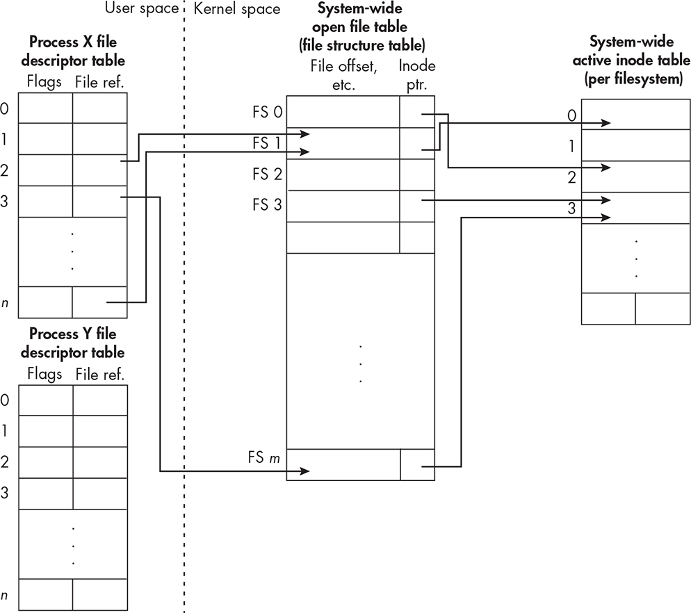
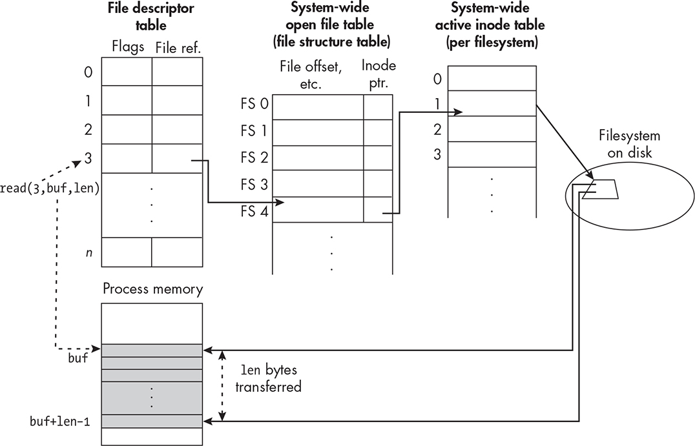
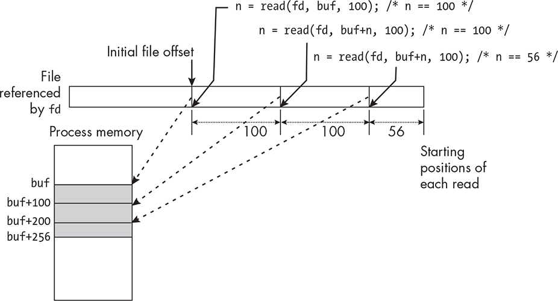
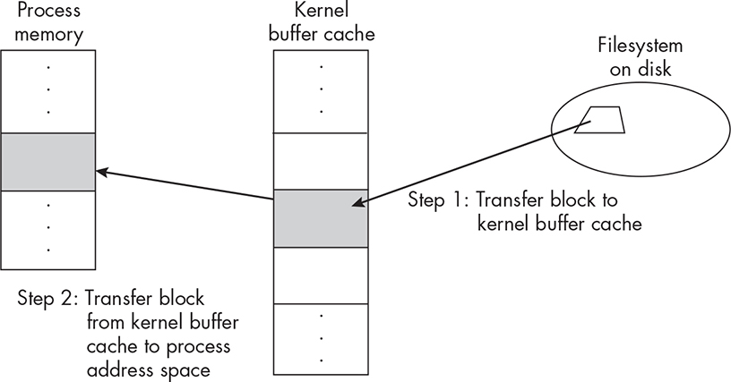

4 BASIC CONCEPTS OF FILE I/O

One of the most fundamental operations that system programs perform

is the transfer of data to and from files. The transfer of data from a file to the memory space of a process is called *file input*, and the transfer in the opposite direction is called *file output*. Together, they’re called *file* *I/O*. Because most system programs perform file I/O and because even the simplest of problems will require our programs to perform it as well, we study it next.

Our primary objectives in this chapter are to explain the issues and

concepts related to accessing files in Unix and to demonstrate how to

use the file-handling part of the kernel API. In addition, we’ll explore file-handling issues that impact the performance and portability of the programs we write.

We start with an overview of the Unix I/O model and then cover

some key background concepts related to file permissions and processes in order to understand how Unix decides whether a process is allowed

to access a file in a particular way. Following this, we examine in detail the elementary parts of the Unix kernel API related to file I/O. We’ll implement a simplified version of the cp command, and we’ll consider

how various design decisions affect its overall performance.

High-Level vs. Low-Level File I/O

High-level language libraries usually provide many different functions to perform I/O conveniently. In previous chapters, we saw examples of

these, such as scanf() and printf() for input and output of textual data.

Functions like these are often sufficient to solve some problems, but for other problems they aren’t suitable, either because they don’t give us enough control over how a read or write operation should be performed

or because our program needs to work with data that isn’t plaintext. In addition, the cost of their convenience is usually longer running time compared to what’s possible using system calls directly. If a program is not going to read or write large amounts of data, it may not matter how fast it transfers data, but it does make a big difference in performance when we want our programs to handle large datasets. Therefore, it’s

important to know how to use the lower-level functions for file I/O

provided by the kernel.

Universal I/O

From its inception, Unix employed a *universal* model of I/O. As Ritchie and Thompson wrote in 1974, “the system calls to do I/O are designed

to eliminate the differences between the various devices and styles of access” \[33\]. In other words, the same system calls that are used to perform I/O on disk files are also used on all other types of files,

including device files. A program that can read from or write to disk files can also read from or write to devices such as terminals, network

interfaces, and peripheral devices. From a program’s perspective, there’s no distinction between random access devices, such as disks, and

sequential access devices, such as tapes.

Unix frees you as a programmer from needing to know the details of

devices such as disks, tapes, network interfaces, and terminals, allowing you to write programs that transfer data to or from any of them. This is why Unix is said to provide device-independent I/O. You don’t need to

understand how the kernel performs this magic in order to write a

system program, but we’ll explain a bit about how it does so in Chapter

6.

File Permissions Revisited

The online chapter “Working in the Command Line Interface”

introduces the concept of file permissions in Unix. Now we introduce

one more key concept that comes into play in the context of file

creation, namely the file creation mask.

Every process has a *file creation mask*, which is a set of 9 bits that restricts which permissions are enabled when the process creates a file.

The file creation mask is commonly called a *umask*. Because this name is shorter, we’ll call it a umask henceforth.

When a process calls a function that creates a file, that file is given an initial set of permissions, such as who can read it, who can write to it, and so on. Functions that create files usually have a mode argument that lets the process set those initial permissions, but the umask is applied to the mode that the process tries to put on the file, possibly removing

some permissions specified by that mode. The resulting initial

permissions set on the file are what the process attempted to set on it, minus those that the umask removed.

*Applying the Umask*

The umask is essentially an inverted mask: a 1-bit in the umask disables the corresponding permission in the created file, but a 0-bit in the

umask does not disable the corresponding permission in the file if the process tries to enable it. We can view a umask’s 9 bits as three groups of 3 bits each, corresponding to the permission bits in the file mode. For example, the umask

000010010

can be viewed as

000 010 010

The first group controls user permissions, the second controls group

permissions, and the third controls others permissions:

0 0 0 0 1 0 0 1 0

r w x r w x r w x

user group others

Because an octal digit is equivalent to three binary digits, octal numbers are used to represent umask values. The previous umask value is octal

022, for example.

When a process calls a function to create a file with a mode of *mode*, the system applies the umask to it using the bitwise C operation ( *mode* & *ûmask*). In other words, the umask is inverted and bitwise-ANDed to the mode. For example, suppose that mode is 110110010 and umask is octal

022, or binary 000010010. The complement of umask in binary is

111101101\. The operation is thus

110 110 010

& 111 101 101

= 110 100 000

Interpreting this as a permission string, it gives the user read and

write permission, the group only read permission, and no permissions

on the file to anyone else. The umask value 022 is a common value

because it disables writing to a file by anyone other than its owner, but it doesn’t limit reading. If we wanted an even more secure value that

prevented reading by others for every created file, we’d set the process’s umask to octal 066, or binary 000110110. The complement of 066 is

111001001, and applying it to the previous mode

110 110 010

& 111 001 001

= 110 000 000

disables read and write by anyone except the user. Some people find it easier to apply a umask using a modified form of subtraction in which 0

– 1 = 0. The original, noninverted umask is subtracted from the mode as in:

110 110 010

\- 000 110 110

= 110 000 000

When we treat its application as a form of subtraction, it’s easier to remember that the umask acts like a filter that removes permissions.

*Setting and Getting Umasks*

When you log in to a Unix system, the shell started up for you is

assigned an initial default value for the umask, often octal 022. This default value depends on the operating system and the shell. You can

view your umask with the umask command. To see the octal value of the

umask, enter:

\$ **umask**

0022

This shows that the umask value is octal 022. The first 0 means the

following digits are octal.

If you want to see the permissions that are *not masked* by the umask in symbolic form, use the -S option:

\$ **umask -S**

u=rwx,g=rx,o=rx

This shows that the umask doesn’t mask out any permissions for the

user because u=rwx, and it doesn’t mask out read and execute permissions for anyone else (g=rx,o=rx).

You can use the umask command to change the umask by giving it a

umask value argument:

\$ **umask**

0022

\$ **umask 033**

\$ **umask**

0033

You can put a umask command into one of your shell configuration

files if you want the shell’s umask to be something other than the default

value. For example, in bash, you could add the following lines into your

*.bashrc* file if you want every interactive shell to use that umask:

\# Set my umask to turn off group writes; others: no read, no write

umask 026

All shells that start up when you open a terminal window are interactive and read that file. If you put them into your *.bash_profile* file, then only the login shell will use that umask.

*Propagating Umasks*

Whenever you run a process from the command line, its umask is

inherited from the shell, so unless that process changes its umask, its value will be the one your shell had when you ran that command. Any

processes created by that process will also have that umask, so the umask propagates downward to every process running on your behalf, unless

one of these processes changes it.

A process can change its umask with the umask() system call. In

Chapter 11, we’ll go over examples of programs in which processes change their umasks.

A Process’s User IDs

File permissions exist to control which users can access files and how they can access them. The only way that a user can actually access a file is by running a command or a program, which is to say, running a

process. Therefore, file permissions must determine which user

processes can access files and how they can access them.

The essential idea that underlies how permissions are used is that

every process is associated with at least one user ID. To be precise, on Linux, every process has four user IDs:

A real user ID

An effective user ID

A saved set-user-ID

A filesystem user ID, which is Linux specific

On most Unix systems, the kernel uses the effective user ID when it

needs to determine whether to grant a process permission to access a

resource, such as memory, or to access files. On Linux, it uses the

filesystem user ID to determine access to files, but the filesystem user ID is always equal to the effective user ID, the result being that it too uses the effective user ID.

Normally, when you run a program, the process that’s created is

assigned an effective user ID and a real user ID that are both equal to your user ID and thus the same. Sometimes, however, a process can

have different effective and real user IDs. Usually, when they’re

different, the effective user ID gives the program greater privileges than the real user ID. A program can be run in such a way that the effective user ID of the running process is not that of the user who runs it, but is instead the user ID of the owner of the program file. In the next section, we explain what makes this possible.

The setuid Bit

The file mode contains 12 bits, of which the highest-order bit is a bit named the *setuid* bit. In Chapter 6, I’ll explain more about all of the mode bits. If this bit is set, or enabled, for a file containing an executable program, then when a user who doesn’t own the file runs that program,

the process will have an effective user ID that is different from its real user ID. Specifically, whenever the program is run, the created process has an effective user ID equal to the user ID of the owner of the

program file and a real user ID equal to the user ID of the user that ran the program. You can see whether the setuid bit is enabled with the ls -l command. When it’s set for a file, the permission string that ls -l

displays will have an s instead of an x for the user’s execute permission letter.

Programs with the setuid bit enabled often have a need to

temporarily change their effective user ID to the real user ID and then restore the effective user ID to what it was. The purpose of the saved

set-user-ID is to store the effective user ID in such programs for later retrieval. Programs that modify their effective user IDs are called *setuid* *programs*.

A good example to illustrate these concepts is the passwd command.

The passwd command is usually contained in the */usr/bin/passwd* file. If we view the permissions on that file using ls -l /usr/bin/passwd, we see:

-rwsr-xr-x 1 root root 59976 Nov 24 07:05 passwd

The s in the permission string indicates that the setuid bit is on. The file is owned by root, whose user ID is 0. When we run the passwd command,

its effective user ID will be 0, but its real user ID will be our own user ID.

Try this experiment: Open two terminal windows, and in one, run

the passwd command without entering anything. In the second terminal,

look at the passwd process’s status by entering **ps -o euid,ruid,pid,args -C**

**passwd**. This command displays the effective and real user IDs, the process ID, and the command name for every running instance of passwd.

You’ll see that the real and effective user IDs are different:

\$ **ps -o euid, ruid, pid, args -C passwd**

EUID RUID PID COMMAND

0 500 14561 passwd

The column labeled EUID is the effective user ID, and the RUID column is the real user ID. The RUID column will contain your actual user ID.

When you’re finished, press CTRL-D twice in the terminal with the

passwd program waiting for input. It will terminate without making any changes to your password.

The role of a process’s credentials in file input and output should

now be clear. A process can access only files for which it has permission to do so. This is determined by the file’s permissions and the effective user ID of the running process.

Input/Output Mechanics

Before a process can access a file, it needs to establish a connection to that file in order to communicate with it. A *connection* is an object that manages and controls a process’s access to the file. It contains data such as the *file offset*, also called the *file pointer*, which is the offset in the file at which the next operation takes place, various flags and mode bits that control the manner in which operations are performed, information to

locate the file, and pointers to kernel functions that the process can invoke. To create this object, a process must *open* the file. In fact, the POSIX specifications call the connection object an *open file description* *(OFD)*, which is the term we’ll use here.

In Unix, a process can open a file to access it in one of three modes: Read mode Exclusively to read from it

Write mode Exclusively to write to it

Read/write mode To both read and write

These are called the *access modes* of the opened file. The access mode is one of the items stored in the OFD.

The operation that opens a file returns an identifier that serves as a reference to the newly created OFD. This identifier is called a *file* *descriptor*. A file descriptor is a typically small, nonnegative integer. Once you’ve opened a file and have a file descriptor for the connection, you must pass that descriptor to all subsequent operations on that file.

Traditionally, Unix systems did not prevent multiple processes from

opening the same file, and POSIX codified that behavior. POSIX-

conforming systems allow multiple processes to access the same file at the same time, which is an important feature of Unix. It’s why it is

possible for multiple users to run the same command or change their

passwords at the same time. In fact, a single process can open the same file multiple times as well. Unix systems do provide locking mechanisms so that a process can prevent other processes from opening a file while it’s accessing it.

Each open operation on the file creates a distinct open file

description for that file and returns to its caller a unique file descriptor

for that description. A process may also have multiple file descriptors that refer to a single OFD because Unix provides a means by which a

process can duplicate the descriptor that refers to an OFD, so that the new descriptor and the original both point to the same OFD. We’ll

study the duplication of file descriptors in Chapter 13, and we’ll examine the various data structures that the kernel uses for terminal I/O

in Chapter 18.

Figure 4-1 depicts a portion of the tables and data structures created to manage I/O operations on files.

*Figure 4-1: The tables used to manage files opened by processes*

Figure 4-1 shows the kernel’s in-memory *open file table*, also known as the *file structure table*. Open file descriptors point to entries in this table. The entries in this table have many members, among which is a

pointer to the inode that represents the actual file. In Figure 4-1,

Process X has two open files with OFDs at locations 1 and *m*. It duplicated a descriptor (2) so that descriptors 2 and *n* point to the same OFD at index 1 in the file structure table. Process Y and Process X each opened the file with inode 3, so they have two different OFDs at

locations *m* and 3, respectively, pointing to it.

When a program has finished all reading and writing and no longer

needs access to the file, it needs to *close* it. Closing the file breaks the connection between the program and the file. It frees the file descriptor, so that it no longer refers to the OFD. If there are no other descriptors pointing to the OFD, the resources used for the OFD are freed and the

OFD is removed. (One field in the OFD is a reference count that keeps

track of how many descriptors point to it.) Even more importantly, if

your program doesn’t close a file to which it was writing, some of the data may be lost. This can happen because usually writing to a file is not direct—the data is first written to kernel buffers that the kernel

eventually writes to the underlying hardware. In “Buffering and

Running Time” on page 182, I explain more about this concept. Closing the descriptor is necessary to *flush* these buffers to the device, but even closing it may not be sufficient. See the close(2) man page for an

explanation.

In summary, a process performs file I/O in three steps:

1\. Open a connection to the file to read or write.

2\. Perform the reads and/or writes through that connection.

3\. Close the connection to the file.

Standard File Descriptors

When a process is started from a shell, it inherits three open file descriptors, numbered 0, 1, and 2. These descriptors refer to

connections that have already been opened by the time the process

starts execution:

File descriptor 0, called the *standard input*, refers to the connection from which it receives input.

File descriptor 1, called the *standard output*, refers to the connection to which it sends output.

File descriptor 2, called the *standard error*, refers to the connection to which it sends error messages.

For clarity, programs can use the symbolic constants STDIN_FILENO,

STDOUT_FILENO, and STDERR_FILENO, defined in *unistd.h*, for the numbers 0, 1, and 2, respectively.

If the shell that creates the process is an interactive shell, meaning a shell that you’re using to enter commands, the three descriptors are

usually connected to the terminal device in which the shell is running.

The input comes from the keyboard, and the output and error are

written to the terminal screen. However, if any shell redirection

operators were applied to the command that the process is executing,

those descriptors may be pointing elsewhere. We’ll explain how that

works in Chapter 18.

When the process terminates, these descriptors are closed

automatically, which is why you never have to explicitly open and close them in your programs.

The Kernel I/O Interface

The cp command is the Unix command for copying files. The simplest

form of that command

cp *file1 file2*

copies the contents of *file1* to *file2*. If the latter file already exists, cp will silently overwrite its contents; otherwise, it creates a new file with that

name.

Writing our own version of this command without using any library

functions is a good way to learn how to use the kernel’s I/O interface.

We’ll first research the kernel’s system calls for opening, reading,

writing, and closing files. We’ll follow the same approach that we used when writing the spl_date programs in Chapter 3, namely, we’ll search the man pages to find the system calls we need, starting with one that opens files.

*Opening Files*

Since we’re looking for system calls related to opening files, we restrict the apropos search to Section 2 and give it the keyword open:

\$ **apropos -s2 open**

creat (2) - open and possibly create a file

epoll_create (2) - open an epoll file descriptor

epoll_create1 (2) - open an epoll file descriptor

flock (2) - apply or remove an advisory lock on an open file mq_open (2) - open a message queue

name_to_handle_at (2) - obtain handle for a pathname and open file via a ha...

open (2) - open and possibly create a file

open_by_handle_at (2) - obtain handle for a pathname and open file via a ha...

openat (2) - open and possibly create a file

openat2 (2) - open and possibly create a file (extended)

perf_event_open (2) - set up performance monitoring

pidfd_open (2) - obtain a file descriptor that refers to a process The four contenders from the returned list that warrant further

inspection are creat(), open(), openat(), and openat2().

It turns out that creat(), open(), and openat() share a single man page.

The man page for openat2() states that this system call extends the

functionality of openat(), that it’s a system call without a *glibc* wrapper and therefore has to be called using the syscall() function, and that it’s a Linux-specific call, meaning that it isn’t required by POSIX.1-2024. If we use it, our program would be limited to Linux systems only. For

these reasons, we’ll focus on the other functions and examine their man pages. The SYNOPSIS section there is:

\#include \<sys/types.h\>

\#include \<sys/stat.h\>

\#include \<fcntl.h\>

int open(const char \*pathname, int flags);

int open(const char \*pathname, int flags, mode_t mode);

int creat(const char \*pathname, mode_t mode);

int openat(int dirfd, const char \*pathname, int flags);

int openat(int dirfd, const char \*pathname, int flags, mode_t mode);

First we see that even though these are system calls, they’re not

declared in *unistd.h*. Certain system calls are declared in other headers, in this case, in *fcntl.h*. The *sys/stat.h* and *sys/types.h* headers contain type and constant declarations needed by these calls. On some Linux

systems, you may not need to include the *sys/types.h* header file. Check your local documentation to be sure.

Doing a quick scan of the page without reading all of the details, we

discover first that creat() is essentially a special case of open() and that openat() is also an extension of open() that gives us the ability to name the file to be opened relative to a given directory. We can safely conclude that open() is the function we need to research.

The open() System Call

There are two prototypes for open(), their only difference being the

presence of a third argument. Some man pages present these instead as

a single prototype:

int open(const char \*pathname, int flags, ... /\* mode_t mode \*/);

The declarations are equivalent because the third argument is optional.

The first argument, named pathname, is a character string containing

the pathname of the file to be opened. The second argument, named

flags, is a bit mask. A *bit mask* is an integer whose individual bits represent distinct Boolean values that can be inspected or modified.

This argument specifies the access mode for the file: reading only, writing only, or reading and writing, but other flags can be bitwise-ORed into it to control how the file is opened or created and how file operations are performed. We’ll get to those shortly.

The optional third argument is also a bit mask, but it’s used only

when open() is being called to create a new file, in which case it specifies the permissions on that file.

If successful, the call to open() creates a new open file description and returns an integer file descriptor that refers to it and can be used in subsequent operations on the file. This descriptor is the lowest-numbered file descriptor not already in use by the process. We’ll see in

Chapter 18 why this fact is important. If the call isn’t successful, it returns -1, and the error code is set in errno. Note that a process can open the same file multiple times; each call to open() creates a new open file descriptor.

The flags bit mask must include one of the following access modes,

defined in *fcntl.h*, and zero or more *file creation flags* and *file status flags* bitwise-ORed into the mask:

**O_RDONLY** Open the file for reading only.

**O_WRONLY** Open the file for writing only.

**O_RDWR** Open the file for reading and writing.

For example, to open an existing file named *infile* in the working directory for reading, we’d write:

int fd;

fd = open("infile", O_RDONLY);

if ( -1 == fd )

// Handle error.

If we try to open a file for reading that doesn’t exist, open() will return -1

and store the EACCES error code in errno.

Similarly, to open an existing file named *outfile* for writing, we’d write:

int fd;

fd = open("outfile", O_WRONLY);

if ( -1 == fd )

// Handle error.

This second example raises a few additional questions:

If the file to which we want to write doesn’t exist, will open() return an error or will it create a new file?

If the file to which we want to write exists but isn’t empty, will

open() return an error or silently overwrite it?

If that file exists and isn’t empty and open() doesn’t return an error, will writes to the file start at its beginning, replacing its contents, or will they be appended to the end of the current contents?

The answers to these questions depend on the values that we

bitwise-OR into the flags argument. These flags fall into two categories: file creation flags and file status flags. *File creation flags* influence the behavior of the open() call itself, whereas *file status flags* modify the actual file operations.

The man page has a complete list of all flags, but to understand

many of them, we need to know more about advanced methods of I/O,

which we’ll cover in Chapter 18. For now, I’ll explain the file creation flags that are relevant to the preceding questions:

**O_CREAT** Creates the file specified by pathname if it does not already exist

**O_EXCL** Used with O_CREAT; forces open() to fail if pathname already exists **O_TRUNC** If pathname exists and is a regular file, truncates it to zero length before writing to it

To answer the first question, if we try to open a file for writing, using either O_WRONLY or O_RDWR with no other flags and the file doesn’t exist, open() will fail. If we bitwise-OR the O_CREAT flag to O_WRONLY, as in

int fd = open("outfile", O_WRONLY \| O_CREAT); if ( -1 == fd )

// Handle error.

it will instead create a new file with the given name. In short, trying to open a new file for writing fails unless the O_CREAT flag is bitwise-ORed into the second argument.

If we pass O_CREAT and no other flags to the call but the file exists, open() will not fail, but the file’s contents will be written starting at the beginning of the file. If we write *N* bytes to the file, the first *N* bytes of the original file will be replaced but the rest of the file will remain.

If we want the entire file to be replaced, we need to bitwise-OR the

O_TRUNC flag as well. This sets the file to zero length before the first write to it:

int fd = open("outfile", O_WRONLY \| O_CREAT \| O_TRUNC);

if ( -1 == fd )

// Handle error.

This is a typical way of opening a file for writing, but it’s not the only way.

You also can bitwise-OR the O_EXCL flag to O_CREAT to produce a

different behavior, as in

fd = open("outfile", O_WRONLY \| O_CREAT \| O_EXCL);

which returns an error if *outfile* exists and, if it doesn’t, creates it. In short, if you want to replace the file if it exists or create it if it doesn’t, use O_WRONLY \| O_CREAT \| O_TRUNC as the second argument. If you want to prevent the file from being overwritten if it exists and create it if it doesn’t, pass O_WRONLY \| O_CREAT \| O_EXCL instead.

Most of the other possible combinations of these file creation flags,

used with read, write, or read/write access, will have either undefined or undesirable behavior. For example, if you try to open a file for

read/write access and pass the following flags, the call will truncate the file when it’s opened, leaving nothing to read initially:

fd = open(argv\[1\], O_RDWR \| O_CREAT \| O_TRUNC);

Make sure that’s really what you want to do.

None of the flags just introduced will allow your program to open

an existing file for writing and start writing to it at the end of the file, so that successive opens of the file for writing enlarge the file. You might want to do that if a program needs to maintain a logfile and append to it when it’s running. In Chapter 11, we’ll see an example of how to do this.

Attributes of Created Files

Let’s consider the last parameter of the open() call, which is needed only when the call creates a file, meaning that it’s called in either read/write or write mode, with the O_CREAT flag in the second argument. It has no effect otherwise.

When open() creates a file, we need to know the following:

Which user is the owner of the file?

What group is associated with the file?

What are the permissions on the file?

The man page tells us that the owner is set to the effective user ID of the calling process, not the real user ID.

The answer to the group ownership question depends on the

particular Unix system, but there is no simple answer. Just as a process has real and effective user IDs, it also has real and effective group IDs, with analogous meanings. In Linux, the file’s group ownership is either the effective group ID of the calling process or the real group ID of the directory in which the file is created. It depends on several factors. Most of the time, it’s going to be the effective group ID of the calling process, which is most likely the same as the real group ID. Check your local

documentation to know for sure.

Finally, we focus on what permissions the file is given when it’s

created. If you don’t supply a third parameter but you’ve passed O_CREAT

in flags, the permission is unpredictable. You must provide that

parameter. If you do, the permissions are the mode that you pass to it,

modified by the process’s umask. You can specify the mode either by supplying a literal number, such as the octal value 0600, or by a bitwise-OR of one or more of the symbolic constants defined in the *sys/stat.h* system header file and shown in Table 4-1.

Table 4-1: Symbolic Constants for File Mode

Constant Numeric

value

Permission

S_IRWXU

00700 User has read, write, and execute

permission.

S_IRUSR

00400 User has read permission.

S_IWUSR

00200 User has write permission.

S_IXUSR

00100 User has execute permission.

S_IRWXG

00070 Group has read, write, and execute

permission.

S_IRGRP

00040 Group has read permission.

S_IWGRP

00020 Group has write permission.

S_IXGRP

00010 Group has execute permission.

S_IRWXO

00007 Others have read, write, and execute

permission.

S_IROTH

00004 Others have read permission.

S_IWOTH

00002 Others have write permission.

S_IXOTH

00001 Others have execute permission.

For example, you can specify the rw-r--r-- permission on the file by

passing the bitwise-OR S_IRUSR \| S_IWUSR \| S_IRGRP \| S_IROTH in the third parameter.

Errors When Opening Files

The open() call can fail for various reasons, and the man page describes all of the associated error values. A good program would try to inform its user why it failed so they can correct the error. Some of the causes of failure follow:

The specified file doesn’t exist.

The user doesn’t have permission to open the file.

One or more flags passed to the open call are invalid.

The open call tried to create a file and couldn’t, either because it

didn’t have permission in the specified directory or the file exists

and O_CREAT and O_EXCL were passed.

Because a failure to open a file will most likely prevent any useful

computation from continuing, the easiest way to handle the errors is to display an error message and terminate. The fatal_error() function

presented in Chapter 2 does this, so a pseudocode fragment for opening a file should be of the form:

int fd; /\* File descriptor to receive \*/

fd = open( *pathname*, *file_opening_flags*, *mode*); if ( -1 == fd )

fatal_error(errno, " *name of function*");

The program might also have to release any resources that it acquired, such as other files it might have opened successfully and modified but has not yet closed.

*Closing Files*

It’s best to learn the proper way to close files before we consider how to read from or write to them for a few reasons:

Closing a file shouldn’t be an afterthought, because the close

operation performs important tasks, as we noted previously in this

section.

We won’t be able to write any programs to demonstrate how to

read from or write to files unless we know how to open and close

them.

Opening and closing are somewhat symmetric operations that act

like bookends surrounding actual I/O operations, respectively

acquiring file descriptors and relinquishing them, so it’s natural to

learn about the closing operation right after opening.

The System Call to Close a File

We need to find the system call that closes a file. A search in Section 2

of the man pages for the keyword close produces a single page:

\$ **apropos -s2 close**

close (2) - close a file descriptor

Notice that this man page’s one-line description states that this call closes a *file descriptor*, not a *file*. Although we think of the open operation as opening a file, we think of the close operation as closing a file

descriptor. The man page for close() starts with:

SYNOPSIS

\#include \<unistd.h\>

int close(int fd);

DESCRIPTION

close() closes a file descriptor, so that it no longer refers to any

file and may be reused... If fd is the last file descriptor referring to the underlying open file

description (see open(2)), the resources associated with the open file description are freed; if the file descriptor was the last reference to a file which has been removed using unlink(2), the file is deleted.

RETURN VALUE

close() returns zero on success. On error, -1 is returned, and errno

is set appropriately.

Observe that the header file needed for close() is not the same as the one for open(). It’s declared in *unistd.h*, whereas open() is declared in *fcntl.h*.

This function has a single argument, which is the file descriptor of the connection to be closed. The call closes that file descriptor. If a file has been opened by a process via multiple calls to open(), the close() call doesn’t close the other connections; it closes only the one

corresponding to fd.

The second paragraph of the man page DESCRIPTION implies that there

can be multiple file descriptors referring to the *same* OFD. When we introduced the open() call, we pointed out that each call to it creates a new OFD and returns a descriptor that refers to it, so how is that

possible? The answer lies in the fact that file descriptors can be

duplicated using the dup() or dup2() system call. These calls create copies of file descriptors that point to the same OFDs.

Errors When Closing Files

If close() is successful, its return value is 0, but if not, it returns -1. You might wonder what could possibly go wrong when closing a file and

why close() can fail.

One reason might be that we passed it a bad file descriptor when we

called close(), in which case it returns -1 and sets errno to EBADF. Another reason could be that the kernel, in the middle of executing code within the close() system call, may be given an urgent task to complete, one so urgent that it has to drop the close() call immediately to handle that task. In this case, the call returns -1 and sets errno to EINTR. Further still, the file may not have been on the local machine or local drive. It might be a file on a remote system that we’re accessing across a network. The network connection might have gone down, in which case the close

operation cannot complete its actions, and again, we’d get a -1 return value, and most systems will set errno to EIO.

Finally, if this file had been opened for writing, many other

problems could cause close() to fail. For example, the kernel may

discover in the close() call that it cannot complete a transfer of data to a disk file, because, for example, we’ve run out of disk space. On some

systems, this error isn’t reported until we close the file, when errno would be set to ENOSPC, meaning no more disk space, or EDQUOT, meaning this

write exceeded our quota.

The NOTES section of the man page provides guidance on how to handle the various errors if close() fails. If close() returns -1, we should not retry calling it, because doing so might cause other problems,

particularly for programs with multiple threads. The failure value is

supposed to be used only for diagnostic or remedial purposes, which

means it’s best to try rewriting the data to the file or writing to a new file if possible. In fact, the most recent version of the man page as of this writing states, “A careful programmer who wants to know about I/O

errors may precede close() with a call to fsync(2).” The fsync() function forces any remaining writes to a file to be flushed to the underlying

device, so that a failure in closing isn’t related to the attempted writes to it. By calling fsync() before calling close(), we’d see any I/O errors related to writing first and could handle them before closing the

descriptor, but the fsync() man page points out that it can only be called when the file descriptor is that of a disk file. It will return EINVAL

otherwise.

Handling the EINTR error in a comprehensive and portable way in

POSIX-conforming systems is difficult because different

implementations handle this error differently. POSIX.1-2024 doesn’t

specify what an implementation is supposed to do if the kernel is

interrupted while executing code in the close() function. Therefore,

some implementations guarantee that the file descriptor has been closed despite the error. Others don’t close the file descriptor and require that close() be called again, which, as noted previously, can cause other

problems. To handle closing errors in a portable way, a program would

have to respond to this error in a different way depending on which

implementation it’s running. This in turn requires checking at runtime which kernel is running and which libraries it’s using.

At this point, I present a simpler way to handle closing errors in

which we call fsync() before close(). If fsync() returns EINVAL, we’ll ignore the error. If close() sets errno to EINTR, the program exits:

errno = 0; /\* Need to include \<errno.h\>. \*/

/\* On some Unix systems, we need to check whether fd has been used

for writing. On Linux, we don't need to do this. \*/

return_val = fsync(fd); /\* Flush data to device. \*/

if ( -1 == return_val ) {

/\* Error trying to flush data to device. Depending on application, we

might need other actions here. \*/

if ( EINVAL != errno ) fatal_error(errno, "fsync() to *pathname*");

/\* fsync() was successful. \*/

errno = 0;

if ( -1 == close(fd) )

fatal_error(errno, "closing *pathname*");

The preceding code is safe to use in Linux because it isn’t an error in Linux to call fsync(fd) when fd was opened for reading only.

*Reading from Files*

We need to find the system call that can read the contents of a file, not just text files but arbitrary files. In Chapter 1, we saw that in Unix, from the kernel’s perspective, a nondirectory file is simply a sequence of bytes without structure; we need a function to read such a file. We’ll resort to our usual method for finding the right call, namely a man page search.

We try the obvious search, using the exact (option -e) keyword read,

limiting the search to Section 2:

\$ **apropos -s2 -e read**

*--snip--*

pread (2) - read from or write to a file descriptor at a given offset pread64 (2) - read from or write to a file descriptor at a given offset preadv (2) - read or write data into multiple buffers

preadv2 (2) - read or write data into multiple buffers

pwrite (2) - read from or write to a file descriptor at a given offset pwrite64 (2) - read from or write to a file descriptor at a given offset pwritev (2) - read or write data into multiple buffers

pwritev2 (2) - read or write data into multiple buffers

read (2) - read from a file descriptor

readdir (2) - read directory entry

*--snip--*

On my Linux system, the search returned more than 20 hits. This list is a fragment of those results; however, it does contain two functions that

warrant further research:

pread (2) - read from or write to a file descriptor at a given offset read (2) - read from file descriptor

The first, pread(), may not be suitable. When we read its man page, we see that it’s more general than we need it to be and is really intended for multithreaded programs.

We want to read the man page of the second, read(). If we enter

\$ **man read**

READ(1POSIX) POSIX Programmer's Manual READ(1POSIX)

*--snip--*

NAME

read - read from standard input into shell variables

*--snip--*

we get the page for a read command, not the one for the read() system

call. We need to specify the section number in the man command:

\$ **man 2 read**

*--snip--*

NAME

read - read from a file descriptor

SYNOPSIS

\#include \<unistd.h\>

ssize_t read(int fd, void \*buf, size_t nbytes); DESCRIPTION

read() attempts to read up to nbytes bytes from file descriptor fd into the buffer starting at buf.

*--snip--*

Note that to use read(), we need to include the *unistd.h* header file. The function has three parameters: an integer file descriptor fd, a void

pointer named buf, and one of type size_t, named nbytes. The man page

states that it reads up to nbytes many bytes from the file descriptor fd into the buffer whose starting address is buf.

The bytes that are read are stored into memory locations starting at

buf, which is declared as type void\* so that any address can be passed to it.

It’s worth pointing out that this parameter is named buf to emphasize that it’s memory in the calling process that temporarily holds data to be transferred from the file. A program calling read repeatedly with the

same buffer argument needs to copy the data out of the buffer after each call. The third parameter, nbytes, is the number of bytes to read.

The return value is of type ssize_t. This is a system type similar to

size_t except that it’s a *signed integer* type, so that it can store negative numbers. The return value is either the number of bytes actually read, which can never be larger but might be smaller than nbytes, or -1 if

something went wrong, in which case errno contains the error value.

Figure 4-2 represents the actions resulting from a call to read(3,buf,len).

*Figure 4-2: A read of* *len* *bytes by a process from the file with file descriptor 3 to memory* *location* *buf*

The kernel uses file descriptor 3 to locate the OFD in the file

structure table. It uses that OFD to locate the inode for the file, which stores the address on disk of the file’s data. When we first discussed OFDs in “Input/Output Mechanics” on page 155, we noted that one of

the members of an OFD is a file offset, which always points to the place in the file to perform the next operation. The reading of data starts at the file offset and in this case attempts to read len bytes. The data is copied into the memory locations in the process’s address space starting at buf. The read operation advances the file offset by len bytes.

Let’s take a look at a code fragment that puts some of these ideas

together. Suppose that fd is a valid file descriptor that we’ve opened for reading, buffer is a char array of size 100, and return_val is a variable of type ssize_t. The following code fragment shows how to repeatedly read 100 bytes of data at a time from the file associated with fd until there’s no more data to read:

BOOL done = FALSE; /\* Flag to indicate no more data \*/

while ( !done ) {

return_val = read(fd, buffer, 100);

if ( 0 \> return_val )

/\* An error code was returned during reading. \*/

➊ fatal_error(errno, "error reading file...");

else if ( 0 == return_val )

/\* The end of file was reached - stop reading. \*/

done = TRUE;

else

➋ /\* buffer\[0...return_val-1\] contains the bytes just read. \*/

// OMITTED: Transfer this data to its final destination before

// it is overwritten by the next call to read().

}

This is the structure of a typical read loop. The loop repeatedly calls read() until it returns either zero or a negative value. A negative value indicates an error during reading, in which case we handle the error by calling the fatal_error() function ➊ (which we presented in Chapter 2) to print a message and exit the program. A zero return value just means

we’ve read all there is to read, so we set the flag done to TRUE to break the loop. Any other value means that read() was successful. That case is

handled in the else clause ➋, which in this fragment is just a comment indicating that buffer contains the data just read. That comment tells us

we need to transfer the data before it’s overwritten, which might mean writing it to a file or copying it into some data structure, for example.

There’s no guarantee that the read() call will actually read 100 bytes; it might have read fewer bytes, which is why the comment states that

buffer \[0...return_val-1\] is the data just read. If, for example, only 256

bytes remained in the file at the current position of the file offset, then the next two calls to read() would read 100 bytes each, and the third just 56 bytes, as depicted in Figure 4-3.

*Figure 4-3: Three successive reads with the third returning fewer bytes than requested* You can’t assume that the number of bytes requested is the same as

the number received, and it’s not an error when it isn’t.

Remember that each successive call to read(fd, buf, nbytes) starts

reading in the file referenced by fd at the byte immediately following

the last byte read by the previous call, because the file offset is advanced by the read. This is why successive calls will eventually read the entire file without missing or duplicating bytes. The ability to read the entire file correctly hinges on read()’s advancing that file offset.

The next step is to find the system call that we can use for writing to files. Once we know that, we’ll be ready to create a program to copy

files.

*Writing to Files*

To find the system call that can write to files, an obvious choice of a search in the man pages would be

\$ **apropos -s2 write**

This search on my system returns about 20 different man pages.

Depending on which distribution you’re running, it might be more or

less than that.

We can refine the search to produce a smaller set of pages with the -

a option to apropos, which lets us search for pages that match *al* of the supplied keywords, and give it both write and file, since we want to write to files in particular:

\$ **apropos -s2 -a write file**

\_llseek (2) - reposition read/write file offset

llseek (2) - reposition read/write file offset

lseek (2) - reposition read/write file offset

pread (2) - read from or write to a file descriptor at a given offset pread64 (2) - read from or write to a file descriptor at a given offset pwrite (2) - read from or write to a file descriptor at a given offset pwrite64 (2) - read from or write to a file descriptor at a given offset write (2) - write to a file descriptor

The very last hit is the one we want: the function that writes to a file descriptor. Its man page begins with:

SYNOPSIS

\#include \<unistd.h\>

ssize_t write(int fd, const void \*buf, size_t nbytes); DESCRIPTION

write() writes up to nbytes bytes from the buffer starting at buf to

the file referred to by the file descriptor fd.

*--snip--*

RETURN VALUE

On success, the number of bytes written is returned. On error, -1 is

returned, and errno is set to indicate the cause of the error.

*--snip--*

The write() system call is a symmetric counterpart to the read() call. It writes nbytes bytes starting at the address given by buf to the file

associated with the fd file descriptor. The return value when it’s

successful is the number of bytes actually written. It’ll never be greater than nbytes. If there’s an error, it returns -1, and errno contains the error code. Like the buffer parameter of the read() call, this buffer parameter is declared as a void pointer, so that it can be used to transfer any type of data.

The man page provides the details for using write(). A call such as

write(fd, buffer, num_bytes)

attempts to transfer num_bytes bytes from the memory location pointed to by buffer to the current position of the file offset in the file opened for writing via the fd file descriptor. The initial position of the file offset depends on how the file was opened. For example, if you opened the file for writing, passing the O_WRONLY \| O_CREAT \| O_TRUNC flags, the file offset will be at the start of the file. After each call to write(), it’s incremented by the number of bytes actually written, so that the next call will write its data immediately after the data just written. Thus, no *holes* are created in the file under normal usage.

A program calling write() should check whether it returns -1, which

indicates a write error, and handle the error appropriately. If write() doesn’t return -1, there was no error in writing, but it’s possible that the number of bytes actually written is less than the number of bytes that

were supposed to be written. This *partial write* to an ordinary disk file can be caused by a variety of reasons: The file might have reached a

predefined maximum size, the disk might be full, or the user’s disk quota might be reached. After a partial write, your program can either just

display a suitable error message and exit or try to write the remaining data again. If it calls write() again after the partial write, it’ll either transfer the remaining bytes or return an error, which it can then

handle.

A simple way to call write() that doesn’t try to rewrite after a partial write is of the form:

errno = 0;

result = write(fd, buffer, num_bytes);

if ( result == -1 )

// Error in writing - use errno value to print a message to use,

// exiting if appropriate.

else if ( result \< num_bytes )

// Some but not all data was written; display message and exit.

else

// write() was successful and all data was written.

It is always a good idea to check whether a partial write occurred and, at the very least, inform the user that it did.

NOTE

*A successful cal to* *write()* *to a disk file doesn’t necessarily transfer the* *data to the disk. In fact, on most modern Unix systems, writing to a file* *doesn’t cause any immediate disk I/O. Instead, the data is transferred to* *kernel buffers, which are written to the disk at a later time. This practice* *general y reduces disk I/O, saves time in the kernel, and speeds up the* *writes. Chapter 18* *covers this concept of kernel buffering.*

We’re now ready to write a simple version of the Unix cp command,

which we name spl_cp1 (because we’ll write a second version later).

Writing a copy Command

The simplest form of cp makes a copy of one file to a file with a different name, using the syntax:

cp *source_file target_file*

The two arguments to cp can be any pathnames, including those with

symbolic links.

To illustrate, suppose our current working directory has a symbolic

link named *backups*:

\$ **ls -F**

file1 backups@

The -F option to ls classifies the directory entries with an *append* *indicator*, which is one of \*, /, =, \>, @, or \|. The @ symbol indicates that an entry is a symbolic link, showing in this example that *backups* is a symbolic link.

We can see what the target of the *backups* symbolic link is with the readlink command:

\$ **readlink backups**

/data/backups/

The readlink command displays the full pathname to which a symbolic

link refers, showing in this case that *backups* is a link to a directory, since it’s displayed with a trailing slash. You can use the realpath command also; for this simple case they behave exactly the same.

If we issue the command

\$ **cp file1 backups/current/file1_bkup**

cp makes a copy of *file1* in the directory */data/backups/current/* with the name *file1_bkup*.

Although the command seems simple enough, several questions

about its behavior come to mind immediately:

If *target_file* already exists, will cp replace it, or will it refuse to replace it and issue a warning instead?

After a successful copy, what permissions will *target_file* have, and which user and group will own it?

Can *source_file* and *target_file* refer to the same file? In other words, can cp replace a file by itself, or is that an error? Remember that the two files can be different links to the same file in Unix systems.

If *source_file* is a symbolic link to another file, does cp copy the file referenced by the link or the link itself?

Can cp make copies of special files and directories?

The POSIX specification of cp \[14\] answers all of these questions for systems that conform to POSIX requirements:

If *target_file* exists, cp truncates the file and replaces its contents with the contents of *source_file*, an action known as *clobbering*. This is dangerous, as you cannot recover a file once you’ve clobbered it,

so many people use the interactive option -i to cp, which prompts

the user before overwriting the file:

\$ **cp -i README README.md**

cp: overwrite 'README.md'? **n**

\$

Any answer that begins with y or Y is interpreted as *yes*, and

anything else is taken as a negative answer.

The permissions and ownership given to *target_file* depend on

whether it existed before the copy operation. If it existed before,

they will remain the same as they were. If it is newly created, its

mode will be the mode of *source_file* modified by the user’s umask, and its user and group IDs will be those resulting from a call to

open() with the O_CREAT flag. (You can refer back to “The open()

System Call” on page 159 for how the group ID is chosen by open() in this case.)

POSIX doesn’t require an implementation of cp to detect whether the source and target pathnames refer to the same file, but most

implementations do. Suppose, for example, that *linux_cheatsheet* and *commands* are links to the same file, which we can verify with the ls

-i command, which prints the inode numbers of the files:

\$ **ls -i**

6690145 commands 6690145 linux_cheatsheet

Then if we enter

\$ **cp linux_cheatsheet commands**

cp: 'linux_cheatsheet' and 'commands' are the same file

we see that cp looks not at the names but at the files to which they

refer.

If *source_file* is a symbolic link to another file, then cp copies the target of that link, not the link itself.

Without options, cp does not copy directories, but it can copy

special files that a user has the privilege to read.

Copying a file does not preserve any attributes other than the mode and ownership. To preserve the timestamps and other attributes when

copying, we can use the -p (short for “preserve”) option.

A final point to remember is we cannot create a file in a directory

unless we have write permission on that directory. Therefore, if cp needs to create the target file, we must have write permission on the target directory.

*Design of the copy Program*

With all of the preceding considerations in mind, we can now outline

the structure of our spl_cp1 program:

1\. Check that the command line has two arguments and exit with a

usage error if it doesn’t.

2. Open the first argument file for reading, which we’ll call the *source* file. If it cannot be opened for reading, report the error and exit.

This should take care of detecting whether it’s a directory or a file

that we don’t have permission to read.

3\. Open the second argument file for writing, passing the bitwise-OR

of the O_CREAT and O_TRUNC flags to allow it to be created if it doesn’t exist and overwritten if it does.

4\. Enter a loop that performs the following sequence of instructions

until either an error occurs or it has read the entire source file:

\(a\) Read a chunk of data from the source file into a buffer and

store the number of bytes read into a variable named

num_bytes_read. If there is no data left or a read error

occurred, break out of this loop.

\(b\) Write num_bytes_read many bytes of data from the buffer to the

target file. If a write error occurred or the amount of data

written is less than num_bytes_read, report the error and break

out of the loop.

5\. Close the source file.

6\. Close the target file.

7\. Return a value indicating whether or not the program copied the

file successfully.

We’ve already covered everything we need to know to implement

that logic, so writing the program will be relatively straightforward. We just have a few decisions to make about the variables our program will need.

*Implementation of the copy Program*

The read() and write() system calls both require a buffer. We need to

decide how large that buffer should be, and that decision will affect the program’s performance. For now, we’ll choose its size somewhat

arbitrarily, and after creating the initial version of the program, we’ll

consider how the buffer size affects its performance. Listing 4-1 shows the complete program.

*spl_cp1.c*

\#define \_GNU_SOURCE

\#include "common_hdrs.h"

➊ \#ifndef BUFFER_SIZE

\#define BUFFER_SIZE 4096

\#endif

\#define MESSAGE_SIZE 512

\#define PERMISSIONS S_IRUSR\|S_IWUSR\|S_IRGRP\|S_IWGRP\|S_IROTH /\* rw-rw-r-- \*/

int main(int argc, char \*argv\[\])

{

int source_fd; /\* Source file descriptor \*/

int target_fd; /\* Target file descriptor \*/

int num_bytes_read; /\* Return value of read() \*/

int num_bytes_written; /\* Return value of write() \*/

mode_t permissions = PERMISSIONS; /\* Permissions to assign \*/

char buffer\[BUFFER_SIZE\]; /\* Buffer for transfers \*/

char message\[MESSAGE_SIZE\]; /\* Error message string \*/

/\* Check for correct usage. \*/

if ( argc != 3 ) {

sprintf(message, "%s source destination", basename(argv\[0\])); usage_error(message);

}

/\* Open source file for reading. \*/

errno = 0;

if ( (source_fd = open(argv\[1\], O_RDONLY)) == -1 ) {

sprintf(message, "unable to open %s for reading", argv\[1\]);

fatal_error(errno, message);

}

/\* Open target file for writing. \*/

if ( (target_fd = open(argv\[2\], O_WRONLY \| O_CREAT \| O_TRUNC,

permissions)) == -1 ) { sprintf(message, "unable to

open %s for writing", argv\[2\]);

fatal_error(errno, message);

}

/\* Repeatedly transfer BUFFER_SIZE bytes at a time from source_fd to

target_fd. \*/

errno = 0;

➋ while ( (num_bytes_read = read(source_fd, buffer, BUFFER_SIZE)) \> 0 ) {

errno = 0;

num_bytes_written = write(target_fd, buffer, num_bytes_read);

➌ if ( errno != 0 )

fatal_error(errno, "copy");

else

if ( num_bytes_written != num_bytes_read ) {

➍ sprintf(message,"write error to %s\n", argv\[2\]);

fatal_error(-1, message);

}

}

if ( num_bytes_read == -1 )

fatal_error(errno, "error reading");

/\* Close files. \*/

if ( close(source_fd) == -1 ) {

sprintf(message, "error closing source file %s", argv\[1\]);

fatal_error(errno, message);

}

errno = 0;

if ( -1 == fsync(target_fd) ) /\* Flush data to device. \*/

fatal_error(errno, "fsync");

/\* fsync() was successful. \*/

if ( close(target_fd) == -1 ) {

sprintf(message, "error closing target file %s", argv\[2\]);

fatal_error(errno, "error closing target file");

}

return 0;

}

*Listing 4-1: A complete implementation of a simple file copy program* The conditional macro ➊ that defines the buffer size allows us to

change the buffer size without having to change the program itself. For example, by entering the command

**gcc -DBUFFER_SIZE=4096 spl_cp1.c -I ../include -L ../lib -lspl -o spl_cp1**

to compile and build the executable spl_cp1, the value 4096 assigned to the symbol BUFFER_SIZE on the command line will override the value it’s given in the source code. Recall from Chapter 2 that various functions needed by all of our programs were placed into our own static library, named

*libspl.a*, in the directory *demos/lib*, whose relative pathname from this chapter’s demo directory is *. /lib*. That’s why the compilation command needs the options -L../lib -lspl.

The while loop ➋ condition uses a common C paradigm:

while ( ( *returnvalue* = *func*(...) ) *conditional_operator expression*) To evaluate the condition, the function is called, and its return value is assigned to *returnvalue*, which is then compared to *expression* using the given *conditional_operator*. If the comparison is true, the loop is entered; otherwise, it is not.

The while loop does the main work. The loop is entered each time

that the read() call transferred one or more bytes to the buffer. The loop body attempts to write those bytes to the target file descriptor. The

return value of write() is checked to see whether the number of bytes

transferred equals the number requested by the call. If not, something went wrong and the program exits ➍. The program also checks whether

write() set errno to a nonzero value ➌ and exits if it does.

It’s time to run the program and see how it works.

*Testing of the copy Program*

Let’s run the spl_cp1 command to make a copy of its own source code:

\$ **./spl_cp1 spl_cp1.c spl_cp1_backup.c**

We can check whether *spl_cp* and *spl_cp_backup.c* are identical with the diff -s command, which compares two files:

\$ **diff -s spl_cp1.c spl_cp1_backup.c**

Files spl_cp1.c and spl_cp1_backup.c are identical

In this case it copied the file correctly, but more generally, how do we know whether the program is correct? *Correctness* in this context means: 1. It should make identical copies of the source files every time it’s called, regardless of their size.

2\. It should report incorrect usage and report errors whenever errors

occur.

We can’t verify the first condition because that would require

running the program on every possible file. However, we can convince

ourselves with high probability that the program is correct by running it on as many files as is reasonably possible, with varying sizes, from empty files to extremely large files that might possibly exhaust system

resources.

How can we compare two arbitrary files to see if they’re identical?

We can’t use the diff command, because it can compare only text files, but the cmp command can compare any two files, text or otherwise. For

example, we can run spl_cp1 to make a copy of itself and then check

whether the copy is identical to the original:

\$ **./spl_cp1 spl_cp1 spl_cp1.bkup**

\$ **cmp spl_cp1 spl_cp1.bkup**

\$

It will display the first position at which they differ if they’re not the same or nothing if they’re identical. You can use cmp -l to see all

differences in the two files.

Thus, to convince ourselves of its correctness, we can run our spl_cp1

program on files of size zero, files of moderate size, and extremely large files, checking with cmp to see whether the copies are the same as the originals or whether writing fails because there’s not enough disk space to make the copies.

To start, here’s a run on an empty file:

\$ **du -b /temp/emptyfile** \# Show actual size of /temp/emptyfile.

0 /temp/emptyfile

\$ **spl_cp1 emptyfile emptyfile.bkup**

\$ **du -b /temp/empty\***

0 /temp/emptyfile

0 /temp/emptyfile.bkup

There’s no need to compare them since they’re both empty.

A run on a file of medium size looks like this:

\$ **du -b /temp/mediumfile**

57569256 /temp/mediumfile

\$ **./spl_cp1 /temp/mediumfile /temp/mediumfile.bkup**

\$ **cmp mediumfile\***

\$

Try running this program on extremely large files, and you’ll see

that it copies them correctly. To test for write errors, I ran it to make a copy of a very large file, a guest virtual machine image file for Ushahidi Ubuntu, which was 13,129,809,920 bytes, on a disk whose capacity was

only about 8GB, as follows:

\$ **./spl_cp1 /data/Ushahidi-Ubuntu.vmdk /temp/largefile**

write error to /temp/largefile

Referring to Listing 4-1, you can see that this error message is the one that’s written when errno == 0 after the call to write() and write() wrote fewer than the number of bytes it was supposed to. If we modify the

program so that it calls write() one more time after this, errno would be set to ENOSPC and we’d see the message copy: No space left on device.

*The Universality of the copy Program*

At the beginning of this chapter, I pointed out that the Unix model of I/O is universal. Now that we’ve written the spl_cp1 program, we can

demonstrate concretely how it works. Open a terminal window, and in

bash, navigate to the directory containing the spl_cp1 executable. Create a small text file in that directory named *testfile*. It doesn’t matter how large or small it is or what it contains. The file I’ll work with has the

following lines:

\#### \####

^

---

First, copy *testfile* to the terminal:

\$ **./spl_cp1 testfile /dev/tty**

\#### \####

^

---

\$

The contents of *testfile* appeared on the terminal screen because the system calls work on *al* files, and */dev/tty* is a device file that represents the terminal window in which you’re working. This shows that the

spl_cp1 program copied the file to the terminal.

Now try it the other way around. Enter any text followed by CTRL-

D after the command line and then look at the contents of *newfile* with the cat command:

\$ **./spl_cp1 /dev/tty newfile**

\#### \####

^

---

**CTRL-D**

\$ **cat newfile**

\#### \####

^

---

This time, spl_cp1 read the terminal device file and wrote what it

contained to a new file named *newfile*. The read() system call returns 0

only when it receives a CTRL-D, the keyboard character sequence that

sends an end-of-file signal to it; that’s why we need to enter that CTRL-D.

You can also use spl_cp1 to send what you enter in one terminal

window to another. Open a second terminal window and enter **tty** in it.

The tty command prints the pathname of the terminal’s device file.

You’ll see a string such as /dev/pts/2, which is the device file for that terminal window. Enter the following command, substituting the

pathname that tty printed in your window, and then enter whatever text you like after it, followed by CTRL-D:

\$ **./spl_cp1 /dev/tty /dev/pts/2**

**Hello there.**

**I'm trying to reach you. I'm on terminal /dev/pts/1.**

**Bye.**

**CTRL-D**

You should see whatever you typed in one window in the other. In your

second window, press ENTER to get the prompt again. It’s not magic; it’s Unix.

Timing Programs

The correctness of a program is the most important aspect of its quality, but not the only one. Other measures of program quality relate to how

well it performs. Running time is usually the most important

performance metric. For example, we’d like to know how fast our spl_cp1

program is at copying files, on average, and how long will it take to copy very large files. This raises the question of how can we measure the

amount of execution time that programs take in Unix.

When we researched the man pages in Chapter 3 to investigate time in Unix (in particular, in “About Calendar Time in Unix”), we learned

about real time and process times. In that chapter, we weren’t interested in process times, so we didn’t dwell on them, but now we need to know

more about them. The Section 7 man page for time mentioned that the

time command could be used to determine the amount of CPU time

consumed during the execution of a program.

The time command’s man page explains that it can be used to provide

data on various system resources used by a program. By default, it

displays information about resources besides running time, such as

memory usage and I/O activity. To restrict its output to just running

times, enter

\$ **time -p** ***command***

where *command* is the command whose running time you want to measure.

The -p option tells time to display the traditional POSIX output, which consists of three values, each measured in seconds up to two decimal

places:

Elapsed clock time, listed in the output as real time

User time, listed as user time

System time, listed as sys time

Reported *real* time is the number of seconds that elapse from when the command was invoked until it completed. Reported *user* *time* is the total amount of time that the process, and any child processes or their

descendants executing on its behalf, spent running in user mode.

Reported *sys* *time* is the total amount of time spent on the process’s behalf running within the kernel—that is, in privileged mode, including such time spent by its children as well.

Note that time writes its output to the standard error stream rather

than the standard output stream. You can supply different options to

control the format of the output as well as the kinds of resources about which you’d like time to report. The man page contains a detailed list of all of the resource usage that it reports. Also, shells such as bash typically define their own version of the time command, so you should always type the full pathname of the time program when using it if you want the

non-bash version. Since time is usually installed in */usr/bin/*, you would enter:

\$ **/usr/bin/time -p** ***command***

For example, I’ll run our spl_cp1 program on a relatively large file, a disk image of Chimera Linux, a non-GNU Linux, approximately

116MB:

\$ **/usr/bin/time -p ./spl_cp1 chimera-1.9-linux_x86_64.bin /temp/chimera** real 0.73

user 0.02

sys 0.14

This output shows that 0.73 seconds elapsed between when the

program started and when it finished, and that it spent about 0.02

seconds running in user mode and about 0.14 seconds running in kernel

mode.

Notice that the sum of user and system times is much less than the

real time. The real time can never be less than their sum, but it’s usually much larger. Processes often spend time waiting for I/O operations to

complete. This waiting time is not part of user or system times. When a process issues a request for I/O, it’s removed from the CPU until the

I/O is complete. We say that the process is *blocked* when it isn’t allowed to use the CPU because it doesn’t have a required resource to run,

which in this case is a completed I/O operation. In addition, when many processes are running, they share the CPU(s) with each other. Each

ends up waiting in a queue until it acquires a CPU. This waiting time

isn’t part of user or system times either. These waiting times account for the difference between elapsed (real) time and the sum of user and

system times. Our ls_cp program spent 0.73 – 0.16 = 0.57 seconds not on the CPU, either waiting for I/O or the CPU.

Although the amount of time that a process spends waiting depends

heavily on what else the system is doing, the more calls it makes, the longer it will take, on average.

When we try to copy larger and larger files, we should expect the

process times to become larger. To test this hypothesis, we’ll need a set of large files. Also, we’ll change the options to the time command so that it puts the output on a single line rather than three lines and sends it to a file instead. The -f *format-string* option controls both output content and format. We’ll use the format string "\t%e \t%U \t%S", which reports real, user, and system times on a single tab-separated line. We’ll send the output to a file with the -o *output-file* option and ask it to append output to the file instead of overwriting it with the -a option.

I created a set of four files, *f1*, *f2*, *f3*, and *f4*, such that *f1* is 60MB and the others double in size successively, and I ran the following bash for

loop:

\$ **for i in 1 2 3 4 ; do**

**let size=\$((60\*(2\*\*(i-1))))**

**echo -n \$size \>\> results /usr/bin/time -f "\t%e \t%U \t%S" -o results -a**

**./spl_cp1 f\${i} f\${i}.bk**

**done**

The loop uses bash arithmetic operations to calculate the value of size to print and prints that value to the *results* output file, without a trailing newline character. It then copies each of the files into a new file,

recording the times in the same *results* file. Table 4-2 shows the results of this experiment.

Table 4-2: Process Times in Seconds of the spl_cp

Program on Four Successively Larger Files

File size (MB) Real time User time System time

60

0.32

0.00

0.08

120

0.75

0.01

0.13

240

1.47

0.03

0.26

480

3.07

0.06

0.50

Notice in Table 4-2 that the real and system times increase approximately in proportion to the size of the file over this small

dataset, but the user times do not. This isn’t a coincidence; the system time is related to the number of system calls that the program makes,

and the user time is independent of how many calls it makes. Most of

the work is being done in the kernel, not in the program code.

THE OVERHEAD OF SYSTEM CALLS

System calls in general take much more time than calls to library functions. In “System Calls” in Chapter 2, we summarized the sequence of actions that take place when a program makes a

system call. Steps such as copying the arguments of the call to a

place that the kernel can access them, trapping to kernel mode,

and locating the code to be executed inside the kernel and jumping

to it all take time.

We can get an estimate of how much overhead a system call

requires by timing a small program that does nothing other than

make a large number of system calls. The uname() system call is a

relatively small system call that retrieves information about the

kernel from data stored internally. It makes few function calls itself inside the kernel and runs pretty quickly. I wrote a small program,

*spl_syscal overhead.c* (available in the book’s source code

distribution), that calls uname() 100,000,000 times. The time

command reported that it ran for about 42.25 seconds. As a means

of comparison, I replaced the system call in that same program by

a call to the GNU C Library function rand(), which returns a

random integer. The rand() function is a wrapper for a hidden

\_\_random() function, which performs some integer arithmetic using a

very efficient algorithm for random number generation based on

saved state information. It finished in about 1.47 seconds. Both

programs were run on a host with a Linux 5.15 kernel. That

program ( *spl_libcal overhead.c*) is available in the book’s source code distribution as well. The difference in time is primarily due to the

overhead required to execute a system call.

*Buffering and Running Time*

In our *spl_cp1.c* program, we chose a buffer size of 4096 bytes. If we increase the buffer size, the program will make fewer system calls to

copy a fixed size file. For example, if our file is 4,096,000 bytes, with a buffer of size 4096 bytes, it makes 1,000 read() and write() calls, but if we double the buffer size, it makes 500 calls to each. Decreasing the buffer size increases the number of calls to each. Given that these system calls

have overhead, it stands to reason that our programs will run faster with larger buffer sizes. We test this hypothesis by modifying our *spl_cp1.c* program so that the buffer size is a command line argument. We named

the modified version of the program *spl_cp2.c* (it’s available in the book’s source code distribution). We can then conduct an experiment in which

we run the program with varying size buffers and measure how much

time it takes for each buffer size. For each buffer size, we need to run it multiple times and take the average time of the runs. This by itself won’t give us a good picture of the effect of buffer size, because the kernel itself performs *buffering* when transferring data to and from disk devices to improve the performance of I/O.

When a user process calls read() for data from a disk file, the kernel doesn’t transfer the data directly from the disk to the address space of the user process. Instead, it transfers the data from the disk to a storage area in kernel memory, and when all of the data has been transferred, it copies it into the user process’s address space.

Symmetrically, when a user process calls write() to transfer data to a disk file, the data it sends is copied to a storage area in kernel memory, and at some future time the kernel transfers it to the disk file. This buffering scheme is depicted in Figure 4-4. The kernel’s storage area for these disk I/O operations is called its *buffer cache*, and the kernel’s use of it is called *system buffering*.

*Figure 4-4: The transfer of data during a* *read()* *call from the filesystem on disk to the* *kernel’s buffer cache and then to the process’s address space*

The kernel is designed to use this buffer cache to improve overall

performance. For one, the read() and write() calls don’t have to wait for the slow disk operations to complete. They return as soon as data is

transferred in memory.

Second, on a read request by a process, the kernel searches its buffer cache to see whether the disk data being requested is there. If a buffer is found with that data, it doesn’t have to access the disk. Instead, the data is read directly from memory without any physical I/O. Write requests

are slightly more complex but similar. In both cases, the average effect is that the kernel spends less time involved in actual physical I/O. In

Chapter 17, we’ll explore system buffering in greater depth.

The reason that this system buffering of disk data is relevant is that if our program repeatedly copies the same file to the disk, the Linux

kernel will not do the same work each time. Once it reads the input file, it won’t have to access the disk each time because it will have all of its

data in its buffer cache, provided the machine has enough memory, and as soon as it writes the file once, it won’t have to write it again. To prevent this behavior, we’ll *unmount* and *remount* the filesystem on which the file resides between runs, which has the effect of emptying

the cache data. Filesystem mounting is covered in Chapter 7.

The following bash script was used to test the effect of buffer size on the performance of the *spl_cp2.c* program:

\#!/bin/bash

umount /temp

printf "%s\t%s\t%s\t%s\n" Size Elapsed User System \>\> \$1

for i in 1 2 4 8 16 32 64 128 256 512 1024 2048 4096 8192 16384 32768 65536

do

for j in 1 2 3 4 5 ; do

mount /temp

echo -n "\$i" \>\> resultfile

/usr/bin/time -f "\t%e \t%U \t%S" -o resultfile -a \\

./spl_cp2 /temp/src /temp/cpy \$i

umount /temp

done

done

mount /temp

The file and the copy were stored on a filesystem that had no other

activity and could be mounted and unmounted easily. The script creates a file in tabular form, which can be imported into a spreadsheet

program for further analysis. Table 4-3 displays the results of the experiment.

Table 4-3: Effect of Buffer Size on Running Time of the

*copy.c* Program

Buffer size (B) Real time User time System time

1

214.242

58.556

155.608

2

107.516

29.388

78.020

4

53.874

14.784

38.870

Buffer size (B) Real time User time System time

8

27.254

7.298

19.556

16

14.002

3.700

9.772

32

7.328

1.792

4.992

64

3.986

0.920

2.562

128

2.272

0.428

1.338

256

1.470

0.216

0.718

512

1.010

0.110

0.396

1,024

0.816

0.046

0.252

2,048

0.686

0.030

0.166

4,096

0.640

0.012

0.134

8,192

0.636

0.006

0.112

16,384

0.642

0

0.108

32,768

0.586

0

0.106

65,536

0.608

0

0.108

Notice that for the small buffer sizes, doubling the buffer size

roughly halves the system time, but as the buffer size gets larger and larger, the decrease in system time diminishes, and eventually, for the last few sizes, it shows no change. Consider the fact that no matter how many calls to read() the program makes, by the time the program

finishes, the entire file has to be transferred from the kernel’s buffer cache to the program’s memory area. The buffer size affects how many

transfers are needed, but it doesn’t change the total number of bytes to be transferred. In short, the time to transfer the data cannot be

diminished by making fewer system calls. The total overhead of the calls becomes smaller as the buffer size grows, but not the total transfer time.

The same principle applies to the write operations. It’s a law of

diminishing returns; the gain in performance obtained with larger buffer sizes is limited by the time it takes to do the transfer operations.

The experiment’s results suggest that, for this particular filesystem

and host computer, the total time used by the program doesn’t change

much for buffer sizes larger than 4096. It’s certainly clear that buffers smaller than 512 bytes aren’t good choices if we’re trying to make our program run quickly. In general, the larger the buffer size, the less

system call overhead our spl_cp program has. On the other hand, if we

make the buffer so large that it’s larger than the file to be copied, our program will incur needless overhead in the kernel when it tries to

allocate unnecessary memory in its buffer cache.

The cp command in GNU/Linux is implemented in the GNU

*Coreutils* library. In the most recent stable release (9.6) of that library as of this writing, for ordinary files, the choice of buffer size is determined at runtime by the io_blksize() function, which chooses an appropriate

block size for I/O transfers. It defaults to 128KB (217 bytes), much

larger than our choice of 4096 bytes!

Finally, although our experiment tells us something about system

call overhead, it doesn’t measure the effect of the buffer size on actual disk I/O transfer times. We’ll explore file I/O again in Chapter 17.

Summary

Unix employs a simple model of I/O that rests on four pillars: the open(), close(), read(), and write() system calls. To transfer data to or from a file, a program opens it, performs the transfer using either read() or write(), and closes it. This model is universal, in that these same four system calls can be applied to all nondirectory files, including device files. A program does not need to call specialized functions to perform I/O on

devices.

Every process inherits a file creation mask, also called a umask, that partly determines the permissions assigned to any files that it creates.

Users can define the umask given to all of their processes in their bash startup files.

In Unix, a process has four user IDs: a real user ID, an effective user ID, a saved user ID, and, specifically in Linux, a filesystem user ID that serve as its credentials. When a process tries to access a resource such as a file, the kernel makes sure that it has the proper credentials for the type of access it is attempting. Linux kernels use the filesystem user ID

to do so, and other Unix kernels use the effective user ID. The kernel only grants permission for a resource if the type of access requested is allowed for its user ID. This is how the file permission is used.

When a process opens a file, the kernel creates a data structure

called an open file description that represents its connection to that file, and it gives that process an integer file descriptor associated with that description. Files may be opened by multiple processes, and even by the same process multiple times, and each open operation results in a new

open file description. All operations on an open file, such as reading and writing, must be given its file descriptor. Every process started in an interactive shell is given three file descriptors, numbered 0, 1, and 2, that refer to the standard input, the standard output, and the standard error. Standard input is connected to the terminal device keyboard and the other two to its screen.

Processes can open files for reading, writing, or both. The open() call allows a process to control other aspects of its connection to the file, such as what to do if a file to be written already exists and what

permissions to assign to newly created files. The read() and write()

system calls each have three parameters: the file descriptor, the memory address of a buffer, and a number of bytes to transfer to or from that buffer, called the buffer size. The choice of buffer size is up to the programmer. In this chapter, we demonstrated how to use the file I/O

system calls by implementing an elementary file-copying program that

can make a copy of a file specified on the command line with a new or

existing filename.

Unix provides commands that we can use for measuring the amount

of time that our program takes, so that we have a way to improve its

performance. The time command is one of them. It can report on three

different times associated with a process: the system time, which is time spent in kernel mode; user time, which is time spent in user mode; and

real or elapsed time, which is the time elapsed from when the process began to run and when it terminated.

The running time of a process that performs file I/O is greatly

influenced by the size of the buffer used for the transfers. In general, larger buffer sizes result in shorter running times, up to a limit, but when we really want to find optimal values, we need to take into

consideration other factors, such as the size of the file and the size of the blocks used by the filesystem and kernel for transfers.

Exercises

1\. For each umask, write the permissions given to the file after the

specified command.

\(a\) The umask is 024 and the new file is created by the touch

command.

\(b\) The umask is 023 and the file is created by gcc when you

compile a program successfully.

\(c\) The umask is 066. A file named *foo* has permissions rwxrwxrwx.

A new file is created with the command cp foo foo.copy.

2\. Rewrite the *spl_cp1.c* program so that the buffer size is a command line option of the form -B *bufsize* and it uses a default value of 4096

if the option is not present.

3\. Implement a command named transcript so that when a user enters

transcript myfile, all of its standard input will be copied to both its standard output and to the file named *myfile*. Name the program file *transcript.c*. (Hint: The *spl_cp1.c* program can be modified to do this. This command can also be used in a pipeline, as in ls \|

transcript mydir.)

4\. The cat command can be used to concatenate files. For example,

cat f1 f2 f3 concatenates files *f1*, *f2*, and *f3* and displays their concatenation on standard output. Implement this command.

Assume that the total number of files allowed on the command line

is 10. Remember that the program does not need to open or close standard output.