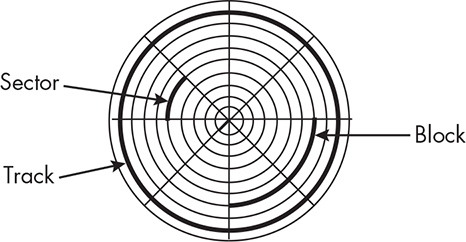
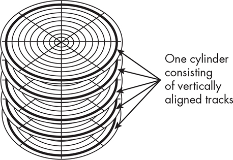
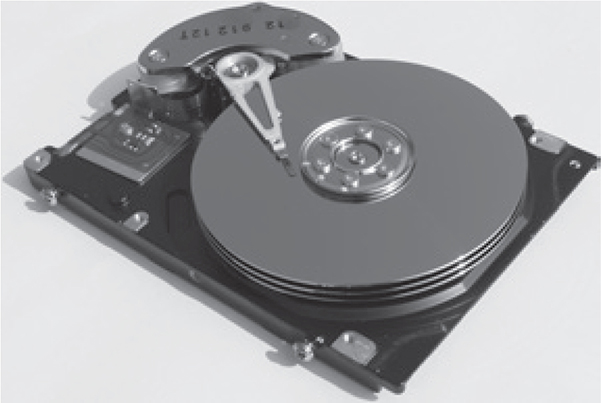
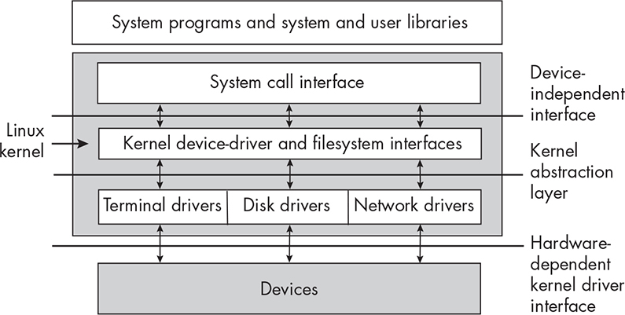
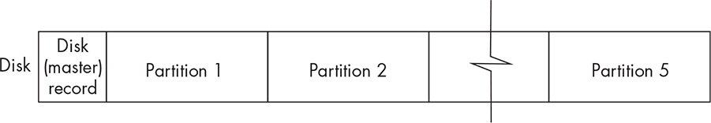
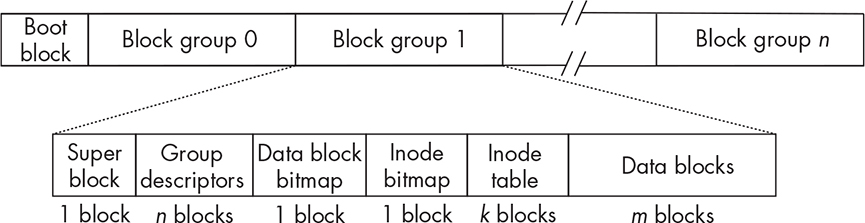
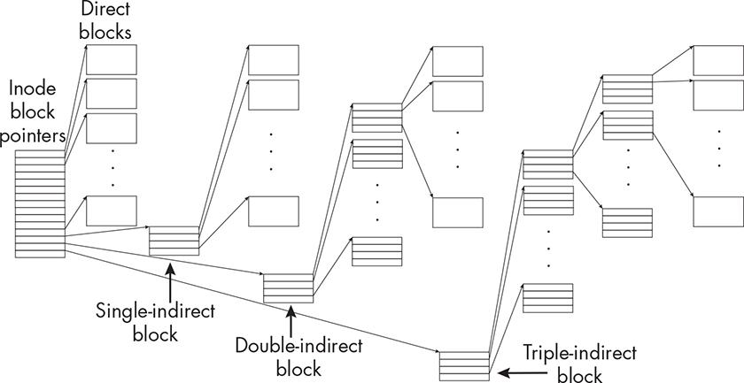
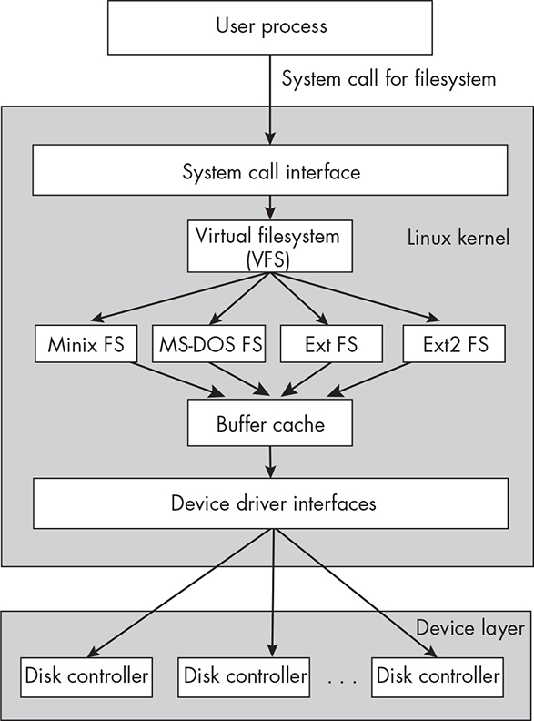
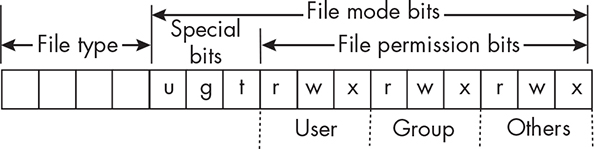

6 OVERVIEW OF FILESYSTEMS AND

FILES

In Chapter 1, we introduced the basic concepts of files, directories, and filesystems. The online chapter, “Working in the Command Line

Interface,” describes the user-level interface to the filesystem, namely the basic commands for working with files and directories. Here, we dig a little deeper into the hardware and software layers on which this

interface is built.

We begin by examining the physical layer that underlies a typical

disk-based filesystem. After that, we discuss the different types of

filesystems supported by Linux, as well as the Linux virtual file system (VFS). We then describe the various data structures used to implement a traditional, generic Linux filesystem, which will make it easier to

develop programs that interact with the filesystem with cognizance of

portability considerations in the design of these programs. This leads us to an exploration of the programming interface to the filesystem, where we examine some of the functions of the Unix API for retrieving both

file and filesystem attributes. Finally, we put this knowledge to use in the design and implementation of a few programs that print these

attributes.

Disks and Disk Partitions

Files play a fundamental role in all Unix systems. Ordinary files can

contain data and programs, directory files organize sets of files, and various types of special files allow us to interact with devices in the same way that we access regular files.

Filesystems are the framework for storing files. They organize the

entire collection of files, providing both the infrastructure and an

interface for accessing them. Most filesystems are *disk based*, meaning that they reside on some type of disk storage device, such as a magnetic disk. They can also reside on other types of physical storage devices

such as magnetic or optical tapes, internal memory, and solid-state

devices such as flash drives. Some are memory based. Because the most

common filesystems are disk based, we begin this chapter with a brief

overview of the structure of disks and the software that manages them.

*Disk Geometry*

Even though the term *hard disk* is in the singular, a hard disk typically consists of multiple disks, which we call platters. A *platter* is a circular, rigid disk that has two *surfaces*, each of which can store data magnetically. They’re usually made from glass, aluminum, or ceramic.

The platters rotate together at a constant fixed rotational speed around a spindle, which is connected to a motor. The rate of rotation is

measured in rotations per minute (RPM).

Data is encoded on each surface in concentric circles. Each

concentric circle is called a *track*. The set of all tracks on all surfaces that are at the same radius from the center of the disk is called a *cylinder*. The tracks in a cylinder are therefore aligned vertically. Tracks are divided into equal length segments called *sectors*, though sometimes different tracks can have a different number of sectors. *Physical blocks* consist of one or more sectors. Physical blocks are most often 512, 1024, or 4096

bytes in size, but they can be other sizes, usually, but not necessarily, multiples of 512 bytes. A block is the smallest unit of data that can be transferred to or from a disk. Sometimes groups of adjacent blocks are

called *clusters*. Figure 6-1 is a schematic representation of a single surface.

*Figure 6-1: The structure of a typical disk surface, showing sectors, blocks, and tracks* In the figure, the thickened arcs represent sectors, blocks, and tracks.

A block is shown having two adjacent sectors, and each track has eight sectors.

Figure 6-2 depicts schematically a cylinder for a five-platter disk drive, which would have 10 tracks in every cylinder.

*Figure 6-2: A schematic representation of a cylinder for a five-platter disk*

Each surface on a disk has a disk head, which moves like the tone-

arm on a phonograph. The tracks of a single cylinder can all be read

with the disk head in the same position.

Figure 6-3 shows a set of disk heads for a three-platter disk drive.

*Figure 6-3: An opened hard disk drive, showing the disk heads. Photo courtesy of Geni via* *Wikimedia Commons, reproduced under CC BY-SA 4.0*

*(*[https://creativecommons.org/licenses/by-sa/4.0/ *)*](https://creativecommons.org/licenses/by-sa/4.0/) *.*

The disk head can both read and write data on the disk, but it needs

to be moved into position to do so.

To read data, for example, the disk head must be moved to the track

containing the data. This is called *seeking*. The time it takes to move the head to the correct track is the *seek time*. Once the head is on the correct track, the disk must be rotated until the block to be read is under the head. The time that it takes to rotate the disk to this position is called the *rotational delay*. Once the head is over the needed sector, the data is transferred. The seek time and rotational delay are startup costs of an

I/O operation, part of its overhead, with seek time dominating this overhead.

In comparison to the amount of time needed to read or write

information in main memory, data transfers to or from a disk are slow

because of seek time and rotational delay. The time it takes to transfer data is a function of the amount of data, but generally, it is orders of magnitude greater than the time to read memory.

*Disk Device Drivers*

The kernel interacts with disks through device drivers. A *device driver* is a collection of kernel functions that make a device respond to the

various system calls such as read(), write(), lseek(), and so on, by

communicating with the device. A *disk device driver*, or a *disk driver* for short, is a particular kind of device driver that interacts with disk drives.

In essence it operates a disk device’s controller, causing actions such as moving the disk head and activating reading and writing on the disk.

Each different disk has a different controller, and therefore, the disk drivers are specific to particular disk devices. On the other hand, no matter which type of disk the driver controls, its interface to the kernel is the same. In short, the kernel has a set of interface specifications with which each disk driver must conform. Figure 6-4 illustrates schematically the relationship between disks, disk drivers, the kernel, and the filesystem.

*Figure 6-4: The layering of interfaces from the hardware up to user space applications* The hardware is the lowest level of the computer system, the device

drivers interact directly with it, and the kernel interacts with them. This organization is part of the concept of device independence that is

characteristic of Unix systems—processes and higher-level parts of the kernel are freed from having to be aware of the differences in devices.

*Disk Partitioning*

In the early days of Unix, a hard disk was formatted as a continuous

sequence of blocks intended to contain a single filesystem. Over time, disk capacities increased and it became possible to divide a single disk into multiple non-overlapping logical entities, each containing a distinct filesystem. These separate portions of a hard disk were called *disk* *partitions*, or *partitions* for short. Disk partitions are also called *logical* *disks*. The act of dividing the disk into partitions is called *partitioning* the disk. Figure 6-5 shows the layout of a disk that has been partitioned.

The first sector of the disk contains a record of how the disk has been

subdivided. This record is often called a *master boot record* ( *MBR*), but modern systems also call it the *global y unique identifier partition table* ( *GPT*). In the figure it is named the *disk (master) record*.

*Figure 6-5: The layout of a disk with five partitions*

Partitions can be used for purposes other than filesystems. Unix

systems define a type of partition called a *swap partition*, or *swap area*, for managing memory. When the kernel needs to make room in memory

for a new process, it writes the memory images of selected memory-

resident processes into this swap partition. Another use of partitions is for database systems. Database management systems often use the disk

in *raw mode*, meaning without a filesystem.

Some of the key benefits of partitioning a disk include the following: More control of file security The files of different user groups

can be placed into different partitions, each with its own mounting

options, such as whether or not it is writeable or read-only, thereby

allowing different degrees of security for different user groups.

More efficient use of the disk Different partitions can employ

different block sizes and file size limits so that filesystems that tend to have much larger files will have different parameters than those that

have smaller ones.

More efficient operation When a disk is partitioned, the distances

that the disk head needs to travel to perform reads and writes tend to be shorter than if it is one large disk, thereby reducing the disk access times.

Selective backup procedures Backups can be performed on individual partitions, rather than entire disks, thereby making it

possible to back up different filesystems at different intervals.

Improved failure recovery When disk media has failures, the

damage can be restricted to a single partition rather than the entire

disk, so that a smaller set of files needs to be repaired or restored.

Reliability Partitioning can be used to create redundant copies of

files, reducing the risk of data loss when one part of the disk is

corrupted because of physical problems or malware attacks.

The biggest disadvantage of partitioning a disk is that partitions

cannot be increased in size. If a partition is created with too small a size, it can reach capacity quickly and cannot be made larger. In this case the entire disk needs to be repartitioned.

Many, Many Filesystems

Neither the design nor the implementation of the Unix filesystem is

part of any Unix standard. Over the years, various flavors of Unix

developed their own filesystems, each of which had its own unique

interface and implementation. For example, Tanenbaum [\[42\]](index_split_014.html#p1239) created the *Minix File System* when he wrote the Minix operating system in 1987, and McKusick et al. [\[26\]](index_split_014.html#p1238) later developed the *Berkeley Fast File System* ( *FFS*) for BSD2. Several Unix distributions adopted and modified the Berkeley FFS. A filesystem derived from FFS is often called a *Unix File* *System*, or *UFS*. The developers of Solaris, for example, created *Solaris* *UFS* \[24\], based on FFS. As of this writing, there are dozens of UFS

filesystems as well as many others supported by Unix distributions in

general. The Wikipedia page,

[*https://en.wikipedia.org/wiki/Comparison_of_file_systems*,](https://en.wikipedia.org/wiki/Comparison_of_file_systems) contains a long list of them. Here, we’ll explore those that are supported by Linux

kernels.

*Filesystems Supported by Linux*

Modern Unix systems such as Linux often support a wide range of different filesystems. We can learn which filesystems are supported on the machine we’re using with a man page search. Entering apropos

filesystem will output a long list of man pages related to filesystems, which we have to filter manually, but entering apropos filesystems results in a shorter list, among which we see the following: \$ **apropos**

**filesystems** *--snip--* filesystems (5) - Linux filesystem types: ext, ext2, ext3, ext4, hpfs, . . *--snip--*

The filesystems man page shows that the current version of Linux as of this writing supports several filesystems, including:

Ext2 The high-performance disk filesystem used by Linux for fixed

disks as well as removable media

Ext3 A journaling version of the Ext2 filesystem

Ext4 A performance upgrade of the Ext3 filesystem

Minix The original filesystem of the Minix operating system, which

was the first to run under Linux

ISO9660 A CD-ROM filesystem type conforming to the ISO 9660

standard

NFS Sun’s Network File System, which also supports other

network filesystems

tmpfs A filesystem whose contents reside in memory

proc A pseudofilesystem which is used as an interface to kernel data

structures

The first five are disk based, but the last three filesystems in this list are not. NFS is a network filesystem that supports access to files on

different computers across a network. A tmpfs filesystem resides entirely in memory, and the */proc* filesystem is not a true filesystem; it looks like one, but in fact, it is just a file-like interface to a set of data structures managed by the kernel.

*The Ext Filesystems*

When Linus Torvalds wrote the first version of Linux, he incorporated the Minix operating system into it, mostly because it was already written and bug free \[[5\]](index_split_014.html#p1236). Shortly after, he and others in the Linux development community implemented a new filesystem named the *extended filesystem* ( *Ext*), which added many new features \[[4\]](index_split_014.html#p1236). Subsequently, the Ext2

filesystem was written by Rémy Card, Theodore Ts’o, and Stephen

Tweedie specifically for Linux in 1992 and released in 1994 \[5\]. It was widely used and was designed with provisions for future enhancements.

The next Linux filesystem was Ext3, which was developed by

Stephen Tweedie and which differs from Ext2 only in that it contains

journaling. *Journaling* is a way to maintain filesystem consistency in the event of hardware failures. A *journal file* records all of the actions that are supposed to be taken on the filesystem, such as creating and deleting files, changing their contents or attributes, and so on. In a journaling filesystem, this record can be used to recover the state of the filesystem without the lengthy task of examining every block on the disk. Ext2 and Ext3 are interchangeable in that one can be converted to the other

while the filesystem is mounted because the difference is only in the

journaling.

The fourth extended filesystem, Ext4, was released in 2008, mostly

to improve performance. While Linux supports many types of

filesystems, the Ext2, Ext3, and Ext4 filesystems are native to it and found on almost all Linux systems. Although there are now several

different Linux filesystems, many are derived from Ext2. Since it’s easier to understand filesystem concepts with a specific filesystem, the

structure of the filesystem described in this chapter is mostly based on the Ext2/3/4 systems. For most discussions, it doesn’t matter which it is, but for others, it will matter, and in those cases I’ll be specific about which I mean.

Filesystem Structure

A filesystem is not just a collection of data structures written onto a disk; it is akin to a C++ object, consisting of data structures and *methods* *that act upon them*. In general, while the methods of a software system

are important to understand, it is often sufficient to know just its data structures to understand how that system works. Linus Torvalds

advocated this principle when he was discussing his design of the git

version control system in 2006, writing, “I’m a huge proponent of

designing your code around the data, rather than the other way around”

( [*https://lwn.net/Articles/193245/*)](https://lwn.net/Articles/193245/) to emphasize the importance of good data structures. By examining the main data structures of the filesystem, we’ll get a good sense of what takes place when our programs issue

requests for the kernel to read or write data. Therefore, in this section, we’ll focus first and foremost on the organization and the data

structures of the Ext2/3/4 filesystems and touch only a bit on some of their methods.

*Partition Layout*

In a modern Linux filesystem, the very first block in the disk partition is the *boot block*. After the boot block, the rest of the space is subdivided into a sequence of equal-size chunks called *block groups*. This is depicted in Figure 6-6, which shows the organization of the partition as well as what is contained in each block group. The figure also shows how many

physical blocks are used by each part of a block group.

Earlier Unix systems grouped blocks into *cylinder groups*, which were blocks contained in one or more adjacent disk cylinders. A cylinder

group is a physical concept, tied to the geometry of the disk, but a block group is a logical concept, independent of the disk geometry, because

modern hard disk drives hide the geometry from the operating system.

If in your readings you encounter references to cylinder groups, think of them as block groups.

The boot block contains information needed by the operating

system to boot the computer. Although there’s a boot block in every

filesystem on a disk, the operating system only uses the very first boot block on the disk for booting under normal circumstances.

*Figure 6-6: Layout of an Ext2 partition with* n *block groups and an exploded view of one* *block group*

Unix systems other than Linux use a similar decomposition of a

partition into equal-size groups; the Berkeley FFS called them cylinder groups. Shortly we’ll see why it’s more efficient to subdivide a partition into equalsize groups, but first let’s see what components each block

group contains, and then we’ll go over what information these

components store and how it’s used.

*Block Group Layout*

In the Ext2/3/4 filesystems, every block group contains the following

data:

A copy of the filesystem’s superblock

A copy of the block group’s set of group descriptors

A data block bitmap

An inode bitmap

An inode table for the files in that block group

The data blocks of all files in that block group

Now let’s explore each of these components.

The Superblock

A copy of the superblock is the first block in each block group. The superblock is a large data structure with more than 100 members,

containing parametric information about the filesystem such as how

many inodes it has, the total number of blocks, the block size, the

numbers of reserved and unused blocks, timestamps of various kinds,

various flags indicating whether it is read-only or locked, information about the system’s mount status, and much more. The term often used

to describe this type of information is *metadata*—data about data. The kernel uses the superblock in block group 0 alone. Copies are kept in

the other block groups in case of a filesystem failure.

Group Descriptors

Every block group has its own set of group descriptors. The group

descriptors store information about the group such as the address of the starting block of each other component of the block group, how many

blocks in the group are in use, how many are free, and so on. For

example, the data structure in Ext4 that stores group descriptors is of type ext4_group_desc and has a couple dozen members. Each group

contains the set of group descriptors of all groups in the partition for reliability in case of filesystem corruption.

Data Block Bitmap

The data block bitmap is a bitmap with 1 bit for every data block in that group. If the block is in use, the bit is 1, and if free, the bit is 0. The data block bitmap is allocated one block on the disk. If that block is 4096

bytes (4KB) in size, it has 8 × 4096 = 215 bits. In this case, the block group can have at most 215 blocks, each of size 4096 (212) bytes, for a total of 227 bytes (128MB) per block group.

Inode Bitmap

The inode bitmap serves a similar purpose for inodes as the data block bitmap does for data blocks. It contains a bit for each inode in the inode table, which indicates whether it is in use or free. Since this bitmap is

also allocated exactly one 4096-byte block, the inode bitmap can keep track of 215 inodes.

Inode Table

Inodes used to be stored in two separate lists: the free-list and the used-list. In modern systems, the inodes are usually in a table, and this is the case for Linux’s Ext2/3/4 filesystems. The inode table stores all inodes for files whose data is in the block group. We introduced inodes in

Chapter 1, noting that an inode stores a file’s status, the original term for its attributes. The term *file metadata* is often used to describe the contents of the inode, especially in the context of filesystems.

The structure that represents an inode is of type struct ext4_inode in Ext4 and similarly named for the other filesystems. It has more then 20

members. In Ext2 and Ext3, the inode is a fixed size of 128 bytes. Doing a bit of arithmetic for Ext2 and Ext3, with a 4096-byte block size, each block can store 4096 / 128 = 32 inodes. The superblock determines how

many inodes can be in each block group. If, for example, a block group can have 256 inodes, then storage for the inode table would require 256

/ 32 = 8 blocks.

In Ext4, the inode can be larger. Ext4 added more fields to the inode

than were present in the earlier systems. For example, the i_crtime

member, which stores the file creation time, was not in the earlier

inodes, but was added to the struct ext4_inode. The inode itself has a member named i_extra_isize that indicates how much larger than 128

bytes it is.

In Chapter 1, we saw that a defining characteristic of Unix file management is that file data is not stored with the file’s metadata and that all of a file’s metadata is stored in the inode. This includes

timestamps such as when the file was created, last modified, and last

accessed. It also includes its mode, its size in bytes, how many blocks it uses, and how many links refer to it. Most importantly, it’s where the pointers to all of the file’s data blocks are stored. This implies that the inode must be accessed many times in order to access the file’s data.

The method of storing files in Unix is flexible and efficient. Its design was visionary because it allowed for huge files, even when there was no way to store huge files. The inode in a Unix system contains an array of (typically) 15 block pointers. A block pointer is usually 4 bytes long. In systems with 15 block pointers, they’re used as follows:

For regular files, the first 12 block pointers in this array are the

addresses of the first 12 blocks of the file. If the block size is 4096

bytes (4KB), then a file of size at most 12 × 4096 bytes, or 48KB,

can be accessed by one level of indirection through these pointers.

If a regular file is larger than 48KB, then the 13th pointer contains

the address of a *single-indirect block*, which is a 4096-byte block used to store block addresses. Since a block address is 4 bytes, there are

4096 / 4 = 1024 block addresses in this block. Since each of these

1024 blocks is 4096 bytes, the 13th pointer allows for addressing an

additional 1024 × 4096 bytes (4MB). Therefore, using the first 12

pointers and the 13th allows for accessing files whose size is up to

48KB + 4MB.

For still larger files, the 14th pointer is the address of a *double-indirect block* that similarly contains 1024 addresses of single-indirect blocks, each of which contains 1024 block addresses. This

accommodates files with sizes up to 48KB + 4MB + (1024 × 1024 ×

4)KB, which is 48KB + 4MB + 4GB.

The 15th address is that of a *triple-indirect block*, which, needless to say, points to 1024 double-indirect blocks. Since each double-indirect block points to 1024 × 1024 data blocks, using this pointer,

we can access 1024 × 1024 × 1024 blocks, each of size 4KB, in

addition to the blocks pointed to by the other pointers. This lets us

address files whose total size is in excess of 1024 × 1024 × 1024 ×

4KB, which is 4TB.

Figure 6-7 depicts the use of these direct and indirect blocks in the inode.

*Figure 6-7: The structure of a inode, showing pointers to direct and indirect blocks* For clarity, only four addresses are shown in the indirect blocks. The number of addresses in a 4KB block would be 1024.

Data Block Area

The last part of a block group is the set of blocks reserved for file data.

Every effort is made to store all of the blocks of a file in the same block group as its inode. For large files, this is not always possible, and their data blocks may be allocated in other block groups.

*Performance Considerations*

Modern filesystems do not try to store all of a file’s data as a single sequence of consecutive blocks. Although accessing the data of a file

would be faster if they did, the disk space would be utilized poorly

because there would be many empty gaps that would be too small for

entire files. In addition, finding space to write a new file would take

more time, since the filesystem would have to find free space large enough for the file. Instead, filesystems divide the file’s data into blocks and store the blocks in noncontiguous locations. This results in very

high disk utilization, but it introduces other problems.

For one, it takes more time to find a file’s data blocks. For another, because the blocks may not be close to each other, it causes more disk seeking between accesses, increasing file access *latency*, the time needed to set up the access before the transfer of data.

If a partition were not subdivided into block groups and there were a

single inode table at the beginning of the partition, then every file access would require even more disk seeking for moderately large files, because the inode needs to be accessed each time a new data block must be

accessed, implying that the disk head would have to travel back and

forth between the inode table and the data blocks frequently. In

addition, the blocks of a file could be very far away from each other, causing more seeking.

The use of block groups mitigates these problems while still

allowing the blocks of a file to be stored on disk noncontiguously. It decreases overall seek time because the inodes and bitmaps that are used to locate data blocks are either in the same cylinder as the blocks or close to that cylinder. Also, the allocation method used by the inodes in Unix allows the kernel to calculate the starting address of a block with simple arithmetic. However, the use of double-indirect and triple-indirect pointers increases the CPU time needed to access data blocks, because several pointer dereferences are needed for each block. This

increase in time is offset by the use of the kernel I/O buffering

described earlier in Chapter 4.

Another issue regarding performance is the size of the block. Files

are always allocated whole blocks, never pieces of a block. It’s extremely rare for the size of a file to be an exact multiple of the block size.

Because of this, the final block of storage is only partially filled. The unused, or wasted, space inside a block is called *internal fragmentation*.

On average, the fraction of the last block that is unused is 50 percent.

This implies that the larger the block size, the more space is wasted in that last block.

When most files are small, larger block sizes result in more wasted disk space, because small files have fewer blocks, so proportionately, the wasted space in the last block is a larger fraction of the file size. As an example, suppose that block size is 4KB. If files are 100KB in size on average, they use an average of 25 4KB blocks, of which 2KB in each

last block is wasted space. Therefore, the unused space per file is

2KB/100KB or 2 percent of its allocation. On the other hand, if files are much smaller, about 16KB in size, they need just four 4KB blocks each, so their wasted space is 2KB/16KB per file, or 12.5 percent. Wasted

space also translates to wasted time, since there’s more disk activity and more disk waits on average.

Larger block sizes improve performance for filesystems expecting

large files. Often a system administrator will choose smaller block sizes for the root filesystem, which tends to have smaller files, and larger ones for user data. How large are files on average? In 1993, one study that surveyed the sizes of files found on the internet, by collecting data on over 12 million files across 1,000 filesystems, found that the median file size was just under 2048 bytes, with the average size being 22KB [\[15\]](index_split_014.html#p1237).

The Kernel’s Filesystem Interface

A filesystem has to provide methods that the kernel can call so that it can provide its services to user programs. Such methods include

functions to create files, to read and write data, to retrieve file

properties, to move the file offset, and so on. It also has to provide functions for retrieving information about disk usage and other

filesystem properties. To get a better sense of the kernel’s interaction with the filesystem, we’ll work through an explicit example, namely

creating a new file and writing data into it.

*Creating a New File*

Suppose that the current working directory is */home/snw/testing* and that we enter the command: \$ **gcc -o myprog myprog.c**

Assuming that the program is compiled and linked and that we have

write and execute permission for the directory */home/snw/testing*, gcc will

create a file named *myprog* in this directory. To create this file, gcc must either call open() with the O_CREAT flag or call creat(), requesting the kernel to create it. The kernel in turn must perform a sequence of actions,

which it does by making calls to lower-level filesystem methods. In the following discussion, when I say that the kernel does this or that, I really mean that the kernel calls various filesystem methods that actually

perform that action.

To create a file, the kernel takes the following steps, which leave out several details, such as handling errors:

1\. It checks whether the filename is valid and whether the filename

doesn’t exist already in the given directory.

2\. It checks whether the process has permission to create a file in this directory.

3\. It acquires a new inode for the file.

4\. It fills in the inode with the file status.

5\. It creates a directory entry in the *testing* directory with the inode number and filename *myprog*.

Let’s look at each of these steps in more detail.

Checking Whether the Filename Exists

The kernel checks whether the filename is too long or has invalid

characters and so on. It then checks whether the filename does not

already exist in the given directory, */home/snw/testing*. If any checks fail, it stops here, with a suitable message. If not, it continues to the next step.

Checking Permissions

The kernel checks whether the file can be created in the given directory before it continues. If all goes well, it continues.

Creating the Inode

The kernel tries to create an inode. It must get a free inode in the inode table. The inode bitmap is used for this purpose. If there are no free inodes, the kernel must report the error and stop here. In this case, we’ll get a message that the filesystem is full. In this step, a copy of the inode table in memory is used; the disk version of it isn’t accessed.

Updating the Inode

Assume that the kernel obtained an inode, say, one with index 47 in the inode table. The kernel fills the inode with the owner, permissions, time of last modification, and so on. It then saves the inode number, 47, of this inode, for later use. The updates to this inode are in the memory copy of the table, not the disk-resident copy. The disk copy is updated periodically by the kernel.

Recording the Filename in the Directory

If all of the preceding steps were successful, then the kernel creates a new entry in the current working directory consisting of the pair (47, *myprog*), because 47 is the inode number and *myprog* is the name.

*Writing Data to a File*

Our example command, gcc -o myprog myprog.c, also writes the executable code to the file, which means that the running process issues the write() system call to write that data to the file. Two major steps that must be performed by write() are:

1\. Allocating data blocks for the file and storing the file data into

these blocks

2\. Recording the addresses of the data blocks in the inode

To write the data to the file, the kernel must acquire the right

number of free blocks. While gcc is running, it is generating the data to write to the file, creating it in smaller pieces at a time. Each chunk is given to the kernel through the write() system call. Because the kernel does output buffering, the file is being stored in kernel buffers, which are not written to disk until the buffers are flushed. If the amount of

data is small, all of it will fit in memory buffers and the kernel will know exactly how many disk blocks are needed for it. If the file is very large, the kernel may start allocating blocks before it knows the file’s actual size. Assuming that there are enough free blocks, it will first allocate direct blocks. If the file is larger than the number of bytes that can fill all of the direct blocks, the kernel allocates single-indirect blocks as

needed. If it is larger than the amount of storage they can provide, it starts allocating double-indirect blocks. It continues this procedure, using triple-indirect blocks if not even all of the double-indirect blocks will suffice.

Note that the data block bitmaps are used in this step to find free

blocks and that the bitmaps are modified to mark blocks as being in use as they’re allocated. Note too that the locations of the data blocks are implicitly recorded in the inode by these steps because the data block pointers point to them.

The Virtual Filesystem

The filesystem design just described is the basis for many Unix

filesystems, but in general, filesystem implementations differ from each other. Furthermore, Unix systems almost always support the ability to

mount different types of filesystems onto the directory hierarchy, which implies that different parts of the hierarchy can be on devices with

different filesystems. This leads to a problem that we now introduce by example.

Many Unix systems allow users to mount Microsoft’s FAT, FAT32,

and NTFS filesystems. FAT stands for file allocation table and is the

filesystem found on many Microsoft operating systems as well as on

external storage devices such as USB flash memory drives. NTFS is

Microsoft’s New Technology File System, introduced in 1993 with

Windows NT 3.1. In Chapter 1, we saw that a directory in Unix is a file that consists of a list of directory entries, each of which contains the name of a file and a reference to that file. In FAT and FAT32 systems, directories don’t have this structure. In order to mount these systems

and access the files in them, the kernel must make their directories look like the traditional Unix directories. This is just one problem.

The more general problem is that, when many different filesystems

are mounted onto the directory hierarchy, the kernel can’t have single implementations of the various file-related system calls such as read(), write(), and lseek() because the code in those functions depends on how the filesystem is implemented.

Consider our simple implementation of the cp command from

Chapter 4, which we named spl_cp1. It makes calls to open(), close(), read(), and write(). Suppose that we insert a USB flash drive that has a FAT

filesystem on it into a USB port on our machine. Suppose too that the

drive’s name is *MyDrive*. Modern machines automatically mount these flash drives by attaching them to the directory hierarchy either under

*/media* or under */mnt*. Assuming that it’s mounted under */media* and we want to copy a file named *mywork* from that drive into our home directory, we’d enter the command \$ **./spl_cp1**

**/media/MyDrive/mywork ~/mywork**

and it would successfully copy the file from a FAT filesystem to the

native filesystem, say, Ext4. We explore why this works.

The locations and sizes of a file’s data blocks vary from one system

to another, making it almost impossible to have a single function that finds them without knowing the underlying filesystem implementation.

As a result, the actual machine code that’s executed when the file-related system calls are invoked is not bound to the system call names when the kernel is compiled.

Let’s try to understand this problem in terms of a different problem

with which we’re more familiar, namely how pointers and virtual

functions work in a programming language. When we don’t know at

compile time how much storage a variable will need for a running

program because it depends on how much data is input, we don’t

declare that variable statically. Instead we declare a pointer and allocate memory to the structure at runtime. This is called *runtime* or *delayed* *binding* because the binding of the name of the variable to its storage location is delayed until runtime. In C++, when a class contains a virtual function, the code that’s executed when that function is called is not

bound to the function’s name until runtime, which is another form of delayed binding. In the case of virtual functions, the solution is opaque to the programmer because the C++ runtime library handles the

binding internally with a special table called a *virtual dispatch table*.

In Linux, as well as in several other Unix systems, this same idea

underlies the kernel’s interface to the filesystem. The designers of Ext2

created a layer of abstraction within the kernel on top of all mounted filesystem operations. This layer is called the *virtual filesystem (VFS)*.

The VFS defines an abstract filesystem interface and hides its

implementation. At runtime, it binds the implementations of filesystem-related calls to functions that are hardcoded in each mounted filesystem, which is, in essence, a form of delayed binding. The original Linux VFS

was written by Chris Provenzano and later rewritten by Linus Torvalds.

The VFS defines a set of functions that every filesystem is required

to implement. This interface is made up of a set of operations associated with three kinds of objects: filesystems, inodes, and open files.

When a process issues a file-oriented system call, the kernel calls a

function contained in the VFS. This function handles the structure-

independent operations and then redirects the call to a function

contained in the physical filesystem code, which is responsible for

handling the structure-dependent operations.

For example, let’s consider the read() system call. When a program

opens a file, it gets a file descriptor for the open file. That file descriptor is a reference to a data structure that represents the file, which we

learned earlier is called the open file description. One field of this structure, in Linux named f_op, is a pointer to a table of function

addresses. The actual function that’s called when read() is invoked is f_op-

\>read(...). If the file were on an MS-DOS filesystem, one function would be called, and if it were on an Ext4 filesystem, a different function would be called.

How is the table pointed to by f_op initialized with the addresses of

the functions? The VFS stores information about filesystem types

supported by the kernel in a table that’s created during the kernel

configuration. When a filesystem is mounted, the kernel uses this table to populate a mounted filesystem descriptor with the data needed by the

VFS. A *mounted filesystem descriptor* contains several types of data, including data common to all filesystem types, pointers to the functions provided by the actual filesystem, and private data maintained by the

actual filesystem code.

The VFS supports many different types of underlying physical

filesystems. In fact, in Sun’s variants of Unix, from SunOS through

Solaris, and in BSD and FreeBSD, the concepts of inode and inumber

(inode number) have been replaced with those of *vnode* and *vnumber*, with the *v* standing for “virtual.” Linux continues to use the term *inode*.

A schematic representation of these levels within the Ext2 filesystem, based on \[[5\]](index_split_014.html#p1236), is depicted in Figure 6-8.

*Figure 6-8: A schematic representation of the Linux VFS incorporating the Ext2 filesystem*

Exploring the Filesystem API

Our next goal is to apply what we’ve learned about file and filesystem attributes to write a few programs that interact with the filesystem-related parts of the kernel API. Candidate programs could be ones that display the metadata of a given filesystem, or those that display a file’s metadata. If we know how to retrieve a file’s metadata, we could write many different useful commands, such as one that determines whether

two filenames are links to the same actual file, or whether they’re owned by the same user, or which of two files was created or modified more

recently.

Our ultimate goal is to write a program that accesses filesystem

metadata. If we can find a command that can display this metadata, we

could model our program after it. We’ll discover that, because the API related to filesystems is not a part of POSIX, navigating through it is a bit murky. Nonetheless, this will be a valuable exercise in system

programming.

We’ll begin by searching the man pages for a command that displays

filesystem metadata, in the hope that its man page will lead to other

resources. It isn’t enough to search only for the one-word term *filesystem* because in the man pages it is sometimes one word and sometimes two,

since different man pages are authored by different people.

In the following query, we limit the search to Section 1 and snip out

matches that aren’t relevant.

\$ **apropos -s1 "filesystem" "file system"**

*--snip--*

lsattr (1) - list file attributes on a Linux second extended file s...

*--snip--*

stat (1) - display file or file system status

The first command, lsattr, isn’t what we want, since it just displays a list of files and their attributes in an Ext2 filesystem. The second of the two, stat, is one we introduced briefly in Chapter 1.

The stat Command

Let’s look at the stat man page in Section 1 to see if it leads us in the right direction: \$ **man s1 stat** STAT(1) User Commands STAT(1)

NAME stat - display file or file system status SYNOPSIS stat

\[OPTION\]. . FILE. . DESCRIPTION Display file or file system status.

Mandatory arguments to long options are mandatory for short options

too. -L, --dereference follow links -f, --file-system display file system status instead of file status *--snip--*

When we used the stat command in Chapter 1, it was to view a file’s status. Notice though that it can also be used to display attributes of filesystems by giving it the -f or --file-system option. In this case, it shows the status of the filesystem on which the given file resides. The difference in output with and without -f is illustrated here: \$ **stat**

**/etc/bash.bashrc** \# status of file /etc/bash.bashrc File:

/etc/bash.bashrc Size: 2319 Blocks: 8 IO Block: 4096 regular file

Device: 10302h/66306d Inode: 10486298 Links: 1 Access: (0644/-rw-r--

r--) Uid: ( 0/ root) Gid: ( 0/ root) Access: 2018-06-05

14:03:30.199540534 -0400 Modify: 2018-04-04 14:30:26.000000000

-0400 Change: 2018-06-05 14:03:30.199540534 -0400 Birth: 2018-06-

05 14:03:30.199540534 -0400 \$ **stat -f /etc/bash.bashrc** \# Status of filesystem containing /etc/bash.bashrc File: "/etc/bash.bashrc" ID: b07bc00fdedb9bf9 Namelen: 255 Type: ext2/ext3 Block size: 4096

Fundamental block size: 4096 Blocks: Total: 58651894 Free: 28744967

Available: 25747399 Inodes: Total: 14974976 Free: 13698698

Without the -f, stat displays some of the file’s attributes whereas with it, it displays attributes of the filesystem containing that file.

The man page further states that stat has a -c *FORMAT* option to control which attributes it displays as well as their formats, where *FORMAT* is a string similar to that used in the date command (see Chapter 3). The format specifiers consist of a percent sign followed by a letter, such as %a,

%b, and so on. The meanings of the various format specifiers depend on whether or not the -f option is present. Without it, they specify formats for file status, and with it, for filesystem status. For example, for files, %b is the number of blocks allocated to the file, whereas for filesystems, it is

the total number of blocks in the filesystem. To demonstrate, we enter the two commands: \$ **stat -c"Blocks allocated: %b" /etc** Blocks allocated: 24 \$ **stat -f -c"Total blocks in filesystem: %b" /etc** Total blocks in filesystem: 58651894

Some of the other format specifiers for filesystem status are as follows:

**%b** Total data blocks in filesystem

**%c** Total file nodes in filesystem

**%d** Free file nodes in filesystem

**%f** Free blocks in filesystem

**%i** Filesystem ID in hex

**%S** Fundamental block size (for block counts)

**%T** Filesystem type in human-readable form

We’d like to write a limited version of this command that displays

just filesystem metadata, as an exercise in using the Linux filesystem API. First, we check whether the man page has enough information in it to get started. In the SEE ALL section of the page it mentions three system calls: stat(), statfs(), and statx(). The man pages for stat() and statx() tell us that they display the statuses of files, not filesystems. The third, statfs(), gets filesystem statistics and might be what we want, but out of curiosity, we’ll look at the stat() man page in Section 2 because learning about stat() might give us some insights into writing our program,

which we’ll return to later.

The stat() System Call

Because there’s both a command and a system call named stat, to view

the stat() system call’s man page, we need to specify Section 2 when

issuing the man command: \$ **man -s2 stat** STAT(2) Linux

Programmer's Manual STAT(2) NAME stat, fstat, lstat, fstatat - get file status SYNOPSIS \#include \<sys/types.h\> \#include \<sys/stat.h\> \#include

\<unistd.h\> int stat(const char \*pathname, struct stat \*statbuf); int

fstat(int fd, struct stat \*statbuf); int lstat(const char \*pathname, struct stat \*statbuf); \#include \<fcntl.h\> /\* Definition of AT\_\* constants \*/

\#include \<sys/stat.h\> int fstatat(int dirfd, const char \*pathname, struct stat \*statbuf, int flags); *--snip--* DESCRIPTION These functions return information about a file, in the buffer pointed to by statbuf. No permissions are required on the file itself, but in the case of stat(), fstatat(), and lstat() execute (search) permission is required on all of the directories in pathname that lead to the file. *--snip--*

The page describes several related functions, the first three of which return information about a given file in their second argument, which is the address of a stat structure. The differences among the first three are only in how the file is specified:

The stat() function expects a pathname for the file, and if the file

we name is a symbolic link, it gives us information about that link’s

target. For example, if *mylink* is a soft link to *target*, stat() returns information about *target*.

The lstat() function also expects a pathname for the file, but if it’s given a symbolic link, it returns information about the link itself,

not its target. Using the same example, it would return information

about *mylink*.

The fstat() call is given a file descriptor instead of a pathname.

The fourth system call listed there, fstatat(), is a more general function, designed so that it can behave like any of the other three. We won’t

investigate it here.

NOTE

*It might be confusing that there’s a command named* *stat, a system cal* *named* *stat, and a data structure named* *stat! We’l be very clear about* *which we mean. This type of overloading of names also occurs in other* *parts of the API.*

None of these functions can be used to access attributes of a

filesystem per se, but studying them will help us to understand how to

write programs that access this type of data because, as we’ll see shortly, metadata is often stored in a form that requires some type of parsing or unpacking, and these will require similar preprocessing.

The DESCRIPTION section of the man page tells us that we need execute

permission on the path to the file if we call stat() but not if we call fstat(). If we call fstat(), we need a file descriptor for the file, which we can get by opening the file, whereas we don’t need to open a file to call stat(). We’ll decide later which to use, but first let’s read about the stat structure.

*The stat Structure*

The man page has the definition of the stat structure: struct stat { dev_t st_dev; /\* ID of device containing file \*/ ino_t st_ino; /\* Inode number

\*/ mode_t st_mode; /\* File type and mode \*/ nlink_t st_nlink; /\*

Number of hard links \*/ uid_t st_uid; /\* User ID of owner \*/ gid_t

st_gid; /\* Group ID of owner \*/ dev_t st_rdev; /\* Device ID (if special file) \*/ off_t st_size; /\* Total size, in bytes \*/ blksize_t st_blksize; /\* Block size for filesystem I/O \*/ blkcnt_t st_blocks; /\* Number of 512B blocks allocated \*/ /\* Since Linux 2.6, the kernel supports nanosecond

precision for the following timestamp fields. For details before Linux 2.6, see NOTES. \*/ struct timespec st_atim; /\* Time of last access \*/

struct timespec st_mtim; /\* Time of last modification \*/ struct timespec st_ctim; /\* Time of last status change \*/ \#define st_atime st_atim.tv_sec

/\* Backward compatibility \*/ \#define st_mtime st_mtim.tv_sec \#define

st_ctime st_ctim.tv_sec };

This structure has fields to store the most consequential members of a file’s inode such as the ID of the device on which it resides, its inode number, the file mode and type, various data related to its size and

allocation, timestamps, and so on. The macros st_atime, st_mtime, and

st_ctime are defined for older programs that were written before the

kernel started supporting nanosecond time resolution.

The data types of all of these fields are not native C types, meaning

that they’re not part of the C programming language. They are *system* *data types*, which means that they’re defined in header files in the system.

The advantage of defining data structures with system data types is

portability. The number of bytes in an integer type in C varies from one operating system to another. A long int might be 4 bytes on one machine and 8 on another. If a program declares a variable to be of type long int and it needs to store a value of type uid_t, it may not have enough bytes on some machines. In contrast, the system data types are defined

internally as typedefs of native C types, so that if a value is of type uid_t and a program declares a variable of type uid_t to receive that value, it is guaranteed to have the required number of bytes.

To write a program to extract and print the data from the fields of

the stat structure, we have to know more about these types. Because this is most likely going to be true for our planned spl_statfs program, we need to learn what these types are and how we can work with them.

This man page has a lot of information, especially in the DESCRIPTION and NOTES sections; almost everything we need to know is there.

For the st_dev field, the page suggests reading about the major() and

minor() functions st_dev This field describes the device on which this file resides. (The major(3) and minor(3) macros may be useful to

decompose the device ID in this field.)

and for the st_mode field, it suggests reading the man page inode(7):

st_mode This field contains the file type and mode. See inode(7) for

further information.

For all remaining fields, it refers us to the inode(7) man page. Section 7

pages are always very informative: \$ **man -s7 inode** INODE(7) Linux Programmer's Manual INODE(7) NAME inode - file inode

information DESCRIPTION Each file has an inode containing

metadata about the file. An application can retrieve this metadata using stat(2) (or related calls), which returns a stat structure, or statx(2), which returns a statx structure. *--snip--*

Following this brief description is a list of the inode members available for access through these system calls, with detailed descriptions of each.

Some members of an inode are for internal use and not exposed in the

kernel API, so they aren’t mentioned in this page. The page also shows us how we can extract the file type and permission bits in the st_mode member, which we’ll return to shortly, and describes feature test macros and conformance to standards.

How can we learn more about the other system data types appearing in the structure? In previous chapters, we encountered types such as

off_t, size_t, and time_t, which are also system data types. If we want to learn more about them, we could see if there’s a man page that describes or explains more about them. A reasonable search would be apropos

"system data type": \$ **apropos "system data type"** FILE (3) - overview of system data types aiocb (3) - overview of system data types clock_t (3)

\- overview of system data types clockid_t (3) - overview of system data types dev_t (3) - overview of system data types div_t (3) - overview of system data types *--snip--* system_data_types (7) - overview of system data types *--snip--*

We get a very long list of matches, but they’re all for the same page

in Section 7. That page has a long list of almost all system types, with entries such as the following: dev_t Include: \<sys/types.h\>. Alternatively,

\<sys/stat.h\>. Used for device IDs. According to POSIX, it shall be an integer type. For further details of this type, see makedev(3).

Conforming to: POSIX.1-2001 and later. See also: mknod(2), stat(2) *--*

*snip--*

For each listed type, it tells us which header file has its declaration; what it’s used for; what kind of type it is, such as whether it’s an integer type or a structure of some kind; what the various standards say about its

size; and which interface functions use it. In general, when we want to learn what a specific type is, this page is our starting point.

*The File Mode*

The file mode is stored in the st_mode member of the stat structure.

POSIX.1 -2024 specifies the purpose of each of its 16 bits. The highestorder 4 bits are called the *file type* bits. The low-order 12 bits are called the *file mode bits*. Among these 12 bits, the low-order 9 bits are the *permission bits*. The 3 bits above them are the *special bits*. Figure 6-9

illustrates the meanings of the bits.

*Figure 6-9: The file mode bits in the st_mode member*

The file type bits define which of the seven possible file types the file is, such as whether it’s a regular file, a directory, a symbolic link, or one of the special files. The special bits alter permissions in a few different ways. The highest order special bit is the setuid bit, which we

introduced in Chapter 4. The next two bits are the setgid bit and the sticky bit; we’ll explain their significance and use in “The setgid Bit” and

“The sticky Bit” sections next. The next 9 bits are the permission bits, grouped into three sets of 3 bits each. Each set has a read, write, and execute bit. The three sets of bits are respectively the permissions

associated with the user, the group, and others. A 1-bit means the

permission or property is on, and a 0-bit that it is off.

POSIX.1-2024 standardizes various macros that facilitate extracting

the values of these bits. Some of the macros are masks and others are

macro functions for querying the values. The \<sys/stat.h\> header file contains all of the macro definitions, and the inode man page describes them. The single-bit masks for the file mode component of the st_mode

are: S_ISUID 0004000 /\* setuid bit \*/ S_ISGID 0002000 /\* setgid bit

(see below) \*/ S_ISVTX 0001000 /\* Sticky bit (see below) \*/ S_IRWXU

00700 /\* Mask for file owner permissions \*/ S_IRUSR 00400 /\* Owner

has read permission. \*/ S_IWUSR 00200 /\* Owner has write

permission. \*/ S_IXUSR 00100 /\* Owner has execute permission. \*/

S_IRWXG 00070 /\* Mask for group permissions \*/ S_IRGRP 00040 /\*

Group has read permission. \*/ S_IWGRP 00020 /\* Group has write

permission. \*/ S_IXGRP 00010 /\* Group has execute permission. \*/

S_IRWXO 00007 /\* Mask for permissions for others \*/ S_IROTH

00004 /\* Others have read permission. \*/ S_IWOTH 00002 /\* Others

have write permission. \*/ S_IXOTH 00001 /\* Others have execute permission. \*/

The following code snippet is an example of how they can be used,

but without checking whether stat() returned an error: stat("myfile",

&statbuffer); if ( statbuffer.st_mode & S_IROTH ) printf("myfile is readable by others.\n");

The masks for retrieving file type are: S_IFMT 0170000 /\* Mask for file type bits \*/ S_IFLNK 0120000 /\* Symbolic link \*/ S_IFREG 0100000

/\* Regular \*/ S_IFBLK 0060000 /\* Block device \*/ S_IFDIR 0040000 /\*

Directory \*/ S_IFCHR 0020000 /\* Character device \*/ S_IFIFO

0010000 /\* FIFO \*/

For example, to retrieve the file type and test whether the file is a

directory, we’d write the following code, again without checking for

errors from stat(): stat("myfile", &statbuffer); if ( S_IFMT & statbuffer.st_mode == S_IFDIR ) printf("myfile is a directory.\n"); else printf("myfile is not a directory.\n");

Because retrieval of the file type is such a frequently performed

action, POSIX.1-2024 defines macro functions for testing the file type, which are easier to use than the masks. In the following macros, the m argument is the 16-bit value of the st_mode member: S_ISREG(m) /\* Is it a regular file? \*/ S_ISDIR(m) /\* Directory? \*/ S_ISCHR(m) /\*

Character device? \*/ S_ISBLK(m) /\* Block device? \*/ S_ISFIFO(m) /\*

FIFO (named pipe)? \*/ S_ISLNK(m) /\* Symbolic link? \*/

S_ISSOCK(m) /\* Socket? \*/

Using the macros, the previous example could be written as:

stat("myfile",&statbuffer); if ( S_ISDIR(statbuffer.st_mode) ) printf("myfile is a directory.\n"); else printf("myfile is not a directory.\n");

These macros make it easy to write code to determine whether a given

file has specific permissions as well as to determine its type. Before we demonstrate with a few examples, let’s explore the special bits

mentioned previously.

*The setgid Bit*

In Chapter 4, we introduced the user IDs associated with a process.

Processes have an analogous set of group IDs, namely a real group ID,

an effective group ID, and a saved set-group ID. Their meanings are

analogous as well.

The *setgid* bit is similar to the setuid bit except that, when a file has that bit set and it contains an executable program, when that program is run, the effective group ID of the process becomes the group ID of the group of the file. If the group of a file containing an executable program is *G*, for example, and the file’s setgid bit is enabled, then when the program is run, it runs with its effective group ID equal to that of group *G* rather than the group ID of the user running the program, except in a few unusual circumstances.

The setgid bit has a different meaning when the file is a directory. In this case, all files created in that directory inherit their group IDs from the directory rather than from the process that creates them. This

feature makes sharing files easier, since a directory with an enabled

setgid bit will allow users of the same group to add files that all

members of the group can use in the same way.

The setgid bit has a few interesting applications, one of which is the write command. The write command (/usr/bin/write, not the write() system call), is a command that lets users write to a terminal other than their own. The syntax is: write *username* \[ *ttyname* \]

If a user has multiple terminals open, the optional second argument lets us specify to which terminal to write. After we enter this command,

everything we type will be displayed on the user’s terminal, until we

enter an end-of-input signal (CTRL-D). To try it, type who to see who’s logged on and which terminals they’re using.

Suppose I am logged in on terminal /dev/pts/2. You could type \$

**write sweiss /dev/pts/2** Can I bother you? CTRL-D

and wait for my response. Your typing will appear on my terminal

window. How is it possible that one person can write on another

person’s terminal?

The write command needs write permission on the terminal on

which it wants to write. First take a look at the list of pseudoterminal

devices in /dev/pts. The list will look something like: \$ **ls -l /dev/pts** crw------- 1 ariel tty 136, 1 Mar 5 17:50 1 crw--w---- 1 jake tty 136, 3

Mar 3 16:22 3 crw--w---- 1 lindy tty 136, 5 Mar 3 15:40 5 crw--w---- 1

sweiss tty 136, 7 Mar 5 18:00 7

Some of these have the group-write bit set and others do not. All of

these belong to the tty group, which means that any process that runs

with the effective group ID equal to the group ID of tty can write to

those terminals whose write bit is set.

Now take a look at the write command’s mode bits: \$ **ls -l**

**/usr/bin/write** -rwxr-sr-x 1 root tty 10124 Jan 27 2025 /usr/bin/write When the setgid bit is enabled, the x representing the execute-bit in the group sector of the mode is replaced by an s. You can see that the write executable is in the tty group and its setgid bit is enabled. When we run write, the process that executes it runs with the effective group ID of the write program, which is the tty group. This implies that the write

command will be able to write to any terminal whose group-write bit is set.

Since it can be annoying to receive messages on your terminal while

you’re working, Unix provides a simple command to query, enable, or

disable this bit: \$ **mesg \[ y/n \]**

If you enter mesg alone, it will display y or n, depending on whether the bit is set. Entering mesg y enables writing and mesg n turns it off.

*The sticky Bit*

The *sticky* bit, also called the *save-text-image bit*, serves two different purposes when it is applied to files and directories. Originally, Unix was a pure swapping operating system—processes were swapped in and out

of memory to maintain the multiprogramming level. The swapping

store was a separate disk or a separate partition of a disk that was used exclusively for storing process images when they were swapped out. The executable code and other data were kept in contiguous bytes on the

swapping store, making reads and writes faster.

A program that was used by many people might go through many

memory loads and unloads each day. Putting it in the swapping store

made loads and unloads easier, because the file was in one piece. Setting the sticky bit on a program file prevented it from being removed from

the swapping store.

If a directory has the sticky bit enabled, then a file that someone

creates in the directory will be protected from being deleted or renamed by anyone except that person, the directory’s owner, and a process with superuser privileges. Setting the sticky bit on a directory lets all

processes put files into it in such a way that only processes with the same effective user ID as the process that created the file can remove those files. For example, some Unix systems set the sticky bit on the

directory */var/tmp/* so that it can be used as a place for processes to write temporary files. You can tell when the sticky bit is set on a

directory because the letter x in the *others* part of the mode string displayed by commands such as ls -ld is replaced by a t, as in: \$ **ls -ld**

**/var/tmp** drwxrwxrwt 14 root root 4096 Nov 17 10:09 /var/tmp/

If you have that directory on your computer, try this experiment: \$

**touch /var/tmp/emptyfile** \# Create or update a file in /var/tmp. \$ **ls**

**/var/tmp/** \# Prove that it's there. emptyfile *--snip--*

If you have a second user on your host, ask them to delete that file to see if they can. They won’t be able to, but you can.

*An Example lstat Program*

Let’s turn our attention to the stat() system call. The stat (2) man page has an EXAMPLES section containing a complete program that calls lstat() to print out a file’s metadata. Since the stat() and lstat() calls differ only in how they treat symbolic links, we can use this program to see how we can print the members of the stat structure returned by the stat() system call also.

SAMPLE CODE IN MAN PAGES

Some man pages have an EXAMPLES section containing one or more

example programs to help us understand how to use the function

they describe. These example programs are often very helpful and can be used as a good starting point for writing a program, since

they will compile and build successfully and are usually

documented well enough so that we can understand how to use

the functions from that man page.

The program, which I’ve copied into a file named

*lstat_manpage_example.c*, is reproduced in the following listing. I’ve added a few comments.

*lstat_manpage_example.c*

\#include \<sys/types.h\>

\#include \<sys/stat.h\>

\#include \<stdint.h\>

\#include \<time.h\>

\#include \<stdio.h\>

\#include \<stdlib.h\>

\#include \<sys/sysmacros.h\> /\* Needed for major() and minor() \*/

int main(int argc, char \*argv\[\])

{

struct stat sb;

if ( argc != 2 ) {

fprintf(stderr, "Usage: %s \<relative_pathname\>\n", argv\[0\]); exit(EXIT_FAILURE);

}

if ( lstat(argv\[1\], &sb) == -1 ) {

perror("lstat"); exit(EXIT_FAILURE);

}

➊ printf("ID of containing device: \[%jx,%jx\]\n",

(uintmax_t) major(sb.st_dev),

(uintmax_t) minor(sb.st_dev));

printf("File type: ");

➋ switch ( sb.st_mode & S_IFMT ) {

case S_IFBLK: printf("block device\n"); break;

case S_IFCHR: printf("character device\n"); break;

case S_IFDIR: printf("directory\n"); break; case S_IFIFO: printf("FIFO/pipe\n"); break;

case S_IFLNK: printf("symlink\n"); break;

case S_IFREG: printf("regular file\n"); break;

case S_IFSOCK: printf("socket\n"); break;

default: printf("unknown?\n"); break;

}

printf("I-node number: %ju\n", sb.st_ino);

printf("Mode: %o (octal)\n", sb.st_mode); printf("Link count: %ju\n", (uintmax_t) sb.st_nlink); printf("Ownership: UID=%ju GID=%ju\n",

➌ (uintmax_t) sb.st_uid, (uintmax_t) sb.st_gid);

printf("Preferred I/O block size: %jd bytes\n", (intmax_t) sb.st_blksize); printf("File size: %jd bytes\n", (intmax_t) sb.st_size); printf("Blocks allocated: %jd\n", (intmax_t) sb.st_blocks);

/\* These next instructions use the older timestamp names. For example, rather then accessing &sb.st_ctim.tv_sec, it accesses &sb.st_ctime. \*/

printf("Last status change: %s", ctime(&sb.st_ctime)); printf("Last file access: %s", ctime(&sb.st_atime)); printf("Last file modification: %s", ctime(&sb.st_mtime)); exit(EXIT_SUCCESS);

}

We can make several observations about the code:

The major() and minor() functions extract the major and minor

device IDs from the st_dev member of the structure, which are both

cast to (uintmax_t). The printf() function ➊ is given the format

specification %jx to print each value. The man page for printf(3)

explains that j is a *length modifier* that we use when the integer conversion (in this case, a hexadecimal conversion x) following it

corresponds to an intmax_t or uintmax_t argument. If we look up these

two functions, we see that they return an unsigned int, which is cast

to uintmax_t.

The switch statement ➋ expression uses the macro bit masks explained in the preceding section. The expression switch (sb.st_mode

& S_IFMT) is compared against each of the file type masks described there.

Most of the other values are cast to either uintmax_t or intmax_t in this program ➌. If they were not cast, we would replace the j length

modifier by the l (for long) modifier.

The program converts timestamp values to strings using ctime().

Our programs thus far have used a combination of localtime() and

strftime() so that they are locale-aware.

This program does not convert the permission bits to their string

representation, but leaves them in octal notation. With what we

know now, we can make the permission output more human

friendly.

If we build the executable, named lstat_manpage_example, we can run it and see what its output is: \$ **./lstat_manpage_example**

**/var/log/lastlog** ID of containing device: \[8,33\] File type: regular file I-node number: 917611 Mode: 100664 (octal) Link count: 1

Ownership: UID=0 GID=43 Preferred I/O block size: 4096 bytes File

size: 292292 bytes Blocks allocated: 576 Last status change: Mon Feb 24

14:21:21 2025 Last file access: Fri Mar 28 07:58:12 2025 Last file

modification: Mon Feb 24 14:21:21 2025

Although the program doesn’t attempt to mimic the output of the stat

command, it extracts the data from all available members of the stat

structure and displays it in a human-readable form. It doesn’t convert the octal permissions in the mode to string form; soon we’ll consider

how to do that.

Since this program uses lstat() instead of stat(), let’s see how it treats symbolic links. First, let’s create a symbolic link to */var/log/lastlog* in our working directory and run the program with the link as its argument: \$

**ln -s /var/log/lastlog ./ll** \# ll is a soft link to lastlog. \$

**./lstat_manpage_example ll** ID of containing device: \[8,13\] File type: symlink I-node number: 6690311 Mode: 120777 (octal) Link count: 1

Ownership: UID=500 GID=500 Preferred I/O block size: 4096 bytes File size: 16 bytes Blocks allocated: 0 Last status change: Sat Mar 29

11:05:54 2025 Last file access: Sat Mar 29 11:05:54 2025 Last file

modification: Sat Mar 29 11:05:54 2025

Comparing this output to the preceding listing, we see that lstat() prints information about the link itself, not the link’s target. Notice that the link has its own inode number, that it has no data blocks, and that its timestamps are different from its target, /var/log/lastlog. Also notice that the permission bits that it displays for a symbolic link are 0777. Recall that POSIX.1-2024 does not require the permission bits in the returned st_mode of a symbolic link to have any meaning.

How does the stat command treat symbolic links? The man page

showed that the stat command has a -L option. Without this option,

when the command is given a symbolic link as its argument, it displays information about the link itself, not the link’s target: \$ **stat ll** File: ll

-\> /var/log/lastlog Size: 16 Blocks: 0 IO Block: 4096 symbolic link Device: 813h/2067d Inode: 6690311 Links: 1 Access:

(0777/lrwxrwxrwx) Uid: ( 500/ stewart) Gid: ( 500/ stewart) Access:

2025-03-29 11:05:54.227552506 -0400 Modify: 2025-03-29

11:05:54.227552506 -0400 Change: 2025-03-29 11:05:54.227552506

-0400 Birth: 2025-03-29 11:05:54.227552506 -0400

The filename part of the output shows that *l* is a symbolic link to

*/var/log/ lastlog*, that it’s just 16 bytes in size, and that it has no data blocks.

With the -L option, stat displays information about the target: \$ **stat**

**-L ll** File: ll Size: 292292 Blocks: 576 IO Block: 4096 regular file Device: 833h/2099d Inode: 917611 Links: 1 Access: (0664/-rw-rw-r--)

Uid: ( 0/ root) Gid: ( 43/ utmp) Access: 2025-03-28 07:58:12.831632025

-0400 Modify: 2025-02-24 14:21:21.610229965 -0500 Change: 2025-

02-24 14:21:21.610229965 -0500 Birth: 2023-03-10

08:09:20.962419140 -0500

The filename listed is *l* , but the metadata is that of its target,

*/var/log/lastlog*. For files that are not symbolic links, the output is identical.

We could use the example code from the man page as a starting point to design a program that behaves like the stat command.

However, looking back at its output, we don’t see the file creation time.

That’s because the stat structure returned by the stat() family of system calls doesn’t contain a timestamp for it. On the other hand, the stat

command displays the file’s creation time, called the *birth time* in its output. The fact that the stat command can display file creation time

but that it isn’t in the stat structure returned by the stat() or the lstat() system calls merits further investigation, since it must be getting this timestamp in another way.

At the bottom of the stat() page, the SEE ALL section references

statx(), another system call. The inode (7) man page also mentions it. We also know that the inode contains the file creation time in Ext4, but that it wasn’t part of the inode in Ext2 and many other filesystems. If we

want to write a program that can display file creation time, we can’t use stat(), but perhaps we can use statx(). Let’s see what its man page has to say.

The statx() System Call

The statx() man page informs us that it’s an extended version of stat(), returning information in a statx structure rather than a stat structure.

The VERSIONS and CONFORMING TO sections of the page note that both the call and the data structure are later additions to Linux, appearing first in kernel version 4.11 (in 2017) and that they are Linux specific.

Therefore, it isn’t necessarily available in other Unix systems and hence programs calling statx() may not be portable.

Let’s examine the statx() prototype shown in the SYNOPSIS on the man

page: SYNOPSIS \#include \<sys/types.h\> \#include \<sys/stat.h\> \#include

\<unistd.h\> \#include \<fcntl.h\> /\* Definition of AT\_\* constants \*/ int statx(int dirfd, const char \*pathname, int flags, unsigned int mask, struct statx \*statxbuf);

The statx() function has five parameters, unlike stat(), which has two, and calling it is a bit more complex. Also, the synopsis lists four header files that must be included to call this function, but if you’re using a

Linux system with a version of *glibc* older than 2.28, your program will need to include different header files. In particular, it will require the kernel header files *linux/stat.h* and *linux/fcntl.h*. In Chapter 2, we saw a few different methods for checking the version of *glibc*.

*The statx Data Structure*

We start by examining the statx structure returned by the function,

which is its last parameter. The definition from the man page follows: struct statx { \_\_u32 stx_mask; /\* Mask of bits indicating filled fields \*/

\_\_u32 stx_blksize; /\* Block size for filesystem I/O \*/ \_\_u64

stx_attributes; /\* Extra file attribute indicators \*/ \_\_u32 stx_nlink; /\*

Number of hard links \*/ \_\_u32 stx_uid; /\* User ID of owner \*/ \_\_u32

stx_gid; /\* Group ID of owner \*/ \_\_u16 stx_mode; /\* File type and

mode \*/ \_\_u64 stx_ino; /\* Inode number \*/ \_\_u64 stx_size; /\* Total size in bytes \*/ \_\_u64 stx_blocks; /\* Number of 512B blocks allocated \*/

\_\_u64 stx_attributes_mask; /\* Mask to show what's supported in

stx_attributes \*/ /\* The following fields are file timestamps: \*/ struct statx_timestamp stx_atime; /\* Last access \*/ struct statx_timestamp

stx_btime; /\* Creation \*/ struct statx_timestamp stx_ctime; /\* Last status change \*/ struct statx_timestamp stx_mtime; /\* Last modification \*/ /\* If this file represents a device, then the next two fields contain the ID of the device. \*/ \_\_u32 stx_rdev_major; /\* Major ID \*/ \_\_u32

stx_rdev_minor; /\* Minor ID \*/ /\* The next two fields contain the ID of the device containing the filesystem where the file resides. \*/ \_\_u32

stx_dev_major; /\* Major ID \*/ \_\_u32 stx_dev_minor; /\* Minor ID \*/ };

/\* The file timestamps are structures of the following type: \*/ struct statx_timestamp { \_\_s64 tv_sec; /\* Seconds since the Epoch (UNIX

time) \*/ \_\_u32 tv_nsec; /\* Nanoseconds since tv_sec \*/ };

This structure differs from the stat structure in that it has extra

members, and the member types are different. We’ll discuss these types shortly. The additional members in the statx structure are:

**stx_mask** Has bits to indicate which other fields of the structure have been filled in by the kernel

**stx_attributes** Contains the bitwise-OR of various flags that indicate additional attributes of the file, such as whether it’s compressed or

encrypted

**stx_attributes_mask** Indicates which bits in the stx_attributes mask are actually used

**stx_btime** Referred to as the birth time in the documentation, but is also called the *file creation time*

Since this structure does contain the birth time of the file, we can

use the statx() function to implement our version of the stat command, but we need to read more of the man page to understand how to call the function and how to use the returned data.

Let’s start with the data types of the structure’s members. First, the timestamp members such as stx_mtime have type struct statx_timestamp,

unlike the corresponding members of the stat structure, whose types are each struct timespec. The members of these structures have the same

names, but the underlying integer types of the members differ.

The remaining members of the statx structure are either \_\_u16, \_\_u32,

or \_\_u64. It doesn’t declare any members using system data types such as uid_t. Although we can take an educated guess that \_\_u32 is an unsigned 32-bit integer and \_\_u64 is an unsigned 64-bit integer, we don’t really know that for sure. Finding confirmation of this guess is not so easy

though. They’re not mentioned in the system_data_types man page, nor

are they native types in the C language. We can attempt various man

page searches but none will turn up a page that describes these types.

We might be tempted to search on the web for guidance, but before

resorting to what might yield an unreliable answer online, we can try a more extensive search on our Linux host.

We can confirm that these are not native C types by reading the

most recent C standard, *C23* [\[6\]](index_split_014.html#p1236). Therefore, they must be defined in Linux. Since all type and function definitions exposed to user space

programs are in a header file somewhere, we can do a recursive grep

search for the pattern \_\_u64, starting in */usr/include*, which is the root of all included header files in user space, piping the output through a

pager: \$ **grep -R '\_\_u64' /usr/include \| more** \# -R for recursive search asm-generic/int-ll64.h:31:\_\_extension\_\_ typedef unsigned long

long \_\_u64; asm-generic/int-ll64.h:34:typedef unsigned long long

\_\_u64; asm-generic/statfs.h:49: \_\_u64 f_blocks; *--snip--* asm-

generic/statfs.h:76: \_\_u64 f_ffree; asm-generic/int-l64.h:30:typedef

unsigned long \_\_u64; *--snip--*

Fortunately, the very first file, */usr/include/asm-generic/int-l 64.h*, has a typedef for this type, as does the similarly named file, */usr/include/asm -*

*generic/int-l64.h*. The initial comments in both files explain. In the first we see /\* \* asm-generic/int-ll64.h \* \* Integer declarations for

architectures which use "long long" \* for 64-bit types. \*/

and in the second: /\* \* asm-generic/int-l64.h \* \* Integer declarations for architectures which use "long" \* for 64-bit types. \*/

Our compiler will pull in the appropriate header file for our own

machine based on definitions it found when it was installed. We now

know that this is an unsigned 64-bit integer, regardless of how the C

types long and long long are represented. The definition of \_\_u32 is also in these header files.

INTEGER TYPES IN THE KERNEL

Within the Linux kernel, the code has to have a guarantee that the

integer type it uses has a specified number of bits, such as 32 or 64, and has the correct signedness. The kernel code cannot rely on C

types for this purpose because the standard C integer types are not

the same size on all architectures. Therefore, the kernel uses

integer types such as s32, u32, s64, and u64 that are defined in such a way that they’re guaranteed to have the correct number of bits.

Because some kernel data structures are exposed to user space,

some user space header files contain declarations of types that

correspond to those kernel types but whose names are preceded by

double underscores, such as \_\_s32, \_\_u32, \_\_s64, and \_\_u64.

Although we could use the j conversion modifier in the printf() conversions, since we know that these types are a fixed number of bits, we can design the code that prints their values using C types. We just need to cast them to a corresponding C type and call printf() with the correct format conversions. Specifically, if smallnum and bignum are of types \_\_u32 and \_\_u64 respectively, then we would print them as follows

printf("%lu", (unsigned long) smallnum); printf("%llu", (unsigned long long) bignum);

assuming we don’t need to specify a minimum field width for formatting purposes.

*Calling statx()*

Let’s see how we use the other parameters of the statx() system call. We begin with how to specify the file whose metadata we want. The statx() function lets us specify that file by one of four different methods:

An absolute pathname If the second argument, pathname, starts with

a slash, such as /var/log/lastlog, it is an absolute pathname that

specifies the target file and the first argument is ignored, as in:

statx(0, "/var/log/lastlog", 0, STATX_ALL, &statxbuf);

A relative pathname If pathname does not start with a slash and the

first argument, dirfd, is the macro constant AT_FDCWD, then the target file is the one specified by the given pathname relative to the current working directory. If the current working directory is */var/run*, then the file */var/log/lastlog* would be specified using the call:

statx(AT_FDCWD, ". /log/lastlog", 0, STATX_ALL, &statxbuf); A directory-relative pathname If pathname does not start with a

slash and dirfd is an actual file descriptor that refers to a directory, then the target file is the one specified by the given pathname relative to the directory referred to by dirfd. If varlog_fd is a valid file

descriptor for the directory */var/log*, then statx(varlog_fd, "lastlog", 0, STATX_ALL, &statxbuf);

refers to the file */var/log/lastlog* regardless of what the current working directory is at the time of the call.

A file descriptor If pathname is an empty string and the macro constant AT_EMPTY_PATH is bitwise-ORed into the third argument, flags, then the target file is the one referred to by the file descriptor in its first argument, which in this case does not have to refer to a

directory. For example, if fd is a valid file descriptor for the file

*/var/loglastlog*, then statx(fd, "", AT_EMPTY_PATH, STATX_ALL,

&statxbuf);

refers to the file */var/log/lastlog*.

The second method, using a relative pathname, is easiest, and if we set the first parameter to AT_FDCWD but the pathname is absolute, then that parameter is ignored anyway, which means that the pathname may be

either relative or absolute. We’ll use this method in our program.

Let’s turn to the third parameter of the function, which is an integer, a bitwise-OR of a set of flags. Their purpose is to modify how the target file is identified. For example, we already saw the use of the AT_EMPTY_PATH

flag. Another flag of interest is AT_SYMLINK_NOFOLLOW. When this flag is bitwise-ORed into the parameter, if the pathname is a symbolic link, the function returns information about the link itself, rather than its target.

The fourth parameter, mask, is an unsigned integer that serves as a

bit-mask. It is how we can tell the kernel which metadata we want it to return in the structure, such as whether or not we want the timestamps or the file mode, and so on. The man page lists the constants that can be bitwise-ORed into mask: STATX_TYPE Want stx_mode & S_IFMT

STATX_MODE Want stx_mode & ~S_IFMT STATX_NLINK Want

stx_nlink STATX_UID Want stx_uid STATX_GID Want stx_gid

STATX_ATIME Want stx_atime STATX_MTIME Want stx_mtime

STATX_CTIME Want stx_ctime STATX_INO Want stx_ino

STATX_SIZE Want stx_size STATX_BLOCKS Want stx_blocks

STATX_BASIC_STATS \[All of the above\] STATX_BTIME Want

stx_btime STATX_ALL \[All currently available fields\]

There is no constant to select the stx_blksize field.

From its man page we know that the stat command lets us specify

which data we want to display by using the -c option. These constant

bitmasks could be used to implement that option, given that the

program has parsed the command line and recorded which fields need to be printed. It would just set the bits of this mask to indicate the fields that it wants to display. However, there’s a catch. The man page warns us that

It should be noted that the kernel may return fields that weren’t requested and may fail to return fields that were requested, depending on what the backing filesystem supports. (Fields that are given values despite being unrequested can just be ignored.) In either case, stx_mask will not be equal to mask.

The kernel may choose to ignore the mask, and when statx() returns,

the stx_mask bits indicate which fields have been assigned values by the kernel. The following snippet determines whether or not the stx_size

field has been given a value and, if so, prints it, assuming that all

variables in the statx() call have been declared and initialized: if (

statx(AT_FDCWD, pathtofile, flags, mask, &statxbuf) == -1 ) //

OMITTED: Handle error. else { *--snip--* if ( statxbuf.stx_mask & STATX_SIZE ) // OMITTED: Print statxbuf.stx_size. }

A program would need an if statement like this one for each different

field of the statx structure.

If we wanted to design the program with the ability to print only

selected fields, we’d need to introduce new Boolean variables with

names like wants_size_field and wants_uid_field and modify this code. After a call to statx(), when our program needs to print the data in the

structure, it would check the values of these variables and only print them if the corresponding wants\_...\_field variable is set. For example, to print the file size only if the user requested it, our code would be

something like this: // OMITTED: Set wants_size_field\_ = TRUE if

user requested it, FALSE if not. *--snip--* if ( statx(AT_FDCWD, pathtofile, flags, mask, &statxbuf) == -1 ) // OMITTED: Handle error.

else { *--snip--* if ( wants_size_field && (statxbuf.stx_mask & STATX_SIZE) ) // OMITTED: Print statxbuf.stx_size. }

The last issue we need to address before designing the main

function is how to determine whether the given file argument is a

symbolic link, and if it is, how to find the name of its target. The first problem is solved once the program has called statx() because we can

use the stx_mode member to get the file type and check whether it’s a soft

link with the macro S_ISLNK(): if ( statx(AT_FDCWD, pathname, flags, mask, &statx_buffer) \< 0 ) // OMITTED: Handle error. else if (

S_ISLNK(statx_buffer.stx_mode) ) // OMITTED: It's a sym link -

process the link. *--snip--*

A man page search solves how to find the name of the link’s target: \$

**apropos -s2 -a symbolic link** readlink (2) - read value of a symbolic link readlinkat (2) - read value of a symbolic link

The readlink() system call has the prototype: ssize_t readlink(const

char \*pathname, char \*buf, size_t bufsiz);

We give it the name of the link in its first argument, and the address of a character string and its length in the second and third arguments. It fills in the character string with the pathname contained in the link itself, and returns the length of the string, or -1 on an error. The man page

tells us that it doesn’t add the terminating null byte, so our program has to append it to the returned string—for example: if ( -1 == (nbytes =

readlink(pathname, target, sizeof(target))) ) error_mssge(errno,

"readlink"); else target\[nbytes\] = '\0'; /\* Add the null byte. \*/ printf("

File: %s -\> %s\n", pathname, target); *--snip--*

We’re now ready to design and implement a first version of the stat

command, which we’ll call spl_stat. This initial version will allow a

single option, -L. If a file argument is a symbolic link, then if that option is supplied, it will report on the link’s target, and if the option is not supplied, it will report on the link itself, like the stat command.

Writing an spl_stat Command

We’ll develop this program following a top-down strategy. We’ll start

with the main program and design the required utility functions

afterward, using stubs in their place.

*Designing the main() Function*

The main() function logic is relatively simple:

1\. Initialize variables such as the mask and flags. For the default

behavior, the mask should be STATX_BASIC_STATS \| STATX_BTIME.

2. Initialize a flag variable named report_on_link to contain the flag AT_SYMLINK_NOFOLLOW.

3\. Localize the program by calling setlocale().

4\. Parse the command line for options and arguments. If the -L

option is found, set report_link_data to 0 so that the program reports on link targets instead of links.

5\. If the command line is incorrect, exit with a usage message.

6\. For each *pathname* found on the command line:

Call statx(AT_FDCWD, *pathname*, report_on_link, mask, &statx_buffer).

If the call was not successful, print an error message and skip

to the next file.

If the call was successful, determine if *pathname* is a symbolic link. If it is, and report_link_data is 0, print the name of the link.

If it is, but report_link_data is not 0, print the link and target in

the form *pathname* -\> *link-target*. If *pathname* is not a symbolic link, just print its name. In all cases, print the fields of statx_buffer

afterward.

Let print_statx() be the name of the function that prints the fields of the returned statx structure. It will have two parameters, the address of a statx structure, and an array of integers: void print_statx(struct statx

\*stx_buf, int what2print\[\]);

The array parameter will have a value for each field of the structure. If that value is 0, the function will not print it. If it’s a 1, it will, provided that the field has been given a value in the structure. In this first version of the program, all elements of the array will be set to 1. In the second version, we’ll add logic to main() to allow the user to select the fields to display.

Listing 6-1 shows the main program, with most comments omitted to save space. The complete program is in the book’s source code

distribution.

*spl_stat.c* main()

\#define \_GNU_SOURCE /\* Needed to expose statx() function in glibc \*/

\#include \<sys/stat.h\> /\* Required for statx() \*/

\#include "common_hdrs.h" \#define NUM_FIELDS 13 /\* Number of fields in statx structure \*/

void print_statx(struct statx \*stx, int what2print\[\]);

int main(int argc, char \*\*argv)

{

struct statx statx_buffer; /\* statx structure filled by statx() \*/

char usage_mssge\[128\]; /\* String to store usage message \*/

unsigned int mask; /\* Mask to pass to statx() \*/

char options\[\] = "L"; /\* String for getopt() processing \*/

int report_link_data; /\* Flag for whether to report on link \*/

ssize_t nbytes; /\* Return value of readlink() \*/

char target\[256\]; /\* Pathname of link target \*/

int to_print\[NUM_FIELDS\]; /\* Flags for which fields to print \*/

int i;

char ch;

mask = STATX_BASIC_STATS \| STATX_BTIME;

for ( i = 0; i \< NUM_FIELDS; i++ ) to_print\[i\] = 1;

/\* Default behavior is to report on symbolic links, not their targets. \*/

report_link_data = AT_SYMLINK_NOFOLLOW; /\* See the man page. \*/

if ( setlocale(LC_TIME, "") == NULL )

fatal_error(LOCALE_ERROR, "setlocale() could not set the

given locale");

// OMITTED: Option parsing

/\* If no file arguments, print a usage message. \*/

if ( optind \>= argc ) {

sprintf(usage_mssge, "usage: %s \[-L\] files ...\n", basename(argv\[0\])); usage_error(usage_mssge);

}

/\* For each file argument, call statx() and print its metadata. \*/

for ( i = optind; i \< argc; i++ ) {

if ( statx(AT_FDCWD, argv\[i\], report_link_data, mask,

&statx_buffer) \< 0 )

printf("Could not stat file %s\n", argv\[i\]);

else {

if ( S_ISLNK(statx_buffer.stx_mode) ) { /\* File's a soft link. \*/

if ( report_link_data == AT_SYMLINK_NOFOLLOW ) {

/\* Report is of the link itself, not its target, so

write the filename in the form 'link -\> target'. \*/

errno = 0;

if ( -1 == (nbytes = readlink(argv\[1\], target,

sizeof(target))) )

error_mssge(errno, "readlink");

else { target\[nbytes\] = '\0';

printf(" File: %s -\> %s\n", argv\[i\], target);

}

}

else /\* Report is of the target. \*/

printf(" File: %s\n", argv\[i\]);

}

else

printf(" File: %s\n", argv\[i\]);

print_statx(&statx_buffer, to_print);

}

/\* If there's another file, print a dashed separator line. \*/

if ( i \< argc - 1 )

printf("----------------------------------"

"-----------------------------------------\n");

}

return 0;

}

*Listing 6-1: The* *main()* *function of our implementation of the* *stat* *command* Basically, the program performs its initializations, sets the locale, and gets command line options, and then, for each file on the command line, it invokes statx() and prints out the data in the returned statx structure. It prints a dashed line between each file’s output, unlike the actual command.

*Designing the print_statx() Function*

Writing the function that prints the metadata is mostly an exercise in formatting information properly. Though it might seem tedious, it’s a

worthwhile endeavor to learn how to use printf(). One aspect of this is ensuring we use the correct flags, length modifiers, field widths, and conversion specifiers in the printf() format specification strings. The other aspect is trying to make our output conform to the way the actual command’s output looks. This is less important, but it’s also a good

exercise in using printf(). The format of the output of stat may vary

from one file to another and column positions may move slightly, so we use its output just as an approximation for how to format our program’s output.

To facilitate planning the output, we redisplay the stat command’s

output here, together with a guide to help identify positions of the

printed fields. This time we give it a device file so that we can see how it displays the device type: \$ **stat /dev/pts/0** File: /dev/pts/1 Size: 0

Blocks: 0 IO Block: 1024 character special file Device: 18h/24d Inode: 4

Links: 1 Device type: 88,1 Access: (0620/crw--w----) Uid: ( 500/

stewart) Gid: ( 5/ tty) Access: 2023-09-10 10:34:16.146591494 -0400

Modify: 2023-09-10 10:34:16.146591494 -0400 Change: 2023-09-10

09:26:47.146591494 -0400 Birth: - 123456789 123456789 123456789

123456789 123456789 123456789 123456789 10 20 30 40 50 60

We’ll shift the starting position of the text Inode:... to align with the Blocks:... above it, as in \$ **stat /dev/pts/0** File: /dev/pts/1 Size: 0

Blocks: 0 IO Block: 1024 character special file Device: 18h/24d Inode: 4

Links: 1 Device type: 88,1 Access: (0620/crw--w----) Uid: ( 500/

stewart) Gid: ( 5/ tty) *--snip--* 123456789 123456789 123456789

123456789 123456789 123456789 123456789 10 20 30 40 50 60

The sequence of fields to be printed, with formatting information, is

shown in Table 6-1. Some of the information about the data formatting comes from the field type in the stat structure described in the man

page. For example, stx_size is of type \_\_u64. All values are supposed to be left-justified except the user ID and the group ID, which are right-justified. Therefore, the table omits information about justification. The timestamp fields all have the same format, indicated by the term

*timestamp format*, which is a localized date/time, followed by a nine-digit number of nanoseconds and a time zone shift.

Table 6-1: Fields of the statx Structure to Print, with Formatting

Information

Data member

Label

Starting

column

Formatting information

Pathname

File:

1 char\* printed by main()

stx_size:

Size:

3 long unsigned int

stx_blocks

Blocks:

25 long unsigned int

stx_blksize

IO

44 unsigned int

Block:

File type bits in

None

61 char\*

stx_mode

stx_dev_major,

Device:

1 Single long unsigned int in

stx_dev_minor

the format *hex*/ *dec*

stx_ino

Inode:

25 long unsigned int

stx_nlinks

Links:

44 unsigned int

stx_rdev_major,

Device

57 Two 32-bit unsigned

stx_rdev_minor

type:

integers in the format *d*, *d*

stx_mode

Access:

1 Octal numeral of file

mode/ permission string

stx_uid

Uid:

28 unsigned int/username

stx_gid

Gid:

52 unsigned int/group name

stx_atime

Access:

1 Timestamp format

stx_mtime

Modify:

1 Timestamp format

stx_ctime

Change:

1 Timestamp format

stx_btime

Birth:

1 Timestamp format

Table 6-1 allows us to sketch out the print_statx() function, designing the printf() format specifications to match the corresponding data types and layout. Some of the members of the statx structure need no

processing before they’re printed, whereas others do. For those not

requiring preprocessing, we can use a bit of arithmetic to determine the field widths and format conversion specifiers for the calls to printf().

For example, to determine the field width for the stx_blksize value,

we reason as follows. Because the label "IO Block: " starts in column 44

and is 10 characters long including the space character, and because the next print field is the file type, starting in column 61, the field width for stx_blksize should be 61 – 10 – 44 = 7. Since stx_blksize is a 32-bit type that we cast upward to unsigned long (to be safe), the format specifier should be "%-7lu".

For those members that can be printed without any preprocessing,

Table 6-2 shows the printf() format specifications based on these calculations. We’ll visit how to print members that do require

preprocessing shortly.

Table 6-2: Selected Fields of the statx Structure, with printf() Format Specifications for Printing Them

Data

Member name

**printf()** format

specification

File size

stx_size

"Size: %-16llu"

Number of

stx_blocks

"Blocks: %-10llu"

blocks

I/O block size

stx_blksize

"IO Block: %-7lu"

Inode number

stx_ino

"Inode: %-11llu"

Number of

stx_nlinks

"Links: %-5u"

links

Device type

stx_rdev_major,

"Device type: %lu,%lu"

stx_rdev_minor

Data

Member name

**printf()** format

specification

File mode

stx_mode

"Access: (%04o / %s)"

User ID

stx_uid

"Uid: (%5ld / %s)"

Group ID

stx_gid

"Gid: (%5ld / %s)"

Let’s turn our attention to the data that requires some preprocessing

before printing. The particular problems that we need to solve are as

follows:

Although we can print the file mode as an octal number without

any preprocessing, to print it as a permission string we need a

function that, given a 16-bit file mode, returns a permission string

representing that mode. Its prototype will be char \*mode2str(int mode).

Because the command displays both user ID and username, but we

only have the user ID, we need a function that, given a user ID,

returns the corresponding username as a string. If there is no

username, it should return an empty string. This will have

prototype char \*uid2name(uid_t uid).

Similarly, we need a function to return the group name given a

group ID. If there is no group name, it should return the group

number. This will have prototype char \*gid2name(gid_t gid).

We need to create the numeric representation of the device IDs.

The device IDs are two separate 32-bit integers, but when they’re

printed by the stat command, they are encoded into a single

number that is displayed in both hexadecimal and decimal, such as

813h/2067d. Because the makedev() function mentioned in the system

data_types(7) man page encodes the two values into a single integer,

we can employ it here.

We need to print the file type as a string, such as "regular file", based on the bits in the stx_mode member. We can use the method

we described in “The File Mode” on page 270.

The times displayed by the stat command contain nanosecond accuracy, as in 2010-09-07 10:31:41.823620843, and the timestamp

members of the statx structure also store time accurate to the

nanosecond, but the strftime() function that prints localized time is

given a time argument accurate only to the second (struct tm). In

order to format time to the nanosecond, we need to print the

nanoseconds as a decimal integer after the string printed by

strftime(). We’ll create a single function that prints the label

followed by the localized time, formatted to include the

nanoseconds and time zone after it. Its prototype is: void

print_time(const char \*label, struct statx_timestamp \*time_field)

Before implementing the functions we just described, let’s look at

the code for the print_statx() function, which makes calls to them.

print_statx()

void print_statx(struct statx \*stx, int what2print\[\])

{

char idstring\[64\];

if ( stx-\>stx_mask & STATX_SIZE )

printf(" Size: %-16llu", (unsigned long long)stx-\>stx_size); if ( stx-\>stx_mask & STATX_BLOCKS )

printf("Blocks: %-10llu", (unsigned long long)stx-\>stx_blocks);

/\* stx_blksize is always returned - there is no mask for it. \*/

printf(" IO Block: %-7lu", (unsigned long)stx-\>stx_blksize);

/\* Extract the file type from the stx_mode field with the S_IFMT mask. \*/

if ( stx-\>stx_mask & STATX_TYPE ) switch ( stx-\>stx_mode & S_IFMT ) {

case S_IFIFO: printf(" FIFO\n"); break;

case S_IFCHR: printf(" character special file\n"); break;

case S_IFDIR: printf(" directory\n"); break;

case S_IFBLK: printf(" block special file\n"); break;

case S_IFREG: printf(" regular file\n"); break;

case S_IFLNK: printf(" symbolic link\n"); break;

case S_IFSOCK: printf(" socket\n"); break;

default:

printf(" unknown type (%o)\n", stx-\>stx_mode & S_IFMT);

break;

}

else /\* This should not happen, but just in case... \*/

printf(" no known type\n");

/\* Print out the combined major and minor device ids in both

hexadecimal and decimal. \*/

ids2hexdecstr(stx-\>stx_dev_major, stx-\>stx_dev_minor, idstring); printf("Device: %-16s", idstring);

if ( stx-\>stx_mask & STATX_INO )

printf("Inode: %-11llu", (unsigned long long) stx-\>stx_ino); if ( stx-\>stx_mask & STATX_NLINK )

printf(" Links: %-5lu", (unsigned long) stx-\>stx_nlink);

/\* If the file is a device file, such as a terminal, disk, and so on, the statx structure will have the device's major and minor device ids in

stx_rdev_major and stx_rdev_minor respectively. These are \_\_u32 values.

We cast upward in case the machine doesn't have 32-bit integers. \*/

if ( stx-\>stx_mask & STATX_TYPE )

switch ( stx-\>stx_mode & S_IFMT ) {

case S_IFBLK:

case S_IFCHR:

printf(" Device type: %lu,%lu",

(unsigned long) stx-\>stx_rdev_major,

(unsigned long) stx-\>stx_rdev_minor);

break;

}

printf("\n");

/\* Print the mode in the form (octal/permissionstr), such as

(0644/-rw-r--r--).

To get the first part, bitwise-and with 0777 to zero out the file type upper 4 bits and print a 4-char wide field in octal. The second part

is the call to mode2str(). \*/

if ( stx-\>stx_mask & STATX_MODE )

printf("Access: (%04o / %s)", stx-\>stx_mode & 07777,

mode2str((int) stx-\>stx_mode)); if ( stx-\>stx_mask &

STATX_UID )

printf(" Uid: (%5ld / %s) ", (long) stx-\>stx_uid,

uid2name(stx-\>stx_uid));

if ( stx-\>stx_mask & STATX_GID )

printf(" Gid: (%5ld / %s)\n", (long) stx-\>stx_gid,

gid2name(stx-\>stx_gid));

if ( stx-\>stx_mask & STATX_ATIME )

print_time("Access: ", &stx-\>stx_atime);

if ( stx-\>stx_mask & STATX_MTIME )

print_time("Modify: ", &stx-\>stx_mtime);

if ( stx-\>stx_mask & STATX_CTIME )

print_time("Change: ", &stx-\>stx_ctime);

if ( stx-\>stx_mask & STATX_BTIME )

print_time(" Birth: ", &stx-\>stx_btime);

}

The field widths in the printf() specifiers are based on the starting

columns we identified in Table 6-1. For fields that are left justified, their specifiers start with a leading hyphen, as in "%-12lu", which specifies a left-justified field of width 12 for an unsigned long int.

For all fields except stx_blksize, printing their values is preceded by testing that the corresponding bit in the stx_mask has been set. The inline comments provide further explanation.

Next, we’ll turn our attention to the auxiliary functions called by

print \_statx(), namely char \*mode2str(), uid2name(), gid2name(), ids2hexdecstr(), and print_time().

*Writing the Auxiliary Functions*

Let’s start with the char \*mode2str(int mode) function. Its single argument is the file’s mode, and its return value is a string pointer. Because it returns a pointer to a string, we declare a static string local to the function and return a pointer to it. Because it’s static, it isn’t on the stack and will stay in memory while the program is running.

mode2str()

char \*mode2str(int mode)

{

static char str\[11\]; /\* Initial string \*/

strcpy(str, "----------");

if ( S_ISDIR(mode) ) str\[0\] = 'd'; /\* Directory \*/

else if ( S_ISCHR(mode) ) str\[0\] = 'c'; /\* Char devices \*/

else if ( S_ISBLK(mode) ) str\[0\] = 'b'; /\* Block device \*/

else if ( S_ISLNK(mode) ) str\[0\] = 'l'; /\* Symbolic link \*/

else if ( S_ISFIFO(mode) ) str\[0\] = 'p'; /\* Named pipe (FIFO) \*/

else if ( S_ISSOCK(mode) ) str\[0\] = 's'; /\* Socket \*/

if ( mode & S_IRUSR ) str\[1\] = 'r';

if ( mode & S_IWUSR ) str\[2\] = 'w'; if ( mode & S_IXUSR ) str\[3\] = 'x'; if ( mode & S_IRGRP ) str\[4\] = 'r';

if ( mode & S_IWGRP ) str\[5\] = 'w';

if ( mode & S_IXGRP ) str\[6\] = 'x';

if ( mode & S_IROTH ) str\[7\] = 'r';

if ( mode & S_IWOTH ) str\[8\] = 'w';

if ( mode & S_IXOTH ) str\[9\] = 'x';

/\* Now check the setuid, setgid, and sticky bits. \*/

if ( mode & S_ISUID ) str\[3\] = 's';

if ( mode & S_ISGID ) str\[6\] = 's';

if ( mode & S_ISVTX ) str\[9\] = 't';

return str;

}

The function is relatively simple. It checks each bit of the mode argument.

If it’s set, it replaces the - in str by the corresponding letter, based on the bitmask constant bitwise-ANDed to it. After it checks the permission

bits, it checks the special bits and, for each bit that’s enabled, it replaces the corresponding execute bit in the string by either an s or a t.

The next two functions are uid2name() and gid2name(). They are nearly

the same. In Chapter 5, we learned about the getpwuid() function, which returns a pointer to the passwd structure, given a user ID. We use that function to get the structure and return the username member of it:

uid2name() \#include \<pwd.h\> char \*uid2name(uid_t uid) { struct passwd

\*pw_ptr; if ( (pw_ptr = getpwuid(uid)) == NULL ) return ""; else return pw_ptr-\>pw_name; }

The required header file is shown in the listing as a reminder that we need to include it. If for some reason there is no entry in the password database, it returns an empty string.

We haven’t yet needed to work with group information, but a good

guess would be that there’s a corresponding set of functions for groups.

The corresponding function for getting the group name, given the

group ID, might be getgrgid(). A man page search will confirm this—

entering apropos -a 'gid' 'get' lists several functions, but the ones that mention a file’s group are the ones we need: getgrgid (3) - get group file entry

This function returns a pointer to a group structure, which has a

member named gr_name. Our function can use this in the same way that

uid2name() used getpwuid(): gid2name() \#include \<grp.h\> char

\*gid2name(gid_t gid) { struct group \*grp_ptr; if ( (grp_ptr =

getgrgid(gid)) == NULL ) return ""; else return grp_ptr-\>gr_name; }

The next task is to print the device IDs in the required format. We

encapsulate that logic in a function named ids2hexdecstr(). That function needs to construct a string in which the first part is the hexadecimal code for the stx_dev_major and stx_dev_minor fields. The format specifier,

"%02x%02xh", converts the next two integer values to hexadecimal with leading zeros without intervening space, each with a minimum field

width of two characters, followed by the letter h. For example

printf("%02x%02xh", 255, 32);

prints ff20h.

The second part of the string is the decimal equivalent of the

combined major and minor device IDs.

According to its man page, the makedev() function, given two 32-bit

device IDs, constructs and returns a single dev_t (which is a long unsigned int) device ID: \#include \<sys/sysmacros.h\> dev_t makedev(unsigned int maj, unsigned int min);

This function is not required by POSIX.1-2024, implying that this code may not be portable.

We could avoid using it if we want by converting the hexadecimal

string we just constructed to a decimal using strtol() with a base of 16.

We’ll opt to use the less portable approach by calling makedev(), casting the dev_t return value to an unsigned long for printing: \#include

\<sys/sysmacros.h\> void ids2hexdecstr(unsigned int major, unsigned int minor, char \*buffer) { sprintf(buffer, "%02x%02xh/%lud", major, minor, makedev(major, minor)); }

The last part of this program is the print_time() function. In Chapter

3, we learned how to format date/time strings. Examining the output of the stat command, we see that the dates and times are in the format

*yyyy*- *mm*- *dd* *hh*: *mm*: *ss*. *ddddddddd* - *hh*: *mm* where the *ddddddddd* is a number of nanoseconds in the range

\[0,999999999\]. Table C-1 in Appendix C lists the date and time format specifiers that we can give to stftime(). They’re also in its man page. If we look at that list, we can see that "%F %T" is the format that would give us the date and time as *yyyy*- *mm*- *dd hh*: *mm*: *s* s.

To print the nanoseconds in a left-justified field of nine characters

with leading zeros, we can use "%09u". The resulting function follows: print_time() void print_time(const char \*label, struct statx_timestamp

\*time_field) { struct tm \*bdtime; /\* Broken-down time \*/ char

formatted_time\[100\]; /\* String storing formatted time \*/ char

timezone\[32\]; /\* To store time offset \*/ time_t time_val; /\* For

converted tv_sec field \*/ time_val = time_field-\>tv_sec; /\* Convert to time_t. \*/ bdtime = localtime(&time_val); /\* Convert to broken-down time. \*/ if ( bdtime == NULL ) /\* Check for error. \*/

fatal_error(EOVERFLOW, "localtime"); if ( strftime(time_string, sizeof(time_string), "%F %T", bdtime) == 0 )

fatal_error(BAD_FORMAT_ERROR,"strftime failed\n");

printf("%s%s.%09u", label, time_string, time_field-\>tv_nsec); if ( 0 ==

strftime(timezone, 32, " %z", bdtime) )

fatal_error(BAD_FORMAT_ERROR, "Error printing time zone\n"); printf("%s\n", timezone); }

We’ve completed the program. To save space here, the complete listing is omitted, but is in the source code distribution for the book.

We compile and build the program with the command \$ **gcc -Wall**

**-g -I ../include spl_stat.c -L../lib -lspl -o spl_stat**

and run it on a few different files, comparing the output to that of the actual stat command, as shown here: \$ **./spl_stat spl_stat.c** File spl_stat.c Size: 10777 Blocks: 24 IO Block: 4096 regular file Device:

0813h/2067d Inode: 6690318 Links: 1 Access: (0664/-rw-rw-r--) Uid: (

500 / stewart) Gid: ( 500 / stewart) Access: 2023-09-10

15:31:57.754777183 -0400 Modify: 2023-09-10 15:31:52.954929789

-0400 Change: 2023-09-10 15:31:52.994928519 -0400 Birth: 2023-09-

10 15:31:52.950929916 -0400 \$ **stat spl_stat.c** File: spl_stat.c Size: 10777 Blocks: 24 IO Block: 4096 regular file Device: 813h/2067d

Inode: 6690318 Links: 1 Access: (0664/-rw-rw-r--) Uid: ( 500/ stewart) Gid: ( 500/ stewart) Access: 2023-09-10 15:31:57.754777183 -0400

Modify: 2023-09-10 15:31:52.954929789 -0400 Change: 2023-09-10

15:31:52.994928519 -0400 Birth: 2023-09-10 15:31:52.950929916

-0400

This first run shows that our program’s output is almost identical to that of the command.

Let’s see how it compares when given a device file argument, which

will require the device type to be printed: \$ **./spl_stat /dev/tty** File:

/dev/tty Size: 0 Blocks: 0 IO Block: 4096 character special file Device: 0005h/5d Inode: 12 Links: 1 Device type: 5,0 Access: (0666/crw-rw-rw-) Uid: ( 0/ root) Gid: ( 5/ tty) Access: 2023-09-21

16:07:46.650574320 -0400 Modify: 2023-09-21 16:07:46.650574320

-0400 Change: 2023-09-21 16:07:46.650574320 -0400 Birth: 2023-09-

21 16:07:42.320000000 -0400 \$ **stat /dev/tty** File: /dev/tty Size: 0

Blocks: 0 IO Block: 4096 character special file Device: 5h/5d Inode: 12

Links: 1 Device type: 5,0 Access: (0666/crw-rw-rw-) Uid: ( 0/ root) Gid: ( 5/ tty) Access: 2023-09-21 16:07:46.650574320 -0400 Modify: 2023-09-21 16:07:46.650574320 -0400 Change: 2023-09-21

16:07:46.650574320 -0400 Birth: 2023-09-21 16:07:42.320000000

-0400

Our program prints leading zeros in the device ID, whereas the stat command does not; otherwise, the output is the same.

Finally, let’s see how it behaves when the file is a symbolic link. We’ll use the same *l* link as before: \$ **./spl_stat -L ll** File: ll Size: 292292

Blocks: 576 IO Block: 4096 regular file Device: 0833h/2099d Inode:

917611 Links: 1 Access: (0664/-rw-rw-r--) Uid: ( 0 / root) Gid: ( 43 /

utmp) Access: 2023-09-11 21:21:13.592747728 -0400 Modify: 2023-08-

25 10:23:49.742860606 -0400 Change: 2023-08-25 10:23:49.742860606

-0400 Birth: 2023-03-10 08:09:20.962419140 -0500 \$ **./spl_stat ll**

File: ll -\> /var/log/lastlog Size: 16 Blocks: 0 IO Block: 4096 symbolic link Device: 0813h/2067d Inode: 6690311 Links: 1 Access:

(0777/lrwxrwxrwx) Uid: ( 500 / stewart) Gid: ( 500 / stewart) Access:

2023-09-11 20:22:36.919872028 -0400 Modify: 2023-09-02

09:19:55.041155595 -0400 Change: 2023-09-02 09:19:55.041155595

-0400 Birth: 2023-09-02 09:19:55.041155595 -0400

You can see that the program implements the -L option, because with it, it reports on the target, and without it, it reports on the link itself.

*Designing an Enhanced spl_stat Command*

If we want to create a second version of the program that allows the

user to suppress printing of selected fields, the only changes are in the option-handling code in the main program and in the print_statx()

function. I outline the changes here and leave development of the actual program as an exercise.

First, we declare an enumerated type: enum field2print { typef,

modef, nlinkf, uidf, gidf, atimef, mtimef, ctimef, inof, sizef, blocksf, blksizef, btimef, NUM_FIELDS };

We’ll use this type as a set of index values into an array of flags named to_print, declared in the main() function. If to_print\[nlinkf\] is FALSE, for example, then the program should not print the stx_nlinks data, and if to_print\[nlinkf\] is TRUE, then it should. Initially, all fields are suppressed: BOOL to_print\[NUM_FIELDS\]; for ( i = typef; i \< NUM_FIELDS;

i++ ) to_print\[i\] = FALSE;

Next, in main(), we need to parse the option string. This is the most work. We don’t have to use the same syntax as the stat command. We

could simplify it and use options of the form -a \# Show atime. -b \#

Show btime. -c \# Show ctime. -t \# Show type. -p \# Show mode. *--snip-*

*-*

choosing unique, mnemonic letters for each field when possible. If we

want to be faithful to the syntax of the actual stat command, then we’d need to write a separate function that parsed an option of the form "%a

%w ...", matching the syntax of that command. We’ll choose the simpler method here. In the option-handling loop, when an option is found, the corresponding flag in the array would be set: int main(int argc, char

\*\*argv) { char options\[\] = "abctpL. ."; BOOL to_print\[NUM_FIELDS\]; char ch; *--snip--* /\* Parse the command line for options. \*/ while (

TRUE ) { /\* Call getopt, passing argc and argv and the options string. \*/

ch = getopt(argc, argv, options); if ( -1 == ch ) /\* No more options \*/

break; switch ( ch ) { case 'a': to_print\[atimef\] = TRUE; break; case 'b': to_print\[btimef\] = TRUE; break; case 'c': to_print\[ctimef\] = TRUE;

break; case 'n': to_print\[nlinkf\] = TRUE; break; *--snip--* } } }

The last changes would be in the print_statx() function. We would need to replace every if statement such as if ( stx-\>stx_mask &

STATX_ATIME )

with:

if ( to_print\[atimef\] && stx-\>stx_mask & STATX_ATIME )

If we make these changes throughout the function, then only those

fields requested by the user will be printed. However, the formatting

will not be the same as it is in the original program. The actual stat command does not attempt to preserve that formatting. We could, if we

wanted, replace the missing fields by blank strings of the same length.

Writing an spl_statfs Command

Let’s return to the original problem we wanted to solve, namely,

developing a program that can display the metadata of a filesystem.

What we learned while developing a stat command is good preparation for this task.

*The statfs() System Call*

Earlier, we discovered a system call named statfs() that prints a

filesystem’s metadata. We begin by looking at its man page: \$ **man -s2**

**statfs** STATFS(2) Linux Programmer's Manual STATFS(2) NAME

statfs, fstatfs - get filesystem statistics SYNOPSIS \#include \<sys/vfs.h\>

/\* Or \<sys/statfs.h\> \*/ int statfs(const char \*path, struct statfs \*buf); int fstatfs(int fd, struct statfs \*buf); DESCRIPTION The statfs() system call returns information about a mounted filesystem. path is the pathname

of any file within the mounted filesystem. buf is a pointer to a statfs structure defined approximately as follows: struct statfs { \_\_fsword_t f_type; /\* Type of filesystem (see below) \*/ \_\_fsword_t f_bsize; /\*

Optimal transfer block size \*/ fsblkcnt_t f_blocks; /\* Total data blocks in filesystem \*/ fsblkcnt_t f_bfree; /\* Free blocks in filesystem \*/ fsblkcnt_t f_bavail; /\* Free blocks available to unprivileged user \*/ fsfilcnt_t f_files;

/\* Total inodes in filesystem \*/ fsfilcnt_t f_ffree; /\* Free inodes in filesystem \*/ fsid_t f_fsid; /\* Filesystem ID \*/ \_\_fsword_t f_namelen; /\*

Maximum length of filenames \*/ \_\_fsword_t f_frsize; /\* Fragment size

(since Linux 2.6) \*/ \_\_fsword_t f_flags; /\* Mount flags of filesystem

(since Linux 2.6.36) \*/ \_\_fsword_t f_spare\[xxx\]; /\* Padding bytes

reserved for future use \*/ };

This is probably the function we need. This system call returns various pieces of information about the filesystem containing the file specified in its first parameter. That information is returned in the statfs

structure, whose address is the second parameter.

Before we study the statfs data structure in detail, let’s read more of the man page, particularly the relevant remarks and warnings.

In the CONFORMING TO section, it states that this call is only available in Linux, implying that our code won’t be portable unless we find

alternative methods that are more portable and include macros to

check on which system the program is compiled.

In the NOTES section, it mentions that the \_\_fsword_t type is an internal type in *glibc* that may not be recognized by our compiler. The

recommended solution is to cast variables of this type to unsigned

int, with the warning that it may not work.

The page also warns us that “nobody knows what f_fsid is supposed

to contain (but see below).” The following explanation elaborates—

the f_fsid field is supposed to contain the filesystem’s unique ID.

Different Unix distributions return that ID in different ways. In

Linux, the f_fsid field is of type fsid_t which is defined in *sys/vfs.h* as: struct {int val\[2\];}

The *Linux Standard Base* ( *LSB*), another standard developed under the auspices of the Linux Foundation (see

[*https://wiki.linuxfoundation.org/lsb/lsb-introduction*)](https://wiki.linuxfoundation.org/lsb/lsb-introduction) has deprecated the library call statfs() and advises us to use statvfs() instead. In

fact, if we look through the POSIX list of system calls and library

functions, we don’t find statfs(2), but we do find statvfs().

In short, the man page has enough discouraging warnings that we

should consider the alternatives before making any decisions about how to design our program.

*The statvfs() Library Function*

We begin by reading the statvfs() man page, in the hope that we’ll be

able to use this function instead: STATVFS(3) Linux Programmer's

Manual STATVFS(3) NAME statvfs, fstatvfs - get filesystem statistics

SYNOPSIS \#include \<sys/statvfs.h\> int statvfs(const char \*path, struct statvfs \*buf); int fstatvfs(int fd, struct statvfs \*buf); DESCRIPTION The function statvfs() returns information about a mounted filesystem. path is the pathname of any file within the mounted filesystem. buf is a

pointer to a statvfs structure defined approximately as follows: struct statvfs { unsigned long f_bsize; /\* Filesystem block size \*/ unsigned long f_frsize; /\* Fragment size \*/ fsblkcnt_t f_blocks; /\* Size of fs in f_frsize units \*/ fsblkcnt_t f_bfree; /\* Number of free blocks \*/ fsblkcnt_t

f_bavail; /\* Number of free blocks for unprivileged users \*/ fsfilcnt_t f_files; /\* Number of inodes \*/ fsfilcnt_t f_ffree; /\* Number of free

inodes \*/ fsfilcnt_t f_favail; /\* Number of free inodes for unprivileged users \*/ unsigned long f_fsid; /\* Filesystem ID \*/ unsigned long f_flag;

/\* Mount flags \*/ unsigned long f_namemax; /\* Maximum filename

length \*/ }; Here the types fsblkcnt_t and fsfilcnt_t are defined in

\<sys/types.h\>. Both used to be unsigned long. *--snip--*

This is a library function, not a system call. The rest of the man page explains that it is supported by calls to statfs() in Linux. The statement that the structure is “defined approximately” is not explained further, other than that some members will not have meaningful values on some

filesystems.

On the positive side, the filesystem ID in this structure is a simple

integer and there are no members whose types are internal *glibc* types.

On the negative side, it doesn’t have the f_type field, so we can’t use this function to get the filesystem type. Lastly, the man page explains that, to get all mounting flags bitwise-ORed into f_flags, we need to define

\_GNU_SOURCE.

If we use this function, we need a different method of getting the

filesystem type. If we use statfs(), our code will only work on Linux

systems. This problem is unlike the problems we tackled in the previous chapters of the book, which all fell under the parts of the API

standardized by POSIX.1-2024, because the lack of a single standard

means that we either have to write a very complex program to make it

portable, or write a simpler one that we know will only work on Linux.

It would be useful to see the filesystem type in our output. Getting

the filesystem type without calling statfs() is much harder because we’d need to learn about how filesystems are mounted and where their types

are stored in the kernel’s data structures for maintaining information about mounts.

*A Hybrid Solution*

Given the preceding arguments, we’ll follow a hybrid approach; we’ll

use statvfs() to get most of the metadata that we want to display, and call statfs() to get the filesystem type and nothing more.

As we did when we designed the spl_stat program, we’ll use the output of stat -f as a guide to format the output of our program. Let’s display that output again to see its format, putting column numbers

underneath to help plan our output: \$ **stat -f /var/log** File:

"/var/log" ID: 7e58ac747798a2a5 Namelen: 255 Type: ext2/ext3 Block size: 4096 Fundamental block size: 4096 Blocks: Total: 11936443 Free:

10290961 Available: 9676510 Inodes: Total: 3055616 Free: 3020523

123456789 123456789 123456789 123456789 123456789 123456789 0

10 20 30 40 50

If we run stat -f on several different files, we’ll discover that the

filesystem ID varies in length but that the Namelen: label always starts one space after the end of it and so has a variable starting position.

We need to map the displayed data items to the members of the

statvfs structure. For most of the labeled data shown, reading the

statvsf(3) and stat(1) man pages is enough determine to which members

of the structure they correspond. The one member that does not seem

obvious is f_frsize, but by process of elimination, we can conclude it must be the data appearing after the label Fundamental block size. The correspondence is therefore as follows: **ID** f_fsid **Namelen** f_namemax **Type** f_type, not part of struct statvfs **Block size** f_bsize **Fundamental** **block size** f_frsize **Blocks: Total** f_blocks **Blocks: Free** f_bfree **Blocks: Available** f_bavail **Inodes: Total** f_files **Inodes: Free** f_ffree

The filesystem type, is not part of that structure; we’ll get it by

calling statfs(). Table 6-3 shows the formatting information that the preceding output implies.

Table 6-3: Fields Output by stat -f with Formatting Information and

Either struct statvfs Member Names or Other Source of Data

Data member Label

Starting

column

Type

Command

File:

3 char\*, printed by main

argument

function

Data member Label

Starting

column

Type

f_fsid

ID:

5 Hexadecimal unsigned

long integer

f_namemax

Namelen:

➊ Unsigned long integer

External

Type:

43 char\*

f_bsize

Block size:

1 Unsigned long integer

f_frsize

Fundamental

24 Unsigned long integer

block size:

f_blocks

Blocks: Total:

1 Unsigned long integer

f_bfree

Free:

27 Unsigned long integer

f_bavail

Available:

44 Unsigned long integer

f_files

Inodes: Total:

1 Unsigned long integer

f_ffree

Free:

27 Unsigned long integer

The starting position ➊ of Namelen: is one space past the end of the

filesystem ID. We can use the same method of calculating field widths as we used for the spl_stat program. For example, the printing field for

f_bfree member starts in column 27, including its label, "Free: ", which is 6 characters long. The next printing field starts in column 44.

Therefore, the width of the format specifier for f_bfree should be 44 – 6

– 27, or 11. The format specifier, since its type is unsigned long, should be

"%-11lu".

The last nontrivial part of the program is printing a string

representation of the filesystem type, since the statfs structure’s

filesystem type field is an integer encoding that has to be decoded.

Here’s where Unix filtering tools and the vi editor come in handy. The statfs() man page has a list of filesystem types that can be values of the f_ftype member: ADFS_SUPER_MAGIC 0xadf5

AFFS_SUPER_MAGIC 0xadff AFS_SUPER_MAGIC 0x5346414f

ANON_INODE_FS_MAGIC 0x09041934 /\* Anonymous inode FS

(for pseudofiles that have no name; e.g., epoll, signalfd, bpf) \*/ *--snip--*

We can copy that list to a file and open it in the vi editor. In the editor, with just a few global substitutions, including deleting all comments, deleting all occurrences of \_SUPER_MAGIC, deleting all occurrences of \_MAGIC, and replacing the remaining underscores with hyphens, the file will look like: ADFS 0xadf5 AFFS 0xadff AFS 0x5346414f ANON-INODE-FS

0x09041934 *--snip--*

We can then convert all uppercase to lowercase using the vi command

1,\$s/./\L&/g adfs 0xadf5 affs 0xadff afs 0x5346414f anon-inode-fs

0x09041934 *--snip--*

and rearrange each line using the command :1,\$s/^\\\[^ \]\*\\ \*\\\[0-9a-

z\]\*\\\[ \]\*\$/case \2: return "\1";/

so that they look like: case 0xadf5: return "adfs"; case 0xadff: return

"affs"; case 0x5346414f: return "afs"; case 0x09041934: return "anon-inode-fs"; *--snip--*

These lines become the cases of a switch statement inside a function

with the prototype char \*fstype2name(struct statfs statfs_buf) that returns the string associated with the number from the f_ftype member of the

structure argument: char \*fstype2name(struct statfs statfs_buf) { switch (

statfs_buf.f_type ) { case 0xadf5: return "adfs"; case 0xadff: return "affs"; case 0x5346414f: return "afs"; case 0x09041934: return "anon-inode-fs";

*--snip--* default: return "unknown type"; return }

To save space here, the complete function is only displayed in the book’s source code distribution.

The final step before compiling and building the program is to make

sure that our program will print the filesystem ID correctly. The man

page for statfs raised a red flag about this when, in the NOTES section, it mentioned that in Linux and some other Unix systems, the type fsid_t of the f_fsid member of the statfs structure is defined as struct { int val\[2\];

}—in other words, as a pair of integers rather than a long integer. To check this, we write a small program that does nothing except printing the filesystem ID contained in the f_fsid member of the statvfs structure and comparing its output to that of the stat -f command. The program,

named *fsidtest.c*, follows: *fsidtest.c* \#define \_GNU_SOURCE

\#include \<sys/types.h\> \#include \<sys/stat.h\> \#include \<unistd.h\>

\#include \<stdio.h\> \#include \<sys/statvfs.h\> int main(int argc, char

\*\*argv) { struct statvfs statvfs_buffer; if ( statvfs(argv\[1\], &statvfs_buffer)

== 0 ) printf("%lx\n", statvfs_buffer.f_fsid); return 0; }

Sure enough, when we build and run the executable, the filesystem

ID that it outputs is different from the one output by the stat -f

command: \$ **./fsidtest /var/log** 7798a2a57e58ac74 \$ **stat -c"%i"**

**-f /var/log** 7e58ac747798a2a5

The order of the upper 4 bytes and lower 4 bytes is the reverse of what stat -f displays. The f_fsid member is in fact a sequence of two 32-bit numbers, but the high-order 4 bytes should be printed after the low-order 4 bytes. This is easily handled in the print_statvfs() function by masking out the upper bytes first to get the low-order 4 bytes, storing them into a variable, right-shifting the upper 4 bytes into a second

variable, and then printing them in reverse order, as follows: unsigned int low = statvfs_buf.f_fsid & 0xFFFFFFFF; unsigned int high =

(statvfs_buf.f_fsid \>\> 32) & 0xFFFFFFFF; printf(" ID: %08x%08x", low, high);

The complete program, with the preceding changes made in

print_statvfs(), and the body of the fstype2name() function omitted, appears in Listing 6-2.

*spl_statfs.c*

\#define \_GNU_SOURCE

\#include \<sys/stat.h\>

\#include \<errno.h\>

\#include \<sys/vfs.h\>

\#include \<sys/statvfs.h\>

\#include "common_hdrs.h"

/\* Given a statfs structure, this returns the human-readable filename stored in its f_ftype member. \*/ char \*fstype2name(struct statfs statfs_buf)

{

switch ( statfs_buf.f_ftype ) {

*--snip--*

}

}

void print_stat(struct statvfs statvfs_buf, char \*fstype)

{

unsigned int low = statvfs_buf.f_fsid & 0xFFFFFFFF;

unsigned int high = (statvfs_buf.f_fsid \>\> 32) & 0xFFFFFFFF; printf(" ID: %08x%08x", low, high);

printf(" Namelen: %-8lu", statvfs_buf.f_namemax);

printf("Type: %s\n", fstype);

printf("Block size: %-11lu", (unsigned long) statvfs_buf.f_bsize); printf("Fundamental block size: %lu\n", statvfs_buf.f_frsize); printf("Blocks: Total: %-10lu", statvfs_buf.f_blocks);

printf("Free: %-11lu", statvfs_buf.f_bfree);

printf(" Available: %lu\n", statvfs_buf.f_bavail);

printf("Inodes: Total: %-10lu", statvfs_buf.f_files);

printf("Free: %lu\n", statvfs_buf.f_ffree);

}

int main(int argc, char \*\*argv)

{

struct statvfs statvfs_buffer; /\* statvfs structure filled by statvfs()\*/

struct statfs statfs_buffer; /\* statfs structure filled by statfs() \*/

char mssge\[128\]; /\* String to store error messages \*/

/\* If no file arguments, print a usage message. \*/

if ( argc \< 2 ) {

sprintf(mssge, "usage: %s file \n", basename(argv\[0\]));

usage_error(mssge);

}

printf(" File: \\%s\\\n", argv\[1\]);

errno = 0;

if ( statvfs(argv\[1\], &statvfs_buffer) \< 0 ) {

sprintf(mssge, "Could not statvfs file %s\n", argv\[1\]);

fatal_error(errno, mssge);

}

if ( statfs(argv\[1\], &statfs_buffer) \< 0 ) {

sprintf(mssge, "Could not statfs file %s\n", argv\[1\]);

fatal_error(errno, mssge);

}

print_stat(statvfs_buffer, fstype2name(statfs_buffer));

return 0;

}

*Listing 6-2: A program to output a filesystem’s metadata, given any file contained in it* The main() function checks that there is a file argument and prints its name if it finds one. It then calls statvfs() to get the statvfs structure and calls statfs() to get the statfs structure. Its last step is to call print_stat(), passing the statvfs structure and the filesystem type string returned by the call to fstype2name(statfs_buffer).

*Testing spl_statfs*

We’re ready to test the program and compare its output to that of the

stat -f command. First, we’ll run them both on the */dev* directory: \$

**stat -f /dev** File: "/dev" ID: 986fcbcacd116e7e Namelen: 255 Type: tmpfs Block size: 4096 Fundamental block size: 4096 Blocks: Total:

2016429 Free: 2016429 Available: 2016429 Inodes: Total: 2016429 Free:

2015803 \$ **./spl_statfs /dev** File: "/dev" ID: 986fcbcacd116e7e Namelen: 255 Type: tmpfs Block size: 4096 Fundamental block size:

4096 Blocks: Total: 2016429 Free: 2016429 Available: 2016429 Inodes:

Total: 2016429 Free: 2015803

The outputs are identical. They both identify the filesystem as a tempfs type, and all numeric values match. Next, we’ll try them on the

filesystem of a USB drive inserted into a USB port: \$ **stat -f**

**/media/guest/USB_stick/** File: "/media/guest/USB_stick/" ID: 84000000000 Namelen: 1530 Type: msdos Block size: 4096

Fundamental block size: 4096 Blocks: Total: 471778 Free: 347737

Available: 347737 Inodes: Total: 0 Free: 0 \$ **./spl_statfs**

**/media/guest/USB_stick/** File: "/media/guest/USB_stick/" ID: 840 0

Namelen: 1530 Type: msdos Block size: 4096 Fundamental block size:

4096 Blocks: Total: 471778 Free: 347737 Available: 347737 Inodes:

Total: 0 Free: 0

Again the output is identical and our program correctly identified the filesystem type and the filesystem ID. Last, we show the output that

both programs produce when the filesystem is on a CD-ROM disk: \$

**stat -f /media/guest/music-files/** File: "/media/stewart/music-files/" ID: b0000000000 Namelen: 255 Type: isofs Block size: 2048

Fundamental block size: 2048 Blocks: Total: 2048681 Free: 0 Available: 0 Inodes: Total: 0 Free: 0 \$ **./spl_statfs /media/stewart/music-files/** File: "/media/guest/music-files/" ID: b0000000000 Namelen: 255 Type: isofs Block size: 2048 Fundamental block size: 2048 Blocks:

Total: 2048681 Free: 0 Available: 0 Inodes: Total: 0 Free: 0

These few sample runs do not constitute thorough testing of the

program. Before we can make this code available for use, we should test it on a larger set of filesystems.

Completing this exercise has enabled us to solve a few other

relatively easy problems. For example, we can design functions to

display how many free blocks are available to users, or approximately

what fraction of the blocks are in use. The df command does this, so

we’re now able to write our own version of df as well.

Summary

In a very real sense, files are the core of a Unix operating system.

Ordinary files can contain data and programs, directory files organize sets of files, and device special files enable programs to interact with devices in the same way as they do with regular files. Files have

metadata as well, which are the statistics and properties associated with them, such as their size, permissions, type, and so on. Filesystems are an integrated collection of data structures written onto a storage device, together with the software that maintains those data structures,

designed to organize files and provide a programming interface for

accessing them. A typical disk-based filesystem is decomposed into

block groups, each of which contains a superblock, an inode table, and bitmaps for locating the inodes and data blocks.

Because Unix systems enable multiple distinct filesystems to be

integrated into a single, tree-like directory hierarchy through a

procedure called mounting, at any given time, more than one type of

filesystem can be a part of this hierarchy. These different filesystems are implemented in different ways and have different interfaces for their

services. Many Unix kernels, and in particular, Linux kernels, contain an abstraction layer named the virtual file system (VFS). The VFS creates a

common interface for system calls needing access to files and the filesystem, regardless of their underlying types.

The Linux kernel provides a few system calls for obtaining the

metadata associated to files, including stat(), lstat(), and statx(). It also provides a separate set of calls for accessing filesystem metadata,

including statfs(), and the C library provides the POSIX-conforming

statvfs(). This chapter shows how these calls can be employed to

implement a few commands for users to enter to obtain information

about files and mounted filesystems on their host machine.

Exercises

1\. If the blocks in the filesystem are each 4096 bytes, and disk

addresses are four bytes each, how many indirect blocks are needed

to access the blocks of:

\(a\) A file of size 5120KB?

\(b\) A file of size 2048GB?

Do not count the data blocks to which the indirect blocks point.

2\. If a file is of size 1TB, how many disk addresses would be accessed to get the starting address of the very last block of the file once the inode has been read into memory, assuming the block size is 4KB?

3\. If the blocks in a block group are each 2 *B* bytes, and the data block bitmap must fit into a single block, what is the maximum number

of bytes of storage possible in this block group?

4\. Write a function named newer() with the prototype int newer(const

char \*pathname1, const char \*pathname2);

that returns 1 if the file pathname1 was last modified no earlier than the file pathname2 and otherwise returns 0. If their last modifications happened at the exact same nanosecond of time, it returns 1. If it

encounters errors that prevent it from returning, such as

pathnames that do not exist, it returns -1. If either argument is a

symbolic link, report on the link itself, not its target.

(a) Write a main program with two expected command line arguments that calls this function and outputs the name of

the newer file, or exits with an error message.

\(b\) Modify this program to accept command line options -a, -b, -

c, and -m that constrain the program to use access time,

birth time, status change time, and modification time,

respectively, instead of the default modification time.

5\. Write a function named samefile() with the prototype int

samefile(const char \*pathname1, const char \*pathname2);

that returns 1 if pathname1 and pathname2 are links to the same file, and 0 if they are not. If it encounters errors that prevent it from

returning, such as pathnames that do not exist, it returns -1. Write

a main program with two expected command line arguments that

calls this function and outputs a 1 or a 0 or exits with an error

message. If either argument is a symbolic link, report on the link

itself, not its target.

6\. Write a function named sameowner() with the prototype int

sameowner(const char \*pathname1, const char \*pathname2);

that returns 1 if pathname1 and pathname2 are owned by the same user,

and 0 if they are not. If it encounters errors that prevent it from

returning, such as pathnames that do not exist, it returns -1. Write

a main program with two expected command line arguments that

calls this function and outputs a 1 or a 0 or exits with an error

message. If either argument is a symbolic link, report on the link

itself, not its target.

7\. Write the complete program for version 2 of the spl_stat program,

outlined in “Designing an Enhanced spl_stat Command” on page

297.

8\. Read the man page for df and run it to see what it displays without any options. Design a version of this command that displays the

same data for a filesystem when given its device file pathname as an

argument, for example, df /dev/sda1.