7 THE DIRECTORY HIERARCHY

So far, we’ve concentrated on the programming interface related to

regular files. We learned how to perform basic and more advanced I/O

in Chapters 4 and 5 and how to retrieve file and filesystem attributes in

Chapter 6. We’ve yet to explore the programming interface for working with directories and the directory hierarchy. For example, how can a

program list all of the entries in a given directory, retrieve a single directory entry, change its current working directory, or get the absolute pathname of the current working directory? Still further, how can a

program traverse selected parts of the directory hierarchy, such as by a depth-first or breadth-first search?

In this chapter, we explore the API related to directories and the

directory hierarchy with the goal of being able to write programs to

perform these types of tasks. I’ll also provide an overview of filesystem mounting because, as you’ll see, how filesystems are mounted plays a

part in how programs can perform various tasks related to directories.

Directory Structure

Before we explore the API for interacting with directories, let’s review what we know about them so far. First, as far as the kernel is concerned,

directories are like regular files except that they have a more restrictive form:

They have a precisely defined structure. A directory consists of a

set of ( *inode number*, *filename*) pairs called *links*. The inode number is an index into the inode table in the filesystem in which the

directory resides, and the filename is the name in that directory for

the referenced file. We often use the term *link* interchangeably with *filename*.

They are never empty, because every directory has two unique

entries: *.* (called *dot*) and *.* (called *dot-dot*), which refer, respectively, to the directory itself and to the parent directory. The exception to

this rule is that in the root directory, whose name is */*, the

directories *.* and *.* refer to the same inode; or, put another way, */*

and */.* are the same directory.

Directories can be created and modified only by specific system

calls, unlike regular files, which can be created by open() and creat().

Some commands that read from files can also read from directories,

but the results are usually unpredictable. Some commands that do this

on one system may not do this on another. For example, on some

systems, the cat and od commands may display the contents of a

directory as a stream of bytes, but because a directory is not a text file, the output of cat will look garbled. The output of od may look normal.

However, other implementations of these commands will output an

error message if their argument is a directory, such as: \$ **cat mydir** cat: mydir: Is a directory

The open() system call will open a directory, provided that it is

opened in read-only mode, and the close() call will close it. Although we can open a directory with open(), on most systems, the read() system call will fail to read it. The reason that open() is allowed to open a directory is to access the meta-data in its inode, not to read its contents. We’ll see later that being able to open a directory and create an open file

description for it is useful in a few situations, such as when we want to save our current working directory and return to it later.

On some Unix implementations, the read() system call may succeed when given a directory argument. You can run the following program to

check whether read() succeeds in reading a directory on your system:

*testdircalls.c* \#include "common_hdrs.h" int main(int argc, char

\*argv\[\]) { int fd; char buf\[2\]; if ( argc \< 2 ) printf("usage: %s \<directory-path\>\n", argv\[0\]); else { errno = 0; fd = open(argv\[1\], O_RDONLY); if ( -1 == fd ) fatal_error(errno, "open"); if ( -1 == read(fd, buf, 1) ) perror("read() was not successful"); else printf("read() was successful.\n"); errno = 0; if ( -1 == close(fd) ) fatal_error(errno,

"close"); } return 0; }

If we compile and build it with the command \$ **gcc -I../include -**

**L../lib -o testdircalls testdircalls.c -lspl**

and run it with a directory argument, we’ll see whether reading failed: \$

**./testdircalls .** read() was not successful: Is a directory

The calls to open() and close() succeeded, but not the call to read(). Our next goal is to find those system calls and library functions that are intended to work with directories.

Processing Directories

Some of the simplest commands that we routinely use involve

directories. The most obvious example is the ls command, which lists

the files in each directory entered on its command line. In fact, the

arguments to ls can also be nondirectory files, such as regular files and special files, but without any options, all ls does is print out their names: \$ **ls myfile yourfile** myfile yourfile

Its more interesting usage is when the argument is a directory. In that case, it displays the links contained in that directory, and with various command options, it will display selected metadata as well.

Because ls outputs different information depending on whether it’s

given a directory or a nondirectory file, its main program must check

the file type before it does much work. We already know how to do this, namely by calling stat() or statx() and checking the file type in the file type bits of the st_mode member of the returned structure, as in if ( -1 !=

stat(argv\[1\], &statbuffer) ) { if ( S_ISDIR(statbuffer.st_mode) ) /\*

Display links in argv\[1\]. \*/ list_dir_contents(argv\[1\]); else printf("%s", argv\[1\]); }

where list_dir_contents() is some function that would list the directory’s contents. We’d like to discover how, at the programming level, we can

retrieve the contents of a directory. Following our usual procedure, we’ll start with a man page search to find system calls or library functions that might help us. It’s reasonable to search for the two terms *read* and *directory* exactly and occurring simultaneously: \$ **apropos -s2,3 -e -a** **read directory** readdir (2) - read directory entry readdir (3) - read a directory readdir (3posix) - read a directory readdir_r (3) - read a

directory

The first match, readdir() in Section 2, must be a system call. We’ll

take a look at that man page first, after which we’ll read the man page for what is likely to be a library function, readdir(), in Section 3: \$ **man 2**

**readdir** READDIR(2) Linux Programmer's Manual READDIR(2)

NAME readdir - read directory entry SYNOPSIS int readdir(unsigned

int fd, struct old_linux_dirent \*dirp, unsigned int count); Note: There is no glibc wrapper for this system call; see NOTES. DESCRIPTION

This is not the function you are interested in. Look at readdir(3) for the POSIX conforming C library interface. This page documents the bare

kernel system call interface, which is superseded by getdents(2). *--snip-*

*-*

The DESCRIPTION tells us that we shouldn’t be using this function but

should instead look at the library function in Section 3. It does,

however, mention a system call that has replaced this one, the getdents() call. If we read its man page \$ **man getdents** GETDENTS(2) Linux

Programmer's Manual GETDENTS(2) NAME getdents, getdents64 -

get directory entries *--snip--* Note: There is no glibc wrapper for getdents(); see NOTES. DESCRIPTION These are not the interfaces

you are interested in. Look at readdir(3) for the POSIX-conforming C

library interface. This page documents the bare kernel system call

interfaces. *--snip--*

we see the same warning. At this point, it’s pretty clear that this is like posted property and we should stay off it. For this project, we’re going

to work with the POSIX-conforming library functions instead of system calls. One clear advantage will be that our code will be portable.

*The readdir() Library Function*

We’ll begin by reading the Section 3 man page for readdir(), which is the Linux page for it, after which we’ll take a look at the POSIX man page for it in Section 3posix, since it might contain information not present in the Linux page: READDIR(3) Linux Programmer's Manual

READDIR(3) NAME readdir - read a directory SYNOPSIS \#include

\<dirent.h\> struct dirent \*readdir(DIR \*dirp); DESCRIPTION The

readdir() function returns a pointer to a dirent structure representing the next directory entry in the directory stream pointed to by dirp. It returns NULL on reaching the end of the directory stream or if an

error occurred. In the glibc implementation, the dirent structure is

defined as follows: struct dirent { ino_t d_ino; /\* Inode number \*/ off_t d_off; /\* Not an offset; see below \*/ unsigned short d_reclen; /\* Length of this record \*/ unsigned char d_type; /\* Type of file; not supported by all filesystem types \*/ char d_name\[256\]; /\* Null-terminated filename \*/

}; The only fields in the dirent structure that are mandated by POSIX.1

are d_name and d_ino. The other fields are unstandardized, and not

present on all systems; see NOTES below for some further details. *--*

*snip--*

Given a pointer, dirp, to a *directory stream* this function returns a structure representing a directory entry. We don’t know exactly what a directory stream is yet, nor how we get one, but based on the man page, we know that the DIR\* type is a pointer to one. We’ll address these issues later. The man page states a few important facts about calling the

function:

Successive calls to readdir() with the same directory stream pointer

return successive entries in that directory stream, and when all

entries have been accessed, it returns a NULL pointer.

If an error occurs in a call, it returns a NULL pointer. To distinguish between an error and the end of the directory, we need to set errno

to 0 before the call and check it after.

The entry returned by readdir() may be overwritten by subsequent calls to readdir() for the same directory stream because it might be a statically allocated variable in the library. Therefore, before calling it again, if we want to save the returned data, we have to copy it

into a local variable.

Now let’s read about the dirent structure returned by the call to make sure we understand how to use it.

*The dirent Structure*

Despite this data structure having several fields, only the d_ino and d_name fields are guaranteed by POSIX to be part of it. The first field contains the inode number, and the second stores the NULL-terminated filename.

Filenames and the dirent Structure

The NOTES mention that POSIX.1 doesn’t specify a length for this

filename even though the Linux man page declares it as having 256

characters including the NULL byte. Programs should not depend on its

having any particular length. POSIX only ensures that its length is at most NAME_MAX characters. Therefore, for the program to be portable, any variables that store the filename should be declared to be at least

NAME_MAX+1 bytes. For example, if a local variable named filename has to store a name from the d_name member, it should be declared as char

filename\[NAME_MAX+1\];

to allow for the terminating NULL byte. The d_name member of the

structure is the one member we’re most interested in, but we’ll also

examine the d_type member.

ABOUT NAME_MAX AND SYSTEM LIMITS

The NAME_MAX symbol is an example of a *system limit* in Unix. It specifies the maximum number of bytes in a filename. It’s a

particular kind of limit called a *pathname variable value* because it

defines a limit related to pathnames. Its actual value may vary at runtime. On some Unix implementations, its value might be fixed,

but on others it might vary from one pathname to another because

the underlying filesystem supports different filename lengths. A

program can get its actual value at runtime by calling

pathconf( *dirpath*, \_PC_NAME_MAX), where *dirpath* is the pathname of any directory on the particular filesystem. For example int maxname =

pathconf("/home/snw", \_PC_NAME_MAX);

returns the maximum filename length allowed on the filesystem

containing my home directory.

It’s natural to wonder whether a program calling readdir() will need

to include some other header file to use this NAME_MAX value or whether including *dirent.h* is sufficient. In general, man pages usually list every header file needed to use the functions they describe. In this case, the *dirent.h* header file does expose the definition of NAME_MAX, albeit through several levels of nested \#include directives. We can verify this by

compiling the following one-line program: \#include \<dirent.h\> void main() { int n = NAME_MAX; }

If the symbol weren’t made available by including *dirent.h*, we’d get an error message from the compiler, but it compiles without errors. If we put a printf() instruction in this program, we’d most likely see that its value is 255, but this is implementation dependent. POSIX.1-2024 only

requires it to be at least 14 bytes.

File Types and the dirent Structure

The dirent structure also has a d_type field, which contains the type of the entry, such as whether it’s a regular file, a directory, a symbolic link, and so on. Because this field isn’t required by POSIX.1-2024, it may not be a member of the structure on some systems. This implies that a program

that uses this field will not be completely portable. On systems with

*glibc*, such as Linux, a program can determine whether or not the field is actually in the structure with the macro \_DIRENT_HAVE_D_TYPE; it’s defined only if the structure has the d_type member. The code referring to d_type

should then be protected by a conditional macro test: \#ifdef \_DIRENT_HAVE_D_TYPE // OMITTED: We have d_type member

so we can get type information with it. \#else // OMITTED: We don't

have d_type; we need to call stat() to get type. \#endif

Even if d_type is a member of the structure, it may not have type

information because not all filesystems provide it; the Ext2/3/4 and

BSD filesystems do provide it. The reason it’s present on some systems is that, if a program needs to know the type of the directory entry, it’s faster to get it by using this field than by making a call to stat() or lstat(), which are more time consuming.

The *glibc* library exposes a set of macro constants with names such as DT_LNK, DT_DIR, DT_REG, and so on, for the value in d_type. To make them available on *glibc* 2.20 or later, the feature test macro \_DEFAULT_SOURCE

should be defined before any \#include directives; on earlier versions of *glibc*, the macro \_BSD_SOURCE must be defined. A program can define both macros safely. The readdir(3) man page has the complete list of these

macro constants. If our programs don’t need the type of the directory

entry, we don’t need to bother with the added complexity of using the

d_type member in a portable way.

*Directory Streams*

Nowhere in the readdir(3) man page is there any information about what a DIR is, but the NOTES section tells us how to get one and provides a clue:

“A directory stream is opened using opendir(3).” From this, we

understand that a DIR object is a directory stream, and we learned how to obtain one. This opendir() function is also listed in the SEE ALSO section, along with several other functions that are likely to be part of the

directory API.

Based on our experience in Chapter 5 with the passwd database API, it’s likely that opendir() may serve a purpose similar to that of setpwent(), but with respect to directories, by initializing an iterator that retrieves successive directory entries until all have been accessed. This is a good time to look at the readdir(3posix) POSIX man page because it might

explain more about directory streams. In fact, it has the following

description:

The type DIR, which is defined in the \<dirent.h\> header, represents a directory stream, which is an ordered sequence of all the directory entries in a particular directory. Directory entries represent files; files may be removed from a directory or added to a directory asynchronously to the operation of readdir().

The readdir() function shall return a pointer to a structure representing the directory entry at the current position in the directory stream specified by the argument dirp, and position the directory stream at the next entry. It shall return a NULL pointer upon reaching the end of the directory stream.

Although we don’t need to know the structure of a DIR to use

readdir(), out of curiosity, we might like to see it. In fact, DIR is defined by a typedef in *dirent.h* typedef struct \_\_dirstream DIR;

but there is no definition of struct \_\_dirstream in any user space header files in the system. This is because POSIX allows \_\_dirstream to be an incomplete type. An *incomplete type* is a type that describes an object but lacks the information needed to determine its size. Each

implementation of Unix must define it and is free to define it as it

chooses, but it need not expose that implementation in any user space

header files. The *dirent.h* header file declares struct \_\_dirstream and makes DIR equivalent to it, but does not define its members. This gives

programmers the ability to declare objects of type DIR\*, but not the

ability to access the members of a DIR object.

NOTE

*If you write a program that references a* *\_\_dirstream* *object, the compiler* *wil report an error that its size is unknown. If you instead declare a* *struct \_\_dirstream\** *variable, the program wil compile, because the* *pointer’s size is known. You wil not be able to dereference this pointer* *and use what it points to because your program does not have access to its* *implementation, but it’s implemented in the libraries that use it. This is* *a form of information hiding in C.*

If you download the source code for a recent version of *glibc*, such as 2.37 or later, you’ll find the definition of this structure in the file *sysdeps/unix/sysv/ linux/dirstream.h*.

It’s time to look at the opendir() function, whose purpose is to return a directory stream.

*The opendir() Library Function*

The man page for opendir() begins as follows: OPENDIR(3) Linux

Programmer's Manual OPENDIR(3) NAME opendir, fdopendir - open

a directory SYNOPSIS \#include \<sys/types.h\> \#include \<dirent.h\> DIR

\*opendir(const char \*name); DIR \*fdopendir(int fd); Feature Test Macro Requirements for glibc (see feature_test_macros(7)): fdopendir(): Since glibc 2.10: \_POSIX_C_SOURCE \>= 200809L Before glibc 2.10:

\_GNU_SOURCE DESCRIPTION The opendir() function opens a

directory stream corresponding to the directory name, and returns a

pointer to the directory stream. The stream is positioned at the first entry in the directory. *--snip--*

This function is much simpler than readdir(). We give it the pathname of a directory, and it returns a pointer to the beginning of a directory

stream so that the first call to readdir() on that stream returns the first entry in the directory. Our program will need to declare a variable of type DIR\* to receive the returned address. If the function fails, it returns a NULL pointer. Note that this function requires the *sys/types.h* header file.

There’s nothing significant in the NOTES section for us to be concerned about at this point. A code snippet illustrating how to call the function follows: DIR \*dirp; struct dirent \*dir_entry; dirp =

opendir("/home/stewart"); if ( NULL != dirp ) /\* Call readdir(). \*/

dir_entry = readdir(dirp); *--snip--*

Whenever we open something, we ought to close it. That’s the

general rule in programming. If there’s an opendir() function, there’s likely to be a closedir() function that our programs should call to close a directory stream and free up its resources.

*The closedir() Library Function*

A man page search shows that there is a closedir() function. The

closedir() function closes the given open directory stream. The relevant part of its man page is: SYNOPSIS \#include \<sys/types.h\> \#include

\<dirent.h\> int closedir(DIR \*dirp); DESCRIPTION The closedir()

function closes the directory stream associated with dirp. A successful call to closedir() also closes the underlying file descriptor associated with dirp. The directory stream descriptor dirp is not available after this

call. RETURN VALUE The closedir() function returns 0 on success.

On error, -1 is returned, and errno is set appropriately.

Notice that this function also needs the *sys/types.h* header file and that it returns -1 and sets errno on failure, like a system call. The only possible error is passing it an invalid directory stream pointer, such as one that’s already been closed.

A Simple ls Program

To demonstrate the use of the few functions we’ve just discovered, we’ll implement a simplified version of the ls command, which, for

arguments that are directories, lists the filenames in them, and for

arguments that are nondirectory files, just lists their names. We’ll make it act like the real ls in that, when it isn’t given any arguments, it lists the files in the working directory. This program won’t accept any

command line options.

We’ll put the logic of listing all files in a single directory into a

function named listdir(), which is given a directory stream pointer, dirp, and an integer, flags, that encodes a set of flags. The listdir() function repeatedly calls readdir(dirp) to get the next entry from the dirp stream and print its filename member until readdir(dirp) returns NULL. If readdir() reports an error when trying to read an entry, listdir() prints a message and skips the file. The flags parameter isn’t used in this version of

listdir(); it’s there to make the function extensible.

EXTENSIBLE DESIGN

*Extensibility* is a measure of the ease with which the functionality of a software design or artifact can be extended. Designing with

extensibility in mind allows for unanticipated future improvements

and enhancements.

The main() function’s job is to process the command line. For every pathname argument on the command line, main() will attempt to get a

directory stream for it by calling opendir(). If the call fails and sets errno to ENOTDIR, it means that the argument is not a directory and therefore, instead of calling listdir(), it will print the argument. If opendir() fails for any other reason, it skips the argument without exiting. The complete

program is shown in Listing 7-1. I’ve named the source file *spl_ls1.c* anticipating enhanced versions to follow.

*spl_ls1.c*

\#include "common_hdrs.h"

\#include \<dirent.h\>

/\* listdir(dirp, flag) prints the filenames in the directory stream dirp, one per line, including . and .., in the order the stream delivers them. \*/

void listdir(DIR \*dirp, int flags)

{

struct dirent \*direntp; /\* Pointer to directory entry structure \*/

BOOL done = FALSE; /\* Flag to control loop execution \*/

while ( !done ) {

errno = 0;

direntp = readdir(dirp); /\* Get next entry. \*/

if ( direntp == NULL && errno != 0 ) /\* Not the end of the stream \*/

perror("readdir"); /\* but an error from readdir() \*/

else if ( direntp == NULL ) /\* errno == 0, nothing left in stream \*/

done = TRUE;

else

printf(" %s\n", direntp-\>d_name); /\* Print it. \*/

}

printf("\n");

}

int main(int argc, char \*argv\[\])

{

DIR \*dirp;

int ls_flags = 0;

if ( 1 == argc ) { /\* No arguments; use current working directory. \*/

errno = 0;

if ( (dirp = opendir(".")) == NULL )

fatal_error(errno, "opendir"); /\* Could not open cwd \*/

listdir(dirp, ls_flags);

}

else { /\* For each command-line argument, call opendir() on it. \*/

for ( int i = 1; i \< argc; i++ ) {

errno = 0;

if ( (dirp = opendir(argv\[i\])) == NULL ) {

if ( errno == ENOTDIR ) /\* It's not a directory. \*/

printf("%s\n", argv\[i\]);

else /\* It's an error. \*/

error_mssge(errno, argv\[i\]);

}

else { /\* A successful open of a directory \*/

printf("%s:\n", argv\[i\]);

listdir(dirp, ls_flags);

closedir(dirp);

}

}

}

return 0;

}

*Listing 7-1: A program that prints the contents of all directories in its argument list* To demonstrate the program’s behavior, I created a directory named *testing* containing a few files and directories and removed read permission from one of the directories to see whether the program would handle this error well. The directory is depicted in Figure 7-1.

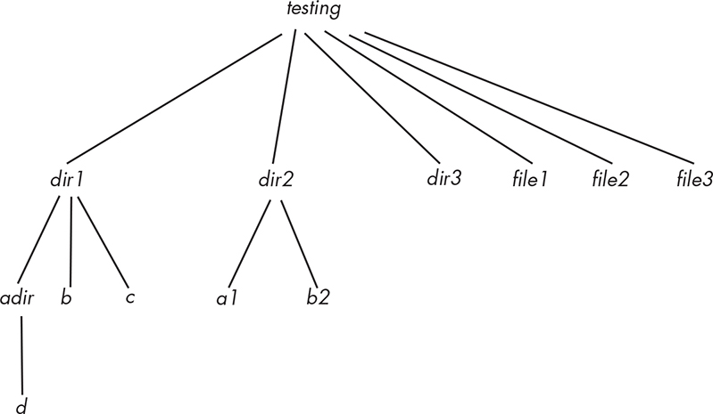

*Figure 7-1: The* testing *directory*

The following listing shows that *dir3* has no read permission: \$ **ls -**

**gG testing/dir3** \# The -gG supresses owner and group information.

total 12 drwxr-xr-x 3 4096 Sep 27 10:26 dir1/ drwxr-xr-x 2 4096 Sep 27

10:27 dir2/ d-wx--x--x 2 4096 Sep 27 10:36 dir3/ *--snip--*

I compiled and built this program using: \$ **gcc -Wall -g spl_ls1.c -**

**L../lib -lspl -o spl_ls1**

Two runs of it follow: one on *testing* and the other on some directories and files within it: \$ **./spl_ls1 testing** testing: dir1 file3 file1 dir3

file2 dir2 . . \$ **cd testing; spl_ls1 dir1 file1 dir3 file2** dir1: b c

. adir . file1 dir3: Permission denied file2

Notice that it correctly listed the contents for the directories for which it had permission, but not for *dir3*, for which it correctly reported the permission error. The order in which it prints a directory’s contents

appears to be random. It isn’t sorted in any obvious way. Also, unlike the real ls command, our program lists the dot (.) and dot-dot (..) entries.

This program is a good start. It was relatively easy to design and

write, owing to the fact that the directory API provides functions that allow us to iterate over all directory entries. In addition, we didn’t need to use any of the non-POSIX members of the dirent structure for this

version of ls, which made the program simpler.

We could improve the program in a few different ways. First, we can

easily suppress printing of the dot and dot-dot entries, as well as all entries that are supposed to be hidden because their names start with

dot. Another relatively easy improvement would be to list more than

one filename per line, which would require mostly just a bit of

arithmetic and some output format planning. Other enhancements are

more challenging. One would be to print the filenames according to

some specified ordering, such as by their names or times of last

modification, and so on. Another would be to filter the output so that we list only files that meet a supplied condition, such as those that are directories or those whose names match a pattern. These last two

enhancements can’t be implemented easily with just the set of functions we’ve seen so far. We need to do a bit of research to see what other tools are available in the directory API. Trying to implement some of these

enhancements is a good exercise for learning more about this API.

Other Functions in the Directory API

The SEE ALSO section of the readdir(3) man page lists several library

functions that work with directories in one way or another. The ones

whose names end in dir include rewinddir(), seekdir(), telldir(), and

scandir(). The others whose names don’t match that pattern are ftw(),

dirfd(), and offsetof().

The last two functions, dirfd() and offsetof(), are not as relevant to our immediate objectives as the others. The dirfd() function returns a file descriptor for the directory opened by a call to opendir(), and the offsetof() function is not specific to directories; it allows a program to obtain the offset within a C struct of one of its members, measured in

bytes. It is needed occasionally because the sizes of some members of a structure can vary at runtime, such as the d_name member of the dirent structure. We’ll examine the other functions listed there, starting with the ones whose names end in dir.

The first, rewinddir(), simply resets the directory stream so that

reading begins at its first entry again. Its name is suggestive of this. Its prototype is: \#include \<sys/types.h\> \#include \<dirent.h\> void rewinddir(DIR \*dirp);

We need the rewinddir() function for those occasions when a program

has to make another pass across all of the entries in a directory stream.

One reason for a second pass is that, in the first pass, it didn’t find the information it needed without calling stat() on the entries. In a second pass, it could call stat() on all of the files. Another use case is when a first pass is needed to count the number of files satisfying some condition, and if the count is above a threshold value, a second pass is made to

process those files satisfying the condition.

*The telldir() and seekdir() Library Functions*

The two functions seekdir() and telldir() are interrelated, in that neither is useful in a program without the other. Their prototypes are: \#include

\<dirent.h\> long telldir(DIR \*dirp); void seekdir(DIR \*dirp, long loc); The first, telldir(), returns a long integer that can be used to return to the entry that would be read by the next call to readdir() in its directory stream argument, dirp. In essence, it’s saving the current position of the stream iterator. The second, seekdir(), given the directory stream dirp and a long integer returned by telldir(), positions the stream’s internal iterator so that the next call to readdir() reads the entry at that position in the stream. Combined, these two functions provide a way to save a

position in the stream and return to it later.

NOTE

*The* *telldir()* *man page warns us not to assume that the long integer* *returned by* *telldir()* *is simply an offset relative to the start of the* *directory. Modern filesystems can represent directories using hash tables*

*or search trees to improve performance. For these filesystems, the value* *returned by* *telldir()* *and used internal y by* *readdir()* *is what the page* *cal s a* cookie *, meaning an integer value from which the actual address* *of the entry can be derived.*

One application of these functions is to process the entries in a given directory that satisfy a given condition before those that don’t. For

example, we could use them to print all entries that are directories

preceding all nondirectory entries. Because this is a good exercise in using the directory API, we’ll write a second version of an ls command, named spl_ls2, that does exactly this.

Let’s sketch out its algorithm. Each time the program reads an entry

in the given directory stream, it checks whether or not it’s a directory. If it’s not a directory, it saves it in a list to print later, and if it is a directory, it prints it immediately. Since this requires knowing an entry’s type, this exercise will also demonstrate how we can use the \_DIRENT_HAVE_D_TYPE

feature test macro to conditionally compile a program on systems that

may or may not have the d_type member in the dirent structure.

Therefore, our first task is to write a Boolean-valued function that

determines whether or not an entry is a directory, which we’ll name

isdir().

Listing 7-2 contains the isdir() implementation. The function checks whether or not its struct dirent\* argument is a directory entry. If our host system’s dirent structure contains a d_type member, it uses it; otherwise, it calls stat() to get the type. Since this is a compile-time decision, the function uses the feature test macro to choose which code to include. Because we’ll probably use this function in several other

programs, we’ll add it to our libspl library and create a header file

named *dir_utils.h* that includes its prototype so that we don’t need to include its code in every program that uses it.

isdir()

/\* Returns TRUE if \*direntp represents a directory, and FALSE otherwise \*/

BOOL isdir(const struct dirent \*direntp)

{

\#ifdef \_DIRENT_HAVE_D_TYPE /\* We have the d_type member. \*/

return (direntp-\>d_type == DT_DIR);

\#else /\* We don't have it - call stat(). \*/

struct stat statbuf;

stat(direntp-\>d_name, &statbuf);

return (S_ISDIR(statbuf.st_mode));

\#endif

}

*Listing 7-2: A function that checks whether a* *dirent* *structure is a directory entry* This isdir() function makes the revised listdir() function simpler. Following is a rough outline of how this revised listdir() can process a single directory.

1\. Given a directory stream argument dirp, which was opened

successfully by the main program, it repeatedly performs the

following steps:

\(a\) Calls telldir() to save the current position, say, in a variable

named pos

\(b\) Reads the next entry: direntp = readdir(dirp)

\(c\) Calls isdir(direntp) to check whether this entry is a directory

\(d\) If it’s a directory, processes it, meaning it prints its name; if it isn’t, saves the position pos in a list of locations to process

later

2\. When all entries have been read, it exits the loop and, for each

saved position pos in the list, seeks to that position using seekdir() and processes it (meaning, in this case, prints it).

Notice that the program must call telldir() before it calls reaaddir() because telldir() returns the position it is about to read, not the one just read.

We need to decide whether to use a linked list or an array to store

the saved positions. A linked list has more overhead because of the

possibly frequent calls to malloc() for each nondirectory entry and the extra code for linked list management. An array is faster but will need to be resized if it reaches capacity. Despite the linked list’s greater

overhead, it leads to a simpler design.

We’ll modify the previously written listdir() function so that if its

flags argument contains a flag to turn on directories-first processing, it

will print directories before nondirectories, and if not, it will print the entries in the order presented to it by the calls to readdir().

The revised function will need the support of a few linked list

functions, namely, one to append a node to the end, one to print the list, and one to erase it. To save space, only their prototypes are included here; their implementations are included in the book’s source code

distribution. The list definition and the function prototypes are shown in Listing 7-3.

/\* Linked list node that stores an offset returned by telldir() \*/

typedef struct listnode {

long pos; /\* The offset \*/

struct listnode \*next; /\* Pointer to nextnode in list \*/

} poslist; /\* Pointer to a list \*/

/\* save(p, &pos_listptr) saves position p onto the end of the list pointed to by pos_listptr. Because the list head might be

changed, its address is passed, not its value. \*/

void save(long pos, poslist \*\*list);

/\* printlist(dirp, pos_list) prints the filenames whose offsets were

saved into pos_list. \*/

void printlist(DIR\* dirp, poslist \*list)

/\* eraselist(&list) erases the list pointed to by list. \*/

void eraselist(poslist \*\*list)

*Listing 7-3: Linked list utility functions for the revised* *listdir()* *function* The preceding functions are called by the revised listdir(), which is displayed in Listing 7-4. The parts of the function that have been modified are in bold.

listdir()

void listdir(DIR \*dirp, int flags)

{

struct dirent \*entry;

**long int pos;**

**poslist \*saved_positions = NULL;**

while ( 1 ) {

**pos = telldir(dirp);** /\* Save current position. \*/

errno = 0; /\* Try to read entry. \*/ if ( NULL ==

(entry = readdir(dirp)) && errno != 0 )

perror("readdir"); /\* Error reading entry \*/

else if ( entry == NULL )

break;

else {

**if ( (flags & LIST_DIRS_FIRST) && !isdir(entry) ) {**

**save(pos, &saved_positions);**

**continue;**

**}**

printf("%s/\n", entry-\>d_name);

}

}

**if ( flags & LIST_DIRS_FIRST )**

**printlist(dirp, saved_positions);**

**eraselist(&saved_positions);**

}

*Listing 7-4: A revised* *listdir()* *function that can list a directory’s entries with all directory* *names preceding all nondirectory names* The major changes to the revised function’s code include the call to telldir() at the top of the loop, the inserted directory test, and the postprocessing at the end of the loop to print the saved entries. I also modified the output by appending a / character to the ends of directory names so that they can be identified.

The only changes to the main program are the declaration of the

macro constant, LIST_DIRS_FIRST = 1, and the initialization of ls_flags to LIST_DIRS \_FIRST instead of 0, so that the call listdir(dirp, ls_flags) turns on the new feature. I’ll name this program *spl_ls2.c*. For brevity, I don’t list the complete program here, but it’s provided in the book’s source code distribution. We can build the executable, naming it spl_ls2, and run it on the same directory on which we ran spl_ls1: \$ **./spl_ls2 testing**

testing: dir1/ dir3/ dir2/ ./ . / file3 file1 file2

All directory names precede all nondirectory names. This output

includes the dot (.) and dot-dot (..) entries, which are directories. You should run this program on other directories to convince yourself that it works correctly.

*The scandir() Library Function*

The name scandir() suggests that this function can scan a directory, possibly to look for something. We’ll begin by looking at the synopsis on its man page: \#include \<dirent.h\> int scandir(const char \*dirp, struct dirent\* \*\*namelist, int (\*filter)(const struct dirent \*), int (\*compar)(const struct dirent \*\*, const struct dirent \*\*)); int alphasort(const struct dirent

\*\*a, const struct dirent \*\*b); int versionsort(const struct dirent \*\*a, const struct dirent \*\*b);

Because this function’s prototype is more complex than any we’ve seen

so far, we’ll begin by going through the mechanics of calling it. After that we’ll consider what it does and how we can use it.

How We Call scandir()

Unlike other functions we’ve seen so far, scandir() has parameters that are functions. More accurately, filter and compar are both *pointers* to functions. A parameter that is a pointer to a function is called a *function* *pointer parameter*. The third parameter of scandir() is declared as: int (\*filter)(const struct dirent \*)

This declares filter to be a pointer to a function whose single argument is a pointer to a constant dirent structure and whose return type is int. A function such as the following matches it: int skipdot(const struct dirent

\*direntp) { if ( strcmp(direntp-\>d_name, ".") == 0 \|\| strcmp(direntp-

\>d_name, ". ") == 0 ) return 0; else return 1; }

Similarly, the fourth parameter is declared as int (\*compar)(const struct dirent \*\*, const struct dirent \*\*)

which states that compar is a pointer to a function expecting two

arguments, each of type const struct dirent\*\*, that returns an int. The alphasort() and versionsort() functions shown in the man page have the exact same prototype as the fourth parameter (compar) and could be

passed as the fourth argument to scandir().

The scandir() function also has a triply indirect parameter, namelist.

This parameter is the address of a dynamic array of pointers to dirent structures. These structures are referred to by three levels of indirection

—the address is the first, the array name is the second, and the array entries themselves are pointers, hence the third. If a program declares

dp_array to store the address of a pointer to a dirent structure as follows struct dirent\* \*dp_array; /\* Not struct dirent\* dp_array\[\] \*/

then it would pass dp_array’s address, &dp_array, as the second argument to scandir(). Putting this all together, we could call scandir() as follows: int returnval = scandir("/home/snw/", &dp_array, skipdot, alphasort); Although we now know how to call scandir(), we still don’t know what it does. That comes next.

FUNCTION POINTER PARAMETERS

In C, when a function has a function pointer parameter, a calling

program can pass to it a pointer to a function whose prototype

matches that of the parameter. Let’s consider an example. Suppose

that we declare the function f() as follows: double f(int (\*funcp)

(int, int), int\*);

Then the first parameter of f() is funcp, a pointer to a function

whose prototype is int *function_name*(int, int);

where *function_name* is any valid function name. A calling program can pass the address of any function whose prototype is of this

form as the first parameter of f(). Suppose that g() is defined to be

the following function: int g(int x, int y) { return x \* y; }

The prototype of g() matches that of \*funcp. Therefore, we can pass

g() in a call to f() as follows: double res = f(g, 12);

Since the compiler replaces the name of a function by its address,

it isn’t necessary to call it like this, although it is also correct:

double res = f(&g, 12);

In contrast, if the function h() has the prototype int h(int\*, int\*);

then it is an error to pass it to f(), because its prototype doesn’t

match the parameter’s exactly. See the function *functionptr_demo.c*

in the book’s source code distribution for a more thorough example that also uses a typedef to declare a function pointer type.

What scandir() Does

Let’s assume that the scandir() function’s first argument is the pathname of a directory, dirp. It opens that directory and makes a pass across every entry in the directory’s stream. For each entry, it calls the (\*filter) function on that entry. The (\*filter) function returns an integer. For each entry for which that return value is nonzero, scandir() stores a

pointer to its dirent structure in namelist, sorted using the comparison function (\*compar) on the pairs of entries. If the call passes NULL to the filter function parameter (\*filter), all entries are stored in the array, and if it passes NULL to the comparison function parameter, no sorting takes place.

The comparison function is not limited to comparing the entries by

their filenames—it can compare the two entries by examining any data

in the entry, even if that involves calling lstat() on them. A comparison function must have two parameters that are constant pointers to dirent structures, and it must return an integer. The traditional return values of comparison functions are -1, 0, and 1, but it needs to return an integer less than, equal to, or greater than zero only if the first argument is considered to be, respectively, less than, equal to, or greater than the second. For example, the following function could be used to compare

two entries by the sizes of the files: int cmpbysize(const struct dirent \*\*a, const struct dirent \*\*b) { struct stat a_sb, b_sb; stat((\*a)-\>d_name,

&a_sb); stat((\*b)-\>d_name, &b_sb); return (a_sb.st_size - b_sb.st_size); }

This example returns numbers that are not necessarily -1, 0, or 1. Also, it has no error handling, which is omitted to save space. If we just want to sort the entries alphabetically in accordance with the locale’s LC_COLLATE

value, we can pass the alphasort() function to scandir(), because alphasort() calls strcoll() internally, which is locale-aware.

When scandir() has returned, the namelist array contains all entries

that met the filter’s conditions, sorted by the sorting criteria embodied in the comparison function, and the return value of the function is the

number of entries in that array. The scandir() function allocates its own memory for the namelist array. A program calling scandir() must not

declare its own storage for it, but it must free the memory allocated to the array when it no longer needs it.

The man page has a simple example that illustrates how to call the

function and free the memory. We include it here, modified slightly to reduce space: *scandir_manpage_example.c* \#define

\_DEFAULT_SOURCE \#include \<dirent.h\> \#include \<stdio.h\>

\#include \<stdlib.h\> int main(void) { struct dirent \*\*namelist; int n; if ( (n

= scandir(".", &namelist, NULL, alphasort)) == -1 )

exit(EXIT_FAILURE); while ( n-- ) { printf("%s\n", namelist\[n\]-

\>d_name); free(namelist\[n\]); } free(namelist); exit(EXIT_SUCCESS); }

This program prints the entries in the current working directory. The

first name printed is the last one in the array because it prints the

directory entries in the reverse of the collating order.

We can use the scandir() function to write an improved version of

*spl_ls2.c*, our program that lists directory contents with directories first.

Not only will it print the directories first, but it will sort the entries alphabetically in the ordering of the current locale. It won’t need to open the directory and read it using the opendir() and readdir() functions because scandir() bypasses that work. The first step is to write the

comparison function, which is shown in Listing 7-5.

dirsfirstsort()

int dirsfirstsort(const struct dirent \*\*a, const struct dirent \*\*b)

{

if ( isdir(\*a) )

if ( !isdir(\*b) ) /\* a is a directory but b is not. \*/

return -1;

else /\* Both a and b are directories; sort alpabetically. \*/

return(alphasort(a, b));

else

if ( isdir(\*b) ) /\* b is a directory but a is not. \*/

return 1;

else /\* Neither a nor b is a directory; sort alpabetically. \*/

return(alphasort(a, b));

}

*Listing 7-5: A comparison function that sorts directories before nondirectories and* *alphabetically if the two entries are both directories or both nondirectories* This function orders the entries by sorting directories ahead of nondirectories and breaks ties alphabetically. It calls the isdir() function presented in Listing 7-2 to determine whether an entry is a directory or not.

The next step is to write a function, which I’ve named scan_one_dir(), that prints a single directory’s entries using scandir(): scan_one_dir() int scan_one_dir(const char \*dirname, void (\*process)(const struct dirent\*))

{ struct dirent \*\*namelist; /\* An array of pointers to dirent structs \*/ int i, n; errno = 0; if ( (n = scandir(dirname, &namelist, NULL, dirsfirstsort))

\< 0 ) fatal_error(errno, "scandir"); for ( i = 0; i \< n; i++ ) { /\* Process every entry saved into namelist.\*/ process(namelist\[i\]); /\* Process this dirent structure. \*/ free(namelist\[i\]); /\* Free the dirent structure. \*/ }

free(namelist); /\* Free the namelist array that was allocated by scandir().

\*/ return(EXIT_SUCCESS); }

The function passes dirsfirstsort() to scandir() as its comparison function and uses no filter, so that no entries are excluded from the namelist array.

Now that we’ve seen how to use function pointer parameters, I take

advantage of them here. Rather than designing this function narrowly

so that it can only print the filenames in the entries, I make it more general. Specifically, its second parameter is a pointer to a function that will process the dirent structures saved in namelist. The function pointer parameter is named process() in the listing and has a dirent structure argument and a void return value. We can pass any void function to it that has a single dirent structure argument. Since our program just prints file and directory names, the function passed to this parameter is one that just prints the entry’s name. Another program could pass a different

function to it, for example, one that calls stat() on the filename to

retrieve its metadata and process that metadata in some particular way.

We’re ready to assemble the program. To save space, Listing 7-6

does not show those functions already displayed in previous listings; the complete program is in the book’s source code distribution.

*spl_ls3.c*

\#define \_DEFAULT_SOURCE /\* For glibc \> 2.10 \*/

\#define \_BSD_SOURCE /\* For versions of glibc \< 2.19 \*/

\#include "common_hdrs.h"

\#include \<dirent.h\>

\#include "dir_utils.h" /\* For isdir() and dirsfirstsort() \*/

/\* print(dp) prints the filename of entry \*dp. If it's a directory, it appends a trailing '/' to its name. \*/

void print(const struct dirent \*direntp)

{

printf("%s", direntp-\>d_name); if ( isdir(direntp) )

printf("/");

printf("\n");

}

int main(int argc, char \*argv\[\])

{

if ( setlocale(LC_TIME, "") == NULL )

fatal_error(LOCALE_ERROR,

"setlocale() could not set the given locale");

if ( 1 == argc ) /\* If no arguments, list the CWD. \*/

scan_one_dir(".", print);

else { /\* Otherwise, for each argument, scan it. \*/

for ( int i = 1; i \< argc; i++ ) {

printf("\n%s:\n", argv\[i\]); /\* Print the argument. \*/

scan_one_dir(argv\[i\], print); /\* Pass the print() function. \*/

if ( i \< argc-1 ) printf("\n"); /\* Put a newline before next. \*/

}

}

exit(EXIT_SUCCESS);

}

*Listing 7-6: A program using* *scandir()* *to list all contents of all arguments, sorted in* *collating order, with directories preceding nondirectories* After setting up the current locale, the main program calls scan_one_dir(), passing it the print() function for each command line argument. We build it and run it on our test directory: \$ **./spl_ls3 testing** testing: ./ ../

dir1/ dir2/ dir3/ file1 file2 file3

Because of space limitations, this output is intentionally small. You can run this program on much larger directories to see that it sorts the

entries in the correct order.

The various library functions that we’ve examined in the directory

API are all designed to work within a single directory as a flat structure.

They don’t descend into subdirectories. We need to know how to design

programs that can descend into subdirectories and process entire

directory hierarchies because many problems require this, as we’ll see in the next section. We’re about to explore various ways to accomplish this, including a few different APIs designed to recursively descend

directories.

Processing the Directory Hierarchy

In Chapter 1, I pointed out that the directory hierarchy is tree-like, but is not a tree. Let’s review why this is true. The first reason is that symbolic links can create cycles because a symbolic link can point back to an ancestor in the tree, as depicted in Figure 7-2. In the figure, directories are in bold, and the symbolic link is a dashed line.

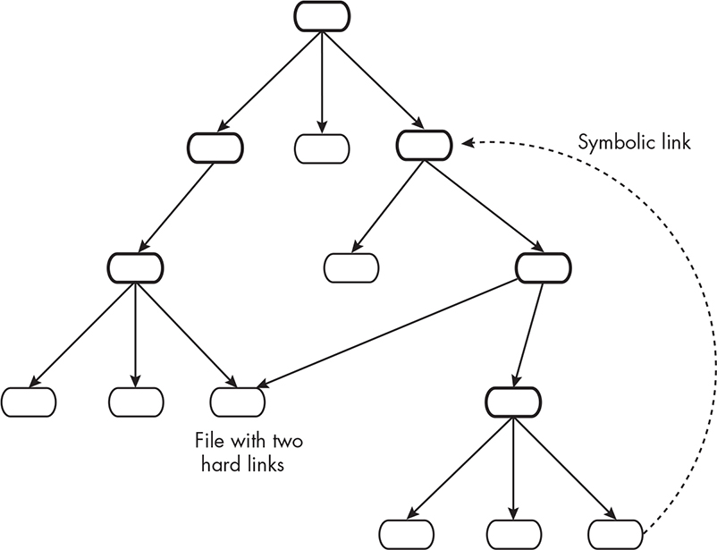

*Figure 7-2: A portion of the directory hierarchy with a symbolic link creating a cycle* If none of the symbolic links created cycles, the hierarchy still

wouldn’t be a pure tree because hard links allow files to have multiple names in different directories, as Figure 7-2 illustrates. Files that are contained in more than one directory are nodes with more than one

parent, but in a tree, each node other than the root has a single parent.

In Linux and most Unix systems, the hierarchy has no cycles if it has

no symbolic links. This is because in these systems, a directory node can never be the target of a hard link, which implies that no node can have

an edge leading back to an ancestor. For brevity, even though it isn’t technically a true tree, we’ll refer to a directory hierarchy as a *directory* *tree*, or just a *tree* when the meaning is clear.

The fact that the hierarchy is tree-like suggests that many of the

algorithms that we use to process trees can be applied to process the

hierarchy. Some of these algorithms are important enough for us to

explore now, because the paradigms that they embody are the basis for

many practical and useful Unix tools.

Some of the most useful tools in Unix allow us to traverse the entire

directory tree rooted at a given node, performing some type of

processing in each node. This is what the find command does, for

example. It lets us search the tree rooted at a given directory, searching for files that satisfy specified conditions and performing actions on the files that satisfy those conditions. In the simplest case, we can use find to search for files whose names match a pattern and print out the relative pathnames of those that do.

Other commands such as ls, rm, cp, and grep have a recursive option,

usually either -R or -r, that makes those commands act on every file in the directory trees rooted in their directory arguments. All of the

preceding commands work top-down, usually in a depth-first manner,

processing an entire subtree before processing any sibling subtrees.

Some tools, such as tree and du, short for “disk usage,” also work on

entire directory trees. The tree command displays the entire directory tree rooted at a given directory, visually indenting files at deeper levels of the tree. The du command summarizes the amount of disk space used

by files in a given directory hierarchy. Its man page states that it acts recursively on directories. In other words, when we enter du *dirname*, du recursively descends *dirname*, collecting and reporting the total disk usage of every directory in its tree, after which it prints the grand total of all directories. For example, here is a run of it on the *testing* directory: \$ **du** **testing** 4 testing/dir3 4 testing/dir1/adir 8 testing/dir1 4 testing/dir2

32 testing

This output suggests that du processes all child nodes before it processes their parent, which is an example of a *postorder traversal*. The numbers in the output are counts of the number of 1024-byte blocks used by all files

in each directory; we’ll explore the command in more detail later in this chapter.

All of the preceding examples traversed the tree by *descending* it: visiting all nodes or selected nodes in the subtree rooted at a given node.

Algorithms that traverse the tree in this manner are called *tree walks*. In contrast to tree walks, some commands *ascend* the tree. The pwd command is a good example of this; it travels up the tree starting in the current working directory until it reaches the root directory in order to construct the absolute pathname of the current working directory.

Traveling up the tree presents interesting challenges that are very

different from those that we’ll encounter in trying to traverse the tree downward and recursively.

Among the various commands that walk the tree, the du command is

a good one to implement; we’ll learn a lot in the process. Since we

already know how to use the stat() family of system calls to obtain disk usage metadata for a file, collecting disk usage metadata won’t be

difficult. The challenge is how to walk the tree recursively and, in

particular, to process its nodes in a postorder manner. Therefore, our approach to solving this problem is first to develop a couple of

programs that just walk the tree, not trying to collect disk usage

information. When we’ve worked out the algorithm for performing the

tree walk, we’ll augment it with the ability to report disk usage.

We’ll also learn a lot by tackling a problem that has to ascend the

tree. Implementing a version of the pwd command is a good exercise in

ascending the tree. We’ll discover that it isn’t as simple as it might seem.

Before we start researching solutions to these problems, we need to

learn a bit more about the concept of filesystem mounting, which is

what we cover next. After that, we’ll explore potential ways to perform tree walks as preparation for implementing the du command. Once we

decide on a good method, we’ll implement a simplified version of that

command.

Mounting File Systems

In Chapter 1, I introduced the concept of filesystem mounting, which I’ll explain in more detail now because it’s relevant to the problems

we’re about to solve. It’s easiest to understand with a concrete example.

The superuser can issue the mount command to mount a filesystem onto

the directory hierarchy at a specific point; the command \$ **mount** ***device***

***directory***

attaches the filesystem on the given device into the directory hierarchy at the specified directory. That directory is then called the filesystem’s *mount point*. In general, you need superuser privilege to mount a filesystem, and you typically need to provide the command more

information than in this example, such as the filesystem type and its

unique identifier.

When a filesystem is mounted onto the directory hierarchy, the root

directory of that filesystem replaces the directory on which it’s mounted, and that directory’s previous contents are hidden by the mount. When

the filesystem is *unmounted*, using the umount command (not unmount), the directory’s contents are restored.

*An Example of Filesystem Mounting*

To illustrate, Figure 7-3 depicts a portion of the top of the directory hierarchy of a hypothetical Unix system.

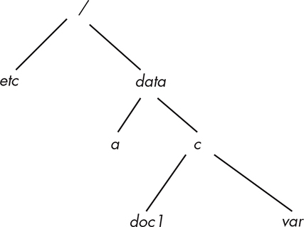

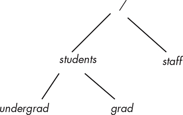

*Figure 7-3: The initial file hierarchy without any mounts*

The root of this hierarchy has a subdirectory named *data* with two subdirectories named *a* and *c*. The *c* directory is not empty. Suppose that there’s another device, */dev/hdb*, that has a filesystem on it, depicted in

Figure 7-4.

*Figure 7-4: The filesystem* /dev/hdb

The root of this filesystem has two subdirectories named *staff* and *students*, and *students* has the subdirectories *grad* and *undergrad*. Now suppose we mount this second filesystem on the directory */data/c* by entering (as superuser): \$ **mount /dev/hdb /data/c**

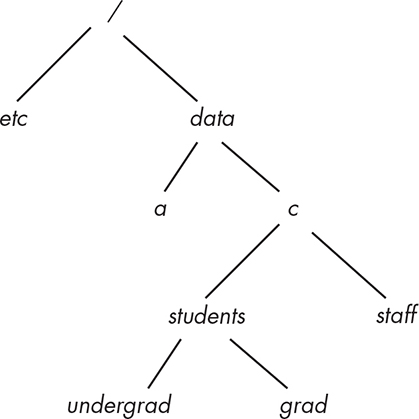

If the mount is successful, then */data/c* becomes the mount point for the filesystem */dev/hdb*, and we say that */dev/hdb* is mounted on the directory *c*. The files *doc1* and *var* are hidden until the filesystem is unmounted, at which point they’ll reappear. The directory hierarchy after the mount is depicted in Figure 7-5.

*Figure 7-5: The directory hierarchy after the mount of* /dev/hdb *onto* /data/c The absolute pathnames of all files in the mounted filesystem start

with */data/c* now, such as */data/c/students/grad*.

When a directory becomes a mount point, the kernel restructures

the directory hierarchy. Although the directory contents are masked by the root directory of the mounted filesystem, the kernel stores the

hidden contents and a record of the mount. Different versions of Unix

implement mounting in different ways; implementation is not part of

any standard. However, it’s pretty much universally true that a process can recognize when a directory *dir* is a mount point because the device ID of the directory’s parent, say, *parent*, is different from that of *dir*. This

is because *dir* is the root of the mounted filesystem and *parent* is a node on the filesystem to which it’s attached.

*Commands for Finding Mount Points*

There are a few ways to tell where the mount points are in the directory hierarchy. One is the df command, which is intended to show the

amount of disk space available on the mounted filesystems that contain the filenames it’s given on the command line. By default, the POSIX-conforming version of it outputs several fields on each line, but the

GNU version, found on Linux, allows us to limit its output to just the name of the device and its mount point by giving it the --

output=source,target option. Without any filenames it shows all mounted filesystems: \$ **df --output=source,target** *--snip--* /dev/sdc2 /

/dev/sdd3 /var /dev/sdb3 /home /dev/sdc1 /boot /dev/sdd4

/data/research_resources/physics/articles/more_articles

If we want to know the filesystem and mount point for our current

working directory, then entering **df --output=source,target .** shows us: \$

**pwd** \# To see what our working directory is

/home/stewart/unixbook/demos \$ **df --output=source,target .**

Filesystem Mounted on /dev/sdb3 /home

We can also use the mount command. Without any options, it displays all mounted filesystems with information about each. By giving it the -t

*type* option, it limits the output to mounts of the requested type. For example, to see the Ext4 filesystems, I can enter: \$ **mount -t ext4** *--*

*snip--* /dev/sdc2 on / type ext4 (rw,relatime,errors=remount-ro)

/dev/sdd3 on /var type ext4 (rw,relatime) /dev/sdb3 on /home type ext4

(rw,relatime) /dev/sdc1 on /boot type ext4 (rw,relatime,stripe=4)

/dev/sdd4 on /data/research_resources/physics/articles/more_articles. .

This command also displays the mount options, which I haven’t

discussed here. You can read about mount options on the mount man

page.

A third method is the findmnt command, which also displays mounted

filesystems. By default, its output is presented in a tree-like format, and the fields are similar to df’s output. We can limit the output to just the filesystem and mount point with the -o SOURCE,TARGET option and limit the

types with -t *type*: \$ **findmnt -t ext4 -o SOURCE,TARGET** SOURCE

TARGET *--snip--* /dev/sdc2 / /dev/sdb4 /data /dev/sdd4

/data/research_resources/physics/articles/more_articles /dev/sdd3 /var

/dev/sdb3 /home /dev/sdc1 /boot

This is just a brief summary of these commands. The mount command is

also used for mounting filesystems, but you need superuser privileges on the computer for that purpose.

*Duplicate Inode Numbers*

The advantage of mounting is that it simplifies the user’s

conceptualization and navigation of the file hierarchy. One problem it introduces is that there may be files with the same inode number in the directory hierarchy, since inode numbers are unique only within a single filesystem.

In fact, in most Unix systems, and in Linux in particular, the root

directory of every filesystem is inode number 2. Inode number 1 is used to record bad blocks in the filesystem, and index 0 is unused in the

inode table. A typical Unix system may have several filesystems all

mounted directly under */*. Viewing the inode numbers in the top-level directory, you’re likely to see several subdirectories, all of which have inode number 2, because they’re all mount points for attached

filesystems.

Given that multiple files can have the same inode numbers when

filesystems are mounted on the directory hierarchy, the only way to

uniquely identify a file is with a pair consisting of the inode number and the device ID of the filesystem on which it resides. That number is

always stored in the inode. Without the device ID, the inode number is ambiguous. This is also why the kernel doesn’t allow us to create a hard link for a file on a different filesystem. To see this, suppose in the preceding example that the file */data/a/doc1* has inode number 52.

Suppose that the file */students/undergrad/hwk1* on */dev/hdb* also has inode number 52. If we could create a hard link across filesystems, then the command \$ **ln /data/a/doc1 /data/c/students/grad/doc1**

would result in two links in the */dev/hdb* filesystem, each having the same inode number, but these two inode numbers would refer to two

different inodes. This would break the filesystem, unless directories

were able to store device numbers as well as inode numbers with

filenames, which would require rewriting a lot of the kernel. All hard links to a file must be in a single filesystem.

The subject of mounting and mount points will play a role in our

solutions to the remaining problems of this chapter.

Tree Walks

Let’s turn to the problem of walking through a directory tree. One way to walk a directory’s tree is to implement a recursive function using only the first set of library functions from the preceding section, namely

opendir(), readdir(), and closedir(). With these, we need to modify our *spl_ls1.c* program only slightly.

*A Recursive Tree Walk Using readdir()*

To modify the *spl_ls1.c* program so that it can visit the entire tree rooted at a given directory, we need to change the main program slightly and

revise listdir(). The main program will still open the root directory of the tree walk as it did before, by calling opendir(). However, since

listdir() will also need to open any directory it finds as it’s reading the directory stream, it will need the name of the directory it’s processing.

Let’s redisplay the main loop of listdir() to make this clear: while (

!done ) { errno = 0; direntp = readdir(dirp); if ( direntp == NULL && errno != 0 ) perror("readdir"); else if ( direntp == NULL ) done =

TRUE; else ➊ printf(" %s\n", direntp-\>d_name); }

In this code, we need to replace the call to printf() ➊ by

programming logic such as the following, which excludes the requisite

error handling: printf("%s\n", direntp-\>d_name); if ( isdir(direntp) ) {

subdirp = opendir(direntp-\>d_name); listdir(subdirp, flags);

closedir(subdirp); }

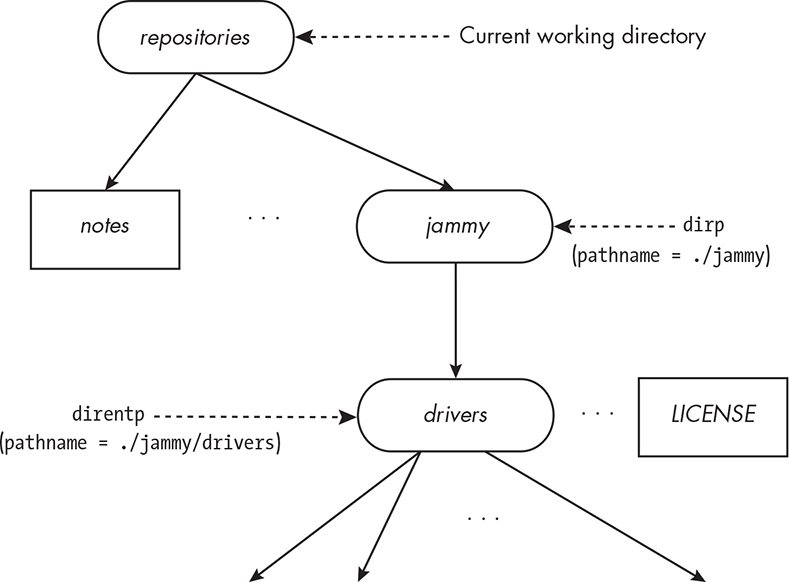

In other words, listdir() prints the entry’s filename and then checks if it’s a directory. If it is, it recursively calls listdir(). Unfortunately, this doesn’t work, for two reasons.

The first is best explained with an example. Consider the fragment

of a directory tree shown in Figure 7-6.

*Figure 7-6: A directory being processed by* *opendir()* *and* *readdir()* The figure shows that the main program’s working directory at the

time it’s called is *repositories*. Suppose that it was invoked with the command: \$ **./spl_ls1 jammy**

The main() function in turn calls opendir("jammy"). Since *jammy* is a pathname relative to the current working directory *repositories*, the call is successful; the *jammy* directory is opened and the dirp directory stream pointer is returned, which main() passes in its call listdir(dirp). Inside listdir(), while processing the *jammy* directory, readdir() is called and returns a direntp pointer to the subdirectory named *drivers*. The isdir(direntp) function detects that it is a directory and calls

opendir(direntp-\>d_name). This is the problem. At that point, direntp-\>d_name is the name "drivers", but the pathname *drivers* is relative only to *jammy*, not to the process’s current working directory, *repositories*. Therefore opendir() will fail with the ENOENT error “No such file or directory.” The pathname that should be passed to opendir() is *jammy/drivers*, not *drivers*.

More generally, the pathname passed to opendir() must be relative to

the current working directory. In the current implementation of

listdir(), the relative pathname of the directory being processed isn’t available in the listdir() function’s parameter list. Therefore, we need to modify its prototype to include it and also modify the calls to it in main().

The listdir() function needs to declare a variable to store the longest possible pathname that might be needed for this purpose. We’ll

therefore declare a variable, pathname, in it, with size PATH_MAX, defined in *limits.h*.

The second problem is related to the dot and dot-dot entries.

They’re both directories. When readdir() reads the entry for dot, isdir() returns true. The recursive call to listdir() will start right back in the beginning, and an infinite loop will ensue because the program will keep returning to process the same directory over and over again!

The solution to this problem is to check whether the current entry is

. or .. and skip it if it is. We can now assemble a correct version of the recursive solution. The revised code for listdir() and the main program are shown in Listing 7-7. We’ll name this recursive version of our program *spl_ls_rec1.c*. For brevity, the \#include directives and some comments are omitted.

*spl_ls_rec1.c*

void listdir(DIR \*dirp, char \*dirname, int flags)

{

struct dirent \*direntp; /\* Pointer to directory entry structure \*/

BOOL done = FALSE; /\* Flag to control loop execution \*/

char pathname\[PATH_MAX\]; /\* Pathname of file to open \*/

DIR \*subdirp; /\* Dir stream for subdirectory \*/

char \*name; /\* Directory entry name copy \*/

while ( !done ) {

errno = 0;

direntp = readdir(dirp);

if ( direntp == NULL && errno != 0 )

perror("readdir");

else if ( direntp == NULL ) /\* Implies end of stream \*/

done = TRUE;

else {

name = direntp-\>d_name;

if ( (strcmp(name, ".") != 0) && (strcmp(name, "..") != 0) ) {

sprintf(pathname, "%s/%s", dirname, name);

printf("%s\n", pathname);

if ( isdir(direntp) ) {

errno = 0;

if ( (subdirp = opendir(pathname)) == NULL )

error_mssge(errno, name);

else { listdir(subdirp, pathname, flags);

closedir(subdirp);

}

}

}

}

}

printf("\n");

}

int main(int argc, char \*argv\[\])

{

DIR \*dirp;

int ls_flags = 0;

if ( 1 == argc ) {

errno = 0;

if ( (dirp = opendir(".")) == NULL )

fatal_error(errno, "opendir"); /\* Could not open cwd \*/

else

listdir(dirp, ".", ls_flags);

}

else { /\* For each command line argument, call opendir() on it. \*/

for ( int i = 1; i \< argc; i++ ) {

errno = 0;

if ( (dirp = opendir(argv\[i\])) == NULL ) {

if ( errno == ENOTDIR ) /\* It's not a directory. \*/

printf("%s\n", argv\[i\] );

else /\* It's an error. \*/

error_mssge(errno, argv\[i\]);

}

else { /\* Directory was opened successfully. \*/

printf("\n%s:\n", argv\[i\] );

listdir(dirp, argv\[i\], ls_flags);

closedir(dirp);

}

}

}

return 0;

}

*Listing 7-7: A program to demonstrate recursive listing of a directory hierarchy* We’ll build and run this program on the *testing* directory depicted in Figure 7-1: \$ **./spl_ls_rec1**

**testing** testing: testing/dir1 testing/dir1/b testing/dir1/adir testing/dir1/adir/d testing/dir1/c testing/file3 testing/file1 testing/dir3 testing/file2 testing/dir2 testing/dir2/b2 testing/dir2/a1

You can see that it recursively displays the files and directories, but there’s no apparent ordering of the files. This is a consequence of using readdir() to read the entries, since it doesn’t return them in sorted order.

*A Recursive Tree Walk Using scandir()*

One way to overcome the lack of sorting is to base a recursive tree walk on *spl_ls3.c* instead. That program used the scandir() function, which sorted the filenames using alphasort(). To reduce the code size, we’ll

remove the directory-first processing that we coded into *spl_ls3.c* and concentrate on adding recursion to the program. We’ll also remove the

function pointer parameter to scan_one_dir() and the print() function. The scan_one_dir() function from that program, modified to include the

recursive call, is shown in the following listing, with the changes

highlighted in bold: scan_one_dir() *(revised)* int scan_one_dir(const char \*dirname) { struct dirent \*\*namelist; int i, n; **char**

**pathname\[PATH_MAX\];** errno = 0; if ( (n = scandir(dirname, &namelist, NULL, alphasort)) \< 0 ) fatal_error(errno, "scandir"); for ( i = 0; i \< n; i++ ) { **if ( strcmp(namelist\[i\]-\>d_name, ".") != 0 &&** **strcmp(namelist\[i\]-\>d_name, "..") != 0 ) {**

**printf("%s/%s\n",dirname,namelist\[i\]-\>d_name); if (**

**isdir(namelist\[i\]) ) { sprintf(pathname, "%s/%s", dirname,** **namelist\[i\]-\>d_name); scan_one_dir(pathname); } }**

free(namelist\[i\]); } free(namelist); return(EXIT_SUCCESS); }

Because the only change to the main program is the removal of the

function argument to the two calls to scan_one_dir(), to save space, we won’t redisplay it here. The revised program is named *spl_ls_rec2.c* in the book’s source code distribution. We build and run this new version on

the same *testing* directory: \$ **./spl_ls_rec2 testing** testing: testing/dir1 testing/dir1/adir testing/dir1/adir/d testing/dir1/b

testing/dir1/c testing/dir2 testing/dir2/a1 testing/dir2/b2 testing/dir3

testing/file1 testing/file2 testing/file3

You can see that the pathnames are all correct and that they’re sorted by filename. It might be possible to base our implementation of du on this program, but before we make that decision, let’s review what du does.

The du command traverses each directory tree it’s given. It

accumulates the disk usage of every file in a directory and then prints the disk usage of that directory. It does this recursively, so that if a file is a directory, it first descends into that directory to accumulate the usage and recursively descends into its subdirectories. This implies that it does, in fact, perform a postorder traversal of each directory tree.

The default block size that it uses for reporting is 1024 bytes, but it depends on the environment variables of the user running it, as well as some system settings. Also by default, du doesn’t print the disk usage of

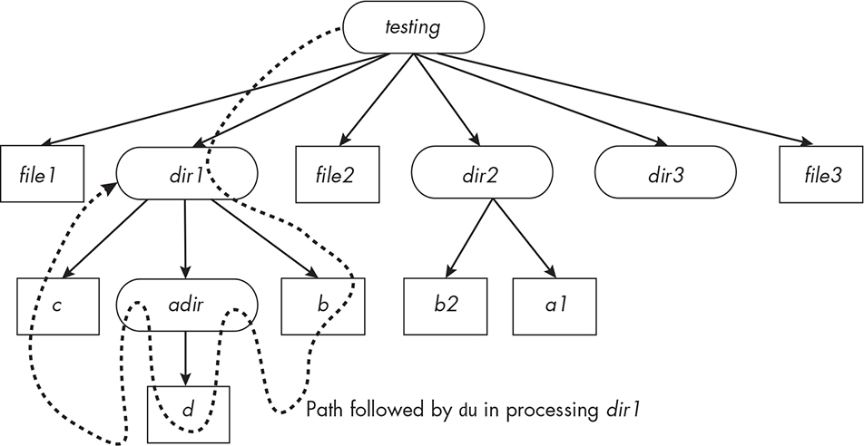

ordinary files, even though they’re added into the directory totals. With the -a option, it prints the block counts for all files, not just directories.

Consider this run of it: \$ **du -a testing** 0 testing/dir1/b 0

testing/dir1/adir/d 4 testing/dir1/adir 0 testing/dir1/c 8 testing/dir1 4

testing/file3 4 testing/file1 4 testing/dir3 4 testing/file2 0

testing/dir2/b2 0 testing/dir2/a1 4 testing/dir2 32 testing

Studying its output, we can see that it descends into directories in a depth-first manner, reaches their leaf nodes, returns, and prints the total counts for the parent directories. It prints the counts for the directories only *after* it visits all of their children. Figure 7-7 illustrates the portion of the path taken by du on the *dir1* subdirectory.

*Figure 7-7: A portion of the path taken by* *du -a* *on the* testing *directory*

It descended into *testing/dir1*, then *testing/dir1/b*, and since that was a leaf node, it then descended into *testing/dir1/adir* and then into *testing/dir1/ adir/d* before backing out and visiting *testing/dir1/c*. Our goal is to write a program that can process the tree in the same way.

*The nftw() Tree Walk Function*

Before deciding how to write our program, let’s consider the other

potentially useful function mentioned in the readdir() man page, namely nftw(). Its man page is: NAME ftw, nftw - file tree walk SYNOPSIS

\#include \<ftw.h\> int nftw(const char \*dirpath, int (\*fn) (const char

\*fpath, const struct stat \*sb, int typeflag, struct FTW \*ftwbuf), int

nopenfd, int flags); \#include \<ftw.h\> int ftw(const char \*dirpath, int (\*fn) (const char \*fpath, const struct stat \*sb, int typeflag), int nopenfd); Feature Test Macro Requirements for glibc (see

feature_test_macros(7)): nftw(): \_XOPEN_SOURCE \>= 500

DESCRIPTION nftw() walks through the directory tree that is located

under the directory dirpath, and calls fn() once for each entry in the tree. By default, directories are handled before the files and

subdirectories they contain (preorder traversal). *--snip--*

The nftw() function is designed to walk a directory tree. It has a function pointer parameter that can be applied at each node of the tree. Its

description states that directories are processed before their files and subdirectories, which implies that it’s a preorder traversal, but further down in the man page, it indicates that by supplying an appropriate flag, it can be made to perform postorder processing.

The man page also has information about a second, related function,

ftw(), but it notes that this is an older function and that nftw() was designed to replace it. The older ftw() function is now deprecated.

The nftw() function is given four arguments. The first is the

pathname of a directory, the second is a function that will be called on each entry that it visits, the third is an integer that specifies the

maximum number of file descriptors it’s allowed to use, and the last is a set of flags that influence its behavior. Let’s go through each of these arguments and how they’re used.

The first argument is the root of the tree that it will process. Given the pathname to a directory, dirpath, the nftw() function recursively

descends the directory hierarchy rooted in dirpath. For each entry that it finds, it calls the function pointed to by its second argument, fn(),

passing it the following arguments:

**fpath** The pathname of the entry. If dirpath is a relative pathname, then fpath is a pathname relative to the process’s current working

directory at the time nftw() was called. If dirpath is an absolute

pathname, then fpath is also an absolute pathname.

**sb** A pointer to a stat structure containing information about the object, filled in as if stat(fpath, sb) or lstat(fpath, sb) was called to retrieve the metadata.

**typeflag** An integer flag that encodes more information about the entry. Its value is exactly one of the following predefined constants: **FTW_F** The entry fpath is a regular file.

**FTW_D** The entry fpath is a directory.

**FTW_DNR** The entry fpath is a directory that cannot be read by the process. In this case, the fn() function won’t be called for any of its descendants.

**FTW_DP** The entry fpath is a directory and all of its files and subdirectories have been visited already because the FTW_DEPTH flag

was set in the flags argument of nftw().

**FTW_NS** The stat() function failed on the entry, most likely because the process did not have execute permission on the parent

directory. In this case, the stat buffer passed to (\*fn) is undefined.

**FTW_SL** The entry fpath is a symbolic link, and the FTW_PHYS flag was set in the flags passwd to nftw().

**FTW_SLN** The entry fpath is a broken, or *dangling*, symbolic link, one that doesn’t point to an existing file, and the FTW_PHYS flag was not

set in flags. In this case the stat buffer was filled with information about the link itself instead of its target.

**ftwbuf** This is a pointer to an FTW structure, which is defined as follows: struct FTW { int base; int level; };

The FTW structure provides information about the filename in the fpath pathname passed to (\*fn). Specifically, base is the character offset of the entry’s filename in the fpath pathname. For example, if fpath is

*testing/dir1/adir* and the entry being processed is the file *adir*, then base contains the length of the string *testing/dir1/*.

The level member of the structure indicates the depth of the entry

relative to the root of the walk, which is the directory passed to the call to nftw(). The root directory is level 0. If a parent node has level *n*, then all of its children are at level *n* + 1. In this example, level would contain 2, since *adir* is two levels below *testing*.

Any programmer-defined function can be passed to the fn function

pointer parameter, provided that its prototype matches that of the

parameter. If so, nftw() calls this function for every entry that it visits.

The function will have access to the stat structure returned by a call to stat() on that entry as well as the information encoded in its typeflag argument. A significant drawback of the (\*fn) parameter’s declaration is that it has no *hooks* that we can use to pass other data to it. In other words, there are no parameters in the function prototype that a program can use to pass other data items to the function. One consequence of

this design is that, in order for this function to access any program

variables that can retain data across calls, those variables must either be declared with static linkage or have file scope.

For example, to compute the total number of blocks used by all

entries in the subtree rooted at a given directory, we would either have to make the total block count a static variable within the function that we define or declare the variable with global scope. This will be clear when we look at an example, which we’ll do shortly.

The third parameter to the nftw() function, nopenfd, is the maximum

number of file descriptors that nftw() should use while traversing the file tree. Each time that nftw() visits a directory, it opens it and obtains its file descriptor. After it descends that directory’s subtree and returns to its parent, it closes that descriptor. Therefore, one open file descriptor is

needed for each level of the tree from the root of the search to the current level. If nopenfd is smaller than the depth of the tree, then to reach the deeper entries, nftw() will be forced to close descriptors of ancestors in the tree in order to continue descending the tree. This

degrades its performance. If a process makes nopenfd large enough, this problem is avoided, but the number of open file descriptors a process

can have is limited by the kernel.

PROCESS RESOURCE LIMITS

The maximum number of open files that a process is allowed is an

example of a *process resource limit*. A process requires many different types of resources, such as memory for its stack, time on the CPU,

and storage for open file descriptions. The kernel sets limits on the

amount of resources of each type that a process can use. With the

appropriate system calls, a process can get the values of these

limits and modify them.

At the command level, prlimit can be used to query and modify

these resource limits. For example, prlimit -n lists the resource

limit on open files: \$ **prlimit -n** RESOURCE DESCRIPTION

SOFT HARD UNITS NOFILE max number of open files 1024

1048576 files

The prlimit(2) man page explains the difference between soft and

hard limits and contains a discussion of how a process can access

and modify resource limits.

The fourth parameter of nftw() is an integer that can be used to pass

in a bitwise-OR of zero or more of the following constants, which

control aspects of its behavior, such as how ntfw() handles mount points and soft links, what it uses as its current working directory, and whether it follows a preorder or postorder traversal of the tree.

**FTW_CHDIR** If set, nftw() changes its current working directory to each directory as it processes the files in that directory. If it isn’t set, nftw() doesn’t change the current working directory.

**FTW_DEPTH** If set, nftw() processes all files in a directory before processing the directory itself; in other words, it performs a

postorder traversal. If it isn’t set, nftw() processes directories before any of their files, which we call *preorder traversal*.

**FTW_MOUNT** If set, nftw() does not cross mount points, meaning that it only processes files in the same filesystem as fpath.

**FTW_PHYS** If set, nftw() performs a physical walk and does not follow symbolic links. If it visits a file that is a symbolic link, it processes the link itself, not its target. If it isn’t set, it follows symbolic links but does not visit any file twice. If FTW_PHYS is not set and FTW_DEPTH is set, nftw() follows soft links but does not process any directory that would be a descendant of itself.

**FTW_ACTIONRETVAL** This flag is available only under *glibc* 2.3.3 or later, with \_GNU\_\_SOURCE defined to expose it. If it’s set, the next node that nftw() visits is determined by the return value of (\*fn). The return

values that it responds to are FTW_CONTINUE, FTW_SKIP_SIBLINGS,

FTW_SKIP_SUBTREE, and FTW_STOP. For example, if (\*fn) returns FTW_CONTINUE, then nftw() continues normal processing, whereas if (\*fn) returns

FTW_SKIP_SIBLINGS, then nftw() will skip visiting any remaining siblings of the current entry and instead return to the parent. The

FTW_SKIP_SUBTREE flag will cause it to skip processing any subtrees of the entry if it’s a directory, and FTW_STOP stops all processing and causes nftw() to return immediately.

The nftw() function visits the entries in the tree rooted at dirpath until one of the following conditions occurs:

An invocation of (\*fn) returns a nonzero value and FTW_ACTIONRETVAL is not set, in which case nftw() stops and returns that value.

The FTW_ACTIONRETVAL flag is set and (\*fn) returns FTW_STOP, in which

case it stops and returns that value.

It detects an error, in which case it returns -1 and sets errno to indicate the error.

It has visited all nodes of the tree, in which case it returns 0.

Let’s look at an example. Although the man page for nftw() has an

example program, I created a slightly different one whose behavior is

similar to that of the tree command. This program displays the name of every file in the tree rooted at its argument directory, indented on the line by an amount of space proportional to its depth in the tree, as a way to visualize the directory hierarchy. The program accepts three user-supplied options with the following meanings:

**-m** The program does not cross mount points.

**-d** The program does a postorder traversal instead of a preorder traversal.

**-p** The program does not follow symbolic links. Without it, it does.

When we write a program that uses nftw(), all of the logic is

essentially in the function that it calls at every node. In this first example, that function is named display_info(). Let’s take a look at its code: display_info() \#define \_XOPEN_SOURCE 700 \#include

"common_hdrs.h" \#include \<ftw.h\> \#define MAXOPENFD 20 /\*

Maximum number of file descriptors to open \*/ int display_info(const

char \*fpath, const struct stat \*sb, int tflag, struct FTW \*ftwbuf) { char indent\[PATH_MAX\]; /\* A blank string \*/ ➊ const char \*basename =

fpath + ftwbuf-\>base; /\* Filename of entry \*/ ➋ int width = 4\*ftwbuf-

\>level; /\* Length of leading path \*/ /\* Fill indent\[\] with a string of 4\*level spaces and NULL-terminate it. \*/ memset(indent, ' ', width);

indent\[width\] = '\0'; /\* Print out indent followed by filename (not full path). \*/ printf("%s%-30s", indent, basename); /\* Check flags and print a message if need be. \*/ if ( tflag == FTW_DNR ) printf(" (unreadable directory)"); else if ( tflag == FTW_SL ) printf(" (symbolic link)"); else if ( tflag == FTW_SLN ) printf(" (broken symbolic link)"); else if ( tflag

== FTW_NS ) printf(" (stat failed) "); printf("\n"); return 0; /\* Tell nftw() to continue. \*/ }

This function is relatively simple; it doesn’t use the stat structure argument, and it doesn’t alter its behavior in response to its tflag

argument other than by printing a message based on its value. It uses

the level and base members of the FTW structure to indent and format the output. It prints the last component of the pathname by setting basename to point to the first character in the pathname after the first ftwbuf-\>base ➊ many characters. The indentation is 4\*ftwbuf-\>level spaces ➋ . The memset() function fills the memory pointed to by its first argument with a fixed number of identical bytes. It’s a convenient and efficient way to create a string with a fixed number of spaces. The main program is also fairly simple: int main(int argc, char \*argv\[\]) { int flags = 0; int ch; char options\[\] = ":dpm"; /\* Three possible options \*/ opterr = 0; while (

TRUE ) { if ( -1 == (ch = getopt(argc, argv, options)) ) break; switch ( ch

) { case 'd': flags \|= FTW_DEPTH; break; case 'p': flags \|=

FTW_PHYS; break; case 'm': flags \|= FTW_MOUNT; break; default:

fprintf (stderr, "Bad option found.\n"); return 1; } } errno = 0; if ( optind

\< argc ) while ( optind \< argc ) { if ( -1 == nftw(argv\[optind\], display_info, MAXOPENFD, flags) ) fatal_error(errno, "nftw"); optind++; } else if ( -1 == nftw(".", display_info, MAXOPENFD, flags) ) fatal_error(errno, "nftw"); else exit(EXIT_SUCCESS); }

The main program checks the command line for options and arguments

and then calls nftw() for each command line argument, passing it the

argument, the function to call, the maximum number of open file

descriptors it should use, and optional flags. Without any arguments, it processes the current working directory.

The complete program, named *nftw_demo.c*, is in the source code distribution for the book. To demonstrate its behavior, I created a test directory named *testdir*, whose contents are displayed in a tree-like format here: testdir linktosubdir1 -\> subdir1 subdir1 subsubdir1

link2tosubdir1 -\> . /. /subdir1 subsubsubdir1 testfile1 testfile2

subsubdir2 subdir2

This directory has several levels of nested subdirectories, one of which has a symbolic link, *link2tosubdir1*, that creates a cycle.

Here’s a run of this program on this directory with the -p option

passed to it so that it does not follow symbolic links but instead displays

them: \$ **./nftw_demo -p testdir** testdir linktosubdir1 (symbolic link) subdir2 subdir1 subsubdir2 subsubdir1 link2tosubdir1 (symbolic link)

subsubsubdir1 testfile1 testfile2

Here’s a run without the -p option: \$ **./nftw_demo testdir** testdir linktosubdir1 subsubdir2 subsubdir1 subsubsubdir1 testfile1 testfile2

subdir2

In the first run, it indicates which files are soft links and doesn’t follow them. In the second run, it follows the links. It begins by following the *linktosubdir1* link and displays the tree rooted at *subdir1*. When it returns to *testdir*, it doesn’t reenter *subdir1* because, as the man page tells us, nftw() does not report on any file twice by following symbolic links.

Now that we see what is possible with the nftw() function as well as

the scandir() function, we need to decide which we should use to

implement our initial version of the du command. If we use nftw(), the (\*fn) function will need block-scoped (local) variables that have static duration or access to file-scoped variables. The alternative is a recursive solution based on scandir(). To avoid the recursion, which might be slow, we’ll opt to write it based on nftw() and see how well we do.

*Writing a du Command*

The du command has several options, but we’ll write a simple version of it that accepts no options. Because we’d like to see the disk usage of all files, we’ll implement the equivalent of du -a and name it spl_du1.

The spl_du1 command won’t follow symbolic links; otherwise, it

might overcount file usage or count files that are not within the

directory argument. For the first version, it won’t cross mount points, so it reports disk usage only within a single filesystem. It’s easy enough to add an option later to let it cross mount points.

Because the program has to do a postorder traversal of the tree, we’ll pass the FTW_DEPTH flag to the nftw() function. We’ll use Figure 7-8 to demonstrate its behavior. Since the way we draw the tree has nothing to do with the order of the files in the directories, for convenience we can assume that nftw() visits the children of a single node, from left to right.

Therefore, in the tree in Figure 7-8, the files are visited in the order *srcs*,

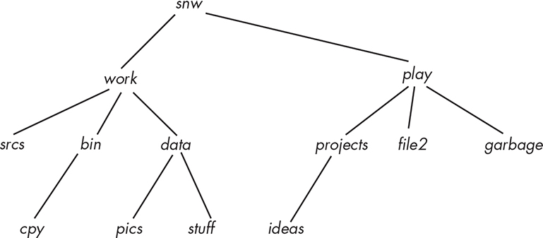

*cpy*, *bin*, *pics*, *stuff*, *data*, *work*, *ideas, projects*, *file2*, *garbage*, *play*, and finally, *snw*.

*Figure 7-8: A sample tree hierarchy*

The key problem is how the program can recursively accumulate the

sizes of the files that it visits. It has to be able to print out the size of each file that it visits and, when it reaches a directory, to print out that directory’s total usage. For example, in Figure 7-8, when it returns to the *data* entry after visiting its children, it has to print the total usage of *pics* and *stuff* and the size of the *data* directory itself. In addition, it has to add to this sum the sizes of *srcs* and the current accumulation in *bin* and add this amount to a running total to pass up to the *work* entry when it returns to it. This suggests that if the program keeps a set of running disk usage totals indexed by the level in the tree, it should be able to record the total disk usage at every directory in the tree, including the directory at the tree’s root.

Let’s call the function that we pass to nftw() file_usage(). Since

file_usage() has no parameter that can be used to pass any program state information to it, the only way for separate invocations of it and the main program to share data is by putting state information in file scope.

Therefore, to record the number of disk blocks used in each level of the tree, the program will need to declare an array \#define MAXDEPTH

50 /\* Some large number to be determined \*/ static uintmax_t

total_usage\[MAXDEPTH\];

in file scope. It has to be in file scope because the main program needs to initialize each element of the array to 0 each time it begins a new tree walk for a directory passed to it, and the file_usage() function needs to update it.

The reason to declare the element type uintmax_t is that it’s the

largest unsigned integer type available. This type is declared in *stdint.h*, so we’ll need to include that header in the main program. The

system_data_types man page describes the type and notes that to print

values of that type, the program needs to use the %ju format specifier in the printf() format specification list.

The choice of constant for MAXDEPTH is easily changed. If we want, the program could make a system call to obtain the maximum number of

open files allowed for the process and dynamically allocate an array of that size, but for now, we’ll assume that the depth of the tree is never greater than 50, so we’ll define MAXDEPTH to be 50.

The prototype for file_usage() is: int file_usage(const char \*fpath,

const struct stat \*sb, int tflag, struct FTW \*ftwbuf)

At any instant of time, file_usage() is visiting a specific file in the tree.

Let’s call this file the *current file* and call its level the *current level*, and let’s use the variable cur_level to represent that level. We’ll call the level of the file processed immediately before the current file the *previous* *level*, and we’ll use the variable prev_level to store that level. We’ll initialize prev_level to -1 to indicate that the directory tree has not yet been processed. Since the main program can be invoked with multiple

directory arguments, it will set prev_level to -1 before calling nftw() on that argument. Since both main() and file_usage() modify prev_level, it will be file-scoped.

Both prev_level and cur_level take on values up to MAXDEPTH and no

larger. The current file has a total usage that we can store in the variable named cur_usage. This is the usage of the actual file, not the sum of the disk usage of any children it may have. Directories are usually allocated

a single block, with a default size of 4096 bytes on most systems. The file_usage() function can get the disk usage of the current file from the stat structure passed into the function; it’s in the st_blocks member of the stat structure. This value is the number of 512-byte blocks; in order to print the number of 1024-byte blocks, we’ll divide it by 2.

Let’s think about what file_usage() has to do for each visited entry. Its actions depend entirely on the values of both cur_level and prev_level. To make the discussion precise, we define a *left sibling* of a tree node as a sibling that is to the left of that node in the tree’s depiction and a *right* *sibling* analogously. The file_usage() function must ensure that the following *invariant* assertion is true immediately after it has finished processing a file:

total_usage\[cur_level\] is the sum of the sizes of all trees whose roots are at level cur_level and are left siblings of the current file, plus the size of the subtree rooted at the current node.

Suppose first that prev_level \< cur_level. This implies that either prev \_level is -1 or we just descended from a node closer to the root of the tree. The latter case can happen only during a postorder traversal when we reach a leaf node that is the leftmost in its tree. For any other node, the previous node will be either at the same level or below it. If

prev_level == -1, it implies that the tree is a single node and is therefore also a leftmost leaf node. Therefore, in either case, we’ve just reached a bottom level of the tree and we need to set total_usage\[cur_level\] to the current file’s usage and copy this into total_usage\[cur_level\]: cur_usage =

sb-\>st_blocks/2; total_usage\[cur_level\] = cur_usage;

Observe that total_usage\[cur_level\] satisfies the invariant assertion in this case.

Let’s consider the next case, in which prev_level == cur_level. In this case, we’re visiting a file that is a right sibling of the one previously visited, and it cannot be a nonempty directory because if it were, we’d be returning to it from a node at a greater level. This implies that we have visited all left siblings of the current file and that the current file has no children. Therefore, we need to update total_usage\[cur_level\] by adding the current file’s disk usage to it: cur_usage = sb-\>st_blocks/2; total_usage\[cur_level\] += cur_usage;

Assuming that the invariant was true prior to this call to file_usage(), it remains true as a result of adding cur_usage to it, since cur_usage is the disk usage of the subtree rooted at this file and total_usage\[cur_level\] is now the total usage of the trees rooted at the left siblings of this node plus this node’s total usage.

The last case to consider is when prev_level \> cur_level. In a postorder traversal, this can occur only when the previous node is a child of the current node and the program has just returned to a directory whose

children have all been visited. For example, in Figure 7-8, if the current node is *play*, the previous node must be *garbage*, since we visit them in a left-to-right order. Therefore, the total disk usage accumulated in the previous node’s level must be added to the disk usage of this parent

directory, and this sum must be printed as the total usage of this

directory.

We now take advantage of the invariant assertion with respect to

total \_usage\[prev_level\]. The algorithm only returns to a parent directory immediately after visiting its rightmost child. Since the last node

processed was the rightmost child and its level is prev_level,

total_usage\[prev_level\] must be the sum of the usages of all subtrees of this directory. Therefore, the disk usage to display for this directory is the number of blocks used by the directory plus total_usage\[prev_level\]:

cur_usage = total_usage\[prev_level\] + sb-\>st_blocks/2;

To preserve the invariant assertion, we also need to add the new

value of cur_usage to total_usage\[cur_level\]. You should convince yourself that, by doing so, the invariant is true for total_usage\[cur_level\]. The next step is the less obvious one—we must reset total_usage\[prev_level\] to 0 so that the combined actions are: cur_usage = total_usage\[prev_level\] + sb-

\>st_blocks; total_usage\[cur_level\] += cur_usage; total_usage\[prev_level\]

= 0;

To see why we have to zero total_usage\[prev_level\], consider what would happen when file_usage() returns and is then called for the next file.

Using the file tree in Figure 7-8, suppose the current file is the directory work, and file_usage() just processed the directory named *data*. Then cur_level = 1 and prev_level = 2. The next file that file_usage() will process is *ideas* and then *projects*. After it visits *ideas* and returns to *projects*,

total_usage\[1\] must have the value 0; otherwise, the size of projects will include the sizes of *srcs*, *bin*, and *data*. In other words, every time that we finish a level of siblings in a subtree, having reached the rightmost

sibling, and return to their parent, we must zero out the entry in the total_usage\[\] array for the children’s level. The only chance to do this is when we’ve added its value into the total usage of the parent and are

finished with that node. Doing this preserves the invariant, since no

nodes are currently being visited in that level anymore.

We’re ready to assemble the initial version of the spl_du1 command.

Our command will print a message next to a filename if that file had a problem such as being a broken link or an unreadable directory. The

real du command prints a message to the standard error stream instead.

To reduce the size of Listing 7-8, I omitted comments. The complete listing is in the source code distribution.

*spl_du1.c*

\#define \_XOPEN_SOURCE 700

\#include "common_hdrs.h"

\#include \<ftw.h\>

\#include \<stdint.h\>

\#include \<limits.h\>

\#define MAXDEPTH 100

static uintmax_t total_usage\[MAXDEPTH\];

static int prev_level;

int file_usage(const char \*fpath, const struct stat \*sb,

int tflag, struct FTW \*ftwbuf)

{

int cur_level;

uintmax_t cur_usage;

cur_level = ftwbuf-\>level;

if ( cur_level \>= MAXDEPTH ) {

fprintf(stderr, "Exceeded maximum depth.\n");

return -1;

}

if ( prev_level == cur_level ) {

cur_usage = sb-\>st_blocks/2;

total_usage\[cur_level\] += cur_usage;

}

else if ( prev_level \> cur_level ) {

cur_usage = total_usage\[prev_level\] + sb-\>st_blocks/2;

total_usage\[cur_level\] += cur_usage;

total_usage\[prev_level\] = 0;

}

else {

cur_usage = sb-\>st_blocks/2;

total_usage\[cur_level\] = cur_usage; }

printf("%ju\t%s", cur_usage, fpath);

prev_level = cur_level;

if ( tflag == FTW_DNR ) printf(" (unreadable directory)\n"); else if ( tflag == FTW_SL ) printf(" (symbolic link)\n");

else if ( tflag == FTW_SLN ) printf(" (broken symbolic link)\n"); else if ( tflag == FTW_NS ) printf("stat() failed\n");

printf("\n");

return 0; /\* To tell nftw() to continue \*/

}

int main(int argc, char \*argv\[\])

{

int flags = FTW_DEPTH \| FTW_PHYS \| FTW_MOUNT;

int status;

int i = 1;

if ( argc \< 2 ) {

memset( total_usage, 0, MAXDEPTH\*sizeof(uintmax_t));

prev_level = -1;

if ( 0 != (status = nftw(".", file_usage, 20, flags)) )

fatal_error(status, "nftw");

}

else

while ( i \< argc ) {

memset(total_usage, 0, MAXDEPTH\*sizeof(uintmax_t));

prev_level = -1;

if ( 0 != (status = nftw(argv\[i\], file_usage, MAXDEPTH, flags)) )

fatal_error(status, "nftw");

i++;

}

exit(EXIT_SUCCESS);

}

*Listing 7-8: An implementation of a simplified version of the* *du* *command* Running spl_du1

and du -a on a test directory produces the same block counts and list of files: \$ **du -a** **testdir** 4 testdir/subdir2 0 testdir/subdir1/subsubdir1/subsubsubdir1/testfile2 0

testdir/subdir1/subsubdir1/subsubsubdir1/testfile1 4

testdir/subdir1/subsubdir1/subsubsubdir1 0 testdir/subdir1/subsubdir1/link2tosubdir1 8

testdir/subdir1/subsubdir1 4 testdir/subdir1/subsubdir2 16 testdir/subdir1 0

testdir/linktosubdir1 24 testdir \$ **./spl_du1 testdir** 4 testdir/subdir2 0

testdir/subdir1/subsubdir1/subsubsubdir1/testfile2 0

testdir/subdir1/subsubdir1/subsubsubdir1/testfile1 4

testdir/subdir1/subsubdir1/subsubsubdir1 0 testdir/subdir1/subsubdir1/link2tosubdir1

(symbolic link) 0 testdir/subdir1/subsubdir1/testfile1.lnk 8 testdir/subdir1/subsubdir1 4

testdir/subdir1/subsubdir2 16 testdir/subdir1 0 testdir/linktosubdir1 (symbolic link) 24

testdir

However, this doesn’t mean it’s correct. If we test it on a few more

directories, we’ll discover a problem. I constructed another test

directory, named *testdir2*, containing a file named *d1* with 560 1K

blocks: \$ **ls -s testdir2/d1** 560

I then created a few hard links to *d1*

\$ **cd testdir2; ln d1 d2 ; ln d1 d3**

\$ **cd ..**

and ran du -a on *testdir*: \$ **du -a testdir2** 560 testdir2/d1 564 testdir2

Not only do we not see *d2* and *d3* in the output, but the total usage doesn’t include them, as it shouldn’t, because they’re just different

names for the single file *d1*. Running our version of the command produces different output: \$ **./spl_du1 testdir2** 560 testdir2/d1 560

testdir2/d3 560 testdir2/d2 1684 testdir2

This program, as it stands, counts files with multiple links as many times as they have links. If a file has two names in two different subdirectories of our root directory, each will be counted. Since the purpose of this

command is to report the amount of disk space a directory tree uses, it isn’t useful in its current state; we need to modify it.

How can we fix it? Since every directory entry has the number of the

inode for the file, we could just check each time whether we’ve already added the disk usage for the actual file by saving the inode number each time we process a file. The stat structure contains the inode number,

st_ino, of the file and the link count, st_nlink. If the link count is only 1, we know there are no other links, but if it’s greater than 1, there might be. Unfortunately, this idea won’t work; I’ll explain why.

On any single filesystem, every file is uniquely identified by its st_ino value. If we allow the program to cross mount points, then the inode

number does not uniquely identify files, because there can be files with the same inode number in two different filesystems. The program might

think it’s already added disk usage for the current file when it hasn’t, because the inode number refers to a file on a different device. We need to know the device as well. The stat structure contains the device ID, st_dev, of the filesystem in which the file is located, and we need to make it part of a file’s unique identification.

Suppose that we create a set named visited that stores the (st_ino,

st_dev) pairs of all nondirectory files that the tree walk has visited that have two or more links. Initially, visited would be empty. Each time that the tree walk visits a new entry, it would check whether it’s a

nondirectory file with a link count greater than 1. If so, it would check whether the entry is already in visited. If it is, it would skip the entry, and if not, it would process it and add the entry to the set. This

modification would prevent double-counting files with more than one

name. The only reason for checking whether the link count is greater

than 1 is to save space in the set and save time because there’s no benefit to storing entries in the set if they have only one name.

There are several ways to implement the visited set, but the two

most efficient would be either a hash table or a search tree. The hash table can have close to *O*(1) performance for each search and/or insertion if it has a good hash function and enough storage capacity. A balanced search tree would require *O*( *n* log *n*) steps to search a set of

size *n*. I decided to use a hash table. Let’s name a second version of the program with these corrections as *spl_du2.c*.

I don’t include the implementation of the hash table here; the file

*hash.c* is available in the source code distribution for the book. The header file *hash.h* exposes the following functions from *hash.c* that the program will call: typedef unsigned long long hash_val; BOOL

insert_hash (hash_table\* h, hash_val val); BOOL is_in_hash (hash_table h, hash_val val); void init_hash (hash_table\* h, int initial_size); void free_hash (hash_table\* h);

Although the definition of the hash_table is also in *hash.h*, we don’t need to see it to use these functions. However, for the same reason that

total_usage\[\] needs to be in file scope, the hash table representing the visited set must also be in file scope in our program: static uintmax_t total_usage\[MAXDEPTH\]; /\* Total disk usage for level n \*/ static

hash_table visited; /\* Set of inodes already visited \*/

The program needs to hash (st_ino, st_dev) pairs, but the functions is_in \_hash() and insert_hash() expect a single number. Therefore, if the file \_usage() function were to call is_in_hash() and insert_hash() directly, those functions would have to be modified so that they accepted both an

inode number and a device ID as arguments.

Rather then designing them to accept two numbers, I took the

approach of designing a more general hash table that could be used by

other programs. Our program can encode the inode number and the

device ID into a single unsigned long long int before calling these

functions. We don’t need a sophisticated encoding algorithm to encode

the inode number and the device ID. There are typically only a very

small number of separate filesystems on a single computer, so

multiplying the inode number by the device ID should be sufficient. We can always fine-tune the encoding at a later time. The following two

functions are essentially wrappers for the calls to the hash table

functions: /\* was_visited(i, d) returns TRUE if the pair was already

visited. \*/ BOOL was_visited(ino_t inode, dev_t dev) { hash_val val =

inode \* dev; return is_in_hash(visited, val); } /\* mark_visited(i, d) inserts (i, d) into the visited set and returns TRUE if successful and FALSE on

an error. \*/ BOOL mark_visited(ino_t inode, dev_t dev) { hash_val val =

inode \* dev; return insert_hash(&visited, val); }

The revised file_usage() function follows, with the changed portions

highlighted in bold: file_usage() *(revised)* int file_usage(const char

\*fpath, const struct stat \*sb, int tflag, struct FTW \*ftwbuf) { static int prev_level = -1; int cur_level; **BOOL already_visited = FALSE;**

uintmax_t cur_usage; cur_level = ftwbuf-\>level; if ( cur_level \>=

MAXDEPTH ) { fprintf(stderr, "Exceeded maximum depth.\n"); return

-1; } ➊ if ( prev_level == cur_level ) { **if ( sb-\>st_nlink == 1 ) {**

cur_usage = sb-\>st_blocks/2; total_usage\[cur_level\] += cur_usage; **}**

**else { already_visited = was_visited(sb-\>st_ino, sb-\>st_dev);** **if ( !already_visited ) { cur_usage = sb-\>st_blocks/2;**

**total_usage\[cur_level\] += cur_usage; if ( !mark_visited(sb-**

**\>st_ino, sb-\>st_dev) ) fatal_error(-1, "Could not insert** **inode into hash table"); }** } } ➋ else if ( prev_level \> cur_level ) {

cur_usage = total_usage\[prev_level\] + sb-\>st_blocks/2;

total_usage\[cur_level\] += cur_usage; total_usage\[prev_level\] = 0; } ➌ else

{ **if ( sb-\>st_nlink == 1 \|\| S_ISDIR(sb-\>st_mode) ) {** cur_usage

= sb-\>st_blocks/2; total_usage\[cur_level\] = cur_usage; **} else {**

**already_visited = was_visited(sb-\>st_ino, sb-\>st_dev); if (**

**!already_visited ) { cur_usage = sb-\>st_blocks/2;**

**total_usage\[cur_level\] = cur_usage; if ( !mark_visited(sb-**

**\>st_ino, sb-\>st_dev) ) fatal_error(-1, "Could not insert** **inode into hash table"); }** } } **if ( !already_visited ) {**

printf("%ju\t%s", cur_usage, fpath); if ( tflag == FTW_DNR ) printf("

(unreadable directory)\n"); else if ( tflag == FTW_SL ) printf("

(symbolic link)\n"); else if ( tflag == FTW_SLN ) printf(" (broken symbolic link)\n"); else if ( tflag == FTW_NS ) printf("stat() failed\n"); printf("\n"); } prev_level = cur_level; return 0; }

Notice that we don’t check for whether the entry is a directory when

prev \_level == current_level ➊. Because of the nature of the postorder traversal by nftw(), it cannot be a directory in this case, and therefore, we just check how many links it has. When prev_level \> current_level ➋, it must be a directory and we don’t need to check the link count. When

prev_level \< current \_level ➌, it might be a directory with no children or

an ordinary file. In this case, we check the link count only if it isn’t a directory.

The only changes to the main program are the initialization of the

hash table and the freeing of the memory it uses. The entire main()

function is displayed in the following listing, with the changes

highlighted in bold. The \#include directives and the feature test macro (#define \_XOPEN_SOURCE 700) are omitted: *spl_du2.c* main() int main(int argc, char \*argv\[\]) { int flags = FTW_DEPTH \| FTW_PHYS **/\*\|**

**FTW_MOUNT \*/**; int status; int i = 1; if ( argc \< 2 ) { **init_hash(&visited,** **INITIAL_HASH_SIZE);** memset(total_usage, 0,

MAXDEPTH\*sizeof(uintmax_t)); if ( 0 != (status = nftw(".", file_usage, 20, flags)) ) fatal_error(status, "nftw"); **free_hash(&visited);** } else while ( i \< argc ) { **init_hash(&visited, INITIAL_HASH_SIZE);** memset(total_usage, 0, MAXDEPTH\*sizeof(uintmax_t)); if ( 0 != (status

= nftw(argv\[i\], file_usage, MAXDEPTH, flags)) ) fatal_error(status,

"nftw"); else { i++; **free_hash(&visited);** } } exit(EXIT_SUCCESS); }

The INITIAL_HASH_SIZE is a macro value. The hash table insertion function is designed to resize the hash table if it gets more than half full, so the choice of initial size is not that important because it will grow as needed.

I made it 1024 for this version of the program.

Also, in this version, the FTW_MOUNT flag is commented out. If we want to see whether the program correctly displays disk usage of files with the same inode number but on different filesystems, we have to allow

the program to cross mount points. If you uncomment this flag and

build the executable, it will cross mount points, allowing you to see what happens when files have the same inode but are on different devices.

We can build the executable and run it on a few directories that

contain files with multiple links. For example, we can run it on the

*testdir2* directory that started this discussion: \$ **./spl_du2 testdir2**

560 testdir2/d2 564 testdir2

Only one of the files is counted. If you experiment with this revised

version of the program, you’ll see that it does not overcount any files with multiple names.

We could add enhancements to this program, such as options to

limit the depth of the traversal, turn on and off crossing mount points,

or change the display units, but these are not critical. We’ve achieved the goal of this exercise: to explore how to use the nftw() function and to implement a useful command. These enhancements are left as exercises.

*The fts Tree Traversal Functions*

The SEE ALSO section of nftw()’s man page mentions the fts functions.

Before we leave the topic of tree traversals, let’s take a brief look at them.

Unlike nftw(), fts is not a single function but an integrated set of

related functions, in much the same way that opendir(), readdir(),

rewinddir(), and closedir() are interrelated functions. The fts functions have their origin in the BSD distributions, starting with 4.4BSD, and

they aren’t POSIX functions. They are available in most Linux

distributions though. The fts set of functions includes: FTS

\*fts_open(char \* const \*path_argv, int options, int (\*compar)(const

FTSENT \*\*, const FTSENT \*\*)); FTSENT \*fts_read(FTS \*ftsp);

FTSENT \*fts_children(FTS \*ftsp, int instr); int fts_set(FTS \*ftsp,

FTSENT \*f, int instr); int fts_close(FTS \*ftsp);

Just as opendir() creates a directory stream object and returns a pointer to it, fts_open() creates a *handle* that is used by the other functions. A *handle* is a pointer to an FTS structure. Unlike nftw(), which does not allow the application to control the order in which files are searched other than whether it is preorder or postorder, fts allows the calling program to specify this order.

The fact that these functions are not part of the POSIX standard

implies that any application that uses them may not be portable. On the other hand, we can do much more with the fts functions than we could

with nftw() because these functions are much more flexible and have

hooks for program data so that we don’t need file-scoped or static

variables to store the program’s larger state information.

I’ll explain the basics of these functions and give a small example to illustrate how they’re used. This can be a powerful tool when the

program you’re writing does not need to be portable. We’ll start with a summary of the fts functions:

We call fts_open() first. We pass it an array of strings representing the roots of trees that we want to traverse, an integer that encodes

various options, and a comparison function to be used for

determining the order in which files are visited. It returns a handle

for an FTS structure.

The fts_read() function visits a file each time it’s called. The handle returned by fts_open() is passed to fts_read(). Each file in the tree is visited just once, except for directories, which are visited before and after their children. fts_read() returns a pointer to an FTSENT structure for each file that it visits. The FTSENT structures have a member that allows them to be linked together.

If the currently visited file is a directory, then a call to the

fts_children() function returns a pointer to a linked list of FTSENT

structures representing all of the children in this directory.

The fts_set() function allows a file to be reprocessed after it has

been returned by a call to fts_read().

The fts_close() function is the cleanup function. After processing

the entire directory tree passed to fts_open(), we call fts_close() to close the stream and clean up resources.

To use these functions, we need to know the contents of the FTSENT

structure, because that’s what characterizes each visited file. That

structure is defined in the header file */usr/include/fts.h*: typedef struct \_ftsent { unsigned short fts_info; /\* Flags for FTSENT structure \*/ char

\*fts_accpath; /\* Access path \*/ char \*fts_path; /\* Root path \*/ short

fts_pathlen; /\* strlen(fts_path) \*/ char \*fts_name; /\* Filename \*/ short fts_namelen; /\* strlen(fts_name) \*/ short fts_level; /\* Depth (-1 to N) \*/

int fts_errno; /\* File errno \*/ long fts_number; /\* Local numeric value \*/

void \*fts_pointer; /\* Local address value \*/ struct ftsent \*fts_parent; /\*

Parent directory \*/ struct ftsent \*fts_link; /\* Next file structure \*/ struct ftsent \*fts_cycle; /\* Cycle structure \*/ struct stat \*fts_statp; /\* stat(2) information \*/ } FTSENT;

Although this structure has many members, for relatively simple

applications, we won’t use many of them. The most important members

are as follows:

**fts_info** An integer that encodes information about the type of object represented by this structure.

**fts_accpath** A path for accessing the file from the current directory.

**fts_path** The path for the file relative to the root of the traversal.

This path contains the path specified to fts_open() as a prefix.

**fts_name** The filename.

**fts_errno** Upon return of an FTSENT structure from the fts_children() or fts_read() functions, with its fts_info field set to FTS_DNR, FTS_ERR or FTS_NS, the fts_errno field contains the value of the external variable errno specifying the cause of the error. Otherwise, the contents of the fts_errno field are undefined.

**fts_number** Provided for the use of the application program and not modified by the fts functions. It is initialized to 0.

**fts_pointer** Provided for the use of the application program and not modified by the fts functions. It is initialized to NULL.

**fts_parent** A pointer to the FTSENT structure referencing the file in the hierarchy immediately above the current file, that is, the directory of which this file is a member. A parent structure for the initial entry

point is provided as well; however, only the fts_level, fts_number, and fts_pointer fields are guaranteed to be initialized.

**fts_link** Upon return from the fts_children() function, the fts_link field points to the next structure in the NULL-terminated linked list of directory members. Otherwise, the contents of the fts_link field are

undefined.

**fts_statp** A pointer to a stat structure for the file.

The fts_info field provides information about the visited file encoded into an integer value. It contains exactly one of the following values: **FTS_D** A directory being visited in preorder.

**FTS_DC** A directory that causes a cycle in the tree. The fts_cycle field of the FTSENT structure will be filled in as well.

**FTS_DEFAULT** Any FTSENT structure that represents a file type not explicitly described by one of the other fts_info values.

**FTS_DNR** A directory that cannot be read. This is an error return, and the fts_errno field will be set to indicate what caused the error.

**FTS_DOT** A dot file that wasn’t specified as a filename to fts_open().

**FTS_DP** A directory being visited in postorder.

**FTS_ERR** This is an error return, and the fts_errno field is set to indicate what caused the error.

**FTS_F** A regular file.

**FTS_NS** A file for which no stat information was available. The contents of the fts_statp field are undefined. The fts_errno field will be set to indicate what caused this error.

**FTS_NSOK** A file for which no stat information was requested. The contents of the fts_statp field are undefined.

**FTS_SL** A symbolic link.

**FTS_SLNONE** A symbolic link with a nonexistent target. The contents of the fts_statp field reference the file characteristic information for the symbolic link itself.

Let’s compare this family of functions to the nftw() function:

The fts_info member has information similar to that found in the

tflag argument to the (\*fn) function by nftw(). It characterizes the

visited file.

Unlike the nftw() function, the structure representing the current

file, FTSENT, has hooks for the application to use. Specifically,

fts_number and fts_pointer can be used for application-specific data,

making it possible to change state and data across different

invocations of the fts_read() function.

The fts_parent field provides a means to access the parent node, which ntfw() does not do.

The FTSENT structure has stat information for the returned file

through its fts_statp member, provided no error occurred.

The name of the file is in the fts_name member. The fts_path member

has the pathname of the file relative to the root of the tree walk.

Let’s look at a small example that illustrates how we can use the

fts_read() function in a tree walk. The program, which we’ll name

*fts_demo.c*, displays the sizes, in bytes, of all files in the directory’s tree, and after processing all files, it prints out the name and size of the largest file that it found. The comparison function that it passes to the fts_open() function compares two entries by name using the current

locale’s collating sequence: \#include "common_hdrs.h" \#include \<fts.h\> int namecmp(const FTSENT \*\*s1, const FTSENT \*\*s2) { return

(strcoll((\*s1)-\>fts_name, (\*s2)-\>fts_name)); }

The strcoll() function was introduced in Chapter 3. It compares two strings based on the current locale.

The main program processes the directory whose pathname is given

as the program’s first argument. In addition to printing a file’s size, it indents each visited file’s pathname by a number of spaces proportional to its level in the tree to make it easy to see the nested directory

structure (see Listing 7-9).

*fts_demo.c* main()

int main(int argc, char \*argv\[\])

{

FTS \*tree;

FTSENT \*file;

char errmssge\[128\];

char largest_file\[PATH_MAX\];

size_t max = 0, size;

if ( argc \< 2 ) {

sprintf(errmssge, "%s directory\n", argv\[0\]);

usage_error(errmssge);

}

➊ char \*dir\[\] = { argv\[1\], NULL };

if ( NULL == (tree = fts_open(dir, FTS_PHYSICAL , namecmp)) )

fatal_error(errno, "fts_open");

errno = 0;

while ( (file = fts_read(tree)) ) {

➋ switch ( file-\>fts_info ) {

case FTS_DNR: /\* Cannot read directory \*/

fprintf(stderr, "Could not read %s\n", file-\>fts_path);

continue;

case FTS_ERR: /\* Miscellaneous error \*/

fprintf(stderr, "Error on %s\n", file-\>fts_path);

continue;

case FTS_NS: /\* stat() error: Continue to next files. \*/

fprintf(stderr, "Could not stat %s\n", file-\>fts_path);

continue;

case FTS_DP: /\* Ignore postorder visit to directory. \*/

continue;

}

/\* Check if this is largest file so far. \*/

➌ size = file-\>fts_statp-\>st_size;

if ( max \< size ) {

max = size;

strncpy(largest_file, file-\>fts_path, 1+file-\>fts_pathlen);

}

➍ printf("%12ld\t%\*s%s\n", size,

4\*(file-\>fts_level), " ", file-\>fts_path);

errno = 0; /\* Set errno to 0 again before next fts_read(). \*/

}

if ( errno != 0 )

fatal_error(errno, "fts_read"); printf("Largest file is %s with size

%lu\n", largest_file, max);

if ( fts_close(tree) \< 0 )

fatal_error(errno, "fts_close");

return(EXIT_SUCCESS);

}

*Listing 7-9: A program that shows how to use the* *fts* *functions* The program starts by passing a NULL-terminated array of directory pathnames ➊ and the comparison function to the fts_open() function. In this program the array has just a single pathname, argv\[1\], but in general, it can have more. If the open succeeds, the program repeatedly calls fts_read().

The order in which files are visited is determined by the comparison function. For each file, it uses the fts_info field ➋ to determine if there were errors processing the file, and if not, it gets its size from the fts_statp pointer to the file’s stat structure ➌. If the file is larger than the current largest file, it updates the variables that record this information. Since the fts_level field is the level of the file relative to the root of the tree, it indents the filename by 4\*fts_level spaces to emphasize its depth in the tree.

The printf() ➍ function’s format string, "%12ld\t%\*s%s\n", has something new. The specifier %\*s expects a number followed by a string.

The number is the minimum width of the field in which to print the

string. Therefore printf("%\*s%s\n", 4\*(file-\>fts_level), " ", file-

\>fts_path);

prints a space in a field of width 4\*(file-\>fts_level) followed by the string stored in file-\>fts_path.

I built the executable (fts_demo) and ran it on the test directory to see how it behaves: \$ **./fts_demo testdir** 4096 testdir 7

testdir/linktosubdir1 18893 testdir/newfile 4096 testdir/subdir1 4096

testdir/subdir1/subsubdir1 13

testdir/subdir1/subsubdir1/link2tosubdir1 4096

testdir/subdir1/subsubdir1/subsubsubdir1 0

testdir/subdir1/subsubdir1/subsubsubdir1/testf. . 0

testdir/subdir1/subsubdir1/testfile1.lnk 4096 testdir/subdir1/subsubdir2

4096 testdir/subdir2 Largest file: testdir/newfile; Size=18893

Although the program is a simple one, you can see the potential that

these fts functions have for implementing a variety of applications that need to walk a directory tree. For example, we could implement du with it, or a recursive ls, or even the more complex find command. In fact, the GNU versions of commands such as grep, chmod, chown, rm, cp, and chgrp are implemented with the fts functions to perform their recursive tree

traversals. On BSD systems, the find command is based on the fts

functions.

The pwd Command

The pwd command prints the absolute pathname of the current working directory. Implementing it will expand our understanding of the

structure of directories, but will also present a different set of challenges than we’ve encountered so far. To see this, we’ll work through a small exercise.

*An Exercise in Constructing a Directory Tree*

We’ll try to reconstruct a portion of a file hierarchy from the inode

numbers in a set of directories. Let’s suppose that we’re given a

directory named *scratch* that contains subdirectories and ordinary files and that the subdirectories also have subdirectories, and so on. Each of these subdirectories may have regular files as well. Let’s assume for this example that all files are in the same filesystem, so that inode numbers uniquely identify files. The command \$ **ls -1iaR scratch**

can be used to recursively display the inode numbers and filenames of

all files in the directory tree rooted at *scratch*, including the entries for dot and dot-dot in each directory. These dot and dot-dot entries play a critical role in navigating the directories. Suppose that entering ls -1iaR

scratch produces the following output, in which the actual directory

names have been omitted: 725 . 449 . 753 README 727 work 728

misc 731 . 728 . 733 TODOLIST 732 tests 727 . 725 . 729 prog1 730

info 733 TODO 728 . 725 . 729 docs 731 testing 748 prog2

The contents of these directories have enough information to

reconstruct the file tree rooted at *scratch*. First, we’ll draw a tree whose nodes are just inode numbers, after which we can use the directory

listing to assign filenames to those numbers. For example, from the last five lines of output, we see that node 728 has three children, 731, 748, and 729, and that its parent is 725, so our first subtree looks like this:

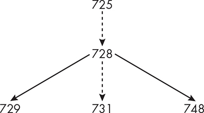

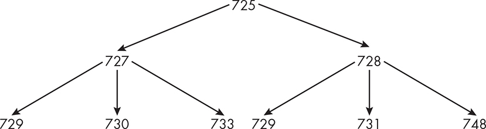

Similarly, the preceding five lines show that node 727 has children

with inode numbers 729, 739, and 733, and that its parent is 725, which we can use to construct the combined subtree so far:

The lines above the last group show that the inode with number 731

has two child nodes with numbers 732 and 733 and that its parent is

728\. This is a subtree of the first tree we constructed. We’ll attach this subtree to our growing tree, and simultaneously, since inode 725 has

children with numbers 728, 729, and 753, we’ll create the new node,

753, and attach it as a child of node 725:

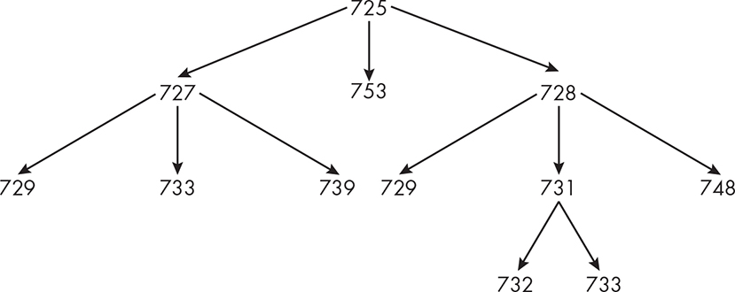

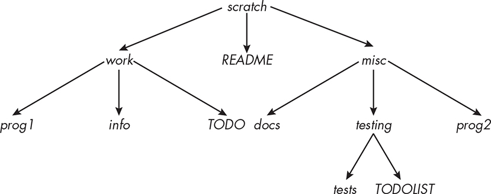

Looking at the resulting tree, we see that two of the inodes, 729 and

733, have links in two different directories; as we replace inode numbers with filenames, we’ll use the filenames for those inodes that are

contained in the respective directories:

This exercise demonstrates that the parent entries in a given directory are the only means to obtain that directory’s name and that

the only way to do this when all files are in the same filesystem is to: 1. Save the inode number of the current directory, which is the one

associated with the dot entry.

2\. Find the inode number for the parent entry in the current

directory, meaning the dot-dot entry.

3\. Get the list of child inodes of the parent directory.

4\. Find the inode number in this list that matches the inode number

for dot in the current directory.

5\. For the matching inode number, get the filename associated with

it. This is the name of the current working directory.

In short, the parent directory entries in a directory play a vital role in the hierarchy, because they’re essentially *backlinks*—they’re the only practical way to know the name of the current directory and the only

way to ascend the tree.

This strategy will not work in all cases because it doesn’t account for the effect of mount points on this problem. When a part of this

directory tree is in a different filesystem because one of the directories is a mount point, it isn’t enough to use inode numbers alone. We need to

use ( *inode number*, *device ID*) pairs to represent files. In the preceding sequence of steps, each reference to an inode number must be replaced

by an ( *inode number*, *device ID*) pair. To make this convenient, we’ll define a structure that represents such a pair: typedef struct

device_inode_pair { dev_t dev; ino_t ino; } dev_ino;

All preceding references to inode numbers should now be thought of as

references to elements of type dev_ino.

*A Strategy for Implementing the pwd Command*

Suppose our current working directory is *chap_dir_hierarchy*, which is located in the directory *demos*, which is in *lsp_book*, which is in *teaching*, which is in *snw*, which is in *home*, which is in the root directory, */*. Then

entering **pwd** will print the absolute pathname: \$ **pwd**

/home/snw/teaching/lsp_book/demos/chap_dir_hierarchy

Initially, pwd doesn’t know where the working directory is with respect to the potentially very large directory tree; it doesn’t have the path to it.

From the preceding exercise it should be clear that to construct this

path, it has to work upward, using the parent entries of each new

directory as it ascends the tree.

In fact, there’s a system call as well as a library function, both named getcwd(), that return the absolute pathname of the current working

directory. If we wanted to, we could call either of them to solve this problem and we’d be finished; however, since the objective of this

exercise is to learn how to climb the tree, that is not an option. Instead, we will try to write those functions from scratch.

The exercise we did gives us part of the strategy for implementing

the pwd command. We find the name of the current directory using the

steps we described on page 373, substituting dev_ino pairs for the inode numbers. We then step up to the parent directory and repeat these

steps. We do this repeatedly until we’ve reached the root of the

directory hierarchy. This strategy raises several questions:

How can a program change its working directory to that of its

parent?

How can a program get the list of children of its parent directory?

How can a program determine which directory entry in the parent

matches the child representing the current directory?

How can we tell when we’ve reached the root of the tree?

How do we construct the string that stores the absolute pathname

to the directory from right to left, since that’s the order in which

we’ll discover the ancestor directories?

Do we need to be concerned about the maximum length of a

pathname? If so, what would we do if the pathname exceeded it?

To answer the first question, let’s see what a man page search will

give us: \$ **apropos -s2,3 -a change directory** chdir (2) - change

working directory chdir (3posix) - change working directory chroot (2) -

change root directory fchdir (2) - change working directory fchdir

(3posix) - change working directory *--snip--*

The chdir(2) and fchdir(2) functions share the same man page. The

corresponding POSIX pages describe the POSIX requirements for

these functions. The synopsis for them is: \#include \<unistd.h\> int chdir(const char \*path); int fchdir(int fd);

The first function changes to the directory specified by the string path, whereas the second, fchdir(), changes to the directory specified by the file descriptor, fd. The second function requires opening the directory and obtaining its descriptor, whereas the first doesn’t require this. As a system call, the second is faster, but for this program, speed is not an important factor. Both can fail for a variety of reasons, such as not

having permission on the directory or encountering an I/O error.

Although unlikely to fail in this case, we still need to error-check the return value. Therefore, changing the working directory to the parent is accomplished with: errno = 0; if ( -1 == chdir(". ") ) fatal_error(errno,

"chdir");

To answer the second question, we can use any of the methods from

earlier in this chapter to open a directory and retrieve its child entries.

One choice is to use opendir() to open it and then repeatedly call readdir() to get its entries until we find the matching inode number. Another

choice is to call scandir(), passing a filter function designed to select only the single entry whose ( *inode number*, *device ID*) matches that of the current directory. Performance-wise, it’s a toss-up: Repeated calls to readdir() may be faster in the case that we quickly find the match, but each call adds time, whereas the single call to scandir() may be a slower call, and we can’t control which order it searches the directory. I’ll choose to use repeated calls to readdir().

To determine which directory entry in the parent matches the child,

before stepping up to the parent directory, the program can call stat() to get the inode number and device ID of ".", which is the entry for the current working directory, and store it into a dev_ino structure named dir_dev_ino. When it’s changed the working directory to the parent

directory using chdir("..") and it’s searching through all of its entries, for

each entry returned by readdir(), it would call lstat() on the d_name member of the dirent structure to retrieve the inode number and device ID of the entry, storing the pair into a dev_ino structure, say named

this_dev_ino. If this_dev_ino and dir_dev_ino match, then the d_name in the dirent structure is the name of the directory. It’s important that we use lstat() rather than stat(); the latter reports on the targets of symbolic links and not the links themselves and will lead to errors.

To make the code more readable, I’ll define a Boolean-valued

function that compares dev_ino structures: BOOL are_samefile(dev_ino

f1, dev_ino f2) { return (f1.ino == f2.ino && f1.dev == f2.dev); }

I’ll also define a function, which I’ve named get_dev_ino(), that, given a filename relative to the current directory, gets its inode number and

device ID and stores them in a dev_ino structure: void get_dev_ino(const char \*fname, dev_ino \*dev_inode) { struct stat sb; errno = 0; if ( -1 ==

lstat( fname , &sb ) ) fatal_error(errno, "Cannot stat "); dev_inode-\>dev

= sb.st_dev; dev_inode-\>ino = sb.st_ino; }

Assume that dir_dev_ino is the dev_ino pair for the directory whose

name we’re trying to find and that the program has changed directory

into the parent directory. The code, missing its error checking, would then be roughly: dir_ptr = opendir("."); /\* Open parent directory. \*/

while ( (direntp = readdir(dir_ptr)) != NULL ) { get_dev_ino(direntp-

\>d_name, &this_entry); if ( are_samefile(this_entry, dir_dev_ino) ) { //

OMITTED: Found the matching entry else // OMITTED: Keep

searching. }

The next question is how we’ll know when we’ve reached the root.

There are two ways. One is to call stat("/", &sb) at the start of the program to get a stat structure for the root, extract its inode number and device ID, and store them. Each time we’re about to change

directory to the parent, we’d compare the inode and device against that of the root. If they match, we know we’re at the root. A second method is to use the fact that in the root directory, and only in the root

directory, the dot and dot-dot entries point to the same inode. Each

time we’re about to change directory to the parent, we’d check whether the parent and the current directory have the same dev_ino pair. If so,

we’d stop; otherwise, we’d continue. I’ll use the first method because it’s simpler.

The last question is how to build the pathname. Because we’re

ascending the tree rather than descending it, we’re discovering the

names of the directories in the pathname in a right-to-left order. We

can’t just append the most recently discovered directory name to the

pathname because the path would be backward if we did. Instead we

have to *prepend* it to the existing partially constructed pathname. Figure

7-9 visualizes the steps to prepend the first directory name to an initially empty buffer of size PATH_MAX bytes storing the pathname. We’ve used the PATH_MAX macro before; it’s the largest allowable size of a pathname on the system, typically 4096 bytes.

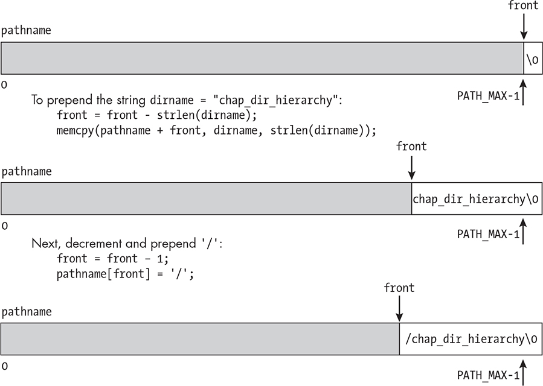

*Figure 7-9: The steps to build the pathname in a right-to-left direction by prepending each* *new parent directory*

The first step is to write a NULL byte to the rightmost position in the buffer in pathname\[PATH_MAX-1\]. At all times, front will be the index of the leftmost character of the partially built pathname. Initially, front =

PATH_MAX-1. For each name that we want to prepend, we get the string

length of the name len = strlen{dirname};

and subtract it from front so that front points to where this name will start in the buffer. We then copy the directory name to this position.

The C memcpy() function can copy it efficiently. It won’t add a NULL byte to the end, but we already put it there. Lastly, we prepend a / to the string, decrementing front. This process is then repeated until the entire

pathname has been constructed.

The only problem that this last algorithm does not consider is what

will happen if the pathname is larger than the buffer. This can happen if directory names are very long and the working directory is very deep in the directory tree.

The easiest acceptable solution is to write a message that the full

path was not constructed and replace the initial part of the pathname by a sequence of ellipsis characters. If we name the executable spl_pwd, with our previous example, the output would be something like: \$ **./spl_pwd** Error: File name too long

. . /teaching/lsp_book/demos/chap_dir_hierarchy

It’s not that hard to detect when this error would occur. In the listings that follow, which we’re ready to assemble, we’ll call out the code that handles it.

The first function is the one that searches in the parent directory to find the name of the current directory. When this has been called, the working directory is already the parent: get_filename() char

\*get_filename(dev_ino child_entry) { DIR \*dir_ptr; /\* The directory to be opened \*/ struct dirent \*direntp; /\* The dirent for each entry \*/

dev_ino this_entry; /\* The dev_ino pair for the entry \*/ char

errmssge\[256\]; /\* To store error messages \*/ int len; /\* Length of a

string \*/ char \*fname; /\* malloc-ed name to return to caller \*/ errno = 0; dir_ptr = opendir("."); if ( dir_ptr == NULL ) fatal_error(errno,

"opendir"); /\* Search through the current working directory for a file whose inode number and device ID are that of entry. \*/ while ( (direntp

= readdir dir_ptr)) != NULL ) { errno = 0; get_dev_ino(direntp-

\>d_name, &this_entry); /\* If this entry matches, we found the file. \*/ if (

are_samefile(this_entry, child_entry) ) { /\* Copy the entry's d_name into a malloc-ed fname. \*/ len = strlen(direntp-\>d_name); errno = 0; if (

NULL == (fname = malloc(len+1)) ) fatal_error(errno, "malloc");

strncpy(fname, direntp-\>d_name, len); closedir(dir_ptr); return fname; }

} /\* If we reach here, there is no matching entry in this directory. \*/

sprintf(errmssge, "i-number %lu not found.\n", child_entry.ino); error_mssge(-1, errmssge); return NULL; }

A call to get_filename(dir_dev_ino) in the parent directory of the current working directory returns the name of the current working directory by searching through the entries in the parent using the algorithm we

described. If, for some reason, no entry is found that matches, an error is reported and a NULL pointer is returned instead.

Because the function is returning a pointer to the directory name,

that name can’t be on the stack. Instead, the function allocates memory for the name on the heap using malloc(). It has to be freed by the caller when it is no longer needed.

Listing 7-10 is of the main program. To save space, prototypes for the preceding functions replace their code. The complete program is in the book’s source code distribution.

*spl_pwd.c*

\#include "common_hdrs.h"

\#include \<sys/stat.h\>

\#include \<dirent.h\>

/\* The following two functions are in preceding listings: \*/

void get_dev_ino(const char \*fname, dev_ino \*dev_inode);

char \*get_filename(dev_ino child_entry);

int main(int argc, char \*argv\[\])

{

dev_ino current;

dev_ino root;

char pathname\[PATH_MAX\];

char \*dirname;

ssize_t front = PATH_MAX-1;

ssize_t namelength;

get_dev_ino("/", &root);

get_dev_ino(".", &current);

if ( are_samefile(current, root) ) {

printf("/\n");

return 0;

}

pathname\[PATH_MAX-1\] = '\0';

while ( !are_samefile(current, root) ) {

/\* Go up to parent directory. \*/

chdir("..");

/\* Search in the parent directory for the fileame of this_inode. \*/

if ( NULL == (dirname = get_filename(current)) )

fatal_error(-1,

"Could not find entry in .. for current directory.");

/\* If successful, write this name to the left of the current path. \*/

namelength = strlen(dirname);

/\* Check if the new path is too long. If so, fill with dots instead

and report the error. \*/ ➊ if ( front - namelength \<= 0 ) {

memset(&(pathname\[0\]), '.', front);

front = 0;

error_mssge(ENAMETOOLONG, "Error");

break;

}

else {

front = front - namelength;

memcpy(pathname+front, dirname, namelength);

}

/\* Free the memory allocated by get_filename() for this string. \*/

free(dirname);

front--;

pathname\[front\] = '/';

get_dev_ino(".", &current); /\* To start next level \*/

}

printf("%s\n", &(pathname\[front\]));

return 0;

}

*Listing 7-10: A program that displays the absolute pathname of the current working directory* Just before prepending the next component of the pathname, the program checks ➊ whether the buffer would overflow if it did. If so, instead of prepending the component, it puts a

string of dots there instead to indicate that something’s missing. It also prints an error message.

We’ll build the executable, naming it spl_pwd, and run it and pwd in the same directory. I’ll pick one whose path crosses two mount points: \$

**./spl_pwd**

/data/research_resources/physics/articles/more_articles/quantumstuff \$

**pwd**

/data/research_resources/physics/articles/more_articles/quantumstuff

The *more_articles* directory is the mount point for */dev/sdd4*, and *data* is the mount point for */dev/sdb4*

\$ **df --output=source,target . /data**

Filesystem Mounted on

/dev/sdd4 /data/research_resources/physics/articles/more_articles

/dev/sdb4 /data

which implies that the program crossed both mount points on its way

up the tree.

The actual pwd command is usually implemented in a more complex

way than the one we developed here. The implementations vary from

one distribution to another. We could have used the getcwd() function to do most of the work. The GNU/Linux implementation avoids calling

getcwd() because that function fails for pathnames that exceed PATH_MAX

bytes, and their version is designed to be more robust. Their version

handles pathnames of unlimited length. Our version fails if it doesn’t have permission to open a directory, whereas the GNU version displays

a more useful diagnostic. Finally, the GNU version will fall back to

reading the PWD environment variable if things go awry, and we didn’t

consider that option.

Summary

The structure of a directory file in Unix is quite simple. A directory is just a sequence of entries, called links, of the form ( *inode number,* *filename*), among which are two entries present even in empty

directories: ".", called *dot*, and "..", called *dot-dot*, which refer,

respectively, to the directory itself and to the parent directory. These two entries provide the means to connect the directories and files into a tree-like structure called the directory hierarchy.

There are a few different methods of processing the contents of

directories. One approach uses an API that requires opening a directory using opendir(); getting a directory stream as a result; using successive calls to readdir() to read the entries in the directory, which are delivered in sequence; and closing the stream with closedir(). This API also

contains a few other useful functions for saving a position in the

directory stream (telldir()), returning to a saved position (seekdir()), and starting all over from the beginning (rewinddir()).

Another method is to use the scandir() function, which does not

require the directory to be opened and which collects all of its entries into an array that can be accessed after the call returns. This option gives us the ability to filter the entries and also to order them by passing it a filtering function and/or a comparison function. We developed a few different programs for listing directory contents in the chapter to

demonstrate how both of these methods could be used.

The directory hierarchy is a single tree-like structure whose nodes

are directories and files. Even though it isn’t technically a tree, it’s convenient to call it one. Distinct filesystems can be attached to this single tree by a process called mounting. In mounting, the root of the filesystem to be mounted is attached to an existing directory in the tree, called its mount point. Mounting allows different types of filesystems to be a part of a single hierarchy.

There are many different ways to *walk* through a directory tree, such as a depth-first traversal and a breadth-first traversal. One can do

preorder or postorder processing while walking the tree. The nftw()

function allows us to walk a tree in various ways, as does the fts set of functions. The former is a POSIX standardized tree walk function

whereas the latter is a BSD-derived set of functions that may not be

present on all systems. These functions can be used to implement a wide range of directory tree tools, such as the find command and many

others.

In this chapter, we showed how to walk a directory tree using recursive algorithms based on the readdir() and the scandir() functions.

We also implemented a simple version of the du command based on the

nftw() function and demonstrated with smaller programs how to use

some of the fts functions. Lastly, we solved a different problem, that of walking up the tree, to implement the pwd command.

Exercises

1\. Modify the *spl_ls1.c* program so that it does not display the . and ..

entries and sorts the entries in the collating order of the current

locale. You’ll need an array to solve this problem.

2\. Modify the *spl_ls1.c* program so that it omits the . and .. entries and sorts the entries by their times of last modification, with the

more recent files preceding the less recent ones.

3\. In “A Simple ls Program” on page 321, we purposely gave the listdir() function a flags parameter that it didn’t need so that it was extensible. With that in mind, write a version of ls that accepts one

or more of the following options: **-l** \# Display a listing for each file similar to the real ls. **-F** \# Add one of the characters \*/=\>@\| to the end of the file to indicate its type. **-g** \# Display each entry's group.

4\. The filter function passed as the third argument to scandir() is used to select which entries are copied into the returned array of

directory entries. Can it be used to limit those entries to the ones

whose filenames match a pattern, such as a fileglob? Read the man

page for fnmatch().

Try to use this strategy to implement a command findmatches

that can recursively find all files in a directory tree whose names

match the fileglob specified on the command line as follows: \$

**./findmatches** ***fileglob directory_name***

Remember that the filter function has no hooks, so you’ll need to

use globally scoped variables that it can access. An alternative

solution would not pass a filter to scandir(). You could try that also.

In either case, implement only the standard fileglobs, not any extensions.

5\. Exercise 4 asks you to use scandir(). Solve this same problem using the fts set of functions instead.

6\. Write a version of spl_du based on a recursive algorithm using

scandir().

7\. Write a version of spl_du with an option -d *maxlevel* that will not process any files whose level in the tree is greater than *maxlevel*.

8\. The find command is a very powerful command. Its man page

shows how many different ways it can be used. Write a limited

version of find named findlinks that when run as \$ **./findlinks**

***dirpath pathname***

searches in the directory tree rooted at *dirpath* for all filenames that are links to the same file as *pathname* and prints out their pathnames relative to *dirpath*.

