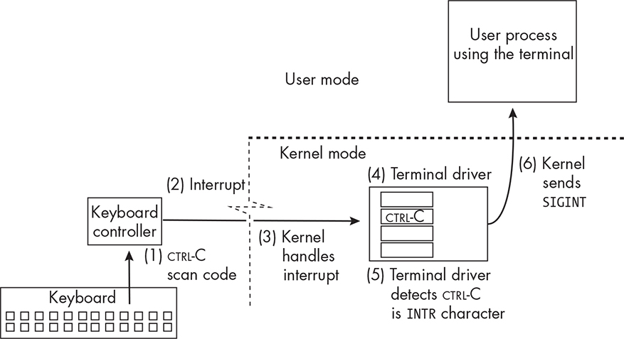
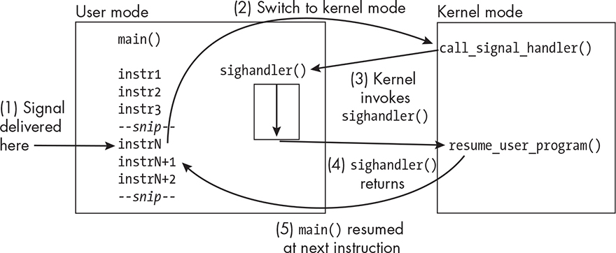
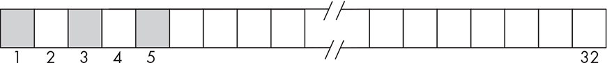
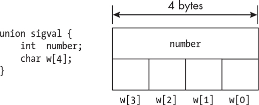
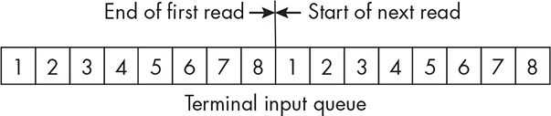

8 INTRODUCTION TO SIGNALS

In the past few chapters, we wrote programs to implement various

commands as a way to learn different parts of the Unix/Linux API.

Those were relatively short-running programs that had no interaction

with users or other programs. Many programs don’t behave that way.

For example, some must run until a particular event takes place, and

others run for a long time and need to respond to events that can

happen any time while they’re running. Programs such as text editors,

games, and servers of various kinds fall into this category. In these types of programs, segments of code are executed only as a result of some

external event, such as a user’s keypress. Such programs must be

designed to deal with signals, and since they’re now on our

programming horizon, this is a good time to cover them.

This chapter differs from the previous few because, rather than

developing programs to implement existing commands, it primarily

presents and explores a core concept in much the same way that

Chapter 2 did. In particular, it introduces and discusses signals in Unix, including what they are and how, when, and why they’re created and

sent to processes. It explains how a process can control when signals are delivered to it and how it can respond when it does receive signals. In the course of presenting these ideas, it introduces the basic system calls and commands related to signals. To make all of this more concrete,

we’ll work through the development of a few simple programs that

demonstrate how we can use these system calls in our programs. There is much more to signals than we discuss in this chapter, which covers

just the basics.

The Role of Signals

Signals serve the same purpose in Unix as they do in the outside world; they’re a form of notification about some event or condition of

importance that’s sent to a recipient. In the outside world, signals can be visual, such as the change in color of a traffic light at an intersection; they can be audible, such as the sounding of an alarm clock or smoke

alarm; and they can even be mechanical, such as the vibration of a

mobile phone. In Unix systems, signals are essentially software

interrupts; they’re empty messages delivered to a process that interrupt its normal instruction cycle. They’re usually sent to a process to report exceptional situations, such as references to invalid memory addresses or a terminal being disconnected.

Many signals are like hardware interrupts in that they can occur at

any time, independent of what a process is doing when they arrive. The kernel is almost always the source of the signal. Sometimes, under

certain conditions, one process can send a signal to another, and it’s even possible for a process to send a signal to itself, in which case it’s

delivered to that process immediately.

Examples of events that cause signals to be sent to a process include

a user entering CTRL-C in the terminal of the process or resizing the

terminal window in which the process is running. These can happen at

any time with respect to the process’s execution, and therefore we call them *asynchronous* signals. In contrast, when a process performs an arithmetic instruction that results in a divide-by-zero error, it will also be sent a signal, but this signal will always arrive whenever the process executes that same sequence of instructions. Because the delivery of the signal to the process always happens at the same time in its instruction sequence, we call this type of signal a *synchronous* signal.

Let’s make this a bit more concrete. Every signal in Unix has a

unique integer value that has a (unique) symbolic name. These symbolic

names are of the form SIG followed by short strings that are descriptive of the purpose of the signal. For example, SIGINT, commonly called the interrupt signal, is the signal usually sent to a process because the user entered the interrupt character on the keyboard while the process was

running, and SIGWINCH is the signal sent to it when the window in which the process is running was resized. On most architectures, the numeric value of SIGINT is 2, but because the numeric value of a signal is not standardized, it may vary from one architecture to another. Therefore, programs use only their symbolic names. You can see a list of their

names in the signal man page in Section 7. Later in this chapter I’ll

present a list of them as well, with more details about them.

A signal has no other information associated with it besides its name.

It’s like an email message with a subject and no body, the subject being the numeric value of the signal. The value of a signal by itself provides its information; if a process receives a SIGWINCH signal, for example, it knows that the terminal window was resized. For this reason, the value of a signal is called the *signal type*.

*A Signal Delivery Example*

Let’s start with an example that describes the complete sequence of

steps that results in a signal being delivered to a process. Entering

CTRL-C in a terminal while a process is running usually terminates the process. Let’s see how that happens and how signals are involved in it.

Figure 8-1 illustrates the sequence we now describe.

*Figure 8-1: The steps taken to transform* *CTRL-C entered on a terminal’s keyboard to a* *SIGINT* *delivered to processes using that terminal*

1\. In general, as you type on a keyboard, *scan codes*, which represent the entered key combinations, are generated by the circuits in the

keyboard. When you enter CTRL-C, the scan code for that key

combination is sent by the keyboard through the port to which it’s

connected to the keyboard controller.

2\. When the controller receives the scan code, it causes a hardware

interrupt. Every keystroke results in a hardware interrupt as you’re

typing, so that each individual character can be processed.

3\. The interrupt causes the kernel to run briefly. The kernel

determines with which terminal the keyboard is associated and

transfers control to that terminal’s terminal driver.

4. Inside the terminal driver, there’s an array of character codes representing the terminal’s special characters. The *special characters* are characters that cause actions other than simply being displayed,

such as backspace and end-of-file. The terminal driver determines

that the entered code matches the code in the entry in this array

(at index VINTR) whose special meaning is *send the interrupt signal* (SIGINT).

5\. The terminal driver checks whether a particular flag (isig) is set in the terminal’s configuration settings. If isig is set, it calls the signal subsystem of the kernel to tell it to send the SIGINT signal to all

processes whose control terminal is the one that received the

CTRL-C.

6\. The kernel sends the SIGINT signal to all of those processes.

7\. Your process receives the signal. In general, unless a process has

specified explicitly what it does when it receives this signal, which

I’ll explain later, it will terminate upon receiving it, because by

default, processes are killed by SIGINT. Most programs do not take

such explicit steps to handle SIGINT, and so they terminate abruptly.

In this case, your program terminates.

All of these steps take place so fast that it’s hard to believe that they all happen in that short amount of time, but they do!

*Sources of Signals*

The *source* of a signal is the component of the computer system in which the event or condition occurs, whether it is hardware or software.

Regardless of the source of the event, it is only the kernel that sends signals to processes. The kernel is like a central signal processing station inside the machine. It sends a signal to one or more processes if it

detects a condition requiring it or if a process issued a system call

requesting that a signal be sent. Here is a summary of the different types of sources:

User A user can type a key combination that causes the terminal driver to ask the kernel to send a signal. This is an asynchronous

signal since it can arrive at a process at any time, independent of what the process might be doing. Examples include CTRL-C, CTRL-Z, and

CTRL-S. The user can also issue the kill command, which can send a

signal to one or more processes.

Kernel Events such as the completion of an I/O operation, the loss

of power, a network becoming disconnected, or a timer expiring are

sources of signals that the kernel directly detects. The kernel sends

the appropriate signal to the affected processes when these types of

events occur. These are asynchronous signals because they are

unpredictable and can arrive at any time with respect to a process’s

execution.

Hardware exceptions A running process can cause an exception,

an error condition, that is trapped by the hardware. These include

floating-point exceptions, illegal instructions, addressing exceptions (such as attempts to access addresses outside of the process’s address space), and other events generally caused by the process itself. The

kernel runs as a result of these traps and sends a signal to the

offending process. These are synchronous signals because if the

process is run again, they will occur at the same point in the process’s execution.

Other processes Processes themselves can request the kernel to

send signals to other processes to which it has permission to send

signals. For ordinary user processes, these are any processes with the same real and effective user ID. A process can even issue a system call to have a signal sent to itself.

Signals, as a mechanism, were originally designed as a means for a

process to be notified of errors and exceptional conditions \[26\]. They made their first appearance in the early Unix versions. The BSD

distributions extended the use of signals so that processes could send signals to each other. However, the most common source of signals is

still either the hardware or the kernel.

Signal Concepts

This section introduces the terminology and concepts associated with

signals in the context of the sequence of events described in the example in the preceding section.

*The Lifetime of a Signal*

A signal has a lifetime that starts with some event or condition arising either in hardware or software and ends when it’s delivered to the

destination process. Some sources state that this causal event *generates* the signal. For example, the POSIX.1-2024 specification states that “a signal is said to be *generated* for (or sent to) a process or thread when the event that causes the signal first occurs.”

From the kernel’s point of view, a signal isn’t generated until the

kernel performs an action to create it. It isn’t the occurrence of the event itself that generates the signal, but the action taken by the kernel.

In Linux, when the kernel detects an event for which a signal should be sent to one or more processes or is requested by a process to send a

signal to one or more processes, it updates a few data structures

associated with each destination process to indicate that a new signal has been sent to that process. Among these data structures is a queue of

signals that have been generated for, but not yet delivered to, that

process. In Chapter 10, we’ll examine these and other data structures associated with a process.

A process that’s been sent a signal may not be executing at the time

the signal was sent. For example, it might be waiting for an I/O

operation to complete, or it may be ready to run but not currently

running on a processor. Until it resumes execution and the signal is

actually delivered to it, we say that the signal is *pending* for that process.

NOTE

*At any given time, there’s at most one pending signal of a given type for* *each process.* *In other words, the kernel does not generate a signal of that* *same type for the process if one is already pending; if an event occurs for* *which it should send that same signal again while it’s pending, it just*

*discards it. It’s easiest to remember this if you picture the set of pending* *signals as a set of bits, with one bit for each signal type.*

Processes also have the ability to temporarily block certain types of

signals by defining a signal mask. We’ll cover this aspect of signals in

“Blocking Signals” on page 405. If a process has blocked a signal that’s been sent to it, the signal remains pending until the process unblocks it.

A signal is *delivered* to a process when it responds to the signal in one of the following ways:

The process explicitly ignores the signal. (Some signals can’t be

ignored though.) Even if a process chooses to ignore the signal, it is still considered to be delivered to it.

The process executes a signal handler. A *signal handler* is a function that the process executes when the signal is delivered. When the

process’s response is to execute a signal handler, we say that the

signal has been *caught*. Signal handling is a large and complex topic that we’ll explore in “Basic Signal Handling” on page 393 and “The sigaction() System Call” on page 416.

The process accepts the default action associated with the signal.

The default action can be one of the following:

Terminate The process is terminated.

Ignore The process ignores the signal and continues to

execute.

Stop The process’s execution is suspended; it can resume

execution at a later time.

Core dump The kernel writes the contents of a process’s

logical memory and its context into a file called a *core dump file* and then terminates the process. The core dump can be opened

by a debugger such as gdb to be inspected.

Continue If the process was stopped, the process can resume

execution when it receives certain signals. A signal handler is a

function of a specific form.

A program makes a system call to tell the kernel that this function is to be run when the specific signal is sent to the program. This is

called *registering* or *instal ing* the handler. If a program has not registered a signal handler for a particular signal and doesn’t have

the explicit instructions that tell the kernel it wants to ignore that signal, its fate is determined by the default action of that signal.

Most signals cause a process to terminate by default.

A process’s *disposition* of a signal is the action that it takes when the signal is delivered. When you design a program, if you create and

register a signal handler for a specific signal, you’ve set its disposition.

By not registering a signal handler, you’ve also set its disposition to accept the default action.

*Signal Types*

Signals first appeared in Fourth Edition Unix in 1973 \[38\]. Initially there were nine different signal types, but over the years, the number of signal types increased. The way that signals were sent and delivered also changed over time, since the early methods were unreliable. The BSD

systems developed one solution, and System V developed another. The

first POSIX standard, adopted in 1990, defined a single reliable model of signals with 19 different signals. POSIX.1-2001 added nine more

signals, and some Unix distributions added others that aren’t

standardized. As a consequence, the exact set of signal types varies from one system to another, but those standardized by POSIX are universally found in all Unix systems. There are typically about 30 to 35 different signal types in any Unix system.

The two most important resources for learning how to program

with signals are the signal(7) man page and the signal.h(7posix) man page.

The signal.h(7posix) man page contains the POSIX requirements for

everything related to signals, including the definitions of all data types, macro constants, functions that work with them, and the signal types

themselves. The signal(7) man page describes the different types of

signals, how a process can send a signal, how signal handlers can be set up, when and how signals are delivered to processes, how processes can

temporarily delay their delivery, and much more. Together, these two pages provide almost everything we need to know.

The signal(7) man page contains two tables of signals. The first lists the different types of signals and, for each one, which standard

introduced it, what the default action is for it, and a brief summary of what causes it. The second table contains the numeric values of the

symbolic constants. Because these aren’t standardized, for some signals, it lists several values, depending on the processor architecture. Table 8-1

is a nearly complete list of all of the signals listed in the man page, with a few nonstandard signals omitted, sorted by their standard numeric

value. In the table, the default action *Term* is short for “terminate” and *Core* is short for “core dump and exit.” A *Yes* in the POSIX column means that it’s a POSIX-standard signal; a *No* means it isn’t a standard signal.

Table 8-1: Signal Names and Default Actions

Name

Number POSIX Default

action

Comment

SIGHUP

1 Yes

Term

Hangup detected on

controlling terminal or

death of controlling process

SIGINT

2 Yes

Term

Interrupt from keyboard

SIGQUIT

3 Yes

Core

Quit from keyboard

SIGILL

4 Yes

Core

Illegal instruction

SIGTRAP

5 Yes

Core

Trace/breakpoint trap

SIGABRT

6 Yes

Core

Abort signal from abort(3)

SIGBUS

7 Yes

Core

Bus error (bad memory

access)

SIGFPE

8 Yes

Core

Floating-point exception

SIGKILL

9 Yes

Term

Kill signal

Name

Number POSIX Default

action

Comment

SIGUSR1

10 Yes

Term

User-defined signal 1

SIGSEGV

11 Yes

Core

Invalid memory reference

SIGUSR2

12 Yes

Term

User-defined signal 2

SIGPIPE

13 Yes

Term

Broken pipe; write to pipe

with no readers

SIGALRM

14 Yes

Term

Timer signal from alarm(2)

SIGTERM

15 Yes

Term

Termination signal

SIGCHLD

17 Yes

Ignore

Child stopped or

terminated

SIGCONT

18 Yes

Cont

Continue if stopped

SIGSTOP

19 Yes

Stop

Stop process

SIGTSTP

20 Yes

Stop

Stop typed at terminal

SIGTTIN

21 Yes

Stop

Terminal input for

background process

SIGTTOU

22 Yes

Stop

Terminal output for

background process

SIGURG

23 Yes

Ignore

Urgent condition on socket

(4.2BSD)

SIGXCPU

24 Yes

Core

CPU time limit exceeded

(4.2BSD)

SIGXFSZ

25 Yes

Core

File size limit exceeded

(4.2BSD)

SIGVTALRM

26 Yes

Term

Virtual alarm clock

(4.2BSD)

SIGPROF

27 Yes

Term

Profiling timer expired

Name

Number POSIX Default

action

Comment

SIGWINCH

28 No

Ignore

Window resize signal

(4.3BSD, Sun)

SIGIO

29 No

Term

I/O now possible (4.2BSD)

SIGPOLL

29 Yes

Term

Pollable event (System V);

synonym for SIGIO

SIGPWR

30 No

Term

Power failure (System V)

SIGSYS

31 Yes

Core

Bad system call (SVR4)

You can list all signals with their numeric values on your host

computer from the command line by entering **kill -l**. In bash, you can enter the builtin command **trap -l**, which displays the same output.

Note that the spelling of the symbolic signal names is correct; many

correspond to English words but have missing letters. We can

categorize these signals based on their source. We’ll describe many, but not all, of the signals listed in Table 8-1 in the following summaries.

Because there are circumstances in which we need to know the total

number of signals, the *signal.h* header file defines a symbolic constant, NSIG, which is the total number of signals defined on the given system.

Since signal numbers are assigned consecutively, NSIG equals the largest defined signal number plus one.

Signals from Program Errors

When a program receives any of the following errors, it should usually terminate. These signals are sent when the program has made a serious

enough error that it can’t feasibly continue. The purpose of the signal is to give the program a chance to clean up before exiting. For example, it might have changed the state of the terminal window and needs to

restore it. After it cleans up, it can safely terminate.

**SIGABRT** A process can call abort() to have this signal sent to itself.

Since this signal causes a core dump by default, this is how a process can terminate with a core dump.

**SIGSEGV** Sent when your program causes a segmentation fault with an attempt to access a part of memory for which it doesn’t have

permission. It indicates an invalid access to valid memory. This can

happen when the program dereferences an uninitialized pointer or

when it uses a pointer to step through an array but doesn’t check for

the end of the array.

**SIGBUS** Like a SIGSEGV except that it is generated when the program tries to access an invalid memory address. This causes a bus error.

**SIGFPE** Reports a fatal arithmetic error of any kind, not just floating-point errors, but errors such as division by zero and overflow.

**SIGILL** The ILL is short for “illegal instruction.” This is usually sent when the program tries to execute data (typically because of a bad

pointer dereference) or tries to execute a privileged instruction.

**SIGEMT** Short for “emulator trap.” This is the signal sent when an instruction doesn’t exist in hardware and must be emulated by

software.

**SIGSYS** Sent when the program makes a bad system call, such as by passing the wrong number to the syscall() function (see Chapter 2).

**SIGTRAP** Used to implement debuggers and tracing programs such as strace and ptrace.

The next class of signals are those that are intended to terminate the program for one reason or another.

Termination Signals

These signals are sent, in general, to tell the process to terminate. The intention is to give it a chance to clean up, such as closing open files, saving its state information, restoring the state of the terminal, and so on.

**SIGINT**, **SIGQUIT** Sent as a result of keyboard input. By default, SIGINT is sent when a user enters CTRL-C. It’s a common way to abruptly

terminate a process. If a process has a signal handler for it, it can

perform cleanup before exiting, or even ignore it. By default, SIGQUIT

is sent when the user enters CTRL-\\ Unlike SIGINT, this produces a

core dump and terminates the process.

**SIGKILL** Will terminate a process without exception. It cannot be ignored, deferred, or caught by a signal handler.

**SIGTERM** Also terminates a process by default, but unlike SIGKILL, can be caught by a handler. When you enter the kill command to kill a

process, this is the signal that’s sent to it.

**SIGHUP** Sent to a process when its controlling terminal is closed or a remote connection is broken. By default, it terminates a process.

Installing a signal handler for it is a way to do cleanup before the

process exits.

Timer Expiration Signals

These signals are sent when a timer of some type expires. There are two different types of timers: those that measure real or clock time and

those that measure processor time. We discuss timers in Chapter 9 and make use of them when we cover alternative methods of I/O in Chapter

17.

**SIGALRM** Sent to a process by the kernel when a timer set by either the alarm() or setitimer() system call expires. These timers measure

real time.

**SIGVTALRM** Sent to a process by the kernel when a timer that measures the CPU time the process has used, called *virtual time*, expires.

We won’t see much use for the SIGVTALRM signal, but we’ll find the SIGALRM

signal to play an important role in game programs.

Asynchronous I/O Signals

These signals are related to asynchronous I/O, which we’ll cover in

Chapter 18.

**SIGIO** Sent to a process that has arranged in advance to be notified when data is available from a read operation from a terminal device

(or a socket, which we don’t cover in this book). In Chapter 17, where we learn about alternative methods of I/O, we’ll make use of

this signal.

**SIGURG** Related to network programming. It is sent when out-of-

band data is received on a socket.

Process and Job Control Signals

This category of signals includes those that are sent to a process for job control–related activities, such as the termination of a child process (covered in Chapter 11) or a request to temporarily stop the process.

**SIGCHLD** Sent to a process that has created one or more children when one of those child processes terminates. (We’ll learn about how

a process can create new processes, called *child processes*, in Chapter

11.)

**SIGSTOP** Will suspend, or stop, a process. Like SIGKILL, this signal cannot be ignored, deferred, or caught by a signal handler.

**SIGTSTP** Short for *terminal stop* and typically sent when the user enters CTRL-Z. It suspends the process, which can be resumed at a

later time with the fg command.

**SIGCONT** Sent to resume a process that was previously stopped. If a running process receives it, it ignores it by default. It’s useful because a signal handler for it can take specific actions when the process

resumes.

While a process is suspended, it can’t receive any signals until it is continued, except for the SIGKILL and SIGCONT signals.

Miscellaneous Signals

These signals are lumped together but are caused by very different events.

**SIGPWR** An asynchronous signal sent when a power loss is detected.

**SIGWINCH** Sent when the window in which the process is running is resized.

**SIGUSR1**, **SIGUSR2** Have no predefined meaning. These two signals are intended to be used by ordinary user-level programs for

synchronization or other notifications. We’ll make use of these

signals in Chapters 9, 11, and 17.

There are a few signals that we didn’t describe. It’s unlikely you’ll

ever need to handle them.

Signal Definitions

If you’re curious to see the definitions of these symbolic names in the header file on your own machine, you’ll need to rummage around a bit.

The *signal.h* header file includes the definitions of all symbolic signal types indirectly, but does not usually contain them. Typically, *signal.h* is just a thin wrapper that includes other header files, including the one that contains the actual signal definitions. In Linux, the included files

\<bits/signum-generic.h\> and \<bits/signum-arch.h\> together define the signal names. User-level programs should never include these; they should

include just *signal.h*.

Now that we know what the various signals are and what types of

events cause them to be sent, we’ll consider how we can control what

our program does when it receives a given signal. This is called *setting* *the signal disposition*.

Basic Signal Handling

As noted earlier, a program doesn’t have to accept the default action

caused by a signal. It can be designed to respond in its own way to any signal except SIGKILL and SIGSTOP, which cannot be caught. In short, we

can change the disposition of our programs with respect to every possible signal except those two. This involves two steps:

1\. Defining a function, called a *signal handler*, to be executed on receipt of a specific signal. A simple signal handler has the

prototype void *sighandler*(int signum);

in which the integer argument is the number of the signal it has

caught. By default, this signal handler is executed, like any other

function, on the process’s runtime stack, but it’s possible to have it run on an alternate stack. There are many limitations on what kind

of code can be put into a signal handler; we’ll address this in

“Guidance on Designing Signal Handlers” on page 431.

2\. Informing the kernel that this function is to be executed when the

specific signal is delivered to the process. This is called *registering* or *instal ing* the signal handler.

Figure 8-2 depicts how the handler is run. When a handler has been registered for a signal and that signal is delivered to a process, the kernel runs briefly, arranges for the signal handler to be run, and returns

control to the user process starting inside the handler code.

*Figure 8-2: A schematic representation of the steps that occur when a process receives a* *signal for which it has registered a signal handler named* *sighandler()* When the signal handler finishes executing, the kernel runs briefly

again, this time to ensure that the main program is resumed in the

instruction right after the one that was executed just before the signal was delivered. Registering a handler requires making a system call. The original system call designed for this purpose was signal(). Although it isn’t the preferred way to do this, it is simple to use and easy to

understand, and is therefore worth the effort to learn. We’ll examine it first.

*The signal() System Call*

The signal() function was first designed only as a way to notify processes of exceptional events; signals weren’t intended as a general-purpose

notification system \[26\]. When a signal was delivered to a process and its signal handler ran, its disposition was reset to the default action, which meant that if a second signal of the same type arrived, rather than its handler running again, the default action would be taken. If the

default action was process termination, the process would die.

Programmers worked around this problem by calling signal() within the handler to catch the second signal, as in void sig_handler(int sig) {

signal(sig, sig_handler); // OMITTED: Take actions in response to

signal. }

but this wasn’t a real solution. The second signal could arrive before the handler was set up again, thereby terminating the process, or after, in which case the handler might be reentered a second time, like a

recursive function call. Because of its unpredictable nature, the signal() call and the consequent signal handling were deemed unreliable.

Later versions of the signal() function in 4.4BSD and in System V

corrected this problem in different ways, the consequence being that its semantics depended on which Unix system was being run. POSIX

adopted the 4.4BSD model, incorporating a slightly modified

specification of it in its first standard, whereas System V continued to use the original semantics. Although current versions of Linux and BSD

combine the semantics of each, POSIX and most documentation

recommend not using this function anymore. It has been replaced by a

reliable method of signal handling based on the sigaction() system call, which we’ll examine in the section “The sigaction() System Call” on

page 416.

The signal() function’s man page is in Section 2. Its prototype, from

the SYNOPSIS, is: \#include \<signal.h\> typedef void(\*sighandler_t)(int); sighandler_t signal(int signum, sighandler_t handler);

Programs must include *signal.h* to use this function. The synopsis contains a declaration of the sighandler_t type, which is a pointer to a function whose prototype is void *sighandler*(int signum). This is both the return type of signal() and the type of its second argument.

On success, the return value of signal() is the old disposition of the signal passed to it in its first argument, which is the number of the

signal to be handled. For this argument, it’s best to use its symbolic name, such as SIGINT or SIGQUIT, rather than an actual number. The second argument is the disposition we want this signal to have. It need not be the address of a signal handler function; it can also be either of the two constants SIG_DFL and SIG_IGN. Both of these are defined indirectly in *signal.h* as *fake signal functions*, along with the return value SIG_ERR, which

indicates an error: /\* Fake signal functions \*/ \#define SIG_ERR

((\_\_sighandler_t) -1) /\* Error return \*/ \#define SIG_DFL

((\_\_sighandler_t) 0) /\* Default action \*/ \#define SIG_IGN

((\_\_sighandler_t) 1) /\* Ignore signal \*/

If SIG_DFL is supplied, the default action will be taken, and if SIG_IGN, the signal will be ignored. If instead it’s the name of a signal handler, then that handler will be invoked.

Let’s take a look at a simple example that uses signal(). Listing 8-1

shows how a program can install signal handlers to catch the SIGINT and SIGQUIT signals generated when the user enters CTRL-C and CTRL-\\

respectively. When compiling on Linux, using the typical default

compiler options, signal() will have the BSD-style semantics in which

the disposition is not reset to the default action when the signal is

delivered. It’s as if \_BSD_SOURCE were defined when compiling.

*signal_demo1.c*

\#include "common_hdrs.h"

\#include \<signal.h\>

void catch_sigint(int signum)

{

printf("I'm not terminated by CTRL-C!\n");

}

void catch_sigquit(int signum)

{

printf("I'm not terminated by CTRL-\\!\n");

}

int main()

{

if ( SIG_ERR == signal(SIGINT, catch_sigint) )

fatal_error(errno, "signal()");

if ( SIG_ERR == signal(SIGQUIT, catch_sigquit) )

fatal_error(errno, "signal()");

for ( int i = 20; i \> 0; i-- ) {

printf("Try to terminate me with ^C or ^\\.\n");

sleep(1);

}

return 0;

}

*Listing 8-1: A simple program that catches* *SIGINT* *and* *SIGQUIT*

The two functions, catch_sigint() and catch_sigquit(), are signal handlers for SIGINT and SIGQUIT, respectively. Observe that their prototypes match the definition of sighandler_t. In the main() function, the two calls to signal() install catch_sigint() as the signal handler for SIGINT and

catch_sigquit() as the signal handler for SIGQUIT. Until signal() is executed, the program is subject to the default action for each. Like previous

programs we’ve written, this one checks for an error from the system

call and exits if it’s detected. First let’s compile the program with the command: \$ **gcc -o signal_demo1 -I../include signal_demo1.c -**

**L../lib -lspl**

When we run signal_demo1 and enter CTRL-C in the same terminal, the

SIGINT signal is sent to the process executing signal_demo1; as a result, catch_sigint() runs, and when it returns, the program resumes execution.

In *signal_demo1.c*, the only action taken by either handler is to print a message on the screen, simply to show that the function was executed.

NOTE

*Normal y, we shouldn’t cal* *printf()* *in a signal handler because it isn’t* *an async-signal-safe function. Some functions are not safe to cal in* *signal handlers; those that can be cal ed safely are* async-signal-safe *.*

*Because the point of many of the smal programs presented here is to* *show when handlers are cal ed, I put cal s to* *printf()* *in them; otherwise,* *I’l avoid it. Henceforth, I’l often remind you of this by writing* *UNSAFE* *in* *a comment where they occur. I discuss async-signal-safety in more detail* *in “Guidance on Designing Signal Handlers” on page 431* *and describe* *how a handler can safely print messages.*

You can enter CTRL-C many times, and each time the program will

just print a message; the disposition is not reset. This is the BSD-style

semantics.

*The System V signal() Semantics*

On some systems, if you enter CTRL-C a second time, the program will

terminate because signaling is based on the System V Interface

Definition (SVID) model, in which the disposition is reset to the default action when the signal is delivered. As I mentioned before, with the

default compiler options in Linux, this won’t happen, because the

version of signal() that’s called doesn’t reset the disposition after the handler runs. However, we can change the behavior of signal_demo1 by

defining the macro \_XOPEN_SOURCE when we compile it. Doing so exposes a different version of the signal() function with the semantics defined in the SVID. If we compile with the command \$ **gcc -D_XOPEN_SOURCE -o**

**signal_demo1 -I../include signal_demo1.c \\ -L../lib -lspl**

and rerun the program, we’ll see different behavior, as the following run shows. The ^C is what appears on the terminal when we enter CTRL-C: \$

**./signal_demo1** Try to terminate me with ^C or ^\\ **^C**I'm not terminated by CTRL-C! Try to terminate me with ^C or ^\\ **^C** \$

The first CTRL-C is caught, but the second terminates the program.

Linux provides an explicit way to obtain the SVID behavior with the

sysv_signal() system call. We use it in the exact same way as signal(), but we need to define \_GNU_SOURCE to employ it, since it’s a GNU extension (see Listing 8-2).

*sysv_signal_demo.c*

\#define \_GNU_SOURCE

\#include "common_hdrs.h"

\#include \<signal.h\>

void catch_sigint(int signum)

{

printf("I'm not terminated by the first CTRL-C!\n"); /\* UNSAFE \*/

}

void catch_sigquit(int signum)

{

printf("I'm not terminated by the first CTRL-\\!\n"); /\* UNSAFE \*/

}

int main()

{

if ( SIG_ERR == sysv_signal(SIGINT, catch_sigint) )

fatal_error(errno, "sysv_signal()");

if ( SIG_ERR == sysv_signal(SIGQUIT, catch_sigquit) )

fatal_error(errno, "sysv_signal()");

for ( int i = 20; i \> 0; i-- ) {

printf("Try to terminate me with ^C or ^\\.\n");

sleep(1);

}

return (0);

}

*Listing 8-2: A program that catches* *SIGINT* *and* *SIGQUIT* *using unreliable signaling* When you compile and run this program and enter CTRL-C or CTRL-\more than once, the program terminates. The purpose of these examples is to show how this unreliable signaling mechanism behaves. Unless I state otherwise, the executables of all remaining programs that use the signal() system call for setting the disposition are assumed to be built using the default, BSD-style semantics.

The next program, shown in Listing 8-3, is the same as *signal_demo1.c* with one exception: The dispositions of SIGINT and SIGQUIT

are set to be ignored by calling signal() with SIG_IGN as the second

argument.

*signal_demo2.c*

\#include "common_hdrs.h"

\#include \<signal.h\>

int main()

{

if ( SIG_ERR == signal(SIGINT, SIG_IGN) ) /\* Ignore Ctrl-C. \*/

fatal_error(errno, "signal()");

if ( SIG_ERR == signal(SIGQUIT, SIG_IGN) ) /\* Ignore Ctrl-\\ \*/

fatal_error(errno, "signal()");

for ( int i = 10; i \> 0; i-- ) {

printf("Try to kill me with ^C or ^\\. "

"Seconds remaining: %2d\n", i); sleep(1);

}

return 0;

}

*Listing 8-3: A simple program that sets the dispositions of* *SIGINT* *and* *SIGQUIT* *to be ignored* When you run this program and enter CTRL-C and CTRL-\\ repeatedly, nothing happens. The program runs as if you didn’t enter any keyboard input. The program calls sleep(), a system call that suspends the calling process for the given number of seconds. Because the process spends almost all of its time suspended in the call to sleep(), the signals are most likely being sent to the process while it’s suspended in that call. When a signal is sent to a process that’s not running, the kernel records that signal’s arrival and marks it as pending, if it wasn’t already marked as pending. The process is then scheduled to run. As soon as it runs, its signal handler is executed. When it returns, the interrupted function, in this case the sleep() call, may or may not be restarted, depending on the particular Unix distribution on which it’s run.

In Linux, the call isn’t restarted; it’s one of many functions that

aren’t restarted when they’re interrupted by a signal handler. This

implies that, in our example program, at most one signal can be sent to the process during its sleep() call. The signal(7) man page has a

comprehensive discussion detailing the responses of all system calls to interruptions by signal handlers.

Before we explore some of the more advanced topics, including the

use of sigaction() for setting the signal disposition, let’s find some user-level commands for sending signals to processes and some system calls

and library functions that programs can call to do the same, so that we have a way to test out some of the signal handling programs that we

write.

Sending Signals

We’ll search the man pages for commands that we can use to send

signals: \$ **apropos -s1 -a send signal** kill (1) - send a signal to a process skill (1) - send a signal or report process status snice (1) - send a signal or report process status

Among these is the kill command. We’ve used the kill command before

to list signal types; kill -l displays the list of all signals. In spite of its

name, the kill command sends signals. If we enter \$ **kill** ***pid***

where pid is the process ID of a process, it will send the SIGTERM signal to that process. For example, kill 1234 sends the signal to the process whose PID is 1234. If we replace the PID with –1, as in \$ **kill -1**

then the SIGTERM signal will be sent to every process that we’re allowed to kill, which, since we are nonprivileged users, are (roughly speaking) all of our currently running processes, but not those of other users. By

default, kill sends the SIGTERM signal, but it can send any other signal as well.

The more general form of the command is \$ **kill -s *signal-val***

***pid*** **\[ *pid*\] ...**

where *signal-val* can be one of the following:

The full signal macro name, such as SIGKILL

The part of the signal macro name after SIG, such as KILL

The numeric value of the signal, such as, for SIGKILL, 9

The kill command requires that you know the PID of the process

you want to signal. You can always get it using ps, but there’s a faster method mentioned in the SEE ALSO section of kill’s man page, namely the pkill command, which doesn’t need the PID. The pkill command’s

syntax is essentially the same as kill’s, but you can give it a pattern to match the command that you’d like to signal rather than its PID, and it will send the signal to all commands that match the pattern. For

example \$ **pkill signal_demo**

will send the SIGTERM signal to any process that was run by entering signal \_demo..., such as signal_demo1 or signal_demo2.

Let’s turn to the programming interface. We’ll search the man pages

in Sections 2 and 3 for system calls or library functions for sending

signals: \$ **apropos -s2,3 -a send signal** kill (2) - send signal to a process kill (3posix) - send a signal to a process or a group of processes killpg (3) - send signal to a process group killpg (3posix) - send a signal to a process group *--snip--* raise (3) - send a signal to the caller raise (3posix) - send a signal to the executing process tgkill (2) - send a signal to a thread tkill (2) - send a signal to a thread

This list includes functions that send signals to threads, which I omitted from its output. We see that there are a few functions for sending

signals to either a single process or to a process group. Process groups are covered in Chapter 10.

Let’s look at the man page for the kill() system call. This call allows a process to send a signal to one or more processes or even itself. Its synopsis is: \#include \<sys/types.h\> \#include \<signal.h\> int kill(pid_t pid, int sig);

The first parameter can be used to specify the PID of the process to

receive the signal. The second parameter is the type of signal to send. In the simplest case, a call such as kill(942, SIGTERM);

sends the SIGTERM signal to the process whose PID is 942. One process

cannot send a signal to another target process if the sender’s real or effective user ID doesn’t equal either the real or saved set-user-ID of the target and the sender is not root. If a process doesn’t have

permission to send a signal to the specified process, kill() returns -1.

The first argument can also be 0, -1, or another negative number, and

it means something different in each case:

**0** The signal will be sent to all processes in the same process group.

**-1** If the sender is not the superuser, it’s sent to all processes for which it has permission to send signals, which are all those processes whose real or saved set-user-ID is the same as the real or effective

user ID of the sending process.

**n \< -1** It’s sent to all processes in the process group whose process group ID is the absolute value of *n*. When we run a command such as \$ **last \| grep pts/0 \| sort \| uniq**

a process is created for each separate program in the command, and

all of those are placed into a single process group. Being able to send a signal to all of the processes involved in the command with a single call is convenient.

One application of the kill() system call is to enable related

processes that have created new processes to coordinate and

synchronize their behavior with these child processes. We’ll explore how to write programs that can create new processes in Chapter 11.

Here we’ll use an artificial example to show how kill() works. We begin by writing a small program that sends two consecutive signals to the

process whose PID is passed to the program on the command line. That

program is displayed in Listing 8-4.

*kill_demo.c*

\#include "common_hdrs.h"

\#include \<signal.h\>

int main(int argc, char \*argv\[\])

{

int res, pid;

char message\[128\];

if ( argc \< 2 )

usage_error("kill_demo \<PID of a process to signal\>"); if ( VALID_NUMBER != (res = get_int(argv\[1\], NO_TRAILING, &pid, message))) fatal_error(res, message);

printf("Sending SIGINT to process %d.\n", pid);

if ( -1 == kill(pid, SIGINT) )

fatal_error(errno, "kill() sending SIGINT");

sleep(1); /\* Give a chance for signal to be sent. \*/

printf("Now sending SIGTERM to process %d.\n", pid);

if ( -1 == kill(pid, SIGTERM) )

fatal_error(errno, "kill() sending SIGTERM");

return 0;

}

*Listing 8-4: A program that sends a* *SIGINT* *and then a* *SIGTERM* *to the process whose PID is* *given on its command line* The program sends a SIGINT followed by a SIGTERM, the idea being that the target process is designed to catch the SIGINT but not the SIGTERM, and will terminate after receiving it.

We’ll need a second program for the target process to execute,

which I’ll name *signal_demo3.c*. The program has a handler only for SIGINT. It prints its PID when it starts up, produces no input prompts,

and runs until it receives any other terminating signal such as SIGTERM.

This gives us a chance to send it signals from a different terminal.

Printing the PID allows us to record the PID and pass it to kill_demo.

Listing 8-5 shows that program.

*signal_demo3.c*

\#include "common_hdrs.h"

\#include \<signal.h\> static char \*progname;

void catch_sigint(int signum)

{

printf("%s caught CTRL-C!\n", progname); /\* UNSAFE \*/

}

int main(int argc, char \*argv\[\])

{

progname = argv\[0\];

printf("PID=%d\n", getpid());

if ( SIG_ERR == signal(SIGINT, catch_sigint) )

fatal_error(errno, "signal()");

while ( TRUE ) continue; /\* Wait for a signal to be received. \*/

return 0;

}

*Listing 8-5: A small program that catches* *SIGINT* *and no other signal and runs idly until it is* *sent a terminating signal* We perform the following two steps to show how kill() works: 1. We run signal_demo3 in the background and record the PID that it

displays.

2\. While signal_demo3 is running, we run kill_demo, giving it the PID

displayed by signal_demo3.

When we perform this small experiment, we’ll see that kill_demo sent

the two signals to signal_demo3 because signal_demo3 prints a message when it receives SIGINT and it terminates when it receives the SIGTERM: \$

**./signal_demo3 &** \[1\] 18268 PID=18268 \$ **./kill_demo 18268**

kill_demo sending SIGINT to process 18268. signal_demo3 caught

CTRL-C! kill_demo sending SIGTERM to terminate process 18268.

\[1\]+ Terminated signal_demo3

If we try to pass the PID of a process that isn’t our own to kill_demo, we’ll see a message like kill() sending SIGINT: Operation not permitted

as proof that a process can send signals only to those processes whose real or saved set-user-IDs are the same as either the real or the effective user ID of the process.

A process can send a signal to itself using the raise() library function int raise(int signal);

which returns 0 on success and -1 on failure. Since the only possible

error is passing a bad signal number, I don’t check the return value in any of the programs in the listings. If the process has installed a handler for the signal that it sends to itself, the handler will run and, only after it terminates, will raise() return from the call. A process can also send a signal to itself by calling getpid() and using kill(), as in: kill(getpid(), signal);

Why would a process ever need to send a signal to itself? Here’s one

common reason. Suppose that your program has modified the terminal

settings, or created temporary files, or taken other actions that might require immediate cleanup if a user tries to stop or terminate it. Proper behavior would be to perform all cleanup and then terminate or stop,

depending on the signal sent by the user. Therefore, in the handler for a job control signal, it can raise a signal to terminate the program after it performs the cleanup. Listing 8-6 contains a small program, based on an example in the GNU C Library manual, that shows how to do this:

*raise_demo.c* \#include "common_hdrs.h" void sigtstp_handler(int signum) { if ( SIG_ERR == signal(SIGTSTP, SIG_DFL) )

fatal_error(errno, "signal()"); printf("\ncleaning up in progress. .\ndone\n"); raise(SIGTSTP); printf("raise() called to stop process.\n"); } void sigcont_handler(int signum) { /\* When the process is resumed, reset the sigtstp handler so that it cleans up again before stopping. \*/ if ( SIG_ERR == signal(SIGTSTP, sigtstp_handler) )

fatal_error(errno, "signal()"); } int main(int argc, char \*argv\[\]) { if (

SIG_ERR == signal(SIGTSTP, sigtstp_handler) ) fatal_error(errno,

"signal()"); if ( SIG_ERR == signal(SIGCONT, sigcont_handler) )

fatal_error(errno, "signal()"); for ( int i = 20; i \> 0; i-- ) { printf("Enter CTRL-Z to stop the process, or CTRL-C to end it.\n"); sleep(2); }

return 0; }

*Listing 8-6: A program that shows how to clean up when receiving a job control signal and* *then comply with the signal’s default action* The main program installs handlers for SIGTSTP

and SIGCONT. The signal handler for SIGTSTP first sets the disposition back to the default, which is to stop the process, then performs all cleanup, and then calls raise(SIGTSTP) to send itself the signal and force itself to stop.

NOTE

*The* *SIGTSTP* *signal is not the same as* *SIGSTOP. While your programs can’t* *ignore, defer, or catch* *SIGSTOP, they can do so for* *SIGSTP.*

Once the program has stopped, if the user resumes it by entering fg

on the command line, the sigcont_handler() will run, setting the

disposition of SIGTSTP back to calling sigtstp_handler() so that it can clean up again if it’s stopped another time. We’ll compile and run this

program and enter CTRL-Z, then resume it after it stops and enter

CTRL-C: \$ **./raise_demo** Enter CTRL-Z to stop the process, or

CTRL-C to end it. **^Z** cleaning up in progress. . done raise() called to stop process. \[2\]+ Stopped raise_demo1 \$ **fg** raise_demo Enter CTRL-Z to stop the process, or CTRL-C to end it. **^C** \$

You should try this a few times to convince yourself that it’s doing what I’ve just described, each time entering CTRL-\\ a few times before

terminating it with CTRL-C.

Blocking Signals

Another way in which we have control over how our programs can

respond to signals is by blocking them. *Blocking* a signal means informing the kernel to hold onto that signal for a short time until we’re ready for it to be delivered. If the kernel generates a signal that a

process has blocked, the kernel won’t send it to the process until it

unblocks it. Blocking a signal is best viewed as putting a short-term hold on its delivery while our program performs some actions that we don’t

want to be interrupted. If we wanted it to be blocked for a long time, it would be better to just set its disposition to SIG_IGN. There are various circumstances under which short-term blocking is useful:

A program might be executing a short section of code that updates

shared variables or data structures, which is called a *critical region* or *critical section*. In particular, if the signal handler for a given signal or the main program modifies some variable that they both modify,

then we don’t want the program to receive that signal while the

main program is modifying that data; otherwise, the signal handler

will run and possibly corrupt the data that the main program was

updating. Therefore, we’d block it before and unblock it after the

access.

The program might need to execute some code before a particular

signal has been delivered to it. It could block that signal until it

executes the code and unblock it when it’s done.

When a program is in the midst of handling one signal, it may need

to block the delivery of other signals until it finishes what it’s

doing.

The only two signals that cannot be blocked are SIGKILL and SIGSTOP. It isn’t an error to try to block them; the attempt will just be ignored.

NOTE

*Blocking a signal is not the same as ignoring it. An ignored signal is* *actual y delivered to a process, which then ignores it, whereas a blocked* *signal is not delivered to the process, but might be later. When the signal* *is delivered, the process may then choose to ignore it.*

The kernel manages the blocking of signals by maintaining a *signal* *mask* for every process. When we study threads in Chapter 15, we’ll see that a signal mask is also maintained for every thread of a multithreaded process. The signal mask is the set of signals that are currently blocked for that process (or thread). We can think of it as a bit mask with a bit for every signal type; a signal is blocked if and only if its corresponding

bit in the mask is set, as depicted in Figure 8-3. The mask may not be implemented like this, but it’s an easy way to conceptualize it.

*Figure 8-3: A conceptualization of the signal mask for a process in which shaded cells* *represent blocked signals*

Let’s search the man pages to try to find functions related to the

blocking and unblocking of signals: \$ **apropos -s2,3 -a signal block**

*--snip--* rt_sigprocmask (2) - examine and change blocked signals sigblock (3) - BSD signal API sigpause (3) - atomically release blocked signals and wait for inte. . sigprocmask (2) - examine and change

blocked signals sigprocmask (3posix) - examine and change blocked

signals

Reading their man pages, we learn that the sigblock() function is

obsolete and sigpause()’s man page tells us not to use it. The preferred function is sigprocmask(), which is a system call described in the same man page as rt_sigprocmask(). The sigprocmask() function can be used to block or unblock one or more signals anywhere in a program. It isn’t the only

means of blocking signals; when we examine the sigaction() system call, we’ll see that we can use it to specify which signals are blocked during execution of an installed signal handler.

The synopsis for sigprocmask() is \#include \<signal.h\> int

sigprocmask(int how, const sigset_t \*set, sigset_t \*oldset);

where the first parameter (how) takes one of three symbolic integer

values: SIG_BLOCK, SIG_UNBLOCK, or SIG_SETMASK. We’ll explain them shortly. On success, this call returns 0, and on failure, -1. The remaining two

parameters are of type sigset_t. The sigprocmask() man page suggests

reading the Section 3 sigsetops man page for more information about it.

That page presents the general concept of signal sets as well as a

collection of functions that act on them.

*Signal Sets*

A *signal set* is a data structure that specifies a set of signals. The system data type sigset_t represents a signal set. The sigsetops man page lists five functions for working with signal sets:

**int sigemptyset(sigset_t \*set)** Initializes the parameter (set) to be empty or, in other words, to exclude every defined signal type. It

always returns 0.

**int sigfillset(sigset_t \*set)** Initializes the parameter (set) to be full or, in other words, to include every defined signal type. It always

returns 0.

**sigaddset(sigset_t \*set, int signum)** Given a particular signal (signum), adds that signal type to the given signal set, set. It returns 0 on success and -1 on failure. The only possible failure occurs if signum isn’t a valid signal number.

**sigdelset(sigset_t \*set, int signum)** Given a particular signal (signum), deletes that signal type from the given signal set, set. It returns 0 on success and -1 on failure. The only possible failure occurs if signum

isn’t a valid signal number.

**int sigismember(const sigset_t \*set, int signum)** Tests whether signum is a member of the signal set set. It returns 1 if the signal is in the set, 0 if not, and -1 on error, which only occurs if signum isn’t a valid signal number.

The first two functions create empty and full signal sets, respectively.

The next two add or delete individual signals from the specified sets.

This gives us two ways to build a set of signals. We can either create an empty set and add signals to it or create a full set and delete from it. If we want a set with fewer than half of the possible signals in it, then it makes sense to do the former; otherwise, the latter.

Although the sigset_t data type may be implemented as a bit mask,

we can’t count on that, and we need to use these functions exclusively for defining sets of signals.

The sigsetops man page also lists three other support functions in *signal.h* that can be exposed by defining the \_GNU_SOURCE feature test macro: int sigisemptyset(const sigset_t \*set); int sigorset(sigset_t \*dest, const sigset_t \*left, const sigset_t \*right); int sigandset(sigset_t \*dest, const sigset_t \*left, const sigset_t \*right);

The first is useful for determining whether a signal set is empty,

returning 1 if the set has no signals and 0 if it does. The next two fill the signal set dest with the union of their last two arguments (sigorset()) or their intersection (sigandset()). These are not POSIX functions, implying that if we use them, our programs may not be portable.

*The sigprocmask() Function*

Now that we know how to create and modify signal sets, we can return

to the sigprocmask() function. Its first parameter (how) should be one of the following three values:

**SIG_BLOCK** With this value, the signal set passed as the second parameter (set) will be added to the set of currently blocked signals in the signal mask. In effect, the new mask is the union of the old mask

and the supplied set. If a signal is already blocked and is part of the set, it has no effect.

**SIG_UNBLOCK** With this value, the signal set passed as the second parameter (set) will be subtracted from the set of currently blocked

signals in the signal mask. If a signal in set is not currently blocked, it has no effect.

**SIG_SETMASK** With this value, the signal set passed as the second parameter (set) replaces the entire signal mask by the signals in set, effectively ignoring the old mask.

The last parameter is the old value of the mask. If we don’t want to use it later in the program, we can just pass a NULL to it; otherwise, we’d pass the address of a signal set in which to save it. A common reason for

saving it is being able to restore the previous mask after temporarily changing the mask of blocked signals.

Let’s look at a code fragment that illustrates the general paradigm.

The following code snippet blocks delivery of SIGINT during a section of code: sigset_t blocked_signals, old_mask; *--snip--*

sigemptyset(&blocked_signals); sigaddset(&blocked_signals, SIGINT);

/\* Add SIGINT to set of blocked signals in mask. \*/ if ( -1 ==

sigprocmask(SIG_BLOCK, &blocked_signals, &old_mask) )

fatal_error(errno, "Error trying to change signal mask"); // OMITTED: Do critical work here, and then unblock the signal. ➊ if ( -1 ==

sigprocmask(SIG_SETMASK, &old_mask, NULL) ) fatal_error(errno,

"Error trying to restore old mask");

This prevents delivery of SIGINT while it’s executing critical code. Other signals that aren’t currently blocked can still be delivered, and this fragment doesn’t show their dispositions. The unblocking method ➊

used in this code fragment does not necessarily unblock SIGINT. If SIGINT

had been blocked before this code fragment ran, it would still be

blocked afterward, because when we restore the old mask using

SIG_SETMASK, we’re replacing the entire current mask with the old one, and if it was blocked in the old mask, it will still be blocked. If the intent is to unblock SIGINT, it’s better to explicitly do so, with the call

sigprocmask(SIG_UNBLOCK, &blocked_signals, NULL);

which removes it from the mask without blocking or unblocking any

other signals.

This raises another question, which is how we can tell whether one

or more signals are currently blocked. If a program calls sigprocmask() with NULL as its second argument, as in if ( -1 !=

sigprocmask(SIG_BLOCK, NULL, &old_mask) ) fatal_error(errno,

"Error calling sigprocmask()");

then the mask is unaffected but its current state is saved in old_mask. To test whether a particular signal, say SIGINT, is in the returned mask, we can write: if ( sigismember(&old_mask, SIGINT) ) printf("SIGINT is currently blocked.");

We’ll put some of these ideas together to write a small program

named *sigprocmask_demo1.c* that blocks SIGINT while the program sleeps a bit, then unblocks it and sleeps intermittently again. Listing 8-7

introduces the use of a new system call, usleep(), which has finer

granularity than sleep(). This call suspends the process for the given number of *microseconds* rather than seconds. Therefore, calling usleep(5000) suspends the process for 5,000 microseconds, which is 5

milliseconds, and usleep(500000) suspends it for 0.5 seconds.

*sigprocmask_demo1.c*

\#include "common_hdrs.h"

void catch_sigint(int signum) /\* Signal handler for SIGINT \*/

{

printf(" Caught SIGINT\n"); /\* UNSAFE \*/

}

int main(int argc, char \*argv\[\])

{

int i;

sigset_t blocked_set;

if ( SIG_ERR == signal(SIGINT, catch_sigint) )

fatal_error(errno, "signal()");

/\* Create a signal set with just SIGINT, and block with it. \*/

sigemptyset(&blocked_set);

sigaddset(&blocked_set, SIGINT);

if ( -1 == sigprocmask(SIG_BLOCK, &blocked_set, NULL) )

fatal_error(errno, "sigprocmask()");

printf("SIGINT is blocked; sleeping for 5 seconds."

" Try entering a few CTRL-Cs.\n");

for ( i = 1; i \<= 1000; i++ )

usleep(5000);

if ( -1 == sigprocmask(SIG_UNBLOCK, &blocked_set, NULL) )

fatal_error(errno, "sigprocmask()");

printf("SIGINT is no longer blocked. Enter a few CTRL-Cs.\n"); for ( i = 1; i \<= 5; i++ )

usleep(800000);

return 0;

}

*Listing 8-7: A program that shows the effect of blocking and unblocking a signal* Listing 8-7

is designed to demonstrate a few different properties of signals and blocking. After you build this executable, run it, enter several CTRL-Cs immediately, and observe what happens. After you see the message SIGINT is no longer blocked. Enter a few CTRL-Cs, enter them again and observe the difference. For example, I ran this program following these instructions, and the session looked like this: \$ **./sigprocmask_demo1** SIGINT is blocked; sleeping for 5 seconds. Try entering a few CTRL-Cs. **^C^C^C^C^C^C** Caught SIGINT SIGINT is no longer blocked. Enter a few CTRL-Cs. **^C** Caught SIGINT **^C** Caught SIGINT **^C** Caught SIGINT **^C** Caught SIGINT **^C** Caught SIGINT

The following rules explain its output and behavior:

Blocked signals are not queued. While a signal is blocked, if it is

generated multiple times, only one instance of it will be delivered

when that signal is unblocked. If we enter CTRL-C 6 times while it

is blocked, when it becomes unblocked, the handler will run just

once, not 10 times. That’s why you’ll see just one message, Caught

SIGINT.

POSIX requires that when a signal is unblocked with a call to

sigprocmask(), if it is pending, the signal should be delivered to the process immediately, before the sigprocmask() call returns. That’s why the handler’s message, Caught SIGINT, appears before the message

printed by the following printf(), namely SIGINT is no longer blocked.

Enter a few CTRL-Cs.

The second for loop suspends the process five times, each time for

0.8 seconds. If you observe the output, the number of signals

caught, no matter how many you enter, will be five. If a signal is

delivered during a system call, it interrupts that call. Some system

calls that are interrupted by signals automatically restart and others don’t. Whether or not the call restarts after the handler runs

depends on which call it is. The signal(7) man page has a detailed

list describing how most system calls respond to the interruption.

The usleep() system call is not restarted after the handler runs; it

just terminates. This is why the number of messages printed by the

handler is equal to the number of iterations of the for loop.

In the displayed session, you can see that only one CTRL-C was delivered when it was unblocked and that usleep() returned and did not resume whenever it was interrupted; otherwise, we’d be able to enter

more than five CTRL-Cs during that for loop.

Listing 8-8 presents another very small program that shows how to block all signals that user programs are allowed to block while it

executes a small fragment of code.

*sigprocmask_demo2.c*

\#include "common_hdrs.h"

\#include \<signal.h\>

int main(int argc, char \*argv\[\])

{

sigset_t signals, prevsignals; printf("PID=%d\n", getpid()); sigfillset(&signals);

if ( -1 == sigprocmask(SIG_BLOCK, &signals, &prevsignals) )

fatal_error(errno, "sigprocmask()");

while ( TRUE ) {

printf("Try sending signals to me. "

"Use SIGKILL to terminate me, SIGSTOP to stop me.\n");

sleep(5);

}

if ( -1 == sigprocmask(SIG_SETMASK, &prevsignals, NULL) )

fatal_error(errno, "sigprocmask()");

return 0;

}

*Listing 8-8: A program that blocks all signals* Build and run this program in one terminal window, copy its PID, and in a second terminal window, send lots of signals to the program with the kill command, such as **kill -s SIGABRT *pid***, where *pid* is the PID you copied.

This is an easy way to temporarily prevent a portion of code from being interrupted by almost any signal.

Because a signal handler has just a single parameter, which is just the signal number, the only way that it can share data with the program is through file-scoped, or global, variables. At the start of the discussion

about blocking signals on page 405, I mentioned that when a signal handler modifies variables that are shared with the rest of the program, in order to access them safely outside of the handler, the program

should prevent the handler from running by blocking the signal while it accesses those variables. The next program, *sigprocmask_demo3.c*, will demonstrate how to do this. It will count how many times the signal

handler was called and print the count. If we didn’t block the signal

from arriving while the main() function updated and printed the count, the program might fail to count some delivered signals. The program

will declare a global variable, sig_received, as volatile sig_atomic_t, which is shared by the handler and main().

THE SIG_ATOMIC_T TYPE

The signal.h(7POSIX) man page defines sig_atomic_t as a “possibly

volatile-qualified integer type of an object that can be accessed as

an atomic entity, even in the presence of asynchronous interrupts.”

Let’s break this down.

Variables that are declared to be sig_atomic_t can be read or written

with a single uninterruptible machine instruction. They are *atoms*, in the sense that they are moved around as single chunks in the

machine. A data type consisting of larger pieces, such as a struct, is not an atom. Standard int types are usually atomic, but this is not

guaranteed. A 64-bit integer might be moved as two 32-bit chunks

on some architectures. The sig_atomic_t type is often declared as a

typedef for int, though this is machine dependent.

When compilers optimize code, they sometimes put variables into

registers temporarily. If a variable is in a register and another part of the program updates the in-memory copy, the value in the

register is no longer valid. The volatile qualifier tells the compiler that it’s not safe to do this, because the variable might be updated

asynchronously by other parts of the same program. Therefore, it’s

common to see variables declared as volatile sig_atomic_t in code intended to access them atomically and possibly asynchronously.

In general, a sequence of code is called *atomic* if it is always executed without interruption, as if it were one indivisible instruction.

Listing 8-9 contains the *sigprocmask_demo3.c* program. It sets this sig \_received variable and does nothing else. The main program tests this

variable and, if it’s set, increments a counter. The program has to block delivery of SIGINT while it tests the shared variable.

*sigprocmask_demo3.c*

\#include "common_hdrs.h"

static volatile sig_atomic_t sig_received = 0;

void catch_sigint(int signum)

{

sig_received = 1;

}

int main (int argc, char \*argv\[\])

{

sigset_t blockedset;

int i;

int count = 0;

/\* Initialize the signal mask and install the handler. \*/

sigemptyset(&blockedset);

sigaddset(&blockedset, SIGINT);

if ( SIG_ERR == signal(SIGINT, catch_sigint) )

fatal_error(errno, "signal()");

printf("PID=%d\n Enter CTRL-\\ to end this program.\n", getpid()); while ( TRUE ) {

/\* Block the signal while we print the count. \*/

if ( -1 == sigprocmask(SIG_BLOCK, &blockedset, NULL) )

fatal_error(errno, "sigprocmask()");

if ( sig_received ) {

count++;

sig_received = 0;

}

printf("\n%d SIGINTs received so far\n", count); /\* Unblock the signal, allowing handler to run. \*/

➊ if ( -1 == sigprocmask(SIG_UNBLOCK, &blockedset, NULL) )

fatal_error(errno, "sigprocmask()");

➋ pause();

}

}

*Listing 8-9: A program in which the signal handler updates an atomic variable accessed by* *the* *main()* *function* Listing 8-9 introduces a new system call, pause() ➋, which suspends the calling process until it receives a signal that either terminates the process or causes a signal handling function to run. If the program doesn’t have a signal handler for the signal and the default action is to ignore it, pause() does not return. Using pause() here is intended to serve two purposes. The first is to give us as much time as we need to send a signal, either by entering the kill -s SIGINT command in another terminal window or by entering CTRL-C in the process’s terminal. The second is to ensure that the program’s count of received SIGINTs is correct, because they can only be delivered while the process is suspended in the pause(), which would cause the handler to run and the process to wake up, block signals again, and update and print the count. When you run this program, enter sequences of CTRL-C and check whether the number is counted correctly by the main program. You’ll need to terminate it with a signal other than CTRL-C, such as CTRL-\\ It might be correct for all of your tests of it, but unfortunately, it isn’t correct.

Although it’s hard to arrange it, we could send a SIGINT between the

unblocking of signals ➊ but before the call to pause() and then again

during the pause(). Both will cause the signal handler to run and set

sig_received to 1, but the count will be updated only once for the two calls.

The problem is that this sequence of unblocking and immediately

suspending the process to wait for a signal has a tiny window of time

during which a signal can arrive; the pause() system call isn’t sufficient for this purpose. We need to atomically unblock and suspend the

process. One system call that can do this is sigsuspend(): \#include

\<signal.h\> int sigsuspend(const sigset_t \*mask);

This system call atomically replaces the signal mask of the calling

process by mask and suspends the process. If a signal in the mask

terminates the process, then sigsuspend() does not return. If it’s caught by

a handler, then sigsuspend() returns after the handler returns, and the signal mask is restored to what it was before the call to sigsuspend(). In effect, it’s like executing sigprocmask(SIG_SETMASK, &mask,

&orig_mask); pause(); sigprocmask(SIG_SETMASK, &orig_mask,

NULL);

atomically. If we modify *sigprocmask_demo3.c* by replacing the lines if ( -1

== sigprocmask(SIG_UNBLOCK, &blockedset, NULL) )

fatal_error(errno, "sigprocmask()"); pause();

with

if ( (-1 == sigsuspend(&unblockedset)) && errno != EINTR ) fatal_error(errno, "sigsuspend()");

where unblockedset is an empty set of signals, then the program will count the signals correctly. A program that does this, *sigsuspend_demo.c*, is available in the book’s source code distribution.

The expected way to use sigsuspend() is in conjunction with

sigprocmask()—the program blocks signals, executes a critical section of code, and calls sigsuspend() to unblock the signals and wait for delivery of a signal. This still requires writing a signal handler for the signals. An alternative that’s useful in other situations and that frees us from having to write the signal handlers is to use either sigwait() or sigwaitinfo(). A process can call either of these to wait for the delivery of a specific set of signals. The difference between them is that the latter can return

information about a signal through a siginfo_t parameter.

The sigwait() system call, whose prototype is int sigwait(const

sigset_t \*set, int \*sig);

suspends the calling process until one of the signals in set becomes

pending. It accepts the signal, removing it from the pending list of

signals, and returns its number in sig. If signals in the set were already pending when sigwait() is called, it returns immediately. If a signal in the set was previously blocked and is sent to the process (and is therefore pending), sigwait() removes it from the pending list and returns. In other words, blocked signals can be waited for by sigwait().

The sigwait() and sigwaitinfo() system calls are useful when we want

to write programs that respond to specific signals in a synchronous way,

meaning without writing signal handlers that run whenever the signals are sent, but instead responding to them within the program’s ordinary functions. The normal paradigm is to block all of the signals in which we’re interested and then enter a loop in which the program waits for

one of those signals to become pending. If multiple signals are pending, the one that is removed is based on a set of rules specified in the

signal(7) man page. The program then performs an action based on

which signal was removed. We don’t write signal handlers for these

signals, though we do need them for any signals not in the signal set.

The program only responds to the signals when they’re accepted by

sigwait() and removed from the pending list. The typical code structure is: sigprocmask(SIG_BLOCK, &mask, &oldmask); if ( sigwait(&mask,

&sig) != 0 ) // OMITTED: Handle error. switch ( sig ) { case SIGINT:

// OMITTED: Take some action for SIGINT. break; case SIGUSR1: //

OMITTED: Take some action for SIGUSR1. break; *--snip--* default:

// OMITTED: Take some action for all other waited-for signals. }

sigprocmask(SIG_SETMASK, &oldmask, NULL);

A sample program that follows this approach, *sigwait_demo1.c*, is available in the book’s source code distribution.

The sigaction() System Call

The sigaction() system call was introduced to replace the use of signal() for installing signal handlers and controlling their behavior. It

overcomes the deficiencies of signal() that we described in “The signal() System Call” on page 395, and it allows a programmer to specify how the handler will respond when multiple signals are sent to a program

while it’s executing a signal handler. It also provides a way for a program to obtain detailed information about the source and cause of delivered signals. However, this increased functionality comes with a cost, because it’s harder to learn and understand, and it raises new questions we’ve yet to consider.

We’ll start by reading its man page. Its prototype is \#include

\<signal.h\> int sigaction(int signum, const struct sigaction \*act, struct sigaction \*oldaction;

where

signum is the value of the signal to be handled

act is a pointer to a sigaction structure that specifies the handler,

masks, and flags for the signal

oldact is a pointer to a structure to hold the currently active sigaction data

When called, it sets the disposition of signal (signum) based on the

contents of the sigaction structure act and saves its current disposition in oldact. If successful, it returns 0; otherwise, it returns -1 and sets errno accordingly. The man page tells us that we need to define the

\_POSIX_C_SOURCE feature test macro to use this function. Notice that the function name is the same as the name of the structure whose address is passed to it, like the stat() function and the stat structure.

Let’s examine the sigaction structure first to learn what roles its

various members play.

*The sigaction Structure*

The sigaction structure is declared in the *signal.h* header file. The man page states that it’s “something like”: struct sigaction { void

(\*sa_handler)(int); void (\*sa_sigaction)(int, siginfo_t \*, void \*); sigset_t sa_mask; int sa_flags; void (\*sa_restorer)(void); };

The ambiguity is intentional, because the definition is more

complicated than this. The page warns us that the two members

sa_handler and sa_sigaction on some machines might be defined as a C

union. A union is like a struct in which the members can have overlapping storage and therefore cannot have different values simultaneously.

Figure 8-4 depicts a small union.

*Figure 8-4: A C union with a 4-byte integer and a four-character string* In the sigaction structure, the two members are both pointers to

functions. The fact that the functions have different prototypes is not a problem, since they’re both pointers, which have a fixed number of

bytes regardless of what they point to.

The sigaction structure allows us to install either the old-style signal handler that we’ve been using, whose prototype has a single integer

parameter, or, if we include the appropriate flag in the sa_flags member, the newer POSIX-compliant type of signal handler whose prototype is:

void (\*sa_sigaction)(int signum, siginfo_t \*info, void \*ucontext);

But we must choose one or the other. Since we already know enough

about the older method, we’ll concentrate on the newer sa_sigaction type of signal handler. If the SA_SIGINFO flag is bitwise-ORed into the sa_flags member, then the sa_sigaction member of the structure will be installed as the signal handler, not the sa_handler member, and the pointer must point to a function whose prototype matches it.

The remaining members of the sigaction structure are as follows:

**sa_mask** By default, the signal that caused the handler to run will be blocked during execution of the handler. This integer bitmask defines

which other signals should also be blocked while the handler is

running.

**sa_restorer** This function pointer is not used by any application. It is strictly for the use of the C libraries, and we can safely ignore it.

**sa_flags** This is an integer that encodes a set of flags that control how subsequent signals of the same type as the one that caused the

handler to run are handled. For example, if a handler has caught a

SIGINT signal and another SIGINT arrives while the handler is executing, then the flags in sa_flags will determine how to dispose of the second SIGINT, in effect overriding the default behavior of blocking it. The

sa_flags member has no effect on arriving signals of other types. This sa_flags field is a bitwise-OR of several flags, the most important of which are:

**SA_NODEFER** If set, the kernel will not automatically block signals of the same type while it’s being handled, which it does by default.

This implies that an arriving signal of the same type will cause the

handler to be interrupted and a second instance of it reentered

with the second signal. A stack frame for the second instance is

pushed on top of the stack frame for the first instance.

**SA_RESETHAND** When set, the signal action is reset to SIG_DFL. This means that as soon as the signal is delivered, the default action will take place. This flag implies the SA_NODEFER flag because signals are

not blocked. The difference is that instead of a second handler

instance running, the process takes the default action for the

signal. The intention is to make the handler behave like the old-

style, mouse trap–like signal() handler, since any signal of the same

type arriving after the first will cause the default behavior.

**SA_RESTART** When set, certain system calls that would otherwise be terminated if a signal were delivered during their execution will be

restarted automatically. The signal(7) man page lists and describes

the system calls that would be restarted if this flag were set.

**SA_SIGINFO** When set, the newer-style sa_sigaction handler is

installed, with three arguments passed to it. The first is the signal

number. If the second argument is not NULL, it points to a siginfo_t

structure containing the reason why the signal was generated; the

third argument points to a ucontext_t structure containing the

receiving process’s context when the signal was delivered.

Two other flags that we’ll make use of in Chapter 11 are SA_NOCLDSTOP

and SA_NOCLDWAIT.

We’ll explore how sigaction() works by way of some examples. We’ve

got several different aspects of its behavior to study. In particular: What information can a signal handler obtain when the SA_SIGINFO

flag is enabled in the call to sigaction()?

When a synchronous signal such as a SIGFPE is delivered to a process

and a handler for it runs, when the handler returns, is the

instruction with the error executed from the point after the error,

or will the error occur again?

How do the various combinations of the SA_NODEFER, SA_RESETHAND, and

SA_RESTART flags that can be bitwise-ORed into sa_flags affect how a

program responds when signals of the same type as the one

currently being handled are delivered to the process?

When a signal handler is running and a signal of the same type is

delivered because it’s not blocked, the handler is interrupted and a

second instance of it runs. How do we make the handler reentrant

so that data is not corrupted when this happens?

*Signal Information Passed to the Handler*

When SA_SIGINFO is enabled in sa_flags, the signal handler that sigaction() installs is expected to have a prototype with three parameters, which are: **int signum** The number of the signal causing the handler to run.

**siginfo_t\* info** A pointer to a siginfo_t structure containing

information about the signal such as what caused it, who the sender

is, and so on.

**void\* ucontext** A pointer to a ucontext_t structure, cast to void\*. This structure contains information about the context of the program at

the time the signal was delivered, such as what signals were blocked

at the time and the location of the process stack. It is rarely used.

The first parameter is just the signal number, and the last is a structure that is rarely needed by the handler, so we’ll concentrate on the second parameter, the siginfo_t structure.

The sigaction() man page on Linux contains a definition of this

structure that shows all possible members it can have, as partially

reproduced here: siginfo_t { int si_signo; /\* Signal number \*/ int

si_errno; /\* An errno value \*/ int si_code; /\* Signal code \*/ int si_trapno;

/\* Trap num that caused hardware-generated sig \*/ pid_t si_pid; /\*

Sending process ID \*/ uid_t si_uid; /\* Real user ID of sending process \*/

int si_status; /\* Exit value or signal \*/ ➊ union sigval si_value; /\* Signal value \*/ *--snip--* int si_syscall; /\* Number of attempted system call \*/

unsigned int si_arch; /\* Architecture of attempted system call \*/ }

Although the definition makes it appear as though all of these members are present in this structure, they aren’t. The narrative following the definition explains that the structure is essentially a union and that the set of members actually present when the handler runs depends on which

signal the handler caught. Most of these members are filled in by only a few signals, but not others. In Linux, the only three members that are guaranteed to be part of the structure regardless of the signal type are si_signo, si_errno, and si_code. In contrast, POSIX.1-2024 specifies a different set of mandatory members, namely: int si_signo; /\* Signal

number \*/ int si_code; /\* Signal code \*/ pid_t si_pid; /\* Sending process ID \*/ uid_t si_uid; /\* Real user ID of sending process \*/ int si_status; /\*

Exit value or signal \*/ union sigval si_value; /\* Signal value \*/ void

\*si_addr; /\* Memory location which caused fault \*/

The si_value field ➊ has type union sigval, which is defined in *siginfo.h*.

Which fields are filled in depends on the manner by which the signal

is sent, the source of the signal, and the actual signal type. The idea is that when a particular signal is sent to a process and the handler catches it, some of this information is stored into selected fields that have

meaning for that particular signal. For example, if a signal is sent by the kill() system call or the kill command, regardless of the signal type, then the si_pid and si_uid are filled in. In contrast, if a hardware-generated signal such as SIGILL or SIGSEGV is caught, then si_addr is filled with the address of the instruction causing the trap.

The simple program in Listing 8-10 is an example that demonstrates the first case.

*sigact_demo1.c*

\#include "common_hdrs.h"

void sig_handler(int signo, siginfo_t \*info, void \*context)

{

printf("Signal number: %d\n", info-\>si_signo); /\* UNSAFE \*/

printf("PID of sender: %d\n", info-\>si_pid); /\* UNSAFE \*/

printf("UID of sender: %d\n\n", info-\>si_uid); /\* UNSAFE \*/

/\* Force the process to terminate by raising SIGTERM,

for which we have no handler. \*/

if ( signo == SIGINT )

raise(SIGQUIT);

else

raise(SIGTERM);

}

int main(int argc, char \*argv\[\])

{ struct sigaction the_action;

the_action.sa_flags = SA_SIGINFO;

the_action.sa_sigaction = sig_handler;

if ( -1 == sigaction(SIGINT, &the_action, NULL) )

fatal_error(errno, "sigaction()");

if ( -1 == sigaction(SIGQUIT, &the_action, NULL) )

fatal_error(errno, "sigaction()");

printf("Open a second terminal window and send SIGINT "

"by entering kill -s SIGINT %d\n", getpid());

pause();

return 0;

}

*Listing 8-10: A program in which the signal handler displays information about the source of* *a signal* The main() function sets the handler for both SIGINT and SIGQUIT to be the sig_handler() function.

NOTE

*Although I may occasional y use a single function to catch more than one* *signal, in general it’s not a good idea to do so. It’s better to instal separate* *handlers for each signal type. I use a shared handler here only to save* *space.*

After installing the handlers, the program prints instructions to open a second terminal window and then pauses, so that we can take our time

in setting up the terminal.

The handler begins by printing out the values of the three members

of the siginfo_t structure that are guaranteed to have data. Then, if it received a SIGINT, it raises a SIGQUIT so that it will run a second time.

When it runs the second time, it will have received a SIGQUIT and will raise SIGTERM, which is unhandled and will terminate the program. This design allows us to compare the information delivered when the kill()

system call sent the signal (through the kill command) as opposed to

when it was sent by the process itself through raise(). Since raise(signo) is equivalent to kill(getpid(), signo), the same fields are filled in by the two calls but the values will not be the same. A sample run of the program will look something like this: \$ **./sigact_demo1** Open a second

terminal window and send SIGINT by entering kill -s SIGINT 12461

Signal number: 2 PID of sender: 4978 UID of sender: 500 Signal

number: 3 PID of sender: 12461 UID of sender: 500 Terminated

Notice that the PID listed for the received SIGQUIT (signal number 3) is the same as the process’s PID, whereas the one listed for the SIGINT is different because it’s that of the kill command entered in a bash shell.

Let’s look at another example in which the signal is caused by

hardware. We can force a SIGFPE signal to be sent to a process by

intentionally dividing by zero in our program and then examine the

information in the signal handler. The only field filled in when a SIGFPE is received is the si_code field. The possible values for si_code and their meanings are described in the POSIX.1-2024 standard

( [*https://pubs.opengroup.org/onlinepubs/9699919799/basedefs/signal.h.xhtml*](https://pubs.opengroup.org/onlinepubs/9699919799/basedefs/signal.h.xhtml)).

The POSIX specification of the header file *signal.h*, which we can read by entering man signal.h, also contains the codes.

Because the compiler might optimize our intentional arithmetic

errors out of the code, we’ll turn off optimization when we compile this program, which appears in Listing 8-11. Running this program lets us see some of the codes generated by floating-point exceptions.

*sigact_demo2.c*

\#define \_GNU_SOURCE

\#include "common_hdrs.h"

\#include \<signal.h\>

\#include \<math.h\>

➊ \#include \<fenv.h\>

void fpe_handler(int signo, siginfo_t \*info, void \*context)

{ /\* These calls to printf() are all UNSAFE. \*/

printf("Signal: %s\n", strsignal(info-\>si_signo));

switch ( info-\>si_code ) {

case FPE_INTDIV:

printf("Code: FPE_INTDIV (Integer divide by zero)\n"); break; case FPE_FLTDIV:

printf("Code: FPE_FLTDIV (Floating-point divide by zero)\n"); break; case FPE_FLTOVF:

printf("Code: FPE_FLTOVF (Floating-point overflow)\n"); break;

*--snip--*

}

➋ raise(SIGTERM);

}

int main(int argc, char \*argv\[\])

{

struct sigaction action;

float y = 2.0, z = 0.0;

BOOL float_divzero = FALSE;

BOOL float_overflow = FALSE;

signed int n = 1, m = 2;

if ( 2 == argc )

switch (argv\[1\]\[0\]) {

case 'f': float_divzero = TRUE; break;

case 'o': float_overflow = TRUE; break; case '0': noreturn =

TRUE; break;

}

action.sa_sigaction = fpe_handler;

action.sa_flags = SA_SIGINFO;

sigemptyset(&(action.sa_mask));

int excepts = FE_DIVBYZERO\|FE_INEXACT\|FE_INVALID\|FE_OVERFLOW\|FE_UNDERFLOW; feenableexcept(excepts);

if ( sigaction(SIGFPE, &action, NULL) == -1 ) {

fatal_error(errno, "sigaction");

exit(1);

}

m = 2\*n - m; /\* m == 0 but compiler doesn't detect it. \*/

if ( float_divzero )

n = (int) y/z;

else if ( float_overflow )

feraiseexcept(FE_OVERFLOW);

else

n = n/m; /\* Prevent compiler from warning about unused n. \*/

return n;

}

*Listing 8-11: A program in which the signal handler displays information about a hardware-generated signal* Because the program uses functions from C’s floating-point exception library, it must include the *fenv.h* ➊ header file and the math library must be linked into the code (with -lm). This program is designed to produce three different types of floating-point errors. If an f is given as the program argument, it will execute the statement, n = (int) y/z. Since z is really zero, this results in a floating-point divide-by-zero. If a o is given, it will raise a floating-point overflow artificially by calling feraiseexcept(FE_OVERFLOW). Otherwise, it will evaluate n/m, in which m is exactly 0, resulting in an integer-divide-by-zero. In order to force the floating-point traps to occur, the program enables them by calling feenableexcept(), passing a mask ➌ containing all allowable traps. The *fenv.h* ➊ header exposes the various floating-point exception-related functions and constants. To save space, only the relevant parts of the signal handler’s switch statement are displayed.

The handler’s call to raise(SIGTERM) ➋ forces the program to terminate. Without it, the program would enter an infinite loop. To

experience this yourself, comment out this call and recompile and run

the program. You’ll see that it repeatedly outputs the following two

lines: Code: FPE_INTDIV (Integer divide by zero) Signal: Floating

point exception

This is because when a signal handler returns from execution, the

program normally resumes execution in the instruction that was

interrupted. In the case of hardware-detected errors such as floating-

point exceptions, the very code that caused the trap will be reexecuted, causing an infinite cycle of traps. A signal handler must either terminate the program explicitly or raise an exception such as SIGTERM that causes it to terminate.

We compile and run this program, first without any arguments and

then with f followed by o: \$ **./sigact_demo2** Signal: Floating point exception Code: FPE_INTDIV (Integer divide by zero) Terminated \$

**./sigact_demo2 f** Signal: Floating point exception Code:

FPE_FLTDIV (Floating-point divide by zero) Terminated \$

**./sigact_demo2 o** Signal: Floating point exception Code:

FPE_FLTOVF (Floating-point overflow) Terminated

This output confirms that the si_code member of the info parameter can be used to determine the exact type of error that was trapped when the program ran.

To obtain similar information about the causes of other signals, we

need to consult the sigaction man page, which has the remaining details about exactly which signals populate the various members of the

siginfo_t structure. As an alternative, the POSIX.1-2024 specification has tables that show the possible values assigned to si_code, as well as the remaining fields, for each signal type. We can refer to them as needed when writing code that needs this type of information.

*Effect of sa_flags on Signal Handler Execution*

Let’s turn our attention to studying the effects of the different possible sa_flags on a program’s signal handling. The three flags we consider are

SA_RESETHAND, SA_NODEFER, and SA_RESTART. The best way to understand what these flags do is to write a program that lets us see these effects, both in isolation and in combination with each other. We’ll develop a small

program that does exactly this.

First, let’s review the difference between how a handler behaves with

and without the SA_NODEFER flag being enabled. Suppose that a signal

handler is running because it received a signal of some hypothetical type SIGX. If SA_NODEFER was not enabled when the handler was installed, signals of type SIGX will be blocked by default. In this case, if a second SIGX is sent, it will not be delivered to the process until the signal handler terminates. If more than one SIGX arrives while it’s blocked, only a single instance is delivered. On the other hand, if the SA_NODEFER flag is enabled, a signal of type SIGX will be delivered while the handler is running,

interrupting the handler. A second instance of the handler will run. If another SIGX arrives, it will interrupt the second instance of the handler, and so on. It behaves like a recursive function.

With this in mind, we can design a handler. So that we can tell

whether a second call of the handler interrupted a first, as opposed to the second call starting after the first finished executing, we’ll have the handler generate a unique number based on the time it was called,

accurate to the millisecond, and print a message containing that number as soon as it starts running and just before it exits. The printed messages will show us the ordering of the calls. Therefore, our handler’s logic, step by step, should be as follows:

1\. On entry, the handler gets the current time with at least

millisecond accuracy and uses that time to generate a unique

number, which we’ll name call_id.

2\. It prints a short message that the handler was entered, along with

its call_id and the type of signal it received. 3. To allow enough

time for multiple signals to be delivered while the handler is

running, it then spins in a loop that does nothing, just to prolong

its running time.

3\. When it is about to exit, it prints a second message that it is

exiting, along with its call_id and signal type.

Suppose the entry and exit messages are of the form: Entered handler for signal SIGINT, ID=1234567 Leaving handler for signal

SIGINT, ID=1234567

Then, with this design, if signals aren’t blocked, meaning SA_NODEFER is set, and they’re sent quickly enough that the handler is running when

they’re sent, the sequence of printed messages should look like

matching bookends: Entered handler for signal SIGINT, ID=521400

Entered handler for signal SIGINT, ID=521500 Entered handler for

signal SIGINT, ID=521600 *--snip--* Leaving handler for signal

SIGINT, ID=521600 Leaving handler for signal SIGINT, ID=521500

Leaving handler for signal SIGINT, ID=521400

On the other hand, if they’re blocked (SA_NODEFER not set), the sequence will instead be a sequence of interleaved entrance and exit messages,

such as this: Entered handler for signal SIGINT, ID=521400 Leaving

handler for signal SIGINT, ID=521400 Entered handler for signal

SIGINT, ID=521500 Leaving handler for signal SIGINT, ID=521500

Entered handler for signal SIGINT, ID=521600 Leaving handler for

signal SIGINT, ID=521600 *--snip--*

When we researched functions for working with time in Chapter 3,

we came across one named clock_gettime(). We decided we didn’t need it for implementing the date command because it was accurate to the

nanosecond, but we’ll use it now. Its prototype is: \#include \<time.h\> int clock_gettime(clockid_t clockid, struct timespec \*tp);

The clockid is a constant indicating which clock to use. In our case, we’ll use the one named CLOCK_REALTIME, which is like a wall clock’s time. The struct timespec is defined by: struct timespec { time_t tv_sec; /\* Seconds \*/

long tv_nsec; /\* Nanoseconds \*/ };

The handler will call clock_gettime() to get the current time, accurate to the nanosecond, storing it into a timespec structure (t). To generate the call_id, it will multiply the number of seconds ( tv_sec) by 1,000 and add the number of nanoseconds (tv_nsec) divided by 1,000,000 to get a

number of milliseconds. To make call_id shorter, we’ll drop the high-

order digits in the number of seconds. The instruction is therefore:

call_id = 1000\*(t.tv_sec & 0xFFF) + (t.tv_nsec / 1000000);

We’re ready to assemble the handler function, which is in Listing 8-

12.

sig_handler()

void sig_handler(int signo, siginfo_t \*info, void \*context)

{

int call_id; /\* Num to uniquely identify sig handler run \*/

int i, j = 0;

struct timespec t; /\* Time handler starts \*/

/\* Get current time in nanoseconds. \*/

if ( -1 == clock_gettime(CLOCK_REALTIME, &t) )

raise(SIGTERM);

/\* Create an ID to uniquely identify this call to handler. \*/

call_id = (t.tv_sec & 0xFFF)\*1000 + (t.tv_nsec / 1000000);

printf("Entered handler for SIG%s ID=%d\n",

sigabbrev_np(info-\>si_signo), call_id);

/\* Artificially delay handler to allow time for signals to arrive. \*/

for ( i = 0; i \< 200000000; i++ ) { j++; }

printf("Leaving handler for SIG%s ID=%d\n",

sigabbrev_np(info-\>si_signo), call_id);

}

*Listing 8-12: The signal handler for* sigact_demo3.c Let’s turn to the main program now.

Because we’re also interested in the effect of the SA_RESTART flag, which determines whether or not system calls are restarted if a signal arrives while they’re executing, the program needs to make a system call, not just any call, but one that blocks waiting for the user to do something. The ideal candidate is the read() call. The signal(7) man page listed this call as one that can be restarted if it’s waiting for a slow device. Reading from the terminal is considered slow; therefore, our main program will have a while loop that repeatedly calls read() to read a small number of characters from the terminal.

The program will prompt the user to enter a few characters and

provide a way for them to terminate the program by entering quit. It’ll check the return value of read() each time. If it’s -1, we’ll see if the errno value is EINTR, which indicates it was interrupted by a signal. If so, we’ll print a message; otherwise, we’ll print whatever the user entered.

There are a few complications. First, we’ve never used read() to read

from a terminal. Unlike a read from a file, a read from a terminal does not return until the user presses ENTER. When we study terminals, we’ll

see how to prevent that, but for now, we have to work with this

limitation. Also, it’s inadvisable to mix calls to the I/O library functions such as printf() with system calls such as read() in the same program; the library functions can interfere with the reads. Therefore, we’ll use

write() to write our messages to the terminal.

The last problem is what happens if the user enters too many

characters. For example, suppose the program asks the user to enter 12

characters but they enter 20. Where are those characters stored? Are

they discarded? Are they saved for the next read()? These questions all pertain to the subject of terminals, which we’ll study in Chapter 18. A simplified answer, for now, is that there’s a hidden queue that contains the characters that the user enters and that if a call to read() requested *N*

characters, as soon as *N* characters are in the queue, read() returns, leaving any other entered characters in the queue for the next call to read() (see Figure 8-5).

*Figure 8-5: A read of eight characters from the terminal, showing where the next read* *operation will start*

If we don’t want those extra characters in the queue, we can discard

them by calling tcflush(), which is a function in the TERMIOS library. We give this function the file descriptor for the terminal and an operation code: tcflush(STDIN_FILENO, TCIFLUSH); /\* Flush all input from

terminal. \*/

We empty the input buffer before each read operation in case characters might be remaining from a preceding read.

The pseudocode loop body is therefore as follows:

1\. Zero the buffer into which read() will store the user’s text, using memset(buffer, 0, buffer_size).

2. Flush the terminal queue in case there’s anything there with tcflush(STDIN_FILENO, TCIFLUSH).

3\. Display a prompt string with write(STDOUT_FILENO, prompt,

strlen(prompt)).

4\. Read from the terminal with chars_entered = read(STDIN_FILENO,

&buffer, buffer_size).

5\. If the read was interrupted, display a message to that effect;

otherwise, display what the user entered.

We put all of this together into the program shown in Listing 8-13, omitting the handler code. The complete program is available in the

source code distribution for the book.

*sigact_demo3.c*

\#include "common_hdrs.h"

\#include \<signal.h\>

\#include \<termios.h\> /\* Needed for tcflush \*/

/\* Prototype for handler, shown in previous listing \*/

void sig_handler(int signo, siginfo_t \*info, void \*context);

int main(int argc, char \*argv\[\])

{

const int maxsize = INPUTLEN; /\* Maximum input size \*/

const char intr_message\[\] = " read() was interrupted.\n"; const char out_label\[\] = "Entered text:";

char buffer\[maxsize+2\]; /\* INPUTLEN plus newline and null byte \*/

struct sigaction action;

sigset_t blocked; /\* Set of blocked sigs \*/

int flags = 0;

int n, i = 1;

char prompt\[128\];

int reply_len = strlen(out_label);

int intr_message_len = strlen(intr_message);

int prompt_len;

sprintf(prompt, "Type at most %d characters, then \<ENTER\>"

"(or 'quit' to quit):", maxsize);

prompt_len = strlen(prompt);

/\* Get command line arguments and check which ones user entered. \*/

while ( i \< argc ) {

if ( 0 == strncmp("reset", argv\[i\], strlen(argv\[i\])) )

flags \|= SA_RESETHAND; else if ( 0 == strncmp("nodefer", argv\[i\], strlen(argv\[i\])) )

flags \|= SA_NODEFER;

else if ( 0 == strncmp("restart", argv\[i\], strlen(argv\[i\])) ) flags \|= SA_RESTART;

i++;

}

/\* Set up sigaction. \*/

action.sa_sigaction = sig_handler; /\* SIGINT handler \*/

action.sa_flags = SA_SIGINFO \| flags; /\* Add the entered flags. \*/

sigemptyset(&blocked); /\* Clear all bits of mask. \*/

action.sa_mask = blocked; /\* Set blocked mask. \*/

/\* Install sig_handler as the SIGINT handler. \*/

if ( sigaction(SIGINT, &action, NULL) == -1 )

fatal_error(errno, "sigaction");

while ( TRUE ) {

memset((void\*)buffer, 0, maxsize+2); /\* Zero input buffer. \*/

tcflush(STDIN_FILENO,TCIFLUSH); /\* Remove bytes never sent. \*/

write(STDOUT_FILENO, prompt, prompt_len); /\* Write prompt string. \*/

n = read(STDIN_FILENO, &buffer, maxsize+1); /\* Read user input. \*/

if ( -1 == n && EINTR == errno ) /\* If interrupted by signal \*/

write(STDOUT_FILENO, intr_message, intr_message_len);

else {

if ( strncmp("quit", buffer, 4) == 0 ) /\* User wants to quit. \*/

break;

else { /\* Write the entered characters to terminal. \*/

write(STDOUT_FILENO, &out_label, reply_len);

if ( buffer\[n-1\] != '\n' ) /\* If so, terminate with newline \*/

buffer\[n-1\] = '\n';

write(STDOUT_FILENO, &buffer, n);

}

}

}

return 0;

}

*Listing 8-13: A program that can be used to test the effects of several different* *sa_flags* We can run this program without any arguments or with any combination of the words reset, nodefer, and restart. First, run it with just reset and don’t even enter any characters. Just enter two CTRL-Cs slowly: \$ **./sigact_demo3 reset** Type at most 12 characters, then

\<ENTER\>(or 'quit' to quit):**^C**Entered handler for SIGINT ID=53264325 Leaving handler for SIGINT ID=53264325 read() was interrupted. Type at most 12 characters, then \<ENTER\> (or 'quit' to quit):**^C** \$

The flag puts the handler into mouse trap mode so that the second

CTRL-C terminates the program. It never reaches the second call to

read(). If you run it again but enter the CTRL-Cs faster, you won’t even see the first message that the read was interrupted.

Now try running it with the restart argument and nothing else. This

time, enter a few CTRL-Cs rapidly: \$ **./sigact_demo3 restart** Type at most 12 characters, then \<ENTER\>(or 'quit' to quit):**^C**Entered handler for SIGINT ID=53551971 **^C^C**Leaving handler for SIGINT

ID=53551971 Entered handler for SIGINT ID=53552390 **^C**Leaving

handler for SIGINT ID=53552390 Entered handler for SIGINT

ID=53552785 Leaving handler for SIGINT ID=53552785

The display does not show the prompt character because the program is

still in the read() system call, waiting for input, evidence that the read() was restarted. You can enter quit or terminate it with CTRL-\\ or you can continue by pressing ENTER, in which case you’ll get the prompt back.

Notice that the signals are not blocked; all of them were delivered to the handler, but they were queued, so that the handler got them one

after another. Try this again, but enter some text to see that it outputs the text.

The next test is to run it with the nodefer argument. It’s best to try it by itself first, without entering text: \$ **./sigact_demo3 nodefer** Type at most 12 characters, then \<ENTER\>(or 'quit' to quit):**^C**Entered

handler for SIGINT ID=53972397 **^C**Entered handler for SIGINT

ID=53972556 **^C**Entered handler for SIGINT ID=53972732 **^C**Entered handler for SIGINT ID=53972868 Leaving handler for SIGINT

ID=53972868 Leaving handler for SIGINT ID=53972732 Leaving

handler for SIGINT ID=53972556 Leaving handler for SIGINT

ID=53972397 read() was interrupted. Type at most 12 characters, then

\<ENTER\>(or 'quit' to quit):**quit** \$

The signals were all delivered, and each interrupted the previous one.

If you run this program and enter more than 12 characters at the

prompt, the excess will be discarded. But you should try the following experiment: Comment out the call to flush the input queue, recompile

the program, and enter dozens of characters at the prompt. What do

you see?

The preceding program showed how to detect when a read() from

the terminal was interrupted by a signal. If we want to design a handler for a signal such as SIGINT, enabling restarting of interrupted system calls, the handler should print a suitable message to the terminal when it runs, telling the user to reenter the text. The following simple, old-style

handler demonstrates this idea: /\* File-scoped variables \*/ volatile

sig_atomic_t got_interrupt = 0; char alert\[\] = "\nSignal caught; re-enter input.\n\>"; int alertlen; /\* In main(), assign with alertlen = strlen(alert).

\*/ void on_interrupt(int signo) { // OMITTED: Other signal handling

code got_interrupt = 1; write(1, alert, alertlen); }

Notice that in this example, we call write() instead of printf() because it’s signal safe. If this handler is installed in a program to catch SIGINT and that signal is delivered, the user will see a message such as Signal caught; re-enter input. \>

with the prompt (\>) indicating that it is waiting for more input.

Guidance on Designing Signal Handlers

This section provides a short list of dos and don’ts in the design of

signal handlers. We’ve already mentioned a few of these.

Most of the time, it’s best to do as little as possible inside a signal handler. If receiving a particular signal requires that a significant

amount of work needs to be done, the handler should set a

sig_atomic_t flag that the main program can monitor periodically.

The main program should then do the work. The exception to this

rule is when the main program does essentially nothing and all of

the work is performed by signal handlers. When we explore the

design of interactive programs, we’ll see how this works.

Many functions are considered to be unsafe when called from

inside a signal handler. The complete list of them, as well as an

explanation and guidance on signal safety, is in the signal-safety(7)

man page. Your programs should not call any of these functions

from within a signal handler. Since printf() isn’t safe, to print

messages from within a handler, we can try to use the write() system

call. If the message requires the kind of formatting available only

with printf(), then if it’s possible, we can create a formatted string and pass it to write(). Sometimes it’s possible to just set a flag in the handler and write outside of it. The following code snippet

suggests how to do this: static volatile sig_atomic_t flag = 0; void

catch_sigint(int signum) { flag = 1; } int main(int argc, char \*argv\[\])

{ *--snip--* sigprocmask(SIG_BLOCK, &blockedset, NULL); if (

flag ) { printf("SIGINT received\n"); flag = 0; } else

printf("SIGINT not received\n"); sigprocmask(SIG_UNBLOCK,

&blockedset, NULL); }

Signal handlers are usually meant to be the last code executed when

a signal is delivered to a process. Usually, the program should exit

after the handler runs, but sometimes it needs to perform a few

short tasks first. There are advanced techniques for jumping to a

different part of a program’s code in this case, but we don’t discuss

them here. You can read about sigsetjmp() and siglongjmp() in their

man pages.

It isn’t a good idea to use the same handler for more than one

signal type; it makes it all the harder to design the handler to be

reentrant.

You can find more extensive guidance on the design of signal handlers in the GNU C Library Reference Manual

( [*https://www.gnu.org/software/libc/manual/*](https://www.gnu.org/software/libc/manual/)).

In short, signal handlers are usually called asynchronously, at

unpredictable times, to do as little as possible. The call can happen

between the beginning and the end of a C operator that requires

multiple instructions. Even copying one integer variable into another

can take two instructions on most machines. If a handler uses global or static variables that are not sig_atomic_t, results can be unpredictable. If it spends too much time, there’s a chance another signal might arrive.

Keep them short and simple whenever possible.

Summary

Signals are essentially empty messages that are sent to processes to

notify them of events requiring their attention. They were originally

designed for exceptional events such as arithmetic errors or attempts by users to terminate a process, but now they’re used more extensively, and they also serve as a simple means of interprocess communication. There are many different types of signals, with each distinct type represented by a unique number that has a symbolic name beginning with SIG, such

as SIGINT or SIGTERM.

Signals can be sent to a process by the kernel, by users with the kill command, and by other processes with the kill() system call. Users and processes require appropriate permission to send signals to a process. A process can also send a signal to itself with the raise() system call.

Technically, the kernel does all of this sending; users and processes only make requests to the kernel to send signals. Despite this, we usually say that users and processes send the signals.

When a request is made to send a signal to a process or an event

occurs that requires that a signal be sent to that process, the kernel generates the signal by updating some data structures representing the state of that process. The signal is considered to be delivered to a

process when the process receives and responds to it. Until it’s delivered, it’s called a pending signal.

Processes can temporarily block the delivery of most types of signals by creating signal masks. Blocked signals are delivered when the process unblocks them. If multiple signals of the same type are delivered to a process that has blocked them, all but one of them will be discarded.

Signal delivery is usually asynchronous with respect to process

execution, which means that the time at which the process receives it is independent of where the process is in its computation. Signals sent by users, other processes, and the kernel are typically asynchronous. In

contrast, a signal that’s due to a hardware exception caused by the

process itself is delivered synchronously—each time the process runs,

the signal is delivered at the exact same time in the process’s execution.

A process’s disposition of a signal is what it does in response to it.

There are three possible responses. One is to accept the default action associated with the signal’s type, which is typically termination of the process. Another is to ignore the signal explicitly. The third is to execute a function that the process previously designated to be invoked

whenever a signal of that type is delivered to it. This type of function is called a signal handler, and when it’s run, we say the signal’s been caught by it. Designating a signal handler function to be invoked on receipt of a signal is called registering or installing it.

The signal() system call was the original method of installing signal

handlers in early UNIX systems, and it’s still available in most systems, but because it isn’t standardized, it should not be used. Modern

applications should use the POSIX-conforming sigaction() system call.

This latter call provides much finer and greater control over how signals are handled. For example, it lets us control what a signal handler does when signals arrive during its execution and what types of information are available for the handler to access.

Exercises

1\. Write a function with the prototype int printsigset(sigset_t set);

that prints, on a single line of standard output, a list of the

numbers of all standard signals in the set set or prints empty set if it has none. It should return -1 on error and 0 on success. Use

functions from *glibc* as needed and the appropriate feature test macro.

2\. One function that we didn’t explore is sigpending(). Read its man

page and then write a function that prints on a single line of

standard output a list of the numbers of all pending signals or

prints no pending signals if there are none. It should return -1 on

error and 0 on success.

3\. The abort() library function terminates the calling process by

sending it a SIGABRT signal. However, because the caller might have a

signal handler for SIGABRT, it has to do more than simply raise this

signal. Read its man page and then write an implementation of it.

4\. In this chapter, we didn’t explore methods of waiting for signals

other than the pause() system call. That call suspends a process until a signal arrives and its signal handler runs or it is unhandled and

terminates the process. Why would a process want to suspend itself

until a signal arrives? Can you think of applications for which this

is useful? List a few of them.

5\. The sigwait() function suspends the calling process until a signal of a specified type arrives. Read its man page and write a program

that

Prints its process ID and then blocks all signals

Sleeps for 30 seconds

Suspends itself waiting for signals to become pending

Prints a list of all signals that are pending

It should be designed so that a SIGINT will terminate it after the

pending signals are printed. You can open a second terminal to

send signals to this process.

