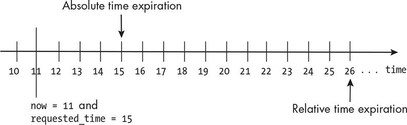
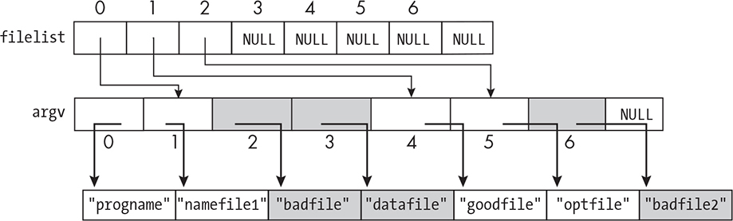
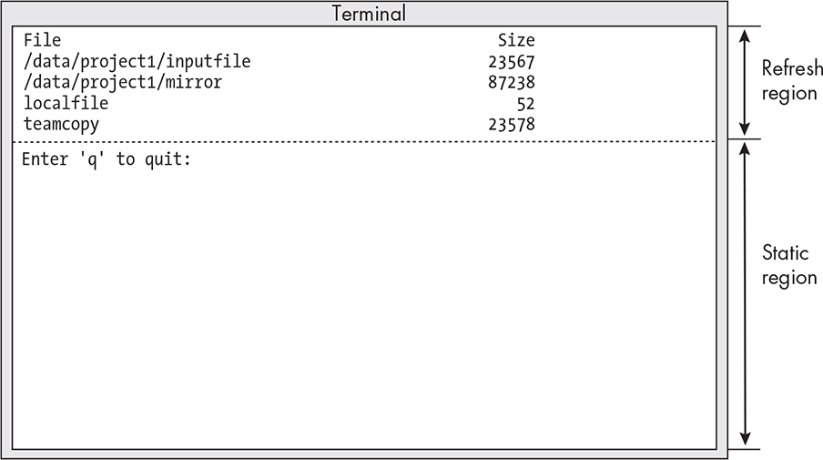

9 TIMERS AND SLEEP FUNCTIONS

In Chapter 8, in learning how to design programs that respond to signals, we took another step toward being able to write interactive and event-driven programs, but we still have a few more concepts to

understand. These types of programs, whether they’re system programs

or other types of applications, often treat time and time intervals as part of their input data.

For example, a program that pops up a message such as “Are you still

there?” when it hasn’t detected any user activity for a while uses the length of a time interval to decide when it needs to display a message to its user. Some programs display flashing cursors, which blink at regular time intervals. A large class of system programs that monitor resource usage are capable of producing some type of animated or dynamic

output, such as a graph that updates regularly as time progresses or a terminal display that refreshes itself at regular intervals. Commands that fall into this category include:

**top** Displays extensive information about all processes in the system **pidstat** Displays information about selected processes

**vmstat** Displays information about memory usage

**iostat** Displays information about input/output activity

By default, the top command refreshes its information every few seconds. The others do so when the user enters a refresh interval as an option. For example, entering vmstat 3 tells the vmstat command to

append new data to its report every 3 seconds. These types of programs have a way of controlling the precise times at which they execute

specific functions.

In this chapter, we’ll learn how to design and develop programs that

can time their behavior in the same way. To do so, we’ll need to learn a bit about time and time measurement in Unix systems. This journey will take us through an exploration of clocks and hardware timers as well,

since they underlie the management of time in any computer system.

We’ll explore the concept of software timers and examine the

relationship between timers, sleeping, and clocks. Although our primary focus is the part of the kernel’s API related to timing and timers, we’ll also examine two sleep functions we haven’t yet seen. We’ll put all of these ideas to use in the design and development of a few programs that work with time.

Keeping Track of Time

Programs that are capable of doing specific tasks at regular intervals must have a way to keep track of time and perform tasks at scheduled

times. Let’s think about some real-world analogues to this problem. In the real world, when we need to perform tasks at precise intervals of

time, we often use a timer. For example, when we need to adjust the

temperature of an oven in 30 minutes, to remember to do this, we set a timer to notify us when that time elapses. If we’re conducting some

experiment that requires collecting data every 10 minutes, we use a

more advanced type of timer that can repeatedly signal us every 10

minutes. In general, we use timers to inform us when a specified amount of time has elapsed. When that amount of time has elapsed, we call it a *timeout*. We set a timer by giving it a length of time. Usually, setting a timer also arms the timer. To *arm* a timer means to start it, whereas *setting* it specifies the length of the interval. When the interval expires, it notifies us, usually with some type of audible or visual indication.

*Alarm Clocks and Timers*

A timer is not the same as an alarm clock. Normally, we wouldn’t use an alarm clock in the preceding situations. When our goal is to be notified when a fixed amount of time has passed, using an alarm clock is

inconvenient. We use alarm clocks to notify us when a specific wall

clock time has been reached, not when a timeout has occurred. We set

an alarm clock with a specific wall clock time, and at that time, it notifies us. A timer’s input, on the other hand, is the length of a time interval. It doesn’t need the time of day in order to work, but it does need some

type of internal timekeeping device to keep track of the elapsed time.

Although alarm clocks do serve a purpose in a computer system, such as scheduling jobs that have to take place at a certain time of day, they’re not a solution to the types of problems we just considered.

*Sleep Functions and Timers*

Up until now, our programs relied entirely on sleep functions such as

sleep() and usleep() to insert some form of time-dependent delay into

their executions. When a process calls a sleep function, it specifies an interval of time as the argument to the call, and it’s immediately

suspended. When that time has elapsed, it wakes up and resumes

execution at the instruction following the call, unless an unhandled

signal interrupted its sleep, in which case it was most likely terminated.

For example, if we wanted a program to check whether some file will

have been modified within the next 30 seconds, with what we know now,

we’d make it sleep for 30 seconds and then check the file when it wakes up. The problem with this solution is that the program can’t do

anything while it’s waiting, which is neither useful nor efficient.

Let’s consider how we could program a progress bar if all we had at

our disposal were sleep functions. Suppose that our process performs

some very lengthy task, such as copying a large number of files from one filesystem to another, and that we’d like it to display a dynamic indicator of how much it’s accomplished and update it at regular intervals. This is what a progress bar does. Suppose that at any instant of time, the

program can compute what fraction of the task has been completed. If

the only way to schedule an update of the progress bar at some future

time is by sleeping for that amount of time, we couldn’t do the work whose progress we’re trying to measure! Clearly sleep functions are

useless for solving this problem.

Suppose instead that we could use some type of software timer

analogous to a real-world timer. If a program needed to do some

particular task at a future time, like checking a file, it could set a timer, just like a real-world timer, to interrupt it when that amount of time elapsed. In this way, it could continue to do its work in the meantime.

When the timer expired, it would temporarily stop what it was doing,

perform the scheduled task (such as checking the file), and return to the interrupted work. Let’s consider how we could program a progress bar if we had timers at our disposal. Suppose that a program could set a timer to expire repeatedly at regular intervals. Each time that it received a notice of a timeout, the program could compute the amount of work

completed and update the indicator. Assuming that the calculation and

update are fast, this is an efficient way to keep the user informed of its progress.

With this in mind, let’s see what we can learn from the online

documentation about timers and related functions. Our objective is to

learn what services the kernel provides for user programs so that they can use timers. There are questions though, such as how fine a

granularity we can expect from a timer and how accurate they are. We

also need to know how they notify our programs when timeouts occur.

We need the answers to these questions.

Time, Clocks, and Timing

We’ll begin our exploration as we’ve done in previous chapters: by

trying to find a man page that contains an overview, guidance, and

possibly references to other resources. Whenever they exist, the man

pages in Section 7 are always a good place to start. Therefore, we’ll

search Section 7 for a page about timers or something similar, trying the keywords time and timers: \$ **apropos -s7 time timer** *--snip--*

sys_time.h (7posix) - time types sys_times.h (7posix) - file access and modification times structure systemd.time (7) - Time and date

specifications time (7) - overview of time and timers time.h (7posix) -

time types time_namespaces (7) - overview of Linux time namespaces

utime.h (7posix) - access and modification times structure ➊ timer:

nothing appropriate.

Among the matches is the time (7) man page that we first discovered in

Chapter 3. Back then we were interested in dates and times, not timers, but this page has information about timers as well. We’ll start by

reviewing it, but notice before we continue that there isn’t a man page about timers specifically ➊, suggesting that this is the right place to start.

*Overview*

The time (7) man page is divided into brief sections with background

information about general topics. It starts with information about

distinctions between real and process time, distinctions between

hardware and software clocks, concepts of time measurement and time

representation, and finally, a brief discussion of timers, with references to specific system calls related to timers. We do need to understand

something about clocks and time measurement to use timers properly,

but let’s first see what kinds of timers are available.

The set of available timers is listed in the section entitled “Sleeping and Setting Timers” on the man page. There it mentions several timer

system calls, including alarm(), getitimer(), timerfd_create(), and

timer_create(). It also mentions two system calls for sleeping that we haven’t examined yet: nanosleep() and clock_nanosleep(). We’ll read about them shortly. Before we do, we’ll explore the basic concepts underlying clocks and time measurement.

*Hardware Clocks and Hardware Timers*

Most computers have a designated hardware clock called the *real-time* *clock* ( *RTC*) that keeps wall clock time, which we called *calendar time* in

Chapter 3. Some computers have more than one hardware clock, and they’re also called RTCs. Among all of the RTCs, there’s one that is

backed up by a battery while the computer is turned off or in a low-

power state so that it keeps its time. To avoid confusion, we’ll call this battery-backed hardware clock the RTC and ignore the fact that there

might be other real-time clocks in the computer.

The principal purpose of the RTC is to record the wall clock time.

Linux systems use it only to initialize various software structures that store time and date for functions such as time() and gettimeofday(), which return the correct date and time. The RTC does have other capabilities though, one of which is that it can be programmed to generate periodic interrupts on a dedicated interrupt line at selected frequencies ranging between 2 Hz and 8,192 Hz. It can also generate an interrupt for every clock tick, which is usually once per second. Lastly, it can be

programmed so that when it reaches a prespecified number of recorded

ticks, it generates an interrupt so that it can function like an alarm clock.

Exactly how it works is architecture dependent.

Many computers also have a hardware device called a *programmable*

*interval timer* ( *PIT*). The PIT issues an interrupt, called a *timer interrupt*, whenever it times out. The PIT is essentially a hardware timer, like a kitchen timer, except that it continues to generate interrupts at the same rate as long as the machine is powered. Linux kernels typically program the PIT to issue interrupts about once every millisecond, a frequency of 1,000 Hz. The interval between adjacent interrupts is called a *tick*. The PIT’s ticks are like a metronome inside the computer; they are used by the kernel to control all aspects of its timing. Multimedia playback and media streaming depend upon these ticks for smooth playing. The

kernel constant HZ is the frequency at which these ticks are generated, and the term *jiffy* refers to the length of each tick of this timer.

A third type of timekeeping device is called the *Time Stamp Counter*.

Linux systems sometimes use this hardware counter for higher-

precision timing; the oscillator in this device can have much higher

frequencies than the PIT, as high as 1 GHz, making it useful for finer-resolution timing.

Lastly, many modern computers have high-resolution timers, called

*High Precision Event Timers* ( *HPET* s). These timers are supported in Linux kernels from version 2.6 onward. They contain internal counters

that they update at least once every 10 microseconds, meaning a

frequency of at least 100 KHz. They have internal circuitry so that they can be programmed to generate interrupts at periodic intervals or only once, when a counter reaches a specific value. They’re used by the

kernel to support the high-resolution timers that we’ll learn about later in this chapter.

*The System Clock*

The system clock is a *software clock*, which means that time is recorded and updated entirely by software. Whenever the computer is rebooted,

the kernel initializes the system clock, either by reading the time from the RTC or, if it has a network connection, by getting it from a network time service such as an *NTP (Network Time Protocol)* server. Until it’s initialized, the time on a system clock is just the time that elapsed since the machine was rebooted. Once it’s initialized, the system clock stores the calendar time, meaning the number of seconds since the Epoch.

The system clock is updated every time it receives an interrupt from

the PIT. In other words, the system clock is initialized from a hardware clock when the computer boots, but after that, it keeps time by

recording ticks from a hardware timer. As just mentioned in “Hardware

Clocks and Hardware Timers,” the length of these clock ticks is a jiffy. If the PIT generates ticks at a rate of 100 Hz, each jiffy is 0.01 seconds. If the rate is 250 Hz, then a jiffy is 0.004 seconds. There is no single value for a jiffy; it is machine dependent. On some systems it might be 0.01, on others 0.004, and so on.

This discussion about clocks and clock ticks is both relevant and

important because on older Linux kernels, the resolution of software

timers depends on the value of a jiffy; a timer can’t be more accurate than the length of a jiffy. The man page tells us as much. On newer

kernels, some timer system calls aren’t based on jiffies but are based on the high-resolution timers (HRTs) such as the HPETs.

High-Resolution Sleep Functions

We’ve used the sleep() system call extensively so far. One problem with sleep() is that its resolution is 1 second, which is too coarse for many

applications. We also used usleep(), which has a resolution of 1

microsecond. The u in usleep() is the Roman character set’s

approximation of the Greek letter *µ*, the symbol for *micro*. Even though its unit is a microsecond, a call such as usleep(usecs) doesn’t guarantee that the length of the interval during which the process sleeps will be exactly usecs microseconds—only that it’s at least this much. According to the man page, it can be longer either because the underlying timers are not fine enough or because of “system activity.”

Sleep functions such as sleep() and usleep() are implemented with

hidden software timers. One problem with both of them is that they

share a single software timer given to the process, which implies that multiple overlapping calls to usleep() or sleep() can interfere with each other, causing unexpected results. They also share the same timer as the alarm() system call, with similar consequences. Furthermore, they may

interfere with signal generation and delivery because their

implementations rely on signals. The man page for usleep() suggests that to avoid this signal problem, programs should use nanosleep() instead.

*The nanosleep() System Call*

POSIX requires implementations of Unix to provide a nanosleep() system call, which is guaranteed not to interact with signals and has, as its name suggests, nanosecond resolution. The SYNOPSIS on its man page is:

\#include \<time.h\> int nanosleep(const struct timespec \*req, struct timespec \*rem); Feature Test Macro Requirements for glibc (see

feature_test_macros(7)): nanosleep(): \_POSIX_C_SOURCE \>=

199309L

A calling program must define \_POSIX_C_SOURCE with a value of at least 199,309 before including any header files. The call’s two parameters are pointers to timespec structures. We first encountered the timespec

structure in Chapter 3, in the man page for clock_gettime(), which we opted not to use because time() was a simpler function. I redisplay its definition for convenience: struct timespec { time_t tv_sec; /\* Seconds \*/

long tv_nsec; /\* Nanoseconds \*/ };

The value in tv_nsec must be an integer in the range 0 to 999,999,999, so that it doesn’t exceed 1 second, but it can represent any fraction of a

second accurate to the nanosecond. This implies that, unlike sleep() and usleep(), the nanosleep() function lets us specify time intervals with nanosecond resolution.

The nanosleep() function’s first argument is required; it’s the length of the time interval during which the process should sleep. The second

argument may be NULL. If it isn’t NULL, then it should point to a timespec structure that will be filled with the remaining time if the call to

nanosleep() is interrupted by a signal, in which case nanosleep() returns -1

and sets errno to EINTR. The following code snippet shows how we can

detect when nanosleep() was interrupted in order to continue the sleep, assuming that requested_delay and remaining_time are timespec structures: if (

-1 == nanosleep(&requested_delay, &remaining_time) ) if ( errno ==

EINTR ) /\* remaining_time contains the time left in the interval. \*/

Since timespec structures will play a part in several programs from

this point on, I’ve written a few utility functions to make it easier to use them. Their declarations, which follow, are in the file *include/time_utils.h* of the source code repository: *time_utils.h* /\*\* dbl_to_timespec(t, \*ts) converts the number of seconds represented by the double-precision

float t into a timespec structure, storing it in \*ts. \*/ int

dbl_to_timespec(double t, struct timespec \*ts); /\*\* timespec_to_dbl(ts,

\*t) converts the time represented by the timespec ts to a double-

precision float and stores it in \*t. \*/ void timespec_to_dbl(struct

timespec ts, double \*t); /\*\* add_dbl_to_timespec(t, &ts, &newtime) adds the number of seconds represented by double t to timespec ts, storing

the sum into timespec newtime. \*/ void add_dbl_to_timespec(double t,

struct timespec \*ts, struct timespec \*newtime); /\*\* timespec_diff(ts1, ts2,

\*diff) computes the difference ts1 - ts2, storing it in \*diff. \*/ void timespec_diff (struct timespec ts1, struct timespec ts2, struct timespec

\*diff); /\*\* timespec_add(ts1, ts2, &sum) stores the sum of timespecs ts1

and ts2 into &sum. \*/ void timespec_add(struct timespec ts1, struct timespec ts2, struct timespec \*sum);

The implementations are in the file *common/time_utils.c* in the book’s source code distribution. The only implementation displayed here is for timespec_diff(), which requires a tiny bit of finesse: timespec_diff() void timespec_diff(struct timespec ts1, struct timespec ts2, struct timespec

\*diff) { long temp; diff-\>tv_sec = ts1.tv_sec - ts2.tv_sec; temp =

ts1.tv_nsec - ts2.tv_nsec; ➊ if ( temp \< 0 ) { /\* Because temp \< 0, we need to borrow 1 sec from tv_sec and add it to tv_nsec as 1000000000

nanoseconds. \*/ diff-\>tv_sec--; diff-\>tv_nsec = 1000000000 + temp; }

else diff-\>tv_nsec = temp; }

It’s easy to overlook the need to adjust the structure when temp is

negative ➊ in this function. A similar problem occurs in timespec_add().

Let’s look at a small program that demonstrates how to use

nanosleep(). The program appears in Listing 9-1.

*nanosleep_demo1.c*

\#include "common_hdrs.h"

\#include "time_utils.h" void sigint_handler(int signum)

{

return; /\* Just catch the signal and return to main(). \*/

}

int main(int argc, char \*argv\[\])

{

struct timespec initial_sleep, remainder;

char errmssge\[100\];

int retval;

double delay = 5; /\* Default delay if no command argument \*/

struct sigaction act;

if ( argc \>= 2 ) { /\* User supplied a delay on command line. \*/

retval = get_dbl(argv\[1\], NON_NEG_ONLY \| PURE, &delay, errmssge);

if ( retval \< 0 ) /\* Not a valid number \*/

fatal_error(retval, errmssge);

else if ( delay \<= 0 ) /\* Valid number but negative \*/

fatal_error(retval, "get_dbl requires a positive number"

" without trailing characters.\n");

}

/\* Convert delay in seconds to a timespec. \*/

dbl_to_timespec(delay, &initial_sleep);

/\* Set up and install SIGINT handler. \*/

act.sa_flags = 0;

sigemptyset(&act.sa_mask);

act.sa_handler = sigint_handler;

if ( -1 == sigaction(SIGINT, &act, NULL) )

fatal_error(errno, "sigaction");

printf("About to sleep for %10.10f seconds...\n", delay);

if ( (-1 == nanosleep(&initial_sleep, &remainder)) && (errno == EINTR) ) {

/\* Sleep was interrupted by a handled signal (SIGINT). \*/

timespec_to_dbl(remainder, &delay); /\* Convert remaining time. \*/

printf("nanosleep() had %10.10f seconds left when it was "

"interrupted.\n", delay);

}

return 0;

}

*Listing 9-1: A program showing how to use* *nanosleep()* Most of the pieces of the program are self-explanatory. It installs a signal handler to catch a CTRL-C, but it doesn’t do anything except return. Why? We want the call to nanosleep() to be interrupted by a signal so that we can test the code that extracts how much time is left. Therefore, we need to catch the signal so that the program is not terminated, and we want execution to resume in main() after the handler is called. That’s why the handler does nothing except call return.

When we build and run this program, we want to give it a delay long

enough that we can enter CTRL-C and witness its output, as well as show that it accepts real-valued delays: \$ **./nanosleep_demo1 5.67891234**

About to sleep for 5.6789123400 seconds. . **^C**nanosleep() had

3.9501537770 seconds left when it was interrupted.

From the output, you can see that I entered CTRL-C about 1.73 seconds

into the sleep. This program is designed to catch only SIGINT; it will be killed by any other signal. It’s left as an exercise to write a similar program that reports the remaining time regardless of which signal was delivered other than SIGKILL and SIGSTOP.

Let’s consider the more interesting problem of ensuring that the

program sleeps for the entire duration that the user requested no matter how many signals are delivered to it. For simplicity, let’s limit the set of handled signals to SIGINT. To get nanosleep() to run again for the

remaining time after an interruption, we’d need to execute instructions such as the following pseudocode: if ( nanosleep(&initial_sleep,

&remainder) was interrupted ) { // Set initial_sleep to value of

remainder. /\* Call function again. \*/ nanosleep(&initial_sleep,

&remainder); }

This works if it gets one more signal. However, what if a third or a

fourth signal is delivered and interrupts the call? In this case, we would need to call nanosleep() over and over until it completes the sleep without being interrupted, implying that the remainder is at last zero. We need to replace the if statement with a loop, something like this: while (

nanosleep(&initial_sleep, &remainder) is interrupted ) { initial_sleep =

remainder; /\* Sleep for remainder. \*/ }

If nanosleep() is not interrupted by a signal, the loop will terminate. If it is, it will run again with the remaining time as its initial_sleep. Since the remaining time is strictly smaller than the initial time, eventually the call completes because the sleep time requested is strictly smaller in each iteration.

The following C do-while loop is the proper way to do this: do {

retval = nanosleep(&initial_sleep, &remainder); if ( retval == -1 ) { /\* An error or an interruption occured. \*/ if ( errno == EINTR ) /\* Received SIGINT \*/ initial_sleep = remainder; else /\* Some other nonrecoverable error occurred. \*/ fatal_error(errno, "nanosleep"); } } while (

retval \< 0 );

The loop exits when retval \>= 0, which can be true only if nanosleep() wasn’t interrupted and had no other errors.

The next question is whether the total amount of time that the

process sleeps equals the original requested time. The man page tells us that the duration of the sleep is at least the time specified in the request, not equal to it. It also warns in its NOTES that the interval is rounded up in case it isn’t an exact multiple of the granularity of the underlying clock.

Yet another source of possible increase is the scheduling activity of the kernel—the process will always experience some small delay before it

runs again after a sleep. Inside a loop, these tiny increases in the sleep time build up into what people call *timer drift*, a slowly increasing change in the accuracy of the timer. We’ll have more to say about this shortly.

To test whether the preceding loop ensures that a program sleeps for

at least the full duration requested, we can get the time just before the

loop and immediately after it and compute the difference. There’s a hitch though; the only function that we’ve used so far for getting the current time is time(), and this has 1-second resolution. The deprecated gettimeofday() that we discovered in Chapter 3 has microsecond resolution—still not fine enough—but we did read about clock_gettime() there, and its man page synopsis is: \#include \<time.h\> int

clock_gettime(clockid_t clockid, struct timespec \*tp); *--snip--* Feature Test Macro Requirements for glibc (see feature_test_macros(7)):

clock_gettime() \_POSIX_C_SOURCE \>= 199309L

We chose not to use it to implement spl_date because of performance

considerations, but we need it now since it’s the only function with the same resolution as nanosleep(). Its man page suggests that for the first parameter we use either the real-time clock ID, CLOCK_REALTIME, or the monotonic clock ID, CLOCK_MONOTONIC. The former is actual wall clock time but can sometimes have small discontinuous jumps, sometimes

decreasing, whereas the latter is smooth but measures time differently.

I’ll use the monotonic clock since all we need is the time difference, not the actual wall clock time. The main program, with only the relevant

code displayed, is in Listing 9-2.

*nanosleep_demo2.c*

\#include "common_hdrs.h"

\#include "time_utils.h"

void handler(int signum)

{

const char mssge\[\] = "Signal received.\n"; write(STDOUT_FILENO, mssge, strlen(mssge)); /\* SAFE \*/

}

int main(int argc, char \*argv\[\])

{

struct timespec initial_sleep, remainder, starttime, endtime, difftime;

*--snip--*

if ( -1 == clock_gettime(CLOCK_MONOTONIC, &starttime) ) /\*Get starttime.\*/

fatal_error(errno, "clock_gettime");

do {

retval = nanosleep(&initial_sleep, &remainder); if ( retval == -1 ) {

if ( errno == EINTR ) /\* Received SIGINT \*/

initial_sleep = remainder;

else /\* Some other nonrecoverable error \*/

fatal_error(errno, "nanosleep");

}

} while ( retval \< 0 ); /\* Repeat until retval is zero. \*/

if ( -1 == clock_gettime(CLOCK_MONOTONIC, &endtime) ) /\* Get endtime. \*/

fatal_error(errno, "clock_gettime");

/\* Compute the time difference (endtime - starttime) as timespecs. \*/

timespec_diff(endtime, starttime, &difftime);

timespec_to_dbl(difftime, &total); /\* Convert to double and then print. \*/

printf("Sleep lasted %10.10f seconds, "

"%10.10f seconds longer than requested.\n", total, total - delay); return 0;

}

*Listing 9-2: Excerpts of a program that sleeps for the entire duration of the original* *requested sleep time, calling* *nanosleep()* *repeatedly and measuring the total elapsed time* *of the sleep* The complete program, named *nanosleep_demo2.c*, is in the book’s source code distribution. The signal handler, handler(), prints a message when it’s run so that we can see how many signals were delivered. The program uses a few of the utility functions for working with timespec structures that were described earlier. Their declarations are in *time_utils.h*. I built the program, naming it nanosleep_demo2, and ran it, entering several CTRL-Cs: \$ **./nanosleep_demo2 6.789123456** Delaying for 6.7891234560 seconds...

**^C**Signal received. **^C**Signal received. **^C**Signal received. **^C**Signal received. Sleep lasted 6.7895459130 seconds, 0.0004224570 seconds longer than requested.

This output shows that the total elapsed time (6.7895459130 seconds) is less than a half-millisecond greater than the requested sleep time

(6.789123456 seconds). Repeated runs with the same number of

delivered signals have similar timer drifts, but as the number of signals increases, the drift increases. For example, when I send 14 signals

without changing the requested delay interval, the drift is 0.0011846140

seconds: still relatively small. When I send 32 signals, the drift is

0.0035780350 seconds.

The nanosleep() man page NOTES contains a brief discussion about timer drifts caused by repeated restarts of nanosleep(). It recommends calling a different function, clock_nanosleep(), specifying an absolute time value to avoid this.

*The clock_nanosleep() System Call*

Why do we need a sleep function that avoids timer drifts when it’s

interrupted frequently? Consider designing a video game or some other

program with animated output that requires very high-frequency

updates to its output display. In these types of programs, signals are generated frequently because of user input and, with a sleep function

like nanosleep(), timer drifts will increase and the animation can start to appear nonuniform.

The synopsis from the clock_nanosleep() man page shows that this

system call has two parameters not needed for nanosleep(): \#include

\<time.h\> int clock_nanosleep(clockid_t clockid, int flags, const struct timespec \*request, struct timespec \*remain); Link with -lrt (only for

glibc versions before 2.17). Feature Test Macro Requirements for glibc (see feature_test_macros(7)): clock_nanosleep(): \_POSIX_C_SOURCE

\>= 200112L

The first (clockid) is a clock ID, like the ones used by the clock_gettime() function, and the second (flags) is a flag set. This function accepts fewer choices of clock ID than clock_gettime(). For our purposes, CLOCK_REALTIME

and CLOCK_MONOTONIC are the ones we’ll consider. The man page has

information about the other clock IDs that can be passed to it. The flags parameter can either be 0 or the symbolic constant TIMER_ABSTIME.

When flags is 0, the requested time (\*request) is interpreted as a time interval, as it would be with nanosleep(). In this case we say

clock_nanosleep() is called to do a *relative* sleep, and the function behaves like nanosleep()—if it’s interrupted by a signal, the remaining time is stored in \*remain so that it can be called again to complete the relative sleep. We’d call it, passing it either the real time or monotonic clock ID, as follows: clock_nanosleep(CLOCK_REALTIME, 0, &requestedtime,

&remainingtime);

Unlike nanosleep(), it lets us choose the clock source.

Its more interesting use is to make a program do an absolute sleep

by passing it the TIMER_ABSTIME flag. When we pass this flag to the

function, the requested time (\*request) is interpreted as an absolute time as measured by the clock with ID (clockid). It’s like setting an alarm clock

—we give it a future clock time, the process is immediately suspended, and when the clock reaches that time, the process wakes up. If \*request isn’t later than the current time on the clock, then clock_nanosleep() returns immediately without suspending the process; that would be like setting an alarm clock to a past time! With absolute sleeps, the last

parameter is ignored and can be set to NULL because the requested time is absolute—if the process is not interrupted, it’s guaranteed to sleep until the clock reaches the time specified in \*request, and if it is interrupted, it can be called again with the same time in \*request to continue the sleep until that time. Figure 9-1 illustrates the difference between absolute and relative sleep requests.

*Figure 9-1: The difference between an absolute time specification and a relative one when* *the current time is 11 and the request is 15*

To be clear, suppose that the time at which it’s called is *t1* seconds since the epoch, and the requested time is *t2* seconds since the epoch, where *t1 \< t2*. If no signal is delivered to the process, the sleep caused by calling clock_nanosleep(CLOCK_REALTIME, TIMER_ABSTIME,

*t2*, NULL);

will end at time *t2*, not *t1* + *t2*. The time isn’t treated as an interval; it’s taken as a point of time in the future. Therefore, in order to use

clock_nanosleep() to delay for an interval of time (a relative sleep), such as sleep_interval, a program must call clock_gettime() with the same clock ID, such as CLOCK_REALTIME, add sleep_interval to the returned time, and call clock_nanosleep() with that later time as its third parameter, as in the following semi-pseudocode: clock_gettime(CLOCK_REALTIME,

&current_time); stop_time = current_time + sleep_interval;

clock_nanosleep(CLOCK_REALTIME, TIMER_ABSTIME,

&stop_time, NULL);

The last issue regarding clock_nanosleep() is its relationship to signals and signal handlers. Like nanosleep(), clock_nanosleep() doesn’t interfere with signal disposition. Also like nanosleep(), if clock_nanosleep() is interrupted by a signal that the process catches, it isn’t restarted, even if the SA_RESTART flag is set in the sigaction structure when the handler is installed. Lastly, as noted before, if it’s interrupted by a signal, the time interval is relative, and remaining is not NULL, then the unfinished time is stored in \*remaining. The similarities end there, because these two

functions are different in a subtle way that has dire consequences if it’s overlooked, namely in their return values. The library wrappers for

most system calls return -1 when they fail, but this one does not.

A SUBTLE AND SIGNIFICANT DISTINCTION

When nanosleep() is interrupted by a signal handler’s execution, it

returns -1 and sets errno to the value EINTR. When clock_nanosleep() is interrupted by a signal handler, it returns the error code EINTR, not

-1. Error codes are *positive* numbers. Therefore, checking whether it was interrupted requires a different test, such as: retval =

clock_nanosleep(CLOCK_REALTIME, TIMER_ABSTIME,

&timetoresume, NULL); if ( retval == EINTR ) /\* Call was

interrupted by a signal. \*/ else if ( retval \> 0 ) /\* Some other error

occured. \*/ else /\* Call was successful and returned at time timetoresume. \*/

To compare the behaviors of clock_nanosleep() and nanosleep(), I

modified *nanosleep_demo2.c* slightly so that it calls clock_nanosleep() instead. To make it sleep for the specified interval (a relative sleep), I used the strategy described in the preceding pseudocode. The relevant

portions of this revised program, named *clock_nanosleep_demo.c*, are in

Listing 9-3. The complete program is in the book’s source code distribution.

*clock_nanosleep_demo.c*

\#include "common_hdrs.h"

\#include "time_utils.h"

*--snip--*

int main(int argc, char \*argv\[\])

{

*--snip--*

printf("Delaying for %10.10f seconds...\n", delay);

if ( -1 == clock_gettime(CLOCK_MONOTONIC, &starttime) )

fatal_error(errno, "clock_gettime");

/\* Add delay time to clock time. \*/

add_dbl_to_timespec(delay, &starttime, &endsleep);

/\* Repeatedly call clock_nanosleep() until it returns 0. \*/

do {

retval = clock_nanosleep(CLOCK_MONOTONIC, TIMER_ABSTIME,

&endsleep, NULL);

if ( retval != EINTR && retval \> 0 ) /\* An error, not an interrupt \*/

fatal_error(errno, "nanosleep");

} while ( retval != 0 ); /\* Repeat until retval is zero. \*/

if ( -1 == clock_gettime(CLOCK_MONOTONIC, &endtime) ) /\* Get time now. \*/

fatal_error(errno, "clock_gettime");

timespec_diff(endtime, starttime, &difftime);

*--snip--*

}

*Listing 9-3: Parts of a program using* *clock_nanosleep()* *to sleep for a relative time interval* I built the executable and ran it with the same delay as I used for *nanosleep \_demo2.c*, entering four CTRL-Cs as well: \$ **./clock_nanosleep_demo 6.78912345** Delaying for 6.7891234500 seconds... **^C**Signal received. **^C**Signal received. **^C**Signal received. **^C**Signal received. Sleep lasted 6.7892145100 seconds, 0.0000910600 seconds longer than requested.

The *nanosleep_demo2.c* run had a timer drift of 0.0004225 seconds, whereas this is only 0.0000911 seconds. I ran it several more times,

forcing 14 interrupts, and each time the timer drift was about 0.00012

seconds. A final set of runs with 30 interrupts each time resulted in an average drift of about 0.00012 seconds. This shows that even with

repeated interrupts, the drift stays at the same magnitude. It is mostly the result of system activity such as scheduling delays.

Software Timers

We’ll begin our study of software timers with the lower-resolution ones based on traditional software clocks, because they’re easier to use and understand. We’ll start with the alarm() system call, after which we’ll take a look at the higher-resolution timers commonly known as POSIX

timers.

*The alarm() System Call*

The very first timer to appear in Unix was the alarm() system call,

making its appearance in Seventh Edition Unix in 1979. It’s the easiest timer to use and understand. The alarm() system call has limited

functionality; let’s see what its man page tells us: ALARM(2) Linux

Programmer's Manual ALARM(2) NAME alarm - set an alarm clock

for delivery of a signal SYNOPSIS \#include \<unistd.h\> unsigned int alarm(unsigned int seconds); DESCRIPTION alarm() arranges for a

SIGALRM signal to be delivered to the calling process in seconds

seconds. If seconds is zero, any pending alarm is canceled. In any event any previously set alarm() is canceled. RETURN VALUE alarm()

returns the number of seconds remaining until any previously scheduled

alarm was due to be delivered, or zero if there was no previously scheduled alarm. *--snip--*

This is very straightforward. Summarizing alarm()’s features:

Its resolution is 1 second.

It notifies the calling process of its timeout by sending it a SIGALRM

signal.

A program cancels a previously set alarm by calling it again with an

argument of 0, as in alarm(0).

If it’s called while a previously set alarm is active, the previous one is canceled, and alarm() returns the number of seconds remaining on

the previous alarm.

Let’s clarify this last point. Suppose that at some point in time, a

process calls alarm() to have a SIGALRM sent to itself in 10 seconds

alarm(10);

and that exactly 4 seconds later, the same process calls alarm() again, this time setting it for 20 seconds: seconds_left = alarm(20);

The return value of alarm() is 10 – 4 = 6 seconds, and it’s stored into seconds \_left. The alarm is reset to 20 seconds, and the next SIGALRM will be delivered to the process 20 seconds after this second call.

The alarm() system call has a few different applications. For one, a

process can set an alarm prior to starting a long task that it might not complete if the input dataset is unexpectedly large. When it receives the SIGALRM, it can stop the task. This way, the alarm prevents the process from spending too much time on a potentially endless task. A process

can also set an alarm to perform a task at some future time, perhaps

dependent upon the state of its data.

The first program we’ll write is a trivial one that just calls alarm() and then calls pause() to put itself to sleep until it receives a signal. In effect, this program will act like the sleep command. It expects the user to enter the number of seconds to sleep. We’ll name it *alarm_demo1.c*, shown in

Listing 9-4.

*alarm_demo1.c*

int main(int argc, char \*argv\[\])

{

int k, resultcode;

if ( 2 \> argc )

usage_error("alarm_demo1 \<alarm-interval\>");

resultcode = get_int(argv\[1\], NON_NEG_ONLY \| PURE, &k, NULL);

if ( resultcode \< 0 \|\| k \< 1 )

fatal_error(resultcode, "get_int expects a positive integer"); printf("Sleeping for %d seconds...\n", k);

alarm(k); /\* Set the alarm for k seconds. \*/

pause(); /\* Suspend itself indefinitely (until a signal arrives) \*/

return 0;

}

*Listing 9-4: A program like the sleep command that suspends itself for a given amount of* *time using* *alarm()* *and* *pause()* Because this program doesn’t have a signal handler, when it receives the SIGALRM signal, the default action is taken, meaning the program terminates. I built the executable, naming it alarm_demo1, and ran it to demonstrate its behavior: \$

**./alarm_demo1 10** Sleeping for 10 seconds... Alarm clock \# 10 seconds later The string "Alarm clock" is written to the terminal when a process receives a SIGALRM and doesn’t handle it. The next example is a

modification of the preceding program. It differs in two ways:

Instead of calling pause(), it enters a loop in which it prints the

elapsed time every second by calling nanosleep() for a 1-second sleep

and printing when it times out.

This program catches the SIGALRM with a signal handler that prints a

message to the terminal.

The program, *alarm_demo2.c*, is displayed in Listing 9-5.

*alarm_demo2.c*

\#include "common_hdrs.h"

\#include \<signal.h\>

\#define DEFAULT_DELAY 5

char MESSAGE\[\] = "Received a wake-up signal!\n"; void catchalarm(int signum) /\* The signal handler for SIGALRM \*/

{ write(STDOUT_FILENO, MESSAGE, sizeof(MESSAGE));

exit(EXIT_SUCCESS); /\* Exit the program. \*/

}

int main(int argc, char \*argv\[\])

{

int retval = 0, k = 0, delay = DEFAULT_DELAY;

struct timespec sleeptime = {1, 0}; /\* 1 second, 0 nanoseconds \*/

struct sigaction act;

if ( argc \>= 2 ) {

retval = get_int(argv\[1\], NON_NEG_ONLY \| PURE, &delay, NULL);

if ( retval \< 0 \|\| delay \< 1 )

fatal_error(retval, "get_int expects a positive integer");

}

act.sa_handler = catchalarm;

sigemptyset(&(act.sa_mask));

sigaction(SIGALRM, &act, NULL);

printf("About to sleep for %d seconds\n", delay);

alarm(delay);

/\* Turn on alarm. \*/

while ( TRUE ) { /\* Print seconds elapsed until SIGALRM is received. \*/

nanosleep(&sleeptime, NULL);

printf(" %d second(s) elapsed\n", ++k);

}

return 0;

}

*Listing 9-5: A program like the sleep command that suspends itself for a given amount of* *time using* *alarm()* *and a loop based on* *nanosleep()* Notice that the signal handler for SIGALRM is safe since it doesn’t call any functions that aren’t async-signal-safe. It’s an old-style handler with a single argument, installed with sigaction(). If the user doesn’t supply an argument to this program, it defaults to a 5-second timeout; otherwise, it uses the timeout specified by the user on the command line. A run of it looks like this: \$

**./alarm_demo2 4** About to sleep for 4 seconds 1 second(s) elapsed 2 second(s) elapsed 3

second(s) elapsed Received a wake-up signal!

The alarm() system call is a *one-shot* timer—it isn’t intended to be used to create a sequence of timeouts. Nonetheless, by calling it again from within the SIGALRM handler, we can approximate the same effect as a timer that repeatedly expires. Our next program will demonstrate how

to do this.

*A Progress Bar Based on Alarms*

The alarm() system call might be simple, but we can still use it to

implement a terminal-based progress bar, partly because progress bars

don’t need to update more frequently than once per second and partly

because it doesn’t matter if the intervals between updates are perfectly even.

Suppose that a program starts some very lengthy operation that

might take a long time to complete. User-friendly programs often

display some indication of their progress. Sometimes it’s not possible because there’s no way to measure the progress, but sometimes there is.

If it’s possible to measure progress, then a program can display a

progress bar. The idea is that, at fixed intervals of time, the program can compute the fraction of the work completed and update a progress bar

in the terminal to show the user how far along the operation has

progressed.

To do this though, we need to reset the alarm each time it expires.

Therefore, the signal handler itself will call alarm() after it updates the progress bar and will have the form void refresh_progressbar(int

signum) { // Refresh the progress bar. alarm( *refresh_interval*); }

where *refresh_interval* is the number of seconds in the next interval of the timer. The main program logic should be something like the following:

1\. Initialize a file-scoped (global) variable named fraction_completed to 0. It has to be global because both the main program and the signal

handler need access to it, and it can’t be passed as a parameter to a

handler.

2\. Draw the frame for a progress bar that indicates zero progress.

3. Install a signal handler for SIGALRM. We’ll name it refresh_progressbar() to make its purpose explicit.

4\. Set the first alarm to expire in 1 second. That should be a

reasonable update interval. Because both the main program and

the signal handler call alarm() with this value, we make it a macro

constant named REFRESH_INTERVAL. It is important that this step comes

*after* the preceding one—we don’t want to start sending signals until a signal handler has been installed.

5\. Start the lengthy task. To simulate a lengthy task, the program will enter a while loop of the form while ( *the fraction of the task*

*completed* \< 1.0 ) // Simulate the task's completing more work.

Rather than simulating a long task, we could make the program

perform some very long computation, such as calculating tens of

thousands of digits of *π*, but there’s no need to do that to demonstrate the principles underlying the use of the timer. Instead, the program will simulate the progress of a lengthy task by repeatedly sleeping a tiny

amount of time and increasing a variable representing the fraction of

work it completed. To make the simulation a bit more natural, we make

the increases in the fraction of work completed random by basing them

on the values returned by a random number generator. We can also

control approximately how long the simulation runs with a macro

constant, MIN_SIMULATION_SECS, set to 16. To control how quickly the

simulated task runs, we’ll introduce another variable, progress_rate, that stores the maximum increase in the fraction of work completed in each

iteration of the simulating loop.

We’ll consolidate this behavior in a function named lengthy_task(). Its logic, partly in pseudocode, is essentially: // Let dt be a tiny amount of time in seconds. ➊ // Let progress_rate = dt /

MIN_SIMULATION_SECS. while ( fraction_completed \< 1.0 ) { //

Sleep for dt seconds. // Let randfraction be a random number generated in the interval \[0,1.0\]. fraction_completed = fraction_completed +

(progress_rate \* randfraction); if ( fraction_completed \> 1.0 )

fraction_completed = 1.0; }

Since the generated random number, randfraction, is in the range

\[0,1\], the expression progress_rate \* randfraction is in the range \[0, progress_rate\]. This limits the maximum increase of fraction_completed in any single loop iteration to progress_rate. Since 1/progress_rate is the fewest number of iterations of the loop and each takes dt many seconds, the least amount of time that the task runs is

*MIN* \_ *SIMULATION* \_ *SECS* = *dt* × (1/ *progress* \_ *rate*) and on average, it should take about double this much time, because the average of a large number of uniformly generated random numbers in the interval \[0,1\] is

0.5. This explains why, in the code, progress_rate is assigned dt / MIN

\_SIMULATION_SECS ➊ so that the simulation runs for at least that much time.

We’ll use nanosleep() to do the sleeping in this code because it doesn’t interact with any signals, including SIGALRM. We’ll also make the number of nanoseconds in the timespec passed to nanosleep() a macro, SLEEPNSECS, defined as 480,000,000, so that the sleep is about a half-second.

As it stands, there’s a race condition on the update to

fraction_completed, because if a SIGALRM is delivered to the program in the middle of an update, the refresh_progressbar() handler will run.

NOTE

*A* race condition *occurs when two or more processes or threads access* *some shared resource and the outcome of their sharing it is that the* *correctness of the computation depends on the order in which they do so. If* *al processes just read the resource without modifying it, there is no* *possibility of a race condition. But if one or more can modify it, then a* *race condition might exist.*

Although the handler doesn’t modify fraction_completed, the value it

sees when it runs may be stale. To prevent the race condition, we’ll use sigprocmask() (see Chapter 8) to block the signal during the update in lengthy_task(), calling it before and after the update to block and unblock it, respectively. Therefore, we’ll declare sigset_t blocked_signals;

make it empty, and add SIGALRM to it: sigemptyset(&blocked_signals); sigaddset(&blocked_signals, SIGALRM);

The update would then be nested in between calls to sigprocmask(): sigprocmask(SIG_BLOCK, &blocked_signals, NULL);

fraction_completed += progress_rate \* randfraction; /\* Need to generate

\*/ if ( fraction_completed \> 1.0 ) fraction_completed = 1.0;

sigprocmask(SIG_UNBLOCK, &blocked_signals, NULL);

The last issue is how to generate a random number between 0 and

1.0. We search the man pages for a random number generator by

entering apropos -s2,3 random. The search returns many possibilities, but most share a single man page. All but one of these return integers. It would be easier if it returned a fraction. The one that does is drand48(), which returns double-precision floats in the range 0 to 1.0. Its synopsis is: \#include \<stdlib.h\> double drand48(void);

It requires no argument and doesn’t need to be seeded. For example, x =

drand48() assigns some random number between 0 and 1.0 to x.

Putting all of these ideas together, the lengthy_task() is as follows: lengthy_task() void lengthy_task() { double sleep_secs = (double)

(1.0\*SLEEPNSECS) / 1000000000; double progress_rate = sleep_secs /

MIN_SIMULATION_SECS; struct timespec dt = {0, SLEEPNSECS},

rem; sigset_t blocked_signals; sigemptyset(&blocked_signals);

sigaddset(&blocked_signals, SIGALRM); while ( fraction_completed \< 1.0 ) { if ( -1 == nanosleep(&dt, &rem) ) nanosleep(&rem, NULL); sigprocmask(SIG_BLOCK, &blocked_signals, NULL);

fraction_completed += progress_rate \* drand48(); if (

fraction_completed \> 1.0 ) fraction_completed = 1.0;

sigprocmask(SIG_UNBLOCK, &blocked_signals, NULL); } }

The next step is to develop the signal handler code that updates and

displays the progress bar. For the sake of simplicity, the progress bar will be a fixed length and will contain two types of characters. An initial prefix of hash mark (#) characters will represent the completed segment.

The remainder of the bar, meaning the portion representing the

unfinished work, will be represented by hyphens (-). The entire bar will be enclosed in square brackets, and the percent completed as an actual percentage will be written to the right of the bar. For example, a few snapshots of the bar would look like the following: \[#####---------------

----------------------------------------\] %8 *Time passes.*

\[############------------------------------------------------\] %21 *More* *time passes.* \[###################------------------------------------

-----\] %32

Let’s develop the code to animate this bar. The program will be

easier to modify if we declare a few macro constants: \#define

MIN_SIMULATION_SECS 16 /\* Minimum simulation time (seconds)

\*/ \#define REFRESH_INTERVAL 1 /\* Number of seconds between

refreshes \*/ \#define BAR_LENGTH 64 /\* Length of progress bar

between \[ \] \*/ \#define DONE_CHAR '#' /\* Character for completed

part \*/ \#define NOT_DONE_CHAR '-' /\* Character for incomplete

part \*/ \#define SLEEPNSECS 480000000 /\* Nanoseconds in simulated

dt \*/

The signal handler will need two variables: char

bar\[BAR_LENGTH+1\]; /\* The string representing the progress bar \*/

int finished_work; /\* The number of chars in the completed segment \*/

The extra character in the bar is for a NULL byte.

The instruction to calculate the length of the completed segment is

therefore: finished_work = (int) (fraction_completed \*

BAR_LENGTH);

The cast to int does not round; it removes the fractional part of the

number.

The next question is whether there’s a way to fill a string with

multiple copies of the same character without looping. A man page

search for a suitable library function or system call with apropos -s2,3 fill outputs: \$ **apropos -s2,3 fill** getentropy (3) - fill a buffer with random bytes memset (3) - fill memory with a constant byte *--snip--*

wmemset (3) - fill an array of wide-characters with a constant wid. .

The memset() library function is exactly what we need; we used it in

Chapter 7 in the implementation of spl_pwd to pad the pathname with leading periods. We give it the starting address of the string to fill, the character to fill it with, and the number of characters to write. It doesn’t add a terminating NULL byte and cannot detect if we write too many

characters at that address. The function returns a pointer to the

memory area, which we don’t need to use. We can create a bar

representing fraction_completed work with the following instructions: finished_work = (int) (fraction_completed \* BAR_LENGTH);

bar\[BAR_LENGTH\] = '\0'; memset(bar, NOT_DONE_CHAR,

BAR_LENGTH); memset(bar, DONE_CHAR, finished_work);

This first memset() call writes all of the hyphens, and the second replaces the leftmost finished_work many hyphens by number signs.

In order to make the bar appear as if hyphens are being replaced by

hash marks in each update, we need to redraw the entire line. If we try using the instruction printf("\[%s\]", bar);

the bar will not overwrite itself; we’ll get multiple bars one after the other, as in: \[-----------. .------\]\[##---------. .-------\]\[###--------. .------

-\]

The solution requires some knowledge about the characters that

control how lines are displayed in a terminal, inherited from those

ancient machines called typewriters. The *line feed* character (\n), also called *newline*, is the character that causes the cursor to go to one line below its current position in the same column, like rotating the knob on an old typewriter. The *return character* is the character that moves the cursor back to the start of the current line. By writing a return character before writing the bar printf("\r\[%s\]", bar);

in effect, we make each new print instruction overwrite the previous

one. We need to include the percentage after the bar as well. To write a percent sign, we need to use double percent signs: printf("\r\[%s\]

%%%d", bar, (int)(100 \* fraction_completed));

The signal handler is almost complete. As it stands, it won’t work the way we expect. That’s because of the way the C Library buffers its

output. Unless you put a newline in a printf(), the output won’t appear immediately. This is because the C Library uses line buffering for all I/O to or from terminal devices.

LINE BUFFERING IN THE C I/O LIBRARY

The C I/O Library uses a method of buffering called *line buffering* for terminal devices. When a process uses C library functions for

output, that output is put into buffers. The contents of these

buffers are not sent immediately to the terminal. They are sent

only when one of the following actions takes place:

The process tries to do output and the output buffer is full.

The stream is closed or the process terminates.

A newline is written to the stream.

An input operation on the terminal stream (the standard

input stream) takes place.

fflush(stdout) is called to force the output to the terminal.

When output is not terminated with a newline and it needs to

appear immediately, calling fflush(stdout) *flushes* it to the terminal.

To make the progress bar appear to be refreshed incrementally, the

signal handler needs to call fflush(stdout) after calling printf(). The entire signal handler follows: refresh_progressbar() void

refresh_progressbar(int signum) { char bar\[BAR_LENGTH + 1\]; int

finished_work = (int) (fraction_completed \* BAR_LENGTH);

bar\[BAR_LENGTH\] = '\0'; memset(bar, NOT_DONE_CHAR,

BAR_LENGTH); memset(bar, DONE_CHAR, finished_work);

printf("\r\[%s\] %%%d", bar, (int)(100 \* fraction_completed)); fflush(stdout); alarm(REFRESH_INTERVAL); }

Before coding the main() function, there are a few other issues to

address. The first is that a progress bar ought to appear on the screen immediately, without the user feeling a pause or delay in the program’s reaction time. A function to draw this initial progress bar follows:

draw_initial_bar() void draw_initial_bar() { char

initial_bar\[BAR_LENGTH + 1\]; memset(initial_bar,

NOT_DONE_CHAR, BAR_LENGTH); initial_bar\[BAR_LENGTH\]

= '\0'; printf("\r\[%s\]", initial_bar); fflush(stdout); }

It draws the square brackets with BAR_LENGTH-many NOT_DONE_CHARs.

Another issue is whether the bar should remain in the terminal window when the program finishes, and yet another is what the

program should do if a terminating keyboard signal such as SIGINT or

SIGQUIT is sent to it. Usually, progress bars disappear when the monitored task completes. Ours should too. The program will replace the bar and

the percentage indicator with a blank line. The following function does this and returns the cursor to the leftmost position in the same line so that it looks like it just disappeared: erase_progress_bar() void

erase_progress_bar() { char blanks\[BAR_LENGTH + 10\]; /\* Allows for

percentage after bar \*/ memset(blanks, ' ', BAR_LENGTH + 9); /\* Fill

blanks with space chars. \*/ blanks\[BAR_LENGTH + 9\] = '\0'; /\*

NULL-terminate it. \*/ printf("\r%s\r", blanks); /\* Return to left, write spaces. \*/ fflush(stdout); /\* Force output. \*/ }

To address the second issue, we’ll catch the two signals with a single handler, which will erase the progress bar and then force the program to terminate by raising SIGTERM: sig_handler() void sig_handler(int signum) {

erase_progress_bar(); /\* Erase the bar. \*/ raise(SIGTERM); /\* Force

termination. \*/ }

The main program is displayed, without the macro definitions and

functions already presented, in Listing 9-6. The program is named *progress_bar1.c*; when we get to interval timers, we’re going to write another version based on them.

*progress_bar1.c*

\#include "common_hdrs.h"

\#include \<signal.h\>

// OMITTED: Macros and functions

double fraction_completed = 0; /\* Fraction of operation completed \*/

int main(int argc, char \*argv\[\])

{

struct sigaction act;

const struct timespec slight_pause = {2, 0}; /\* 2-second interval \*/

struct timespec remaining_sleep; draw_initial_bar();

sigemptyset(&(act.sa_mask));

act.sa_flags = 0;

act.sa_handler = sig_handler;

if ( sigaction(SIGINT, &act, NULL) == -1 )

fatal_error(errno, "sigaction");

if ( sigaction(SIGQUIT, &act, NULL) == -1 )

fatal_error(errno, "sigaction");

act.sa_handler = refresh_progressbar;

if ( sigaction(SIGALRM, &act, NULL) == -1 )

fatal_error(errno, "sigaction");

alarm(REFRESH_INTERVAL); /\* Set first alarm. \*/

lengthy_task(); /\* Run the simulated task. \*/

if ( -1 == nanosleep(&slight_pause, &remaining_sleep) )

nanosleep(&remaining_sleep, NULL);

➊ alarm(0); /\* Turn off the alarm. \*/

erase_progress_bar(); /\* Erase the progress bar. \*/

printf("Done\n"); /\* Print 'Done' at end. \*/

return 0;

}

*Listing 9-6: A program that displays a simulated progress bar, using* *alarm()* *as its timer* The program turns off the last alarm in case it’s outstanding by calling alarm(0) ➊ so that the bar is not redrawn after it’s erased.

There’s no way to show how this program runs on paper, of course.

You can build it and run it to see how the bar progresses. By changing the various macro parameters, you can adjust the rate of progress.

Interval Timers

The 1-second time granularity, or resolution, of alarm() is too coarse to be useful for many applications. Furthermore, although we used alarm() to generate signals at regular intervals for our progress bar program, it isn’t designed to do this, and we have to call it within the signal handler to achieve this effect. The resulting SIGALRM signals are then subject to cumulative delays contributed to partly by the time that elapses in the handler before it calls alarm() to arm the timer again and partly by

scheduling and other system activities that delay the start of the handler.

This solution will not work when the measurements require more accuracy and finer resolution.

*Overview*

Interval timers were developed to overcome this deficiency. Their first appearance was in 4.2BSD as well as in SVR4 (1988), and they were

standardized in POSIX.1-1994, also known as the Single UNIX

Specification, Issue 4. The original interval timer interface defined two system calls, setitimer() and getitimer(). The CONFORMING TO section in their shared man page states that POSIX marked them as obsolete in 2008

and recommends the use of the POSIX timer API, specifically

timer_gettime() and timer_settime(), instead.

Regardless of whether we use the older interval timers or the newer

ones, the principles are the same, so before we take a look at the man pages, let’s begin with an overview of how they work.

An interval timer has two components: an initial value and a repeat

interval, which is often just called the *timer interval*. The *initial value* is the amount of time that elapses until the first timer expiration. The

*repeat interval* is the amount of time between successive timer expirations after the first one. For example, if the initial value is 5

milliseconds (msecs) and the timer interval is 2 msecs, then the sequence of timer expirations will occur 5, 7, 9, 11 msecs (and so on) from the time that the timer was set. More generally, if an interval timer is started at time *t* 0, with initial value *α* and repeat interval *β*, then it will expire at times *t* 0 + *α*, *t* 0 + *α* + *β*, *t* 0 + *α* + 2 *β*, *t* 0 + *α* + 3 *β*, and so on until the process terminates or turns off the timer.

When a timer expires, a timer notification is sent to the process (or

thread) that started the timer. With the older interval timer interface using setitimer() to set a timer, the notification is always a signal, one of SIGALRM, SIGVTALRM, or SIGPROF, depending on the type of interval timer it set up. The newer POSIX timers, as we’ll see, are more general and give

the process a choice of how it should be notified. In addition, a process can have more than one POSIX timer of the same type, unlike the older

interval timers.

*POSIX Timers*

The setitimer() man page suggests using timer_settime() instead of

setitimer() in new code, referring us to the timer_create() system call in its SEE ALSO section. We’ll begin our exploration of POSIX timers by

learning how to create and delete them, after which we’ll examine how

to arm and disarm them and retrieve their settings. We’ll put them to

use in a few different programs, the first of which will be a second

version of the progress bar program we implemented using the alarm()

system call. Lastly, we’ll discuss the concept of timer overruns.

Creating and Deleting Timers

The timer_create() system call creates an interval timer for the calling process. Its SYNOPSIS is: \#include \<signal.h\> \#include \<time.h\> int timer_create(clockid_t clockid, struct sigevent \*sevp, timer_t \*timerid); Link with -lrt.

The note about linking tells us that programs calling timer_create() need to link to the *real-time* library, *librt*, with the linker option -lrt. The timer_create() call creates a new interval timer for the calling process, initially unarmed, and returns its ID in the buffer pointed to by its third argument (timerid). The man page refers to this timer as a per-process timer because it’s accessible only to the calling process.

The first argument, clockid, is the ID of the clock that the timer will use for measuring time. I introduced clock IDs when we worked with

clock_nanosleep(). There are several other types of clocks that can be used with these interval timers, but for now we’ll use only CLOCK_REALTIME and CLOCK_MONOTONIC clocks.

One of the major differences between the older timers and POSIX

timers is that POSIX timers provide more choices for how a process is

notified when they expire. The second argument to timer_create() (sevp\*) serves this purpose; it points to a sigevent structure, which has its own man page. This structure specifies the details about event notifications.

Its declaration is struct sigevent { int sigev_notify; /\* Notification method \*/ int sigev_signo; /\* Notification signal \*/ union sigval

sigev_value; /\* Data passed with notification \*/ void

(\*sigev_notify_function) (union sigval); /\* Function used for thread notification (SIGEV_THREAD) \*/ void \*sigev_notify_attributes; /\*

Attributes for notification thread (SIGEV_THREAD) \*/ pid_t

sigev_notify_thread_id; /\* ID of thread to signal; Linux-specific \*/ }; The sigev_notify member specifies the method of notification, which

can be one of the following symbolic values:

**SIGEV_NONE** The process is not notified.

**SIGEV_SIGNAL** The process is sent the signal specified by sigev_signo. If the process used sigaction() to install a handler for this signal, then the si_code field of the siginfo_t structure passed to the handler will have the value SI_TIMER and the si_signo field will have the signal

number.

**SIGEV_THREAD** The function specified by sigev_notify_function is run in a new thread for the process. This function is given sigev_value as its

only argument.

**SIGEV_THREAD_ID** This is like SIGEV_SIGNAL except that the signal is sent to the thread of the process whose thread ID is stored in sigev_notify

\_thread_id.

If we’re willing to accept the default notification method, we can just set sevp\* to NULL. This has the same effect as if it pointed to a sigevent structure in which sigev_notify were set to SIGEV_SIGNAL and sigev_signo were set to SIGALRM. In this case, the timer ID of the expiring timer is made available to a handler with a siginfo_t argument in that structure’s

si_value member.

The following code snippet demonstrates how to create a timer that

uses a CLOCK_MONOTONIC clock that delivers a SIGUSR1 signal when it expires, making the timer ID available to the handler. The code declares a

variable named timerid, of type timer_t, and a struct sigevent variable named sig_event: timer_t timerid; /\* To store returned timerid \*/ struct sigevent sig_event; /\* sigevent to pass to timer_create() \*/ *--snip--* /\*

Set up sigevent structure. \*/ sig_event.sigev_notify = SIGEV_SIGNAL;

/\* Notify by signal. \*/ sig_event.sigev_signo = SIGUSR1; /\* Send

SIGUSR1. \*/ sig_event.sigev_value.sival_ptr = &timerid; /\* Make timer ID available. \*/ if ( timer_create(CLOCK_MONOTONIC, &sig_event,

&timerid) == -1 ) // OMITTED: Failed - handle the error.

This code fragment sets the timer to send a SIGUSR1 signal. Recall from

Chapter 8 that SIGUSR1 and SIGUSR2 are the two signals that programs can use for whatever purpose they choose because they have no predefined

meaning. Soon I’ll introduce the class of real-time signals, which we can use instead.

Whenever a program dynamically creates a resource, it should

delete it; it’s a good housekeeping principle. Creating a timer obliges us to delete it when we no longer need it. Timers use system resources; by deleting them right away, we make our programs more efficient and

allow other processes to access them. The SEE ALSO section of

timer_create()’s man page mentions the system call for deleting timers, timer_delete(). It’s a relatively simple function, whose synopsis is: \#include

\<time.h\> int timer_delete(timer_t timerid); Link with -lrt.

It deletes the timer whose ID is passed to it. If the timer is armed at the time of the call, it is first disarmed. The man page notes that POSIX

doesn’t specify what an implementation is supposed to do if there are

any pending signals from this timer. Linux systems let pending signals stay pending. Other Unix implementations may handle them differently.

Arming and Disarming Timers

The timer_settime() system call arms the timer whose timer ID is passed to it. The SYNOPSIS on its man page is: \#include \<time.h\> int

timer_settime(timer_t timerid, int flags, const struct itimerspec

\*new_value, struct itimerspec \*old_value); *--snip--* Link with -lrt.

The function simultaneously sets and arms the timer specified in its first argument (timerid). The clock that it uses for measuring time is the one that was specified when that timer was created. The third and fourth

arguments (new_value and old_value) each point to an itimerspec structure.

This structure specifies an initial value and a timer interval based on the nanosecond resolution timespec structure, the same structure passed to both nanosleep() and clock_nanosleep(). The \*new_value structure contains the value with which to set the timer, and \*old_value will be used to save the

previous setting and remaining time, which I’ll explain shortly. We can pass a NULL to it if we don’t need the old setting. The function can fail for a few reasons, and if it does, it returns -1 and sets errno to the reason code.

The itimerspec structure, as given on the man page, is struct

itimerspec { struct timespec it_interval; /\* Timer interval \*/ struct

timespec it_value; /\* Initial expiration \*/ };

The it_value member specifies the initial value, and it_interval specifies the timer interval, also called its *period* in the documentation.

If the initial value (it_value) is 0 and the timer was already armed, it’s disarmed; that’s how we can turn off a timer. If it isn’t 0, meaning that either it_value.tv_sec or it_value.tv_nsec is not 0, then the timer is armed and it will expire for the first time after the interval specified by it_value, provided flags is 0. The timer starts at the time of the call. If the initial value is nonzero and the timer was previously armed, the old settings

are overwritten and the new value is used.

The it_interval field specifies the repeat interval of the timer. If this value is 0, it doesn’t repeat; it’s a one-shot timer. Otherwise, each time that the timer expires, it’s reloaded from the value in this field and is armed again. This implies that from the time of the first call to

timer_settime(), the timer will send endless notifications to the process at this regular interval. It’s up to the process to stop them, either by calling timer_settime() with new_value-\>it_value set to 0 or by calling timer_delete().

If old_value isn’t NULL, then the it_interval from the previous call is copied into old_value-\>it_interval and the amount of time until the timer would have expired next is copied into old_value-\>it_value.

The flags parameter can be used to change the interpretation of the

initial value (new_value-\>it_value) from a relative time to an absolute time.

The discussion in “The clock_nanosleep() System Call” on page 447

explained absolute time. If flags = TIMER_ABSTIME then the initial value is interpreted as the absolute time at which to send the notification, based on the underlying clock of the timer. If that time has passed already, the timer expires immediately.

Counting Timer Overruns

Sometimes a timer sends more signals to a process than it can handle.

This can happen for a couple of reasons. One is that, because of kernel scheduling or other system activities, there can be a long delay between when a signal is generated by a timer and when it’s delivered. In the

interim, additional timer expirations can occur, generating more signals.

The other situation is when a process has temporarily blocked the

signal, because the timer notifications can’t be delivered until the signal is unblocked.

The kernel queues at most one signal per timer for a process. The

consequence is that some timer notifications are never delivered. Event notifications that are generated but never delivered or accepted are

called *timer overruns*. The timer *overrun count* is the number of these overruns. A process can call timer_getoverrun() to get this count. Its synopsis is: \#include \<time.h\> int timer_getoverrun(timer_t timerid); The single argument is of type timer_t; the calling program passes the timerid that was returned by a call to timer_create(). For example: if ( -1 ==

timer_create(CLOCK_MONOTONIC, &sev, &timerid) )

fatal_error(errno, "timer_create"); *--snip--* if ( -1 ==

timer_settime(timerid, 0, &interval, NULL) ) fatal_error(errno,

"timer_settime"); *--snip--* printf("Timer overruns: %d\n", timer_getoverrun(timerid));

This function can also be called within the handler that catches the

signal sent by the timer. As long as the timer is still active,

timer_getoverrun() can be called; once it’s disarmed, the returned count will be 0 regardless of whether there were overruns or not. The program *timer_overrun_demo.c* in the book’s source code distribution shows how to use this function. It counts the number of timer overruns in a given interval. The man page for timer_create() also has a sample program that counts these overruns, which is also available as

*posix_timer_manpage_example.c* in the source code distribution.

Timer overrun counting is significant because it’s a way to keep

track of exactly how many timer notifications were generated, even if

the process never saw them. If, for example, each notification is

supposed to result in some value being incremented, the count could be

used to apply the missing increments. Missed notifications may make a computation invalid.

We’re ready to create some programs that put the preceding

concepts and tools to use. We’ll begin by rewriting the progress bar

program that we implemented with the low-resolution, one-shot alarm()

timer. After that, we’ll develop two other programs: one that simulates a system resource monitor similar to the iostat command we mentioned

earlier, and one that shows how to employ real-time signals and

multiple timers.

*A POSIX Timer-Based Progress Bar*

The opening remarks about interval timers mentioned the two

deficiencies of using the alarm() system call as an interval timer: its low resolution and the timer drift that occurs because of repeated small

delays introduced in the signal handler. We eliminate both of these

problems by using a POSIX timer instead. Therefore, our first

application of a POSIX timer will be an enhanced version of the

progress bar program, named *progress_bar2.c*.

This version gives the user the option to enter the timer interval so

that the refresh rate of the progress bar can be chosen at runtime. If the user doesn’t provide it, the program will use a default value. We’ll also set the sigevent notification method to deliver a SIGUSR1 signal instead of a SIGALRM to eliminate any possibility of interference with other functions that might use SIGALRM.

Allowing the user to specify the refresh interval introduces a few

new problems. First, consider the part of the lengthy_task() function

shown here: while ( fraction_completed \< 1.0 ) { if ( -1 ==

nanosleep(&dt, &rem) ) nanosleep(&rem, NULL);

sigprocmask(SIG_BLOCK, &blocked_signals, NULL);

fraction_completed += progress_rate \* drand48(); *--snip--* }

In lengthy_task(), the delay time (dt), which is the requested sleep time, is currently 0.48 seconds, which means that if the period of the timer is smaller than that, it is likely that the sleep will be interrupted. The code handles this by calling nanosleep(&rem, NULL) to complete the sleep.

However, if the period is small enough, say 0.2 seconds or less, then that call will also be interrupted. The effect on the simulation is that the length of the simulated task can be shortened considerably because each small delay that nanosleep() was intended to impart is much smaller

because the repeated sleeps are much shorter. This prevents us from

seeing the effect of very small timer intervals on the progress bar’s

behavior.

One solution is to temporarily block the SIGUSR1 signals for the

duration of nanosleep(). This will prevent the interruptions and

consequent speeding up of the simulation. We’d only need to make the

following small change, highlighted in bold, in the simulated task: while ( fraction_completed \< 1.0 ) { **sigprocmask(SIG_BLOCK,**

**&blocked_signals, NULL);** if ( -1 == nanosleep(&dt, &rem) ) nanosleep(&rem, NULL); ➊ **sigprocmask(SIG_UNBLOCK,**

**&blocked_signals, NULL);** sigprocmask(SIG_BLOCK,

&blocked_signals, NULL); fraction_completed += progress_rate \*

drand48(); *--snip--* }

If we did this, there’d be just a tiny window of time ➊ between when the signal was unblocked and when it was blocked again, during which a

signal could be delivered. Since only one signal per timer is queued

when they’re blocked, many signals might be discarded and the program

would have timer overruns, signals that were never delivered.

The alternative solution is to replace the call to nanosleep() by a call to clock_nanosleep(), passing the TIMER_ABSTIME flag to it, using the paradigm described in “Arming and Disarming Timers” on page 464. That function, when in absolute time mode, doesn’t lose any time when it’s

restarted after an interrupt. Although it’s a bit more complex to code up, there won’t be any timer overruns, because each signal will be delivered, barring scheduling activity in the kernel and provided that the period of the timer is not extremely small. It’s worth the extra trouble to take this approach.

The revised function uses the same logic as was used in the

*clock_nanosleep \_demo.c* program (Listing 9-3). It’s partially displayed in

Listing 9-7 with these changes highlighted in bold.

lengthy_task() *(revised)*

void lengthy_task()

{

*--snip--*

**struct timespec endts, startts;**

**int ret;**

sigemptyset(&blocked_signals);

sigaddset(&blocked_signals, SIGUSR1);

while ( fraction_completed \< 1.0 ) {

**if ( -1 == clock_gettime(CLOCK_MONOTONIC, &startts) )**

**fatal_error(errno, "clock_gettime");**

**timespec_add(dt, startts, &endts);**

**do {**

**ret = clock_nanosleep(CLOCK_MONOTONIC, TIMER_ABSTIME, &endts,** **NULL);**

**if ( ret != EINTR && ret \> 0 )**

**fatal_error(errno, "clock_nanosleep");**

**} while ( ret != 0 );**

sigprocmask(SIG_BLOCK, &blocked_signals, NULL);

fraction_completed += progress_rate \* drand48();

if ( fraction_completed \> 1.0 )

fraction_completed = 1.0;

sigprocmask(SIG_UNBLOCK, &blocked_signals, NULL);

}

}

*Listing 9-7: The long running task simulation, using* *clock_nanosleep()* *instead of* *nanosleep()* Allowing the user to choose the refresh interval introduces another problem. If the refresh interval is too large, when the task has finished, the last refresh to the progress bar (the one that shows that it has reached 100 percent), won’t appear on the terminal unless the program delays long enough before erasing it and cleaning up. It will be discarded. On the other hand, if the refresh interval is short and the program waits a long time, the shell prompt will take more time to return than it should. Clearly, the amount of time between when the simulated task ends and when the program should start its cleanup depends on the refresh interval.

The revised main program accounts for this by making the sleep

time passed to nanosleep() near the end of main() a function of the refresh interval, but this introduces a different problem if the refresh interval is

very small. In this case, the progress bar will disappear before the user ever gets a chance to see that it reached 100 percent because it could be just a few milliseconds before it disappears—too short a time to see it.

Therefore, the program needs a lower bound on the length of time

before it erases the progress bar.

The following function incorporates all of these ideas. The second

parameter (refresh_timespec) is the refresh interval entered by the user converted to a timespec value. For example, if the user enters 2.75, then refresh_timespec.tv_sec will be 2 and refresh_timespec.tv_nsec will be 750,000,000.

short_pause()

void short_pause(double refresh_secs, struct timespec refresh_timespec)

{

struct timespec slight_pause;

struct timespec remaining_sleep;

if ( refresh_secs \> 3.0 )

slight_pause = refresh_timespec;

else {

slight_pause.tv_sec = 3;

slight_pause.tv_nsec = 0;

}

if ( -1 == nanosleep(&slight_pause, &remaining_sleep) )

nanosleep(&remaining_sleep, NULL);

}

Using POSIX timers instead of alarm() requires more setting up; the

main() function needs the following new variables as a result: double

refresh_secs = 0.5; /\* Default refresh interval \*/ double max_interval; /\*

Max allowed refresh interval \*/ timer_t timerid; /\* Timer ID from

timer_create() \*/ struct timespec zero_interval = {0,0}; /\* For zeroing a timer value \*/ struct timespec refresh_timespec; /\* timespec for refresh interval \*/ struct itimerspec refresh_interval; /\* The timer value and repeat \*/ struct sigevent sev; /\* Notification structure \*/

The program also has a few more steps than the first version had, which are:

1. Checking whether the command line has a refresh interval argument, and if so, checking that it’s within limits

2\. Setting up the interval timer’s sigevent structure and the timer

values in the itimerspec argument

3\. Disarming the timer and changing the signal disposition after the

simulated task finishes

The last step is included in a small function that consolidates all of the program’s cleanup activities: void clean_up() { struct sigaction act; act.sa_handler = SIG_IGN; if ( sigaction(SIGUSR1, &act, NULL) ==

-1 ) fatal_error(errno, "sigaction"); erase_progress_bar();

printf("Done\n"); }

The main() function of the revised program, named *progress_bar2.c*, is displayed in Listing 9-8. The variable declarations and some code that wasn’t changed are omitted to save space. The complete program is

available in the book’s source code distribution.

*progress_bar2.c* main()

int main(int argc, char \*argv\[\])

{

*--snip--*

max_interval = (double) MIN_SIMULATION_SECS / 2.0;

/\* Check if command line has a refresh interval. \*/

if ( argc \>= 2 ) {

retval = get_dbl(argv\[1\], NON_NEG_ONLY, &refresh_secs, errmssge);

if ( retval \< 0 )

fatal_error(retval, errmssge);

else if ( refresh_secs \<= 0 )

fatal_error(retval, "get_dbl requires a positive number.\n");

}

/\* Check that refresh interval is a suitable size. \*/

if ( refresh_secs \> max_interval \|\| refresh_secs \< 0.001 ) {

sprintf(errmssge, "Argument must be between 0.001 and %4.1f", max_interval);

usage_error(errmssge);

}

draw_initial_bar(); /\* Draw empty bar. \*/

OMITTED: Set up signal handling.

/\* Set sigevent struct to send SIGUSR1 signal when timer expires. \*/

sev.sigev_notify = SIGEV_SIGNAL;

sev.sigev_signo = SIGUSR1;

sev.sigev_value = (union sigval) 0; /\* Zero this field. \*/

/\* Create the timer with this sigevent structure. \*/

if ( -1 == timer_create(CLOCK_MONOTONIC, &sev, &timerid) )

fatal_error(errno, "timer_create"); /\* Convert refresh_secs to a timespec. \*/

dbl_to_timespec(refresh_secs, &refresh_timespec);

/\* Set the timer initial value and timer interval to refresh_timespec. \*/

refresh_interval.it_value = refresh_timespec;

refresh_interval.it_interval = refresh_timespec;

/\* Arm the timer with the itimerspec interval. \*/

if ( -1 == timer_settime(timerid, 0, &refresh_interval, NULL) )

fatal_error(errno, "timer_settime");

lengthy_task(); /\* Simulate the task. \*/

short_pause(refresh_secs, refresh_timespec);

/\* Zero the timer to disarm it. \*/

refresh_interval.it_value = zero_interval;

if ( -1 == timer_settime(timerid, 0, &refresh_interval, NULL) )

fatal_error(errno, "timer_settime");

clean_up();

return 0;

}

*Listing 9-8: A revised progress bar simulation that uses POSIX timers instead of* *alarm()* *to* *generate signals for updating the progress bar* Because the program’s output changes over time, the only way to see its behavior is by building it and running it with different values for

the command line argument. If you do this, you’ll see that you can control the refresh rate of the progress bar at runtime.

*Resource Monitors*

In the beginning of the chapter, I mentioned a few commands that

dynamically monitor real-time resource usage over a period of time,

including top, pidstat, vmstat, and iostat. Each of these displays a report in the terminal window with statistics about a particular type of resource, such as process-related events, memory, or I/O activity. Most are user configurable, letting us customize their behavior, and most also have

some limited interaction with the user while they’re running. For

example, the user can force refreshes, suspend them, or terminate them by entering various key combinations.

With what we know about timers now, we could, with effort,

implement one of these commands. It would be sufficiently challenging, we’d have written a useful and fairly large program as a result, and it would be a good application of POSIX timers. However, there are a few

reasons not to try this yet. One is that we haven’t covered processes yet and wouldn’t really understand much about the data that these

programs collect and display. Another reason is that, in order to format and update their output dynamically, most of them use features of

terminal I/O that we’ve yet to explore. In fact, several of them depend on the *ncurses* library, which is a library of terminal-independent functions that programs can use for updating character screens

dynamically. We’ll cover these topics in later chapters: processes in

Chapters 10 and 11, terminal I/O in Chapter 18, and the *ncurses* library in Chapter 19.

Instead, we’ll implement a dynamic resource monitor that’s similar

to those commands and equally useful but only builds on what we’ve

covered in the preceding chapters, namely a dynamic file I/O monitor.

Sometimes, a program that writes a large amount of data to a file

takes a long time to finish, either because of the amount of data or the amount of time it takes to generate the data. Often when this happens, we can’t do more work until all of the data is written to the file. For example, when I copy a very large file from a remote server and I want

to work on the copy, I have to wait for the file transfer to finish. File transfers over a network can take a long time, making the operation take longer than expected. I know I’ve often wanted to monitor the file in a separate terminal window that I can watch while I do other work so that as soon as the transfer is complete, I can work on that file. Sometimes the program that drives the transfer notifies us when it’s complete, but not all do.

The program, which I’ll name watchfiles, will accept a list of file

pathnames on the command line. It will display, for each valid file, its name and size, updating the size at regular intervals, until the size of the file stops changing. It will also give us the option to terminate the

program by entering q (for “quit”) at any time. For now, we’ll have to limit the number of files to watch because if that number isn’t smaller than the number of rows in the screen, we won’t be able to see them all.

We don’t yet know how to get the current number of rows in a terminal

and therefore can’t check whether the number of files exceeds that

actual number of rows. In Chapters 18 and 19, we’ll see how to handle this type of problem.

As an example of the program’s behavior, if we run it as \$

**./watchfiles /tmp/zoom_amd64.deb /tmp/linux-6.1.37.tar.gz**

**bigfile**

then once it starts, it would clear the screen and display the files and their current sizes in two labeled columns, one for filenames and one for their sizes, updating the sizes periodically. For example, for the

preceding run of watchfiles, the initial display might look like Listing 9-

9.

File Size

/tmp/zoom_amd64.deb 16789823

/tmp/linux-6.1.37.tar.gz 872838217

bigfile 0923331

Enter 'q\<RETURN\>' to quit:

*Listing 9-9: A snapshot of* *watchfiles* *at an arbitrary time* t Then, after some short time interval, in the very next screen refresh, the screen might look like Listing 9-10.

File Size

/tmp/zoom_amd64.deb 23781637

/tmp/linux-6.1.37.tar.gz 879145201

bigfile 12008657

Enter 'q\<RETURN\>' to quit:

*Listing 9-10: Snapshot of* *watchfiles* *at time* t *+ 1*

The only differences in the displayed data are the sizes of the files.

To make the program a bit more versatile and challenging to

develop, we’ll add a few of the features that commands such as top have.

One is a command line option that specifies how often the data will be refreshed. Another is a command line option that specifies how many

screen refreshes without a change in any file’s size are needed to decide that the file sizes have stabilized and that the program can terminate.

The program’s synopsis is therefore: watchfiles \[ *options* \] *file* \[ *file*

. .\] where *options* can be one or more of -i \<seconds\> The length of the update interval \[default = 1\] -l \<count\> The number of updates in which no files changed size to force the program to terminate \[default = 10\]

Developing this program will pose many of the same challenges that top would. Summarizing its behavior:

1\. On startup, it checks the command line, gets the options and

pathname arguments, and checks each pathname to make sure it

has the permission to access its metadata. It removes any file it

can’t access from the list of files it will watch. It checks whether the number of files is less than the maximum allowed number of files

\(20\) and exits with a usage message if it isn’t.

2\. It clears the screen completely.

3\. It sets up the signal handlers and creates, sets, and arms the timer whose expirations drive the updates to the file sizes.

4\. Each time the timer expires, a signal handler runs to check every

file. If any disappeared, it replaces its size with the word disappeared.

(This can happen if someone deleted the file after the program

started.) For each file, the handler gets its current size. If the

current size is different from the previous size, it records this. It then updates the display with the new file sizes or messages.

If none of the files being watched changed size, the handler

increments a count of the number of consecutive intervals without

a change in any file’s size. If one or more files changed, it resets this count to zero. If the count exceeds the threshold value, it notifies

the program to terminate by setting a global flag that the main

program can check.

5\. The main program also checks whether the user entered a q and, if

so, it terminates.

Let’s explore how to implement these steps in the order they’re listed.

Setting Up the File List

The first step is pretty routine at this point: parsing the command line and getting the options and arguments. For each file, the program needs to get its size. We can use stat(), lstat(), or statx() to get the size of a file as long as the program has execute permission on every directory in its pathname (see Chapter 6). It doesn’t have to open the file. If the program can’t stat the file, it should display a message and delete it from its list of files to display.

This implies that the program needs to create a list of files to display from the argv\[\] array passed to it. There’s no need to duplicate the

filenames in the argv\[\] array in order to do this. We can create an array, say filelist\[\], whose entries are pointers to the filenames in the argv\[\]

array that we can watch. Figure 9-2 shows how this second array would simply point to the elements of argv\[\] that can be watched. The shaded pathnames and argv\[\] entries are the ones that can’t be watched for one reason or another.

*Figure 9-2: The* *filelist\[\]* *array that points to only those pathnames in* *argv\[\]* *that can be* *stat-ed and watched*

However, there’s another problem. The terminal window has a fixed

width. What if the user enters a pathname so long that it’s impossible to display a single line for the file in the terminal? We could just accept it and wrap it across multiple lines, but it would be nicer to truncate the pathname so that it fits on the line, replacing the leading directory

names in the pathname by an ellipsis, the way we did in the

implementation of the spl_pwd command in Chapter 7. We can define a constant, MAX_LENGTH, equal to the maximum length of a displayed

pathname. Ideally it should depend on the number of columns in the

terminal, but for this version of the program we’ll just set it to 50. Thus, if one of the supplied pathnames is /data/ubuntu-22.04.2-src-1/pool/main/a/alsa-topology-conf \# length = 57

the program would truncate it on the left and replace the deleted part with an ellipsis, as follows: . .u-22.04.2-src-1/pool/main/a/alsa-topology-conf \# length = 50

This in turn implies that for each file that the program will watch, it needs to store a separate display name as well as its actual pathname.

The simplest solution is to check the length of every pathname and, for each, if this length is small enough, copy the actual pathname into the display name, and if not, copy a truncated version of it into the display name. Therefore, we’ll need an array of display names, one for each

watched file. The main program can allocate this array once it knows how many files it’s watching.

We’ll left-align the displayed names and right-align the file sizes on the screen. We’ll make the width of the first column a fixed size equal to a declared constant, MAX_LENGTH. This makes it possible to construct the output string using only async-signal-safe functions from the string

library such as strcat() and strncpy(), without needing the formatted

output functions from *glibc*. The main program will right-pad all display names that are shorter than MAX_LENGTH with blanks. Listing 9-11 shows the code fragment in main() to create the display names padded with

blanks as needed (without error handling).

for ( i = 0; i \< numfiles; i++ ) {

len = strlen(filelist\[i\]);

displayname\[i\] = calloc(MAX_LENGTH + 1, sizeof(char));

if ( len \> MAX_LENGTH ) {

sprintf(displayname\[i\], "...%\*s",

MAX_LENGTH - 3, filelist\[i\] + len - MAX_LENGTH + 3);

}

else {

memset(displayname\[i\], ' ', MAX_LENGTH);

displayname\[i\]\[MAX_LENGTH\] = '\0';

strncpy(displayname\[i\], filelist\[i\], len);

}

}

*Listing 9-11: A code fragment that truncates or right-pads all filenames with space* *characters as needed* Files whose names exceed MAX_LENGTH aren’t padded. To pad the shorter names, the displayname string is first filled with blanks, after which the leftmost part of the string is overwritten by strncpy() when it copies the filename into it.

Refreshing the Screen

Before we explore how a program can clear the screen, it’s best if we

clarify what this means and get a basic understanding of terminals.

There’s a difference between the terms *screen*, *console*, and *terminal*.

We use the term *screen* to refer to the visible area in what we’ve been calling a *terminal window* so far. For example, to *clear the screen* means to

make that area completely blank. Similarly, if we refer to the *top of the* *screen*, we mean the highest line in the terminal window. The term *console* usually refers to the physical display device and keyboard attached to the computer through which we interact with it. In Linux, a *virtual console* is a software representation of a keyboard and display device. The device files whose names are of the form */dev/tty\** are virtual consoles in Linux.

The word *terminal* has a few meanings. Some people use it to refer to a piece of hardware through which we interact with the computer.

This is rare these days. Some use it to mean the software emulated

terminal that appears in a window on the display device, which, on a bitmapped display, is technically called a *terminal emulator.* Some people use the term more generally to refer to the interface that both hardware and software terminals present to the user. In this sense, hardware

terminals, terminal emulators, and virtual consoles all present a terminal to a user. In Unix, a terminal is represented by a device special file.

Here, I use the word *terminal* in this last sense, as the interface, whether hardware or software emulated, that allows the kernel and processes to send text output to a user and allows the user to enter text input. In this section, we’ll explore just enough about terminals to solve the current programming problem. Terminals and terminal I/O are covered in more

depth in Chapter 18.

Terminals normally perform two functions: to accept input and to

display output. When character codes are delivered to the terminal

driver, they undergo some preliminary processing. Some codes are

actual characters to be displayed, called *printable* characters, such as letters, numbers, and punctuation. Their graphical representations on

the screen are called *glyphs*. Other codes are control characters. You’re familiar with some of them, such as CTRL-C and CTRL-\\, but there are

several others. Some sequences are consecutive bytes that tell the driver where to position the cursor, or what colors to use to display text,

whether to wrap text, clear the screen, and so on.

In the early years of computing, there were different types of

terminals sold by various manufacturers. Each different type had its own set of control sequences. This made it hard to write portable programs.

In 1976, the set of control sequences was standardized by the European Computer Manufacturers Association (ECMA). The standard was

updated several times and ultimately adopted by the International

Organization for Standardization (ISO) and the International

Electrotechnical Commission (IEC) and was named ISO/IEC 6429. It

was also adopted by the American National Standards Institute (ANSI)

and known as ANSI X3.64. These sequences are now commonly called

the ANSI escape sequences, even though ANSI withdrew the standard

in 1997.

An ANSI escape sequence is a sequence of ASCII characters, the first

two of which are the ASCII *escape* character, whose decimal code is 27, followed by the left-bracket character \[. The escape character is often written as the octal code \033 or the hexadecimal code \x1b. The string

\033\[ is known as the *Control Sequence Introducer (CSI)*. The character or characters following the CSI are an alphanumeric code that specifies a particular keyboard or display function. For example, the ANSI escape

sequence "\033\[2J" is the CSI "\033\[" followed by the control code 2J. The code "2J" erases the entire video display. Therefore, if we want to clear the screen, we can send the sequence "\033\[2J" to the terminal by printing it as a string to standard output: printf("\033\[2J"); Almost all terminal emulators running on Unix systems interpret

these ANSI escape sequences in the same way, which means that, in

principle, a program that uses these sequences should behave the same

regardless of which terminal is being emulated; however, this is not

guaranteed. This is why the *curses* library (now called *ncurses*) was developed. This library provides a consistent, standardized interface to the terminal. We’ll cover the *ncurses* library in Chapter 19.

It’s surprisingly easy to find the escape sequences that are available: \$

**apropos -a escape sequence** console_codes (4) - Linux console escape and control sequences *--snip--*

The console codes man page describes the different types of control codes and escape sequences that are supported by Linux consoles, including

software-emulated terminals. It also includes a summary of the steps

that take place when character codes are sent to the terminal driver, but we’ll explain how that works in Chapter 18.

The subsection entitled “Linux Console Controls” has tables of the different types of control codes and escape sequences, not just the ANSI ones, but others as well. The notation might be a bit confusing at first; it requires a careful reading. It explains that command letters such as H and J in the tables are the final characters in the sequence and that they’re preceded by one or more parameters separated by semicolons. The

whitespace is not part of the syntax. Table 9-1 shows some examples to clarify this.

Table 9-1: Examples of Terminal Escape Sequences

Man page

notation

Example Action

ESC \[ 1 J

\033\[1J

Erase from top of display to cursor

ESC \[ 2 J

\033\[2J

Erase entire display

ESC \[ H

\033\[10;20H

Move cursor to row 10, column 20

(origin at 1,1)

ESC \[ E

\033\[5E

Move cursor to column 1, 5 lines down

These are the only escape sequences we’ll need. We can use them to

clear the screen in a couple of different ways and to move the cursor to any position on the screen. The book’s source code distribution has two programs that demonstrate how to use several different escape

sequences. One, *escapeseq_demo1.c*, writes a sequence of symbols on the terminal periodically, and the other, *escapeseq_demo2.c*, displays a screen menu and lets you enter different commands that alter the screen.

Continuing along, a few macros will make our program easier to

read: \#define REFRESH write(STDOUT_FILENO, "\033\[1J", 4)

\#define CLEARDISPLAY write(STDOUT_FILENO, "\033\[2J", 4)

\#define MOVETOHOME write(STDOUT_FILENO, "\033\[1;1H",

6\) \#define MOVETO(row) write(STDOUT_FILENO, "\033\[",2); \\

write(STDOUT_FILENO, row, strlen(row)); \\

write(STDOUT_FILENO, ";1H", 3)

The MOVETO(row) macro moves the cursor to position ( *row*,1). For example, MOVETO(22) moves it to (22,1). We already know how to do the third step, setting up the signal handlers and timer, so we’ll move on to the issue of updating the file sizes.

Updating the File Sizes

The set of files is updated with every timer expiration, implying that the code to determine and print the changes should be in the signal handler, which we’ll name update_files(). The handler’s code is essentially a loop that calls stat() on each file in the list of files.

Most of the major variables accessed by the handler have to be

either global (file-scoped) or static locals. For example, in order for the handler to keep track of whether a file’s size has changed from one

update to the next, file sizes have to be preserved across calls to the handler. Since the number of files isn’t known until runtime, the array of file sizes has to be allocated dynamically. It’s better if main() allocates the storage as soon as it has parsed the command line and counted the files that can be stat-ed successfully. Hence the array must be global. Similar reasoning applies to the array of display names.

There are two ways to replace the displayed file size at each update.

One is, for each file, to move the cursor to the start of its size in the display area, erase the current size, and write the new size. The other is to erase the screen from the top line down to the line containing the last file, construct a single string in memory with all of the new sizes, and print that entire string to the screen all at once at cursor position (1,1).

The second method is a lot cleaner and easier than the first. Figure 9-3

illustrates this idea.

*Figure 9-3: A depiction of the terminal window showing the region above the static prompt* *that needs to be refreshed by the signal handler every time the timer expires* To avoid calling the output functions declared in *stdio.h*, none of which are async-signal-safe, the handler will construct the strings to print using strcpy() and strcat(), after which it can use write() to print the entire string to the terminal.

The preceding discussion suggests the following sequence of steps

that the signal handler should perform.

1\. Erase the screen from line 1 down to the last line of filenames.

2\. Move the cursor to the upper-left screen corner (1,1).

3\. Create a string with a heading of the form " *File* ... *Size*".

4\. For each file *i*, do the following:

(a) Call lstat() on file *i*, filling a stat buffer.

\(b\) If not successful because the file doesn’t exist, create an

output line with the filename and the word disappeared

where the size was before. If it isn’t successful for any other

reason, create an output line with an error message that

stat() failed.

\(c\) Otherwise, get the new size from the stat buffer, create an

output line for the file with the new size, compare the old

and new sizes, and if different, set changed to TRUE.

\(d\) Append the output line just constructed to the string to be

printed using strcat().

5\. Call write() to write the string constructed in the preceding loop to the terminal.

6\. If changed is FALSE, no file’s size changed in this update, so increment the count of unchanged updates: stable_cnt++. Otherwise, at least

one file’s size changed, so reset stable_cnt to 0.

7\. If stable_cnt has reached the stopping criterion limit nochange_limit, set a flag named stopflag so that the main program can terminate.

8\. Move the cursor 2 lines below the last file’s line and display a

prompt of the form Enter 'q\<ENTER\>' to quit:.

We’re ready to assemble the pieces of the program.

Assembling the Program

Based on the preceding discussion, several of the variables must be

declared with file scope. They are: char \*\*filelist; /\* Files for processing

\*/ char \*\*displayname; /\* Name to display in case path too long \*/ int numfiles = 0; /\* Number of files to be processed \*/ char linecnt_str\[3\]; /\*

String storing count of lines to refresh \*/ long long \*prevsize; /\* Array of file sizes in previous update \*/ int stable_cnt = 0; /\* Count of

consecutive unchanged updates \*/ int nochange_limit; /\* When

stable_cnt reaches it, time to stop \*/ const int MAX_LENGTH = 50; /\*

Width of filename field in output \*/ const int MAX_FILES = 20; /\*

Maximum number of files allowed to track \*/ char heading\[66\]; /\*

Heading with column labels to be displayed \*/ char rownum\[3\]; /\* Row

number of line containing the prompt \*/ volatile sig_atomic_t stopflag =

0; /\* Flag that handler sets to stop main \*/

The signal handler code follows. It makes no calls to unsafe

functions; the file size is converted to a string by a function lltostr() whose source is in the file *common/l ongtostr.c* in the source code repository. The inline comments explain the steps: void update_stats(int signum) { const char prompt\[\] = "Enter \\'q\\' to quit:"; struct stat statbuf; /\* stat structure filled by statx() \*/ char outbuffer\[4096\]; /\*

String to display w/ every update \*/ char one_line\[256\]; /\* Buffer to

store one file's line \*/ long long newfilesize; /\* New size of file \*/ char size_str\[20\]; /\* Size of filename stored as a string \*/ static BOOL

changed = FALSE; /\* Flag to indicate if a file changed \*/ int i = 0;

MOVETO(rownum); /\* Move cursor to prompt line. \*/ REFRESH; /\*

Clear the screen from top to this line. \*/ MOVETOHOME; /\* Move

cursor to upper left. \*/ strcpy(outbuffer, heading); /\* Copy heading to buffer. \*/ for ( i = 0; i \< numfiles; i++ ) { if ( lstat(filelist\[i\], &statbuf) \< 0 ) if ( errno == ENOENT ) { strcpy(one_line, displayname\[i\]);

strcat(one_line, " disappeared\n"); } else { strcpy(one_line, displayname\[i\]); strcat(one_line, " stat failed\n"); } else { /\* Valid stat of file \*/ newfilesize = statbuf.st_size; /\* Get new size. \*/ if ( prevsize\[i\] !=

newfilesize ) { /\* Size changed \*/ changed = TRUE; /\* Make a note of it.

\*/ prevsize\[i\] = newfilesize; /\* Save new size. \*/ } lltostr(newfilesize, size_str, 15); strcpy(one_line, displayname\[i\]); strcat(one_line, size_str); strcat(one_line, "\n"); } strncat(outbuffer, one_line, strlen(outbuffer)); }

/\* Write the outbuffer to the terminal display. \*/ if ( -1 ==

write(STDOUT_FILENO, outbuffer, strlen(outbuffer)) )

fatal_error(errno, "write"); if ( !changed ) stable_cnt++; /\* No file changed in this update increment count. \*/ else stable_cnt = 0; /\* A file changed - reset count to start again. \*/ if ( stable_cnt \>= nochange_limit

) stopflag = 1; MOVETO(rownum); /\* Move cursor to line where

prompt is written. \*/ write(STDOUT_FILENO, prompt,

strlen(prompt)); /\* Display prompt. \*/ }

The last task is to write up the main() function. It’s primary work is to perform all initializations and setup, in the following order:

Get the command line options and arguments.

Check that all argument files exist and that the program has the

appropriate permissions to get their sizes using lstat(). The logic

for accomplishing this is: for ( k = 0, i = optind; i \< argc; i++ ) { if (

lstat(argv\[i\], &statbuf) \< 0 ) { fprintf(stderr, "Could not stat %s, skipping it. \n", argv\[i\]); numfiles--; /\* Reduce file count. \*/ } else filelist\[k++\] = argv\[i\]; }

When this loop finishes, the entries in the filelist\[\] array will point to only those elements of argv\[\] that can be accessed, as we

discussed in “Setting Up the File List” on page 474.

Create the display names for each file, truncating or padding them

as needed. This code was presented in Listing 9-11.

Initialize all global variables shared by the signal handler.

Install a signal handler for SIGUSR1 and a handler that catches SIGINT

and SIGQUIT and cleans up before terminating the process.

Set up and arm the timer.

Wait for the user to enter q to terminate the program.

Listing 9-12 has fragments of the main() function. The complete program is available in the source code repository. The missing parts are described in the comments.

*watchfiles.c* main()

int main(int argc, char \*\*argv)

{ // OMITTED: Declarations of local variables in main(), initializations of

// the usage_message, the heading to be displayed, option parsing

// code, checks that each file in the argument list can be

// stat-ed, checks for number of files, allocating storage for,

// truncating, and padding the display names

act.sa_handler = sig_handler;

act.sa_flags = 0;

sigemptyset(&(act.sa_mask));

if ( sigaction(SIGINT, &act, NULL) == -1 )

fatal_error(errno, "sigaction");

if ( sigaction(SIGQUIT, &act, NULL) == -1 )

fatal_error(errno, "sigaction");

CLEARDISPLAY; /\* Completely erase the terminal window. \*/

/\* Install update_stats() SIGUSR1 handler. \*/

act.sa_handler = update_stats;

if ( sigaction(SIGUSR1, &act, NULL) == -1 )

fatal_error(errno, "sigaction");

/\* Set up sigevent structure for timer and create the timer. \*/

sev.sigev_notify = SIGEV_SIGNAL;

sev.sigev_signo = SIGUSR1;

sev.sigev_value = (union sigval) 0;

if ( -1 == timer_create(CLOCK_MONOTONIC, &sev, &timerid) )

fatal_error(errno, "timer_create");

// OMITTED: Setting and arming the timer

while ( !stopflag ) {

n = read(STDIN_FILENO, &c, 1);

if ( -1 == n && errno == EINTR )

continue;

else if ( c == 'q' )

break;

}

tcflush(STDIN_FILENO, TCIFLUSH); /\* Remove last newline character. \*/

refresh_interval.it_value = ZERO_TS; /\* Disarm timer. \*/

if ( -1 == timer_settime(timerid, 0, &refresh_interval, NULL) )

fatal_error(errno, "timer_settime");

if ( stopflag ) /\* Loop exited because no file size changed. \*/

printf("\nNo changes were detected in the last %2.1f"

" seconds in any file.\n", nochange_limit\*refresh_secs);

cleanup(); /\* A function that frees all calloc-ed memory \*/

exit(EXIT_SUCCESS);

}

*Listing 9-12: A partial listing of the* *main()* *function of* *watchfiles* The purpose of the call to

tcflush() on the standard input stream is to remove the newline character from the terminal’s input queue. We haven’t yet covered how to read characters from the terminal without requiring the user to enter a newline. If we leave it in the queue, bash will receive an empty command when the program terminates and display an extra prompt line.

Running the Program

Because the program uses a POSIX timer, it has to be built with the

extra linker flag, -lrt: \$ **gcc -D_XOPEN_SOURCE=700 -D_DEFAULT_SOURCE**

**I../include -L ../lib \\** **watchfiles.c -lspl -lm -lrt -o**

**watchfiles**

I’ll display a few snapshots of the running program to show its behavior.

In the first run, I set the interval to 0.75 seconds and the limit to 10

intervals with no change, giving it two files for which it has permission to access the file metadata, one with a name that’s too long to display: \$

**./watchfiles -l10 -i0.75 /var/log/syslog \\**

**~/.local/share/recently-used.xbel.EPDEU1 \\**

**/home/stewart/.mozilla/firefox/hjas8j.profile/webappsstore.sq**

**lite**

It clears the screen and displays the files and their sizes. Following is a snapshot during a run: File Size . ./stewart/.local/share/recently-used.xbel.EPDEU1 5351 /var/log/syslog 3943250

. .fox/xdjb3t0l.latest_profile/webappsstore.sqlite 29360128 Enter 'q' to quit:

If I let it run until there are no changes, I see the output: File Size

. ./stewart/.local/share/recently-used.xbel.EPDEU1 7864

/var/log/syslog 3943250

. .fox/xdjb3t0l.latest_profile/webappsstore.sqlite 29360128 Enter 'q' to quit: No changes were detected in the last 7.5 seconds in any file.

This time, I’ll give it a few more files, a few of which are either

nonexistent or can’t be stat-ed because I don’t have execute permission on some directory in the pathname. I’ll redirect standard errors to a file to save the errors that the program reported: \$ **./watchfiles -l5 -**

**i0.75 ../testdata/foo nosuchfile**

**/var/spool/cron/atjobs/anotherbadfile \\**

**~/.cache/mozilla/firefox/xdjb3t0l.latest_profile/cache2/entri**

**es/ \\ 1247B9C6A8F1003F00AE7A3789C91F3487255EF9 2\> errors**

I let it run until it detects no changes: File Size . /testdata/foo 400

/var/spool/cron/atjobs 4096 Enter 'q' to quit: No changes were detected in the last 3.8 seconds in any file.

Notice that several files are missing. The *errors* file contents are: Could not stat nosuchfile, skipping it. Could not stat anotherbadfile, skipping it. Could not stat

.cache/mozilla/firefox/xdjb3t0l.latest_profile/cache2/entries/

1247B9C6A8F1003F00AE7A3789C91F3487255EF9, skipping it.

The error messages do not distinguish between nonexistent files and

those without appropriate permissions.

Developing this small resource monitor gave us the chance to

employ a timer in a useful program. The principles involved are the

same regardless of what resource is being monitored. In addition, we

discovered how to control the terminal just enough to clear the screen and move the cursor to those positions on the screen where we wanted

to display output. Soon we’ll see other, easier, and yet more powerful functions for terminal control when we explore the *ncurses* library.

*Real-Time Signals and Multiple Timers*

The programs we’ve developed so far have used a single timer, but in

many cases, a program needs more than one. For example, system

programs that control or monitor the activities of many resources need multiple timers. Animations in which multiple sprites move

independently in a screen require a timer for each sprite.

If a program is limited to just the two unassigned standard signals,

SIGUSR1 and SIGUSR2, the only way it could use more than two timers would be to design the signal handler to extract the timer ID from the siginfo_t parameter to determine which timer expired and base its action on that ID. The handler code would be larger and the handler would take

longer to execute. Since version 2.2, Linux has supported an extended

set of signals that incorporates real-time signals, and POSIX.1-2001

made these signals part of the standard. Real-time signals have no

preassigned meaning. A program can use them for its own purposes.

Unlike standard signals, multiple real-time signals of the same type are queued if delivery is temporarily blocked. Furthermore, they’re

queued in the order they were sent. Their range of values is defined by two macros: SIGRTMIN, the lower bound, and SIGRTMAX, the upper bound.

POSIX requires that any conforming system have at least eight real-

time signals.

A program should not use actual numbers to refer to any of these

signals. Instead, it should use an expression such as SIGRTMIN+ *n*, where *n* is a small enough nonnegative integer. A program can safely use signals

SIGRTMIN, SIGRTMIN+1, and SIGRTMIN+2, up to SIGRTMIN+7 in Linux, but the correct way to use them is to make sure that SIGRTMIN+ *n* is never more than SIGRTMAX. Also, signals with smaller numeric values have higher

priority in the sense that if two or more are sent at the same time, the lower-valued signal will be delivered before the higher-valued one.

To illustrate the use of multiple timers and real-time signals, I wrote a short program that creates several timers, each using a unique real-time signal number. A single handler catches all of these signals. When it runs, it prints a number that’s unique to the timer that expired, based on the timer ID associated with the timer that sent the signal. Recall from the discussion about timer creation in “Creating and Deleting

Timers” on page 462 that a three-parameter sigaction handler can access the timer ID used if, when the timer was created, the sigevent structure’s sigev_value.sival_ptr contained the address of that timer ID—the siginfo_t parameter’s si_value.sival_ptr will contain that timer ID when the

handler runs.

The program, named *posix_timer_demo1.c*, creates eight timers, fewer if the system does not support at least eight real-time signals. Each

timer’s interval is unique: Timer *n*’s interval is a constant multiple of the *n* th prime number, which reduces the frequency with which two timers expire at the exact same time. When a timer expires, the signal handler writes the prime number length of the timer’s interval on the screen. It calls write() for this purpose so that writing is async-signal-safe.

Although the sequence of numbers displayed on the screen appears

somewhat random, it isn’t. Each number is printed at a frequency

inversely proportional to its value, so that 2 appears most frequently and

19 the least. Because all timer signals are caught by the same handler, which blocks all signals while it’s running, some get queued, and their associated numbers may not be printed in the order in which they were

generated: *posix_timer_demo1.c* \#include "common_hdrs.h" \#include

\<stdint.h\> \#include "time_utils.h" \#define CLOCKID

CLOCK_MONOTONIC \#define NUMTIMERS 8 char \*idstr\[\] = {"

2", " 3", " 5", " 7", " 11", " 13", " 17 ", " 19 "}; void sighandler(int sig, siginfo_t \*si, void \*uc) { long timerid = \*(long\*) (si-\>si_value.sival_ptr); write(STDOUT_FILENO, idstr\[timerid\], strlen(idstr\[timerid\]));

fflush(stdout); } int main(int argc, char \*argv\[\]) { timer_t

timerid\[NUMTIMERS\]; struct sigevent sev; struct itimerspec

timer_setting\[NUMTIMERS\]; struct sigaction sa; char c; int i, nbytes;

int numtimers = NUMTIMERS; const double BASE_UNIT = 0.4; /\*

Seconds \*/ int interval\[NUMTIMERS\] = {2, 3, 5, 7, 11, 13, 17, 19}; if (

SIGRTMIN+NUMTIMERS \> SIGRTMAX ) numtimers =

SIGRTMAX - SIGRTMIN; /\* Install signal handlers. \*/ sa.sa_flags =

SA_SIGINFO \| SA_RESTART; for ( i = 0; i \< numtimers; i++ ) {

sa.sa_sigaction = sighandler; sigfillset(&sa.sa_mask); /\* Block all other signals. \*/ if ( -1 == sigaction(SIGRTMIN+1+i, &sa, NULL) )

fatal_error(errno, "sigaction"); } /\* Create the timers. \*/ sev.sigev_notify

= SIGEV_SIGNAL; for ( i = 0; i \< numtimers; i++ ) { sev.sigev_signo =

SIGRTMIN + 1 + i; sev.sigev_value.sival_ptr = &(timerid\[i\]); if (

timer_create(CLOCKID, &sev, &(timerid\[i\])) == -1 ) fatal_error(errno,

"timer_create"); } for ( i = 0; i \< numtimers; i++ ) { /\* Set the intervals for the timers. \*/ dbl_to_timespec(interval\[i\]\*BASE_UNIT, &

(timer_setting\[i\].it_value)); timer_setting\[i\].it_interval =

timer_setting\[i\].it_value; } for ( i = 0; i \< numtimers; i++ ) if (

timer_settime(timerid\[i\], 0, &(timer_setting\[i\]), NULL) == -1 )

fatal_error(errno, "timer_settime"); printf("Enter 'q' to terminate this program.\n"); while ( TRUE ) { if ( -1 == (nbytes =

read(STDIN_FILENO, &c, 1)) ) fatal_error(errno, "read"); else if ( c ==

'q' ) break; } exit(EXIT_SUCCESS); }

A run of the executable produces the following output. Due to space

limitations, only a small portion of it is shown: \$ **./posix_timer_demo1**

Enter 'q' to terminate this program. 2 3 2 5 2 3 7 2 3 2 5 11 2 3 13 2 7 3

5 2 17 2 3 19 2 5 3 7 2 11 2 3 5 2 13 3 2 7 2 3 5 2 3 11 ^C

The pattern is not regular because signals are blocked while the handler is running, and when they’re delivered, because lower-numbered real-time signals have higher priority than higher ones, their IDs will be

printed ahead of the others. More importantly, this program

demonstrates the way in which a program can use multiple timers, each

with its own unique signal.

Summary

Timers and sleep functions provide a means for processes to control the points in time at which they perform specific actions. The older sleep functions such as sleep(), usleep(), and nanosleep() suspend the process for a program-supplied interval of time. The first two have the weakness

that they interact with signals, whereas nanosleep() does not. The newer clock_nanosleep() function also allows the program to specify a wall clock time at which to wake up, rather than after an interval of time has

elapsed, and it lets the program choose which hardware clock it should use for measuring time.

Modern computers contain several different types of time

measurement devices. Most have a designated hardware clock called the

real-time clock (RTC) that keeps wall clock time, also called calendar time, backed up by a battery while the computer is turned off or in a

low-power state. Some computers have several RTCs. An RTC on x86

hardware, for example, can be programmed to generate periodic

interrupts at selected frequencies ranging between 2 Hz and 8,192 Hz,

or at every clock tick.

Many computers also have a programmable interval timer (PIT).

The PIT issues a timer interrupt whenever it times out. Linux kernels

typically program the PIT to issue interrupts about once every

millisecond. Linux systems sometimes use the Time Stamp Counter for

higher-precision timing, as high as 1 GHz, for finer resolution. Lastly, many modern computers have high-resolution timers called High

Precision Event Timers (HPETs), which can be programmed to

generate interrupts at regular intervals or only once, when a counter reaches a specific value. These timers are used to provide high-resolution timers for user programs.

Software interval timers are based on these different hardware clocks

and timers. A program can set an interval timer to expire after an

elapsed time. When the timer expires, it sends the process a notification, which is usually a signal but need not be. Unlike a sleep function, a

timer does not suspend the process. Timers allow a process to schedule the execution of code at regular intervals, making it possible to

implement commands and applications such as resource monitors,

progress bars, and animations.

Unix systems provide a few different types of interval timers. The

simplest of these is alarm(), which generates a SIGALRM signal when the timer expires and whose interval is expressed in units of 1 second. The setitimer() function is a higher-resolution timer than alarm(), but it is marked as obsolete by POSIX.1-2008. POSIX recommends the use of a

newer type of timer called a POSIX timer that has nanosecond

granularity. POSIX timers are created by timer_create() and armed with timer_settime().

This chapter showed how to use several different sleep functions and

timers. We developed a progress bar program based on both the simple

alarm() timer and a POSIX timer. We also developed a simple resource

monitor based on a POSIX timer.

Exercises

1\. Write a program like *nanosleep_demo1.c* that catches all terminating signals that can be caught instead of just SIGINT and reports the

remaining time when it receives them, just like *nanosleep_demo1.c*.

Exclude signals caused by hardware errors or I/O, such as SIGBUS,

SIGSEGV, and SIGIO.

2\. Implement a command named snooze that behaves like the sleep

command except that:

It allows the user to enter a fractional number of seconds, such as 5.25, defaulting to 1 second if no argument is

supplied.

While the shell is suspended, it displays the message Delaying

for *n* seconds. .

and on the line below this message, it prints a forward slash

alternating with a backslash every 0.1 seconds.

When it is finished, it erases the alternating slashes and writes

the word Done.

If the program receives a terminating signal, it should terminate.

3\. Implement a command line countdown timer named countdown that

is given a number of minutes as its first argument and an optional

refresh interval in minutes as its second argument: \$ **./countdown**

***duration*** **\[ *refresh_interval*\]**

It clears the screen completely, and at the top of the cleared screen

it displays Number of minutes remaining: followed by the number of

minutes remaining until the duration expires. If the refresh interval

is not supplied, it updates the remaining time every minute;

otherwise, it refreshes it after every *refresh_interval* minutes. When it reaches zero, it clears the message from the screen completely

and returns control to the shell. If either argument is anything

other than a positive integer, it displays a suitable usage message

and exits.

4\. Modify the preceding program so that it accepts a command line

option -s that, when present, means that the values entered by the

user should be taken as seconds instead of minutes. If the program

receives a terminating signal, it should terminate.

5\. Write a program named wallclock that clears the screen and displays the current wall clock time, using the user’s LC_TIME locale setting,

on the top line of the screen, updating it every second. It should

replace the previous time with the new time each second. There

are a few different ways to implement this command. Consider

whether to use the time() system call or clock_gettime(). Will it sleep or use a timer?

6\. The timer_overrun_demo program in the chapter counts the number of

timer overruns in a given time period. It’s run as \$

**./timer_overrun_demo *duration timer_interval***

in which *duration* is the number of seconds during which the

program sends itself SIGRTMIN signals and *timer_interval* is the number of nanoseconds between successive timer expirations that generate

this signal. For example, if the duration is 2 seconds and the timer

interval is 10,000 nanoseconds, then the program will generate and

attempt to deliver 2,000,000,000 / 10,000 = 200,000 signals. When

the timer intervals are very small, the counting is inaccurate.

Experiment with successively smaller intervals to see when it starts

to mis-count. Run it with the same arguments repeatedly. What

are some possible explanations for why the overrun count changes

and why it becomes less accurate as the timer interval gets smaller

and smaller?

7\. The watchfiles program in the chapter is unable to detect how

many rows are in the terminal screen. Because of this, it will crash

if the user enters more file arguments than they should. Read the

man page for ioctl() and look at the header file *sys/ioctl.h*. Using ioctl(), write a function named winsize() that gets the size of the

screen. (The macro TIOCGWINSZ will be its second argument.) Use

your function to prevent watchfiles from crashing if the user enters

more file arguments than can fit in the window.

