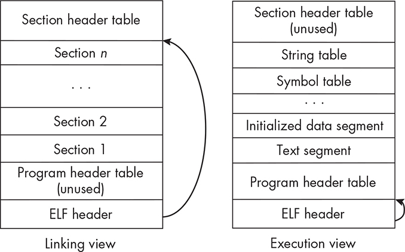
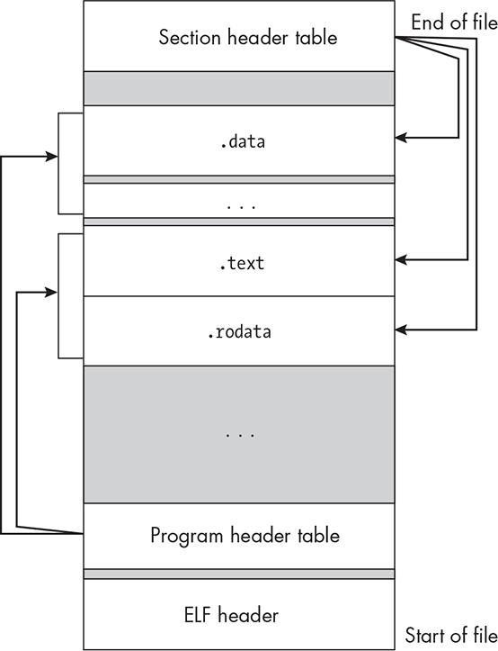
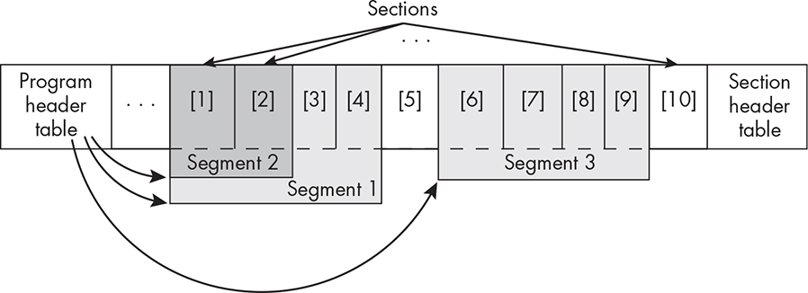
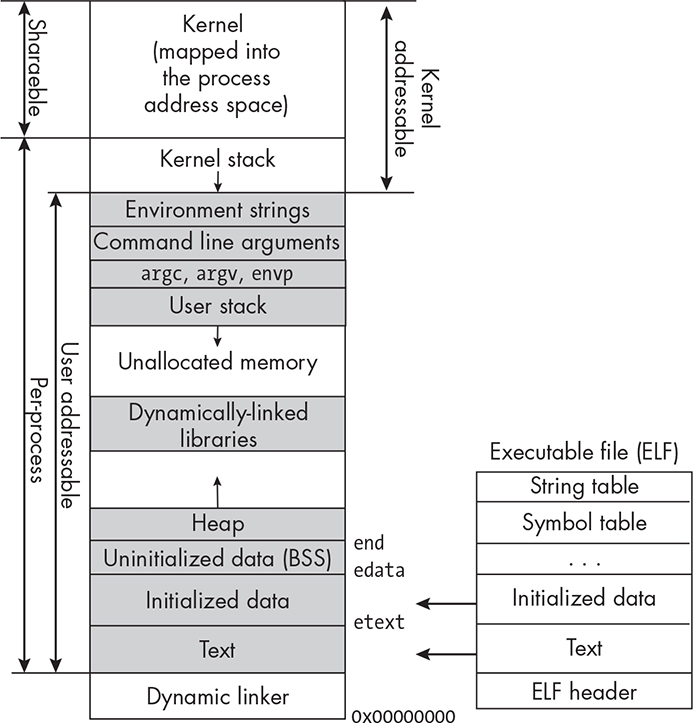
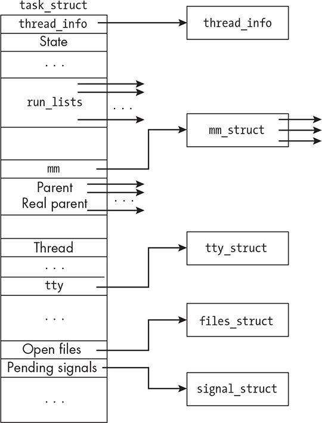

10 PROCESS FUNDAMENTALS

In this chapter, we examine the structure and representation of a process in Linux. If we think of a process as something that performs a task for an ordinary nonprivileged user such as you or me but that is managed

by the kernel, it leads to two very different views of a process. One is the way that nonprivileged users see it, and the other is the way that the kernel represents it. We begin by exploring the user-visible

manifestation of a process. After that, we’ll look at it from the kernel’s perspective.

More specifically, we start by examining the kinds of relationships

that can exist among sets of processes. Since processes execute

programs, we’ll then delve into what executable programs actually are

and their relationship to processes. After that, we’ll examine the

structure of the *memory image* of a process, which is the contents of the memory assigned to the process while it’s running.

Turning to how a process is manifested within the kernel, we’ll study

how the kernel represents a process, what types of attributes are

associated with it, what kinds of resources a process can have, and what kinds of resources and internal structures are needed by the kernel to manage the process. We’ll look at the ways in which user programs can

view some of the kernel’s representation of a process. Along the way,

we’ll implement a few programs that use or access various process

attributes, such as a simplified version of the ps command.

Processes Revisited

In the first chapter of the book, I defined a process as an instance of a running program. This is the traditional definition of a process. Another way to conceptualize a process is that it’s an entity that executes a

program. As long as it’s alive, it’s executing some program, and it may not be the same program as the one it began to execute when it came

into existence. The POSIX definition formalizes this viewpoint;

POSIX.1-2024 defines a process as “an address space with one or more

threads executing within that address space, and the required system

resources for those threads” (Base Definitions: 3.210). If we think of a process as an address space with something executing within it, then it’s not hard to accept the idea that whatever it’s executing can be changed and that a process is not tied to a particular program. It’s like a person and their job—when a person changes their job, they remain the same

person, even though they’re *executing* a new job.

To execute a program, a process requires physical memory for the

program’s instructions and data, as well as other system resources such as disk space and access to the CPU. All resources are finite, and it’s the kernel’s responsibility to allocate them among the processes. To make

decisions about which processes should be given which resources, the

kernel has to have a clear picture of what every process is doing at a given time. For example, it needs to know a process’s privileges and

scheduling priority, its runtime status, the state of any pending timers or signals, tables of open file descriptions, tables for managing signals, memory maps, and so on. Therefore, the kernel must have a

representation of a process that includes all of the information it needs to manage that process as well as all other processes and their resources.

For each process, this information, called the *process metadata*, is aggregated into a kernel data structure that’s associated with the process by means of the unique process ID (PID) that the kernel assigned to it when it was created. In “The Kernel’s Process Representation” on page

517, we’ll explore the various resources and attributes associated with the process under the kernel’s control and how programs can access

them.

Users such as you and I need the PID to access process metadata.

Commands such as ps and top print the PIDs with the rest of their

output so that we can identify which lines of output correspond to

which processes. With the PID, we can also access more process

metadata by examining the files in the */proc* pseudofilesystem. The */proc* pseudofilesystem is not a filesystem in the usual sense; it’s an interface to the kernel’s data structures. Ordinary commands and functions that

access files can access process metadata, so that we can easily “see” the kernel’s internal data, like reading an X-ray of the kernel. We’ll explore the */proc* pseudofilesystem in “The */proc* Pseudofilesystem” on page 521.

The kernel maintains other IDs for each process. For example, every

process has a few user IDs, such as an effective UID and a real UID (see

Chapter 4). It also has a parent process ID, a process group ID, and a session ID. Soon you’ll see the role that the various IDs play in process management.

The Process Tree

On a typical Unix system, at any moment in time you’ll probably find a few hundred active processes. An *active*, or *live*, process is one that’s been created and has not terminated. Enter **ps -e** to see information about the complete set of them, or just pipe its output to wc -l to count them, as in: \$ **ps -e \| tail -n +2 \| wc -l** \# Throw away heading line of ps.

266

With the exception of the init (systemd) process, whose PID is 1, all of these processes came into existence because some other process created them. The init process is created at system startup by the kernel and

then goes on to create other processes, which in turn create other

processes, which create others, and so on. This implies that every

process other than init was either created directly or indirectly by the init process, in essence forming a process tree whose root is init. In fact, the pstree command displays this tree, in whole or in part, depending on the options and arguments you give it.

The terminology associated with processes is very anthropomorphic;

we call the creating process the *parent process*, the created one the *child*

*process*, and all processes created by the same process *siblings*. Terms such as *ancestor* and *descendant* have the expected analogous meanings. Thus, we say that init is the ancestor of every other process and that all other processes are descendants of init.

Process Groups

Modern Unix systems introduced the concept of a *process group* as an abstraction of a job \[[4\]](index_split_014.html#p1236). The motivation for this feature was to simplify the way in which a pipeline could be terminated with a signal \[13\].

When we enter a shell pipeline such as \$ **last \| cut -d' ' -f1 \|**

**sort -u**

separate processes are created to execute each subcommand, but they’re all placed into a single process group created by the shell. When a user enters a termination or job control signal such as CTRL-C from the

keyboard, the signal is delivered to all processes in the group, making it possible to terminate every process in the pipeline easily.

POSIX.1-2024 defines a *process group* as “a collection of processes that permits the signaling of related processes” (Base Definitions:

3.296). Each process group has a unique positive-integer *process group* *ID*, which I’ll refer to as its PGID. Every process belongs to exactly one process group at any time. The process’s process group ID, which I’ll

refer to as its PGRP, is set to the PGID of the process group to which it belongs. To be clear, a PGID is the ID of a process group, whereas a

PGRP is the group ID of a process.

When a process is created, it’s given the PGRP of its parent and

therefore begins execution as part of its parent’s group. When a user

enters a pipeline in a shell that supports job control such as bash, the shell creates a new process group as well as a process for each executable program in the pipeline and places all of these child processes into that group. The assignment of a PGID for that group is fairly simple—the

very first process that the shell creates becomes the group’s *process group* *leader*, and its PID is used as the PGID for the new group. Each other process’s PGRP is then set to this PGID.

To see this, open two terminal windows. In the first, enter the pipeline: \$ **cat \| sort \| uniq \| wc**

Since cat is waiting for user input, all of these commands will remain active until you enter CTRL-D in this terminal, which delivers an EOF

to cat. In a second terminal, enter a ps command that displays the PGRP

of each process. You can view the PGRP of a process in the output of ps with the -o option, specifying the format to include pgrp. To see the PID, the parent process ID (PPID), the PGRP, and the executed command,

I’ll enter the command: \$ **ps -opid,ppid,pgrp,cmd** PID PPID PGRP

CMD *--snip--* 8294 4685 8294 bash 16779 4716 16779 cat 16780

4716 16779 sort 16781 4716 16779 uniq 16782 4716 16779 wc 16783

8294 16783 ps -u stewart -opid,ppid,pgrp,cmd

(You might need to add a -a option to ps for this to work on other Linux distributions.) I removed the unrelated processes from this output.

Notice that cat’s PID is the same as its PGRP. This tells us that cat is the group leader. The remaining processes in the pipeline are all in this

group because they have the same PGRP as cat.

Because process groups were introduced primarily for job control, if

I had entered CTRL-C while the pipeline was active, every process would have received a SIGINT and would terminate. What if, instead, I tried to terminate the set of processes using the kill command? The man pages

for kill, both the Linux page and the POSIX page, state that we can

send a signal to an entire group by sending it to the negated GPID of

the group. In the preceding example, I could have entered kill -SIGINT

-16779 to terminate the entire group.

The preceding discussion leads to a few questions:

How can bash change the PGID of its child processes after it creates

them?

Are there system calls that let a process change its own PGRP or

change the PGRP of another process, and if so, what limitations

are imposed?

Are there calls that allow one process to get the PGRP of another

process if it has its PID?

I’ll search the man pages to seek answers using apropos: \$ **apropos -**

**s2 'process group'** getpgid (2) - set/get process group getpgrp (2) -

set/get process group setpgid (2) - set/get process group setpgrp (2) -

set/get process group setsid (2) - creates a session and sets the process group ID

The first four system calls share one page, whose SYNOPSIS is: \#include

\<sys/types.h\> \#include \<unistd.h\> int setpgid(pid_t pid, pid_t pgid); pid_t getpgid(pid_t pid); pid_t getpgrp(void); /\* POSIX.1 version \*/

pid_t getpgrp(pid_t pid); /\* BSD version \*/ int setpgrp(void); /\* System V version \*/ int setpgrp(pid_t pid, pid_t pgid); /\* BSD version \*/ *--*

*snip--*

These calls have feature test macro requirements, but we don’t need

them if we’re not using the BSD or System V functions shown here.

The page tells us that the preferred way for a process to get the PGID

of the process group to which it belongs is by calling getpgrp() and

otherwise by calling getgpid(0). It can get the PGID of another process with PID p by calling getpgid(p). We’re discouraged from using the BSD

versions of these calls, and in fact they aren’t exposed in *unistd.h* unless we use the appropriate feature test macro.

The setpgid() system call allows a process to change the PGRP of

processes in a few different ways: setpgid(0, pgid) /\* Set the PGRP of the calling process to pgid. \*/ setpgid(pid, 0) /\* Set the PGRP of process pid to pid. \*/ setpgid(0, 0) /\* Set the PGRP of the calling process to its PID. \*/ ➊ setpgid(pid, pgid) /\* Set the PGRP of process pid to pgid. \*/

The last use of it ➊ is intended only to allow one process to move

another from one group to another, provided that both groups are part

of the same session (a concept we’ll discuss shortly) and that the calling process has the same owner.

Sessions

Modern Unix systems also introduced the concept of a login session,

usually just called a session, to facilitate job control. You can think of a session as the collection of all processes created directly or indirectly when you log in. Formally, a *session* is a collection of process groups, and

every process group belongs to exactly one session. This implies that every process belongs to one session since each process is a member of some process group. It also implies that all processes in a process group belong to the same session, and that we can think of process groups and sessions as a two-level hierarchy. Each process has a unique *session ID*

( *SID*) that identifies the session to which it belongs.

The primary purpose of a session is to organize processes around

their controlling terminals. The controlling terminal for a process,

discussed in Chapter 8, is the terminal that delivers signals to the process when the user enters certain key combinations or sequences,

such as CTRL-C, in that terminal. When a user logs in, the kernel creates a session, places all processes and process groups of that user into the session, and links the session to the terminal as its controlling terminal.

In each session, one process is the *session leader*, which is the only process whose SID equals its PID.

Any process that isn’t a group leader may detach itself from its

session by calling setsid(). The setsid() system call creates a new session whose session ID is the PID of the calling process. It also creates a new process group in that new session and makes the calling process the

session leader of the session and the group leader of the group. Initially, this new session has no controlling terminal, which implies that the

process is immune to keyboard interrupts. This is exactly how a daemon process is created—it detaches itself from the session of which it’s a member and goes off on its own. A *daemon* is a process that has no controlling terminal and usually runs until the computer is powered off.

In Chapter 14, we’ll explore how to create daemon processes. If the process is not intended to be a daemon and needs a controlling

terminal, it can acquire one by opening a terminal with the open() system call, passing the device file associated with the terminal.

A process can get its session ID with the getsid() system call: getsid(0) returns the SID of the calling process, and getsid(p) returns the SID of process whose PID is p. Some versions of Unix require that the caller

and p belong to the same session; otherwise, the call returns -1.

We can add a session ID column to the ps command’s output to see

the SIDs of the printed processes by adding sid to the list of output

format specifiers, as in \$ **ps -opid,ppid,pgrp,sid,tty,cmd** PID PPID

PGRP SID TT CMD 4716 4685 4716 4716 pts/0 bash 23010 4716

23010 4716 pts/0 ps -opid,ppid,pgrp,sid,tty,cmd

which also added in the controlling terminal to the output. Notice that bash is the session leader because its SID is equal to its PID.

Foreground and Background Processes and Process

Groups

There are two types of process groups, called *foreground* groups and *background* groups. If a process is in a foreground process group, it’s called a *foreground process*, and if it’s in a background process group, it’s called a *background process*. The idea, informally, is that foreground processes are connected to the terminal, whereas background processes

aren’t. When people say they’re running something in the foreground

(or the background), they mean that the process is a foreground (or

background) process. Every session can have multiple process groups,

but at most one of them can be a foreground group; the others must be

in the background. There’s no limit to the number of background

processes.

When we enter a command from the shell, terminating it with a

newline, as in \$ **ps -u stewart -opid,pgid,cmd \| tail +2 \| sort -**

**k3 \| awk '{print \$2, \$3}'**

all of the processes created to execute the command are in the

foreground. In contrast, when we append an ampersand (&) to the

command line, as in \$ **rsync -avH \$HOME /backups/backup\_\$(date**

**+"%m-%d-%y") &** \$

all of the created processes are placed into a background group. When

the command is placed into the background, the prompt returns

immediately. The background job runs while we continue to work in the

foreground.

One difference between foreground and background processes is

that foreground processes can read from their controlling terminal,

whereas background processes cannot. If a background process tries to

read from the controlling terminal, the kernel will send it a SIGTTIN

signal, which will stop, but not terminate, the process. If it tries to write to the terminal, the kernel will send a SIGTTOU signal to it. The default action of a SIGTTOU signal is to stop the process, but many shells override the default action to allow background processes to write to the

terminal.

Another difference is that when you enter a key combination that

generates a signal in the terminal, the signal is sent only to the

foreground process group. Entering CTRL-C, for example, will not cause a SIGINT to be sent to background processes. You can still send a SIGINT to a background process group with the kill command.

The SIGHUP signal will be sent to all processes in the session, whether they’re foreground or background. The SIGHUP signal is usually generated when a terminal connection is broken for one reason or another. When

this happens, by default, all processes are killed. When you log out from a session, SIGHUP is sent to all background processes. If you want to run a background job and have it continue even after you log out, you can use the nohup command to run it. This will allow it to run, ignoring SIGHUP

signals. For example, if you want to run a backup program named

do_backup in the background and close your terminal connection, you can enter: \$ **nohup do_backup &** \$ **logout**

Of course, the do_backup program must not read from or write to the

terminal; it’s a good idea to redirect standard error when you run nohup.

Program Files

A program starts out as a source code file, from which we create an

executable file by compiling and linking it. When we issue a command

to run the executable file, between the time at which we issue that

command and the time it begins to run, a process is created with all of the resources it needs to execute the program’s code. This implies that the executable program file contains enough information to create this process, but it raises two questions:

What information is in the executable file that enables the kernel to create the process image in memory?

What steps take place to create this process?

In this section we’ll examine the form and content of an executable

program file. In the next chapter, we’ll concentrate on process creation and related topics.

*The Contents of an Executable File*

An executable program file must contain enough information to create a process image. This includes, at a minimum, the following types of

information:

The executable machine instructions, which are called its *text*.

The address of the machine instruction at which to start execution,

called the *entry point*. A program file may contain several functions in addition to the main() function; the entry point identifies which

instruction in the code is the start of main().

*Relocation tables*, which are tables used for connecting unresolved symbols, meaning those without addresses, to actual addresses

when the program is loaded into memory and run.

A *symbol table*, which is a table that the compiler creates to map symbolic names to logical addresses and store the attributes of

these symbols. If a program is built with debugging symbols

enabled, the symbol table is loaded into memory with the program

at runtime.

*String tables*, which are tables containing various strings used in the program, such as the names of variables, string literals, and

functions, as well as strings needed for dynamic linking of the

program.

All of the initialized data used by the program, such as string and

numeric literals.

Information about which dynamic libraries need to be loaded when the program runs, including the pathname of the dynamic linker to

link those libraries to the program at runtime.

All of this information must be structured in a precise way so that

loaders, linkers, and other utility programs can find and interpret it correctly. For example, when we run the file utility command to print

information about an executable file \$ **file /bin/bash** /bin/bash: ELF

64-bit LSB pie executable, x86-64, version 1 (SYSV), dynamically

linked, interpreter /lib64/ld-linux-x86-64.so.2, BuildID\[sha1\]=

33a5554034feb2af38e8c75872058883b2988bc5, for GNU/Linux 3.2.0,

stripped

it’s able to extract this metadata about the bash executable from its file only because its format is standardized. Right now, it doesn’t matter

whether you know what all of this output means; the point is that file is able to parse the executable file to extract it.

*The Executable and Linking Format*

If you’ve ever run the gcc compiler and didn’t specifically name the

executable file with the -o *output-file* option, as in \$ **gcc myprog.c** the linker named the resulting executable file *a.out*. If you’ve ever wondered why it’s called *a.out*, it’s because *a.out* is short for “assembler output”; it wasn’t just the name of the output file but was also name of the format of all binary executable files on Unix systems for many years.

It isn’t anymore. In 1993, a more portable and extensible format now

known as *Executable and Linking Format* ( *ELF*) was published by UNIX

System Laboratories as part of the *Application Binary Interface* ( *ABI*) specification. It was revised in 1995 by the Tool Interface Standards

(TIS) Committee, an industry consortium that included most major

companies, including Intel, IBM, Microsoft, Novell, Santa Cruz

Operation, and several others. While compilers continue to create files named *a.out*, on most modern machines, they are actually ELF files.

Version 1.2 of the ELF specification \[45\] defines the format and content of four different file types:

Relocatable file Stores code and data suitable for linking with other object files in order to create an executable or a shared object file.

Executable file Contains a program suitable for execution. The file

specifies how to construct the *memory image* that a process will execute.

Shared object file Stores code and data for linking under two

different circumstances. In one case, the link editor processes it with other relocatable and shared object files to create yet another shared object file. In the second case, the dynamic linker combines it with an executable file and other shared objects to create the memory image

that a process will execute.

Core file Produced by a core dump. A *core dump* is a snapshot of a process’s memory image written to a file. Certain signals, when

unhandled, cause core dumps if they’re enabled by the system

configuration. Core dump files are large and often disabled by

default.

In short, the content and structure of the file depend on which type of file it is. Here, we’re interested in the form of the ELF executable type file; a good grasp of the form and content of an ELF file gives us a

better understanding of how programs are executed and what their

memory images look like. Most of what I describe in the remainder of

this section is based on version 1.2 of the ELF specification, which can be downloaded from [*https://refspecs.linuxbase.org*](https://refspecs.linuxbase.org/).

ELF File Structure

Regardless of the file type, an ELF file always starts with a structure called the *ELF header*. The ELF header acts like a road map to the rest of the file, detailing its organization. It identifies and provides the addresses and sizes of the tables needed to access all other components of the file. Because it’s designed to be used for both linking and

execution of a program, it embeds two different parallel, overlapping

views called the *linking view* and the *execution view*. Figure 10-1 depicts the two different views of an ELF file.

*Figure 10-1: The linking and execution views of an ELF file with low addresses at the* *bottom*

The difference between them is summarized as follows:

The linking view is the view of the file needed by the link editor in

order to link and relocate components in the file. In this view, the

file is organized into sections. *Sections* contain most of the

information needed for linking, such as the instructions, data,

symbol table, relocation information, and so on. Every section is

described by a *section header*, which contains information such as the type of information the section contains, its offset in the file, its

size, and more. The section headers are organized into a *section*

*header table*.

The execution view is the view used to load and execute the program. In this view, the information is organized into segments.

*Segments* are the parts of the file that are loaded into memory to form the process’s memory image; they consist of one or more

consecutive sections in the file. Each segment is described by a

*program header*, which contains information such as the segment’s location in the file, size, virtual address at which it should be

loaded, and so on. The program headers are organized into a

*program header table*.

Segments and sections are two different ways to look at the exact

same data in the file. The difference between them isn’t what data they contain, but how they reference and use that data. To quote the ELF

specification:

A program header table, if present, tells the system how to create a process image.

Files used to build a process image (execute a program) must have a program header table; relocatable files do not need one. A section header table contains information describing the file’s sections. Every section has an entry in the table; each entry gives information such as the section name, the section size, and so on. Files used during linking must have a section header table; other object files may or may not have one.

In other words, segments correspond to the different regions of a

process’s memory image, such as its executable code, called the text

segment in the figure; its initialized data; its uninitialized data; and so on.

When an executable is loaded into memory, the segments are

mapped not to physical addresses, but to logical addresses, which are

also called virtual addresses.

VIRTUAL AND PHYSICAL MEMORY ADDRESSES

The addresses generated by the CPU during a program’s

execution are called *logical* or *virtual* addresses. *Physical* addresses are actual addresses in physical memory. For example, a process

might generate a set of logical addresses between 0x08048000 and

0xc0000000, but that does not mean that it actually accesses physical memory locations from 0x08048000 and 0xc0000000.

Modern operating systems use a method of memory management

called *virtual memory management*, in which the addresses

generated by the CPU are mapped to actual physical memory

addresses by a *memory management unit*. The most common virtual memory scheme is *paging*, in which physical memory is partitioned into uniform-size *page frames*, each process’s address space is partitioned into *pages* of the same size as the page frames, and these logical pages are mapped to physical pages by the kernel and

the hardware.

Both the section header table and the program header table can be

viewed as an array of structures. The section header table is like a table of contents for the sections in the file. It is located at the end of the file.

The program header table functions as a table of contents for the

segments. It is located immediately following the ELF header. Neither

the sections nor the segments in the file have to be in particular

locations because the header tables store their positions. Figure 10-2

illustrates this idea, with the start of the file at the bottom of the image.

*Figure 10-2: The overlapping views of the ELF file, showing that multiple sections may be* *part of a single segment*

The figure also shows that segments may consist of multiple

sections. For example, the .text section and .rodata section are part of a

single loadable segment indexed by the program header table, but each is an individual section indexed in the section header table.

ELF File Contents

The purpose of this section is to present an overview of the

organization and structure of an ELF file, with enough detail so that

you could design programs to access its data. We have several resources for learning more about its contents, including:

The ELF man page. A search of the man pages using apropos -e elf

reveals that there’s a Section 5 man page for ELF, which contains a

description of its structure and contents, including C structure

declarations, with enough detail to write simple programs that can

access its data.

The */usr/include/elf.h* header file, which contains declarations and definitions of all constants and C structures.

The ELF specification.

In addition to these resources, on GNU/Linux systems, we also have

at our disposal the readelf command. This command has options that

control which subset of the information in an ELF file to display. Here are a few of the basic options:

**-a** Show almost everything.

**-a --use-dynamic** Show everything.

**-e** Show all headers.

**-h** Show the ELF file header.

**-l** Show all program headers (segments).

**-S** Show all section headers.

**-t** Show section details.

**-s** Show all symbols.

GNU provides several other utilities for working with ELF files, such as scanelf and dumpelf, which are part of the *pax-utils* package. This is in most systems’ repositories, and the sources can be downloaded from

the git repository at [*https://github.com/gentoo/pax-utils*.](https://github.com/gentoo/pax-utils)

To make this more concrete, I compiled the original *hel o_world.c*

program from Chapter 1 into the executable file *hel o_world* so that we can explore its ELF file. This is about the smallest nontrivial program we can examine.

An ELF file begins with the ELF header. The header contains the

most basic information about the file. To see the header of the

*hel o_world* executable, you can use readelf -h: \$ **readelf -h** **hello_world** ELF Header: Magic: 7f 45 4c 46 02 01 01 00 00 00 00 00

00 00 00 00 Class: ELF64 Data: 2's complement, little endian Version: 1

(current) OS/ABI: UNIX - System V ABI Version: 0 Type: DYN

(Position-Independent Executable file) Machine: AdvancedMicro

Devices X86-64 Version: 0x1 Entry point address: 0x1060 Start of

program headers: 64 (bytesinto file) Start of section headers: 13984

(bytesinto file) Flags: 0x0 Size of this header: 64 (bytes) Size of program headers: 56 (bytes) Number of program headers: 13 Size of section

headers: 64 (bytes) Number of section headers: 31 Section header string table index: 30

The first 4 bytes of the file are 0x7f followed by the string *ELF*. The next 3 bytes encode the class of the file (32 versus 64 bit), whether it’s little-endian or big-endian, the version of ELF (1 meaning current), and the operating system and ABI. These are all part of the output labeled Magic. The class of the file determines whether certain members, such as the entry point address and the start of the section headers, are 32 bits or 64 bits. This implies that before the entire header is read, the first few bytes need to be read to determine how much memory to allocate

for the header.

The rest of the header provides metadata such as the machine type,

file type, and location and size information for the program headers and section headers, from which the locations of the program header and

section header tables can be calculated. This information allows us to read all of the program headers and section headers into memory so

that we can access the segments and sections that they describe. In “A Program to Print the ELF Program Header Table” on page 506, we’ll demonstrate how to access this data by developing a program that can

display the program header file of an ELF file.

The ELF header for *hel o_world* indicates that it has 13 program headers and 31 section headers. To see a list of the program headers in the file, we can enter readelf -lW hello_world, part of whose output follows in Listing 10-1.

There are 13 program headers, starting at offset 64

Program Headers:

Type Offset VirtAddr PhysAddr FileSiz MemSiz Flg Align

PHDR 0x000040 0x0000000000000040 0x0000000000000040 0x0002d8 0x0002d8

R 0x8

INTERP 0x000318 0x0000000000000318 0x0000000000000318 0x00001c 0x00001c R 0x1

\[Requesting program interpreter: /lib64/ld-linux-x86-64.so.2\]

LOAD 0x000000 0x0000000000000000 0x0000000000000000 0x000628 0x000628

R 0x1000

LOAD 0x001000 0x0000000000001000 0x0000000000001000 0x000171 0x000171

R E 0x1000

LOAD 0x002000 0x0000000000002000 0x0000000000002000 0x0000fc 0x0000fc R 0x1000

LOAD ➊ 0x002db8 0x0000000000003db8 0x0000000000003db8 0x000258 0x000260

RW 0x1000

*--snip--*

GNU_RELRO ➋ 0x002db8 0x0000000000003db8 0x0000000000003db8 0x000248 0x000248

R 0x1

Section to Segment mapping:

Segment Sections... 00

01 .interp

02 .interp .note.gnu.property .note.gnu.build-id .note.ABI-tag ...

03 .init .plt .plt.got .plt.sec .text .fini

04 .rodata .eh_frame_hdr .eh_frame

05 .init_array .fini_array .dynamic .got .data .bss

*--snip--*

12 .init_array .fini_array .dynamic .got

*Listing 10-1: Sample output of* *readelf* This output lists the program (segment) headers, followed by a mapping that shows which sections are part of each segment. The header whose type is INTERP contains the pathname to the dynamic linker, which loads the executable, resolves links, and ultimately passes control to hello_world when it is finished.

The segments of type LOAD are loadable segments—they become part of the memory image.

Offsets are the number of bytes from the start of the ELF file at which the segment starts.

The virtual address is the offset in the memory image at which the segment loads. The physical address is ignored.

The column labeled FileSiz is the size of the segment in the file. The flags indicate access mode (R for read, W for write, E for execute), and the last column is the byte alignment in virtual memory. For example,

LOAD-type segments must align on 4096 (0x1000) byte boundaries.

The section to segment mapping shows that the dynamic linker

(.interp) is the only section in segment 1 and that the text section (.text) is part of segment 3, along with a few other sections. The read-only data section (.rodata) is in segment 4, and the initialized data section (.data) and the uninitialized data section (.bss) are part of segment 5.

When a segment consists of more than one section, the sections

must be adjacent to each other in the file, and their section headers are adjacent in the section header table. For example, the output shows that segment 3 contains the following sections: 03 .init .plt .plt.got .plt.sec

.text .fini

If we were to look at the sections in this file using readelf -S hello_world, we’d see the following: \[Nr\] Name Type Address Off Size ES Flg Lk Inf

Al *--snip--* \[12\] .init PROGBITS 0000000000001000 001000 00001b 00 AX 0 0 4 \[13\] .plt PROGBITS 0000000000001020 001020 000020

10 AX 0 0 16 \[14\] .plt.got PROGBITS 0000000000001040 001040

000010 10 AX 0 0 16 \[15\] .plt.sec PROGBITS 0000000000001050

001050 000010 10 AX 0 0 16 \[16\] .text PROGBITS 0000000000001060

001060 000117 00 AX 0 0 16 \[17\] .fini PROGBITS 0000000000001178

001178 00000d 00 AX 0 0 4

Notice that the offsets (Off column) are increasing and that the offset of each successive section is obtained by adding the previous size to the

previous offset and, if it does not fall on the byte boundary specified by the align (Al) column, bumped up so that it falls on a multiple of that alignment.

Also observe that some sections are part of more than one segment.

For example, look at Listing 10-1 again. Segment 12, the last segment ➋, of type GNU_RELRO, is a subset of segment 5 ➊, a loadable segment.

Their virtual addresses are the same, but segment 12 is smaller in size.

Section 12 is not loadable; it’s used by the dynamic linker to mark those sections as read-only when they’re relocated into the memory image.

Figure 10-3 illustrates this idea.

*Figure 10-3: Illustration of how sections are part of segments and may be in more than one* *segment*

The preceding observations focused on the segments and sections,

but we can also examine all of the symbols, both the statically linked and the dynamically linked ones, using the command readelf -s hello_world. A tiny snippet of the output shows the kind of information stored for each symbol: \$ **readelf -s hello_world** *--snip--* Symbol table '.symtab'

contains 36 entries: Num: Value Size Type Bind Vis Ndx Name *--snip-*

*-* 23: 0000000000000000 0 FUNC GLOBAL DEFAULT UND

printf@GLIBC_2.2.5 *--snip--* 30: 0000000000004010 0 NOTYPE

GLOBAL DEFAULT 26 \_\_bss_start 31: 0000000000001149 46 FUNC

GLOBAL DEFAULT 16 main *--snip--*

Notice that the printf symbol is part of *glibc* and has no value. The value of a symbol is its address, and it has no address until runtime. In

contrast, main() has a value because it’s the address of the main program.

A Program to Print the ELF Program Header Table

We can use what we discovered in the preceding sections about the

structure and content of ELF files to write a small program that

accesses a small piece of that file. Specifically, we’ll write a program that displays all of the program headers in a given file, trying to mimic the output of the readelf -l command, without the section to segment

mapping. The goal of this exercise is to show you how to use the various road maps in the file to locate and read any part of the file. We’re using the program headers simply to illustrate the general method.

The current ELF specification supports both 32-bit and 64-bit

architectures, and the complication is that the sizes of the members of various structures depend on the architecture. To simplify this small

project, we’ll design the program to work with the 64-bit versions of all structures. It is a minor extension to add the logic for the 32-bit versions as well.

The *elf.h* header file defines types used by the file based on whether it’s 32-bit or 64-bit. For example, here’s a small part of it: /\* Type for a 16-bit quantity \*/ typedef uint16_t Elf32_Half; typedef uint16_t

Elf64_Half; *--snip--* /\* Type of addresses \*/ typedef uint32_t

Elf32_Addr; typedef uint64_t Elf64_Addr; /\* Type of file offsets \*/

typedef uint32_t Elf32_Off; typedef uint64_t Elf64_Off;

With this in mind, here’s how the 64-bit ELF header structure is

defined: typedef struct { unsigned char e_ident\[EI_NIDENT\]; /\* Magic

number and other info \*/ Elf64_Half e_type; /\* Object file type \*/

Elf64_Half e_machine; /\* Architecture \*/ Elf64_Word e_version; /\*

Object file version \*/ Elf64_Addr e_entry; /\* Entry point virtual address

\*/ Elf64_Off e_phoff; /\* Program header table file offset \*/ Elf64_Off e_shoff; /\* Section header table file offset \*/ Elf64_Word e_flags; /\*

Processor-specific flags \*/ Elf64_Half e_ehsize; /\* ELF header size in bytes \*/ Elf64_Half e_phentsize; /\* Program header table entry size \*/

Elf64_Half e_phnum; /\* Program header table entry count \*/

Elf64_Half e_shentsize; /\* Section header table entry size \*/ Elf64_Half e_shnum; /\* Section header table entry count \*/ Elf64_Half e_shstrndx;

/\* Section header string table index \*/ } Elf64_Ehdr;

The very first member, e_ident, is a 16-byte array (EI_NIDENT = 16). The first 4 bytes read \0x7fELF. The fifth byte indicates whether the rest of the file is a 32-bit ELF or a 64-bit ELF. We need to begin by reading this byte and making sure we have a 64-bit ELF header. Assuming we do, we

can read the entire header from the file and examine its members. We’ll need to allocate storage for it before reading, of course.

The offset in the file to the program header table is stored in the

e_phoff member, each header has size e_phentsize, and there are e_phnum many headers. This implies that the entire program header table is

e_phnum × e_phentsize bytes in size. Therefore, after reading the ELF

header, our program should allocate storage for the program header

table of size e_phnum × e_phentsize and read that many bytes from the file offset e_phoff.

The program header table is not an actual table; it’s just a sequence

of structures whose definition is: typedef struct { Elf64_Word p_type; /\*

Segment type \*/ Elf64_Word p_flags; /\* Segment flags \*/ Elf64_Off

p_offset; /\* Segment file offset \*/ Elf64_Addr p_vaddr; /\* Segment

virtual address \*/ Elf64_Addr p_paddr; /\* Segment physical address \*/

Elf64_Xword p_filesz; /\* Segment size in file \*/ Elf64_Xword p_memsz;

/\* Segment size in memory \*/ Elf64_Xword p_align; /\* Segment

alignment \*/ } Elf64_Phdr;

If prog_header_table is a pointer to the first of these, then we can access all of them using array subscripting of the form prog_header_table\[0\],

prog_header \_table\[1\], and so on.

Our program has to read the data in each structure and format it in

the same way as the readelf command.

There’s one catch. The INTERP segment is treated differently from the

others. In the output from readelf it is displayed as: INTERP 0x000318

0x0000000000000318 0x0000000000000318 0x00001c . . \[Requesting program interpreter: /lib64/ld-linux-x86-64.so.2\]

According to the man page, the pathname of the interpreter is the actual content of the INTERP segment. That string is in the ELF file at offset p_offset and is of size p_filesz. Therefore, as our program reads each program header, it needs to check whether it has found this header, and if so, it needs to read the string from the file at that offset in order to print it.

We’re ready to outline the steps in a mix of prose and actual code.

The following steps omit all of the required error handling:

1\. Open the ELF file for reading, and let fd be the returned file

descriptor.

2\. Read the first 16 (EI_NIDENT) bytes from fd into a buffer.

3\. Read the fifth byte of the buffer to determine the file class. It’s either ELFCLASS32 or ELFCLASS64. For simplicity, the remaining steps are based on its being the 64-bit class.

4\. Allocate storage for the header: Elf64_Ehdr \*elf_header64 =

calloc(1, sizeof(Elf64_Ehdr));

5\. Seek to the start of the file and read sizeof(Elf64_Ehdr) bytes into the header just allocated: lseek(fd, 0, SEEK_SET); read(fd,

elf_header64, sizeof(Elf64_Ehdr));

6\. From this ELF header, \*elf_header64, get the offset (elf_header64 -

\>e_phoff) and size (elf_header64-\>e_phentsize) of the first program header, as well as the total number of program headers (elf_header64

-\>e_phnum).

7\. Allocate memory to store all of the program headers. This requires

(elf_header64-\>e_phentsize) × (elf_header64-\>e_phnum) bytes.

8\. Let Elf64_Phdr\* phtable be the starting address of this memory.

Equivalently, phtable may be treated as an array of elf_header64-

\>e_phnum program headers, since they are stored consecutively in the file.

9. Seek elf_header64-\>e_phoff bytes from the start of the ELF file.

10\. Read the entire set of program headers into the memory allocated

at phtable that location: read(fd, phtable, elf_header64-\>e_phnum \*

sizeof(Elf64_Phdr));

11\. Print a line of output stating how many program headers are in the file and where the first header begins. Then print a line with

column labels.

12\. Print out each program header one after the other, using a loop

such as for ( i = 0; i \< elf_header64-\>e_phnum; i++ ) {

print_progheader64(fd, &(phdr64\[i\]); }

in which the print_progheader() function prints out one line for the

header passed as its argument. The function needs the file

descriptor argument so that it can read the pathname of the

program interpreter when it finds the segment that contains it.

When the program interpreter segment is found, it needs to

seek to position progheader-\>p_offset and read progheader-\>p_filesz bytes into an allocated string, after which it can print the path to

the interpreter.

The entire program based on this logic is called *print_elfphdr.c* and is included in the source code distribution for the book. The main

program is shown here, with limited error handling to save space:

*print_elfphdr.c* main() (int argc, char \*argv\[\]) { int fd; ssize_t nbytes; unsigned char ident\[EI_NIDENT\]; int class, i; Elf64_Ehdr

\*elf_header64 = NULL; Elf64_Phdr \*phdr64 = NULL; if ( argc \< 2 )

usage_error("expecting executable file"); if ( (fd = open(argv\[1\], O_RDONLY)) == -1 ) fatal_error(errno, "open"); if ( (nbytes = read(fd, ident, EI_NIDENT)) != EI_NIDENT ) fatal_error(errno, "read"); lseek(fd, 0, SEEK_SET); class = ident\[EI_CLASS\]; if ( class !=

ELFCLASS64 ) fatal_error(-1, "Expecting 64-bit ELF file");

elf_header64 = calloc(1, sizeof(Elf64_Ehdr)); if ( read(fd, elf_header64, sizeof(Elf64_Ehdr)) == -1 ) fatal_error(errno, "read"); printf("There are

%d program headers, starting at offset %lu.\n\n", elf_header64-

\>e_phnum, elf_header64-\>e_phoff); printf("Program Headers:\n"); printf(" Type Offset VirtAddr PhysAddr" " FileSiz MemSiz Flg

Align\n"); phdr64 = read_ph64table(fd, elf_header64-\>e_phoff, elf_header64-\>e_phnum); for ( i = 0; i \< elf_header64-\>e_phnum; i++ ) print_progheader64(fd, &(phdr64\[i\])); return 0; }

A sample run on an executable such as *hel o_world* produces output like the readelf command: There are 13 program headers, starting at offset

64\. Program Headers: Type Offset VirtAddr PhysAddr FileSiz MemSiz

Flg Align PHDR 0x000040 0x0000000000000040

0x0000000000000040 0x0002d8 0x0002d8 R 0x8 INTERP 0x000318

0x0000000000000318 0x0000000000000318 0x00001c 0x00001c R 0x1

\[Requesting program interpreter:/lib64/ld-linux-x86-64.so.2\] LOAD

00000000 000000000000000000 000000000000000000 0x02e188

0x02e188 R 0x1000 LOAD 0x02f000 0x000000000002f000

0x000000000002f000 0x0def6d 0x0def6d R E 0x1000 LOAD 0x10e000

0x000000000010e000 0x000000000010e000 0x039b08 0x039b08 R

0x1000 *--snip--* GNU_STACK 00000000 000000000000000000

000000000000000000 00000000 00000000 RW 0x10 GNU_RELRO

0x148a90 0x0000000000149a90 0x0000000000149a90 0x003570

0x003570 R 0x1

The same method can be used to print the contents of section headers

and symbol tables. I’ve included another program named *printelf.c* in the source code distribution that prints just the ELF header to show how to handle the individual members of that structure.

The Virtual Memory Layout of a Process

Let’s turn to the memory image of a process. The goal is to construct a mental picture of what a process looks like in its *virtual address space*—

meaning what pieces go where, not in physical memory, but in virtual

memory. The virtual memory layout is architecture dependent; I’ll

describe the typical layout in a Linux system running on an x86-64

processor. Although it’s derived from the traditional layout used in early Unix systems, it has diverged in a few important respects, which I’ll

discuss.

There are five different regions of the user-space part of a process,

of which four are called *segments*, a term derived from early Unix

systems that implemented these memory regions using the memory management scheme known as *segmentation* \[4\]. From the lowest location to the highest, they are:

The text segment

The initialized data segment

The uninitialized data segment

The stack segment

The heap

The C library defines three variables, etext, edata, and end, whose

addresses are the first address after the text segment, the initialized data segment, and the uninitialized data segment, respectively. These are not part of any standard, but most Unix systems provide them. A program

uses them by declaring them as extern. In Listing 10-2 I show how to use them.

Figure 10-4 shows how these segments as well as other parts of a process’s address space are organized in logical memory and their

relationship to the segments of the ELF file. The figure is drawn with low-order addresses at the bottom. The shaded portion of the figure

represents logical addresses that are currently allocated and addressable by the process. The area below the text segment is where the dynamic

linker is mapped into the process’s virtual memory. The process can’t

access that portion of its address space. When we run a program, the

dynamic linker runs first. The dynamic linker sets up its internal data structures so that it can create the links needed by the process, and only after it has loaded and mapped libraries into the process’s address space does it transfer control to the first instruction in the program.

The area between the stack and the heap is unused. If the process

were to generate an address in this region, it would cause an exception.

The bottom of the user stack contains the pointers to the command line arguments and the environment strings. The arguments and the strings

are above the stack, which grows downward.

*Figure 10-4: The layout of a process in its virtual address space for a typical Linux system,* *showing the correspondence between the ELF file’s segments and the process’s segments* The region above the environment strings is where the kernel is

mapped into the process’s address space. When a process is executing in unprivileged (user) mode, it can’t access any of this memory. When it

makes a system call and its privilege changes, it can access that part of its virtual memory. Mapping the kernel into the address space of each

process simplifies the way in which system calls are implemented.

Notice in the figure that a part of the kernel-addressable portion of the process’s virtual memory is labeled *per-process*; this is where the metadata associated with the process is located. I’ll explain more about this

metadata later in the chapter.

The starting locations of each of these regions were, at one time, in

fixed positions. For example, the text segment always started at logical address 0x08048000. However, because of the ever-increasing number

of attempts to exploit memory vulnerabilities when the addresses of

libraries and executables were at known locations, a technique known as *address space layout randomization* ( *ASLR*) was introduced into the Linux kernel.

With ASLR, the relative positions of the memory regions is

preserved, but the actual locations of the different regions are shifted by random numbers of bytes. To support ASLR, compilers generate

position-independent code. In Figure 10-4, the relative positions of the various regions are shown, but their distances from each other do not

reflect actual distances. Following are brief descriptions of each of the memory regions.

*The Text Segment*

The text segment contains the process’s executable code, including all functions that are statically linked into it. It is a fixed size and is almost always a read-only segment, shared by all other processes executing the same program. The fact that it is read-only and shareable implies that: A process cannot inadvertently modify it.

Only one copy is needed in physical memory.

The overhead of swapping is reduced because if the process is

swapped out of memory, it doesn’t have to be copied to secondary

storage since it hasn’t changed, and if it already resides in memory,

there’s no need to copy it back from secondary storage when a process is swapped back into memory.

The segment is made shareable by mapping its memory pages into the

page table of every process that executes this code.

*The Initialized Data Segment*

The initialized data segment is memory allocated for all file-scoped

(global) and static variables that are explicitly initialized in the program’s source code. The size of this segment is fixed when the program is

loaded, based on the information in the ELF file.

*The Uninitialized Data Segment*

The uninitialized data segment contains global and static variables that haven’t been given initial values. It’s also called the *BSS* segment. BSS is an initialism for *Block Started by Symbol*, an old FORTRAN assembly instruction. Because uninitialized data has no starting value, the loader only needs to reserve the space for them and typically fills their memory with zero bytes. The latest C standard requires it to be zero-filled.

Unlike the initialized data segment, uninitialized data takes up no space in the ELF file, which just needs to record its locations and sizes. When the process is loaded, the size of this segment is fixed.

*The Heap*

The heap is technically not a segment; it’s an extension of the

uninitialized data segment. The heap is the region of memory above the BSS used to satisfy a process’s requests for dynamically allocated

memory. The top of the heap is called the *program break*. It used to be true that the initial position of the program break was the first address after the BSS segment, but this is not true in current systems. The

following program, available in the book’s source code distribution,

shows that the program break is not at the same address as end when you run it: *showbreak.c* \#include \<unistd.h\> \#include \<unistd.h\> \#include

\<stdio.h\> extern char etext, edata, end; int main(int argc, char \*argv\[\]) {

void \*break_location = sbrk(0); printf("Location of end = %10p\n"

"Location of program break = %10p\n", &end, break_location); printf("Difference in decimal = %ld\n", (long) (break_location - (void\*)

&end)); return 0; }

The program calls sbrk(0) to get the current position of its program

break. The brk() and sbrk() system calls move the program break. Their man page SYNOPSIS is: \#include \<unistd.h\> int brk(void \*addr); void

\*sbrk(intptr_t increment);

The call sbrk( *n*) moves the break by *n* bytes and returns the new position. Passing 0 to it leaves the position unchanged and returns the current position. Moving the break upward allocates memory, and

moving it downward deallocates memory. These functions should not

be called by user programs, which should instead call the C Library

functions malloc() or calloc() to allocate more memory and free() to

deallocate it. I’m using sbrk() just to get the break’s position.

*The Stack Segment*

The stack segment contains the program stack for calls made by the

process to functions that are executed in user space. Each call causes a stack frame to be pushed onto this stack. The stack frame provides

storage for the automatic (local) variables and return values and

addresses.

The starting address of the stack is near the top of the user-

addressable portion of the process’s address space.

The stack grows upside-down relative to the address space in most

Unix systems, meaning that a push onto the top makes the stack top a

lower memory address, and a pop makes it point to a higher address.

This implies that the stack grows toward the heap, and vice versa. If the stack ever meets the top of the heap, it causes an exception.

*A Program That Displays Virtual Memory Locations*

The preceding sections described the various places in virtual memory

where the different categories of program symbols are located. To make this more concrete, the book’s source code repository contains a

program, *displayvm.c*, that displays the virtual addresses of some of its

symbols as well as the locations of etext, edata, end, and the program break (returned by sbrk(0)) in order to show within which segments each

symbol is placed. The program, with some parts omitted to save space,

is presented in Listing 10-2. It prints the virtual addresses of the following symbols:

Global initialized variable title

Global uninitialized variable string

Local variable in main program i

Parameters to main program argc, argv, and envp

Static uninitialized local in main program diff

Main function main()

Non-main function sort()

Library function strcpy()

System call wrapper write()

Address returned by a call to **malloc()** \*inheap

To make it easier to identify the memory regions, high-order

addressed elements are printed first and programmatic elements are

indented so that the segment boundaries are more visible: *displayvm.c*

\#include "common_hdrs.h" typedef unsigned long long ull; extern int etext, edata, end; char \*title = "Layout of virtual memory\n"; /\*

Initialized data \*/ char string\[256\]; /\* Uninitialized data (BSS) \*/ typedef struct { /\* Type definitions are not in memory image! \*/ ull loc; char name[\[16\]](index_split_014.html#p1237); } symbol; void sort(symbol addresses\[\], int count) /\* Text segment \*/ { // OMITTED: Function that sorts symbols by addresses }

int main(int argc, char \*argv\[\], char \*envp\[\]) /\* Text segment \*/ { int i; /\*

Stack variable \*/ static long diff; /\* Global in BSS \*/ char \*inheap = (char

\*) malloc(4096); /\* In heap \*/ int num_symbols; void \*progbreak =

sbrk(0); symbol addresses\[\] = { {(ull) &main, " main"}, {(ull) &sort, "

sort"}, {(ull) &strcpy, " strcpy"}, {(ull) &write, " write"}, {(ull) &etext,

"etext"}, {(ull) &title, " title"}, {(ull) inheap, " \*inheap"}, {(ull) &string, "

string"}, {(ull) &diff, " diff"}, {(ull) &edata, "edata"}, {(ull) &end, "end"},

{(ull) &argc, " argc"}, {(ull) &(argv\[0\]), " argv"}, {(ull) &(envp\[0\]), "

envp"}, {(ull) progbreak, "progbreak"},{(ull) &i, " i"} }; num_symbols =

sizeof(addresses) / sizeof(addresses\[0\]); strcpy(string, title); write(1, string, strlen(string) + 1); sort(addresses, num_symbols); printf("ID

HEX_ADDR DECIMAL_ADDR\n"); for ( i = 0; i \< num_symbols; i++

) printf("%-10s is at addr:%16llX%20llu\n", addresses\[i\].name, addresses\[i\].loc, addresses\[i\].loc); return 0; }

*Listing 10-2: A program that displays the addresses of* *etext,* *edata, and* *end* *as well as the* *virtual addresses of its symbols* I compiled and built the program with the default compiler setting that generates a position-independent executable on a kernel with ASLR enabled.

This implies that the displayed addresses will differ from one run to the next and that they will not be the virtual addresses in the ELF file for the program. A run of it produced the following output: \$ **./displayvm** Layout of virtual memory ID HEX_ADDR DECIMAL_ADDR

envp is at addr: 7FFE101EA268 140729168863848 argv is at addr: 7FFE101EA258

140729168863832 i is at addr: 7FFE101E9F88 140729168863112 argc is at addr: 7FFE101E9F7C 140729168863100 strcpy is at addr: 7FD86DD36CB0

140567532235952 write is at addr: 7FD86DCAC870 140567531669616 progbreak is at addr: 561D306D8000 94683366522880 \*inheap is at addr: 561D306B72A0

94683366388384 end is at addr: 561D2EB40148 94683337589064 diff is at addr: 561D2EB40140 94683337589056 string is at addr: 561D2EB40040 94683337588800

edata is at addr: 561D2EB40018 94683337588760 title is at addr: 561D2EB40010

94683337588752 etext is at addr: 561D2EB3D7D9 94683337578457 main is at addr: 561D2EB3D39B 94683337577371 sort is at addr: 561D2EB3D1F9 94683337576953

By examining the locations of etext, edata, end, and program break relative to the program symbols, you can verify that the symbols are mapped

into the text, data, BSS, heap, and stack regions described earlier in accordance with their scope and storage qualifications. Also notice that the library functions, including the call to the write() wrapper function, are above the program break and below the lowest stack location;

they’re loaded into virtual memory dynamically, as depicted in Figure

10-4, which implies that they’re not in the heap.

The program displays both hexadecimal and decimal addresses

because sometimes it’s easier to calculate the number of bytes between adjacent entries in hexadecimal and sometimes it’s easier in decimal. For example, the starting address of string is exactly 0x100 bytes below that of diff. This is 256 bytes, the size of string.

You might wonder why the lowest virtual address,

0x561D2EB3D1F9, is so large. Why put a program so high in its logical

address space? Despite the fact that the lowest virtual address is 0x561D2EB3D1F9, the highest is 0x7FFE101EA268. The difference

between them is more than 46TB (\> 245 bytes)! On a 64-bit machine,

the size of the virtual address space depends on whether the virtual

memory management system uses four- or five-level page tables, but in

either case, it’s typically 128TB or even more. The address space for this executable was chosen to be smaller by the kernel based on the

information in the ELF file. If the process ends up requiring more

memory, the memory image will be resized. The actual amount of

physical memory used by a process can be much smaller than the size of the virtual address space, since the actual allocated physical memory is based on the sizes of the segments that are used at runtime.

The Kernel’s Process Representation

We turn now to the kernel’s view of processes. Understanding how

processes are represented within the kernel and what types of kernel-

managed data are accessible to user space programs is necessary for

writing programs that manipulate and manage processes. Many of the

functions that act on processes have an effect on their attributes, and unless we know what those attributes are, we won’t understand how to

use those functions correctly.

*Process Metadata*

The kernel is involved in all aspects of a process’s execution and

management. It creates them, it decides when they run and when they

don’t, it decides which resources to give them and when they get them, and it manages all manner of resources that they use, such as memory,

signals, timers, open files, masks, and interprocess communication

mechanisms. It also handles what happens when processes terminate,

the release of their resources, and the notifications sent to other

processes that might need to know about their demise. If all of this isn’t enough, it also performs a multitude of different types of accounting

tasks and records historical information about each process’s execution.

To accomplish this, it needs to maintain a significant amount of information for each distinct process. In all operating systems, this

metadata is aggregated into a large data structure known by a variety of names, such as a *process control block*, *process structure*, *task structure*, or *process descriptor*, which is what it’s called in Linux. In Linux, the process descriptor has pointers to several smaller substructures rather than

being a large, bulky object, and it’s implemented by a data structure of type struct task_struct.

In early Unix systems, prior to 4.4BSD, the process descriptor was

divided into two types of data to improve the kernel’s handling of

multithreaded programs. The *user structure* contained the subset of data that was thread-specific and did not need to be in memory when that

thread was swapped to secondary storage. The *process structure* contained information needed by all threads of the process and which had to be in memory as long as the process was active. This division has since been replaced in many Unix implementations, but remnants of its design

remain. Here, we’ll look at how more recent Linux systems organize the process metadata contained in the process descriptor.

*Overview of the Process Descriptor*

The Linux task_struct is large and complex, with many attached

substructures, many of which also have substructures. As of version 6.13, it contains about 300 members. Some of the parts of this structure are process attributes, some are descriptions of resources assigned to the process, and some are data used by the kernel for managing the process, such as lists of pending signals and timers, hardware context

information, scheduling information, and so on.

Some of the substructures contain the following types of

information:

Thread information

Memory maps for the process

Open file descriptions

Accounting information

Signal handling structures (queues of pending signals, actions, flags)

Timers and timer management data

In addition, there are members related to the management of the

kernel mode process stack, called the *kernel stack* for short. This stack is used when a process issues a system call. During a system call, the

process has switched to privileged mode. The kernel needs a separate

stack to execute the call and any other functions within the kernel that are called while in privileged mode. Unlike user programs, the kernel’s maximum stack size is predictable, which is why, in Figure 10-4, the kernel stack is bounded above and below by fixed boundaries.

Figure 10-5 depicts the Linux process descriptor schematically, showing how some parts of it are in separate substructures and some are embedded in the task_struct itself.

*Figure 10-5: Fragments of the Linux process descriptor of type* *task_struct* Much of the data in the process descriptor is tied to the program

that the process is executing, such as the memory maps, stack

descriptions, per-process timers, and locale information. When it

changes the program it’s executing, that information is cleared. Other

information is preserved because it is inherently part of the process itself. For example, the process descriptor contains various IDs,

including:

Process ID (PID)

Parent process ID (PPID)

Process group ID (PGID)

Session ID (SID)

Real user ID

Real group ID

Supplemental group IDs

These IDs are attributes of the process, independent of the code that it’s executing. If the process changes the program it’s executing, it retains these attributes. Other preserved metadata include:

Current working directory

Root directory

File mode creation mask (umask)

Signal mask

All pending signals

Time remaining on alarm clocks

List of ignored signals

All signals for which the process accepts the default disposition

Interval timers (not those created by timer_settime())

Controlling terminal

Most resource limits, such as the maximum file size

The process descriptor has been carefully designed so that attributes

that are not part of the process but tied to the executed program are

easily replaced when it changes the program it executes. It’s also been

designed to make multithreading efficient. Chapter 15 will revisit this topic.

The set of process descriptors for all processes is maintained in a

doubly linked list called the *process list* in Linux. In fact, a process descriptor is usually a part of many linked lists, including lists of

children, siblings, and threads, to name just a few. The kernel uses a clever method of achieving this; it defines a doubly linked list node type named struct list_head with no content other than a pair of links to

nodes of that type: struct list_head { struct list_head \*next, \*prev; }; The list_head structure points to the previous node and next node in a doubly linked list. Embedding various members of the task_struct as

struct list \_head makes the task structure a part of multiple doubly linked lists.

For example, the lists for children, siblings, and threads are declared this way: struct list_head children; struct list_head sibling; struct

list_head thread_group;

A single task structure is thus a node in a list of children, a list of siblings, and a list of the threads in a thread group. The kernel has a means to obtain a pointer to the task structure of which a given list_head structure is a member.

The kernel doesn’t expose any of these internal structures to user

space programs in a direct way. Some system calls, such as getpid() and getppid(), return IDs, but most of the information in the process

descriptor is not accessible through the system call interface. For

example, there aren’t system calls that return information about child processes or memory maps of our process. On the other hand, we do

know a couple of commands that print information about one or more

processes, such as top and ps. If we knew how they obtained their data, we might be able to access selected metadata in our programs.

Consulting the man page for ps offers a clue, as does the page for the related command, pstree; they refer us to the proc(5) man page. The

proc(5) man page is the key that unlocks a door to another realm of data.

The proc Pseudofilesystem

The */proc* filesystem was introduced in Eighth Edition UNIX in 1984

\[[21\]](index_split_014.html#p1237). A modified version of it was later added to 4.4BSD \[[26\]](index_split_014.html#p1238). Enter the command **ls /proc** and you’ll see a large collection of directories, the majority of whose names are integers, as well as some whose names are

alphabetic, such as *irq* and *drivers*. You’ll also see regular files with alphabetic names such as *cmdline*, *cpuinfo*, and *uptime*. Sprinkled among them is a handful of symbolic links such as *mounts*, *net*, and *self*. Most of the regular files in */proc* are world readable and can be viewed with any command that can read text files, such as cat and more. For example: \$

**cat /proc/uptime** 2677.36 20616.89 \$ **cat /proc/version** Linux version 6.6.10-76060610-generic (buildd@lcy02-amd64-037) . .

The named regular files expose system-wide information, some of

which is not necessarily related to processes (despite the name */proc*), such as statistics and status information about memory allocation,

interrupts, and scheduling. A few of these can only be read with

superuser privileges.

*Numbered Directories*

The numbered directories contain files and subdirectories that expose

information about the process whose PID is that number. There is one

for every running process on the system. They all have the same set of subdirectories and files, and these files and subdirectories expose

information specifically about that process. Entering ls /proc/1 will

display the files for the init process, whose PID is 1. There are more than 50 files in each directory, but we’ll take a look at a few of the smaller and more easily understood ones. You may not be able to do this on your system because some administrators configure the */proc*

directory with tight security, preventing you from snooping at files that aren’t in your own process directories: \$ **cat /proc/1/cmdline**

/sbin/initsplash\$

This output is misleading because many files use NULL bytes to separate the words instead of spaces and may not have a newline at the end of the text. We can fix that by converting the NULLs to spaces and then replacing the ending space with a newline: \$ **cat /proc/1/cmdline \| tr '\0' '**

**' \| sed 's/ \$/\n/'** /sbin/init splash \$

The *cmdline* file in any numbered directory contains the complete command line that invoked the process, including its arguments. In

contrast, *comm* contains the filename of the actual executable program, which can be different and can also be changed by the process itself: \$

**cat /proc/1/comm** systemd

Now let’s look at the *status* file for the running bash shell. Its PID is in the shell variable \$\$. I’ll truncate the output because it’s lengthy: \$ **cat**

**/proc/\$\$/status** Name: bash Umask: 0022 State: S (sleeping) Tgid: 5521 Ngid: 0 Pid: 5521 PPid: 3486 TracerPid: 0 Uid: 500 500 500 500

Gid: 500 500 500 500 FDSize: 256 Groups: 4 24 27 30 46 116 126 500

*--snip--*

The proc(5) man page explains what each of these values means, but

most are self-explanatory. If this output looks a lot like the information displayed by commands such as ps and top, it’s because those commands

read these files for their data; they do not have direct access to any internal kernel data structures. We’ll explore the other files in the

numbered directories shortly.

*The Magic of /proc*

The */proc* directory appears to contain many files and a lot of very useful information for uncovering properties of the system and the processes

that are currently running. However, none of what looks like a file is actually a file with storage on disk; everything that appears in this

directory is actually just stored in kernel memory and becomes visible only when you list */proc* using a command such as ls.

The *proc* directory is actually a *pseudofilesystem*, not a real one.

Everything that you see when you list what’s in it is just an interface constructed for you, on the fly, to the kernel’s internal data structures.

This is true when you read one of its files as well. It is something like the opposite of the principle underlying Schrödinger’s cat in the box

thought experiment—by trying to observe something that is ordinarily

not there, it becomes visible to us. In fact though, Linux implements

this seemingly magical filesystem in effect by replacing the standard

calls to open(), read(), and so on with calls to functions that act on internal hidden data structures. To give you just a hint of how this

works, it defines a function type ssize_t (\*proc_read)(struct file \*, char \_\_user \*, size_t, loff_t \*);

that looks like the read() system call (and even more like pread(), which is covered in Chapter 11) but which reads from an object of type struct file. When a program calls read() on a file in this filesystem, it invokes a function that matches this prototype instead.

As if all of this magic weren’t enough, the */proc* filesystem also contains an even more magical *self* symbolic link. This link always points to the numbered directory of the process that accesses it. To illustrate: \$

**cat /proc/self/comm** cat \$ **cat /proc/self/status \| grep '^PPid:'**

PPid: 12812

Because the *self* directory was read when cat made a call to read one of its files, the directory to which *self* linked at the time of the call was that of the process created to execute cat.

*Useful Per-Process Files*

Some of the most useful files in the numbered directories are as follows: *cmdline* The complete command line for the process.

*comm* The executable file that the process is executing.

*cwd* A symbolic link to the process’s current working directory.

*environ* The initial environment that was set when the program being executed was started. It might have been changed by the

program subsequently. The strings are NULL separated.

*exe* A symbolic link containing the pathname to the executed

command.

*fd* A subdirectory containing links to each open file descriptor.

*io* Input/output statistics for the process.

*maps* The currently mapped memory regions and their access

permissions. This shows information such as where the heap and

stack and linked libraries are loaded. The program *memlayout.c* in the

book’s source code respository uses this file to display the virtual addresses of dynamic libraries, the heap, and so on.

*stat* Status information about the process. This file is not as easily readable as *status* but is used by ps.

*statm* Memory usage, measured in pages.

status Similar status information to that in *stat*, but easier to read.

To demonstrate how we can use the information in these files, we’ll

create some short but useful programs.

*An ancestors Command*

Earlier in the chapter, we explored the process tree. Every process

descends from process 1. There isn’t a command that let’s us see the

PIDs of all ancestor processes of a given process. Let’s write one named ancestors. We can’t use getppid() because that returns the PPID of the caller, not an arbitrary process. However, the *status* file has a line of the form PPid: 3486

in each process’s directory. This leads to a solution, provided we have permission to view all of the files. We just have to repeatedly read the *status* file of each ancestor process, find the line containing the PPID, and open that directory’s file until the PPID is 1. We’ll use the C

Library’s getline() function instead of the read() system call.

We’ll consolidate this logic into a function named getparentid() that

we can call repeatedly until the PID is 1. That function will read the file line by line, using sscanf() on each line to search for the string "PPid:".

The complete function is in Listing 10-3.

getparentid()

pid_t getparentid(pid_t p)

{

pid_t parentpid = 0; /\* The parent PID found by the function \*/

char \*buf = NULL; /\* The line read by getline() \*/

char pathname\[32\]; /\* Pathname to file to open \*/

size_t len = 512; /\* Length of line getline() returned \*/

ssize_t nbytes= 0; /\* Bytes read by getline() \*/

FILE \*fp; /\* File stream to read \*/

memset(pathname, '\0', 32);

sprintf(pathname, "/proc/%d/status", p);

if ( NULL == (fp = fopen(pathname, "r")) )

fatal_error(errno, "fopen");

if ( NULL == (buf = malloc(len)) )

fatal_error(errno, "malloc");

while ( TRUE ) {

if ( -1 == (nbytes = getline(&buf, &len, fp)) ) fatal_error(errno,

"getline()");

else if ( 1 == sscanf(buf, "PPid: %d", &parentpid) )

break;

if ( 0 == nbytes )

break;

}

free(buf);

return parentpid;

}

*Listing 10-3: The* *getparentid()* *function* Most of its code is for error handling. The real work is done by sscanf(), which parses the line. If the line contains the string "PPid:", it reads the word after that string, converts it to an integer, and stores that number into parentpid.

The main program follows: *ancestors.c* main() int main(int argc, char \*argv\[\]) { pid_t pid, parentpid; char errmessage\[128\]; if ( argc \> 1 ) {

if ( VALID_NUMBER != get_int(argv\[1\], 0, &pid, errmessage) )

usage_error("bad number"); } else pid = getpid(); while ( (parentpid =

getparentid(pid)) \> 0 ) { printf("%d\n", parentpid); pid = parentpid; }

return 0; }

If there are no command line arguments, it prints the ancestors of the caller; otherwise, it prints those of the given PID. It’s essentially a while loop that calls getparentid() until it returns 0. Since process 1’s PPID is 0, that is when it reached the init process and it stops. Because getparentid() returns a 0 on error, it will also stop in that case.

Some sample runs follow: \$ **./ancestors** 5521 3486 2953 2619

2229 2003 1 \$ **./ancestors \$(pidof -s mate-terminal)** 2953 2619

2229 2003 1

The second run uses the pidof command, which searches the */proc*

directory for the subdirectory whose executable’s name is the given

command. It can sometimes return more than one value because several

processes are running programs with the same name, but with -s it

returns one. It’s better to give it the absolute pathname of the program when you know it.

*A Simple ps Command*

Our next exercise is to implement a simplified version of ps. Doing so will give us practice in the basic techniques for working with */proc* filesystem data; there’s really no easy way to implement ps without the

*/proc* files. In fact, the GNU implementation of ps gets its data from

*/proc*.

From the proc man page we learn that, for each running process with

PID *p*, there is a directory named */proc/p*, and within that directory there’s a file named *stat* that contains all of the data that ps prints, but not necessarily in a human-readable form. The man page provides

information about how to decode each item in the *stat* file and what that item describes.

The implementation of the ps command is complex for two reasons.

One is that, historically, its behavior across different Unix systems

varied greatly. The modern ps command is able to emulate most of the

different behaviors when given specific command line options. The

other reason is that it has many options. In particular, the user gets to pick exactly which process metadata to display as well as which

processes’ information should be displayed. We’ll implement a much

simpler version of it, since our objective is to learn how to work with

*/proc* files, not to implement a more complete version of ps. Specifically, we’ll hardcode which types of information our command will display,

and we’ll choose a few fields that require some transformations to

human-readable form to demonstrate how to do this.

Fortunately, the proc man page has, for each field, the field’s name, a scanf() format specifier that one can use to read that field from the file, and a brief description of the field. The page lists them in the order in which they’re contained in the file, which is critical, because we have to read them from the file in that order and assign them to the appropriate variables. In particular, data in the file that we are going to ignore still has to be read, but our program will not display it. Table 10-1 shows the fields that our program will display, their positions in the file, their format specifiers, and brief descriptions. The very first field in the output will be the username associated with the process, but this isn’t part of the file; we’ll have to get it by calling stat() on the file.

Table 10-1: Fields of the */proc/\[pid\]/stat* File and Their Descriptions Position Name

Format Description

1 pid

%d

Process ID

2 comm

%s

Filename of the executable

3 state

%c

State (R: running; S: sleeping; D:

sleeping in an uninterruptible wait; Z:

zombie; T: traced or stopped)

4 ppid

%d

Process ID of the parent process

5 pgrp

%d

Group ID of the process

6 sid

%d

Session ID

7 tty_nr

%d

The tty the process uses

14 utime

%lu

User mode clock ticks

15 stime

%lu

Kernel mode clock ticks

18 priority

%ld

Priority level

19 nice

%ld

Nice level

22 start_time %llu

Time the process started after system

boot (seconds)

Position Name

Format Description

23 vsize

%lu

Virtual memory size (bytes)

Our program will add up the user time and system time (items 14

and 15) and display their sum as a single number representing the total time that the process has used so far. All of the data in a */proc/\[pid\]/stat* file is on a single newline-terminated line, which can be read with the C

getline() function and stored into a string to be parsed by scanf() using the format specifiers from Table 10-1. We’ll define a data structure, struct procstat, that contains a member for each field that we want to print, as well as the user ID: typedef struct { int uid; /\* User ID of process \*/ int pid; /\* Process PID \*/ char \*comm; /\* Command that

process executes \*/ char state; /\* State of the process \*/ int ppid; /\* PID

of parent process \*/ int pgrp; /\* Process group ID \*/ int session; /\*

Session ID of process \*/ int tty_nr; /\* Integer encoding of control

terminal \*/ unsigned long utime; /\* Time spent in user mode \*/

unsigned long stime; /\* Time spent in kernel (system) mode \*/ long

priority; /\* Process priority \*/ long nice; /\* Nice value \*/ unsigned long long start_time; /\* Time after boot that process started \*/ unsigned long vsize; /\* Amount of virtual memory in use \*/ } procstat;

Provided that the */proc* filesystem has been mounted with relaxed enough security that ordinary users can read every process’s *stat* file, we can open the */proc* directory and read each *stat* file, extracting the required fields, transforming them into human-readable form, and

printing them, one line per file, with suitable tabular alignments.

A rough outline of the program’s logic follows.

1\. Print a column heading for each output column.

2\. Open the */proc* directory, getting a DIR\* pointer, say dirp.

3\. Read each directory entry (using readdir()). For each directory

entry, do the following:

\(a\) If the entry name does not consist of only numerals, skip it.

Otherwise, it must be a directory containing a *stat* file.

Open its *stat* file for reading. Because we’re using getline(), we’ll open with fopen(), getting a FILE\* pointer (fp).

\(b\) Call fstat() on the file to get a stat buffer and extract the user ID from the stat buffer, storing it into the struct procstat.

\(c\) Call getline() on the file, storing the line into a buffer (buf).

\(d\) Parse buf, storing all of the fields that the program will print

into the members of the struct procstat.

\(e\) Print this process’s data on a single line, converting those

fields requiring conversion into appropriate form.

The following function parses the line from the file returned by

getline(): parse_buf() int parse_buf(char \*buf, procstat \*ps) { int retval =

0; retval = sscanf(buf, " %d %ms %c %d %d "/\* pid, comm, state, ppid, pgrp \*/ " %d %d " /\* session, tty_nr \*/ ➊ " %\*d %\*u %\*u " /\* Skipping tty_pgrp, flags, min_flt \*/ " %\*u %\*u %\*u " /\* Skipping cmin_flt, maj_flt, cmaj_flt \*/ " %lu %lu " /\* utime, stime \*/ " %\*d %\*d " /\*

Skipping cutime, cstime \*/ " %ld %ld " /\* priority, nice \*/ " %\*d %\*d "

/\* Skipping num_threads, alarm \*/ " %llu %lu ", /\* start_time, vsize \*/ /\*

Skipping everything after vsize \*/ &ps-\>pid, &ps-\>comm, &ps-\>state,

&ps-\>ppid, &ps-\>pgrp, &ps-\>session, &ps-\>tty_nr, &ps-\>utime, &ps-

\>stime, &ps-\>priority, &ps-\>nice, &ps-\>start_time, &ps-\>vsize ); return retval; }

The parse_buf() function takes advantage of scanf()’s assignment-

suppression character (\*) ➊, which tells scanf() to read the input but to discard it. This is how the single call to scanf() can read everything we need, skipping over the data we’re going to ignore.

After calling parse_buf() to store the data in the procstat structure, the program has to process some of the data items before it prints them.

The items requiring some type of preprocessing follow:

**comm** The name of the executed command in the file has enclosing parentheses that should be removed.

**tty_nr** The controlling terminal for the process is stored as a single number encoding the major and minor device IDs of the terminal,

but it should be displayed as a string such as "pts/2". We can use the

major() and minor() functions for extracting these numbers (see

Chapter 7). Getting the actual string names, such as "tty1" or "pts/1", will require more work, to be explained shortly.

**utime**, **stime** The units for these fields are clock ticks. We need to add them, divide by ticks per second, and then create a string

representation in the format *HH*: *MM*: *SS*.

**start_time** This one is a little tricky. This stores the number of clock ticks since the system was booted. We need to convert the time to

seconds, get the boot time (somehow), add the seconds to it, and

format it either in the form *HH*: *MM* or, if the start time is not today but still in the same calendar year, in the form *Month Day* (Mar 05), or if its start time was in an earlier year, with just the year number (2025).

We’ll go through the various conversion functions first, after which

we’ll develop the code that drives the program.

The following function strips the parentheses from the command

name.

strip_cmmd_parens()

char \*strip_cmmd_parens(char \*comm)

{

int i = 0;

if ( NULL == comm )

return comm;

if ( comm\[0\] != '(' )

return comm;

else {

while ( comm\[i\] != '\0' && comm\[i\] != ')' ) i++;

comm\[i\] = '\0';

return comm + 1;

}

}

It replaces the right parenthesis with a NULL byte and returns a pointer to its second character.

Getting the terminal string associated with a major and minor device number requires a bit of research. The proc man page mentions

the file */proc/tty/drivers*. This file contains a list of the tty drivers currently available, showing, in order, the name of the driver, the default node name, the driver’s major number, the range of minor numbers

used by the driver, and the driver type. A fragment of it, augmented with column headings, is here: Driver Name Driver Node Major Number

Minor Range Driver Type /dev/tty /dev/tty 5 0 system:/dev/tty

/dev/console /dev/console 5 1 system:console *--snip--* serial /dev/ttyS

4 64-111 serial pty_slave /dev/pts 136 0-1048575 pty:slave pty_master

/dev/ptm 128 0-1048575 pty:master unknown /dev/tty 4 1-63 console

The second column is the device filename, which is what we want to

print, without the leading /dev/. For example, the ( *major*, *minor*) pair (136,8) would be pts/8, the ( *major*, *minor*) pair (4,11) would be tty11, and the pair (5,1) would be console. A function to construct a device name string from the major and minor device numbers is essentially a large switch

statement. Its prototype is int tty_name(char \*buf, unsigned maj,

unsigned min);

and a small fragment of its switch is: switch ( maj ) { case 4: if ( min \< 64 )

{ sprintf(buf, "tty%d", min); break; } sprintf(buf, "ttyS%d", min-64); break; *--snip--* case 136 . . 143: /\* . . is a GNU extension to C. \*/

sprintf(buf, "pts/%d", min + (maj - 136) \* 256); break; *--snip--*

The function is available in the book’s source code distribution.

Creating the time string for the total time used by the process and

creating the starting time string both require division by the number of clock ticks per second. That number is a system parameter that is

usually either stored in a system macro named HZ or is obtained by

another macro \_SC_CLK_TCK(), which is defined in *sys/sysmacros.h*. A function based on these assumptions is: get_hertz() long get_hertz() {

long freq; \#ifdef \_SC_CLK_TCK /\* If this is defined, prefer it. \*/ if (

(freq = sysconf(\_SC_CLK_TCK)) \> 0 ) return (hz = freq); \#endif \#ifdef HZ /\* If this is defined, use it. \*/ return (hz = HZ); \#endif return (hz =

100); /\* Hopefully we never need this. \*/ }

The variable hz in which the get_hertz() function stores this value is declared as a global so that the other functions have access to it.

The function to convert the utime and stime values to a time string is: make_cpu_time() void make_cpu_time_str(procstat ps, char

\*cputimestr) { long cputime = (ps.stime + ps.utime) / hz; int minutes =

cputime / 60; int hours = minutes / 60; int seconds = cputime % 60;

sprintf(cputimestr, "%02d:%02d:%02d", hours, minutes, seconds); }

The last utility function is the one that creates a time string

representing the starting time of the process. It requires the boot time.

The files in */proc* that are not in numbered directories are system-wide data. In particular, */proc/ stat* contains system statistics. One of its entries, according to the proc man page, is btime, which is the system boot time in seconds since the epoch. Our program can read and store this

value.

A function to do this follows: get_boot_time() void

get_boot_time(unsigned long long \*btime) { char \*buf; /\* Storage for

call to getline() \*/ char \*bootline = NULL; /\* Pointer to line in file with btime entry \*/ size_t len = MAX_LINE; /\* Set to zero so getline()

allocates buf. \*/ FILE \*fp; \*btime = 0; /\* In case we fail to get it \*/ if (

NULL == (fp = fopen("/proc/stat", "r")) ) return; if ( NULL == (buf =

malloc(MAX_LINE)) ) fatal_error(errno, "malloc"); do { if ( -1 ==

getline(&buf, &len, fp) ) break; if ( (bootline = strstr(buf, "btime ")) ) sscanf(bootline, "btime %llu", btime); } while ( bootline == NULL ); free(buf); }

This function opens the */proc/stat* file and reads lines until it finds the line of the form btime *number*. When it finds this line, it uses sscanf() to read the string after the word btime and convert it to an unsigned long long.

Setting buf to NULL and len to 0 before the call tells getline() to allocate memory for each line that it reads. The user program has to free it.

The function that creates the starting time string for the process is

next. To save space, the error checking and handling code are removed: make_start_time_str() void make_start_time_str(procstat ps, char

\*start_time) { unsigned long long start; struct tm \*bdtime; struct tm

\*current_time; struct tm saved_start_time; const char \*fmt =

START_FORMAT; unsigned long long boot_time; static unsigned long

long seconds_since_epoch; get_boot_time(&boot_time); if ( 0 ==

boot_time ) fatal_error(-1, "Could not get boot time"); start =

boot_time + ps.start_time / hz; bdtime = localtime((time_t\*) (&start)); saved_start_time = \*bdtime; current_time = localtime((time_t\*)

(&seconds_since_epoch)); if ( saved_start_time.tm_yday !=

current_time-\>tm_yday ) fmt = "%b%d"; if ( saved_start_time.tm_year

!= current_time-\>tm_year ) fmt = "%Y"; strftime(start_time, 8, fmt,

&saved_start_time); }

The function gets the boot time, converts the time in ps.start_time to seconds, and adds the boot time to it to get the calendar time in seconds at which the process started. It also gets the current time, because the format that ps uses to display the starting time depends on whether it started on the same day, on a previous day in the same calendar year, or in a previous calendar year. It uses localtime() to make these decisions by getting the broken-down time for both the current time and the starting time.

The function print_one_ps() prints the metadata for a single process:

print_one_ps() void print_one_ps(procstat ps, char \*buf) { char

start_time\[10\]; char ttyname\[10\]; char cputimestr\[[16\]](index_split_014.html#p1237); char \*cmd; make_start_time_str(ps, start_time); /\* Create the start time string. \*/ /\*

Use tty_nr field to create a name for the tty. If it returns 0, set the name to "?". \*/ if ( ! tty_name(ttyname, major(ps.tty_nr), minor(ps.tty_nr)) ) strcpy(ttyname, "?"); /\* Create a time string for the total cpu time (user

\+ sys time). \*/ make_cpu_time_str(ps, cputimestr); cmd =

strip_cmmd_parens(ps.comm); sprintf(buf, "%-11s%5d%8d%3c %4ld

%4ld %s %-6s%10s%10ld %s \n", ➊ uid2name(ps.uid), ps.pid, ps.ppid, ps.state, ps.priority, ps.nice, start_time, ttyname, cputimestr, ➋

ps.vsize/1024, cmd); free(ps.comm); }

The uid2name() function ➊ was defined in Chapter 6. We divide the virtual memory size from the file by 1024 ➋ because the output units

are KB.

Printing the metadata for all running processes amounts to iterating

over all subdirectories in */proc* whose names are numeric and opening and reading their *stat* files. The function that does this, printallprocs(), is shown next, without any error checking or handling: printallprocs() void printallprocs(DIR \*dirp) { struct dirent \*direntp; /\* Pointer to directory entry structure \*/ char \*accepts="0123456789"; /\* For matching

directory names \*/ char pathname\[PATH_MAX\]; /\* Pathname to file to open \*/ char heading\[MAX_LINE\]; /\* String containing heading \*/

char psline\[MAX_LINE\]; /\* String containing one proc's data \*/ size_t

len = MAX_LINE; /\* Length of line getline() returned \*/ FILE\* fp; /\*

File stream to read \*/ char \*buf; procstat ps_fields; struct stat statbuffer; memset(heading, 0, MAX_LINE); printheadings(heading); printf("%s", heading); if ( NULL == (buf = malloc(MAX_LINE)) ) /\*Allocate buffer

for getline().\*/ fatal_error(errno, "malloc"); while ( TRUE ) { errno = 0; direntp = readdir(dirp); /\* Get next entry. \*/ if ( direntp == NULL && errno != 0 ) perror("readdir"); /\* Not end of stream, but a readdir() error

\*/ else if ( direntp == NULL ) /\* The end of the stream was reached. \*/

break; else if ( strspn(direntp-\>d_name, accepts) == strlen(direntp-

\>d_name)) { /\* Directory name is a number. \*/ memset(pathname, '\0', PATH_MAX); sprintf(pathname, "/proc/%s/", direntp-\>d_name); if ( -1

== stat(pathname, &statbuffer) ) /\* Stat directory \*/ continue; /\* The

/proc/\[pid\]/stat file doesn't store real uid. \*/ ps_fields.uid =

statbuffer.st_uid; sprintf(pathname + strlen(pathname), "stat"); if (

NULL == (fp = fopen(pathname, "r")) ) continue; if ( -1 ==

getline(&buf, &len, fp) ) fatal_error(errno, "getline()"); parse_buf(buf,

&ps_fields); print_one_ps(ps_fields, psline); printf("%s", psline); fclose(fp); } } free(buf); printf("\n"); }

The main program is omitted; the complete program is available in the

book’s source distribution.

All of the support functions described in this section, except for

printall procs(), are in a file named *ps_utils.c* in the *common* directory. The main program file includes the header file *ps_utils.h* in the *include* directory. A fragment of a sample run of the program, which is named

spl_ps, follows: UID PID PPID S PRI NI STIME TTY TIME SIZE

CMD root 1 0 S 20 0 06:54 ? 00:00:02 168720 systemd root 2 0 S 20 0

06:54 ? 00:00:00 0 kthreadd root 3 2 I 0 -20 06:54 ? 00:00:00 0 rcu_gp *-*

*-snip--* stewart 9714 3220 S 20 0 08:59 pts/4 00:00:00 29112 bash stewart 9807 3255 R 20 0 09:01 pts/0 00:00:00 5852 spl_ps

The program as it stands does not format the command name in the

same way that ps does. The ps command puts square brackets around the

command name when the arguments to the command are not available.

This is true of kernel threads and daemon processes, among others.

Adding them is left as an exercise.

Summary

A process is not just an abstraction; it’s a precisely defined object. A typical Unix system can have hundreds of processes running at any

instant of time. Because processes come into existence only because

some other process creates them, a natural parent/child relationship

ensues, and the set of running processes can be viewed as a tree of

ancestral/descendant relationships, like a genealogical tree. Unix

systems also support the creation of process groups, which are sets of processes created to execute multiple programs as part of a larger job.

There are two types of process groups: foreground and background

groups. Roughly speaking, foreground processes are connected to the

terminal, whereas background processes aren’t. Modern Unix systems

define the concept of a (login) session. A session is the collection of all process groups created directly or indirectly when you log in. All

process groups belong to exactly one session.

A running process has a memory image, which is the set of all virtual

addresses that it’s allocated. That memory image has a very structured form, consisting of regions called segments. At the low end of its

memory, it has the text segment, containing all of its executable code.

Directly above that lie two different regions for statically allocated data, and above that is what we usually call the heap, the region from which dynamically allocated memory is assigned. At the opposite end are the

environment strings, the argument strings, and the process stack.

A process is created to execute a program, which exists as a file on a secondary storage device. The executable program file is a structured

file that adheres to a format known as the Executable and Linking

Format (ELF). The ELF specification describes exactly what

information must be in the file and its relative location within it. In addition to describing the structure of executable programs, it also

defines the structure of shared object modules, relocatable object

modules, and core files. In this chapter, we examined the detailed

information contained in an ELF file for executable programs and developed a program to display some of that information.

The kernel representation of a process is known by many names. In

Linux, it’s called a process descriptor and is represented by a structure of type task_struct. The process descriptor has hundreds of individual

members that describe the resources allocated to the process, the

attributes of the process, and lists of child processes, siblings, and much more. The kernel doesn’t expose this structure in a direct way, but in most Unix systems, it provides most of it in the */proc* pseudofilesystem.

The */proc* filesystem has a directory for every active process, and with each directory, it has text files containing the information that the kernel stores in the file descriptor for the process. This filesystem is not a real one; it has no disk storage and is constructed on the fly when we view its contents with commands such as ls and cat. In the final section of the chapter, I showed how to use the information in this filesystem to implement a simplified version of the ps command.

Exercises

1\. Enhance the ancestors command so that it also outputs the name of

the command of each ancestor process. Depending on the security

level of the system, you may not be able to see command names

other than those of your own processes.

2\. Write a command named nca, short for “nearest common ancestor,”

which, when given two process IDs on the command line—say, p1

and p2—outputs the PID and the name of the command executed

by the process q such that q is an ancestor of p1 and p2, and q has no descendants that are ancestors of both p1 and p2. For this program,

assume a process is its own ancestor, so that nca p1 1 is 1 and nca p p is p. Depending on the security level of the system, you may not be

able to see command names other than those of your own

processes.

3\. Write a command named pgroup that when run as \$ **./pgroup** ***pid***

prints the PIDs of all processes in the same group as *pid*.

4. Write a command named psiblings that when run as \$ **./psiblings**

***pid***

prints the PIDs of all processes that are siblings of *pid*.

5\. The pstree command displays the tree of processes descending

from init or, if it’s given the PID on the command line, it displays

the tree descended from the process with that PID. It indents the

child processes by a few spaces and also draws lines to connect the

parent to its children. By default, pstree compacts its output using a few optimizations. The -c option turns off compaction. Read its

man page and run it to see how it works.

Write a simplified version of pstree -c that when given an

argument, pid, prints the tree of all processes that descend from pid, one per line. Like pstree, it should print the commands executed by

each process. All children of a process should be indented by four

spaces recursively so that the output is like the output of pstree.

(Hint: Look at the directory */proc/\[pid\]/task/\[pid\]*. If it has a nonempty file named *children*, then that file lists the PIDs of its children.)

6\. Compile the *displayvm.c* program with PIE disabled, using the command: \$ **gcc -no-pie -fno-pie -O0 -o displayvm_no_pie**

**-I../include \\ displayvm.c**

Run the executable a few times. What do you observe?

7\. The *print_elfphdr.c* program printed the program headers in an ELF file but did not handle the possibility that the file might be a

32-bit ELF file. Fix that problem by adding the code to handle

that case.

8\. The *print_elfphdr.c* program prints the program headers in an ELF

file. Write a similar program named *print_elfsect_info.c* that prints the names and sizes of every section in a given ELF file. For

example \$ **./print_elfsect_info myobjfile**

would print the names and sizes of every section in myobjfile, one

per line. (Hint: The ELF man page explains which section stores

section names, and the ELF header file stores the index of this

section.)

9. Write a program based on the previous exercise that prints the size of an executable’s text segment.

10\. Modify *spl_ps.c* so that the user can limit the type of information it lists, using the syntax: \$ **./spl_ps -o "%pid,%ppid,%start..."**

The format specifiers can be of your own choosing, but if you look

at the man page for ps, you’ll see that there is a list of specifiers in this form that you can emulate.