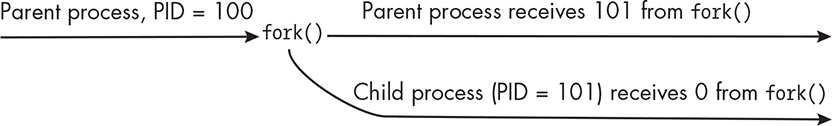
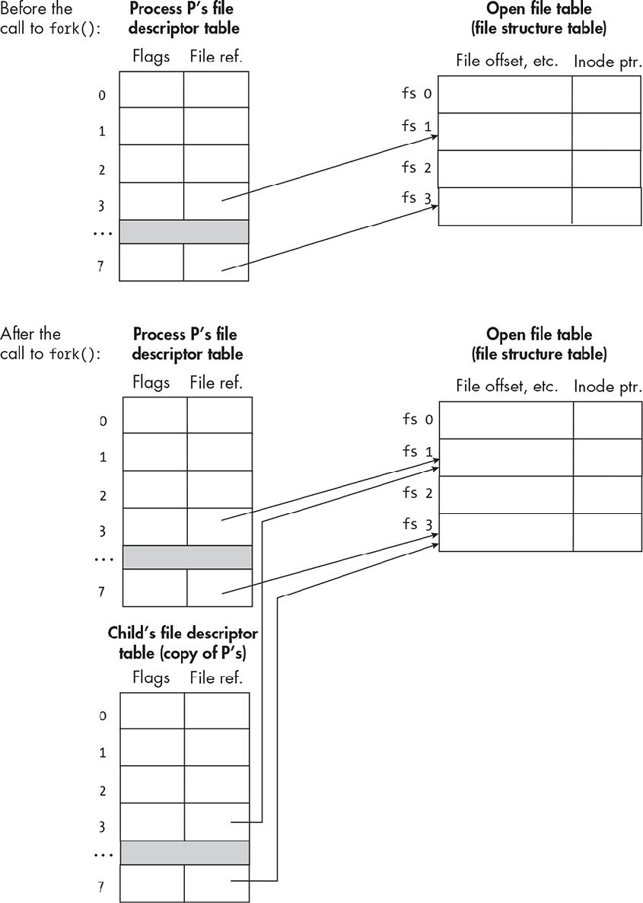
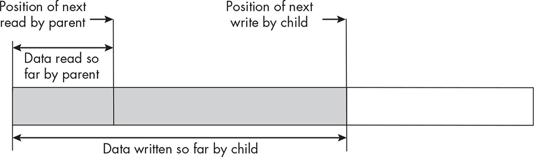
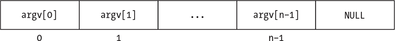
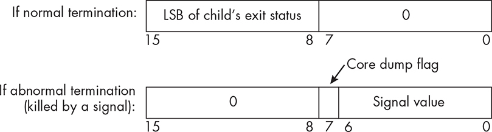
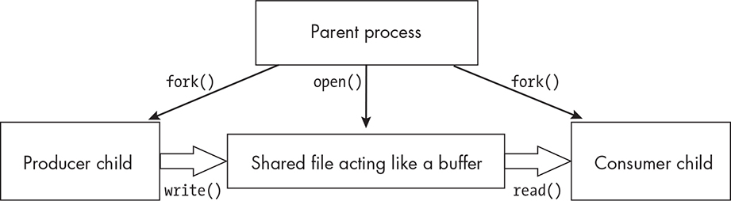

11 PROCESS CREATION AND

TERMINATION

In the previous chapter, we examined the content and structure of

various objects associated with a process, such as the executable

program file that it runs, the process descriptor by which the kernel

represents it, and its memory image, which is the set of all virtual

addresses that it can reference. These objects are static in the sense that they’re snapshots taken at a moment in the lifetime of the process, like the frames of a movie. But a process is dynamic, changing over time, and we’ve yet to explore the transformations that a process undergoes.

In this chapter, we look at this aspect of a process. Specifically, we explore how one process can create another process, how it can interact with the processes that it creates, how it can change the program that it executes, and how it can terminate itself.

The Lifetime of a Process

Before we explore the details of process creation and other operations that act on a process as a whole, let’s get a big picture of the ways in which a process can change itself or cause other processes to change

during its lifetime. We’ll concentrate on the most important system calls related to these changes.

A process comes into existence as a result of another process’s creating it. The fork() system call is the most common means of creating a new process, and it will be the first call that we examine. When a

process is created by a call to fork(), it executes the same program as its parent. This by itself is of limited use, because much of the time we

want the new process to execute some other program. A process can

change the program that it executes, along with its complete memory

image, by calling execve() or any of a small set of library functions that wrap execve() to make it easier to use in one way or another. These are sometimes called the *exec()* *family of functions*. We’ll examine how to use these functions in “Executing Programs” on page 560.

A process can terminate its execution at any time by calling either

the C Library’s exit() function or the lower level \_exit() system call.

When a process terminates itself this way, it’s said to have terminated *normal y*. When a process detects an unrecoverable error condition, it can terminate itself by calling the abort() library function; this is called *abnormal termination*. When a process is killed by a signal that it didn’t catch, this is also called abnormal termination. In “Terminating

Processes” on page 557, we’ll explore the effects of the different methods of process termination and the steps that the kernel takes when a process is terminated by any means.

Both exit() functions have an integer argument, the least significant

byte of which stores its exit status. When a process calls exit(e_status), the value stored in e_status is transmitted back to its parent process, which can access it by calling wait() or one of its variants. The wait() system call allows a parent to monitor when and how its children

terminate. After a process creates one or more children, it can call wait() to wait for their termination. It’s then suspended until some child

terminates. The combination of exit() and wait() are a simple means by which a parent can receive information about how its children

terminate. We’ll study the wait() system call and its use in “Waiting for Children” on page 569.

The fork(), execve(), \_exit(), and wait() system calls and related library functions are the four pillars of dynamic process control. They are the means by which we can create processes, change what they execute,

synchronize their actions to a limited degree, and terminate them.

Knowing how to use these four primitives is the key to writing

programs that can multitask.

Creating Processes

Many types of programs benefit from being able to create new processes as they’re running. For example, many servers are designed so that

incoming service requests can be handled independently by separate

processes. When a new request arrives, they create a new process to

service it. Programs such as shells create new processes to execute the commands that users enter, and desktop managers such as GNOME

and MATE create new processes to run various applets such as panels,

file system browsers, and power managers. Creating a new process is a

fundamental operation in Unix.

We can search the man pages for system calls that create new

processes by entering apropos -s2 -a create process. On Linux, we’ll

discover three options:

fork()

clone() and variants of it

vfork()

Of these, fork() is the most important call to understand—the clone()

function and its variants are Linux specific and not specified by any

version of POSIX, and vfork() was removed in POSIX.1-2008. The

portable way, and the original way, of creating new processes is fork().

*The Basics of fork()*

The fork() system call’s synopsis is: \#include \<sys/types.h\> \#include

\<unistd.h\> pid_t fork(void);

It has no arguments and returns a process ID, returning -1 if it fails. The man page states that “fork() creates a new process by duplicating the

calling process.” The syntax seems simple enough, as does this

description, but in fact exactly what it does is far from simple; it’s both

remarkable and initially perplexing. What’s remarkable is that the new process is an almost exact copy of the calling process (I’ll make this statement more precise shortly). What’s perplexing is what happens

after the call returns; we’ve not yet seen a function quite like fork(). Let me explain by way of an example.

When a process *p* executes the system call pid_t returnval = fork(); assuming it was successful, the kernel runs on its behalf and creates a new process *c* that is an almost identical copy of the calling process *p*.

When the system call finishes, the very next instruction to be executed in both the new process *c* and the calling process *p* is the one immediately after the call in the program! In this example, the

instruction is the assignment of the call’s return value to the variable returnval. Both processes execute this assignment, but the difference is that the value returned to the parent is the PID of the newly created

process (its child, *c*), and the value returned to the child is 0, so that they each have a different value stored in returnval.

In short, before the system call is executed, there’s a single process executing this program, but by the time the call has returned, there are two. There has been a *fork* in the stream of executed instructions, just like a fork in a road. It is almost like process mitosis. Figure 11-1

illustrates the instruction flow.

*Figure 11-1: A conceptualization of the* *fork()* *system call* The fact that the parent and child receive different return values

from fork() is the key to writing programs that call it. Because the value returned to the parent is the PID of the newly created child process,

which is never 0, but the value returned to the child is 0, immediately after the call, the program can test whether the return value is 0 or not.

If it’s 0, it’s the child executing the code, and if not, it’s the parent. The

typical coding paradigm is therefore: pid_t returnval = fork(); if ( -1 ==

returnval ) // OMITTED: Handle the error. else if ( 0 == returnval ) //

OMITTED: Code for the child to execute else // OMITTED: Code

for the parent to execute

Some people use a switch statement instead.

I’ll demonstrate with a very simple example, named *fork_demo1.c*, shown in Listing 11-1.

*fork_demo1.c*

\#include "common_hdrs.h"

int main(int argc, char \*argv\[\])

{

pid_t returnval;

if ( -1 == (returnval = fork()) )

fatal_error(errno, "fork");

else if ( 0 == returnval ) /\* Child executes this branch. \*/

printf("I am the child process. My PID is %d\n", getpid());

else /\* Parent executes this branch. \*/

printf("I am the parent process. My PID is %d\n", getpid()); return 0;

}

*Listing 11-1: A program that creates a single child process, with the parent and child each* *printing to the terminal* When we build and run this executable, we’ll see something like the following output: \$ **./fork_demo1** I am the parent process. My PID is 9386 I am the child process. My PID is 9387

The two lines might appear in a different order from one run to another because of system scheduling activity. The order in which parent and

child execute is not standardized and, on some systems, the parent

might be scheduled first, while on others, the child will be.

The fact that the parent and child print different PIDs is proof that

a new process was created by fork(). The output is also proof that the child executes the same program as the parent. The fork() man page tells us that the child process and the parent process run in separate memory spaces and that “at the time of fork() both memory spaces have the same

content.” In other words, when the child process is created, the kernel makes an exact copy of the memory space of the parent and gives that

copy to the child. The parent and child have different return values

from the call to fork(), but these values are in the kernel stack of each process. When fork() returns, they’re copied into the user-addressable memory space of each process.

*The Child’s Memory Image*

The statement that, initially, the child has an exact copy of the memory image of the parent means that all parts of the memory image are

copied, including the stack, the heap, the data segments, and so on.

They are not shared! To make this point clear, I’ve written a small

program that demonstrates it.

NOTE

*In modern Linux systems, the physical pages of the parent’s memory* *image aren’t actual y copied until the child process attempts to modify* *them. Until then, the child’s and parent’s logical pages are mapped to the* *same physical pages. This is cal ed* copy-on-write *.*

The program in Listing 11-2 declares a few variables whose storage is in different parts of the address space. It has a file-scoped globalvar, which will be in the initialized data segment; a local localvar in the runtime stack; and a local variable that will point to dynamically

allocated memory in the heap, named heapvar. Before the child is created, the parent prints the values of these variables. When the child is created, it also prints their values and subsequently modifies each of them. When it has finished, both processes print the values of these variables again.

Their final values in the child and parent will be witnesses to fork()’s behavior.

*fork_demo2.c*

\#include "common_hdrs.h"

const char str\[\] = "On the heap.";

int globalvar = 10; /\* In the initialized data segment \*/

int main(int argc, char\* argv\[\])

{

int localvar = 0; /\* A stack variable \*/

char \*heapvar; /\* A pointer that will point into the heap \*/

pid_t result, mypid; /\* For storing return value of fork() and PID \*/ if (

NULL == (heapvar = calloc(sizeof(str) + 1, 1)) )

fatal_error(errno, "calloc");

memcpy(heapvar, str, strlen(str));

heapvar\[strlen(str)\] = '\0'; /\* Heap variable now has a string. \*/

printf("This is printed by the parent process before the call"

" to fork():\npid = %d, localvar = %d, globalvar = %d, "

" heapvar = \\"%s\\" \n\n", getpid(), localvar, globalvar, heapvar); if ( -1 == (result = fork()) )

fatal_error(errno, "fork");

else if ( 0 == result ) { /\* Child executes this branch. \*/

mypid = getpid();

printf("This is printed by the child process:\n");

printf("Child PID = %d, localvar = %d, globalvar = %d, "

"heapvar = \\"%s\\"\n", mypid, localvar, globalvar, heapvar); localvar = 1; /\* Make changes to these variables. \*/

globalvar = mypid;

memset(heapvar, 'x', strlen(heapvar)); /\* heapvar = "xxx...x" \*/

printf("Child process will now assign new values to

these variables.\n\n");

}

else { /\* Parent executes this branch. \*/

mypid = getpid();

sleep(2); /\* Sleep long enough for child's output to appear first. \*/

}

/\* Both processes continue here. \*/

if ( 0 == result )

printf("Child printing:");

else

printf("Parent printing:");

printf("\nMy pid is %d. The variables "

"have the following values in my address space:\n "

"localvar = %d, globalvar = %d, heapvar = \\"%s\\" \n\n", mypid, localvar, globalvar, heapvar);

return 0;

}

*Listing 11-2: A program that shows that the child and parent do not share their data* When we build and run this program, we see the following output, of course with different PIDs each time: \$ **./fork_demo2** This is printed by the parent process before the call to fork(): pid

= 3686, localvar = 0, globalvar = 10, heapvar = "On the heap." This is printed by the child process: Child PID = 3687, localvar = 0, globalvar = 10, heapvar = "On the heap." Child process will now assign new values to these variables. Child printing: My pid is 3687. The variables have the following values in my address space: localvar = 1, globalvar = 3687, heapvar = "xxxxxxxxxxxx" Parent printing: My pid is 3686. The variables have the following values in my address space: localvar = 0, globalvar = 10, heapvar = "On the heap."

I make the parent sleep for 2 seconds so that the child’s changes and

output will appear first. The values of the three variables being tracked by the program did not change in the parent after the child modified

them. This is proof that the child and parent have separate copies of the stack, the data segments, and the heap. They do not share them.

*The Child’s Process Descriptor*

The documentation for fork() states that the new process is created by duplicating the old one. Recall from Chapter 10 that the kernel represents each process by a process descriptor. To *duplicate* a process means to make a new copy of that descriptor and to create the memory

image for the new process.

The man page also tells us that the child process is an exact copy of

the parent, except in a few specific ways. We need to understand what’s the same and what’s different to avoid some common programming

pitfalls. As mentioned earlier, the entire virtual address space of the parent is duplicated in the child. This includes all of the environment strings, stack contents, text and data segments, and data in shared

libraries that are mapped into this address space. This also includes

items such as buffers for open file and directory streams that are

allocated in the parent process’s heap.

Almost all of the parent’s process descriptor is duplicated in the child, including items such as the working and root directories, masks, controlling terminal, and so on. But some parts of the descriptor are

modified in the child. The list of differences between the parent and

child is documented in the man page. I’ll point out a few of the

differences that are relevant to what we’ve covered so far:

The child has its own unique PID, which is also different from any

active PGID.

The child’s PPID is its parent’s process PID.

The child’s set of pending signals is initially empty.

The child does not inherit any timers, including per-process timers,

from its parent.

The other significant ways in which the parent and child differ are

related to areas such as multithreading, synchronization operations of various kinds, memory mapping, and message queues.

*Sharing of Open Files*

Among the items that are copied into the child are all of the open file descriptors from the parent. Recall that each process has a table of open file descriptors and that these descriptors are pointers into the kernel’s table of open file descriptions (the file structure tables). In Chapter 4,

Figure 4-1 depicts the relationship between the open file descriptors that are part of a process and the open file descriptions maintained by the kernel. Figure 11-2 shows the effect of fork() on the open file descriptors.

*Figure 11-2: The before and after of the duplication of a process’s open file descriptor table* *in the new child process*

The file offset, in particular, is part of the open file description.

Because the child has copies of the open file descriptors, it has pointers to the same open file descriptions as the parent does in the kernel’s file structure table. This means that parent and child share the file offset in every file previously opened by the parent. When either process moves

that file offset, either by a read or write operation or by explicitly moving it with lseek(), the file offset seen by the other process is moved.

It also means that the parent and child can read data written into the file by the other. In short, parent and child can access the same file, but if they don’t do so in a coordinated (synchronized) way, unexpected

outcomes can ensue. To demonstrate this sharing of a file, consider the following program: *fork_demo3.c* \#include "common_hdrs.h" int main(int argc, char \*argv\[\]) { int fd, i; pid_t retval; if ( -1 == (fd =

open("newfile", O_CREAT \| O_WRONLY \| O_TRUNC, 0644)) )

fatal_error(errno, "open"); if ( -1 == (retval = fork()) ) fatal_error(errno,

"fork"); else if ( 0 == retval ) /\* Child executes this branch. \*/ for ( i = 0; i

\< 10; i++) { if ( 0 \>= write(fd,"c", 1) ) fatal_error(errno, "write"); usleep(300000); } else /\* Parent executes this branch. \*/ for ( i = 0; i \< 10;

i++ ) { if ( 0 \>= write(fd, "p", 1) ) fatal_error(errno, "write"); usleep(200000); } write(fd, "\0", 1); close(fd); if ( retval != 0 ) printf("File

\\"newfile\\" is ready for viewing.\n"); return 0; }

The parent process opens a file named *newfile* for writing in its current working directory. It then calls fork(). The child inherits a copy of the open file descriptor for the file and can therefore write to it, because the file access mode is part of the descriptor. Both the child and the parent write characters into the file, one at a time. The child writes *c*’s and the parent *p*’s. The calls to usleep() decrease the chance that one process will perform all of its output before the other. Both processes close the file when they finish writing.

If you look at the file that is created, it will have interspersed

characters from the parent and child: \$ **./fork_demo3** File "newfile" is ready for viewing. \$ **cat newfile** pcpcpcppcpcppcpcpccc

This shows that parent and child processes share the file offset. If they had their own private copies of it, the output of one could overwrite the other’s output. The fact that the child process has access to the same open files as the parent is going to play an important role in

interprocess communication (Chapter 13).

Listing 11-3 shows another small program with a not-so-obvious flaw. This program models the situation in which an application creates many child processes to perform subtasks, roughly the way a desktop

manager might.

*fork_demo4.c*

\#include "common_hdrs.h"

int main(int argc, char \*argv\[\])

{

pid_t newpid;

int num_children = 4;

printf("About to create many processes...\n");

while ( num_children-- \> 0 ) {

newpid = fork(); /\* Create a child process. \*/

➊ if ( newpid == 0 ) /\* If this is a new process, don't create others.\*/

break;

}

/\* Each process calls getpid() and prints it process ID. \*/

printf("Process ID = %d\n", getpid());

return 0;

}

*Listing 11-3: A program that creates a fixed number of child processes, with a subtle error* Notice that in the while loop, if the return value from fork() is 0, the process exits the loop ➊. I leave it as an exercise to predict the output when this code is removed. When you build and run this program, you’ll see output like the following: \$ **./fork_demo4** About to create many processes... Process ID = 36690 Process ID = 36691 Process ID = 36692 Process ID

= 36689

Now run it again, this time piping the output to the cat command: \$

**./fork_demo4 \| cat** About to create many processes. . Process ID =

36747 About to create many processes. . Process ID = 36748 About to

create many processes. . Process ID = 36745 About to create many

processes. . Process ID = 36749

What explains why the output is different? Here are some relevant

facts about I/O in the C Library as well as what’s shared by parent and child.

When a child process is created, its standard output descriptor

points to the same open file description as the parent’s and they

share the file offset. Therefore, all children and their parent share

the file offset.

The printf() function is part of the C I/O Library and acts on

objects of type FILE, which are called *file streams*. The C Library uses stream buffering for all operations that act on FILE streams. It uses

three different kinds of stream buffering methods:

Unbuffered streams Characters written to or read from an

unbuffered stream are transmitted individually to or from the

file as soon as possible.

Line-buffered streams Characters written to a line-buffered

stream are transmitted to the file in blocks when a newline

character is found or if certain other conditions hold. The other conditions are described in detail in Chapter 9.

Fully buffered streams Characters written to or read from a

fully buffered stream are transmitted to or from the file in blocks

of an arbitrary size, but not less than 256 bytes.

By default, streams are fully buffered. The exception is when a

stream is connected to a terminal device, in which case it is line

buffered.

The buffer used by the C Library is part of the process’s address

space because the dynamically linked libraries are mapped into that

address space. We saw that demonstrated in Chapter 10.

When fork() is called, the child gets a copy of the parent’s buffer.

Unless that buffer was flushed, it retains any characters that the

parent wrote into it since the last time it was flushed.

No C Library function is atomic. It is entirely possible that output

can be intermingled or even lost if the timing of calls by separate

processes sharing a file offset leads to this.

Now let’s put these facts together. The fork_demo4 program begins

with the instruction: printf("About to create many processes. .\n"); If output has not been redirected, then stdout points to a terminal device and is therefore line buffered. Because the string "About to create many processes ...\n" is newline terminated, it is written to the terminal immediately and removed from the buffer. When the process forks the

children, they get empty buffers and write their individual messages to the terminal. There’s a small chance that one process can overwrite the data sent by another to the terminal, but it isn’t likely when the number of processes is small, as is the case in this example. Therefore, we see the single string written by the parent, followed by the messages written by the children.

When standard output is redirected to a file or to a pipe, it no longer points to a terminal device. In this case, the library will use full buffering on the stream. The block size used for full buffering is much larger than the total size of the string written by the parent process, and therefore,

when fork() is called the buffer has not been emptied. The consequence is that the string "About to create many processes...\n" will remain in the buffers of all child processes when they are forked, and when they each call printf("Process id = %d\n", getpid());

each will output lines of the form About to create many processes. .

Process id = 36754

and roughly twice as many lines will be written to the stream as there were without redirection.

A program that creates child processes and that also has been

performing I/O using the C Library’s stream buffering has to flush the buffers before calling fork() if the output is to be the same, regardless of whether it is redirected. The fflush() library function will flush a buffer; a program can call it before calling fork(), but there’s no need to call it if the output is not redirected. Fortunately, there’s a function, isatty(), that tests whether a file descriptor refers to a terminal device: \#include

\<unistd.h\> int isatty(int fd);

We can get the file descriptor for stdout, the C Library’s output file stream, with the fileno() function. Putting this together, we can insert the lines if ( !isatty(fileno(stdout)) ); fflush(stdout);

just after the first printf(): printf("About to create many processes. .\n"); if ( !isatty(fileno(stdout)) ) fflush(stdout);

We’ll add this correction to the program in a revised version,

*fork_demo5.c*, but we also need to address the issue of possible intermingled or lost output.

*Potential Race Conditions*

The preceding program raised the prospect of potential race conditions.

A *race condition* exists in a fragment of code when the outcome of its execution depends on the order in which two or more independent

processes or threads access and/or modify data that is referenced within that code. In the preceding example, multiple child processes all try to write to the same stream without any attempt to synchronize their

writes to it. The C printf() function does not write atomically, and in principle, the output from different processes can become intermingled

on the screen. As the number of processes increases and the amount of time spent in output increases, the probability of race conditions

increases.

We can model this mathematically. Suppose that *N* identical

processes try to print to the screen using printf(). If the fraction of its time that each process spends in that printf() is *p*, then we can think of this as a *success* event in a binomial probability distribution. The probability that at least 2 processes out of *N* are executing the printf() at the exact same time is 1 minus the probability that no process is

executing it, minus the probability that exactly 1 is. This is defined by the expression: 1 – ((1 – *p*) *N* + *N* *·* *p*(1 – *p*) *N*–1) Calculating the value of this expression for *p* = 0.05 and *N* = 16, for example, the probability of a race (and hence lost output) is about 0.19. For *N* = 32, it is 0.48, and for *N* = 64, it is about 0.84. In short, as the number of processes increases, it becomes almost inevitable that lines will be lost, regardless of whether they are written to the terminal or to a file, because the race condition is independent of how the output stream is buffered.

One solution that prevents these race conditions is two-fold. First,

we use system calls instead of the library functions. Writes with write() are not buffered in user space, and, starting with the Linux 3.14 kernel, they are guaranteed to be atomic; in older kernels, updates to the file offset were not atomic. Second, we take advantage of the O_APPEND file status flag, which is described in the open() man page, which we first examined in Chapter 4. We didn’t explore this flag in that chapter because it’s needed only when multiple processes or threads try to write to the same file. When we bitwise-OR it into the flags when opening a

file, every write operation is preceded immediately and atomically by a seek to the end of the file. This guarantees that each write occurs at the end of the file, regardless of how many other processes are trying to do the same thing simultaneously.

The question is how we can set that flag on our standard output

stream, because our programs don’t explicitly open the standard streams

—they’re opened automatically when our process starts execution. The

only method of setting that we know of is in the call to open(). We need another way to set the flag. Luckily, the SEE ALSO section of the open() man

page references the fcntl() system call, whose synopsis is \#include

\<unistd.h\> \#include \<fcntl.h\> int fcntl(int fd, int cmd, . . /\* arg \*/); This call can be used for modifying a file descriptor after it’s been

opened. It returns -1 on failure. The third argument (arg) is needed for only certain values of cmd.

Using fcntl() to modify the set of flags on a file descriptor is a three-step procedure:

1\. Retrieve the existing flags into an integer variable: flags = fcntl(fd, F_GETFL);

2\. Bitwise-OR the new flag into the integer: flags = flags \|

O_APPEND;

3\. Copy the modified integer back to the descriptor: fcntl(fd,

F_SETFL, flags); /\* F_SETFL requires a third argument. \*/

Therefore, we can put standard output into atomic auto-append

mode in our program with the following code snippet: int flags; /\* Put standard output into atomic append mode. \*/ flags = fcntl(stdout,

F_GETFL); flags \|= (O_APPEND); if ( -1 ==

fcntl(STDOUT_FILENO, F_SETFL, flags) ) exit(EXIT_FAILURE);

This is the easiest method of preventing race conditions involving

output to terminals and files. It isn’t the best, though; the rest of the man page for fcntl() contains a discussion of advisory record locks,

which can be used by a process to lock all or part of a file while it is accessing it. We won’t explore record locks in this book, but we do

explore other methods of preventing race conditions in Chapters 12 and

16 and the use of fcntl() more thoroughly in Chapter 17. The program *fork_demo5.c*, with all of the preceding changes, is not shown in the book, but is available in the book’s source code distribution online.

*Process Synchronization with Signals*

Using auto-append mode on a file descriptor eliminates the race

condition when multiple processes write to the end of a file

concurrently, but it isn’t a general solution to preventing races related to the shared file offset when some processes read as well.

One situation in which this occurs is when the child and parent

processes are in a producer-consumer relationship. A *producer-consumer* paradigm is one in which there are two kinds of processes: producers

and consumers. Producer processes write data into a buffer that is read exclusively by consumer processes. Producers don’t read from the

buffer, and consumers don’t write into it. In general, there can be

multiple producers and multiple consumers, but suppose for now that

the child is the only producer and that the parent is the only consumer.

The child generates data of some kind and writes it to the shared file, which was opened in read/write mode by the parent before creating the

child process. Suppose further that the child writes data as soon as it generates it, appending to the end of the previously written data,

whereas the parent, which is the consumer, reads data starting at the

beginning of the file, in fixed-size chunks. Each process needs to move the file offset for its own purpose. Figure 11-3 depicts this situation.

*Figure 11-3: The two different positions that the shared file offset must have for parent and* *child processes*

The file is essentially a shared buffer between the child and the

parent. The child has to write its data without its being lost or

duplicated, and the parent has to read the data in the order it was

written without loss or duplication. Since they share the file offset, they cannot access the file at the same time. We can solve this problem with signals. It isn’t an efficient solution or the best in general, but it

demonstrates how signals can solve relatively simple synchronization problems. In “The waitpid() System Call” on page 574, we’ll explore a different approach that doesn’t require signals.

This solution uses the SIGUSR1 and SIGUSR2 signals. The child’s

structure in pseudocode is: Repeat Generate and write some data. Signal parent using SIGUSR1 that it's okay to read. Pause and wait for signal from parent that it's okay to write again. Until all data has been written.

Signal parent using SIGUSR2 that all data's been written, and exit.

The parent’s structure is symmetrical: Repeat Wait for a signal from the child that it's okay to read. Read the data and write to the terminal until no data is left. Signal the child that it's okay to write again, using SIGUSR1. Until the child has sent a SIGUSR2 signal. On receipt of the

SIGUSR2, read what's left in the file and exit.

Listing 11-4 contains fragments of the program mixed with pseudocode. Some error handling is omitted as well. The complete

listing is available in the book’s source code distribution.

*sync_io_demo.c*

volatile sig_atomic_t

done = FALSE;

void usr_handler(int sig)

{

if ( sig == SIGUSR2 )

done = TRUE;

}

void produce_data(int fd) /\* Child process \*/

{

char data\[\] = "abcdefghijklmnoprst:";

int pos = 0;

int count = 0;

// OMITTED: Set up signal handlers.

pid_t ppid = getppid(); /\* Get parent's PID. \*/

while ( !done ) {

➊ usleep(random() % 400000); /\* Delay a random bit to slow program. \*/

lseek(fd, pos, SEEK_SET); /\* Move to saved last position in case

parent moved file offset. \*/

if ( -1 == write(fd, data, strlen(data)) ) /\* Write more data. \*/

fatal_error(errno, "write");

pos = lseek(fd, 0, SEEK_END); /\* Save file offset. \*/

if ( ++count \< 20 ) { /\* Continue writing. \*/

kill(ppid, SIGUSR1); /\* Notify parent to keep reading. \*/

pause(); /\* Wait for signal from parent. \*/

} else {

kill(ppid, SIGUSR2); /\* Notify parent that writing is done.\*/

done = TRUE; /\* Exit loop. \*/

}

}

exit(EXIT_SUCCESS);

} int main(int argc, char \*argv\[\])

{

const int CHUNKSIZE = 8;

char buffer\[CHUNKSIZE+1\];

int pos = 0;

// OMITTED: Check usage and exit if incorrect.

int fd = open(argv\[1\], O_CREAT \| O_RDWR \| O_TRUNC, 0644 );

pid_t pid = fork();

if ( -1 == pid )

fatal_error(errno, "fork");

else if ( 0 == pid )

produce_data(fd); /\* Child produces data and writes to file. \*/

else {

// OMITTED: Install SIGUSR1 and SIGUSR2 handlers.

while ( TRUE ) {

pause();

int unread_bytes = lseek(fd, 0, SEEK_END) - pos;

lseek(fd, pos, SEEK_SET); /\* Move offset to saved position. \*/

while ( unread_bytes \>= CHUNKSIZE ) {

if ( -1 == (bytes_read = read(fd, buffer, CHUNKSIZE)) )

fatal_error(errno, "read");

if ( bytes_read != CHUNKSIZE )

fatal_error(-1, "read"); unread_bytes -= CHUNKSIZE;

buffer\[CHUNKSIZE\] = '\0';

printf("%s\n", buffer);

}

➋ if ( done ) { /\* Child exited, so read last bytes of the file. \*/

if ( -1 == read(fd, buffer, unread_bytes) )

// OMITTED: Handle error.

buffer\[unread_bytes\] = '\0'; /\* Null-terminate to print. \*/

printf("%s\n", buffer); /\* Print to terminal. \*/

close(fd); /\* Close descriptor. \*/

exit(EXIT_SUCCESS); /\* Exit. \*/

}

else {

pos = lseek(fd, 0, SEEK_CUR); /\* Save position of last read.\*/

kill(pid, SIGUSR1); /\* Signal child to produce data. \*/

}

}

}

}

*Listing 11-4: A program that synchronizes parent and child access to a shared file using* *signals* Both processes register the same signal handler, usr_handler(), which does nothing when it catches SIGUSR1 since there’s nothing for it to do, but when it catches SIGUSR2, it implies that the child sent the signal to the parent, and it sets the global atomic variable done to TRUE. When the parent reaches the test of done ➋, if the child has terminated, the parent executes the code that drains the last data in the file, prints it, and exits.

The child has an artificial delay to slow the program down ➊, and it

iterates a fixed number of times to print a small amount of data to the file. Both processes save the offset as they work because the other

process moves it to do its work. When you run this program, you’ll see the output from the parent process, eight characters per line: \$

**./sync_io_demo /tmp/newfile** abcdefgh ijklmnop rst:abcd efghijkl *--*

*snip--*

You can verify from the output that no data is lost or duplicated. You can also look at the file, folded into eight-character lines, to compare: \$

**fold -w8 /tmp/newfile** abcdefgh ijklmnop rst:abcd efghijkl *--snip--*

This example is a prelude to the topic of interprocess communication, which we cover in depth in Chapters 12, 13, and 14.

*Other Functions That Create Processes*

The original implementation of fork() was time consuming and wasteful

of memory because it duplicated the parent’s entire memory image.

Very often, after a fork(), the child process replaced the program it was executing immediately, making all of that copying needless. Because of this, 3.0BSD Unix introduced an alternative method of process creation which was named vfork(). This call was more efficient. Rather than

making a complete copy of the address space of the old process, the

vfork() call created a new process without copying the data and stack

segments of the parent and instead allowed the child process to share

these.

This saved time and memory but also raised the possibility that the

child would inadvertently corrupt the state of the parent process. It

wasn’t intended to be used to allow the child and parent to share data; on the contrary, its purpose was to avoid the extensive memory copying in the case that the child would replace its program anyway with a call to execve(), which we’ll discuss soon. The vfork() system call disappeared for a while and was reincarnated in a different form in NetBSD and

then incorporated into Linux. The call has significant problems. The

Linux man page states

Some consider the semantics of vfork() to be an architectural blemish, and the 4.2BSD man page stated: “This system call will be eliminated when proper system sharing mechanisms are implemented.”

There is also a clone() system call in Linux systems. The clone()

function, which is technically a library routine wrapping a system call, allows the child to share the address space with its parent, and also lets the programmer pass a function and arguments for the child to execute.

Terminating Processes

Most beginning C programmers use the return statement to terminate

their programs. Sometimes this is sufficient. In fact, executing the C

return statement in the main() function is equivalent to calling the exit() function if the return type is integer. If it isn’t an integer type, the value returned to the host environment (for example, bash) is undefined.

We’ve used the exit() function many times in various demonstration

programs. We did this as a way to terminate the calling process no

matter where it was in the program code in order to bail out and return an integer value when some error condition arose. But the exit()

function does much more than this. Its synopsis is: \#include \<stdlib.h\> void exit(int status);

Three actions take place when exit() is called:

1\. The process’s registered exit functions run.

2\. The system gets a chance to clean up after the process.

3\. The process gets a chance to have a status value delivered to its

parent.

An *exit function* is a function that has been registered to run when the exit() library function is called. The atexit() function is used for

registering exit functions. I’ll explain how to register exit functions shortly.

There are several reasons why we might want a function to run

when exit() is called. Imagine that when your program terminates, it has to update a log file. Suppose the function that does this is named

update_log(). Suppose also that the program is very large, that there are multiple points at which exit() is called, and that more than one

programmer is maintaining this program. If the exit() function didn’t

provide a means of invoking user-defined exit routines, then each time that anyone modified the program to insert a new call to exit(), they’d have to remember to call update_log() first. However, by registering

update_log() to run whenever exit() is called, it makes the programmer’s job easier, since they don’t have to worry about forgetting to include the call when the program is modified.

To be precise, when exit() is called, the following actions take place in the given order:

1. All functions registered to run with atexit() are run in the reverse order in which they were registered.

2\. All of the file streams opened through the Standard I/O Library

are flushed and closed.

3\. The kernel’s \_exit() function is called, passing the status argument of exit() to it.

We can register an exit function by calling atexit(). There is a

nonportable *glibc* function like it named on_exit() as well, but we’re discouraged from using it. The atexit(3) man page explains how to

register exit functions. Its synopsis is: \#include \<stdlib.h\> int atexit(void (\*function)(void));

It’s given the name of a function with a void return type and no

arguments and returns 0 on success. For example: void paythebill() {

printf("I'll pay the bill before I leave.\n"); } if ( 0 != atexit(paythebill) ) //

OMITTED: Handle not being able to register paythebill().

Child processes inherit the exit functions registered by the parent when fork() created them.

If more than one function is registered, they’re run in the reverse of the order in which they were registered (in other words, in last-in-first-out order). After the registered functions run, the exit() function flushes the streams and closes the files. The exit() function then calls \_exit(), passing it whatever argument it received from the calling process. The kernel’s \_exit() function does the following:

1\. Closes any open file descriptors, not just those opened through

Standard I/O Library functions

2\. Releases all memory belonging to the process

3\. Makes init the parent of all children of the exiting process

4\. Makes the low-order 8 bits of the integer argument to exit(), called its *exit status*, available to the parent process (I’ll discuss how the parent can retrieve this exit status in “Waiting for Children” on

page 569)

5. Under normal circumstances, which I’ll explain in “Waiting for Children,” generates a SIGCHLD signal to be sent to the parent

process

ORPHAN PROCESSES

When a process with one or more children terminates, whether by

calling an exit function or by receiving a terminating signal, any

children that survive it are called *orphans*. A keyboard signal such as CTRL-C will kill child processes that share the controlling

terminal with their parent if they don’t have a handler for it, but if we send a SIGINT to the parent by using kill, those children aren’t

terminated and become orphans. The actions taken in \_exit()

ensure that children orphaned when their parent terminates are

adopted by init.

Let’s look at a simple example that shows how to use exit functions.

The program in Listing 11-5 registers four functions prior to exiting by executing its return statement.

*atexit_demo.c*

void lockingup(void)

{

printf("Locking up. Goodbye.\n");

}

void mopper(void)

{

printf("Mopping the floors.\n");

}

void sweeper(void)

{

printf("Sweeping the floor and wiping down counters.\n");

}

void supervisor(void)

{

printf("Time to clean up.\n");

}

int main(void)

{

long max_exit_functions = sysconf(\_SC_ATEXIT_MAX);

printf("The maximum number of exit functions is %ld\n",

max_exit_functions);

if ( (atexit(lockingup)) != 0 )

fatal_error(errno, "cannot set exit function\n");

if ( (atexit(mopper)) != 0 )

fatal_error(errno, "cannot set exit function\n");

if ( (atexit(sweeper)) != 0 )

fatal_error(errno, "cannot set exit function\n");

if ( (atexit(supervisor)) != 0 ) fatal_error(errno, "cannot set exit function\n");

return EXIT_SUCCESS; /\* return invokes exit(). \*/

}

*Listing 11-5: A program that registers a few exit functions and then returns* When we build the executable and run it, we’ll see that the order of execution of the functions is opposite to the order in which they were registered: \$ **./atexit_demo** The maximum number of exit functions is 2147483647 Time to clean up. Sweeping the floor and wiping down counters.

Mopping the floors. Locking up. Goodbye.

Process termination plays an important role in programming when

we start to write programs that create other processes. When a process that we’ve created terminates, we need to make sure we’ve cleaned up

after it so that we don’t hold onto unneeded resources. We’ll also see that when we do it the right way, it’s a chance for the parent process to be notified of the reason that its child terminated. That’s the subject of

“Waiting for Children” on page 569.

Executing Programs

Typically, when a process calls fork(), it’s so that the new process can execute a different program. If there were no way for the new process to do that, then every process in the system would be executing the same

program! In “The Lifetime of a Process” on page 540, I mentioned that execve() is the system call that a process calls to change the program that it executes. We could also discover this via a man page search: \$ **apropos**

**-s2 -a execute program** execve (2) - execute program execveat (2) -

execute program relative to a directory file descriptor

The execve() system call, as well as each of a set of library functions collectively known as the exec() functions, provides the means for a

process to change the program that it’s executing as well as its entire memory image. Although there are several different library functions in this exec() family, they have one thing in common—they change the

program that the calling process executes to a program identified in

their argument list. They differ in the way that the program and its

arguments are passed to them. We’ll first look at the system call and

then at the various library functions built on top of it.

*The execve() System Call*

The man page synopsis for execve() is: \#include \<unistd.h\> int

execve(const char \*pathname, char \*const argv\[\], char \*const envp\[\]);

The execve() system call replaces the program being executed by the

calling process with the program whose pathname is its first argument.

The filename must be a binary executable or a script whose first line is:

\#! interpreter \[optional-arg\]

The filename must be the absolute or relative pathname of the

program, since execve() does not use the PATH environment variable to

search for the directory containing that filename. The second and third arguments are NULL-terminated arrays of arguments and environment

strings, respectively. In other words, each is an array of strings followed by a NULL pointer, such as was depicted in Figure 2-4 in Chapter 2. For convenience, the argv\[\] parameter is shown in Figure 11-4.

*Figure 11-4: The* *argv* *array passed to* *execve()* The environment strings are expected to be in the proper format,

meaning each is of the form *key*= *value*.

The execve() system call is so-named because arrays are also called

*vectors*; the *ve* part of the name is a reminder that execve expects vectors for its second and third arguments. (The original implementation

referred to argv\[0\], argv\[1\], ..., 0 as a vector.) The execve() function passes these vectors to the program to be executed, which will be able to access them in its own argument list: int main(int argc, char \*argv\[\], char

\*\*envp)

Since all programs expect the program name in argv\[0\] and their first

argument in argv\[1\], it’s important that our programs arrange the

argument list to satisfy this condition before they call execve(). The examples that follow shortly will demonstrate.

Remember that the process itself is not being replaced, just what it

executes. In particular, the call to execve() causes the program currently run by the process to be replaced by the given program. That program

is in a new text segment, with a new stack, heap, initialized data

segment, and uninitialized data segment. Since the same process

continues to execute the new program, almost all of its attributes remain the same. For example, all of its identifiers, such as its PID, PPID, and so on, are preserved. Particularly important is that the process’s control terminal stays the same; open file descriptors remain open after the call, with a few exceptions; and the working directory is preserved. We’ll see why this is important in Chapter 13.

The execve() man page has a complete list of what is and is not

preserved in the process descriptor, and Chapter 10 contains a summary as well. Some key points to remember are:

Signal dispositions are reset to their defaults if they had handlers.

Pending signals are preserved.

Masks such as the umask and signal mask are preserved.

Open directory streams are closed.

Time remaining on alarm clocks is preserved.

Interval timers are preserved but POSIX timers (those created by

timer_create()) are not.

Exit functions are not preserved.

The locale is set to the default C locale.

A successful call to execve() does not return. If it does return,

something went wrong; the program that was supposed to be executed

never ran, and execve() returns -1. For example, given this code

execve("myprog", argv, envp); printf("If you're seeing this, myprog did not run.\n");

printf() can be executed only if execve() returned. There’s no need to check its return value since it must be -1, but the error code in errno will indicate what went wrong.

We’ll begin our exploration with a trivial example named

*execve_demo1.c* that shows the mechanics of calling execve(). After that, we’ll look at a program designed to provide some insight into more

general ways to invoke it. After these two programs, we’ll look at how to use the different library wrappers for execve().

The following program hardcodes the name of the executable to

run, */bin/date*, into the call to execve() so that it always runs the date command and passes its command line arguments to date:

*execve_demo1.c* \#include "common_hdrs.h" int main(int argc, char

\*argv\[\], char \*envp\[\]) { if ( argc \< 2 ) usage_error("execve_demo1 \<words to display\>\n"); argv\[0\] = "date"; execve("/bin/date", argv, envp); fatal_error(errno, "execve"); /\* If we reach here, it's bad news! \*/ }

The program replaces the contents of argv\[0\] with date because the

*/bin/date* program should be given its own name, not the name

*execve_demo1*. If the date program finds an error in its usage, it will use the name in its argv\[0\] string in its usage message. When we run it \$

**./execve_demo1 -d tomorrow +"Tomorrow is %A."** Tomorrow is Tuesday.

we see that the program just runs the date command with the arguments

that it’s given. Try changing argv\[0\] to some other string and running the program with invalid options; you’ll see how argv\[0\] is used.

The second program, *execve_demo2.c*, is in Listing 11-6. It runs the program specified as its first command line argument, passing it the

remaining command line arguments. The program is designed to

demonstrate a few ideas about the use of execve().

*execve_demo2.c*

\#define \_GNU_SOURCE /\* For basename() \*/

\#include "common_hdrs.h"

int main(int argc, char \*argv\[\])

{

if ( argc \< 2 )

usage_error("execve_demo1: program-to-execute \[arguments\]"); char \*new_env\[\] = {"AUTHOR=stewart", "CHAPTER=Process Creation", NULL}; char \*path = strdup(argv\[1\]);

argv\[1\] = basename(argv\[1\]);

printf("Program being executed is %s.\n", argv\[1\]);

execve(path, argv+1, new_env);

fatal_error(errno, "execve() failed to run.\n");

}

*Listing 11-6: A program that calls* *execve(), with its first argument as the program to* *execute* First, this demonstrates that the environment vector passed to execve() can be any NULL-terminated array of strings in the proper form, not just the process’s current environment. In this program, it replaces it completely with an environment consisting of two environment strings.

Second, the argument vector passed to execve() in its second

argument is the set of words after the program name from the

command line, which is pointed to by argv+1. The first word to be

passed, argv\[1\], is the pathname of the actual program file to be executed.

Although execve() must be given the path to the executable file as its first argument, the entire pathname shouldn’t be the first word in the

argument vector passed to it; in fact, many commands expect it to be

just the base name of the file. For this reason, argv\[1\] is first copied into a second variable, path, and then it’s stripped of the leading directories by a call to basename(). The copy, path, is passed to execve() as the program to execute.

You can run this program by passing the pathname to any executable

file and the arguments for that file, as in: \$ **./execve_demo2 /bin/echo** **Hello World** Program being executed is /bin/echo. Hello World

That file does not have to be a binary. For example, we can pass it the name of a shell script. The file *simplescript.sh* has two lines \#!/bin/bash

/usr/bin/echo "Hello World"

and because it’s an executable file, we can pass it to execve_demo1 to execute \$ **./execve_demo2 simplescript.sh** Program being executed is simplescript.sh. Hello World

showing that as long as the first line is that of an interpreter that can execute the rest of the file, execve() can run it.

The program in Listing 11-7, will be useful for showing how the various exec functions behave. It displays its argument vector and

environment strings and does nothing else.

*print_args_env.c*

\#include \<stdio.h\>

extern char \*\*environ;

int main(int argc, char \*argv\[\])

{

for ( int i = 0; argv\[i\] != NULL; i++ )

printf("argv\[%d\] = %s\n", i, argv\[i\]);

char \*\*envp = environ;

while ( NULL != \*envp) {

printf("%s\n", \*envp );

envp++;

}

return 0;

}

*Listing 11-7: A program that prints its arguments and environment strings* Let’s suppose that the executable is installed in the */opt* directory so that we have to pass /opt/print_args_env

to execve() to execute it. When we pass this program’s pathname and a few arguments to execve_demo1, the output verifies that the environment was replaced: \$ **./execve_demo2**

**/opt/print_args_env This too shall pass.** Program being executed is /opt/print_args_env.

argv\[0\] = print_args_env argv\[1\] = This argv\[2\] = too argv\[3\] = shall argv\[4\] = pass.

AUTHOR=stewart CHAPTER=Process Creation

Notice that the externally defined environ variable is pointing to the environment constructed in execve_demo1 prior to calling execve(). This variable is initialized by execve() so that the process has access to the new environment when it runs the specified program.

*The exec() Library Functions*

Shortly after the first version of Unix was released, the Unix library was extended to include a family of six functions layered on top of execve(), mostly to give programmers alternative ways to obtain its functionality.

This family of functions is collectively called the exec() family. The differences among the functions are:

Whether a pathname must be supplied to the function or a

filename without any slashes can be given to it, in which case it

searches for the file in the directories given in the PATH environment variable

Whether the arguments are supplied as a NULL-terminated vector of

strings or as a NULL-terminated list of strings

Whether the environment for the new process image is passed by

the calling process in a third argument envp or is instead taken from

the external environ variable from the caller

The functions share a single man page, whose SYNOPSIS follows:

\#include \<unistd.h\> extern char \*\*environ; int execl(const char

\*pathname, const char \*arg, . . /\* (char \*) NULL \*/); int execlp(const char \*file, const char \*arg, . . /\* (char \*) NULL \*/); int execle(const char

\*pathname, const char \*arg, . . /\* (char \*) NULL, char \*const envp\[\] \*/); int execv(const char \*pathname, char \*const argv\[\]); int execvp(const

char \*file, char \*const argv\[\]); ➊ int execvpe(const char \*file, char \*const argv\[\], char \*const envp\[\]);

Each of these contains either an *l* or a *v* in its name. The versions that contain an *l*—execl(), execlp(), and execle()—expect a NULL-terminated *list* of NULL-terminated string arguments, whereas the versions that contain a *v*—execv(), execvp(), and execvpe()—expect an array of NULL-terminated string arguments. The execvpe() function ➊ is a GNU extension, not

necessarily available in POSIX-conforming distributions, and you need

to define \_GNU_SOURCE to use it.

The functions are also distinguished by whether or not they contain

a *p* in their names. The versions that don’t contain a *p* in their names—

execl(), execle(), and execv()—require that the first argument is either an absolute pathname or a relative pathname to the executable program

file. The versions that do contain a *p*—execlp() and execvp()—don’t require a pathname to the executable program file; if the filename

contains no slashes, they use the PATH environment variable to search for the file. If the environment doesn’t contain a PATH variable, they search a standard sequence of directories, which is system dependent. Table 11-1

summarizes the different functions based on these categories.

Table 11-1: The exec Family of Functions

Function

Executable’s

Argument

name

specification

specification

Environment

execl()

Pathname

List

Caller’s environ

variable

execlp()

Filename

List

Caller’s environ

variable

execle()

Pathname

List

envp argument

execv()

Pathname

Array

Caller’s environ

variable

execvp()

Filename

Array

Caller’s environ

variable

execvpe()

Filename

Array

envp argument

If our program calls one of the functions that expects an array for the second argument, it should arrange for argv\[0\] to be the name of the executable file. If it calls a function that expects a list after the

executable’s name, it should arrange for the first list element to be the name of the executable.

The advantage of the functions expecting a list is that the calling

program doesn’t need to construct a vector to pass as an argument,

which takes extra steps. The major disadvantage of these list-expecting functions is that we can only use them if we know at compile time

exactly how many arguments the executable needs. To make this clear,

suppose that we’d like to call execl() to execute */bin/ls* on the directories that we pass on the command line. Suppose our program is named do_ls

and we can call it with an unpredictable number of arguments, such as: \$ **./do_ls dir1 dir2 dir3 \> /dev/null** \$ **./do_ls dir1 dir2 dir3**

**dir4 dir5 \> /dev/null**

What should the call to execl() look like in *do_ls.c*? For the first call, it can be execl("/bin/ls", "ls", argv\[1\], argv\[2\], argv\[3\], (char\*) NULL); but for the second, it needs to be: execl("/bin/ls", "ls", argv\[1\], argv\[2\], argv\[3\], argv\[4\], (char\*) NULL);

There’s no easy way to use this function if we don’t know how many

arguments it needs at the time we write the program. The vector-

expecting functions don’t pose this problem, since we can pass an entire vector by its address. Therefore, in the example programs that follow, which are designed to show the differences between how you call the

various functions, I’ve assumed a fixed number of arguments. In

practice, we wouldn’t code like this!

Each of the following programs demonstrates how to use one of

these library functions to run a command given as its first command line argument, expecting at least three words after the command name. If

the number of arguments is fewer than three, it exits. I give examples of each of execl(), execlp(), and execle(), but not of execv() or execvpe(), since the first is essentially like execve() without the last parameter, and the second is like a combination of execvp() and execve(). I’ll start with an example of the use of execl(), in Listing 11-8.

*execl_demo.c*

\#define \_GNU_SOURCE

\#include "common_hdrs.h"

int main(int argc, char \*argv\[\])

{

if ( argc \< 5 )

usage_error("execl_demo command arg1 arg2 arg3\n");

char \*path = strdup(argv\[1\]);

char \*filename = basename(path);

execl(argv\[1\], filename, argv\[2\], argv\[3\], argv\[4\], (char \*) NULL);

fatal_error(errno, "execl");

}

*Listing 11-8: A program using* *execl()* *to run a given command on its argument list,* *consisting of three words* Notice that the command line options have to be passed as separate words in the list. This program checks that there are at least five words on its command line; it ignores extras if there are any.

When we pass /opt/print_args_env a b c to this program, the output is: \$ **./execl_demo /opt/print_args_env a b c** argv\[0\] = print_args_env argv\[1\] = a argv\[2\] = b argv\[3\] = c SHELL=/bin/bash

COLORTERM=truecolor LANGUAGE=en_US

The program in Listing 11-9 uses execlp() instead. The only difference is that it doesn’t need a pathname; we can pass print_args_env on the command line and the program finds its location.

*execlp_demo.c*

\#include "common_hdrs.h"

int main(int argc, char \*argv\[\])

{

char \*p;

if ( argc \< 5 ) usage_error("execl_demo command arg1 arg2 arg3\n"); if ( NULL == (p = strrchr(argv\[1\], '/')) ) /\* No '/' in name \*/

execlp(argv\[1\], argv\[1\], argv\[2\], argv\[3\], argv\[4\], (char \*) NULL);

else /\* Pass the string after the '/'. \*/

execlp(argv\[1\], p+1, argv\[2\], argv\[3\], argv\[4\], (char \*) NULL);

fatal_error(errno, "execlp");

}

*Listing 11-9: A program using* *execlp()* *to run a given command on its argument list,* *consisting of three words* If the user passes a pathname instead of a filename, the program needs to pass only the portion of that pathname after the last */* character. It could call basename(), but calling strchr() avoids allocating memory for basename(), which can alter its argument. Running this instead of execlp_demo, we see: \$ **./execlp_demo** **print_args_env a b c** argv\[0\] = print_args_env argv\[1\] = a argv\[2\] = b argv\[3\] = c SHELL=/bin/bash COLORTERM=truecolor LANGUAGE=en_US

The execle() function is like execve() except that it expects a list

instead of a vector. In Listing 11-10, we get a chance to pass it an environment in its last parameter.

*execle_demo.c*

\#define \_GNU_SOURCE

\#include "common_hdrs.h"

int main (int argc, char \*argv\[\])

{

if ( argc \< 5 )

usage_error("execl_demo command arg1 arg2 arg3\n");

char \*new_env\[\] = {"AUTHOR=stewart", "CHAPTER=Process Creation", NULL}; char \*path = strdup(argv\[1\]);

char \*file = basename(path);

execle(argv\[1\], file, argv\[2\], argv\[3\], argv\[4\], (char\*) NULL, new_env); fatal_error(errno, "execve() failed to run.\n");

}

*Listing 11-10: A program using* *execle()* *to run a given command on its argument list,* *consisting of three words* Running this program on the same arguments as the previous two, we see: \$ **./execle_demo /opt/print_args_env a b c** argv\[0\] = print_args_env argv\[1\] = a argv\[2\] = b argv\[3\] = c AUTHOR=stewart CHAPTER=Process Creation

The last library function that I will include here is execvp(), shown in

Listing 11-11. It is like execve() except that it uses the caller’s environ variable and it does not need a pathname.

*execvp_demo.c*

\#define \_GNU_SOURCE

\#include "common_hdrs.h"

int main(int argc, char \*argv\[\])

{

char \*p;

if ( argc \< 5 )

usage_error("execvp_demo command arg1 arg2 arg3\n");

if ( NULL == (p = strrchr(argv\[1\], '/')) )

execvp(argv\[1\], argv+1);

else {

argv\[1\]= p+1;

execvp(argv\[1\], argv+1);

}

fatal_error(errno, "execvlp");

}

*Listing 11-11: A program using* *execvp()* *to run a given command on its argument list,* *consisting of three words* If you run this program with the same command line as the previous exec programs, you’ll see that the output is exactly the same as the output of execlp_demo.

Waiting for Children

When a parent process creates one or more child processes, it usually

needs to know when they completed the tasks they were delegated and

whether they exited normally or encountered errors or other abnormal

conditions that prevented their completing them successfully. A parent process is also supposed to assist the kernel in releasing resources held by its child processes when they terminate. The wait() system call and its relatives serve this purpose; they complete the quartet of system calls related to process control—fork(), exec(), exit(), and now, wait().

Although in “The Lifetime of a Process” on page 540 I mentioned the wait() system call, if we didn’t know about it, we’d discover it through a man page search such as: \$ **apropos -s2,3 -a child process** *--snip-*

*-* wait (3posix) - wait for a child process to stop or terminate *--snip--*

This page is the POSIX specification of the wait() system call, not the Linux page for it. There’s a separate Section 2 man page for wait() as well.

Since Linux 2.6, the Linux version has conformed to the POSIX

requirements; let’s look at the Linux wait(2) man page first. That page’s SYNOPSIS is: \#include \<sys/types.h\> \#include \<sys/wait.h\> pid_t wait(int

\*status); pid_t waitpid(pid_t pid, int \*status, int options); int

waitid(idtype_t idtype, id_t id, siginfo_t \*infop, int options);

The status parameter in wait() and waitpid() is the address of an integer variable in which to store the terminated child’s exit status. If the parent doesn’t care about that status, it can pass NULL as an argument instead.

These two calls suspend the calling process until a child terminates.

Termination is a state change, but not the only one. When a process is stopped by a signal or resumed by one, these are also state changes. The third system call, waitid(), is more general than the others because it allows a parent to wait for any of these state changes in a child.

*The wait() and waitpid() System Calls*

The wait() and waitpid() system calls serve a few purposes:

To allow a parent process to block itself until a child has

terminated.

To allow a parent process to collect, or *reap*, the status of a child that has terminated.

To allow the kernel to release the resources associated with the

child process. If a parent does not perform a wait of one kind or

another, the kernel must retain certain information and resources

for that child, and the terminated child remains in a *zombie* state.

ABOUT ZOMBIE PROCESSES AND WAITS

A child that has terminated but hasn’t been waited for is called a

*zombie* in Unix. The kernel can’t release all of the resources held by this zombie process in case its parent performs a wait for it

later. In particular, it preserves, at the very least, its slot in the kernel’s process table, its PID, termination status, and resource

usage information. As long as a zombie is not removed from the system by a wait operation, it occupies this slot. If the table fills, the kernel won’t be able to create new processes. Processes such as

continuously running servers that create child processes can

quickly cause this problem if they don’t reap their children. If a

parent process terminates, its zombie children are adopted by init,

which eventually performs a wait to remove the zombies. By

calling one of the wait functions, parent processes tell the kernel

that it can release these resources.

To facilitate the description of these system calls, the Unix and

POSIX documentation define a child process that has terminated to be

*waitable* if its parent has not yet waited for it.

The wait() System Call

I’ll begin by discussing the simpler of these two calls: wait(). When a process calls wait(), if it has no waitable children, it’s blocked until *any* *one* of its children terminates. If it has one or more waitable children, it isn’t blocked and the call returns immediately. The return value of a

successful wait() is the PID of some child that terminated, whether it’s one of the waitable ones or one that terminated after the call. It doesn’t matter which child terminated; the call returns if any child did. If a process calls wait() but has no unwaitedfor children, this is an error; wait() returns -1 immediately and sets errno to ECHILD. Note that waitable children are unwaited-for children.

In the simple case of a process creating a single child and waiting for it, the typical way to use wait() is of the form: int child_status, exit_value; pid_t child_pid, result; if ( -1 == (result = fork()) ) fatal_error(errno,

"fork"); else if ( 0 == result ) { /\* Child does stuff here. \*/ exit(exit_value);

} else { /\* Parent waits for child. \*/ if ( (child_pid = wait(&child_status))

== -1 ) if ( ECHILD != errno ) fatal_error(errno, "wait"); /\* Error in wait() \*/ /\* Parent does stuff using child's pid and exit status. \*/ }

When a process has created multiple children, it’s a bit different. In order to wait for all of them, it needs to put the call to wait() in a loop.

Since wait() sets errno to ECHILD when a process has no unwaited-for children, we can make that the stopping condition of the loop, as shown in Listing 11-12.

*wait_demo1.c*

\#include "common_hdrs.h"

\#include \<sys/wait.h\>

int main(int argc, char \*argv\[\])

{

pid_t pid;

int i, num_children = 4;

for ( i = 0; i \< num_children; i++ ) {

switch ( fork() ) {

case -1: fatal_error(errno, "fork"); /\* Error in fork() \*/

case 0:

sleep(2); /\* Children sleep and then exit. \*/

exit(i);

default:

break; /\* Parent just waits for children. \*/

}

}

while ( (pid = wait(NULL)) != -1 ) /\* Ignore exit status. \*/

printf("Child %d terminated.\n", pid);

if ( ECHILD != errno )

fatal_error(errno, "wait");

exit(EXIT_SUCCESS); /\* If we reach here, we waited for all children. \*/

}

*Listing 11-12: A program that creates multiple child processes and waits for all of them* The parent process in *wait_demo1.c*, ignores the exit status of its terminating children by passing NULL to wait(). The loop iterates until wait() returns -1 and ECHILD == errno.

Let’s focus on the status parameter of wait() and waitpid(). When a

child calls any of the exit() family of functions, passing an integer exit status, or if it executes a return statement from its main() function and passes an integer to it, the kernel arranges for the least significant byte (LSB) of that value to be collectible by the parent process through a call

to any of the wait() family of system calls. In a call such as wait(&status), the parameter (status) is the address of an int variable that receives information about how the child terminated. POSIX doesn’t specify

how this variable is structured, but the traditional layout, which is the one currently used by Linux, is visualized in Figure 11-5.

*Figure 11-5: A traditional arrangement of bits of the status available from the call* *wait(&status)*

If the child terminated normally by calling exit(), then the second

byte (bits 8 through 15) of status contains the low-order byte of the

value the child passed to the exit() call, and the low-order byte of status is 0. If the child terminated abnormally because of an unhandled signal, the low-order seven bits of status contain the signal value. If the child was terminated by a signal that caused a core dump, then bit 7 is set.

NOTE

*The fact that a core dump is supposed to occur does not mean that there* *wil be a core file in your working directory. If the system administrator* *has disabled them for al users or if your shel limits them, then it won’t* *exist.*

Because the exact layout is system dependent, code based on this layout may not be portable. Instead, we’re encouraged to use the macros

specifically designed for this purpose, which are described in the wait(2)

man page and specified in POSIX.1-2024. In these macros, status_val is the actual integer pointed to by the status parameter; it isn’t its address.

**WIFEXITED(status_val)** Evaluates to nonzero if the child exited normally

**WEXITSTATUS(status_val)** If the value of WIFEXITED(status_val) is nonzero, evaluates to the low-order 8 bits of the argument that the child

passed to exit() or \_exit(), or the value that it returned from main() **WIFSIGNALED(status_val)** Evaluates to nonzero if the child was

terminated by a signal

**WTERMSIG(status_val)** The number of the signal that terminated the child, but only if WIFSIGNALED(status_val) is nonzero

**WCOREDUMP(status_val)** If WIFSIGNALED(status_val) is nonzero, evaluates to nonzero if the signal caused a core dump

Note that systems that aren’t POSIX compliant may not support these

macros; if you want to make your program portable, you’ll need featuretest macros in your code.

Let’s take a look at an example program that puts all of these macros

to use. The program *wait_demo2.c*, shown in Listing 11-13, creates a single child process and waits for its termination.

*wait_demo2.c*

\#include "common_hdrs.h"

\#include \<sys/wait.h\>

int main(int argc, char \*argv\[\])

{

pid_t pid;

int status;

switch ( fork() ) {

case -1:

fatal_error(errno, "fork");

case 0:

if ( argc == 1 ) {

printf("Child PID = %d\n", getpid());

pause(); /\* Wait for signal. \*/

}

exit(atoi(argv\[1\])); /\* No error-checking here! \*/

default:

if ( (pid = wait(&status)) != -1 ) {

printf("Child %d terminated ", pid); if ( WIFEXITED(status) ) printf("with exit status %d.\n", WEXITSTATUS(status));

else if ( WIFSIGNALED(status) ) {

printf("as a result of signal %d", WTERMSIG(status));

if ( WCOREDUMP(status) )

printf(" and a core dump took place");

printf(".\n");

}

}

else if ( ECHILD != errno )

fatal_error(errno, "wait");

exit(EXIT_SUCCESS);

}

}

*Listing 11-13: A program that shows how to use the status-checking macros* If the program is run with an integer command line argument, that argument is used as the argument to exit() in the child. If you run it without a command line argument, the child process prints its PID so that you can send it a signal. It will remain suspended in this case until it receives a terminating signal. The parent waits for the child and uses the macros to check the child’s termination status. Here are a few runs of the program: \$ **./wait_demo2 32** Child 17176

terminated with exit status 32. \$ **./wait_demo2 356** Child 17193 terminated with exit status 100. \$ **./wait_demo2** Child PID = 17238 \# From a second terminal, issue "kill -1 17238

Child 17238 terminated as a result of signal 1. \$ **./wait_demo2** Child PID = 18175 Child 18175 terminated as a result of signal 3 and a core dump took place.

The first run causes the parent to display the child’s normal termination exit status, the number entered as the command line argument. The

second run shows that only the low-order byte is taken as its exit status, since 356 = 256 + 100. The next two runs show that the parent detects

that the child was killed by a signal, one causing a core dump and the other not.

The waitpid() System Call

One problem with wait() is that if a process has multiple children, wait() can’t be used to wait for a specific child. Another problem is that if no children have terminated when the parent calls it, the parent blocks

until some child terminates. Sometimes it would be better if the parent could call it and return immediately if no child exited yet. A third

problem is that wait() can’t be used to detect when a child process has been stopped by a signal, such as SIGSTOP.

The waitpid() call addresses all of these deficiencies. It has three

parameters: pid_t waitpid(pid_t pid, int \*wstatus, int options);

The first parameter specifies the set of child processes for which the calling process should wait:

**pid \> 0** Wait for the child with PID = pid.

**pid = 0** Wait for only those children in the same process group as the parent.

**pid = -1** Wait for any child, like wait().

**pid \< -1** Wait for any child whose process group ID is equal to the absolute value of pid.

In this sense it is a generalization of wait(), since the call pid_t child_pid

= wait(&child_status);

is equivalent to: pid_t child_pid = waitpid(-1, &child_status, 0); The second parameter in waitpid() serves the exact same purpose as it

does in wait(). The third (options) is a bitwise-OR of zero or more of the following flags:

**WNOHANG** When set, the process returns immediately if no child has exited yet.

**WUNTRACED** When set, in addition to returning if a child terminates, the process also returns when a child has stopped.

**WCONTINUED** When set, since Linux 2.6.10, the call also returns if a child is resumed by receiving a SIGCONT signal.

These enhancements make it possible to track children in a more precise way. Being able to wait for a specific child allows the parent to take different actions depending on which child finished. This feature is needed when different functions within a process must wait for different children to terminate. Being able to return immediately if no children have terminated makes it possible for the parent to periodically check for termination of children inside a loop and continue to perform other work. The ability to detect whether a child has been stopped or

restarted is mostly useful for job control, as when a user suspends and resumes processes from the keyboard. In this case, a parent process,

such as a shell that has spawned multiple children, can detect when any of these have changed state.

The next program demonstrates some of the functionality of

waitpid() that wait() lacks. It models the producer-consumer problem that I described earlier in “Process Synchronization with Signals” on page

553. In the *sync_io \_demo.c* program in that section, the child and parent processes played the role of the producer and consumer, respectively.

Here, the program will create two children that will act as the producer and the consumer, and the parent process will monitor their behavior.

The producer will write text to a shared file, and the consumer will read text from that file and convert it to uppercase before printing it.

The structure of this program is similar to the way in which a shell

sets up the execution of a two-step pipelined command such as: sort

myfile \| cut -d, -f1

A shell such as bash creates two child processes: one to run the left-

hand side command (sort) and the other to run the right-hand side (cut).

The shell itself is their parent, and it’s able to monitor the two child processes in the same way that this program will. Figure 11-6 depicts this program structure.

*Figure 11-6: The structure of the producer-consumer program in which the main program* *forks two children that act as producer and consumer*

The significance of this exercise is not in the actions of the child

processes, but in how the parent process utilizes waitpid() to detect state changes in the children as they’re running. Additionally, it presents

another way for two processes that share an open file descriptor to read and write that open file without a race condition.

To simplify its design and to show why being able to wait for a

specific process is useful, the program is designed to detect whether the producer process stopped or terminated before it checks on the

consumer child. If it detects any state change in the producer, it prints a message to the terminal, but if the producer terminated, it stops

monitoring the producer and starts to monitor the consumer. It could

be modified so that if the producer stopped, the parent would send a

signal to the consumer to stop as well and to resume only when the

producer continues. We could also modify it so that when the producer

terminates, the parent would automatically terminate the consumer.

This version, for the sake of simplicity, does neither.

The basic logic of the main program in pseudocode is as follows:

Open a temporary file for reading and writing. Create the producer

(PID = pid\[0\]) and consumer (PID = pid\[1\]) processes. Repeat the

following instructions until the producer terminates: { Call

waitpid(pid\[0\], . ., WNOHANG) to check on state changes in the

producer without blocking; If the producer's state changed, Print a

message to the terminal indicating the state change, and If it terminated, Break out of this loop. Simulate doing other work by sleeping a bit. }

Repeat the following instructions until the consumer terminates: { Call waitpid(pid\[1\], . ., WNOHANG) to check on state changes in the

consumer without blocking; If the consumer's state changed, Print a

message to the terminal indicating the state change, and If it terminated, Break out of this loop, close the file, and terminate. Simulate doing

other work by sleeping a bit. }

The call to waitpid() becomes: retval = waitpid(pid\[i\], &status,

WUNTRACED \| WCONTINUED \| WNOHANG)

It will return a positive number only if the process has exited or was terminated or stopped by a signal or continued by a signal after it was stopped. If it returns 0, there was no state change in the process.

The loops to reap the producer and consumer are easily merged into

a single loop in the main() function whose form, without error checking, is: int i = 0; do { if ( -1 == (retval =

waitpid(pid\[i\],&status,WUNTRACED\|WCONTINUED\|WNOHA

NG))) // OMITTED: Handle the error from waitpid(). else if ( 0 ==

retval ) continue; /\* No state change detected. \*/ else { /\* A state change was detected. \*/ ➊ // OMITTED: Call a function to print child state

change. if ( WIFEXITED(status) \|\| (WIFSIGNALED(status)) ) if ( i++

== 0 ) // OMITTED: Print a message that producer terminated. }

sleep(1); /\* Would do other work here \*/ } while ( i \< 2 );

To handle the printing of the state change ➊, we’ll create a utility

function that uses the predefined macros to print the detected status

information. This is called only after the program receives a successful return from waitpid(): print_status() void print_status(pid_t pid, int status) { if ( WIFEXITED(status) ) printf("Process %d exited with status %d\n", pid, WEXITSTATUS(status)); else if (

WIFSIGNALED(status) ) printf("Process %d terminated by signal

%d\n", pid, WTERMSIG(status)); else if ( WIFSTOPPED(status) )

printf("Process %d stopped by signal %d\n", pid, WSTOPSIG(status)); else if ( WIFCONTINUED(status) ) printf("Process %d continued\n", pid); }

Because the rest of the main() function is straightforward, we’ll turn to the design of the producer and the consumer processes. These will be encapsulated into two functions within this single program, rather than as separate programs to be exec-ed. The processes therefore share the

open file descriptor that they inherit from the parent. As an abstraction of what a producer and consumer do, the producer will write a sequence of *p* characters to the file and the consumer will read them and print them to the terminal as proof that it received them.

In *sync_io_demo.c*, the child and parent prevented race conditions on the shared file offset by two measures:

The file is opened with the O_APPEND file status flag so that writes by the producer are atomically appended to the end of the file.

Access to the file by the child and parent was alternated by each

sending a signal to the other when it was okay to access the file.

This is not ideal. To remove the race condition on the file offset in this program, we’ll introduce a new system call. The race can occur, even

with the O_APPEND flag set, because the consumer has to perform two

actions to read its next character. It has to seek to the position in the file after the last character it read and then perform the read. If pos_to_read is the saved file offset after its last read, it needs to do lseek(fd,

pos_to_read, SEEK_SET); read(fd, &nextchar, 1);

but the producer could slip in between these two steps, which are not a single atomic operation. We need a way to perform these two steps

atomically.

Let’s search the man pages for system calls related to reading and

the file offset: \$ **apropos -s2 -a read file offset** *--snip--* pread (2) - read from or write to a file descriptor at a given offset pread64 (2) -

read from or write to a file descriptor at a given offset pwrite (2) - read from or write to a file descriptor at a given offset pwrite64 (2) - read from or write to a file descriptor at a given offset

The pread() and pread64() system calls do the same thing, but the latter is newer. According to the documentation, in recent versions of *glibc* ( *glibc* version 2.12 or later), the wrapper function for pread() transparently

chooses the best one for the given system. The synopsis for pread() is:

\#include \<unistd.h\> ssize_t pread(int fd, void \*buf, size_t count, off_t offset);

This system call atomically reads from the open file descriptor fd at the specified offset relative to the beginning of the file. In other words, it moves the file offset, performs the indicated read, and restores the file offset afterward, without the possibility of interruption. The pwrite() call is analogous, and we could, if we wanted, use that instead of setting the O_APPEND flag on the file, but that would make the producer a bit more complex.

The producer code follows: producer() void producer(int fd) { int i;

char mychar = 'p'; printf("Producer is about to start producing

data.\n"); for ( i = 0; i \< PRODUCE_TIME; i++ ) { /\*

PRODUCE_TIME is adjustable. \*/ usleep(500000); /\* Delay a bit to

slow program. \*/ if ( -1 == write(fd, &mychar, 1) ) /\* Atomically append to file. \*/ fatal_error(errno, "write"); } printf("\nProducer (PID=%d) finished producing data; exiting\n", getpid());

exit(PRODUCER_EXIT_VAL); /\* Some fixed exit value \*/ }

The usleep() is inserted into the loop so that the producer doesn’t finish before we get a chance to send it some signals and watch how the

program reacts.

The consumer’s code follows: consumer() void consumer(int fd, int

flag) { int i; off_t pos_to_read = 0; int nbytes; char buffer, ch; if ( flag \> 0

) { printf("Send a signal to consumer (%d) to terminate it.\n", getpid()); pause(); /\* Wait for signals. \*/ } printf("Data from producer, converted to uppercase:\n"); for ( i = 0; i \< CONSUME_TIME; i++ ) { /\*

CONSUME_TIME is adjustable. \*/ sleep(1); /\* Slow down the process.

\*/ ➊ if ( -1 == (nbytes = pread(fd, &buffer, 1, pos_to_read)) )

fatal_error(errno, "read"); else if ( nbytes == 0 ) break; /\* End of data \*/

else { pos_to_read++; /\* Advance saved file offset. \*/ ch =

toupper(buffer); /\* Convert to uppercase. \*/ write(STDOUT_FILENO,

&ch, 1); /\* Print the character. \*/ } } exit(CONSUMER_EXIT_VAL); /\*

Some fixed exit value \*/ }

The consumer is designed to allow the user to send signals to it without having to rush. By passing it a positive flag value, we prevent it from

printing anything. Instead it suspends itself to wait for delivery of a signal. Since the pause() system call returns only upon delivery of a

terminating signal or one for which a signal handler is installed, this design gives us a chance to send SIGSTOP and SIGCONT signals to it

repeatedly and watch how the parent responds to them. Notice that the

consumer calls pread() ➊ with the file offset that it incremented in the previous loop iteration.

The last piece of the program is the main() function, most of which is shown in Listing 11-14. The complete program, named *waitpid_demo.c*, is in the book’s source code distribution.

*waitpid_demo.c* main()

int main(int argc, char \*argv\[\])

{

pid_t pid\[2\]; /\* Store PIDs of two children. \*/

pid_t ret; /\* Return value of waitpid() \*/

int fd; /\* File descriptor of opened file \*/

int status; /\* Status of waited-on process \*/

*--snip--*

if (-1 == (fd = open("/tmp/temp", O_CREAT\|O_RDWR\|O_TRUNC\|O_APPEND, 0644))) fatal_error(errno, "open");

switch ( pid\[0\] = fork() ) {

case -1:

fatal_error(errno, "fork");

case 0:

printf("Producer PID = %d\n", getpid());

producer(fd);

}

switch ( pid\[1\] = fork() ) {

case -1:

fatal_error(errno, "fork");

case 0:

printf("Consumer PID = %d\n", getpid());

consumer(fd, consumer_off);

}

int i = 0;

do {

if (-1 == (ret=waitpid(pid\[i\],&status,WUNTRACED\|WCONTINUED\|WNOHANG))){

if ( errno != ECHILD ) fatal_error(errno, "waitpid()");

} else if ( 0 == ret ) continue;

else {

print_status(ret, status);

if ( WIFEXITED(status) \|\| (WIFSIGNALED(status)) ) {

if ( i++ == 0 ) printf("\nProducer finished; waiting for "

"consumer to finish.\n");

}

}

sleep(1);

} while ( i \< 2 );

close(fd);

exit(EXIT_SUCCESS);

}

*Listing 11-14: A program that uses* *waitpid()* *to monitor child processes* The program can be run with a command line argument for the flag passed to the consumer. If no argument is supplied, its default behavior is for the consumer to print inside its loop. When you run this program, open a second terminal window and use the kill command to send SIGSTOP and SIGCONT signals to both the producer and consumer processes and watch the responses from the program.

While it’s running, it will output a sequence of *p* characters until it terminates or is killed. You can send any signal to either child process. If you send a terminating signal to the producer, the consumer will run

until it exits, unless you send it a signal as well: \$ **./waitpid_demo** Producer PID = 37837 Producer is about to start producing data.

Consumer PID = 37838 Data from producer, converted to uppercase:

PPPPP Process 37837 stopped by signal 19 \# Issued kill -19 37837 from

2nd terminal PPPP Process 37837 continued \# Issued kill -18 37837

from 2nd terminal Producer finished; waiting for consumer to finish.

Process 37838 stopped by signal 19 \# Issued kill -19 37838 from 2nd

terminal Process 37838 continued \# Issued kill -18 37838 from 2nd

terminal PPPPPPPPP Process 37838 terminated by signal 8 \# Issued

kill -8 37838 from 2nd terminal \$

If, when you run the program, you send signals to the consumer

before the producer, you won’t see messages on the terminal until the

producer has terminated. This is because the program does not monitor

the consumer until the producer has terminated. If we replace the first argument to waitpid() with -1, then it will monitor state changes to both processes, but you’ll also need to change some of the rest of the main() function to use the return value to decide which process was waited for.

*The waitid() System Call*

The third system call mentioned on the man page for wait() is waitid().

This call adds slightly different functionality to waitpid(). For one, the first argument can be used to identify the process to be monitored in a way not possible with waitpid(), namely by a PID file descriptor, which we haven’t explored. It also returns more information about the

monitored process in a siginfo_t structure. One interesting extra flag that we can bitwise-OR into its last argument is the WNOWAIT flag. If this is set, the waited-for process remains waitable even after the call, so that its status can be retrieved at a later time. I won’t discuss this system call any further here, since it doesn’t add that much more to our toolkit than

what we now have. The program *waitid_demo.c* in the book’s source code distribution is an example of how to use this system call.

*The SIGCHLD Signal and Asynchronous Waiting*

In general, a parent process cannot predict when any of its children will terminate. Children run independently, and their terminations are

asynchronous with respect to the parent’s execution—they don’t

terminate at the exact same point in time during the parent’s execution each time the process runs. They might be terminated by an unexpected

signal or may take longer to run at times because of scheduling activity.

Consider what happens when you run a command in a shell such as bash

in the background, as when you end it with an ampersand (&). It returns the prompt to you immediately and runs the command asynchronously

in a background process. The shell doesn’t know when that command

will terminate.

The methods of waiting for a child process that we’ve seen so far are

all synchronous with respect to the parent’s execution—the parent calls wait() in its instruction stream at the exact same point in time relative to the parent’s execution, but this call can happen at any time relative to

the child’s execution. When the parent calls wait(), it might be a long time after or a long time before the waited-for child terminates.

Therefore, with this synchronous method of waiting, a process has just two choices for how it can wait:

It can block itself until some child terminates or otherwise changes

its state.

It can periodically check, without blocking, whether a child

terminated or changed state.

Neither of these is ideal. The first option implies that the parent does no work until a child terminates, however long in the future that might be. The second option is a form of polling, wasting CPU cycles each

time it tries to reap its child’s status without reward.

An entirely different approach is to utilize the SIGCHLD signal.

Normally, when a process terminates by calling an exit function or is

killed or stopped by a signal, the kernel generates a SIGCHlD signal and sends it to that process’s parent, provided that it’s still running. There are exceptions to this rule that I’ll explain shortly, but for now let’s assume that the SIGCHlD signal is always sent to the parent process in these circumstances. In this alternative method, we put the call to wait() or waitpid() inside the SIGCHlD handler.

Since the handler’s running implies that some child terminated, the

appropriate call to wait() returns immediately. The parent doesn’t block and doesn’t need to poll; it reaps the status of the terminated child only when it actually terminated. Since the call to wait() is within the handler, which can run at any time with respect to the parent’s execution, this method of reaping a child’s status is called *asynchronous waiting*. On the surface, asynchronous waiting is simple, but there are several issues that make it extremely complex to design a handler that’s guaranteed to reap all of the children. Following are the major problems: Standard signals are not queued.

If another child terminates while the handler is running, that signal

is blocked and will be delivered when the handler returns, but if

more than two children terminate in close proximity, all except the

first of these signals may be lost because the kernel cannot deliver each of them immediately. When this happens, those children will

remain zombies.

Reentrant handlers are hard to design.

Setting the SA_NODEFER flag on the handler when it’s installed in the

hope of preventing lost signals introduces the possibility that the

handler will be interrupted by another signal and thus reentered.

Making a reentrant handler that contains system calls is very hard to

do because many calls themselves are non-reentrant. It also means

that the handler cannot use C stream functions such as printf() for

any I/O.

A handler should only call async-signal-safe functions.

In particular, all I/O should use the async-signal safe write() system call rather than the buffered C Standard Library functions.

A process has just one copy of the **errno** variable.

All of the wait()-like functions set errno on error, as do all other

system calls that might be called from within the handler. Since the

handler runs asynchronously with respect to the rest of the parent

program and a process has just a single copy of the errno variable in

its memory, the handler could overwrite that value, so that when it

returns, the other parts of the program that needed to query it will

see an incorrect value.

The documentation advises against waiting for *any* child in a

handler.

Calls that wait for *any* child, such as waitpid(-1, &status, ...) or wait(&status), can sometimes interfere with other processes waiting to reap their children’s status. Instead, within the handler, the wait

should be for a specific child process. This implies that the handler

needs access to the PID of the child that terminated.

The handler must be established before any child processes are

created.

If child processes are created before the program establishes the SIGCHLD handler, there’s a chance that they may terminate before the

handler’s installed, and if the parent can collect their status only

from within the handler, they’ll become zombies. Therefore,

installation of the SIGCHLD handler should always precede creation of

child processes.

Despite these problems, it’s possible to design a SIGCHLD handler that reaps the terminated child that caused the signal to be sent to the

parent. It won’t be able to overcome the lost signal problem described in the first item, but the main program will compensate for it. First, we need to understand a bit more about the SIGCHLD signal, because it’s not always the case that when a child terminates, the kernel generates a

SIGCHLD signal for the parent. We need to understand when it doesn’t.

The SIGCHLD Signal

The SIGCHLD signal is the means by which a parent is notified of its child’s demise. A parent can opt out of receiving this signal by setting the

disposition of SIGCHLD to SIG_IGN. In this case, when a child terminates, no SIGCHLD is sent, its status is discarded, and the child does not become a zombie. A process doesn’t need to, and should not, wait for any children as long as the disposition of SIGCHLD is SIG_IGN.

Note that this is different from not establishing a handler for SIGCHLD, even though its default action is to be ignored. If a program does not establish a handler, the SIGCHLD signal will still be sent, but the process will ignore it, and if the process does not reap the child’s status through a call to wait(), the child will become a zombie.

Another nuance associated with the SIGCHLD signal is its relationship

to the SA_NOCLDWAIT sigaction flag. In Chapter 8, when I described the flags that could be set in the sa_flags member of the sigaction structure, I mentioned the SA_NOCLDWAIT flag, but didn’t say much about it. Now it

matters.

When a program establishes a SIGCHLD handler using sigaction, it can

set the SA_NOCLDWAIT flag on the handler, as in: void some_handler(int signum); sigaction sigact; sigemptyset(&sigact.sa_mask); sigact.sa_flags

= SA_NOCLDWAIT; sigact.sa_handler = some_handler;

sigaction(SIGCHLD, &sigact, NULL);

It can set this flag even if the disposition of SIGCHLD is set to SIG_DFL: sigaction sigact; sigemptyset(&sigact.sa_mask); sigact.sa_flags =

SA_NOCLDWAIT; sigact.sa_handler = SIG_DFL;

sigaction(SIGCHLD, &sigact, NULL);

The effect of SA_NOCLDWAIT is to prevent child processes from being turned into zombies when they terminate by discarding their status

immediately, so that the parent doesn’t have to wait for them to reap

their status and prevent their becoming zombies.

What if a parent does make a call to one of the wait() functions after having set this flag? In this case POSIX specifies that a call to wait() or waitpid() will block until all children have terminated and will then fail, setting errno to ECHILD. Linux conforms to POSIX in this regard.

However, POSIX leaves the relationship between this flag and the

delivery of the SIGCHLD signal up to the implementation: “If SA_NOCLDWAIT is set, it is implementation-defined whether a SIGCHLD signal is sent to the parent process.” On Linux systems, a SIGCHLD signal is generated even if SA_NOCLDWAIT is set. The consequence of this is that if the parent waits inside the SIGCHLD handler, the handler will be called but the wait will fail, setting errno to ECHILD.

Summarizing, we shouldn’t set the SA_NOCLDWAIT flag on a SIGCHLD

handler within which we plan to reap children’s status with a call to one of the wait() system calls. It is a bit contradictory—it’s saying in effect, “I don’t want to wait for my children, but I’m going to do it anyway.”

A Reaping SIGCHILD Handler

Based on the preceding observations and conclusions, let’s describe the design of a SIGCHLD handler that can reap the status of a terminated child.

The second item from the preceding list suggests that we shouldn’t

set the SA_NODEFER flag on the handler, because making it reentrant

will be difficult and complex. By a careful design we can avoid

losing SIGCHLD signals almost all of the time. The handler will not be able to catch every signal if they happen to arrive too close in time.

A working handler should not call printf() to comply with the third item. The print_status() function we saw earlier in the chapter

shouldn’t be used in a production handler. In this demo version,

we’ll use it just because it’s simpler code. An async-signal-safe

version of it is included in the book’s source code distribution.

The fourth item implies that the handler should begin by saving

the value of errno on entry into a stack variable such as saved_errno

and restore it before returning.

The fifth item implies that, within the handler, we need to wait

explicitly for the process that terminated (or changed state), and

therefore, within the handler, we need the PID of the process that

caused the SIGCHLD to be delivered. This implies that we need to use

the type of handler with a siginfo_t parameter, because the siginfo_t

structure has a member that contains the PID of the child process.

The man page for waitpid() explains exactly which members of that

structure are filled when the signal is sent. The ones we need are:

**si_code** This contains one of a set of symbolic constants

describing the child process’s reason for termination (or state

change). It can be CLD_EXITED, CLD_KILLED, CLD_DUMPED, CLD_STOPPED,

CLD_CONTINUED, or CLD_TRAPPED.

**si_pid** This contains the PID of the terminating process.

The following handler satisfies these constraints. The program that

uses it, named *sighandler_wait_demo.c*, will be presented afterward. Some of the code in this function is there just to produce informative output while the program is running. To compensate for the possibility of lost SIGCHLD signals, the program will declare a volatile-qualified, file-scoped integer variable, sigchld_count, that the handler will increment each time it reaps a terminated child. It isn’t a count of terminated children

because some of their signals can be lost. The main program will

compare this count to the number of children it created and, if needed, reap the ones that are still zombies before it exits.

handle_sigchld()

void handle_sigchld(int signum, siginfo_t \*siginfo, void \*unused)

{

int status; /\* To store collected status \*/

sigset_t blocked_set; /\* For blocking SIGCHILD to count signals \*/

pid_t waitedfor; /\* Return value of waitpid() \*/

static char errmssge\[\] = "waitpid in SIGCHLD handler found no"

" more reapable children.\n";

int saved_errno = errno; /\* Save the errno on entry to the handler. \*/

sigemptyset(&blocked_set);

sigaddset(&blocked_set, SIGCHLD); /\* Set up signal mask. \*/

waitedfor = waitpid(siginfo-\>si_pid, &status, WUNTRACED \| WCONTINUED); if ( waitedfor \< 0 ) /\* No child to wait for \*/

write(2, errmssge, sizeof errmssge);

else if ( siginfo-\>si_code == CLD_EXITED \|\|

siginfo-\>si_code == CLD_KILLED \|\|

siginfo-\>si_code == CLD_DUMPED ) {

/\* The child terminated one way or another.

Block SIGCHLD while incrementing a signal counter

and printing the status because we use printf(). \*/

if ( -1 == sigprocmask(SIG_BLOCK, &blocked_set, NULL) )

error_mssge(errno, "sigprocmask()");

sigchld_count++;

printf("Handler reaping: ");

print_status(siginfo-\>si_pid, status);

/\* Unblock SIGCHLD now. \*/

if ( -1 == sigprocmask(SIG_UNBLOCK, &blocked_set, NULL) )

error_mssge(errno, "sigprocmask()");

}

else { /\* A stop or continue signal \*/

if ( -1 == sigprocmask(SIG_BLOCK, &blocked_set, NULL) )

error_mssge(errno, "sigprocmask()");

print_status(siginfo-\>si_pid, status);

if ( -1 == sigprocmask(SIG_UNBLOCK, &blocked_set, NULL) )

error_mssge(errno, "sigprocmask()");

}

errno = saved_errno;

}

When the handler is run, it saves errno, creates a signal set containing just SIGCHLD, and calls waitpid(), passing the PID of the child that

terminated (in siginfo-\>si_pid). If the return value is -1, the child was already reaped. I’ll explain how that’s possible shortly. Otherwise, it checks siginfo-\>si_code to see if it’s one of the termination codes. If so, because of the remote possibility that the handler could be run without SIGCHLD being blocked, it blocks SIGCHLD so that it can safely increment the count and print the status, after which it unblocks it. If the handler ran because of a nonterminating state change, it prints the status, also after blocking the signal.

The child processes that we’ll use to test the handler will each

execute the following function: child() void child(int exit_val) { if (

exit_val == 0 ) pause(); else sleep(exit_val); exit(exit_val); }

If the exit_val passed into it is 0, it waits to be sent a signal. Otherwise, it sleeps for exit_val seconds and exits with that value as its exit value. This design gives us time to send a signal if we want or to let a child

terminate normally, so that we see the effects of both signals and normal exits.

The main program that uses handle_sigchld() as its SIGCHLD handler, is shown in Listing 11-15.

main()

int main(int argc, char \*argv\[\])

{

pid_t pid\[NUM_CHILDREN\], w;

int exitval\[NUM_CHILDREN\] = {0,0,0,0}; /\* Default values

struct sigaction sigact; for children \*/

int status, n;

sigset_t blocked_set;

sigemptyset(&blocked_set); /\* Create the signal mask. \*/

sigaddset(&blocked_set, SIGCHLD);

/\* Get child process exit codes from command line. \*/

if ( argc \> 1 ) {

for ( int i = 0; i \< argc-1 && i \< NUM_CHILDREN; i++ ) {

n = atoi(argv\[i+1\]);

exitval\[i\] = n \> 0? n : 0;

}

}

/\* Establish SIGCHLD handler. \*/

sigemptyset(&sigact.sa_mask);

sigact.sa_flags = SA_SIGINFO;

sigact.sa_sigaction = handle_sigchld;

sigaction(SIGCHLD, &sigact, NULL); /\* Create the child processes with their exit codes to run child(). \*/

for ( int i = 0; i \< NUM_CHILDREN; i++ ) {

switch ( pid\[i\] = fork() ) {

case -1:

fatal_error(errno, "fork");

case 0:

printf("Child %d PID = %d\n", i, getpid());

child(exitval\[i\]);

default:

break;

}

}

/\* Delay to give time for sending signals and letting child processes

run until they exit. The amount of time is easily adjusted. If the

sigchld_count equals the number of child processes, they all are

terminated and the loop breaks. Otherwise, it continues sleeping. \*/

for ( int i = 0; i \< NUM_CHILDREN; i++ ) {

if ( sigchld_count == NUM_CHILDREN )

break;

sleep(6);

}

/\* Because it's possible that signals were lost, there may be zombies when the program is ready to exit. The following loop reaps the zombies and prints a message that main() did the reaping, not the handler.

This code MUST block SIGCHLD because there is a possibility that some

child did not yet terminate when we reach here. If so, a SIGCHLD will

be sent and the handler will run. It is possible for the wait in the

handler and the wait here to interrupt one another, and for the status

to be corrupted. By blocking SIGCHLD, it forces the handler to run after the main program reaps the children. \*/

if ( -1 == sigprocmask(SIG_BLOCK, &blocked_set, NULL) )

fatal_error(errno, "sigprocmask()");

do {

w = waitpid(-1, &status, WNOHANG ); /\* Nonblocking wait \*/

if ( -1 == w ) { /\* -1 means no more children need reaping. \*/

printf("All child processes are reaped.\n");

}

else if ( 0 \< w ) { /\* It reaped a child. \*/

printf("main() reaping: ");

print_status(w, status);

}

} while ( w \>= 0 ); /\* Run until all have been reaped. \*/

if ( -1 == sigprocmask(SIG_UNBLOCK, &blocked_set, NULL) )

fatal_error(errno, "sigprocmask()");

exit(EXIT_SUCCESS);

}

*Listing 11-15: The main program for* sighandler_wait_demo.c The program creates four child processes. When you run it without arguments, each child will need to be terminated by a signal. If instead you supply 0 \< *N* \< 4 positive integers on the command line, the first *N* child processes will use those values as both the number of seconds to sleep before exiting and their exit value. It’s easiest to open two terminal windows to run it, although you can background it and enter kill commands in the same terminal.

The program will indicate whether the handler reaped a child or

whether it wasn’t reaped until main() was ready to exit. If the child

processes have very different sleep times, the handler will reap them all.

If they’re all the same, some signals can be lost and main() will reap them.

The entire program is in the book’s source code distribution. Here are a few runs that demonstrate this: \$ **./sighandler_wait_demo 1 2 3 4**

Child 0 PID = 36957 Child 1 PID = 36958 Child 2 PID = 36959 Child

3 PID = 36960 Handler reaping: Process 36957 exited with status 1

Handler reaping: Process 36958 exited with status 2 Handler reaping:

Process 36959 exited with status 3 Handler reaping: Process 36960

exited with status 4 All child processes are reaped.

In this case, the handler reaped them all: \$

**./sighandler_wait_demo 1 1 1 1** Child 0 PID = 36979 Child 1 PID =

36980 Child 2 PID = 36981 Child 3 PID = 36982 Handler reaping: Process 36979 exited with status 1 Handler reaping: Process 36980

exited with status 1 Handler reaping: Process 36982 exited with status 1

main() reaping: Process 36981 exited with status 1 All child processes are reaped.

Because the children terminated at roughly the same time, process

36981’s SIGCHLD signal was discarded and it wasn’t reaped by the handler.

Eventually the main program reaped it.

Lastly, here’s a run in which some of the children are killed by

signals. A second terminal window was used to send the signals.

\$ **./sighandler_wait_demo 6 10** \# First two will sleep, others need signal.

Child 0 PID = 37249

Child 1 PID = 37250

Child 2 PID = 37251 \# Sent signal 3 (SIGQUIT) to this one

Child 3 PID = 37252 \# Sent signal 2 (SIGINT) to this one Handler reaping: Process 37251 terminated by signal 3 and a core dump took...

Handler reaping: Process 37249 exited with status 6

Handler reaping: Process 37252 terminated by signal 2.

Handler reaping: Process 37250 exited with status 10

All child processes are reaped.

In this run, I sent signals to two of the processes and let the others exit normally.

To summarize, there are several different ways to wait for a child

process to finish. The first two methods were synchronous and either

required the parent to block itself or required that it periodically check whether any child terminated. The last method is an asynchronous one

in which the parent does not stop what it’s doing until the child

terminates, at which point the parent’s SIGCHLD handler runs to reap the child’s status. This last method may still require the parent to reap any zombies before it exits.

Putting It All Together: A Simple Shell

To illustrate how the family of system calls we’ve just explored in this chapter can be used together, we’ll design a very simple shell with

almost no features other than for running commands. A shell in its

simplest form is just a command line interpreter—you enter a command

followed by a newline character, and the shell executes that command

and returns the prompt back when it’s finished. We’ll implement a shell that does little more than this, which we’ll name spl_sh.

We’ll give this shell two features other than the ability to run a

command:

Entering exit terminates it.

Entering help displays a usage message.

Adding these features lets us model how a shell built-in command is

implemented because the shell itself implements them, not a spawned

process. Essentially, the program logic in pseudocode is: do { Display a prompt. Read the user's input. Parse the user's input into a command of the form: *commandname argument vector* If the first word is "exit," exit the program. Otherwise, if the first word is "help," display a usage message. Otherwise: Fork a new process. In the child process, Execute

the program named by the command with its arguments. In the parent

process, wait for the child to finish. } forever

We can put together a simple version of this program. We’ll assume

that command names are not required to be absolute pathnames and

that the arguments to the command are whitespace-separated words.

We’ll also assume that whatever program is specified by the command

eventually terminates. With this in mind, the next refinement, without any error checking, is: do { printf("Command:"); /\* Print a prompt. \*/

ret = getline(&line, &len, tty); /\* Read a line from the terminal. \*/ if ( ret

\<= 1 ) break; token = strtok(line, " \t"); /\* Parse the line using strtok(). \*/

i = 0; while ( token != NULL ) { argvec\[i++\] = token; token =

strtok(NULL, delim); } if ( 0 == strcmp(argvec\[0\], "exit") ) exit(EXIT_SUCCESS); else if ( 0 == strcmp(argvec\[0\], "help") ) {

display_help(); continue; } if ( (pid = fork()) == 0 ) /\* Create a new process. \*/ execvp(argvec\[0\], argvec); /\* Child executes command

argvec\[0\]. \*/ else waitpid(pid, &status, 0); /\* Parent waits for child. \*/ }

while ( TRUE )

The program uses execvp() for two reasons. First, this function uses the PATH environment variable to find the command so that the user doesn’t need to enter the absolute pathname. Second, because the number of

arguments is not fixed, a list-based exec() function can’t be used.

The complete program, named *spl_sh.c*, easily follows from this pseudocode. The main program is displayed in Listing 11-16.

*spl_sh.c* main()

int main(int argc, char \*argv\[\])

{

char \*line = NULL; /\* Buffer to store input from user \*/

size_t len = 0; /\* Length of buffer \*/

ssize_t nread; /\* Number of bytes read by getline() \*/

char \*argvec\[128\]; /\* Array to store command line from user \*/

char \*token; /\* Used by strtok() to parse command \*/

pid_t pid; /\* Return value from fork, child's PID \*/

do {

printf("spl_sh\$ "); /\* Print the prompt. \*/

if ( 0 \>= (nread = getline(&line, &len, stdin )) )

break; /\* An input error \*/

if ( 1 == nread ) /\* Just the newline, so continue \*/

continue; line\[nread-1\] = '\0'; /\* Replace newline at

end. \*/

token = strtok(line, " \t"); /\* Parse the line using strtok(). \*/

int i = 0;

while ( token != NULL ) {

argvec\[i++\] = token;

token = strtok(NULL, " \t");

}

argvec\[i\] = NULL; /\* NULL-terminate the vector. \*/

if ( 0 == strcmp(argvec\[0\], "exit") ) {

free(line); /\* Exit the program. \*/

exit(EXIT_SUCCESS);

}

else if ( 0 == strcmp(argvec\[0\], "help") ) { /\* Display help. \*/

printf("command arg arg ...\n");

continue;

}

if ( (pid = fork()) == 0 ) /\* Create a new process. \*/

execvp(argvec\[0\], argvec); /\* Child executes command argvec\[0\]. \*/

else if ( -1 == pid )

fatal_error(errno, "fork");

else

if ( -1 == waitpid(pid, NULL, 0) ) /\* Parent waits for child. \*/

fatal_error(errno, "waitpid()");

free(line); /\* Free the line allocated by getline. \*/

line = NULL;

len = 0;

} while ( TRUE );

return 0;

}

*Listing 11-16: A very simple shell program* Because the child process immediately replaces its program with a call to execvp(), we don’t see its call to exit(), but if it terminates normally, the program that it executes does make the call. This program has only two builtin commands, so it’s fine to check in the main loop which command the user entered. If there were more, we’d be better off replacing that code with a call to a function that did that work.

A sample run shows how it works: \$ **./spl_sh** spl_sh\$ **help** command arg arg ... spl_sh\$

**echo hello out there!** hello out there! spl_sh\$ **date** Sat May 11 09:06:37 AM EDT 2024

spl_sh\$ **exit** \$

Note that this simple shell has no I/O redirection. It can’t handle any redirection operators! I’ll leave it as an exercise to add backgrounding to spl_sh.

The system() Library Function

Sometimes, within a program, it’s convenient to execute a shell

command, or some other executable program, without changing the

program currently executed, almost like executing that shell command

as a function within the program. The system() library function is

designed for this purpose; it makes it possible for a program to execute another program within a forked shell process, as in: *system_demo.c*

\#include "common_hdrs.h" int main(int argc, char \*argv\[\]) { if ( argc \< 2

) usage_error("Usage: system_demo command "); int ret =

system(argv\[1\]); if ( ret == -1 ) fatal_error(errno, "system"); exit(EXIT_SUCCESS); }

You can run this as follows: \$ **./system_demo 'hostnamectl \| grep**

**Kernel'** Kernel: Linux 5.15.0-107-generic

It’s a pretty convenient function, and I sometimes see it being used by beginning programmers. However, there are two issues regarding the

use of the system() function:

It isn’t efficient. It forks a shell, which in turn forks processes as needed to execute the given command.

It is unsafe in several circumstances. If the call executes a

command supplied by a user on the command line, as this example

does, the entered text must be carefully checked. The command can

try to manipulate environment variables to run unintended

programs. It should never be used in setuid programs or in those

running with superuser privilege. The man page has more details.

This function is not indispensable the way fork() is; we can get the

same effect with a combination of fork(), execl(), and some complex

signal handling. The only reason to know about it is that at times it’s convenient, and it’s a good program to try to implement.

Summary

This chapter examined various system calls and library functions related to the creation and termination of processes as well as those that

processes can use to change the programs that they execute.

Except for the very first process, init, which is created by the kernel, all processes are created by some other process. The fork() system call is the most common means of creating a new process. When a process is

created by a call to fork(), it executes the same program as its parent.

Over the years, fork() has been revised to make it more efficient, and some Unix systems introduced alternative process creation functions

such as vfork() and clone(). This chapter did not explore either of these system calls.

Usually, when a new process is created, the reason is to execute a

different program. A process can change the program that it executes,

along with its complete memory image, by calling execve() or any of a

small set of library functions that wrap execve().

A process terminates its execution by calling either the C Library’s

exit() function or the lower-level \_exit() system call. This is called *normal termination*. When a process detects an unrecoverable error condition, it can choose to terminate itself by calling abort(), which causes *abnormal termination*. When it’s killed by a signal that it didn’t catch, this is also abnormal termination.

The exit() function’s integer argument is called its *exit status*. When a process calls exit(e_status), that status is transmitted back to its parent process, which can *reap* it by calling wait(), waitpid(), or waitid(). The wait() functions are the means by which a parent can receive some

information about state changes in its children. When a parent returns from one of these system calls, the child’s status has been collected and the child’s resources are all released. Until a terminated child’s status has been reaped by one of these calls, it is called a *zombie* process. The kernel keeps track of it and maintains some limited information about

it.

The fork(), execve(), \_exit(), and wait() system calls and related library functions are the four pillars of dynamic process control. They are the means by which a program can create processes, change what they

execute, monitor their actions to a limited degree, and terminate them.

Exercises

1\. Study the following program: int main(int argc, char \*argv\[\]) { int N = 8; printf("About to create many processes. .\n"); for ( int i = 0; i \< N; i++ ) if ( -1 == fork() ) exit(1); printf("PID = %d\n", getpid()); return 0; }

Without running the program, answer these questions:

(a) How many child processes are created by this program?

\(b\) As a function of *N*, how many are created?

\(c\) How many lines are printed to the terminal when this is run?

\(d\) If this program is named makechildren and it is run as \$

**./makechildren \| wc -l**

will the output be the same as your answer to the previous

question? Why or why not?

\(e\) Define the *depth* of a process *p* as follows: If *p* was created directly by the process that bash created to execute

makechildren, *depth(p)* = 1. Otherwise, if *p* was created by another process *q*, *depth(p)* = *depth*( *q*) + 1. What is the maximum depth of all child processes created by

makechildren?

2\. Add a backgrounding operator to spl_sh. Specifically, modify it so

that when a user enters a command terminated by &, such as

spl_sh\$ **./myprog &**

the prompt returns immediately, the command is executed in a

new process, and when the process terminates, spl_sh collects its

status asynchronously inside the SIGCHLD handler.

3\. Add a sequence operator (;) to spl_sh. Specifically, modify it so that when a user enters a command such as spl_sh\$ **echo hello ;**

**date ; who**

each command is executed in a separate process that only starts

after the preceding one terminated, either normally or abnormally.

4\. Write a program named cascade that when run as \$ **./cascade** ***N***

creates *N* child processes, p1, p2, . . . , p *N*. The program can assume that *N* \< 128. Each process prints its PID and then suspends itself.

After 10 seconds, the main() function sends a SIGTERM to p1. When p1

receives it, it prints the message Process *\<pid1\>* terminated where pid1 is p1’s PID, after which each of the remaining processes terminate in

the sequence, p2, p3, and so on, each printing the same message,

after which the program terminates. Do not expect the child

process output to be in the same order in which they terminate.

5. Test your understanding of SIGCHLD handlers and reaping of child processes:

\(a\) If a program has a handler for SIGCHLD that does not reap any

child processes and the program calls wait() after a child

terminates and the handler has run, will the child’s status be

available for reaping after the handler runs?

\(b\) What if, instead of registering a SIGCHLD handler, the program

creates a mask named sigmask containing SIGCHLD and blocks

the signals in sigmask, after which it calls sigwait(&sigmask,

&sig)? To prevent a terminated child from becoming a

zombie, what must the program do in the case that the

value returned in sig is SIGCHLD?

