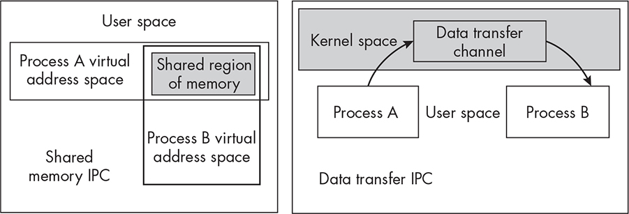
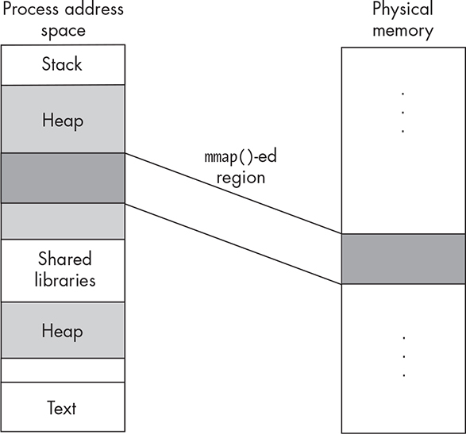
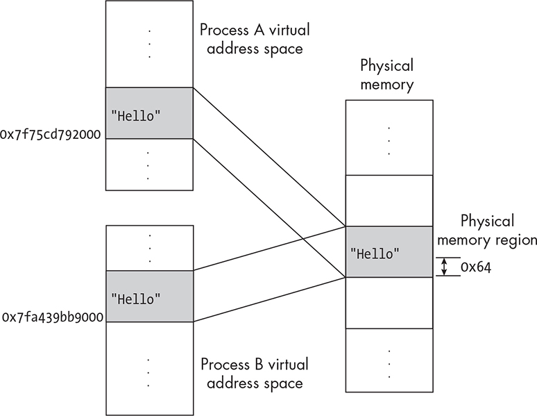
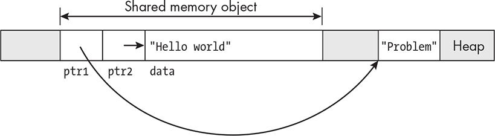
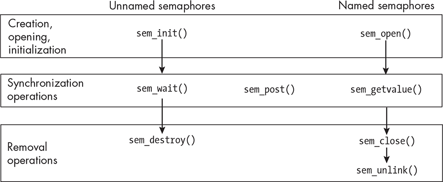

12 INTRODUCTION TO INTERPROCESS

COMMUNICATION

Some applications and system programs run as a collection of multiple

processes that work together, rather than as a single process. Web

servers, database servers, desktop managers, and web browsers often

consist of many running processes. Some applications consist of

multiple threads instead of multiple processes, and some are even more complex, running as several multithreaded processes. Processes that

work together need to coordinate their actions by communicating with

each other. Communication, in general, is the exchange of information, and *interprocess communication* ( *IPC*) in particular refers to the exchange of information between processes.

Mechanisms by which two or more processes can communicate, or

that facilitate the coordinated exchange of data, are called *IPC facilities*.

This definition is broad—for example, one IPC facility covered earlier in the book is the Unix signal facility, which we introduced in Chapter

8. Because signals can be used as a simple method of process synchronization, they facilitate the safe exchange of data and are

therefore considered to be an IPC facility. Now, we’re mostly interested in learning about what facilities are available in Unix systems for the exchange of data, without creating race conditions. This chapter begins with the big picture, categorizing IPC facilities conceptually, and then

examines some of the IPC facilities based on the use of shared memory in Unix. It also explores the use of semaphores for synchronization.

Why Do We Need IPC?

In Chapter 11, we created two different programs, *sync_io_demo.c* and *waitpid \_demo.c*, to demonstrate how a parent and child process could communicate with each other. In both of these, the two processes

exchanged data through a shared disk file, with one writing data to it and one reading data from it. Exchanging data through a disk file is

slow, but unlike the threads within a single program, which can share

data through the global variables in the program, processes don’t share any memory—their address spaces are disjoint from each other. Because

of this, the only way that we knew of at that point for related processes to exchange data was through a file.

Sharing data through a file requires preventing race conditions on

writes to the file. In *sync_io_demo.c*, to prevent these race conditions, the processes synchronized their accesses to the file through the use of

signals, and in *waitpid_demo.c*, they prevented them with a combination of the O_APPEND flag and the pread() system call. Both of these solutions worked, but they were an ad hoc approach that we used simply because

we didn’t know a better alternative. These programs also ignored the

possibility that some third process could open and modify that file while the two processes created by the program were running. We didn’t

explore the possibility of advisory file locks for those two programs, but we should know something about them. Although sharing data through

a file is possible, it isn’t an efficient way for processes to communicate.

Fortunately, Unix systems have several other types of IPC facilities that make data exchange easier and more robust. Our goal is to learn more

about them.

An Overview of Interprocess Communication

Conceptually, data can be exchanged between processes either through

a shared storage medium, such as memory or a file, or by transferring it

through some channel that the operating system manages. I’ll summarize the two approaches briefly.

*Shared Memory Methods*

With an IPC facility based on shared memory, multiple processes access a shared region of memory that is mutually accessible to all of them.

Since processes don’t have access to each others’ address spaces, the

region of memory that they share has to be created. Once it’s been

created, ordinary store and fetch operations on that memory are

the means of sharing data. In other words, one process modifies a

variable in memory and another fetches its value.

With shared-memory IPC, preventing race conditions is the job of

the programmer, and some form of synchronization has to be used.

The memory region used for sharing is in the processes’ address

spaces. The kernel is not involved in the transfer of data to and

from this memory, making it a fast means of data exchange.

In principle, data can also be exchanged through shared open files,

but this isn’t practical, because reading from and writing to disk

files is much slower. There are ways, however, to map a disk file

into physical memory that is shared by two or more processes and

to use ordinary fetches and stores in place of reads and writes. In

effect, it’s like using shared memory except that the memory is

backed by a disk file.

Figure 12-1 visualizes the differences.

*Figure 12-1: Shared memory–based IPC in comparison to data transfer–based IPC*

*Data Transfer Methods*

With an IPC facility based on data transfer, processes pass data through some type of communication channel that’s managed by the kernel.

For some types of data transfer facilities, the data is transferred

using the same read and write operations that are used in file I/O.

Pipes and sockets fall into this category.

For other types, specific send and receive system calls or library

functions transfer the data. The most prevalent examples of this are

message queues.

Unlike shared memory IPC, data transfer IPC methods provide the

mutual exclusion needed to prevent race conditions, freeing the

programmer from having to prevent them explicitly.

The communication channels that are used for data transfer are

managed by the kernel and reside in kernel memory. This makes

these methods slower than shared memory methods, since the

kernel is involved in the exchange of data.

*Two Different APIs*

Unix systems provide several different IPC facilities based on both shared memory and data transfer. To decide which is best to use in a

particular application, we should know what all of the choices are. If we search for man pages whose summaries contain the term *interprocess* *communication* by entering apropos interprocess communication, we’ll find pages including the following: perlipc (1) - Perl interprocess

communication (signals, fifos, pipes,. . pipe (3posix) - create an

interprocess channel socket (3posix) - create an endpoint for

communication svipc (7) - System V interprocess communication

mechanisms sysvipc (7) - System V interprocess communication

mechanisms unix (7) - sockets for local interprocess communication

These man pages are a sufficient starting point. The perlipc reference is intriguing because it mentions specific facilities such as signals, FIFOs, and pipes, the last two of which are new terms for us. In particular, the perlipc man page begins by stating:

The basic IPC facilities of Perl are built out of the good old Unix signals, named pipes, pipe opens, the Berkeley socket routines, and SysV IPC calls. Each is used in slightly different situations.

Also, the pipe(3posix), svipc(7), and unix(7) man pages deserve further examination. We’ll explore many of these man pages to learn about the

programming interfaces available, but before we dive into any details, we need to understand the difference between the POSIX and System V

interfaces.

System V is the name given to AT&T’s 1983 UNIX release, which

incorporated many features previously not present in UNIX. System V

integrated three different IPC mechanisms into UNIX: message queues,

semaphores, and shared memory. Their interfaces have much in

common, and having learned how to use any one of them, learning the

others is much easier. The svipc(7) man page contains an overview of all of them, stating,

System V IPC is the name given to three interprocess communication mechanisms that are widely available on UNIX systems: message queues, semaphores, and shared memory.

POSIX IPC refers to a different API that includes the same IPC

facilities as System V—message queues, semaphores, and shared

memory—but with a completely different interface to them. The POSIX API is consistent with the traditional Unix I/O model, unlike

the System V API; it is also very self-consistent, in that the three

different facilities are programmed in similar ways.

*Summary of the Common IPC Facilities*

Given that both POSIX and System V IPC consist primarily of message

queues, semaphores, and shared memory, I’ll continue by summarizing

what the documentation says about each of them.

Message queues allow processes to exchange chunks of data called

*messages* by putting them into, and removing them from, a queue.

POSIX and System V use different APIs for working with message

queues, and they provide similar, but not identical, functionality. Both provide the means for processes to send messages to or receive messages from a specified message queue. The sysvipc(7) man page refers us to the POSIX man page, mq_overview(7), for a comparison of the two APIs. Of

the two, the POSIX API is newer and easier to use, and it provides more functionality.

Message queues are like mailboxes. A process can post, or write, a

message into a message queue and can read a message from it. Unlike

ordinary reads though, reads from a message queue are *destructive*—the message is removed from the queue by the act of reading, like removing mail from a mailbox. Unlike read operations on a file, a read operation reads a whole message, meaning the entire message that was placed into the message queue when it was written, like retrieving a single piece of mail. One way that a message queue is not like a mailbox is that a

process cannot read more than one message at a time.

Although semaphores are included in both lists of IPC facilities,

they’re not exactly a method of exchanging data; they’re primarily a

*synchronization mechanism*, a means for processes to synchronize their accesses to a shared object or region of code to prevent race conditions.

They’re needed when a program uses shared memory IPC facilities. As

with message queues, there are System V semaphores and POSIX

semaphores.

A semaphore is essentially an integer variable on which two operations can be performed: increment and decrement. Its value is not allowed to fall below zero. These operations have gone by various

names over the years; in POSIX, for example, to increment a

semaphore, a program calls sem_post(), and to decrement it, it calls

sem_wait(). Semaphores serve as a synchronization method for two

reasons:

The increment and decrement operations are *atomic*—if two or

more processes try to call increment or decrement functions at the

same time, the operations are serialized. No two processes can

execute that code at the same time.

If a process tries to decrement a semaphore whose value is 0, it is

blocked by the kernel and remains blocked until the semaphore

value becomes positive.

If two processes both try to decrement a semaphore whose value is

currently 1, one will succeed, setting it to 0, and the other will be

blocked. The one that succeeded can later increment the semaphore,

unblocking the other process, after it has finished updating some shared resource. System V semaphores are harder to use than POSIX

semaphores, but the biggest difference is that System V semaphore

operations act on sets of semaphores rather than a single one.

Both System V and POSIX shared memory are IPC facilities that

allow processes to share regions of memory. These memory regions go

by different names; System V calls them *memory segments*, and POSIX

calls them *memory objects*. The basic idea is that a process can request the kernel to create a shareable region of memory, and it gets some type of identifier that can be used for all subsequent operations in that memory region. Other processes that know this identifier and also have

appropriate permission can access that memory as well. Once the

memory region is established, a process can access that memory in the

same way that it accesses the rest of its address space.

The System V API is the original shared memory model. The shm

\_overview(7) man page has this to say about it:

System V shared memory (shmget(2), (shmop(2), etc.) is an older shared memory API. POSIX shared memory provides a simpler, and better designed interface; on the other hand POSIX shared memory is somewhat less widely available (especially on older systems) than System V shared memory.

The major advantage of the System V shared memory API used to be

that it was more portable, but over time that advantage has diminished as more Unix distributions have incorporated the POSIX API.

The rest of this chapter will explore each of these IPC facilities,

starting with shared memory, then looking at semaphores, and

concluding with message queues. The next chapter will explore the

other mechanisms that were mentioned at the start: pipes and FIFOs.

There isn’t room in this book to include a complete examination of

both the System V IPC facilities and the POSIX ones. I’ve decided to

explain the POSIX API because it is easier to learn and has a simple

interface. I’ll briefly describe System V semaphores, so that you can

compare them to POSIX semaphores.

POSIX Shared Memory

Let’s begin by searching for the relevant man pages: \$ **apropos -a**

**posix shared memory** shm_open (3) - create/open or unlink POSIX

shared memory objects shm_overview (7) - overview of POSIX shared

memory shm_unlink (3) - create/open or unlink POSIX shared memory

objects

The shm_overview(7) man page contains a summary and overview of the

POSIX shared memory model and its API. We’ll start there.

*Overview*

POSIX refers to shared memory objects in its documentation. A *shared* *memory object* is a data structure that represents a shareable memory region. It is analogous to an open file description. Recall from Chapter

4 that when a process opens or creates a file in Unix, the kernel creates an open file description and returns a small integer file descriptor that references that open file description. Similarly, when a process creates a shared memory region, the kernel creates a shared memory object and

returns a small integer that is also called, somewhat confusingly, a file descriptor. A shared memory object encapsulates all of the metadata

associated with the memory region created by the kernel. On Linux, it’s created in an in-memory *tmpfs* filesystem and has a name visible in the

*/dev/shm* directory.

The shm_overview(7) man page lists the functions related to the

creation and management of POSIX shared memory objects, with brief

descriptions. The ones that are used for creating and using and

removing the shared memory are as follows:

**shm_open()** Creates and opens a new shared memory object or opens an existing one.

**ftruncate()** Sets the size of the given shared memory object. Newly created shared memory objects have a length of 0.

**mmap()** Maps the shared memory object into the virtual address space of the calling process. A newly created object is not part of the virtual address space of a process until it is mapped into it.

**munmap()** Unmaps the shared memory object from the virtual address space of the calling process. Unmapping the memory object doesn’t

delete it; it marks the memory addresses assigned to it in the calling process as no longer part of the process’s memory image.

**shm_unlink()** Removes a shared memory object name. It does not

delete the actual memory object as long as one or more processes still have it mapped. Once all processes have unmapped the object, this

deallocates and destroys the contents of the associated memory

region.

**close()** Closes the file descriptor allocated by shm_open().

The preceding functions are listed in the order in which they’re

typically called. Before getting into the details, I’ll summarize the steps involved in setting up a shared memory region:

1\. The first step is for one of the processes to create the memory

object with a call to shm_open(). One of the arguments to the call is

the name for the memory object. That name has to be known by every other process that’s going to share the memory. The call to

shm_open() returns a file descriptor that refers to the memory object.

2\. The created memory is 0 bytes long initially. The next step is to

call the ftruncate() function to allocate memory to the object.

Although its name suggests that it is making the memory smaller,

it can also increase the size of a memory object. The result of the

call to ftruncate() is that physical memory has been allocated to the

shared memory object, but this memory is not part of the calling

process’s virtual address space.

3\. The next step is to map the new physical memory into the address

space of the calling process with a call to mmap(). This function

assigns addresses inside the process for the physical memory

created by ftruncate(). It’s actually a more general-purpose function

than this, since it is also used for creating memory-mapped files,

which we haven’t discussed. When a process maps memory with a

call to mmap(), the kernel updates its page table to point to the

shared physical pages. These pages are usually mapped above the

shared libraries in the heap in the address space of the process, as

shown in Figure 12-2.

4\. The memory is ready to be used. When this process is finished

using it, it calls munmap() to unmap the virtual addresses assigned to it. The memory object as well as the physical memory continue to

exist.

5\. The process that created the memory object with shm_open() should

unlink, or remove, its name by calling shm_unlink(). The object’s

name is removed, and the object is deleted when all other

processes unmap it.

Figure 12-2 depicts the mapping by mmap() of a part of physical memory into the address space of the calling process.

*Figure 12-2: The effect of* *mmap()* *on a shared memory object* A process that wants to share an existing shared memory object

performs fewer steps:

1\. It calls shm_open(), passing the same name that its creator gave to the object, but with arguments that indicate it’s not trying to create a

new object.

2\. It calls mmap() to map the object into its own address space. It *does* *not* call ftruncate()! The object already has associated memory and just needs to be mapped into the calling process.

3. It can now use the shared memory. When it’s finished, it unmaps it.

It doesn’t have to unlink it.

Before looking at a few examples that show how to use shared

memory, we need to study the prototypes and semantics of all of these

functions in the API to understand exactly how to use them.

*The Shared Memory API*

Let’s start with shm_open(). Its synopsis is: \#include \<sys/mman.h\>

\#include \<sys/stat.h\> /\* For mode constants \*/ \#include \<fcntl.h\> /\* For O\_\* constants \*/ int shm_open(const char \*name, int oflag, mode_t

mode);

The man page notes that programs calling it must link to the real-time library with -lrt. This function is very much like open(): It’s given a string containing a name, like a filename, a set of flags that controls the

memory object’s behavior, and a permission mode, and if it’s successful, it returns a file descriptor that references the object.

The first argument is a string that will be used as the shared memory

object name. This name must be of the form / *object-name*, where *object-name* can be up to NAME_MAX (255) characters. The leading slash is required by POSIX; without it, the code will not be portable. It’s common for a program to put its own name somewhere in this string, as in /progmem1.

Since the *tmpfs* filesystem is usually mounted on */dev/shm*, the shared memory object will look like an ordinary file there: \$ **ls -1 /dev/shm** PostgreSQL.184558000 progmem1

The second argument is a bitwise-OR of flags that controls the opening mode. It must include one of O_RDONLY or O_RDWR. If one or more processes will modify the memory, the flag should be O_RDWR. The other flags are just like the flags we can pass when we open files, such as O_CREAT, O_EXCL, and O_TRUNC, with the same meanings.

The last argument is the file mode. The process that creates the

memory object should set the mode to 0600 (S_IRUSR \| S_IWUSR) so that only processes whose effective user ID is the same as that of the calling

process can access that memory. For example int shmfd =

shm_open("/myprogmem", O_CREAT \| O_EXCL \| O_RDWR, S_IRUSR \| S_IWUSR);

creates a new shared memory object that all of the user’s processes can read and write. If the name exists already, it will fail. Another example is int shmfd = shm_open("/myprogmem", O_RDWR, 0);

which will fail if */dev/shm/myprogmem* does not exist already. This is how a process would open the shared memory object already created by

another process. It does not assign a mode to an existing object.

The ftruncate() system call is simpler to use. Its prototype is:

\#include \<unistd.h\> \#include \<sys/types.h\> int ftruncate(int fd, off_t length);

This function truncates or increases the size of the object referenced by the file descriptor fd. It does this to ordinary files as well as memory objects, so we can use it to lengthen or shorten any file. The second

argument is the number of bytes to make the shared memory object (or

file). Some examples of its use are: ftruncate(fd, 100\*sizeof(int)); /\*

Allocate for an array of 100 ints. \*/ ftruncate(fd, 128\*sizeof(struct stat));

/\* Allocate to hold an array of 128 struct stat objects. \*/ ftruncate(fd, MAX_INPUT); /\* Allocate bytes to store a string input by the user. \*/

ftruncate(fd, 65536); /\* Allocate 65,536 bytes. \*/

On success, it returns 0; otherwise, it returns -1 and sets errno

accordingly.

The mmap() system call creates a new mapping in the virtual address

space of the calling process. A mapping is essentially an assignment of a set of virtual addresses that corresponds to a set of physical addresses. In

Chapter 10, we showed that shared libraries are mapped into a process’s address space. That’s an example of a mapping. The mmap() and munmap() prototypes follow: \#include \<sys/mman.h\> void \*mmap(void \*addr,

size_t length, int prot, int flags, int fd, off_t offset); int munmap(void

\*addr, size_t length);

The first argument to mmap(), addr, is the virtual address at which the mapping should start, but this is just taken as a hint by the kernel, which decides where that mapping should start. Normally, we pass NULL in this argument to tell the kernel we don’t care where it starts. The next

argument, length, is the size, in bytes, of the mapping. If it isn’t positive,

the call fails. The next argument, prot, specifies access rights to the mapped region. It’s either the symbolic constant PROT_NONE or a bitwise-OR of one or more of:

**PROT_EXEC** Pages may be executed.

**PROT_READ** Pages may be read.

**PROT_WRITE** Pages may be written.

The fourth argument, flags, is a bitwise-OR of flags that control various aspects of the mapping. It must contain exactly one of the following

constants, which define how updates to the region are applied:

**MAP_SHARED** All processes see updates.

**MAP_PRIVATE** When a process modifies the region, the kernel creates a separate copy of the region for that process and applies those

modifications only to that copy. All future changes that the process

makes are applied to that copy. Other processes continue to see only

the original, unmodified region.

Several other flags can be bitwise-ORed into this argument, but I won’t describe them here. The man page has a complete list of them.

The last argument, offset, is intended for when mmap() is called to set up a memory-mapped file. In this case, it is the offset in the file where the mapping starts. We can just set it to 0.

*A Shared Memory Example Program*

The first pair of programs that we’ll create simply demonstrates the

mechanics of setting up the shared memory. The first program,

*shm_creator_demo1.c*, creates the shared memory object and fills it with a pair of strings at fixed offsets relative to the start of the mapping. The second program, *shm_user \_demo1.c*, opens the same shared memory object, maps it into its own memory, and then prints the strings it finds at the given offsets. Both programs will include the same common

header file, named *shm_demo1.h*, whose contents are: *shm_demo1.h*

\#include "common_hdrs.h" \#include \<sys/mman.h\> \#include \<fcntl.h\>

\#include \<sys/stat.h\> \#define BUF_SIZE 8192 const int offset1 = 0x64; const int offset2 = 0xC8;

The BUF_SIZE macro is the size of the memory region to be created.

The creator program is next: *shm_creator_demo1.c* \#include

"shm_demo1.h" /\* For definitions of constants \*/ int main(int argc, char

\*argv\[\]) { int fd; /\* File descriptor referring to shared memory object \*/

char \*shmp; /\* Pointer to start of shared memory region \*/ char

usage\[256\]; /\* For error message \*/ if ( argc != 2 ) { sprintf(usage,

"Usage: %s /shm-path\n", argv\[0\]); usage_error(usage); } /\* Create the named shared memory object for reading and writing. \*/ if ( (fd =

shm_open(argv\[1\], O_CREAT \| O_EXCL \| O_RDWR, S_IRUSR \|

S_IWUSR)) == -1 ) fatal_error(errno, "shm_open"); if ( ftruncate(fd, BUF_SIZE) == -1 ) /\* Make it a fixed size. \*/ fatal_error(errno,

"ftruncate"); /\* Map the object into the process address space. \*/ if (

(shmp = mmap(NULL, BUF_SIZE, PROT_READ \| PROT_WRITE,

MAP_SHARED, fd, 0)) == MAP_FAILED ) fatal_error(errno,

"mmap"); if ( -1 == close(fd) ) /\* Close unneeded file descriptor. \*/

fatal_error(errno, "close"); /\* Write two strings at fixed locations into this memory. \*/ ➊ strcpy(shmp + offset1, "Hello"); strcpy(shmp +

offset2, "World"); exit(EXIT_SUCCESS); }

This particular program allocates a fixed number of bytes to the shared memory region, but it doesn’t use very much of the region. Notice how

it writes strings into the memory by adding an integer offset to the

pointer shmp ➊.

Now let’s look at the code for the program that reads the strings

from this shared memory: *shm_user_demo1.c* \#include "shm_demo1.h"

/\* For definitions of constants \*/ int main(int argc, char \*argv\[\]) { int fd;

/\* File descriptor referring to shared memory object \*/ char \*shmp; /\*

Pointer to start of shared memory region \*/ char usage\[256\]; /\* For

error message \*/ if ( (argc != 2) \|\| (argv\[1\]\[0\] != '/') ) { sprintf(usage,

"Usage: %s /shm-name\n", argv\[0\]); usage_error(usage); } /\* Open the named shared memory object for reading and writing. \*/ ➊ if ( (fd =

shm_open(argv\[1\], O_RDWR, 0)) == -1 ) fatal_error(errno,

"shm_open"); /\* Map the object into the process's address space. \*/ if (

(shmp = mmap(NULL, BUF_SIZE, PROT_READ \| PROT_WRITE,

MAP_SHARED, fd, 0)) == MAP_FAILED ) fatal_error(errno,

"mmap"); if ( -1 == close(fd) ) /\* Close unneeded file descriptor. \*/

fatal_error(errno, "close"); /\* Print the two strings that are supposed to be in the locations offset1 and offset2 away from the region start. \*/ ➋

printf("%s\n", shmp + offset1); printf("%s\n", shmp + offset2); shm_unlink(argv\[1\]); /\* Remove this reference to memory object. \*/

exit(EXIT_SUCCESS); }

This program looks very similar to the first. The significant differences are in how the shared memory object is opened ➊ and in the fact that

this program doesn’t call ftruncate(). Notice that this program prints by referencing the strings to be printed by adding integer constants to the start of the memory region ➋ .

I built both programs, naming the executables shm_creator_demo1 and

shm_user_demo1. I’ll first run the creator program: \$ **./shm_creator_demo1**

**/shmdemo1** \$ **ls -l /dev/shm/shmdemo1** -rw------- 1 stewart stewart 8192 Jun 7 10:14 /dev/shm/shmdemo1

I ran ls -l after to show that the device file */dev/shm/shmdemo1* contains 8192 bytes, the size passed to ftruncate(). (You can also view its contents as if it were a regular file—for example, by entering cat /dev/shm/shmdemo1

—but you’ll see that it has no newlines.) Now I’ll run the user program: \$ **./shm_user_demo1 /shmdemo1** Hello Goodbye

The user program successfully read the data written by the first

program and printed it.

*Pointer Pitfalls in Shared Memory*

When a shared memory region is created and used by two or more

processes, it is mapped into each process’s virtual address space by the kernel. The starting address in each process is not necessarily the same.

To make this clear, modify each of the two preceding programs by

including the following instruction: printf("Memory is mapped in

process starting at address %p\n", shmp);

Recompile and build both programs and run them again, and you’ll

see something similar to this: \$ **./shm_creator_demo1 /test2** Memory

is mapped in process starting at address 0x7f75cd792000 \$

**./shm_user_demo1 /test2** Memory is mapped in process starting at address 0x7fa439bb9000 Hello World

In fact, each time you run either program, the shared memory will be

mapped to a different starting address. Let me make this concrete. In

the preceding runs, the first process copied the string "Hello" to the location starting at address 0x7f75cd792000 + 0x64, whereas the second mapped it to address 0x7fa439bb9000 + 0x64. If the second program tried to read that string by using a pointer to its location, the program would likely fail because the address 0x7f75cd792000 + 0x64 in the second

program is not necessarily a valid address, and it certainly doesn’t

contain the string "Hello". Figure 12-3 visualizes this particular shared memory mapping.

*Figure 12-3: Two processes sharing a mapped memory region, showing that the starting* *address of the region is different in each process*

Let’s consider a second pair of programs. In this example, the header

file that they share declares a structure containing an array and two char\*

pointer variables: typedef struct_shared { char \*ptr1; char \*ptr2; char data\[4096\]; } shareddata;

I’ll create a variation of the *shm_creator_demo1.c* program, named *shm_creator_demo2.c*, in which each pointer is assigned a particular value that will highlight a pitfall of shared memory programming. The rest of the program is essentially the same: *shm_creator_demo2.c* int main(int

argc, char \*argv\[\]) { int fd; /\* File descriptor referring to shared memory object \*/ ➊ shareddata \*shmp; /\* Pointer to start of shared memory

region \*/ char usage\[256\]; /\* For error message \*/ if ( (argc != 2) \|\|

(argv\[1\]\[0\] != '/') ) { sprintf(usage, "Usage: %s /shm-name\n", argv\[0\]); usage_error(usage); } if ( (fd =

shm_open(argv\[1\],O_CREAT\|O_EXCL\|O_RDWR,S_IRUSR\|S_IW

USR)) == -1) fatal_error(errno, "shm_open"); ➋ if ( ftruncate(fd, sizeof(shareddata)) == -1 ) fatal_error(errno, "ftruncate"); if ( (shmp =

(shareddata\*) mmap(NULL, sizeof(shareddata), PROT_READ \|

PROT_WRITE, MAP_SHARED, fd, 0)) == MAP_FAILED )

fatal_error(errno, "mmap"); shmp-\>ptr1 = (char\*) ➌ malloc(20); strcpy(shmp-\>ptr1, "Problem"); strcpy(shmp-\>data, "Hello World"); ➍

shmp-\>ptr2 = (char\*) &(shmp-\>data); exit(EXIT_SUCCESS); }

The variable shmp is a pointer to a shareddata structure ➊. The size of the memory object is made the size of that structure ➋ . Now comes the

interesting part. This program calls malloc() to allocate more memory ➌.

This memory is not in the shared memory region; it’s just in the heap of the calling process. It stores the address of this malloc-ed memory in the variable shmp-\>ptr1, which is part of the shared memory, and copies the string "Problem" into the malloc-ed memory. It then makes a copy of the string "Hello World" in the shareddata structure’s array, starting at index 0.

The last instruction stores the address of the start of this array, shmp-

\>data, in the pointer shmp-\>ptr2 ➍. Figure 12-4 illustrates where the various objects reside in virtual memory.

*Figure 12-4: The arrangement of data in the shared memory created by* shm_creator_demo2.c

The program that reads this shared memory, named

*shm_user_demo2.c*, has a few small changes, shown next. The listing omits the code that hasn’t changed: *shm_user_demo2.c* int main(int argc, char \*argv\[\]) { int fd; /\* File descriptor referring to shared memory object \*/ shareddata \*shmp; /\* Pointer to start of shared memory region

\*/ char usage\[256\]; /\* For error message \*/ *--snip--* if ( (shmp =

(shareddata\*) mmap(NULL, BUF_SIZE, PROT_READ \|

PROT_WRITE, MAP_SHARED, fd, 0)) == MAP_FAILED )

fatal_error(errno, "mmap"); *--snip--* ➊ printf("%s\n", shmp-\>ptr1); ➋

printf("%s\n", (char\*) (shmp-\>ptr2)); *--snip--* }

When we compile and run both of these programs, first shm_creator_demo2

and then shm_user_demo2, the second will cause a segmentation fault. What is wrong?

The first problem is that shmp-\>ptr1 stores the address that malloc() returned to the other process, not to this one. It’s an address in a

different process’s heap. It refers to junk here, or to an invalid address at best. Printing its contents ➊ causes a dereference that fails. If we

comment out that first line, the program will also segfault, because

when it tries to print the string starting at the address stored in shmp-\>ptr2

➋, it has to dereference that pointer. But that dereference fails because that pointer stores an address in the other process’s address space.

POINTERS, OFFSETS, AND SHARED MEMORY

When two or more processes establish a POSIX shared memory

region, none of them should use the addresses in that region to

access any part of it. Addresses will vary from one process to

another, and dereferencing them will result in segmentation faults

or other invalid memory access failures. In short, *do not use pointers* *inside shared memory!*

Instead, programs must use *offsets*, which are integer values that store the locations in the shared memory relative to the start of

that memory. Pointer arithmetic can then be used with care to

dereference the locations. For example, if startp is the start of the

shared memory region, and int offset stores the number of bytes

between the start and some data item, then (char\*)(startp) + offset

is the correct expression for the starting address of the data item.

Of course, an offset must lie within the shared memory region;

otherwise, if the program tries to dereference it, an invalid

memory access occurs.

Lastly, a program cannot store the address returned by malloc() or

any other function that creates memory outside of the shared

memory region in any variable inside that region, because it

references a meaningful memory address only in the address space

of the process that created it.

*Race Conditions*

When several processes all read, but don’t modify, some shared object, the order in which they read doesn’t change their collective behavior; since reading doesn’t modify the object, there’s no race condition.

However, when at least one process (or thread) modifies a shared object that is read by one or more other processes, the code is susceptible to race conditions.

To illustrate, suppose that counter is a variable in a shared memory region and that two or more processes execute the instruction counter =

counter + 1;

at some point in time. This instruction isn’t atomic; it is typically

compiled into three separate machine instructions of the form: mov

register1, @counter add register1, 1 mov @counter, register1

If two different processes execute these three machine instructions and their computations are interleaved in time, either because one was

interrupted by the second, which ran briefly, and then the first ran again, or because they’re running on separate processors at the same time,

then the result can be incorrect.

To make this concrete, suppose that counter is initially 5. If two

processes each execute counter = counter + 1 and no race occurs, the value of counter should be 7 afterward. But it’s possible for the instructions to be executed in such a way that the result is not 7. Consider the following sequence, where t0, t1, t2, and so on represent successive points in time, and P1 and P2 are two different processes incrementing counter: t0: P1

executes mov register1, @counter {register1 == 5 } t1: P1 executes add register1, 1 {register1 == 6 } t2: P2 executes mov register2, @counter

{register2 == 5 } t3: P2 executes add register2, 1 {register2 == 6 } t4: P1

executes mov @counter, register1 {counter == 5 } t5: P2 executes mov

@counter, register2 {counter == 6 }

The final value of counter is 6, not 7 as it should be. Programs using shared variables must take steps to prevent this behavior.

We need a way to guarantee that when one process executes an

instruction such as counter = counter + 1, no other process can modify the value of counter until the first process completes the instruction and the value of counter is stored in memory. For many decades, computer

scientists have investigated and proposed a variety of solutions to this problem, which are generally called *synchronization* methods. Some of them, such as semaphores and mutex locks, have found their way into

Unix systems.

A *mutex lock* is an object on which two operations are defined: locking it and unlocking it. These operations are atomic in the sense

that if two processes or threads try to acquire the lock at the same time,

only one will succeed and the other will be blocked in the call to lock the mutex. We examine mutex locks in Chapter 15. In this chapter, we explore the use of semaphores.

Semaphores

Semaphores were invented by Edsger Dijkstra in 1963 while he was

trying to solve synchronization problems in the design of the *THE*

operating system \[9\]. Dijkstra originally defined two operations that acted on semaphores, which he named *P* and *V*, short for the two Dutch words that translate to English as *probe* and *increase*. People have used other names for these operations; the *P* operation is sometimes called *wait* or *down*, and the *V* operation *post*, *up*, or *signal*. I’ll use *wait* and *post* here, since they’re the names adopted in the POSIX.1-2024

specification.

*Overview*

A *semaphore* is an integer variable whose value is not allowed to become less than zero, and upon which two atomic operations are defined:

**wait()** Decrements the semaphore if its value is positive. If its value is 0, the function blocks the process or thread that tried to decrement the semaphore and puts it on a list of waiting processes associated

with the semaphore. For semaphore S, its operation is described by: if ( S \<= 0 ) // Block calling process and put on S waitlist. S--;

**post()**

Increments the semaphore, and if the semaphore’s value

becomes positive after incrementing it, the function wakes up a

process or thread currently blocked in its wait list. For semaphore S, its operation is described by: S++; if ( S \> 0 ) // Resume a process currently on S waitlist in its call to wait().

There is no requirement that the waiting list of a semaphore be

implemented as a first-in-first-out queue. It’s up to an

implementation to decide which process to wake up. Notice that,

when a process wakes up, it continues to execute the code in wait(),

which means that it immediately decrements S and returns from the call.

Both of these operations are atomic, or indivisible. They run from

start to completion without being interrupted. When the post()

operation wakes up a process, no other process can execute the code

inside wait() or post() until the newly awakened process returns from the call to wait().

If the initial value of a semaphore is 1, then only one process can

successfully decrement it. Any other processes that subsequently try to decrement it are then blocked. If a semaphore’s value is initially 1 and post() operations are only applied to it when its value is 0, then its value is always either 0 or 1. Such a semaphore is called a *binary semaphore*. If post() operations could be applied to it when its value is 1, its value would exceed 1, and it would not be a binary semaphore.

If the initial value *N* of the semaphore is greater than 1, the number of processes that can successfully decrement it is equal to *N*. This type of semaphore is called a *counting semaphore*.

Binary semaphores can be used to ensure that only a single process

executes a critical section of code. The idea is that, to protect a data structure from race conditions, we create a semaphore for it and we

bracket all attempts to access that data structure by calls to wait() and post(), as follows: wait(S); // Critical section code that modifies a shared data structure post(S);

Because only one process can decrement S, only one process at a time

can execute the critical code. We say that a process *acquires* or *locks* a binary semaphore when it has decremented it without being blocked.

This is an abstraction. It doesn’t describe, for example, how we create and how we initialize semaphores. It’s time to search for an API for

programming with them in Unix.

*System V Semaphores*

In order to compare the POSIX and System V APIs for the use of

semaphores, I’ve included this brief description of the System V

semaphore API. The System V semaphore API is described by the man

pages: semctl (2) - System V semaphore control operations semget (2) -

get a System V semaphore set identifier semop (2) - System V

semaphore operations semtimedop (2) - System V semaphore

operations

This API is older than the POSIX one. It was designed to be very

general, and as a result, it’s more complex to learn and use. There aren’t explicit equivalents of the wait() and post() operations. Instead of

operating on a single semaphore, the System V methods act on sets of

semaphores. They also allow the semaphores in the set to be increased

or decreased by amounts greater than 1. The creation of a semaphore in System V is a separate function from its initialization. This opens up the possibility of race conditions, which adds to the complexity of using

them. The sequence of steps that we need to follow to create and use

System V semaphores is roughly as follows:

1\. Request a semaphore set using a System V IPC *key*. A key must be generated before this step.

2\. Initialize the semaphore set by setting the value of each semaphore in the set.

3\. Set up operations to be used with these semaphores.

4\. Use the semaphore operations set up in the previous step.

5\. Delete the semaphore set.

In short, we need to read about System V keys and how to generate

them. We also need to learn how to invoke operations on semaphore

sets with the functions semctl() and semop(). You’ll see soon that POSIX

semaphores are easier to program.

*POSIX Semaphores*

The sem_overview(7) man page presents an overview of POSIX

semaphores. POSIX semaphores have a simple, well-designed interface.

POSIX defines two types of semaphores, named and unnamed:

Named semaphore Has a name of the form / *name*, in which *name* is a string of up to NAME_MAX-4 nonslash characters, similar to a shared

memory region name. Two processes operate on the same named

semaphore by passing that name to the sem_open() function.

Unnamed semaphore Has no name. It must be created in an

address space common to all processes or threads that operate on it.

This means that, for processes, it must be in a shared memory object

shared by the processes.

Early versions of Linux implemented only unnamed semaphores, but

starting with version 2.6, Linux supports named ones as well. There are eight different functions related to the use of named and unnamed

semaphores. Some are used only for named semaphores, some for

unnamed semaphores, and some for both. Figure 12-5 shows which functions are used for which types of semaphores.

*Figure 12-5: A comparison of the sequence of steps for using named and unnamed POSIX*

*semaphores*

The differences between named and unnamed semaphores are in how they are created and removed. The wait() and post() operations are the same for both. POSIX adds a sem_getvalue() function to the API, but it’s unlikely you’ll ever need to call it, and it isn’t part of the

conventional interface.

Unnamed Semaphores

Unnamed semaphores are memory based; for processes to access them,

they must be placed in a shared memory region accessible to all

processes. If they’re used by threads, they must be either global in the program or in its heap. The functions used for unnamed semaphores are

as follows:

**sem_init()** Creates an unnamed semaphore

**sem_wait()** Decrements and locks the given semaphore

**sem_post()** Increments the given semaphore

**sem_getvalue()** Gets the current value of the semaphore

**sem_destroy()** Deallocates resources of the semaphore

Programs using any POSIX semaphore function must include the

*semaphore.h* header file and link the program to the *pthread* library with the linker flag -lpthread. The semaphore type in POSIX is sem_t: int

sem_init(sem_t \*sem, int pshared, unsigned int value);

The first argument is the address of a sem_t variable. The second

argument (pshared) indicates whether the semaphore is shared by threads or by processes. If it’s 0, the semaphore is shared by threads and should be placed in either the heap or declared globally. If its value is 1, it’s process-shared and the semaphore must be in a shared memory region.

The initial value of the semaphore is passed in its third parameter and must be a nonnegative integer.

The two synchronization operations are prototyped as: int

sem_wait(sem_t \*sem); int sem_post(sem_t \*sem);

Each expects the address of a semaphore variable and returns 0 on success and -1 on failure. The function to release the semaphore

resources is: int sem_destroy(sem_t \*sem);

This should be called only after all processes are no longer using the semaphore.

Listing 12-1 contains a simple program that uses an unnamed semaphore to prevent race conditions on updates to a shared counter

variable. To save space, it has no error handling; the complete program is available in the book’s source code distribution.

*unnamedsem_demo.c*

\#include "common_hdrs.h"

\#include \<sys/mman.h\>

\#include \<sys/wait.h\>

\#include \<semaphore.h\>

\#define ITERATIONS 1000000

typedef struct shmbuf {

sem_t sem; /\* POSIX unnamed semaphore \*/

size_t count; /\* A shared counter \*/

} sharedmem;

char \*shmpath = "/SHMDEMO"; /\* Shared memory object name \*/

sharedmem \*shmp; /\* Pointer to shared memory \*/

int main(int argc, char \*argv\[\])

{

int fd, i;

/\* Create shared memory object and set its size. \*/

fd = shm_open(shmpath, O_CREAT \| O_EXCL \| O_RDWR, S_IRUSR \| S_IWUSR);

ftruncate(fd, sizeof(sharedmem));

shmp = mmap(NULL, /\* Map mem object into process memory. \*/

sizeof(sharedmem), PROT_READ \| PROT_WRITE, MAP_SHARED, fd, 0);

➊ sem_init(&shmp-\>sem,1,1);/\* Initialize binary process-shared semaphore. \*/

shmp-\>count = 0; /\* Set count to 0 before creating a child process. \*/

switch( fork() ) {

case -1:

fatal_error(errno, "fork");

case 0: /\* Child process \*/

for ( i = 0; i \< ITERATIONS; i++ ) {

sem_wait(&shmp-\>sem); shmp-\>count++;

sem_post(&shmp-\>sem);

}

exit(EXIT_SUCCESS);

default: /\* Parent process \*/

for ( i = 0; i \< ITERATIONS; i++ ) {

sem_wait(&shmp-\>sem);

shmp-\>count--;

sem_post(&shmp-\>sem);

}

wait(NULL); /\* Wait for child to terminate. \*/

printf("The final value of count, which should be 0, is %ld.\n", shmp-\>count);

shm_unlink(shmpath); /\* Remove shared memory object. \*/

exit(EXIT_SUCCESS);

}

}

*Listing 12-1: A program that uses an unnamed POSIX semaphore to protect updates to a* *shared variable in a memory region shared by parent and child processes* If you build this program, naming it unnamedsem_demo, and run it, you should see the following output: \$

**./unnamedsem_demo** The final value of count, which should be 0, is 0.

You can run it any number of times and its output will be unchanged.

Now change the semaphore’s initial value ➊ to 2, recompile, and run the program a few times. You’ll see that the count is wrong with each run: \$

**./unnamedsem_demo** The final value of count, which should be 0, is

-169841. \$ **./unnamedsem_demo** The final value of count, which should be 0, is 17422.

When the semaphore is initialized to 2, neither process is blocked in its call to sem_wait() and the semaphore serves no purpose at all. The race condition still exists, and the parent and child corrupt the value of the counter.

Named Semaphores

Named semaphores are like unnamed semaphores in that we use the same wait() and post() operations for each. The difference is in how

they’re created and removed. Named semaphores are created with

sem_open(), closed with sem_close(), and removed with sem_unlink().

The sem_open() synopsis is: \#include \<semaphore.h\> sem_t

\*sem_open(const char \*name, int oflag); sem_t \*sem_open(const char

\*name, int oflag, mode_t mode, unsigned int value);

A program calls the first form to open a semaphore that’s already been created. It calls the second form to create a new semaphore. In both

cases, the first argument (name) is a NULL-terminated string of the form

"/ *somename*", in which *somename* is, at most, NAME_MAX-4 characters and has no slash. The second argument should be one of the three values shown in

Table 12-1. The table explains what the function does depending on the value of oflag and whether or not the name exists before the call.

Table 12-1: The Semantics of a Call to sem_open()

**oflag**

Name exists

Name doesn’t exist

0

Opens existing semaphore

Fails, setting errno to ENOENT

successfully

O_CREAT

Opens existing semaphore

Creates a new semaphore

and ignores remaining

with the given name and

arguments

properties

O_CREAT \|

Fails, setting errno to EEXIST

Creates a new semaphore

O_EXCL

with the given name and

properties

If the second argument includes the O_CREAT flag, the call must include the mode and initial value arguments. The mode can be specified with

an octal numeric constant such as 0600 or, if the *fcntl.h* header file is included, then with symbolic definitions such as S_IRUSR and S_IWUSR. The process umask is applied to the requested mode. The initial value must be nonnegative. Some examples are: sem_open("/MYSEM", 0); /\* Opens

/MYSEM. Fails if it does not exist. \*/ sem_open("/MYSEM",

O_CREAT, 0660, 1); /\* Creates /MYSEM with initial value 1 and mode rw-rw---- \*/ sem_open("/MYSEM", O_CREAT \| O_EXCL, 0660, 1);

/\* Like the preceding call but fails if /MYSEM exists \*/

In all cases, if sem_open() is successful, it returns a pointer to the address of either the new semaphore or the existing one. If it fails, it returns SEM_FAILED and sets errno to indicate the error.

When a process no longer needs to use the semaphore, it should call

sem_close(), passing the address of the semaphore. The semaphore will be closed when the process terminates if it doesn’t close it explicitly.

Closing it frees the resources associated with the process having it open; it does not remove the semaphore object itself, just the process’s

connection to it.

A process calls sem_unlink() to remove a semaphore’s name and mark

the semaphore object for deletion. The semaphore object is not

removed until there are no more processes using it. It’s safe to call

sem_unlink() after all processes that want to use the semaphore have called sem_open(), since its name is no longer needed once all processes have opened it.

There aren’t many situations in which we’d need a named

semaphore, because in many cases, an unnamed semaphore is sufficient,

as in the following two cases:

Threads within a single program can use an unnamed semaphore

on the heap or declared globally.

Processes that set up a shared memory object can access an

unnamed semaphore in that object. Since the object’s declaration

must be visible to the processes anyway, the semaphore itself is

visible as well.

One use of named semaphores is when unrelated processes that don’t

share a memory region need to synchronize with each other. For

example, they might need to synchronize accesses to a shared file. In

this case, using a named semaphore is easier than setting up a shared

memory region that contains an unnamed semaphore. But in the case of

accessing a shared file, it’s probably better to use file locks, a topic I don’t cover in the book.

To demonstrate the use of a named semaphore, I created a program

in which a process forks a child, after which both processes use the

fprintf() library function to write very long, newline-terminated strings to the file inside for loops. The strings are long enough that they won’t be written atomically by fprintf(), assuming the typical I/O block size of 4096 bytes. If there were no race conditions between parent and child, every line of the file would have been written by exactly one process, but if the outputs are intermingled, then the lines will have a mix of strings from each process. The program is displayed in part in Listing 12-2, without most error handling.

*namedsem_demo.c*

\#define ITERATIONS 1000

\#define SIZE 8192 /\* 2 I/O blocks \*/

\#define SEMNAME "/DEMOSEM"

\#define WAIT(S) if ( -1 == sem_wait(S) ) fatal_error(errno, "sem_wait")

\#define POST(S) if ( -1 == sem_post(S) ) fatal_error(errno, "sem_post") int main(int argc, char \*argv\[\])

{

sem_t \*sem;

int i;

FILE \*fp;

char str1\[SIZE\], str2\[SIZE\];

memset(str1, 'a', SIZE-1);

memset(str2, 'b', SIZE-1);

str1\[SIZE-1\] = '\0'; /\* str1 = "aaaa...aaa" \*/

str2\[SIZE-1\] = '\0'; /\* str2 = "bbbb...bbb" \*/

fp = fopen(argv\[1\], "w");

if ( SEM_FAILED == (sem = sem_open(SEMNAME, O_CREAT \| O_EXCL, 0660, 1)) ) fatal_error(errno, "sem_open");

switch ( fork() ) {

case -1: fatal_error(errno, "fork");

case 0:

for ( i = 0; i \< ITERATIONS; i++ ) { WAIT(sem);

fprintf(fp, "%s\n", str1);

fflush(fp);

POST(sem);

}

exit(EXIT_SUCCESS);

default:

for ( i = 0; i \< ITERATIONS; i++ ) {

WAIT(sem);

fprintf(fp, "%s\n", str2);

fflush(fp);

POST(sem);

}

wait(NULL);

fclose(fp);

sem_unlink(SEMNAME);

exit(EXIT_SUCCESS);

}

}

*Listing 12-2: A program using a named semaphore to prevent race conditions when parent* *and child write to a file* Build and run this program, creating a new file. It won’t produce output, but we can run a check using grep on the file: \$ **./namedsem_demo tempfile** \$ **wc** **tempfile** 2000 2000 16384000 tempfile \# As expected, it has 2000 lines. \$ **grep -E -c**

**'ba\|ab' tempfile** 0 \# No lines have ab or ba.

This output shows that the lines are not intermingled. Now change the

initial value of the semaphore to 2 so that it no longer provides the

locking effect, and repeat these instructions: \$ **./namedsem_demo**

**tempfile** \$ **wc tempfile** 2000 2000 16384000 tempfile \# As expected, it has 2,000 lines. \$ **grep -E -c 'ba\|ab' tempfile** 993 \# Most lines have ab or ba.

The fact that some lines have both *a*’s and *b*’s implies that the calls to fprintf() were interrupted and that sometimes their string arguments

were only partially written to the file.

A Shared Memory Producer Consumer Program

We’re now ready to implement a solution to the producer-consumer problem by using POSIX shared memory. Earlier we had to use a

shared file to implement it, and that solution had several deficiencies.

For this program, the producer writes integers into the shared buffer

and the consumer reads those integers. Writing numbers simplifies the

program and doesn’t distract us with the messy details of writing string data into a shared memory object. This solution works when there are

multiple producers and multiple consumers.

The common buffer, an array of ints, is created inside a shared

memory object. Because the producer needs an index to the next place

to write its data and the consumer needs the index of the next location from which it reads the data, the buffer and these variables should all be part of a single structure that will be created in a shared memory object, such as: \#define BUF_SIZE 512 /\* Buffer capacity \*/ typedef struct

\_shmbuf { int front, rear; /\* Index of next read, write in buffer \*/ int buf\[BUF_SIZE\]; /\* Stores data being transferred \*/ } sharedbuf;

The rear member is the next index to fill in the buffer, and the front member is the next index to read. They’re both initialized to 0.

To add a new data item to the buffer, assuming the data structure is

pointed to by sharedbuf, the producer would execute code of the form

sharedbuf-\>buf\[sharedbuf-\>rear\] = data; sharedbuf-\>rear = (sharedbuf-

\>rear + 1) % BUF_SIZE;

and the consumer would remove a data item similarly: data = sharedbuf-

\>buf\[sharedbuf-\>rear\]; sharedbuf-\>rear = (sharedbuf-\>rear + 1) %

BUF_SIZE;

Because it’s possible that rear and front may be the same location,

these updates represent a race condition on the buf array itself.

Therefore, we need to lock the buffer before this update and unlock it after. We can use a binary semaphore for this. We’ll include it in the shared memory object: typedef struct \_shmbuf { sem_t mutex; /\* To

prevent race condition on buffer \*/ int front, rear; /\* Index of next read, write in buffer \*/ int buf\[BUF_SIZE\]; /\* Stores data being transferred \*/

} sharedbuf;

Each process calls sem_wait() before the update and sem_post() after it.

The two processes need to keep track of how many items are in the shared buffer. More accurately, producers need to know whether there

are available slots to fill in the buffer pool, and the consumer needs to know whether there are no items to consume. We could use a counter

variable for this purpose and design the producer and consumer to

update it accordingly, but then their main program loops would be busy waiting loops. For example, the consumer’s loop, in pseudocode, would

be while ( TRUE ) { if ( sharedmem_counter \> 0 ) value =

get_next_item(sharedmem_buffer) print value }

and the producer’s would be while ( TRUE ) { if ( sharedmem_counter \< BUF_SIZE ) generate new value add_next_item(sharedmem_buffer,

value) }

The producers and consumers would execute millions of needless

instructions, polling the value of the counter until it satisfied the if condition. This is where the idea of a counting semaphore comes into

play. Instead of using a single counter variable, we can use two counting semaphores to keep track of the number of empty and filled buffer slots.

One semaphore, initialized to 0, would be the number of filled

buffers. The producer would increment it with sem_post() each time it

fills a buffer, and the consumer would decrement it with sem_wait() each time it emptied a buffer. A second semaphore, initialized to BUF_SIZE, would be the number of empty buffers. The producer would decrement

it with sem_wait() each time it fills a buffer, and the consumer would increment it with sem_post() each time it emptied a buffer. Using

semaphore operations in this way obviates the need for a counter

variable and extra calls to lock and unlock a binary semaphore before

and after the update to it.

Adding these semaphores to the shared memory object, its final

form is: \#define BUF_SIZE 512 /\* Buffer capacity \*/ typedef struct

shmbuf { sem_t filledbuf_count; /\* To count filled buffers \*/ sem_t

emptybuf_count; /\* To count empty buffers \*/ sem_t mutex; /\* To

prevent race condition on buffer \*/ int front, rear; /\* Index of next read, write in buffer \*/ int buf\[BUF_SIZE\]; /\* Stores data being transferred \*/

} sharedbuf;

Before writing the producer and consumer programs, I’m going to define three macros to simplify the error handling and clarify the code:

\#define WAIT(S) if (-1 == sem_wait(S)) fatal_error(errno, "sem_wait")

\#define POST(S) if (-1 == sem_post(S)) fatal_error(errno, "sem_post")

\#define INITSEM(S,N) if (-1 == sem_init(S,1,(N)))

fatal_error(errno,"sem_init")

With these macros, which I put into the header file, the operations are easily discerned in the code.

The function that a producer calls to add an item to the buffer is

now: void add_next(sharedbuf \*bufpool, int data) { WAIT(&bufpool-

\>emptybuf_count); WAIT(&bufpool-\>mutex); /\* Lock buffer array. \*/

bufpool-\>buf\[bufpool-\>rear\] = data; bufpool-\>rear = (bufpool-\>rear + 1)

% BUF_SIZE; POST(&bufpool-\>mutex); /\* Unlock buffer array. \*/

POST(&bufpool-\>filledbuf_count); }

The consumer will call get_next() to remove an item: int

get_next(sharedbuf \*bufpool) { int val; WAIT(&bufpool-

\>filledbuf_count); WAIT(&bufpool-\>mutex); /\* Lock buffer array. \*/ val

= bufpool-\>buf\[bufpool-\>front\]; bufpool-\>front= (bufpool-\>front + 1)

% BUF_SIZE; POST(&bufpool-\>mutex); /\* Unlock buffer array. \*/

POST(&bufpool-\>emptybuf_count); return val; }

The producer will get its data from standard input. This way we can

pipe numbers from a file into it or enter them interactively in the

terminal. The consumer process will print the numbers it gets onto its standard output. This design implies that we shouldn’t background the

consumer process. Instead we’ll run the two processes in the foreground in separate terminals.

We’ll make the consumer process the one that creates the shared

memory object and the semaphores. It will be responsible for removing

the shared memory and for destroying the semaphore. It will run

forever until we kill it with a signal. For this reason, it will need a cleanup function that should be run when it’s sent a signal, and the

shared memory object pointer will have to be file-scoped.

The consumer program is named *shm_consumer.c* and is presented in

Listing 12-3, with some functions, signal handling setup, and error

handling omitted. The complete program is in the book’s source code distribution.

*shm_consumer.c*

\#include "shm_prodcons.h"

char \*shmpath; sharedbuf \*shmp;

int get_next(sharedbuf\* bufpool)

*--snip--*

void cleanup(int signo)

*--snip--*

int main(int argc, char \*argv\[\])

{

struct sigaction sigact;

int fd;

int val;

if ( argc != 2 ) { /\* Get the shared memory name from command line. \*/

fprintf(stderr, "Usage: %s /shm-path\n", argv\[0\]);

exit(EXIT_FAILURE);

}

shmpath = argv\[1\];

/\* Create shared memory object and set its size to the size

of our structure. \*/

fd = shm_open(shmpath, O_CREAT \| O_EXCL \| O_RDWR, S_IRUSR \| S_IWUSR);

ftruncate(fd, sizeof(sharedbuf));

shmp = mmap(NULL, sizeof(sharedbuf), /\* Map object into address space. \*/

PROT_READ \| PROT_WRITE, MAP_SHARED, fd, 0);

// OMITTED: Signal handler setup

/\* Initialize semaphores as process-shared. \*/

INITSEM(&shmp-\>filledbuf_count, 0);

INITSEM(&shmp-\>emptybuf_count, BUF_SIZE);

INITSEM(&shmp-\>mutex, 1);

shmp-\>front = 0; /\* Initialize counters. \*/

shmp-\>rear = 0;

while ( TRUE ) {

val = get_next(shmp);

printf("%d\n", val);

➊ // Add an artificial random delay here.

}

cleanup(1);

exit(EXIT_SUCCESS);

}

*Listing 12-3: The consumer program in the shared memory implementation of the producer-consumer problem* The while loop is no longer a busy waiting loop because the consumer will be blocked in the get_next() function when it tries to wait on the filledbuf_count semaphore and will be awakened when a producer adds more data. I’ll explain the comment about adding a delay ➊ after we run this pair of programs.

The producer is simpler because it doesn’t have to create anything.

It’s presented in Listing 12-4, with error handling omitted.

*shm_producer.c*

\#include "shm_prodcons.h"

char \*shmpath;

void add_next(sharedbuf \*bufpool, int data)

*--snip--*

int main(int argc, char \*argv\[\])

{

int fd;

int val;

if ( argc != 2 ) {

fprintf(stderr, "Usage: %s /shm-path\n", argv\[0\]);

exit(EXIT_FAILURE);

}

shmpath = argv\[1\];

fd = shm_open(shmpath, O_RDWR, 0);

sharedbuf \*shmp = mmap(NULL, sizeof(sharedbuf),

PROT_READ \| PROT_WRITE, MAP_SHARED, fd, 0);

while ( TRUE ) {

if ( scanf("%d", &val) \> 0 )

add_next(shmp, val);

➋ // Add a print statement to show what we're sending.

else

break;

}

exit(EXIT_SUCCESS);

}

*Listing 12-4: The producer program in the shared memory implementation of the producer-consumer problem* Both programs expect the name of the shared memory object on the command line. To set them up, you have to start up the consumer first, since it creates the semaphore. In one terminal, enter \$ **./shm_consumer /PRODCONS**

and in the second, start up the producer: \$ **./shm_producer /PRODCONS**

You can enter numbers interactively this way, and they’ll appear in the other terminal. Alternatively, try \$ **./shm_consumer /PRODCONS \>**

**outputfile**

and in the second, enter: \$ **seq 1 10000 \| shm_producer /PRODCONS**

The numbers 1, 2, . . . , 10,000 will be sent to the consumer, which will send them to its standard output, redirected to *outputfile*. Kill the consumer with CTRL-C and browse the output file or run wc on it to

verify that it has exactly 10,000 lines.

When the producer and consumer work at the same pace and do

nothing else besides filling and emptying the buffers, they will run in lock-step, and the buffer will be empty most of the time. Each time the producer fills a buffer, it’s emptied immediately. In practice, the

producer and consumer process would be performing other actions, and

the buffer might fill up while the consumer was busy or it might stay

empty for a while when the producer was busy. If we make the buffer

capacity small enough, the producer and consumer will spend more

time waiting for the other. The consumer and producer code in the

example has no artificial delay.

To see how a pair of programs might actually coordinate their updates, replace the commented line in the consumer program ➊ with a

large randomized delay of several seconds, and in the producer

program, replace the comment about printing ➋ with a print instruction that shows which number was written into the buffer, as well as another randomized delay. Make the buffer size small, say 20, and run the pair of programs. You’ll see that the producer and consumer each wait for the

other periodically. This simulates the way a pair of processes actually work together.

POSIX Message Queues

The mq_overview(7) man page contains a good summary of POSIX

message queues and refers us to the man pages that describe how to use them. Message queues serve a different purpose than IPC facilities such as pipes and FIFOs, which we discuss in Chapter 13, for several reasons.

First, a message queue doesn’t transfer data as a stream of bytes. If a process puts a message of size *N* bytes into a message queue, when the message is retrieved from the queue, it must be retrieved in its entirety.

A process cannot, for example, request to read only *M \< N* bytes of a message. If it tries, the operation will fail.

Equally important, POSIX message queues are not first-in-first-out

queues; the order in which messages are placed into a message queue is not necessarily the order in which they’re retrieved, because each

message is assigned a priority, and the queue itself is, in effect, a priority queue. When a message queue contains several messages, the next

receive operation always removes the highest-priority message. Since

messages can have the same priority, there can be multiple messages

that have the highest priority. In this case, the oldest of them is

retrieved. Priorities are integers from 0 up to MQ_PRIO_MAX – 1, which is a system-dependent constant. A program can get its value by calling

sysconf(\_SC_MQ_PRIO_MAX).

The POSIX message queue API is similar to the POSIX shared

memory API. When a message queue is created, an *open message queue* *description* is also created, and a small integer like a file descriptor is

returned to the process that created it. This descriptor is called a *message* *queue descriptor*. The relationship between message queue descriptors and open message queue descriptions is exactly the same as the one

between file descriptors and open file descriptions. If you look back at

Figure 4-1 in Chapter 4 and mentally replace the word *file* in that figure with *message queue*, you’ll have a visualization of their relationship.

The functions for establishing a message queue, using it to exchange

data, and closing and removing it when it’s no longer needed have

names that are similar to those in the POSIX shared memory API:

**mq_open()** Creates and opens a new message queue or opens an

existing one. Message queues are given names in the same form as

shared memory objects and semaphores.

**mq_send()** Puts a message into a message queue.

**mq_receive()** Removes the oldest highest-priority message from a message queue if the queue is not empty. If the message queue is

empty, by default the process is blocked until a message arrives.

**mq_getattr()**, **mq_setattr()** Can be used to get or modify the attributes of a message queue, such as the maximum number of messages that it

can hold or the maximum message size.

**mq_notify()** Allows a process to request asynchronous notification of the arrival of messages in the queue. It uses the same event

notification data structures as are used with POSIX timers, namely

the struct sigevent. Setting up asynchronous notification frees a

process from having to wait in a blocked state for messages to arrive

in the queue or to poll it periodically in nonblocking mode. When a

message is delivered to the queue, a notification, such as a signal, is sent to the process, which can then call mq_receive() inside the signal handler.

**mq_close()** Closes a connection to a message queue.

**mq_unlink()** Removes a message queue name and marks the message queue for removal. Once all processes have closed it, the message

queue is deleted. Message queues have kernel persistence and will

continue to exist until they’re explicitly removed or the system is shut down.

The typical sequence of steps that a process takes to create a

message queue and use it are as follows:

1\. A process creates a new message queue, calling mq_open() and

passing a name to it that other processes can use to open it. If a

message queue has been created by another process and this

process just wants to open it, it also calls mq_open(), but with

different flags.

2\. If a process wants to receive asynchronous notifications when

messages are delivered, it then calls mq_notify().

3\. A process calls mq_send() to transfer messages into the message

queue and calls mq_receive() to receive them.

4\. When a process is finished using the message queue, it calls

mq_close() to close its open message queue descriptor. This does not

remove the description itself.

5\. The process that created the message queue is the one that should

remove it by calling mq_unlink(), which also removes the message

queue name.

It’s time to look at the prototypes of these functions, after which

we’ll create a few programs that demonstrate how to use message

queues. We’ll start with mq_open(): \#include \<fcntl.h\> /\* For O\_\*

constants \*/ \#include \<sys/stat.h\> /\* For mode constants \*/ \#include

\<mqueue.h\> mqd_t mq_open(const char \*name, int oflag); mqd_t

mq_open(const char \*name, int oflag, mode_t mode, struct mq_attr

\*attr);

This is similar to the sem_open() function. A program calls the first form to open a message queue that’s already been created or calls the second form to create a new message queue. In either case, a successful call

returns a message queue descriptor that we can use for the remaining

operations. A message queue name is passed in the first argument and is

of the form / *mqname*. The same flags are used here as were used with the shm_open() and sem_open() functions.

The second argument is a bitwise-OR of flags that controls the

opening mode. It must include one of O_RDONLY, O_WRONLY, or O_RDWR. These control the type of access that the calling process will have. If the caller will only receive messages, it opens it for read-only access, for example.

We can optionally include O_CREAT, O_EXCL, and O_TRUNC, which have their usual effects, and we can also set O_NONBLOCK to set nonblocking mode on the descriptor. In this case, if mq_receive() or mq_send() would normally block, these functions would instead fail, setting errno to EAGAIN.

The attribute parameter can be set to NULL if we are satisfied with the default attributes. The members of a struct mq_attr are: struct mq_attr {

long mq_flags; /\* Flags (ignored for mq_open()) \*/ long mq_maxmsg; /\*

Max. \# of messages on queue \*/ long mq_msgsize; /\* Max. message size

(bytes) \*/ long mq_curmsgs; /\* \# of messages currently in queue \*/ };

We’re only allowed to modify the mq_maxmsg and mq_msgsize members when calling mq_open(); the values in the remaining fields are ignored.

The prototype for the send operation is: \#include \<mqueue.h\> int mq_send(mqd_t mqdes, const char \*msg_ptr, size_t msg_len, unsigned

int msg_prio);

We give this function a message queue descriptor (mqdes) returned by the call to mq_open(), a pointer to data we want to send (msg_ptr), its length (msg_len), and a nonnegative integer priority (msg_prio). The message size cannot exceed the message size attribute of the queue, and it can be of size zero.

Messages are placed in the queue in decreasing order of priority,

with newer messages of the same priority being placed after older

messages with the same priority. If the queue is full, the process will be blocked until space is available, provided that the O_NONBLOCK flag was not set. If it is set, the call fails and errno is set to EAGAIN.

The prototype for the receive operation has almost the same

prototype as the send operation. The only difference is that the last

parameter is the address of a variable in which to store the received

message’s priority: \#include \<mqueue.h\> int mq_receive(mqd_t mqdes, const char \*msg_ptr, size_t msg_len, unsigned int \*msg_prio);

This function places the oldest, highest-priority message into the buffer pointed to by msg_ptr. That buffer’s size must be at least the mq_msgsize value of the queue’s attribute structure. If the message queue is empty, the process is blocked, provided that the O_NONBLOCK flag was not set. If it is set, the call fails and errno is set to EAGAIN.

The mq_unlink() prototype looks the same as that of the other POSIX

IPC facilities: \#include \<mqueue.h\> int mq_unlink(const char \*name); It removes the name and destroys the open message queue description

when all other processes have closed their connections to it. Let’s look at a couple of example programs.

*A Simple Message Queue Example*

The first pair of demonstration programs exchange string data using a

message queue. We’ll design them so that running them confirms that

higher-priority messages are received before lower-priority ones. One

easy way to do this is to define the priority of a string to be its length.

For example, the message "hello there" would have priority 11.

The receiving program creates the queue. It then enters a loop in

which it retrieves messages from the queue and displays them on

standard output. It has a delay before it enters the loop so that the

sending program has a chance to fill the queue with messages of varying priorities. If it doesn’t delay, then each message would be displayed

immediately and we wouldn’t see the impact of its priority.

The receiving program is displayed in Listing 12-5.

*mqrcv_demo.c*

\#include \<mqueue.h\>

\#include \<sys/wait.h\>

char \*mqname;

int main(int argc, char \*argv\[\])

{

mqd_t mqdes; /\* The message queue descriptor \*/

struct mq_attr attr; /\* Message queue attribute structure \*/

char \*msg_buffer; /\* Stores the received message \*/

ssize_t msg_size; /\* Size of buffer \*/

unsigned int priority; /\* Priority of received message \*/

struct sigaction sigact; /\* To set up signal handler for SIGINT \*/

if ( argc != 2 ) {

fprintf(stderr, "Usage: %s \<mq-name\>\n", argv\[0\]);

exit(EXIT_FAILURE);

}

mqname = argv\[1\];

if ( (mqd_t) -1 == (mqdes = mq_open(mqname,O_CREAT\|O_RDONLY,0660,NULL)) ) fatal_error(errno, "mq_open");

if ( -1 == mq_getattr(mqdes, &attr) )

fatal_error(errno, "mq_getattr");

if ( NULL == (msg_buffer = malloc(attr.mq_msgsize)) )

fatal_error(errno, "malloc");

// OMITTED: Set up signal handling.

➊ sleep(20);

while ( TRUE ) {

memset(msg_buffer, 0, attr.mq_msgsize);

msg_size = mq_receive(mqdes, msg_buffer, attr.mq_msgsize, &priority); if ( msg_size != -1 ) {

➋ printf("Message (priority=%d): %s\n", priority, msg_buffer);

}

}

free(msg_buffer); /\* Free the buffer. \*/

if ( -1 == mq_unlink(mqname) ) /\* Mark queue for destruction. \*/

fatal_error(errno, "mq_unlink");

exit(EXIT_SUCCESS);

}

*Listing 12-5: A program that receives messages from a message queue and prints them on* *its standard output* This receiver program is forced to sleep before retrieving messages ➊ to give a sending process a chance to fill the message queue with messages of varying priorities before the first mq_receive() operation. When it receives a message, the program prints it together with its priority ➋ so that we can verify that higher-priority messages are read before those with lower priority.

The sending program is displayed in Listing 12-6.

*mqsend_demo.c*

\#include "common_hdrs.h"

\#include \<mqueue.h\>

int main(int argc, char \*argv\[\])

{

mqd_t mqdes; /\* The message queue descriptor \*/

struct mq_attr attr; /\* Message queue attribute structure \*/

char \*msg_buffer; /\* Stores the data read from stdin \*/

unsigned int priority; /\* Priority of sent message \*/

unsigned int length; /\* Length of sent message \*/

if ( argc != 2 ) {

fprintf(stderr, "Usage: %s /\<mq-name\>\n", argv\[0\]);

exit(EXIT_FAILURE);

}

➊ if ( (mqd_t) -1 == (mqdes = mq_open(argv\[1\], O_WRONLY)) )

fatal_error(errno, "mq_open");

➋ if ( -1 == mq_getattr(mqdes, &attr) )

fatal_error(errno, "mq_getattr");

if ( NULL == (msg_buffer = malloc(attr.mq_msgsize)) )

fatal_error(errno, "malloc");

while ( TRUE ) {

if ( scanf("%ms", &msg_buffer) \> 0 ) {

length = strlen(msg_buffer);

if ( length \<= attr.mq_msgsize )

mq_send(mqdes, msg_buffer, length, length);

else

fatal_error(-1, "String data too long");

}

free(msg_buffer);

}

mq_close(mqdes);

exit(EXIT_SUCCESS);

}

*Listing 12-6: A program that sends text from its standard input to a message queue* After opening the message queue for writing only ➊, the sender gets the queue’s attributes ➋, because it needs to know the maximum message size that the queue allows. It uses scanf() to read the strings from standard input, with the %ms format specifier. The m requests scanf() to allocate a buffer of whatever size is large enough to store the data. This prevents a buffer overflow. If the size of the string exceeds the maximum message size, it doesn’t send it. In fact, it exits. The program is required to free the buffer. Since the scanf() documentation does not say whether it will reuse a buffer from a previous call, it’s safer to free it after each call. Also, as a reminder, with the %s conversion specifier, scanf() uses whitespace to delimit strings, not the end of the line.

This program can be run either interactively or by redirecting

standard input into it. Let’s see how they work. Create a file named

*mqinput* with the single line: a aa aaa aaaa aaaaa aaaaaa aaaaaaa aaaaaaaa Name the executables mqrcv_demo and mqsend_demo and start up the receiving process in one terminal window \$ **./mqrcv_demo /MQ**

and in a second terminal window, enter: \$ **./mqsend_demo /MQ \<**

**mqinput**

After the 20-second delay, in the first terminal, you’ll see: Message

(priority=8): aaaaaaaa Message (priority=7): aaaaaaa Message

(priority=6): aaaaaa Message (priority=5): aaaaa Message (priority=4): aaaa Message (priority=3): aaa Message (priority=2): aa Message

(priority=1): a

Terminate both processes with a CTRL-C entered on the keyboard.

You’ll see the exact same output if you run the sender interactively: \$

**./mqsend_demo /MQ a aa aaa aaaa aaaaa aaaaaa aaaaaaa aaaaaaaa**

If you remove the delay from the receiving program, the output will

be very different because the receiver will get the strings as soon as they’re sent and print them immediately.

*Message Queues and Asynchronous Notification*

Consider a process that has a significant amount of computation to

perform but which occasionally receives messages from another process.

It can’t call a blocking receive instruction on a message queue because a

message may never even arrive. It could periodically poll the queue by issuing a nonblocking receive, but the two problems with this are:

The sender may require immediate attention once it sends the

message, and if the process is polling, it may not detect that it

received the message in time.

The program would have to use some type of timer to periodically

stop what it was doing and check for messages, even if none were

available, which wastes its time.

This is the situation in which to establish asynchronous notification

when messages arrive in the message queue, using mq_notify(). Its

prototype is: int mq_notify(mqd_t mqdes, const struct sigevent \*sevp); The mq_notify() function allows a process to register or unregister for delivery of an asynchronous notification when a new message arrives in the message queue mqdes so that it doesn’t have to repeatedly check in nonblocking mode or wait in a blocked state for them. However, the

constraints on this notification system are:

The notification is only sent when a new message arrives into an

empty queue; if the queue is not empty at the time mq_notify() is

called, then a notification will be sent only after the queue is

emptied and a new message arrives.

Only one process can register to receive notifications on the same

message queue.

Notification occurs once; after a notification is delivered, the

notification registration is removed, and another process can

register for message notification.

The mq_notify() function isn’t really intended to let a process receive notifications for every arriving message. Rather, it’s intended to alert a process that a first message has arrived in the message queue. It can be subverted though, so that a process can get most of its messages

asynchronously.

The sigevent structure allows a process to either receive a signal or

have a thread started up as a notification. We haven’t covered threads

yet, but the rough idea is that a new thread would run and could call mq_receive() to retrieve the new message. Instead, let’s consider how to use signals. If we wanted our program to run a signal handler when a

new message arrives in an empty queue, we’d need to take the following steps:

1\. Configure a sigevent structure sigev as follows: sev.sigev_notify =

SIGEV_SIGNAL; /\* Want a signal, not a thread \*/ sev.sigev_signo

= SIGRTMIN; /\* Use first real time signal. \*/

2\. Create a three-parameter (siginfo-type) signal handler function to

run when the signal is generated. Let’s call it msg_handler(). Its

prototype is: void msg_handler(int signo, siginfo_t \*info, void

\*context)

3\. Register the signal handler to run when SIGRTMIN is received: struct sigaction sa; sigact.sa_sigaction = msg_handler; sigact.sa_flags =

SA_SIGINFO; sigemptyset(&(sigact.sa_mask)); if (

sigaction(SIGRTMIN, &sigact, NULL) == -1 ) // Handle the

error.

4\. Call mq_notify() to register this notification method: if (

mq_notify(mqdes, &sigev) == -1 ) // Handle the error.

The signal handler must take the following steps:

1\. Prepare a buffer to receive a message and call mq_receive() to get it.

2\. Call mq_notify() within the handler to reregister notifications.

3\. Drain the message queue of any messages that might have arrived

after the time the one for which the notification was sent, using a

nonblocking call to mq_receive() in a loop.

It’s important that the call to mq_notify() be made before emptying

the queue. If you reverse the order, a message could arrive into the

queue before the call to mq_notify() and then no signals will ever be sent because the queue is no longer empty.

*A Program Receiving Asynchronous Notifications*

There are many different types of programs that display information about some part of the computer system and update that display

immediately when the state of the system changes. For example,

network managers detect when a new network is available and add it to

their list. Similarly, programs that display a list of currently logged-in users automatically add a new user to the list immediately after a new user logs into the system. File browsers update the display when a file is created, renamed, or deleted in some other window.

These types of programs receive an immediate notification about a

change and respond to it. That notification is not necessarily a result of messages delivered through a message queue, but we can take this

opportunity to write a program that gets such notifications from a

message queue. In particular, let’s suppose that the program receives

messages from a message queue about logins to some particular service.

Each message will contain:

A name, not necessarily the system username, that the user chooses

to be a display name

A line on which the user logged in, such as pts/2

If the program uses mq_notify() to register immediate notifications, then the siginfo_t structure that is available to the signal handler will also provide the PID of the process that sent the message and the real user ID of that process. Our program can collect this information as soon as it receives the message from the message queue. It can then update its internal data structures and update the display device with the new login information.

A real program might be busy doing tasks other than updating a

display, but since our objective isn’t to create a real program, this

program will just suspend itself until a message arrives. The program

source file will be named *ulogger.c*. We’ll also write a short program named *ulogger_client.c* that will send a login message to the ulogger process when a new login occurs. A shared header file, *ulogger.h*, will contain the definitions needed by both programs. Rather than providing the name of the message queue as a command line argument, its name

will be defined in the shared header file. The content of the message

sent by the client will be a structure containing the name and line as strings, which is also defined in the header file. Let’s define that file now: \#define MAX_NAME 24 \#define MAX_LINE 10 /\* The structure

of a login message sent to the logger process \*/ typedef struct \_msgtype

{ char name\[MAX_NAME\]; /\* Chosen user name \*/ char

line\[MAX_LINE\]; /\* Supplied TTY line \*/ } msgtype; char mqname\[\] =

"/MQ_logger"; /\* Name of the message queue \*/

The client program is relatively short and very similar to

*mqsend_demo.c*. It is different in two respects:

It isn’t interactive. It expects the name and line to be command line

arguments.

It packs the two strings into a structure and sends a structure into

the message queue rather than two separate strings.

Let’s take a look at its code in Listing 12-7.

*ulogger_client.c*

\#include "ulogger.h"

int main(int argc, char \*argv\[\])

{

mqd_t mqdes; /\* The message queue descriptor \*/

struct mq_attr attr; /\* Message queue attribute structure \*/

char \*msg_buffer; /\* Stores the data read from stdin \*/

msgtype msg; /\* The message to be sent \*/

char errstr\[128\]; /\* For error messages \*/

if ( argc != 3 )

usage_error("mqregister nickname line\n"); /\* Check that the entered strings are not too long. \*/

if ( strlen(argv\[1\]) \> MAX_NAME - 1 ) {

sprintf(errstr, "Name must be less than %d characters\n", MAX_NAME); fatal_error(-1, errstr);

}

if ( strlen(argv\[2\]) \> MAX_LINE - 1 ) {

sprintf(errstr, "Line must be less than %d characters\n", MAX_LINE);

fatal_error(-1, errstr);

}

strcpy(msg.name, argv\[1\]); /\* Copy the arguments into the message. \*/

strcpy(msg.line, argv\[2\]);

/\* Open the message queue for writing. \*/

if ( (mqd_t) -1 == (mqdes = mq_open(mqname, O_WRONLY)) )

fatal_error(errno, "mq_open");

if ( -1 == mq_getattr(mqdes, &attr) ) /\* Get max message size. \*/

fatal_error(errno, "mq_getattr");

if ( NULL == (msg_buffer = malloc(attr.mq_msgsize)) )

fatal_error(errno, "malloc");

➊ mq_send(mqdes, (char\*) &msg, sizeof msg, 0);

mq_close(mqdes);

exit(EXIT_SUCCESS);

}

*Listing 12-7: A client program for the* *ulogger* *process* The program sends a structure into the message queue ➊ by casting its address to char\*. The receiving process has to cast it back to the structure type when it gets it. Here are two examples of how we’d run this program: \$ **./logger_client stewart pts/4** \$ **./logger_client gandalf pts/6**

Let’s turn to the design of the ulogger process.

Whenever a user logs in, it will store the supplied name, the line, the time of the login, and the real user ID of the person. The following uinfo structure encapsulates this data: \#define MAX_TIMESTR 16 \#define

MAX_USERS 256 typedef struct \_user { uid_t uid; char

nickname\[MAX_NAME\]; char line\[MAX_LINE\]; char

start_time\[MAX_TIMESTR\]; } uinfo;

The program uses two real-time signals, SIGRTMIN and SIGRTMIN+1. I

created two macro names for them to make it easier to understand how

they’re used: \#define SIGMSGAVAIL SIGRTMIN /\* The notification

when a message arrives \*/ \#define SIGUPDATE SIGRTMIN+1 /\* The

signal sent to force screen updates \*/

Much of the work performed by the program is inside the signal handler that runs when a message is received. On the other hand, the

main program needs access to some of the variables updated by the

handler, so these will be declared globally in the program: char

\*msg_buffer; /\* The received message \*/ ssize_t msg_size; /\* Max

allowed size of message \*/ mqd_t mqdes; /\* Message queue descriptor \*/

struct sigevent sev; /\* Notification setup \*/ uinfo users\[MAX_USERS\];

/\* Array of logged in users \*/ int count = 0; /\* Number of current users

\*/ unsigned short int rows, cols; /\* Size of terminal window \*/

The main program will perform all of the required setting up and

then enter a loop. Inside that loop it will print the list of current users on the screen, updating it whenever a new user arrives. If the list is longer than the number of rows in the terminal, it will display only the most recently logged in rows-2 users. It will get the window dimensions with a call to ioctl(): void get_winsize(int fd, unsigned short \*rows, unsigned short \*cols) { struct winsize size; if ( ioctl(fd, TIOCGWINSZ,

&size) \< 0 ) fatal_error(errno, "TIOCGWINSZ error"); \*rows =

size.ws_row; \*cols = size.ws_col; }

For each user, a line of output will contain the user’s chosen name,

the line, and the login time, such as: Name Line Time gandalf pts/22

12:10:18 clarence cloudnine 12:10:52 jessica tty7 12:11:19 *--snip--*

Arrived at 12:11:19: Nickname = jessica (UID = 500)

The most interesting part of the program is the signal handler that’s

run when a message arrives; it does the following:

1\. Gets the current time and formats it as a string

2\. Retrieves the new message from the queue

3\. Updates the array of users to include the new login

4\. Writes the line that appears in the last row of the terminal

5\. Reregisters notification by calling mq_notify()

6\. Drains the message queue in case any new messages arrived

7\. Signals the main() function that a new user arrived so that it can

update its display

The handler raises a different real-time signal in the last step to wake up the main() function, which is blocked in a call to sigwait(). When it

receives the signal, it updates the display.

Let’s look at some of the pieces of the program, starting with the

signal handler, named msg_handler(): void msg_handler(int signo, siginfo_t

\*info, void \*context) { ssize_t nbytes; time_t arrival_time; struct tm

\*bdtime; char timestr\[MAX_TIMESTR\]; if ( info-\>si_code !=

SI_MESGQ ) fatal_error(-1, "Signal handler invoked but not for

arriving message"); /\* (1) Get current time and convert to string. \*/

time(&arrival_time); bdtime = localtime(&arrival_time);

strftime(timestr, MAX_TIMESTR, "%X", bdtime); /\* (2) Retrieve the message. \*/ memset(msg_buffer, 0, msg_size); nbytes =

mq_receive(mqdes, msg_buffer, msg_size, NULL); if ( nbytes != -1 ) { ➊

newmsg = \*((msgtype\*) msg_buffer); ➋ print_status_line(timestr,

newmsg.name, info-\>si_uid); ➌ update(&newmsg, info-\>si_uid,

timestr); } if ( mq_notify(mqdes, &sev) == -1 ) /\* (5) Reregister

notification. \*/ fatal_error(errno, "mq_notify"); /\* (6) Drain the queue.

\*/ while ( -1 != mq_receive(mqdes, msg_buffer, msg_size, NULL) )

continue; if ( errno != EAGAIN ) fatal_error(errno, "mq_receive"); if (

nbytes != -1 ) raise(SIGUPDATE); /\* Signal main program. \*/ }

The mq_receive() function’s second parameter is of type char\*, but the message content is a structure of type msgtype. The handler casts it ➊ to msgtype\* so that it can dereference it. It then calls a function that prints the status line ➋, not shown, and calls another function that adds the new user to the array of users ➌, provided there’s room for another user.

The main program is partially shown in Listing 12-8 (without any error handling). The auxiliary functions are omitted. The complete

program is available in the book’s source code distribution.

*ulogger.c*

int main(int argc, char \*argv\[\])

{

struct mq_attr attr;

struct sigaction sigact;

sigset_t mask;

int signo;

/\* Only run this without redirection. \*/

if ( isatty(STDIN_FILENO) == 0 )

fatal_error(-1, "Not a terminal\n");

get_winsize(STDIN_FILENO, &rows, &cols);

mqdes = mq_open(mqname, O_CREAT \| O_RDONLY \| O_NONBLOCK, 0660, NULL);

mq_getattr(mqdes, &attr);

msg_size = attr.mq_msgsize;

msg_buffer = malloc(attr.mq_msgsize);

sigact.sa_sigaction = msg_handler;

sigact.sa_flags = SA_SIGINFO;

sigemptyset(&(sigact.sa_mask));

sigaction(SIGMSGAVAIL, &sigact, NULL);

sigemptyset(&mask);

sigaddset(&mask, SIGUPDATE);

sigprocmask(SIG_BLOCK, &mask, NULL);

sev.sigev_notify = SIGEV_SIGNAL;

sev.sigev_signo = SIGMSGAVAIL;

mq_notify(mqdes, &sev);

setup_sighandlers(&sigact, 0);

clearscreen();

while ( TRUE ) {

sigwait(&mask, &signo); /\* Wait for SIGUPDATE. \*/

if ( signo == SIGUPDATE ) {

print_column_headings();

int first = count - rows + 2; first = first \>= 0 ? first : 0;

for ( int i = first; i \< count; i++ ) {

moveto(i - first + 2, 1);

printf("%-\*s %-\*s %-\*s\n", MAX_NAME, users\[i\].nickname,

MAX_LINE, users\[i\].line, MAX_TIMESTR,

users\[i\].start_time);

}

}

}

cleanup(1);

}

*Listing 12-8: The* *main()* *function of the* ulogger.c *process* The main() function spends its time blocked in the call to sigwait(). When a message arrives in the message queue, msg_handler() runs, and before it returns, it raises SIGUPDATE to unblock the main program, which then updates the terminal window to display the newly logged-in user.

Summary

Many real-world applications are actually multiple processes that work together to provide their services or manage their data. Processes that coordinate their actions need to communicate. This chapter introduced

the fundamental concepts of interprocess communication (IPC). It

categorized the different methods of IPC as either shared memory or

data transfer methods.

In shared memory IPC, a process can obtain a memory region from

the kernel that it can then share with other processes. Exchange of data is relatively easy except that it is up to the programmer to explicitly prevent race conditions on the data that can be modified by multiple

processes. When processes exchange data in shared memory, the kernel

is not involved in any of the operations.

In contrast, methods of IPC based on data transfer, such as message

queues and pipes, are based on the transfer of data through some type of communication channel that is created and managed by the kernel. The

programmer does not need to prevent race conditions because the

operations for data exchange generally prevent these races.

A mechanism by which two or more processes can communicate, or

which facilitates the coordinated exchange of data, is called an *IPC*

*facility*. Signals are an IPC facility covered in earlier chapter. There are two different APIs for IPC facilities: the POSIX API and the System V

API. Both consist of interfaces for shared memory, semaphores, and

message queues. Programs that communicate via shared memory have

to be careful about the use of pointers. In general, addresses within shared memory regions must be referenced by integer offsets relative to the start of the region. Programs also need to prevent race conditions, and binary semaphores are one way to accomplish that. Binary

semaphores can be used like a lock; a process enters a portion of code only after it successfully acquires a semaphore, but only one process at a time can hold it.

Message queues are an IPC facility that let processes exchange data

by send and receive operations on a queue. The queue itself is a priority queue—when a process retrieves a message from a nonempty message

queue, it always gets the oldest, highest-priority message. Unlike shared memory, message queues are maintained by the kernel and all

operations result in system calls.

In this chapter, we presented the POSIX API and described how it is

different from the System V API. We developed examples that used

shared memory IPC, as well as semaphores, both for preventing race

conditions and also as counters. Lastly, we developed programs that

communicated through message queues. The next chapter introduces

pipes.

Exercises

1\. Write a program that determines the maximum value that a

POSIX semaphore can attain on your computer.

2\. In Chapter 11, *sync_io_demo.c* used signals to coordinate access to a shared file. Rewrite that program so that it uses named semaphores

to achieve the same synchronization effect.

3\. Rewrite the shared memory–based producer and consumer

programs so that they use a message queue instead. In this case, the

consumer retrieves data from the queue and the producer puts data

into it. Write it so that data items are integers. Assume all data

items have the same priority.

4\. The data items exchanged in the shared memory producer-

consumer program in this chapter are numbers. Write a version of

this program in which the items are strings whose maximum size is 64 characters each. An array of strings is ordinarily an array of char\*

pointers. In this program, the array elements are integer offsets to

strings that are allocated elsewhere in the shared memory object.

Since the strings are all of at most 64 bytes in size, the program

can reserve memory inside the shared memory region for 64 ×

BUF_SIZE bytes of string data.

5\. Write a program that, given the name of any POSIX message

queue, prints how many unread messages are in the queue at 1-

second intervals until the message queue is removed. The program

should terminate automatically when the queue no longer exists.

You can modify this exercise by allowing an option that specifies an

alternative time interval in seconds.

6\. This is a challenging problem that you can tackle if you’ve had a

course in operating systems and learned about memory

management algorithms. Design a set of library functions to

manage memory allocation in a shared memory segment.

Specifically, design functions named shmalloc() and shfree(), with

prototypes int shmalloc(int shmd, int numbytes); int shfree(int

shmd, int location);

that allocate and free memory from a shared memory object with

the shared memory descriptor shmd. As a start, don’t try to compact

the free space in the memory object—if shmalloc() cannot find

enough memory for a request, let it fail. You can use ftruncate() to

help with this problem.