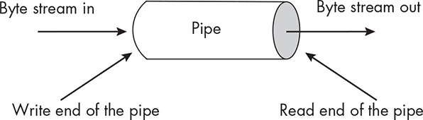
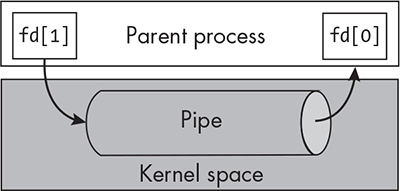
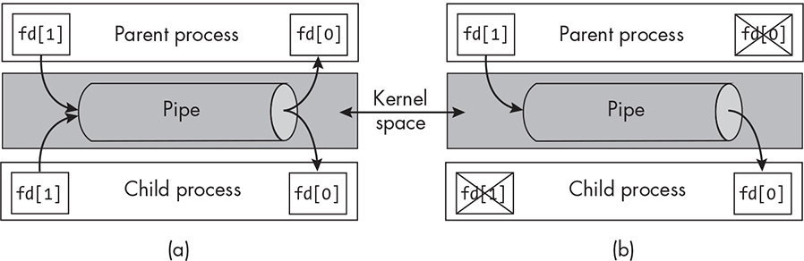
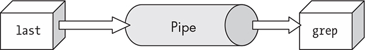
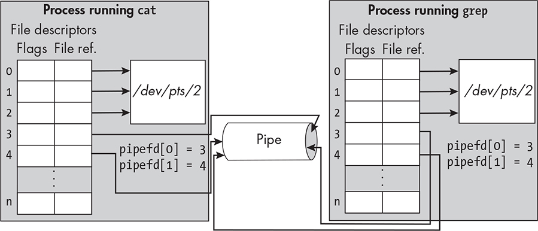
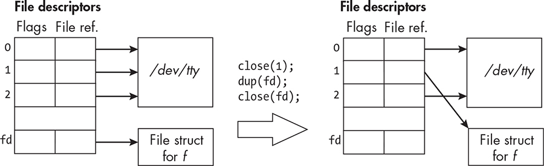
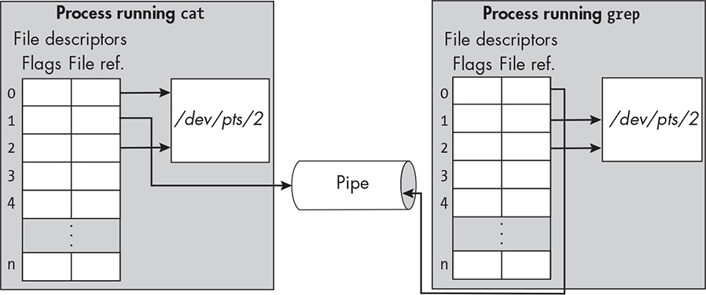
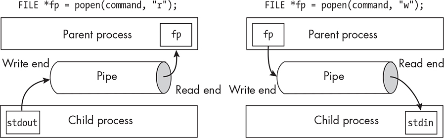

13 PIPES AND FIFOS

This chapter concentrates exclusively on pipes and FIFOs. A *pipe* is an interprocess communication facility that acts the way its name suggests

—a stream of bytes flows into it at one end and comes out in the same

order at the other end. A *FIFO* is a particular kind of pipe that’s also called a *named pipe*. FIFOs differ from ordinary pipes, which are called unnamed pipes, only in the way that they’re created, opened, closed, and removed. A FIFO can be used by any pair of processes, whereas an

unnamed pipe can only be used by processes with a common ancestor

that created and passed it down to them.

An Overview of Pipes

We’re familiar with the concept of a pipe at the command level. Most

shells, bash included, have a pipe operator. A command such as last \|

grep 'reboot'

connects the output of last to the input of grep. In this case, grep removes all lines from its input stream that don’t contain the string *reboot*, so that it only outputs lines that are produced by last and also contain the word *reboot*. The \| character is the bash pipe operator; its position between last and grep tells bash to start up two processes, one to run last and the other to run grep, and to arrange for the standard output of last to be

redirected into the standard input of grep.

This pipe functionality has an interesting origin; it was introduced into Third Edition UNIX in 1973 [\[25\]](index_split_014.html#p1238):

The basic redirectability of input-output made it easy to put pipes in when Doug Mcllroy finally persuaded Ken Thompson to do it. In one feverish night Ken wrote and installed the pipe system call, added pipes to the shell, and modified several utilities.

The shell pipe operator and a system call of the same name were

invented simultaneously. Here we’ll explore pipes, both named and

unnamed, and the system calls and functions related to programming

them.

Pipe Basics

In Chapter 12, the terms *pipe* and *FIFO* were mentioned in a few of the man pages we explored. We’ll have to read a few more man pages to

learn more about them, such as the pipe(3posix) man page. But before

looking at that one, since I always like to check whether there’s an

overview about a new topic in Section 7, let’s search that section: \$

**apropos -s7 pipe** fifo (7) - first-in-first-out special file, named pipe pipe (7) - overview of pipes and FIFOs

The first line of output answers one question—a FIFO is a first-in-first-out special file and is the same thing as a named pipe. In fact, the fifo(7) man page confirms this:

A FIFO special file (a named pipe) is similar to a pipe, except that it is accessible through the filesystem—in other words, it has a *name*. It can be opened by multiple processes for reading or writing. When processes are exchanging data via the FIFO, the kernel passes all data internally without writing it to the filesystem.

The man page uses the term *pipe* as a synonym for an unnamed pipe and prefers the term *FIFO* over *named pipe*, so I’ll do the same here.

Although FIFO is written in uppercase, the functions that work with

them use the lowercase fifo within their names. The page basically tells us in the NOTES section that we should read the pipe(7) man page for

further details.

The pipe(7) man page explains much more. Pipes and FIFOs provide

a unidirectional interprocess communication channel. *Unidirectional*

means that data can flow only in one direction through the pipe. The

end of the pipe into which bytes are written is called the *write end* of the pipe, and the end from which bytes are read is the *read end*. All bytes that are written to the write end can be read from the read end. You can visualize it like a pipe through which water flows; water enters at the write end of the pipe and leaves through the read end of the pipe, but instead of water, it’s a stream of bytes going in and out, as depicted in

Figure 13-1.

*Figure 13-1: A unidirectional pipe through which a stream of bytes flows* The only difference between FIFOs and pipes is how they’re created

and how they’re opened. Once they’ve been established, how they work

is the same. The man page explains the important properties of both

kinds of pipes, which I summarize here. In this context, I’m using the term *pipe* to refer to both kinds of pipes, since their semantics are the same.

Creating a pipe returns two file descriptors. One descriptor

refers to the read end of the pipe, and the other refers to the write

end. All communication takes the form of reads from and writes to

these descriptors.

Pipes transmit byte streams. The bytes written into a pipe have

no boundaries, the way that messages do. A reading process can

attempt to read any number of bytes out of a pipe, independent of

the number of bytes written by a writing process into it. For example, a writer might write 100 bytes into a pipe, and a reader might then

read just 32 of those bytes.

Pipes preserve the order of the data written into them. Pipes are first-in-first-out channels; the bytes read from read end of the

pipe are in the same order in which they were written into the pipe.

Reads from the pipe drain the pipe. In other words, when a

process reads some number of bytes from the pipe, they’re removed

so that only one process can read those bytes. Reads like this are also called *destructive*.

Reads are blocking by default. A read operation on a pipe is

*blocking* if it causes the process to wait if the pipe is empty. The O_NONBLOCK file status flag controls whether file operations are

nonblocking or blocking. The pipe() system call leaves this flag clear on both ends of the pipe when it creates it. This means that, unless

the process subsequently sets that flag, if a process tries to read from an empty pipe and the write end is open, then the process is blocked

until either the write end is closed or data is written into it. If the write end is closed, a read operation returns 0 immediately as if it

encountered the end of a file.

Pipes have limited capacity. If the pipe is full, a write will either block or fail, depending on whether the O_NONBLOCK flag was set on the write end of the pipe. When the pipe is created, it isn’t set; writes to a full pipe will block the calling process until a process reads from the pipe to drain some bytes from it. The capacity of the pipe is system

dependent. In the most recent Linux kernel, the capacity is 16 pages;

if the page size is 4096 bytes, the capacity is 65,536 bytes.

Writes of at most **PIPE_BUF** bytes are atomic. PIPE_BUF is a system-defined constant, defined by POSIX to be at least 512. On Linux it is

4096\. A write of at most PIPE_BUF bytes is written to the pipe as a

contiguous sequence. If two or more processes each attempt to write

to the pipe at the same time, if the number of bytes they’re each

writing is at most PIPE_BUF, their writes will each be contiguous. On

the other hand, if a process writes more than PIPE_BUF bytes, the kernel may interleave the data with data written by other processes.

There’s a lot more to understand about pipes and FIFOs, such as how they’re created, how we can read from and write to them, and so

on. We’ll start with pipes, after which we’ll read about FIFOs. The

pipe(3posix) man page is the POSIX specification of the pipe() system call.

It has a brief description of the call and some example code. Since pipe() is a system call, there’ll be a Linux man page for it in Section 2. It turns out that the Linux system call conforms to the POSIX requirements, so

we’ll read that page to learn about this call. Henceforth, I use the word *pipe* to mean an unnamed pipe.

Unnamed Pipes

An unnamed pipe is created with the pipe() system call. Its synopsis on most architectures is: \#include \<unistd.h\> int pipe(int pipefd\[2\]); On Alpha, IA-64, MIPS, SuperH, and SPARC/SPARC64 architectures,

it has a different prototype, but the *glibc* wrapper for pipe() hides the difference, so that on systems with *glibc*, we can use this single prototype.

Assuming that pipefd is declared as int pipefd\[2\];

the system call pipe(pipefd) creates a unidirectional channel called a *pipe* that can be used by two or more processes to communicate. The two file descriptors, pipefd\[0\] and pipefd\[1\], refer to the read end and write end of the pipe, respectively. If the call fails, it returns -1; otherwise, it returns 0.

Data written to the write end of the pipe is buffered by the kernel

until it is read from the read end of the pipe. A process can read from the read end (pipefd\[0\]) using the read() system call and write to the write end (pipefd\[1\]) using the write() system call. The read and write ends are opened by the pipe() call—there’s no separate call to open a pipe.

Let’s look at a simple example. Listing 13-1 demonstrates the basic principles of how a process should use a pipe, with some error handling omitted. It illustrates the steps that most programs will need to take.

*pipe_demo1.c*

\#include "common_hdrs.h"

\#include \<sys/wait.h\>

\#define READ_FD 0 /\* Make it easier to see the read end. \*/

\#define WRITE_FD 1 /\* Make it easier to see the write end. \*/

int main(int argc, char \*argv\[\])

{

int pipefd\[2\]; /\* The array of file descriptors for pipe() \*/

char buffer; /\* A single char to receive and print \*/

if ( argc \< 2 )

usage_error("Usage: pipe_demo0 \<arg\> ");

➊ if ( pipe(pipefd) == -1 )

fatal_error(errno, "pipe");

switch ( fork() ) {

case -1:

fatal_error(errno, "fork()");

case 0: { /\* Child code \*/

char label\[\] = "Child received: ";

➋ close(pipefd\[WRITE_FD\]); /\* MUST DO THIS otherwise child will

never terminate!! \*/

write(STDOUT_FILENO, &label, strlen(label));

/\* Loop while not EOF and not a read error. \*/

while ( (read(pipefd\[READ_FD\], &buffer, 1)) \> 0 )

write(STDOUT_FILENO, &buffer, 1);

write(STDOUT_FILENO, "\n", 1);

close(pipefd\[READ_FD\]);

exit(EXIT_SUCCESS);

}

default: /\* Parent code \*/

➌ close(pipefd\[READ_FD\]); /\* Parent is writing, so close read end. \*/

➍ write(pipefd\[WRITE_FD\], argv\[1\], strlen(argv\[1\]));

close(pipefd\[WRITE_FD\]); /\* Reader will see EOF. \*/

wait(NULL); /\* Wait for the child. \*/

exit(EXIT_SUCCESS);

}

}

*Listing 13-1: A program in which a parent creates a pipe, forks a child, and sends data to* *the child through the pipe* The program creates a pipe after which it forks a single child process. The parent writes its single command line argument into the pipe, and the child reads and prints whatever it reads from the pipe to the terminal.

There are several important points to make about this program. The

first is that the parent must create the pipe ➊ before it forks the child; otherwise, the child won’t have a copy of the file descriptors. After the parent creates the pipe, but before it has forked the child, only the

parent has file descriptors for it, as depicted in Figure 13-2.

*Figure 13-2: The pipe immediately after creation by the parent process* The figure illustrates another important fact: The pipe object does

not reside in the process’s address space; it’s in kernel space and is managed by the kernel. In contrast, the process owns the file descriptors that point to the open file descriptions for the two ends of the pipe (see

Figure 4-1 in Chapter 4). After the fork, the picture is different, as shown in Figure 13-3(a). The descriptors are duplicated, but the pipe itself is not.

*Figure 13-3: The pipe after the parent forks the child. (a) The state of the pipe before* *parent and child close their respective read and write descriptors. (b) Its state after.*

The fact that a pipe is unidirectional has an important implication—

*every process that has a copy of the pipe’s open file descriptors must close the end* *of the pipe it is not going to use.* In this first program, the child must close the write end ➋ because it is reading, and the parent must close the read end ➌ because it is writing. The close() system call closes a pipe’s file descriptor. Because of the way that read and write operations work,

which I’ll explain shortly, if the child reads from the pipe but has the write end open, it will block permanently when it tries to read and the pipe is empty. This is also why the parent has to close the write end ➍

when it finishes writing; otherwise, the child will block when it tries to read from the pipe.

WARNING

*It is a very common and hard-to-debug mistake to forget to close the* *unused file descriptor on a pipe. In particular, always make sure that a* *process intended to read from a pipe closes the write end of the pipe before* *anything else.*

The last observation about this program is that no synchronization

is needed when parent and child exchange data through the pipe. The

kernel manages the pipe and ensures that all accesses are free of race conditions.

Here are two sample runs of pipe_demo1: \$ **./pipe_demo1 hello** Child received: hello \$ **./pipe_demo1 'Mr. Watson, come here. I want**

**you.'** Child received: Mr. Watson, come here. I want you.

In the second run, the argument is enclosed in single quotes because

this program expects a single command line argument.

PIPES AND LINUX PLUMBING

A pipe is not a file. When pipe() is called, the kernel creates two

open file descriptions (file structures), one for the read end and

one for the write end of the pipe. Even though these are file

structures, they do not have any disk storage. The kernel also

creates an inode for the pipe, but this inode is part of a special,

hidden filesystem called a *pipefs*. This filesystem is not mounted in the system’s directory hierarchy. The open file descriptions and the

inode are used by the kernel to manage the pipe. They include

internal storage buffers in kernel memory, queues of blocked

processes, file offsets, and so forth.

*The Behavior of Read Operations on Pipes*

The semantics of reading from a pipe are much more complex than the

semantics of reading from a file, primarily because the POSIX

requirements for reads from a pipe are themselves complex. Whether or

not a read blocks, succeeds, or fails depends on factors such as whether the O_NONBLOCK flag is set on the pipe, whether the pipe is open for writing, whether any writers are currently sleeping, whether the pipe buffer is empty or has enough bytes to satisfy the read, and so on. In the

following discussion, I’ll use the term *pipe* interchangeably with *pipe*

*buffer*. Table 13-1 summarizes what happens when a process tries to read *n* bytes from a pipe that currently has *p* bytes in it.

Table 13-1: The Semantics of Reading *n* Bytes from a Pipe Containing *p* Bytes

At least one process has the pipe open for

writing

Pipe

No

size

Blocking read

writing

( ***p***)

Nonblocking process

At least one

No writer is read

sleeping writer

sleeping

*p* = 0

Repeatedly wait for Block until

Return -EAGAIN. Return 0.

sleeping writers to

data is

write data until *n*

available,

bytes have been

copy it, and

written and copied, return its

returning *n*.

size.

0 \< *p*

Copy *p* bytes and return *p*, leaving the

\< *n*

pipe empty.

*n* \<= *p*

Copy *n* bytes and return *n*, leaving *p* – *n* bytes in the pipe buffer.

The read semantics depend upon whether a writer has been put to

sleep; if it tried to write into the pipe previously but the pipe buffer was full, it is made to sleep. On a blocking read request, if the number of bytes requested ( *n*) is greater than what is currently in the pipe ( *p*) and at least one writer was forced to sleep because the pipe was full when it tried to write, the read will obtain as many bytes as are currently

available. It will then wait for the remaining bytes to be written by the writing processes that are woken up by the read that emptied the pipe.

The read will continue to read until it obtains all *n* bytes. If no writer is sleeping and the pipe is empty, the read will block until some data

becomes available.

*The Behavior of Write Operations on Pipes*

The writing semantics are also somewhat complex. Table 13-2

summarizes the POSIX requirements for a write() system call requesting to write *n* bytes into a pipe that has *f* free bytes in the pipe buffer.

POSIX defines the requirements in terms of the constant PIPE_BUF

defined earlier, currently equal to 4096 bytes. The amount of free space, *n*, is at most PIPE_BUF.

Table 13-2: The Semantics of Writing *n* Bytes into a Pipe with *f* Free Bytes

Free

At least one reading process

space in

No reading

buffer

process

***f***

Blocking write

Nonblocking write

*f* \< *n* \<=

Block until *n* - *f*

Return -EAGAIN.

Send SIGPIPE

PIPE_BUF

bytes are removed,

signal and

copy *n* bytes, and

return -EPIPE.

return *n*.

PIPE_BUF \<

Copy *n* bytes,

If *f* \> 0, copy *f* bytes

*n*

blocking as

and return *f*;

needed, and return otherwise, return -

*n*.

EAGAIN.

*n* \<= *f*

Copy *n* bytes and return *n*.

Let’s start with the easy parts of this. First, if no process has the read end of the pipe open, the write fails, write() returns -EPIPE, and the kernel sends a SIGPIPE signal to the process. Let’s assume now that at least one process is reading from the pipe. Then the response by write() depends on the amount of data to be written.

If the number of bytes to transfer ( *n*) is at most the amount of free space ( *n* \<= *f* \<= PIPE_BUF), all of the bytes are transferred and the call returns *n*. In this case, data is written atomically. Now let’s also assume that writes are blocking. A write of at most PIPE_BUF bytes is performed atomically, whether the writing is blocking or not. If the space is not

available, it blocks until it is. If *n* is greater than PIPE_BUF, the writes are broken up into smaller chunks and transferred nonatomically, and

write() returns *n* when it completes the transfer. The last cases to consider are when the O_NONBLOCK flag is set. If not enough space is

available in the pipe buffer but the amount to transfer is at most PIPE_BUF, write() returns -EAGAIN immediately. If PIPE_BUF \< *n*, then if there is any free space ( *f* \> 0), *f* bytes are transferred, filling the pipe buffer, and write() returns *f*. Otherwise, it returns -EAGAIN.

This might seem pretty daunting to understand. Let’s develop a few

more programs that use these unnamed pipes to get more of a feel for

them.

*A Producer-Consumer Example*

In Chapter 11, we developed the *waitpid_demo.c* program to demonstrate how to use the waitpid() system call, but we also used that program to present a race-free solution to the producer-consumer

problem. That program created two child processes: One produced text

and wrote it to a file, and the other read from that file. The program used a two-pronged approach consisting of the pread() system call and

the O_APPEND flag set on the file’s descriptor to prevent race conditions.

Equipped with our new knowledge, we can create a more efficient

producer-consumer program in which the two child processes

communicate through a pipe. To reduce the program size, we can

exclude the code related to collecting the status of terminated child

processes, as well as some of the error-handling code. An actual program should not do this!

The most important parts of this program are how it works with the

pipe. The main() function does very little, but what it does is crucial: 1. The main() function creates the pipe and then forks the two child

processes.

2\. Since the parent is not involved in the communication between the

two children, it immediately closes both ends of the pipe. Failure

to do so can cause the consumer process to hang, because the write

end of the pipe would be held open by the parent and it would

block permanently in its call to read() even after the producer terminated.

3\. The main() function then calls wait() so that the two child processes do not become zombies when they terminate.

The main program code follows: *pipe_demo2.c* main() \#include

"common_hdrs.h" \#include \<sys/wait.h\> \#include \<ctype.h\> \#define READ_FD 0 /\* Make it easier to see the read end. \*/ \#define

WRITE_FD 1 /\* Make it easier to see the write end. \*/ int main(int

argc, char \*argv\[\]) { int pipefd\[2\]; /\* The array of file descriptors for pipe() \*/ if ( pipe(pipefd) == -1 ) /\* Create the pipe. \*/ fatal_error(errno,

"pipe"); /\* Create the producer process. \*/ switch ( fork() ) { case -1: fatal_error(errno, "fork"); case 0: producer(pipefd); default: break; } /\*

Create the consumer process. \*/ switch ( fork() ) { case -1:

fatal_error(errno, "fork"); case 0: consumer(pipefd); default: break; } /\*

Close both ends of the pipe. \*/ close(pipefd\[READ_FD\]);

close(pipefd\[WRITE_FD\]); /\* Wait for children to terminate. \*/ for (

int i = 0; i \< 2; i++ ) if ( wait( NULL) == -1 ) break;

exit(EXIT_SUCCESS); }

The producer process will execute slightly different code than it did

in the *waitpid_demo.c* program. Instead of generating a few characters, it reads user input from the terminal and sends it to the consumer through the pipe. We’ll have to terminate the program by sending it a CTRL-D.

The producer must close the read end of the pipe: *pipe_demo2.c*

producer() void producer(int fd\[\]) { char \*line = NULL; size_t len = 0; ssize_t nread; close(fd\[READ_FD\]); /\* Cannot read and write. \*/ while (

(nread = getline(&line, &len, stdin)) != -1 ) write(fd\[WRITE_FD\], line, nread); free(line); /\* line was allocated by getline(). \*/

close(fd\[WRITE_FD\]); /\* Closing write end allows consumer to

terminate. \*/ exit(EXIT_SUCCESS); }

The producer writes what we enter in the terminal window into the

pipe. We’ll be able to use this program to send arbitrarily large amounts of data into the pipe.

The consumer, in contrast, reads one byte at a time, intentionally, to emphasize that once the data is in the pipe, it’s just a stream of bytes; it

isn’t efficient to read a byte at a time. The consumer converts all

lowercase text to uppercase. In a production version of the program,

we’d make sure to set the locale so that the rules for uppercase and

lowercase are consistent with the user’s locale settings: *pipe_demo2.c* consumer() void consumer(int fd\[\]) { char buffer, ch; ➊

close(fd\[WRITE_FD\]); /\* Loop while not EOF and not a read error. \*/

while ( read(fd\[READ_FD\], &buffer, 1) \> 0 ) { ch = toupper(buffer); write(STDOUT_FILENO, &ch, 1); } if ( close(fd\[READ_FD\]) == -1 )

fatal_error(errno, "close"); exit(EXIT_SUCCESS); }

A run of the executable, named pipe_demo2, follows: \$ **./pipe_demo2**

**LET us go then, you and I,** LET US GO THEN, YOU AND I,

**When the evening is spread out against the sky** WHEN THE

EVENING IS SPREAD OUT AGAINST THE SKY **Like a patient**

**etherised upon a table** LIKE A PATIENT ETHERISED UPON A

TABLE ^D

Try commenting out the code in the consumer that closes the write end

of the pipe ➊ and rebuilding and running the program. What happens?

Do the same with the main program.

*A Shell Pipe Simulation*

When we enter a pipelined command such as \$ **last \| grep reboot**

the shell creates a pipe like the one depicted in Figure 13-4.

*Figure 13-4: The state of the processes’ open file descriptors after pipe creation* We can verify this by performing an experiment in which we look at

a few files in the */proc* pseudofilesystem while running a pipelined command. Instead of last, we’ll use cat as the first command, because cat won’t terminate until we enter CTRL-D or kill it with a signal. For each process, say with PID \< *p*\>, the directory */proc/\<p\>/fdinfo/* contains a file for each open file descriptor, named *0*, *1*, *2*, and so on, and the directory

*/proc/\<p\>/fd/* contains symbolic links, *0*, *1*, *2*, and so on, to the actual open files. The files in *fdinfo* contain information about those descriptors, such as the position of its file offset, the flags passed when it was opened, and its inode number.

Open two terminals, and in the first, enter the command: \$ **cat \|**

**grep reboot**

In the second terminal, use pidof to get the PIDs of the processes

running cat and grep. If pidof isn’t available on your system, use ps -u instead: \$ **pidof cat** 13325 \$ **pidof grep** 13326 \$

Now look at the *fdinfo* files for descriptors 0 and 1 of the cat process: \$

**cat /proc/13325/fdinfo/0** pos: 0 flags: 02000002 mnt_id: 27 ino: 5 \$

**cat /proc/13325/fdinfo/1** pos: 0 flags: 01 mnt_id: 14 ino: 94990

The ino field is the inode for the file. Notice the inode numbers for

descriptors 0 and 1. The inode for 1 is a much larger number. Now look at the symbolic links for both of these file descriptors: \$ **for i in 0 1;** **do echo -e -n "\$i: "; readlink /proc/13325/fd/\$i; done** 0:

/dev/pts/2 1: pipe:\[94990\]

The descriptor for standard input points to the device file */dev/pts/2*, but the descriptor that usually points to the terminal points to a pipe whose pipe inode number is 94990. This is proof that bash redirected standard output of this process to a pipe.

Let’s repeat this for the process running grep: \$ **cat**

**/proc/13326/fdinfo/0** pos: 0 flags: 00 mnt_id: 14 ino: 94990 \$ **cat**

**/proc/13326/fdinfo/1** ppos: 0 flags: 02000002 mnt_id: 27 ino: 5

The descriptor for standard input points to the same pipe inode as the descriptor for standard output of the cat command. Let’s look at the

symbolic links also: \$ **for i in 0 1; do echo -e -n "\$i: ";** **readlink /proc/13326/fd/\$i; done** 0: pipe:\[94990\] 1: /dev/pts/2

This proves that the shell performed the magic of connecting the two

processes with a pipe. We just don’t know how.

There are key differences between what bash has to do to arrange

this pipe and what our pipe_demo2 program does.

For one, our program’s child processes execute code that’s part of

our own program, whereas the child processes created by the shell

execute code that isn’t part of the shell program. In our program, the code that the two child processes executed explicitly closed the file

descriptors. In contrast, the programs executed by the processes that the shell created, in this case cat and grep, are filters whose input and output are the standard input and standard output streams of the process. For example, the output of cat is written to the terminal unless it is

redirected, and the input of grep is the standard input stream, unless it has a filename argument on its command line. Their code cannot be

altered!

Instead, the shell itself has to arrange for the descriptor that

normally points to the standard output stream of the process executing cat to be replaced by the descriptor for the write end of a pipe, and it similarly has to arrange for the descriptor that points to the standard input of the process executing grep to be replaced by the descriptor for the read end of the same pipe.

Figure 13-5 illustrates the state of the descriptors and the pipe after bash created the pipe and the two processes in our experiment. The read and write ends of the pipe are file descriptors 3 and 4 in each process, assuming that no files were opened before. In other words, if pipefd is the array filled by the call to pipe(), then pipefd\[0\] == 3 and pipefd\[1\] == 4.

*Figure 13-5: The state of the pipe and file descriptors immediately after* *bash* *created the* *pipe*

Replacing what one descriptor, say firstfd, points to with what

another descriptor, say secondfd, points to can be thought of as a two-step procedure:

1\. Close the descriptor firstfd.

2\. Duplicate the descriptor secondfd into firstfd.

We need a function that can duplicate a file descriptor, meaning that

it creates a second pointer to the file structure pointed to by the original and copies it into another descriptor. If such a function existed, we could copy the pipe’s write end descriptor into the descriptors for standard input and output.

We can search the man pages for functions that copy, or duplicate,

descriptors with apropos -s2,3 -e descriptor \| grep -E 'copy\|duplicate' and discover the dup(), dup2(), and dup3() system calls, as well as the POSIX

specification of dup(). The dup3() call is a Linux-specific extension. Let’s

examine the first two. Their synopsis is: \#include \<unistd.h\> int dup(int oldfd); int dup2(int oldfd, int newfd);

The dup() system call has one argument, whereas dup2() has two. The call dup(oldfd) creates a copy of the file descriptor oldfd, using the lowest-numbered unused file descriptor for the new descriptor.

LOWEST-NUMBERED UNUSED FILE

DESCRIPTORS

The dup() system call is one of several system calls that, when they

need to allocate a new descriptor, choose the lowest-numbered

unused file descriptor. POSIX requires that any function that

allocates a new file descriptor must always choose the lowest-

numbered unused descriptor in that process. Others include open(),

creat(), pipe(), and socket().

As an example, the following code redirects the standard output for

the current process to a file, previously opened, named *f*, to which fd refers: int fd; *--snip--* close(1); /\* Close descriptor 1, which is now the lowest unused descriptor.\*/ dup(fd); /\* Now descriptor 1 points to the same file as fd. \*/ close(fd); /\* Close the original descriptor. \*/

This code hinges on the fact that dup() always chooses the lowest-

numbered unused file descriptor. Figure 13-6 illustrates the state of the descriptors before and after the code is executed.

*Figure 13-6: The redirection of standard output to a file* f *referred to by descriptor* *fd, using* *dup()*

We could use this same strategy to redirect standard output to a

pipe: int pipefd\[2\]; if ( pipe(pipefd) == -1 ) // Handle error and exit. *--*

*snip--* close(1); /\* Close descriptor 1, making it lowest unused descriptor.\*/ dup(pipefd\[1\]); /\* Now descriptor 1 points to the write end of the pipe. \*/ close(pipefd\[1\]); /\* Close the pipe's write end descriptor.

\*/

Neither of these code snippets is guaranteed to work in all

circumstances. The problem is that if a program has any signal handlers and a signal arrives after the closing of descriptor 1 but before the call to dup(), the signal handler might open a new file descriptor, using slot 1, and dup() will not duplicate the descriptor into standard output. This race condition is the reason why dup2() was created.

The dup2(fd, fdtoreplace) system call atomically performs the two

steps of closing fdtoreplace and replacing it with fd. It eliminates the potential race condition I just described. In fact, dup() is now deprecated.

To redirect standard output into the pipe, we can use the following,

assuming the pipe was already created: dup2(pipefd\[1\], 1); /\* Now

descriptor 1 points to the write end of the pipe.\*/ close(pipefd\[1\]); /\*

Close the pipe's write end descriptor. \*/

A similar strategy works for redirecting standard input to a pipe’s read end descriptor: dup2(pipefd\[0\], 0); /\* Now descriptor 0 points to the

read end of the pipe. \*/ close(pipefd\[0\]); /\* Close the pipe's read end descriptor. \*/

Going back to our example, if the child process that executes cat

performs the steps dup2(pipefd\[1\], fileno(stdout)); /\* Now stdout points to write end of pipe. \*/ close(pipefd\[0\]); /\* Close read end of pipe. \*/

close(pipefd\[1\]); /\* Close write end of pipe. \*/

and the child process that executes grep performs the steps

dup2(pipefd\[0\], fileno(stdin)); /\* Now stdin points to pipefd\[1\]. \*/

close(pipefd\[0\]); /\* Close read end of pipe. \*/ close(pipefd\[1\]); /\* Close write end of pipe. \*/

the pipe will be set up properly, and the state of each process’s open file descriptors will be as shown in Figure 13-7.

*Figure 13-7: The file descriptor tables of the* *cat* *and* *grep* *processes with the set-up pipe* There’s just one hitch. If, for some reason, either of the standard

descriptors were closed prior to creating the pipe, one or both of the pipe’s descriptors would be either 0 or 1, since pipe() will allocate the lowest-numbered unused descriptors. Suppose standard input had been

closed. Then the preceding code would be equivalent to dup2(0, 0)); close(0); close(1);

and the process would crash when it tried to read from the pipe.

Therefore, safe code should test that pipefd\[0\] != 0 and pipefd\[1\] != 1

before calling dup2().

The book’s source code repository has a complete program named

*shel pipe_demo.c* that shows how to simulate the shell’s creation of a two-command pipeline. Its usage is: shellpipe_demo \<prog\> \[options\] \[args\]

'\|' \<prog\> \[options\] \[args\]

The vertical bar must be enclosed in quotes to prevent the shell from

treating it as its own pipe operator. Here is a sample run of this

program: \$ **./shellpipe_demo ls -lt . '\|' grep 'demo\[12\].c'** **-**

**rw-rw-r-- 1 stewart stewart 3168 May 25 17:03 pipe_demo2.c** **-**

**rw-rw-r-- 1 stewart stewart 2998 May 24 12:40 pipe_demo1.c**

A version of the program follows, pared down and with some error

handling omitted to save space. This version’s usage is shellpipe_demo *prog1*

*prog2*, in which the two programs cannot have options or arguments: *shellpipe_demo.c* \#include "common_hdrs.h" \#include \<sys/wait.h\>

\#define READ_FD 0 /\* Make it easier to see the read end. \*/ \#define

WRITE_FD 1 /\* Make it easier to see the write end. \*/ int main(int

argc, char \*argv\[\]) { int fd\[2\]; if ( argc \< 3 ) usage_error("Usage: shellpipe_demo command command"); if ( -1 == pipe(fd) )

fatal_error(errno, "pipe"); switch ( fork() ) { case -1: fatal_error(errno,

"fork"); case 0: /\* Child 1 \*/ dup2(fd\[WRITE_FD\], fileno(stdout)); /\*

Now stdout points to fd\[1\]. \*/ close(fd\[READ_FD\]); /\* Close read end

of pipe. \*/ close(fd\[WRITE_FD\]); /\* Close write end of pipe. \*/

execlp(argv\[1\], argv\[1\], (char\*) NULL); /\* Run the first command. \*/

fatal_error(errno, "execlp"); default: break; } switch ( fork() ) { case -1: fatal_error(errno, "fork"); case 0: dup2(fd\[READ_FD\], fileno(stdin)); /\*

Now stdin points to fd\[0\]. \*/ close(fd\[READ_FD\]); /\* Close read end of pipe. \*/ close(fd\[WRITE_FD\]); /\* Close write end of pipe. \*/

execlp(argv\[2\], argv\[2\], (char\*) NULL); /\* Run the second command. \*/

fatal_error(errno, "execlp"); default: close(fd\[READ_FD\]); /\* Parent closes its ends of the pipe. \*/ close(fd\[WRITE_FD\]); for ( int i = 1; i \<=

2; i++ ) if ( wait(NULL) == -1 ) fatal_error(errno, "wait"); exit(EXIT_SUCCESS); } }

Here’s a run of this program: \$ **./shellpipe_demo ls wc** 79 79 1065

*Best Practices Regarding Pipes*

Quite a bit can go wrong when working with pipes, and there are some

important facts to remember about using pipes with nonblocking reads

and writes. Some of these have been mentioned already and some not.

The following list consolidates them into a single place:

If a write() is made to a pipe that is not open for reading by any

process, a SIGPIPE signal will be sent to the writing process, which, if not caught, will terminate that process. If it is caught, after the

SIGPIPE handler finishes, the write() will return with a -1, and errno will be set to the value EPIPE.

If there are one or more processes writing to a pipe, if a reading

process closes its read end of the pipe and no other processes have

the pipe open for reading, each writer will be sent the SIGPIPE signal, and the preceding rules regarding handling of the signal apply to

each process.

As long as one writer has a pipe open for writing, a call to read() will remain blocked until there is data in the pipe. Therefore, if all

writers finish writing to the pipe but a single writer fails to close

the write end of the pipe, if a reader calls read(), the reader will

remain permanently blocked. Once all writers close the write ends

of the pipe, the read() will return 0.

A write() to a full pipe will block the writer until there are PIPE_BUF

free bytes in the pipe.

Unlike reads from a file, read() requests to a pipe drain the pipe of

the data that was read. Therefore, when multiple readers read from

the same pipe, no two read the same data.

Writes are atomic as long as the number of bytes is smaller than

PIPE_BUF.

Reads are atomic in the sense that, if there is any data in the pipe when the call is initiated, the read() will return with as much data as is available, up to the number of bytes requested, and it is

guaranteed not to be interrupted.

Processes cannot seek() on a pipe.

The popen() and pclose() Library Functions

The system() library function introduced at the end of Chapter 11 allows a program to execute an arbitrary shell command, but it doesn’t enable the calling program to send data to the standard input of that command or to read the data from the standard output of that command. For this we can use popen(). The pipe(2) man page mentioned popen(3) in its SEE ALSO

section.

Like system(), popen() can execute an arbitrary shell command line, but unlike system(), the shell command runs in parallel to the calling process.

It has the same cost overhead as system() because it creates a process in which to run a shell and executes that shell, passing it a NULL-terminated string containing a shell command line to execute; this in turn causes that shell to create child processes to execute one or more commands

from the command line string.

Unlike system(), before it forks any processes, popen() sets up a pipe between the calling process and the command to execute and establishes a C FILE\* stream pointer that can be used to read from or write to the pipe, depending on the mode of operation.

The synopsis on its man page is: \#include \<stdio.h\> FILE

\*popen(const char \*command, const char \*mode); int pclose(FILE

\*stream);

The first argument is a string containing the command to execute. The

second argument (mode) is a string that specifies its I/O mode. It must contain either r for reading or w for writing but not both. If successful, it returns a FILE\* pointer to a stream that can be used to either read from or write to the pipe. On failure, it returns NULL.

NOTE

*It’s helpful to remember that the* *popen()* *function has the same syntax as* *the C Library function* *fopen(). In* *popen(), the first argument is a* *command to execute, whereas in* *fopen(), it’s the pathname of a file. Both* *return a file stream pointer and, in each, the second argument indicates* *whether that stream is open in read-only or write-only mode.*

In effect, popen() creates a pipe, forks a new process, closes and

duplicates file descriptors as needed, and within that child process runs the system-dependent default shell (sh) by exec-ing execl( *shell_path*,

"sh", "-c", *command*, (char \*)0);

where *shell_path* is the absolute pathname of sh. The -c flag passed to the shell tells it to execute the *command* argument, and popen() ensures that any streams from previous calls to popen() that are still open in the calling process are closed in the new child process to prevent potential race

conditions.

The mode argument defines whether the calling process can read

from or write to the returned stream. The internal actions are as

follows:

If it contains r, the calling process is returned a FILE\* pointing to the read end of the pipe and the child process’s standard output is

attached to the write end of the pipe so that the command that it

executes puts its output into the pipe instead of the terminal.

If it contains w, , the calling process is returned a FILE\* pointing to the write end of the pipe, and the child process’s standard input is

attached to the read end of the pipe so that the command that it

executes gets its input from the pipe instead of the standard input

device.

If it contains both, it results in an error.

In Linux, the mode may optionally contain e, which if present,

enables the close-on-exec flag for the file descriptor underlying the

returned file stream pointer.

THE CLOSE-ON-EXEC FLAG

In Chapter 11 we saw that open file descriptors remain open by default when a process calls execve(). Enabling the *close-on-exec* flag on an open file descriptor causes it to be closed instead. This is

useful when a child process executes a new program that shouldn’t

access this descriptor.

Figure 13-8 depicts the two possible modes of communication.

*Figure 13-8: The two different methods of establishing communication with* *popen()* The pclose() function closes the stream opened by popen() and waits

for the command to terminate. It returns the termination status of the child process created by popen(), unless that status is unavailable to pclose(), in which case it returns -1 and sets errno to ECHILD. This can happen if the parent process called any wait function while the child was running to wait for some other child process it forked.

WARNING

*File streams created with* *popen()* *must be closed with* *pclose(), not* *fclose()!*

Let’s look at a simple example program in which the parent process

simulates a pipe between two commands given on the command line,

without explicitly creating a pipe. Instead, it makes two calls to popen() and becomes the intermediary between the child processes executing

the two commands. In effect, the parent replaces the pipe by

transferring the output of one process to the input of the other:

*popen_demo.c* \#include "common_hdrs.h" \#include \<sys/wait.h\> int main(int argc, char \*argv\[\]) { int nbytes; /\* Number of bytes read from pipe \*/ FILE \*fin; /\* Stream pointing to read end of pipe \*/ FILE \*fout;

/\* Stream pointing to write end of pipe \*/ char buffer\[PIPE_BUF\]; /\*

Buffer for transferring data \*/ int status1, status2; /\* For collecting status of processes \*/ if ( argc \< 3 ) usage_error("Usage: popen_demo command1 command2\n"); if ( (fin = popen(argv\[1\], "r")) == NULL ) fatal_error(errno, "popen"); if ( (fout = popen(argv\[2\], "w")) == NULL ) fatal_error(errno, "popen"); /\* Read the output of first command through the descriptor for fin and write that output into the descriptor for fout, the write end of the pipe that the second command reads as its input. \*/ while ( (nbytes = read(fileno(fin), buffer, PIPE_BUF)) \> 0 ) if (

-1 == write(fileno(fout), buffer, nbytes) ) fatal_error(errno, "write"); if (

nbytes \< 0 ) fatal_error(errno, "read"); status1 = pclose(fin); status2 =

pclose(fout); if ( status1 == -1 \|\| status2 == -1 ) fatal_error(errno,

"pclose"); if ( WIFSIGNALED(status1) ) printf("'%s' terminated by signal %d\n",argv\[1\], WTERMSIG(status1)); if (

WIFSIGNALED(status2) ) printf("'%s' terminated by signal

%d\n",argv\[2\], WTERMSIG(status2)); return 0; }

*Listing 13-2: A program that simulates a pipe using two calls to* *popen()* You can run this program with multiword commands by enclosing the entire command in single quotes. For example, assuming the executable has been named popen_demo, the following pipes the man page search for *pipe* into grep: \$ **./popen_demo 'apropos -s2,3 pipe' 'grep posix'**

pclose (3posix) - close a pipe stream to or from a process pipe (3posix) - create an interprocess channel popen (3posix) - initiate pipe streams to or from a process The same caveats apply to the use of popen() as to system() (see

Chapter 11). We haven’t explored other issues related to popen(),

including how the C Standard I/O Library’s buffering of input and output affects reading and writing of the pipe through the C I/O stream and how various signals affect the execution of this function. For

example, because popen() is using C file streams, which use block

buffering for pipes and files, writes into the pipe are only written into the pipe when the buffer is full or the pipe is closed, and consequently the data isn’t seen at its read immediately. To force the writes to appear immediately, you have to disable block buffering or flush frequently.

The POSIX specification of popen() has a more detailed discussion of

some of the nuances of using this function.

FIFOs

Unnamed pipes are an elegant mechanism, but their usefulness is

somewhat limited. For one, they can only be shared by *related processes*, meaning those with a common ancestor that created a pipe which

propagated down through calls to fork(), such as when a parent creates a pipe and then forks a child. Also, they cease to exist as soon as the

processes that are using them terminate, which implies that they must

be re-created every time they’re needed. If we want to use them in a

program with which any other process can communicate, the other

processes will need to know the name of the pipe to use, but an

unnamed pipe has no such name.

Named pipes, or FIFOs, make up for these limitations. A FIFO has

the same reading and writing semantics as an unnamed pipe; all of the

rules described in “Unnamed Pipes” on page 648 in terms of reading and writing apply to named pipes as well. The difference between

named and unnamed pipes is only in how they’re created and opened.

Named pipes are unlike unnamed pipes in that:

They exist as directory entries in the file system and therefore have

associated permissions and ownership.

They can be used by processes that are not related to each other.

They can be created and deleted at the shell level or through the

system API.

Although they have directory entries, they have no contents in the filesystem: They have no disk storage, even when they’re being used,

because they exist only in kernel memory. The directory entry for a

FIFO serves only as a means for processes to access it using a name in the filesystem.

All of the preceding programs we developed were single stand-alone

programs. FIFOs enable us to create client-server applications. A *client-server application* consists of two components: a server and a client. A *server* program is one that can provide services to other processes. The processes that request these services are called its *clients*. In Chapter 14

we’ll study how to create true client-server applications. Here we’ll

concentrate on the use of FIFOs for creating programs that

communicate but which are not necessarily true client-server

applications. Specifically, one process will act like a server in the sense that it will be the only process reading from the FIFO, but it will not send any data back to processes that send data to it, and one process will act like a client in that it sends data to the server, but it will not be designed to receive any response from the server. I’ll call these

applications *client-server–like* applications.

*Creating Named Pipes in the Shell*

Before we explore how to create and use FIFOs in programs, let’s look

at how we can create them at the user level. Searching for commands

related to FIFOs with apropos -s1 fifo yields a Linux man page for the mkfifo command and a POSIX man page for it. POSIX also specifies

another command, mknod, which is a general-purpose utility for creating device special files, including FIFOs, but POSIX recommends that

FIFOs should be created with mkfifo, not mknod. Since the mkfifo command is also simpler to use, we’ll work with that one.

We’ll create a FIFO named *MYFIFO* in the */tmp* directory. The */tmp* directory exists on every Unix system; it’s intended as a place for

programs to create temporary files and is usually configured to allow all users to create files there. It usually has the sticky bit enabled, so that only the owner and the superuser can delete them: \$ **ls -ld /tmp**

drwxrwxrwt 20 root root 12288 May 29 09:47 /tmp/

To create *MYFIFO* there, enter: \$ **mkfifo /tmp/MYFIFO**

This creates the FIFO */tmp/MYFIFO*. It’s fairly common to use

uppercase names for FIFO names to make them easier to spot in

directory listings.

The default mode on a FIFO is rw-rw-rw- prior to applying the umask

value. Since my umask is 022, the new FIFO’s permissions are rw-r--r--: \$

**ls -l /tmp/MYFIFO** prw-r--r-- 1 stewart stewart 0 May 29 09:53

/tmp/MYFIFO

Notice that FIFOs are identified in the output of ls -l by the p file type.

The -m option can be used to override the default mode. It’s easiest to give it the mode in octal; if you use a symbolic mode string such as

"go+w" or "go-w", the + and – operators are interpreted as adding or subtracting from rw-rw-rw-. Thus, the two commands \$ **mkfifo -m644**

**/tmp/FIFO1** \$ **mkfifo -m"go-w" /tmp/FIFO2**

create */tmp/FIFO1* and */tmp/FIFO2* with the same permission rw-r--r--.

NOTE

*In Linux, the mode supplied to the* *mkfifo* *command is not modified by* *the* *umask, but POSIX.1-2024 doesn’t specify exactly how this mode must* *be used. It only requires that the actual mode created with the* *-m* *option* *should be at least as restrictive as the argument supplied to* *-m.*

Let’s demonstrate the FIFO’s operation with a small experiment. If

the FIFO */tmp/MYFIFO* does not exist, create it with permission 666.

Open a second terminal window. In the first terminal, enter the

command: \$ **cat \< /tmp/MYFIFO**

The shell prompt will not return because the cat command is now

waiting for input from the FIFO, which is still empty. If you background it, the shell prompt will return. In the second terminal, enter: \$ **echo**

**"Today's lesson is about FIFOs. " \> /tmp/MYFIFO**

In the first terminal you’ll now see Today's lesson is about FIFOs.

which shows that the data put in the FIFO by echo was read by cat.

Although this is interesting to observe, FIFOs are really intended as an

IPC facility for programs, not user-level utilities, so let’s now turn to programming with them.

*Creating FIFOs*

The first step is finding the function that can create a FIFO. A search limited to Sections 2 and 3 of the man pages turns up the mkfifo(3) man page, and possibly a reference to the mknod(2) page, but both POSIX and Linux advocate using mkfifo() instead, which is easier to use than mknod().

Therefore, we’ll use mkfifo() to create all FIFOs. Its synopsis is: \#include

\<sys/types.h\> \#include \<sys/stat.h\> int mkfifo(const char \*pathname, mode_t mode);

The call mkfifo(MYFIFO, 0666), when successful, creates a FIFO named

MYFIFO with permission 0666 & ~ umask and returns 0. If it fails, it sets errno and returns -1. Notice that, unlike the mkfifo command, the umask is

applied to the mode passed to the mkfifo() function.

One of our first decisions in designing client-server–like applications is where to put the FIFO. The server has to create it, which implies that it has to be in a directory that it has privilege to modify. Also, clients need to know where to find it. It’s useful to distinguish between public and private FIFOs. A *public FIFO* is one that is known to all clients.

There’s no specific function that makes a FIFO public; rather, it’s just that it’s given a name that’s easy to remember and its location is made known so that client programs can find it. Some authors call these *wel -*

*known FIFOs* because they are analogous to the well-known ports used for network sockets. A *private FIFO*, in contrast, has a name that’s known only to the process that creates it and the processes to which it chooses to divulge it.

Common choices for the location of a public FIFO are:

The */tmp* directory

The */var/tmp* directory

A subdirectory of */run* dedicated to the server, provided it has superuser privilege to create it

In most modern implementations of Unix, the */tmp* directory is cleaned on reboot. If the FIFO needs to survive reboots, this is not a good location for it; instead, it should be created in the */var/tmp* directory, since it doesn’t get cleaned as often. If we’re developing a system program that will be owned by root, then it’s best to create the FIFO in */run/\<servername\>/*, since this will not be purged at all. The file-hierarchy(7) and hier(7) man pages contain more detailed

information about the different choices, and a discussion of security

issues regarding the location of the FIFO can be found at

[*https://systemd.io/TEMPORARY_DIRECTORIES/*](https://systemd.io/TEMPORARY_DIRECTORIES/).

*Opening FIFOs*

Whereas unnamed pipes are opened by the pipe() call, FIFOs are

opened as if they were ordinary files, with the open() system call. The POSIX requirements for the opening semantics of FIFOs make opening

them a bit more complicated than you might expect. These

requirements are described in the fifo(7) man page. Because the

intended use of FIFOs is for a writing process to send data to a reading process, the requirements are designed to synchronize the opening of

each end of the FIFO by stipulating the following:

A FIFO must be opened on both ends, meaning both reading and

writing, before data can be written into it.

If the O_NONBLOCK flag is clear, a process that opens one end of a FIFO

will block until the other end is opened.

One way to satisfy these requirements is to open the FIFO for reading

and writing with the O_RDWR flag, and Linux does support this, but POSIX

does not and warns against it; programs using this approach may not

work properly on other Unix systems. The POSIX requirements for the

semantics of opening a FIFO for reading or writing and in both

blocking and nonblocking mode are summarized in Table 13-3. If the

other end of the FIFO is open, the call to open() always succeeds. The table describes what happens when the other end isn’t open.

Table 13-3: The Semantics of Opening a FIFO When the

Other End Is Not Open

Operation Blocking mode Nonblocking mode

Reading

Process blocks

Call returns 0 immediately

Writing

Process blocks

Call fails, setting errno to ENXIO

Now consider how a server works. Once it starts up, it remains

running until it is terminated explicitly, say by an administrator. In the simplest case, it should block itself while no clients have sent it any data.

In the next chapter, we’ll consider more complex servers that perform

other work and periodically check whether data is available.

Since the server needs to create a FIFO in order to receive messages

from clients, it needs to open it for reading, but if it opens it for reading in blocking mode, Table 13-3 shows that it will immediately block unless a client already opened it for writing. This by itself may not be a problem, depending on what else the server has to do before clients

start sending data to it. On a busy system, there may be a short delay between the time when the first client opens the FIFO for writing and

the time that the server runs again.

A symmetric problem occurs when a client tries to open a FIFO for

writing before the server has opened it for reading. In this case the

client will be blocked. If instead the client were allowed to continue and then tried to write to a FIFO that had no reading process, its write

would fail and the client would be sent a SIGPIPE signal.

The bigger problem is what happens after the server has opened the

FIFO. Assume that the server’s main loop is of the form while (

read( *thefifo*, buffer, PIPE_BUF) \> 0 ) // Process data in buffer.

and that the server opened the FIFO only for reading in blocking mode.

It blocks until a client opens it for writing.

Consider what happens once a client does open it for writing. When the client process finishes writing and closes the write end of the FIFO, the next time the server tries to read from the FIFO, there’ll be no

writer and the call will return 0 based on the semantics described in

Table 13-1 on page 652. At this point, the main loop will break, the server will terminate, and no other clients will be able to send data to it.

This violates the principle that the server must remain running.

The solution to this problem is to have the server open the FIFO for

writing immediately after it opens it for reading: if ( (publicfd =

open(PUBLICFIFO, O_RDONLY)) == -1 ) fatal_error(errno, "open"); if ( (dummyfd = open(PUBLICFIFO, O_WRONLY)) == -1 )

fatal_error(errno, "open");

The only reason it opens it for writing is to keep itself from

terminating; hence, the returned descriptor is called a dummy

descriptor. Whereas a process should not open unnamed pipes for both

reading and writing, it must do this for FIFOs. We’ll base our first

example on this server-like program design.

*Putting It All Together: A Simple FIFO-Based Server-Like Program*

Let’s demonstrate the use of a FIFO by creating two programs that

establish a one-way communication through it. One program will

monitor a FIFO; it will first create a public FIFO and then listen to it for incoming messages. When it receives a message, it will update a

counter and print the message on standard output, preceded by the

counter value. It’s like a server, except that it doesn’t perform a service for the sending process, and it doesn’t send anything back to it. With a few modifications, it could be turned into a server. In Chapter 14, you’ll learn how to create true servers.

The other program is one that sends data to the monitor. That

program is a little like a client program because its messages could be requests for service. Since a client needs to know the name of the FIFO

to which it has to send its messages, we’ll create a single header file that contains the FIFO’s absolute pathname as well as any other shared data.

The monitor, as well as any program that wants to send messages to it, will need to include this header file.

The monitor program is named *fifomonitor.c*, and the client program is *fifosender.c*. The common header file, shown next, is *fifodef.h*: \#include

"common_hdrs.h" \#include \<sys/stat.h\> \#define PUBLIC

"/tmp/SIMPLE_FIFO"

This file doesn’t need the included header files; they’re included as a convenience so that when a program includes it, it doesn’t need to

explicitly include the common header files. Ideally, the FIFO’s name

should be chosen so that no other processes in the system would ever

choose the same filename and no malicious software could guess it. For simplicity, I use a simple name that may not be unique. I put the FIFO

into */tmp* because it does not need to persist across reboots.

The Monitor Program

In this first example, the monitor writes the messages it receives,

together with a timestamp, to its standard input. Therefore, we won’t

run it in the background; otherwise, its output will appear after the

prompt printed by the shell. Also, since it’s intended to run forever, it doesn’t terminate on its own, and we’ll need to send it a terminating

signal, either from the keyboard or from another terminal by entering

pkill -3 fifomonitor. For this reason, it has a signal handler that does cleanup when it receives a terminating signal. The program is shown in

Listing 13-3.

*fifomonitor.c*

\#include "fifodef.h"

int public_fd; /\* File descriptor to read end of PUBLIC FIFO \*/

int dummy_fd; /\* File descriptor to unused write end of PUBLIC FIFO \*/

void clean_up(int sig)

{

close(public_fd); /\* Close both FIFOs. \*/

close(dummy_fd);

unlink(PUBLIC); /\* Delete the filename for the FIFO. \*/

exit(sig);

}

int main(int argc, char \*argv\[\])

{ int nbytes; /\* Number of bytes read from client \*/

int msg_count = 0; /\* Number of messages received \*/

➊ static char buffer\[PIPE_BUF+1\]; /\* Buffer for received message \*/

struct sigaction handler; /\* sigaction for registering handlers \*/

struct timespec tp; /\* timespec for message arrival time \*/

struct tm \*bdtime; /\* Broken-down time for tp \*/

char timestr\[64\]; /\* Arrival time as a string \*/

char msgnum\[16\]; /\* String for message number \*/

/\* Register the signal handler to handle termination signals. \*/

handler.sa_flags = 0;

handler.sa_handler = clean_up;

sigemptyset(&handler.sa_mask);

if ( ((sigaction(SIGINT, &handler, NULL)) == -1 ) \|\|

((sigaction(SIGHUP, &handler, NULL)) == -1 ) \|\|

((sigaction(SIGQUIT, &handler, NULL)) == -1) \|\|

((sigaction(SIGTERM, &handler, NULL)) == -1) )

fatal_error(errno, "sigaction");

if ( mkfifo(PUBLIC, 0666) == -1 ) /\* Create the FIFO. \*/

if ( errno != EEXIST )

fatal_error(errno, "open");

/\* Open the FIFO for reading. \*/

if ( (public_fd = open(PUBLIC, O_RDONLY)) == -1 )

fatal_error(errno, "open");

/\* Open the FIFO for writing. \*/

if ( (dummy_fd = open(PUBLIC, O_WRONLY)) == -1 )

fatal_error(errno, "open");

/\* Repeatedly do a blocking read, waiting for a message from a client. \*/

while ( TRUE ) {

memset(buffer, 0, PIPE_BUF); /\* Zero the buffer for the next read. \*/

if ( (nbytes = read(public_fd, buffer, PIPE_BUF)) \> 0 ) {

buffer\[nbytes\] = '\0'; /\* Add NULL byte to print it. \*/

/\* Get the current time. \*/

if ( -1 == clock_gettime(CLOCK_REALTIME, &tp) ) fatal_error(errno, "clock_gettime()");

/\* Convert the current time into broken-down time. \*/

bdtime = localtime(&tp.tv_sec);

if ( bdtime == NULL )

fatal_error(EOVERFLOW, "localtime");

strftime(timestr, sizeof(timestr), "%X", bdtime);

sprintf(msgnum, "\[%d\]", ++msg_count);

printf("%-5s %s: %s", msgnum, timestr, buffer); fflush(stdout); /\*

In case there's no newline \*/

}

else

printf("No bytes left in buffer\n");

break;

}

exit(EXIT_SUCCESS);

}

*Listing 13-3: A monitor program that prints the messages sent to it through a FIFO*

The two file descriptors used by the main program are global because

the signal handler needs access to them. The buffer for storing messages from the FIFO is declared to be of size PIPE_BUF+1 ➊ because the

maximum number of bytes from a single atomic write is PIPE_BUF, and in case it is that long, since the program needs to append a NULL byte to it, the buffer has an extra byte.

After installing the handler for the signals and opening the read and

write ends of the public FIFO, the program enters its loop. There, it

erases the read buffer and then calls read() on the FIFO. It appends the NULL byte and prints it to standard output. Just in case the client sent a message without a terminating newline character, it flushes the I/O

buffer used by printf().

The FIFO Client Program

The client program shown in Listing 13-4 is smaller. It too needs a signal handler, not for terminating signals, but for SIGPIPE, because if the

monitor disappears or the read end of its pipe is closed, when the client writes next, it will be sent a SIGPIPE signal. To handle it gracefully, it prints a message and exits.

*fifosender.c*

\#include "fifodef.h"

\#define QUIT "quit"

void on_sigpipe(int signo)

{

fprintf(stderr, "Monitor is not running; terminating.\n");

exit(1);

}

int main(int argc, char \*argv\[\])

{

int nbytes; /\* Number of bytes read from standard input \*/

int public_fd; /\* File descriptor to write end of PUBLIC FIFO \*/

char text\[PIPE_BUF\]; /\* Buffer to store user entered text \*/

struct sigaction sigact; /\* sigaction for registering handler \*/

/\* Register the signal handler for SIGPIPE. \*/

sigact.sa_handler = on_sigpipe;

sigact.sa_flags = SA_RESTART; if ( (sigaction(SIGPIPE, &sigact, NULL)) == -1

)

fatal_error(errno, "sigaction");

/\* Open the public FIFO for writing. \*/

if ( (public_fd = open(PUBLIC, O_WRONLY)) == -1 )

fatal_error(errno, "open");

printf("Type 'quit' to quit.\n");

while ( TRUE ) {

memset(text, 0, PIPE_BUF); /\* Zero the buffer for the next read. \*/

if ( (nbytes = read(STDIN_FILENO, text, PIPE_BUF)) == -1 )

fatal_error(errno, "read");

if ( !strncmp(QUIT, text, nbytes - 1)) /\* If text is 'quit', exit. \*/

break;

if ( write(public_fd, text, nbytes) == -1 )

break; /\* Might get SIGPIPE here, so no need to exit. \*/

}

/\* User quit, so close the write end of public FIFO. \*/

close(public_fd);

return 0;

}

*Listing 13-4: A client program that sends the text entered by a user to the monitor through a* *FIFO*

The client opens the FIFO for writing and then enters its loop, in

which it repeatedly clears the buffer that stores the user’s entered text, waits for the user to enter up to PIPE_BUF many bytes of text, checks

whether it matches *quit* and, if not, writes it into the FIFO. If the user entered *quit*, then the client exits.

Client-Server Interaction

To see the behavior of this pair of programs, we have to start up the

monitor first. Because it’s really designed to run in the foreground, we can run the client in a second terminal window. The effect is more

dramatic this way, because the text that we enter in the client appears in the terminal of the monitor. We start up the monitor first: \$

**./fifomonitor**

The prompt will not return. In a second terminal, start up the client and enter a few lines: \$ **./fifosender** Type 'quit' to quit. **This is a test** **of our first FIFO application.** **Does it work?**

Look at the first terminal window. It now looks like this: \$

**./fifomonitor** \[1\] 09:57:24: This is a test of our first FIFO application.

\[2\] 09:58:06: Does it work?

Now instead of entering quit in the client, terminate the server with

CTRL-C, enter **more text**, and then check whether the FIFO still exists: \$

**./fifosender** Type 'quit' to quit. **This is a test of our first FIFO**

**application.** **Does it work?** **more text** Monitor is not running; terminating. \$ **ls /tmp/SIMPLE_FIFO** ls: cannot access

'/tmp/SIMPLE_FIFO': No such file or directory

This was a good warm-up exercise. It differs from a real client-server application in the following ways:

The monitor doesn’t do anything really. It doesn’t provide a service

to its clients, such as computing something in response to client

requests and sending data back to the clients.

It runs in the foreground and is connected to the terminal. Control

signals sent from the terminal will kill it.

If multiple clients send it messages at the same time, it can’t

distinguish among them—all of their messages are intermingled on

the terminal.

The next step is to learn how to design a client-server applications in which the server actually serves multiple clients.

Summary

This chapter primarily explored pipes, both named and unnamed, as a

means of IPC. Pipes were introduced into UNIX in 1973. A pipe is a

unidirectional, finite-capacity byte stream, with first-in-first-out

semantics. Every pipe has a read end and a write end; data written into the write end is read from the read end in the same order as it was

written. It’s a byte stream because successive writes are simply appended to the stream without any separating boundaries. The read and write

ends of a pipe are represented by file descriptors, so that reading and writing use the same functions as are used with ordinary files.

Writing into a named or unnamed pipe is guaranteed by the kernel

to be atomic as long as the amount of data written is at most PIPE_BUF

bytes. On modern systems, this is typically the page size of the system: 4096 bytes. Reading from a pipe drains the pipe, so that no two

processes can read the same data.

Unnamed pipes can be used only by related processes, such as parent

and child, siblings, and so on. Named pipes, which are also called

FIFOs, can be used by any processes that know their names. Unlike

unnamed pipes, named pipes are visible in the filesystem, although they

have no associated storage in it. Both named and unnamed pipes are implemented entirely within memory by the kernel. Although the

semantics of reading from and writing to pipes is the same for both

named and unnamed pipes, how they’re created and how they’re opened

is different. In general, unexpected behavior can happen if we don’t

close unused descriptors or, in certain situations, fail to open descriptors even if we don’t plan on using them.

The chapter also looked at a few topics related to pipes. For one, it

introduced the popen() function, which is a convenient way to create a process to execute a command line without needing to call fork() or

exec(). Second, it looked at the dup() and dup2() system calls for

duplicating file descriptors. These calls play a fundamental role in

setting up pipes to be shared by related processes and, within the shell, to implement I/O redirection.

Exercises

1\. Modify *shel pipe_demo.c* to work with any number of commands, so that the command \$ **shellpipe_demo cmmd '\|' cmmd '\|' cmmd**

**'\|' ... '\|' cmmd**

will act like: \$ **cmmd \| cmmd \| cmmd \| ... \| cmmd**

2\. This exercise explores possible implementations of the popen() and

pclose() functions. To start, create an implementation file

*mypopenclose.c* and a header file *mypopenclose.h* containing the prototypes of your versions of these functions, which I’ll assume

you’ve named mypopen() and mypclose().

\(a\) Create a main program that you can use to call your versions

of the functions. For this purpose, it’s easiest to modify the

*popen_demo.c* program from the chapter. Make it read the

commands from the command line. I’ll assume it’s named

*testpopen.c* in the rest of this description. Initially *testpopen.c* should call mypopen() instead of popen(), but should call

pclose() until you implement mypclose().

(b) Write your version of mypopen() in *mypopenclose.c*. You’ll find it useful to use fdopen(). Read its man page for details. Build

testpopen and run it, making sure that it works as expected.

\(c\) Now write mypclose(). As you write it, you should realize that,

from the file stream pointer fp it’s given, it needs to

determine which process is connected to fp in order to reap

its status. Find an easy solution to this problem.

\(d\) Will your two functions behave correctly when a process

calls mypopen() more than once before it calls mypclose()? If

you based *testpopen.c* on *popen_demo.c*, then it calls mypopen() twice before calling mypclose(). What is the problem, and

how can it be solved? Try to write a version of these two

functions that works when a single program makes many

calls to mypopen().

\(e\) The POSIX.1-2024 specification contains a possible

implementation of these functions designed to be thread-

safe. Compare your solution to these implementations.

3\. Write a program that empirically determines the maximum

capacity of an unnamed pipe and empirically determines whether

PIPE_BUF is the least number of free bytes in an unnamed pipe so

that a write to it succeeds.

To determine the maximum capacity, the program should

write one byte into it at a time until it is full. It should output

the total number of bytes that it wrote.

To determine whether PIPE_BUF is the least number of free

bytes necessary to write into it, remove bytes from this full

pipe in such a way that the program can determine exactly

how many bytes must be available for a successful write.

Report the number on standard output.

4\. Modify *fifodef.h*, *fifomonitor.c*, and *fifosender.c* so that they can be used for message logging. Specifically:

Declare a fixed size structure in *fifodef.h* that contains a process ID and a message of at most 128 characters.

Modify *fifomonitor.c* so that, when it reads from the FIFO into its buffer, it extracts the process ID and the message from the

buffer and writes one line of the form *PID*: *message* into a file named *logfile*. It should create this file when it starts up if it does not already exist.

Modify *fifosender.c* so that it expects a message as its only

command line argument, creates a structure containing its

process ID and that message, and writes that structure into

the FIFO whose name is in the *fifodef.h* file. If the message on the command line is too long, decide how to handle it.