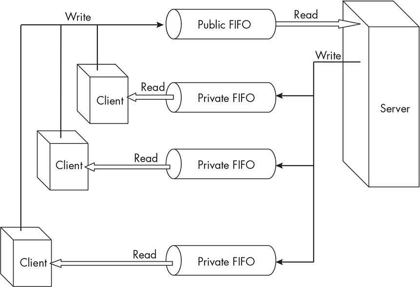
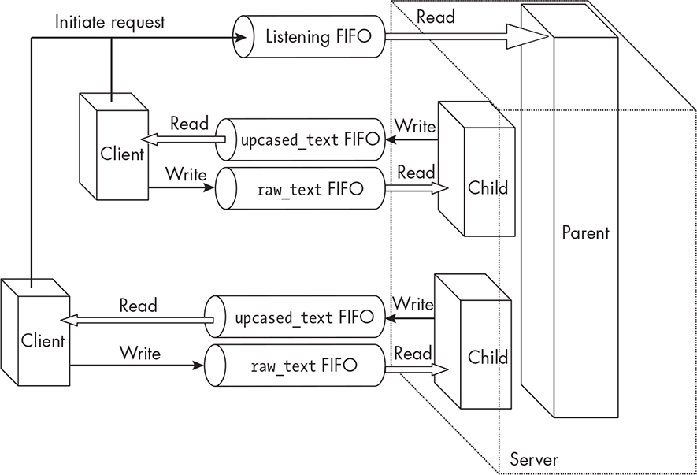

14 CLIENT-SERVER APPLICATIONS AND

DAEMONS

In this chapter, we’ll examine how to create client-server applications.

To design a client-server application, we have to design both the client and the server and make sure that they work together.

A client-server application consists of two types of processes:

A *server* process, which receives requests from other processes to provide some type of service. It performs the specific service and

sends back a response to the other process.

A *client* process, which issues service requests to a server by sending it a message and then receiving its response.

Clients typically interact with a user, whereas the server doesn’t. In fact, the server is usually detached from any terminal. There can be

multiple client processes, but there is almost always just a single server.

Servers can provide a wide variety of services, such as providing files, serving web pages, and controlling one or more hardware resources

such as printers or other I/O devices. Not having an attached terminal, they record their error messages in a file or perhaps on a console, either directly or through a logging service provided by the kernel.

Although the client and server processes don’t have to run on the same computer, in this chapter we limit our exploration to the design of client-server applications that run on the same host and communicate

through one or more FIFOs. We’ll begin by looking at the logging

services provided by the kernel, after which we’ll examine the steps that a process must take to turn itself into a daemon process. We’ll then

introduce the concepts of iterative and concurrent servers and develop one of each type.

Introduction to Client-Server Applications

There are many types of computing problems that benefit by breaking

up the functionality of a potential solution into a client-server

application. For example, when multiple users need to access a shared

database, client programs can present the user interface and collect user inputs, send requests to a server, and present the returned results to the user. Similarly, suppose multiple processes need the services of a printer, and the system has multiple printers. Rather than having to collectively manage their privileges, authentication, priorities, and so on, these

processes could send requests to a single print server that can manage the printers and handle distribution of the work. This decomposition

has several benefits:

By limiting access to a shared resource to a single server process, it is easier to detect breaches or failures because only that one process needs to be monitored. Other processes that need access to that

resource become clients of this server process.

It is more efficient for a single process to control a shared resource than for multiple processes to coordinate their accesses to it. For

example, if multiple processes need to update some shared

database, they can send their updates to a server, which can apply

them in a controlled way, rather than competing with each other

for access.

Maintenance and debugging are easier when the clients encapsulate

all local variations and customizations and the server presents a

consistent, uniform interface to all clients.

Developing a client-server application requires that we separate out

what the client does from what the server does and decide on the way in which they will communicate. The client and server code become

tightly integrated in the sense that changes to the server will dictate changes to the client code. Therefore, when we develop a client-server application, we’ll need to answer the following questions:

What does the server do? What message or data does it expect

from a client, and what does it return to the client?

What does the client do? What form should its request to the

server take, and in what form does it need its response?

What IPC facilities will be used? Will there be a single public

FIFO, for example? Will each client have a dedicated FIFO or

perhaps more than one?

How will errors and failure be handled? Will the server log its

status and errors by some logging service?

In this chapter, we’ll develop two different types of client-server

applications to illustrate how these questions are addressed. First,

though, we’ll explore the logging services provided by the kernel. After that, we’ll cover how a process can make itself a daemon.

System Logging Facilities

An application can write all of its error messages to an application-

specific file, but when many applications do this, the set of logfiles grows, and managing them becomes difficult. The alternative is that all applications use a single logging facility, which writes to the logfiles that it maintains. If you’ve ever browsed through the */var* subdirectories, you might have discovered the file */var/log/syslog*. By default, this file can be read only by someone with superuser privilege or who is a member of

the adm group. Let’s see whether our programs can write their errors to that file.

A search of the man pages for system calls or functions that a process could use to log its errors and other events turns up a few

relevant pages: \$ **apropos -s2,3,7 logging** *--snip--* openlog (3posix)

\- open a connection to the logging facility syslog.h (7posix) - definitions for system error logging

The syslog.h(7posix) page briefly describes a facility called syslog() and refers us to the page for closelog(), which summarizes how to use this facility. The syslog() function writes messages to one of several possible system log-files. By default, it will write to */var/log/syslog*. More accurately, syslog() is a function that a client process uses to send

messages to the syslogd daemon, which decides where to write all

messages. Some messages are written to */var/log/syslog*, some to a terminal, and some to other files. Usually, there’s a configuration file such as *syslog.conf* that controls where messages are written. The openlog() function lets us configure how syslog() logging works. The syslog()

function can be called by any process to record a message in the logfile.

It isn’t necessary to call openlog() before calling syslog(). If we’re willing to accept the default parameters and options, our program can

just call syslog(), passing the appropriate arguments. The synopsis for this pair of functions is: \#include \<syslog.h\> void openlog(const char

\*ident, int option, int facility); void syslog(int priority, const char

\*format, . .);

The first parameter of openlog() is the name of the program to be

recorded in the logfile; usually we pass it the program name. The

second parameter is a bitmask that can be the bitwise-OR of several

possible symbolic constants. These control different aspects of logging, such as whether to send messages to standard error as well as to the

system logfile (LOG_PERROR), or whether to log the caller’s PID (LOG_PID) with each message. The man page has the full list of available options.

The third parameter is named the facility. This is a value that helps

to identify the calling process in subsequent calls of syslog(). For

example, it could be LOG_CRON to indicate it’s the cron daemon, LOG_KERN to indicate it’s from the kernel, or LOG_USER to indicate the messages are from a user process. Another set of possible values our application can

use are LOG_LOCAL0 through LOG_LOCAL7, which are reserved for application use.

Calling syslog() is relatively easy. We call it as if we were calling

fprintf(), passing a priority level in the first argument and a format string with variables to be used within the string for conversions. Some of the priority-level constants are:

**LOG_EMERG** Emergency or panic condition

**LOG_CRIT** Critical condition, such as a disk error

**LOG_ERR** General error condition

**LOG_WARNING** Warning message

**LOG_ALERT** Immediate attention needed

**LOG_INFO** Informational message

When a process has finished calling syslog(), it can call closelog() to close the socket that the function uses to talk to the daemon.

It is important that the calling process does not pass a user-supplied string into the format parameter of the call. In other words, this type of call scanf("%s", message); /\* Get string from standard input. \*/

syslog(priority, message); /\* Pass string directly to syslog(). \*/

is a security risk. Instead, it should be called as follows: scanf("%s", message); syslog(priority, "%s", message);

The following program demonstrates sending messages to the file

*/var/log/syslog*: *syslog_demo.c* \#include "common_hdrs.h" \#include

\<syslog.h\> int main(int argc, char \*argv\[\]) { char msg\[512\];

openlog(argv\[0\], LOG_PID \| LOG_CONS, LOG_LOCAL0);

strcpy(msg, "Starting logging demonstration."); while ( strcmp(msg,

"quit") != 0 ) { syslog(LOG_INFO, "%s", msg); printf("Message to log:

"); fflush(stdout); scanf("%s", msg); } exit(EXIT_SUCCESS); }

The LOG_PID option causes each message to include the caller’s PID. The last parameter was set to LOG_LOCAL0 to tell the logging facility that it will be a user program sending the messages. A line written to the logfile

would look like this: Jun 19 15:46:56 harpo syslog_demo\[8259\]: Message to log: *user-entered-string*

This is a short summary of system logging; you can read the man

pages and the POSIX specification if you’re interested in customizing

the logging even more.

Daemons

A daemon is a process that runs in the background without a controlling terminal. In this section, we’ll explore daemon processes and how to

convert an ordinary process into a daemon.

*Overview*

Putting a process into the background does not make it a daemon. The

important property of daemons is that they execute without an

associated terminal or login shell, usually waiting for an event to occur.

The event might be a request for a service such as printing or

connecting to the internet, or a clock tick indicating that it is time to run. The word *daemon* is from Greek mythology and refers to a lesser god that did helpful tasks for the people it protected. Daemons are like these lesser gods; they are created at boot time and exist, hidden, ready to provide services when called upon.

Because daemons must not be connected to a terminal, one of their

first tasks is to close all open file descriptors (in particular, standard input, standard output, and standard error). They usually make their

working directory the root of the filesystem. They then take additional steps to break their association with any shell or terminal, among which are leaving their process group and registering their intent to ignore all incoming signals.

Daemon names often (but not always) end in d. This is one way to

identify a daemon in the output of the ps -ef command: Run it and find the program names ending in d, such as httpd, sshd, syslogd, and telnetd. If their entry in the column labelled TTY is a ?, they have no associated terminal and are most likely a daemon.

*Converting Processes into Daemons*

Usually, daemons are started by system initialization scripts at boot

time. If you’ve written a server and want to turn it into a full-fledged daemon, it isn’t enough to put it into the background. This will only tell the shell not to wait for it; it will still have a control terminal and can still be killed by any signals from that terminal.

Some daemons are started by other programs. For example, sshd

creates new daemons for new connections. Some are started by

programs such as the cron daemon, which runs scheduled jobs (and has

no d in its name). Some are invoked at the user terminal. For example, sometimes the printer daemon is stopped and restarted from the

terminal by the superuser.

Because daemons don’t have a controlling terminal, they don’t write

messages to standard output or to the standard error stream. This leaves them with just two choices for recording errors and logging their

actions:

Write to a logfile

Use a system logging facility

In Linux, it’s possible for a daemon to write to the standard error

stream without turning its associated device into a control terminal. I’ll explain more about that shortly. We’ll address this issue after

determining the steps that a process must take to turn itself into a

daemon. These steps are:

Putting itself in the background It does this by forking a new

process, exiting the parent process, and executing as the child. When

the parent exits, the shell that started it collects its exit status and sees that the invoked process has terminated. The child, which is now

executing the server code, is no longer in the foreground, but it is

still controlled by the terminal.

Making itself a session leader We discussed sessions in Chapter

10. A process can detach itself from a terminal by becoming a session leader, but only processes that are neither session leaders nor process

group leaders can do this. Since the current process is now a child of the original process, it is neither, so it can call setsid(), which makes it a session leader of a new session and a group leader of a new process

group, neither of which has any other members.

Registering its intent to ignore **SIGHUP** Daemons should ignore

this signal. The reason for ignoring it is that when a session leader

terminates, all of its children are sent a SIGHUP, which would otherwise kill them. Since the process is currently a session leader and it will create child processes that should not be killed when this process

terminates, its children should inherit the disposition to ignore SIGHUP.

Executing its code as a new child of the existing process The

process again forks a child process, terminates itself, and lets the new child, which is the grandchild of the original process, continue to

execute this code. This step is needed in some versions of Unix in

which, when a session leader opens a terminal device, that terminal is automatically made the control terminal for the process. By running

as the child of a session leader, the process is now protected against this possibility. In Linux, we can achieve this same effect by making

the process set the O_NOCTTY flag on any call it makes to open() on a

terminal device, obviating the need for this step; however, it’s not as portable to do this.

Changing the current working directory to ***/*** If the current working directory of the daemon is on a filesystem other than */*, that filesystem cannot be unmounted while the daemon is running. Since

daemons usually run until the system is shut down, this step ensures

that all filesystems can be unmounted while the system is running.

Clearing the **umask** A nonzero umask can change the permissions of files and directories created by the daemon. We don’t want those

permissions to be different than the ones specified when the daemon

creates those files and directories.

Closing any open file descriptors The daemon might have

inherited open file descriptors from its parent or grandparent. These

are best closed, especially the standard descriptors 0, 1, and 2. In fact, to be safe, it’s even better to make them point to */dev/nul* .

A function that carries out the preceding steps, converting the

calling process into a daemon, follows in Listing 14-1. I’ve named it make_me_a_daemon(). This opens a connection to the syslog facility as its last step.

make_me_a_daemon()

BOOL make_me_a_daemon(const char \*pname)

{

int max_descriptors;

pid_t pid;

if ( (pid = fork()) == -1 )

fatal_error(errno, "fork");

else if ( pid != 0 )

exit(EXIT_SUCCESS); /\* Parent terminates. \*/

/\* Child continues from here. \*/

setsid(); /\* Detach itself and become a session leader \*/

signal(SIGHUP, SIG_IGN); /\* Ignore SIGHUP. \*/

if ( (pid = fork()) == -1 )

fatal_error(errno, "fork");

else if ( pid != 0 )

exit(EXIT_SUCCESS); /\* First child terminates. \*/

/\* Grandchild continues from here. \*/

chdir("/"); /\* Change working directory. \*/

umask(0); /\* Clearfile mode creation mask \*/

/\* Get maximum number of allowed open descriptors. \*/ if ( -1 ==

(max_descriptors = sysconf(\_SC_OPEN_MAX)) )

max_descriptors = MAXFD;

else

for ( int i = 0; i \< max_descriptors; i++ )

close(i); /\* Close all open file descriptors. \*/

openlog(pname, LOG_PID \| LOG_CONS, LOG_LOCAL0); /\* Start syslog logging.\*/

return TRUE;

}

*Listing 14-1: A function that converts the calling process into a daemon* The pname parameter passed to the function is intended to be the program name, since it is written with each message. The function uses the sysconf() function, which we’ve used in Chapters 10

and 11, to get the value of a system parameter, in this case, the maximum allowed number of open file descriptors. Many of the descriptors that it closes will not have been opened, and close() will return -1, but we can ignore the return value in this case. It returns TRUE to the caller to indicate that it is now a daemon.

An Iterative Server

An *iterative server* is a server that services the requests from its clients in an iterative fashion, meaning one after another. In contrast, a *concurrent* *server* is one that forks a separate process (or perhaps a thread) to handle each request. Here, we’ll design and develop an iterative server.

Unlike our simple server from Chapter 13, an iterative server needs to send replies back to clients. It cannot use a shared FIFO for this

purpose; every client has to have its own dedicated FIFO for receiving replies from the server. Therefore, before a client establishes a

connection to the server, it needs to create its own, private FIFO. The clients’ private FIFOs need to have names that are unique, so that no

two clients try to create a FIFO with the same name. The program that

we’ll develop now will show one way to solve this problem.

*Overview of the Application*

In this application, the server has two-way communication with each

client, processing incoming client requests one after the other. In order to achieve this, the server creates a public FIFO that it uses for reading incoming messages from clients wishing to use its services. This raises the first issue. Since a FIFO is a byte stream, if all clients send requests to a single queue, how will the server know where one request ends and the next one starts in the pipe? There are a few possible solutions:

Make messages fixed size If all messages are the same size, the server can just read the pipe in chunks of that size.

Put a separator byte at the end of each message This allows

variable size messages. The server has to read until it finds the

separator.

Start each message with a header Every message can start with a

header of fixed size (like the ELF file format) that contains the

number of bytes in the message and possibly the offsets of other

items in the message.

I decided, for this application, to go with the first choice, making

each message the same size. Each incoming message is a structure with

two members. The first is a string containing the name of the private

FIFO that the client creates when it starts up and that is used by the server for sending a reply. The second is a string that contains the actual message data, for instance, a specific command or data it wants the

server to process.

Figure 14-1 depicts the relationship between the clients and the server with respect to the shared pipes.

*Figure 14-1: The FIFOs used in the iterative server*

When the server receives a message, it looks at the FIFO name in it

and tries to open it for writing. If successful, the server will use this FIFO for sending data to the client. After the client sends its message to the server, it opens its private FIFO for reading. It will block until the server opens the write end of this FIFO. When the server opens the

write end, the client will read from it until it receives a return value of 0, indicating that the server has finished writing and closed its end of the pipe.

For the purpose of learning how to develop client-server applications, it doesn’t matter much what service the server actually

performs for the client, since it will have the same software architecture in most cases. Since I don’t want what the server does to distract us from how it’s designed, the service should be easy to implement and

understand.

One simple service is lowercase-to-uppercase conversion for clients.

In this case, the clients would send the server a piece of text and the server would send a copy of it back to the client in which every

lowercase letter was converted to uppercase. The server could instead

provide an arithmetic calculation service: The client would send an

arithmetic expression to be evaluated, and the server would perform the calculation and send the result back to the client.

One benefit of developing the calculator server is that we’ll get to

see a good application of the popen() function. A benefit of developing the uppercase conversion server is that the issues regarding the handling of potentially large amounts of data can be demonstrated with it.

Therefore, for the iterative server that we’ll develop here, we’ll

implement the calculation service, and when we develop a concurrent

server after this, we’ll implement the uppercase conversion.

Since Linux already has a command named calc with similar

functionality, the server executable will be named spl_calcd (for *calculator* *daemon*) and the client executable will be named spl_calc. For simplicity, I’ll refer to the server as either the *calc server* or the *calc daemon*.

Assuming that the calc server has been started up in the background by entering spl_calcd &, the client could be run as follows: \$ **./spl_calc**

**'10 \* 2 + 100/25'** 24 \# Server's returned result \$ **./spl_calc**

**'sqrt(10.000)'** 3.162 \# Server's returned result \$ **./spl_calc**

**'sqrt(10.00000)'** 3.16227 \# Server's returned result \$ **./spl_calc** **2.50^2** 6.25 \# Server's returned result

The expression must be enclosed in quotes if it has any whitespace or

shell special characters. This application is based on the bc arbitrary-precision arithmetic calculator language, which is specified in POSIX.1-2024. The POSIX specification

( [*https://pubs.opengroup.org/onlinepubs/9799919799/*)](https://pubs.opengroup.org/onlinepubs/9799919799/) contains a complete

grammar for the bc language. It’s a pretty intuitive language and is essentially like ordinary C arithmetic expressions, but as shown earlier, it also has an exponential operator. It has most of the usual

programming constructs, such as loops, branching, and functions. By

default, the precision of the result is based on the maximum scale of any of its arguments, where *scale* is the number of digits to the right of the decimal point.

The bc command evaluates all compatible bc expressions and writes

the result on standard output. But it expects these expressions in a file or in its standard input. We can give it a single expression from the shell in a few different ways, such as: \$ **echo "6 + 4.00" \| bc** 10.00 \$ **bc \<\<\<**

**" 6 + 4.00"** \# This puts the expression on bc's standard input. 10.00

We can also run it interactively.

Because bc can be run as a shell command, we can use popen() to

execute it. When the user runs the calc client, the client will send its command line argument to the server, which stores it into a variable.

For example, suppose that variable is named expression. The server stores the string 'echo "expression" \| bc' into a string variable named command sprintf(command, "echo \\%s\\ \| bc", expression);

and passes it to popen() for execution: fp = popen(command, "r"); It will then use the returned file stream pointer fp to read bc’s calculated result, which it places on its standard output, now connected to the

write end of the pipe created by popen().

In effect, the server that we’re about to create does little more than allow multiple independent clients to request calculations from bc. It doesn’t have much utility in this sense because anyone can run a

command in the shell to run bc. Its importance lies in the lessons we

learn by developing it.

*The spl_calc Common Header File*

Because client and server need to share certain parameters, such as the pathname to the public FIFO and sizes of various variables, they will

each include a common header file named *spl_calc.h*, displayed in Listing

14-2. The header file contains the absolute pathname to the FIFO and a

declaration of a structure that clients will send to the server when they want a calculation performed.

*spl_calc.h*

\#include "common_hdrs.h"

\#include \<sys/stat.h\>

\#define PUBLIC "/tmp/CALCFIFO"

\#define FIFOPATHLEN (PIPE_BUF/4)

\#define TEXTLEN (PIPE_BUF - FIFOPATHLEN)

struct message {

➊ char fifo_name\[FIFOPATHLEN\];

➋ char text\[TEXTLEN\];

};

*Listing 14-2: The* spl_calc *shared header file* The message has to contain the name of the private FIFO that the client created when it started up, as well as the text string containing the expression to be evaluated. In principle, the FIFO name can contain as many as PATH_MAX characters, but the structure itself cannot be larger than PIPE_BUF bytes; otherwise, the structure will not be sent in a single atomic write operation. On most Unix systems, PATH_MAX is at least as large as PIPE_BUF. Using the getconf command, we can obtain the values of these configuration parameters. Running it on my current version of Linux \$ **getconf PATH_MAX /usr/include/limits.h** 4096 \$ **getconf PIPE_BUF**

**/usr/include/limits.h** 4096

we see they’re equal. Allowing the FIFO name to be as large as it’s

allowed to be would complicate the design of both client and server, and it’s very unlikely it will need to be so long. Therefore, I restrict the FIFO pathname ➊ to be one quarter of the size of PIPE_BUF (1024),

leaving 3072 bytes for the text to be sent. This limits the size of the expression.

POSIX specifies that the maximum length of a shell command line

(ARG_MAX) should be at least 4096 bytes, but on many systems, ARG_MAX is 2,097,152 bytes. Technically, this is the length of a string that can be passed to any of the exec() functions. To allow such large expressions complicates the client and server design. Therefore, for the sake of

simplicity, I simply limit the expression to be at most 3\*PIPE_BUF/4 bytes ➋

.

*The spl_calc Client Program*

Since the client program is less complex than the server, let’s look at it first. The client takes the following sequence of actions:

1\. Checks if the command line argument is too long and, if so, exits.

2\. Copies the command line argument into msg.text.

3\. Constructs a name for and creates its private FIFO in */tmp* and sets its name into *msg*.fifo_name, where *msg* is of type struct message.

4\. Registers its signal handlers.

5\. Tries to open the public FIFO for writing in nonblocking mode. It

uses nonblocking mode in case the server no longer has the FIFO

open for reading, because the open will fail and the client can

detect this and exit. (Refer back to Table 13-3 for a summary of FIFO opening semantics.)

6\. Writes the message msg to the server. through the public FIFO.

7\. Opens its private FIFO for reading.

8\. Reads the server’s reply from the private FIFO.

9\. Copies the server’s reply to its standard output.

10\. Closes the read end of its private FIFO.

11\. Closes the write end of the public FIFO and removes its private

FIFO.

The client program, *spl_calc_client.c*, is shown in Listing 14-3. To save space, most comments are omitted. The complete program is

available in the book’s source code distribution.

*spl_calc_client.c*

\#define \_GNU_SOURCE

\#include "spl_calc.h"

const char startup_msg\[\] =

"calcd server does not seem to be running. "

"Please start the service by entering 'calcd &'\n";

volatile sig_atomic_t sig_received = 0;

struct message msg;

int privatefd; /\* File descriptor to read end of PRIVATE \*/

int publicfd; /\* File descriptor to write end of PUBLIC \*/

void on_sigpipe(int signo)

{

fprintf(stderr, "Server is not reading the pipe.\n");

unlink(msg.fifo_name);

exit(1);

}

void on_signal(int signo)

{

close(privatefd);

close(publicfd);

unlink(msg.fifo_name);

}

int main(int argc, char \*argv\[\])

{

int bytesRead; /\* Bytes received in read from server \*/

static char buf\[PIPE_BUF\]; /\* Buffer to store returned data \*/

char usage\[NAME_MAX\]; /\* Usage message \*/

struct sigaction handler;

if ( argc \< 2 ) {

sprintf(usage, "%s \<expression\>", basename(argv\[0\]));

usage_error(usage);

}

memset(msg.text, 0, TEXTLEN);

if ( strlen(argv\[1\]) \>= TEXTLEN )

fatal_error(-1, "Expression too long");

strcpy(msg.text, argv\[1\]);

sprintf(msg.fifo_name, "/tmp/fifo%d", getpid()); /\* Create FIFO name. \*/

if ( mkfifo(msg.fifo_name, 0666) \< 0 ) /\* Create private FIFO. \*/

fatal_error(errno, msg.fifo_name);

handler.sa_handler = on_signal;

if ( ((sigaction(SIGINT, &handler, NULL)) == -1) \|\| ((sigaction(SIGHUP,

&handler, NULL)) == -1) \|\|

((sigaction(SIGQUIT, &handler, NULL)) == -1) \|\|

((sigaction(SIGTERM, &handler, NULL)) == -1) )

fatal_error(errno, "sigaction");

handler.sa_handler = on_sigpipe;

if ( sigaction(SIGPIPE, &handler, NULL) == -1 )

fatal_error(errno, "sigaction");

if ( (publicfd = open(PUBLIC, O_WRONLY \| O_NONBLOCK)) == -1 ) {

if ( ENXIO == errno )

fprintf(stderr, "%s", startup_msg);

else

error_mssge(errno, PUBLIC);

exit(EXIT_FAILURE);

}

write(publicfd, (char\*) &msg, sizeof(msg)); /\* Send message. \*/

if ( (privatefd=open(msg.fifo_name,O_RDONLY)) == -1 ) /\* FIFO for reply \*/

fatal_error(errno, msg.fifo_name);

while ( (bytesRead=read(privatefd,buf,PIPE_BUF)) \> 0 ) /\* Read reply. \*/

write(fileno(stdout), buf, bytesRead);

close(privatefd); /\* Clean up. \*/

close(publicfd);

unlink(msg.fifo_name);

exit(EXIT_SUCCESS);

}

*Listing 14-3: The* *spl_calc* *client program* We could add a few enhancements to the design of this client. They’re left as exercises at the end of the chapter.

*The spl_calc Server Program*

The server has more work to do than the client. It takes the following sequence of steps:

1. Sets up all signal handling.

2\. Creates the public FIFO. If it finds it already exists, it displays a message and exits.

3\. Opens the public FIFO for both reading and writing, even though

it will only read from it. The write end is assigned to a *dummy*

(unused) file descriptor.

4\. It enters its main loop, where it repeatedly:

\(a\) Performs a blocking read on the public FIFO.

\(b\) On receiving a message from read(), tries to open the private

FIFO of the client that sent it that message. It tries MAXTRIES

(five) times, sleeping a bit between each try, in case the

client was delayed in opening its end of the FIFO for

reading. After five attempts, it gives up on this client.

\(c\) If it was successful in opening the client’s FIFO for writing,

constructs a string containing the command line that it will

pass to popen().

\(d\) Calls popen(), getting the fp file stream point that it needs to

read to get the value computed by bc.

\(e\) Clears the memory for the return from popen(), reads the

result, and writes it to the private FIFO of the client.

\(f\) Calls pclose() to collect the status of the subshell that ran bc,

and closes the write end of the private FIFO.

In this design, the main loop never exits on its own. It loops forever because it never receives an end-of-file on the public FIFO, since it

keeps the write end open itself. The server must be terminated by

sending it a signal such as SIGTERM. The server program is displayed in part in Listing 14-4. Parts of it, such as signal handlers and their setup, as well as some error handling, are omitted to save space. The complete program is available in the book’s source code distribution.

*spl_calc_server.c*

\#include "spl_calc.h"

\#define WARNING "\nServer could not access client's private FIFO\n"

\#define MAXTRIES 5

int dummyfd; /\* File descriptor to write end of PUBLIC \*/

int publicfd; /\* File descriptor to read end of PUBLIC \*/

int privatefd; /\* File descriptor to write end of PRIVATE \*/

int main(int argc, char \*argv\[\])

{

int tries; /\* Number of tries to open private FIFO \*/

int nbytes; /\* Number of bytes read from popen() \*/

int done; /\* Flag to stop loop \*/

struct message msg; /\* Private FIFO name and command \*/

char result\[PIPE_BUF+1\]; /\* Result to return to client \*/

char command\[TEXTLEN+32\]; /\* Command for popen() to execute \*/

FILE \*fp; /\* FILE stream to read end of popen() \*/

// OMITTED: Register the signal handlers.

/\* Create public FIFO. \*/

if ( mkfifo(PUBLIC, 0666) \< 0 ) {

if ( errno != EEXIST )

fatal_error(errno, "mkfifo");

else

fprintf(stderr, "%s already exists. Delete it and restart.\n", PUBLIC);

exit(EXIT_FAILURE);

} publicfd = open(PUBLIC, O_RDONLY);

dummyfd = open(PUBLIC, O_WRONLY \| O_NONBLOCK);

while ( read(publicfd, (char\*) &msg, sizeof(msg)) \> 0 ) {

tries = done = 0;

privatefd = -1;

do {

if ( (privatefd = open(msg.fifo_name, O_WRONLY\|O_NONBLOCK)) \< 0 )

sleep(1); /\* Sleep if failed to open. \*/

else { /\* Create command to give to popen(). \*/

memset(command, 0, strlen(command)); /\* Clear command. \*/

sprintf(command, "echo \\%s\\ \| bc ", msg.text ); fp = popen(command, "r");

memset(result, 0, PIPE_BUF);

nbytes = read(fileno(fp), result, PIPE_BUF);

if ( -1 == nbytes )

error_mssge(errno, "Read from bc");

else if ( 0 == nbytes )

error_mssge(errno, "Null output from bc");

else { /\* Send result to client. \*/

result\[nbytes\] = '\0'; /\* Null-terminate. \*/

write(privatefd, result, nbytes + 1);

}

pclose(fp); /\* Wait for popen status. \*/

close(privatefd); /\* Close write end of private FIFO. \*/

done = 1; /\* Terminate loop. \*/

}

} while ( ++tries \< MAXTRIES && !done );

if ( !done )

write(fileno(stderr), WARNING, sizeof(WARNING));

}

exit(EXIT_SUCCESS);

}

*Listing 14-4: The* *spl_calc* *server program* The signal handling, which is not in the listing, is slightly different than it is in the client. This server sets privatefd to -1 at the start of each loop, and if it opens the private FIFO successfully, privatefd is no longer -1. It can use this to determine, in the signal handler, whether it had a private FIFO open for writing and needs to close it. If it gets a SIGPIPE because a client closed the read end of its private FIFO

immediately after sending a message but before the server wrote back the converted string, it handles SIGPIPE by continuing to listen for new messages and giving up on the write to that pipe.

Here are a couple more runs of our client, assuming we built and ran

this server in the background: \$ **./spl_calc 2^10** 1024 \$ **./spl_calc** **2^256**

1157920892373161954235709850086879078532699846656405640394

575840\\ 07913129639936

We could have implemented this server without using popen() by

writing our own functions to evaluate infix arithmetic expressions and letting the server call them directly. This would have made the server faster, because it would not need to fork a shell and a subshell to exec the bc command, but speed wasn’t an important objective for this

program. This design allowed us to quickly and easily create a useful server while learning the mechanics of opening, reading, writing, and

closing FIFOs, with all the associated subtleties.

A Concurrent Server

One drawback of an iterative server is that it handles each client request sequentially. If some client requests are time consuming and others

aren’t, the server would be busy servicing one client to the exclusion of all others, and the others would experience delays. This can be avoided by designing the server to handle multiple client requests concurrently.

Such a server is called a *concurrent server*. In this section, we’ll develop a concurrent server and a client that communicates with it, but instead of implementing a concurrent version of the calc server, we’ll develop one that performs lowercaseto-uppercase conversion of arbitrarily large

amounts of text data using the user’s current locale, which will present a few different problems to solve.

One way to create a concurrent server is to fork a child process for

each client. The alternative is to multithread the server, creating a

thread for each client instead. Our server will fork a process for each client. With this approach, the server’s role is reduced to:

Listening to the public pipe for incoming requests

Forking a child process to handle a new request

Waiting for the child process to finish

We don’t want the server to block while waiting because it has to return immediately to the task of reading the public pipe. Therefore, it will call waitpid() only inside a SIGCHLD handler. We’ll convert the process to a daemon by calling make_me_a_daemon().

The server program’s main() function essentially takes this sequence

of steps:

1\. Registers its signal handlers.

2. Creates the public FIFO. If it finds it already exists, it displays a message and exits.

3\. Opens the public FIFO for both reading and writing, although it

will not write into that FIFO.

4\. Enters its main loop, where it repeatedly:

\(a\) Performs a blocking read() on the public FIFO.

\(b\) Upon returning successfully from read(), forks a child process

to handle the client request.

This server differs from the iterative calc server in another

fundamental way. The client sends it raw text, which the server converts to uppercase and sends back. Because this is a two-way communication,

the client and server need a pair of private FIFOs for this exchange. The client writes the raw text into one FIFO, and the server sends the

converted text back to the client in a second FIFO. The client has to

create these FIFOs and send their names to the server in its public

FIFO when it requests this translation service. In addition, the client has to send the name of the locale to the server so that the server can set the locale before it performs the translation to uppercase. Therefore, the structure of the request message is different in this program than it was in the iterative server.

In this application, the only purpose of the request message that the

client sends is to establish the means by which the client and the server can exchange data privately. The message structure has no data content.

For this reason, I’ll call it a *connection message*. A connection message contains the names of two FIFOs and the name of the locale. The

*upcase.h* header file contains its definition: *upcase.h* \#include

"common_hdrs.h" \#define PUBLIC "/tmp/UPCASE_FIFO" \#define LOCALELENGTH 128 \#define NAMELENGTH (PIPE_BUF -

LOCALELENGTH)/2 typedef struct \_message { char upcased_fifo

\[NAMELENGTH\]; char raw_text_fifo\[NAMELENGTH\]; char

locale\[LOCALELENGTH\]; } message;

The message structure is a total of PIPE_BUF bytes, divided equally between the two FIFO names after subtracting the maximum allowed length of a

locale name, artificially set to 128 characters.

Each child process forked by the server begins by opening the read

end of the client’s raw_text FIFO. It then repeatedly reads from this

raw_text \_fifo, translates the text into uppercase, opens the write end of the client’s converted_text_fifo, writes the converted text into it, and closes its write end until there’s no more data in the raw_text_fifo.

*The Concurrent Server Client*

The client is structurally different from the iterative server’s client. It takes the following major steps:

1\. Determines whether it has a filename argument. If it does, it makes that the input source; otherwise, it uses standard input as its

source.

2\. Registers its signal handlers.

3\. Calls setlocale() to enable all library functions to use the current locale settings.

4\. Creates two private FIFOs in the */tmp* directory with unique names and writes their names and the name of the current locale

into the connection message.

5\. Opens the server’s public FIFO for writing, handling errors as

needed.

6\. Sends the connection message to the server to establish the two-

way communication.

7\. Attempts to open its raw text FIFO in nonblocking, write-only

mode. If it fails, it delays a second and retries. It retries a few times and then gives up and exits. If it fails, it means that the server has probably terminated.

8\. Until it receives an end-of-file on its standard input, it repeatedly: (a) Reads a line from standard input.

\(b\) Breaks the line into PIPE_BUF-sized chunks.

(c) Sends each chunk successively to the server through its raw text FIFO.

\(d\) Opens the upcased text FIFO for reading.

\(e\) Reads the upcased text FIFO and writes its contents to its

standard output.

\(f\) Closes the read end of the upcased text FIFO.

9\. Closes all of its FIFOs and removes the files.

Figure 14-2 shows how the client processes and the server parent and child processes use the various FIFOs. Compare this to Figure 14-

1.

*Figure 14-2: Concurrent server and client communication*

The code for the client is shown in Listings 14-5 and 14-6. Some code has been omitted to save space, such as setting up signal handlers and handling errors from system calls. The complete program, *upcase.c*, is available in the book’s source code distribution.

*upcase.c globals*

\#include "upcase.h"

\#define MAXTRIES 5

const char server_no_read_msg\[\] = "The server is not reading the pipe.\n";

const char noserver_msg\[\] = "The server does not appear to be running. "

"Please start the service.\n";

const char missing_pipe_msg\[\] =

"Cannot communicate with the server due to a missing pipe.\n"

"Check if the server is running and restart it if necessary.\n"; int upcased_fd; /\* File descriptor for READ PRIVATE FIFO \*/

int rawtext_fd; /\* File descriptor for WRITE PRIVATE FIFO \*/

int publicfd; /\* File descriptor for write end of PUBLIC \*/

FILE \*inputfp; /\* File pointer to input stream \*/

message msg; /\* Connection message \*/

void clean_up()

{

if ( upcased_fd != -1 )

close(upcased_fd);

if ( rawtext_fd != -1 )

close(rawtext_fd);

unlink(msg.upcased_fifo);

unlink(msg.raw_text_fifo);

} void on_sigpipe(int signo)

{

fprintf(stderr, "%s Exiting...\n", server_no_read_msg); /\* UNSAFE \*/

unlink(msg.raw_text_fifo);

unlink(msg.upcased_fifo);

exit(EXIT_FAILURE);

}

void on_signal(int sig)

{

if ( publicfd != -1 )

close(publicfd);

if ( upcased_fd != -1 )

close(upcased_fd);

if ( rawtext_fd != -1 )

close(rawtext_fd);

unlink(msg.upcased_fifo);

unlink(msg.raw_text_fifo);

exit(EXIT_SUCCESS);

}

*Listing 14-5: The static and file-scoped functions and data for the* *upcase* *client of the* *upcase* *server* The signal handlers close open file descriptors and remove FIFOs from the filesystem as needed. The client’s main program is in Listing 14-6, with some error handling omitted.

*upcase.c* main()

int main(int argc, char \*argv\[\])

{

int strLength; /\* Number of bytes in text to convert \*/

int nChunk; /\* Index of text chunk to send to server \*/

int bytesRead; /\* Bytes received in read from server \*/

int tries = 0; /\* Count of attempts to open FIFO \*/

static char buffer\[PIPE_BUF\];

static char textbuf\[BUFSIZ\];

struct sigaction sigact;

if ( argc \< 2 )

inputfp = stdin;

else if ( NULL == (inputfp = fopen(argv\[1\], "r")) )

fatal_error(errno, argv\[1\]);

publicfd = -1;

upcased_fd = -1;

rawtext_fd = -1;

// OMITTED: Register the signal handlers and set the locale. /\* Create unique names for private FIFOs using process ID. \*/

sprintf(msg.upcased_fifo, "/tmp/fifo_rd%d", getpid());

sprintf(msg.raw_text_fifo, "/tmp/fifo_wr%d", getpid());

sprintf(msg.locale, "%s", current_locale);

/\* Create the private FIFOs. \*/

if ( mkfifo(msg.upcased_fifo, 0666) \< 0 \|\|

mkfifo(msg.raw_text_fifo, 0666) \< 0 ) {

clean_up();

fatal_error(-1, "Error creating private FIFOs");

}

/\* Open the public FIFO for writing. \*/

if ( (publicfd = open(PUBLIC, O_WRONLY \| O_NONBLOCK)) == -1 ) {

if ( ENXIO == errno )

fprintf(stderr,"%s", noserver_msg);

else if ( errno == ENOENT )

fprintf(stderr,"%s %s", argv\[0\], missing_pipe_msg);

else

fprintf(stderr,"%d: ", errno);

clean_up();

exit(EXIT_FAILURE);

}

write(publicfd, (char\*) &msg, sizeof(msg));

while ( ((rawtext_fd = open(msg.raw_text_fifo,

O_WRONLY \| O_NDELAY)) == -1) && (tries \< MAXTRIES) ) {

sleep(1);

tries++;

}

if ( tries == MAXTRIES ) {

/\* Failed to open client private FIFO for writing \*/

clean_up();

fatal_error(-1, server_no_read_msg);

}

while ( TRUE ) {

memset(textbuf, 0, BUFSIZ);

if ( NULL == fgets(textbuf, BUFSIZ, inputfp) )

break;

strLength = strlen(textbuf);

/\* Break input lines into chunks and send them one at a

time through the client's write FIFO. \*/

for ( nChunk = 0; nChunk \< strLength; nChunk += PIPE_BUF - 1 ) {

memset(buffer, 0, PIPE_BUF);

strncpy(buffer, textbuf + nChunk, PIPE_BUF - 1); buffer\[PIPE_BUF-1\] =

'\0';

write(rawtext_fd, buffer, strlen(buffer));

/\* Open the private FIFO for reading to get output of command from the server. \*/

if ( (upcased_fd = open(msg.upcased_fifo, O_RDONLY)) == -1 ) {

clean_up();

fatal_error(errno, msg.upcased_fifo);

}

memset(buffer, 0, PIPE_BUF);

while ( (bytesRead = read(upcased_fd, buffer, PIPE_BUF)) \> 0 )

write(fileno(stdout), buffer, bytesRead);

close(upcased_fd);

upcased_fd = -1;

}

}

clean_up();

exit(EXIT_SUCCESS);

}

*Listing 14-6: A client program that talks to the* *upcase* *server* After sending the names of the private FIFOs, the client tries to open the write end of its raw text FIFO in nonblocking mode.

If the server is delayed in opening the read end, this will fail. The server doesn’t fail if it opens the read end too soon. Assuming that the server isn’t delayed, the client will succeed in opening the raw text FIFO. We could insert a short sleep in case the server is delayed.

If we were to open the raw text FIFO before sending the server the

connection message, we’d have a problem. We would need to open it in

read-write mode since the server is blocked on its read of the public

FIFO and the two processes would deadlock otherwise. But if we open

the raw text FIFO in read-write mode, then if the server terminates

unexpectedly and never reads the raw text FIFO again, the client

wouldn’t get a SIGPIPE signal because the client itself has the read end open, preventing the kernel from generating the signal. The client

would never be notified that the server died! The order is critical here.

The client then keeps the write end of its raw text FIFO open for

the duration of its main loop. Within the loop, the client first writes to its raw text FIFO and then opens its upcased text FIFO, after which, if all goes well, it reads and closes it again. Thus, it repeatedly opens and closes this FIFO within the loop. We could just let it stay open for the duration of the loop, but by closing it and reopening it, we give

ourselves the chance to detect in the open() call that the server closed its write end of the FIFO unexpectedly.

The error handling in the client is similar to what it was in the

iterative server’s client. A clean_up() function simplifies the error

handling, consolidating the cleanup code.

*The Concurrent Server*

Let’s turn to the design of the server. The main program uses several

file-scoped variables and constants that it shares with signal handlers and a few utility functions. These are as follows: \#define MAXFD 64

\#define WARNING "\nNOTE: SERVER \*\* NEVER \*\* accessed

private FIFO\n" \#define MAXTRIES 5 int dummyfd; /\* File descriptor for write end of PUBLIC \*/ int clientreadfd; /\* File descriptor for write end of PRIVATE \*/ int clientwritefd; /\* File descriptor for write end of PRIVATE \*/ int publicfd; /\* File descriptor for read end of PUBLIC \*/

pid_t server_pid; /\* Stores parent PID \*/ BOOL is_daemon = FALSE;

/\* Am I a daemon? \*/

It also declares the following locally scoped variables: message msg;

/\* Connection message \*/ struct sigaction sigact; /\* sigaction for

registering handlers \*/ int pid; /\* Return value from fork() \*/

We’re going to turn this server into a daemon process shortly after the program starts up by calling the function make_me_a_daemon(), shown in

Listing 14-1 on page 685.

Since daemon processes should not write to the terminal, their error

messages are logged in a file using syslog(). But if the server is unable to create its FIFO for any reason and cannot start up, it ought to write a message on the terminal. Therefore, before it turns itself into a daemon, it tries to create the public FIFO and prints an error message to

standard error if it can’t: if ( mkfifo(PUBLIC, 0666) \< 0 ) { if ( errno !=

EEXIST ) fprintf(stderr, "mkfifo() could not create %s", PUBLIC); else fprintf(stderr, "%s already exists. Delete it and restart.\n", PUBLIC); exit(EXIT_FAILURE); }

It then:

Converts itself into a daemon

Sets up signal handlers

Opens its public FIFO for reading (and writing in nonblocking

mode)

Records its PID, which it will need later

Having done all of this, it’s ready to enter its listening loop. In its listening loop, it’s essentially blocked as it waits for incoming client connection messages. When it receives one, it forks a child process to do all of the work: while ( read(publicfifo, (char\*) &msg, sizeof(msg)) \> 0 ) if ( -1 == (pid = fork()) ) syslog(LOG_ERR, "Could not create child process."); else if ( 0 == pid ) /\* Service the incoming client request based on the private FIFO names in msg. \*/ process_client( &msg); /\*

Child process executes. \*/

The process_client() function is executed by the child process. Let’s

outline what it does:

1\. Uses its pointer to the message read from the public FIFO to

extract the names of the raw text FIFO and upcased text FIFO, as

well as the locale.

2\. Tries to open the client’s raw text FIFO for reading. If it fails, the child exits.

3\. Sets the locale to the one that the client passed to it.

4\. Enters a loop in which it repeatedly:

\(a\) Reads the raw text from the raw text FIFO.

\(b\) Converts that text to uppercase.

\(c\) Tries a fixed number of times to open the client’s private

upcased text FIFO. It may take a few tries because of

scheduling delays or because the client terminated

unexpectedly. If it fails, it exits.

\(d\) Writes the converted text into the private upcased text FIFO,

closes it, and clears the buffer for the next read from the

raw text buffer.

The process_client() function, with some error handling and comments omitted, is in Listing 14-7.

process_client()

void process_client(message \*msg)

{

char buffer\[PIPE_BUF\]; /\* Buffer for reads \*/

int tries; /\* Number of tries to open private FIFO \*/

int nbytes; /\* Number of bytes read from FIFO \*/

clientwritefd = -1;

if ( (clientwritefd = open(msg-\>raw_text_fifo, O_RDONLY)) == -1 )

➊ log_and_exit("Client did not open pipe for writing");

memset(buffer, 0, PIPE_BUF); /\* Clear the buffer. \*/

if ( setlocale(LC_CTYPE, msg-\>locale) == NULL )

syslog(LOG_ERR, "Could not set the locale to %s", msg-\>locale); while (

(nbytes = read(clientwritefd, buffer, PIPE_BUF)) \> 0 ) {

for ( int i = 0; i \< nbytes; i++ )

buffer\[i\] = toupper(buffer\[i\]);

tries = 0;

while ( ((clientreadfd = open(msg-\>upcased_fifo,

O_WRONLY \| O_NONBLOCK)) == -1) && (tries \< MAXTRIES) ) {

sleep(1);

tries++;

}

if ( tries == MAXTRIES )

log_and_exit(WARNING);

if ( (-1 == write(clientreadfd, buffer, nbytes)) && (EPIPE == errno) ) log_and_exit("%m: Trying to write to client");

close(clientreadfd); /\* Close write end of private FIFO. \*/

clientreadfd = -1;

memset(buffer, 0, PIPE_BUF);

}

exit(EXIT_SUCCESS);

}

*Listing 14-7: The function executed by each forked child process in the concurrent server* The function parameter is a pointer to the message structure rather than a copy of it. There’s no need to make a copy; since the code is executed by a new process, the copying takes place within fork(), which means that there’s no danger that two different child processes try to read from the same private FIFOs in case the clients connect at almost the same time.

The log_and_exit() ➊ function records a message in a logfile and exits.

We’ll look at its code shortly.

Even if the child process successfully opens the FIFO, it still has to check whether a write() to it fails, since anything can happen in between, and if so, the child exits. Otherwise, it writes the data, closes its end of the FIFO, and waits to read more text from the client. When it receives the end-of-file, it exits.

Notice that the server repeatedly opens and closes the write end of

the client’s upcased text FIFO. This is the only way that the client will receive an EOF when it calls read(). If the client doesn’t get the EOF, it will remain blocked in its read() of the upcased text FIFO and won’t be able to send any more data to the server. This would put the client and this child process into deadlock, because this process would go back to the read() of the client’s raw text FIFO and block waiting for data from the client, which would never arrive. Therefore, although it seems

inefficient to open and close this FIFO each time, it is the simplest

means of preventing deadlock.

The error handling is accomplished with the log_and_exit() function,

whose code is: void log_and_exit(char \*errmssge) { if ( is_daemon )

syslog(LOG_ERR, "%s", errmssge); else error_mssge(-1, errmssge); exit(EXIT_FAILURE); }

If the process has been turned into a daemon, it writes messages to the system logging facility, as discussed in “System Logging Facilities” on

page 681; otherwise, it writes them to the standard error stream. The program has been designed so that we could, if we wanted, make

conversion to a daemon optional with a command line option that

controls it. It would amount to disabling the call to make_me_a_daemon().

The other utility functions for the server’s main program are its signal handlers, which we look at now. The server process waits

asynchronously for its spawned child processes to terminate by calling the wait function inside the SIGCHLD handler: void on_sigchld(int signo) {

int status; while ( waitpid(-1, &status, WNOHANG) \> 0 ) continue; return; }

It doesn’t record the child’s exit status in this version of the program, but it should really log it if the child terminated abnormally. The

handler uses waitpid() to wait for all children, and it remains in its loop as long as there is a zombie to be reaped. The WNOHANG flag is used to prevent it from blocking in the waitpid() call.

If the server receives any terminating signal that it can handle, it

cleans up after itself.

void on_signal(int sig)

{

close(dummyfd);

if ( clientreadfd != -1 )

close(clientreadfd);

if ( clientwritefd != -1 )

close(clientwritefd);

/\* If this is the parent executing it, remove the public FIFO. \*/

if ( getpid() == server_pid )

unlink(PUBLIC);

exit(EXIT_SUCCESS);

}

This signal handler checks whether the parent process is executing it.

The child processes have copies of the signal handlers, and the handler might be executed by a child process. If the parent has been signaled, it should remove the public FIFO, but if it’s a child, it shouldn’t. We don’t want child processes to remove this FIFO! A few sample runs

demonstrate the client-server behavior. First we start the server: \$

**./upcased** \# Start up the server; the prompt reappears. \$

Next let’s run a client: \$ **./upcase hello world** HELLO WORLD **^D**

\$ **echo hello world \| upcase** HELLO WORLD \$ **./upcase \<**

**\<(sed -n 2p upcase.c)** TITLE : UPCASE.C \$

When it’s run interactively, you need to enter CTRL-D to send an EOF, or you can kill the process with a keyboard signal. When run with

standard input redirected from a pipe or from a file or pseudofile, as shown here, the EOF is sent when the actual end-of-file is reached or

the process on the write end of the bash pipe closed its write end, causing the next read operation to receive the EOF.

The complete server program, *upcased.c*, is available in the book’s source code distribution. If you comment out the call to

make_me_a_daemon() in the program and run the program as a background

process, it will still provide its services, but will be susceptible to being killed by keyboard signals.

Summary

In this chapter, we explored concepts related to client-server software architectures. We began with an introduction to system logging services because most servers need to log their messages in a centralized

location. We then turned to daemon processes. A daemon is a process

that runs in the background without a controlling terminal. Most

servers run as daemons so that they cannot be terminated by keyboard

signals.

Servers can be iterative or concurrent. An iterative server handles

requests from clients one after the other, in a single process, sharing its time among them. A concurrent server, in contrast, creates a child

process to handle every distinct client. In this chapter, we developed two different iterative servers and a concurrent server.

Exercises

1\. The logger command lets a user write a message to the system

logfile from the command line. For example: \$ **logger "This is**

**a test message"** \$ **tail -1 /var/log/syslog** Jun 19 16:09:52

harpo stewart: test message

The command has several options. Read its man page and write an

implementation of this command that accepts the -i option.

2. Modify *calc_client.c* so that if it has no command line argument, it reads the expression from standard input.

3\. Modify *spl_calc.h*, *calc_client.c*, and *calc_server.c* so that if the user supplies a -l command line option to the client, the server will

request bc to load its standard math library, as described on its man

page.

4\. Modify both *calc_client.c* and *calc_server.c* so that if the user supplies an -s *value* command line option, the number of digits to the right of the decimal point for all answers will be the supplied *value*.

5\. Write a version of *calc_server.c* that still relies upon the bc command but does not call popen() to run it.

6\. Add a -d option to *calc_server.c* that, when present, turns it into a daemon, and when not, requires the user to run it in the

background.

