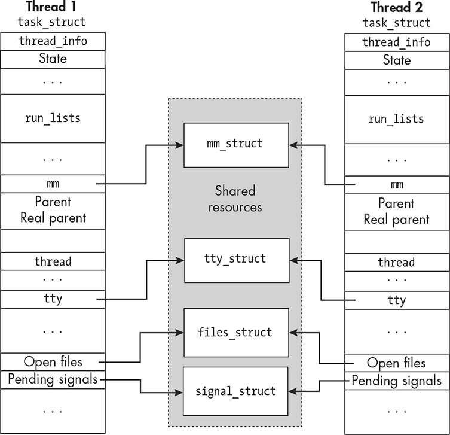
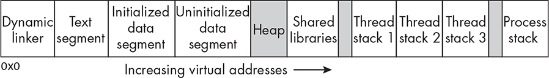
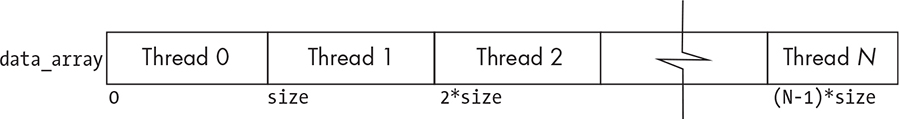

15 INTRODUCTION TO THREADS

The first chapter of the book introduced the concept of threads and

multithreaded programs without much detail. In subsequent chapters,

we touched on threads, usually because they were mentioned in the

documentation about something else we were studying, such as how a

process could be notified of a timer expiration. At those points in the book, we ignored thread-related topics. In this chapter, we’ll examine threads, and in particular, POSIX threads, in greater detail.

We’ll start with an overview of threads in general, including

How threads are different from processes

How threads are represented by the kernel

What resources are associated with threads

How program design is different when programs have multiple

threads

We’ll then present an overview of the POSIX threads API, known as

the *Pthreads* library, including the data types and broad categories of functions available for programming with threads. After that, we’ll dive into the details of using the basic functions related to the management and operation of threads.

We’ll also examine the complex relationship between signal handling and threads. When we first introduced signals, we didn’t have to think about questions such as which threads of a process receive a

signal sent to that process or whether a signal handler registered by one thread is run when another thread receives the signal it’s supposed to catch.

Equipped with this new knowledge and the collection of tools from

the *Pthreads* library, we’ll write a multithreaded version of the concurrent server from Chapter 14. The POSIX threads API is very large, and we’ll explore just a small part of it. This chapter’s objective is primarily to show you the basics of POSIX threads and a path toward

learning more about them.

Background

Processes require many kernel resources, such as a map of its entire

memory image, a description of its hardware state, and various kinds of attributes and metadata. On the other hand, a process has just a single flow of control, a single execution path. In this sense, a process is an inefficient consumer of system resources because, though it requires a lot of resources, it can execute just one instruction at a time. It would be more efficient if those resources could support a program’s ability to perform multiple tasks concurrently. Creating concurrency in a

program by forking new processes that then work together doesn’t

really achieve this, because each process still uses its own resources, and this introduces two other problems:

Processes must rely on interprocess communication facilities to

communicate because they cannot share their address spaces with

each other. Using any such facility is much slower than ordinary

fetches and stores of shared variables and data within a single

memory image.

Creating processes with the fork() system call is time consuming.

Recent versions of fork() in Linux use copy-on-write memory

pages, making fork() faster, but it is still a slow operation.

In the 1980s, the idea of creating multiple threads of control within a single process took hold. The basic idea was to identify the smallest subset of a process’s resources that would represent a single thread of control’s execution state. Copies of this subset of resources would allow multiple threads of control to execute on their own within the process’s address space. The copied resources included the hardware state and the stack. These threads existed within the process. The Unix community

explored various ways to standardize this concept of threads. In 1995, The Open Group defined a standard interface for UNIX threads (IEEE

POSIX 1003.1c) that they named *Pthreads* ( *P* for *POSIX*). This standard was supported on multiple platforms, including Solaris, macOS,

FreeBSD, OpenBSD, and Linux. In 1996, these requirements were

incorporated into the POSIX standard. The threads described by

POSIX were known as *POSIX threads*, and the API was dubbed the

*Pthreads API*. In 2005, a new implementation of the interface was developed by Ulrich Drepper and Ingo Molnár of Red Hat, Inc., called

the *Native POSIX Thread Library* ( *NPTL*), which was much faster than the original library and has since replaced that library. The Open Group further revised the standard in 2008. Today, most Unix systems provide the *Pthreads* API.

Threads and Processes

Each thread of a process is a flow of control through the code of its

parent program. In fact, we can think of every process as consisting of a memory image containing executable code together with one or more

threads that execute a stream of instructions through that code. In this sense, an ordinary Unix process is the special case of a multithreaded process with just a single thread. In a process with multiple threads, the threads can execute different tasks concurrently, and in many Unix

variants, including current versions of Linux, each thread is scheduled individually to run on a processor.

*Support in the Kernel*

Older versions of Unix and Linux had no support for multithreading; a program that was multithreaded using a threading library such as

*Pthreads* was seen by the kernel as a single process. The individual threads within that process weren’t visible to the kernel and were not scheduled individually. Books on operating system design refer to this as a *many-to-one (M:1)* threading model \[37\]. The major problem with this design was that if one thread made a blocking system call, the entire

process was blocked. Modern Linux kernels recognize the individual

threads of a process as distinct scheduling entities. This is usually known as a *one-to-one (1:1)* threading model.

In the Linux 2.6 kernel, and with versions of *glibc* since 2.3.2, threading support is provided by the kernel using the NPTL. Each

user-level thread, meaning the threads that our programs create, is

assigned to a kernel scheduling entity called a *lightweight process*.

*Pros and Cons of Multithreading*

Multithreaded programs have advantages over singly threaded

programs. Some of the most significant advantages are the following:

Code to handle each asynchronous event, such as a timer expiration

or receipt of a message, can be executed by a separate thread. Each

thread can handle its event using an ordinary synchronous

programming model.

Unlike cooperating processes, which have to use IPC facilities to

share data, threads share the process’s virtual address space, so they can share any data within it using ordinary fetch and store

operations, which is faster than using IPC facilities in general.

Even on a single processor machine, performance can be improved

by putting calls to system functions with expected long waits in

separate threads. This way, just the calling thread blocks and not

the whole process.

The response time of interactive programs can be improved by

spawning threads to handle tasks that are inherently asynchronous,

such as receiving and responding to various input devices.

Multithreaded programs have several disadvantages of which the following are the most significant:

They have potential race conditions and synchronization problems

that arise from the threads’ accessing shared data.

They are much harder to write, to test, and to debug. This stems in

part from the difficulty of reasoning about concurrent activities, in

part from the much larger number of possible states in which a

program might be when it has multiple threads, and in part from

the difficulty of using debugging and testing tools on

multithreaded programs.

Not all library functions are thread-safe. If two threads of the same

process execute a non-thread-safe library function at the same time,

the result of their combined execution is unpredictable because it

causes a race condition inside the function. If a multithreaded

program’s threads have to call non-thread-safe library functions,

the programmer needs to use synchronization methods to prevent

their being in the call at the same time.

Signal handling in a multithreaded program is much harder than it

is in a singly threaded program, in part because signals were

designed when multithreading did not exist and the interaction

between signals and threads is complex.

For any particular programming problem, these pros and cons have

to be weighed against each other.

*Shared Resources and Attributes*

Threads share some of the process resources and have private copies of the other resources. All threads share the memory image of the process.

In particular, they share the text segment, its data segment, and heap memory. This implies that threads share the program’s global variables, the command line arguments, the environment variables, and the data

allocated in the heap, provided that they have pointers to that data.

Threads do not share the process stack. In order for each thread to

run independently, each one needs its own runtime stack, and in order

for the kernel to make scheduling decisions about them, much of the metadata maintained in the process descriptor must be replicated for

each thread. POSIX.1 stipulates exactly which resources of a process

should be shared by all of its threads and which resources must be

private. In particular, the following parts of a process are not shared and must be unique to each thread:

A thread ID

A runtime stack and an alternate stack

The stack pointer and registers

The signal mask

The errno value

Scheduling attributes

Thread-specific data

On the other hand, most of the metadata in the process descriptor is

shared by all the threads. In addition to the text, data, and heap regions of the process, POSIX requires that the following metadata be shared

by all threads:

Environment variables

Process ID

Parent process ID

Process group ID and session ID

Controlling terminal

User and group IDs

Open file descriptors

Record locks

Signal dispositions

File mode creation mask (the umask)

Current working directory and root directory

Interval and POSIX timers

Nice value

Resource limits

Measurements of the consumption of CPU time and resources

In Linux, the process descriptor data structure, task_struct, is used to represent both threads and processes. Each thread has its own

task_struct. This may sound inefficient, but it isn’t. The Linux task_struct mostly contains pointers to other data structures. Instead of embedding resources in the task structure directly, it has pointers to these resources.

This makes it easy to separate which resources are private to each

thread and which are shared.

If two threads are part of the same process and share a particular

resource, their pointers point to the same resource structure instance. If a particular resource is not shared, their pointers point to unique copies of it.

Figure 15-1 is a schematic representation of the task_struct showing some parts that are linked into it and parts that are embedded in it.

*Figure 15-1: A schematic representation of how the process descriptors of two threads that* *are part of the same process facilitate sharing of memory, open files, and other shared data* *of the parent process*

The substructures of the parent process descriptor, such as the

mm_struct containing the memory maps and the files_struct that contains

a pointer to all open files, are shared by the process’s threads. In

contrast, the thread member of the process descriptor, which stores the entire hardware state, including saved register values and stack pointers, needed when the thread is not running, is embedded in the process

descriptor and distinct for each thread.

In Linux, thread stacks are allocated in the heap, often but not

always above where the shared libraries are mapped into it. Figure 15-2

depicts the virtual memory of a process with three thread stacks

allocated above the shared libraries.

*Figure 15-2: The location of the thread runtime stacks in process virtual memory* In Linux, the default stack size for each thread stack varies

depending on the machine architecture. The bash ulimit -s command

returns the default maximum stack size for a thread in KB. On Linux

6.9 on an x86-64 processor, for example, it is 8MB.

Program Design Considerations with Threads

Multithreading is suitable for certain types of concurrent programming.

In general, in order for a program’s performance to be improved by

multithreading, it has to be organized into discrete, independent tasks that can execute concurrently. The first consideration is how to

decompose the program into such discrete tasks. Other questions to be

answered include the following:

How can the load be balanced among the threads so that no one

thread becomes a bottleneck?

How will threads communicate and synchronize to avoid race

conditions?

What type of inherent data dependencies exist in the problem, and how will these affect thread design?

What data will be shared and what data will be private to the

threads?

How will I/O be handled? Will each thread perform its own I/O,

or will a single thread handle all I/O?

Each of these questions deserves some thought at the start of a project, and to some extent, each arises in most programming problems.

Determining data dependencies, deciding which data should be shared

and which should be private, and determining how to synchronize

access to shared data are very critical aspects to the correctness of a multithreaded program. Load balancing and the handling of I/O usually

affect performance but not correctness.

Knowing how to use a thread library is just the technical part of

multi-threaded programming. The harder part is designing the program

so that it is free of race conditions and makes efficient use of resources.

This chapter’s main objective is to explore the threading API, *Pthreads*, with examples to show how it can be used. Here and there, we’ll also

explore design issues in multithreaded programs.

Overview of the Pthreads Library

The *Pthreads* library provides a very large number of primitives for the management and use of threads; over 100 different functions are

defined in the 2024 POSIX standard. The functions in the *Pthreads* API fall into one of four groups:

Thread management Functions that work directly on threads,

such as creating, detaching, joining, and so on. This group also

contains functions to set and query thread attributes and functions to set and query thread scheduling properties.

Mutexes Functions for handling critical sections using mutual

exclusion. Mutex functions provide support for creating, destroying,

locking, and unlocking mutexes. These are supplemented by mutex attribute functions that set or modify attributes associated with

mutexes.

Condition variables Functions that address communications

between threads that share a mutex based upon programmer-

specified conditions. These include functions to create, destroy, wait, and signal, based upon specified variable values, as well as functions to set and query condition variable attributes.

Synchronization Functions that manage read-write locks and

barriers.

To get a feeling for how the API looks in general, we can look at the

*Pthreads* analogues to the basic process control primitives that we’ve learned about. Table 15-1 shows a comparison of selected system calls to their analogous *Pthreads* primitives.

Table 15-1: The Correspondence Between *Pthreads* Functions and

System Calls

Process

Thread

primitive

primitive

Description

fork()

pthread_create()

Creates a new flow of control (a

thread) with a function to execute

exit()

pthread_exit()

Exits from the calling flow of

control

waitpid()

pthread_join()

Waits for a specific flow of control

to exit and collect its status

getpid()

pthread_self()

Gets the ID of the calling flow of

control

kill()

pthread_cancel()

Potentially causes termination of

another thread

All thread functions in the *Pthreads* API start with the prefix pthread\_.

Some have names that suggest what they do, such as pthread_create(), but not all, such as pthread_cancel(), which is a call to terminate another thread. To use any of the *Pthreads* library functions, a program must include the *pthread.h* header file and must be linked with the -pthread linker option (not -lpthread!).

The *Pthreads* API added new system data types needed by the

functions in the API. The POSIX standard specifies that this set of

functions must be exposed by including the *sys/types.h* header file. That file may not have their declarations directly. It might instead include them from another header. For example, on my Ubuntu Linux 6.9,

*sys/types.h* file includes *bits/pthreadtypes.h*, which defines the added data types, some of which are described here:

**pthread_attr_t** Used to identify a thread attribute object

**pthread_barrier_t** Used to identify a barrier

**pthread_barrierattr_t** Used to define a barrier attributes object **pthread_cond_t** Used for condition variables

**pthread_condattr_t** Used to identify a condition attribute object **pthread_mutex_t** Used for mutexes

**pthread_mutexattr_t** Used to identify a mutex attribute object

**pthread_rwlock_t** Used for read-write locks

**pthread_spinlock_t** Used to identify a spin lock

**pthread_t** Used to identify a thread

Next, we’ll explore the functions for managing threads.

Thread Management

We’ll start with the fundamental thread operations: creating them,

terminating them in various ways, and waiting for child threads. We’ll review each of them and then put together a few small programs that

demonstrate how to use them. We won’t explore the more advanced features of thread management related to scheduling or concurrency

control. If you’re interested in learning about them, the relevant

functions are pthread_setschedprio(), pthread_getschedparam(),

pthread_setschedparam(), pthread_setconcurrency(), and pthread_getconcurrency().

*Creating a Thread*

The function that creates a new thread is easy to find in the man pages.

(Using apropos -a create thread works.) The pthread_create() function’s prototype is:

int pthread_create(pthread_t \*thread, const pthread_attr_t \*attr,

void \*(\*start_routine) (void \*), void \*arg);

It’s very different from the fork() system call. It creates and starts execution of a new thread. The first parameter, thread, stores the address of a variable of type pthread_t. On successful creation of the new thread,

\*thread contains its thread ID. Unlike fork(), this call passes the address of a function, \*start_routine(), that the new thread will execute. This function is called the *start function* of the thread. It has exactly one argument of type void\*, and it returns a void\*. The fourth argument, arg, is the address of the argument that is passed to start_routine() when the thread starts.

The second argument is a pointer to a pthread_attr_t structure, which

can be used to define attributes of the new thread. These attributes

include properties such as its stack size, scheduling policy, and *joinability*, which I’ll explain shortly. If we pass a NULL in this parameter, the default values are used instead. We’ll examine thread attributes in more detail later.

The pthread_create() man page’s SEE ALSO section refers us to the

remaining pages related to thread management. In particular, we’ll look next at pthread_exit(3), pthread_join(3), and pthread_self(3).

*Exiting a Thread*

A thread can terminate itself in a few different ways. It can execute an ordinary return instruction, in which case the return value will be saved for later retrieval by another thread. It can also call pthread_exit(), whose prototype is:

void pthread_exit(void \*retval);

This function terminates the calling thread. Like the \_exit() system call, pthread_exit() never returns. The single parameter (retval) can be used to pass an exit status from the thread. Another thread in the same process can obtain that exit status by calling pthread_join(), which we’ll examine shortly. The value pointed to by retval should not be located on the

calling thread’s stack, since the contents of that stack are undefined after the thread terminates. It can be a global variable, a static-qualified local variable of the start function, or a variable allocated on the heap.

When pthread_exit() is called, it causes cleanup handlers to run. This is similar to what the exit() library function does (see “Terminating

Processes” in Chapter 11). A cleanup handler is the thread analogue to a function registered with atexit(). It is registered with

pthread_cleanup_push(). They’re executed in the reverse order in which they were pushed. This function also frees all other thread-specific

resources, but not process-shared resources such as mutexes and file

descriptors.

WARNING

*Any thread can cal* *exit(). However, in a multithreaded program, if any* *thread, including the master thread (the one executing* *main()) cal s* *exit(), al currently running threads wil be terminated. If the master* *thread executing* *main()* *executes a* *return* *instruction, al other threads* *wil be terminated. If this isn’t desirable, the* *main()* *function should* *terminate itself by cal ing* *pthread_exit(). In this way, threads that are* *stil running wil continue to run.*

After the last thread in a process terminates, the process terminates

as if it called exit(0). At that point, process-shared resources are released

and all functions registered with atexit() are run.

*Joining a Thread*

The pthread_join() function is similar to waitpid(), except that it cannot be used to wait for any thread to terminate the way that waitpid(-1, &wstatus, 0) does. Joining is a way for one thread to wait for another thread to terminate, in much the same way that the wait() system calls let a

process wait for a child process. Joining a thread, like waiting for a process, is a way to synchronize the execution of threads. Its prototype is:

int pthread_join(pthread_t thread, void \*\*retval);

The calling thread must specify the thread ID of the thread for which it wants to wait. Calling pthread_join() suspends execution of the calling thread until the target thread terminates, unless the target thread has already terminated, in which case it returns immediately.

The thread specified in the first parameter must be joinable. A

thread is *joinable* if it can be joined. Some threads aren’t joinable. By default, newly created threads are joinable. Threads that aren’t joinable are called *detached* threads. A thread can be created in a detached state or it can be detached at a later time. We’ll say more about this topic in

“Detaching Threads” on page 722.

If retval is not NULL, then the value passed to pthread_exit() by the

terminating thread will be available in the location referenced by retval, provided that pthread_join() succeeds. The double indirection is needed because the parameter of pthread_exit() has type void\* and retval stores the address of the variable into which that value was copied.

We need to be careful when calling pthread_join() for the following

reasons:

Multiple simultaneous calls to pthread_join() by different threads

specifying the same target thread have undefined results.

The behavior is undefined if the thread argument to pthread_join()

doesn’t refer to a joinable thread.

The behavior is undefined if the thread argument refers to the calling thread itself; a thread cannot wait for itself.

If a thread that terminates is never joined, it becomes a *zombie*

thread. A zombie thread consumes some system resources, and

when the number of zombie threads is large enough, the system

won’t be able to create new threads or processes.

Let’s look at an example that shows how the preceding three

functions are used together. Listing 15-1 creates a single thread, after which the master thread joins it.

*pthread_create_demo.c*

void \*hello_world(void \*world)

{

long exit_value = 0; /\* Exit value must be the same size as a pointer. \*/

printf("Hello world from %s!\n", (char\*) world);

pthread_exit((void\*) exit_value);

}

int main(int argc, char \*argv\[\])

{

pthread_t newthread; /\* Stores thread ID \*/

long \*status; /\* To store thread exit status, this must be long. \*/

if ( 0 != pthread_create(&newthread, NULL, hello_world, "Pluto") ) fatal_error(errno, "pthread_create");

/\* Now wait for the child thread. \*/

if ( 0 != pthread_join(newthread, (void\*\*) (&status)) )

fatal_error(errno, "pthread_join");

printf("Child exited with status %ld\n", (long) status);

return 0;

}

*Listing 15-1: A program that creates a single thread and joins it when it terminates* Although it isn’t shown in Listing 15-1, all programs include the *pthread.h* header file. Observe that we can pass the string "Pluto" in the

last argument in the call to pthread_create(); it is converted to void\*, and in the start function, we have to explicitly cast it back to a string type for printing. A run of this program follows:

\$ **./pthread_create_demo**

Hello world from Pluto!

Child exited with status 0

*Passing Data to Threads*

A thread’s start_routine() has just a single void\* parameter, which has implications for the design of a program. It’s similar to the problem we had with signal handlers, which are even more constrained because they have just a single int argument. The void\* parameter lets us overcome

this.

When the threads in a program need access to more than a single

data item, there are a few possible solutions:

Declare variables needed by multiple threads to be global, in other

words, file-scoped.

Allocate shared variables on the heap through file-scoped pointers.

Define a data structure containing all data to be shared, and pass a

pointer to that structure to the thread start routine. This works

because we can pass any address into a void\* parameter.

The first two choices would look something like the following:

int counter = 0;

int \*on_heap = (int\*) malloc(sizeof int);

void \*start_function(void \*arg)

{

*--snip--* counter++; /\* Increment the global counter. \*/

\*on_heap = 1; /\* Assign 1 to \*on_heap. \*/

*--snip--*

}

Using global, shared variables inside threads invites race conditions, and if there’s a way to avoid doing so, we should. The third idea is to pack a data structure with everything each thread needs and pass a

pointer to it as the start function’s argument. For example, suppose that a large number of threads is created to process an even larger dataset. To make it concrete, suppose the data is in an array of integers that’s been allocated on the heap. Suppose also that each thread processes a

consecutive segment of this array and therefore needs the first and last indices of its segment in the array. Then we could define a structure

such as

typedef struct \_task_data {

pthread_t tid; /\* Thread ID assigned to thread \*/

int id; /\* Program's internal ID for the thread \*/

int first; /\* Index of first element for thread \*/

int last; /\* Index of last element for task \*/

int \*array; /\* Pointer to start of array \*/

int result; /\* Location where thread's result is stored \*/

} task_data;

to pass to each thread. Each thread will have its own values of first, last, and task_id. The tid member will contain the thread ID assigned to the thread when it is created; the task_id is a small integer that the program assigns to each thread so that it can be used to calculate which part of the array each thread is assigned. Figure 15-3 shows how the array is partitioned among the threads with this approach.

*Figure 15-3: An array partitioned into* N *segments for* N *tasks, such that all segments except* *the last are the same size*

The array pointer may or may not be needed in the data structure. If

the pointer to it is in file scope, the threads will have access to it anyway,

but if the pointer is a local variable in the main program, then a copy of the pointer should be in the structure. Suppose that the array is declared as a static local variable named array in the main program. Then a code fragment to initialize the thread data and create the threads would be as shown in Listing 15-2, assuming array_size is the number of array elements, nthreads is the number of threads to be created, and nthreads \< array_size.

task_data thread_data\[nthreads\];

for ( t = 0; t \< nthreads; t++ ) {

thread_data\[t\].first = (t \* array_size) / nthreads;

thread_data\[t\].last = (((t + 1) \* array_size) / nthreads) - 1;

thread_data\[t\].task_id = t;

thread_data\[t\].array = array;

if ( 0 != pthread_create(&(thread_data\[t\].tid), &attr, add_array, (void \*) &thread_data\[t\]) )

fatal_error(errno, "pthread_create");

}

*Listing 15-2: Initializing and starting threads to process a shared array* This would create and start nthreads-many threads, each executing

add_array() with its own structure containing the parameters of its

execution. This method of partitioning the array guarantees that the

sizes of the array segments differ by at most 1. I leave proof of this as an exercise.

*Identifying Threads*

A thread can get its thread ID by calling pthread_self(), whose prototype is:

pthread_t pthread_self(void);

This is the analogue to getpid() for processes. This function is the only way that the thread can get its ID, because the thread ID isn’t provided to it by the creation call, unless the program explicitly stores this thread

ID for the thread when it’s created, as the preceding example code did.

This function never fails.

A thread can check whether two thread IDs are equal by calling

pthread \_equal(), whose prototype is:

int pthread_equal(pthread_t t1, pthread_t t2);

This returns a nonzero value if the two thread IDs are equal and 0 if

they are not. This function never fails.

*Detaching Threads*

Because pthread_join() has to retrieve the status and thread ID of a

terminated thread, this information must be stored someplace, and

therefore uses system resources. Until a terminated thread is joined by some other thread, it is a zombie thread.

Sometimes threads are created that don’t need to be joined.

Consider a process that spawns a thread for the sole purpose of writing output to a file, which might take longer than the remaining execution time of the process. If the master thread is forced to call pthread_join() to reap this zombie thread, it has to wait around until the thread

terminates, which wastes more resources.

If a thread doesn’t need to be joined, it can be created as a *detached* *thread*. When a detached thread terminates, no resources are saved; the system cleans up all resources related to the thread. A thread that wasn’t initially detached can be detached later.

Being joinable or detached is a thread attribute. In order to set it, we need to modify the thread’s attribute object, of type pthread_attr_t. This is a two-step procedure:

1\. Initialize the thread attribute object with the default values by

calling pthread_attr_init().

2\. Change the individual detachment state of the attribute object by

calling pthread_attr_setdetachstate().

The documentation for pthread_attr_init() warns us not to call this

function more than once. Calling it after the object has been initialized

results in undefined behavior. Its prototype is:

int pthread_attr_init(pthread_attr_t \*attr);

The prototype for pthread_attr_setdetachstate() is:

int pthread_attr_setdetachstate(pthread_attr_t \*attr, int detachstate); The second parameter must be either PTHREAD_CREATE_DETACHED or PTHREAD

\_CREATE_JOINABLE.

Putting this together, the code for creating a detached thread is:

pthread_t tid; /\* Thread ID \*/

pthread_attr_t attr; /\* Thread attribute \*/

pthread_attr_init(&attr); /\* Initialize attribute object. \*/

pthread_attr_setdetachstate(&attr, PTHREAD_CREATE_DETACHED);

pthread_create(&tid, &attr, start_routine, arg); /\* Create the thread. \*/

Converting a joinable thread to a detached thread is easier because

*Pthreads* has a pthread_detach() function. Its prototype is:

int pthread_detach(pthread_t thread);

It can be called by any thread, including the thread itself. It marks the thread identified by thread as detached. Attempting to detach an already detached thread results in unspecified behavior. A thread can detach

itself by calling:

pthread_detach(pthread_self());

Detaching a thread is irreversible—it cannot become joinable

afterward. Listing 15-3 contains a program that creates a detached thread. The main() function creates the detached thread and terminates by calling pthread_exit() to allow its detached child to run after main() terminates. The call to usleep() in the thread loop slows the thread so that it continues after main() exits.

*pthread_detach_demo.c*

void \*thread_routine(void \*arg)

{

printf("Child is running...\n");

for ( int i = 0; i \< strlen(arg); i++ ) {

usleep(500000);

write(1, arg + i, 1);

}

printf("\nChild is exiting.\n");

return(NULL);

}

int main(int argc, char \*argv\[\])

{

char \*buf = "abcdefghijklmnopqrstuvwxyz";

pthread_t thread;

pthread_attr_t attr;

pthread_attr_init(&attr);

pthread_attr_setdetachstate(&attr, PTHREAD_CREATE_DETACHED);

if ( pthread_create(&thread, NULL, thread_routine, (void \*)(buf)) ) fatal_error(errno, "error creating a new thread");

printf("Main is now exiting.\n");

pthread_exit(NULL);

}

*Listing 15-3: A program that creates a detached thread and exits while the thread is running* Build this program and run it without arguments:

\$ **./pthread_detach_demo**

Main is now exiting.

Child is running...

abcdefghijklmnopqrstuvwxyz

Child is now exiting.

This output shows that the thread continued to run after the main

program terminated.

*Canceling a Thread*

Threads can be canceled. *Cancel ation* is essentially a request to terminate a thread. When a thread is canceled, its resources are cleaned

up and it is terminated. A thread can request that another thread be canceled by calling pthread_cancel(), the prototype for which is:

int pthread_cancel(pthread_t thread);

Canceling is just a request; it isn’t necessarily honored. When this

function is called, a cancellation request is sent to the thread given as the argument. Whether or not that thread is canceled depends upon the

thread’s cancelability state and type. The *cancelability* of a thread is the attribute that specifies whether or not a thread will allow itself to be terminated.

A thread can enable or disable cancelability, and it can also specify

whether its cancelability type is asynchronous or deferred. If a thread’s cancelability type is *asynchronous*, then it will be canceled immediately upon receiving a cancellation request, assuming it has enabled its

cancelability. On the other hand, if its cancelability is *deferred*, then cancellation requests are deferred until the thread enters a cancellation point. Certain functions are *cancel ation points*. To be precise, if a thread is cancelable, and its type is deferred, and a cancellation request is pending for it, then if it calls a function that is a cancellation point, it will be terminated immediately. The list of cancellation point functions required by POSIX can be found on the man page for *Pthreads* in Section 7.

A thread’s cancelability state is enabled by default. It can be changed after it’s created by calling pthread_setcancelstate(), whose prototype is: int pthread_setcancelstate(int state, int \*oldstate);

The two possible values for the first parameter (state) are

PTHREAD_CANCEL_ENABLE and PTHREAD_CANCEL_DISABLE. The second parameter is the address of an integer to store the old state, or NULL if the program doesn’t need it. If a thread disables cancellation, then a cancellation request remains queued until it enables cancellation. If a thread has

enabled cancellation, then its cancelability type determines when

cancellation occurs.

A thread’s cancellation type is deferred by default. It can be set with pthread_setcanceltype():

int pthread_setcanceltype(int type, int \*oldtype);

The possible values for the first parameter are PTHREAD_CANCEL_ASYNCHRONOUS

and PTHREAD_CANCEL_DEFERRED.

*Setting Thread Stack Size*

The POSIX standard doesn’t specify the size of a thread’s stack, which can vary from one implementation to another. Furthermore, with even

moderately demanding computational problems, exceeding the default

stack limit is not that unusual. Thread stacks are usually no more than 8192 bytes, which is easily exceeded by many kinds of programs. If the stack limit is exceeded, the program will terminate, possibly with

corrupted data.

Safe and portable programs don’t depend upon the default stack

limit but instead explicitly allocate enough stack space for each thread by calling the pthread_attr_setstacksize() function, whose prototype is: int pthread_attr_setstacksize(pthread_attr_t \*attr, size_t stacksize); The first argument is the address of the thread’s attribute object. The second is the new size for the stack. This function will fail if the

attribute object doesn’t exist or if the stack size is smaller than the allowed minimum (PTHREAD_STACK_MIN) or larger than the allowed

maximum. The man page lists more caveats about its use.

To get the stack’s current size, a thread can call:

int pthread_attr_getstacksize(pthread_attr_t \*attr, size_t \*stacksize); This stores the current size of the stack in the variable whose address is passed in stacksize. It will fail if attr doesn’t reference an existing attribute object.

To use this function, the thread has to have access to its current

attribute object. There is no POSIX function that returns the attribute object of the calling thread, but there is a GNU extension,

pthread_getattr_np(). However, this is a nonportable extension, not

specified by POSIX. If we want our code to be portable, we can’t rely on this function.

An alternative is to pass a reference to the attribute object to the thread in the start function so that it can change its attributes at a later time. The program *pthread_setstacksize.c* in the book’s source code distribution shows how to do this. The following program fragment

shows the key parts of the solution:

void thread_routine(void \*arg)

{

*--snip--*

pthread_attr_t attr = (pthread_attr_t\*) arg;

pthread_attr_getstacksize(attr, &stack_size);

*--snip--*

}

int main()

{

pthread_t thr;

pthread_attr_t attr;

*--snip--*

pthread_attr_init(&attr);

*--snip--*

pthread_create(&thr, &attr, &thread_routine, &attr);

}

Regardless of whether your program increases the thread stack size, it’s always a good idea to be mindful of how the thread uses memory. For

example, if a thread needs local buffer storage for fairly large amounts of data, it should not declare an array on its stack. It should dynamically allocate storage on the heap instead (and free it when it no longer needs it).

Threads have several other attributes, but exploring them is an

advanced topic that we won’t cover here. The POSIX standard has a list of functions with names of the form pthreads_attr_get\* that return specific attribute values. We know enough about threads at this point to create a nontrivial multithreaded program, but first we should explore the

relationship between signals and threads.

Signals and Threads

The interaction between signals and threads is complex, but we need to understand it if any of our multithreaded programs have any signal

handling capabilities. Some of the questions that we should answer

include:

If a signal is sent to a process, such as by kill(), is it sent to all of its threads or just one of them, and if just one, which one?

Is there a distinction between signals sent to a process and signals

directed at a specific thread?

Can each thread register its own signal handlers, or do all threads

share them?

More generally, can different threads have different signal

dispositions?

Can each thread have its own signal mask, or are they all shared?

We can find answers to most of these questions in the signal(7) man

page. First, let’s distinguish between *thread-directed* and *process-directed* signals.

*Thread-Directed Signals*

These are signals directed at a specific thread. There are several ways to direct a signal to a specific thread:

A signal can be directed at a specific thread if another thread in the same process sends it a signal using pthread_kill() or

pthread_sigqueue().

A thread can send a signal to itself by calling raise().

If a thread executes an instruction that causes an exception of any

kind resulting in generation of a signal, such as SIGSEGV, that signal will be sent just to that thread.

If a thread tries to write to a pipe, named or unnamed, but no

processes have it open for reading, the SIGPIPE signal is sent just to

that thread.

These are essentially the only ways to send a signal to a specific thread.

The tgkill() system call can do so, but it is meant for internal thread library use only.

*Process-Directed Signals*

These are signals targeted at the whole process and therefore pending

for the whole process. Essentially, all signals sent by means other than the ones listed in the preceding section are process-directed. These are some explicit ways to send process-directed signals:

A process or thread issues either a kill() or sigqueue() system call

directed at the process of any of its threads.

The kill command specifies the process of any of its threads.

A user generates a signal from the keyboard, such as SIGINT.

The kernel generates a signal as a result of some hardware

exception unrelated to the process’s execution, such as a SIGPWR.

A signal is sent as a result of a timer expiration, possibly as a result of an I/O operation.

These are the most common ways for a process-directed signal to be

generated.

*Signal Masks and Dispositions*

In a multithreaded program, every thread begins by inheriting its

parent’s signal mask, but it can also have its own signal mask. A thread calls pthread \_sigmask() to create or modify its own mask. It has the same prototype as sigprocmask(). Every thread also has its own list of pending signals. A thread can retrieve the set of signals pending for it specifically as well as pending process-directed signals by calling sigpending().

In contrast, signal dispositions are process wide. In particular, signal handlers are process wide. This means that if a signal is delivered to any thread, whether that thread registered a handler for that signal or some

other thread did, the handler will run, assuming the thread did not block the signal. It doesn’t matter whether the signal is directed at a specific thread or is process directed. For example, if thread A registers a handler named sighandler() to catch SIGINT, and a signal is sent to thread B, which did not register this handler, sighandler() will run anyway.

Similarly, if the disposition was set to SIG_IGN, then all threads that have not changed their signal masks will ignore SIGINT. There are

complicating factors though.

NOTE

*If a process-directed signal is sent to a process, it’s delivered to any one of* *the threads that do not have the signal blocked at the time of delivery. If* *more than one thread has the signal unblocked, the kernel chooses an* *arbitrary thread to which to deliver the signal.*

For example, if a program has three threads, A, B, and C, and only A has blocked SIGINT, then if a user enters CTRL-C on the keyboard, the signal will be delivered to either B or C but we cannot predict which one. If a signal handler for SIGINT is registered, then the handler will be run by the thread that receives the signal.

The program in Listing 15-4 is designed to experiment with threads and signals so that you can corroborate these behaviors. Some error

handling has been removed to save space. The complete program is in

the book’s source code distribution.

*pthread_signal_demo.c*

\#include "common_hdrs.h"

\#include \<pthread.h\>

\#ifndef SLEEP

\#define SLEEP 10

\#endif

sigset_t mask; /\* Signal mask \*/

pthread_t thr\[3\]; /\* Thread IDs \*/

void sighandler(int sig)

{

printf("Received %d; handler run by thread %ld\n", sig, pthread_self());

}

void \*t1(void \*arg) /\* Thread t1 start function \*/

{

\#ifdef BLOCK1

pthread_sigmask(SIG_BLOCK, &mask, NULL);

\#endif

sleep(SLEEP);

pthread_exit((void\*) arg);

}

void \*t2(void \*arg) /\* Thread t2 start function \*/

{

\#ifdef SIGHANDLE

struct sigaction sa;

sigemptyset(&sa.sa_mask);

sa.sa_flags = 0;

sa.sa_handler = sighandler;

sigaction(SIGINT, &sa, NULL);

\#endif

sleep(SLEEP);

pthread_exit((void\*) arg);

}

void \*t3(void \*arg) /\* Thread t3 start function \*/

{

sleep(SLEEP);

pthread_exit((void\*) arg);

} int main(int argc, char \*argv\[\])

{

long \*status;

sigemptyset(&mask);

sigaddset(&mask, SIGINT);

pthread_create(&thr\[0\], NULL, t1,(void\*) 1);

pthread_create(&thr\[1\], NULL, t2,(void\*) 2);

pthread_create(&thr\[2\], NULL, t3,(void\*) 3);

pthread_sigmask(SIG_BLOCK, &mask, NULL);

sleep(1);

\#ifdef MAINSIGNALS

printf("Sending SIGINT to thread 1\n");

pthread_kill(thr\[0\], SIGINT);

\#endif

for ( int i = 0; i \< 3; i++ ) { /\* Wait for the child threads. \*/

pthread_join(thr\[i\], (void\*\*) (&status));

printf("Child exited with status %ld\n", (long) status);

}

return 0;

}

*Listing 15-4: A program that can show different signal dispositions when multiple threads* *are running*

By compiling the program and defining zero or more of the three

symbols, MAINSIGNALS, BLOCK1, and SIGHANDLE, such as

\$ **gcc -I../include -L../lib pthread_signal_demo.c -o pthread_signal_demo\\**

**-lspl -lm -lrt -pthread -DBLOCK1 -DSIGHANDLE**

you can run it to confirm the signaling semantics. The main() function creates three threads and then waits for them. If MAINSIGNALS is defined when you compile it, main() will send a thread-directed SIGINT signal to thread 1. If SIGHANDLE is defined, then a signal handler will be registered by thread 2. If BLOCK1 is defined, then thread 1 blocks SIGINT. If you run it without any of these symbols defined, the three threads will exit

normally:

\$ **./pthread_signal_demo**

Child exited with status 1

Child exited with status 2

Child exited with status 3

If you allow the main program to send a signal to thread 1 without

registering the signal handler, you see

\$ **gcc -I../include -L../lib pthread_signal_demo.c -o pthread_signal_demo\\**

**-lspl -lm -lrt -pthread -DMAINSIGNALS**

\$ **./pthread_signal_demo**

Sending SIGINT to thread 1

\$

showing that the main program never made it to the pthread_join() calls and all threads terminated.

Define SIGHANDLE and rerun it:

\$ **./pthread_signal_demo**

Sending SIGINT to thread 1

Received 2; handler run by thread 140223239542336

Child exited with status 1

Child exited with status 2

Child exited with status 3

Now increase the sleep time when you compile it and open a second

terminal window before running it. Run the program, and in the second

terminal, enter:

\$ **ps -L -eopid,ppid,tid,cmd \| grep pthread_signal_demo**

23691 6442 23691 pthread_signal_demo

23691 6442 23693 pthread_signal_demo

23691 6442 23694 pthread_signal_demo

If you have enough time, send a SIGINT using kill -2 to any of the threads and observe what happens. All threads are killed if the handler isn’t

registered, no matter which thread you signaled.

The implications for program design are significant. Because we

can’t predict which thread receives the signal if none of them block it, we can’t predict whether the thread that runs the signal handler will

have a race condition because of where it was interrupted. In general, handling signals asynchronously presents problems with multithreaded

programs.

For this reason, it’s better to handle signals synchronously in a

dedicated thread. Kerrisk \[20\] suggests the following:

Before creating any child threads, the main program’s thread should block all asynchronous signals. The child threads will

inherit this mask.

Create a single thread that synchronously waits for these masked

signals using sigwait().

We’ll put this idea to work in the next program.

A Multithreaded Concurrent Server

The concurrent server that we developed in Chapter 14 forked a new process for each client interaction. Here, we’ll convert this server to a multithreaded concurrent server instead. Specifically, for each client request, it will create a new thread. Changing the server design won’t require any changes to the client-side program, *upcase.c*, nor the shared header file, *upcase.h*, but it will require a change in how some data is organized and how it handles signals.

The process-based concurrent server’s main loop is of the form:

while ( read(publicfd, (char\*) &msg, sizeof(msg)) \> 0 ) {

if ( -1 == (pid = fork()) )

syslog(LOG_ERR, "Could not create child process.");

else if ( 0 == pid )

// OMITTED: Fork a new process to service the incoming client

// request based on the private FIFO names in msg.

process_client(&msg); /\* Child process executes. \*/

exit(EXIT_SUCCESS); /\* Should never get here! \*/

}

The process_client() function is executed by a newly created process. We can instead make process_client() the start function of a new thread. Its prototype is almost the correct form:

void process_client(message \*msg)

However, there are a few catches:

When the process-based concurrent server forks a new process to execute this function, the entire address space is replicated and, in

particular, msg is duplicated in the new process. Each child process

has its own copy of msg. When we create a new thread with process

\_client() as the start function, nothing is replicated. If we pass the address of msg in the start function of a thread, then multiple

threads will have pointers to the same message structure, a local

variable in the main program. As the content of this structure

changes in the master thread, the child threads can have corrupted

data and incorrect results.

The process_client() function from the process-based concurrent

server accesses global variables such as clientwritefd and clientreadfd.

The thread start function has to have its own copies of these and

other variables that are globals.

We need to change the signal handling, since as it is, it can lead to

errors if a signal arrives when multiple threads are running.

The threads should be created in a detached state so that the parent

process does not have to call pthread_join() to collect their statuses when they terminate.

The solution to the first problem is to allocate memory on the heap

every time a new client sends a request message, copy the request

memory into that new memory, and pass a pointer to it to the start

function of the new thread. Without any error handling, this is roughly: message \*client_data = (message\*) malloc(sizeof(message));

memcpy(client_data, &msg, sizeof(msg));

pthread_create(&child_thread, &attr, process_client, (void\*) client_data)) The second problem has an easy solution. All variables used in the

start function other than its parameter should be local.

Regarding the signal issue, we can follow the approach we outlined

in “Signals and Threads” (see page 731). The main program will block all potentially terminating asynchronous signals. It will then create a signal-handling thread whose only purpose is to synchronously handle

any pending signals by calling sigwait(). The only signal handler needed by the threads is one for SIGPIPE because a thread can receive this signal if it tries to write to its private raw text FIFO but the server closed its read end of it.

The start function for this signal-handling thread is as follows:

sighandler()

void \*sighandler( void \*data)

{

int sig;

sigset_t mask = \*(sigset_t\*) data;

if ( sigwait(&mask, &sig) != 0 )

fatal_error(errno, "sigwait");

close(dummyfd); /\* Close global descriptors. \*/

close(publicfd);

unlink(PUBLIC); /\* Remove FIFO name. \*/

exit(EXIT_SUCCESS); /\* Force all threads to exit. \*/

}

The main() function will pass it a pointer to a signal mask with each of the blocked signals set in it. This thread calls sigwait(), waiting for any of these signals to be sent. Since they’re blocked, they become pending as soon as the process receives them, and the sigwait() call will return 0.

Regardless of which signal it removed from the set of pending signals, it closes the open file descriptors, removes the public FIFO name from

the filesystem, and calls exit(). Calling exit() causes all other threads to terminate as well.

Listing 15-5 contains the parts of the main program that are different in this multithreaded server from the previous one. The

complete program is in the book’s source code repository.

*threaded_upcased.c* main()

int main(int argc, char \*argv\[\])

{

message msg; /\* Connection message \*/

struct sigaction sigact; /\* sigaction for registering handlers \*/

sigset_t mask; /\* Signal mask of blocked signals \*/

pthread_t child_thread; /\* Thread ID for created child \*/

pthread_t sig_thread; /\* Thread ID for signal-handling thread \*/

pthread_attr_t attr; /\* Attribute structure for threads \*/

message \*client_data; /\* message structure to send to thread \*/

*--snip--*

/\* Set the attribute structure to create detached threads. \*/

pthread_attr_init(&attr); pthread_attr_setdetachstate(&attr,

PTHREAD_CREATE_DETACHED);

pthread_attr_setstacksize (&attr, 65536);

/\* Block likely asynchronous signals. \*/

sigemptyset(&mask);

sigaddset(&mask, SIGINT);

sigaddset(&mask, SIGHUP);

sigaddset(&mask, SIGTERM);

sigaddset(&mask, SIGQUIT);

sigaddset(&mask, SIGABRT);

if ( -1 == sigprocmask(SIG_BLOCK, &mask, NULL) )

log_and_exit("sigprocmask failed");

/\* Create signal-handling thread. \*/

if ( 0 != pthread_create(&sig_thread, &attr, sighandler, (void\*) &mask) ) syslog(LOG_ERR, "Could not create child thread.");

while ( read(publicfd, (char\*) &msg, sizeof(msg)) \> 0 ) {

if ( NULL == (client_data = (message\*) malloc(sizeof (message))) )

log_and_exit("malloc");

memcpy(client_data, &msg, sizeof(msg));

if ( 0 != pthread_create(&child_thread, &attr, process_client, (void\*) client_data) )

syslog(LOG_ERR, "Could not create child thread.");

memset(&msg, 0, PIPE_BUF);

}

close(dummyfd);

close(publicfd);

unlink(PUBLIC);

exit(EXIT_SUCCESS);

}

*Listing 15-5: The* *main()* *function for the multithreaded concurrent server* If the parent needed to wait for the child threads, it would need to save the thread IDs of each one. Since the threads were created in a detached state, it doesn’t have to wait and doesn’t do anything with the thread IDs, so the main loop just reuses the same variable.

The thread start function is the remaining piece of this program. It

is almost identical to the function executed by the child processes of the process-based concurrent server. I show only the changed parts in

Listing 15-6.

process_client()

void \*process_client(void \*data)

{

int nbytes;

int tries;

int clientwritefd; /\* This was global in the process-based server. \*/

int clientreadfd; /\* This was global in the process-based server. \*/ /\* This must be allocated on the heap for each thread. \*/

char \*buffer = (char\*) malloc(PIPE_BUF);

if ( NULL == buffer )

log_and_exit("malloc");

/\* Cast argument to message pointer. \*/

message \*client_msg = (message\*) data;

*--snip--*

free(buffer);

free(client_msg);

pthread_exit(EXIT_SUCCESS);

}

*Listing 15-6: The thread start function for threads that process client requests*

The function allocates its buffer on the heap. If the buffer is stored in the stack as a local variable, the thread stack might overflow unless I increase the stack size. Since heap memory is so much larger, it’s easier just to store it in the heap and free it when the thread exits. The thread also has to free the memory of the message itself. This was allocated in the master thread, but the master thread can’t free it because it has no idea when the child thread will be finished.

This program will produce the same output as the previous server. It

should be able to handle many more clients and run faster for each. A

good experiment is to set up a script that runs many clients nearly

simultaneously, discarding their output, to see how many concurrent

threads this server can handle. I leave this as an exercise.

Summary

A process requires many kernel resources but executes just a single

sequence of instructions from its executable code. As a result, an

ordinary process can’t perform multiple tasks simultaneously. Multiple processes working together don’t alter this inefficiency, since they don’t share any resources. Threads are a solution to this problem. A

multithreaded process consists of multiple threads of control through

the executable code of a program. Each thread executes an independent

path within the program’s address space, and therefore, at any given

time, multiple instructions are executed within the same program.

Threads share the program’s data and heap segments, but each

thread has its own private runtime stack. Each thread also has its own registers, signal mask, errno variable, and scheduling attributes. All other process attributes, such as the environment variables, controlling

terminal, working directory, open file descriptors, and so on, are shared among all of the threads.

The fact that threads can share data easily is the primary reason that some problems have more efficient solutions in a multithreaded

program than they would in a program with multiple processes that

share data. However, the sharing of data among threads introduces the

possibility of race conditions and data corruption in the code, because

two or more threads can modify the same variable in an uncontrolled way. Solving this problem requires the use of primitive operations that can protect these critical sections of code from simultaneous access.

POSIX threads, commonly known as *Pthreads*, is an API consisting of data types and functions for writing multithreaded programs. It

includes over 100 different functions for the management and control

of threads with a program, falling into one of the following categories: Thread management

Mutex management

Condition variable management

Synchronization primitives

The thread management group, for example, contains operations for

creating, initializing, and destroying threads; modifying thread

attributes; and controlling how threads can terminate themselves and

each other.

Signals and the signal handling mechanisms were designed long

before threading libraries were created. The interaction between signals and threads is complex because signals were designed to work with

processes, not threads. Questions such as which threads get which

signals and which threads execute signal handlers do not always have

simple answers.

This chapter presented an overview of the *Pthreads* API and

examined the various functions in the thread management category. It

examined how signals work in multithreaded programs. Lastly, it

developed a multithreaded version of the concurrent upcased server from

Chapter 14. The next chapter explores parts of the *Pthreads* API related to mutexes, condition variables, and synchronization.

Exercises

1\. Prove that the method of partitioning the elements of an array of

size *N* among *p* threads shown in Listing 15-2 has the property

that the number of elements assigned to each thread differs by at most 1 and the thread that has the last segment of the array always

has ⌈ *N*/ *p*⌉ elements.

2\. Write a multithreaded version of *spl_ls2.c* (from Chapter 7) that creates a separate thread for each directory command line

argument.

3\. Write a program that creates as many threads as possible, using the default attributes for each thread, with a start function that prints

Hello World and then exits. Design the program so that it reports the

largest number of threads it was able to create before it exits. Run

this program on several computers. Is the reported number always

the same?

4\. Write a script to determine the maximum number of simultaneous

clients the multithreaded upcased server can serve at a time without

failing. Each client should get its text interactively so that it stays running until it receives a signal or an EOF from the terminal.

Design the script so that it creates new clients until the server fails and then kills the clients.

5\. Write a multithreaded program named *search.c* that is given the pathname of a text file consisting of an unlimited number of

unique integers, not in any order, followed by a single integer, *n*.

The program outputs its 1-based position in the file if it’s there

and 0 otherwise. The program must create a number of threads

equal to the number of processors in the computer. Each thread

has to search its own set of numbers using the method of

partitioning shown in Listing 15-2. If a thread finds the number, it should modify a global variable to cause the other threads to exit

immediately. The main program should output the position. Read

the man page for get_nprocs(3) and/or sysconf() to learn how to get

the processor count.

6\. Write a multithreaded version of *spl_du1.c* (from Chapter 7) that creates a separate thread for each directory command line

argument. (The nftw() function is thread-safe provided that the FTW_CHDIR is not passed to it.)

