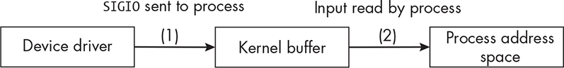
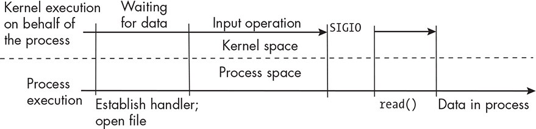
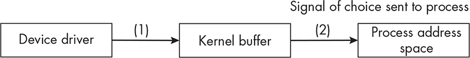
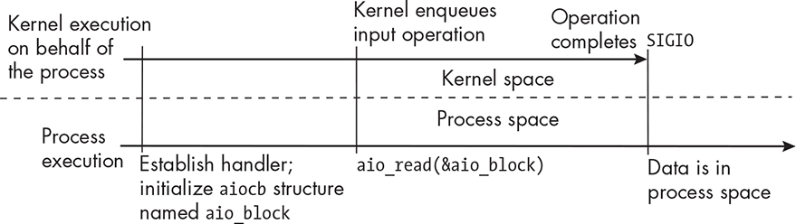
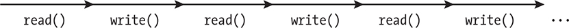
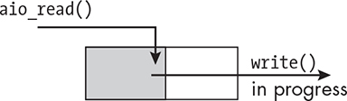
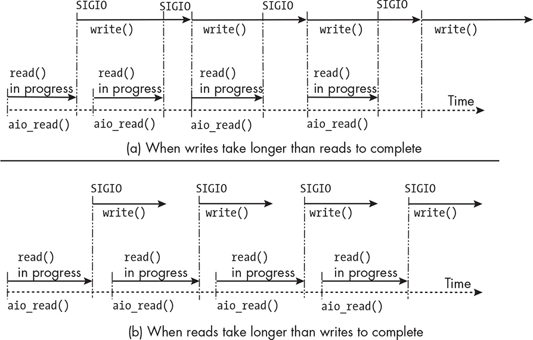
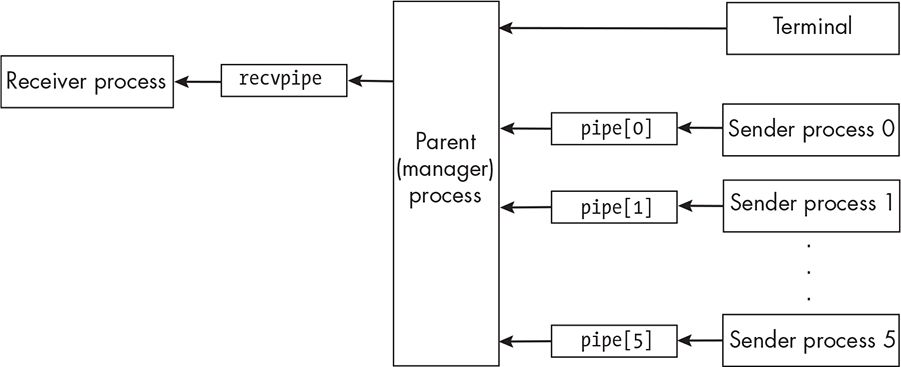

17 ALTERNATIVE METHODS OF I/O

Most of the programs in previous chapters are based on a model of I/O

in which read and write operations are blocking. These programs obtain their input from a single source, either the standard input stream or a disk file, and they send their output to a single source, either the

standard output stream or a disk file. The exceptions are the programs in Chapters 12, 13, and 14, some of which open message queues and pipes in nonblocking mode, but only because this is needed to keep

these facilities from closing prematurely or to prevent deadlock or some other unwanted behavior.

When a process issues a blocking read, it is suspended until the data

from the input source is transferred to its address space. When it issues a blocking write, it’s suspended until the data is transferred from its address space to a kernel buffer, which usually takes place so quickly that the delay is imperceptible.

For some types of applications, blocking I/O is unsatisfactory. Some

examples are:

Interactive programs, which need to respond immediately to

infrequent user input in the terminal while they perform other

tasks. If they have to block while waiting for the input, they can’t

make progress on the other tasks and waste time waiting for input

that arrives at unpredictable times.

Programs that have multiple input sources with intermittent data flow and that need to monitor all of them for possible input.

Blocking while waiting for input from one source prevents their

checking the other sources, which might have input waiting to be

read, resulting in delays and inefficiencies.

In this chapter, we’ll explore alternatives to this model of I/O. In

particular, we’ll consider:

Nonblocking I/O achieved by enabling the O_NONBLOCK flag on the file

descriptor

Signal-driven I/O achieved by enabling the Linux and BSD-

specific O_ASYNC flag on the file descriptor

POSIX asynchronous I/O (AIO)

Multiplexed I/O based on the select() system call

Signal-driven I/O is limited to terminals, pseudoterminals, sockets,

pipes, and FIFOs. The other methods can be used with file descriptors

for any device type, such as disk files, pipes, terminals, and so on.

Nonblocking I/O

Nonblocking input refers to any method of input in which the process

returns immediately from a call to read() when no data is available for reading, and symmetrically, nonblocking output refers to any method of output in which the process returns immediately if it’s unable to write to the file descriptor. This can happen with pipes, for example, when

they’re full, and it can even happen to terminals if the writing process sends data at a faster rate than the driver can process that data.

*Enabling Nonblocking I/O*

To enable nonblocking I/O on a file descriptor, we simply enable the

O_NONBLOCK flag on it. If this flag is set, when a process calls read(), if no data’s available, it doesn’t wait; instead, read() returns -1 and puts an error code in errno. Similarly, if it calls write() and it’s not possible to

write to the target device, write() returns -1 and puts an error code in errno.

While it’s useful to enable nonblocking reading on terminals, pipes,

and sockets, for example, it makes little sense to do so with disk files. If a file isn’t empty, a read operation will be satisfied, unless such a large number of bytes is requested that it takes a perceptible amount of time for the kernel to transfer the data to the process’s address space, or the disk is so busy that the read operation is delayed. In either case, it’s the kernel’s decision to put the process into a noninterruptible sleep while the data is transferred. The open(2) man page states this clearly:

Note that this flag has no effect for regular files and block devices; that is, I/O

operations will (briefly) block when device activity is required, regardless of whether O_NONBLOCK is set.

Since we’ve already explored the use of nonblocking I/O on IPC

facilities such as message queues and pipes, here I’ll concentrate on how it can be used with interactive programs. The typical use of it in this case is of the form: while ( TRUE ) { // Compute stuff. if ( read(0, &buf, numbytes) \<= 0 ) // Handle the case that no data is available. else //

Process data read into buf. }

In other words, the program’s main loop calls read() in each iteration. If it returns -1, it just goes back to computing. If not, then it received data and can compute with it.

Chapter 11 introduced the fcntl() system call to enable the O_APPEND

flag on a file descriptor to prevent race conditions. It’s a three step-procedure. To enable O_NONBLOCK, we follow the same procedure: int

flagset = fcntl(fd, F_GETFL); /\* Get the existing flagset from fd. \*/ if (

flagset == -1 ) /\* Check if fcntl() failed. \*/ fatal_error(errno, "fcntl"); /\* If so, handle it. \*/ flagset \|= O_NONBLOCK; /\* Bitwise-OR the flag. \*/ if ( -1 == fcntl(fd, F_SETFL, flagset) ) /\* Set the flagset into fd. \*/

fatal_error(errno, "fcntl"); /\* If an error, handle it. \*/

The call to fcntl() can fail for several reasons; a program should always check its return value.

*A Program to Demonstrate Nonblocking Input*

Listing 17-1 sets up nonblocking input on the standard input stream connected to the terminal. The program doesn’t do much else; it

repeatedly calls read() to read a single character entered by the user and prints a message on the terminal indicating either that read() failed or that it read the entered character. It terminates if the user enters q or after 500 iterations, whichever comes first.

*nonblock_demo1.c*

\#include "common_hdrs.h"

\#include \<fcntl.h\>

void set_non_block(int fd)

{

int flagset = fcntl(fd, F_GETFL);

if ( flagset == -1 )

fatal_error(errno, "fcntl");

flagset \|= O_NONBLOCK;

if ( -1 == fcntl(fd, F_SETFL, flagset) )

fatal_error(errno, "fcntl");

}

int main(int argc, char \*argv\[\])

{

char ch;

int count = 0, failedcount = 0;

char str\[128\];

long delay = 500000;

if ( argc \> 1 )

delay = strtol(argv\[1\], NULL, 0);

set_non_block(STDIN_FILENO); /\* Turn off blocking mode. \*/

while ( count \< 500 ) {

count++;

if ( -1 == usleep(delay) ) /\* Delay a bit. \*/

fatal_error(errno, "usleep");

if ( read(STDIN_FILENO, &ch, 1) \> 0 ) {

if ( ch == 'q' )

break;

else if ( ch != '\n' ) { /\* Don't print entered newline. \*/

sprintf(str, "\rUser entered %c\n", ch);

write(1, str, strlen(str));

}

}

else { /\* read() returned -1, implying no data available. \*/

failedcount++; /\* Update counter. \*/

sprintf(str, "\rNo input; number of unsatisfied reads = %d\n", failedcount);

write(1, str, strlen(str));

}

}

return 0;

}

*Listing 17-1: A program using nonblocking input to read from the terminal* The default configuration of a terminal prevents a read operation from completing until a newline is entered. Therefore, when you run the program, you need to press ENTER to transmit anything you enter, even a single character. In the next chapter, we’ll learn how to configure the terminal so that we don’t have to enter those newlines.

The program is intentionally slowed down with a short sleep in each

iteration of the loop so that we can see the changes in output as it runs and so that it doesn’t produce output faster than we can read it on the screen. By default, it’s 0.5 seconds, but it has a command line argument that can override the default. The program expects this argument to be the length of the delay in microseconds. For example \$

**./nonblock_demo1 250000**

starts it with a delay of 0.25 seconds. On some systems, usleep() will fail if you supply it an argument larger than 999999.

When you run the program, you can type more than one character

before the newline. In the following run, I entered the string abcd

followed by a newline: No input; number of unsatisfied reads = 1 No

input; number of unsatisfied reads = 2 No input; number of unsatisfied reads = 3 User entered a User entered b User entered c User entered d

No input; number of unsatisfied reads = 10 No input; number of

unsatisfied reads = 11 No input; number of unsatisfied reads = 12 q

You can’t see the input because the output strings overwrite it; the format string given to printf() starts with a carriage return character (\r), which causes the cursor to return to column 1 in the same line,

overwriting whatever was on the line. If you enter successively longer strings before entering a newline, all of the characters are still read, implying that they’re stored in a buffer before they’re delivered to the process. How large is this buffer? We’ll answer that question in Chapter

18.

A long delay in the program simulates the program’s being busy

doing other work and polling only infrequently. A short delay simulates much more frequent polling. The less frequently the program polls for

input, the longer it will take to respond to it. This lack of responsiveness may be unacceptable in many applications. The more frequently it polls, the more system calls it makes, leading to more wasted CPU cycles.

As an experiment, run the program under the time command with

successively smaller delay intervals and don’t enter q, so that it always runs for 500 iterations. For example, two runs might produce output

such as the following: \$ **time ./nonblock_demo1 100000** *--snip--* real 0m50.072s user 0m0.005s sys 0m0.012s \$ **time ./nonblock_demo1**

**20000** *--snip--* real 0m10.072s user 0m0.005s sys 0m0.010s With longer delays, you’re able to enter more input, and the number of unsatisfied reads decreases. With shorter delays, the fraction of failed reads increases. If the delay is so small that you can barely enter input and the user isn’t some robot that can enter thousands of characters per second, the number of unsuccessful calls to read() is extremely large and the fraction of successful reads is extremely small. Each one of those reads is an expensive system call using kernel resources.

NOTE

*When a program performs a nonblocking read inside a loop, we say that* *it’s* polling *the input source, and we cal this* polling I/O *. Pol ing I/O is* *wasteful of CPU resources. In short, the cost of improving the* *responsiveness of the program to user input by disabling blocking and* *pol ing frequently is wasted CPU cycles.*

A second version of this program, named *nonblock_demo2.c*, is available in the book’s source code distribution. It is easier to use

because the output is designed to take up just three lines of the terminal instead of scrolling off of the screen: f User entered f No input; number of unsatisfied reads = 68

It uses ANSI escape sequences to move the cursor on the screen and

hence is a little longer than the version shown here.

When you run it, observe that the reported system time is about the

same, regardless of how many successful reads the program made. In

other words, the kernel spends a lot of time in the read() system call, whether there’s lots of input or not.

Signal-Driven I/O

We considered the use of polling (nonblocking) input because blocking

input operations makes a process wait until all data is available, but we see that the big problem with polling is that it is wasteful of system resources. Blocking reads are a form of *synchronous* I/O, because the execution of the process is synchronized with the delivery of its input data.

Let’s recall how system buffering works when reading from disk

files. When a process issues a read() system call for some amount of data, the kernel attempts to satisfy the read from its buffer cache. If the buffer cache for the given file descriptor is empty, it initiates an input

operation to transfer data from the device to a system buffer. When the data is in the buffer, it then transfers it to the process’s address space.

For block devices such as disks, this sequence of steps is depicted in

Figure 4-4 in Chapter 4. For character devices such as terminals and serial ports, the kernel also buffers input, but in a different way, which I’ll describe in Chapter 18. Regardless of the source, an input operation is considered complete only when the data has been transferred to the

process’s address space.

Before we explore how signal-driven I/O works, we need to

understand the difference between edge-triggered and level-triggered

notification methods.

EDGE-TRIGGERED AND LEVEL-TRIGGERED

NOTIFICATION

I’ll frame the explanation of these two different methods of

notification in terms of processes waiting for notification about

I/O activity on a file descriptor. They’re more general than this,

since they apply to electronic circuitry as well.

Consider an input source, such as a terminal or the read end of a

pipe, represented by a file descriptor. When new data arrives, it’s

an event, a change of state in the monitored file descriptor. In an

edge-triggered notification method, a notification is sent to a

process only when the event takes place. It’s sent once, at the time

of the event. In a level-triggered notification method, a

notification is sent when the monitored file descriptor is in a state

in which input is available to read, not just when it first becomes

available.

For example, if 100 bytes of data are written into a pipe whose

read end is being monitored, in edge triggering, the process gets a

signal when the pipe went from being empty to having data to

read. If the process reads 50 bytes, leaving 50 in the pipe, if 100

more bytes arrive, the process won’t get another signal, because

the pipe didn’t change state. If the process issues a wait for a signal that the pipe has data, it will block indefinitely. In level triggering, as long as any data is in the pipe, if the process issues a wait

anytime after the data arrived, the wait will not block, because data

is available to read.

*Overview*

In *signal-driven I/O*, a process informs the kernel in advance that it wants to be sent a signal whenever it’s possible to read or write a given open file descriptor, and it establishes a signal handler to catch this

signal. For a read operation, delivery of the signal implies that one or more bytes of data have been transferred to a kernel buffer and can be read by the process. Signal-driven I/O is an edge-triggered notification method.

Because it’s edge triggered, if a process doesn’t consume all of the

available input at the time it receives the notification, it won’t get another signal. For a write operation, receiving a notification that a descriptor is ready implies that it wasn’t possible to write to it before but it is now, for example, because a buffer was full before but it now has space available. For terminal devices, signal-driven output is not

available. We’re primarily interested in signal-driven reading. Figure

17-1 visualizes when the signal is generated during the movement of data from the device to the process.

*Figure 17-1: The sequence of data movement in a signal-driven input operation showing (1)* *when the signal is generated and (2) input being read by the process* Signal-driven I/O is available only in Linux and BSD; it isn’t a

portable method of I/O. It was originally part of an early POSIX

standard, POSIX.1g, but it was subsequently removed [\[20\]](index_split_014.html#p1237).

*Procedure for Enabling Signal-Driven I/O*

Signal-driven I/O requires enabling the O_ASYNC flag on the file descriptor on which I/O will take place. The fact that this flag is named O_ASYNC

leads many people to call this asynchronous I/O, but it isn’t. In

*asynchronous I/O*, a process initiates an I/O operation and then continues to execute. When the I/O operation has completed, the process is

notified and the data is available in its own address space; the process doesn’t need to call read() or any other function to get the data. In the next section, we’ll examine the POSIX Asynchronous I/O (AIO) API,

which is a true form of asynchronous I/O.

To set up signal-driven input, the program must take the following steps:

1\. Establish a signal handler for the SIGIO signal. This is the signal that’s generated by default when I/O is possible on a file descriptor.

We know how to use sigaction() to do this. This should always be

the first step.

2\. Tell the kernel which process is to receive the signal. Usually it’s the calling process. This requires a call to fcntl(). Its man page

explains the steps. If fd is the descriptor, the program has to call:

fcntl(fd, SETOWN, getpid()); // OMITTED: Error handling

We haven’t called fcntl() with the SETOWN command code in previous

programs. This sets the owner of the signal to the process

identified in the third argument. By making the return value of

getpid() the third argument, we’re telling the kernel that our

process should receive the signal.

3\. Enable the O_ASYNC flag on the file descriptor, and optionally enable the O_NONBLOCK flag on that descriptor. I’ll explain why this is a good idea shortly: int flagset = fcntl(fd, F_GETFL); // OMITTED:

Error handling flagset \|= O_ASYNC \| O_NONBLOCK; fcntl(fd,

F_SETFL, flagset); // OMITTED: Error handling

4\. The program then executes the rest of its instructions.

5\. When the SIGIO signal is delivered to the process, it implies that

some input is available, but there’s no indication of how many

bytes are available. For terminal devices, the signal is also sent

when endof-file is detected. Because signal-driven I/O is edge

triggered, the process receives this signal once when the descriptor

receives data, having had none available before. Therefore, the

process has to read as much data as is available; otherwise, it may

not get future signals, even if more data is available.

Figure 17-2 shows the relative sequence of events in time.

*Figure 17-2: A timeline depicting the relative points in time at which events take place for* *signal-driven input*

Receipt of the SIGIO signal implies only that some data is now

available. To ensure that it receives future notifications, the process should repeatedly call read() with a suitable number of bytes to read each time, depending on what type of data is expected. If the file descriptor does not have the O_NONBLOCK flag set, then when data runs out, the read() will block, defeating the purpose of signal-driven I/O. If O_NONBLOCK is enabled, then it will get a -1 return code instead, which it can query.

*Events Causing Signal Generation*

Listing 17-2, which we’ll turn to soon, is designed to answer the question: When is input possible on the file descriptor for a terminal device, and therefore, when is the signal sent? In addition, it models a safe design for a program that uses signal-driven I/O. This program and the one presented in “A Program Using Signal-Driven I/O” on page

802 call the following function to set up signal-driven I/O on the file descriptor: setup_fd() void setup_fd(int fd) { int flagset = fcntl(fd, F_GETFL); if ( flagset == -1 ) fatal_error(errno, "fcntl"); if ( -1 ==

fcntl(fd, F_SETFL, flagset \| O_ASYNC \| O_NONBLOCK) )

fatal_error(errno, "fcntl"); fcntl(fd, F_SETOWN, getpid()); }

The setup_fd() function adjusts the status flags of the descriptor to

enable signal-driven I/O and nonblocking mode, and it also sets the

owner of the signal to the calling process.

The program in Listing 17-2 prints a count of the number of signals that it receives due to input being ready on the standard input

descriptor.

*sigio_counter.c*

\#include "common_hdrs.h"

\#include \<fcntl.h\>

volatile sig_atomic_t input_ready = 0;

volatile int count = 0;

void setup_fd(int fd )

{

// OMITTED: Body of function

}

void on_input(int signum)

{

input_ready = 1;

count++;

}

int main(int argc, char \*argv\[\])

{

struct sigaction sigact;

sigset_t blockedsigs;

char ch;

BOOL finished = FALSE;

sigemptyset(&blockedsigs); /\* Create an empty signal mask. \*/

sigaddset(&blockedsigs, SIGIO); /\* Add SIGIO to mask. \*/

sigact.sa_handler = on_input; /\* Establish the SIGIO handler. \*/

sigact.sa_flags = SA_RESTART;

sigemptyset(&sigact.sa_mask);

if ( sigaction(SIGIO, &sigact, NULL) == -1 )

fatal_error(errno, "sigaction");

setup_fd(STDIN_FILENO); /\* Set up signal-driven I/O. \*/

while( !finished ) {

pause();

if ( input_ready ) { /\* SIGIO delivered \*/

input_ready = 0;

sigprocmask(SIG_BLOCK, &blockedsigs, NULL); /\* Block it. \*/ ➊

while ( read(STDIN_FILENO, &ch, 1) \> 0 && !finished ) {

if ( ch == 'q' )

finished = TRUE;

printf("SIGIO count = %d; current char = %c\n", count, ch);

}

sigprocmask(SIG_UNBLOCK, &blockedsigs, NULL); /\* Unblock it. \*/

}

}

return 0;

}

*Listing 17-2: A program that uses signal-driven I/O and shows when the signal is generated* *for the process* The signal handler for SIGIO sets a flag that indicates that it was called, implying input is available to be read. This program is counting signals, so it also increments a global counter (count). This is safe because no other part of the program modifies count and because, since SIGIO is blocked while the handler is running, it doesn’t have to be reentrant—there’s no race condition on the increment operation.

After main() has established the handler and called setup_fd(), it’s ready to start reading input. Its main loop calls pause() to wait for any signal to arrive. When it wakes up, if the flag input_ready is set, it resets it to 0.

Although it’s unlikely, it’s possible for a second SIGIO signal to arrive while main() is in the loop ➊ that reads the available input. If it did occur, it could interrupt the printf(). To be safe, the code section is protected by blocking the SIGIO signal with sigprocmask().

The loop repeatedly reads characters one at a time and prints the

value of the counter and the character just read. A sample run looks like this: \$ **./sigio_counter** **abc** SIGIO count = 1; current char = a SIGIO

count = 1; current char = b SIGIO count = 1; current char = c SIGIO

count = 1; current char = **d** SIGIO count = 2; current char = d SIGIO

count = 2; current char = \# I entered a blank line here by pressing

ENTER and nothing else. SIGIO count = 3; current char = **q** SIGIO

count = 4; current char = q \$

Each line of input was terminated by pressing ENTER. The newline character was read by the loop, and when it printed it, there was a blank line of output. Notice that the signal is generated exactly when a

newline character is entered in the terminal. In Chapter 18, you’ll see that this is an attribute of the terminal itself, which we can modify.

*Real-Time Signals and Signal-Driven I/O*

In modern Linux, we have the option to establish a real-time signal

instead of SIGIO. POSIX doesn’t specify this. SIGIO is a standard signal; this implies that it isn’t queued. If multiple signals are sent to the process while it’s in the handler, they’ll all be lost. Real-time signals are queued. We saw examples of their use in Chapter 9. If a program expects to receive a high volume of input in small intervals of time, it’s safer to establish a handler for a real-time signal instead. In addition, if we use the standard signal instead of a real-time signal and our program is receiving input from more than one file descriptor, it would have to check all descriptors to determine which descriptor had input.

*A Program Using Signal-Driven I/O*

The *sigio_counter.c* program presents the structure of a program that really doesn’t do anything other than wait for input. Now we’ll create a program that actually does something besides this. We’ll name it

*sigio_demo.c*. This is the first of several interactive programs that we’ll create.

A common type of interactive program displays information on the

screen that’s updated at regular intervals and also allows the user to enter commands to change its display. Two different design patterns

solve this problem. In one, the main program’s loop checks for input in each iteration, reading and responding to it if it’s available. Then the loop sleeps a fixed amount of time and then updates the display, as

shown in the following pseudocode: Set up signal-driven I/O. while (

TRUE ) { if ( input is available ) Process it. Sleep a fixed interval of time.

Update display. Do a small amount of work. }

This design would use signal-driven I/O to cause the loop to be interrupted. The handler would set a flag, and when the main program

returns to test for input, it would process it. This design works when the main program doesn’t need to do much else.

An alternative is: Set up an interval timer. Set up signal-driven I/O.

while ( TRUE ) { if ( input is available ) Process it. if ( timer expired ) Update display. Do a small amount of work. }

This design shifts the burden of timing the updates to a signal handler for the timer expirations. That handler could do the updates itself rather than setting a flag. It depends on whether it can perform them using

async-signal-safe functions. The program we’ll develop here employs

the second strategy, in part so that you can see how to write this kind of program and in part because it models the more common type of

interactive program.

We’ll begin by defining the program’s required behavior, its inputs,

and its outputs. This program will have a few shortcomings, which I’ll describe shortly. Its limitations stem from our not knowing enough

about controlling the behavior of a terminal window.

The program is invoked without arguments. When it starts up, it

clears the screen. The screen’s coordinate system, for our purposes,

has origin (1,1) in the upper-left corner. I’ll call position (1,1) *home*.

Moving the cursor to its home is called *homing the cursor*.

A single character, O, which I’ll call the *sprite*, is printed in the topmost row. At fixed time intervals, it moves to the right one

character position, which I’ll call a *screen cel* . When it reaches the rightmost column of the terminal window, it moves to the row

below into the leftmost cell.

The bottom row of the terminal is forbidden ground—the sprite is

never allowed to move into it. If the preceding rules would move it

to the bottom row, instead it restarts in the cell (1,2).

Moving the sprite means that it is erased from its previous position

and printed in the new position.

While the sprite is moving, the user can enter any characters followed by a newline. The program tries to keep the cursor in the

home cell so that the characters entered by the user appear on the

screen in that cell.

The refresh rate must be fast enough to make the animation appear

smooth and to prevent the user from entering too many

commands, such as up and then down, in a single interval.

Every time the user enters text followed by a newline, the program

prints a message in the bottom row showing the last character

entered before the newline.

Three characters are supposed to cause changes in the program’s

state: q causes the program to quit, u moves the sprite up one row,

and d moves the sprite down one row. No other characters cause

any changes to the program’s state.

The program will employ two signal handlers, one for the SIGIO

signal and one for the timer expiration signal, which we’ll set to be

SIGUSR1. Both will be one-liners, setting a global flag to indicate that they were called. The program structure is therefore: volatile sig_atomic_t input_ready = 0; /\* Indicates SIGIO received \*/ volatile sig_atomic_t

timer_expired = 0; /\* Indicates timer expiration \*/ void on_input(int

signum) { input_ready = 1; } void on_timer(int signum) { timer_expired

= 1; } *--snip--* int main(int argc, char \*argv\[\]) { *--snip--* finished =

FALSE; while ( !finished ) { if ( input_ready ) { input_ready = 0; //

Process all user input. } if ( timer_expired ) { timer_expired = 0; //

Update the screen display based on program's state variables. } pause(); }

I won’t explain any of the parts of the program related to creating and arming the timer. You can review Chapter 9 for a refresher. The program depends heavily on the moveto() function, which we’ve

employed in programs in a few previous chapters. The call moveto( *r*, *c*) moves the screen’s cursor to the cell ( *r*, *c*) so that the next output appears there. It also calls get_window_size(), which we’ve used in other programs. To save space, I don’t display either of these functions here, nor will I display the signal handling and timer setup.

The program defines the following two macros: \#define FREQ_NS

100000000 /\* Number of nanosecs in the timer interval \*/ \#define

TOP_ROW 2 /\* Highest row in which sprite can be \*/

The main program’s variables are as follows: int main(int argc, char

\*argv\[\]) { struct sigaction sigact; /\* For installing handlers \*/ struct timespec refresh_timespec = {0, FREQ_NS}; /\* Refresh rate \*/ struct

itimerspec refresh_interval; /\* The timer value and repeat \*/ struct

sigevent sev; /\* Notification structure \*/ timer_t timerid; /\* Timer ID

from timer_create() \*/ char ch; /\* User input \*/ BOOL finished =

FALSE; /\* Loop exit condition \*/ int row = TOP_ROW, oldrow; /\*

Drawing position row coordinate \*/ int col = 1, oldcol; /\* Drawing

position col coordinate \*/ char sprite = 'O'; /\* The sprite to draw \*/ char blank = ' '; /\* For erasing \*/ int numrows; /\* Window row dimension \*/

int numcols; /\* Window column dimension \*/ char msg\[32\]; /\* To print

in bottom row \*/ int user_row_adjust = 0; /\* Net row change caused by

user \*/ const char CLEAR_SCREEN\[\] = "\033\[2J"; /\* Escape seq to clear screen \*/ const char CLEAR_ABOVE\[\] = "\033\1J"; /\* Clears all lines above \*/ int clr_above_len = strlen(CLEAR_ABOVE); /\* Length of

CLEAR_ABOVE \*/

The structure of the main program is presented in pseudocode here: Set up signal handling, with the SA_RESTART flag enabled. Set up and

arm the timer. Get the window size into numrows, numcols. Establish

signal-driven I/O. Clear the screen. while( !finished ) { Handle user

input and timer expirations. } Clear the screen and exit.

The body of the program’s main loop is presented next. The

complete program ( *sigio_demo.c*) is available in the book’s source code distribution.

while( !finished ) {

if ( input_ready ) { /\* SIGIO received \*/

input_ready = 0; /\* Reset flag. \*/

user_row_adjust = 0; /\* Net change in row position \*/

home_cursor();

while ( read(STDIN_FILENO, &ch, 1) \> 0 && !finished ) {

switch ( ch ) {

case 'q':

finished = TRUE; /\* User wants to quit. \*/

break; case 'd':

user_row_adjust++; /\* Increment adjustment. \*/

break;

case 'u':

user_row_adjust--; /\* Decrement adjustment. \*/

break;

case '\n':

continue; /\* Ignore newline. \*/

}

moveto(TOP_ROW -1, 1);

write(STDOUT_FILENO, CLEAR_ABOVE, clr_above_len); /\* Clear line.\*/

sprintf(msg, "\rYou entered %c\r", ch); /\* Format message. \*/

moveto(numrows, 1); /\* Move to bottom row. \*/

write(STDOUT_FILENO, msg, strlen(msg)); /\* Print message. \*/

home_cursor(); /\* Home cursor at (1,1).\*/

}

}

if ( timer_expired ) { /\* Timer expiration \*/

timer_expired = 0; /\* Reset timer flag. \*/

oldcol = col; /\* Save old position to replace with space char. \*/

oldrow = row;

row += user_row_adjust; /\* Adjust row by user's input. \*/

if ( row \< TOP_ROW ) /\* If above top row, move to top row. \*/

row = TOP_ROW;

if ( row \> numrows - 1 ) /\* Boundary conditions to check \*/

row = TOP_ROW;

if ( col \< numcols ) /\* Is it at rightmost column? \*/

col++;

else { /\* Yes - go to next row down. \*/

if ( row \< numrows - 1 ) /\* OK to go down \*/

row++;

else /\* Not OK to go down. Start at top. \*/

row = TOP_ROW;

col = 1;

}

moveto(oldrow, oldcol); /\* Get set to erase old sprite. \*/

write(STDOUT_FILENO, &blank, 1); /\* Erase it. \*/

moveto(row, col); /\* Move to new position to draw it. \*/

write(STDOUT_FILENO, &sprite, 1); /\* Draw it. \*/

user_row_adjust = 0; /\* Reset row adjustment to zero. \*/

home_cursor(); /\* Home the cursor. \*/

}

pause();

}

The program separates what the input handler does and what the timer

expiration’s handler does to prevent potential race conditions and

unexpected behavior. The code that’s executed when user input is

detected doesn’t update the sprite’s position. Instead, the changes are recorded so that the handler for the timer interrupt can incorporate the changes before it refreshes the sprite’s position. It does write a message at the bottom of the screen showing what the user entered.

This program uses ANSI escape sequences to animate the moving

sprite and move the cursor. In [Chapter 19, we’ll see how to manage the screen using the *ncurses* library API instead. Here, we do what we can with the elementary tools at our disposal. If you build and run the

program, you’ll see that it meets all of the requirements we established earlier.

I chose a refresh rate of 0.1 seconds. If you increase it and enter

characters at a fast enough rate, you may discover an unanticipated

behavior, which I won’t describe here; try to determine it yourself. I’ve mitigated this problem by homing the cursor at every opportunity.

Recapping, the method of input used in this program relies on a

mechanism available in Linux and in BSD but which isn’t part of the

POSIX standard. It’s partly asynchronous I/O because, although the I/O

operation proceeds as the process continues its execution, the user

process is informed only when input is available to be read. The input hasn’t been transferred to the process when the signal’s been delivered; the process has to get it by calling an input function. The next method of I/O that we’ll examine is completely asynchronous and part of the

POSIX.1-2024 standard.

POSIX Asynchronous I/O

The method of asynchronous I/O described in the preceding section

wasn’t incorporated into POSIX.1-2001 because the POSIX Working

Group decided that its specification was inadequate \[20\]. Instead, that standard defined a new method of asynchronous I/O known as *POSIX*

*Asynchronous I/O*, or *POSIX AIO*. This interface was implemented in *glibc* 2.1 in 1999 and has been a part of Linux distributions since then.

Unlike the signal-driven I/O available by enabling the O_ASYNC flag on the file descriptor, POSIX AIO is fully asynchronous. In addition, it can be applied to I/O with any type of file descriptor, including disk files.

We’ll begin with an overview of how it works and then look at the

specific parts of the API that a program needs to use. It’s easy to find the man pages in Linux that describe the POSIX AIO API. A search using

apropos aio turns up all relevant pages. Our starting point is the aio(7) man page, which presents an overview of POSIX AIO.

*Overview*

The POSIX AIO interface allows programs to initiate one or more I/O

operations to be performed asynchronously. When a process initiates

such an operation, it runs independently. The man page says that it runs *in the background*, but it just means that it runs concurrently with the process. A program can request to be notified when the I/O operation is complete in two different ways, either by delivery of a signal or by

invocation of a new thread within the process. It can also request not to be notified at all.

Many of the functions in the API are analogues to ordinary

synchronous I/O system calls and have similar names. For example, the

call to initiate an asynchronous read operation is aio_read(). Whereas a synchronous read() system call does not return until the data is available in the specified buffer, a call to aio_read() sets up the operation and returns immediately.

Writing is even more interesting. The write() system call does not

return to the calling process until the data to be written has been

completely transferred to a kernel buffer. We usually don’t notice the

delay because most of the time we’re not sending large enough amounts

of data to cause a perceptible delay. The analogue to write() is, as you might expect, aio_write(). When a process calls this function, it sets up the transfer and returns immediately, not waiting for the data to be in the kernel buffers. This is the sense in which AIO is very different from the other models of output that we’ve explored.

Figure 17-3 represents when the signal is generated in the process of data movement from the device to the process.

*Figure 17-3: The sequence of steps in a POSIX AIO input operation showing when the* *notification is generated*

The general sequence of events is that a process initiates an I/O

operation by filling in the fields of an AIO request structure and passing that structure to a function for reading or writing. Among the fields of this structure is a member that contains the address of the data, namely a buffer in which to store input data or that contains the data to be

output. That request is queued. Eventually, if the I/O operation is

successful, a notification is sent to the process. The API provides several other functions, such as functions to monitor the progress of the

operation and functions to suspend or cancel it.

The man page points out that the current implementation of AIO in

Linux is provided by *glibc*, completely in user space. It is not implemented within the kernel. To clarify, when a process initiates a

new I/O operation, the library creates a new thread to implement the

operation. Each such operation is run within a separate thread. Threads within *glibc* are user-level threads, not kernel threads. As the number of operations increases, the overhead of thread management increases

significantly. This is why the man page states that the current

implementation scales poorly.

*The AIO API*

Let’s turn to the details of the API, starting with the AIO object for requesting I/O, called an *asynchronous I/O control block*. This is a structure of type struct aiocb. The aio(7) man page shows its members. It also

shows, incorrectly, that the required header file is *aiocb.h*; it is not. It should be *aio.h*: \#include \<aio.h\> /\* Not aiocb.h! \*/ struct aiocb { int aio_fildes; /\* File descriptor \*/ off_t aio_offset; /\* File offset \*/ volatile void \*aio_buf; /\* Location of buffer \*/ size_t aio_nbytes; /\* Length of transfer \*/ int aio_reqprio; /\* Request priority \*/ struct sigevent

aio_sigevent; /\* Notification method \*/ int aio_lio_opcode; /\* Operation to be performed; lio_listio() only \*/ // OMITTED: Various

implementation-internal fields }

This structure is passed to every function in the API. A program doesn’t have to assign a value to the aio_reqprio, and it needs to assign a value to aio_lio_opcode only if the lio_listio() function is called. All others must be asigned a value.

Following are brief descriptions of each member:

**aio_fildes** The file descriptor on which the I/O operation is to be performed.

**aio_offset** The file offset at which the I/O operation is to be performed.

**aio_buf** The buffer used to transfer data for a read or write

operation.

**aio_nbytes** The size of the buffer pointed to by aio_buf. For read operations, it’s the maximum number of bytes to read.

**aio_reqprio** This is a value to be subtracted from the calling thread’s real-time priority. We can ignore this field for now.

**aio_sigevent** The structure that specifies how the caller should be notified when the asynchronous I/O operation completes. The only

possible values for the aio_sigevent.sigev_notify member of the

structure are SIGEV_NONE, SIGEV_SIGNAL, and SIGEV_THREAD.

**aio_lio_opcode** The type of operation to be performed. This is used only for the lio_listio() function.

AIO Functions

The POSIX AIO interface consists of the following functions. To use

any of them, the program must include the *aio.h* header file, and it must be linked with the -lrt linker option, since they all use the real-time library.

**aio_read()** Enqueues a read request. The asynchronous analogue of read().

**aio_write()** Enqueues a write request. The asynchronous analogue of write().

**aio_fsync()** Enqueues a sync request for the I/O operations on a file descriptor. The asynchronous analogue of both fsync() and fdatasync().

These are the system calls that flush system buffers to disk.

**aio_error()** Can obtain the error status of an enqueued I/O request.

**aio_return()** Can obtain the return status of a completed I/O request.

**aio_suspend()** Suspends the caller until one or more of a specified set of I/O requests completes.

**aio_cancel()** Attempts to cancel outstanding I/O requests on a

specified file descriptor.

**lio_listio()** A way to enqueue multiple I/O requests with a single function call.

Now we’ll examine how to perform reads and writes. We won’t

explore the use of lio_listio() or the calls to suspend or cancel an

operation. Afterward, we’ll put together a small program that

demonstrates the basics of asynchronous I/O. The aio(7) man page has

a more complex example program.

The aio_read() Function

The steps to perform an asynchronous read using POSIX AIO are:

1\. Fill in the fields of an asynchronous I/O control block, say

aio_block. In particular, specify the file descriptor, the buffer into which data should be stored, the number of bytes to read, an initial

offset in the file from which to start reading (usually 0), and how

the process is to be notified. Let’s assume that notification is by

delivery of a SIGIO signal on I/O completion.

2\. Create and establish a signal handler for SIGIO. The handler can set a flag to true when the signal is received, and the main program

can check that flag, or the handler can use async-signal-safe

functions to process the received input.

3\. Call aio_read(), passing &aio_block, the address of the initialized block.

4\. Go about executing the rest of the code.

5\. On receipt of the SIGIO signal, the handler will run and the data will be available in the address pointed to by aio_block.aio_buf.

Figure 17-4 depicts the sequence of events that take place when a process initiates an AIO read operation. Compare this to Figure 17-2.

*Figure 17-4: A timeline depicting the relative points in time at which events take place for* *an AIO input request*

The aio_read() function’s prototype is: int aio_read(struct aiocb

\*aiocbp);

If the \*aiocb control block is initialized with aiocbp-\>aio_fildes = fd; aiocbp-\>aio_buf = buf; aiocbp-\>aio_nbytes = count; aiocbp-\>aio_offset =

0;

then calling aio_read(&aiocbp) requests an asynchronous read that’s equivalent to calling the synchronous read: n = read(fd, buf, count);

A process can retrieve the return status n of the equivalent synchronous read by calling aio_return() after the notification of completion is

delivered to it. The value returned by aio_return() is the one that would have been returned by read(), which is the number of bytes actually read or -1 if it failed.

A key point to remember about reading is that when a program calls

aio_read(), it doesn’t continue reading where the previous call left off in the file. Each call to aio_read() starts at the absolute file offset given by aiocbp-\> aio_offset. The actual file offset cannot be used by the program.

This means that seeking will have no effect on asynchronous reads.

Let’s consider an example. Suppose a file is 10,000 bytes long and

we’re reading 1,000 bytes at a time. The first time we call read, we need to assign 0 to aiocbp-\>aio_offset. The second time, we need to set it to 1000, the third time to 2000, and so on. This implies that, in general, if

repeated reading is required, the program needs to update the aio_offset member of the control block when it receives the signal that reading is complete, and before the next call to aio_read(): num_bytes_read =

aio_return(aiocbp); aiocbp-\>aio_offset += num_bytes_read;

The aio_write() Function

Setting up a write operation is essentially the same as setting up a read.

The control block is initialized in the same way, and the signal handler is established for the chosen signal. The aio_write() function’s prototype is: int aio_write(struct aiocb \*aiocbp);

If the \*aiocb control block is initialized with aiocbp-\>aio_fildes = fd; aiocbp-\>aio_buf = buf; aiocbp-\>aio_nbytes = count; aiocbp-\>aio_offset =

0;

then calling aio_write(&aiocbp) requests an asynchronous write that’s equivalent to calling the synchronous write: n = write(fd, buf, count); Like the read operation, each call to aio_write() starts writing at the absolute offset specified by aio_offset, unless the O_APPEND flag is enabled on the file descriptor. The call returns immediately; unlike write(), it doesn’t wait for the data to be copied to system buffers.

The POSIX standard states that the write operation generates the

requested notification when the write operation is completed, but it

leaves the meaning of *completion* unspecified. It doesn’t state whether completion means that the data has been written to the device or just to the kernel’s buffer cache for the device. The *glibc* implementation of POSIX AIO generates the notification when a synchronous write of the

same data to the same file descriptor would complete. In effect, whether or not the disk driver has already written the data to disk when the

notification is received by the process doesn’t matter, because a

subsequent read of the data or the file’s metadata could be satisfied from the in-memory buffers.

The aio_error() Function

Sometimes a program might need to monitor the progress of an

ongoing asynchronous operation, whether it’s a read or a write. The

aio_error() function serves this purpose. Its prototype is: int

aio_error(const struct aiocb \*aiocbp);

The return value is one of the following:

**EINPROGRESS** The operation is still in progress.

**ECANCELED** The operation was canceled.

**0** The operation completed successfully.

***e*** **\> 0** The operation failed; *e* is the value that would be put into errno by the call to read(), write(), or fsync().

*In progress* means that there is still an outstanding request. If a process requests a notification when the I/O operation completes and

aio_error() is called after the notification is delivered, a return value of 0

indicates success, and a positive value is the value of errno that would be set by a synchronous read or write operation. The program

*aio_write_demo.c* in the book’s source code distribution shows how calls to aio_write() can be monitored with aio_error().

*Performance Benefits of Asynchronous I/O with Disk Files*

Unlike signal-driven I/O, POSIX AIO functions can perform I/O with

disk files. Doing so has the potential to make certain types of

applications run faster. I’ll illustrate with an example.

One of the first programs that we developed in the book was a

simplified version of the cp command. That program consists of a loop

in which it reads a fixed number of bytes from the source file into a

buffer and then writes the buffer contents to a target file. Its loop is of the form: while ( (nread = read(sourcefd, buffer, nrequested)) \> 0 ) write(targetfd, buffer, nread);

Because the write operation doesn’t start until the buffer has been filled by the read operation and the read operation cannot modify the buffer

while the write is copying data out of it, the reads and writes are

serialized, as depicted in Figure 17-5.

*Figure 17-5: Serialized, synchronous reads and writes to copy a source file to a target file* Asynchronous I/O has the potential to make copying a file faster

because the reads and writes can be partially overlapped. It is *potential* only because it may have no effect whatsoever. Some of the factors that impact the total running time are:

The amount of system activity, which affects how long it takes for

the kernel to allocate time for servicing the I/O operations

Whether the files are on the same device (if they’re on different

devices managed by different drivers, the disk operations can be

run in parallel)

To what extent read operations can be satisfied from kernel buffers

because the source file might have been opened recently

Although there may not be a decrease in running time, in principle,

replacing the synchronous read with an asynchronous read can speed up

copying. It isn’t necessary to replace the synchronous write as long as the read is asynchronous.

The idea is to start the first asynchronous read of the first chunk of the file and, when the signal is delivered, start an asynchronous read of the next chunk, followed immediately by a synchronous write of the

chunk just received. This sequence is repeated; each time that a read

completes, the next read and write operations are started together.

There’s a problem, though. The process can’t start the next read if it uses the buffer just filled by the previous read because whatever it reads will overwrite the buffer contents while the write is in progress, as

illustrated in Figure 17-6.

*Figure 17-6: A read operation overwriting the contents of a buffer as a write operation is in* *progress*

The solution is to employ *double buffering*.

DOUBLE BUFFERING

Double buffering is a technique used in graphics applications and

window managers to speed up the rendering of images. The

application maintains two buffers. At any instant of time, one

buffer is what’s on the screen, and the other is a *hidden* copy of the screen buffer being modified behind the scenes by the application.

When the copy is ready to appear on the screen, the buffers are

swapped—the copy is displayed on the screen and the previous screen buffer becomes the copy to be updated.

The program can use an array of two buffers: char \*buffer\[2\];

At any given time, one of these buffers is being filled by an

asynchronous read, and the other, which contains the data from the

preceding read, is being written to a file by a synchronous write

operation. The loop, with some pseudocode, is roughly as follows: //

OMITTED: Set up aio_block for the first read operation.

aio_block.aio_buf = buffer\[0\]; /\* Begin with buffer\[0\]. \*/

aio_read(&aio_block); /\* Initiate the read operation. \*/ i = 0; while (

more_data_to_read ) { /\* While source file has more data \*/ // if (

aio_read() completed ) { num_read = aio_return(&aio_block); /\* Get num bytes read. \*/ writebuf = aio_block.aio_buf; /\* write() from buffer just filled \*/ i = i^1; /\* Same as i = (i == 0) ? 1 : 0 \*/ aio_block.aio_buf =

buffer\[i\]; /\* Use other buffer for next read. \*/ aio_block.aio_offset +=

num_bytes_read; /\* Adjust offset for read. \*/ aio_read(&aiocb)); /\*

Request next read. \*/ write(target_fd, writebuf, num_bytes_read); /\*

Start write(). \*/ } }

The code omits a few details and assumes that when a read completes,

the signal handler sets a global flag that indicates that aio_read()

completed another read operation. The sequence of reads and writes is

thus: read into buffer\[0\]; read into buffer\[1\] while writing from

buffer\[0\]; read into buffer\[0\] while writing from buffer\[1\]; read into buffer\[1\] while writing from buffer\[0\]; read into buffer\[0\] while writing from buffer\[1\]; *--snip--*

Because writing is synchronous, the next read doesn’t start until the

buffer can be reused.

The total running time if this idea is employed depends on whether

reads and writes take roughly the same amount of time. If each read

takes much longer than a write of the same data, the time to read

determines the total running time, and if writing takes longer, then the writes dominate the running time. Figure 17-7 illustrates the difference.

*Figure 17-7: Overlapped, asynchronous reads using* *aio_read()* *and synchronous writes* *using* *write()* *to copy a source file to a target file* In Figure 17-7(a), writing takes longer—the read requests complete but the process can’t start the next read until the write completes. In

Figure 17-7(b), reading takes longer and each write completes before the next read is completed.

*An AIO-Based Implementation of spl_cp1.c*

Here I’ll show an implementation of an asynchronous version of the

simplified cp command that we developed in Chapter 4. We’ll use the double-buffering technique just described.

The program sets the notification method for aio_read() completion to send the SIGIO signal to the process. The signal handler and the

function that establishes it are: volatile sig_atomic_t input_ready = 0; /\*

The signal handler for SIGIO \*/ void on_input(int sig, siginfo_t \*si,

void \*ucontext) { input_ready = 1; } void setup_handler() { struct

sigaction sigact; sigact.sa_sigaction = on_input; sigact.sa_flags =

SA_RESTART \| SA_SIGINFO; sigemptyset(&sigact.sa_mask); if (

sigaction(SIGIO, &sigact, NULL) == -1 ) fatal_error(errno,

"sigaction"); }

The handler sets the global input_ready flag that the main program polls in its main loop. When the main program sees that the flag is set to 1, it sets up the next read and write operations.

The program uses almost all of the variables from *spl_cp1.c*, together with a few needed for the AIO version of it. The code is in two listings.

The first, Listing 17-3, contains the program variables and initial configuration and setup code prior to the main loop. To save space, only the new variables are shown in this listing, and some code is omitted as well. The complete program is available in the book’s source code

distribution.

*aio_cp.c Part 1*

int main(int argc, char \*argv\[\])

{

// OMITTED: Declarations from spl_cp.c

int i = 0; /\* For choosing next buffer \*/

char \*buf\[2\]; /\* Buffers for reads and writes \*/

char \*writebuf; /\* Pointer to buffer used by write() \*/

struct aiocb aio_block; /\* AIO control block \*/

// OMITTED: Checks for correct usage

setup_handler(); /\* Set up signal handling. \*/ /\* Open source and target files for reading. \*/

if ( ((source_fd = open(argv\[1\], O_RDONLY)) == -1)

\|\| ((target_fd = open(argv\[2\], O_WRONLY \| O_CREAT \| O_TRUNC,

permissions)) == -1) )

fatal_error(errno, message);

/\* Allocate fixed size buffers. \*/

if ( (NULL == (buf\[0\] = calloc(BUFFER_SIZE, 1)))

\|\| (NULL == (buf\[1\] = calloc(BUFFER_SIZE, 1))) )

fatal_error(errno, "calloc");

/\* Initialize the AIO control block; zero memory first. \*/

memset(&aio_block, 0, sizeof(aio_block));

aio_block.aio_buf = buf\[0\];

aio_block.aio_fildes = source_fd;

aio_block.aio_nbytes = BUFFER_SIZE;

aio_block.aio_reqprio = 0;

aio_block.aio_offset = 0;

aio_block.aio_sigevent.sigev_notify = SIGEV_SIGNAL;

aio_block.aio_sigevent.sigev_signo = SIGIO;

if ( -1 == aio_read(&aio_block) ) /\* Issue first read request. \*/

fatal_error(errno, "aio_read");

BOOL done = FALSE;

*--snip--*

*Listing 17-3: Variable declarations and setup for* aio_cp.c Listing 17-4 contains the main loop and the cleanup code that follows it. The main loop begins by setting up the next read and then calls write(). You can’t reverse the order; if it calls write() before setting up the next read, the call to aio_read() will not start until the write completes, removing all advantage of the asynchronous reading, since the read and write will not overlap in time.

*aio_cp.c Part 2*

*--snip--*

while ( !done ) {

if ( input_ready ) { /\* SIGIO received \*/

input_ready = 0; /\* Reset flag before anything else! \*/

num_bytes_read = aio_return(&aio_block);

if ( num_bytes_read \> 0 ) { /\* Set up next read and write. \*/

writebuf = (char\*) aio_block.aio_buf;

i = i^1; /\* Flip i from 0 to 1 or 1 to 0. \*/

aio_block.aio_buf = buf\[i\]; /\* Use other buffer. \*/

aio_block.aio_offset += num_bytes_read; /\* Advance offset. \*/

if ( -1 == aio_read(&aio_block) ) /\* Request next read. \*/

fatal_error(errno, "aio_read");

/\* Now start synchronous write(). \*/

num_bytes_written = write(target_fd, writebuf,

num_bytes_read); if ( errno == EINTR ) /\*

Handle various errors. \*/

printf("write() was interrupted by read completion\n");

else if ( errno != 0 ) /\* Some other error \*/

fatal_error(errno, "write()");

else /\* Successful write; check if all bytes were written. \*/

if ( num_bytes_written != num_bytes_read) {

sprintf(message, "write error to %s\n", argv\[2\]);

fatal_error(-1, message);

}

}

else /\* We're done! \*/

done = TRUE;

}

}

/\* Cleanup time: Close files, free memory. \*/

// OMITTED: Closing files

free(buf\[0\]);

free(buf\[1\]);

return 0;

}

*Listing 17-4: The loop in* aio_cp.c In order to test whether there’s any performance gain achieved by using asynchronous I/O over the synchronous reading and writing of *spl_cp.c*, we need to follow the same procedure that we used in “Timing Programs” in Chapter 4. There, we wrote a bash script that unmounted and remounted the filesystem between successive runs of the program to clear the kernel buffers. That isn’t enough to do a good comparison, because if the source and target files are on the same filesystem, the same driver will be called and the reads and writes will most likely be serialized. Therefore, it’s better to copy a file in one filesystem to a directory in another. If you can create two small partitions on a disk, you can copy a file from one to the other under the time command. You can also alter the buffer size to see what effect that has on the overall running time.

Here’s an example to demonstrate: \$ **umount /temp /data** \$ **mount**

**/temp /data** \$ **time ./aio_cp /data/ubuntu-22.04.2-src-1.iso**

**/temp/cpy** real 0m48.565s user 0m40.236s sys 0m10.687s \$ **umount**

**/temp /data** \$ **mount /temp /data** \$ **time ./spl_cp /data/ubuntu-22.04.2-src-1.iso /temp/cpy2** real 1m5.005s user 0m1.547s sys

0m10.638s

These numbers shouldn’t be used to draw any conclusions about the performance. We’d need to use a much larger sample. Nonetheless, we

can make a few observations. First is that the system time is essentially the same. The same amount of time was spent reading and writing.

Second, the AIO version spent much more time in user mode because

the *glibc* implementation uses user-level threads (actually *Pthreads*) to implement the AIO API. The elapsed time in this case was much shorter

for the AIO version, which is what we hope to see.

Multiplexed I/O

Let’s think about the situation in which a program has to read from

multiple sources of infrequent, intermittent input, such as a set of pipes or FIFOs, as well as its control terminal. Suppose that the program must respond to all of its inputs without delay.

If the program opens these file descriptors in blocking mode and

then it repeatedly checks whether input is available on each descriptor one after the other, it could block on one descriptor even though data is available on others. It could, instead, open all descriptors in nonblocking mode and poll them periodically in sequence. In this case, it would

waste CPU cycles polling each descriptor, especially if the input is

infrequent. If it polled only infrequently, then when input did arrive, the program would take too long to receive and respond to it, leading to

unacceptable response times.

Yet another alternative would be to use asynchronous reads on each

descriptor. This is possible but quite messy to code, and it has the

drawback that it relies on signals, which means having to write signal handlers that use only async-signal-safe functions as well as

synchronization facilities to eliminate race conditions.

What we really need is a way to monitor all descriptors with a single

function call. In other words, we’d like a function that can give the

kernel a set of file descriptors and ask it to tell us whether any of the file descriptors in the set are ready for I/O and, if so, which ones. This

capability is called I/O multiplexing. *I/O multiplexing* is a service provided by the kernel that allows a process to monitor multiple file

descriptors for possible I/O activity. Unix systems support I/O

multiplexing with several different functions. To find them, we can

search for the term *multiplex* in the man pages. This search will yield a few different functions and system calls that are used for I/O

multiplexing: \$ **apropos multiplex** *--snip--* poll (3posix) -

input/output multiplexing pselect (2) - synchronous I/O multiplexing

select (2) - synchronous I/O multiplexing select (3posix) - synchronous I/O multiplexing select_tut (2) - synchronous I/O multiplexing

The search won’t discover all such functions, but when we read any of

the preceding man pages, we’ll see references to a set of functions that didn’t come up in this search, namely those that are part of the Linux-specific epoll() API, which is referred to as an *I/O event notification* *facility*.

The select() call is the oldest of these functions, first appearing in 4.2BSD. The select(), pselect(), and poll() system calls have all been part of the POSIX standard since POSIX.1-2001. In contrast, epoll() is not

part of POSIX, and programs that use it will not necessarily run on

other Unix distributions.

*Overview*

The select() and pselect() calls are nearly identical; the major difference between them is that select() waits only until a file descriptor is ready for I/O, whereas pselect() waits until either a file descriptor is ready or until a signal is caught. These two calls share a single man page, which explains how to use both and provides an example.

The poll() system call performs a similar service as select(). The

primary difference between them is how the set of monitored file

descriptors is specified. In addition, poll() can monitor more types of events than select() can and overcomes several limitations of select(), which will be explained shortly. The most importance difference

between poll() and select() is their relative performance. If the set of file descriptors contains very large-valued descriptors, such as 900 or 1000, poll() will perform much faster than both select() and pselect().

In general, select() and poll() do not scale to large numbers of descriptors well. The time spent in the kernel is at least proportional to the number of monitored descriptors. The epoll() API is a relatively new API, first appearing in Linux 2.6, and it provides similar functionality to poll(). Unlike select() and poll(), which are level triggered, epoll() can be used as either an edge-triggered or a level-triggered interface. It has superior performance to all of the other functions. However, learning

how to use its interface takes a bit more work and it is not portable.

Although the select() system call is not as efficient as the others, its performance is acceptable for small numbers of watched file descriptors, none of which is a large number. Since it’s fairly easy to learn, I chose to make select() the only call I’ll explain in depth.

*The select() System Call*

Basically, the select() call is a mechanism that allows a process to

monitor multiple descriptors in a single system call. It is given three sets of file descriptors, representing I/O devices or files that the process wants to monitor, and an optional timeout value. One set contains the

descriptors to monitor for input, one for output, and one for *exceptional* *events*, which apply only to sockets and pseudoterminals. It’s a synchronous mechanism because it blocks until one of the descriptors is ready for I/O or the optional timeout interval expired.

The Form and Use of select()

The select() call has five arguments: \#include \<sys/select.h\> int select(int nfds, fd_set \*readfds, fd_set \*writefds, fd_set \*exceptfds, struct timeval \*timeout); void FD_CLR(int fd, fd_set \*set); int FD_ISSET(int

fd, fd_set \*set); void FD_SET(int fd, fd_set \*set); void FD_ZERO(fd_set

\*set);

The second through fourth arguments are addresses of objects of type

fd_set, whose definition is exposed in the *sys/select.h* header file. The four functions FD\_\* are used for manipulating these fd_set objects. I’ll explain their use shortly.

The three major arguments (readfds, writefds, and exceptfds) are the addresses of sets of file descriptors to be monitored for three

corresponding classes of events—reading, writing, and exceptional

events—on the specified set of file descriptors. Each of these fd_set\*

arguments may be passed NULL to indicate that no file descriptor in that category should be watched for the corresponding class of events.

Specifically, the arguments of the call are:

**readfds** The address of a set of file descriptors to be watched to see if they’re ready for reading. A file descriptor is *ready for reading* if a read operation will not block. It is also ready on the end-of-file condition.

When select() returns, readfds will be cleared of all file descriptors except for those that are ready for reading.

**writefds** The address of a set of file descriptors to be watched to see if they’re ready for writing. A file descriptor is *ready for writing* if a *smal* write operation will not block. A write of a large amount of data can still block if it’s so large that a pipe or message queue, for

example, reaches capacity. When select() returns, writefds will be

cleared of all file descriptors except for those that are ready for

writing.

**exceptfds** The address of a set of file descriptors to be watched for exceptional conditions. The select(2) man page refers us to the poll(2) man page for examples of these conditions, but as mentioned earlier,

these are conditions relevant only to sockets or to pseudoterminals;

most programs set this parameter to NULL. When select() returns,

exceptfds will be cleared of all file descriptors except for those for which an exceptional condition was detected.

**ndfs** Must be set to the maximum value of all monitored file

descriptors plus 1. For example, if the largest descriptor in readfds is 12 and the largest in writefds is 8 and \*exceptfds is set to NULL, then ndfs must be set to 13, 1 more than 12.

**timeout** The address of a timeval structure that specifies the amount of time that select() should block while waiting for a file descriptor to become ready. The call blocks until one of three events takes place:

At least one file descriptor becomes ready.

The call is interrupted by a signal handler.

The timeout expires.

If timeout is NULL, there is no timeout and the call blocks until at least one descriptor is ready or it was interrupted by a signal. If both

members of the timeout structure are 0, the call to select() returns

immediately, updating all sets of descriptors, as if it were in

nonblocking mode. If it is nonzero and the call isn’t interrupted, it

will wait until either the timeout interval elapses or one of the

specified descriptors is ready, whichever happens first.

The return value of the select() call is either the number of

descriptors that are ready or -1 if there was an error. In particular, if select() was interrupted by a signal, errno will be set to EINTR.

NOTE

*When* *select()* *returns, each of the file descriptor sets has been modified* *in place to indicate which file descriptors are currently ready. Therefore,* *before cal ing* *select()* *again, as a program would do if it were in a loop,* *the sets must be reinitialized.*

The four macro functions for manipulating the file descriptor sets

are:

**void FD_ZERO(fd_set \*set)** Removes all file descriptors from \*set. It’s the first step in initializing a file descriptor set.

**void FD_SET(int fd, fd_set \*set)** Adds the file descriptor fd to \*set if it isn’t in it already. It has no effect if it’s already in the set.

**void FD_CLR(int fd, fd_set \*set)** Removes the file descriptor fd from

\*set if it’s in the set. It has no effect if it’s not in the set.

**int FD_ISSET(int fd, fd_set \*set)** Tests whether the file descriptor fd is in \*set, returning nonzero if it’s present and 0 if it isn’t.

The fd_set data type is not necessarily a scalar. It’s often an array of integers, typically 32 of them. The maximum number of descriptors in

any one set is a system constant, FD_SETSIZE, whose value is typically 1024

(32×32 bits in the array).

The ndfs Value

The value of the first parameter (ndfs) must be set to the value of the largest file descriptor plus 1 because file descriptors are zero based. This parameter is used by the kernel to improve the performance of select().

The kernel checks every file descriptor from 0 up to ndfs – 1. Without it, the kernel would have to check all possible file descriptor values. Even so, the implementation is still not very efficient because the kernel is checking file descriptor values that don’t even correspond to open file descriptors passed to select(). For example, if a program has four file descriptors, numbered 0, 1, 2, and 500, the kernel will check every file descriptor value from 0 through 500 (a total of 501 descriptors) when

select() is called, even though only four need checking.

A Small Example

Following is a short code snippet that shows how to monitor just two

file descriptors in a loop: int fd1, fd2, maxfd; fd_set readset, tempset; //

OMITTED: Open 2 pipes or files and let fd1 and fd2 be their

descriptors. maxfd = fd1 \> fd2 ? fd1+1 : fd2+1; FD_ZERO(&readset); /\*

Clear the bits in the mask. \*/ FD_SET(fd1, &readset); /\* Add fd1 to readset. \*/ FD_SET(fd2, &readset); /\* Add fd2 to readset. \*/ tempset =

readset; /\* Copy readset to tempset. \*/ while ( select(maxfd, &tempset, NULL, NULL, NULL) \> 0 ) { if ( FD_ISSET(fd1, &tempset) ) { /\*

Read from descriptor fd1. \*/ } if ( FD_ISSET(fd2, &tempset) ) { /\* Read from descriptor fd2. \*/ } tempset = readset; /\* Since select() modified tempset \*/ }

Let’s make a few observations about this code:

Because the return value of select() is positive, as long as there’s

data to be read on either of fd1 or fd2, the loop will continue until it gets end-of-file on both file descriptors or an error occurs.

Since select() changes the file descriptor set readset, the program makes a copy of it and passes the copy to the call. In this loop, after the call, it makes a fresh copy before calling it again.

The sets are not modified if select() returns with an error.

Inside the loop, it uses FD_ISSET() to test each descriptor in which the program is interested.

Select Law

One of the pages returned by our man page search at the start of this

section is that of select_tut(2). After you’ve read the select(2) man page, you should take a look at this one. It isn’t exactly a tutorial, as its name suggests, but it does provide an overview, a comparison of pselect() and select(), some guidance, and an example program. The example program

is a TCP forwarding program. Because this book doesn’t cover sockets,

this example isn’t one we can examine here.

I’d like to highlight some of what that page calls *select law*. This is advice for the safe and efficient use of select(). Some of the points that I haven’t mentioned previously are as follows:

Try to use select() without a timeout. Programs using timeouts are

difficult to debug.

Don’t put a file descriptor into a set unless you plan to check its

result after the call. It wastes time.

After the call returns, always check every file descriptor to see if it’s ready.

I recommend reading the other points on that page as well.

*An Example Program*

We’ll develop a simple example here that models a server-like program

and demonstrates the principles for programming with select(). The

program, which I’ll name *select_demo.c*, should have multiple sources of infrequent and unpredictable input as well as at least one file descriptor open for writing, on which writing may not always be possible. The

terminal should be among the input sources, so that a user can enter a q to terminate the program. The terminal is a good source of infrequent, intermittent input, but the program needs more of them.

We can’t use files as input sources because they’ll always have input

available, but we can use pipes. The program can create multiple pipes and a child process for each pipe. Each child process can open its own private pipe for writing, and the parent process can open each child’s pipe for reading. If each child process writes a few bytes sporadically into its pipe at somewhat random intervals, then this will simulate an application that spawns multiple worker processes that occasionally send small messages back to the managing parent process.

Setting up a file descriptor for writing such that writes may not

always be possible on it is a bit trickier. We can solve this problem with a pipe also. The program can fork a receiver process that reads from a pipe created by the parent process. The parent process will attempt to write into this pipe, but if the pipe is full, it won’t be able to. Therefore, after the pipe is created but before monitoring with select(), the parent process will fill the pipe to capacity. After that, we can choreograph a dance between the child process and the parent in which the child reads enough bytes out of the pipe at a suitable rate, so that the parent will only occasionally be able to write into the pipe.

On Linux, the select() call deems the write end of a pipe to be ready

for writing only if at least PIPE_BUF bytes are available in the pipe. Not all Unix systems have this behavior; on some, select() may mark a

descriptor as writeable if there’s room for a single byte in the pipe. Note that the behavior of select() on Linux doesn’t contradict the pipe write semantics I described in Table 13-2 in Chapter 13—a process can write *n* \< PIPE_BUF bytes into a pipe that has fewer than PIPE_BUF free bytes of space, provided that *n* is less than the available space in the pipe. It’s just that select() won’t deem the file descriptor writeable in this case.

Therefore, the parent process should write PIPE_BUF bytes at a time

whenever the descriptor is ready for writing, and the receiver child

process should read smaller chunks at a rate so that every few seconds, the pipe has at least PIPE_BUF bytes available for a write into it.

Figure 17-8 depicts the organization of the processes in the program in terms of communication patterns.

*Figure 17-8: A schematic representation of* select_demo.c *showing the sources of input* *and output monitored by the parent process using* *select()*

The main program will create six child processes that send small

messages to it, each at a different rate. It will also read from the terminal in case the user enters a q. Finally, it will create a receiver process that will slowly drain the pipe that they share. Whenever the pipe has

enough space, the parent (manager) will write a large chunk into that

pipe.

The program uses the following macro constants: \#define

READ_END 0 \#define WRITE_END 1 \#define RECV_DELAY 4

\#define NSENDERS 6

The main program will be short. It offloads most of its work to a

function named manager(). It needs to set up the pipes and create all

processes. Its code is in Listing 17-5.

*select_demo.c* main()

int main(int argc, char \*argv\[\])

{

int pipefd\[NSENDERS\]\[2\]; /\* Array of pipes for senders \*/

int senderpid\[NSENDERS\]; /\* Sender process PIDs \*/

int recvpid; /\* Receiver process PID \*/

int recvpipefd\[2\]; /\* Receiver process pipe \*/

/\* Create a pipe for each child process before fork(). \*/

for ( int i = 0; i \< NSENDERS; i++ ) {

if ( pipe(pipefd\[i\]) == -1 ) /\* Create pipe\[pipefd\[i\]. \*/

fatal_error(errno, "pipe");

switch( senderpid\[i\] = fork() ) {

case -1:

fatal_error(errno, "fork");

case 0: /\* Child code - the sender \*/

sender(pipefd\[i\], (i + 1) \* (1 + (rand() % 10)));

}

}

if ( pipe(recvpipefd) == -1 ) /\* Create receiver's pipe. \*/

fatal_error(errno, "pipe");

switch ( recvpid = fork() ) { /\* Fork the receiver. \*/

case -1:

fatal_error(errno, "fork");

case 0:

receiver(recvpipefd, RECV_DELAY);

}

/\* Parent continues here. It calls the manager() function. \*/

manager(pipefd, senderpid, recvpipefd, recvpid);

exit(EXIT_SUCCESS);

}

*Listing 17-5: The* *main()* *function of* select_demo.c The loop creates a pipe and forks a new child that executes the sender() function, which is passed the pipe’s file descriptors and a randomized number that it uses as the number of seconds between successive writes into its pipe. You can play around with the amount of delay and randomization. The values here make the display easy to read while it scrolls and don’t delay the program excessively.

To make the program more enlightening as it runs, the messages

written by each sender process will be timestamped with the time they

were written into their pipes. When the select() call executed by the

manager sees that the read end of that sender’s pipe is ready for input, it

gets the current time, reads the message with its timestamp, and computes the latency, the amount of time the message was in transit. It prints a message to standard output with the sender’s message and the

transit time. Short transit times correspond to good response time;

longer ones indicate poor response time.

To enable this feature, the program defines a message structure:

typedef struct \_msg { struct timespec gen_time; /\* Time at which

message was generated \*/ char content\[32\]; /\* Text string sent by sender process \*/ } message;

The sender() function that each child executes is fairly simple: sender() int sender(int \*pipefd, int delay) { message msg; /\* Message written by sender into pipe \*/ close(pipefd\[READ_END\]); /\* Close read end of

pipe. \*/ memset(&(msg.content), 0, 32); /\* Clear message content. \*/

sprintf(msg.content, "Hello from process %d.", getpid()); while ( TRUE

) { sleep(delay); /\* Delay a few seconds. \*/ /\* Get the current time,

accurate to nanosecond. \*/ if ( -1 ==

clock_gettime(CLOCK_REALTIME, &(msg.gen_time)) )

fatal_error(errno, "clock_gettime()"); write(pipefd\[WRITE_END\],

&msg, sizeof(msg)); /\* Write to pipe. \*/ } exit(EXIT_SUCCESS); }

The receiver is somewhat symmetric to the sender processes. It

sleeps a randomized amount of time, shorter than the sender’s, and

reads chunks of size 512 bytes. After every eight reads, the pipe is

reduced by PIPE_BUF bytes, and the manager should find the write end

ready for output: receiver() int receiver(int \*pipefd, int delay) { const int bufsize = PIPE_BUF/8; /\* Read chunks of size 512 bytes. \*/ const int

usecs = 250000; /\* Used to compute delay \*/ char buf\[bufsize\]; /\* Buffer to store reads from pipe \*/ close(pipefd\[WRITE_END\]); /\* Close write

end of pipe. \*/ while ( TRUE ) { usleep(usecdelay + (rand() % usecs)); /\*

Delay a bit. \*/ if ( -1 == read(pipefd\[READ_END\], buf, bufsize) ) /\*

Read pipe. \*/ error_mssge(errno, "read"); } exit(EXIT_SUCCESS); }

The manager() function is where the interesting code is. It begins by

closing the ends of pipes it isn’t going to use, setting up the file

descriptor sets for the select() call, and filling the pipe to its capacity.

The function is shown in Listing 17-6 in its entirety.

manager()

void manager(int sndpipe\[NSENDERS\]\[2\], int \*senders, int \*recvpipe,

int recvpid)

{

char line\[512\]; /\* For formatted output \*/

char gentimestr\[64\]; /\* For formatted time of generated message \*/

char str\[64\]; /\* For output \*/

char write_msg\[128\]; /\* For output \*/

fd_set readfds, writefds, readcopy, wrcopy; /\* File descriptor sets \*/

int i;

int nbytes = 0;

int maxfd = 0; char ch = '1';

message child_msg;

int msgsize = sizeof(message);

struct timespec ts, diff;

char fill\[PIPE_BUF\];

memset(fill, '0', PIPE_BUF);

for ( i = 0; i \< NSENDERS; i++ )

close(sndpipe\[i\]\[WRITE_END\]);

close(recvpipe\[READ_END\]);

/\* Create descriptor mask for sending children. \*/

FD_ZERO(&readfds);

FD_SET(STDIN_FILENO, &readfds); /\* Watch standard input. \*/

FD_ZERO(&writefds); /\* Watch write end of receiver pipe. \*/

FD_SET(recvpipe\[WRITE_END\], &writefds);

maxfd = recvpipe\[WRITE_END\]; /\* Make this maxfd for now. \*/

for ( i = 0; i \< NSENDERS; i++ ) {/\* Watch read end of each sender pipe.\*/

FD_SET(sndpipe\[i\]\[READ_END\], &readfds);

if ( sndpipe\[i\]\[READ_END\] \> maxfd )

maxfd = sndpipe\[i\]\[READ_END\]; /\* Find max descriptor value. \*/

}

readcopy = readfds; /\* Make copies of descriptor sets. \*/

wrcopy = writefds;

fillpipe(recvpipe\[WRITE_END\]); /\* Fill pipe to capacity. \*/

while ( select(maxfd + 1, &readcopy, &wrcopy, NULL, NULL) \> 0 ) {

/\* First check pipe to receiving child. \*/

if ( FD_ISSET(recvpipe\[WRITE_END\], &wrcopy) ) {

if ( -1 == (nbytes = write(recvpipe\[WRITE_END\], fill, PIPE_BUF)) )

error_mssge(-1, "Could not write to receiver pipe\n");

sprintf(write_msg,"Wrote %d bytes to receiver pipe.\n\n", nbytes); write(STDOUT_FILENO, write_msg, strlen(write_msg));

}

/\* Next check standard input. \*/

if ( FD_ISSET(STDIN_FILENO, &readcopy) )

if ( read(STDIN_FILENO, &ch, 1) \> 0 && (ch == 'q') )

break; /\* User wants to quit, so break loop. \*/

/\* Now check the pipe from each sending child. \*/

for ( i = 0; i \< NSENDERS; i++ ) {

if (FD_ISSET(sndpipe\[i\]\[READ_END\],&readcopy)){ /\* Ready to read \*/

memset(&child_msg, 0, msgsize);

if ( read(sndpipe\[i\]\[READ_END\], &child_msg, msgsize) \> 0 ) {

if ( -1 == clock_gettime(CLOCK_REALTIME, &ts) )

fatal_error(errno, "clock_gettime()");

memset(&diff, 0, sizeof(diff));

timespec_diff(ts, child_msg.gen_time, &diff);

print_time(diff, 1, str);

print_time(child_msg.gen_time, 0, gentimestr);

sprintf(line, "Message from sender %d

(transit-time = %s):\n"

" Content = \\%s\\ Sent at time %s\n\n",

i, str, child_msg.content, gentimestr);

write(1, line, strlen(line));

}

}

}

readcopy = readfds; /\* Restore descriptor sets. \*/

wrcopy = writefds;

}

for ( i = 0; i \< NSENDERS; i++ ) /\* End of loop. Terminate all children.\*/

kill(senders\[i\], SIGINT);

kill(recvpid, SIGINT);

while (waitpid(-1, NULL, WNOHANG) \> 0 ) {} /\* Reap their status. \*/

exit(EXIT_SUCCESS);

}

*Listing 17-6: The manager process for* select_demo.c The main loop of the function repeatedly calls select(). If any file descriptors are ready for I/O, it stays in the loop; otherwise, it exits the loop. It checks the write descriptor first, the terminal input, and then each remaining read descriptor. It uses two functions not shown here. The print_time() function formats time for output, using the format *HH*: *MM*: *SS*. *NNNNNNNNN*, so that we have nanosecond accuracy. The fillpipe() function fills the pipe to capacity by writing into it in nonblocking mode until it gets an error. Many of the instructions in the manager() function are there to output information that could be directed instead into a log file for further analysis.

The complete program is in the book’s source code distribution.

Following is a small snippet showing the output of a sample run. I

removed the blank lines that the program writes: \$ **./select_demo**

Message from sender 0 (transit-time = 00:00:00.000105276): Content =

"Hello from process 14224." Sent at time 15:53:10.944189626 Message from sender 0 (transit-time = 00:00:00.000076314): Content = "Hello from process 14224." Sent at time 15:53:14.944309109 Message from sender 1 (transit-time = 00:00:00.000108114): Content = "Hello from process 14225." Sent at time 15:53:14.944324258 Successful write of 4096 bytes to receiver pipe. Message from sender 2 (transit-time =

00:00:00.000122340): Content = "Hello from process 14226." Sent at time 15:53:18.944388131 Message from sender 3 (transit-time =

00:00:00.000090107): Content = "Hello from process 14227." Sent at time 15:53:22.944488371 **q** \$

The transit times in this output are on the order of 0.0001 seconds

because the select() function runs often enough so that available input is read quickly. If the main body of the loop spent more time in other

computations, those transit times would increase.

Summary

The simple model of I/O in which read and write operations are

performed in blocking mode isn’t a good fit for the design of interactive programs and programs with multiple input and output connections.

These types of programs typically have intermittent input that arrives at

unpredictable times. Waiting for input on a single file descriptor prevents them from performing other tasks and checking other file

descriptors until input is available to read.

In this chapter, we explored a few alternative methods of I/O that

circumvent this problem. One is to use nonblocking I/O instead of

blocking I/O. When a file descriptor is open in nonblocking mode,

reads return immediately when no data is available, and writes to

descriptors that aren’t ready for writing also return immediately. This leads to an I/O paradigm called *pol ing* in which the descriptors are repeatedly checked to see if they’re ready. Polling descriptors that are rarely ready is wasteful of CPU and kernel resources and can also result in increased response times.

We also considered signal-driven I/O, a form of semi-asynchronous

I/O. In this paradigm, the program informs the kernel that it wants to receive a signal, SIGIO by default, whenever I/O is possible on a file descriptor by setting the O_ASYNC flag on that descriptor and establishing a SIGIO signal handler. With signal-driven input, the kernel sends the

signal once the data is in kernel buffers; the program still needs to call read() or some other input function to retrieve it. This is the sense in which it is not fully asynchronous. Signal-driven I/O is available only in BSD and Linux.

POSIX asynchronous I/O, known as POSIX AIO, is an API for

completely asynchronous input and output. It’s more portable than

signal-driven I/O because most Unix systems provide it. With POSIX

AIO, a program fills in an AIO control block with information that

defines an I/O request. The key members of this control block are the

file descriptor, the address of a buffer, the size of the buffer in bytes, the offset in the file at which to perform the I/O operation, and the method of notification when the operation is complete. The program calls

functions similar to read() and write(), but with names of the form

aio_read() and aio_write().

The last model we examined can be categorized as multiplexed I/O,

a form of I/O in which the readiness of multiple input and output

descriptors is checked within a single system call. Servers often need this capability since they usually have connections to multiple pipes, FIFOs,

and/or internet sockets. Although there are several different methods of monitoring multiple descriptors, in this chapter we explored only the

select() system call. We give the call three sets of file descriptors to be monitored: those for reading, for writing, and for exceptional

conditions. It returns as soon as at least one descriptor is ready for I/O.

The other methods we didn’t consider include the poll() call and the

epoll() API, which is Linux specific. The latter is the fastest of all choices.

Exercises

1\. Modify *sigio_counter.c* to use the SIGRTMIN real-time signal instead of SIGIO. Convert the signal handler to a SA_SIGINFO handler with a

siginfo_t argument, and make the program output, in addition to its

current output, the values of the si_fd and si_code fields of the

siginfo_t structure for each arriving signal.

2\. The program *mqrecv_demo.c* in Chapter 12 is one of a pair of programs that communicate through a POSIX message queue.

That program currently has to be terminated by killing it with a

signal. For this exercise, modify the program so that the user can

enter q to terminate it. The program will use select() to monitor

two input sources: the terminal and the message queue. The

problem is that message queues do not have ordinary file

descriptors and therefore can’t be watched by select().

To overcome this, the program will fork a child process that

synchronously receives messages inside a while loop like the one in

the main() function of *mqrecv_demo.c*, and each time it receives a message, it copies the message and its priority into a pipe shared by

the parent process and itself. The main() function will then use

select() to watch the terminal and the read end of this pipe. When

the user enters q, it should terminate. When it reads the pipe, it

should retrieve both the message and priority and print the same

message on the terminal as it currently does.

3. Rewrite *sigio_demo.c* so that it uses the POSIX AIO API instead of signal-driven I/O. Your program should not alter the behavior of

the program in any other way.

4\. The select() man page describes a technique for emulating the

pselect() function, which can monitor both file descriptors and

signals. Because pselect() is not specified by POSIX, this is a way to create a portable version of it. It’s known as the *self-pipe trick*. Write a program that uses select() to watch the standard input for

possible input and that handles CTRL-C by printing CTRL-C received

when a user enters CTRL-C. The signal handler for SIGINT should

use the self-pipe trick, and the main program should continue to

run when the signal is delivered, quitting only when the user enters

q\.

5\. The select() system call existed well before Unix had a usleep()

function. Programmers who wanted their processes to sleep for

finer granularity than a second emulated usleep() with select()

because it has a timeout parameter. Write a function like usleep()

that is given a number of microseconds and suspends the calling

process for that time, unless it’s interrupted by a signal, by calling select() with suitable arguments.