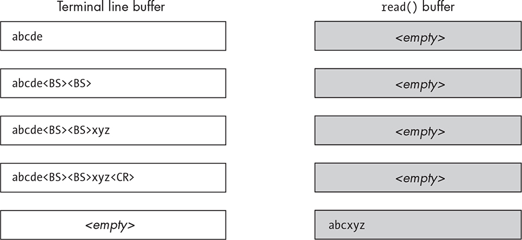
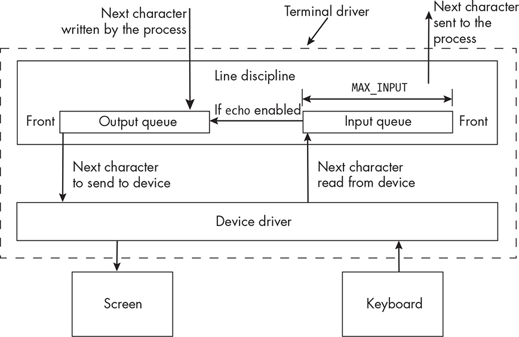
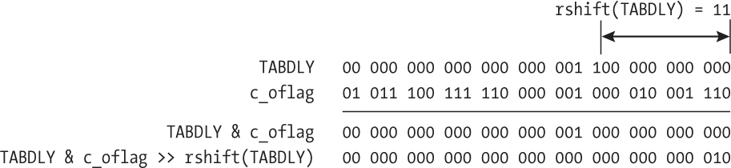

18 TERMINALS AND TERMINAL I/O

This chapter sets the stage for the development of advanced interactive programs. It deals with terminals and their attributes. The programs in previous chapters haven’t manipulated the terminal except perhaps by

clearing the screen or controlling the cursor position. However, some

programs, including system programs, do change the terminal’s

behavior to suit their needs. For example, they might disable the

echoing of characters or prevent signals from being generated by the

keyboard. Here, we’ll learn how programs can take charge of the

terminal, precisely so that they can make it behave in accordance with their requirements.

We’ll begin by clarifying what interactive programs are and what

special requirements they have. We’ll then examine terminals and

terminal attributes and how they can be retrieved and modified, both at the level of the shell and within programs.

About Interactive Programs

An *interactive program* is a program that expects user input while it’s running. Although any program that prompts a user for input during its execution is technically an interactive program, here, we’re going to

consider only the subset of them that run in a terminal window, are

started up from the command line, get their input from the terminal’s associated keyboard device, and configure the terminal for their specific needs.

These types of interactive programs are always inextricably

connected to the terminal, configuring it for their own particular needs.

Programs such as text editors (vi, nano, and emacs), pagers (more and less), and administrative tools (parted and top) are tightly coupled to the

terminal and control its settings and attributes. They usually don’t use the standard library’s input and output streams for I/O because these

streams interpose a layer of buffering that interferes with their ability to control precisely how the terminal behaves. Interactive programs

usually control most of the following I/O properties:

Whether characters are echoed

Whether characters are buffered and, if so, how many at a time

Where the cursor is positioned on the screen

Whether certain keypresses should have their default meaning or

an application-defined meaning

Whether timeouts should occur while waiting for input

Whether keyboard-generated signals such as CTRL-C should be

ignored, blocked, or handled immediately

In short, the issues related to terminals and their configuration for I/O

in Unix are a complex topic. To better understand what attributes and

aspects of their behavior a program can control, we’ll begin with an

overview of the software that underlies them and how it’s organized.

An Overview of Terminals

People rarely use actual terminal devices anymore; instead, they use

software-emulated terminals on bitmapped graphical displays. Most

Unix systems run an X Window System window manager, which allows

applications to run the xterm emulator, maintained by the X

Consortium. An *xterm emulator* can emulate a number of physical

terminals, such as the DEC VT102 or the DEC VT220. Therefore, when I use the term *terminal* here, I mean either a hardware terminal or a terminal window emulated by software.

Terminal I/O is one of the messiest and most disorganized parts of

any operating system. This is partly due to the fact that I/O interfaces have developed in an ad hoc fashion over the years, responding to

changes in hardware and user demands. It’s also partly due to the wide variety of I/O devices that have to be accommodated under the aegis of a single I/O system and partly due to the general lack of standards that governed how terminal I/O was handled. In Unix, this was exacerbated

by the rift between the BSD versions and System V versions of the

operating system, which had very different sets of terminal I/O routines.

The POSIX standard provided a unification of the two sets of interfaces, and modern systems provide POSIX-compliant routines. However,

there are still many parts of the I/O interface that are platform specific.

If you understand how terminals work, then you’ll have a better

understanding of how to program terminal I/O. For example, these are

the kinds of questions that you’ll be able to answer:

Why is it that we have to press ENTER in order for the typed

characters to be received by a program, and is there a way to avoid

this?

How can a program suppress the echoing of characters as they’re

typed?

How can a program time out while waiting for user input?

Some programs, such as vi and emacs, override the meanings of

various control sequences such as CTRL-D and CTRL-C. How can

ours do that?

If a user changes the shape of a terminal window, how can a

program get the new dimensions?

Why is it that sometimes the BACKSPACE key erases characters,

sometimes the DELETE key does, and sometimes neither does? How

does the terminal erase?

*An Experiment*

Let’s begin by studying and running the following program:

*upcopychars.c* \#include "common_hdrs.h" /\* For stdlib.h, unistd.h \*/

\#include \<ctype.h\> int main(int argc, char \*argv\[\]) { char inbuf; char prompt\[\] = "Type any characters followed by ENTER, Ctrl-D to

exit.\n"; if ( -1 == write(1, prompt, strlen(prompt)) ) fatal_error(errno,

"write"); while ( read(STDIN_FILENO, &inbuf, 1) \> 0 ) { inbuf =

toupper(inbuf); if ( -1 == write(1, &inbuf, 1) ) fatal_error(errno, "write");

} return 0; }

Before compiling and running the program, let’s try to predict its

behavior. By default, both standard input and standard output are

connected to the process’s control terminal. In its while loop, each time that it reads a character, it immediately writes that character in

uppercase to the terminal. Converting to uppercase makes it easier to

distinguish between the input and the output. It repeatedly does this

until read() returns 0, which it will do if we enter CTRL-D. It follows that, if I enter the sequence abcde, when it gets the a it will write A to the screen before I enter the b, and the same for the remaining characters.

In other words, we should expect that with this input, the run would

look like \$ **./upcopychars** Type any characters followed by ENTER, Ctrl-D to exit. **aAbBcCdDeE^D** \$

because each character is output immediately after I enter it. The ^D

indicates that I entered CTRL-D to terminate the program.

Let me run it now. I enter the five characters abcde first \$

**./upcopychars** Type any characters followed by ENTER, Ctrl-D to

exit. **abcde**

but nothing happens. There’s no output. When I press ENTER \$

**./upcopychars** Type any characters followed by ENTER, Ctrl-D to

exit. **abcde\<ENTER\>** ABCDE **^D** \$

the entered characters in uppercase appear on the next line. Even

though the main loop reads a single character and immediately writes it in uppercase, nothing appears on the screen until I press ENTER. We

can’t attribute this behavior to the C Library’s buffering since we’re not using the library I/O functions. The terminal is responsible for this.

Somehow, the characters that we type are stored until we press ENTER.

We don’t know where or why or whether that can be changed.

*An Explanation*

Before the advent of graphical user interfaces, the terminal was the only means for users to interact with programs. Terminal software was

designed to make this interaction as convenient as possible.

For instance, we often want to edit a line before submitting it to a

program. We use the BACKSPACE or DELETE keys to do so, and when

we’re satisfied, we press ENTER. If I run the upcopychars program and

enter the five letters abcde after which I enter BACKSPACE twice followed by xyz, and then ENTER, the output would be ABCXYZ. This wouldn’t be

possible if every character was transmitted immediately. The line is the fundamental unit of input. This is why the terminal driver waits until a whole line is ready before it sends it off to the program. Figure 18-1

depicts the internal buffer of the terminal and the system buffer into which the read() system call stores its input before sending it to the program as I enter these characters. \<BS\> is the backspace code and \<CR\> is the code generated by ENTER. It shows that all characters are stored in this terminal buffer, but editing actions take place before it is

transmitted.

*Figure 18-1: A schematic representation of the processing of an edited input line* Imagine what it would be like if, when you entered text to a program

such as upcopychars, you couldn’t see the characters that you entered.

Sometimes we want this, as when we enter a password, but most of the

time, this would be very disconcerting; we’d have no way to know

whether we entered what we intended. Normally, as we enter printable

characters, they appear on the screen immediately; this is called

character *echoing*, and it’s what we expect. Have you ever had the experience of working on a Unix system remotely through an SSH

connection and not seeing what you entered until a second or more

later? That suggests that the echoing of the character is not being done only by your local machine but in part by the remote machine, and that the transmission rate happens to be slow at the time. In Unix, terminal devices do not normally echo characters; the kernel software is

responsible for that.

Also consider that when we enter a control character such as CTRL-

C, instead of anything being displayed on the screen, a signal is sent to

our process (and all processes for which this is their control terminal).

All of these behaviors are part of a mode of operation that users

expect for normal interactive use, so much so, that this collective set of properties of the terminal is called *canonical mode*.

Terminal Drivers

The preceding experiment shows that the default input mode of a

terminal, called canonical mode, includes assembling the input into

lines, processing various special characters such as backspace, and

delivering the input lines to the process after they’ve been processed.

Terminals can be operated in various noncanonical input modes as well.

In a noncanonical mode, some part of this processing of input is

disabled. Programs like emacs, vi, and less put the terminal into a

noncanonical mode called *raw* mode, in which the terminal passes all input to the process with no processing.

*Terminal Driver Structure*

The behavior of a terminal is controlled entirely by a software

component called a *terminal driver*. A terminal driver is not the same thing as a *terminal device driver*. A terminal driver consists of two subcomponents:

A terminal device driver

A line discipline

The terminal device driver’s main function is to transfer characters

to and from the terminal device; it’s the software that talks directly with the physical terminal or the terminal emulator, such as xterm, at one end, and the line discipline at the other. For this purpose, the line discipline and the terminal device driver share access to a few data structures. In Linux, struct tty_struct is the major shared data structure.

NOTE

*A line discipline is a software module that defines the behavior of* *asynchronous interfaces such as terminals, RS232 mouse drivers,* *Bluetooth drivers, some network protocols such as Point-to-Point (PPP),* *and many other drivers. In Linux, the line discipline for a terminal is of* *type* *struct tty_ldisc.*

For a terminal, the line discipline is the software that does the

processing of input and output. It manages several queues, including an input queue and an output queue for the terminal driver. The

relationship between these queues, the process using the terminal, and the terminal itself is illustrated in Figure 18-2. The terminal driver is the sum of the parts in this figure; it is the combination of line discipline and device driver. The queues are drawn inside the line discipline only to emphasize that it’s the line discipline that manages them. The line discipline itself has no storage; it is a collection of functions and links to other structures. This is yet another example of a producer-consumer

relationship within the kernel, because the device driver itself is a

producer with respect to the input queue and the line discipline is a

consumer. The opposite relationships are true of the output queue.

*Figure 18-2: The Unix implementation of a terminal showing some of the internal queues of* *the terminal driver*

The figure illustrates only the key components of the terminal

driver. It shows that characters received from the device driver are

pushed into the input queue and those to be sent to the driver are

pushed into the output queue. When echoing of characters is enabled,

the line discipline copies a character to its output queue when its input queue receives it, possibly after any special processing it might need to do, causing the character to be displayed on the screen.

The figure depicts that the size of the input queue is the system

constant MAX_INPUT. If characters are typed faster than they are removed

for processing and the queue fills up, Unix systems discard any extra characters. MAX_INPUT is specified by POSIX to be the minimum size of

this buffer, but any Unix system might make the buffer larger. We’ve got a few different methods of finding its value. First, the getconf command can tell us: \$ **getconf MAX_INPUT /dev/tty** \# Need to give it path to terminal 255

A program can call pathconf() to get this same value: *max_input.c*

\#include "common_hdrs.h" int main() { printf("%ld\n", pathconf(ttyname(0), \_PC_MAX_INPUT)); return 0; }

The function is given the pathname of the terminal device and the

constant \_PC_MAX_INPUT and returns the value of that parameter for the given device. When I run it on Linux 5.15, it reports that it’s 255 bytes also. However, the actual maximum could be larger.

We can get its actual size from the kernel source code, or we can

conduct a small experiment. To start, I’ll modify the upcopychars program by deleting the code that outputs the prompt string, renaming it

upcopychars2. When we enter characters from the keyboard while

upcopychars2 is running without entering a newline character in between, they’re all pushed into its input queue (and echoed back to us). When

we press ENTER, the contents of the input queue are written to standard output. If we pipe the output of upcopychars2 to wc -c, it will output how many bytes upcopychars2 output.

If we can fill the buffer to its maximum, the output of wc -c will be

the buffer size. If we try to write more characters into the buffer, they’ll be discarded. But we have to enter these characters from the keyboard, not by redirecting them from a pipe or file. One way to do this is to

create files containing successively larger strings without trailing

newlines, and copy and paste them into the terminal window while

upcopychars2 is running. If the output number is equal to the size of the file, we’ll double the file size and repeat the test. If it’s less, then the output number is the buffer size. If I start with a file containing a really large number of characters, I may not have to create a second file. I’ll try 16,384 characters as an initial guess. If it reports less than 16,384, I found the maximum, and if not, I’ll double the file size and repeat.

I’ll create a file named *a.16384* containing 16,384 consecutive a characters without a trailing newline with the command: % \$ **( for i** **in \`seq 1 16384\` ; do echo -n 'a' ; done ) \> a.16384**

Then I’ll open it, copy it into the clipboard, and paste it into the

terminal window after entering upcopychars2 \| wc -c. For example, here’s a run in which I enter one character to the modified program: \$

**./upcopychars2 \| wc -c** **a\<ENTER\>^D** 2

The a and the newline are the two characters reported. Now I’ll give it 16,384 characters: \$ **./upcopychars2 \| wc -c**

**aaaaaaaaaaaaaaaa...aaaa\<ENTER\>^D** 4096

The output suggests that on this version of Linux (5.15), the buffer is 4096 bytes. The kernel source code corroborates this; the system header file *include/linux/tty.h* contains a macro definition \#define N_TTY_BUF_SIZE

4096 that the kernel uses as the size of the terminal’s input buffer.

The terminal driver maintains other queues besides the input and

output queues. It has queues of processes waiting to read from and write to the terminal, for instance. It also has a second input queue called the *canonical input queue*. This is the queue in which input characters are processed when the terminal is in canonical mode. Canonical processing is handled by the line discipline. The terminal driver’s behavior is

determined by various attributes and configuration settings. Having a

mental picture of the terminal driver, including its basic operations and how terminal settings affect these operations, makes it easier to

understand how to program them and where to start when we need to

diagnose problems related to terminal I/O.

*The Terminal Driver as Seen from the Shell*

Let’s search for a command that can display and possibly modify the

terminal settings. A man page search with apropos -s1 terminal produces too long a list, but we can filter it through grep -E (because we want to use the alternation character, \|): \$ **apropos -s1 terminal \| grep -E**

**'setting\|propert\|attribute'** resize (1) - set environment and

terminal settings to current xte. . setterm (1) - set terminal attributes stty (1) - change and print terminal line settings

The setterm command doesn’t display settings; it changes them. The command we want is stty.

The stty Command

The stty command can both display and alter terminal characteristics.

Without options or arguments, it displays a small subset of the current settings of the terminal connected to the shell in which the command is invoked. Different systems may display different pieces of information by default. The man page for stty provides answers to all of the

questions I posed earlier. It states that the -a option displays all settings in human-readable form; following is the output of stty -a: \$ **stty -a** speed 38400 baud; rows 24; columns 79; line = 0; intr = ^C; quit = ^\\ erase = ^?; kill = ^U; eof = ^D; eol = \<undef\>; eol2 = \<undef\>; swtch =

\<undef\>; start = ^Q; stop = ^S; susp = ^Z; rprnt = ^R; werase = ^W; lnext = ^V; discard = ^O; min = 1; time = 0; -parenb -parodd -cmspar

cs8 -hupcl -cstopb cread -clocal -crtscts -ignbrk -brkint -ignpar -parmrk

-inpck -istrip -inlcr -igncr icrnl ixon -ixoff -iuclc -ixany -imaxbel iutf8

opost -olcuc -ocrnl onlcr -onocr -onlret -ofill -ofdel nl0 cr0 tab0 bs0 vt0

ff0 isig icanon iexten echo echoe echok -echonl -noflsh -xcase -tostop -

echoprt echoctl echoke -flusho -extproc

Human-readable form is not the same thing as human-

understandable form! Fortunately, the man page explains what each

output symbol means and how to interpret the output. I’ll explain more about the output and terminal settings next.

Understanding stty Output

There are three kinds of settings listed in the output of stty -a. They’re displayed in one of the following three forms:

*symbolic-value*

*variable* or - *variable*

*variable* = *value* or *variable value*

The first form is a symbolic name for the value of a fixed variable.

For example, in the preceding output, the symbol tab0 indicates that the

tab delay of the terminal is set to TAB0. Other possible values for the tab delay are TAB1, TAB2, and TAB3. The author of stty chose this concise form instead of the lengthier tabdly = tab0. Tab delay is one of several delay-bit attributes of a terminal. In general, delay bits specify how long a

transmission stops to allow for mechanical or other movement when

certain characters are sent to a terminal. The actual delays depend on line speed and system load. For software-emulated terminals, these

delay bits are usually not meaningful. In fact, as of version 6, the Linux documentation states that “Linux currently ignores TABDLY, CRDLY, VTDLY, FFDLY and NLDLY. They simply aren’t relevant in the world today.” All

symbolic values represent delays with one exception: cs8 is the character size in bits (8 bits). This cannot be changed.

The second form gives the state of Boolean variables. The Booleans

are called *switches* or *flags*. I prefer the term *switch* because they act like switches—a switch prefixed with a hyphen (-) is off, and a switch that is not prefixed with a hyphen is on. Examples of switches are echo, inlcr, icanon, and icrnl.

To change the value of a switch you enter \$ **stty \[-\] *switch***

where *switch* is replaced by the name of the switch, and the hyphen is present to turn it off and absent to turn it on. Thus \$ **stty -echo**

will turn off echo on the screen. We’ll try a few changes soon, but first, before changing any settings, we need to know how to restore the

terminal.

NOTE

*When al else is not working and the terminal has become a big mess,* *enter **reset**. If* *echo* *is disabled, you won’t see what you’re typing, so type* *slowly and careful y! You might have to enter **\<LF\>reset\<LF\>** , where* *\<LF\>* *is* *the linefeed character, which you can do by entering* *CTRL-J. If you’d* *like to restore the terminal to a sane state, enter* ***stty sane**. This restores* *most variables and values to their default settings.*

If you now enter \$ **stty -echo**

you won’t see anything you type. Enter \$ **stty echo**

to restore echoing.

The last form displays the values of non-Boolean variables in one of

two forms:

*variable* = *value*

*variable value*

For example, this output rows 24; columns 80; line = 0; intr = ^C; quit =

^\\

indicates that the number of rows in the terminal is 24 and the number of columns is 80. In the expression line = 0, *line* refers to the line discipline. Line disciplines have unique small integer identifiers. For example, the *TTY* line discipline has the number 0 and the *PPP* line discipline’s number is 2. The next two show that CTRL-C is the interrupt character and CTRL-\\ generates SIGQUIT.

The man page explains that erase is the character that erases the last character typed. In other words, it’s the character we call *backspace*. Let’s look at the erase key setting: \$ **stty -a \| grep -E -o '\\erase =**

**...'** erase = ^?;

This output doesn’t mean that entering CTRL-? erases a character; it

does not. It means that the code generated by the BACKSPACE key is the ASCII character whose code is 127 in decimal, denoted by ^? on output, called DEL. However, entering CTRL-? doesn’t erase; it sends the

character whose ASCII code is 31, which is called the *unit separator* character. (Note that some systems use CTRL-H to backspace by default

rather than BACKSPACE.) Do a little experiment now. Change the erase

key to X and type some text followed by BACKSPACE: \$ **stty erase X** \$

**hello^?**

The terminal displays the BACKSPACE key as ^?. Try entering text

followed by X and you’ll see you changed the erase key. Remember to

restore it before proceeding with **stty erase ^?** .

*Categories of Terminal Attributes*

The terminal attributes can be categorized by how they’re used and

what they control.

Special characters Characters that are used by the driver to cause specific actions to take place, such as sending signals to the process or erasing characters or words or lines. Special characters include the

erase, werase, and kill characters, to name a few. Characters used to

send signals include CTRL-C, which sends the SIGINT signal.

Special settings Variables that control the terminal in general,

such as its input and output speeds and dimensions. These include

the rows, cols, min, and time values. The two variables min and time are used when the terminal is in noncanonical mode to control how

characters are returned by read() calls; we’ll explore their use later.

Input settings Operations that process characters coming from the

terminal. This includes changing their case, converting carriage

returns to newlines, and ignoring various characters like breaks and

carriage returns.

Output settings Operations that process characters sent to the

terminal. Output operations include replacing tab characters with the

appropriate number of spaces, converting newlines to carriage

returns, carriage returns to newlines, and changing case.

Control settings Operations that control character representation

such as parity, stop bits, and hardware flow control. Several of these do not apply to pseudoterminals.

Local settings Operations that control how the driver stores and

processes characters internally. For example, echo is a local

operation, as is processing erase and line-kill characters.

Combination settings Combinations of various settings that

define modes such as cooked mode, raw mode, and sane mode.

Input switch names always begin with i and output switch names

begin with o. I’ll display the output of stty -a again, rearranged and annotated to show the categories of the variables and switches: special characters: intr = ^C; quit = ^\\ erase = ^?; kill = ^U; eof = ^D; eol =

\<undef\>; eol2 = \<undef\>; swtch = \<undef\>; start = ^Q; stop = ^S; susp =

^Z; rprnt = ^R; werase = ^W; lnext = ^V; discard = ^O; min = 1; time =

0; control flags: -parenb -parodd -hupcl -cstopb cread -clocal -crtscts multibit control flags: cs8 input flags: -ignbrk -brkint -ignpar -parmrk -

inpck -istrip -inlcr -igncr icrnl ixon -ixoff -iuclc ixany imaxbel output flags: opost -olcuc -ocrnl onlcr -onocr -onlret -ofill -ofdel multibit delay flags: nl0 cr0 tab0 bs0 vt0 ff0 local flags: isig icanon iexten echo echoe echok -echonl -noflsh -xcase -tostop -echoprt echoctl echoke

I put the character size (cs8) and the output delay constants (nl0 and so on) on separate lines because they aren’t flags.

Some special characters are for editing or input purposes:

**werase** Erases the rightmost occurring word to the left of the cursor.

By default, it’s CTRL-W.

**kill** Erases an entire line. By default, it’s CTRL-U.

**lnext** Called the *literal next* character. Entering it before entering a special character causes the special character to be treated literally, not interpreted. By default, it is CTRL-V. To pass a CTRL-C to a

process as a literal character, enter **^V^C**.

Some are for job control:

**susp** Generates a job control signal, SIGTSTP, that suspends the foreground process group and puts it in the background. By default,

it’s CTRL-Z.

And some are used for input operations:

**stop** Suspends output to the terminal. By default, it’s CTRL-S.

**start** Resumes output to the terminal. By default, it’s CTRL-Q.

In the next section, we’ll examine a few terminal switches in more

detail.

Experimenting with Terminal Switches

The terminal switches generally play an important role in how the

terminal functions. We’ll explore what two particular switches do before

we dive into how to control the behavior of the terminal in our programs.

We’ll start with the icrnl switch, which, when set, causes input

carriage returns to be converted to newline characters. Read it as i for input, cr for carriage return, and nl for newline. The carriage return character (ASCII code 13, \r) moves the cursor to the left margin; we

used it in our implementation of a progress bar in Chapter 9. The newline (ASCII code 10, \n) moves the cursor down one line without

changing its column position, so that the next character starts on the line below.

We’re going to conduct an experiment with this switch. I’ll use the

od command (od -a) to assist. This displays its file argument byte by byte, naming the characters with recognizable short names if they’re not

printable. First I’ll run upcopychars2, redirecting its output to a file: \$

**./upcopychars2 \> out1** **abcde** **fgh** **ij^J** **z** **^D**

In this listing, the ^J appears where I entered CTRL-J, which sends a

newline character to the terminal driver. I terminated all other lines by pressing ENTER, which sends the carriage return to the terminal driver.

Let’s look at *out1*: \$ **od -a out1** 0000000 A B C D E nl F G H nl I J

nl Z nl 0000017

Notice that even though the driver received a carriage return character after the e, h, and z, od shows that it was replaced by a newline, indicated by nl in the output. Here’s the output of cat out1: ABCDE FGH IJ Z

It looks like what I entered, converted to uppercase, when I ran

upcopychars2. I’ll have more to say about this shortly.

Now I’ll turn off the icrnl switch and run it again, redirecting its

output to *out2*. With the switch disabled, input carriage returns will not be replaced by newlines. When we press ENTER:

We’ll see ^M appear at the cursor position.

The cursor will not advance to the next line. It will move to the

right, as if I entered a printable character such as x.

Pressing ENTER generates CTRL-M, which terminals display as ^M.

Since the terminal is in canonical mode, the terminal will not deliver the

input until a newline is entered, but with this switch disabled, pressing ENTER does not generate a newline; I have to enter CTRL-J to send the

newline character code (10) to the driver: \$ **stty -icrnl** \$

**./upcopychars2 \> out2** **abcde^Mfgh^Mij^J** **z^M^D**

What we see when we enter this input is what the terminal echoes back

to us. These are the characters that were put into the terminal’s input queue and copied from there into its output queue. In the listing, each

^M is where I pressed ENTER. The listing displays ^J where I entered it, but in fact nothing is echoed to the terminal when I enter it. I put it into the listing so that you can see where I entered them.

Let’s look at the contents of *out2*: \$ **od -a out2** 0000000 A B C D E

cr F G H cr I J nl Z cr 0000020

Compare this to *out1*. The carriage returns were not converted to newlines. What follows next may surprise you. I will cat this file: \$ **cat** **out2** IJHDE \$

Try to explain this to yourself before reading on, remembering that an input carriage return character moves the cursor to the first position in the current line, without erasing any characters.

The first carriage return causes FGH to overwrite ABC, leaving FGHDE.

The next causes IJ to overwrite FG, leaving IJHDE. The newline moves the cursor to the next line and a Z is printed, but the next carriage return moves the cursor to the start of that line, and the bash prompt overwrites it.

We take the magic of the onlcr switch for granted. When our

program prints a string such as "Hello world\n" to standard output, we see the *Hel o world* on the screen with the cursor at the start of the line below. The newline character caused two cursor movements: It moved

the cursor to the start of the row and moved it down one row. In other words, it caused the sequence \r \n to be output to the terminal’s device driver.

The onlcr switch causes output newline characters to be replaced by

a carriage return–newline pair. Read the name as o for output, nl for

newline and cr for carriage return. What happens when we disable this

switch?

Those carriage returns don’t get sent to the terminal. The output is unmanageable. I’ll demonstrate as follows.

\$ **stty -onlcr**

**cat out1**

ABCDE

FGH

IJ

Z

\$

The lack of carriage returns means that the cursor keeps moving to the right; there’s no stopping it! It doesn’t take long before it starts

wrapping on the screen. See what happens when you enter a command

such as ls with the switch turned off.

We haven’t explored what happens when we disable the icanon

switch. We’ll cover canonical and noncanonical mode processing in

greater depth in Chapter 19. The POSIX.1-2024 requirements document, Section 11.1.6, *Canonical Mode Input Processing*, summarizes what canonical mode is in conforming systems.

The Terminal Driver API

The stty command lets us see and modify terminal settings from the

shell; now we’ll explore how to retrieve and modify terminal settings

from within programs. Searching Sections 2 and 3 in the man pages for

a combination of *terminal* and *settings* fails, but if I search for *attributes* instead of settings, I find a dozen or so library functions for working with the device driver and line discipline: \$ **apropos -s2,3 -a**

**terminal attributes** cfgetispeed (3) - get and set terminal attributes, line control, get a. . cfgetospeed (3) - get and set terminal attributes, line control, get a. . cfmakeraw (3) - get and set terminal attributes, line control, get a. . cfsetispeed (3) - get and set terminal attributes, line control, get a. . cfsetospeed (3) - get and set terminal attributes, line control, get a. . *--snip--* tcgetattr (3) - get and set terminal attributes, line control, get a. . tcsetattr (3) - get and set terminal attributes, line

control, get a. . termios (3) - get and set terminal attributes, line control, get a. .

It turns out that all of these functions share the single termios(3) man page, the beginning of which follows: NAME termios, tcgetattr,

tcsetattr, tcsendbreak, tcdrain, tcflush, tcflow, cfmakeraw, cfgetospeed, cfgetispeed, cfsetispeed, cfsetospeed, cfsetspeed - get and set terminal attributes, line control, get and set baud rate SYNOPSIS \#include

\<termios.h\> \#include \<unistd.h\> int tcgetattr(int fd, struct termios

\*termios_p); int tcsetattr(int fd, int optional_actions, const struct

termios \*termios_p); *--snip--* The termios structure Many of the functions described here have a termios_p argument that is a pointer to a termios structure. This structure contains at least the following

members: tcflag_t c_iflag; /\* Input modes \*/ tcflag_t c_oflag; /\* Output modes \*/ tcflag_t c_cflag; /\* Control modes \*/ tcflag_t c_lflag; /\* Local modes \*/ cc_t c_cc\[NCCS\]; /\* Special characters \*/ *--snip--*

I’ll begin by examining the termios data structure, whose definition is exposed by including *termios.h*. The actual definition on any specific Unix system may include other members and therefore is contained in a

file included in *termios.h*. For instance, on my Linux system, the definition is in the header file */usr/include/x86_64-linux-gnu/bits/termios-struct.h*: \#define NCCS 32 struct termios { tcflag_t c_iflag; /\* Input mode flags \*/ tcflag_t c_oflag; /\* Output mode flags \*/ tcflag_t c_cflag;

/\* Control mode flags \*/ tcflag_t c_lflag; /\* Local mode flags \*/ cc_t c_line; /\* Line discipline NOT POSIX \*/ cc_t c_cc\[NCCS\]; /\* Control

characters \*/ speed_t c_ispeed; /\* Input speed NOT POSIX \*/ speed_t

c_ospeed; /\* Output speed NOT POSIX \*/ // OMITTED: Two macro

definitions };

The structure maps closely to the different categories of terminal

settings that we learned about from the stty command. Its first four

members are of type tcflag_t, which is a typedef for unsigned int found in *bits/termios.h*. I will refer to these members as *flagsets*. The c_line, c_ispeed, and c_ospeed members aren’t part of the POSIX standard, but they’re

supported in Linux. The type cc_t is a typedef for unsigned char; the c_cc member is an array of characters; these are the special characters we

described earlier.

*Terminal Switches*

The four flagsets contain one or more bits for every distinct setting

within the corresponding category. Some settings require more than

one bit. The *bits/termios.h* header defines a mask for each setting; for multibit settings, the masks are also multibit. Each of bitmasks and a description of what it controls is described in the termios(3) man page.

Table 18-1 describes the masks and descriptions for the c_iflag member.

Table 18-1: Bitmasks and Descriptions of the c_iflag Member

Mask

name

Description

IGNBRK

Ignore BREAK condition on input.

BRKINT

Signal SIGINT on BREAK.

IGNPAR

Ignore framing errors and parity errors.

PARMRK

Mark parity errors with prefix bytes 0377,0.

INPCK

Enable input parity checking.

ISTRIP

Strip off eighth bit.

INLCR

Translate NL to CR on input.

IGNCR

Ignore CR on input.

ICRNL

Translate CR to NL on input (unless IGNCR is set).

IUCLC

Map uppercase characters to lowercase on input (not in

POSIX).

IXON

Enable XON/XOFF flow control on output.

IXANY

Typing any character will restart stopped output.

IXOFF

Enable XON/XOFF flow control on input.

IMAXBEL

Ring bell when input queue is full (not in POSIX).

IUTF8

Input is UTF-8 (since Linux 2.6.4) (not in POSIX).

The c_oflag flagset masks follow in Table 18-2.

Table 18-2: Bitmasks and Descriptions of the c_oflag Member

Mask name Description

OPOST

Perform output processing.

ONLCR

Map NL to CR-NL on output.

OCRNL

Map CR to NL on output.

ONOCR

Don’t output CR if already in column 0.

ONLRET

NL performs CR function.

OFILL

Use fill characters for delay.

OFDEL

Use DEL (0177) as fill character; otherwise, NULL (0).

NLDLY

Select newline delays: NL0 or NL1.

CRDLY

Select carriage return delays: CR0, CR1, CR2, CR3.

TABDLY

Select horizontal tab delays: TAB0, TAB1, TAB2, TAB3.

BSDLY

Select backspace delays: BS0, BS1.

VTDLY

Select vertical tab delays: VT0, VT1.

FFDLY

Select form-feed delays: FF0, FF1.

Mask names ending in DLY may be more than one bit. For these, the

description lists the possible symbolic values that it masks. For example, if myterm is a termios structure, then myterm.c_oflag & CRDLY

is exactly one of CR0, CR1, CR2, or CR3; CRDLY is a two-bit mask.

Since the c_cflag member controls hardware devices, I won’t display

it here; it’s available in both the man pages and the POSIX

specifications. The c_lflag member has fewer flags and is more relevant to this material. Its mask set follows in Table 18-3.

Table 18-3: Bitmasks and Descriptions of the c_lflag Member

Mask

name

Description

ISIG

Enable signal-generating characters INTR, QUIT, SUSP.

ICANON

Enable canonical mode.

ECHO

Echo input characters.

ECHOE

If ICANON is set, the ERASE character erases the preceding input

character and WERASE erases the preceding word.

ECHOK

If ICANON is also set, the KILL character erases the current line.

ECHONL

If ICANON is also set, echo the NL character even if ECHO is not

set.

ECHOCTL

If ECHO is also set, control characters other than TAB, NL, START,

and STOP are echoed visually (not in POSIX).

ECHOPRT

Echo deleted characters back to the terminal (not in

POSIX).

ECHOKE

If ICANON is set, don’t output a newline after echoed KILL (not

in POSIX).

NOFLSH

Disable flushing the input and output queues when

generating signals for the INT, QUIT, and SUSP characters.

TOSTOP

Send the SIGTTOU signal to the process group of a

background process that tries to write to its controlling

terminal.

IEXTEN

Enable implementation-defined input processing.

These are the flags that enable or disable echoing in various ways,

canonical mode processing, signal delivery, and so on.

Finally, you should be aware that many modern shells set the values

of these flags themselves. If we want to see the true effect of changing the value of a flag with the stty command, we need to disable the shell’s control of the flags. To do this in bash, for example, we need to run an instance of bash with line editing disabled: \$ **bash --no-editing**

*Terminal Special Characters*

The terminal driver’s special characters are stored in the c_cc array.

Array elements are accessed using symbolic constants whose names

suggest their function. All of these constants begin with the letter V. For example, the symbolic constant for the array index containing the endof-file special character is VEOF. If myterm is declared as a struct termios, then the instruction myterm .c_cc\[VEOF\] = 'X' sets the terminal’s end-of-file character to X. The behavior of some special characters depends on what flags are enabled. For example, characters used for line editing, such as ERASE, are passed directly to the calling process when canonical mode is disabled, without causing any erasing.

Table 18-4 lists most of the special characters. Those that are neither defined by POSIX nor implemented in Linux are omitted. The table

shows the symbolic name of the index (for instance, VEOF), the name by which people refer to the character (EOF), a brief description of it, its initial value on most systems, and which flags, if any, modify what the terminal driver does when the character is input.

Table 18-4: The Special Characters in the c_cc Array with Initial Values and Descriptions

Subscript Name Initial

value

Description

Flags

VEOF

EOF

CTRL-D

End-of-file character

ICANON

VEOL

EOL

NULL

Additional end-of-line

ICANON

character

VEOL2

EOL2

NULL

Another end-of-line

ICANON

character (not in POSIX)

VERASE

ERASE

CTRL-?

Erase character

ICANON

VINTR

INTR

CTRL-C

Interrupt character (sends

ISIG

SIGINT)

VKILL

KILL

CTRL-U

Kill line

ICANON

Subscript Name Initial

value

Description

Flags

VLNEXT

LNEXT

CTRL-V

Literal next; quotes next

IEXTEN

input character

VMIN

MIN

➊

Minimum number of

ICANON

characters for read

VQUIT

QUIT

CTRL-\\

Quit character (sends SIGQUIT)

ISIG

VREPRINT

REPRINT

CTRL-R

Reprint unread characters

ICANON,

IEXTEN

VSTART

START

CTRL-Q

Start character; restarts

IXON

output

VSTOP

STOP

CTRL-S

Stop character; stops output IXON

VSUSP

SUSP

CTRL-Z

Sends SIGTSTP signal

ISIG

VTIME

TIME

➊

Timeout in deciseconds for ICANON

read

VWERASE

WERASE

CTRL-W

Word erase

ICANON

The subscript values are unique with one exception. The subscripts

VMIN and VTIME may be the same as VEOF and VEOL subscripts, respectively.

This is because the VMIN and VTIME values ➊ are used only in noncanonical mode, whereas VEOF and VEOL are used only in canonical mode. I’ll explain the use of these two special characters in the discussion about

noncanonical mode input processing that follows.

*Terminal Attribute Modification*

The tcgetattr() function gets the attributes of the terminal associated with the file descriptor fd, storing them in the termios structure pointed to by termios_p. Its prototype is: int tcgetattr(int fd, struct termios

\*termios_p);

The tcsetattr() function sets attributes, but it has an additional

parameter: int tcsetattr(int fd, int optional_actions, const struct termios

\*termios_p);

Both tcgetattr() and tcsetattr() require that their first argument is a file descriptor for a terminal; otherwise, they’ll fail, setting errno to ENOTTY.

The second parameter of tcsetattr(), optional_actions, is used to

specify when the changes are supposed to be applied. Its possible values are as follows:

**TCSANOW** The change occurs immediately.

**TCSADRAIN** The change occurs after all output written to fd has been transmitted. This option is usually used when changing parameters

that affect output, since we usually want pending output to be

processed with the previous attributes.

**TCSAFLUSH** The change occurs after all output written to the object referred to by fd has been transmitted. In addition, before the change is applied, all input data that hasn’t been read is discarded.

TCSANOW forces changes to be applied immediately; this can cause

problems if the terminal driver is writing to the terminal and the

changes modify the output flags. TCSADRAIN forces the changes, but only after the output queue has been emptied by the driver. This is the action that should be chosen whenever the changes affect output to the

terminal. TCSAFLUSH forces the changes only after the output queues are emptied and after it causes the input data sitting in the queue to be

discarded. When restoring the terminal to its previous state, it is the safest choice to use TCSAFLUSH.

Steps for Changing Attributes of a termios Structure

Changing the attributes of the terminal that are accessible through a

termios structure is a three-step procedure:

1\. Retrieve the current termios structure with tcgetattr() into a local termios structure.

2\. Make the changes to the local object.

3. Replace the existing termios structure by calling tcsetattr(), passing the modified, local termios structure.

Furthermore, because both of these functions fail if the file descriptor is not associated with a terminal, programs should always ensure that the file descriptor is that of a terminal. One way to do this is by calling isatty() on the file descriptor before making the calls.

Step 2 depends upon the type of setting to be modified. Following

are the different ways to change a single attribute:

To enable a single-bit switch whose mask constant is MASK in a

flagset flag, use: flag \|= MASK;

To disable a single-bit switch whose mask constant is MASK in a

flagset flag, use: flag &= ~MASK;

To change the value of a multibit mask such as a delay value

requires two steps. Let MDELAY denote the multibit mask that selects

the bits in the flagset flag to be changed, and let NEWVAL be the new

value that is supposed to be applied. Then the modification is: flag

= flag & ~MDELAY; flag = flag \| NEWVAL;

The first assignment zeroes out the bits of this mask, and the

second replaces them with new bit values.

To change the value of a member of the c_cc\[\] array, an ordinary

assignment instruction suffices, provided that the value assigned is

of type unsigned char, the equivalent of cc_t. For example, the

following changes the erase character to x and changes the MIN

variable to 4: c_cc\[VERASE\] = 'x'; c_cc\[VMIN\] = 4;

When an array member’s value is numeric, such as that of c_cc\[VMIN\]

and c_cc\[VTIME\], it has to be assignment compatible with unsigned char.

This means, if it’s an integer, it must be in the interval \[0,255\].

Some settings are changed through another system call, such as

cfsetispeed() or cfsetospeed(). I’ll discuss those shortly.

A Program that Changes the echo Attribute

I’ll demonstrate making a small change with the program in Listing 18-

1 that toggles the terminal’s echo state (Listing 18-1). Specifically, if echo is enabled, it disables it, and if it’s disabled, it enables it.

*toggle_echo.c*

\#include "common_hdrs.h"

\#include \<termios.h\> /\* Needed for all functions in termios API \*/

int main(int argc, char \*argv\[\])

{

struct termios tty_attributes; /\* Local termios structure \*/

if ( !isatty(STDIN_FILENO) )

usage_error("Do not redirect standard input to this program."); if ( tcgetattr(0, &tty_attributes) == -1 ) /\* Retrieve termios struct. \*/

fatal_error(errno, "tcgettattr");

if ( tty_attributes.c_lflag & ECHO ) /\* If enabled... \*/

tty_attributes.c_lflag &= ~ECHO; /\* Disable. \*/

else /\* Else... \*/

tty_attributes.c_lflag \|= ECHO; /\* Enable. \*/

/\* Replace termios with changed copy; use TCSANOW for immediate change. \*/

if ( tcsetattr(0, TCSANOW, &tty_attributes) == -1 )

fatal_error(errno, "tcsettattr");

return 0;

}

*Listing 18-1: A program that toggles the echo state of the control terminal* If the executable is named *toggle_echo*, you can enter ./toggle_echo and then type anything in the terminal to see that echo is disabled. Enter it again to turn echo on again.

A Program that Changes and Restores Terminal Attributes

A second, perhaps more interesting, application of this pair of functions changes the terminal settings only for a brief part of the program’s

execution and then restores the original settings. This is exactly what the login process does when it prompts us to enter a password. The

prompt is visible, but when we enter the password, echo is disabled. I’ll call this program *fakelogin.c*. I’ll use a different strategy for ensuring that

the file descriptor passed to tcgetattr() and tcsetattr() refers to a terminal

—the program will call open() on the file */dev/tty*, which is essentially a link to the real device file for the terminal. This way, even if input or output is redirected, the program will not fail, because it isn’t passing file descriptors 0 or 1 to these functions.

The program has to undertake the following steps:

1\. Open */dev/tty* for reading and writing and assign the returned file descriptor to ttyfd. If the call fails, exit with an appropriate

message.

2\. Write the prompt login: to the terminal.

3\. Read the user’s response into a buffer, to be printed at the end of the program.

4\. Call tcgetattr() to get a copy of the current terminal settings. Call this copy tt.

5\. Clear the echo bit in tt and call tcsetattr() to make the change in the terminal driver.

6\. Write the password prompt.

7\. Read the user’s response, which is hidden.

8\. Set the echo bit in tt and call tcsetattr() to restore the driver to its original state.

9\. Since it’s not a real login program anyway, display the entered

user-name and password as proof that it worked correctly.

Usernames are generally limited in their length. For this program, I

chose a limit of 32 characters arbitrarily for both usernames and

passwords. If a user enters a string that’s longer than 32 characters for either variable, the program has to handle it correctly.

HANDLING EXCESS INPUT IN THE TERMINAL

When read() reads from a terminal, it doesn’t receive characters until a newline is entered. Assuming that ttyfd refers to a terminal,

if a program calls read(ttyfd, &buffer, 32) but the user enters 40

characters and then a newline, read() will receive the first 32

characters and store them into buffer, but there will be 8 characters

and a newline remaining in the input queue. A second call to

read(ttyfd, &buffer, 32) will be satisfied immediately because there’s a newline in the input queue. The remaining 8 characters and the

newline will be stored into buffer. If a program doesn’t want these

characters to be read into buffer, it can call tcflush(ttyfd, TCIFLUSH) to remove them from the input queue before reading again.

The program has code to deal with the possibility of a buffer

overflow attack such as this. The program, without any error handling, is in Listing 18-2. The complete program is in the book’s source code distribution.

*fakelogin.c*

\#include "common_hdrs.h"

\#include \<termios.h\>

const char loginstr\[\] = "login: "; /\* Prompt for login \*/

const char passwdstr\[\] = "password: "; /\* Prompt for password \*/

int main(int argc, char \*argv\[\])

{

struct termios tt; /\* Terminal attribute structure \*/

char username\[33\]; /\* 32 characters plus NULL byte \*/

char passwd\[33\]; /\* 32 characters plus NULL byte \*/

int ttyfd, n; /\* File descriptor for terminal \*/

if ( -1 == (ttyfd = open("/dev/tty", O_RDWR)) )

fatal_error(errno, "open");

memset(username, 0, 33); /\* Zero fill username. \*/

memset(passwd, 0, 33); /\* Zero fill passwd. \*/

write(ttyfd, loginstr, strlen(loginstr)); /\* Display the first prompt. \*/

n = read(ttyfd, username, 32); /\* Get user's username. \*/

if ( username\[n-1\] == '\n' )

username\[n-1\] = '\0'; /\* Get rid of \n at end. \*/

tcflush(ttyfd, TCIFLUSH); /\* Flush extra characters. \*/

/\* The next three lines turn off echo. \*/

tcgetattr(ttyfd, &tt); /\* Get current terminal state. \*/

tt.c_lflag &= ~ECHO; /\* Turn off echo bit. \*/

tcsetattr(ttyfd, TCSANOW, &tt); /\* Use this new structure. \*/

write(ttyfd, passwdstr, strlen(passwdstr)); /\* Display prompt. \*/

n = read(ttyfd, passwd, 32); /\* Get user's hidden typing. \*/

if ( passwd\[n-1\] == '\n' )

passwd\[n-1\] = '\0'; /\* Get rid of \n at end. \*/

tcflush(ttyfd, TCIFLUSH);

tt.c_lflag \|= ECHO; /\* Turn echo on. \*/

tcsetattr(ttyfd, TCSAFLUSH, &tt); /\* Restore settings. \*/

printf("\nUser %s entered %s as a password.\n", username, passwd); return 0;

}

*Listing 18-2: A simulated login program that shows how to temporarily disable echoing in* *the terminal* This program demonstrates the basic principle of making a temporary change to the terminal state. Build and run it and you’ll see that it behaves just like an actual login program. If you redirect input or output, it will ignore the redirection. If you enter strings that exceed the size of the buffers, it will safely ignore the extra characters.

We used the tcgetattr() and tcsetattr() functions in *fakelogin.c*. An alternative method of terminal control is based on the ioctl() system

call. Sometimes, the ioctl() system call is the easiest way to solve a programming problem. We used it, for example, in Chapter 12 in the *ulogger.c* program to retrieve terminal window dimensions. We’ll explore this system call later in this chapter. In the next section, we’ll undertake a larger project that primarily uses the termios(3) functions but also employs ioctl() system call.

Writing an spl_stty Command

As a more substantive exercise in working with the termios structure,

we’ll implement a simplified version of the stty command. Like stty, our program will be capable of displaying terminal attributes as well as

modifying them, using the same syntax as the actual command. Unlike

it, our program will not support any option other than -a, will let a user change only one setting at a time, and will not support setting

combination modes such as sane or raw. Allowing these would require

storing default values for all possible variables and switches, increasing program size and complexity. The program will allow the user to enter

either of the single arguments size or speed, which the actual stty

command allows. They report the terminal window size and line speed,

respectively.

Another limitation is that the program will allow the user to enter

control characters in only one of two ways: either by typing the actual key combination, such as CTRL-C, by preceding it with the lnext special character, CTRL-V by default, or by entering the two-character sequence

^C, but not by entering \003, for example.

Thus, to change the erase character to CTRL-H, the user can either

enter the CTRL-H key combination; enter a CTRL-V followed by a

CTRL-H, in case CTRL-H can’t be entered because it already has special meaning; or enter the literal ^H. These limitations simplify parsing of the command line. Therefore, the different ways in which it can be invoked are:

**spl_stty**

Print a brief summary

**spl_stty size \| speed**

Print size or speed

**spl_stty -a**

Print all settings

**spl_stty \[-\] *switch***

Change the value of *switch*

**spl_stty *delay-const***

Set *delay-const* in the driver

**spl_stty *var value***

Assign *value* to *var*

Without any arguments or options, it prints the short list of attributes that stty displays. With -a, it prints all terminal settings. Otherwise, it is given either a single terminal switch, such as icrnl, with or without a preceding hyphen; a constant, such as cr2 or tab3; one of the words size or speed; or a variable-value pair, such as erase X. I leave various

enhancements to it as exercises.

To save space, I don’t present all of the code. The complete program is available in the book’s source code distribution as *spl_stty.c*.

*Program Data Structures*

A good choice of data structures makes writing the program much

easier and pretty much determines its algorithms. The program has to

associate words entered on the command line, such as switch names and

variable names, for instance, erase and icrnl, with corresponding

symbolic mask names that select the bits of the corresponding flagset, such as VERASE and ICRNL, respectively. For example, if a user enters the command \$ **./spl_stty olcuc**

to enable the lower-to-uppercase capability of the terminal driver, the program has to find the corresponding bitmask (OLCUC) and use it to

enable this switch in the c_oflag member of a termios structure, say tt tt.c_oflag = tt.c_oflag \|= OLCUC;

after which it can call tcsetattr() with the modified structure to change the terminal driver settings: tcsetattr(ttyfd, TCSANOW, &tt);

To provide a uniform and systematic way for associating the

lowercase name used on the command line with the symbolic constants

used as mask values, I’ll define a data structure that pairs them together typedef struct \_maskmap { int mask; /\* Bitmap to access bits of flagset or variable array \*/ char \*name; /\* String name of setting entered on

command line \*/ } maskmap;

and create five separate arrays of these structures: one for each flagset and one for the c_cc\[\] array. The arrays are declared in file scope so that all functions have easy access to them. Here are snippets of some of

them: /\* The map of c_iflag flag constants and command line names: \*/

const maskmap input_flags\[\] = { {IGNBRK , "ignbrk"}, {BRKINT ,

"brkint"}, *--snip--* {IMAXBEL, "imaxbel"}, {IUTF8 , "iutf8"}, {-1 , NULL} }; /\* The map of c_oflag flag constants and command line

names: \*/ const maskmap output_flags\[\] = { {OPOST, "opost"},

{OLCUC, "olcuc"}, *--snip--* {OFILL, "ofill"}, {OFDEL, "ofdel"}, {-1 , NULL} }; /\* The map of c_cc\[\] index constants and command line

names: \*/ const maskmap cc_vars\[\] = { {VINTR , "intr"}, {VQUIT ,

"quit"}, {VERASE , "erase"}, *--snip--* {VLNEXT , "lnext"},

{VDISCARD, "discard"}, {-1 , NULL } };

The last entry of each array provides a convenient stopping condition

for iterating through the array, stopping when the mask member is

negative. These arrays of the exact same underlying structure facilitate writing a single function that can print each flagset’s current settings or a single function that can modify the value of any switch or variable.

I’ll follow the same principle for working with terminal speeds; I

define this data structure to associate symbolic constant baud rates such as B9600 with strings such as "9600".

typedef struct \_baudmap

{

speed_t baudval; /\* Macro constant that defines a speed setting \*/

char \*name; /\* String representing the numeric value of the speed \*/

} baudmap;

The program uses an array named baudrates for mapping speed settings

to their numeric values entered on the command line or printed in

output. Because the underlying type, speed_t, is unsigned, the sentinel is an impossible positive baud rate: const speed_t NO_SUCH_BAUD =

9999; const baudmap baudrates\[\] = { {B50 , "50"}, {B75 , "75"}, {B110,

"110"}, *--snip--* {NOSUCHBAUD, "unknown"} }; Lastly, I define another data structure to make it easy to deal with

multibit mask values for the output delay bits and a corresponding

array: typedef struct \_dlymask_map { int value; /\* Bitmap to access bits of flagset or variable array \*/ int mask; /\* Multibit mask for zeroing bits to be updated \*/ char \*name; /\* String name of setting entered on

command line \*/ } dlymask_map; const dlymask_map output_dlymasks\[\]

= { {BS0, BSDLY, "bs0"}, {BS1, BSDLY, "bs1"}, {CR0, CRDLY, "cr0"},

{CR1, CRDLY, "cr1"}, *--snip--* };

With these data structures in mind, we turn to the algorithms. I’ll

present the program from the top down, starting with the main()

function, so that we can have a big picture of how it works.

*The main() Function of spl_stty*

The primary task of main() is to parse the command line and call the functions needed, based on what the user enters. For the most part, it breaks down to checking how many words are on the command line,

determining what they are, and calling the appropriate function, as

shown in Listing 18-3.

*spl_stty.c* main()

int main(int argc, char \*argv\[\])

{

struct termios ttyinfo; /\* termios structure to store settings \*/

int ttyfd; /\* File descriptor for control terminal \*/

int rows, cols; /\* Window dimensions \*/

char speedstr\[[16\]](index_split_014.html#p1237); /\* String to store displayed or entered speed \*/

/\* Get file descriptor for terminal; if redirected it still gets it. \*/

if ( -1 == (ttyfd = open("/dev/tty", O_RDWR)) )

fatal_error(errno, "open");

/\* Fill termios structure ttyinfo with current settings. \*/

if ( -1 == tcgetattr(ttyfd, &ttyinfo) )

fatal_error(errno,"tcgetattr");

if ( argc == 1 ) /\* No options or arguments - show brief summary. \*/

show_brief( ttyinfo );

else if ( argc == 2 ) { /\* Several possibilities for this one word \*/

if ( !strcmp(argv\[1\], "-a") ) /\* User entered spl_stty -a. \*/

show_all( ttyfd, ttyinfo);

else if ( strcmp(argv\[1\], "speed") == 0 ) {

/\* User entered spl_stty speed. \*/

get_speed(ttyinfo, speedstr); /\* get_speed() gets speed. \*/

printf("%s\n", speedstr);

}

else if ( strcmp(argv\[1\], "size") == 0 ) {

/\* User entered spl_stty size. \*/

if ( get_window_size(ttyfd, &rows, &cols) )

printf("%d %d\n", rows, cols);

else

printf("Unable to retrieve window size\n");

}

else { /\* User entered either a switch name or a delay constant. \*/

if ( set_switch(&ttyinfo, argv\[1\]) )

/\* Successfully changed requested setting \*/

tcsetattr(ttyfd, TCSANOW, &ttyinfo);

else

/\* The entered name didn't match any setting. \*/

printf("spl_stty: Invalid argument %s\n", argv\[1\]);

}

} else { /\* User entered two or more words after spl_stty. \*/

/\* Expecting argv\[1\] to be a variable and argv\[2\] to be its value: \*/

if ( set_var(&ttyinfo, argv\[1\], argv\[2\]) )

/\* Successfully changed value of variable \*/

tcsetattr(ttyfd, TCSANOW, &ttyinfo);

else { /\* Was unable to make the change \*/

printf("spl_stty: Unable to modify %s\n", argv\[1\]);

exit(EXIT_FAILURE);

}

}

exit(EXIT_SUCCESS);

}

*Listing 18-3: The* *main()* *function for* spl_stty.c This main program calls the following program-defined functions:

**show_brief()** Displays the same information as stty does with no arguments, which is implementation dependent; this function tries to

match the output on Linux 5.15.

**show_all()** Displays the same information as stty -a, not necessarily in the same order or in the exact same format, but close to it.

**get_speed()** Retrieves the terminal’s input and output speeds and picks the smaller if they differ and stores the value as a string in its second argument.

**get_window_size()** Retrieves the terminal’s window size using a call to ioctl().

**set_switch()** Sets the value of any flag, whether single-bit or multiple-bit, returning TRUE if successful and FALSE if not.

**set_var()** Sets the value of any variable, whether it’s one in the c_cc\[\]

array or one stored outside of it, such as the line, speed, and so on. It returns TRUE if successful and FALSE if not.

The first four of these are retrieval functions; they don’t change any settings. The last two are the only ones that change the terminal

settings. We’ll look at the display functions first.

*Functions That Display Attributes*

In order to save space in the book, I won’t include listings of some lesser functions. For example, show_brief() is a simple function that displays a small subset of settings, which I exclude.

I’ll start with the function that prints the values of the switches in the flagset that’s passed to it. Its prototype is: void show_flagset(tcflag_t flags, const maskmap \*map);

Given a flagset from a termios structure and one of the preceding map

arrays, it prints the current values of the switches by visiting every entry in the map array. For each entry, it checks whether the bit for it is set in the flagset flags. If so, it prints the lowercase name for it. If not, it prepends a hyphen to it before printing it. The loop terminates when

the value member of the structure is negative: show_flagset() void

show_flagset(tcflag_t flags, const maskmap \*map) { int i = 0; while (

map\[i\].mask \>= 0 ) { if ( flags & map\[i\].mask ) /\* Flag is set. \*/ printf("%s

", map\[i\].name); else /\* Flag isn't set. \*/ printf("-%s ", map\[i\].name); i++; if ( i == 9 ) printf("\n"); } }

To print all of the switch values, I’ll call this function for each flagset.

We can’t use this logic to print the c_cc\[\] array, since that output has to be of the form intr ^C; erase ^?; .... The underlying type of the c_cc\[\]

array is unsigned char. For example, the value c_cc\[VKILL\] is the ASCII code for the current kill character. The values in this array are usually control characters such as CTRL-U and CTRL-C, represented on the terminal by

^U and ^C. Control characters are characters whose ASCII codes are less

than 32, or the DEL character, whose ASCII code is 127. We have to display these symbols, not their ASCII codes. The character after ^ for a given control character *c* is the character whose ASCII code is: ( *c* + 'A'

-1) & 0x7F;

The ASCII code for A is 65. In effect, we add 64 to the character code. If the result sets the most significant bit, as it would for the DEL character (127), we zero that bit by masking it with 0x7F. Alternatively, we could get this same character by taking the bitwise exclusive-OR of the code with 64: *c* ^ 64

The function to print these variables and their values follows:

show_ccvars() void show_ccvars(struct termios tt) { int i = 0; unsigned char ch; while ( cc_vars\[i\].mask \>= 0 ) { if ( 0 \< (ch =

(tt.c_cc\[cc_vars\[i\].mask\])) ) printf("%s = ^%c; ", cc_vars\[i\].name, (ch -1

\+ 'A') & 0x7F); else printf("%s = \<undef\>; ", cc_vars\[i\].name); i++; if ( i

% 6 == 0 ) printf("\n"); } }

The else clause is executed when the given switch is undefined in this terminal implementation.

Printing the assorted delay variables is a bit trickier. The values of these variables are in the part of the flagset masked by macros such as BSDLY and TABDLY. To understand how to do this, it’s best if we take a look at their definitions, which are in the file *bits/termios-c_oflag.h*. Here is the fragment of it defining the TABDLY mask and the tab delay constants: \#

define TABDLY 0014000 /\* Select horizontal-tab delays: \*/ \# define

TAB0 0000000 /\* Horizontal-tab delay type 0 \*/ \# define TAB1

0004000 /\* Horizontal-tab delay type 1 \*/ \# define TAB2 0010000 /\*

Horizontal-tab delay type 2 \*/ \# define TAB3 0014000 /\* Expand tabs to spaces. \*/

These are octal values. An expression such as tt.c_oflag & TABDLY zeroes out every bit except the bits in TABDLY that are 1s. If we shift this to the right by the number of zeros to the right of the rightmost 1 in TABDLY, we’ll get the numeric value of that selector. Figure 18-3 illustrates these bitwise operations.

*Figure 18-3: The bitwise operations to extract the value of the tab delay from the* *c_oflag* *flagset of a* *termios* *structure*

In the figure, c_oflag is an arbitrary value. TABDLY has 11 zeros to the right of its least significant 1-bit. The bitwise-AND of TABDLY and c_oflag is the third row in the figure. After the shift to the right, the value is 2.

Hence the tab delay in the c_oflag flagset is TAB2. The following function, which the program uses, returns the number of zero-bits to the right of the least significant 1-bit of an integer: rshift() int rshift(unsigned int value) { int zero_count = 0; while ( (~value) & 1 ) { /\* Rightmost bit of value is 0. \*/ value = value \>\> 1; /\* Shift to the right and test again. \*/

zero_count++; } return zero_count; }

All of the delay bits are part of the c_oflag member of the termios

structure.

The following function, based on the preceding idea, prints the

symbolic values of each of those delays: show_odelays() void

show_odelays(struct termios tt) { printf("bs%d " , (tt.c_oflag & BSDLY)

\>\> rshift(BSDLY)) ; printf("ff%d " , (tt.c_oflag & FFDLY) \>\> rshift(FFDLY)) ; printf("cr%d " , (tt.c_oflag & CRDLY) \>\> rshift(CRDLY)) ; printf("tab%d ", (tt.c_oflag & TABDLY) \>\> rshift(TABDLY)); printf("nl%d " , (tt.c_oflag & NLDLY) \>\> rshift(NLDLY)) ; printf("vt%d " , (tt.c_oflag & VTDLY) \>\> rshift(VTDLY)) ; }

The one remaining bitmask to be deciphered is CSIZE, applied to the

c_cflag member of the structure. The documentation states that it

specifies the character size, in bits, for both transmit and receive

operations. Its possible values are defined in *bits/termios-c_cflag.h*:

\#define CSIZE 0000060 \#define CS5 0000000 \#define CS6 0000020

\#define CS7 0000040 \#define CS8 0000060

We can use almost the same strategy to print the correct value as I just described for the delay bits. The difference is that we need to add a

constant to get the correct number. If we don’t add the required

constant, we’ll print out strings such as cs0, cs1, and so on, instead of cs5,

. . . , cs8.

A tiny function that encapsulates this logic follows: show_csize()

void show_csize(struct termios tt) { int cs_shift = rshift(CSIZE);

printf("cs%d ", 1 + cs_shift + ((tt.c_cflag & CSIZE) \>\> cs_shift)); }

The remaining functions for printing terminal settings are:

A function to print the terminal window’s rows and columns, which

I’ll name show_window_size()

A function to print the values of min and time, which are stored in

the c_cc\[\] array but not interpreted as characters, and which I’ll

name show_mintime()

A function to print the line speed, which I’ll name show_speed()

In Chapter 12, I wrote a program, *ulogger.c*, with a function get_winsize() that used the ioctl() system call to get the window’s rows and columns, so I won’t include show_window_size() here. The show_mintime() function is simple: show_mintime() void show_mintime(struct termios

tt) { printf("min = %d; ", tt.c_cc\[VMIN\]); printf("time = %d; ", tt.c_cc\[VTIME\]); printf("\n"); }

Let’s deal with line speeds now. Line speeds are not meaningful in

software-emulated terminals such as pseudoterminals, but they are

settable and retrievable nonetheless because stty is designed to work

with actual terminals and terminals connected over USB and serial lines.

The termios man page lists five functions for getting and setting input and output line speeds: speed_t cfgetispeed(const struct termios

\*termios_p); speed_t cfgetospeed(const struct termios \*termios_p); int cfsetispeed(struct termios \*termios_p, speed_t speed); int

cfsetospeed(struct termios \*termios_p, speed_t speed); int

cfsetspeed(struct termios \*termios_p, speed_t speed);

On my Linux system, input and output line speeds are the same; changing one changes the other. Nonetheless, the function to print the current speed calls both cfgetospeed() and cfgetispeed(), compares them, and if they’re different, it prints the smaller of the two. Both of those functions return speed_t values, which are macro constants with names

like B4800, B9600, and B19200. These are then converted to human-readable strings. This logic is encapsulated in the following function: get_speed() void get_speed(struct termios tt, char \*speedstr) { speed_t o_speed,

i_speed, speed; o_speed = cfgetospeed(&tt); i_speed = cfgetispeed(&tt); speed = (o_speed \> i_speed) ? i_speed : o_speed; /\* Search for human-readable string for this speed. \*/ int i = 0; while ( baudrates\[i\].baudval !=

NOSUCHBAUD ) if ( baudrates\[i\].baudval == speed ) { strcpy(speedstr,

baudrates\[i\].name); return; } else i++; strcpy(speedstr, "unknown"); }

This function is called by show_speed(), which prints the resulting string.

It is omitted.

Lastly, a single function calls all of these functions in sequence so

that the output matches roughly the output of stty, inserting newlines as needed (Listing 18-4).

show_all()

void show_all(int fd, struct termios ttyinfo)

{

show_speed(ttyinfo);

show_window_size(fd);

printf("line = %d; \n", ttyinfo.c_line);

show_ccvars(ttyinfo);

show_mintime(ttyinfo);

show_flagset(ttyinfo.c_cflag, control_flags);

show_csize(ttyinfo);

printf("\n");

show_flagset(ttyinfo.c_iflag, input_flags);

printf("\n");

show_flagset(ttyinfo.c_oflag, output_flags);

show_odelays(ttyinfo);

printf("\n");

show_flagset(ttyinfo.c_lflag, local_flags);

printf("\n");

}

*Listing 18-4: The driver function that prints all terminal attributes on the terminal* The remaining part of the program to write are the functions that change the values of terminal attributes.

*Functions That Set Attributes*

We need separate functions to change flags and variables. In “Steps for Changing Attributes of a termios Structure” on page 852, I described the different operations required to change flags, variables, and multibit flags, which we’ll apply now.

Since the exact same steps must be taken to change a single-bit flag

in any of the four flagsets, I wrote a single function that changes a single flag in a given flagset. It’s given a pointer to a tcflag_t flagset, the corresponding maskmap array, and a Boolean indicating whether to enable or disable the flag: set_switch_in_map() BOOL

set_switch_in_map(tcflag_t \*flags, const maskmap \*fmap, char \*name,

BOOL enable) { int i = 0; while ( fmap\[i\].mask \>= 0 ) { if ( strcmp(name, fmap\[i\].name) == 0 ) { if ( enable ) \*flags \|= fmap\[i\].mask ; else \*flags &=

~fmap\[i\].mask ; return TRUE; } i++; } return FALSE; }

For example, to enable a switch in the c_oflags member of a struct

termios \*tt, the program would call: set_switch_in_map(&(tt-\>c_oflag), output_flags, name, TRUE)

When the program is given a single argument, it could be a switch

in one of these flagsets, or it could be the value of a delay constant, such as cr2. A single function handles both cases. It’s predicated on the fact that all of these input names are unique—there is no string *s* that is used in more than one flagset. Therefore, the function in Listing 18-5

handily sets any switch or delay constant: set_switch() BOOL

set_switch(struct termios \*tt, char \*name) { BOOL state = TRUE; /\*

Assume enabling a switch. \*/ if ( name\[0\] == '-' ) /\* Most likely means disable switch. \*/ if ( strcmp(name, "-tabs") != 0 ) { /\* Make sure it isn't

"-tabs". \*/ state = FALSE; /\* Set state to disable switch. \*/ name = & (name\[1\]); /\* Search for word after leading '-'. \*/ } /\* Now search in each flagset, one after the other, trying to find the matching entry, and if

successful, change the switch and return TRUE. If not, fall through to next call. \*/ if ( set_switch_in_map(&(tt-\>c_oflag), output_flags, name, state) ) return TRUE; if ( set_switch_in_map(&(tt-\>c_iflag), input_flags, name, state) ) return TRUE; if ( set_switch_in_map(&(tt-\>c_lflag), local_flags, name, state) ) return TRUE; if ( set_switch_in_map(&(tt-

\>c_cflag), control_flags, name, state) ) return TRUE; /\* Now handle delay bits. If we make it here, it is either bad input or a delay constant such as cr0, tab0, and so on. \*/ int i = 0; while ( output_dlymasks\[i\].value

\>= 0 ) { if ( strcmp(name, output_dlymasks\[i\].name) == 0 ) { tt-\>c_oflag

&= ~output_dlymasks\[i\].mask; /\* Clear bits. \*/ tt-\>c_oflag \|=

output_dlymasks\[i\].value; /\* Set new bits. \*/ return TRUE; } i++; }

return FALSE; /\* Didn't find a matching name anywhere! \*/ }

*Listing 18-5: The function that modifies any switch or delay constant* The logic in this function is based on the methods described earlier.

The last piece is the code to change variables. Changing the value of

a variable in the c_cc\[\] array is relatively straightforward: set_ccvar() BOOL set_ccvar(struct termios \*tt, char \*name, unsigned char value) {

int i = 0; while ( cc_vars\[i\].mask \>= 0 ) if ( strcmp(cc_vars\[i\].name, name)

!= 0 ) i++; /\* No match yet \*/ else { /\* Found the matching index \*/ tt-

\>c_cc\[cc_vars\[i\].mask\] = value; /\* Assign new value. \*/ return TRUE; }

return FALSE; }

The value passed to the function is of type unsigned char. The compiler will detect an attempt to pass too large a number to it. This function is called by set_var(), which is the function called by main() when it detects a command line with two arguments after the command name. It has to

do a bit of tedious detective work.

First, the command line could be in any of the following forms:

spl_stty kill @

spl_stty erase ^C

spl_stty min 4

spl_stty ispeed 19200

Since argv\[2\] is a string, it has to be converted depending on which case it is. The first case is that argv\[2\] is of length 1. If so, the value is argv\[2\]

\[0\]. If it’s of length 2, it has to detect if it’s of the form ^X. For the remaining cases, it has to match argv\[1\] against one of the valid variable names.

It therefore begins by comparing argv\[1\] against the various strings,

min, time, speed, and so on. If it finds a match, it either updates the corresponding variable in the c_cc\[\] array (as when it matches min) or calls a speed setting function if it’s a speed setting. If argv\[1\] didn’t match any of these, it checks the length of argv\[2\] and parses it as needed to get a value to assign to a member of c_cc\[\]. The function is displayed in part in Listing 18-6. The complete function is in the book’s source code repository.

set_var()

BOOL set_var(struct termios \*tt, char \*name, char \*val)

{ int i, number;

speed_t speed;

unsigned char value;

int len;

if ( strcmp(name, "line") == 0 \|\| strcmp(name, "min") == 0 \|\|

strcmp(name, "time") == 0 ) {

if ( VALID_NUMBER != get_int(val, NON_NEG_ONLY, &number, NULL) )

return FALSE;

if ( strcmp(name, "line") == 0 ) {

tt-\>c_line = number;

return TRUE;

}

if ( strcmp(name, "min") == 0 ) {

if ( number \>= 256 )

return FALSE;

tt-\>c_cc\[VMIN\] = number;

return TRUE;

}

if ( strcmp(name, "time") == 0 ) {

if ( number \>= 256 )

return FALSE;

tt-\>c_cc\[VTIME\] = number;

return TRUE;

}

}

else if ( strcmp(name, "ispeed") == 0 \|\| strcmp(name, "ospeed") == 0 \|\|

strcmp(name, "speed") == 0 ) {

// OMITTED: Set speed, ispeed, and ospeed

}

else {

int len = strlen(val);

if ( len \<= 2 ) {

if ( 1 == len )

value = val\[0\];

else if ( (val\[0\] == '^') && (isupper(val\[1\])) )

value = val\[1\] - 'A' + 1;

else

return FALSE;

if ( set_ccvar(tt, name, value) )

return TRUE;

}

}

return FALSE;

}

*Listing 18-6: The top-level function that determines which setting needs to be changed and* *calls other functions as needed* The entire program is in the book’s source code distribution.

Here are a few sample runs of it to demonstrate its output.

\$ **./spl_stty**

speed 38400 baud; line = 0;

brkint imaxbel iutf8

\$ **./spl_stty size**

24 78

\$ **./spl_stty erase ^F**

**\$ spl_stty -a \| grep erase**

ntr = ^C; quit = ^\\ erase = ^F; kill = ^U; eof = ^D; eol = \<undef\>; werase = ^W; lnext = ^V; discard = ^O; min = 1; time = 0;

I leave several modifications and enhancements of this program as exercises at the end of the chapter. In Chapter 19, we’ll examine the various terminal driver modes and how they can be used to make

interactive programs behave the way we expect them to. The last topic

of this chapter is another API for controlling the attributes of not only terminals but also many other types of devices.

The ioctl() System Call

In this and previous chapters, we used the ioctl() system call for

obtaining the window size but not for any other purpose. Here we’ll

explore this call in greater depth. The name itself is short for

“input/output control.”

The ioctl() system call first appeared in System 7 Unix in 1979. It

was mostly used for terminal and serial line control operations. As time passed, more and more devices were handled through ioctl() calls. The

POSIX Working Group developed the functions listed on the termios(3)

man page as a replacement for ioctl() because they thought it was

difficult to use [\[26\]](index_split_014.html#p1238). They separated out the terminal control functions into the termios interface and left the control of all other devices to the ioctl() system call without including it in the standard. However, on

Linux, *glibc* always includes ioctl(), and it’s part of many other Unix distributions as well.

The ioctl() system call is a much more general-purpose tool than

any of the termios functions. We can use it to access and control any I/O

device for which the manufacturer provides a device driver. Although

many operations on devices can be achieved by other means, most

devices also have some device-specific operations that don’t fit into the universal I/O model, such as:

Changing the character font used on a terminal

Requesting a magnetic tape system to rewind or fast-forward

Ejecting a disk from a drive

Playing a video file

Maintaining routing tables for a network interface

The ioctl() call provides a way for user-level programs to access

device drivers normally accessed only by the kernel. In fact, most termios functions ultimately make a call to ioctl(). For some programming

problems, the ioctl() system call is the easiest tool to use. For example, in Chapter 12 we used it in the *ulogger.c* program to retrieve terminal window dimensions. To learn more about ioctl(), we’ll start with its man page in Section 2.

*The Form of an ioctl() Call*

The ioctl() system call is a *variadic* function, which means that it can take an indefinite number of arguments, like the printf() function. The man page synopsis for it is: \#include \<sys/ioctl.h\> int ioctl(int fd, unsigned long request, . .);

The first argument is always an open file descriptor. The second is a

device-specific *request code*, also called a *command code*. Request codes are long integers, but they have symbolic names such as TIOCGWINSZ and

TIOCGETS. The request codes represent different operations to perform, and they’re usually called *ioctl operations* or *ioctl requests*. For example, we would say that we used the *ioctl* TIOCGWINSZ operation to get the window size.

The man page states that the *ioctl* request code names are located in the *sys/ioctl.h* header file. This isn’t accurate. Although that header file exposes macros and definitions, they’re actually defined in header files that are included in *sys/ioctl.h*. In general, request code names are defined in various header files throughout the */usr/include* directory hierarchy, depending on the category of device to which they apply. For example, on Linux, the terminal-related *ioctls* are defined in *asm/ioctls.h* or *asm-generic/ioctls.h*.

There are hundreds of different *ioctl* request codes, with unique mnemonic names. Some are defined by specific device drivers and some

are defined by the kernel, which provides generic *ioctl* commands for a small set of device types. Generally speaking, the commands for the

different device types have a prefix that identifies that device type. For

example, terminal request codes have names in the form TIO\* or TC\*, and magnetic tape driver request codes are of the form MTIO\* and are usually defined in the header file *sys/mtio.h*.

We’re interested in *ioctl* operations for terminal devices. The ioctl() man page has a list of some other man pages related to ioctl() calls.

Among them is the page for terminal *ioctl* operations, namely, the ioctl_tty(2) man page. This page documents all of the terminal and serial line–related *ioctl* request codes. We’ll take a look at a few of them.

Most *ioctls* require at least one more argument, although a few don’t.

Table 18-5 presents a sample of the commonly used *ioctl* request codes that can be applied to terminals. For each it shows its name, its required additional argument(s), and a brief description.

Table 18-5: Some Commonly Used *ioctl* Operation Codes for Terminals *ioctl*

Argument

Description

TCGETS

struct termios

Equivalent to tcgetattr(fd, argp)

\*argp

TCSETS

const struct

Equivalent to tcsetattr(fd, TCSANOW, argp)

termios \*argp

TIOCSTI

const char

Insert the given byte in the input queue

\*argp

TIOCGWINSZ

struct winsize

Get window size

\*argp

TIOCSWINSZ

const struct

Set window size

winsize \*argp

TIOCINQ

int \*argp

Get the number of bytes in the input buffer

TIOCOUTQ

int \*argp

Get the number of bytes in the output buffer

TCFLSH

int arg

Equivalent to tcflush(fd, arg)

TIOCSCTTY

int arg

Make the given terminal the controlling

terminal of the calling process

*ioctl*

Argument

Description

TIOCGPGRP

pid_t \*argp

Get the process group ID of the

foreground process group on this terminal

TIOCGETD int \*argp Get the line discipline of

the terminal

TIOCSETD

const int \*argp

Set the line discipline of the terminal

The first two of these are equivalent to tcgetattr() and tcsetattr(). In *fakelogin.c*, to change the echoing of the terminal, we could have used ioctl(ttyfd, TCGETS, &tt) and ioctl(ttyfd, TCSETS, &tt) instead of the calls to tcgetattr() and tcsetattr().

The third request code, TIOCSTI, is a dangerous operation because it

can be used to put bytes into the terminal driver’s input queue. The man page describes it as *faking input*. Many systems disable it by default because it poses a security risk. If it’s enabled, you can use it only to put bytes into the input queue of the control terminal of the running

process, and it must be running in the foreground. The next program

shows how it’s used and why it’s dangerous. The error handling of

system calls is omitted to save space.

*fakeinput_demo.c*

\#include "common_hdrs.h"

\#include \<sys/ioctl.h\>

\#include \<sys/termios.h\>

int main(int argc, char \*argv\[\])

{

char command\[\] = "/usr/bin/echo 'This is a dangerous thing to do!'"; char newline = '\n';

struct termios tt;

tcgetattr(0, &tt); /\* Turn off echoing. \*/

tt.c_lflag &= ~ECHO;

tcsetattr(0, TCSANOW, &tt); /\* Now add the characters of command one at a time. \*/

for ( int i = 0; i \< strlen(command); i++ )

ioctl(STDIN_FILENO, TIOCSTI, &command\[i\]);

sleep(2); /\* Delay a bit. \*/

ioctl(STDIN_FILENO, TIOCSTI, &newline);

tt.c_lflag \|= ECHO; /\* Turn echo back on. \*/

tcsetattr(0, TCSANOW, &tt);

return 0;

}

The program writes the characters of the command variable into the

terminal’s input queue. The command is not terminated by a newline

intentionally. Echo is disabled. If it were enabled, as each character was entered, it would appear on the screen immediately. As it’s written,

nothing will appear for about two seconds. When the program

terminates and bash runs, it displays the prompt and then it reads from the standard input of the terminal, writing that input to the screen, as if you entered it yourself. The result is that command appears after the

shell prompt. Because the program sends a newline character to the

input queue after writing the command into it, the command is

executed by bash! This is a run of the program: \$ **./fakeinput_demo** \$

/usr/bin/echo 'This is a dangerous thing to do!' This is a dangerous

thing to do! \$

The point of this program is that this *ioctl* operation can surreptitiously put a command into the input queue, which can be executed later.

One of the more useful of the operations in Table 18-5 is TIOCINQ. It gets the number of bytes in the terminal’s input queue. This snippet int count; if ( ioctl(ttyfd, TIOCINQ, &count) == -1 ) fatal_error(errno,

"ioctl TIOCINQ"); printf("There are %d chars in the input queue of the terminal\n", count);

shows how it’s used. A process can inspect the input queue of any

terminal opened by the owner of the process.

Listing 18-7 monitors the size of the input queue of the terminal device given as its command line argument. It writes a line to standard output every 0.1 seconds with the current queue size.

*watchtty.c*

\#include "common_hdrs.h"

\#include \<sys/ioctl.h\>

int main(int argc, char \*argv\[\])

{

int count; int fd;

/\* Try to open given terminal device file. \*/

if ( (fd = open(argv\[1\], O_RDONLY)) == -1 )

usage_error("ttywatch \<device-file\>");

while ( TRUE ) {

if ( ioctl(fd, TIOCINQ, &count) == -1 )

fatal_error(errno, "ioctl TIOCINQ");

printf("%d chars in queue\n", count);

usleep(100000); /\* Delay to see changes. \*/

}

return 0;

}

*Listing 18-7: A program that monitors a terminal’s input queue size* It doesn’t terminate itself; you’ll have to kill it when you’ve seen enough.

By starting up a second process in the monitored terminal that reads

from the terminal, you can see the queue being emptied. The best way

to do this is to put the monitored terminal into noncanonical mode so

that reads can read one character at a time without needing terminating newline characters. Listing 18-8 is a good program to run in the monitored terminal. It fills the input queue using the TIOCSTI operation and then reads one character at a time, pausing a bit so that the watchtty program can see the changes. The error-handling code is omitted.

*fillqeueue.c*

\#include "common_hdrs.h"

\#include \<sys/ioctl.h\>

int main(int argc, char \*argv\[\])

{

char ch = 'x', stop = 'z';

for ( int i = 0; i \< 100; i++ ) {

ioctl(0, TIOCSTI, &ch);

usleep(50000);

}

ioctl(0, TIOCSTI, &stop);

while ( read(0, &ch, 1) \> 0 && ch != stop )

usleep(50000);

return 0;

}

*Listing 18-8: A companion program to run with* watchtty.c *, which fills its terminal’s input* *queue and then empties it* To do this little experiment, suppose the monitored terminal is *dev/pts/1*. Start watchtty in another terminal. It will start producing lines showing an empty queue: \$ **./watchtty /dev/pts/1** 0 chars in queue 0 chars in queue 0 chars in queue ...

In the second terminal, turn off canonical mode and run fillqueue: \$

**stty -icanon ; ./fillqueue** xxxxx. .

It will start to echo the characters filling the queue. Eventually the echoing stops and the program terminates when it receives the stop

character, z. But now the output of watchtty is the queue getting larger and then smaller: 1 chars in queue 3 chars in queue 5 chars in queue *--*

*snip--* 99 chars in queue 100 chars in queue 98 chars in queue *--snip-*

*-* 0 chars in queue *--snip--*

When it shows 0 characters in the queue again, enter CTRL-C to

terminate it.

This has been a brief introduction to the ioctl() system call’s uses.

It’s a powerful tool, but it isn’t a portable one. Whenever it’s possible to use the termios API, you should. The ioctl() system call is there when there isn’t a way to use termios functions to solve your problem at hand.

Summary

This chapter is an introduction to terminals and their attributes.

Terminals and their configuration are complex topics that cannot be

thoroughly covered in a single chapter. One objective of the chapter is to present the fundamental concepts of terminals as well as some details about their settings. Another is to show you how to learn more about

them on your own. For example, the chapter discusses the attributes of

the terminal driver interface, as defined by the termios structure. It presents a way to view and change these attributes from the command

line using stty and with programs using functions from the termios

interface such as tcsetattr(), as well as by using ioctl() operations. It doesn’t describe what each and every attribute is or what effect its values have on terminal operations. It scratches the surface of the set of ioctl() operations, which are very extensive. But it does give you guidance on how to learn more, either from the relevant man pages or the POSIX

standard, or for the more ambitious, by cloning the Linux source code

repository and reading its system documentation. The chapter

introduces the idea of terminal driver modes but does not discuss their details. Chapter 19 explores the details of canonical and noncanonical mode processing.

Exercises

1\. Write a function int istty(int fd) that returns 1 if the file descriptor is that of a terminal and 0 if it isn’t. Your function can call any

function, including termios functions, but not isatty(). Write a small program that tests your function.

2\. Implement the *fakelogin.c* program using ioctl rather than the termios interface.

3\. Write a program that replaces the character that generates SIGINT

with some other keyboard character and enters a loop in which it

lets the user try to kill it by guessing that character. The program

should keep score—each incorrect guess is counted. When the user

finds the correct key, the program should print a message that it

took so many guesses to find it.

4\. The ttyname() library function, when given a file descriptor fd,

returns the absolute pathname of the device file corresponding to

fd. Implement a simple version of this function. Hint: First try

searching the */proc* pseudofilesystem for the pathname, and if that fails, get a stat structure for fd, try to find an entry in the */dev* directory with the same inode and device number as in that stat