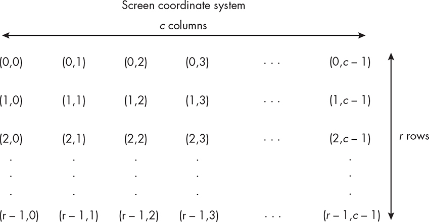
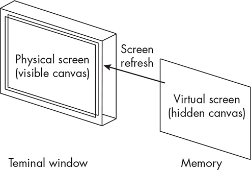
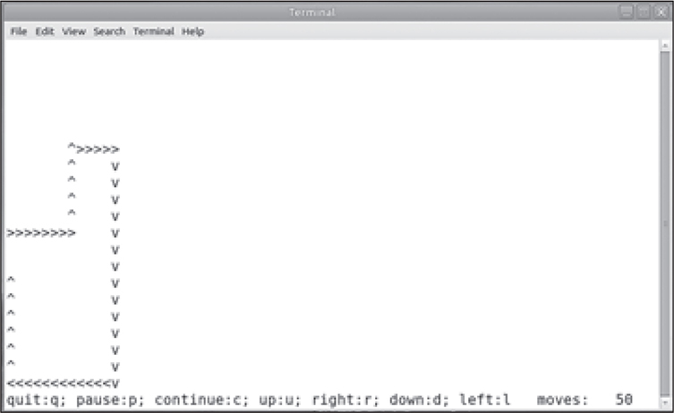
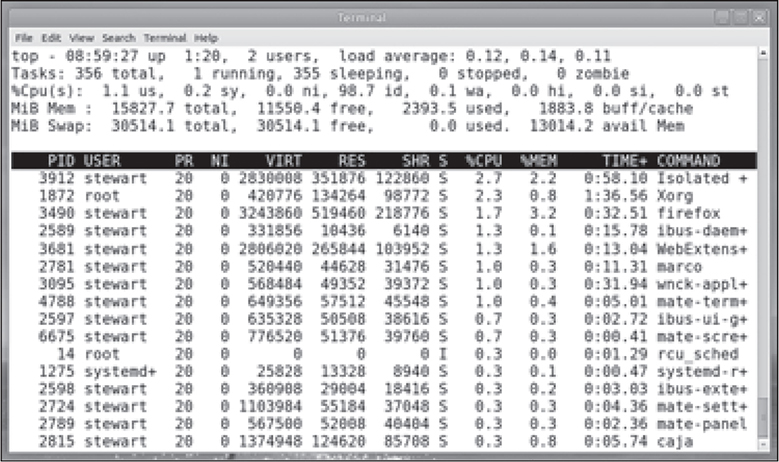
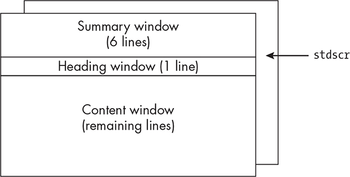
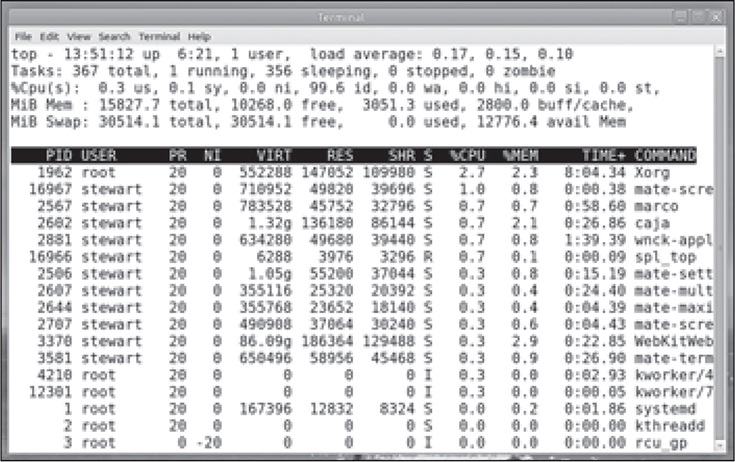

19 INTERACTIVE PROGRAMMING AND

THE NCURSES LIBRARY

The primary purpose of a terminal is to allow a user to provide input to and receive output from a program. A terminal’s settings determine and limit the ways in which these user interactions can take place. The

default terminal setting is canonical mode, which is designed to make

the most common interactions convenient, but highly interactive

programs such as vi, emacs, and top cannot run in canonical mode. These types of programs disable it and assign values to individual switches and variables in the terminal so that it behaves exactly as they require. They also divide the screen into distinct areas that serve different purposes, such as reserving the bottom row for messages or the top of the screen for summary information.

Previous programs in the book have used ANSI escape sequences to

control the screen to a very limited extent, performing tasks such as

clearing all or part of the screen and changing the cursor position.

Although most modern terminal emulators support ANSI escape

sequences, programs that use them are not portable to all systems.

In this chapter, we’ll learn how to design and implement interactive

programs that take complete control of the terminal and that also

configure how different parts of the screen are used. We’ll start by

defining exactly what canonical mode is. We’ll explore from the

command line how the terminal functions when canonical mode is disabled. We’ll then consider what it means for a terminal to be in

noncanonical mode and explore a few different types of noncanonical

modes. We’ll develop a few programs that demonstrate these ideas.

Finally, we’ll study the *ncurses* library, which presents an API that in effect allows a program to treat a character-based terminal as a primitive drawing canvas, and we’ll develop a simplified version of the top

command using *ncurses*.

Canonical and Noncanonical Modes

Canonical mode is the default mode of the terminal. We’re accustomed

to working in a terminal configured in canonical mode. Now that we

know more about the terminal driver, we can make the definition of

canonical mode more precise.

*Canonical Mode*

Canonical mode is characterized by the following conditions:

An input line is made available to the reading process only when

one of the line delimiters \n, EOL, or EOL2 is entered, or EOF is entered at the start of line. Except in the case of EOF, the line delimiter is included in the buffer returned by read().

Line editing is enabled. In particular, ERASE and KILL are enabled, and if the IEXTEN flag is set, then each of WERASE, REPRINT, and LNEXT is

enabled as well. A read() returns at most one line of input; if read() requested fewer bytes than are available in the current line of input, then only the number of bytes requested are read, and the

remaining characters will be available for a future read().

The maximum line length is 4,096 characters, including the

terminating newline character; lines longer than 4,096 chars are

truncated. After 4,095 characters, input processing by ISIG and any

ECHO\* processing continues, but any input data after 4,095

characters, up to but not including any terminating newline, is

discarded. This ensures that the terminal can always receive more input until at least one line can be read.

Let’s do a little experiment to determine what it’s like to work when

canonical mode is disabled. We’ll turn off canonical mode and run the

upcopychars2 program from Chapter 18: \$ **stty -icanon** \$

**./upcopychars2** **aAbBcCdDeE^D** \# Prompt does not return.

The program behaves differently than it did in canonical mode. Each

character is processed immediately, implying that the driver sends the character to read() without waiting for a newline. Notice, though, that the CTRL-D did not get translated to an end-of-file and that the

program is still running. I have to terminate it with CTRL-C.

Now I’ll run it again without restoring the terminal to canonical

mode, but this time, I’ll try to edit the line: \$ **./upcopychars2** **aAbBcC^?**

**^?^?xXyYzZ^C** \$

When I entered BACKSPACE three times, it was echoed as ^? each time

but did not backspace, verifying that line editing is also disabled. We take these features of canonical mode for granted.

*Overview of Noncanonical Modes*

The preceding experiments verified that when canonical mode is

disabled, input buffering and line editing are both disabled. When

canonical mode is disabled, the terminal driver is said to be in

*noncanonical* mode, but non-canonical mode is not one distinct set of settings. There are thousands of possible combinations of the flags and variables when it’s in noncanonical mode, each producing different

terminal behaviors. Some people use the term *raw mode* to refer to any mode in which canonical processing is disabled, but this isn’t accurate.

Typically, raw mode also disables echoing, signal processing, most of the character conversions I described in Chapter 18, and much more. The term derives from Seventh Edition UNIX (commonly called Version 7),

which defined three particular terminal modes called *raw*, *cbreak*, and *cooked*. Cooked mode was essentially today’s canonical mode. Cbreak mode was a noncanonical mode with signal processing, echoing, and

some character conversions enabled.

The cfmakeraw() system call puts the terminal into a raw mode almost the same as Version 7 UNIX’s raw mode. The termios() man page details

exactly which attributes are enabled by this function. Interactive

programs often put the terminal into raw mode so that they can control exactly how user input is handled. Some put it into a mode more like

cbreak mode because they want to allow keyboard signals to be

generated, but they also disable echoing. For example, when we run more and press the spacebar, it isn’t echoed and we don’t need to press ENTER.

When we’re running vi, in command mode, keys like J and X aren’t

echoed but instead cause actions, whereas in last-line mode, characters we type are echoed. In raw mode, a program has to take charge of all

editing and character handling, and as a result, it is more complex. The terminal driver interface gives us the means to fine-tune exactly how our programs will handle all possible inputs and outputs.

*The MIN and TIME Parameters*

One of the most important controls we can exert over how the terminal

behaves is when characters entered in the terminal are delivered to our programs. Let’s start by exploring the purpose of the MIN and TIME

attributes of the terminal driver. In canonical mode they’re ignored, but when canonical mode is disabled, they take on special roles.

Within the termios structure, the MIN value is stored in c_cc\[VMIN\] and the TIME value is stored in c_cc\[VTIME\]. Both must be in the range from 0

to 255. Taken together, they determine when a call to read() completes.

Roughly, MIN determines in part how many bytes are needed in the input buffer for a call to read() to complete, and TIME is a timeout value,

measured in tenths of a second, which also plays a part in when read() completes.

Their combined effect is based on which of them are zero or

nonzero, leading to four possible combinations of values. The POSIX

standard specifies the behavior of read operations for each of the four possible combinations. In the following descriptions, assume that the

call to read() is: nread = read(STDIN_FILENO, buf, numrequested);

You should also bear in mind that when read() is called, the driver’s input buffer may already have unread data in it, and the call to read() could be

satisfied by that data without the user entering more.

MIN == 0 and TIME == 0 (Polling Read)

When both attributes are 0, read() returns immediately without blocking, whether or not data is available. If no data is available, read() returns a value of 0, having read no data. Otherwise, the read buffer (buf) is filled with the smaller of the number of bytes requested (numrequested) and the number of bytes currently available. For example, if there are 6 bytes available but numrequested is 4, it reads 4 bytes, setting nread to 4. If 2 bytes are available, it reads 2 bytes and sets nread to 2.

Unlike nonblocking reads, which we’ve seen in previous chapters

and will explore in greater depth shortly, no data does not result in a return value of -1. This is called a *pol ing read* because it can be called repeatedly, polling the driver without blocking the process, as if it were endlessly asking the driver, “Is there data? Is there data? . . .”

MIN \> 0 and TIME == 0 (Blocking Read)

In this case, what the POSIX standard currently states is inconsistent with the implementation in all recent Linux kernels. First I’ll describe the POSIX requirement, consistent with the man page description. In

this case, since TIME is 0, it has no role in the behavior. In effect, the read() has infinite time and may block indefinitely, waiting for input. This is why it’s called a blocking read.

The call to read() is supposed to block until MIN bytes are available in the driver or a signal is received. When it does return, it shall have read at most the number of bytes requested (numrequested). There are two cases to consider:

Case 1: **MIN \<= numrequested** The documentation states that as soon as MIN bytes are available, MIN bytes are read into buf. The call does not have to wait for the remaining data for read() to return. This is how it behaves in Linux.

Case 2: **numrequested \< MIN** The documentation states that as soon as MIN

bytes are available, numrequested bytes are read into buf, but otherwise,

read() is blocked. *This is not how recent Linux kernels implement this case.*

Currently in Linux, the call to read() returns if the number of

available bytes equals numrequested, even if it’s less than MIN.

It’s rare to set MIN to be greater than the number of bytes in a read

request, and so this discrepancy normally poses no problem, but you

need to bear it in mind.

The typical settings in this case are MIN == 1 and TIME == 0. Then MIN is at most the number requested. Programs use these settings in

noncanonical mode so that as soon as a user presses a key, the read()

returns. Soon we’ll see examples that use this mode.

MIN == 0 and TIME \> 0 (Timed Read)

This has two subcases: Case 1: Driver input queue is empty at the

time of the call In this case, a timer is started as soon as read() is called.

The TIME value is the number of tenths of a second after which the timer expires. The call to read() returns either because a single byte is available or the timer expired before any data became available. If the timer

expired, it implies that no bytes were returned, and nread is set to 0. If read() returned before the timer expired, it implies that a single byte was transferred to the buffer, and nread is set to 1.

Case 2: Driver input queue has **avail** bytes at the time of the call In this case, the smaller of avail and numrequested bytes is delivered to read() immediately and read() returns, setting nread to the number it received.

Only when the queue has been emptied will the timer start.

It is called a *timed read* because it provides a way to block for a bounded number of tenths of a second controlled by a timer.

MIN \> 0 and TIME \> 0 (Read with Interbyte Timer)

Neither the POSIX specification nor the Linux man page describes

what actually happens in Linux in this case. I will describe the way it works in Linux.

This case has several subcases because it works one way when there’s data available in the queue when read() is called, and another way when there isn’t. Furthermore, it has the same issues as when MIN \> 0 and TIME

== 0, in that what is returned to read() is not what the man page describes if MIN is greater than numrequested. Before diving into the details, let me explain why it matters. After all, when would you ever want to set an

interbyte timer when reading from the terminal, as well as putting a

minimum on the number of bytes to be available for read() to return?

Some applications need to distinguish between, say three characters

entered slowly and three characters that are part of a single command or escape sequence. For example, the arrow keys on the keyboard generate

3-byte sequences. If you press the left arrow key, it sends the escape sequence ESC \ B. If you enter these same characters slower than the

timeout allows, they’ll be read as three separate characters and won’t cause a cursor movement. Programs such as vi that put the terminal into raw mode depend on being able to make this distinction.

Note also that the timer in this case is an interbyte timer. It’s not

started when read() is called but instead after the first byte becomes available, and it’s restarted after another byte is received (by the driver).

Case 1: Driver input queue is empty at the time of the call As soon

as the first byte is received, the interbyte timer is started. It’s restarted after each new byte is received. Suppose first that MIN \<= numrequested: If no bytes are delivered to the driver, the timer does not start

and the call to read() remains in the blocked state, possibly

indefinitely.

If at least 1 but fewer than MIN bytes have been received when

the interbyte timer expires, the read() returns with that many

bytes in its buffer.

If MIN bytes are received before the interbyte timer expires, the

read is satisfied and MIN bytes are delivered to read().

If more than MIN bytes are delivered by the driver within the

timeout interval, the read() returns with MIN bytes, leaving the

rest in the queue for subsequent reads, even if the read request could have been satisfied with these remaining bytes.

Next assume that numrequested \< MIN. In this case, the behavior is

what the Linux man page describes. MIN plays no role. The read() will

block until at least 1 byte is received. If numrequested bytes become

available before the timer expires, read() returns with that many

bytes, even though they’re fewer than MIN and the timer has not

expired. If more than numrequested bytes become available, the unread

bytes remain in the queue for subsequent reads.

Case 2: Driver input queue has **avail** bytes at the time of the call In this case, the smaller of avail and numrequested bytes are delivered to read() immediately and read() returns, setting nread to the number it received.

Only when the queue has been emptied will the driver behave as

described in Case 1.

The program in [Listing 19-1 is designed to experiment with these values. It accepts two command line options: -m *MIN value* and -t *TIME value*.

It puts the terminal into noncanonical mode and sets these variables

based on the options supplied or the default of MIN == 1 and TIME == 0. It then enters a loop in which it repeatedly calls read() with a request of 6

bytes. By choosing values of MIN larger or smaller than 6, you can see how it behaves. It has a sleep in the loop to give you a chance to prefill the driver’s input queue to see the effect that it has.

*mintime_test_demo.c*

void set_non_canonical(struct termios \*ttystate, int minval, int timeval)

{

tcgetattr(0, ttystate); /\* Read current setting. \*/

ttystate-\>c_lflag &= ~ICANON; /\* No buffering \*/

ttystate-\>c_cc\[VMIN\] = minval; /\* Set MIN to minval. \*/

ttystate-\>c_cc\[VTIME\] = timeval; /\* Set TIME to timeval. \*/

if ( -1 == tcsetattr(0, TCSANOW, ttystate) )

fatal_error(errno, "tcsetattr");

}

void do_read()

{

int nread;

char input\[128\];

printf("Enter some characters or wait to see what happens.\n"); while ( 1 ) {

sleep(2);

if ( (nread = read(0, input, 6)) \>= 0 ) {

input\[nread\] = '\0';

if ( nread \> 0 ) {

printf("read() returned: %d; chars read: %s\n", nread, input); if ( input\[0\] == 'q' )

break;

}

else

printf("Return value of read(): %d; no chars read\n", nread);

}

}

}

int main(int argc, char \*argv\[\])

{

int min = 1; /\* Default is one char. \*/

int time = 0; /\* Default is to force reads to wait for min chars. \*/

int ch;

char optstring\[\] = ":hm:t:";

struct termios current, original;

if ( !isatty(STDIN_FILENO) ) usage_error("No input redirection allowed."); if ( tcgetattr(0, &current) == -1 ) /\* Retrieve termios struct. \*/

fatal_error(errno, "tcgettattr");

original = current; /\* Save original termios state. \*/

// OMITTED: Option handling

set_non_canonical(&current, min, time); /\* Put into noncanonical mode. \*/

printf("MIN set to %d, TIME set to %d\n ", min, time);

do_read(); /\* Call read() in a loop. \*/

if ( -1 == tcsetattr( 0 , TCSANOW, &original) ) /\* Restore settings. \*/

fatal_error(errno, "tcsetattr");

return 0;

}

*Listing 19-1: A program designed for testing the values of* *MIN* *and* *TIME* *in noncanonical* *mode* By running this program with all possible configurations of MIN and TIME, you can check whether your system’s implementation conforms to the behavior specified by POSIX.

Assume that the number of bytes requested (nr) in the call to read() is 6: \$

**./mintime_test_demo -m 0 -t 0** \# Polling \$ **./mintime_test_demo -m 3 -t 0** \# Blocking, with MIN \< nr \$ **./mintime_test_demo -m 12 -t 0** \# Blocking, with MIN \> nr \$

**./mintime_test_demo -m 0 -t 10** \# Timed read \$ **./mintime_test_demo -m 3 -t 10** \#

Read with inter-byte timer, MIN \< nr \$ **./mintime_test_demo -m 20 -t 10** \# Read with inter-byte timer, MIN \> nr

If on your system the semantics differ, the program will reveal this.

An Interactive Program in Noncanonical Mode

We’ll develop a game-like program in order to illustrate the use of

noncanonical mode. The fact that it’s like a game doesn’t diminish its relevance to interactive system programming. Once you see how it

works and how we solve the programming problems in it, hopefully

you’ll see how to apply them to more serious programs like the top

command. But this one is entertaining as well.

The program is derived from the snake terminal-based game of Unix

antiquity. When computer terminals weren’t bitmapped display devices,

people invented games based on character terminals. The basic idea is

that when the program starts, a snakelike object moves at a constant

velocity in a single direction across the screen. Unlike a snake, the

object leaves a trail of the path it’s taken. In this version, it always starts in the leftmost column of the window, midway between the top and

bottom rows, and moves to the right. Although it’s reminiscent of snake, I call the moving object a *sprite*, the term commonly used to refer to moving objects on a computer screen.

*Program Features and Issues*

The user can alter the movement of the sprite in several ways. To keep the program small, since it’s just an example, the allowed inputs are: **q** Quit the program.

**p** Pause motion of the sprite.

**c** Continue or resume the motion of the sprite.

**u** Make the sprite move upward.

**r** Make the sprite move to the right.

**d** Make the sprite move downward.

**l** Make the sprite move to the left.

The user should be able to enter these characters at any time

without seeing them echoed or having to enter a newline and should see their effect immediately. Since the program has to keep the sprite

moving at all times unless it’s been paused, we know of two ways to

approach this:

The animation of the sprite can be implemented within a signal

handler that runs at timer expirations, and the main program can

use blocking waits for input from the user.

The animation of the sprite can be implemented within the main

program itself, in a loop construct, and within the loop, the

program can check whether the user entered any input and respond

to it if they did.

The first approach is more complex and introduces those complex

problems of signal handlers involving async-signal safety and critical sections to prevent race conditions between the handler and the main

program. The second approach leads to a simpler solution that is solved by changing the mode of the terminal, so that’s what we’ll follow. In

effect, the program’s main loop, in pseudocode, should be of the form: while ( true ) { Advance the sprite in the current direction by one screen position. Check whether the user entered a character without blocking.

If the user entered any input, Respond to the input by updating variables accordingly. }

There are two ways to check for user input without performing a

blocking read. One is to set the O_NONBLOCK flag on the process’s

connection to standard input. We haven’t attempted that in any

programs so far, and we won’t do it here because we’d still have to set up the terminal in noncanonical mode anyway, and for reasons I’ll explain later, it’s not a good idea. Instead, we can do what we just learned about, namely, set the terminal driver’s settings for MIN and TIME to 0 so that read() doesn’t wait for input and returns 0 if there isn’t any; this is called a *pol ing read*.

NOTE

*Enabling* *O_NONBLOCK* *in the open file descriptor’s flag alters only the* *behavior of the connection for the process reading from the terminal.*

*Other processes are unaffected by this change. On the other hand,* *changing the terminal attributes affects al processes reading from the* *terminal. We need to bear this in mind when deciding which method to* *use.*

In previous chapters, we used ANSI escape sequences for screen-

related tasks such as clearing the screen and repositioning the cursor.

Almost all terminal emulators support these sequences, making it

reasonable to use them; this program will use them as well. The

alternative is to use the *ncurses* library, which we’ll explore in “Curses and the *ncurses* Library” on page 894.

The visual appearance of the sprite will depend on its direction of

movement. When it moves to the right, it will be a \> character; to the left, \<; going upward, it will be ^; and going downward, v. Therefore, it will leave a trail that might look something like the following:

^\>\>\>\>\>\>\>\>\>\>\> ^ v \<\<\<\<\<\<\<\<\<\<^ v v ^ ^ v v ^ ^ v v ^ ^ v v ^ ^ v

\>\>\>\>v\>\>\>\>\> \<\<\<\<\<\<v v

The program will also display a menu in the bottom row so that the

user knows what commands they can enter, and to the right of the

menu, it will display a count of how many moves the sprite has made so far: quit:q; pause:p; continue:c; up:u; right:r; down:d; left:l moves: 63

If the initial window size is too narrow to display the menu, or if the window is resized while the program is running and is then too small,

only the count of moves will be displayed. However, to make the

implementation simpler, if the user resizes the window, the screen is

reinitialized, the count is reset to 0, and the sprite starts all over again.

Other design decisions and features are:

The cursor will be invisible at all times.

If the sprite reaches a boundary, meaning the edge of the terminal

window, it will always make a right-hand turn. For example, if it’s

moving down, it starts moving along the floor toward the wall to

the left, which is a right turn when you’re facing downward.

The sprite will move at a constant speed. The program can call a

sleep function in each loop iteration to define its speed. By

changing the parameter of the sleep, we can make the animation

faster or slower.

If the program is sent a terminating signal by another process, it

will tidy up by clearing the screen and resetting everything back to

the way it was before it ran.

These design decisions lead to a useful and interesting but not overly complex program to create.

*Terminal Control Functions*

We’ll start with terminal-related functions since that’s the new material from this chapter. We’ll begin with the function to put the terminal into noncanonical mode, with echoing and keyboard signals disabled, and

with polling reads. I’ve named it init_terminal(): init_terminal() int init_terminal(int ttyfd) { struct termios cur_tty; if ( -1 == tcgetattr(ttyfd,

&cur_tty) ) return (-1); cur_tty.c_lflag &= ~ICANON; cur_tty.c_lflag

&= ~ECHO; cur_tty.c_lflag &= ~ISIG; cur_tty.c_cc\[VMIN\] = 0;

cur_tty.c_cc\[VTIME\] = 0; return (tcsetattr(ttyfd, TCSANOW,

&cur_tty)); }

The function retrieves the current settings, modifies them, and then calls tcsetattr() to modify the driver. Notice that the return value from tcsetattr() is passed back to the caller. Rather than exiting from within this function, it lets the calling function decide what to do if it failed to change the driver’s state.

The program will save the current terminal settings into a global

termios structure named savedtty before making these changes. If the

program receives a terminating signal or if it exits normally, it will restore the terminal to the saved state. This is important because if we fail to do this, when the shell resumes, the terminal will be in

noncanonical mode. Therefore, the program will have two functions for

saving and restoring the terminal settings: save_tty() void save_tty() { if (

-1 == tcgetattr(STDIN_FILENO, &savedtty) ) fatal_error(errno,

"tcgetattr"); } restore_tty() void restore_tty() { if ( -1 ==

tcsetattr(STDIN_FILENO, TCSANOW, &savedtty) )

fatal_error(errno, "tcsetattr"); }

*Global Constants, Types, and Variables*

Choosing good data structures and types simplifies the algorithms. The *sprite.c* program uses the following types of objects: /\* Directions of movement \*/ \#define UP 1 \#define RIGHT 2 \#define DOWN 3

\#define LEFT 4 \#define USECS 400000 /\* Default amount of time to

sleep between updates \*/ const char MENU\[\] = "quit:q; pause:p;

continue:c; up:u; " "right:r; down:d; left:l "; const int menu_length =

strlen(MENU); /\* ANSI escape sequences for controlling the screen

and cursor \*/ const char CURSOR_HOME\[\] = "\033\[1;1H"; const char CLEAR_SCREEN\[\] = "\033\[2J"; const char CLEAR_LINE\[\] =

"\033\[1A\033\[2K\033\[G"; const char HIDE_CURSOR\[\] = "\033\[?

25l"; const char SHOW_CURSOR\[\] = "\033\[?25h"; const char USE_ALTSCREEN\[\] = "\e\[?1049h"; const char

USE_OLDSCREEN\[\] = "\e\[?1049l"; /\* Screen coordinate position \*/

typedef struct { int r; /\* Row \*/ int c; /\* Column \*/ } screenpos; /\* A sprite representation, consisting of a position and a glyph to draw \*/

typedef struct { screenpos pos; char symbol; } sprite; /\* The four possible unit directions of motion. By adding these to a position, it advances in

that direction. \*/ const screenpos Right = {0,1}; const screenpos Left =

{0,-1}; const screenpos Up = {-1,0}; const screenpos Down = {1.0}; /\*

Global variables \*/ /\* The sprite_state array simplifies updating the

sprite when it changes direction. \*/ sprite sprite_state\[\] = { { {0,0}, ' ' }, {

Up, '^' }, { Right, '\>' }, { Down, 'v' }, { Left, '\<'} }; struct termios savedtty;

/\* Initial state of terminal; restored on exit \*/ int numrows; /\* Current number of rows in terminal screen \*/ int numcols; /\* Current number of columns in terminal screen \*/ sprite sprite_obj; /\* The sprite object \*/

int direction; /\* The sprite's current direction \*/ int count = 0; /\*

Number of times the sprite moved \*/

The four screenpos constants make advancing the sprite easy; we just add the appropriate constant to the sprite’s position. The sprite_state\[\] array makes updating the sprite’s direction and glyph trivial, as you’ll see when we get to the main program’s loop.

*Support Functions*

The functions used by the program fall into one (or more) of the

following categories:

Terminal control and configuration

Screen management, using ANSI escape sequences

Sprite control and update

Window size and size change handling

Signal handling

Status and menu bar management

You’ve already seen the terminal control functions: int

init_terminal(int ttyfd); void save_tty(); void restore_tty();

Screen management functions perform tasks such as setting up and

clearing the screen and moving the position of the next write to a new screen position. Their implementations aren’t included here to save

space. Their prototypes are: void moveto(int row, int col); void

clear_screen(); void enter_alt_screen(void); void leave_alt_screen(void);

The *sprite.c* program introduces the concept of the *alternate screen*.

You’ve probably noticed that some programs, such as more and vi, seem

to use a separate screen. When they’re running, you can’t scroll back to see your history, and when they exit, there’s no trace of what was in the terminal when they ran. Terminal emulators usually support a second

screen, called the alternate screen, that your program can use instead of the default screen. Two ANSI escape sequences perform this magic: one

to use the alternate screen and one to leave it. They were declared in the global constants shown previously.

The functions that perform tasks related to the movement and

display of sprites are: void addto(screenpos \*target, const screenpos

adjust); void update_sprite(sprite \*sp, int dir); int on_boundary(sprite sp, int rows, int cols, int cur_direction); void init_sprite(sprite \*sp);

Their implementations follow: /\* addto(&target, adjust) adds the screen position adjust to target. \*/ void addto(screenpos \*target, const

screenpos adjust) { target-\>r += adjust.r; target-\>c += adjust.c; }

The C language doesn’t support arithmetic with structures. The

addto() function is used where arithmetic is needed: /\*

update_sprite(&sp, d) changes sp's direction and shape based on d. \*/

void update_sprite(sprite \*sp, int dir) { addto(&(sp-\>pos),

sprite_state\[dir\].pos); sp-\>symbol = sprite_state\[dir\].symbol; }

Updating a sprite requires changing its position and possibly changing its glyph. Changing its position takes advantage of the sprite_state\[\]

array. Its indices are direction constants such as UP. For example,

sprite_state\[UP\] contains the position to add to the sprite if the direction is upward and the character to use for its glyph when moving upward.

The on_boundary() function checks whether the next move of the

sprite would go past a window boundary. This is true if and only if its current position is at the boundary and its direction of movement is

toward the boundary: int on_boundary(sprite sp, int rows, int cols, int cur_direction) { if ( 1 == sp.pos.c && cur_direction == LEFT ) return LEFT; *--snip--* else if ( rows -1 == sp.pos.r && cur_direction ==

DOWN ) return DOWN; else return 0; }

It returns 0 to indicate it isn’t at the boundary. The init_sprite() function sets the initial position and glyph for the sprite. To save space, it isn’t

shown here.

There are two functions related to window size: int

get_window_size(int ttyfd, int \*rows, int \*cols); void on_resize(int

signo);

We’ve already seen how to get the size of the window with a call to

ioctl(). The second function is the signal handler for the SIGWINCH signal.

If the user changes the shape of the window, this signal is sent to the program. To simplify the program’s design, if the user does decide to do this while the program is running, the program will reinitialize the

screen, resetting the start position of the sprite, resetting the count of moves, and redrawing the display. Anything else would require a much

more complex program.

The on_resize() handler implementation follows: void on_resize(int

signo) { struct winsize size; if ( ioctl(1, TIOCGWINSZ, &size) \< 0 ) fatal_error(errno, "TIOCGWINSZ error"); numrows = size.ws_row; /\*

Store new size. \*/ numcols = size.ws_col; clear_screen(); /\* Clear the screen. \*/ init_sprite(&sprite_obj); /\* Reset the sprite to the starting state. \*/ direction = RIGHT; /\* Set it to move to the right. \*/ count = 0;

/\* Reset the count to zero. \*/ if ( numcols \>= menu_length + 16 ) /\* If no room for menu, skip it. \*/ show_menubar(0); else { /\* Draw the menu in the new bottom row and show the move count. \*/ moveto(numrows, 1);

write(STDOUT_FILENO, CLEAR_LINE, strlen(CLEAR_LINE));

moveto(numrows, 1); show_moves(0); } }

The first step is to get the new dimensions. After that, it just does all initializations as if the program were starting up again.

I omit the signal handling function implementations. There are two

signal-related functions: void cleanup(int signum); void

setup_sighandlers();

The cleanup() function is the handler that’s called if the program receives a terminating signal. It must ensure that the terminal is in the right state and the default screen is restored: void cleanup(int signum) {

write(STDOUT_FILENO, SHOW_CURSOR,

strlen(SHOW_CURSOR)); clear_screen(); restore_tty();

leave_alt_screen(); moveto(numrows, 1); raise(SIGTERM); }

The function to set up signal handling isn’t shown here.

The remaining functions perform tasks related to displaying the

menu and move count and setting up the screen to start the program:

void show_moves(int count); void show_moves_only(int count); void

show_menubar(int count); void setup_screen(int count, sprite \*sp, int

\*initial_dir);

If the window size is too small to show the menu, the program shows

only the move count. One function shows the move count at the current

cursor position (show_moves()), the next puts the cursor on the bottom row and shows the move count and nothing else, and the next shows the

menu bar and move count. I omit their implementations to save space.

The last function sets everything up: void setup_screen(int count, sprite

\*sprite_obj, int \*initial_dir) { clear_screen(); write(STDOUT_FILENO,

HIDE_CURSOR, strlen(HIDE_CURSOR)); if ( numcols \>=

menu_length + 16 ) show_menubar(count); else

show_moves_only(count); init_sprite(sprite_obj); \*initial_dir = RIGHT;

}

Normally, the cursor is visible. We’d find it disconcerting not to see a cursor in the terminal since we wouldn’t know where our typing was

going. However, in this program, it’s the opposite. If we don’t hide the cursor, that blinking or solid shape would look like it was leading the sprite around the screen, like a horse leading a carriage. This function hides it, decides what to display in the bottom row, and initializes the sprite.

*The sprite.c main() Function*

The main() function is the last piece of the program. It is presented in part in Listing 19-2. To save space, some error handling is omitted.

*sprite.c* main()

int main(int argc, char \*argv\[\])

{

char ch; /\* Character entered by user \*/

int done = 0; /\* Whether user still wants to run program \*/

int pause = 0; /\* Controls pausing of output \*/

int delay = USECS; /\* Amount to sleep between moves \*/

setup_sighandlers(); /\* Register all signal handlers. \*/

/\* Check whether input or output has been redirected. \*/

if ( !isatty(STDIN_FILENO) \|\| !isatty(STDOUT_FILENO) )

fatal_error(-1, "Not a tty");

/\* Save the original tty state and enter alternate screen. \*/

save_tty();

enter_alt_screen();

/\* Initialize the terminal, get window size, and set up initial state. \*/

init_terminal(STDIN_FILENO);

get_window_size(STDIN_FILENO, &numrows, &numcols);

setup_screen(count, &sprite_obj, &direction);

/\* Start drawing. \*/

while ( !done ) {

if ( !pause ) {

count++;

switch ( on_boundary(sprite_obj, numrows, numcols, direction) ) {

case UP : direction = RIGHT; break;

case RIGHT: direction = DOWN; break;

case DOWN : direction = LEFT; break;

case LEFT : direction = UP; break;

default : break; /\* No change \*/

}

/\* Draw sprite in next position. \*/

moveto(sprite_obj.pos.r, sprite_obj.pos.c);

write(STDOUT_FILENO, &(sprite_obj.symbol), 1);

update_sprite(&sprite_obj, direction);

}

if ( numcols \>= menu_length + 16 )

show_menubar(count);

else

show_moves_only(count);

usleep(delay); /\* Delay a bit. \*/

/\* Do the read. If nothing was typed, do nothing. \*/ if (

read(STDIN_FILENO, &ch, 1) \> 0 ) {

switch( ch ) {

case 'q': done = 1; break;

case 'p': pause = 1; break;

case 'c': pause = 0; break;

case 'u': direction = UP; break;

case 'd': direction = DOWN; break;

case 'l': direction = LEFT; break;

case 'r': direction = RIGHT; break;

}

}

}

/\* Clean up - flush queue, clear the screen, and restore terminal. \*/

tcflush(STDIN_FILENO, TCIFLUSH);

cleanup(0);

return 0;

}

*Listing 19-2: The* *main()* *function of* sprite.c In essence, the main program sets up all variables and program state and then enters its loop. The first part of the loop updates the sprite position based on the prevailing direction and window size and draws the menu and count in the bottom row. It then adds a small delay before polling to see if the user entered a character. It’s important that the delay is before the user’s input, not after it. If it were after, when the user entered a command such as r, there’d be a slight delay before it took effect.

The complete program, named *sprite.c*, is available in the book’s source code distribution. You can download and build it. When you run

it, you’ll see the value of noncanonical mode with polling reads.

Curses and the ncurses Library

It’s difficult to write programs that manipulate the screen using low-

level terminal driver escape sequences. Trying to make them portable is even harder. Fortunately, Unix systems include a terminal-independent, character-oriented graphics library called *ncurses* for controlling cursor movement, screen editing, and window management on ASCII display

terminals. The *ncurses* library wraps the complexity of terminal management into an easy-to-use interface containing hundreds of

functions. The starting point for learning about it is the ncurses(3ncurses) man page.

The *ncurses* library is vast; in this section, we examine only its basic features and functionality. Before we start our exploration, though, we need to untangle some of the confusion surrounding its name, which I’ll do with a brief summary of its origin and history.

*History, Standards, and Names*

According to Eric Raymond, in the September 1995 issue of the Linux

Journal [( *https://www.linuxjournal.com/article/1124*](https://www.linuxjournal.com/article/1124)): The first curses library was hacked together at the University of California, Berkeley in about 1980 to support a screen-oriented dungeon game called rogue. It leveraged an earlier facility called *termcap*, the terminal capability library, which was used in the original vi editor and elsewhere.

The original library was named *curses*, based on the phrase *cursor* *optimization*. Its primary developer was Ken Arnold. This is now known as the BSD version.

AT&T Bell Labs developed a different, and proprietary, version of

*curses* when Mary Ann Horton, who maintained the database of terminal capabilities called *termcap* at the University of California, Berkeley, started working there. She created a new terminal capabilities library that was called the *terminfo* library and based the new version of *curses* on that library instead. This version was included in System V Release 2

(SVR2) and remained in future releases through SVR4. The SVR4

version had many attractive features, but it was proprietary and it was based on the *terminfo* format, whereas the BSD version was free and based on the *termcap* file. This made it hard to write portable *curses* programs. In 1982, Pavel Curtis solved the problem by rewriting a free version of *curses* based on the SVR1 version. Fast-forwarding, by the mid-1990s The Open Group published the X/Open Curses standard,

based on the SVR4 *curses* API, and developers at UC Berkeley created a new version of *curses* compatible with SVR4 and the X/Open Curses standard, which they named *ncurses*. This standard is also referred to as *XSI Curses*.

To summarize:

The current standard, X/Open Curses, Issue 7, defines an interface to which an implementation of the *curses* library should conform.

That standard refers to the library as the *Curses* library.

The current Linux implementation of this standard is called *ncurses*.

The library file is named *libncurses*.

Programs that link to this library are referred to in the

documentation as *curses programs*, not *ncurses programs*.

Linux has two header files, named *curses.h* and *ncurses.h*. The *ncurses.h* header is a symbolic link to *curses.h*. The man page synopsis for *ncurses* shows that programs should use the \#include directive: \#include \<curses.h\>

Your programs should use this directive.

In the rest of this chapter, I’ll use terminology consistent with the

documentation, calling programs *curses* programs, calling the library the *ncurses* library, referring to the API as the Curses API, and including *curses.h* in programs. For example, the function that initializes the *ncurses* library is initscr(). Since initscr() is specified in the X/Open Curses standard, I may at times say that it’s a Curses function or that it’s an *ncurses* function. Everything we need to know about *ncurses* is available either on the ncurses man page or one of the pages that it references.

The Curses library standard is available online as well at

[*https://pubs.opengroup.org/onlinepubs/9699909599/toc.pdf*](https://pubs.opengroup.org/onlinepubs/9699909599/toc.pdf).

*Terminology*

The Curses library defines a few fundamental types of objects.

Terminal

In Curses, the *terminal* is the logical I/O device within which all interactions with the user take place. The TERMINAL data type is an opaque data type associated with a terminal. The TERMINAL data structure contains information about the capabilities of the terminal, the terminal mode, and its current state of I/O operations.

Screen

A *screen* is the physical output device of a terminal. Each terminal has one screen. The SCREEN data type is an opaque data type that represents a screen. The SCREEN data structure encapsulates all of the data associated with a screen, such as the file descriptors associated with its input and output streams, buffers associated with it, screen dimensions, screen

attributes, terminal driver mode, and so on.

Window

A *window* can be thought of as a two-dimensional array of characters representing all or part of a terminal screen. A window is represented by the WINDOW data type. The WINDOW data type is a C structure with many

members; in addition to the internal storage for all of its screen cells, it contains the location of the window’s origin on the screen (its upper-left corner), its size, the cursor position, several attributes such as its current background color and scrolling state, and its input mode.

The WINDOW data structure also contains a flag that indicates whether

the contents of the data structure are different from its manifestation on the visible screen. When the window is changed, the flag is set. The

Curses library refers to this as *touching* the window, like the Unix touch command that sets the modification time of a file.

A default window called stdscr, which is the size of the terminal

screen, is created when a program calls initscr().

A *subwindow* is a window created within another window, which is called its *parent window*.

Pad

The library also defines a particular type of window called a pad. A pad is a window that isn’t limited to the size of the screen and whose contents aren’t necessarily displayed. You can think of a pad as a canvas larger than the terminal and the terminal is then like a window that can be moved

around on the canvas to make different portions of it visible. I won’t cover pads in this book.

The names of several Curses functions and objects are misleading, as you’ll soon discover. For example, the function newterm() creates a new screen, not a new terminal, and the objects curscr and stdscr are window objects, not screens, as their names suggest.

*Compiling, Building, and Running Curses Programs*

All *curses* programs must include the *curses.h* header file and the standard C I/O library header file *stdio.h*. Since the *ncurses* library file is not part of the standard library, we have to build with the -lncurses linker option, as in: \$ **gcc -o myprog myprog.c -lncurses**

No other libraries are needed to run a *curses* program. The behavior of *curses* programs is affected by certain environment variables. If LINES or COLUMNS are in the environment, *ncurses* will use their values instead of the information provided by terminfo. In this case, *ncurses* won’t handle window resizing well. If you intend to handle window resizing events

and these variables are set, then the program must remove them from

its inherited environment by calling unsetenv() before calling initscr() or any other *ncurses* functions: unsetenv("LINES");

unsetenv("COLUMNS"); *--snip--* initscr();

This won’t affect the environment in the shell since the process

modifies only its copy of it.

*Curses Basics*

Here, we’ll cover the key concepts and elements of the Curses library, starting with its coordinate system.

Coordinates in Curses

The coordinate system in *ncurses* is derived from matrix coordinates rather than Cartesian coordinates. The origin, (0,0), is in the upper-left corner of the screen, and the coordinate pair ( *y*, *x*) represents the screen cell in row *y* and column *x*, as shown in Figure 19-1.

*Figure 19-1: The Curses coordinate system*

In Figure 19-1, there are *r* rows and *c* columns. Each cell is one character position on the screen.

Screen Updating in Curses

Window managing libraries, whether on Unix, macOS, or Windows,

usually follow the same principle of drawing: They maintain two data

structures representing the canvas on which they draw. One, the *visible* *canvas*, is what is currently in view on the physical display device. The other, the *hidden canvas*, is a canvas in memory on which only drawing operations take place. This terminology is not standardized and goes by various names depending on the particular system one uses. In Curses,

each terminal has two such canvases. The visible canvas is called the

*physical screen*, and the hidden one is called the *virtual screen*.

In Curses, when a program calls any function that modifies the

screen contents, those changes are first applied to the virtual screen in

memory. When the program is ready to make those changes visible on

the screen, the virtual screen is used to update the physical screen.

Figure 19-2 illustrates the principle.

*Figure 19-2: Screen refreshing in which the contents of a hidden canvas are applied to the* *visible canvas on the screen*

The figure schematically represents the virtual screen’s contents

being written onto the physical screen. In fact, the *ncurses* library performs this update efficiently, comparing the two screens and

modifying only the parts of the physical screen that are different from the virtual screen. In the *ncurses* documentation, the operation that updates the visible screen is called *screen refreshing*.

The actual refresh operation is actually two stages. I’ll explain by

way of an example. A program can write a character string to its window with the addstr() function. Suppose that the window’s cursor is at

position (5,0) on the screen. When the program calls addstr("Hello"), the string "Hello" is written to the stdscr window data structure. This records that line 5 now contains the string "Hello" in columns 0 through 4. These changes do not appear on the screen until a refresh operation takes

place.

When refresh() is called, the first step is to map the contents of the stdscr window data structure into a hidden window named newscr, used

internally by *ncurses*. Each screen has this hidden window. The newscr window is what the documentation calls the virtual screen. Now the

string "Hello" is part of newscr. The next step is to update the physical screen, which is represented by the window curscr. This window’s

contents are the visible screen. Once our string is in it, it appears on the screen.

Every time that a program makes changes to a window, those

changes only become visible when the program refreshes the screen.

Two functions perform refreshing: refresh() and wrefresh(). Programs that draw on the standard screen (stdscr) simply call refresh(), whose

prototype is: int refresh(void);

A program that draws on another window, WINDOW \*win, has to call

wrefresh(win). Its prototype is: int wrefresh(WINDOW \*win);

If a program has created multiple windows in the same screen and they

overlap, a portion of the screen’s real estate may be within more than one window. If two windows, win1 and win2, overlap and wrefresh(win2) is called, the library determines how to redraw the screen efficiently,

replacing those portions of the screen within the intersection of win1 and win2. It redraws a window only if that window’s content has changed in some way. A program can also call touchwin(win), whose prototype is int touchwin(WINDOW \*win);

to tell *ncurses* that an entire window win has changed without making any actual changes to force a redraw when it calls wrefresh(win).

Curses Data Types, Constants, and Variables

The *curses.h* header file defines a few data types in addition to the ones described in “Terminology” on page 896. These include: **attr_t** An integer type that is used to store the attributes of various objects in Curses

**bool** A Boolean type, the same as in the C header file, *stdbool.h*

**chtype** An integer type that stores a character and character attributes such as color

Curses also defines the following global constants: int TRUE /\* The

value 1 \*/ int FALSE /\* The value 0 \*/ int ERR /\* The return value

indicating failure \*/ int OK /\* The return value indicating success \*/

When a program initializes the *ncurses* library by calling initscr(), the library initializes the terminal that the program will use for the Curses session. Curses creates several variables for the program, including the predefined windows stdscr, curscr, and newscr belonging to that terminal.

The stdscr window is called the *standard screen*. Its size is that of the terminal screen.

The library also provides several variables associated with the

terminal screen. A few basic ones are: int LINES /\* The number of lines in the terminal screen \*/ int COLS /\* The number of columns in the

terminal screen \*/ TABSIZE /\* The number of spaces used to represent

a tab character \*/

I’ll discuss later how *ncurses* handles changes to these variables when a user decides to resize the terminal while a *curses* program is running.

Internationalization in Curses

The *ncurses* library is locale-aware; it uses the locale of the calling process. If you want a *curses* program to use the locale, before starting up *ncurses*, it should call setlocale(LC_ALL, ""). If the locale isn’t initialized, the library assumes that characters are encoded in the ISO-8859-1 codeset, a 1-byte code set whose lower 7 bits are the ASCII codes. Programs

should always initialize the locale to avoid problems related to character codes.

Initializing and Wrapping Up

The *ncurses* library must be initialized for each program that links to it.

Initialization performs many tasks, including allocating memory for

stdscr and curscr and other data structures. It also changes the settings of the terminal driver. A program that uses only a single terminal window

can initialize the library by calling initscr() before it calls any functions that work with windows or screens. Its prototype is: WINDOW

\*initscr(void);

If initscr() fails, it returns NULL; otherwise, it returns a pointer to stdscr.

That pointer can then be used as the argument to a few *ncurses*

functions. Programs that set up multiple terminal windows by calling

newterm() don’t have to call initscr() because newterm() performs the

required initializations of *ncurses*. Its prototype is: SCREEN

\*newterm(const char \*type, FILE \*outfd, FILE \*infd);

This returns NULL if it fails, and if it succeeds, it returns a pointer to the newly created screen. Later, you’ll see an example that shows how to use multiple terminals.

When a program is ready to terminate, it must always call endwin()

for each terminal that it opened to restore the terminal driver settings and release *ncurses* library resources. The prototype is: int endwin(void); If this function fails, it returns ERR; otherwise, it returns OK.

Programs should always have signal handlers that clean up in case

they receive a terminating signal, and within the handlers, they should call endwin(). Not calling endwin() before terminating will leave the

terminal in an unusable state for the shell. If this happens, at the shell prompt, enter **reset** to reset the terminal.

*The Curses API*

The Curses API includes several hundred different functions, some of

which are much more commonly used than others. The curses man page

lists them all, as well as some that may not be part of the XSI Curses standard. The *ncurses* library can be configured in one of two ways: The *normal* library handles only 8-bit characters and stores each character in a window in an object of type chtype.

The *wide* library, named *ncursesw*, supports multibyte characters as well as 8-bit characters. The character representation is more

complex than in the normal library.

The man page lists both normal and wide library functions. The wide library functions are usually easy to spot because their names contain a \_w substring, such as add_wch(). I won’t discuss the wide library here.

Many functions fall neatly into one of a few different categories, but others are harder to classify. Following is a set of categories containing many of the commonly used functions:

Initialization and configuration Includes functions that set up

and reconfigure the Curses library for the program, including setting

the terminal driver input and output modes, the keyboard and mouse,

and so on.

Screen, window, and pad manipulation Includes functions that

act on these objects as entities, such as creating them, deleting them, and accessing and modifying their attributes.

Input Includes all input from a keyboard as well as mouse events.

The library has an extensive set of mouse-related functions, whose

names usually contain the substring mouse.

Output (screen overwriting) Includes all functions that send

output to windows. Because writing a character into a screen cell

replaces whatever character was there before, these functions are also thought of as screen overwriting functions. This set has functions

that operate on single characters and strings and includes functions

that erase, delete, and modify what appears on the screen.

Cursor manipulation Includes functions that move the cursor, get

its position, change its attributes, and so on.

Screen attribute management Includes functions that return

information about the current state of the screen and everything in it, such as the coordinates of the window relative to its parent, the

character at the current cursor position, and much more. Some

contain the substring attr in their names, and some contain get. This

is a large category.

We’ll explore several Curses functions in this chapter, but before we

do, we’ll start with an example that shows the use of the most basic

*ncurses* functions: initscr(), move(), addstr(), refresh(), getch(), and endwin().

A First Curses Program

The program in Listing 19-3 performs the basic operations of a *curses* program. It initializes the library, moves the cursor, prints some text, moves the cursor again, prints more text, waits for user input, and

terminates when the user responds.

*curses_demo1.c*

\#include "common_hdrs.h"

\#include \<curses.h\>

int main(int argc, char \*argv\[\])

{

char epoch\[\] = "January 1, 1970, the start of the UNIX Epoch"; initscr(); /\* Initialize ncurses. \*/

move(LINES/2, (COLS - strlen(epoch))/2); /\* Move to position so string is centered on screen. \*/

addstr(epoch); /\* Write the string. \*/

move(LINES - 1, 0); /\* Park the cursor at bottom and display a prompt. \*/

addstr("Type any char to quit:"); /\* Add prompt string. \*/

refresh();

getch(); /\* Wait for user to type a character. \*/

endwin(); /\* End curses session. \*/

return 0;

}

*Listing 19-3: A program to demonstrate basic Curses functions* Let’s break down the steps in this program:

The first call is to initscr(), which initializes all *ncurses* data structures after determining the terminal type and then calls

refresh() to clear the screen.

The program calls move() to move the cursor to the center row at a

column position calculated so that the string in epoch is centered on

the row. The move() function expects a ( *row*, *column*) pair of arguments: int move(int y, int x);

It then calls addstr(), a workhorse function of Curses. Its prototype is: int addstr(const char \*str);

This outputs its string argument at the current cursor position and,

by default, advances the cursor to either the next position in the

line or the first position in the line below, if wrapping has not been disabled.

The program then parks the cursor in the bottom row. *Parking* the cursor means moving it to a fixed position out of the way of any

drawing routines. In this case, the program writes a message, again

with addstr().

Before continuing, since all drawing has been done, the program

calls refresh() to update the display. This step actually isn’t required in this program because addstr() always performs a refresh

operation before it returns, but it’s a good habit to refresh after

screen updates.

The next function is an input function. Many interactive programs

are designed so that the user enters a single character rather than a

string. The Curses function getch() reads a single character from the

current window. Its prototype is: int getch(void);

In blocking mode, it doesn’t return until the user enters a character.

This program doesn’t store the returned character because it

doesn’t use it. Any character causes the call to return.

The last Curses function in the program is endwin(). When this

function returns, the screen display returns to the state it was in

before the program started. If we didn’t have the blocking call to

getch() before it, we’d never see our Curses screen because it would

vanish too quickly.

The last point deserves a bit more discussion. Curses is designed to

use the terminal driver’s alternate screen. As a result, when the program exits, none of the *curses* program’s outputs are in the terminal’s scroll-back buffer. Earlier in the chapter, in *sprite_demo.c*, we had to use an ANSI escape sequence to get this effect (in enter_alt_screen() and

leave_alt_screen()), but Curses takes care of it for us. Compile, build, and

run the program and verify that it behaves the way I just described. You won’t see anything in the scroll-back buffer when it terminates.

Curses Naming Convention

The designers of the Curses API established a naming convention to

make it easy to guess the name of a function based on what it does or

guess what a function does based on its name. The man page specifies

this naming convention. For example:

Functions with names prefixed with w require a window argument.

Functions with names prefixed with p require a pad argument.

Those without a prefix generally use stdscr. I’ll call these *base*

*functions*.

Functions with names prefixed with mv imply a call to move() prior to

executing the function. They require y- and x-coordinates

preceding the other arguments.

Functions prefixed with mvw take both a window argument and x-

and y-coordinates. They imply a move before executing the

function in the specified window argument. The window argument

precedes the coordinates, which precede the base function’s

arguments.

Functions with an n preceding the base function name expect an

integer argument N in the last position and process at most N

characters.

This implies that each base function can have as many as eight

variants including itself. For example, consider the base function

addstr(s). The addstr() man page documents all possible variants: int

addstr(const char \*str); int addnstr(const char \*str, int n); int

waddstr(WINDOW \*win, const char \*str); int waddnstr(WINDOW

\*win, const char \*str, int n); int mvaddstr(int y, int x, const char \*str); int mvaddnstr(int y, int x, const char \*str, int n); int mvwaddstr(WINDOW

\*win, int y, int x, const char \*str); int mvwaddnstr(WINDOW \*win, int

y, int x, const char \*str, int n);

The first four don’t require a cursor movement first; the latter four do.

The ones with a w work in the given WINDOW argument. The ones with an n limit output to at most n characters.

There are too many functions in Curses to cover in a single chapter.

We won’t explore any pad functions here or functions that manipulate

color or other character and screen attributes. We won’t examine any of the *ncurses* functions that access and modify the terminal information database. In general, we’ll examine only base functions and not their

variants. As you start to write more advanced programs, you might need to explore the ones not described here. You may also discover the *panel* and *menu* libraries that extend *ncurses* in many Unix systems but that aren’t part of the XSI Curses standard.

Curses Configuration Functions

This category includes functions that set up the terminal, keyboard, and screen for your program’s use. For each, I give its prototype and a brief description. You’ll most likely be using all of these functions in your first few programs. You’ve seen a few already in the example program.

**WINDOW \*initscr(void)** Initializes the library data structures, returning a pointer to stdscr.

**int endwin(void)** Releases library resources and resets the terminal.

**int clear(void)** Clears the standard screen. It has variants to clear other windows or portions of a screen.

**int cbreak(void)** Puts the terminal in cbreak mode. In cbreak mode, line buffering and erase/kill character processing are disabled, but interrupt and flow control characters are not disabled. It’s essentially the same as turning off icanon in the terminal, setting MIN = 1 and TIME = 0, and not modifying isig or ixon in the termios settings. Characters typed by the user are immediately available to the program.

**int noecho(void)**/**int echo(void)** Disable or enable echoing characters when getch() is called in the terminal. We usually want to disable echoing. The man page has further details.

**int intrflush(WINDOW \*win, bool bf)** If bf = TRUE, pressing an interrupt key on the keyboard flushes all output in the terminal driver’s output queue.

This makes response time faster but causes Curses to have the wrong

idea of what is on the screen. Disabling the option prevents the flush.

**int keypad(WINDOW \*win, bool bf)** If bf = TRUE, this enables keypad function key processing, and if bf = FALSE, it disables it. The arrow keys on the keyboard are some of the keys that become enabled by this function.

When the keypad is enabled, calls to getch() and variants return special symbolic 8-bit character values representing arrow keys and other

nonprintable character keys. They have names such as KEY_LEFT, KEY_UP, KEY_HOME, and KEY_ENTER. The *curses.h* header file defines these constants.

**int nodelay(WINDOW \*win, bool bf)** Puts the terminal into nonblocking mode when bf = TRUE; getch() and variants return ERR if no input is available.

There are other functions that alter the input mode, such as halfdelay(), raw(), timeout(), and several others. They’re all described in the

inopts(3NCURSES) man page.

A typical interactive program will include this sequence of calls

initscr(); /\* Initialize ncurses. \*/ cbreak(); /\* Put into cbreak mode. \*/

noecho(); /\* Turn off echo. \*/ intrflush(stdscr, FALSE); /\* Don't flush output on keyboard signals. \*/ keypad(stdscr, TRUE); /\* Turn on the

keypad. \*/

at the start of the program. Programs that intend to poll the keyboard for input rather than waiting for it would also call nodelay(stdscr, TRUE).

Curses Input Functions

We’ve seen getch() already; Curses has two other input functions that are worth remembering: **int getstr(char \*str)** Equivalent to a series of calls to getch() until either a newline or carriage return is entered. The

terminating character isn’t included in the string, which is NULL-

terminated and stored at address str.

**int scanw(const char \*fmt, ...)** Essentially like the C scanf() function. It is equivalent to calling getstr(s) and then calling sscanf(s, fmt, ...).

The getstr() function requires the user to enter a newline or carriage return, even in cbreak mode; otherwise, it wouldn’t know when input

was terminated. The following program, *getstr_demo.c*, demonstrates the use of getstr().

*getstr_demo.c*

int main(int argc, char \*argv\[\])

{

char str\[32\];

initscr();

cbreak();

mvaddstr(0, 0, "Type up to 31 characters and press ENTER:"); getstr(str);

mvaddstr(1, 0, "You entered: ");

addstr(str);

mvaddstr(2, 0, "Type any character to quit.");

getch();

endwin();

return 0;

}

The program also shows the use of the mv variant of addstr() to

reduce the number of function calls. When you run it, its output will be indistinguishable from a non- *curses* program, except that the screen contents will disappear when you enter the character to terminate it: \$

**./getstr_demo** Type up to 31 characters and press ENTER:**hello** You entered: hello Type any character to quit.

After the user enters a character, the program terminates, the bash

prompt returns, and none of the program’s output is in the scroll-back buffer.

Curses Output Functions

There are a few families of functions that write to the screen. We’ve

seen addstr() already, but others include: **int addch(const chtype ch)** Adds a single character ch at the current cursor position, which is then

advanced. At the right margin, the cursor wraps, but see the man page

for details such as how it handles backspaces, tabs, and so on.

**int addchstr(const chtype \*chstr)** Whereas addstr() has an argument of type const char\*, this has an argument of type const chtype\*. This is called a *character array* in Curses. The chtype data type isn’t a plain character; it stores attributes such as color. Unlike addstr(), this doesn’t advance the cursor; doesn’t perform any kind of checking, such as for the newline or backspace; doesn’t expand control characters to ^-escapes; and truncates the string if it crosses the right margin, rather than wrapping it.

**int insch(chtype ch)** Inserts the character ch before the character under the cursor. All characters to the right of the cursor are moved one space to the right, with the possibility of the rightmost character on the line being lost. This operation does not change the cursor position.

**int insstr(const char \*str)** Similar to insch() except that it inserts the string str before the cursor, shifting all characters to the right.

**int printw(const char \*fmt, ...)** The Curses equivalent of the C printf() function.

In addition to functions that add characters to the screen, there are

functions that remove them. These are also output functions because

they alter the contents of the screen. I won’t detail them all. They

include delch(), which deletes the character at the cursor position, and deleteln(), which deletes all characters in the line containing the cursor.

Window Functions

A program can create and delete windows, create and delete

subwindows, and more, within a single terminal screen. The

window(3NCURSES) man page lists many of the window-related functions

available in *ncurses*, and the util(3NCURSES) man page lists a few more. I’ll describe a few from both man pages: **WINDOW \*newwin(int nlines, int ncols,** **int o_y, int o_x)** The call newwin(nl, nc, y, x) creates and returns a pointer to a new window with nl lines and nc columns, with the upper-left

corner at screen position (y, x). The window is initialized with all default values. The man page describes what *ncurses* does when one or more of the arguments are 0.

**int delwin(WINDOW \*win)** The call delwin(winptr) deletes the window pointed to by winptr, freeing all memory associated with it. It doesn’t erase the window’s screen image, though. We can call either werase(winptr) or

wclear(winptr) to erase its screen image before deleting it.

**int mvwin(WINDOW \*win, int y, int x)** The call mvwin(winptr, y, x) moves the window so that the upper-left corner is at screen position (y, x). It’s an error if these coordinates would cause any part of the window to be off the screen, in which case the window would not be moved. The

program has to call refresh() after the move. This function doesn’t erase the old window from the screen; the program must do that.

**int putwin(WINDOW \*win, FILE \*filep)** The call putwin(winptr, fp) writes the contents of window winptr to the file stream pointed to by fp. This

function provides a way to save a curses program’s current state into a file.

**WINDOW \*getwin(FILE \*filep)** The call savedwin = getwin(fp) creates a window from the contents of the file stream pointed to by fp, assuming that a window was previously written into it. It returns a pointer to the new window.

Being able to create multiple windows in a screen is useful. It’s a way to tile the screen into separate rectangular areas with different attributes and restrict drawing to selected regions of the screen.

Miscellaneous Useful Functions

The Curses library has a few functions that don’t fit into any one

category but are worth remembering. For instance, there’s a function

that returns the character at a given screen position and a function that returns the cursor’s current position. Here’s a handful of a few

interesting ones: void getyx(WINDOW \*win, int y, int x); /\*

getyx(win,y,x) gets the current cursor position in the given window and stores its coordinates in y and x. Notice that y and x are not pointers; this is a macro. \*/ void getmaxyx(WINDOW \*win, int y, int x); /\*

getmaxyx(win,y,x) puts the coordinates of the lower right-hand corner

of a window into y and x. This is a way to get the window's size. \*/

chtype inch(void); /\* inch() returns the character at the cursor, as well as its attributes. \*/

We now have a repertoire of functions that will let us write many

different types of *curses* programs. We’ll start with a small example that shows how to use multiple tiled windows.

*A Program with Tiled Windows*

The program in Listing 19-4 demonstrates how to tile a terminal with a pair of Curses windows. It’s designed to model programs that have a

fixed information or status bar at the top of the screen and a content area below it. Usually the content changes dynamically but the

information bar doesn’t. We’ll learn a few important rules about

programs with multiple windows from this example.

*tiled_windows.c*

\#include "common_hdrs.h"

\#include \<curses.h\>

const char info_bar\[\] = "A menu and status information could be here.\n"

"Type 's' to save the content area, or 'q' to quit:";

int main(int argc, char \*argv\[\])

{

WINDOW \*content_win; /\* The content area \*/

WINDOW \*info_win; /\* The information area \*/

FILE \*fp; /\* File pointer for saving content window \*/

char ch; /\* To store user input \*/

int infobar_length = strlen(info_bar); /\* Length of fixed message \*/

if ( NULL == (fp = fopen("./saved_content.crs", "w")) ) fatal_error(errno, "fopen");

initscr(); /\* Initialize curses. \*/

cbreak(); /\* Put into cbreak mode. \*/

noecho(); /\* Turn off echo. \*/

/\* Create a content window in the lower LINES-3 rows of the screen. \*/

➊ if ( NULL == (content_win = newwin(LINES-3, COLS, 3, 0)) ) {

endwin();

fatal_error(-1, "Could not create first window.");

}

mvwaddstr(content_win, 1, 0, "This is a content area.");

➋ wrefresh(content_win); /\* Refresh this window. \*/ /\*

Create an information window in the top 3 rows of the screen. \*/

➌ if ( NULL == (info_win = newwin(3, COLS, 0, 0)) ) {

endwin();

fatal_error(-1, "Could not create second window.");

}

/\* Fill the third row with a horizontal line. \*/

mvwhline(info_win, 2, 0, ACS_HLINE, COLS);

mvwaddstr(info_win, 0, 0, info_bar); /\* Add info to top window. \*/

wmove(info_win,1, infobar_length); /\* Move cursor to top window. \*/

wrefresh(info_win); /\* Refresh this window. \*/

/\* Wait for input before terminating. \*/

while ( (ch = wgetch(info_win)) != 'q' ) {

if ( ch == 's' ) /\* Then save the window into a file. \*/

putwin(content_win, fp);

}

endwin();

return 0;

}

*Listing 19-4: A Curses program with tiled windows* The program names the two windows info_win and content_win. It opens a file with a fixed name for saving the content window and then sets up the Curses terminal, putting it into cbreak mode with echoing disabled.

It’s natural to wonder why we need two windows. Couldn’t we just

create one window to store the information and use stdscr, which would be behind it, as the content area? You can try this, but it won’t work.

The ncurses man page warned us about this:

Note that curses does not handle overlapping windows, that’s done by the panel (3CURSES) library. This means that you can either use stdscr or divide the screen into tiled windows and not using stdscr at all. Mixing the two will result in unpredictable, and undesired, effects.

That’s why we have two windows. The content window is created first ➊. Its height is the height of the screen minus 3, it’s the full width of the screen, and its upper-left corner is at position (3,0). The program then adds a sentence to that window using the mvwaddstr() function and then refreshes that window ➋ to force the update.

The upper window (info_win) is similarly created, but it’s specified so that it fits into the space at the top not occupied by the content window ➌. The program uses the mvwhline() function, which I didn’t mention

before. This is a line-drawing function mvwhline(info_win, 2, 0,

ACS_HLINE, COLS);

that draws a horizontal line in the info_win window, starting in position (2,0), its bottom row, using the *ncurses* ACS_HLINE character, an 8-bit character that forms a continuous line, with length equal to the screen width. Observe that the line occupies a row of the window; it isn’t

between two windows. The program writes a string into the window

above the line, moves the cursor into this window to the left of the

string, and refreshes this window.

The order of events here is significant. If the program wants the

cursor to be in that screen position, it cannot refresh the content

window *after* moving the cursor into position in the information window because the refresh operation on a window will move the cursor

back into it.

NOTE

*A screen has a single cursor no matter how many windows it has. If a* *program creates multiple windows in a terminal, it has to manage the* *position of the cursor so that it’s in the window at which the next* *operation should take place.*

The last step is to wait for input. In cbreak mode, the user simply

types a single character that’s delivered immediately to the program.

The program checks whether it’s a q and quits if it is, and if it’s not, the program checks whether it’s an s, in which case it saves the window to the file using putwin(). If it’s anything else, it iterates. When you run the

program, you’ll see that the screen looks roughly like the following, except with a solid line instead of the dashes: A menu and status

information could be here. Type 's' to save the content area, or 'q' to quit: ------------------------------------------------------------------------

------ This is a content area.

The primary advantage of using tiled windows rather than a single

window is that a program can assign different attributes to each window.

This simple program doesn’t do that. There are some relatively easy

extensions to this program, such as changing the backgrounds of the

different windows.

A Curses Version of sprite.c

The *sprite.c* program that we developed earlier in this chapter relied on ANSI escape sequences and termios handling to manage the terminal and

the screen. It’s not that hard to convert it into a curses program. The program will become smaller as well, because several functions won’t be needed. Some of the ways in which it becomes simpler are:

The earlier program used a function named moveto() to move the

cursor. In the *curses* program, we don’t need that function; instead, the program calls move().

All of the terminal-related functions, such as saving and restoring

the terminal state, can be deleted, since *ncurses* handles the terminal configuration.

The program doesn’t need to keep track of the size of the screen in

its own private variables. It uses LINES and COLS instead. In programs in general, it’s more portable coding to call getmaxyx() to get the

current window size when multiple windows are open in a

terminal. In this program, it isn’t necessary.

Handling window resizing events will become much simpler.

Here, I’ll show all of the changed functions, beginning with the

main() function. The following listing shows the changes. Code that stays the same is snipped out. All of the code in main() in *sprite.c* up to the start

of its while loop is greatly simplified. The other changes are minor: *sprite_curses.c* main() int main(int argc, char \*argv\[\]) { char ch; /\*

Character entered by user \*/ int done = 0; /\* Whether user still wants to run program \*/ int pause = 0; /\* Controls pausing of output \*/ int delay

= USECS; /\* Amount to sleep between moves \*/ unsetenv("LINES"); /\*

Unset the environment's LINES variable. \*/ unsetenv("COLUMNS");

/\* Same with COLUMNS; needed for resizing \*/ setup_sighandlers(); /\*

This doesn't change. \*/ initscr(); /\* Now Curses does the rest of the

dirty clear(); work of configuring the terminal, etc. \*/ cbreak(); noecho(); nodelay(stdscr, TRUE); setup_screen(count, &sprite_obj, &direction);

/\* No change here \*/ while ( !done ) { *--snip--* switch (

on_boundary(sprite_obj, LINES, COLS, direction) ) { // OMITTED:

The same switch body as in sprite.c } /\* Draw sprite in next position. \*/

move(sprite_obj.pos.r, sprite_obj.pos.c); /\* Curses change. \*/

addch(sprite_obj.symbol); /\* Curses change. \*/

update_sprite(&sprite_obj, direction); } if ( COLS \>= menu_length + 16

) /\* Curses change. \*/ *--snip--* if ( ERR != (ch = getch()) ) { /\* Curses change. \*/ switch( ch ) { *--snip--* endwin(); return 0; }

The handler for the window resizing signal is much simpler. The man

page for ncurses doesn’t give much guidance on how to handle these

events. The problem is that the library can be configured in one of two ways, either having its own handler or not. The documentation refers us to a couple of functions for handling resizing events, resizeterm() and resize_term(). These are extensions to the standard. Using them correctly is a bit tricky and requires more advanced knowledge of *ncurses*.

The easier approach to handling SIGWINCH signals is one that only

works in *xterm* windows; since most Linux window managers and many other Unix window managers use *xterm* terminal emulators, this is fairly portable. I’ll use this method here. The authors of *ncurses* suggest that the easiest way to handle this signal is to call endwin(), followed by refresh(), followed by redrawing as if starting up the program for the first time (see [*https://invisible-island.net/ncurses/ncurses-intro.xhtml*)](https://invisible-island.net/ncurses/ncurses-intro.xhtml). The refresh is needed to capture the new screen size. The function based on this idea follows: void on_resize(int signo) { int lines, cols; endwin(); /\*

End this window and restart. \*/ refresh(); /\* Need to refresh to clean up.

\*/ initscr(); /\* Reinitialize curses. \*/ clear(); /\* Clear the screen. \*/

init_sprite(&sprite_obj); /\* Reset the sprite to the starting state. \*/

direction = RIGHT; /\* Set it to move to the right. \*/ count = 0; /\* Reset the count to zero. \*/ getmaxyx(stdscr, lines, cols); /\* Safer than using LINES, COLS \*/ if ( cols \>= menu_length + 16 ) /\* If no room for

menu, skip it. \*/ show_menubar(0); else { /\* Draw the menu in the new

bottom row and show the move count. \*/ move(lines - 1, 0);

show_moves(0); } refresh(); }

The rest of the changes are presented next. Cleaning up is handled

entirely by the library. There’s no need for the program to restore

terminal state: void cleanup(int signum) { endwin(); raise(SIGTERM); }

Because Curses starts its coordinate system at (0,0) instead of (1,1), there are changes in a few other functions: int on_boundary(sprite sp, int rows, int cols, int cur_direction) { if ( 0 == sp.pos.c && cur_direction

== LEFT ) return LEFT; else if ( COLS - 1 == sp.pos.c &&

cur_direction == RIGHT ) return RIGHT; else if ( 0 == sp.pos.r && cur_direction == UP ) return UP; else if ( LINES - 2 == sp.pos.r && cur_direction == DOWN ) return DOWN; else return 0; } void

init_sprite(sprite \*sprite_obj) { move(LINES/2, 0); /+ Instead of

(numrows/2, 1) \*/ sprite_obj-\>pos.r = LINES/2; /\* Instead of

numrows/2 \*/ sprite_obj-\>pos.c = 0; /\* Instead of 1 \*/ sprite_obj-

\>symbol = '\>'; }

In other words, the left margin is 0, not 1 and the right is COLS - 1, not numcols, and similarly for the top and bottom.

The rest of the changes are essentially replacing calls to write to the screen by addstr() and replacing references to numrows by LINES and to numcols by COLS: void show_moves(int count) { char moves\[[16\]](index_split_014.html#p1237); sprintf(moves, " moves: %d", count); addstr(moves); /\* Curses change.

\*/ } void show_moves_only(int count) { move(LINES - 1, 0); /\* Curses

change. \*/ show_moves(count); } void show_menubar(int count) {

mvaddstr(LINES - 1, 0, MENU); /\* Curses change. \*/

show_moves(count); }

The complete program, *sprite_curses.c*, is available in the book’s source code distribution. Figure 19-3 is a screenshot of the running program.

*Figure 19-3: A screenshot of the running* sprite_curses.c *program* The screenshot captured the terminal while the sprite was moving

upward along the left border of the window.

The top Program

The top command is a great example of a dynamic, highly interactive

program with a complex, feature-rich user interface. It displays the real-time state of the system at regular intervals, including system summary information and a list of processes or threads currently being managed by the kernel, by default sorted by their recent CPU usage. The types of displayed system summary information and the types, order, and size of displayed process information are user configurable. The presented

process information looks similar to the output of ps -ef. Whereas ps -ef presents a snapshot at an instance of time, top updates it at intervals of

the user’s choosing, with a default of 3 seconds. While it’s running, the user can enter keystrokes that can change what’s displayed, when it’s

displayed, and how it’s displayed. The top man page, which is quite long, describes the command in great detail.

We’ve reached the point where we’re able to implement a simplified

version of top. The objective in doing so is not to replicate the

command, but to integrate our new knowledge of *ncurses* with what we’ve learned about the kernel API and the other libraries we explored in earlier chapters in order to create an interactive system utility

program. However, before I spell out the goals and limitations of this endeavor, you need to be familiar with basic use of top. If you’ve never run **top**, now is the time. Run it without any options before continuing to read by entering top in a terminal window at least 80 characters wide.

It’s better if it’s even wider. Your terminal window will look like the one in Figure 19-4.

*Figure 19-4: A screenshot of the running top program*

The figure shows that top divides the screen into two regions: The

upper region is its summary section, and the lower one is the detailed process list. The summary and process list are updated together at each refresh. The command displays only the subset of processes that can fit in the lower region, but the user can use the up and down arrow keys on the keyboard to scroll up and down the list. In Figure 19-4, processes are sorted in decreasing order of their percentage of CPU usage. The

command always sorts in decreasing order unless the user reverses it by entering R. We can change the sort field with a different command

sequence. If we enter f, top opens a new window containing all possible fields, and a visible cursor. We can move the cursor over a field, enter s (for select), then q (for quit), and it removes the window and sorts with the field as its sort key. There’s much more to learn about top, of course; this is the tip of the iceberg.

*Requirements of a Simplified top Command*

The specific goals in developing this program, which I’ll name *spl_top.c*, are:

To use the *ncurses* library to implement a dynamic, multiwindow, interactive program

To get more experience working with the */proc* pseudofilesystem To apply some of the advanced I/O tools we covered in the

preceding chapter

These objectives guide the decision about what features and

functionality our version of this command should provide. For example, whereas the actual top command has dozens of different interactive

inputs, ours will offer just enough for us to learn how to implement

them. Therefore, the functionality of our program is defined as follows: 1. The program will display the same summary information as the

real top command, in the same order.

2\. The set of fields that the program will display is the same as the

default set of fields that top displays. They should be presented in

the same order as well. A future enhancement will allow the user to

select fields to be omitted from the display; the program should

include the code and hooks to make this possible.

3\. The program will update the information on the screen every

three seconds. The interval should be user-adjustable by way of a

command line option.

4\. The screen will look the same as top’s screen.

5\. While the program is running, the user can enter any of the

following inputs:

**c** Sort by the %CPU field.

**m** Sort by the %MEM field.

**p** Sort by the PID field.

**t** Sort by the TIME field.

**u** Sort by the USER field.

**r** Toggle the sort order.

**U** Filter the output to display only lines for a given user. This should work the same way as top’s u command.

**q** Terminate the program.

Down arrow key Scroll downward by one line. If the bottom-

most line is already visible, it has no effect.

Up arrow key Scroll upward by one line. If the topmost line

is already visible, it has no effect.

6\. The program will handle all terminating signals by cleaning up the

screen and exiting. If the window is resized, it will terminate after

cleaning up; a future enhancement will handle window resizing by

redrawing the display in the updated window.

*Design Considerations*

These requirements raise several questions about the overall program

design. The most significant of them follow.

How will the program handle user input mode and the cursor? In

particular:

Should it be in cbreak mode or some other noncanonical

mode?

Should echoing of characters be enabled or disabled?

Should the cursor be visible or hidden?

How should the screen be organized? What windows do we need?

Should the program use nonblocking I/O inside the main

program’s loop, implying polled input, or should it rely on blocking

reads?

Should we set up an interval timer to regulate the screen updates and handle them inside a signal handler or use a different method?

The top command sorts the displayed lines. This is a fundamental

aspect of its behavior. Our *spl_ps.c* program didn’t have to sort the lines that it output; it was sufficient for it to read the contents of each */proc/\[pid\]* directory, construct an output line from them, and display that line on the screen. In fact, a single function,

printallprocs(), did the job of acquiring the data and printing the

lines.

Having to sort a set of lines requires storing all of them before

sorting and displaying any of them, which implies that the program

needs to separate the tasks of acquiring all of the data, sorting it,

and printing it. This also implies that the program needs logic to

do the following:

Read the metadata of all processes and store it, per process, in

an array.

Sort the array by whatever sorting criterion is in effect.

Print the sorted array.

Given that the program needs to sort by different fields of the

process attributes, is there a way to have a single sort function, or

will it need a separate sort function for each possible field?

What documentation do we need to read to find out which files

contain the data for the summary area?

How much of the code from the *spl_ps.c* program can we reuse for *spl_top.c*?

We’ll consider each of these types of questions in turn, starting with the initial configuration of *ncurses* for user input and cursor management.

*Input Mode and the Cursor*

We’ll put the program into cbreak mode so that input is available

immediately and keyboard signals will be passed through to the

program. We’ll also enable the keypad so that users can enter the up and down arrow keys. The *ncurses* keypad() function does this: int

keypad(WINDOW \*win, bool bf);

If the second parameter is TRUE, the keypad is enabled; otherwise, it’s disabled. We’ll turn off echoing of input except when it comes time for the user to enter a username when prompted by the U filtering

command. The noecho() function is global; it turns off echoing of input no matter where the cursor is. To turn it on, we call echo().

We don’t want the cursor to be visible, since it will be distracting.

When top runs there is no cursor. The function to control cursor

visibility is harder to find in a man page search, but it is listed on the curses man page: int curs_set(int visibility);

Passing 0 to it hides the cursor; passing 1 makes it visible. It returns the previous state of the cursor. We’ll put the initial configuration into the following function: setup_curses() void setup_curses() { initscr(); /\*

Initialize curses. \*/ cbreak(); /\* Put into cbreak mode. \*/ noecho(); /\*

Turn off echo. \*/ curs_set(0); /\* Hide cursor. \*/ }

*Screen Management*

We’ll begin by planning how we’ll manage the screen and all parts of

the user interface.

Program Windows

When top runs, it creates two screen regions: a summary area and an

area below it, which I’ll call the content area. In between is a line with the headings of the columns of the content area. The command also

reserves the sixth line of the summary area for prompts and messages. If these are all created in a single Curses window, then as more lines are added to the content area than can fit on the screen, the summary area would scroll off the top of the screen. To prevent this, we can create three separate windows that are tiled horizontally, which we’ll call the summary window, the heading window, and the content window. These

three windows will fill the screen completely. Figure 19-5 depicts this arrangement.

*Figure 19-5: Tiled windows of* spl_top.c *program*

If the program outputs more lines than can fit into the content

window, they scroll in that window alone. In other words, scrolling

downward means that the first line disappears and a new line appears at the bottom.

Figure 19-5 shows the stdscr below the tiled windows. Since every program is created with the default stdscr window, these three windows sit on top of it, essentially hiding it. However, it still exists, and we have to make sure that every *ncurses* function that the program calls operates on one of the three tiled windows, unless it’s a function that configures the library globally.

The summary window has exactly six lines. We’ll reserve the sixth

line for prompt strings as top does. Our only use of it will be to

implement filtering the lines by username. We’ll mimic how top does it.

If you run top and enter u, it puts the string Enter a username (blank for all): in the sixth line of the summary area and waits for the user to enter a username followed by ENTER. This is a nice little challenge that we’ll revisit soon.

The heading window is in reverse video. The Curses API calls this

standout mode, a term inherited from earlier hardware terminals. If you search for this term in the man pages, you find two functions: standout()

and wstandout(). We can use wstandout() to put the heading window into standout mode without putting the other windows into it. That man

page describes other attributes we could set if we wanted to get fancy in our programs.

The program will declare a macro constant: \#define

SUMMARY_HEIGHT 6

The function that creates the three tiled windows uses the *ncurses* newwin() function: create_windows() void create_windows(WINDOW

\*\*sum_win, WINDOW \*\*head_win, WINDOW \*\*cnt_win) { /\* Create

summary window in the top 6 rows of the screen. \*/ if ( NULL ==

(\*sum_win = newwin(SUMMARY_HEIGHT, COLS, 0, 0)) )

cleanup_exit(-1, "Could not create summary window."); /\* Create the one-line heading window below it. \*/ if ( NULL == (\*head_win =

newwin(1, COLS, SUMMARY_HEIGHT, 0)) ) cleanup_exit(-1, "Could

not create heading window."); /\* Create the content window in the remaining rows of the screen. \*/ if ( NULL == (\*cnt_win =

newwin(LINES - SUMMARY_HEIGHT - 1, COLS,

SUMMARY_HEIGHT + 1, 0)) ) { cleanup_exit(-1, "Could not create

first window."); } }

Since the function allocates storage for the windows and returns a

pointer to it, the parameters must be passed the addresses of WINDOW\*

variables, as shown in the following snippet of the main program:

WINDOW \*content_win; /\* The content area \*/ WINDOW

\*heading_win; /\* The one-line heading \*/ WINDOW \*summary_win;

/\* The summary at the top of the screen \*/ *--snip--* setup_curses(); /\*

Set up curses. \*/ create_windows(&summary_win, &heading_win,

&content_win); *--snip--*

If creating any window fails, the function calls cleanup_exit() (in the book’s code repository). Every unplanned exit from this program must

call endwin() before exiting. Calling endwin() restores the terminal state, clears the screen, and releases resources used by *ncurses* in our program.

This function will also be called within the signal handler that catches any terminating signals.

Window Configuration

Once the program creates the three windows, it has a bit of configuration to do. We want to disable automatic scrolling by *ncurses*.

This doesn’t mean we can’t scroll using the mouse wheel. It means that when the bottom of a window is reached, our program decides whether

to move the cursor off of the bottom line or have it stay there. We want the program to control what’s visible in the content and summary

windows, not *ncurses*. The scrollok() function enables or disables this option: int scrollok(WINDOW \*win, bool bf);

This enables or disables the scrolling feature in win according to whether the second parameter is TRUE or FALSE.

We also want to display the column headings in standout mode. The

program can use wstandout() to do this. Lastly, we want to enable the

keypad in the content window so that arrow and function keys can be

used as inputs for controlling what’s visible on the screen. The next

function consolidates this logic: configure_windows() void

configure_windows(WINDOW \*sum_win, WINDOW \*head_win,

WINDOW \*cnt_win) { scrollok(sum_win, FALSE); /\* Disable curses

scrolling option. \*/ wstandout(head_win); /\* Put heading window into

standout mode. \*/ scrollok(cnt_win, FALSE); /\* Disable curses scrolling option. \*/ keypad(cnt_win, TRUE); /\* Enable arrow and function keys.

\*/ }

This is called immediately after creating the windows.

User Input and the Main Loop

Let’s turn to how the program will control when and how it checks for

user input. Should it block and wait, or poll? We’ve discussed the

disadvantages of polling in this chapter and in Chapter 17, and this program gives us an opportunity to use the pselect() function introduced in Chapter 17. The pselect() function is the extension of select() that can be used to block signals while it’s waiting for a file descriptor to become ready for I/O. It also provides a safe method to process caught signals in the program’s main loop. In addition, it provides a simple way of

implementing the refreshing of the screen at regular fixed intervals

without user interval timers and signals.

Our program has just a single file descriptor to monitor, namely standard input. We don’t want it to be interrupted by a signal in the

middle of the code that updates the screen or internal data structures.

Instead, we want the signals to be blocked in the main loop and

delivered only when it’s safe. That’s where pselect() is useful.

The program will block all signals whose default action is to

terminate it. The call to pselect() will have an empty signal mask so that when it runs, any blocked signals will be delivered to it. The call returns when it’s interrupted by a signal, a file descriptor becomes available, or a timer interval expires, if it’s been passed to it. Let’s look at some

pseudocode that shows how we’ll use it: Let fds be an FDSET

containing STDIN_FILENO. Let delay be a timespec storing a 3

second interval. Block all signals that would terminate the program.

while ( 1 ) { ➊ Do all processing that we don't want interrupted. ➋ rc =

pselect(1, &fds, NULL, NULL, delay, &empty_mask); If rc \< 0 and errno is EINTR, pselect was interrupted by a signal. Handle it here. If rc \< 0 but errno != EINTR, it's a bad error. Exit. If rc == 0, the timer interval expired, so just go back to top of loop. If rc \> 0, input is available in STDIN_FILENO, so call getch() to get it. }

The nice part of this solution is that, if there’s no user input and no signals delivered to the program, the main processing code ➊ is

executed every delay (3) seconds because pselect() returns ➋ when the

timer expires.

The following function, iowait(), encapsulates this logic: iowait() int iowait (struct timespec \*ts) { fd_set fds; /\* A descriptor set for pselect \*/

int rc; /\* Return code from pselect() \*/ sigset_t empty_mask; /\* Signal mask to pass to pselect() \*/ char mssge\[32\]; /\* A message to be output on exit \*/ FD_ZERO(&fds); /\* Empty file descriptor set. \*/

FD_SET(STDIN_FILENO, &fds); /\* fs contains standard input only.

\*/ sigemptyset(&empty_mask); /\* Make empty signal mask. \*/ /\* Block until either time expires, input available, or signal delivered. \*/ rc =

pselect(1, &fds, NULL, NULL, ts, &empty_mask); if ( rc \< 0 ) /\* Error from pselect() \*/ if ( errno != EINTR ) /\* Not an interrupt. Clean up

and exit. \*/ cleanup_exit(errno, "pselect"); else /\* An interrupt to pselect() \*/ ➊ if ( caught_signal ) { /\* Handler ran and set the flag. \*/

sprintf(mssge, "Caught signal %d", sigcaught); cleanup_exit(-1, mssge);

/\* Clean up and exit. \*/ } else rc = 0; /\* Send 0 instead of -1 to caller. \*/

return rc; }

This function tests a global sig_atomic_t variable, caught_signal ➊, that’s set within a signal handler. If it’s set, it prints a message with the number of the signal that was delivered (sigcaught), which is also a global sig_atomic_t set by the handler.

Let’s look at how the main program can use iowait(). Listing 19-5

shows part of it.

int main(int argc, char \*argv\[\])

{

// OMITTED: All declarations

setup_sighandlers();

create_sigmask(&sigmask);

sigprocmask(SIG_BLOCK, &sigmask, NULL);

// OMITTED: Other initializations and setting up

/\* MAIN PROCESSING LOOP \*/

while ( !done ) {

*--snip--*

➊ if ( iowait(&delay) \> 0 ) /\* Wait for input, timer, or signal. \*/

/\* Return value \> 0, so a character is waiting to be read. \*/

switch ( wgetch(content_win) ) {

case 'q':

done = TRUE;

break;

// OMITTED: Other input cases

}

}

*--snip--*

}

endwin();

return 0;

}

*Listing 19-5: The role of* *iowait()* *in the* spl_top.c *main function*

After all processing in the main loop is finished, iowait() is called ➊

to wait for input, a timer expiration, or a signal. A positive return value means a character was input. If there’s input, it handles it and starts the main loop again.

The preceding functions and code snippets are the major

components of the user interface of the program. Next we’ll work on

the harder part, namely all of the code that acquires the process

metadata, sorts it as needed, filters it if the user requests it, prints it in the proper format, and so on. This is the bulk of the code.

*Data Structures*

Good data structures make good programs. Let’s consider the program

requirements with the goal of defining data structures that will simplify and clarify the program’s design.

We need a data structure that stores all of the data that is printed

on a single line for each process, after suitable transformations. The procstat structure that we defined to implement the spl_ps command

is a starting point. Because it doesn’t contain all of the default fields that top displays, we’ll add a few more.

The program needs the ability to sort the lines of process data

using different fields as sort keys. We don’t want to write a separate sort function for every field.

Although this version of the program may not give the user the

option to remove columns, all of the code needed to do so should

be in place so that we just need to modify the user interface to

choose the columns to remove.

The fields that our version of top will display are the ones whose

column labels are PID, USER, PR, NI, VIRT, RES, SHR, S,

%CPU, %MEM, TIME+, COMMAND

in that order. Associated with each field are several pieces of

information, including the format string of the column heading,

the format string for the process data in that column, and the actual

column heading as a string. Each field that we want to use as a sort

key should have a pointer to a suitable sorting function. Every field should have a bitmask that we can use to include or exclude that

column of data from the display.

Look back at the procstat data structure defined for the *spl_ps.c*

implementation in Chapter 10 on page 527. The top command displays some information not in that structure and ignores some fields that are.

Our program can extend that data structure to include the following

new fields: typedef struct { // OMITTED: Existing fields long rss; /\*

The nonswapped physical memory currently in use \*/ long shared; /\*

Subset of rss that may be shared by other processes \*/ double cpu_pct;/\*

Percent of time since last refresh that proc used CPU \*/ double

mem_pct;/\* Percent of total physical memory used by this process \*/ }

procstat;

We’ll have to do some research to find the files in */proc/\[pid\]* that contain this information.

Let’s consider the sorting problem because that’s going to play a big

part in the design of our next data structure. Ideally, we want to use an existing sort function instead of writing our own. The GNU C Library

( *glibc*) provides a couple of sorting functions. A man page search with apropos -s3 sort exposes qsort() and qsort_r(), which is a reentrant version of qsort(). Their prototypes are: void qsort(void \*base, size_t nmemb, size_t size, int (\*compar)(const void \*, const void \*)); void qsort_r(void

\*base, size_t nmemb, size_t size, int (\*compar)(const void \*, const void \*, void \*), void \*arg);

Both versions of the function have a function pointer argument. Recall that the scandir() function (see Chapter 7) has function pointer arguments as well. The qsort() function is given a pointer to an array (\*base), the number of elements in the array (nmemb), the size of each array element (size), and a comparison function (\*compar). A comparison

function is any function that returns an integer less than, equal to, or greater than 0 if the first argument is considered to be, respectively, less than, equal to, or greater than the second. Here’s an example of one: int cmp_int(const void \*a, const void \*b) { return (\*((int\*) a) - \*((int\*) b)); }

This compares two integers. The cast operations may look complicated, but they’re necessary because a void\* cannot be dereferenced. First we cast the void\* argument to (int\*), which can be dereferenced. Then we

dereference it. The function returns a negative if a \< b, positive if a \> b, and 0 if equal.

If our program needs to sort by username, by PID, by percent of

CPU usage, by total memory size, and so on, we need comparison

functions that access the corresponding procstat fields. Since we also want to reverse the sorting direction easily, we’re going to use the

qsort_r() function rather than qsort(), since it lets us pass an extra variable to the comparison function. This variable can be a flag that indicates whether to sort in increasing or decreasing order.

The preceding observations lead to the following data structure for

representing the information associated with a single field: /\* A

comparison function to pass to qsort_r() \*/ typedef int (\*compar_t)

(const void \*, const void \*, void\*); typedef int fieldmask; typedef struct {

char \*name; /\* A name for future use \*/ fieldmask mask; /\* A bitmask for this field \*/ char \*fmt; /\* The printf format spec for this field \*/ char

\*colheading; /\* The column heading for the field \*/ char \*headingfmt; /\*

The printf format spec for the column heading \*/ int width; /\* The field width for calculating line size \*/ ➊ compar_t sortfunc; /\* The

comparison function for this field \*/ } field;

The structure itself contains a pointer to a function ➊ that qsort_r() can call to sort by that field. We’ll create an array of these structures that will supply data to several different types of functions: field fieldtab\[\] = {

/\* NAME MASK FMT COL NAME HDNG FMT WIDTH

SORTFUNC \*/ {"pid", F_PID, "%7d", "PID", "%7s", 7, pid_cmp},

{"user", F_USER, "%-9s", "USER", "%-10s", 11, user_cmp},

{"priority", F_PR, "%3s", "PR", "%-4s", 4, NULL}, {"nice", F_NI,

"%4ld", "NI", "%-4s", 4, NULL}, {"vsize", F_VIRT, "%8s", "VIRT",

"%6s", 8, vsize_cmp}, {"rss", F_RES, "%7ld", "RES", "%7s", 8, NULL},

{"shared", F_SHR, "%7ld", "SHR", "%7s", 8, NULL}, {"state", F_S,

"%2c", "S", "%2s", 2, NULL}, {"cpu_pct", F_CPU, "%6.1f", "%CPU",

"%6s", 6, cpu_pct_cmp}, {"mem_pct", F_MEM, "%6.1f", "%MEM",

"%6s", 6, mem_pct_cmp}, {"cputime", F_TIME, "%10s", "TIME+",

"%10s", 10, time_cmp}, {"cmd", F_COMMAND, "%s",

"COMMAND", "%s", 8, NULL} };

The format strings and field widths are based on the formats used by

top.

Now we’ll create an enumerated type that can act as an index into

this array: enum field_t {PID, USER, PR, NI, VIRT, RES, SHR, S,

CPU, MEM, TIME, COMMAND};

For example, fieldtab\[CPU\].fmt is the format to be passed to printf() to format the data in the cpu_pct field of the procstat structure.

We’ll also create a set of bitmasks that the program can use for

testing whether an integer mask has a bit enabled for a particular field:

\#define F_PID (1\<\<PID) \#define F_USER (1\<\<USER) \#define F_PR

(1\<\<PR) \#define F_NI (1\<\<NI) \#define F_VIRT (1\<\<VIRT) \#define F_RES (1\<\<RES) \#define F_SHR (1\<\<SHR) \#define F_S (1\<\<S)

\#define F_CPU (1\<\<CPU) \#define F_MEM (1\<\<MEM) \#define

F_TIME (1\<\<TIME) \#define F_COMMAND (1\<\<COMMAND)

\#define F_ALL 07777

For example, F_VIRT is the number 1 \<\< 4, which is decimal 16 or binary 10000. With these definitions, several tasks are simplified.

To demonstrate, the following function succinctly formats the string

of column labels that is displayed in the heading window:

printtopheadings() void printtopheadings(field \*ftab, fieldmask fmask, char \*buf) { memset(buf, 0, MAX_LINE); for ( int i = PID; i \<=

COMMAND; i++ ) { if ( fmask & ftab\[i\].mask ) sprintf(buf+strlen(buf), ftab\[i\].headingfmt, ftab\[i\].colheading); } }

The function to print a single line of process data is not quite so

simple because C doesn’t have a means of writing code of the form: for each member M of a structure S, Process S.M in some way.

Therefore, the function needs a switch statement. Here’s its code, with repetitive parts omitted: print_one_proc() void print_one_proc(field

\*ftab, procstat ps, fieldmask fmask, char \*buf) { char cputimestr\[16\]; char

\*cmd; get_cpu_time_str(ps, cputimestr); /\* Function from spl_ps.c \*/

cmd = strip_cmmd_parens(ps.comm); /\* Function from spl_ps.c \*/ for (

int i = PID; i \<= COMMAND; i++ ) { /\* For each field. . \*/ if ( fmask &

ftab\[i\].mask ) /\* Is field to be printed? \*/ switch ( i ) { /\* Which field? \*/

case PID: sprintf(buf+strlen(buf), ftab\[i\].fmt, ps.pid); break; case USER: sprintf(buf+strlen(buf), ftab\[i\].fmt, uid2name(ps.uid)); break; //

OMITTED: Other cases case COMMAND: sprintf(buf+strlen(buf),

ftab\[i\].fmt, cmd); break; } } }

The function is passed the fieldtab array, the process data for the given process (ps), the mask containing bits indicating which fields should be printed, and a preallocated string (buf). The loop builds a formatted

string in (buf), piece by piece.

*Sorting Functions*

The data structures we just created make sorting by any field trivial. We can create a comparison function for each field that can serve as a sort key. Here are a few of them: /\* Comparison function for pid field \*/ int pid_cmp(const void \*a, const void \*b, void \*dir) { if ( \*((BOOL\*) dir) ) return (((procstat\*) a)-\>pid - ((procstat\*) b)-\>pid); else return (((procstat\*) b)-\>pid - ((procstat\*) a)-\>pid); } /\* Comparison function for cpu_pct field \*/ int cpu_pct_cmp(const void \*a, const void \*b, void \*dir) {

if ( \*((BOOL\*) dir) ) return (((procstat\*) a)-\>cpu_pct \> ((procstat\*) b)-

\>cpu_pct); else return (((procstat\*) b)-\>cpu_pct \> ((procstat\*) a)-

\>cpu_pct); } /\* Comparison function for user field (which sorts by

username, not uid) \*/ int user_cmp(const void \*a, const void \*b, void

\*dir) { char name_a\[11\], name_b\[11\]; strcpy(name_a,

uid2name(((procstat\*) a)-\>uid)); strcpy(name_b, uid2name(((procstat\*) b)-\>uid)); if ( \*((BOOL\*) dir) ) return strcmp(name_a, name_b); else return strcmp(name_b, name_a); }

A single function named sortprocs() can be used to sort by any field

and in either increasing or decreasing order. The first parameter is the array of procstat structures that the program would have filled by the time this is called: sortprocs() void sortprocs(procstat\* procarray, int nprocs, compar_t cmpfunc, BOOL increasing) {

qsort_r(procarray,nprocs, sizeof(procstat), cmpfunc,(void\*)

&increasing); }

The function is given a comparison function cmpfunc that it passes to

qsort_r(). The main program can now sort by calling

sortprocs(procarray, numprocs, fieldtab\[ *sortfield*\].sortfunc, *sortdir*); where *sortfield* is a value of the enumeration previously described and *sortdir* is either TRUE or FALSE. It’s now easy to sort by the sort key specified by the user.

The main program from Figure 19-5 can be filled in a little more with the call to sortprocs() and the code that changes the sort key and direction: while ( !done ) { *--snip--* loadprocs(&procarray,

&numprocs); /\* Not shown yet \*/ sortprocs(procarray, numprocs,

fieldtab\[sortfield\].sortfunc, sortdir); *--snip--* if ( iowait(&delay) \> 0 ) switch ( wgetch(content_win) ) { case 'q': done = TRUE; break; case 'm': sortfield = MEM; sortdir = FALSE; startline = 0; break; case 'c': sortfield

= CPU; sortdir = FALSE; startline = 0; break; case 'r': sortdir = ~sortdir; startline = 0; break; *--snip--* }

When the user enters a character, the switch statement is entered, and if the character is one of the codes to pick a sort field, the fieldtab array index is stored in sortfield and the sorting direction is set to FALSE

(decreasing). I’ll discuss the role of startline soon.

*Acquiring and Storing the Data*

There are two types of data that the program displays: summary data

and the per-process data stored in a procstat structure. We’ll start by describing the steps to acquire the data displayed in the summary

window and then focus on the per-process data.

*Acquiring Summary Data*

Summary information consists of five lines of data. We’ll create four

separate functions, show_summary_line1(), show_summary_line2(),

show_summary_line3(), and show_summary_line4_5() that acquire and display specific lines. Because the last two lines display memory-related usage, we can use a single function to collect and print that data. A single

function, show_summary(), will call each of these in turn. The OVERVIEW

section of the top man page, specifically 2. SUMMARY Display, has detailed information about the source of the information presented in the

summary window.

Summary Line 1

The first line displays the current time, the system uptime, the number of logged-in users, and the system load averages: top - 11:58:50 up 3:54, 2 users, load average: 0.09, 0.14, 0.15

The system uptime is the first number in the file */proc/uptime*, expressed as a fractional number of seconds. The function void

get_uptime(char \*uptime);

opens that file, reads that number, and formats it as a printable string, It decides on the format based on whether the uptime is less than an hour, less than a day, and so on. To save space, that function isn’t shown here.

Getting the number of users is not as simple. We can’t use the user

IDs stored in the procstat structures to count logged-in users, because it would include user IDs that aren’t logged-in users, such as root and

systemd. Instead we need to open the *utmpx* file to get the set of currently logged-in users. The catch is that it can have multiple entries for each user. Therefore, counting unique users requires saving user IDs already counted and checking successive entries against the saved ones. The

function int get_numusers();

uses a hash table for this purpose. The file *hash.h*, first used in Chapter

7, has a hash table interface that we can reuse in this function. The function opens the *utmpx* file, searches for USER_PROCESS records, and when it finds one, checks if the userid for that record is in the hash table. If it is, it continues to the next record. If it isn’t, it inserts it and increments a counter. The function is not shown here.

The load averages come from the file */proc/loadavg*. The function to retrieve them is small enough to display: get_loadavges() void

get_loadavges(char \*loadstr) { FILE \*fp; float avg1, avg5, avg15; if (

NULL == (fp = fopen("/proc/loadavg", "r")) ) sprintf(loadstr, " load averages unknown "); else if ( fscanf(fp, "%f %f %f", &avg1, &avg5,

&avg15) \< 3 ) sprintf(loadstr, " load averages unknown "); else sprintf(loadstr, " load average: %2.2f, %2.2f, %2.2f", avg1, avg5, avg15); fclose(fp); }

The show_summary_line1() function gets the current local time and calls the preceding functions to collect this data and formats a string with the

time, the uptime, and so on. Its prototype is: void

show_summary_line1(WINDOW \*win);

After creating this string, it prints it in the window passed to it at position (0,0). That function isn’t shown here to save space.

Summary Line 2

The second line has data about the number of tasks and their states:

Tasks: 371 total, 1 running, 370 sleeping, 0 stopped, 0 zombie

We can get the number of tasks by counting how many process

directories we opened in the */proc* directory. When we processed those files, we collected state information and stored it in the state field of the procstat structure. We need a function that counts which processes are in which states. The top man page has details about how it counts sleeping and stopped processes. The function that displays the second line can do this work inline. It’s shown in its entirety here: show_summary_line2() void show_summary_line2(WINDOW \*win, procstat \*proctab, int

numprocs) { int count\[4\] = {0,0,0,0}; enum states{RUNNING,

SLEEPING, STOPPED, ZOMBIE}; mvwaddstr(win, 1, 0, "Tasks: "); wprintw(win, "%d total,", numprocs); for ( int i = 0; i \< numprocs; i++ ) {

switch ( proctab\[i\].state ) { case 'R': count\[RUNNING\]++; break; case

'S': case 'I': case 'D': count\[SLEEPING\]++; break; case 'T':

count\[STOPPED\]++; break; case 'Z': count\[ZOMBIE\]++; break; } }

wprintw(win, " %d running, %d sleeping, %d stopped, %d zombie ", count\[RUNNING\], count\[SLEEPING\], count\[STOPPED\],

count\[ZOMBIE\]); wrefresh(win); }

The number of sleeping processes might differ slightly from what top

reports because it counts differently.

Summary Line 3

The third line has information about the CPUs and their statuses:

%Cpu(s): 0.1 us, 0.1 sy, 0.0 ni, 99.8 id, 0.0 wa, 0.0 hi, 0.0 si, 0.0 st Both the top and proc man pages are enough to piece together how to

compute these values. The top man page explains that a CPU can be in

one of eight possible states:

**us** Time running un-niced user processes

**sy** Time running kernel processes

**ni** Time running niced user processes

**id** Time spent in the kernel idle handler

**wa** Time waiting for I/O completion

**hi** Time spent servicing hardware interrupts

**si** Time spent servicing software interrupts

**st** Time stolen from this VM by the hypervisor

The two-letter codes in top’s output summarize the percentage of time

that the CPU spent in each state since its last update. If there are

multiple CPUs, by default, top displays the average time each CPU

spent in each state. With the -1 option, it displays a line for each CPU, but in our version, we’ll emulate the default behavior.

The */proc/stat* file has the data we need. A machine with multiple CPUs has a line for each CPU, but the first line of the file has the sums of the ones after it; our program needs to extract the data from the first line only. The function int get_cpustates(int \*states);

opens this file and collects the eight summary values from its first line, storing them in the states array passed to it. The tricky part is that the reported percentages are not cumulative. Instead, they’re the

percentages of time since the previous refresh, averaged over all CPUs, that they collectively spent in each of these possible states. This means that the program has to save the times from one refresh to another,

calculate the differences between the current data and the previous data, compute percentages, and output the resulting line. The function that

does all of this is partially displayed here: show_summary_line3() void show_summary_line3(WINDOW \*win) { int cpustate\[8\]; /\* Sum of

time each CPU spent in each of 8 states \*/ static int prev_cpustate\[8\] =

{0,0,0,0,0,0,0,0}; /\* Must be static. \*/ // OMITTED: Declarations of

other variables mvwaddstr(win, 2, 0, "%Cpu(s): "); if ( 8 !=

get_cpustates(cpustate) ) waddstr(win, "Could not get cpu state

information"); else { for ( i = 0; i \< 8; i++ ) { df\[i\] = (cpustate\[i\] -

prev_cpustate\[i\])/(1.0 \* hz); sum += df\[i\]; } for ( i = 0; i \< 8; i++ ) { df\[i\] =

100 \* df\[i\]/sum; /\* Compute percents. \*/ prev_cpustate\[i\] = cpustate\[i\];

/\* Save current state. \*/ } wprintw(win, " %2.1f us, %2.1f sy, %2.1f ni,

%2.1f id," " %2.1f wa, %2.1f hi, %2.1f si, %2.1f st,", df\[0\], df\[2\], df\[1\], df\[3\], df\[4\], df\[5\], df\[6\], df\[7\]); } wrefresh(win); }

The key is saving the values in the static array prev_cpustate\[8\] in each call. Notice that, in the wprintw() call, fields 1 and 2 are printed in reverse order. This is how top prints them.

Summary Lines 4 and 5

The last two lines of summary data report on two different types of

memory: physical memory and swap space. All of that data comes from

the file */proc/meminfo*. That file has the same form as the */proc/\[pid\]/status* files do—a sequence of lines with labels and values, such as: MemTotal: 16207588 kB MemFree: 10330164 kB MemAvailable: 12705968 kB

Buffers: 287072 kB Cached: 2368108 kB *--snip--*

The function that displays the last two lines of summary data has to

open this file; read one line at a time, searching for the matching labels; and extract values from the lines that match.

It calls a separate function to do this work: int

get_mem_summary(char \*line1, char \*line2);

To save space, I’m including only a fragment of it here: *--snip--* while (

count \< 7 ) { if ( -1 == (nbytes = getline(&buf, &len, fp)) ) if ( 0 != errno ) cleanup_exit(errno, "getline()"); else break; else if ( 1 == sscanf(buf,

"MemTotal: %lu", &temp) ) { memtotal = ((double) temp)/1024; count++; } else if ( 1 == sscanf(buf,"MemFree: %lu", &temp) ) {

memfree = ((double) temp)/1024; count++; } *--snip--* else if ( 1 ==

sscanf(buf,"SwapFree: %lu", &temp) ) { swapfree = ((double) temp)/1024; count++; } if ( 0 == nbytes ) break; } memused = memtotal -

memavail; swapused = swaptotal - swapfree; *--snip--*

The missing code at the end formats the lines to match top’s formatting.

*Acquiring Per-Process Data*

The *spl_ps.c* program collected all of its per-process data in its parse_buf() function except for the user ID, which it obtained by calling stat() on the */proc/\[pid\]* directory and getting the user ID stored in the returned buffer. Our program has to collect a few more per-process attributes.

Acquiring Per-Process Memory Data

The top man page describes every field that it displays. It’s vague about some of them, but we can compare its descriptions with the descriptions of the data in the proc man page. This detective work pays off. The vsize, rss, and shared fields come from data in the */proc/\[pid\]/status* file. The lines we need to parse are: VmSize: 24380 kB /\* vsize: total virtual

memory size \*/ VmRSS: 1312 kB /\* rss: virtual memory resident set size

\*/ RssFile: 1200 kB /\* Resident file mapping size \*/ RssShmem: 0 kB /\*

Shared = RssFile + RssShmem \*/

Extracting these values uses the same logic as get_mem_summary(). We’ll implement a function get_procmem_usage() to extract and store this data in the procstat structure. Its prototype is: int get_procmem_usage(pid_t p, unsigned long \*vmem, long \*res, long \*shr);

The function opens the *status* file in the process’s */proc/\[pid\]/* directory and uses getline() to read successive lines, searching for the matching labels. Because the function is similar to get_mem_summary(), its code isn’t shown here.

The loadprocs() Function

The loadprocs() function consolidates all of the logic for capturing the set of process data for every process represented by a directory entry in the

*/proc* pseudofilesystem. I’ll describe its logic here and show code snippets as needed.

We’ve got a few problems to solve:

The function needs to store all process data in an array, but we

don’t know how many processes exist unless we read the entire

*/proc* directory and count the numbered files in it first. This would require two passes over this directory, which is inefficient.

It’s possible that between the time we get the set of all directories and the time we start to read their *stat* files, a process terminated and its files no longer exist. We need to check for this.

In order to compute the percentage of CPU time used by a process

since the last refresh, the function needs to store the previous call’s CPU time value for each process and compute the difference

between the current and previous times. This implies that we need

an array to store the previous times for each process. It’s possible

that some processes terminated since the last refresh and others

were created since the last refresh. We need to handle this.

We can solve the first problem by using the scandir() function from

Chapter 7. This function scans an entire directory and populates an array with those directory entries for which a filter function returns nonzero. Assume that int isprocdir(struct dirent \*dp) is a filter that returns TRUE if the name of the directory in the given directory entry is only digits. Then, if namelist is an array of pointers to dirent structures, our program can call scandir() as follows: struct dirent \*\*namelist; /\* Array of proc directory entries \*/ *--snip--* int numdirs = scandir("/proc",

&namelist, isprocdir, NULL);

After this, it can allocate an array of procstat structures of length

numdirs. I’ll describe the solutions to the other problems shortly. A mix of pseudocode and actual code in loadprocs() is next, with some error

handling omitted: void loadprocs(procstat \*\*proclist, int \*numprocs) {

struct dirent \*\*namelist; /\* Array of names of proc directories \*/

savedcpu \*prevcpu_times = NULL; /\* Saved CPU times \*/ int

prevnumprocs = 0; /\* Previous number of processes \*/ long \*diff; /\*

Array of CPU time differences \*/ int numdirs; /\* Current number of

processes \*/ // OMITTED: Other declarations /\* Call scandir() to

collect the process directory entries: \*/ numdirs = scandir("/proc",

&namelist, isprocdir, NULL); /\* If \*proclist exists already, numprocs is its length. It's the previous proctable. We copy the CPU times in it into a second array that we allocate, and then free its memory. The code is roughly: \*/ if ( \*proclist != NULL ) // OMITTED: Check whether

prevcpu_times exists, and if so, delete it. prevcpu_times = (savedcpu\*)

calloc(\*numprocs, sizeof(savedcpu)); for ( i = 0; i \< \*numprocs; i++ ) {

prevcpu_times\[i\].pid = (\*proclist)\[i\].pid; prevcpu_times\[i\].cputime =

(\*proclist)\[i\].utime + (\*proclist)\[i\].stime; } prevnumprocs = \*numprocs; free(\*proclist); } /\* We've now saved the old CPU times. \*/ /\* Allocate memory for a new proclist and for an array to store differences in CPU

times: \*/ \*proclist = (procstat\*) calloc(numdirs, sizeof(procstat)); diff =

(long\*) calloc(numdirs, sizeof(long)); // OMITTED: Allocate buffer for getline(). /\* Now read the namelist\[i\] entries iteratively. \*/ j = 0; for ( i =

0; i \< numdirs; i++ ) { /\* First get UID. \*/ memset(pathname, '\0', PATH_MAX); sprintf(pathname, "/proc/%s/", namelist\[i\]-\>d_name); if ( -1 == stat(pathname, &statbuffer) ) { free(namelist\[i\]); continue; }

(\*proclist)\[j\].uid = statbuffer.st_uid; sprintf(pathname+strlen(pathname),

"stat"); /\* Now set up to call getline() and then parse_buf(). \*/ fp =

fopen(pathname, "r"); /\* Error handling not shown. \*/ getline(&buf,

&len, fp); /\* Error handling not shown. \*/ parse_buf(buf, &((\*proclist)

\[j\])); /\* Error handling not shown. \*/ /\* Now get memory usage. \*/

get_procmem_usage((\*proclist)\[j\].pid, &((\*proclist)\[j\].vsize), & ((\*proclist)\[j\].rss), &((\*proclist)\[j\].shared)); } memtotal += (\*proclist)

\[j\].rss; /\* Compute total memory. \*/ memset(buf, 0, MAX_LINE); /\*

Clean up. \*/ free(namelist\[i\]); fclose(fp); j++; } \*numprocs = j; /\* This is the number of processes in this refresh. \*/ /\* Time to compute CPU

time differences and compute percentages of CPU time used by each

process. \*/ if ( prevnumprocs \> 0 ) { /\* Previous times exist. \*/ //

OMITTED: Doubly-nested loop to compute differences else { /\* First

time - handle differently. \*/ for ( i = 0; i \< \*numprocs; i++ ) diff\[i\] =

((\*proclist)\[i\].utime + (\*proclist)\[i\].stime); } /\* Percent of CPU time since last refresh for process i is the time it spent in CPU since last refresh divided by the length of the refresh interval. Times are in ticks, so we have to adjust. \*/ for ( i = 0; i \< \*numprocs; i++ ) { (\*proclist)

\[i\].cpu_pct = 100.0 \* diff\[i\] / (delaysecs \* ticks); } /\* Percent memory use is the rss size divided by total memory. \*/ for ( i = 0; i \< \*numprocs; i++ )

{ (\*proclist)\[i\].mem_pct = 100.0 \* ((double) (\*proclist)\[i\].rss) / memtotal;

} // OMITTED: Clean up. }

The complete function is part of *spl_top.c* in the book’s source code repository. The function that prints the data to the content window is

next. This function is designed so that a user can filter out lines that don’t match a given username and so that it can start printing lines

starting at indices other than 0.

print_procs()

void print_procs(WINDOW \*win, procstat \*proclist, int numprocs,

int win_lines, int start, uid_t filter, fieldmask fmask)

{

char psline\[MAX_LINE\];

int i = start;

int numprintlines = MIN(win_lines, numprocs);

int count = 0;

while ( (i \< numprocs) && (count \< numprintlines + start) ) {

if ( (filter == -1) \|\| (proclist\[i\].uid == filter) ) {

memset(psline, 0, MAX_LINE);

print_one_proc(fieldtab, proclist\[i\], fmask, psline); mvwaddnstr(win,

count - start, 0, psline, COLS);

count++;

}

i++;

}

}

If the filter parameter is -1, it does not filter. If it is a user ID, it only prints lines whose uid field match it. The start parameter is the index in the proclist array of the first process to print. It stops printing lines if either it reaches the end of the proclist array or the total number of lines it printed is equal to the number of lines in the content window. The

index i iterates through the array, but the variable count keeps track of the number of lines printed. The instruction mvwaddnstr(win, count -

start, 0, psline, COLS);

writes at most COLS characters of the string psline in content window line count - start, starting in column 0.

*The main() Function*

We’ve now seen all of the major components of the program. I haven’t shown several small functions, but all of the code is available in the source code repository for the book. Listing 19-6 contains fragments of the main() function.

*spl_top.c* main()

int main(int argc, char \*argv\[\])

{

// OMITTED: All declarations and setup of signal handling and blocking setup_curses();

create_windows(&summary_win, &heading_win, &content_win);

configure_windows(summary_win, heading_win, content_win);

printtopheadings(fieldtab, printfields, heading);

mvwaddstr(heading_win, 0, 0, heading);

wrefresh(heading_win);

loadprocs(&procarray, &numprocs); /\* Load initial proc list. \*/

ticks = get_hertz();

delaysecs = 3; /\* Set default delay to 3 seconds. \*/

delay.tv_sec = delaysecs;

delay.tv_nsec = 0;

*--snip--*

while ( !done ) {

show_summary(summary_win, procarray, numprocs);

wclear(content_win);

loadprocs(&procarray, &numprocs);

sortprocs(procarray, numprocs, fieldtab\[sortfield\].sortfunc, sortdir); contentlines = getmaxy(content_win); print_procs(content_win, procarray, numprocs, contentlines, startline,

filter_uid, printfields);

wrefresh(content_win);

if ( iowait(&delay) \> 0 )

switch ( wgetch(content_win) ) {

case 'q': done = TRUE; break;

case 'm': sortfield = MEM; sortdir = FALSE; startline = 0; break;

case 'c': sortfield = CPU; sortdir = FALSE; startline = 0; break;

case 't': sortfield = TIME; sortdir = FALSE; startline = 0; break;

case 'p': sortfield = PID; sortdir = FALSE; startline = 0; break;

case 'u': sortfield = USER; sortdir = FALSE; startline = 0; break;

case 'r': sortdir = ~sortdir; startline = 0; break; case 'U':

filter_uid = pick_user(summary_win, username);

startline = 0;

break;

case KEY_DOWN:

if ( startline \< numprocs - contentlines)

startline++;

break;

case KEY_UP:

if ( startline \> 0 )

startline--;

break;

}

wrefresh(heading_win);

}

endwin();

return 0;

}

*Listing 19-6: The main program for* spl_top.c The program lets you sort by several different fields. It also lets you filter the output by username; if you enter U, it prompts for a username in the summary window’s bottom line to use for filtering. In this case, it shows only the processes of that user. If you just press ENTER in response, it shows all users’ processes. If you enter an invalid name, it displays a message, Invalid User, that disappears in the next refresh. Otherwise, it filters by the entered username. If you press the down arrow key, it will scroll down one line. Similarly, if you press the up arrow key, it scrolls upward if it can.

Figure 19-6 is a screenshot of it while it’s running, sorted in decreasing order of the total time each process has run.

*Figure 19-6: A screenshot of the running spl_top program*

You can see that the appearance of the screen is almost the same as

the actual top program, though you’d have to run both in different

terminal windows to check whether the output values are consistent.

*Concluding Thoughts*

This was the most complex and largest of the programs we’ve developed

in this book. I saved it for last because developing it combined many of the ideas from previous chapters. As complex as it might seem, the

actual top program makes this one look simple.

No matter how hard a project might seem initially, by breaking it

down step by step with perseverance and documentation in hand, you

can master it. This is the lesson I hope you learned from this project.

Summary

The canonical mode of a terminal is the mode in which we’re

accustomed to working. It lets us edit lines before transmitting them to the process waiting for input. It requires us to press ENTER or another end-of-line delimiter to transmit these lines. It lets us enter thousands of characters, if we want, before sending the line. Programs that interact with their users through the terminal often need to configure the

terminal in a noncanonical mode. Noncanonical modes are those that

disable these features.

In this chapter we explored how programs can disable canonical

mode. We studied the effects of changing the MIN and TIME terminal

driver settings, as well as other settings that control the behavior of the terminal driver. We developed a program reminiscent of the snake game

from the early days of Unix.

The Curses library provides a terminal-independent method of

updating character screens. It includes several hundred different

functions that allow a program to control exactly how its terminal

screen should behave. In effect, it allows a program to treat a character-based terminal as a primitive drawing canvas. The Curses API is

standardized by The Open Group. The current standard is known as

XSI Curses. The *ncurses* library is a free version of Curses that is available for almost all Unix versions.

In the chapter, we explored the Curses API and developed a few

programs that demonstrated some of its capabilities. We concluded by

developing an implementation of the interactive top system utility, which displays process and memory statistics dynamically.

Exercises

1\. Write a program that outputs either canonical if the terminal

attached to standard input is in canonical mode or noncanonical if it

isn’t, in which case it also outputs the values of the MIN and TIME

parameters.

2. Modify *sprite.c* so that when the user enters a +, the speed of the sprite increases by 1 move per second to a maximum of 20 moves

per second, and when the user presses -, it decreases the speed by 1

move per second, to a minimum of 1 move per 2 seconds. In other

words, pressing + has no effect at the maximum speed, and pressing

\- has no effect at the minimum speed. You’ll notice poor

responsiveness to user inputs when the speed is at the minimum.

The next exercise addresses this issue.

3\. The *sprite.c* and *sprite_curses.c* programs used synchronous I/O with polled, nonblocking reads. First, redesign *sprite.c* to use signal-driven I/O instead. Keep the same user interface and the same

responses to user inputs. Use *sigio_demo.c* from Chapter 17 as a model for solving this problem. Then add the speed adjustments

described in Exercise 2.

4\. Turn *sprite_curses.c* into a game by introducing scoring. The goal is to prevent the sprite from hitting a boundary. Each time the sprite

hits a boundary, the score decreases. The score increases by 1 point

for every second the user runs the game. Report the score in the

bottom row.

5\. Modify the *spl_top.c* program to allow horizontal scrolling.

Specifically, when the user presses the right arrow key, the heading

and all process information lines move one column to the right,

filling the left column with a space character, and when the user

presses the left arrow key, the heading and all lines of process

information move to the left, removing the leftmost character of

the heading and each line, and space-filling the right column of the

display. The right arrow should have no effect if the displayed lines

start in the leftmost column of the window. It’s used only to reverse

what the left arrow does.

6\. Modify *spl_top.c* by adding the ability to delete columns. When the user enters C, a new window containing a numbered list of all

heading columns should open up on top of the screen. For

example, the list could be: (1) PID (2) USER *--snip--* (11)

TIME+ (12) COMMAND CHOICE:

If the user enters a number from 1 to 12 at the cursor position after the word CHOICE, then that column is marked for removal from the

display. If the user enters 0, no column is marked for removal. The

window disappears after the user enters a number and, if the

marked column was visible before, it is no longer visible. If it

wasn’t visible before, nothing is changed in the display.

7\. Turn *sprite_curses.c* into a game by putting targets on the screen in random positions. A target is a single character, such as o. The

objective is to move the sprite on top of the target in the fewest

moves without hitting a boundary. Decide on a scoring system. For

example, reaching a target could be 100 points, and the number of

moves is subtracted from it.

8\. Write an *ncurses* program that simulates the Game of Life.

Specifically, it puts several x characters on the screen in an initial configuration. Call a cell *fil ed* if it contains an x and *empty* if it doesn’t. Cells interact with their eight neighbors, which are the

cells that are directly horizontally, vertically, or diagonally adjacent.

At regular intervals, the screen is updated according to the

following rules:

Any filled cell with fewer than two filled neighbors becomes

empty.

Any filled cell with more than three filled neighbors becomes

empty.

Any filled cell with two or three filled neighbors remains

filled.

Any empty cell with exactly three filled neighbors is filled.

The program should run until the user enters a q to quit. Some

initial states will result in cycles, some will just end because of a

lack of interactions, and some may run for a long time without any

obvious cycles. As an extra feature, give the program a command

line argument that is the name of a file containing screen

coordinates, one per line, at which the initial cells will be filled.

