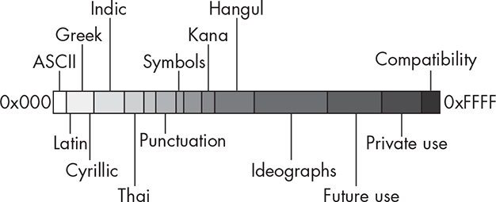

B UNICODE AND UTF-8

Computers store all data as sequences of bits that are essentially

numbers. Numbers are used to represent all of the visual symbols that

we think of as characters, such as the letters of our alphabets, the digits in our numerals, the various punctuation symbols, and the control codes that affect how and where other symbols are printed. Informally,

*characters* are the smallest representable symbols used in a written language, such as the letters of the Roman alphabet, and a *character* *encoding* is an assignment of numbers to a set of characters.

The ASCII character encoding was the most prevalent encoding for

more than 40 years. *ASCII* is the acronym for *American Standard Code* *for Information Interchange*. The ASCII encoding maps characters to 7-bit integers, using the range from 0 to 127 to represent 94 printing

characters, 33 control characters, and the space. Since a byte is usually used to store a character, the eighth bit of the byte is filled with a 0.

Well before the ASCII encoding was defined, IBM defined a different

encoding named *EBCDIC*, which stands for *Extended Binary Coded* *Decimal Interchange*. That encoding assigned an entirely different set of 8-bit numbers to the same characters assigned by the ASCII encoding.

The existence of two different encodings of the same set of characters required programs to be aware of which encoding was used and to

convert from one to the other.

One problem with both the ASCII and EBCDIC codes is that they do not provide a way to encode characters from other scripts, such as

Cyrillic or Greek. They don’t even have encodings of Roman characters

with diacritical marks, such as é, ä, ñ, or ô. Over time, as computer usage extended worldwide, other encodings for different alphabets and scripts were developed, usually with overlapping codes. These encoding

systems conflicted with one another. That is, two encodings could use

the same number for two different characters or use different numbers

for the same character. A program transferring text from one computer

to another would run the risk that the text would be corrupted in the

transfer.

Background

In 1989, to overcome these problems, the International Standards

Organization (ISO) started work on a universal, all-encompassing

character code standard, and in 1990 they published a draft standard

(ISO 10646) called the *Universal Character Set (UCS)*. UCS was

designed as a superset of all other character set standards, providing round-trip compatibility to other character sets. *Round-trip compatibility* asserts that no information is lost if a text string is converted to UCS

and then back to its original encoding.

Simultaneously, the Unicode Project, which was a consortium of

private industrial partners, was working on its own independent

universal character encoding. In 1991, the Unicode Project and ISO

decided to work cooperatively to avoid creating two different character encodings. The result was that the code table created by the Unicode

Consortium, as they are now called, satisfied the original ISO 10646

standard. Over time, the two groups continued to modify the respective standards, but they always remain compatible. Unicode adds new

characters over time, but it always contains the character set defined by ISO 10646- *x*.

Terminology

The Unicode Consortium defines a *character* as an abstract representation of the smallest element of a written language that has

semantic value. The actual appearance or form of a character is called a *glyph*. The letter *a*, for example, is drawn using one of many possible fonts, and so its actual form can vary, but it’s still an *a*. Each different way to render the letter *a* is a different glyph. Glyphs are the shapes that characters take. Character encodings assign numbers to characters, not to glyphs.

The set of all characters used together in a written natural language

is called a *script*, not to be confused with the use of the same term as a type of program. For example, the characters in the Greek language

constitute the Greek script, and the characters used in most of Western Europe are part of the Latin script.

The set of numbers that are assigned to all of the characters in a

script is called its *codespace*. The codespace for Greek, for example, is the set of integers from decimal 880 through 1023, or hexadecimal 0370

through 03FF. An individual number in a codespace is called a *code point*.

In Unicode, a code point is denoted by “U+” followed by a

hexadecimal number from four to eight digits long. For example, the

code point assigned to the Greek character *ψ* is U+03C8, and the one assigned to *ϕ* is U+03C6. Most of the code points in use are four digits long. When a character has been assigned a code point, it’s called an

*encoded character*.

Unicode

Unicode contains the alphabets of almost all known languages,

including Japanese, Chinese, Greek, Cyrillic, Canadian Aboriginal, and Arabic. It was originally a 16-bit character set, but in 1995, with

Unicode 2.0, it became 32 bits. The Unicode Standard encodes

characters in the range U+0000 to U+10FFFF, which is roughly a 21-bit

code space. The code reserves the remaining values for future use

(Figure B-1).

*Figure B-1: Unicode layout*

UTF-8

Unicode code points are just numeric values assigned to characters.

They are not representations of characters as sequences of bytes. For

example, the code point U+03C6 is not a sequence of two bytes

containing 0x03 and 0xC6. If we were to use the number’s ordinary byte representation to encode the character, there would be no way to

distinguish the sequence of two characters with codes 0x03 and 0xC6

from the Greek character *ϕ*.

The mapping of code points to sequences of bytes is called a

*character encoding form*. Because the ordering of bytes in a particular computer system can vary, such as whether it is big-endian or little-endian, the Unicode Consortium defines a *character encoding scheme* as a character encoding form together with a specification of the way in

which the bytes are sequenced.

There are several Unicode character encoding schemes, including

UCS-2, UCS-4, UTF-2, UTF-4, UTF-8, UTF-16, and UTF-32. UCS-

2 and UCS-4 encode Unicode text as sequences of either 2 or 4 bytes,

but these cannot work in a Unix system because strings with these

encodings can contain bytes that match ASCII characters and, in

particular, \0 and /, which have a special meaning in filenames and other

C library function parameters. Unix file systems and tools expect ASCII characters and would fail if they were given 2-byte encodings.

The most prevalent encoding of Unicode as sequences of bytes is

UTF-8, invented by Ken Thompson in 1992. In UTF-8, characters are

encoded with anywhere from 1 to 6 bytes. In other words, the number

of bytes varies with the character. In UTF-8, all ASCII characters are encoded within the 7 least significant bits of a byte whose most

significant bit is 0.

UTF-8 uses the following scheme for encoding Unicode code

points:

Characters U+0000 to U+007F (that is, the ASCII characters) are

encoded simply as bytes 0x00 to 0x7F. This implies that files and

strings that contain only 7-bit ASCII characters have the same

encoding under both ASCII and UTF-8.

All characters larger than U+007F are encoded as a sequence of 2

or more bytes, each of which has the most significant bit set. This

means that no ASCII byte can appear as part of any other character,

because ASCII characters are the only characters whose leading bit

is 0.

The first byte of a multibyte sequence that represents a non-ASCII

character is always in the range 0xC0 to 0xFD and it indicates how

many bytes follow for this character. Specifically, it is one of

110 *xxxxx*, 1110 *xxxx*, 11110 *xxx*, 111110 *xx*, and 1111110 *x*, where the *x*’s may be 0s or 1s. The number of 1-bits following the first 1-bit up until the

next 0-bit is the number of bytes in the rest of the sequence. Thus,

1110 *xxxx* indicates that 2 bytes follow.

All further bytes in a multibyte sequence start with the two bits 10

and are in the range 0x80 to 0xBF. This implies that UTF-8

sequences must be of the following forms in binary, where the *x*’s represent the bits from the code point, with the leftmost *x*-bit being its most significant bit:

0 *xxxxxxx*

110 *xxxxx* 10 *xxxxxx*

1110 *xxxx* 10 *xxxxxx* 10 *xxxxxx*

11110 *xxx* 10 *xxxxxx* 10 *xxxxxx* 10 *xxxxxx*

111110 *xx* 10 *xxxxxx* 10 *xxxxxx* 10 *xxxxxx* 10 *xxxxxx* 1111110 *x* 10 *xxxxxx* 10 *xxxxxx* 10 *xxxxxx* 10 *xxxxxx* 10 *xxxxxx* The bytes 0xFE and 0xFF are never used in the UTF-8 encoding.

A few things can be concluded from these rules. First, the number of

*x*’s in a sequence is the maximum number of bits that a code point can have to be representable in that many bytes. For example, there are 11

*x*-bits in a 2-byte UTF-8 sequence, so all code points whose 16-bit binary value is at least 0000000010000000 but at most 0000011111111111 can be encoded using 2 bytes. (Remember that code points are not bytes, but

integer values that represent characters.) In hexadecimal, these lie

between 0080 and 07FF. Table B-1 shows the ranges of Unicode code points that map to the different UTF-8 sequence lengths.

Table B-1: Code Point Ranges in Unicode 16.0.0

Number of

Number of bits in code

bytes

point

Range

1

7 00000000–0000007F

2

11 00000080–

000007FF

3

16 00000800–

0000FFFF

4

21 00001000–

001FFFFF

5

26 00200000–

03FFFFFF

6

31 04000000–

FFFFFFFF

You can see that although UTF-8 encoded characters may be up to 6 bytes long in theory, code points up to U+FFFF, having at most 16

bits, can be encoded in sequences of at most 3 bytes.

Converting a Unicode code point to UTF-8 by hand is

straightforward using Table B-1:

1\. From the range, determine how many bytes are needed.

2\. Starting with the least significant bit, copy bits from the code point from right to left into the least significant byte.

3\. When the current byte has reached 8 bits including any leading

required bits, continue filling the next most significant byte with

successively more significant bits from the code point.

4\. Repeat until all bits have been copied into the byte sequence,

filling with leading 0s as required.

*Conversion Example 1*

To convert U+05E7 to UTF-8, we first observe that it is in the interval 0080 to 07FF, which requires 2 bytes. We write it in binary as:

0000 0101 1110 0111

The rightmost 6 bits 100111 are placed into the rightmost byte after a leading 2-bit sequence 10

10 100111

and the next least significant 5 bits 10111 are placed into the next byte after a leading 3-bit sequence 110:

110 10111

Therefore, the 2-byte sequence is

11010111 10100111 = 0xD7 0xA7

which is the decimal 215 in the upper byte and 167 in the lower byte.

*Conversion Example 2*

To convert U+0ABC to UTF-8, we observe that it is greater than

U+07FF and therefore it requires a 3-byte code. In binary, its value is: 0000 1010 1011 1100

Following the procedure, the rightmost 6 bits are placed into the

rightmost byte after a leading 10. The next 6 bits are placed into the middle byte after a leading 10. The remaining 4 bits are all 0s, so the leftmost byte is filled with four 0s after a leading 1110. The resulting bytes are, from most significant to least:

11100000

10101010

10111100

The sequence 11100000 10101010 10111100 in hexadecimal is 0xE0 0xAA

0xBC, which in decimal is 224 170 188, the Gujarati sign *nuqta*.

