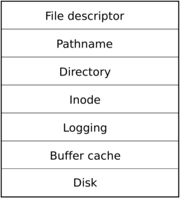

**Chapter 4**  
  
**Locking**  
  
Xv6 runs on multiprocessors: computers with multiple CPUs executing indepen- dently. These multiple CPUs share physical RAM, and xv6 exploits the sharing to maintain data structures that all CPUs read and write. This sharing raises the possibil- ity of one CPU reading a data structure while another CPU is mid-way through up- dating it, or even multiple CPUs updating the same data simultaneously; without care- ful design such parallel access is likely to yield incorrect results or a broken data struc- ture. Even on a uniprocessor, an interrupt routine that uses the same data as some in- terruptible code could damage the data if the interrupt occurs at just the wrong time. Any code that accesses shared data concurrently must have a strategy for main- taining correctness despite concurrency. The concurrency may arise from accesses by multiple cores, or by multiple threads, or by interrupt code. xv6 uses a handful of sim- ple concurrency control strategies; much more sophistication is possible. This chapter focuses on one of the strategies used extensively in xv6 and many other systems: the lock .  
  
A lock provides mutual exclusion, ensuring that only one CPU at a time can hold the lock. If a lock is associated with each shared data item, and the code always holds the associated lock when using a given item, then we can be sure that the item is used from only one CPU at a time. In this situation, we say that the lock protects the data item.  
  
The rest of this chapter explains why xv6 needs locks, how xv6 implements them, and how it uses them. A key observation will be that if you look at some code in xv6, you must ask yourself if another processor (or interrupt) could change the intended behavior of the code by modifying data (or hardware resources) it depends on. You must keep in mind that a single C statement can be several machine instructions and thus another processor or an interrupt may muck around in the middle of a C state- ment. You cannot assume that lines of code on the page are executed atomically. Concurrency makes reasoning about correctness much more difficult.  
  
**Race conditions**  
  
As an example of why we need locks, consider several processors sharing a single disk, such as the IDE disk in xv6. The disk driver maintains a linked list of the out- standing disk requests (4226) and processors may add new requests to the list concur- rently (4354). If there were no concurrent requests, you might implement the linked list as follows:  
  
lock  
  
DRAFT as of September 4, 2018 51 https://pdos.csail.mit.edu/6.828/xv6  
  
CPU 1 15 16  
  
```cpp
Memory l->next list

l->next list
```
  
CPU2 15 16  
  
Time  
  
**Figure 4-1**. Example race  
  
1  
  
2  
  
3  
  
4  
  
5  
  
6  
  
7  
  
8  
  
9  
  
10  
  
11  
  
12  
  
13  
  
14  
  
15  
  
16  
  
17  
  
```cpp
struct list { int data;

struct list *next; };

struct list *list = 0; void

insert(int data) {

struct list *l;

l = malloc(sizeof *l); l->data = data; l->next = list; list = l;

}
```
  
race condition  
  
This implementation is correct if executed in isolation. However, the code is not cor- rect if more than one copy executes concurrently. If two CPUs execute insert at the same time, it could happen that both execute line 15 before either executes 16 (see Figure 4-1). If this happens, there will now be two list nodes with next set to the for- mer value of list. When the two assignments to list happen at line 16, the second one will overwrite the first; the node involved in the first assignment will be lost.  
  
The lost update at line 16 is an example of a race condition. A race condition is a situation in which a memory location is accessed concurrently, and at least one access is a write. A race is often a sign of a bug, either a lost update (if the accesses are writes) or a read of an incompletely-updated data structure. The outcome of a race depends on the exact timing of the two CPUs involved and how their memory opera- tions are ordered by the memory system, which can make race-induced errors difficult to reproduce and debug. For example, adding print statements while debugging in-  
  
DRAFT as of September 4, 2018 52 https://pdos.csail.mit.edu/6.828/xv6  
  
sert might change the timing of the execution enough to make the race disappear. The usual way to avoid races is to use a lock. Locks ensure mutual exclusion, so  
  
that only one CPU can execute insert at a time; this makes the scenario above im- possible. The correctly locked version of the above code adds just a few lines (not numbered):  
  
```cpp
6 struct list *list = 0;

struct lock listlock;

7

8 void

9 insert(int data)

10 {

11 struct list *l;

12 l = malloc(sizeof *l);

13 l->data = data;

14

acquire(&listlock);

15 l->next = list;

16 list = l;

release(&listlock);

17 }
```
  
The sequence of instructions between acquire and release is often called a critical section, and the lock protects list .  
  
When we say that a lock protects data, we really mean that the lock protects some collection of invariants that apply to the data. Invariants are properties of data struc- tures that are maintained across operations. Typically, an operation’s correct behavior depends on the invariants being true when the operation begins. The operation may temporarily violate the invariants but must reestablish them before finishing. For ex- ample, in the linked list case, the invariant is that list points at the first node in the list and that each node’s next field points at the next node. The implementation of insert violates this invariant temporarily: in line 15, l points to the next list element, but list does not point at l yet (reestablished at line 16). The race condition we ex- amined above happened because a second CPU executed code that depended on the list invariants while they were (temporarily) violated. Proper use of a lock ensures that only one CPU at a time can operate on the data structure in the critical section, so that no CPU will execute a data structure operation when the data structure’s invari- ants do not hold.  
  
You can think of locks as serializing concurrent critical sections so that they run one at a time, and thus preserve invariants (assuming they are correct in isolation). You can also think of critical sections as being atomic with respect to each other, so that a critical section that obtains the lock later sees only the complete set of changes from earlier critical sections, and never sees partially-completed updates.  
  
Note that it would also be correct to move up acquire to earlier in insert. For example, it is fine to move the call to acquire up to before line 12. This may reduce paralellism because then the calls to malloc are also serialized. The section "Using locks" below provides some guidelines for where to insert acquire and release invo- cations.  
  
mutual exclusion critical section serializing  
  
DRAFT as of September 4, 2018 53 https://pdos.csail.mit.edu/6.828/xv6  
  
**Code: Locks**  
  
Xv6 has two types of locks: spin-locks and sleep-locks. We’ll start with spin-locks. Xv6 represents a spin-lock as a struct spinlock (1501). The important field in the structure is locked, a word that is zero when the lock is available and non-zero when it is held. Logically, xv6 should acquire a lock by executing code like  
  
```cpp
21 void

22 acquire(struct spinlock *lk)

23 {

24 for(;;) {

25 if(!lk->locked) { 26 lk->locked = 1; 27 break; 28 } 29 } 30 }
```
  
Unfortunately, this implementation does not guarantee mutual exclusion on a multi- processor. It could happen that two CPUs simultaneously reach line 25, see that lk- \>locked is zero, and then both grab the lock by executing line 26. At this point, two different CPUs hold the lock, which violates the mutual exclusion property. Rather than helping us avoid race conditions, this implementation of acquire has its own race condition. The problem here is that lines 25 and 26 executed as separate actions. In order for the routine above to be correct, lines 25 and 26 must execute in one atomic (i.e., indivisible) step.  
  
To execute those two lines atomically, xv6 relies on a special x86 instruction, xchg  
  
(0569). In one atomic operation, xchg swaps a word in memory with the contents of a register. The function acquire (1574) repeats this xchg instruction in a loop; each iter- ation atomically reads lk-\>locked and sets it to 1 (1581). If the lock is already held, lk-\>locked will already be 1, so the xchg returns 1 and the loop continues. If the xchg returns 0, however, acquire has successfully acquired the lock—locked was 0 and is now 1—so the loop can stop. Once the lock is acquired, acquire records, for debugging, the CPU and stack trace that acquired the lock. If a process forgets to re- lease a lock, this information can help to identify the culprit. These debugging fields are protected by the lock and must only be edited while holding the lock.  
  
The function release (1602) is the opposite of acquire: it clears the debugging fields and then releases the lock. The function uses an assembly instruction to clear locked, because clearing this field should be atomic so that the xchg instruction won’t see a subset of the 4 bytes that hold locked updated. The x86 guarantees that a 32-bit movl updates all 4 bytes atomically. Xv6 cannot use a regular C assignment, because the C language specification does not specify that a single assignment is atomic.  
  
Xv6’s implementation of spin-locks is x86-specific, and xv6 is thus not directly portable to other processors. To allow for portable implementations of spin-locks, the C language supports a library of atomic instructions; a portable operating system would use those instructions.  
  
**Code: Using locks**  
  
struct spinlock+code  
  
acquire+code atomic xchg+code acquire+code release+code  
  
DRAFT as of September 4, 2018 54 https://pdos.csail.mit.edu/6.828/xv6  
  
Xv6 uses locks in many places to avoid race conditions. A simple example is in the IDE driver (4200). As mentioned in the beginning of the chapter, iderw (4354) has a queue of disk requests and processors may add new requests to the list concurrently  
  
(4369). To protect this list and other invariants in the driver, iderw acquires the ide- lock (4365) and releases it at the end of the function.  
  
Exercise 1 explores how to trigger the IDE driver race condition that we saw at the beginning of the chapter by moving the acquire to after the queue manipulation. It is worthwhile to try the exercise because it will make clear that it is not that easy to trigger the race, suggesting that it is difficult to find race-conditions bugs. It is not un- likely that xv6 has some races.  
  
A hard part about using locks is deciding how many locks to use and which data and invariants each lock protects. There are a few basic principles. First, any time a variable can be written by one CPU at the same time that another CPU can read or write it, a lock should be introduced to keep the two operations from overlapping. Second, remember that locks protect invariants: if an invariant involves multiple memory locations, typically all of them need to be protected by a single lock to ensure the invariant is maintained.  
  
The rules above say when locks are necessary but say nothing about when locks are unnecessary, and it is important for efficiency not to lock too much, because locks reduce parallelism. If parallelism isn’t important, then one could arrange to have only a single thread and not worry about locks. A simple kernel can do this on a multipro- cessor by having a single lock that must be acquired on entering the kernel and re- leased on exiting the kernel (though system calls such as pipe reads or wait would pose a problem). Many uniprocessor operating systems have been converted to run on multiprocessors using this approach, sometimes called a ‘‘giant kernel lock,’’ but the ap- proach sacrifices parallelism: only one CPU can execute in the kernel at a time. If the kernel does any heavy computation, it would be more efficient to use a larger set of more fine-grained locks, so that the kernel could execute on multiple CPUs simultane- ously.  
  
Ultimately, the choice of lock granularity is an exercise in parallel programming. Xv6 uses a few coarse data-structure specific locks (see Figure 4-2). For example, xv6 has a lock that protects the whole process table and its invariants, which are described in Chapter 5. A more fine-grained approach would be to have a lock per entry in the process table so that threads working on different entries in the process table can pro- ceed in parallel. However, it complicates operations that have invariants over the whole process table, since they might have to acquire several locks. Subsequent chap- ters will discuss how each part of xv6 deals with concurrency, illustrating how to use locks.  
  
**Deadlock and lock ordering**  
  
If a code path through the kernel must hold several locks at the same time, it is im- portant that all code paths acquire the locks in the same order. If they don’t, there is a risk of deadlock. Let’s say two code paths in xv6 need locks A and B, but code path 1 acquires locks in the order A then B, and the other path acquires them in the order B  
  
iderw+code idelock+code  
  
DRAFT as of September 4, 2018 55 https://pdos.csail.mit.edu/6.828/xv6  
  
**Lock Description**  
  
bcache.lock Protects allocation of block buffer cache entries  
  
cons.lock Serializes access to console hardware, avoids intermixed output  
  
ftable.lock Serializes allocation of a struct file in file table  
  
icache.lock Protects allocation of inode cache entries  
  
idelock Serializes access to disk hardware and disk queue  
  
kmem.lock Serializes allocation of memory  
  
log.lock Serializes operations on the transaction log  
  
pipe’s p-\>lock Serializes operations on each pipe  
  
ptable.lock Serializes context switching, and operations on proc-\>state and proctable  
  
tickslock Serializes operations on the ticks counter  
  
inode’s ip-\>lock Serializes operations on each inode and its content  
  
buf’s b-\>lock Serializes operations on each block buffer  
  
**Figure 4-2**. Locks in xv6  
  
then A. This situation can result in a deadlock if two threads execute the code paths concurrently. Suppose thread T1 executes code path 1 and acquires lock A, and thread T2 executes code path 2 and acquires lock B. Next T1 will try to acquire lock B, and T2 will try to acquire lock A. Both acquires will block indefinitely, because in both cases the other thread holds the needed lock, and won’t release it until its acquire re- turns. To avoid such deadlocks, all code paths must acquire locks in the same order. The need for a global lock acquisition order means that locks are effectively part of each function’s specification: callers must invoke functions in a way that causes locks to be acquired in the agreed-on order.  
  
Xv6 has many lock-order chains of length two involving the ptable.lock, due to the way that sleep works as discussed in Chapter 5. For example, ideintr holds the ide lock while calling wakeup, which acquires the ptable lock. The file system code contains xv6’s longest lock chains. For example, creating a file requires simultaneously holding a lock on the directory, a lock on the new file’s inode, a lock on a disk block buffer, idelock, and ptable.lock. To avoid deadlock, file system code always acquires locks in the order mentioned in the previous sentence.  
  
**Interrupt handlers**  
  
Xv6 uses spin-locks in many situations to protect data that is used by both interrupt handlers and threads. For example, a timer interrupt might (3414) increment ticks at about the same time that a kernel thread reads ticks in sys_sleep (3823). The lock tickslock serializes the two accesses.  
  
Interrupts can cause concurrency even on a single processor: if interrupts are en- abled, kernel code can be stopped at any moment to run an interrupt handler instead. Suppose iderw held the idelock and then got interrupted to run ideintr. Ideintr would try to lock idelock, see it was held, and wait for it to be released. In this situ- ation, idelock will never be released—only iderw can release it, and iderw will not continue running until ideintr returns—so the processor, and eventually the whole system, will deadlock.  
  
ideintr+code wakeup+code ptable+code ticks+code sys_sleep+code tickslock+code iderw+code idelock+code ideintr+code  
  
DRAFT as of September 4, 2018 56 https://pdos.csail.mit.edu/6.828/xv6  
  
To avoid this situation, if a spin-lock is used by an interrupt handler, a processor must never hold that lock with interrupts enabled. Xv6 is more conservative: when a processor enters a spin-lock critical section, xv6 always ensures interrupts are disabled on that processor. Interrupts may still occur on other processors, so an interrupt’s ac- quire can wait for a thread to release a spin-lock; just not on the same processor.  
  
xv6 re-enables interrupts when a processor holds no spin-locks; it must do a little book-keeping to cope with nested critical sections. acquire calls pushcli (1667) and release calls popcli (1679) to track the nesting level of locks on the current processor. When that count reaches zero, popcli restores the interrupt enable state that existed at the start of the outermost critical section. The cli and sti functions execute the x86 interrupt disable and enable instructions, respectively.  
  
It is important that acquire call pushcli before the xchg that might acquire the lock (1581). If the two were reversed, there would be a few instruction cycles when the lock was held with interrupts enabled, and an unfortunately timed interrupt would deadlock the system. Similarly, it is important that release call popcli only after the xchg that releases the lock (1581) .  
  
**Instruction and memory ordering**  
  
This chapter has assumed that code executes in the order in which the code ap- pears in the program. Many compilers and processors, however, execute code out of order to achieve higher performance. If an instruction takes many cycles to complete, a processor may want to issue the instruction early so that it can overlap with other instructions and avoid processor stalls. For example, a processor may notice that in a serial sequence of instructions A and B are not dependent on each other and start in- struction B before A so that it will be completed when the processor completes A. A compiler may perform a similar re-ordering by emitting instruction B before instruc- tion A in the executable file. Concurrency, however, may expose this reordering to software, which can lead to incorrect behavior.  
  
For example, in this code for insert, it would be a disaster if the compiler or processor caused the effects of line 4 (or 2 or 5) to be visible to other cores after the effects of line 6:  
  
```cpp
1 l = malloc(sizeof *l);

2 l->data = data;

3 acquire(&listlock);

4 l->next = list;

5 list = l;

6 release(&listlock);
```
  
If the hardware or compiler would re-order, for example, the effects of line 4 to be vis- ible after line 6, then another processor can acquire listlock and observe that list points to l, but it won’t observe that l-\>next is set to the remainder of the list and won’t be able to read the rest of the list.  
  
To tell the hardware and compiler not to perform such re-orderings, xv6 uses \_\_sync_synchronize(), in both acquire and release. \_sync_synchronize() is a memory barrier: it tells the compiler and CPU to not reorder loads or stores across  
  
pushcli+code popcli+code acquire+code xchg+code release+code popcli+code xchg+code  
  
DRAFT as of September 4, 2018 57 https://pdos.csail.mit.edu/6.828/xv6  
  
the barrier. Xv6 worries about ordering only in acquire and release, because con- current access to data structures other than the lock structure is performed between acquire and release .  
  
**Sleep locks**  
  
Sometimes xv6 code needs to hold a lock for a long time. For example, the file system (Chapter 6) keeps a file locked while reading and writing its content on the disk, and these disk operations can take tens of milliseconds. Efficiency demands that the processor be yielded while waiting so that other threads can make progress, and this in turn means that xv6 needs locks that work well when held across context switches. Xv6 provides such locks in the form of sleep-locks .  
  
Xv6 sleep-locks support yielding the processor during their critical sections. This property poses a design challenge: if thread T1 holds lock L1 and has yielded the pro- cessor, and thread T2 wishes to acquire L1, we have to ensure that T1 can execute while T2 is waiting so that T1 can release L1. T2 can’t use the spin-lock acquire func- tion here: it spins with interrupts turned off, and that would prevent T1 from running. To avoid this deadlock, the sleep-lock acquire routine (called acquiresleep) yields the processor while waiting, and does not disable interrupts.  
  
acquiresleep (4622) uses techniques that will be explained in Chapter 5. At a high level, a sleep-lock has a locked field that is protected by a spinlock, and ac- quiresleep’s call to sleep atomically yields the CPU and releases the spin-lock. The result is that other threads can execute while acquiresleep waits.  
  
Because sleep-locks leave interrupts enabled, they cannot be used in interrupt handlers. Because acquiresleep may yield the processor, sleep-locks cannot be used inside spin-lock critical sections (though spin-locks can be used inside sleep-lock criti- cal sections).  
  
Xv6 uses spin-locks in most situations, since they have low overhead. It uses sleep-locks only in the file system, where it is convenient to be able to hold locks across lengthy disk operations.  
  
**Limitations of locks**  
  
Locks often solve concurrency problems cleanly, but there are times when they are awkward. Subsequent chapters will point out such situations in xv6; this section out- lines some of the problems that come up.  
  
Sometimes a function uses data which must be guarded by a lock, but the func- tion is called both from code that already holds the lock and from code that wouldn’t otherwise need the lock. One way to deal with this is to have two variants of the function, one that acquires the lock, and the other that expects the caller to already hold the lock; see wakeup1 for an example (2953). Another approach is for the function to require callers to hold the lock whether the caller needs it or not, as with sched  
  
(2758). Kernel developers need to be aware of such requirements.  
  
It might seem that one could simplify situations where both caller and callee need a lock by allowing recursive locks, so that if a function holds a lock, any function it  
  
sleep-locks recursive locks  
  
DRAFT as of September 4, 2018 58 https://pdos.csail.mit.edu/6.828/xv6  
  
calls is allowed to re-acquire the lock. However, the programmer would then need to reason about all combinations of caller and callee, because it will no longer be the case that the data structure’s invariants always hold after an acquire. Whether recursive locks are better than xv6’s use of conventions about functions that require a lock to be held is not clear. The larger lesson is that (as with global lock ordering to avoid dead- lock) lock requirements sometimes can’t be private, but intrude themselves on the in- terfaces of functions and modules.  
  
A situation in which locks are insufficient is when one thread needs to wait for another thread’s update to a data structure, for example when a pipe’s reader waits for some other thread to write the pipe. The waiting thread cannot hold the lock on the data, since that would prevent the update it is waiting for. Instead, xv6 provides a sepa- rate mechanism that jointly manages the lock and event wait; see the description of sleep and wakeup in Chapter 5.  
  
**Real world**  
  
Concurrency primitives and parallel programming are active areas of research, because programming with locks is still challenging. It is best to use locks as the base for higher-level constructs like synchronized queues, although xv6 does not do this. If you program with locks, it is wise to use a tool that attempts to identify race conditions, because it is easy to miss an invariant that requires a lock.  
  
Most operating systems support POSIX threads (Pthreads), which allow a user process to have several threads running concurrently on different processors. Pthreads has support for user-level locks, barriers, etc. Supporting Pthreads requires support from the operating system. For example, it should be the case that if one pthread blocks in a system call, another pthread of the same process should be able to run on that processor. As another example, if a pthread changes its process’s address space (e.g., grow or shrink it), the kernel must arrange that other processors that run threads of the same process update their hardware page tables to reflect the change in the ad- dress space. On the x86, this involves shooting down the Translation Look-aside Buffer (TLB) of other processors using inter-processor interrupts (IPIs).  
  
It is possible to implement locks without atomic instructions, but it is expensive, and most operating systems use atomic instructions.  
  
Locks can be expensive if many processors try to acquire the same lock at the same time. If one processor has a lock cached in its local cache, and another proces- sor must acquire the lock, then the atomic instruction to update the cache line that holds the lock must move the line from the one processor’s cache to the other proces- sor’s cache, and perhaps invalidate any other copies of the cache line. Fetching a cache line from another processor’s cache can be orders of magnitude more expensive than fetching a line from a local cache.  
  
To avoid the expenses associated with locks, many operating systems use lock-free data structures and algorithms. For example, it is possible to implement a linked list like the one in the beginning of the chapter that requires no locks during list searches, and one atomic instruction to insert an item in a list. Lock-free programming is more complicated, however, than programming locks; for example, one must worry about in-  
  
Translation Look- aside Buffer (TLB)  
  
DRAFT as of September 4, 2018 59 https://pdos.csail.mit.edu/6.828/xv6  
  
struction and memory reordering. Programming with locks is already hard, so xv6 avoids the additional complexity of lock-free programming.  
  
**Exercises**  
  
1. Move the acquire in iderw to before sleep. Is there a race? Why don’t you observe it when booting xv6 and run stressfs? Increase critical section with a dummy loop; what do you see now? explain.  
  
2. Remove the xchg in acquire. Explain what happens when you run xv6?  
  
3. Write a parallel program using POSIX threads, which is supported on most op- erating systems. For example, implement a parallel hash table and measure if the num- ber of puts/gets scales with increasing number of cores.  
  
4. Implement a subset of Pthreads in xv6. That is, implement a user-level thread library so that a user process can have more than 1 thread and arrange that these threads can run in parallel on different processors. Come up with a design that cor- rectly handles a thread making a blocking system call and changing its shared address space.  
  
DRAFT as of September 4, 2018 60 https://pdos.csail.mit.edu/6.828/xv6  
  
**Chapter 5**  
  
**Scheduling**  
  
Any operating system is likely to run with more processes than the computer has processors, so a plan is needed to time-share the processors among the processes. Ide- ally the sharing would be transparent to user processes. A common approach is to provide each process with the illusion that it has its own virtual processor by multi- plexing the processes onto the hardware processors. This chapter explains how xv6 achieves this multiplexing.  
  
**Multiplexing**  
  
Xv6 multiplexes by switching each processor from one process to another in two situations. First, xv6’s sleep and wakeup mechanism switches when a process waits for device or pipe I/O to complete, or waits for a child to exit, or waits in the sleep sys- tem call. Second, xv6 periodically forces a switch when a process is executing user in- structions. This multiplexing creates the illusion that each process has its own CPU, just as xv6 uses the memory allocator and hardware page tables to create the illusion that each process has its own memory.  
  
Implementing multiplexing poses a few challenges. First, how to switch from one process to another? Although the idea of context switching is simple, the implementa- tion is some of the most opaque code in xv6. Second, how to switch transparently to user processes? Xv6 uses the standard technique of driving context switches with timer interrupts. Third, many CPUs may be switching among processes concurrently, and a locking plan is necessary to avoid races. Fourth, a process’s memory and other resources must be freed when the process exits, but it cannot do all of this itself be- cause (for example) it can’t free its own kernel stack while still using it. Finally, each core of a multi-core machine must remember which process it is executing so that sys- tem calls affect the correct process’s kernel state. Xv6 tries to solve these problems as simply as possible, but nevertheless the resulting code is tricky.  
  
xv6 must provide ways for processes to coordinate among themselves. For exam- ple, a parent process may need to wait for one of its children to exit, or a process reading a pipe may need to wait for some other process to write the pipe. Rather than make the waiting process waste CPU by repeatedly checking whether the desired event has happened, xv6 allows a process to give up the CPU and sleep waiting for an event, and allows another process to wake the first process up. Care is needed to avoid races that result in the loss of event notifications. As an example of these problems and their solution, this chapter examines the implementation of pipes.  
  
**Code: Context switching**  
  
multiplexing  
  
DRAFT as of September 4, 2018 61 https://pdos.csail.mit.edu/6.828/xv6  
  
user space  
  
shell  
  
cat  
  
save swtch swtch restore  
  
kernel space  
  
kstack shell  
  
kstack scheduler  
  
kstack cat  
  
Kernel  
  
**Figure 5-1**. Switching from one user process to another. In this example, xv6 runs with one CPU (and thus one scheduler thread).  
  
Figure 5-1 outlines the steps involved in switching from one user process to an- other: a user-kernel transition (system call or interrupt) to the old process’s kernel thread, a context switch to the current CPU’s scheduler thread, a context switch to a new process’s kernel thread, and a trap return to the user-level process. The xv6 scheduler has its own thread (saved registers and stack) because it is sometimes not safe for it execute on any process’s kernel stack; we’ll see an example in exit. In this section we’ll examine the mechanics of switching between a kernel thread and a sched- uler thread.  
  
Switching from one thread to another involves saving the old thread’s CPU regis- ters, and restoring the previously-saved registers of the new thread; the fact that %esp and %eip are saved and restored means that the CPU will switch stacks and switch what code it is executing.  
  
The function swtch performs the saves and restores for a thread switch. swtch doesn’t directly know about threads; it just saves and restores register sets, called con- texts. When it is time for a process to give up the CPU, the process’s kernel thread calls swtch to save its own context and return to the scheduler context. Each context is represented by a struct context\*, a pointer to a structure stored on the kernel stack involved. Swtch takes two arguments: struct context \*\*old and struct context \*new. It pushes the current registers onto the stack and saves the stack point- er in \*old. Then swtch copies new to %esp, pops previously saved registers, and re- turns.  
  
Let’s follow a user process through swtch into the scheduler. We saw in Chapter 3 that one possibility at the end of each interrupt is that trap calls yield. Yield in turn calls sched, which calls swtch to save the current context in proc-\>context and switch to the scheduler context previously saved in cpu-\>scheduler (2822) .  
  
Swtch (3052) starts by copying its arguments from the stack to the caller-saved reg- isters %eax and %edx (3060-3061); swtch must do this before it changes the stack pointer and can no longer access the arguments via %esp. Then swtch pushes the register state, creating a context structure on the current stack. Only the callee-saved registers need to be saved; the convention on the x86 is that these are %ebp, %ebx, %esi,  
  
swtch+code contexts  
  
struct context+code trap+code yield+code sched+code swtch+code cpu- \>scheduler+code swtch+code  
  
DRAFT as of September 4, 2018 62 https://pdos.csail.mit.edu/6.828/xv6  
  
%edi, and %esp. Swtch pushes the first four explicitly (3064-3067); it saves the last im- plicitly as the struct context\* written to \*old (3070). There is one more important register: the program counter %eip. It has already been saved on the stack by the call instruction that invoked swtch. Having saved the old context, swtch is ready to restore the new one. It moves the pointer to the new context into the stack pointer  
  
(3071). The new stack has the same form as the old one that swtch just left—the new stack was the old one in a previous call to swtch—so swtch can invert the sequence to restore the new context. It pops the values for %edi, %esi, %ebx, and %ebp and then returns (3074-3078). Because swtch has changed the stack pointer, the values re- stored and the instruction address returned to are the ones from the new context.  
  
In our example, sched called swtch to switch to cpu-\>scheduler, the per-CPU scheduler context. That context had been saved by scheduler’s call to swtch (2781) . When the swtch we have been tracing returns, it returns not to sched but to sched- uler, and its stack pointer points at the current CPU’s scheduler stack.  
  
**Code: Scheduling**  
  
The last section looked at the low-level details of swtch; now let’s take swtch as a given and examine switching from a process through the scheduler to another process. A process that wants to give up the CPU must acquire the process table lock pt- able.lock, release any other locks it is holding, update its own state (proc-\>state ), and then call sched. Yield (2828) follows this convention, as do sleep and exit , which we will examine later. Sched double-checks those conditions (2813-2818) and then an implication of those conditions: since a lock is held, the CPU should be running with interrupts disabled. Finally, sched calls swtch to save the current context in proc-\>context and switch to the scheduler context in cpu-\>scheduler. Swtch re- turns on the scheduler’s stack as though scheduler’s swtch had returned (2781). The scheduler continues the for loop, finds a process to run, switches to it, and the cycle repeats.  
  
We just saw that xv6 holds ptable.lock across calls to swtch: the caller of swtch must already hold the lock, and control of the lock passes to the switched-to code. This convention is unusual with locks; usually the thread that acquires a lock is also responsible for releasing the lock, which makes it easier to reason about correct- ness. For context switching it is necessary to break this convention because pt- able.lock protects invariants on the process’s state and context fields that are not true while executing in swtch. One example of a problem that could arise if pt- able.lock were not held during swtch: a different CPU might decide to run the pro- cess after yield had set its state to RUNNABLE, but before swtch caused it to stop using its own kernel stack. The result would be two CPUs running on the same stack, which cannot be right.  
  
A kernel thread always gives up its processor in sched and always switches to the same location in the scheduler, which (almost) always switches to some kernel thread that previously called sched. Thus, if one were to print out the line numbers where xv6 switches threads, one would observe the following simple pattern: (2781), (2822) ,  
  
(2781), (2822), and so on. The procedures in which this stylized switching between two  
  
swtch+code sched+code swtch+code cpu- \>scheduler+code swtch+code scheduler+code swtch+code ptable.lock+code sched+code sleep+code exit+code sched+code swtch+code cpu- \>scheduler+code scheduler+code ptable.lock+code swtch+code ptable.lock+code swtch+code yield+code  
  
DRAFT as of September 4, 2018 63 https://pdos.csail.mit.edu/6.828/xv6  
  
threads happens are sometimes referred to as coroutines; in this example, sched and scheduler are co-routines of each other.  
  
There is one case when the scheduler’s call to swtch does not end up in sched . We saw this case in Chapter 2: when a new process is first scheduled, it begins at forkret (2853). Forkret exists to release the ptable.lock; otherwise, the new process could start at trapret .  
  
Scheduler (2758) runs a simple loop: find a process to run, run it until it yields, repeat. scheduler holds ptable.lock for most of its actions, but releases the lock (and explicitly enables interrupts) once in each iteration of its outer loop. This is im- portant for the special case in which this CPU is idle (can find no RUNNABLE process). If an idling scheduler looped with the lock continuously held, no other CPU that was running a process could ever perform a context switch or any process-related system call, and in particular could never mark a process as RUNNABLE so as to break the idling CPU out of its scheduling loop. The reason to enable interrupts periodically on an idling CPU is that there might be no RUNNABLE process because processes (e.g., the shell) are waiting for I/O; if the scheduler left interrupts disabled all the time, the I/O would never arrive.  
  
The scheduler loops over the process table looking for a runnable process, one that has p-\>state == RUNNABLE. Once it finds a process, it sets the per-CPU current process variable proc, switches to the process’s page table with switchuvm, marks the process as RUNNING, and then calls swtch to start running it (2774-2781) .  
  
One way to think about the structure of the scheduling code is that it arranges to enforce a set of invariants about each process, and holds ptable.lock whenever those invariants are not true. One invariant is that if a process is RUNNING, a timer inter- rupt’s yield must be able to switch away from the process; this means that the CPU registers must hold the process’s register values (i.e. they aren’t actually in a context ), %cr3 must refer to the process’s pagetable, %esp must refer to the process’s kernel stack so that swtch can push registers correctly, and proc must refer to the process’s proc\[\] slot. Another invariant is that if a process is RUNNABLE, an idle CPU’s scheduler must be able to run it; this means that p-\>context must hold the process’s kernel thread variables, that no CPU is executing on the process’s kernel stack, that no CPU’s %cr3 refers to the process’s page table, and that no CPU’s proc refers to the process. Maintaining the above invariants is the reason why xv6 acquires ptable.lock in  
  
one thread (often in yield) and releases the lock in a different thread (the scheduler thread or another next kernel thread). Once the code has started to modify a running process’s state to make it RUNNABLE, it must hold the lock until it has finished restoring the invariants: the earliest correct release point is after scheduler stops using the pro- cess’s page table and clears proc. Similarly, once scheduler starts to convert a runnable process to RUNNING, the lock cannot be released until the kernel thread is completely running (after the swtch, e.g. in yield ).  
  
ptable.lock protects other things as well: allocation of process IDs and free process table slots, the interplay between exit and wait, the machinery to avoid lost wakeups (see next section), and probably other things too. It might be worth thinking about whether the different functions of ptable.lock could be split up, certainly for clarity and perhaps for performance.  
  
coroutines sched+code scheduler+code swtch+code sched+code forkret+code ptable.lock+code scheduler+code ptable.lock+code RUNNABLE+code switchuvm+code swtch+code ptable.lock+code yield+code RUNNABLE+code scheduler+code p-\>context+code ptable.lock+code ptable.lock+code exit+code wait+code  
  
DRAFT as of September 4, 2018 64 https://pdos.csail.mit.edu/6.828/xv6  
  
**Code: mycpu and myproc**  
  
xv6 maintains a struct cpu for each processor, which records the process cur- rently running on the processor (if any), the processor’s unique hardware identifier (apicid), and some other information. The function mycpu (2437) returns the current processor’s struct cpu. mycpu does this by reading the processor identifier from the local APIC hardware and looking through the array of struct cpu for an entry with that identifier. The return value of mycpu is fragile: if the timer were to interrupt and cause the thread to be moved to a different processor, the return value would no longer be correct. To avoid this problem, xv6 requires that callers of mycpu disable in- terrupts, and only enable them after they finish using the returned struct cpu .  
  
The function myproc (2457) returns the struct proc pointer for the process that is running on the current processor. myproc disables interrupts, invokes mycpu, fetches the current process pointer (c-\>proc) out of the struct cpu, and then enables inter- rupts. If there is no process running, because the the caller is executing in scheduler , myproc returns zero. The return value of myproc is safe to use even if interrupts are enabled: if a timer interrupt moves the calling process to a different processor, its struct proc pointer will stay the same.  
  
**Sleep and wakeup**  
  
Scheduling and locks help conceal the existence of one process from another, but so far we have no abstractions that help processes intentionally interact. Sleep and wakeup fill that void, allowing one process to sleep waiting for an event and another process to wake it up once the event has happened. Sleep and wakeup are often called sequence coordination or conditional synchronization mechanisms, and there are many other similar mechanisms in the operating systems literature.  
  
To illustrate what we mean, let’s consider a simple producer/consumer queue. This queue is similar to the one that feeds commands from processes to the IDE driv- er (see Chapter 3), but abstracts away all IDE-specific code. The queue allows one process to send a nonzero pointer to another process. If there were only one sender and one receiver, and they executed on different CPUs, and the compiler didn’t opti- mize too agressively, this implementation would be correct:  
  
```cpp
100 struct q { 101 void *ptr; 102 };

103

104 void*

105 send(struct q *q, void *p)

106 {

107 while(q->ptr != 0)

108 ; 109 q->ptr = p; 110 }

111

struct cpu+code mycpu+code myproc+code sequence coordination conditional synchronization
```
  
DRAFT as of September 4, 2018 65 https://pdos.csail.mit.edu/6.828/xv6  
  
112  
  
113  
  
114  
  
115  
  
116  
  
117  
  
118  
  
119  
  
120  
  
121  
  
```cpp
void*

recv(struct q *q) {

void *p;

while((p = q->ptr) == 0) ;

q->ptr = 0;

return p;

}
```
  
busy waiting polling sleep+code wakeup+code chan+code wait channel  
  
Send loops until the queue is empty (ptr == 0) and then puts the pointer p in the queue. Recv loops until the queue is non-empty and takes the pointer out. When run in different processes, send and recv both modify q-\>ptr, but send only writes the pointer when it is zero and recv only writes the pointer when it is nonzero, so no up- dates are lost.  
  
The implementation above is expensive. If the sender sends rarely, the receiver will spend most of its time spinning in the while loop hoping for a pointer. The re- ceiver’s CPU could find more productive work than busy waiting by repeatedly polling q-\>ptr. Avoiding busy waiting requires a way for the receiver to yield the CPU and resume only when send delivers a pointer.  
  
Let’s imagine a pair of calls, sleep and wakeup, that work as follows. Sleep(chan) sleeps on the arbitrary value chan, called the wait channel. Sleep puts the calling process to sleep, releasing the CPU for other work. Wakeup(chan) wakes all processes sleeping on chan (if any), causing their sleep calls to return. If no pro- cesses are waiting on chan, wakeup does nothing. We can change the queue imple- mentation to use sleep and wakeup :  
  
```cpp
201 void*

202 send(struct q *q, void *p)

203 {

204 while(q->ptr != 0)

205 ;

206 q->ptr = p;

207 wakeup(q); /* wake recv */

208 }

209

210

void*

211 recv(struct q *q)

212 {

213 void *p;

214

215

while((p = q->ptr) == 0)

216 sleep(q);

217 q->ptr = 0;

218 return p;

219 }

Recv now gives up the CPU instead of spinning, which is nice. However, it turns out not to be straightforward to design sleep and wakeup with this interface without suffering from what is known as the ‘‘lost wake-up’’ problem (see Figure 5-2). Suppose that recv finds that q->ptr == 0 on line 215. While recv is between lines 215 and
```
  
DRAFT as of September 4, 2018 66 https://pdos.csail.mit.edu/6.828/xv6  
  
re cv send  
  
215  
  
test  
  
216  
  
sleep  
  
wait for wakeup forever Time  
  
206  
  
store p  
  
207  
  
wakeup  
  
204  
  
test  
  
205  
  
spin forever  
  
**Figure 5-2**. Example lost wakeup problem  
  
216, send runs on another CPU: it changes q-\>ptr to be nonzero and calls wakeup , which finds no processes sleeping and thus does nothing. Now recv continues execut- ing at line 216: it calls sleep and goes to sleep. This causes a problem: recv is asleep waiting for a pointer that has already arrived. The next send will wait for recv to consume the pointer in the queue, at which point the system will be deadlocked .  
  
```cpp
The root of this problem is that the invariant that recv only sleeps when q->ptr == 0 is violated by send running at just the wrong moment. One incorrect way of protecting the invariant would be to modify the code for recv as follows:

300 struct q {

301 struct spinlock lock;

302 void *ptr;

303 };

304

305 void*

306 send(struct q *q, void *p)

307 {

308 acquire(&q->lock); 309 while(q->ptr != 0) 310 ;

311 q->ptr = p;

312 wakeup(q); 313 release(&q->lock); 314 }

315

316 void*

317 recv(struct q *q)

318 {

319 void *p;

320

321 acquire(&q->lock); 322 while((p = q->ptr) == 0) 323 sleep(q);

324 q->ptr = 0;

325 release(&q->lock);

326 return p;

327 }
```
  
One might hope that this version of recv would avoid the lost wakeup because the  
  
deadlocked  
  
DRAFT as of September 4, 2018 67 https://pdos.csail.mit.edu/6.828/xv6  
  
lock prevents send from executing between lines 322 and 323. It does that, but it also deadlocks: recv holds the lock while it sleeps, so the sender will block forever waiting for the lock.  
  
We’ll fix the preceding scheme by changing sleep’s interface: the caller must pass the lock to sleep so it can release the lock after the calling process is marked as asleep and waiting on the sleep channel. The lock will force a concurrent send to wait until the receiver has finished putting itself to sleep, so that the wakeup will find the sleeping receiver and wake it up. Once the receiver is awake again sleep reacquires the lock before returning. Our new correct scheme is useable as follows:  
  
```cpp
400 struct q {

401 struct spinlock lock;

402 void *ptr;

403 };

404

405 void*

406 send(struct q *q, void *p)

407 {

408 acquire(&q->lock); 409 while(q->ptr != 0) 410 ;

411 q->ptr = p;

412 wakeup(q); 413 release(&q->lock); 414 }

415

416 void*

417 recv(struct q *q)

418 {

419 void *p;

420

421 acquire(&q->lock); 422 while((p = q->ptr) == 0) 423 sleep(q, &q->lock); 424 q->ptr = 0;

425 release(&q->lock);

426 return p;

427 }

The fact that recv holds q->lock prevents send from trying to wake it up be- tween recv’s check of q->ptr and its call to sleep. We need sleep to atomically re- lease q->lock and put the receiving process to sleep.
```
  
A complete sender/receiver implementation would also sleep in send when wait- ing for a receiver to consume the value from a previous send .  
  
**Code: Sleep and wakeup**  
  
Let’s look at the implementation of sleep (2874) and wakeup (2953). The basic idea is to have sleep mark the current process as SLEEPING and then call sched to release the processor; wakeup looks for a process sleeping on the given wait channel and marks it as RUNNABLE. Callers of sleep and wakeup can use any mutually convenient  
  
sleep+code sleep+code wakeup+code SLEEPING+code sched+code RUNNABLE+code  
  
DRAFT as of September 4, 2018 68 https://pdos.csail.mit.edu/6.828/xv6  
  
number as the channel. Xv6 often uses the address of a kernel data structure involved in the waiting.  
  
Sleep (2874) begins with a few sanity checks: there must be a current process  
  
(2878) and sleep must have been passed a lock (2881-2882). Then sleep acquires pt- able.lock (2891). Now the process going to sleep holds both ptable.lock and lk . Holding lk was necessary in the caller (in the example, recv): it ensured that no other process (in the example, one running send) could start a call to wakeup(chan). Now that sleep holds ptable.lock, it is safe to release lk: some other process may start a call to wakeup(chan), but wakeup will not run until it can acquire ptable.lock, so it must wait until sleep has finished putting the process to sleep, keeping the wakeup from missing the sleep .  
  
There is a minor complication: if lk is equal to &ptable.lock, then sleep would deadlock trying to acquire it as &ptable.lock and then release it as lk. In this case, sleep considers the acquire and release to cancel each other out and skips them en- tirely (2890). For example, wait (2964) calls sleep with &ptable.lock .  
  
Now that sleep holds ptable.lock and no others, it can put the process to sleep by recording the sleep channel, changing the process state, and calling sched (2895-2898) . At some point later, a process will call wakeup(chan). Wakeup (2964) acquires pt- able.lock and calls wakeup1, which does the real work. It is important that wakeup hold the ptable.lock both because it is manipulating process states and because, as we just saw, ptable.lock makes sure that sleep and wakeup do not miss each other. Wakeup1 is a separate function because sometimes the scheduler needs to execute a wakeup when it already holds the ptable.lock; we will see an example of this later. Wakeup1 (2953) loops over the process table. When it finds a process in state SLEEPING with a matching chan, it changes that process’s state to RUNNABLE. The next time the scheduler runs, it will see that the process is ready to be run.  
  
Xv6 code always calls wakeup while holding the lock that guards the sleep condi- tion; in the example above that lock is q-\>lock. Strictly speaking it is sufficient if wakeup always follows the acquire (that is, one could call wakeup after the release ). Why do the locking rules for sleep and wakeup ensure a sleeping process won’t miss a wakeup it needs? The sleeping process holds either the lock on the condition or the ptable.lock or both from a point before it checks the condition to a point after it is marked as sleeping. If a concurrent thread causes the condition to be true, that thread must either hold the lock on the condition before the sleeping thread acquired it, or after the sleeping thread released it in sleep. If before, the sleeping thread must have seen the new condition value, and decided to sleep anyway, so it doesn’t matter if it misses the wakeup. If after, then the earliest the waker could acquire the lock on the condition is after sleep acquires ptable.lock, so that wakeup’s acquisition of pt- able.lock must wait until sleep has completely finished putting the sleeper to sleep. Then wakeup will see the sleeping process and wake it up (unless something else wakes it up first).  
  
It is sometimes the case that multiple processes are sleeping on the same channel; for example, more than one process reading from a pipe. A single call to wakeup will wake them all up. One of them will run first and acquire the lock that sleep was called with, and (in the case of pipes) read whatever data is waiting in the pipe. The  
  
ptable.lock+code wakeup+code ptable.lock+code ptable.lock+code wakeup1+code wakeup+code SLEEPING+code chan+code RUNNABLE+code  
  
DRAFT as of September 4, 2018 69 https://pdos.csail.mit.edu/6.828/xv6  
  
other processes will find that, despite being woken up, there is no data to be read. From their point of view the wakeup was ‘‘spurious,’’ and they must sleep again. For this reason sleep is always called inside a loop that checks the condition.  
  
No harm is done if two uses of sleep/wakeup accidentally choose the same chan- nel: they will see spurious wakeups, but looping as described above will tolerate this problem. Much of the charm of sleep/wakeup is that it is both lightweight (no need to create special data structures to act as sleep channels) and provides a layer of indirec- tion (callers need not know which specific process they are interacting with).  
  
**Code: Pipes**  
  
The simple queue we used earlier in this chapter was a toy, but xv6 contains two real queues that use sleep and wakeup to synchronize readers and writers. One is in the IDE driver: a process adds a disk request to a queue and then calls sleep. The IDE interrupt handler uses wakeup to alert the process that its request has completed.  
  
A more complex example is the implementation of pipes. We saw the interface for pipes in Chapter 0: bytes written to one end of a pipe are copied in an in-kernel buffer and then can be read out of the other end of the pipe. Future chapters will ex- amine the file descriptor support surrounding pipes, but let’s look now at the imple- mentations of pipewrite and piperead .  
  
```cpp
Each pipe is represented by a struct pipe, which contains a lock and a data buffer. The fields nread and nwrite count the number of bytes read from and written to the buffer. The buffer wraps around: the next byte written after buf[PIPESIZE-1] is buf[0]. The counts do not wrap. This convention lets the implementation distin- guish a full buffer (nwrite == nread+PIPESIZE) from an empty buffer (nwrite == nread), but it means that indexing into the buffer must use buf[nread % PIPESIZE] instead of just buf[nread] (and similarly for nwrite). Let’s suppose that calls to piperead and pipewrite happen simultaneously on two different CPUs.

Pipewrite (6830) begins by acquiring the pipe’s lock, which protects the counts, the data, and their associated invariants. Piperead (6851) then tries to acquire the lock too, but cannot. It spins in acquire (1574) waiting for the lock. While piperead waits, pipewrite loops over the bytes being written—addr[0], addr[1], ..., addr[n- 1]—adding each to the pipe in turn (6844). During this loop, it could happen that the buffer fills (6836). In this case, pipewrite calls wakeup to alert any sleeping readers to the fact that there is data waiting in the buffer and then sleeps on &p->nwrite to wait for a reader to take some bytes out of the buffer. Sleep releases p->lock as part of putting pipewrite’s process to sleep.

Now that p->lock is available, piperead manages to acquire it and enters its crit- ical section: it finds that p->nread != p->nwrite (6856) (pipewrite went to sleep be- cause p->nwrite == p->nread+PIPESIZE (6836)) so it falls through to the for loop, copies data out of the pipe (6863-6867), and increments nread by the number of bytes copied. That many bytes are now available for writing, so piperead calls wakeup (6868)
```
  
to wake any sleeping writers before it returns to its caller. Wakeup finds a process sleeping on &p-\>nwrite, the process that was running pipewrite but stopped when the buffer filled. It marks that process as RUNNABLE .  
  
pipewrite+code piperead+code struct pipe+code RUNNABLE+code  
  
DRAFT as of September 4, 2018 70 https://pdos.csail.mit.edu/6.828/xv6  
  
The pipe code uses separate sleep channels for reader and writer ( p-\>nread and p-\>nwrite); this might make the system more efficient in the unlikely event that there are lots of readers and writers waiting for the same pipe. The pipe code sleeps inside a loop checking the sleep condition; if there are multiple readers or writers, all but the first process to wake up will see the condition is still false and sleep again.  
  
**Code: Wait, exit, and kill**  
  
Sleep and wakeup can be used for many kinds of waiting. An interesting example, seen in Chapter 0, is the wait system call that a parent process uses to wait for a child to exit. When a child exits, it does not die immediately. Instead, it switches to the ZOMBIE process state until the parent calls wait to learn of the exit. The parent is then responsible for freeing the memory associated with the process and preparing the struct proc for reuse. If the parent exits before the child, the init process adopts the child and waits for it, so that every child has a parent to clean up after it.  
  
An implementation challenge is the possibility of races between parent and child wait and exit, as well as exit and exit. Wait begins by acquiring ptable.lock . Then it scans the process table looking for children. If wait finds that the current process has children but that none have exited, it calls sleep to wait for one of them to exit (2707) and scans again. Here, the lock being released in sleep is ptable.lock , the special case we saw above.  
  
Exit acquires ptable.lock and then wakes up any process sleeping on a wait channel equal to the current process’s parent proc (2651); if there is such a process, it will be the parent in wait. This may look premature, since exit has not marked the current process as a ZOMBIE yet, but it is safe: although wakeup may cause the parent to run, the loop in wait cannot run until exit releases ptable.lock by calling sched to enter the scheduler, so wait can’t look at the exiting process until after exit has set its state to ZOMBIE (2663). Before exit yields the processor, it reparents all of the exiting process’s children, passing them to the initproc (2653-2660). Finally, exit calls sched to relinquish the CPU.  
  
```cpp
If the parent process was sleeping in wait, the scheduler will eventually run it. The call to sleep returns holding ptable.lock; wait rescans the process table and finds the exited child with state == ZOMBIE. (2657). It records the child’s pid and then cleans up the struct proc, freeing the memory associated with the process (2687-2694) . The child process could have done most of the cleanup during exit, but it is im- portant that the parent process be the one to free p->kstack and p->pgdir: when the child runs exit, its stack sits in the memory allocated as p->kstack and it uses its own pagetable. They can only be freed after the child process has finished running for the last time by calling swtch (via sched). This is one reason that the scheduler proce- dure runs on its own stack rather than on the stack of the thread that called sched . While exit allows a process to terminate itself, kill (2975) lets one process re- quest that another be terminated. It would be too complex for kill to directly de- stroy the victim process, since the victim might be executing on another CPU or sleep- ing while midway through updating kernel data structures. To address these chal- lenges, kill does very little: it just sets the victim’s p->killed and, if it is sleeping,

wait+code ZOMBIE+code struct proc+code exit+code sched+code p->kstack+code p->pgdir+code swtch+code
```
  
DRAFT as of September 4, 2018 71 https://pdos.csail.mit.edu/6.828/xv6  
  
wakes it up. Eventually the victim will enter or leave the kernel, at which point code in trap will call exit if p-\>killed is set. If the victim is running in user space, it will soon enter the kernel by making a system call or because the timer (or some other device) interrupts.  
  
If the victim process is in sleep, the call to wakeup will cause the victim process to return from sleep. This is potentially dangerous because the condition being wait- ing for may not be true. However, xv6 calls to sleep are always wrapped in a while loop that re-tests the condition after sleep returns. Some calls to sleep also test p- \>killed in the loop, and abandon the current activity if it is set. This is only done when such abandonment would be correct. For example, the pipe read and write code  
  
(6837) returns if the killed flag is set; eventually the code will return back to trap, which will again check the flag and exit.  
  
Some xv6 sleep loops do not check p-\>killed because the code is in the middle of a multi-step system call that should be atomic. The IDE driver (4379) is an example: it does not check p-\>killed because a disk operation may be one of a set of writes that are all needed in order for the file system to be left in a correct state. To avoid the complication of cleaning up after a partial operation, xv6 delays the killing of a process that is in the IDE driver until some point later when it is easy to kill the pro- cess (e.g., when the complete file system operation has completed and the process is about to return to user space).  
  
**Real world**  
  
The xv6 scheduler implements a simple scheduling policy, which runs each pro- cess in turn. This policy is called round robin. Real operating systems implement more sophisticated policies that, for example, allow processes to have priorities. The idea is that a runnable high-priority process will be preferred by the scheduler over a runnable low-priority process. These policies can become complex quickly because there are often competing goals: for example, the operating might also want to guaran- tee fairness and high throughput. In addition, complex policies may lead to unintend- ed interactions such as priority inversion and convoys. Priority inversion can happen when a low-priority and high-priority process share a lock, which when acquired by the low-priority process can prevent the high-priority process from making progress. A long convoy can form when many high-priority processes are waiting for a low-pri- ority process that acquires a shared lock; once a convoy has formed it can persist for long time. To avoid these kinds of problems additional mechanisms are necessary in sophisticated schedulers.  
  
Sleep and wakeup are a simple and effective synchronization method, but there are many others. The first challenge in all of them is to avoid the ‘‘lost wakeups’’ prob- lem we saw at the beginning of the chapter. The original Unix kernel’s sleep simply disabled interrupts, which sufficed because Unix ran on a single-CPU system. Because xv6 runs on multiprocessors, it adds an explicit lock to sleep. FreeBSD’s msleep takes the same approach. Plan 9’s sleep uses a callback function that runs with the scheduling lock held just before going to sleep; the function serves as a last minute check of the sleep condition, to avoid lost wakeups. The Linux kernel’s sleep uses an  
  
round robin priority inversion convoys  
  
DRAFT as of September 4, 2018 72 https://pdos.csail.mit.edu/6.828/xv6  
  
explicit process queue instead of a wait channel; the queue has its own internal lock. Scanning the entire process list in wakeup for processes with a matching chan is inefficient. A better solution is to replace the chan in both sleep and wakeup with a data structure that holds a list of processes sleeping on that structure. Plan 9’s sleep and wakeup call that structure a rendezvous point or Rendez. Many thread libraries re- fer to the same structure as a condition variable; in that context, the operations sleep and wakeup are called wait and signal. All of these mechanisms share the same fla- vor: the sleep condition is protected by some kind of lock dropped atomically during sleep.  
  
The implementation of wakeup wakes up all processes that are waiting on a par- ticular channel, and it might be the case that many processes are waiting for that par- ticular channel. The operating system will schedule all these processes and they will race to check the sleep condition. Processes that behave in this way are sometimes called a thundering herd, and it is best avoided. Most condition variables have two primitives for wakeup: signal, which wakes up one process, and broadcast, which wakes up all processes waiting.  
  
Semaphores are another common coordination mechanism. A semaphore is an integer value with two operations, increment and decrement (or up and down). It is aways possible to increment a semaphore, but the semaphore value is not allowed to drop below zero: a decrement of a zero semaphore sleeps until another process incre- ments the semaphore, and then those two operations cancel out. The integer value typically corresponds to a real count, such as the number of bytes available in a pipe buffer or the number of zombie children that a process has. Using an explicit count as part of the abstraction avoids the ‘‘lost wakeup’’ problem: there is an explicit count of the number of wakeups that have occurred. The count also avoids the spurious wake- up and thundering herd problems.  
  
Terminating processes and cleaning them up introduces much complexity in xv6. In most operating systems it is even more complex, because, for example, the victim process may be deep inside the kernel sleeping, and unwinding its stack requires much careful programming. Many operating systems unwind the stack using explicit mecha- nisms for exception handling, such as longjmp. Furthermore, there are other events that can cause a sleeping process to be woken up, even though the event it is waiting for has not happened yet. For example, when a Unix process is sleeping, another pro- cess may send a signal to it. In this case, the process will return from the interrupt- ed system call with the value -1 and with the error code set to EINTR. The application can check for these values and decide what to do. Xv6 doesn’t support signals and this complexity doesn’t arise.  
  
Xv6’s support for kill is not entirely satisfactory: there are sleep loops which probably should check for p-\>killed. A related problem is that, even for sleep loops that check p-\>killed, there is a race between sleep and kill; the latter may set p- \>killed and try to wake up the victim just after the victim’s loop checks p-\>killed but before it calls sleep. If this problem occurs, the victim won’t notice the p- \>killed until the condition it is waiting for occurs. This may be quite a bit later (e.g., when the IDE driver returns a disk block that the victim is waiting for) or never (e.g., if the victim is waiting from input from the console, but the user doesn’t type any in-  
  
thundering herd signal+code  
  
DRAFT as of September 4, 2018 73 https://pdos.csail.mit.edu/6.828/xv6  
  
put).  
  
**Exercises**  
  
1. Sleep has to check lk != &ptable.lock to avoid a deadlock (2890-2893). Sup- pose the special case were eliminated by replacing  
  
```cpp
if(lk != &ptable.lock){ acquire(&ptable.lock); release(lk);

}
```
  
with  
  
```cpp
release(lk);

acquire(&ptable.lock);
```
  
Doing this would break sleep. How?  
  
2. Most process cleanup could be done by either exit or wait, but we saw above that exit must not free p-\>stack. It turns out that exit must be the one to close the open files. Why? The answer involves pipes.  
  
3. Implement semaphores in xv6. You can use mutexes but do not use sleep and wakeup. Replace the uses of sleep and wakeup in xv6 with semaphores. Judge the re- sult.  
  
4. Fix the race mentioned above between kill and sleep, so that a kill that oc- curs after the victim’s sleep loop checks p-\>killed but before it calls sleep results in the victim abandoning the current system call.  
  
5. Design a plan so that every sleep loop checks p-\>killed so that, for example, a process that is in the IDE driver can return quickly from the while loop if another kills that process.  
  
6. Design a plan that uses only one context switch when switching from one user process to another. This plan involves running the scheduler procedure on the kernel stack of the user process, instead of the dedicated scheduler stack. The main challenge is to clean up a user process correctly. Measure the performance benefit of avoiding one context switch.  
  
7. Modify xv6 to turn off a processor when it is idle and just spinning in the loop in scheduler. (Hint: look at the x86 HLT instruction.)  
  
8. The lock p-\>lock protects many invariants, and when looking at a particular piece of xv6 code that is protected by p-\>lock, it can be difficult to figure out which invariant is being enforced. Design a plan that is more clean by perhaps splitting p- \>lock in several locks.  
  
DRAFT as of September 4, 2018 74 https://pdos.csail.mit.edu/6.828/xv6  
  
**Chapter 6**  
  
**File system**  
  
The purpose of a file system is to organize and store data. File systems typically support sharing of data among users and applications, as well as persistence so that data is still available after a reboot.  
  
The xv6 file system provides Unix-like files, directories, and pathnames (see Chap- ter 0), and stores its data on an IDE disk for persistence (see Chapter 3). The file sys- tem addresses several challenges:  
  
• The file system needs on-disk data structures to represent the tree of named di- rectories and files, to record the identities of the blocks that hold each file’s con- tent, and to record which areas of the disk are free.  
  
• The file system must support crash recovery. That is, if a crash (e.g., power failure) occurs, the file system must still work correctly after a restart. The risk is that a crash might interrupt a sequence of updates and leave inconsistent on-disk data structures (e.g., a block that is both used in a file and marked free).  
  
• Different processes may operate on the file system at the same time, so the file system code must coordinate to maintain invariants.  
  
• Accessing a disk is orders of magnitude slower than accessing memory, so the file system must maintain an in-memory cache of popular blocks.  
  
The rest of this chapter explains how xv6 addresses these challenges.  
  
**Overview**  
  
The xv6 file system implementation is organized in seven layers, shown in Figure 6-1. The disk layer reads and writes blocks on an IDE hard drive. The buffer cache layer caches disk blocks and synchronizes access to them, making sure that only one kernel process at a time can modify the data stored in any particular block. The log- ging layer allows higher layers to wrap updates to several blocks in a transaction, and ensures that the blocks are updated atomically in the face of crashes (i.e., all of them are updated or none). The inode layer provides individual files, each represented as an inode with a unique i-number and some blocks holding the file’s data. The directory layer implements each directory as a special kind of inode whose content is a sequence of directory entries, each of which contains a file’s name and i-number. The pathname layer provides hierarchical path names like /usr/rtm/xv6/fs.c, and resolves them with recursive lookup. The file descriptor layer abstracts many Unix resources (e.g., pipes, devices, files, etc.) using the file system interface, simplifying the lives of applica- tion programmers.  
  
The file system must have a plan for where it stores inodes and content blocks on the disk. To do so, xv6 divides the disk into several sections, as shown in Figure 6-2. The file system does not use block 0 (it holds the boot sector). Block 1 is called the  
  
persistence crash recovery transaction inode  
  
DRAFT as of September 4, 2018 75 https://pdos.csail.mit.edu/6.828/xv6  
  
  
Directory Inode  
  
Logging Buffer cache  
  
**Figure 6-1**. Layers of the xv6 file system.  
  
superblock; it contains metadata about the file system (the file system size in blocks, the number of data blocks, the number of inodes, and the number of blocks in the log). Blocks starting at 2 hold the log. After the log are the inodes, with multiple inodes per block. After those come bitmap blocks tracking which data blocks are in use. The remaining blocks are data blocks; each is either marked free in the bitmap block, or holds content for a file or directory. The superblock is filled in by a separate program, called mfks, which builds an initial file system.  
  
The rest of this chapter discusses each layer, starting with the buffer cache. Look out for situations where well-chosen abstractions at lower layers ease the design of higher ones.  
  
**Buffer cache layer**  
  
The buffer cache has two jobs: (1) synchronize access to disk blocks to ensure that only one copy of a block is in memory and that only one kernel thread at a time uses that copy; (2) cache popular blocks so that they don’t need to be re-read from the slow disk. The code is in bio.c .  
  
The main interface exported by the buffer cache consists of bread and bwrite ; the former obtains a buf containing a copy of a block which can be read or modified in memory, and the latter writes a modified buffer to the appropriate block on the disk. A kernel thread must release a buffer by calling brelse when it is done with it. The buffer cache uses a per-buffer sleep-lock to ensure that only one thread at a time uses each buffer (and thus each disk block); bread returns a locked buffer, and brelse releases the lock.  
  
Let’s return to the buffer cache. The buffer cache has a fixed number of buffers to hold disk blocks, which means that if the file system asks for a block that is not al- ready in the cache, the buffer cache must recycle a buffer currently holding some other block. The buffer cache recycles the least recently used buffer for the new block. The assumption is that the least recently used buffer is the one least likely to be used again  
  
superblock mfks+code bread+code bwrite+code buf brelse+code  
  
DRAFT as of September 4, 2018 76 https://pdos.csail.mit.edu/6.828/xv6  
  
boot super log inodes bit map data .... data  
  
0 1 2  
  
**Figure 6-2**. Structure of the xv6 file system. The header fs.h (4050) contains constants and data struc- tures describing the exact layout of the file system.  
  
soon.  
  
**Code: Buffer cache**  
  
The buffer cache is a doubly-linked list of buffers. The function binit, called by main (1230), initializes the list with the NBUF buffers in the static array buf (4450-4459) . All other access to the buffer cache refer to the linked list via bcache.head, not the buf array.  
  
A buffer has two state bits associated with it. B_VALID indicates that the buffer contains a copy of the block. B_DIRTY indicates that the buffer content has been mod- ified and needs to be written to the disk.  
  
Bread (4502) calls bget to get a buffer for the given sector (4506). If the buffer needs to be read from disk, bread calls iderw to do that before returning the buffer. Bget (4466) scans the buffer list for a buffer with the given device and sector num- bers (4472-4480). If there is such a buffer, bget acquires the sleep-lock for the buffer. bget then returns the locked buffer.  
  
If there is no cached buffer for the given sector, bget must make one, possibly reusing a buffer that held a different sector. It scans the buffer list a second time, looking for a buffer that is not locked and not dirty: any such buffer can be used. Bget edits the buffer metadata to record the new device and sector number and ac- quires its sleep-lock. Note that the assignment to flags clears B_VALID, thus ensuring that bread will read the block data from disk rather than incorrectly using the buffer’s previous contents.  
  
It is important that there is at most one cached buffer per disk sector, to ensure that readers see writes, and because the file system uses locks on buffers for synchro- nization. bget ensures this invariant by holding the bache.lock continuously from the first loop’s check of whether the block is cached through the second loop’s declara- tion that the block is now cached (by setting dev, blockno, and refcnt). This causes the check for a block’s presence and (if not present) the designation of a buffer to hold the block to be atomic.  
  
It is safe for bget to acquire the buffer’s sleep-lock outside of the bcache.lock critical section, since the non-zero b-\>refcnt prevents the buffer from being re-used for a different disk block. The sleep-lock protects reads and writes of the block’s buffered content, while the bcache.lock protects information about which blocks are cached.  
  
If all the buffers are busy, then too many processes are simultaneously executing file system calls; bget panics. A more graceful response might be to sleep until a  
  
binit+code main+code NBUF+code bcache.head+code B_VALID+code B_DIRTY+code bget+code iderw+code bget+code bget+code B_VALID+code  
  
DRAFT as of September 4, 2018 77 https://pdos.csail.mit.edu/6.828/xv6  
  
buffer became free, though there would then be a possibility of deadlock.  
  
Once bread has read the disk (if needed) and returned the buffer to its caller, the caller has exclusive use of the buffer and can read or write the data bytes. If the caller does modify the buffer, it must call bwrite to write the changed data to disk before releasing the buffer. Bwrite (4515) calls iderw to talk to the disk hardware, after setting B_DIRTY to indicate that iderw should write (rather than read).  
  
When the caller is done with a buffer, it must call brelse to release it. (The name brelse, a shortening of b-release, is cryptic but worth learning: it originated in Unix and is used in BSD, Linux, and Solaris too.) Brelse (4526) releases the sleep-lock and moves the buffer to the front of the linked list (4537-4542). Moving the buffer causes the list to be ordered by how recently the buffers were used (meaning released): the first buffer in the list is the most recently used, and the last is the least recently used. The two loops in bget take advantage of this: the scan for an existing buffer must process the entire list in the worst case, but checking the most recently used buffers first (start- ing at bcache.head and following next pointers) will reduce scan time when there is good locality of reference. The scan to pick a buffer to reuse picks the least recently used buffer by scanning backward (following prev pointers).  
  
**Logging layer**  
  
One of the most interesting problems in file system design is crash recovery. The problem arises because many file system operations involve multiple writes to the disk, and a crash after a subset of the writes may leave the on-disk file system in an incon- sistent state. For example, suppose a crash occurs during file truncation (setting the length of a file to zero and freeing its content blocks). Depending on the order of the disk writes, the crash may either leave an inode with a reference to a content block that is marked free, or it may leave an allocated but unreferenced content block.  
  
The latter is relatively benign, but an inode that refers to a freed block is likely to cause serious problems after a reboot. After reboot, the kernel might allocate that block to another file, and now we have two different files pointing unintentionally to the same block. If xv6 supported multiple users, this situation could be a security problem, since the old file’s owner would be able to read and write blocks in the new file, owned by a different user.  
  
Xv6 solves the problem of crashes during file system operations with a simple form of logging. An xv6 system call does not directly write the on-disk file system data structures. Instead, it places a description of all the disk writes it wishes to make in a log on the disk. Once the system call has logged all of its writes, it writes a special commit record to the disk indicating that the log contains a complete operation. At that point the system call copies the writes to the on-disk file system data structures. After those writes have completed, the system call erases the log on disk.  
  
If the system should crash and reboot, the file system code recovers from the crash as follows, before running any processes. If the log is marked as containing a complete operation, then the recovery code copies the writes to where they belong in the on-disk file system. If the log is not marked as containing a complete operation, the recovery code ignores the log. The recovery code finishes by erasing the log.  
  
bread+code bwrite+code iderw+code B_DIRTY+code brelse+code  
  
log  
  
commit  
  
DRAFT as of September 4, 2018 78 https://pdos.csail.mit.edu/6.828/xv6  
  
Why does xv6’s log solve the problem of crashes during file system operations? If the crash occurs before the operation commits, then the log on disk will not be marked as complete, the recovery code will ignore it, and the state of the disk will be as if the operation had not even started. If the crash occurs after the operation com- mits, then recovery will replay all of the operation’s writes, perhaps repeating them if the operation had started to write them to the on-disk data structure. In either case, the log makes operations atomic with respect to crashes: after recovery, either all of the operation’s writes appear on the disk, or none of them appear.  
  
**Log design**  
  
The log resides at a known fixed location, specified in the superblock. It consists of a header block followed by a sequence of updated block copies (‘‘logged blocks’’). The header block contains an array of sector numbers, one for each of the logged blocks, and the count of log blocks. The count in the header block on disk is either zero, indicating that there is no transaction in the log, or non-zero, indicating that the log contains a complete committed transaction with the indicated number of logged blocks. Xv6 writes the header block when a transaction commits, but not before, and sets the count to zero after copying the logged blocks to the file system. Thus a crash midway through a transaction will result in a count of zero in the log’s header block; a crash after a commit will result in a non-zero count.  
  
Each system call’s code indicates the start and end of the sequence of writes that must be atomic with respect to crashes. To allow concurrent execution of file system operations by different processes, the logging system can accumulate the writes of mul- tiple system calls into one transaction. Thus a single commit may involve the writes of multiple complete system calls. To avoid splitting a system call across transactions, the logging system only commits when no file system system calls are underway.  
  
The idea of committing several transactions together is known as group commit . Group commit reduces the number of disk operations because it amortizes the fixed cost of a commit over multiple operations. Group commit also hands the disk system more concurrent writes at the same time, perhaps allowing the disk to write them all during a single disk rotation. Xv6’s IDE driver doesn’t support this kind of batching , but xv6’s file system design allows for it.  
  
Xv6 dedicates a fixed amount of space on the disk to hold the log. The total number of blocks written by the system calls in a transaction must fit in that space. This has two consequences. No single system call can be allowed to write more dis- tinct blocks than there is space in the log. This is not a problem for most system calls, but two of them can potentially write many blocks: write and unlink. A large file write may write many data blocks and many bitmap blocks as well as an inode block; unlinking a large file might write many bitmap blocks and an inode. Xv6’s write sys- tem call breaks up large writes into multiple smaller writes that fit in the log, and un- link doesn’t cause problems because in practice the xv6 file system uses only one bitmap block. The other consequence of limited log space is that the logging system cannot allow a system call to start unless it is certain that the system call’s writes will fit in the space remaining in the log.  
  
group commit batching write+code unlink+code  
  
DRAFT as of September 4, 2018 79 https://pdos.csail.mit.edu/6.828/xv6  
  
**Code: logging**  
  
A typical use of the log in a system call looks like this:  
  
```cpp
begin_op();

...

bp = bread(...); bp->data[...] = ...; log_write(bp);

...

end_op();
```
  
begin_op (4828) waits until the logging system is not currently committing, and until there is enough unreserved log space to hold the writes from this call. log.outstanding counts the number of system calls that have reserved log space; the total reserved space is log.outstanding times MAXOPBLOCKS. Incrementing log.outstanding both reserves space and prevents a commit from occuring during this system call. The code conservatively assumes that each system call might write up to MAXOPBLOCKS distinct blocks.  
  
log_write (4922) acts as a proxy for bwrite. It records the block’s sector number in memory, reserving it a slot in the log on disk, and marks the buffer B_DIRTY to pre- vent the block cache from evicting it. The block must stay in the cache until commit- ted: until then, the cached copy is the only record of the modification; it cannot be written to its place on disk until after commit; and other reads in the same transaction must see the modifications. log_write notices when a block is written multiple times during a single transaction, and allocates that block the same slot in the log. This op- timization is often called absorption. It is common that, for example, the disk block containing inodes of several files is written several times within a transaction. By ab- sorbing several disk writes into one, the file system can save log space and can achieve better performance because only one copy of the disk block must be written to disk. end_op (4853) first decrements the count of outstanding system calls. If the count  
  
is now zero, it commits the current transaction by calling commit(). There are four stages in this process. write_log() (4885) copies each block modified in the transac- tion from the buffer cache to its slot in the log on disk. write_head() (4804) writes the header block to disk: this is the commit point, and a crash after the write will re- sult in recovery replaying the transaction’s writes from the log. install_trans (4772)  
  
reads each block from the log and writes it to the proper place in the file system. Fi- nally end_op writes the log header with a count of zero; this has to happen before the next transaction starts writing logged blocks, so that a crash doesn’t result in recovery using one transaction’s header with the subsequent transaction’s logged blocks. recover_from_log (4818) is called from initlog (4756), which is called during boot before the first user process runs. (2865) It reads the log header, and mimics the actions of end_op if the header indicates that the log contains a committed transac- tion.  
  
An example use of the log occurs in filewrite (6002). The transaction looks like this:  
  
begin_op+code log_write+code bwrite+code absorption end_op+code install_trans+code recover_from_log+cod initlog+code filewrite+code  
  
DRAFT as of September 4, 2018 80 https://pdos.csail.mit.edu/6.828/xv6  
  
```cpp
begin_op();

ilock(f->ip);

r = writei(f->ip, ...); iunlock(f->ip); end_op();
```
  
This code is wrapped in a loop that breaks up large writes into individual transactions of just a few sectors at a time, to avoid overflowing the log. The call to writei writes many blocks as part of this transaction: the file’s inode, one or more bitmap blocks, and some data blocks.  
  
**Code: Block allocator**  
  
File and directory content is stored in disk blocks, which must be allocated from a free pool. xv6’s block allocator maintains a free bitmap on disk, with one bit per block. A zero bit indicates that the corresponding block is free; a one bit indicates that it is in use. The program mkfs sets the bits corresponding to the boot sector, su- perblock, log blocks, inode blocks, and bitmap blocks.  
  
The block allocator provides two functions: balloc allocates a new disk block, and bfree frees a block. Balloc The loop in balloc at (5022) considers every block, starting at block 0 up to sb.size, the number of blocks in the file system. It looks for a block whose bitmap bit is zero, indicating that it is free. If balloc finds such a block, it updates the bitmap and returns the block. For efficiency, the loop is split into two pieces. The outer loop reads each block of bitmap bits. The inner loop checks all BPB bits in a single bitmap block. The race that might occur if two processes try to allocate a block at the same time is prevented by the fact that the buffer cache only lets one process use any one bitmap block at a time.  
  
Bfree (5052) finds the right bitmap block and clears the right bit. Again the exclu- sive use implied by bread and brelse avoids the need for explicit locking.  
  
As with much of the code described in the remainder of this chapter, balloc and bfree must be called inside a transaction.  
  
**Inode layer**  
  
The term inode can have one of two related meanings. It might refer to the on- disk data structure containing a file’s size and list of data block numbers. Or ‘‘inode’’ might refer to an in-memory inode, which contains a copy of the on-disk inode as well as extra information needed within the kernel.  
  
The on-disk inodes are packed into a contiguous area of disk called the inode blocks. Every inode is the same size, so it is easy, given a number n, to find the nth inode on the disk. In fact, this number n, called the inode number or i-number, is how inodes are identified in the implementation.  
  
The on-disk inode is defined by a struct dinode (4078). The type field distin- guishes between files, directories, and special files (devices). A type of zero indicates that an on-disk inode is free. The nlink field counts the number of directory entries that refer to this inode, in order to recognize when the on-disk inode and its data  
  
writei+code balloc+code bfree+code inode  
  
struct dinode+code  
  
DRAFT as of September 4, 2018 81 https://pdos.csail.mit.edu/6.828/xv6  
  
blocks should be freed. The size field records the number of bytes of content in the file. The addrs array records the block numbers of the disk blocks holding the file’s content.  
  
The kernel keeps the set of active inodes in memory; struct inode (4162) is the in-memory copy of a struct dinode on disk. The kernel stores an inode in memory only if there are C pointers referring to that inode. The ref field counts the number of C pointers referring to the in-memory inode, and the kernel discards the inode from memory if the reference count drops to zero. The iget and iput functions acquire and release pointers to an inode, modifying the reference count. Pointers to an inode can come from file descriptors, current working directories, and transient kernel code such as exec .  
  
There are four lock or lock-like mechanisms in xv6’s inode code. icache.lock protects the invariant that an inode is present in the cache at most once, and the in- variant that a cached inode’s ref field counts the number of in-memory pointers to the cached inode. Each in-memory inode has a lock field containing a sleep-lock, which ensures exclusive access to the inode’s fields (such as file length) as well as to the inode’s file or directory content blocks. An inode’s ref, if it is greater than zero, causes the system to maintain the inode in the cache, and not re-use the cache entry for a different inode. Finally, each inode contains a nlink field (on disk and copied in memory if it is cached) that counts the number of directory entries that refer to a file; xv6 won’t free an inode if its link count is greater than zero.  
  
A struct inode pointer returned by iget() is guaranteed to be valid until the corresponding call to iput(); the inode won’t be deleted, and the memory referred to by the pointer won’t be re-used for a different inode. iget() provides non-exclusive access to an inode, so that there can be many pointers to the same inode. Many parts of the file system code depend on this behavior of iget(), both to hold long-term ref- erences to inodes (as open files and current directories) and to prevent races while avoiding deadlock in code that manipulates multiple inodes (such as pathname lookup).  
  
The struct inode that iget returns may not have any useful content. In order to ensure it holds a copy of the on-disk inode, code must call ilock. This locks the inode (so that no other process can ilock it) and reads the inode from the disk, if it has not already been read. iunlock releases the lock on the inode. Separating acqui- sition of inode pointers from locking helps avoid deadlock in some situations, for ex- ample during directory lookup. Multiple processes can hold a C pointer to an inode returned by iget, but only one process can lock the inode at a time.  
  
The inode cache only caches inodes to which kernel code or data structures hold C pointers. Its main job is really synchronizing access by multiple processes; caching is secondary. If an inode is used frequently, the buffer cache will probably keep it in memory if it isn’t kept by the inode cache. The inode cache is write-through, which means that code that modifies a cached inode must immediately write it to disk with iupdate .  
  
**Code: Inodes**  
  
struct inode+code iget+code iput+code ilock+code  
  
DRAFT as of September 4, 2018 82 https://pdos.csail.mit.edu/6.828/xv6  
  
To allocate a new inode (for example, when creating a file), xv6 calls ialloc  
  
(5204). Ialloc is similar to balloc: it loops over the inode structures on the disk, one block at a time, looking for one that is marked free. When it finds one, it claims it by writing the new type to the disk and then returns an entry from the inode cache with the tail call to iget (5218). The correct operation of ialloc depends on the fact that only one process at a time can be holding a reference to bp: ialloc can be sure that some other process does not simultaneously see that the inode is available and try to claim it.  
  
Iget (5254) looks through the inode cache for an active entry (ip-\>ref \> 0) with the desired device and inode number. If it finds one, it returns a new reference to that inode. (5263-5267). As iget scans, it records the position of the first empty slot (5268- 5269), which it uses if it needs to allocate a cache entry.  
  
Code must lock the inode using ilock before reading or writing its metadata or content. Ilock (5303) uses a sleep-lock for this purpose. Once ilock has exclusive ac- cess to the inode, it reads the inode from disk (more likely, the buffer cache) if needed. The function iunlock (5331) releases the sleep-lock, which may cause any processes sleeping to be woken up.  
  
Iput (5358) releases a C pointer to an inode by decrementing the reference count  
  
(5376). If this is the last reference, the inode’s slot in the inode cache is now free and can be re-used for a different inode.  
  
If iput sees that there are no C pointer references to an inode and that the inode has no links to it (occurs in no directory), then the inode and its data blocks must be freed. Iput calls itrunc to truncate the file to zero bytes, freeing the data blocks; sets the inode type to 0 (unallocated); and writes the inode to disk (5366) .  
  
The locking protocol in iput in the case in which it frees the inode deserves a closer look. One danger is that a concurrent thread might be waiting in ilock to use this inode (e.g. to read a file or list a directory), and won’t be prepared to find the in- ode is not longer allocated. This can’t happen because there is no way for a system call to get a pointer to a cached inode if it has no links to it and ip-\>ref is one. That one reference is the reference owned by the thread calling iput. It’s true that iput checks that the reference count is one outside of its icache.lock critical section, but at that point the link count is known to be zero, so no thread will try to acquire a new refer- ence. The other main danger is that a concurrent call to ialloc might choose the same inode that iput is freeing. This can only happen after the iupdate writes the disk so that the inode has type zero. This race is benign; the allocating thread will po- litely wait to acquire the inode’s sleep-lock before reading or writing the inode, at which point iput is done with it.  
  
iput() can write to the disk. This means that any system call that uses the file system may write the disk, because the system call may be the last one having a refer- ence to the file. Even calls like read() that appear to be read-only, may end up calling iput(). This, in turn, means that even read-only system calls must be wrapped in transactions if they use the file system.  
  
There is a challenging interaction between iput() and crashes. iput() doesn’t truncate a file immediately when the link count for the file drops to zero, because some process might still hold a reference to the inode in memory: a process might still  
  
ialloc+code balloc+code iget+code iget+code ilock+code ilock+code iunlock+code iput+code itrunc+code iput+code  
  
DRAFT as of September 4, 2018 83 https://pdos.csail.mit.edu/6.828/xv6  
  
dinode type  
  
major minor nlink size address 1  
  
..... address 12 indirect  
  
data  
  
...  
  
data  
  
data  
  
indirect block address 1  
  
..... address 128  
  
...  
  
data  
  
**Figure 6-3**. The representation of a file on disk.  
  
be reading and writing to the file, because it successfully opened it. But, if a crash hap- pens before the last process closes the file descriptor for the file, then the file will be marked allocated on disk but no directory entry points to it.  
  
File systems handle this case in one of two ways. The simple solution is that on recovery, after reboot, the file system scans the whole file system for files that are marked allocated, but have no directory entry pointing to them. If any such file exists, then it can free those files.  
  
The second solution doesn’t require scanning the file system. In this solution, the file system records on disk (e.g., in the super block) the inode inumber of a file whose link count drops to zero but whose reference count isn’t zero. If the file system re- moves the file when its reference counts reaches 0, then it updates the on-disk list by removing that inode from the list. On recovery, the file system frees any file in the list. Xv6 implements neither solution, which means that inodes may be marked allo- cated on disk, even though they are not in use anymore. This means that over time xv6 runs the risk that it may run out of disk space.  
  
**Code: Inode content**  
  
The on-disk inode structure, struct dinode, contains a size and an array of block numbers (see Figure 6-3). The inode data is found in the blocks listed in the dinode’s addrs array. The first NDIRECT blocks of data are listed in the first NDIRECT  
  
struct dinode+code NDIRECT+code  
  
DRAFT as of September 4, 2018 84 https://pdos.csail.mit.edu/6.828/xv6  
  
entries in the array; these blocks are called direct blocks. The next NINDIRECT blocks of data are listed not in the inode but in a data block called the indirect block. The last entry in the addrs array gives the address of the indirect block. Thus the first 6 kB (NDIRECT×BSIZE) bytes of a file can be loaded from blocks listed in the inode, while the next 64kB (NINDIRECT×BSIZE) bytes can only be loaded after consulting the indi- rect block. This is a good on-disk representation but a complex one for clients. The function bmap manages the representation so that higher-level routines such as readi and writei, which we will see shortly. Bmap returns the disk block number of the bn’th data block for the inode ip. If ip does not have such a block yet, bmap allocates  
  
direct blocks NINDIRECT+code indirect block BSIZE+code bmap+code readi+code writei+code bmap+code NDIRECT+code NINDIRECT+code itrunc+code readi+code  
  
one.  
  
The function bmap (5410) begins by picking off the easy case: the first NDIRECT  
  
writei+code writei+code readi+code  
  
blocks are listed in the inode itself (5415-5419). The next NINDIRECT blocks are listed in the indirect block at ip-\>addrs\[NDIRECT\]. Bmap reads the indirect block (5426) and then reads a block number from the right position within the block (5427). If the block number exceeds NDIRECT+NINDIRECT, bmap panics; writei contains the check that prevents this from happening (5566) .  
  
Bmap allocates blocks as needed. An ip-\>addrs\[\] or indirect entry of zero indi- cates that no block is allocated. As bmap encounters zeros, it replaces them with the numbers of fresh blocks, allocated on demand. (5416-5417, 5424-5425) .  
  
itrunc frees a file’s blocks, resetting the inode’s size to zero. Itrunc (5456) starts by freeing the direct blocks (5462-5467), then the ones listed in the indirect block (5472- 5475), and finally the indirect block itself (5477-5478) .  
  
Bmap makes it easy for readi and writei to get at an inode’s data. Readi (5503)  
  
starts by making sure that the offset and count are not beyond the end of the file. Reads that start beyond the end of the file return an error (5514-5515) while reads that start at or cross the end of the file return fewer bytes than requested (5516-5517). The main loop processes each block of the file, copying data from the buffer into dst  
  
(5519-5524). writei (5553) is identical to readi, with three exceptions: writes that start at or cross the end of the file grow the file, up to the maximum file size (5566-5567); the loop copies data into the buffers instead of out (5572); and if the write has extended the file, writei must update its size (5577-5580) .  
  
Both readi and writei begin by checking for ip-\>type == T_DEV. This case handles special devices whose data does not live in the file system; we will return to this case in the file descriptor layer.  
  
The function stati (5488) copies inode metadata into the stat structure, which is exposed to user programs via the stat system call.  
  
**Code: directory layer**  
  
A directory is implemented internally much like a file. Its inode has type T_DIR and its data is a sequence of directory entries. Each entry is a struct dirent (4115) , which contains a name and an inode number. The name is at most DIRSIZ (14) char- acters; if shorter, it is terminated by a NUL (0) byte. Directory entries with inode number zero are free.  
  
The function dirlookup (5611) searches a directory for an entry with the given  
  
writei+code readi+code writei+code T_DEV+code stati+code stat+code T_DIR+code struct dirent+code DIRSIZ+code dirlookup+code  
  
DRAFT as of September 4, 2018 85 https://pdos.csail.mit.edu/6.828/xv6  
  
name. If it finds one, it returns a pointer to the corresponding inode, unlocked, and sets \*poff to the byte offset of the entry within the directory, in case the caller wishes to edit it. If dirlookup finds an entry with the right name, it updates \*poff, releases the block, and returns an unlocked inode obtained via iget. Dirlookup is the reason that iget returns unlocked inodes. The caller has locked dp, so if the lookup was for ., an alias for the current directory, attempting to lock the inode before returning would try to re-lock dp and deadlock. (There are more complicated deadlock scenar- ios involving multiple processes and .., an alias for the parent directory; . is not the only problem.) The caller can unlock dp and then lock ip, ensuring that it only holds one lock at a time.  
  
The function dirlink (5652) writes a new directory entry with the given name and inode number into the directory dp. If the name already exists, dirlink returns an error (5658-5662). The main loop reads directory entries looking for an unallocated entry. When it finds one, it stops the loop early (5622-5623), with off set to the offset of the available entry. Otherwise, the loop ends with off set to dp-\>size. Either way, dirlink then adds a new entry to the directory by writing at offset off (5672-5675) .  
  
**Code: Path names**  
  
Path name lookup involves a succession of calls to dirlookup, one for each path component. Namei (5790) evaluates path and returns the corresponding inode. The function nameiparent is a variant: it stops before the last element, returning the inode of the parent directory and copying the final element into name. Both call the general- ized function namex to do the real work.  
  
Namex (5755) starts by deciding where the path evaluation begins. If the path be- gins with a slash, evaluation begins at the root; otherwise, the current directory (5759- 5762). Then it uses skipelem to consider each element of the path in turn (5764). Each iteration of the loop must look up name in the current inode ip. The iteration begins by locking ip and checking that it is a directory. If not, the lookup fails (5765-5769) . (Locking ip is necessary not because ip-\>type can change underfoot—it can’t—but because until ilock runs, ip-\>type is not guaranteed to have been loaded from disk.) If the call is nameiparent and this is the last path element, the loop stops early, as per the definition of nameiparent; the final path element has already been copied into name, so namex need only return the unlocked ip (5770-5774). Finally, the loop looks for the path element using dirlookup and prepares for the next iteration by setting ip = next (5775-5780). When the loop runs out of path elements, it returns ip .  
  
The procedure namex may take a long time to complete: it could involve several disk operations to read inodes and directory blocks for the directories traversed in the pathname (if they are not in the buffer cache). Xv6 is carefully designed so that if an invocation of namex by one kernel thread is blocked on a disk I/O, another kernel thread looking up a different pathname can proceed concurrently. namex locks each directory in the path separately so that lookups in different directories can proceed in parallel.  
  
This concurrency introduces some challenges. For example, while one kernel thread is looking up a pathname another kernel thread may be changing the directory  
  
iget+code .+code ..+code dirlink+code dirlookup+code nameiparent+code namex+code skipelem+code ilock+code nameiparent+code namex+code dirlookup+code  
  
DRAFT as of September 4, 2018 86 https://pdos.csail.mit.edu/6.828/xv6  
  
tree by unlinking a directory. A potential risk is that a lookup may be searching a di- rectory that has been deleted by another kernel thread and its blocks have been re- used for another directory or file.  
  
Xv6 avoids such races. For example, when executing dirlookup in namex, the lookup thread holds the lock on the directory and dirlookup returns an inode that was obtained using iget. iget increases the reference count of the inode. Only after receiving the inode from dirlookup does namex release the lock on the directory. Now another thread may unlink the inode from the directory but xv6 will not delete the inode yet, because the reference count of the inode is still larger than zero. Another risk is deadlock. For example, next points to the same inode as ip when looking up ".". Locking next before releasing the lock on ip would result in a deadlock. To avoid this deadlock, namex unlocks the directory before obtaining a lock on next. Here again we see why the separation between iget and ilock is important.  
  
**File descriptor layer**  
  
A cool aspect of the Unix interface is that most resources in Unix are represented as files, including devices such as the console, pipes, and of course, real files. The file descriptor layer is the layer that achieves this uniformity.  
  
Xv6 gives each process its own table of open files, or file descriptors, as we saw in Chapter 0. Each open file is represented by a struct file (4150), which is a wrapper around either an inode or a pipe, plus an i/o offset. Each call to open creates a new open file (a new struct file): if multiple processes open the same file independently, the different instances will have different i/o offsets. On the other hand, a single open file (the same struct file) can appear multiple times in one process’s file table and also in the file tables of multiple processes. This would happen if one process used open to open the file and then created aliases using dup or shared it with a child using fork. A reference count tracks the number of references to a particular open file. A file can be open for reading or writing or both. The readable and writable fields track this.  
  
All the open files in the system are kept in a global file table, the ftable. The file table has a function to allocate a file (filealloc), create a duplicate reference (filedup), release a reference (fileclose), and read and write data (fileread and filewrite ).  
  
The first three follow the now-familiar form. Filealloc (5876) scans the file table for an unreferenced file (f-\>ref == 0) and returns a new reference; filedup (5902) in- crements the reference count; and fileclose (5914) decrements it. When a file’s refer- ence count reaches zero, fileclose releases the underlying pipe or inode, according to the type.  
  
The functions filestat, fileread, and filewrite implement the stat, read , and write operations on files. Filestat (5952) is only allowed on inodes and calls stati. Fileread and filewrite check that the operation is allowed by the open mode and then pass the call through to either the pipe or inode implementation. If the file represents an inode, fileread and filewrite use the i/o offset as the offset for the operation and then advance it (5975-5976, 6015-6016). Pipes have no concept of off-  
  
struct file+code open+code dup+code fork+code ftable+code filealloc+code filedup+code fileclose+code fileread+code filewrite+code filedup+code fileclose+code filestat+code fileread+code filewrite+code stat+code read+code write+code stati+code  
  
DRAFT as of September 4, 2018 87 https://pdos.csail.mit.edu/6.828/xv6  
  
set. Recall that the inode functions require the caller to handle locking (5955-5957, 5974- 5977, 6025-6028). The inode locking has the convenient side effect that the read and write offsets are updated atomically, so that multiple writing to the same file simultaneously cannot overwrite each other’s data, though their writes may end up interlaced.  
  
**Code: System calls**  
  
With the functions that the lower layers provide the implementation of most sys- tem calls is trivial (see sysfile.c). There are a few calls that deserve a closer look. The functions sys_link and sys_unlink edit directories, creating or removing references to inodes. They are another good example of the power of using transac- tions. Sys_link (6202) begins by fetching its arguments, two strings old and new (6207) . Assuming old exists and is not a directory (6211-6214), sys_link increments its ip- \>nlink count. Then sys_link calls nameiparent to find the parent directory and final path element of new (6227) and creates a new directory entry pointing at old’s in- ode (6230). The new parent directory must exist and be on the same device as the ex- isting inode: inode numbers only have a unique meaning on a single disk. If an error like this occurs, sys_link must go back and decrement ip-\>nlink .  
  
Transactions simplify the implementation because it requires updating multiple disk blocks, but we don’t have to worry about the order in which we do them. They ei- ther will all succeed or none. For example, without transactions, updating ip-\>nlink before creating a link, would put the file system temporarily in an unsafe state, and a crash in between could result in havoc. With transactions we don’t have to worry about this.  
  
Sys_link creates a new name for an existing inode. The function create (6357)  
  
creates a new name for a new inode. It is a generalization of the three file creation system calls: open with the O_CREATE flag makes a new ordinary file, mkdir makes a new directory, and mkdev makes a new device file. Like sys_link, create starts by caling nameiparent to get the inode of the parent directory. It then calls dirlookup to check whether the name already exists (6367). If the name does exist, create’s be- havior depends on which system call it is being used for: open has different semantics from mkdir and mkdev. If create is being used on behalf of open (type == T_FILE ) and the name that exists is itself a regular file, then open treats that as a success, so create does too (6371). Otherwise, it is an error (6372-6373). If the name does not al- ready exist, create now allocates a new inode with ialloc (6376). If the new inode is a directory, create initializes it with . and .. entries. Finally, now that the data is initialized properly, create can link it into the parent directory (6389). Create, like sys_link, holds two inode locks simultaneously: ip and dp. There is no possibility of deadlock because the inode ip is freshly allocated: no other process in the system will hold ip’s lock and then try to lock dp .  
  
Using create, it is easy to implement sys_open, sys_mkdir, and sys_mknod . Sys_open (6401) is the most complex, because creating a new file is only a small part of what it can do. If open is passed the O_CREATE flag, it calls create (6414). Otherwise, it calls namei (6420). Create returns a locked inode, but namei does not, so sys_open must lock the inode itself. This provides a convenient place to check that directories  
  
sys_link+code sys_unlink+code nameiparent+code sys_link+code create+code open+code O_CREATE+code mkdir+code mkdev+code sys_link+code create+code nameiparent+code dirlookup+code mkdir+code mkdev+code T_FILE+code ialloc+code .+code ..+code create+code sys_link+code sys_open+code sys_mkdir+code sys_mknod+code open+code O_CREATE+code namei+code sys_open+code  
  
DRAFT as of September 4, 2018 88 https://pdos.csail.mit.edu/6.828/xv6  
  
are only opened for reading, not writing. Assuming the inode was obtained one way or the other, sys_open allocates a file and a file descriptor (6432) and then fills in the file (6442-6446). Note that no other process can access the partially initialized file since it is only in the current process’s table.  
  
Chapter 5 examined the implementation of pipes before we even had a file sys- tem. The function sys_pipe connects that implementation to the file system by pro- viding a way to create a pipe pair. Its argument is a pointer to space for two integers, where it will record the two new file descriptors. Then it allocates the pipe and in- stalls the file descriptors.  
  
**Real world**  
  
The buffer cache in a real-world operating system is significantly more complex than xv6’s, but it serves the same two purposes: caching and synchronizing access to the disk. Xv6’s buffer cache, like V6’s, uses a simple least recently used (LRU) eviction policy; there are many more complex policies that can be implemented, each good for some workloads and not as good for others. A more efficient LRU cache would elimi- nate the linked list, instead using a hash table for lookups and a heap for LRU evic- tions. Modern buffer caches are typically integrated with the virtual memory system to support memory-mapped files.  
  
Xv6’s logging system is inefficient. A commit cannot occur concurrently with file system system calls. The system logs entire blocks, even if only a few bytes in a block are changed. It performs synchronous log writes, a block at a time, each of which is likely to require an entire disk rotation time. Real logging systems address all of these problems.  
  
Logging is not the only way to provide crash recovery. Early file systems used a scavenger during reboot (for example, the UNIX fsck program) to examine every file and directory and the block and inode free lists, looking for and resolving inconsisten- cies. Scavenging can take hours for large file systems, and there are situations where it is not possible to resolve inconsistencies in a way that causes the original system calls to be atomic. Recovery from a log is much faster and causes system calls to be atomic in the face of crashes.  
  
Xv6 uses the same basic on-disk layout of inodes and directories as early UNIX; this scheme has been remarkably persistent over the years. BSD’s UFS/FFS and Linux’s ext2/ext3 use essentially the same data structures. The most inefficient part of the file system layout is the directory, which requires a linear scan over all the disk blocks dur- ing each lookup. This is reasonable when directories are only a few disk blocks, but is expensive for directories holding many files. Microsoft Windows’s NTFS, Mac OS X’s HFS, and Solaris’s ZFS, just to name a few, implement a directory as an on-disk bal- anced tree of blocks. This is complicated but guarantees logarithmic-time directory lookups.  
  
Xv6 is naive about disk failures: if a disk operation fails, xv6 panics. Whether this is reasonable depends on the hardware: if an operating systems sits atop special hard- ware that uses redundancy to mask disk failures, perhaps the operating system sees failures so infrequently that panicking is okay. On the other hand, operating systems  
  
sys_pipe+code fsck+code  
  
DRAFT as of September 4, 2018 89 https://pdos.csail.mit.edu/6.828/xv6  
  
using plain disks should expect failures and handle them more gracefully, so that the loss of a block in one file doesn’t affect the use of the rest of the file system.  
  
Xv6 requires that the file system fit on one disk device and not change in size. As large databases and multimedia files drive storage requirements ever higher, operating systems are developing ways to eliminate the ‘‘one disk per file system’’ bottleneck. The basic approach is to combine many disks into a single logical disk. Hardware solutions such as RAID are still the most popular, but the current trend is moving toward im- plementing as much of this logic in software as possible. These software implementa- tions typically allow rich functionality like growing or shrinking the logical device by adding or removing disks on the fly. Of course, a storage layer that can grow or shrink on the fly requires a file system that can do the same: the fixed-size array of in- ode blocks used by xv6 would not work well in such environments. Separating disk management from the file system may be the cleanest design, but the complex inter- face between the two has led some systems, like Sun’s ZFS, to combine them.  
  
Xv6’s file system lacks many other features of modern file systems; for example, it lacks support for snapshots and incremental backup.  
  
Modern Unix systems allow many kinds of resources to be accessed with the same system calls as on-disk storage: named pipes, network connections, remotely-ac- cessed network file systems, and monitoring and control interfaces such as /proc. In- stead of xv6’s if statements in fileread and filewrite, these systems typically give each open file a table of function pointers, one per operation, and call the function pointer to invoke that inode’s implementation of the call. Network file systems and us- er-level file systems provide functions that turn those calls into network RPCs and wait for the response before returning.  
  
**Exercises**  
  
1. Why panic in balloc? Can xv6 recover?  
  
2. Why panic in ialloc? Can xv6 recover?  
  
3. Why doesn’t filealloc panic when it runs out of files? Why is this more common and therefore worth handling?  
  
4. Suppose the file corresponding to ip gets unlinked by another process between sys_link’s calls to iunlock(ip) and dirlink. Will the link be created correctly? Why or why not?  
  
6. create makes four function calls (one to ialloc and three to dirlink) that it requires to succeed. If any doesn’t, create calls panic. Why is this acceptable? Why can’t any of those four calls fail?  
  
7. sys_chdir calls iunlock(ip) before iput(cp-\>cwd), which might try to lock cp-\>cwd, yet postponing iunlock(ip) until after the iput would not cause deadlocks. Why not?  
  
8. Implement the lseek system call. Supporting lseek will also require that you modify filewrite to fill holes in the file with zero if lseek sets off beyond f-\>ip- \>size.  
  
9. Add O_TRUNC and O_APPEND to open, so that \> and \>\> operators work in the shell.  
  
fileread+code filewrite+code  
  
DRAFT as of September 4, 2018 90 https://pdos.csail.mit.edu/6.828/xv6  
  
10. Modify the file system to support symbolic links.  
  
DRAFT as of September 4, 2018 91 https://pdos.csail.mit.edu/6.828/xv6  
  
**Chapter 7**  
  
**Summary**  
  
This text introduced the main ideas in operating systems by studying one operating system, xv6, line by line. Some code lines embody the essence of the main ideas (e.g., context switching, user/kernel boundary, locks, etc.) and each line is important; other code lines provide an illustration of how to implement a particular operating system idea and could easily be done in different ways (e.g., a better algorithm for scheduling, better on-disk data structures to represent files, better logging to allow for concurrent transactions, etc.). All the ideas were illustrated in the context of one particular, very successful system call interface, the Unix interface, but those ideas carry over to the design of other operating systems.  
  
DRAFT as of September 4, 2018 93 https://pdos.csail.mit.edu/6.828/xv6  
  
**Appendix A**  
  
**PC hardware**  
  
This appendix describes personal computer (PC) hardware, the platform on which xv6 runs.  
  
A PC is a computer that adheres to several industry standards, with the goal that a given piece of software can run on PCs sold by multiple vendors. These standards evolve over time and a PC from 1990s doesn’t look like a PC now. Many of the cur- rent standards are public and you can find documentation for them online.  
  
From the outside a PC is a box with a keyboard, a screen, and various devices (e.g., CD-ROM, etc.). Inside the box is a circuit board (the ‘‘motherboard’’) with CPU chips, memory chips, graphic chips, I/O controller chips, and busses through which the chips communicate. The busses adhere to standard protocols (e.g., PCI and USB) so that devices will work with PCs from multiple vendors.  
  
From our point of view, we can abstract the PC into three components: CPU, memory, and input/output (I/O) devices. The CPU performs computation, the memo- ry contains instructions and data for that computation, and devices allow the CPU to interact with hardware for storage, communication, and other functions.  
  
You can think of main memory as connected to the CPU with a set of wires, or lines, some for address bits, some for data bits, and some for control flags. To read a value from main memory, the CPU sends high or low voltages representing 1 or 0 bits on the address lines and a 1 on the ‘‘read’’ line for a prescribed amount of time and then reads back the value by interpreting the voltages on the data lines. To write a value to main memory, the CPU sends appropriate bits on the address and data lines and a 1 on the ‘‘write’’ line for a prescribed amount of time. Real memory interfaces are more complex than this, but the details are only important if you need to achieve high performance.  
  
**Processor and memory**  
  
A computer’s CPU (central processing unit, or processor) runs a conceptually sim- ple loop: it consults an address in a register called the program counter, reads a ma- chine instruction from that address in memory, advances the program counter past the instruction, and executes the instruction. Repeat. If the execution of the instruction does not modify the program counter, this loop will interpret the memory pointed at by the program counter as a sequence of machine instructions to run one after the other. Instructions that do change the program counter include branches and function calls.  
  
The execution engine is useless without the ability to store and modify program data. The fastest storage for data is provided by the processor’s register set. A register is a storage cell inside the processor itself, capable of holding a machine word-sized  
  
program counter  
  
DRAFT as of September 4, 2018 95 https://pdos.csail.mit.edu/6.828/xv6  
  
value (typically 16, 32, or 64 bits). Data stored in registers can typically be read or written quickly, in a single CPU cycle.  
  
PCs have a processor that implements the x86 instruction set, which was original- ly defined by Intel and has become a standard. Several manufacturers produce proces- sors that implement the instruction set. Like all other PC standards, this standard is also evolving but newer standards are backwards compatible with past standards. The boot loader has to deal with some of this evolution because every PC processor starts simulating an Intel 8088, the CPU chip in the original IBM PC released in 1981. However, for most of xv6 you will be concerned with the modern x86 instruction set. The modern x86 provides eight general purpose 32-bit registers—%eax, %ebx , %ecx, %edx, %edi, %esi, %ebp, and %esp—and a program counter %eip (the instruc- tion pointer). The common e prefix stands for extended, as these are 32-bit extensions of the 16-bit registers %ax, %bx, %cx, %dx, %di, %si, %bp, %sp, and %ip. The two regis- ter sets are aliased so that, for example, %ax is the bottom half of %eax: writing to %ax changes the value stored in %eax and vice versa. The first four registers also have names for the bottom two 8-bit bytes: %al and %ah denote the low and high 8 bits of %ax; %bl, %bh, %cl, %ch, %dl, and %dh continue the pattern. In addition to these reg- isters, the x86 has eight 80-bit floating-point registers as well as a handful of special- purpose registers like the control registers %cr0, %cr2, %cr3, and %cr4; the debug regis- ters %dr0, %dr1, %dr2, and %dr3; the segment registers %cs, %ds, %es, %fs, %gs, and %ss; and the global and local descriptor table pseudo-registers %gdtr and %ldtr. The control registers and segment registers are important to any operating system. The floating-point and debug registers are less interesting and not used by xv6.  
  
Registers are fast but expensive. Most processors provide at most a few tens of general-purpose registers. The next conceptual level of storage is the main random-ac- cess memory (RAM). Main memory is 10-100x slower than a register, but it is much cheaper, so there can be more of it. One reason main memory is relatively slow is that it is physically separate from the processor chip. An x86 processor has a few dozen registers, but a typical PC today has gigabytes of main memory. Because of the enor- mous differences in both access speed and size between registers and main memory, most processors, including the x86, store copies of recently-accessed sections of main memory in on-chip cache memory. The cache memory serves as a middle ground be- tween registers and memory both in access time and in size. Today’s x86 processors typically have three levels of cache. Each core has a small first-level cache with access times relatively close to the processor’s clock rate and a larger second-level cache. Sev- eral cores share an L3 cache. Figure A-1 shows the levels in the memory hierarchy and their access times for an Intel i7 Xeon processor.  
  
For the most part, x86 processors hide the cache from the operating system, so we can think of the processor as having just two kinds of storage—registers and memo- ry—and not worry about the distinctions between the different levels of the memory hierarchy.  
  
**I/O**  
  
Processors must communicate with devices as well as memory. The x86 processor  
  
instruction pointer control registers segment registers  
  
DRAFT as of September 4, 2018 96 https://pdos.csail.mit.edu/6.828/xv6  
  
**Intel Core i7 Xeon 5500 at 2.4 GHz**  
  
**Memory Access time Size**  
  
register 1 cycle 64 bytes  
  
L1 cache ~4 cycles 64 kilobytes  
  
L2 cache ~10 cycles 4 megabytes  
  
L3 cache ~40-75 cycles 8 megabytes  
  
remote L3 ~100-300 cycles  
  
Local DRAM ~60 nsec  
  
Remote DRAM ~100 nsec  
  
**Figure A-1**. Latency numbers for an Intel i7 Xeon system, based on http://software.intel.com /sites/products/collateral/hpc/vtune/performance_analysis_guide.pdf.  
  
provides special in and out instructions that read and write values from device ad- dresses called I/O ports. The hardware implementation of these instructions is essen- tially the same as reading and writing memory. Early x86 processors had an extra ad- dress line: 0 meant read/write from an I/O port and 1 meant read/write from main memory. Each hardware device monitors these lines for reads and writes to its as- signed range of I/O ports. A device’s ports let the software configure the device, exam- ine its status, and cause the device to take actions; for example, software can use I/O port reads and writes to cause the disk interface hardware to read and write sectors on the disk.  
  
Many computer architectures have no separate device access instructions. Instead the devices have fixed memory addresses and the processor communicates with the device (at the operating system’s behest) by reading and writing values at those ad- dresses. In fact, modern x86 architectures use this technique, called memory-mapped I/O, for most high-speed devices such as network, disk, and graphics controllers. For reasons of backwards compatibility, though, the old in and out instructions linger, as do legacy hardware devices that use them, such as the IDE disk controller, which xv6 uses.  
  
I/O ports memory-mapped  
  
I/O  
  
DRAFT as of September 4, 2018 97 https://pdos.csail.mit.edu/6.828/xv6  
  
CPU  
  
Selector Offset Logical  
  
Address  
  
Segment Translation  
  
Linear Address  
  
Page Translation  
  
x GB  
  
Physical Address  
  
logical address linear address physical address  
  
0 RAM  
  
**Figure B-1**. The relationship between logical, linear, and physical addresses.  
  
**Appendix B**  
  
**The boot loader**  
  
When an x86 PC boots, it starts executing a program called the BIOS (Basic In- put/Output System), which is stored in non-volatile memory on the motherboard. The BIOS’s job is to prepare the hardware and then transfer control to the operating sys- tem. Specifically, it transfers control to code loaded from the boot sector, the first 512-byte sector of the boot disk. The boot sector contains the boot loader: instruc- tions that load the kernel into memory. The BIOS loads the boot sector at memory address 0x7c00 and then jumps (sets the processor’s %ip) to that address. When the boot loader begins executing, the processor is simulating an Intel 8088, and the loader’s job is to put the processor in a more modern operating mode, to load the xv6 kernel from disk into memory, and then to transfer control to the kernel. The xv6 boot load- er comprises two source files, one written in a combination of 16-bit and 32-bit x86 assembly (bootasm.S; (9100)) and one written in C (bootmain.c; (9200) ).  
  
**Code: Assembly bootstrap**  
  
The first instruction in the boot loader is cli (9112), which disables processor in- terrupts. Interrupts are a way for hardware devices to invoke operating system func- tions called interrupt handlers. The BIOS is a tiny operating system, and it might have set up its own interrupt handlers as part of the initializing the hardware. But the BIOS isn’t running anymore—the boot loader is—so it is no longer appropriate or safe to handle interrupts from hardware devices. When xv6 is ready (in Chapter 3), it will re-enable interrupts.  
  
The processor is in real mode, in which it simulates an Intel 8088. In real mode there are eight 16-bit general-purpose registers, but the processor sends 20 bits of ad- dress to memory. The segment registers %cs, %ds, %es, and %ss provide the additional bits necessary to generate 20-bit memory addresses from 16-bit registers. When a pro- gram refers to a memory address, the processor automatically adds 16 times the value of one of the segment registers; these registers are 16 bits wide. Which segment regis- ter is usually implicit in the kind of memory reference: instruction fetches use %cs , data reads and writes use %ds, and stack reads and writes use %ss .  
  
boot loader real mode  
  
DRAFT as of September 4, 2018 99 https://pdos.csail.mit.edu/6.828/xv6  
  
Xv6 pretends that an x86 instruction uses a virtual address for its memory operands, but an x86 instruction actually uses a logical address (see Figure B-1). A logical address consists of a segment selector and an offset, and is sometimes written as segment:offset. More often, the segment is implicit and the program only directly manipulates the offset. The segmentation hardware performs the translation described above to generate a linear address. If the paging hardware is enabled (see Chapter 2), it translates linear addresses to physical addresses; otherwise the processor uses linear ad- dresses as physical addresses.  
  
The boot loader does not enable the paging hardware; the logical addresses that it uses are translated to linear addresses by the segmentation harware, and then used di- rectly as physical addresses. Xv6 configures the segmentation hardware to translate logical to linear addresses without change, so that they are always equal. For historical reasons we have used the term virtual address to refer to addresses manipulated by programs; an xv6 virtual address is the same as an x86 logical address, and is equal to the linear address to which the segmentation hardware maps it. Once paging is en- abled, the only interesting address mapping in the system will be linear to physical. The BIOS does not guarantee anything about the contents of %ds, %es, %ss, so first order of business after disabling interrupts is to set %ax to zero and then copy that zero into %ds, %es, and %ss (9115-9118) .  
  
A virtual segment:offset can yield a 21-bit physical address, but the Intel 8088 could only address 20 bits of memory, so it discarded the top bit: 0xffff0+0xffff = 0x10ffef, but virtual address 0xffff:0xffff on the 8088 referred to physical address 0x0ffef. Some early software relied on the hardware ignoring the 21st address bit, so when Intel introduced processors with more than 20 bits of physical address, IBM pro- vided a compatibility hack that is a requirement for PC-compatible hardware. If the second bit of the keyboard controller’s output port is low, the 21st physical address bit is always cleared; if high, the 21st bit acts normally. The boot loader must enable the 21st address bit using I/O to the keyboard controller on ports 0x64 and 0x60 (9120- 9136) .  
  
Real mode’s 16-bit general-purpose and segment registers make it awkward for a program to use more than 65,536 bytes of memory, and impossible to use more than a megabyte. x86 processors since the 80286 have a protected mode, which allows physi- cal addresses to have many more bits, and (since the 80386) a ‘‘32-bit’’ mode that caus- es registers, virtual addresses, and most integer arithmetic to be carried out with 32 bits rather than 16. The xv6 boot sequence enables protected mode and 32-bit mode as follows.  
  
In protected mode, a segment register is an index into a segment descriptor table (see Figure B-2). Each table entry specifies a base physical address, a maximum virtual address called the limit, and permission bits for the segment. These permissions are the protection in protected mode: the kernel can use them to ensure that a program uses only its own memory.  
  
xv6 makes almost no use of segments; it uses the paging hardware instead, as Chapter 2 describes. The boot loader sets up the segment descriptor table gdt (9182- 9185) so that all segments have a base address of zero and the maximum possible limit (four gigabytes). The table has a null entry, one entry for executable code, and one en-  
  
boot loader logical address linear address virtual address protected mode segment descriptor table  
  
gdt+code  
  
DRAFT as of September 4, 2018 100 https://pdos.csail.mit.edu/6.828/xv6  
  
16  
  
Logical Address  
  
32  
  
Linear Address  
  
protected mode  
  
Selector Offset  
  
32 20 12  
  
16  
  
8  
  
0  
  
Base Limit Flags  
  
GDT/LDT  
  
**Figure B-2**. Segments in protected mode.  
  
try to data. The code segment descriptor has a flag set that indicates that the code should run in 32-bit mode (0660). With this setup, when the boot loader enters protect- ed mode, logical addresses map one-to-one to physical addresses.  
  
The boot loader executes an lgdt instruction (9141) to load the processor’s global descriptor table (GDT) register with the value gdtdesc (9187-9189), which points to the table gdt .  
  
Once it has loaded the GDT register, the boot loader enables protected mode by setting the 1 bit (CR0_PE) in register %cr0 (9142-9144). Enabling protected mode does not immediately change how the processor translates logical to physical addresses; it is only when one loads a new value into a segment register that the processor reads the GDT and changes its internal segmentation settings. One cannot directly modify %cs , so instead the code executes an ljmp (far jump) instruction (9153), which allows a code segment selector to be specified. The jump continues execution at the next line (9156)  
  
but in doing so sets %cs to refer to the code descriptor entry in gdt. That descriptor describes a 32-bit code segment, so the processor switches into 32-bit mode. The boot loader has nursed the processor through an evolution from 8088 through 80286 to 80386.  
  
The boot loader’s first action in 32-bit mode is to initialize the data segment reg- isters with SEG_KDATA (9158-9161). Logical address now map directly to physical ad- dresses. The only step left before executing C code is to set up a stack in an unused region of memory. The memory from 0xa0000 to 0x100000 is typically littered with device memory regions, and the xv6 kernel expects to be placed at 0x100000. The boot loader itself is at 0x7c00 through 0x7e00 (512 bytes). Essentially any other sec- tion of memory would be a fine location for the stack. The boot loader chooses 0x7c00 (known in this file as \$start) as the top of the stack; the stack will grow down from there, toward 0x0000, away from the boot loader.  
  
Finally the boot loader calls the C function bootmain (9168). Bootmain’s job is to load and run the kernel. It only returns if something has gone wrong. In that case, the code sends a few output words on port 0x8a00 (9170-9176). On real hardware, there is no device connected to that port, so this code does nothing. If the boot loader is running inside a PC simulator, port 0x8a00 is connected to the simulator itself and can transfer control back to the simulator. Simulator or not, the code then executes an infinite loop (9177-9178). A real boot loader might attempt to print an error message first.  
  
boot loader global descriptor  
  
table gdtdesc+code gdt+code CR0_PE+code gdt+code SEG_KDATA+code bootmain+code  
  
DRAFT as of September 4, 2018 101 https://pdos.csail.mit.edu/6.828/xv6  
  
**Code:** **C bootstrap**  
  
The C part of the boot loader, bootmain.c (9200), expects to find a copy of the kernel executable on the disk starting at the second sector. The kernel is an ELF for- mat binary, as we have seen in Chapter 2. To get access to the ELF headers, bootmain loads the first 4096 bytes of the ELF binary (9214). It places the in-memory copy at ad- dress 0x10000 .  
  
The next step is a quick check that this probably is an ELF binary, and not an uninitialized disk. Bootmain reads the section’s content starting from the disk location off bytes after the start of the ELF header, and writes to memory starting at address paddr. Bootmain calls readseg to load data from disk (9238) and calls stosb to zero the remainder of the segment (9240). Stosb (0492) uses the x86 instruction rep stosb to initialize every byte of a block of memory.  
  
The kernel has been compiled and linked so that it expects to find itself at virtual addresses starting at 0x80100000. Thus, function call instructions must mention desti- nation addresses that look like 0x801xxxxx; you can see examples in kernel.asm . This address is configured in kernel.ld (9311). 0x80100000 is a relatively high ad- dress, towards the end of the 32-bit address space; Chapter 2 explains the reasons for this choice. There may not be any physical memory at such a high address. Once the kernel starts executing, it will set up the paging hardware to map virtual addresses starting at 0x80100000 to physical addresses starting at 0x00100000; the kernel as- sumes that there is physical memory at this lower address. At this point in the boot process, however, paging is not enabled. Instead, kernel.ld specifies that the ELF paddr start at 0x00100000, which causes the boot loader to copy the kernel to the low physical addresses to which the paging hardware will eventually point.  
  
The boot loader’s final step is to call the kernel’s entry point, which is the instruc- tion at which the kernel expects to start executing. For xv6 the entry address is 0x10000c:  
  
\# objdump -f kernel  
  
```cpp
kernel: file format elf32-i386 architecture: i386, flags 0x00000112: EXEC_P, HAS_SYMS, D_PAGED

start address 0x0010000c
```
  
By convention, the \_start symbol specifies the ELF entry point, which is defined in the file entry.S (1040). Since xv6 hasn’t set up virtual memory yet, xv6’s entry point is the physical address of entry (1044) .  
  
**Real world**  
  
The boot loader described in this appendix compiles to around 470 bytes of ma- chine code, depending on the optimizations used when compiling the C code. In or- der to fit in that small amount of space, the xv6 boot loader makes a major simplify- ing assumption, that the kernel has been written to the boot disk contiguously starting at sector 1. More commonly, kernels are stored in ordinary file systems, where they may not be contiguous, or are loaded over a network. These complications require the  
  
readseg+code stosb+code \_start+code entry+code  
  
DRAFT as of September 4, 2018 102 https://pdos.csail.mit.edu/6.828/xv6  
  
boot loader to be able to drive a variety of disk and network controllers and under- stand various file systems and network protocols. In other words, the boot loader itself must be a small operating system. Since such complicated boot loaders certainly won’t fit in 512 bytes, most PC operating systems use a two-step boot process. First, a sim- ple boot loader like the one in this appendix loads a full-featured boot-loader from a known disk location, often relying on the less space-constrained BIOS for disk access rather than trying to drive the disk itself. Then the full loader, relieved of the 512-byte limit, can implement the complexity needed to locate, load, and execute the desired kernel. Modern PCs avoid many of the above complexities, because they support the Unified Extensible Firmware Interface (UEFI), which allows the PC to read a larger boot loader from the disk (and start it in protected and 32-bit mode).  
  
This appendix is written as if the only thing that happens between power on and the execution of the boot loader is that the BIOS loads the boot sector. In fact the BIOS does a huge amount of initialization in order to make the complex hardware of a modern computer look like a traditional standard PC. The BIOS is really a small operating system embedded in the hardware, which is present after the computer has booted.  
  
**Exercises**  
  
1. Due to sector granularity, the call to readseg in the text is equivalent to read- seg((uchar\*)0x100000, 0xb500, 0x1000). In practice, this sloppy behavior turns out not to be a problem Why doesn’t the sloppy readsect cause problems?  
  
2. Suppose you wanted bootmain() to load the kernel at 0x200000 instead of 0x100000, and you did so by modifying bootmain() to add 0x100000 to the va of each ELF section. Something would go wrong. What?  
  
3. It seems potentially dangerous for the boot loader to copy the ELF header to mem- ory at the arbitrary location 0x10000. Why doesn’t it call malloc to obtain the memo- ry it needs?  
  
DRAFT as of September 4, 2018 103 https://pdos.csail.mit.edu/6.828/xv6  
  
**Index**  
  
., 86, 88  
  
.., 86, 88  
  
/init, 27, 35 \_binary_initcode_size, 25 \_binary_initcode_start, 25 \_start, 102  
  
absorption, 80 acquire, 54, 57 addl, 26  
  
address space, 20 allocproc, 23 allocuvm, 26, 35–36 alltraps, 42–43 argc, 36  
  
argfd, 45 argint, 45 argptr, 45 argstr, 45 argv, 36 atomic, 54  
  
B_DIRTY, 47–48, 77–78 B_VALID, 47–48, 77 balloc, 81, 83 batch, 49 batching, 79 bcache.head, 77 begin_op, 80 bfree, 81 bget, 77 binit, 77 block, 47 bmap, 85  
  
boot loader, 22, 99–101 bootmain, 101  
  
bread, 76, 78 brelse, 76, 78 BSIZE, 85  
  
buf, 76  
  
busy waiting, 48, 66 bwrite, 76, 78, 80 chan, 66, 69  
  
child process, 8 cli, 46 commit, 78  
  
conditional synchronization, 65 contexts, 62  
  
control registers, 96 convoys, 72 copyout, 36 coroutines, 64 cp-\>tf, 44 cpu-\>scheduler, 26, 62–63 CR0_PE, 101  
  
CR0_PG, 23  
  
CR_PSE, 37  
  
crash recovery, 75 create, 88 critical section, 53 current directory, 14 deadlocked, 67 direct blocks, 85 dirlink, 86 dirlookup, 85–86, 88 DIRSIZ, 85  
  
DPL_USER, 25, 42 driver, 46  
  
dup, 87  
  
ELF format, 35 ELF_MAGIC, 35 EMBRYO, 23 end_op, 80  
  
entry, 22–23, 102 entrypgdir, 23 exception, 39  
  
exec, 9–11, 26, 36, 42 exit, 8, 27, 63–64, 71 fetchint, 45  
  
file descriptor, 10 filealloc, 87 fileclose, 87 filedup, 87 fileread, 87, 90 filestat, 87 filewrite, 80, 87, 90 FL_IF, 25  
  
fork, 8, 10–11, 87 forkret, 24, 26, 64 freerange, 33 fsck, 89 ftable, 87 gdt, 100–101 gdtdesc, 101  
  
getcmd, 10  
  
global descriptor table, 101 group commit, 79  
  
I/O ports, 97 ialloc, 83, 88 IDE_BSY, 47 IDE_DRDY, 47 IDE_IRQ, 47 ideinit, 47 ideintr, 48, 56 idelock, 55–56  
  
iderw, 47–48, 55–56, 77–78 idestart, 48  
  
idewait, 47 idt, 42 idtinit, 46 IF, 42, 46  
  
iget, 82–83, 86 ilock, 82–83, 86 indirect block, 85 initcode, 27 initcode.S, 25–26, 41 initlog, 80  
  
initproc, 26 inituvm, 25 inode, 15, 75, 81 insl, 48 install_trans, 80 instruction pointer, 96 int, 40–42  
  
interface design, 7 interrupt, 39 interrupt handler, 40 ioapicenable, 47 iput, 82–83  
  
iret, 26, 41, 44 IRQ_TIMER,, 46 isolation, 17 itrunc, 83, 85 iunlock, 83 kalloc, 34 KERNBASE, 23 kernel, 7, 19  
  
kernel mode, 18, 40 kernel space, 7, 19 kfree, 33  
  
DRAFT as of September 4, 2018 105 https://pdos.csail.mit.edu/6.828/xv6  
  
kinit1, 33 kinit2, 33 kmap, 32 kvmalloc, 30, 32 lapicinit, 46  
  
linear address, 99–100 links, 15  
  
loaduvm, 35  
  
lock, 51  
  
log, 78  
  
log_write, 80  
  
logical address, 99–100  
  
main, 23, 26, 32–33, 42, 47, 77 malloc, 10  
  
mappages, 32 memory-mapped I/O, 97 mfks, 76  
  
microkernel, 19–20 mkdev, 88  
  
mkdir, 88  
  
monolithic kernel, 17, 19 mpmain, 25  
  
multiplexing, 61 mutual exclusion, 53 mycpu, 65  
  
myproc, 65  
  
namei, 25, 35, 88 nameiparent, 86, 88 namex, 86  
  
```cpp
NBUF, 77 NDIRECT, 84–85 NINDIRECT, 85 O_CREATE, 88 open, 87–88 p->context, 24, 26, 64 p->cwd, 25

p->kstack, 21, 71 p->name, 25 p->pgdir, 22, 71 p->state, 22 p->sz, 45 p->xxx, 21 page, 29
```
  
page directory, 29  
  
page table entries (PTEs), 29 page table pages, 29  
  
panic, 44  
  
parent process, 8 path, 14 persistence, 75  
  
PGROUNDUP, 33  
  
physical address, 20, 99 PHYSTOP, 32–33  
  
pid, 8, 23 pipe, 13 piperead, 70 pipewrite, 70 polling, 48, 66 popal, 26 popcli, 57 popl, 26 printf, 9  
  
priority inversion, 72 privileged instructions, 18 proc-\>killed, 44 process, 7–8, 20 program counter, 95 protected mode, 100–101 ptable, 56  
  
ptable.lock, 63–64, 69 PTE_P, 29  
  
PTE_U, 26, 30, 32 PTE_W, 30 pushcli, 57  
  
race condition, 52 read, 87  
  
readi, 35, 85 readseg, 102 real mode, 99 recover_from_log, 80 recursive locks, 58 release, 54, 57 ret, 26  
  
root, 14  
  
round robin, 72 RUNNABLE, 25, 64, 68–70 sbrk, 10, 34  
  
sched, 62–64, 68, 71 scheduler, 25, 63–64 sector, 47  
  
SEG_KDATA, 101 SEG_TSS, 25 SEG_UCODE, 25 SEG_UDATA, 25 seginit, 37  
  
segment descriptor table, 100 segment registers, 96 sequence coordination, 65 serializing, 53  
  
setupkvm, 25, 32, 35  
  
```cpp
shell, 8 signal, 73 skipelem, 86 sleep, 63, 66, 68 sleep-locks, 58 SLEEPING, 68–69 stat, 85, 87 stati, 85, 87 sti, 46 stosb, 102 struct buf, 47 struct context, 62 struct cpu, 65 struct dinode, 81, 84 struct dirent, 85 struct elfhdr, 35 struct file, 87 struct inode, 82 struct pipe, 70 struct proc, 21, 71 struct run, 33 struct spinlock, 54 struct trapframe, 25 superblock, 76 switchuvm, 25, 42, 46, 64 swtch, 25–26, 62–64, 71 SYS_exec, 26, 44 sys_exec, 42 sys_link, 88 sys_mkdir, 88 sys_mknod, 88 sys_open, 88 sys_pipe, 89 sys_sleep, 56 sys_unlink, 88 syscall, 44 system call, 7 T_DEV, 85 T_DIR, 85 T_FILE, 88 T_SYSCALL, 26, 42, 44 tf->trapno, 44 thread, 21 thundering herd, 73 ticks, 56 tickslock, 56 time-share, 8, 17 transaction, 75

Translation Look-aside Buffer (TLB), 35, 59
```
  
DRAFT as of September 4, 2018 106 https://pdos.csail.mit.edu/6.828/xv6  
  
trap, 40  
  
trap, 43–44, 46, 48, 62 trapret, 24, 26, 44 tvinit, 42  
  
type cast, 33  
  
unlink, 79  
  
user memory, 20 user mode, 18, 40 user space, 7, 19 userinit, 24–26 ustack, 36 V2P_WO, 23 vectors\[i\], 42 virtual address, 20, 100 wait channel, 66  
  
wait, 8–9, 64, 71  
  
wakeup, 46, 56, 66, 68–69 wakeup1, 69  
  
walkpgdir, 32, 35 write, 79, 87 writei, 81, 85 xchg, 54, 57 yield, 62–64 ZOMBIE, 71  
  
DRAFT as of September 4, 2018  
  
107  
  
https://pdos.csail.mit.edu/6.828/xv6  
  