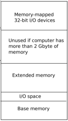

**Chapter 2**  
  
**Page tables**  
  
Page tables are the mechanism through which the operating system controls what memory addresses mean. They allow xv6 to multiplex the address spaces of different processes onto a single physical memory, and to protect the memories of different pro- cesses. The level of indirection provided by page tables allows many neat tricks. xv6 uses page tables primarily to multiplex address spaces and to protect memory. It also uses a few simple page-table tricks: mapping the same memory (the kernel) in several address spaces, mapping the same memory more than once in one address space (each user page is also mapped into the kernel’s physical view of memory), and guarding a user stack with an unmapped page. The rest of this chapter explains the page tables that the x86 hardware provides and how xv6 uses them. Compared to a real-world operating system, xv6’s design is restrictive, but it does illustrate the key ideas.  
  
**Paging hardware**  
  
As a reminder, x86 instructions (both user and kernel) manipulate virtual addresses. The machine’s RAM, or physical memory, is indexed with physical addresses. The x86 page table hardware connects these two kinds of addresses, by mapping each virtual address to a physical address.  
  
An x86 page table is logically an array of 2^20 (1,048,576) page table entries (PTEs). Each PTE contains a 20-bit physical page number (PPN) and some flags. The paging hardware translates a virtual address by using its top 20 bits to index into the page table to find a PTE, and replacing the address’s top 20 bits with the PPN in the PTE. The paging hardware copies the low 12 bits unchanged from the virtual to the translated physical address. Thus a page table gives the operating system control over virtual-to-physical address translations at the granularity of aligned chunks of 4096 (2^12) bytes. Such a chunk is called a page .  
  
As shown in Figure 2-1, the actual translation happens in two steps. A page table is stored in physical memory as a two-level tree. The root of the tree is a 4096-byte page directory that contains 1024 PTE-like references to page table pages. Each page ta- ble page is an array of 1024 32-bit PTEs. The paging hardware uses the top 10 bits of a virtual address to select a page directory entry. If the page directory entry is present, the paging hardware uses the next 10 bits of the virtual address to select a PTE from the page table page that the page directory entry refers to. If either the page directory entry or the PTE is not present, the paging hardware raises a fault. This two-level structure allows a page table to omit entire page table pages in the common case in which large ranges of virtual addresses have no mappings.  
  
Each PTE contains flag bits that tell the paging hardware how the associated vir- tual address is allowed to be used. PTE_P indicates whether the PTE is present: if it is  
  
page table entries (PTEs)  
  
page  
  
page directory page table pages PTE_P+code  
  
DRAFT as of September 4, 2018 29 https://pdos.csail.mit.edu/6.828/xv6  
  
Virtual address Physical Address  
  
10 10 12 20 12  
  
Dir Table Offset  
  
PPN Offset  
  
  
20 12  
  
1023  
  
PPN Flags  
  
20 12  
  
1023 1  
  
0  
  
PPN Flags Page Table  
  
  
CR3  
  
1  
  
0  
  
Page Directory  
  
31 121110 9 8 7 6 5 4 3 2 1 0  
  
Physical Page Number  
  
A  
  
V  
  
L  
  
D A  
  
C W  
  
UW P D T  
  
Page table and page directory P - Present entries are identical except for W - Writable the D bit. U - User  
  
WT - 1=Write-through, 0=Write-back  
  
CD - Cache Disabled  
  
A - Accessed  
  
D - Dirty (0 in page directory)  
  
AVL - Available for system use  
  
**Figure 2-1**. x86 page table hardware.  
  
not set, a reference to the page causes a fault (i.e. is not allowed). PTE_W controls whether instructions are allowed to issue writes to the page; if not set, only reads and instruction fetches are allowed. PTE_U controls whether user programs are allowed to use the page; if clear, only the kernel is allowed to use the page. Figure 2-1 shows how it all works. The flags and all other page hardware related structures are defined in mmu.h (0700) .  
  
A few notes about terms. Physical memory refers to storage cells in DRAM. A byte of physical memory has an address, called a physical address. Instructions use only virtual addresses, which the paging hardware translates to physical addresses, and then sends to the DRAM hardware to read or write storage. At this level of discussion there is no such thing as virtual memory, only virtual addresses.  
  
**Process address space**  
  
The page table created by entry has enough mappings to allow the kernel’s C code to start running. However, main immediately changes to a new page table by calling kvmalloc (1840), because kernel has a more elaborate plan for describing pro- cess address spaces.  
  
Each process has a separate page table, and xv6 tells the page table hardware to switch page tables when xv6 switches between processes. As shown in Figure 2-2, a process’s user memory starts at virtual address zero and can grow up to KERNBASE, al- lowing a process to address up to 2 gigabytes of memory. The file memlayout.h (0200)  
  
PTE_W+code PTE_U+code kvmalloc+code  
  
DRAFT as of September 4, 2018 30 https://pdos.csail.mit.edu/6.828/xv6  
  
Virtual  
  
4 Gbyte  
  
Device memory  
  
RW-  
  
0xFE000000  
  
Unused if PHYSTOP is less than 2 Gbyte  
  
Free memory  
  
RW--  
  
end  
  
Kernel data Kernel text  
  
RW-  
  
R--  
  
+ 0x100000 KERNBASE  
  
RW-  
  
4 Gbyte  
  
Physical  
  
0xFE000000  
  
Program data & heap  
  
  
Unused if computer has more than 2 Gbyte of memory  
  
PHYSTOP  
  
PAGESIZE User stack RWU Extended memory  
  
User data User text  
  
RWU  
  
RWU  
  
0x100000 640Kbyte  
  
I/O space Base memory  
  
0  
  
0  
  
**Figure 2-2**. Layout of the virtual address space of a process and the layout of the physical address space. Note that if a machine has more than 2 Gbyte of physical memory, xv6 can use only the memory that fits between KERNBASE and 0xFE00000.  
  
declares the constants for xv6’s memory layout, and macros to convert virtual to physi- cal addresses.  
  
When a process asks xv6 for more memory, xv6 first finds free physical pages to provide the storage, and then adds PTEs to the process’s page table that point to the new physical pages. xv6 sets the PTE_U, PTE_W, and PTE_P flags in these PTEs. Most processes do not use the entire user address space; xv6 leaves PTE_P clear in unused PTEs. Different processes’ page tables translate user addresses to different pages of physical memory, so that each process has private user memory.  
  
Xv6 includes all mappings needed for the kernel to run in every process’s page ta- ble; these mappings all appear above KERNBASE. It maps virtual addresses KERN- BASE:KERNBASE+PHYSTOP to 0:PHYSTOP. One reason for this mapping is so that the kernel can use its own instructions and data. Another reason is that the kernel some- times needs to be able to write a given page of physical memory, for example when creating page table pages; having every physical page appear at a predictable virtual address makes this convenient. A defect of this arrangement is that xv6 cannot make use of more than 2 gigabytes of physical memory, because the kernel part of the ad- dress space is 2 gigabytes. Thus, xv6 requires that PHYSTOP be smaller than 2 giga- bytes, even if the computer has more than 2 gigabytes of physical memory.  
  
DRAFT as of September 4, 2018 31 https://pdos.csail.mit.edu/6.828/xv6  
  
Some devices that use memory-mapped I/O appear at physical addresses starting at 0xFE000000, so xv6 page tables including a direct mapping for them. Thus, PHYSTOP must be smaller than two gigabytes - 16 megabytes (for the device memory). Xv6 does not set the PTE_U flag in the PTEs above KERNBASE, so only the kernel  
  
can use them.  
  
Having every process’s page table contain mappings for both user memory and the entire kernel is convenient when switching from user code to kernel code during system calls and interrupts: such switches do not require page table switches. For the most part the kernel does not have its own page table; it is almost always borrowing some process’s page table.  
  
To review, xv6 ensures that each process can use only its own memory. And, each process sees its memory as having contiguous virtual addresses starting at zero, while the process’s physical memory can be non-contiguous. xv6 implements the first by set- ting the PTE_U bit only on PTEs of virtual addresses that refer to the process’s own memory. It implements the second using the ability of page tables to translate succes- sive virtual addresses to whatever physical pages happen to be allocated to the process.  
  
**Code: creating an address space**  
  
main calls kvmalloc (1840) to create and switch to a page table with the mappings above KERNBASE required for the kernel to run. Most of the work happens in setup- kvm (1818). It first allocates a page of memory to hold the page directory. Then it calls mappages to install the translations that the kernel needs, which are described in the kmap (1809) array. The translations include the kernel’s instructions and data, physical memory up to PHYSTOP, and memory ranges which are actually I/O devices. setup- kvm does not install any mappings for the user memory; this will happen later. mappages (1760) installs mappings into a page table for a range of virtual addresses  
  
to a corresponding range of physical addresses. It does this separately for each virtual address in the range, at page intervals. For each virtual address to be mapped, map- pages calls walkpgdir to find the address of the PTE for that address. It then initial- izes the PTE to hold the relevant physical page number, the desired permissions ( PTE_W and/or PTE_U), and PTE_P to mark the PTE as valid (1772) .  
  
walkpgdir (1735) mimics the actions of the x86 paging hardware as it looks up the PTE for a virtual address (see Figure 2-1). walkpgdir uses the upper 10 bits of the virtual address to find the page directory entry (1740). If the page directory entry isn’t present, then the required page table page hasn’t yet been allocated; if the alloc argument is set, walkpgdir allocates it and puts its physical address in the page direc- tory. Finally it uses the next 10 bits of the virtual address to find the address of the PTE in the page table page (1753) .  
  
**Physical memory allocation**  
  
The kernel must allocate and free physical memory at run-time for page tables, process user memory, kernel stacks, and pipe buffers.  
  
xv6 uses the physical memory between the end of the kernel and PHYSTOP for  
  
PTE_U+code PTE_U+code main+code kvmalloc+code setupkvm+code mappages+code kmap+code PHYSTOP+code mappages+code walkpgdir+code walkpgdir+code PHYSTOP+code  
  
DRAFT as of September 4, 2018 32 https://pdos.csail.mit.edu/6.828/xv6  
  
run-time allocation. It allocates and frees whole 4096-byte pages at a time. It keeps track of which pages are free by threading a linked list through the pages themselves. Allocation consists of removing a page from the linked list; freeing consists of adding the freed page to the list.  
  
There is a bootstrap problem: all of physical memory must be mapped in order for the allocator to initialize the free list, but creating a page table with those mappings involves allocating page-table pages. xv6 solves this problem by using a separate page allocator during entry, which allocates memory just after the end of the kernel’s data segment. This allocator does not support freeing and is limited by the 4 MB mapping in the entrypgdir, but that is sufficient to allocate the first kernel page table.  
  
**Code: Physical memory allocator**  
  
The allocator’s data structure is a free list of physical memory pages that are avail- able for allocation. Each free page’s list element is a struct run (3115). Where does the allocator get the memory to hold that data structure? It store each free page’s run structure in the free page itself, since there’s nothing else stored there. The free list is protected by a spin lock (3119-3123). The list and the lock are wrapped in a struct to make clear that the lock protects the fields in the struct. For now, ignore the lock and the calls to acquire and release; Chapter 4 will examine locking in detail.  
  
The function main calls kinit1 and kinit2 to initialize the allocator (3131). The reason for having two calls is that for much of main one cannot use locks or memory above 4 megabytes. The call to kinit1 sets up for lock-less allocation in the first 4 megabytes, and the call to kinit2 enables locking and arranges for more memory to be allocatable. main ought to determine how much physical memory is available, but this turns out to be difficult on the x86. Instead it assumes that the machine has 224 megabytes (PHYSTOP) of physical memory, and uses all the memory between the end of the kernel and PHYSTOP as the initial pool of free memory. kinit1 and kinit2 call freerange to add memory to the free list via per-page calls to kfree. A PTE can only refer to a physical address that is aligned on a 4096-byte boundary (is a multiple of 4096), so freerange uses PGROUNDUP to ensure that it frees only aligned physical ad- dresses. The allocator starts with no memory; these calls to kfree give it some to manage.  
  
The allocator refers to physical pages by their virtual addresses as mapped in high memory, not by their physical addresses, which is why kinit uses P2V(PHYSTOP) to translate PHYSTOP (a physical address) to a virtual address. The allocator sometimes treats addresses as integers in order to perform arithmetic on them (e.g., traversing all pages in kinit), and sometimes uses addresses as pointers to read and write memory (e.g., manipulating the run structure stored in each page); this dual use of addresses is the main reason that the allocator code is full of C type casts. The other reason is that freeing and allocation inherently change the type of the memory.  
  
The function kfree (3164) begins by setting every byte in the memory being freed to the value 1. This will cause code that uses memory after freeing it (uses ‘‘dangling references’’) to read garbage instead of the old valid contents; hopefully that will cause such code to break faster. Then kfree casts v to a pointer to struct run, records the  
  
struct run+code main+code kinit1+code kinit2+code PHYSTOP+code freerange+code kfree+code PGROUNDUP+code type cast  
  
DRAFT as of September 4, 2018 33 https://pdos.csail.mit.edu/6.828/xv6  
  
KERNBASE  
  
heap  
  
argument 0 ...  
  
argument N  
  
PAGESIZE  
  
stack guard page  
  
data  
  
0 nul-terminated string address of argument 0 argv\[argc\]  
  
...  
  
address of argument N argv\[0\]  
  
address of address of  
  
argv argument of main argument 0  
  
```cpp
argc argc argument of main 0xFFFFFFF return PC for main

(empty)
```
  
text  
  
0  
  
**Figure 2-3**. Memory layout of a user process with its initial stack.  
  
old start of the free list in r-\>next, and sets the free list equal to r. kalloc removes and returns the first element in the free list.  
  
**User part of an address space**  
  
Figure 2-3 shows the layout of the user memory of an executing process in xv6. Each user process starts at address 0. The bottom of the address space contains the text for the user program, its data, and its stack. The heap is above the stack so that the heap can expand when the process calls sbrk. Note that the text, data, and stack sections are layed out contiguously in the process’s address space but xv6 is free to use non-contiguous physical pages for those sections. For example, when xv6 expands a process’s heap, it can use any free physical page for the new virtual page and then pro- gram the page table hardware to map the virtual page to the allocated physical page. This flexibility is a major advantage of using paging hardware.  
  
The stack is a single page, and is shown with the initial contents as created by ex- ec. Strings containing the command-line arguments, as well as an array of pointers to them, are at the very top of the stack. Just under that are values that allow a program to start at main as if the function call main(argc, argv) had just started. To guard a stack growing off the stack page, xv6 places a guard page right below the stack. The guard page is not mapped and so if the stack runs off the stack page, the hardware will generate an exception because it cannot translate the faulting address. A real- world operating system might allocate more space for the stack so that it can grow be- yond one page.  
  
kalloc+code sbrk+code  
  
DRAFT as of September 4, 2018 34 https://pdos.csail.mit.edu/6.828/xv6  
  
**Code:** **sbrk**  
  
Sbrk is the system call for a process to shrink or grow its memory. The system call is implemented by the function growproc (2558). If n is postive, growproc allocates one or more physical pages and maps them at the top of the process’s address space. If n is negative, growproc unmaps one or more pages from the process’s address space and frees the corresponding physical pages. To make these changes, xv6 modifies the pro- cess’s page table. The process’s page table is stored in memory, and so the kernel can update the table with ordinary assignment statements, which is what allocuvm and deallocuvm do. The x86 hardware caches page table entries in a Translation Look- aside Buffer (TLB), and when xv6 changes the page tables, it must invalidate the cached entries. If it didn’t invalidate the cached entries, then at some point later the TLB might use an old mapping, pointing to a physical page that in the mean time has been allocated to another process, and as a result, a process might be able to scribble on some other process’s memory. Xv6 invalidates stale cached entries, by reloading cr3 , the register that holds the address of the current page table.  
  
**Code: exec**  
  
Exec is the system call that creates the user part of an address space. It initializes the user part of an address space from a file stored in the file system. Exec (6610) opens the named binary path using namei (6623), which is explained in Chapter 6. Then, it reads the ELF header. Xv6 applications are described in the widely-used ELF format , defined in elf.h. An ELF binary consists of an ELF header, struct elfhdr (0905), fol- lowed by a sequence of program section headers, struct proghdr (0924). Each progh- dr describes a section of the application that must be loaded into memory; xv6 pro- grams have only one program section header, but other systems might have separate sections for instructions and data.  
  
The first step is a quick check that the file probably contains an ELF binary. An ELF binary starts with the four-byte ‘‘magic number’’ 0x7F, ’E’, ’L’, ’F’, or ELF_MAGIC (0902). If the ELF header has the right magic number, exec assumes that the binary is well-formed.  
  
Exec allocates a new page table with no user mappings with setupkvm (6637), allo- cates memory for each ELF segment with allocuvm (6651), and loads each segment into memory with loaduvm (6655). allocuvm checks that the virtual addresses requested is below KERNBASE. loaduvm (1903) uses walkpgdir to find the physical address of the al- located memory at which to write each page of the ELF segment, and readi to read from the file.  
  
The program section header for /init, the first user program created with exec , looks like this:  
  
\# objdump -p \_init  
  
\_init: file format elf32-i386  
  
Program Header:  
  
```cpp
LOAD off 0x00000054 vaddr 0x00000000 paddr 0x00000000 align 2**2

Translation Look- aside Buffer (TLB)
```
  
namei+code ELF format  
  
struct elfhdr+code ELF_MAGIC+code setupkvm+code allocuvm+code loaduvm+code loaduvm+code walkpgdir+code readi+code /init+code  
  
DRAFT as of September 4, 2018 35 https://pdos.csail.mit.edu/6.828/xv6  
  
filesz 0x000008c0 memsz 0x000008cc flags rwx  
  
The program section header’s filesz may be less than the memsz, indicating that the gap between them should be filled with zeroes (for C global variables) rather than read from the file. For /init, filesz is 2240 bytes and memsz is 2252 bytes, and thus allocuvm allocates enough physical memory to hold 2252 bytes, but reads only 2240 bytes from the file /init .  
  
Now exec allocates and initializes the user stack. It allocates just one stack page. Exec copies the argument strings to the top of the stack one at a time, recording the pointers to them in ustack. It places a null pointer at the end of what will be the argv list passed to main. The first three entries in ustack are the fake return PC, argc, and argv pointer.  
  
Exec places an inaccessible page just below the stack page, so that programs that try to use more than one page will fault. This inaccessible page also allows exec to deal with arguments that are too large; in that situation, the copyout (2118) function that exec uses to copy arguments to the stack will notice that the destination page is not accessible, and will return –1.  
  
During the preparation of the new memory image, if exec detects an error like an invalid program segment, it jumps to the label bad, frees the new image, and re- turns –1. Exec must wait to free the old image until it is sure that the system call will succeed: if the old image is gone, the system call cannot return –1 to it. The only er- ror cases in exec happen during the creation of the image. Once the image is com- plete, exec can install the new image (6701) and free the old one (6702). Finally, exec returns 0.  
  
Exec loads bytes from the ELF file into memory at addresses specified by the ELF file. Users or processes can place whatever addresses they want into an ELF file. Thus exec is risky, because the addresses in the ELF file may refer to the kernel, accidentally or on purpose. The consequences for an unwary kernel could range from a crash to a malicious subversion of the kernel’s isolation mechanisms (i.e., a security exploit). xv6 performs a number of checks to avoid these risks. To understand the importance of these checks, consider what could happen if xv6 didn’t check if(ph.vaddr + ph.memsz \< ph.vaddr). This is a check for whether the sum overflows a 32-bit inte- ger. The danger is that a user could construct an ELF binary with a ph.vaddr that points into the kernel, and ph.memsz large enough that the sum overflows to 0x1000. Since the sum is small, it would pass the check if(newsz \>= KERNBASE) in allocuvm . The subsequent call to loaduvm passes ph.vaddr by itself, without adding ph.memsz and without checking ph.vaddr against KERNBASE, and would thus copy data from the ELF binary into the kernel. This could be exploited by a user program to run arbi- trary user code with kernel privileges. As this example illustrates, argument checking must be done with great care. It is easy for a kernel developer to omit a crucial check, and real-world kernels have a long history of missing checks whose absence can be ex- ploited by user programs to obtain kernel privileges. It is likely that xv6 doesn’t do a complete job of validating user-level data supplied to the kernel, which a malicious user program might be able to exploit to circumvent xv6’s isolation.  
  
allocuvm+code exec+code ustack+code argv+code argc+code copyout+code  
  
DRAFT as of September 4, 2018 36 https://pdos.csail.mit.edu/6.828/xv6  
  
**Real world**  
  
Like most operating systems, xv6 uses the paging hardware for memory protec- tion and mapping. Most operating systems use x86’s 64-bit paging hardware (which has 3 levels of translation). 64-bit address spaces allow for a less restrictive memory layout than xv6’s; for example, it would be easy to remove xv6’s limit of 2 gigabytes for physical memory. Most operating systems make far more sophisticated use of paging than xv6; for example, xv6 lacks demand paging from disk, copy-on-write fork, shared memory, lazily-allocated pages, and automatically extending stacks. The x86 supports address translation using segmentation (see Appendix B), but xv6 uses segments only for the common trick of implementing per-cpu variables such as proc that are at a fixed address but have different values on different CPUs (see seginit). Implementa- tions of per-CPU (or per-thread) storage on non-segment architectures would dedicate a register to holding a pointer to the per-CPU data area, but the x86 has so few gener- al registers that the extra effort required to use segmentation is worthwhile.  
  
Xv6 maps the kernel in the address space of each user process but sets it up so that the kernel part of the address space is inaccessible when the processor is in user mode. This setup is convenient because after a process switches from user space to kernel space, the kernel can easily access user memory by reading memory locations directly. It is probably better for security, however, to have a separate page table for the kernel and switch to that page table when entering the kernel from user mode, so that the kernel and user processes are more separated from each other. This design, for example, would help mitigating side-channels that are exposed by the Meltdown vulnerability and that allow a user process to read arbitrary kernel memory.  
  
On machines with lots of memory it might make sense to use the x86’s 4- megabytes ‘‘super pages.’’ Small pages make sense when physical memory is small, to allow allocation and page-out to disk with fine granularity. For example, if a program uses only 8 kilobytes of memory, giving it a 4 megabytes physical page is wasteful. Larger pages make sense on machines with lots of RAM, and may reduce overhead for page-table manipulation. Xv6 uses super pages in one place: the initial page table  
  
(1306). The array initialization sets two of the 1024 PDEs, at indices zero and 512 (KERNBASE\>\>PDXSHIFT), leaving the other PDEs zero. Xv6 sets the PTE_PS bit in these two PDEs to mark them as super pages. The kernel also tells the paging hardware to allow super pages by setting the CR_PSE bit (Page Size Extension) in %cr4 .  
  
Xv6 should determine the actual RAM configuration, instead of assuming 224 MB. On the x86, there are at least three common algorithms: the first is to probe the physical address space looking for regions that behave like memory, preserving the val- ues written to them; the second is to read the number of kilobytes of memory out of a known 16-bit location in the PC’s non-volatile RAM; and the third is to look in BIOS memory for a memory layout table left as part of the multiprocessor tables. Reading the memory layout table is complicated.  
  
Memory allocation was a hot topic a long time ago, the basic problems being effi- cient use of limited memory and preparing for unknown future requests; see Knuth. Today people care more about speed than space-efficiency. In addition, a more elabo- rate kernel would likely allocate many different sizes of small blocks, rather than (as in xv6) just 4096-byte blocks; a real kernel allocator would need to handle small alloca-  
  
seginit+code CR_PSE+code  
  
DRAFT as of September 4, 2018 37 https://pdos.csail.mit.edu/6.828/xv6  
  
tions as well as large ones.  
  
**Exercises**  
  
1. Look at real operating systems to see how they size memory.  
  
2. If xv6 had not used super pages, what would be the right declaration for en- trypgdir?  
  
3. Write a user program that grows its address space with 1 byte by calling sbrk(1). Run the program and investigate the page table for the program before the call to sbrk and after the call to sbrk. How much space has the kernel allocated? What does the pte for the new memory contain?  
  
4. Modify xv6 so that the pages for the kernel are shared among processes, which reduces memory consumption.  
  
5. Modify xv6 so that when a user program dereferences a null pointer, it will re- ceive a fault. That is, modify xv6 so that virtual address 0 isn’t mapped for user pro- grams.  
  
6. Unix implementations of exec traditionally include special handling for shell scripts. If the file to execute begins with the text \#!, then the first line is taken to be a program to run to interpret the file. For example, if exec is called to run myprog arg1 and myprog’s first line is \#!/interp, then exec runs /interp with command line /interp myprog arg1. Implement support for this convention in xv6.  
  
7. Delete the check if(ph.vaddr + ph.memsz \< ph.vaddr) in exec.c, and con- struct a user program that exploits that the check is missing.  
  
8. Change xv6 so that user processes run with only a minimal part of the kernel mapped and so that the kernel runs with its own page table that doesn’t include the user process.  
  
9. How would you improve xv6’s memory layout if xv6 where running on a 64-bit processor?  
  
DRAFT as of September 4, 2018 38 https://pdos.csail.mit.edu/6.828/xv6  
  