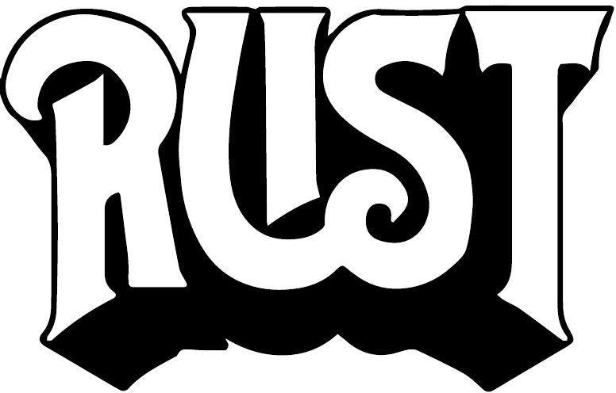

# Preface

> I already know the ending \\ It’s the part that makes your face implode
>
> They Might Be Giants, “Experimental Film” (2004)

To become proficient at a language, you must write many programs in that language. I remember back when this new language called “JavaScript” came out in 1995. I decided to learn it, so I bought a big, thick reference book and read it cover to cover. The book was well written and thoroughly explained the language in great detail, from strings to lists and objects. But when I finished the book, I still couldn’t write JavaScript to save my life. Without applying this knowledge by writing programs, I learned very little. I’ve since improved at learning how to learn a language, which is perhaps the most valuable skill you can develop as a programmer. For me, that means rewriting programs I already know, like tic-tac-toe.

Rust is the new kid on the block now, and perhaps you’ve picked up this book to see what it’s all about. This book is not a reference on the language. Those already exist, and they’re quite good. Instead, I’ve written a book that challenges you to write many small programs that probably will be familiar to you. Rust is reputed to have a fairly steep learning curve, but I believe this approach will help you quickly become productive with the language.

Specifically, you’re going to write Rust versions of core Unix command-line tools such as `head` and `cal`. This will teach you more about the tools and why they are so wildly useful while also providing the context to use Rust concepts like strings, vectors, and filehandles. If you are not familiar with Unix or command-line programming, then you will learn about concepts like program exit values, command-line arguments, output redirection, pipes to connect one program’s output (`STDOUT` or *standard out*) to the input of another program (`STDIN` or *standard in*), and how to use `STDERR` (*standard error*) to segregate error messages from other output. The programs you write will reveal patterns that you’ll be able to use when you create your own Rust programs—patterns like validating parameters, reading and writing files, parsing text, and using regular expressions. Many of these tools and concepts don’t even exist on Windows, so users of that platform will create decent versions of several core Unix programs.

# What Is Rust (and Why Is Everybody Talkin’ About It)?

[Rust](https://www.rust-lang.org) is “a language empowering everyone to build reliable and efficient software.” Rust was created by Graydon Hoare and many others around 2006, while Hoare was working at Mozilla Research. It gained enough interest and users that by 2010 Mozilla had sponsored the development effort. In the [2023 Stack Overflow Developer Survey](https://survey.stackoverflow.co/2023/), over 90,000 developers ranked Rust as the “most loved” language for the eighth year running.



###### Figure P-1. Here is a logo I made from an old Rush logo. As a kid playing the drums in the 1980s, I listened to a lot of Rush. Anyway, Rust is cool, and this logo proves it.

The language is syntactically similar to C, so you’ll find things like `for` loops, semicolon-terminated statements, and curly braces denoting block structures. Crucially, Rust can guarantee memory safety through the use of a *borrow checker* that tracks which part of a program has safe access to different parts of memory. This safety does not come at the expense of performance, though. Rust programs compile to native binaries and often match or beat the speed of programs written in C or C++. For this reason, Rust is often described as a systems programming language that has been designed for performance and safety.

Rust is a *statically typed* language like C/C++ or Java. This means that a variable can never change its type, such as from a number to a string, for example. You don’t always have to declare a variable’s type in Rust because the compiler can often figure it out from the context. This is in contrast to *dynamically typed* languages like Perl, JavaScript, or Python, where a variable can change its type at any point in the program, like from a string to a filehandle.

Rust is *not* an object-oriented (OO) language like C++ or Java, as there are no classes or inheritance in Rust. Instead, Rust uses a `struct` (structure) to represent complex data types and *traits* to describe how types can behave. These structures can have methods, can mutate the internal state of the data, and might even be called *objects* in the documentation, but they are not objects in the formal sense of the word.

Rust has borrowed many exciting concepts from other languages and programming paradigms, including purely functional languages such as Haskell. For instance, variables in Rust are *immutable* by default, meaning they can’t be changed from their initial value; you have to specifically inform the compiler that they are mutable. Functions are also *first-class* values, which means they can be passed as arguments to other so-called *higher-order functions*. Most exciting to my mind is Rust’s use of *enumerated* and *sum* types, also called *algebraic data types* (ADTs), which allow you to represent, for instance, that a function can return a `Result` that can be either an `Ok` containing some value or an `Err` containing some other kind of value. Any code that deals with these values must handle all possibilities, so you’re never at risk of forgetting to handle an error that could unexpectedly crash your program.

# Who Should Read This Book

You should read this book if you want to learn the basics of the Rust language by writing practical command-line programs that address common programming tasks. I imagine most readers will already know some basics about programming from at least one other language. For instance, you probably know about creating variables, using loops to repeat an action, creating functions, and so forth. I imagine that Rust might be a difficult first language as it uses types extensively and requires understanding some fine details about computer memory. I also assume you have at least some idea of how to use the command line and know some basic Unix commands, like how to create, remove, and change into directories. This book will focus on the practical side of things, showing you what you need to know to get things done. I’ll leave the nitty-gritty to more comprehensive books such as [*Programming Rust*, 2nd ed.](https://oreil.ly/DUQqG), by Jim Blandy, Jason Orendorff, and Leonora F. S. Tindall (O’Reilly); [*The Rust Programming Language*](https://oreil.ly/HZWyF) by Steve Klabnik and Carol Nichols (No Starch Press), and [Rust In Action](https://oreil.ly/Izwlo) by Tim McNamara (Manning). I highly recommend that you read one or more of those along with this book to dig deeper into the language itself.

You should also read this book if you’d like to see how to write and run tests to check Rust programs. I’m an advocate for using tests not only to verify that programs work properly but also as an aid to breaking a problem into small, understandable, testable parts. I will demonstrate how to use tests that I have provided for you as well as how to use *test-driven development* (TDD), where you write tests first and then write code that passes those tests. I hope that this book will show that the strictness of the Rust compiler combined with testing leads to better programs that are easier to maintain and modify.

# Why You Should Learn Rust

There are plenty of reasons to learn Rust. First, I find that Rust’s type checking prevents me from making many basic errors. My background is in more dynamically typed languages like Perl, Python, and JavaScript where there is little to no checking of types. The more I used statically typed languages like Rust, the more I realized that dynamically typed languages force much more work onto me, requiring me to verify my programs and write many more tests. I gradually came to feel that the Rust compiler, while very strict, was my dance partner and not my enemy. Granted, it’s a dance partner who will tell you every time you step on their toes or miss a cue, but that eventually makes you a better dancer, which is the goal after all. Generally speaking, when I get a Rust program to compile, it usually works as I intended.

Second, it’s easy to share a Rust program with someone who doesn’t know Rust or is not a developer at all. If I write a Python program for a workmate, I must give them the Python source code to run and ensure they have the right version of Python and all the required modules to execute my code. In contrast, Rust programs are compiled directly into a machine-executable file. I can write and debug a program on my machine, build an executable for the architecture it needs to run on, and give my colleague a copy of the program. Assuming they have the correct architecture, they will not need to install Rust and can run the program directly.

Third, I often build containers using Docker or Singularity to encapsulate workflows. I find that the containers for Rust programs are often orders of magnitude smaller than those for Python programs. For instance, a Docker container with the Python runtime may require several hundred MB. In contrast, I can build a bare-bones Linux virtual machine with a Rust binary that may only be tens of MB in size. Unless I really need some particular features of Python, such as machine learning or natural language processing modules, I prefer to write in Rust and have smaller, leaner containers.

Finally, I find that I’m extremely productive with Rust because of the rich ecosystem of available modules. I have found many useful Rust crates—which is what libraries are called in Rust—on [*crates.io*](https://crates.io), and the documentation at [*Docs.rs*](https://docs.rs) is thorough and easy to navigate.

# The Coding Challenges

In this book, you will learn how to write and test Rust code by creating complete programs. Each chapter will show you how to start a program from scratch, add features, work through error messages, and test your logic. I don’t want you to passively read this book on the bus to work and put it away. You will learn the most by writing your own solutions, but I believe that even typing the source code I present will prove beneficial.

The problems I’ve selected for this book hail from the Unix command-line [coreutils](https://oreil.ly/fYV82), because I expect these will already be quite familiar to many readers. For instance, I assume you’ve used `head` and `tail` to look at the first or last few lines of a file, but have you ever written your own versions of these programs? Other [Rustaceans](https://www.rustaceans.org) (people who use Rust) have had the same idea, so there are plenty of [other Rust implementations](https://oreil.ly/RmiBN) of these programs you can find on the internet. Beyond that, these are fairly small programs that each lend themselves to teaching a few skills. I’ve sequenced the projects so that they build upon one another, so it’s probably best if you work through the chapters in order.

One reason I’ve chosen many of these programs is that they provide a sort of ground truth. While there are many flavors of Unix and many implementations of these programs, they usually all work the same and produce the same results. I use macOS for my development, which means I’m running mostly the BSD (Berkeley Standard Distribution) or [GNU](https://www.gnu.org) (GNU’s Not Unix) variants of these programs. Generally speaking, the BSD versions predate the GNU versions and have fewer options. For each challenge program, I use a shell script to redirect the output from the original program into an output file. The goal is then to have the Rust programs create the same output for the same inputs. I’ve been careful to include files encoded on Windows as well as simple ASCII text mixed with Unicode characters to force my programs to deal with various ideas of line endings and characters in the same way as the original programs.

For most of the challenges, I’ll implement only a subset of the original programs as they can get pretty complicated. I also have chosen to make a few small changes in the output from some of the programs so that they are easier to teach. Consider this to be like learning to play an instrument by playing along with a recording. You don’t have to play every note from the original version. The important thing is to learn common patterns like handling arguments and reading inputs so you can move on to writing your material. As a bonus challenge, try writing these programs in other languages so you can see how the solutions differ from Rust.

# Getting Rust and the Code

To start, you’ll need to install Rust. One of my favorite parts about Rust is the ease of using the `rustup` tool for installing, upgrading, and managing Rust. It works equally well on Windows and Unix-type operating systems (OSs) like Linux and macOS. You will need to follow the [installation instructions](https://oreil.ly/camNw) for your OS. If you have already installed `rustup`, you might want to run **`rustup update`** to get the latest version of the language and tools, as Rust updates about every six weeks. Execute **`rustup doc`** to read copious volumes of documentation. You can check your version of the `rustc` compiler with the following command:

```
$ rustc --version
rustc 1.76.0 (07dca489a 2024-02-04)
```

All the tests, data, and solutions for the programs can be found in [the book’s GitHub repository](https://oreil.ly/pfhMC). You can use the [Git source code management tool](https://git-scm.com) (which you may need to install) to copy this to your machine. The following command will create a new directory on your computer called *command-line-rust* with the contents of the book’s repository:

```
$ git clone https://github.com/kyclark/command-line-rust.git
```

You should *not* write your code in the directory you cloned in the preceding step. You should create a separate directory elsewhere for your projects. I suggest that you create your own Git repository to hold the programs you’ll write. For example, if you use GitHub and call it *rust-solutions*, then you can use the following command to clone your repository. Be sure to replace *YOUR_GITHUB_ID* with your actual GitHub ID:

```
$ git clone https://github.com/YOUR_GITHUB_ID/rust-solutions.git
```

One of the first tools you will encounter in Rust is [Cargo](https://oreil.ly/OhYek), which is its build tool, package manager, and test runner. Each chapter will instruct you to create a new project using Cargo, and I recommend that you do this inside your solutions directory. You will copy each chapter’s *tests* directory from the book’s repository into your project directory to test your code. If you’re curious what testing code looks like with Cargo and Rust, you can run the tests for Chapter 1. Change into the book’s *01_hello* directory and run the tests with **`cargo test`**:

```
$ cd command-line-rust/01_hello
$ cargo test
```

If all goes well, you should see some passing tests (in no particular order):

```
running 3 tests
test false_not_ok ... ok
test true_ok ... ok
test runs ... ok
```

###### Note

I tested all the programs on macOS, Linux, Windows 10/PowerShell, and Ubuntu Linux/Windows Subsystem for Linux (WSL). While I love how well Rust works on both Windows and Unix operating systems, two programs (`findr` and `lsr`) work slightly differently on Windows due to some fundamental differences in the operating system from Unix-type systems. I recommend that Windows/PowerShell users consider also installing WSL and working through the programs in that environment.

All the code in this book has been formatted using `rustfmt`, which is a handy tool for making your code look pretty and readable. You can use **`cargo fmt`** to run it on all the source code in a project, or you can integrate it into your code editor to run on demand. For instance, I prefer to use the text editor `vim`, which I have configured to automatically run `rustfmt` every time I save my work. I find this makes it much easier to read my code and find mistakes.

I recommend you use [Clippy](https://oreil.ly/XyzTS), a linter for Rust code. *Linting* is automatically checking code for common mistakes, and it seems most languages offer one or more linters. Both `rustfmt` and `clippy` should be installed by default, but you can use **`rustup ``component`` add clippy`** if you need to install it. Then you can run **`cargo clippy`** to have it check the source code and make recommendations. No output from Clippy means that it has no suggestions.

# March 2024 Update

This book was originally published in 2022. The Rust language and crates evolved quickly in the following two years, and I am grateful to O’Reilly for allowing me to update my code examples to reflect these changes. I have simplified the programs to make them easier to teach and improved the test output by using the `pretty_assertions` crate. The biggest change by far is in the `clap` (command-line argument parser) crate used in every program starting from Chapter 2. The `clap` crate was at version 2.33 when I wrote the book and had just one method (builder) to parse arguments. The version jumped to 4 soon after publication and introduced a second method (derive). I rewrote all my programs to use these new patterns, being sure to isolate the parsing so that the reader is free to substitute any code they would prefer. The code examples in this version of the book can be found using `git checkout` of the branches *clap_v4* and *clap_v4_derive* for the builder and derive patterns, respectively.

Now you’re ready to write some Rust!

# Conventions Used in This Book

The following typographical conventions are used in this book:

*Italic*  
Indicates new terms, URLs, email addresses, filenames, and file extensions.

`Constant width`  
Used for program listings, as well as within paragraphs to refer to program elements such as variable or function names, databases, data types, environment variables, statements, and keywords.

**`Constant width bold`**  
In blocks of code, unless stated otherwise, this style calls special attention to elements being described in the surrounding discussion. In discursive text, it highlights commands that can be used by the reader as they follow along.

*`Constant width italic`*  
Shows text that should be replaced with user-supplied values or by values determined by context.

###### Tip

This element signifies a tip or suggestion.

###### Note

This element signifies a general note.

###### Warning

This element indicates a warning or caution.

# Using Code Examples

Supplemental material (code examples, exercises, etc.) is available for download at [*https://oreil.ly/commandlinerust_code*](https://oreil.ly/commandlinerust_code).

If you have a technical question or a problem using the code examples, please send email to [*bookquestions@oreilly.com*](mailto:bookquestions@oreilly.com).

This book is here to help you get your job done. In general, if example code is offered with this book, you may use it in your programs and documentation. You do not need to contact us for permission unless you’re reproducing a significant portion of the code. For example, writing a program that uses several chunks of code from this book does not require permission. Selling or distributing examples from O’Reilly books does require permission. Answering a question by citing this book and quoting example code does not require permission. Incorporating a significant amount of example code from this book into your product’s documentation does require permission.

We appreciate, but generally do not require, attribution. An attribution usually includes the title, author, publisher, and ISBN. For example: “*Command-Line Rust* by Ken Youens-Clark (O’Reilly). Copyright 2022 Charles Kenneth Youens-Clark, 978-1-098-10943-1.”

If you feel your use of code examples falls outside fair use or the permission given above, feel free to contact us at [*permissions@oreilly.com*](mailto:permissions@oreilly.com).

# O’Reilly Online Learning

###### Note

For more than 40 years, [*O’Reilly Media*](https://oreilly.com) has provided technology and business training, knowledge, and insight to help companies succeed.

Our unique network of experts and innovators share their knowledge and expertise through books, articles, and our online learning platform. O’Reilly’s online learning platform gives you on-demand access to live training courses, in-depth learning paths, interactive coding environments, and a vast collection of text and video from O’Reilly and 200+ other publishers. For more information, visit [*https://oreilly.com*](https://oreilly.com).

# How to Contact Us

Please address comments and questions concerning this book to the publisher:

- O’Reilly Media, Inc.
- 1005 Gravenstein Highway North
- Sebastopol, CA 95472
- 800-889-8969 (in the United States or Canada)
- 707-827-7019 (international or local)
- 707-829-0104 (fax)
- [*support@oreilly.com*](mailto:support@oreilly.com)
- [*https://www.oreilly.com/about/contact.html*](https://www.oreilly.com/about/contact.html)

We have a web page for this book, where we list errata, examples, and any additional information. You can access this page at [*https://oreil.ly/commandLineRust*](https://oreil.ly/commandLineRust).

Email [*bookquestions@oreilly.com*](mailto:bookquestions@oreilly.com) to comment or ask technical questions about this book.

For news and information about our books and courses, visit [*https://oreilly.com*](https://oreilly.com).

Find us on LinkedIn: [*https://linkedin.com/company/oreilly-media*](https://linkedin.com/company/oreilly-media)

Watch us on YouTube: [*https://www.youtube.com/oreillymedia*](https://www.youtube.com/oreillymedia)

# Acknowledgments

My first debt of gratitude is to the Rust community for creating such an incredible language and body of resources for learning. When I started writing Rust, I quickly learned that I could try to write a naive program and just let the compiler tell me what to fix. I would blindly add or subtract `&` and `*` and clone and borrow until my program compiled, and then I’d figure out how to make it better. When I got stuck, I invariably found help at [*https://users.rust-lang.org*](https://users.rust-lang.org). Everyone I’ve encountered in Rust, from Twitter to Reddit, has been kind and helpful.

I would like to thank the BSD and GNU communities for the programs and documentation upon which each chapter’s project is based. I appreciate the generous licenses that allow me to include portions of the help documentation from their programs:

- [*https://www.freebsd.org/copyright/freebsd-license*](https://www.freebsd.org/copyright/freebsd-license)

- [*https://creativecommons.org/licenses/by-nd/4.0*](https://creativecommons.org/licenses/by-nd/4.0)

I further wish to thank my development editors, Corbin Collins and Rita Fernando, and my production editors, Caitlin Ghegan, Greg Hyman, and Kristen Brown. I am deeply indebted to the technical reviewers Carol Nichols, Brad Fulton, Erik Nordin, and Jeremy Gailor, who kept me on the straight and narrow path, as well as others who gave of their time to make comments, including Joshua Lynch, Andrew Olson, Jasper Zanjani, and William Evans. I also owe thanks to my bosses over the last few years, Dr. Bonnie Hurwitz at the University of Arizona and Amanda Borens at the Critical Path Institute, who have tolerated the time and effort I’ve spent learning new languages such as Rust in my professional job.

In my personal life, I could not have written this book without the love and support of my wife, Lori Kindler, and our three extremely interesting children. Finally, I would also like to thank my friend Brian Castle, who tried so hard in high school to redirect my musical tastes from hard and progressive rock to alternative bands like Depeche Mode, The Smiths, and They Might Be Giants, only the last of which really took.