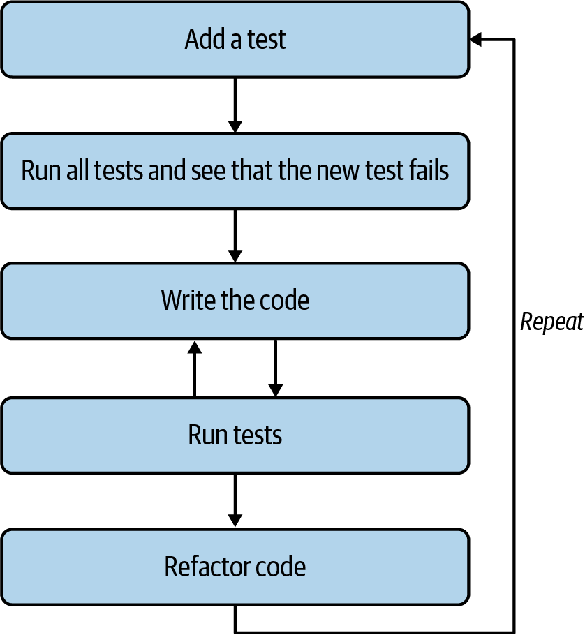

# Chapter 3. On the Catwalk

> When you are alone / You are the cat, you are the phone / You are an animal
>
> They Might Be Giants, “Don’t Let’s Start” (1986)

In this chapter, the challenge is to write a clone of `cat`, which is so named because it can con*cat*enate many files into one file. That is, given files *a*, *b*, and *c*, you could execute `cat a b c > all` to stream all the lines from these three files and redirect them into a file called *all*. The program will accept a couple of different options to prefix each line with the line number.

You’ll learn how to do the following:

- Use testing-first development

- Test for the existence of a file

- Create a random string for a filename that does not exist

- Read regular files or `STDIN` (pronounced *standard in*)

- Use `eprintln!` to print to `STDERR` and `format!` to format a string

- Write a test that provides input on `STDIN`

- Define mutually exclusive arguments

- Use the `enumerate` method of an iterator

# How cat Works

I’ll start by showing how `cat` works so that you know what is expected of the challenge. The BSD version of `cat` does not print the usage for the `-h|--help` flags, so I must use **`man cat`** to read the manual page. For such a limited program, it has a surprising number of options, but the challenge program will implement only a subset of these:

```
CAT(1)                    BSD General Commands Manual                   CAT(1)

NAME
     cat -- concatenate and print files

SYNOPSIS
     cat [-benstuv] [file ...]

DESCRIPTION
     The cat utility reads files sequentially, writing them to the standard
     output.  The file operands are processed in command-line order.  If file
     is a single dash ('-') or absent, cat reads from the standard input.  If
     file is a UNIX domain socket, cat connects to it and then reads it until
     EOF.  This complements the UNIX domain binding capability available in
     inetd(8).

     The options are as follows:

     -b      Number the non-blank output lines, starting at 1.

     -e      Display non-printing characters (see the -v option), and display
             a dollar sign ('$') at the end of each line.

     -n      Number the output lines, starting at 1.

     -s      Squeeze multiple adjacent empty lines, causing the output to be
             single spaced.

     -t      Display non-printing characters (see the -v option), and display
             tab characters as '^I'.

     -u      Disable output buffering.

     -v      Display non-printing characters so they are visible.  Control
             characters print as '^X' for control-X; the delete character
             (octal 0177) prints as '^?'.  Non-ASCII characters (with the high
             bit set) are printed as 'M-' (for meta) followed by the character
             for the low 7 bits.

EXIT STATUS
     The cat utility exits 0 on success, and >0 if an error occurs.
```

Throughout the book I will also show the GNU versions of programs so that you can consider how the programs can vary and to provide inspiration for how you might expand beyond the solutions I present. Note that the GNU version does respond to `--help`, as will the solution you will write:

```
$ cat --help
Usage: cat [OPTION]... [FILE]...
Concatenate FILE(s), or standard input, to standard output.

  -A, --show-all           equivalent to -vET
  -b, --number-nonblank    number nonempty output lines, overrides -n
  -e                       equivalent to -vE
  -E, --show-ends          display $ at end of each line
  -n, --number             number all output lines
  -s, --squeeze-blank      suppress repeated empty output lines
  -t                       equivalent to -vT
  -T, --show-tabs          display TAB characters as ^I
  -u                       (ignored)
  -v, --show-nonprinting   use ^ and M- notation, except for LFD and TAB
      --help     display this help and exit
      --version  output version information and exit

With no FILE, or when FILE is -, read standard input.

Examples:
  cat f - g  Output f's contents, then standard input, then g's contents.
  cat        Copy standard input to standard output.

GNU coreutils online help: <http://www.gnu.org/software/coreutils/>
For complete documentation, run: info coreutils 'cat invocation'
```

###### Note

The BSD version predates the GNU version, so the latter implements all the same short flags to be compatible. As is typical of GNU programs, it also offers long flag aliases like `--number` for `-n` and `--number-nonblank` for `-b`. I will show you how to offer both options, like the GNU version.

For the challenge program, you will implement only the options `-b|--number​-⁠non⁠blank` and `-n|--number`. I will also show you how to read regular files and `STDIN` when given a filename argument of a dash (`-`). To demonstrate `cat`, I’ll use some files that I have included in the *03_catr* directory of the repository. Change into that directory:

```
$ cd 03_catr
```

The *tests/inputs* directory contains four files for testing:

- *empty.txt*: an empty file

- *fox.txt*: a single line of text

- *spiders.txt*: a haiku by Kobayashi Issa with three lines of text

- *the-bustle.txt*: a lovely poem by Emily Dickinson that has two four-line stanzas of text separated by one blank line

Empty files are common, if useless. The following command produces no output, so we’ll expect our program to do the same:

```
$ cat tests/inputs/empty.txt
```

Next, I’ll run `cat` on a file with one line of text:

```
$ cat tests/inputs/fox.txt
The quick brown fox jumps over the lazy dog.
```

###### Note

I have already used `cat` several times in this book to print the contents of a single file, as in the preceding command. This is another common usage of the program outside of its original intent of concatenating files.

The `-n|--number` and `-b|--number-nonblank` flags will both number the lines. The line number is right-justified in a field six characters wide followed by a tab character and then the line of text. To distinguish the tab character, I can use the `-t` option to display nonprinting characters so that the tab shows as `^I`, but note that the challenge program is not expected to do this. In the following command, I use the Unix pipe (`|`) to connect `STDOUT` from the first command to `STDIN` in the second command:

```
$ cat -n tests/inputs/fox.txt | cat -t
     1^IThe quick brown fox jumps over the lazy dog.
```

The *spiders.txt* file has three lines of text that should be numbered with the `-n` option:

```
$ cat -n tests/inputs/spiders.txt
     1  Don't worry, spiders,
     2  I keep house
     3  casually.
```

The difference between `-n` (on the left) and `-b` (on the right) is apparent only with *the-bustle.txt*, as the latter will number only nonblank lines:

```
$ cat -n tests/inputs/the-bustle.txt    $ cat -b tests/inputs/the-bustle.txt
     1  The bustle in a house                1  The bustle in a house
     2  The morning after death              2  The morning after death
     3  Is solemnest of industries           3  Is solemnest of industries
     4  Enacted upon earth,—                 4  Enacted upon earth,—
     5
     6  The sweeping up the heart,           5  The sweeping up the heart,
     7  And putting love away                6  And putting love away
     8  We shall not want to use again       7  We shall not want to use again
     9  Until eternity.                      8  Until eternity.
```

###### Note

Oddly, you can use `-b` and `-n` together, and the `-b` option takes precedence. The challenge program will allow only one or the other.

In the following example, I’m using *blargh* to represent a nonexistent file. I create the file *cant-touch-this* using the `touch` command and use the `chmod` command to set permissions that make it unreadable. (You’ll learn more about what the `000` means in Chapter 14 when you write a Rust version of `ls`.) When `cat` encounters any file that does not exist or cannot be opened, it will print a message to `STDERR` and move to the next file:

```
$ touch cant-touch-this && chmod 000 cant-touch-this
$ cat tests/inputs/fox.txt blargh tests/inputs/spiders.txt cant-touch-this
The quick brown fox jumps over the lazy dog. ①
cat: blargh: No such file or directory ②
Don't worry, spiders, ③
I keep house
casually.
cat: cant-touch-this: Permission denied ④
```

  
This is the output from the first file.

  
This is the error for a nonexistent file.

  
This is the output from the third file.

  
This is the error for an unreadable file.

Finally, I’ll run `cat` with all the files. Notice in the following output that the BSD version starts renumbering the lines for each file, which is the implementation expected by the tests. The GNU version of `cat` keeps incrementing the line counter over all the files.

```
$ cd tests/inputs ①
$ cat -n empty.txt fox.txt spiders.txt the-bustle.txt ②
     1  The quick brown fox jumps over the lazy dog.
     1  Don't worry, spiders,
     2  I keep house
     3  casually.
     1  The bustle in a house
     2  The morning after death
     3  Is solemnest of industries
     4  Enacted upon earth,—
     5
     6  The sweeping up the heart,
     7  And putting love away
     8  We shall not want to use again
     9  Until eternity.
```

  
Change into the *tests/inputs* directory.

  
Run `cat` with all the files and the `-n` option to number the lines.

If you look at the *mk-outs.sh* script used to generate the test cases, you’ll see I execute `cat` with all these files, individually and together, as regular files and through `STDIN`, using no flags and with the `-n` and `-b` flags. I capture all the outputs to various files in the *tests/expected* directory to use in testing.

# Getting Started

The challenge program you write should be called `catr` (pronounced *cat-er*) for a Rust version of `cat`. I suggest you begin with **`cargo new catr`** to start a new application. You’ll use all the same external crates as in Chapter 2, plus the [`rand` crate](https://oreil.ly/HJOPg) to create random values for testing. Update your *Cargo.toml* to add the following dependencies:

``` toml
[dependencies]
anyhow = "1.0.79"
clap = { version = "4.5.0", features = ["derive"] }

[dev-dependencies]
assert_cmd = "2.0.13"
predicates = "3.0.4"
pretty_assertions = "1.4.0"
rand = "0.8.5"
```

You’re going to write the whole challenge program yourself later, but first I’m going to coach you through the things you need to know.

## Starting with Tests

So far in this book, I’ve shown you how to write tests after writing the programs to get you used to the idea of testing and to practice the basics of the Rust language. Starting with this chapter, I want you to think about the tests before you start writing the program. Tests force you to consider the program’s requirements and how you will verify that the program works as expected. Ultimately, I want to draw your attention to *test-driven development* (TDD) as described in [a book by that title](https://oreil.ly/Aved3) written by Kent Beck (Addison-Wesley). TDD advises we write the tests *before* writing the code, as shown in Figure 3-1. Technically, TDD involves writing tests as you add each feature, and I will demonstrate this technique in later chapters. Because I’ve written all the tests for the program, you might consider this more like *test-first development*. Regardless of how and when the tests are written, the point is to emphasize testing at the beginning of the process. Once your program passes the tests, you can use the tests to improve and refactor your code, perhaps by reducing the lines of code or by finding a faster implementation.



###### Figure 3-1. The test-driven development cycle starts with writing a test and then the code that passes it.

Copy the *03_catr/tests* directory into your new *catr* directory. Don’t copy anything but the tests, as you will write the rest of the code yourself. On a Unix-type system, you can copy this directory and its contents using the `cp` command with the *recursive* `-r` option:

```
$ cd catr
$ cp -r ~/command-line-rust/03_catr/tests .
```

Your project directory should have a structure like this:

```
$ tree -L 2
.
├── Cargo.toml
├── src
│   └── main.rs
└── tests
    ├── cli.rs
    ├── expected
    └── inputs
```

Run **`cargo test`** to download the dependencies, compile your program, and run the tests, all of which should fail. Starting with this chapter, I’ll get you started with the basics of setting up each program, give you the info you need to write the program, and let you finish writing it using the tests to guide you.

## Defining the Parameters

Let’s start by representing the command-line parameters for `catr` with a struct called `Args`. Specifically, the program requires a list of input filenames and two Boolean flags for numbering the lines of output. Add the following struct to *src/main.rs*. I recommend placing this near the top after any `use` statements:

``` rust
#[derive(Debug)] ①
struct Args { ②
    files: Vec<String>, ③
    number_lines: bool, ④
    number_nonblank_lines: bool, ⑤
}
```

  
The [`derive` macro](https://oreil.ly/Lr8JE) adds the [`Debug` trait](https://oreil.ly/cEl5P) so the struct can be printed.

  
Define a struct called `Args`.

  
The `files` will be a vector of strings.

  
This is a Boolean value to indicate whether or not to print the line numbers.

  
This is a Boolean to control printing line numbers only for nonblank lines.

If you would like to use the `clap` derive pattern, then you can add the necessary annotations to the preceding struct. If you prefer the builder pattern, I suggest that you write a function called `get_args` with the following skeleton. Use what you learned from Chapter 2 to complete this function on your own:

``` rust
fn get_args() -> Args { ①
    let matches = Command::new("catr")
        .version("0.1.0")
        .author("Ken Youens-Clark <kyclark@gmail.com>")
        .about("Rust version of `cat`")
        // What goes here? ②
        .get_matches();

    Args { ③
        files: ...
        number_lines: ...
        number_nonblank_lines: ...
    }
}
```

  
This function returns an `Args` struct.

  
Define the program’s arguments here.

  
Return an `Args` struct using the supplied values.

Update the `main` function to the following code:

``` rust
fn main() {
    let args = get_args(); ①
    println!("{args:#?}"); ②
}
```

  
Attempt to parse the command-line arguments.

  
Pretty-print the arguments.

When run with the `-h` or `--help` flags, your program should print a usage like this:

```
$ cargo run -- --help
Rust version of `cat`

Usage: catr [OPTIONS] [FILE]...

Arguments:
  [FILE]...  Input file(s) [default: -]

Options:
  -n, --number           Number lines
  -b, --number-nonblank  Number non-blank lines
  -h, --help             Print help
  -V, --version          Print version
```

With no arguments, your program should print the `Args` like this:

```
$ cargo run
Args {
    files: [ ①
        "-",
    ],
    number_lines: false, ②
    number_nonblank_lines: false,
}
```

  
The `files` argument should default to a vector containing a single dash (`-`) for `STDIN`.

  
The Boolean arguments should both default to `false`.

Run it with some arguments and be sure the arguments are parsed correctly:

```
$ cargo run -- -n tests/inputs/fox.txt
Args {
    files: [
        "tests/inputs/fox.txt", ①
    ],
    number_lines: true, ②
    number_nonblank_lines: false,
}
```

  
The positional file argument is parsed into the `files`.

  
The `-n` option causes `number_lines` to be `true`.

While the BSD version will allow both `-n` and `-b`, the challenge program should consider these to be mutually exclusive and generate an error when they’re used together:

```
$ cargo run -- -b -n tests/inputs/fox.txt
error: the argument '--number-nonblank' cannot be used with '--number'

Usage: catr --number-nonblank <FILE>...

For more information, try '--help'.
```

###### Note

Stop reading here and get your program working as described so far. Seriously! I want you to try writing your version of this before you read ahead. Your program should also pass **`cargo test usage`**. I’ll wait here until you finish.

All set? Compare what you have to my `get_args` function. Be sure to add `use clap::{Arg, ArgAction, Command}` to your imports for the following code:

``` rust
fn get_args() -> Args {
    let matches = Command::new("catr")
        .version("0.1.0")
        .author("Ken Youens-Clark <kyclark@gmail.com>")
        .about("Rust version of `cat`")
        .arg(
            Arg::new("files") ①
                .value_name("FILE")
                .help("Input file(s)")
                .num_args(1..)
                .default_value("-"),
        )
        .arg(
            Arg::new("number") ②
                .short('n')
                .long("number")
                .help("Number lines")
                .action(ArgAction::SetTrue)
                .conflicts_with("number_nonblank"),
        )
        .arg(
            Arg::new("number_nonblank") ③
                .short('b')
                .long("number-nonblank")
                .help("Number non-blank lines")
                .action(ArgAction::SetTrue),
        )
        .get_matches();

    Args {
        files: matches.get_many("files").unwrap().cloned().collect(), ④
        number_lines: matches.get_flag("number"), ⑤
        number_nonblank_lines: matches.get_flag("number_nonblank"),
    }
}
```

  
This positional argument is for the files and is required to have at least one value that defaults to a dash (`-`).

  
This is an option that has a short name `-n` and a long name `--number`. When present, it will tell the program to print line numbers. It cannot occur in conjunction with `-b`.

  
The `-b|--number-nonblank` flag controls whether or not to print line numbers for nonblank lines.

  
Because at least one value is required, it should be safe to call `Option::unwrap`. Note that `Iterator::collect` returns a `Vec` due to type inference.

  
The two Boolean options are set using `ArgMatches::get_flag`.

###### Tip

Optional arguments have short and/or long names, but posi­tional ones do not. You can define optional arguments before or after positional arguments.

For the `clap` derive pattern, update the `Args` struct as follows:

``` rust
use clap::Parser;

#[derive(Debug, Parser)]
#[command(author, version, about)]
/// Rust version of `cat`
struct Args {
    /// Input file(s)
    #[arg(value_name = "FILE", default_value = "-")]
    files: Vec<String>,

    /// Number lines
    #[arg(
        short('n'),
        long("number"),
        conflicts_with("number_nonblank_lines")
    )]
    number_lines: bool,

    /// Number non-blank lines
    #[arg(short('b'), long("number-nonblank"))]
    number_nonblank_lines: bool,
}
```

Then change the `main` function to call `Args::parse()` instead of `get_args()`:

``` rust
fn main() {
    let args = Args::parse();
    println!("{args:#?}");
}
```

Execute **`cargo test`** to see the failing test output, but don’t despair. You will soon rejoice in a fully passing test suite.

## Iterating Through the File Arguments

Now that you have validated all the arguments, you are ready to process the files and create the correct output. Next, I suggest you write a function called `run` that will accept the `Args` struct and return a `Result`. There are two important reasons for this:

1.  I want to separate the parsing of command-line arguments from their use in the logic of the program. This makes it easier for you to choose the derive or builder patterns of `clap` or replace it with some other code.

2.  We are now moving into territory where code can fail. I want to use the `?` operator to call other functions that return a `Result` and pass any errors back to the caller, which requires that my calling function also return a `Result`.

Add `use anyhow::Result` and the following code to *src/main.rs*:

``` rust
fn run(_args: Args) -> Result<()> { ①
    Ok(()) ②
}
```

  
The function takes the `Args` struct and returns a `Result`.

  
Implicitly return an `Ok` containing the unit type.

If you want to use the `get_args` builder pattern, change the `main` function to the following:

``` rust
fn main() {
    if let Err(e) = run(get_args()) { ①
        eprintln!("{e}"); ②
        std::process::exit(1); ③
    }
}
```

  
Call `run` with the results of `get_args` and catch the `Err` variant.

  
Print the error message `e` to `STDERR`.

  
Exit the program with a nonzero value to indicate an error.

If you want to use the derive pattern, the code is almost identical:

``` rust
fn main() {
    if let Err(e) = run(Args::parse()) { ①
        eprintln!("{e}");
        std::process::exit(1);
    }
}
```

  
Change `get_args` to `Args::parse`.

Next, modify the `run` function to print each filename:

``` rust
fn run(args: Args) -> Result<()> {
    for filename in args.files { ①
        println!("{filename}"); ②
    }
    Ok(())
}
```

  
Iterate through each filename.

  
Print the filename.

Run the program with some input files. In the following example, the `bash` shell will expand the file glob^(1) `*.txt` into all filenames that end with the extension *.txt*:

```
$ cargo run -- tests/inputs/*.txt
tests/inputs/empty.txt
tests/inputs/fox.txt
tests/inputs/spiders.txt
tests/inputs/the-bustle.txt
```

Windows PowerShell can expand file globs using `Get-ChildItem`:

```
> cargo run -q -- -n (Get-ChildItem .\tests\inputs\*.txt)
C:\Users\kyclark\work\command-line-rust\03_catr\tests\inputs\empty.txt
C:\Users\kyclark\work\command-line-rust\03_catr\tests\inputs\fox.txt
C:\Users\kyclark\work\command-line-rust\03_catr\tests\inputs\spiders.txt
C:\Users\kyclark\work\command-line-rust\03_catr\tests\inputs\the-bustle.txt
```

## Opening a File or STDIN

The next step is to try to open each filename. When the filename is a dash, you should open `STDIN`; otherwise, attempt to open the given filename and handle errors. For the following code, you will need to expand your imports with the following:

``` rust
use std::fs::File;
use std::io::{self, BufRead, BufReader};
```

This next step is a bit tricky, so I will provide an `open` function for you to use. In the following code, I’m using the `match` keyword, which is similar to a `switch` statement in C. Specifically, I’m matching on whether the given filename is equal to a dash (`-`) or anything else, which is specified using the wildcard `_`:

``` rust
fn open(filename: &str) -> Result<Box<dyn BufRead>> { ①
    match filename {
        "-" => Ok(Box::new(BufReader::new(io::stdin()))), ②
        _ => Ok(Box::new(BufReader::new(File::open(filename)?))), ③
    }
}
```

  
The function will accept a filename and will return either an error or a boxed value that implements the `BufRead` trait.

  
When the filename is a dash (`-`), read from [`std::io::stdin`](https://oreil.ly/TtQvx).

  
Otherwise, use [`File::open`](https://oreil.ly/Aj1pC) to try to open the given file or propagate an error.

If `File::open` is successful, the result will be a *filehandle* of the type [`std::fs::File`](https://oreil.ly/S16cp), which is a mechanism for reading the contents of a file. Both a filehandle and `std::io::stdin` implement the [`Read` trait](https://oreil.ly/2Dn3M) that a [`BufReader` struct](https://oreil.ly/OUSJb) will use to implement the [`BufRead` trait](https://oreil.ly/4tYrU). This means the return value will, for instance, respond to the [`BufRead::lines` function](https://oreil.ly/KhmCp) to produce lines of text. Note that this function will remove any line endings, such as `\r\n` on Windows and `\n` on Unix.

The return type includes the [`dyn`](https://oreil.ly/OobOp) keyword to say that the return type’s trait is dynamically dispatched. This allows us to abstract the idea of the input source. At the moment, we’re reading from either a file or from `STDIN`, but we could expand this to include reading from some other source like a socket or a web page or the Mars rover, as long as that source that implements the trait `BufRead`.

The return type is placed into a [`Box`](https://oreil.ly/o8EdI), which is a way to store a value on the heap. You may wonder if this is completely necessary. I could try to write the function without using `Box`:

``` rust
// This will not compile
fn open(filename: &str) -> Result<dyn BufRead> {
    match filename {
        "-" => Ok(BufReader::new(io::stdin())),
        _ => Ok(BufReader::new(File::open(filename)?)),
    }
}
```

But if I try to compile this code, I get the following error:

```
error[E0277]: the size for values of type `(dyn BufRead + 'static)`
cannot be known at compilation time
   --> src/main.rs:70:28
    |
70  | fn open(filename: &str) -> Result<dyn BufRead> {
    |                            ^^^^^^^^^^^^^^^^^^^ doesn't have a size
    |                                                known at compile-time
    |
    = help: the trait `Sized` is not implemented for `(dyn BufRead + 'static)`
note: required by a bound in `Result`
```

The compiler doesn’t have enough information from `dyn BufRead` to know the size of the return type. If a variable doesn’t have a fixed, known size, then Rust can’t store it on the stack. The solution is to instead allocate memory on the heap by putting the return value into a `Box`, which is a pointer with a known size.

The preceding `open` function is dense. I can appreciate if you think that it’s more than a little complicated; however, it handles almost any error you will encounter. To demonstrate this, change your `run` to the following:

``` rust
fn run(args: Args) -> Result<()> {
    for filename in args.files { ①
        match open(&filename) { ②
            Err(err) => eprintln!("Failed to open {filename}: {err}"), ③
            Ok(_) => println!("Opened {filename}"), ④
        }
    }
    Ok(())
}
```

  
Iterate through the filenames.

  
Try to open the filename. Note the use of `&` to borrow the variable.

  
Print an error message to `STDERR` when `open` fails.

  
Print a success message when `open` works. The underscore for the variable tells the compiler that I do not intend to use it.

Try to run your program with the following:

1.  A valid input file such as *tests/inputs/fox.txt*

2.  A nonexistent file

3.  An unreadable file

For the last option, you can create a file that cannot be read like so:

```
$ touch cant-touch-this && chmod 000 cant-touch-this
```

Run your program and verify your code gracefully prints error messages for bad input files and continues to process the valid ones:

```
$ cargo run -- blargh cant-touch-this tests/inputs/fox.txt
Failed to open blargh: No such file or directory (os error 2)
Failed to open cant-touch-this: Permission denied (os error 13)
Opened tests/inputs/fox.txt
```

At this point, you should be able to pass **`cargo test skips_bad_file`**. Now that you can open and read valid input files, I want you to finish the program on your own. Can you figure out how to read the opened file line by line? Start with *tests​/⁠inputs/fox.txt*, which has only one line. You should be able to see the following output:

```
$ cargo run -- tests/inputs/fox.txt
The quick brown fox jumps over the lazy dog.
```

Verify that you can read `STDIN` by default. In the following command, I use the `|` to pipe `STDOUT` from the first command to the `STDIN` of the second command:

```
$ cat tests/inputs/fox.txt | cargo run
The quick brown fox jumps over the lazy dog.
```

The output should be the same when providing a dash as the filename. In the following command, I will use the `bash` redirect operator `<` to take input from the given filename and provide it to `STDIN`:

```
$ cargo run -- - < tests/inputs/fox.txt
The quick brown fox jumps over the lazy dog.
```

Next, try an input file with more than one line and try to number the lines with `-n`:

```
$ cargo run -- -n tests/inputs/spiders.txt
     1  Don't worry, spiders,
     2  I keep house
     3  casually.
```

Then try to skip blank lines in the numbering with `-b`:

```
$ cargo run -- -b tests/inputs/the-bustle.txt
     1  The bustle in a house
     2  The morning after death
     3  Is solemnest of industries
     4  Enacted upon earth,—

     5  The sweeping up the heart,
     6  And putting love away
     7  We shall not want to use again
     8  Until eternity.
```

Run **`cargo test`** often to see which tests are failing.

## Using the Test Suite

Now is a good time to examine the tests more closely so you can understand both how to write tests and what they expect of your program. The test structure in *tests/cli.rs* is similar to Chapter 2, starting with the imports:

``` rust
use anyhow::Result; ①
use assert_cmd::Command;
use predicates::prelude::*;
use pretty_assertions::assert_eq; ②
use rand::{distributions::Alphanumeric, Rng}; ③
use std::fs;
```

  
All programs will use `anyhow::Result` over the default `Result`.

  
All tests will use `pretty_assertions::assert_eq` over the default `assert_eq!` macro.

  
The [`rand` crate](https://oreil.ly/HJOPg) is used to generate random values at runtime.

I’ve also added a little more organization. For instance, I use the [`const` keyword](https://oreil.ly/CY0Hn) to create several *constant* `&str` values at the top of that module that I use throughout the crate. I use a common convention of `ALL_CAPS` names to highlight the fact that they are *scoped* or visible throughout the crate:

``` rust
const PRG: &str = "catr";
const EMPTY: &str = "tests/inputs/empty.txt";
const FOX: &str = "tests/inputs/fox.txt";
const SPIDERS: &str = "tests/inputs/spiders.txt";
const BUSTLE: &str = "tests/inputs/the-bustle.txt";
```

To test that the program will die when given a nonexistent file, I use the `rand` crate to generate a random filename that does not exist:

``` rust
fn gen_bad_file() -> String { ①
    loop { ②
        let filename: String = rand::thread_rng() ③
            .sample_iter(&Alphanumeric)
            .take(7)
            .map(char::from)
            .collect();

        if fs::metadata(&filename).is_err() { ④
            return filename;
        }
    }
}
```

  
The function will return a [`String`](https://oreil.ly/X32Yh), which is a dynamically generated string closely related to the `str` struct I’ve been using.

  
Start an infinite `loop`.

  
Create a random string of seven alphanumeric characters.

  
[`fs::metadata`](https://oreil.ly/VsRxb) returns an error when the given filename does not exist, so return the nonexistent filename.

In the preceding function, I use `filename` two times after creating it. The first time I borrow it using `&filename`, and the second time I don’t use the ampersand. Try removing the `&` and running the code. You should get an error message stating that ownership of the `filename` value is moved into `fs::metadata`:

```
error[E0382]: use of moved value: `filename`
  --> tests/cli.rs:37:20
   |
30 |         let filename: String = rand::thread_rng()
   |             -------- move occurs because `filename` has type `String`,
   |                      which does not implement the `Copy` trait
...
36 |         if fs::metadata(filename).is_err() {
   |                         -------- value moved here
37 |             return filename;
   |                    ^^^^^^^^ value used here after move
```

Effectively, the `fs::metadata` function consumes the `filename` variable, leaving it unusable. The `&` shows I only want to borrow a reference to the variable. Don’t worry if you don’t completely understand that yet. I’m only showing the following `gen_bad_file` function so that you understand how it is used in the `skips_bad_file` test:

``` rust
#[test]
fn skips_bad_file() -> Result<()> {
    let bad = gen_bad_file(); ①
    let expected = format!("{bad}: .* [(]os error 2[)]"); ②
    Command::cargo_bin(PRG)? ③
        .arg(&bad)
        .assert()
        .success() ④
        .stderr(predicate::str::is_match(expected)?);
    Ok(())
}
```

  
Generate the name of a nonexistent file.

  
The expected error message should include the filename and the string *os error 2* on both Windows and Unix platforms.

  
Run the program with the bad file and verify that `STDERR` matches the expected pattern.

  
The program should not fail because bad files should only generate warnings and not kill the process.

###### Tip

In the preceding function, I used the [`format!` macro](https://oreil.ly/rgrsJ) to generate a new `String`. This macro works like `print!` except that it returns the value rather than printing it.

I created a helper function called `run` to run the program with input arguments and verify that the output matches the text in the file generated by *mk-outs.sh*:

``` rust
fn run(args: &[&str], expected_file: &str) -> Result<()> { ①
    let expected = fs::read_to_string(expected_file)?; ②
    let output = Command::cargo_bin(PRG)?.args(args).output().unwrap(); ③
    assert!(output.status.success()); ④

    let stdout = String::from_utf8(output.stdout).expect("invalid UTF-8"); ⑤
    assert_eq!(stdout, expected); ⑥

    Ok(())
}
```

  
The function accepts a slice of `&str` arguments and the filename with the expected output. The function returns a `Result` because some function calls within may fail.

  
Try to read the expected output file.

  
Execute the program with the arguments and obtain the output.

  
Verify the program ran successfully.

  
Attempt to convert the program’s `STDOUT` to a string.

  
Verify that the actual program output matches the expected output.

I use this function like so:

``` rust
#[test]
fn bustle() -> Result<()> {
    run(&[BUSTLE], "tests/expected/the-bustle.txt.out") ①
}
```

  
Run the program with the `BUSTLE` input file and verify that the output matches the output produced by *mk-outs.sh*.

I also wrote a helper function to provide input via `STDIN`:

``` rust
fn run_stdin(
    input_file: &str, ①
    args: &[&str],
    expected_file: &str,
) -> Result {
    let input = fs::read_to_string(input_file)?; ②
    let expected = fs::read_to_string(expected_file)?;
    let output = Command::cargo_bin(PRG)? ③
        .write_stdin(input)
        .args(args)
        .output()
        .unwrap();
    assert!(output.status.success()); ④

    let stdout = String::from_utf8(output.stdout).expect("invalid UTF-8"); ⑤
    assert_eq!(stdout, expected);

    Ok(())
}
```

  
The first argument is the filename containing the text that should be given to `STDIN`.

  
Try to read the input and expected files.

  
Try to run the program with the given arguments and `STDIN`.

  
Verify that the program ran successfully.

  
Check the program’s output against the expected value.

This function is used similarly:

``` rust
#[test]
fn bustle_stdin() -> Result<()> {
    run_stdin(BUSTLE, &["-"], "tests/expected/the-bustle.txt.stdin.out") ①
}
```

  
Run the program using the contents of the given filename as `STDIN` and a dash as the input filename. Verify the output matches the expected value.

###### Note

That should be enough for you to finish the rest of the program. Off you go! Come back when you’re done.

# Solution

I hope you found this an interesting and challenging program to write. I’ll show you how to modify the program step by step to reach a final solution, which you can find in the book’s repository.

## Reading the Lines in a File

To start, I will print the lines of files that are opened successfully:

``` rust
fn run(args: Args) -> Result<()> {
    for filename in args.files {
        match open(&filename) {
            Err(err) => eprintln!("Failed to open {filename}: {err}"), ①
            Ok(file) => {
                for line_result in file.lines() { ②
                    let line = line_result?; ③
                    println!("{line}"); ④
                }
            }
        }
    }
    Ok(())
}
```

  
Print the filename and error when there is a problem opening a file.

  
Iterate over each `line_result` value from `BufRead::lines`.

  
Either unpack an `Ok` value from `line_result` or propagate an error.

  
Print the line.

###### Note

When reading the lines from a file, you don’t get the lines directly from the filehandle but instead get a [`std::io::Result`](https://oreil.ly/kxFes), which is a type “broadly used across `std::io` for any operation which may produce an error.” The reading and writing of files falls into the category of I/O (input/output), which depends on external resources like the operating and filesystems. While it’s unlikely that reading a line from a filehandle will fail, the point is that it *could* fail.

Run this code with an input file to see it in action:

```
$ cargo run -- tests/inputs/spiders.txt
Don't worry, spiders,
I keep house
casually.
```

If you run **`cargo test`** at this point, you should pass about half of the tests, which is not bad for so few lines of code.

## Printing Line Numbers

Next is to add the printing of line numbers for the `-n|--number` option. One solution that will likely be familiar to C programmers would be something like this:

``` rust
fn run(args: Args) -> Result<()> {
    for filename in args.files {
        match open(&filename) {
            Err(err) => eprintln!("Failed to open {filename}: {err}"),
            Ok(file) => {
                let mut line_num = 0; ①
                for line_result in file.lines() {
                    let line = line_result?;
                    line_num += 1; ②

                    if args.number_lines { ③
                        println!("{line_num:>6}\t{line}"); ④
                    } else {
                        println!("{line}"); ⑤
                    }
                }
            }
        }
    }
    Ok(())
}
```

  
Initialize a mutable counter variable to hold the line number.

  
Add 1 to the line number.

  
Check if the user wants line numbers.

  
If so, print the current line number in a right-justified field six characters wide followed by a tab character and then the line of text.

  
Otherwise, print the line.

Recall that all variables in Rust are immutable by default, so it’s necessary to add `mut` to `line_num`, as I intend to change it. The `+=` operator is a compound assignment that adds the righthand value 1 to `line_num` to increment it.^(2) Of note, too, is the formatting syntax `{:>6}` that indicates the width of the field as six characters with the text aligned to the right. (You can use `<` for left-justified and `^` for centered text.) This syntax is similar to `printf` in C, Perl, and Python’s string formatting.

If I run the program at this point, it looks pretty good:

```
$ cargo run -- tests/inputs/spiders.txt -n
     1  Don't worry, spiders,
     2  I keep house
     3  casually.
```

While this works adequately, I’d like to point out a more idiomatic solution using [`Iterator::enumerate`](https://oreil.ly/gXM7q). This method will return a [tuple](https://oreil.ly/Cmywl) containing the index position and value for each element in an *iterable*, which is something that can produce values until exhausted:

``` rust
fn run(args: Args) -> Result<()> {
    for filename in args.files {
        match open(&filename) {
            Err(err) => eprintln!("Failed to open {filename}: {err}"),
            Ok(file) => {
                for (line_num, line_result) in file.lines().enumerate() { ①
                    let line = line_result?;
                    if args.number_lines {
                        println!("{:>6}\t{line}", line_num + 1); ②
                    } else {
                        println!("{line}");
                    }
                }
            }
        }
    }
    Ok(())
}
```

  
The tuple values from `Iterator::enumerate` can be unpacked using pattern matching.

  
Numbering from `enumerate` starts at 0, so add 1 to mimic `cat`, which starts at 1. Note that the expression `line_num + 1` may not be placed inside the `{}` placeholder and so is passed as an argument to `println!`.

This will create the same output as before, but now the code avoids using a mutable value. I can execute **`cargo test fox`** to run all the tests with the word *fox* in their name, and I find that two out of three pass. The program fails on the `-b` flag, so next I need to handle printing the line numbers only for nonblank lines. Notice in this version, I’m also going to remove `line_result` and shadow the `line` variable:

``` rust
fn run(args: Args) -> Result<()> {
    for filename in args.files {
        match open(&filename) {
            Err(err) => eprintln!("Failed to open {filename}: {err}"),
            Ok(file) => {
                let mut prev_num = 0; ①
                for (line_num, line) in file.lines().enumerate() {
                    let line = line?; ②
                    if args.number_lines { ③
                        println!("{:>6}\t{line}", line_num + 1);
                    } else if args.number_nonblank_lines { ④
                        if line.is_empty() {
                            println!(); ⑤
                        } else {
                            prev_num += 1;
                            println!("{prev_num:>6}\t{line}"); ⑥
                        }
                    } else {
                        println!("{line}"); ⑦
                    }
                }
            }
        }
    }
    Ok(())
}
```

  
Initialize a mutable variable for the number of the last nonblank line.

  
Shadow the `line` with the result of unpacking the `Result`.

  
Handle printing line numbers.

  
Handle printing line numbers for nonblank lines.

  
If the line is empty, print a blank line.

  
Otherwise, increment `prev_num` and print the output.

  
If there are no numbering options, print the line.

###### Note

*Shadowing* a variable in Rust is when you reuse a variable’s name and set it to a new value. Arguably the `line_result`/`line` code may be more explicit and readable, but reusing `line` in this context is more Rustic code you’re likely to encounter.

If you run **`cargo test`**, you should pass all the tests.

# Going Further

You have a working program now, but you don’t have to stop there. If you’re up for an additional challenge, try implementing the other options shown in the manual pages for both the BSD and GNU versions. For each option, use `cat` to create the expected output file, then expand the tests to check that your program creates this same output. I’d also recommend you check out [`bat`](https://oreil.ly/QgMnb), which is another Rust clone of `cat` (“with wings”), for a more complete implementation.

The numbered lines output of `cat -n` is similar in ways to `nl`, a “line numbering filter.” `cat` is also a bit similar to programs that will show you a *page* or screen full of text at a time, so-called *pagers* like `more` and `less`.^(3) Consider implementing these programs. Read the manual pages, create the test output, and copy the ideas from this project to write and test your versions.

# Summary

You made big strides in this chapter, creating a much more complex program than in the previous chapters. Consider what you learned:

- You used a testing-first approach where all the tests exist before the program is even written. When the program passes all the tests, you can be confident your program meets all the specifications encoded in the tests.

- You saw how to use the `rand` crate to generate a random string for a nonexistent file.

- You learned about the `const` keyword to make constant values.

- You figured out how to read lines of text from both `STDIN` and regular files.

- You used the `eprintln!` macro to print to `STDERR` and `format!` to dynamically generate a new string.

- You used a `for` loop to visit each element in an iterable.

- You found that the `Iterator::enumerate` method will return both the index and the element as a tuple, which is useful for numbering the lines of text.

- You learned to use a `Box` that points to a filehandle to read `STDIN` or a regular file.

In the next chapter, you’ll learn a good deal more about reading files by lines, bytes, or characters.

^(1) *Glob* is short for *global*, an early Unix program that would expand wildcard characters into filepaths. Nowadays, the shell handles glob patterns directly.

^(2) Note that Rust does not have a unary `++` operator, so you cannot use `line_num++` to increment a variable by 1.

^(3) `more` shows you a page of text with “More” at the bottom to let you know you can continue. Obviously, someone decided to be clever and named their clone `less`, but it does the same thing.