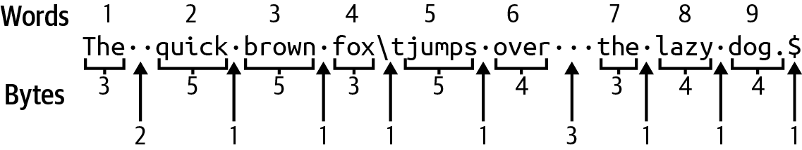

# Chapter 5. Word to Your Mother

> All hail the dirt bike / Philosopher dirt bike /  
> Silence as we gathered round / We saw the word and were on our way
>
> They Might Be Giants, “Dirt Bike” (1994)

For this chapter’s challenge, you will create a version of the venerable `wc` (*word count*) program, which dates back to version 1 of AT&T Unix. This program will display the number of lines, words, and bytes found in text from `STDIN` or one or more files. I often use it to count the number of lines returned by some other process.

In this chapter, you will learn how to do the following:

- Use the `Iterator::all` function

- Create a module for unit tests

- Fake a filehandle for testing

- Conditionally format and print a value

- Conditionally compile a module when testing

- Break a line of text into words, bytes, and characters

# How wc Works

I’ll start by showing how `wc` works so you know what is expected by the tests. Following is an excerpt from the BSD `wc` manual page that describes the elements that the challenge program will implement:

```
WC(1)                     BSD General Commands Manual                    WC(1)

NAME
     wc -- word, line, character, and byte count

SYNOPSIS
     wc [-clmw] [file ...]

DESCRIPTION
     The wc utility displays the number of lines, words, and bytes contained
     in each input file, or standard input (if no file is specified) to the
     standard output.  A line is defined as a string of characters delimited
     by a <newline> character.  Characters beyond the final <newline> charac-
     ter will not be included in the line count.

     A word is defined as a string of characters delimited by white space
     characters.  White space characters are the set of characters for which
     the iswspace(3) function returns true.  If more than one input file is
     specified, a line of cumulative counts for all the files is displayed on
     a separate line after the output for the last file.

     The following options are available:

     -c      The number of bytes in each input file is written to the standard
             output.  This will cancel out any prior usage of the -m option.

     -l      The number of lines in each input file is written to the standard
             output.

     -m      The number of characters in each input file is written to the
             standard output.  If the current locale does not support multi-
             byte characters, this is equivalent to the -c option.  This will
             cancel out any prior usage of the -c option.

     -w      The number of words in each input file is written to the standard
             output.

     When an option is specified, wc only reports the information requested by
     that option.  The order of output always takes the form of line, word,
     byte, and file name.  The default action is equivalent to specifying the
     -c, -l and -w options.

     If no files are specified, the standard input is used and no file name is
     displayed.  The prompt will accept input until receiving EOF, or [^D] in
     most environments.
```

A picture is worth a kilobyte of words, so I’ll show you some examples using the following test files in the *05_wcr/tests/inputs* directory:

- *empty.txt*: an empty file

- *fox.txt*: a file with one line of text

- *atlamal.txt*: a file with the first stanza from “Atlamál hin groenlenzku” or “The Greenland Ballad of Atli,” an Old Norse poem

When run with an empty file, the program reports zero lines, words, and bytes in three right-justified columns eight characters wide:

```
$ cd 05_wcr
$ wc tests/inputs/empty.txt
       0       0       0 tests/inputs/empty.txt
```

Next, consider a file with one line of text with varying spaces between words and a tab character. Let’s take a look at it before running `wc` on it. Here I’m using `cat` with the flag `-t` to display the tab character as `^I` and `-e` to display `$` for the end of the line:

```
$ cat -te tests/inputs/fox.txt
The  quick brown fox^Ijumps over   the lazy dog.$
```

This example is short enough that I can manually count all the lines, words, and bytes as shown in Figure 5-1, where spaces are noted with raised dots, the tab character with `\t`, and the end of the line as `$`.



###### Figure 5-1. There is 1 line of text containing 9 words and 48 bytes.

I find that `wc` is in agreement:

```
$ wc tests/inputs/fox.txt
       1       9      48 tests/inputs/fox.txt
```

As mentioned in Chapter 4, bytes may equate to characters for ASCII, but Unicode characters may require multiple bytes. The file *tests/inputs/atlamal.txt* contains many such examples:^(1)

```
$ cat tests/inputs/atlamal.txt
Frétt hefir öld óvu, þá er endr of gerðu
seggir samkundu, sú var nýt fæstum,
æxtu einmæli, yggr var þeim síðan
ok it sama sonum Gjúka, er váru sannráðnir.
```

According to `wc`, this file contains 4 lines, 29 words, and 177 bytes:

```
$ wc tests/inputs/atlamal.txt
       4      29     177 tests/inputs/atlamal.txt
```

If I want only the number of *lines*, I can use the `-l` flag and only that column will be shown:

```
$ wc -l tests/inputs/atlamal.txt
       4 tests/inputs/atlamal.txt
```

I can similarly request only the number of *bytes* with `-c` and *words* with `-w`, and only those two columns will be shown:

```
$ wc -w -c tests/inputs/atlamal.txt
      29     177 tests/inputs/atlamal.txt
```

I can request the number of *characters* using the `-m` flag:

```
$ wc -m tests/inputs/atlamal.txt
     159 tests/inputs/atlamal.txt
```

The GNU version of `wc` will show both character and byte counts if you provide both the flags `-m` and `-c`, but the BSD version will show only one or the other, with the latter flag taking precedence:

```
$ wc -cm tests/inputs/atlamal.txt ①
     159 tests/inputs/atlamal.txt
$ wc -mc tests/inputs/atlamal.txt ②
     177 tests/inputs/atlamal.txt
```

[](#co_word_to_your_mother_CO1-1)  
The `-m` flag comes last, so characters are shown.

[](#co_word_to_your_mother_CO1-2)  
The `-c` flag comes last, so bytes are shown.

Note that no matter the order of the flags, like `-wc` or `-cw`, the output columns are always ordered by lines, words, and bytes/characters:

```
$ wc -cw tests/inputs/atlamal.txt
      29     177 tests/inputs/atlamal.txt
```

If no positional arguments are provided, `wc` will read from `STDIN` and will not print a filename:

```
$ cat tests/inputs/atlamal.txt | wc -lc
       4     177
```

The GNU version of `wc` will understand a filename consisting of a dash (`-`) to mean `STDIN`, and it also provides long flag names as well as some other options:

```
$ wc --help
Usage: wc [OPTION]... [FILE]...
  or:  wc [OPTION]... --files0-from=F
Print newline, word, and byte counts for each FILE, and a total line if
more than one FILE is specified.  With no FILE, or when FILE is -,
read standard input.  A word is a non-zero-length sequence of characters
delimited by white space.
The options below may be used to select which counts are printed, always in
the following order: newline, word, character, byte, maximum line length.
  -c, --bytes            print the byte counts
  -m, --chars            print the character counts
  -l, --lines            print the newline counts
      --files0-from=F    read input from the files specified by
                           NUL-terminated names in file F;
                           If F is - then read names from standard input
  -L, --max-line-length  print the length of the longest line
  -w, --words            print the word counts
      --help     display this help and exit
      --version  output version information and exit
```

If processing more than one file, both versions will finish with a *total* line showing the number of lines, words, and bytes for all the inputs:

```
$ wc tests/inputs/*.txt
       4      29     177 tests/inputs/atlamal.txt
       0       0       0 tests/inputs/empty.txt
       1       9      48 tests/inputs/fox.txt
       5      38     225 total
```

Nonexistent files are noted with a warning to `STDERR` as the files are being processed. In the following example, *blargh* represents a nonexistent file:

```
$ wc tests/inputs/fox.txt blargh tests/inputs/atlamal.txt
       1       9      48 tests/inputs/fox.txt
wc: blargh: open: No such file or directory
       4      29     177 tests/inputs/atlamal.txt
       5      38     225 total
```

As I first showed in Chapter 2, I can redirect the `STDERR` filehandle `2` in `bash` to verify that `wc` prints the warnings to that channel:

```
$ wc tests/inputs/fox.txt blargh tests/inputs/atlamal.txt 2>err ①
       1       9      48 tests/inputs/fox.txt
       4      29     177 tests/inputs/atlamal.txt
       5      38     225 total
$ cat err ②
wc: blargh: open: No such file or directory
```

[](#co_word_to_your_mother_CO2-1)  
Redirect output handle `2` (`STDERR`) to the file *err*.

[](#co_word_to_your_mother_CO2-2)  
Verify that the error message is in the file.

There is an extensive test suite to verify that your program implements all these options.

# Getting Started

The challenge program should be called `wcr` (pronounced *wick-er*) for our Rust version of `wc`. Use **`cargo new wcr`** to start, then modify your *Cargo.toml* to add the following dependencies:

``` toml
[dependencies]
anyhow = "1.0.79"
clap = { version = "4.5.0", features = ["derive"] }

[dev-dependencies]
assert_cmd = "2.0.13"
predicates = "3.0.4"
pretty_assertions = "1.4.0"
rand = "0.8.5"
```

Copy the *05_wcr/tests* directory into your new project and run **`cargo test`** to perform an initial build and run the tests, all of which should fail. Open *src/main.rs* and add the following `Args` struct to represent the command-line parameters:

``` rust
#[derive(Debug)]
struct Args {
    files: Vec<String>, ①
    lines: bool, ②
    words: bool, ③
    bytes: bool, ④
    chars: bool, ⑤
}
```

[](#co_word_to_your_mother_CO3-1)  
The `files` parameter will be a vector of strings.

[](#co_word_to_your_mother_CO3-2)  
The `lines` parameter is a Boolean for whether or not to print the line count.

[](#co_word_to_your_mother_CO3-3)  
The `words` parameter is a Boolean for whether or not to print the word count.

[](#co_word_to_your_mother_CO3-4)  
The `bytes` parameter is a Boolean for whether or not to print the byte count.

[](#co_word_to_your_mother_CO3-5)  
The `chars` parameter is a Boolean for whether or not to print the character count.

Choose your method of parsing the command-line arguments. If you prefer the derive pattern from `clap`, then add `use clap::Parser` and the necessary annotations to the `Args` struct. If you prefer the builder pattern, I suggest you create a `get_args` function from the following outline:

``` rust
fn get_args() -> Args {
    let matches = Command::new("wcr")
        .version("0.1.0")
        .author("Ken Youens-Clark <kyclark@gmail.com>")
        .about("Rust version of `wc`")
        // What goes here?
        .get_matches();

    Args {
        files: ...,
        lines: ...,
        words: ...,
        bytes: ...,
        chars: ...,
    }
}
```

I suggest you use the same `main` structure from previous programs to pass the arguments to a `run` function:

``` rust
fn main() {
    if let Err(e) = run(Args::parse()) {
        eprintln!("{e}");
        std::process::exit(1);
    }
}
```

Start by printing the `Args` structure. The default behavior should be to print lines, words, and bytes from `STDIN`, which means those values in the structure should be `true` when none have been explicitly requested by the user. Because the flags are set to `false` by default, you will need to alter the values after parsing. I recommend you pass the `Args` struct as mutable. Be sure to add `use anyhow::Result` for the following code:

``` rust
fn run(mut args: Args) -> Result<()> {
    // Alter args as needed
    println!("{args:#?}");
    Ok(())
}
```

Try to get your program to generate `--help` output similar to the following:

```
$ cargo run -- --help
Rust version of `wc`

Usage: wcr [OPTIONS] [FILE]...

Arguments:
  [FILE]...  Input file(s) [default: -]

Options:
  -l, --lines    Show line count
  -w, --words    Show word count
  -c, --bytes    Show byte count
  -m, --chars    Show character count
  -h, --help     Print help
  -V, --version  Print version
```

The challenge program will mimic the BSD `wc` in disallowing both the `-m` (character) and `-c` (bytes) flags:

```
$ cargo run -- -cm tests/inputs/fox.txt
error: the argument '--bytes' cannot be used with '--chars'

Usage: wcr --bytes <FILE>...
```

Get your program to print the following output when run with no arguments:

```
$ cargo run
Args {
    files: [
        "-", ①
    ],
    lines: true, ②
    words: true,
    bytes: true,
    chars: false,
}
```

[](#co_word_to_your_mother_CO4-1)  
The default value for `files` should be a dash (`-`) for `STDIN`.

[](#co_word_to_your_mother_CO4-2)  
The `lines`, `words`, and `bytes` flags should be `true` by default.

If any single flag is present, then all the other flags *not* mentioned should be `false`:

```
$ cargo run -- -l tests/inputs/*.txt ①
Args {
    files: [
        "tests/inputs/atlamal.txt",
        "tests/inputs/empty.txt",
        "tests/inputs/fox.txt",
    ],
    lines: true, ②
    words: false,
    bytes: false,
    chars: false,
}
```

[](#co_word_to_your_mother_CO5-1)  
The `-l` flag indicates only the line count is wanted, and `bash` will expand the file glob `tests/inputs/*.txt` into all the filenames in that directory.

[](#co_word_to_your_mother_CO5-2)  
Because the `-l` flag is present, the `lines` value is the only Boolean option that is `true`.

###### Note

Stop here and get this much working. My dog needs a bath, so I’ll be right back.

Following is how I wrote `get_args` to use the builder pattern. There’s nothing new to how I declare the parameters, so I’ll not comment on this. Be sure to add `use clap::{Arg, ArgAction, Command}` for the following code:

``` rust
fn get_args() -> Args {
    let matches = Command::new("wcr")
        .version("0.1.0")
        .author("Ken Youens-Clark <kyclark@gmail.com>")
        .about("Rust version of `wc`")
        .arg(
            Arg::new("files")
                .value_name("FILE")
                .help("Input file(s)")
                .default_value("-")
                .num_args(0..),
        )
        .arg(
            Arg::new("lines")
                .short('l')
                .long("lines")
                .action(ArgAction::SetTrue)
                .help("Show line count"),
        )
        .arg(
            Arg::new("words")
                .short('w')
                .long("words")
                .action(ArgAction::SetTrue)
                .help("Show word count"),
        )
        .arg(
            Arg::new("bytes")
                .short('c')
                .long("bytes")
                .action(ArgAction::SetTrue)
                .help("Show byte count"),
        )
        .arg(
            Arg::new("chars")
                .short('m')
                .long("chars")
                .action(ArgAction::SetTrue)
                .help("Show character count")
                .conflicts_with("bytes"),
        )
        .get_matches();

    Args {
        files: matches.get_many("files").unwrap().cloned().collect(),
        lines: matches.get_flag("lines"),
        words: matches.get_flag("words"),
        bytes: matches.get_flag("bytes"),
        chars: matches.get_flag("chars"),
    }
}
```

To use the derive pattern, add `use clap::Parser` and update the `Args` to the following:

``` rust
#[derive(Debug, Parser)]
#[command(author, version, about)]
/// Rust version of `wc`
struct Args {
    /// Input file(s)
    #[arg(value_name = "FILE", default_value = "-")]
    files: Vec<String>,

    /// Show line count
    #[arg(short, long)]
    lines: bool,

    /// Show word count
    #[arg(short, long)]
    words: bool,

    /// Show byte count
    #[arg(short('c'), long)]
    bytes: bool,

    /// Show character count
    #[arg(short('m'), long, conflicts_with("bytes"))]
    chars: bool,
}
```

Inside the `run` function, I change the flags if needed:

``` rust
fn run(mut args: Args) -> Result<()> {
    if [args.words, args.bytes, args.chars, args.lines] ①
        .iter()
        .all(|v| v == &false)
    {
        args.lines = true;
        args.words = true;
        args.bytes = true;
    }
    println!("{args:#?}");
    Ok(())
}
```

[](#co_word_to_your_mother_CO6-1)  
If all the flags are `false`, then set `lines`, `words`, and `bytes` to `true`.

I want to highlight how I create a temporary list using a [`slice`](https://oreil.ly/NHidS) with all the flags. I then call the [`slice::iter` method](https://oreil.ly/hcprj) to create an iterator so I can use the [`Itera⁠tor​::all` function](https://oreil.ly/O8CL1) to find if all the values are `false`. This method expects a [closure](https://oreil.ly/onL9M), which is an anonymous function that can be passed as an argument to another function. Here, the closure is a *predicate* or a *test* that determines if an element is `false`. Because these values are references, I compare to `&false`, which is a reference to a Boolean value. If *all* the evaluations are `true`, then `Iterator::all` will return `true`.^(2) A slightly shorter but possibly less obvious way to write this would be:

``` rust
if [args.lines, args.words, args.bytes, args.chars].iter().all(|v| !v) { ①
```

[](#co_word_to_your_mother_CO7-1)  
Negate each Boolean value `v` using [`std::ops::Not`](https://oreil.ly/ZvixG), which is written using a prefix exclamation point (`!`).

# Iterator Methods That Take a Closure

You should take some time to read the [`Iterator` documentation](https://oreil.ly/CEdH5) to note the other methods that take a closure as an argument to select, test, or transform the elements, including the following:

- [`Iterator::any`](https://oreil.ly/HvVrb) will return `true` if even one evaluation of the closure for an item returns `true`.

- [`Iterator::filter`](https://oreil.ly/LDu90) will find all elements for which the predicate is `true`.

- [`Iterator::map`](https://oreil.ly/cfevE) will apply a closure to each element and return a [`std​::iter::Map`](https://oreil.ly/PITID) with the transformed elements.

- [`Iterator::find`](https://oreil.ly/7n1u5) will return the first element of an iterator that satisfies the predicate as `Some(value)` or `None` if all elements evaluate to `false`.

- [`Iterator::position`](https://oreil.ly/TAlOW) will return the index of the first element that satisfies the predicate as `Some(value)` or `None` if all elements evaluate to `false`.

- [`Iterator::cmp`](https://oreil.ly/7uabU), [`Iterator::min_by`](https://oreil.ly/uEiqO), and [`Iterator::max_by`](https://oreil.ly/mXDle) have predicates that accept pairs of items for comparison or to find the minimum and maximum.

## Iterating the Files

Now to work on the counting part of the program. This will require iterating over the file arguments and trying to open them, and I suggest you use the `open` function from Chapter 2 for this:

``` rust
fn open(filename: &str) -> Result<Box<dyn BufRead>> {
    match filename {
        "-" => Ok(Box::new(BufReader::new(io::stdin()))),
        _ => Ok(Box::new(BufReader::new(File::open(filename)?))),
    }
}
```

Be sure to expand your imports to include the following:

``` rust
use std::fs::File;
use std::io::{self, BufRead, BufReader};
```

Expand the `run` function to open the files:

``` rust
fn run(mut args: Args) -> Result<()> {
    // Same as before

    for filename in &args.files {
        match open(filename) {
            Err(err) => eprintln!("{filename}: {err}"), ①
            Ok(_) => println!("Opened {filename}"), ②
        }
    }

    Ok(())
}
```

[](#co_word_to_your_mother_CO8-1)  
When a file fails to open, print the filename and error message to `STDERR`.

[](#co_word_to_your_mother_CO8-2)  
When a file is opened, print a message to `STDOUT`.

Run your program to verify it properly handles good and bad file inputs:

```
$ cargo run -- blargh tests/inputs/fox.txt
blargh: No such file or directory (os error 2)
Opened tests/inputs/fox.txt
```

Next, it’s time to count the elements of the input files.

## Writing and Testing a Function to Count File Elements

You are welcome to write your solution however you like, but I decided to create a function called `count` that would take a filehandle and possibly return a struct called `FileInfo` containing the number of lines, words, bytes, and characters, each represented as a `usize`. I put the following definition just after the `Args` struct. For reasons I will explain shortly, this must derive the [`PartialEq` trait](https://oreil.ly/kOB0D) in addition to `Debug`:

``` rust
#[derive(Debug, PartialEq)]
struct FileInfo {
    num_lines: usize,
    num_words: usize,
    num_bytes: usize,
    num_chars: usize,
}
```

My `count` function might succeed or fail because it will involve I/O, which could go sideways. Therefore, the function will return a `Result<FileInfo>`, meaning that on success it will have a `FileInfo` in the `Ok` variant or else will have an error. To start this function, I will initialize some mutable variables to count all the elements and will return a `FileInfo` struct:

``` rust
fn count(mut file: impl BufRead) -> Result<FileInfo> { ①
    let mut num_lines = 0; ②
    let mut num_words = 0;
    let mut num_bytes = 0;
    let mut num_chars = 0;

    Ok(FileInfo {
        num_lines, ③
        num_words,
        num_bytes,
        num_chars,
    })
}
```

[](#co_word_to_your_mother_CO9-1)  
The `count` function will accept a mutable `file` value, and it might return a `FileInfo` struct.

[](#co_word_to_your_mother_CO9-2)  
Initialize mutable variables to count the lines, words, bytes, and characters.

[](#co_word_to_your_mother_CO9-3)  
For now, return a `FileInfo` with all zeros. Because my variable names match the struct fieldnames, I can use this shorthand syntax.

###### Note

I’m introducing the [`impl` keyword](https://oreil.ly/BYApT) to indicate that the `file` value must *implement* the `BufRead` trait. Recall that `open` returns a value that meets this criterion. You’ll shortly see how this makes the function flexible.

Next, I will show you how to write a unit test for the `count` function and place it inside a module called `tests`. This is a tidy way to group unit tests, and I can use the `#[cfg(test)]` configuration option to tell Rust to compile the module only during testing. This is especially useful because I want to use [`std::io​::Cur⁠sor`](https://oreil.ly/jQVVm) in my test to fake a filehandle for the `count` function. According to the documentation, a `Cursor` is “used with in-memory buffers, anything implementing `AsRef<[u8]>`, to allow them to implement `Read` and/or `Write`, allowing these buffers to be used anywhere you might use a reader or writer that does actual I/O.” Placing this dependency inside the `tests` module ensures that it will be included only when I test the program. Add the following code to your *src/main.rs* to create the `tests` module that will import and test the `count` function:

```
#[cfg(test)] ①
mod tests { ②
    use super::{count, FileInfo}; ③
    use std::io::Cursor; ④

    #[test]
    fn test_count() {
        let text = "I don't want the world.\nI just want your half.\r\n";
        let info = count(Cursor::new(text)); ⑤
        assert!(info.is_ok()); ⑥
        let expected = FileInfo {
            num_lines: 2,
            num_words: 10,
            num_chars: 48,
            num_bytes: 48,
        };
        assert_eq!(info.unwrap(), expected); ⑦
    }
}
```

[](#co_word_to_your_mother_CO10-1)  
The [`cfg`](https://oreil.ly/Fl3pU) enables conditional compilation, so this module will be compiled only when testing.

[](#co_word_to_your_mother_CO10-2)  
Define a new module (`mod`) called `tests`.

[](#co_word_to_your_mother_CO10-3)  
Import the `count` function and `FileInfo` struct from the parent module `super`, meaning *next above* and referring to the module above `tests` that contains it.

[](#co_word_to_your_mother_CO10-4)  
Import `std::io::Cursor`.

[](#co_word_to_your_mother_CO10-5)  
Run `count` with the `Cursor`.

[](#co_word_to_your_mother_CO10-6)  
Ensure the result is `Ok`.

[](#co_word_to_your_mother_CO10-7)  
Compare the result to the expected value. This comparison requires `FileInfo` to implement the `PartialEq` trait, which is why I added `derive(PartialEq)` earlier.

Run this test using **`cargo test test_count`**. You will see lots of warnings from the Rust compiler about unused variables or variables that do not need to be mutable. The most important result is that the test fails:

```
running 1 test
test tests::test_count ... FAILED

failures:

---- tests::test_count stdout ----
thread 'tests::test_count' panicked at src/main.rs:103:9:
assertion `left == right` failed
  left: FileInfo { num_lines: 0, num_words: 0, num_bytes: 0, num_chars: 0 }
 right: FileInfo { num_lines: 1, num_words: 10, num_bytes: 48, num_chars: 48 }
note: run with `RUST_BACKTRACE=1` environment variable to display a backtrace
```

This is an example of test-driven development, where you write a test to define the expected behavior of your function and then write the function that passes the unit test. Your next task is to make this test pass. Then, call the `count` function in your `run` function and use the `FileInfo` to print the expected output. Start as simply as possible using the empty file, and make sure your program prints zeros for the three columns of lines, words, and bytes:

```
$ cargo run -- tests/inputs/empty.txt
       0       0       0 tests/inputs/empty.txt
```

Next, use *tests/inputs/fox.txt* and make sure you get the following counts. I specifically added various kinds and numbers of whitespace to challenge you on how to split the text into words:

```
$ cargo run -- tests/inputs/fox.txt
       1       9      48 tests/inputs/fox.txt
```

Be sure your program can handle the Unicode in *tests/inputs/atlamal.txt* correctly:

```
$ cargo run -- tests/inputs/atlamal.txt
       4      29     177 tests/inputs/atlamal.txt
```

And that you correctly count the characters:

```
$ cargo run -- tests/inputs/atlamal.txt -wml
       4      29     159 tests/inputs/atlamal.txt
```

Next, use multiple input files to check that your program prints the correct *total* column:

```
$ cargo run -- tests/inputs/*.txt
       4      29     177 tests/inputs/atlamal.txt
       0       0       0 tests/inputs/empty.txt
       1       9      48 tests/inputs/fox.txt
       5      38     225 total
```

When all that works correctly, try reading from `STDIN`:

```
$ cat tests/inputs/atlamal.txt | cargo run
       4      29     177
```

###### Note

Stop reading here and finish your program. Run **`cargo test`** often to see how you’re progressing.

# Solution

Now, I’ll walk you through how I went about writing the `wcr` program. Bear in mind that you could have solved this in many different ways. As long as your code passes the tests and produces the same output as the BSD version of `wc`, then it works well and you should be proud of your accomplishments.

## Counting the Elements of a File or STDIN

I left you with an unfinished `count` function, so I’ll start there. As we discussed in Chapter 3, [`BufRead::lines`](https://oreil.ly/KhmCp) will remove the line endings, and I don’t want that because newlines in Windows files are two bytes (`\r\n`) but Unix newlines are just one byte (`\n`). I can copy some code from Chapter 3 that uses [`BufRead::read_line`](https://oreil.ly/aJFkc) to read each line into a buffer.

Conveniently, this function tells me how many bytes have been read from the file:

``` rust
fn count(mut file: impl BufRead) -> Result<FileInfo> {
    let mut num_lines = 0;
    let mut num_words = 0;
    let mut num_bytes = 0;
    let mut num_chars = 0;
    let mut line = String::new(); ①

    loop { ②
        let line_bytes = file.read_line(&mut line)?; ③
        if line_bytes == 0 { ④
            break;
        }
        num_bytes += line_bytes; ⑤
        num_lines += 1; ⑥
        num_words += line.split_whitespace().count(); ⑦
        num_chars += line.chars().count(); ⑧
        line.clear(); ⑨
    }

    Ok(FileInfo {
        num_lines,
        num_words,
        num_bytes,
        num_chars,
    })
}
```

[](#co_word_to_your_mother_CO11-1)  
Create a mutable buffer to hold each `line` of text.

[](#co_word_to_your_mother_CO11-2)  
Create an infinite `loop` for reading the filehandle.

[](#co_word_to_your_mother_CO11-3)  
Try to read a line from the filehandle.

[](#co_word_to_your_mother_CO11-4)  
End of file (EOF) has been reached when zero bytes are read, so `break` out of the loop.

[](#co_word_to_your_mother_CO11-5)  
Add the number of bytes from this line to the `num_bytes` variable.

[](#co_word_to_your_mother_CO11-6)  
Each time through the loop is a line, so increment `num_lines` by one.

[](#co_word_to_your_mother_CO11-7)  
Use the [`str::split_whitespace` method](https://oreil.ly/sCxGE) to break the string on whitespace and use [`Iterator::count`](https://oreil.ly/Y7yPl) to find the number of words.

[](#co_word_to_your_mother_CO11-8)  
Use the [`str::chars` method](https://oreil.ly/u9LXa) to break the string into Unicode characters and use `Iterator::count` to count the characters.

[](#co_word_to_your_mother_CO11-9)  
Clear the `line` buffer for the next line of text.

With these changes, the `test_count` test will pass. To integrate this into my code, I will first change `run` to print the `FileInfo` struct or print a warning to `STDERR` when the file can’t be opened:

``` rust
fn run(mut args: Args) -> Result<()> {
    // Same as before

    for filename in &args.files {
        match open(filename) {
            Err(err) => eprintln!("{filename}: {err}"),
            Ok(file) => {
                let info = count(file)?; ①
                println!("{:?}", info); ②
            }
        }
    }

    Ok(())
}
```

[](#co_word_to_your_mother_CO12-1)  
Attempt to get the counts from a file.

[](#co_word_to_your_mother_CO12-2)  
Print the counts.

When I run it on one of the test inputs, it appears to work for a valid file:

```
$ cargo run -- tests/inputs/fox.txt
FileInfo { num_lines: 1, num_words: 9, num_bytes: 48, num_chars: 48 }
```

It even handles reading from `STDIN`:

```
$ cat tests/inputs/fox.txt | cargo run
FileInfo { num_lines: 1, num_words: 9, num_bytes: 48, num_chars: 48 }
```

Next, I need to format the output to meet the specifications.

## Formatting the Output

To create the expected output, I can start by changing `run` to always print the lines, words, and bytes followed by the filename:

``` rust
fn run(mut args: Args) -> Result<()> {
    // Same as before

    for filename in &args.files {
        match open(filename) {
            Err(err) => eprintln!("{filename}: {err}"),
            Ok(file) => {
                let info = count(file)?;
                println!(
                    "{:>8}{:>8}{:>8} {filename}", ①
                    info.num_lines, info.num_words, info.num_bytes
                );
            }
        }
    }

    Ok(())
}
```

[](#co_word_to_your_mother_CO13-1)  
Format the number of lines, words, and bytes into a right-justified field eight characters wide.

If I run it with one input file, it’s already looking pretty sweet:

```
$ cargo run -- tests/inputs/fox.txt
       1       9      48 tests/inputs/fox.txt
```

If I run **`cargo test fox`** to run all the tests with the word *fox* in the name, I pass one out of eight tests. Huzzah!

```
running 8 tests
test fox ... ok
test fox_bytes ... FAILED
test fox_chars ... FAILED
test fox_bytes_lines ... FAILED
test fox_words_bytes ... FAILED
test fox_words ... FAILED
test fox_words_lines ... FAILED
test fox_lines ... FAILED
```

I can inspect *tests/cli.rs* to see what the passing test looks like. Note that the tests reference constant values declared at the top of the module:

``` rust
const PRG: &str = "wcr";
const EMPTY: &str = "tests/inputs/empty.txt";
const FOX: &str = "tests/inputs/fox.txt";
const ATLAMAL: &str = "tests/inputs/atlamal.txt";
```

Again I have a `run` helper function to run my tests:

``` rust
fn run(args: &[&str], expected_file: &str) -> Result<()> {
    let expected = fs::read_to_string(expected_file)?; ①
    let output = Command::cargo_bin(PRG)?.args(args).output().expect("fail");
    assert!(output.status.success()); ②

    let stdout = String::from_utf8(output.stdout).expect("invalid UTF-8");
    assert_eq!(stdout, expected); ③
    Ok(())
}
```

[](#co_word_to_your_mother_CO14-1)  
Try to read the `expected` output for this command.

[](#co_word_to_your_mother_CO14-2)  
Run the `wcr` program with the given arguments and assert that the program succeeds.

[](#co_word_to_your_mother_CO14-3)  
Check that the program’s output matches the expected value.

The `fox` test is running `wcr` with the `FOX` input file and no options, comparing it to the contents of the expected output file that was generated using *05_wcr/mk-outs.sh*:

``` rust
#[test]
fn fox() -> Result<()> {
    run(&[FOX], "tests/expected/fox.txt.out")
}
```

Look at the next function in the file to see a failing test:

``` rust
#[test]
fn fox_bytes() -> Result<()> {
    run(&["--bytes", FOX], "tests/expected/fox.txt.c.out") ①
}
```

[](#co_word_to_your_mother_CO15-1)  
Run the `wcr` program with the same input file and the `--bytes` option.

When run with `--bytes`, my program should print only that column, but it always prints lines, words, and bytes. To correct my program’s output, I decided to write a function called `for⁠mat​_field` that would conditionally return a formatted string or the empty string depending on a Boolean value:

``` rust
fn format_field(value: usize, show: bool) -> String { ①
    if show { ②
        format!("{value:>8}") ③
    } else {
        "".to_string() ④
    }
}
```

[](#co_word_to_your_mother_CO16-1)  
The function accepts a `usize` value and a Boolean and returns a `String`.

[](#co_word_to_your_mother_CO16-2)  
Check if the `show` value is `true`.

[](#co_word_to_your_mother_CO16-3)  
Return a new string by formatting the number into a string eight characters wide.

[](#co_word_to_your_mother_CO16-4)  
Otherwise, return the empty string.

###### Note

Why does this function return a `String` and not a `str`? They’re both *strings*, but a `str` is an immutable, fixed-length string. The value that will be returned from the function is dynamically generated at runtime, so I must use `String`, which is a growable, heap-allocated structure.

I can expand my `tests` module to add a unit test for this:

``` rust
#[cfg(test)]
mod tests {
    use super::{count, format_field, FileInfo}; ①
    use std::io::Cursor;

    #[test]
    fn test_count() {} // Same as before

    #[test]
    fn test_format_field() {
        assert_eq!(format_field(1, false), ""); ②
        assert_eq!(format_field(3, true), "       3"); ③
        assert_eq!(format_field(10, true), "      10"); ④
    }
}
```

[](#co_word_to_your_mother_CO17-1)  
Add `format_field` to the imports.

[](#co_word_to_your_mother_CO17-2)  
The function should return the empty string when `show` is `false`.

[](#co_word_to_your_mother_CO17-3)  
Check formatting for a single-digit number.

[](#co_word_to_your_mother_CO17-4)  
Check formatting for a double-digit number.

Run **`cargo test format`** to ensure the function passes the test. Here is how I use the `format_field` function in context, where I also handle printing the empty string when reading from `STDIN`:

``` rust
fn run(mut args: Args) -> Result<()> {
    // Same as before

    for filename in &args.files {
        match open(filename) {
            Err(err) => eprintln!("{filename}: {err}"),
            Ok(file) => {
                let info = count(file)?;
                println!(
                    "{}{}{}{}{}", ①
                    format_field(info.num_lines, args.lines),
                    format_field(info.num_words, args.words),
                    format_field(info.num_bytes, args.bytes),
                    format_field(info.num_chars, args.chars),
                    if filename == "-" { ②
                        "".to_string()
                    } else {
                        format!(" {filename}")
                    }
                );
            }
        }
    }

    Ok(())
}
```

[](#co_word_to_your_mother_CO18-1)  
Format the output for each of the columns using the `format_field` function.

[](#co_word_to_your_mother_CO18-2)  
When the filename is a dash, print the empty string; otherwise, print a space and the filename.

With these changes, all the tests for **`cargo test fox`** pass. But if I run the entire test suite, I see that my program is still failing the tests with names that include the word *all*:

```
failures:
    test_all
    test_all_bytes
    test_all_bytes_lines
    test_all_lines
    test_all_words
    test_all_words_bytes
    test_all_words_lines
```

Looking at the `test_all` function in *tests/cli.rs* confirms that the test is using all the input files as arguments:

``` rust
#[test]
fn test_all() -> Result<()> {
    run(&[EMPTY, FOX, ATLAMAL], "tests/expected/all.out")
}
```

If I run my current program with all the input files, I can see that I’m missing the *total* line:

```
$ cargo run -- tests/inputs/*.txt
       4      29     177 tests/inputs/atlamal.txt
       0       0       0 tests/inputs/empty.txt
       1       9      48 tests/inputs/fox.txt
```

Here is my final `run` function that keeps a running total and prints those values when there is more than one input:

``` rust
fn run(mut args: Args) -> Result<()> {
    if [args.words, args.bytes, args.chars, args.lines]
        .iter()
        .all(|v| v == &false)
    {
        args.lines = true;
        args.words = true;
        args.bytes = true;
    }

    let mut total_lines = 0; ①
    let mut total_words = 0;
    let mut total_bytes = 0;
    let mut total_chars = 0;

    for filename in &args.files {
        match open(filename) {
            Err(err) => eprintln!("{filename}: {err}"),
            Ok(file) => {
                let info = count(file)?;
                println!(
                    "{}{}{}{}{}",
                    format_field(info.num_lines, args.lines),
                    format_field(info.num_words, args.words),
                    format_field(info.num_bytes, args.bytes),
                    format_field(info.num_chars, args.chars),
                    if filename.as_str() == "-" {
                        "".to_string()
                    } else {
                        format!(" {}", filename)
                    }
                );

                total_lines += info.num_lines; ②
                total_words += info.num_words;
                total_bytes += info.num_bytes;
                total_chars += info.num_chars;
            }
        }
    }

    if args.files.len() > 1 { ③
        println!(
            "{}{}{}{} total",
            format_field(total_lines, args.lines),
            format_field(total_words, args.words),
            format_field(total_bytes, args.bytes),
            format_field(total_chars, args.chars)
        );
    }

    Ok(())
}
```

[](#co_word_to_your_mother_CO19-1)  
Create mutable variables to track the total number of lines, words, bytes, and characters.

[](#co_word_to_your_mother_CO19-2)  
Update the totals using the values from this file.

[](#co_word_to_your_mother_CO19-3)  
Print the totals if there is more than one input.

This appears to work well:

```
$ cargo run -- tests/inputs/*.txt
       4      29     177 tests/inputs/atlamal.txt
       0       0       0 tests/inputs/empty.txt
       1       9      48 tests/inputs/fox.txt
       5      38     225 total
```

I can count characters instead of bytes:

```
$ cargo run -- -m tests/inputs/atlamal.txt
     159 tests/inputs/atlamal.txt
```

And I can show and hide any columns I want:

```
$ cargo run -- -wc tests/inputs/atlamal.txt
      29     177 tests/inputs/atlamal.txt
```

Most importantly, **`cargo test`** shows all passing tests.

# Going Further

Write a version that mimics the output from the GNU `wc` instead of the BSD version. If your system already has the GNU version, run the *mk-outs.sh* program to gene­rate the expected outputs for the given input files. Modify the program to create the correct output according to the tests. Then expand the program to handle the addi­tional options like `--files0-from` for reading the input filenames from a file and `--max-line-length` to print the length of the longest line. Add tests for the new functionality.

Next, ponder the mysteries of the `iswspace` function mentioned in the BSD manual page noted at the beginning of the chapter. What if you ran the program on the *spiders.txt* file of the Issa haiku from Chapter 2, but it used Japanese characters?^(3)

> 隅の蜘案じな煤はとらぬぞよ

What would the output be? If I place this into a file called *spiders.txt*, BSD `wc` thinks there are three words:

```
$ wc spiders.txt
       1       3      40 spiders.txt
```

The GNU version says there is only one word:

```
$ wc spiders.txt
 1  1 40 spiders.txt
```

I didn’t want to open that can of worms (or spiders?), but if you were creating a version of this program to release to the public, how could you replicate the BSD and GNU versions?

# Summary

Well, that was certainly fun. In under 200 lines of Rust, we wrote a pretty passable replacement for one of my favorite Unix programs. Compare your version to the 1,000 lines of C in the [GNU source code](https://oreil.ly/Lzy0u) and ponder which codebase you would prefer to extend and maintain. Reflect upon your progress in this chapter:

- You learned that the `Iterator::all` function will return `true` if all the elements evaluate to `true` for the given predicate, which is a closure accepting an element. Many similar `Iterator` methods accept a closure as an argument for testing, selecting, and transforming the elements.

- You used the `str::split_whitespace` and `str::chars` methods to break text into words and characters.

- You used the `Iterator::count` method to count the number of items.

- You wrote a function to conditionally format a value or the empty string to support the printing or omission of information according to the flag arguments.

- You organized your unit tests into a `tests` module and imported functions from the parent module, called `super`.

- You used the `#[cfg(test)]` configuration option to tell Rust to compile the `tests` module only when testing.

- You saw how to use `std::io::Cursor` to create a fake filehandle for testing a function that expects something that implements `BufRead`.

You’ve learned quite a bit about reading files with Rust, and in the next chapter, you’ll learn how to write files.

^(1) The text shown in this example translates to: “There are many who know how of old did men, in counsel gather / little good did they get / in secret they plotted, it was sore for them later / and for Gjuki’s sons, whose trust they deceived.”

^(2) When my youngest first started brushing his own teeth before bed, I would ask if he’d brushed and flossed. The problem was that he was prone to fibbing, so it was hard to trust him. In an actual exchange one night, I asked, “Did you brush and floss your teeth?” *Yes*, he replied. “Did you brush your teeth?” *Yes*, he replied. “Did you floss your teeth?” *No*, he replied. So clearly he failed to properly combine Boolean values because a `true` statement *and* a `false` statement should result in a `false` outcome.

^(3) A more literal translation might be “Corner spider, rest easy, my soot-broom is idle.”