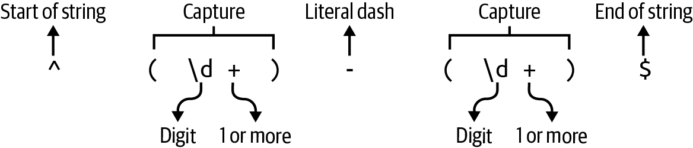

# Chapter 8. Shave and a Haircut

> I’m a mess / Since you cut me out / But Chucky’s arm keeps me company
>
> They Might Be Giants, “Cyclops Rock” (2001)

For the next challenge program, you will create a Rust version of `cut`, which will excise text from a file or `STDIN`. The selected text could be some range of bytes or characters or might be fields denoted by a delimiter like a comma or tab that creates field boundaries. You learned how to select a contiguous range of characters or bytes in Chapter 4, while working on the `headr` program, but this challenge goes further as the selections may be noncontiguous and in any order. For example, the selection `3,1,5-7` should cause the challenge program to print the third, first, and fifth through seventh bytes, characters, or fields, in that order. The challenge program will capture the spirit of the original but will not strive for complete fidelity, as I will suggest a few changes that I feel are improvements.

In this chapter, you will learn how to do the following:

- Read and write a delimited text file using the `csv` crate

- Deference a value using `*`

- Use `Iterator::flatten` to remove nested structures from iterators

- Use `Iterator::flat_map` to combine `Iterator::map` and `Iterator::flatten`

# How cut Works

I will start by reviewing the portion of the BSD `cut` manual page that describes the features of the program you will write:

```
CUT(1)                    BSD General Commands Manual                   CUT(1)

NAME
     cut -- cut out selected portions of each line of a file

SYNOPSIS
     cut -b list [-n] [file ...]
     cut -c list [file ...]
     cut -f list [-d delim] [-s] [file ...]

DESCRIPTION
     The cut utility cuts out selected portions of each line (as specified by
     list) from each file and writes them to the standard output.  If no file
     arguments are specified, or a file argument is a single dash ('-'), cut
     reads from the standard input.  The items specified by list can be in
     terms of column position or in terms of fields delimited by a special
     character.  Column numbering starts from 1.

     The list option argument is a comma or whitespace separated set of num-
     bers and/or number ranges.  Number ranges consist of a number, a dash
     ('-'), and a second number and select the fields or columns from the
     first number to the second, inclusive.  Numbers or number ranges may be
     preceded by a dash, which selects all fields or columns from 1 to the
     last number.  Numbers or number ranges may be followed by a dash, which
     selects all fields or columns from the last number to the end of the
     line.  Numbers and number ranges may be repeated, overlapping, and in any
     order.  If a field or column is specified multiple times, it will appear
     only once in the output.  It is not an error to select fields or columns
     not present in the input line.
```

The original tool offers quite a few options, but the challenge program will implement only the following:

```
     -b list
             The list specifies byte positions.

     -c list
             The list specifies character positions.

     -d delim
             Use delim as the field delimiter character instead of the tab
             character.

     -f list
             The list specifies fields, separated in the input by the field
             delimiter character (see the -d option.)  Output fields are sepa-
             rated by a single occurrence of the field delimiter character.
```

As usual, the GNU version offers both short and long flags for these options:

```
NAME
       cut - remove sections from each line of files

SYNOPSIS
       cut OPTION... [FILE]...

DESCRIPTION
       Print selected parts of lines from each FILE to standard output.

       Mandatory  arguments  to  long  options are mandatory for short options
       too.

       -b, --bytes=LIST
              select only these bytes

       -c, --characters=LIST
              select only these characters

       -d, --delimiter=DELIM
              use DELIM instead of TAB for field delimiter

       -f, --fields=LIST
              select only these fields;  also print any line that contains  no
              delimiter character, unless the -s option is specified
```

Both tools implement the selection ranges in similar ways, where numbers can be selected individually, in closed ranges like `1-3`, or in partially defined ranges like `-3` to indicate 1 through 3 or `5-` to indicate 5 to the end, but the challenge program will support only closed ranges. I’ll use some of the files found in the book’s *08_cutr/tests​/⁠inputs* directory to show the features that the challenge program will implement. You should change into this directory if you want to execute the following commands:

```
$ cd 08_cutr/tests/inputs
```

First, consider a file of *fixed-width text* where each column occupies a fixed number of characters:

```
$ cat books.txt
Author              Year Title
Émile Zola          1865 La Confession de Claude
Samuel Beckett      1952 Waiting for Godot
Jules Verne         1870 20,000 Leagues Under the Sea
```

The *Author* column takes the first 20 characters:

```
$ cut -c 1-20 books.txt
Author
Émile Zola
Samuel Beckett
Jules Verne
```

The publication *Year* column spans the next five characters:

```
$ cut -c 21-25 books.txt
Year
1865
1952
1870
```

The *Title* column fills the remainder of the line, where the longest title is 28 characters. Note here that I intentionally request a larger range than exists to show that this is not considered an error:

```
$ cut -c 26-70 books.txt
Title
La Confession de Claude
Waiting for Godot
20,000 Leagues Under the Sea
```

The program does not allow me to rearrange the output by requesting the range `26-55` for the *Title* followed by the range `1-20` for the *Author*. Instead, the selections are placed in their original, ascending order:

```
$ cut -c 26-55,1-20 books.txt
Author              Title
Émile Zola          La Confession de Claude
Samuel Beckett      Waiting for Godot
Jules Verne         20,000 Leagues Under the Sea
```

I can use the option `-c 1` to select the first character, like so:

```
$ cut -c 1 books.txt
A
É
S
J
```

As you’ve seen in previous chapters, bytes and characters are not always interchangeable. For instance, the *É* in *Émile Zola* is a Unicode character that is composed of two bytes, so asking for just one byte will result in invalid UTF-8 that is represented with the Unicode replacement character:

```
$ cut -b 1 books.txt
A
�
S
J
```

In my experience, fixed-width datafiles are less common than those where the columns of data are delimited by a character such as a comma or a tab. Consider the same data in the file *books.tsv*, where the file extension *.tsv* stands for *tab-separated values* (TSV), and the columns are delimited by the tab:

```
$ cat books.tsv
Author  Year    Title
Émile Zola  1865    La Confession de Claude
Samuel Beckett  1952    Waiting for Godot
Jules Verne 1870    20,000 Leagues Under the Sea
```

By default, `cut` will assume the tab character is the field delimiter, so I can use the `-f` option to select, for instance, the publication year in the second column and the title in the third column, like so:

```
$ cut -f 2,3 books.tsv
Year    Title
1865    La Confession de Claude
1952    Waiting for Godot
1870    20,000 Leagues Under the Sea
```

The comma is another common delimiter, and such files often have the extension *.csv* for *comma-separated values* (CSV). Following is the same data as a CSV file:

```
$ cat books.csv
Author,Year,Title
Émile Zola,1865,La Confession de Claude
Samuel Beckett,1952,Waiting for Godot
Jules Verne,1870,"20,000 Leagues Under the Sea"
```

To parse a CSV file, I must indicate the delimiter with the `-d` option. Note that I’m still unable to reorder the fields in the output, as I indicate `2,1` for the second column followed by the first, but I get the columns back in their original order:

```
$ cut -d , -f 2,1 books.csv
Author,Year
Émile Zola,1865
Samuel Beckett,1952
Jules Verne,1870
```

You may have noticed that the third title contains a comma in *20,000* and so the title has been enclosed in quotes to indicate that this comma is not a field delimiter. This is a way to *escape* the delimiter, or to tell the parser to ignore it. Unfortunately, neither the BSD nor the GNU version of `cut` recognizes this and so will truncate the title prematurely:

```
$ cut -d , -f 1,3 books.csv
Author,Title
Émile Zola,La Confession de Claude
Samuel Beckett,Waiting for Godot
Jules Verne,"20
```

Noninteger values for any of the `list` option values are rejected:

```
$ cut -f foo,bar books.tsv
cut: [-cf] list: illegal list value
```

Any error opening a file is handled in the course of processing, printing a message to `STDERR`. In the following example, *blargh* represents a nonexistent file:

```
$ cut -c 1 books.txt blargh movies1.csv
A
É
S
J
cut: blargh: No such file or directory
t
T
L
```

Finally, the program will read `STDIN` by default or if the given input filename is a dash (`-`):

```
$ cat books.tsv | cut -f 2
Year
1865
1952
1870
```

The challenge program is expected to implement just this much, with the following changes:

- Ranges must indicate both start and stop values (inclusive).

- Selection ranges should be printed in the order specified by the user.

- Ranges may include repeated values.

- The parsing of delimited text files should respect escaped delimiters.

# Getting Started

The name of the challenge program should be `cutr` (pronounced *cut-er*) for a Rust version of `cut`. I recommend you begin with **`cargo new cutr`** and then copy the *08_cutr/tests* directory into your project. My solution will use the following crates, which you should add to your *Cargo.toml*:

``` toml
[dependencies]
anyhow = "1.0.79"
clap = { version = "4.5.0", features = ["derive"] }
csv = "1.3.0" ①
regex = "1.10.3"

[dev-dependencies]
assert_cmd = "2.0.13"
predicates = "3.0.4"
pretty_assertions = "1.4.0"
rand = "0.8.5"
```

  
The [`csv` crate](https://oreil.ly/cE8fC) will be used to parse delimited files such as CSV files.

Run **`cargo test`** to download the dependencies and run the tests, all of which should fail.

## Defining the Arguments

Following is the expected usage for the program:

```
$ cargo run -- --help
Rust version of `cut`

Usage: cutr [OPTIONS] <--fields <FIELDS>|--bytes <BYTES>|--chars <CHARS>> ①
       [FILES]...

Arguments:
  [FILES]...  Input file(s) [default: -] ②

Options:
  -d, --delimiter <DELIMITER>  Field delimiter [default: "\t"] ③
  -f, --fields <FIELDS>        Selected fields
  -b, --bytes <BYTES>          Selected bytes
  -c, --chars <CHARS>          Selected chars
  -h, --help                   Print help
  -V, --version                Print version
```

  
Exactly one of `--fields`, `--bytes`, or `--chars` is required.

  
The input files are optional, and the default is `STDIN` as denoted by a dash.

  
The default record delimiter is the tab character.

To have `clap` require one of `--fields`, `--bytes`, or `--chars` when using the derive pattern, I will create an [`ArgGroup`](https://oreil.ly/1h53Z) using following structures for the program’s arguments:

``` rust
#[derive(Debug)]
struct Args {
    files: Vec<String>, ①
    delimiter: String, ②
    extract: ArgsExtract, ③
}

#[derive(Debug)]
struct ArgsExtract { ④
    fields: Option<String>,
    bytes: Option<String>,
    chars: Option<String>,
}
```

  
The `files` parameter is a vector of strings.

  
The `delimiter` is the character separating the columns.

  
The `extract` field points to a separate struct.

  
The `ArgsExtract` struct is used by `clap` to group these arguments.

If you prefer the derive pattern, annotate the preceding structs to produce the expected usage statement. If you prefer to use the builder pattern, you can start your `get_args` by expanding on the following skeleton. Note that defining an `ArgGroup` using the builder pattern does not require any separation of structures, but for the sake of consistency, I will use the preceding structs for both versions of the program:

``` rust
fn get_args() -> Args {
    let matches = Command::new("cutr")
        .version("0.1.0")
        .author("Ken Youens-Clark <kyclark@gmail.com>")
        .about("Rust version of `cut`")
        // What goes here?
        .get_matches();

    Args {
        files: ...
        delimiter: ...
        extract: ...
    }
}
```

The first order of business is pretty-printing the runtime values in `main`:

``` rust
fn main() {
    let args = get_args();
    println!("{:#?}", args);
}
```

When run with no arguments, your program should fail as follows:

```
$ cargo run
error: the following required arguments were not provided:
  <--fields <FIELDS>|--bytes <BYTES>|--chars <CHARS>>

Usage: cutr <--fields <FIELDS>|--bytes <BYTES>|--chars <CHARS>> [FILES]...
```

When run with one of the required arguments, it should print a struct as follows:

```
$ cargo run -- -f 1
Args {
    files: [ ①
        "-",
    ],
    delimiter: "\t", ②
    extract: ArgsExtract {
        fields: Some( ③
            "1",
        ),
        bytes: None,
        chars: None,
    },
}
```

  
The default file input is a dash.

  
The default delimiter is a tab.

  
The `--fields` value of `1` is part of the `ArgsExtract` struct.

Verify that the other arguments are parsed correctly:

```
$ cargo run -- -b 4 -d , tests/inputs/movies1.csv
Args {
    files: [
        "tests/inputs/movies1.csv", ①
    ],
    delimiter: ",", ②
    extract: ArgsExtract {
        fields: None,
        bytes: Some( ③
            "4",
        ),
        chars: None,
    },
}
```

  
The positional argument is parsed into the `files` field.

  
The `-d` argument is parsed into the `delimiter` field.

  
The `-b` argument is parsed into the `bytes` field.

The options for `-f|--fields`, `-b|--bytes`, and `-c|--chars` should all be mutually exclusive:

```
$ cargo run -- -f 1 -b 8-9 tests/inputs/movies1.tsv
error: the argument '--fields <FIELDS>' cannot be used with '--bytes <BYTES>'

Usage: cutr <--fields <FIELDS>|--bytes <BYTES>|--chars <CHARS>> [FILES]...
```

###### Note

Stop reading and get your program to match the preceding behavior. It should pass five tests for bad inputs when you run **`cargo test dies`**.

If you chose the builder pattern, your `get_args` function probably looks like the following. Be sure to add `use clap::{Arg, ArgGroup, Command}` for the following code:

``` rust
fn get_args() -> Args {
    let matches = Command::new("cutr")
        .version("0.1.0")
        .author("Ken Youens-Clark <kyclark@gmail.com>")
        .about("Rust version of `cut`")
        .arg(
            Arg::new("files") ①
                .value_name("FILES")
                .help("Input file(s)")
                .num_args(0..)
                .default_value("-"),
        )
        .arg(
            Arg::new("delimiter") ②
                .value_name("DELIMITER")
                .short('d')
                .long("delim")
                .help("Field delimiter")
                .default_value("\t"),
        )
        .arg(
            Arg::new("fields") ③
                .value_name("FIELDS")
                .short('f')
                .long("fields")
                .help("Selected fields"),
        )
        .arg(
            Arg::new("bytes") ④
                .value_name("BYTES")
                .short('b')
                .long("bytes")
                .help("Selected bytes"),
        )
        .arg(
            Arg::new("chars") ⑤
                .value_name("CHARS")
                .short('c')
                .long("chars")
                .help("Selected characters"),
        )
        .group(
            ArgGroup::new("extract")
                .args(["fields", "bytes", "chars"]) ⑥
                .required(true)
                .multiple(false),
        )
        .get_matches();

    Args {
        files: matches.get_many("files").unwrap().cloned().collect(),
        delimiter: matches.get_one("delimiter").cloned().unwrap(),
        extract: ArgsExtract { ⑦
            fields: matches.get_one("fields").cloned(),
            bytes: matches.get_one("bytes").cloned(),
            chars: matches.get_one("chars").cloned(),
        },
    }
}
```

  
The `files` argument is positional, not required, and defaults to a dash.

  
The `delimiter` option defaults to a tab.

  
`fields` is optional.

  
`bytes` is optional.

  
`chars` is optional.

  
This creates an argument group that requires exactly one of the members.

  
A struct can contain another struct.

The derive pattern requires `use clap::Parser` and looks like the following:

``` rust
#[derive(Debug, Parser)]
#[command(author, version, about)]
/// Rust version of `cut`
struct Args {
    /// Input file(s)
    #[arg(default_value = "-")]
    files: Vec<String>,

    /// Field delimiter
    #[arg(short, long, value_name = "DELIMITER", default_value = "\t")]
    delimiter: String,

    #[command(flatten)] ①
    extract: ArgsExtract,
}

#[derive(Debug, clap::Args)] ②
#[group(required = true, multiple = false)] ③
struct ArgsExtract {
    /// Selected fields
    #[arg(short, long, value_name = "FIELDS")]
    fields: Option<String>,

    /// Selected bytes
    #[arg(short, long, value_name = "BYTES")]
    bytes: Option<String>,

    /// Selected chars
    #[arg(short, long, value_name = "CHARS")]
    chars: Option<String>,
}
```

  
The `flatten` will merge the `ArgsExtract` into the `Args` struct.

  
Note that I `derive` from the fully qualified `clap::Args` to avoid namespace collisions with my own `Args`.

  
The `group` annotation creates the `ArgGroup`.

Next, it’s time to go further in validating the arguments.

## Validating the Delimiter

I first suggest you introduce a `run` function as in previous chapters. Add `use anyhow::Result` and the following:

``` rust
fn main() {
    if let Err(e) = run(Args::parse()) {
        eprintln!("{e}");
        std::process::exit(1);
    }
}

fn run(_args: Args) -> Result<()> {
    Ok(())
}
```

Later in the program, I’ll be using the [`csv` crate](https://oreil.ly/B3F6c) to parse the input file, which requires the delimiter to be a single unsigned 8-bit integer [`u8`](https://oreil.ly/P5d3b). The program currently fails the test **`cargo test dies_bad_delimiter`** that ensures the delimiter input is correct. I can look at the source code in *tests/cli.rs* to see the expected error message:

``` rust
#[test]
fn dies_bad_delimiter() -> Result<()> {
    dies(
        &[CSV, "-f", "1", "-d", ",,"], ①
        r#"--delim ",," must be a single byte"#, ②
    )
}
```

  
The program is run with two commas for the delimiter.

  
The error should echo the given delimiter along with how to fix the input.

###### Note

Stop reading and write the code necessary to pass this test. Be aware that I added `use anyhow::bail` to include the [`bail`](https://oreil.ly/wCanm) macro to return from `run` with an error message.

Following is how I ensure that the delimiter is a single byte:

``` rust
fn run(args: Args) -> Result<()> {
    let delim_bytes = args.delimiter.as_bytes(); ①
    if delim_bytes.len() != 1 { ②
        bail!(r#"--delim "{}" must be a single byte"#, args.delimiter); ③
    }
    let delimiter: u8 = *delim_bytes.first().unwrap(); ④
    println!("{delimiter}");
    Ok(())
}
```

  
Use [`String::as_bytes`](https://oreil.ly/e-MWZ) to break the string into a vector of `u8`.

  
Check if the vector’s length is any value other than one.

  
Return an error using a *raw* string so the contained double quotes do not require escaping.

  
Use [`Vec::first`](https://oreil.ly/rFrS8) to select the first element of the vector. Because I have verified that this vector has exactly one byte, it is safe to call `Option::unwrap`.

In the preceding code, I use the [`Deref::deref`](https://oreil.ly/VCe9J) operator `*` in the expression `*delim_bytes` to dereference the variable, which is a `&u8`. The code will not compile without the asterisk, and the error message shows exactly where to add the dereference operator:

```
error[E0308]: mismatched types
  --> src/main.rs:59:25
   |
59 |     let delimiter: u8 = delim_bytes.first().unwrap();
   |                    --   ^^^^^^^^^^^^^^^^^^^^^^^^^^^^ expected `u8`,
   |                    |                                 found `&u8`
   |                    |
   |                    expected due to this
   |
help: consider dereferencing the borrow
   |
59 |     let delimiter: u8 = *delim_bytes.first().unwrap();
   |                         +
```

## Requirements for Parsing the Position List

I will define a type alias `PositionList` to describe the fields, bytes, or characters that I want to display from the input files. This is a `Vec<Range<usize>>` or a vector of [`std::ops::Range` structs](https://oreil.ly/gA0sx) to represent spans of positive integer values. I will then use this type in a new `enum` to say which of `Fields`, `Bytes`, or `Chars` I should extract:

``` rust
type PositionList = Vec<Range<usize>>;①

#[derive(Debug)] ②
pub enum Extract {
    Fields(PositionList),
    Bytes(PositionList),
    Chars(PositionList),
}
```

  
A `PositionList` is a vector of `Range<usize>` values.

  
Define an `enum` to hold the variants for extracting fields, bytes, or characters.

Unlike the original `cut` tool, the challenge program will allow only for the input ranges to be a comma-separated list of either single numbers or closed ranges like `2-4`. Also, the challenge program will use the selections in the given order rather than rearranging them in ascending order.

To parse and validate the range values for the byte, character, and field arguments, I wrote a function called `parse_pos`. Here is how you might start it:

``` rust
fn parse_pos(range: String) -> Result<PositionList> { ①
    unimplemented!(); ②
}
```

  
This function accepts a `String` and will either return a `PositionList` or an error.

  
The [`unimplemented!` macro](https://oreil.ly/hqKK8) will cause the program to *panic* or prematurely terminate with the message *not implemented*.

To help you along, I have written an extensive unit test for the numbers and number ranges that should be accepted or rejected. The numbers may have leading zeros but may not have any nonnumeric characters, and number ranges must be denoted with a dash (`-`). Multiple numbers and ranges can be separated with commas. In this chapter, I will create a `unit_tests` module so that **`cargo test unit`** will run all the unit tests. Note that my implementation of `parse_pos` uses index positions where I subtract one from each value for zero-based indexing, but you may prefer to handle this differently. Add the following to your source code:

``` rust
#[cfg(test)]
mod unit_tests {
    use super::parse_pos;

    #[test]
    fn test_parse_pos() {
        // The empty string is an error
        assert!(parse_pos("".to_string()).is_err());

        // Zero is an error
        let res = parse_pos("0".to_string());
        assert!(res.is_err());
        assert_eq!(
            res.unwrap_err().to_string(),
            r#"illegal list value: "0""#
        );

        let res = parse_pos("0-1".to_string());
        assert!(res.is_err());
        assert_eq!(
            res.unwrap_err().to_string(),
            r#"illegal list value: "0""#
        );

        // A leading "+" is an error
        let res = parse_pos("+1".to_string());
        assert!(res.is_err());
        assert_eq!(
            res.unwrap_err().to_string(),
            r#"illegal list value: "+1""#,
        );

        let res = parse_pos("+1-2".to_string());
        assert!(res.is_err());
        assert_eq!(
            res.unwrap_err().to_string(),
            r#"illegal list value: "+1-2""#,
        );

        let res = parse_pos("1-+2".to_string());
        assert!(res.is_err());
        assert_eq!(
            res.unwrap_err().to_string(),
            r#"illegal list value: "1-+2""#,
        );

        // Any non-number is an error
        let res = parse_pos("a".to_string());
        assert!(res.is_err());
        assert_eq!(
            res.unwrap_err().to_string(),
            r#"illegal list value: "a""#
        );

        let res = parse_pos("1,a".to_string());
        assert!(res.is_err());
        assert_eq!(
            res.unwrap_err().to_string(),
            r#"illegal list value: "a""#
        );

        let res = parse_pos("1-a".to_string());
        assert!(res.is_err());
        assert_eq!(
            res.unwrap_err().to_string(),
            r#"illegal list value: "1-a""#,
        );

        let res = parse_pos("a-1".to_string());
        assert!(res.is_err());
        assert_eq!(
            res.unwrap_err().to_string(),
            r#"illegal list value: "a-1""#,
        );

        // Wonky ranges
        let res = parse_pos("-".to_string());
        assert!(res.is_err());

        let res = parse_pos(",".to_string());
        assert!(res.is_err());

        let res = parse_pos("1,".to_string());
        assert!(res.is_err());

        let res = parse_pos("1-".to_string());
        assert!(res.is_err());

        let res = parse_pos("1-1-1".to_string());
        assert!(res.is_err());

        let res = parse_pos("1-1-a".to_string());
        assert!(res.is_err());

        // First number must be less than second
        let res = parse_pos("1-1".to_string());
        assert!(res.is_err());
        assert_eq!(
            res.unwrap_err().to_string(),
            "First number in range (1) must be lower than second number (1)"
        );

        let res = parse_pos("2-1".to_string());
        assert!(res.is_err());
        assert_eq!(
            res.unwrap_err().to_string(),
            "First number in range (2) must be lower than second number (1)"
        );

        // All the following are acceptable
        let res = parse_pos("1".to_string());
        assert!(res.is_ok());
        assert_eq!(res.unwrap(), vec![0..1]);

        let res = parse_pos("01".to_string());
        assert!(res.is_ok());
        assert_eq!(res.unwrap(), vec![0..1]);

        let res = parse_pos("1,3".to_string());
        assert!(res.is_ok());
        assert_eq!(res.unwrap(), vec![0..1, 2..3]);

        let res = parse_pos("001,0003".to_string());
        assert!(res.is_ok());
        assert_eq!(res.unwrap(), vec![0..1, 2..3]);

        let res = parse_pos("1-3".to_string());
        assert!(res.is_ok());
        assert_eq!(res.unwrap(), vec![0..3]);

        let res = parse_pos("0001-03".to_string());
        assert!(res.is_ok());
        assert_eq!(res.unwrap(), vec![0..3]);

        let res = parse_pos("1,7,3-5".to_string());
        assert!(res.is_ok());
        assert_eq!(res.unwrap(), vec![0..1, 6..7, 2..5]);

        let res = parse_pos("15,19-20".to_string());
        assert!(res.is_ok());
        assert_eq!(res.unwrap(), vec![14..15, 18..20]);
    }
}
```

Some of the preceding tests check for a specific error message to help you write the `parse_pos` function; however, these could prove troublesome if you were trying to internationalize the error messages. An alternative way to check for specific errors would be to use `enum` variants that would allow the user interface to customize the output while still testing for specific errors.

###### Note

At this point, I expect you can read the preceding code well enough to understand how the function should work. I recommend you stop reading at this point and write the code that will pass this test.

After **`cargo test unit`** passes, incorporate the `parse_pos` function into `run` so that your program will reject invalid arguments and print an error message like the following:

```
$ cargo run -- -f foo,bar tests/inputs/books.tsv
illegal list value: "foo"
```

The program should also reject invalid ranges:

```
$ cargo run -- -f 3-2 tests/inputs/books.tsv
First number in range (3) must be lower than second number (2)
```

When given valid arguments, your program should be able to print the `Extract` argument like so:

```
$ cargo run -- -f 4-8 tests/inputs/movies1.csv ①
Fields([3..8])
```

  
The `-f 4-8` one-based input creates the `Extract::Fields` variant that holds a single range of zero-offset numbers, `3..8`.

###### Note

Stop here and get your program working as described. The program should be able to pass all the tests that validate the inputs, which you can run with **`cargo test dies`**:

```
running 10 tests
test dies_bad_delimiter ... ok
test dies_chars_fields ... ok
test dies_chars_bytes_fields ... ok
test dies_bytes_fields ... ok
test dies_chars_bytes ... ok
test dies_not_enough_args ... ok
test dies_empty_delimiter ... ok
test dies_bad_digit_field ... ok
test dies_bad_digit_bytes ... ok
test dies_bad_digit_chars ... ok
```

If you find you need more guidance on writing the `parse_pos` function, I’ll provide that in the next section.

## Solution for Parsing the Position List

The `parse_pos` function I will show relies on a `parse_index` function that attempts to parse a string into a positive index value one less than the given number, because the user will provide one-based values but Rust needs zero-offset indexes. The given string may not start with a plus sign, and the parsed value must be greater than zero. Note that closures normally accept arguments inside pipes (`||`), but the following function uses two closures that accept no arguments, which is why the pipes are empty. Both closures instead reference the provided `input` value. For the following code, be sure to use `anyhow::anyhow` and `std::num::NonZeroUsize`:

``` rust
fn parse_index(input: &str) -> Result<usize> {
    let value_error = || anyhow!(r#"illegal list value: "{input}""#); ①
    input
        .starts_with('+') ②
        .then(|| Err(value_error())) ③
        .unwrap_or_else(|| { ④
            input
                .parse::<NonZeroUsize>() ⑤
                .map(|n| usize::from(n) - 1) ⑥
                .map_err(|_| value_error()) ⑦
        })
}
```

  
Create a closure that accepts no arguments and formats an error string.

  
Check if the input value starts with a plus sign.

  
If so, create an error.

  
Otherwise, continue with the following closure, which accepts no arguments.

  
Use `str::parse` to parse the input value, and use the turbofish to indicate the return type of [`std::num::NonZeroUsize`](https://oreil.ly/ec44d), which is a positive integer value.

  
If the input value parses successfully, cast the value to a `usize` and decrement the value to a zero-based offset.

  
If the value does not parse, generate an error by calling the `value_error` closure.

The following is how `parse_index` is used in the `parse_pos` function. Add `use regex::Regex` to your imports for this:

``` rust
fn parse_pos(range: String) -> Result<PositionList> {
    let range_re = Regex::new(r"^(\d+)-(\d+)$").unwrap(); ①
    range
        .split(',') ②
        .into_iter()
        .map(|val| { ③
            parse_index(val).map(|n| n..n + 1).or_else(|e| { ④
                range_re.captures(val).ok_or(e).and_then(|captures| { ⑤
                    let n1 = parse_index(&captures[1])?; ⑥
                    let n2 = parse_index(&captures[2])?;
                    if n1 >= n2 { ⑦
                        bail!(
                            "First number in range ({}) \
                            must be lower than second number ({})",
                            n1 + 1,
                            n2 + 1
                        );
                    }
                    Ok(n1..n2 + 1) ⑧
                })
            })
        })
        .collect::<Result<_, _>>() ⑨
        .map_err(From::from) ⑩
}
```

  
Create a regular expression to match two integers separated by a dash, using parentheses to capture the matched numbers.

  
Split the provided range value on the comma and turn the result into an iterator. In the event there are no commas, the provided value itself will be used.

  
Map each split value into the closure.

  
If `parse_index` parses a single number, then create a `Range` for the value. Otherwise, note the error value `e` and continue trying to parse a range.

  
If the `Regex` matches the value, the numbers in parentheses will be available through [`Regex::captures`](https://oreil.ly/O6frw).

  
Parse the two captured numbers as index values.

  
If the first value is greater than or equal to the second, return an error.

  
Otherwise, create a `Range` from the lower number to the higher number, adding 1 to ensure the upper number is included.

  
Use [`Iterator::collect`](https://oreil.ly/Xn28H) to gather the values as a `Result`.

  
Map any problems through [`From::from`](https://oreil.ly/sXlWa) to create an error.

The regular expression in the preceding code is represented using a raw string to prevent Rust from interpreting backslash-escaped values in the string. For instance, you’ve seen that Rust will interpret `\n` as a newline. Without this, the compiler complains that `\d` is an *unknown character escape*:

```
error: unknown character escape: `d`
   --> src/main.rs:146:35
    |
146 |     let range_re = Regex::new("^(\d+)-(\d+)$").unwrap();
    |                                   ^ unknown character escape
    |
    = help: for more information, visit
    <https://doc.rust-lang.org/reference/tokens.html#literals>
help: if you meant to write a literal backslash (perhaps escaping in a
regular expression), consider a raw string literal
```

I would like to highlight the parentheses in the regular expression `^(\d+)-(\d+)$` to indicate one or more digits followed by a dash followed by one or more digits, as shown in Figure 8-1. If the regular expression matches the given string, then I can use `Regex::captures` to extract the digits that are surrounded by the parentheses. Note that they are available in one-based counting, so the contents of the first capturing parentheses are available in position `1` of the captures.



###### Figure 8-1. The parentheses in the regular expression will capture the values they surround.

###### Note

Now that you have a way to parse and validate the numeric ranges, incorporate this into your `run` function to transform your `ArgsExtract` into an `Extract` enum before reading further.

Following is how I incorporate the `parse_pos` function into my `run` to figure out which `Extract` variant to create or generate an error if the user fails to select bytes, characters, or fields:

``` rust
fn run(args: Args) -> Result<()> {
    // Same as before

    let extract = if let Some(fields) =
        args.extract.fields.map(parse_pos).transpose()? ①
    {
        Extract::Fields(fields)
    } else if let Some(bytes) =
        args.extract.bytes.map(parse_pos).transpose()?
    {
        Extract::Bytes(bytes)
    } else if let Some(chars) =
        args.extract.chars.map(parse_pos).transpose()?
    {
        Extract::Chars(chars)
    } else {
        unreachable!("Must have --fields, --bytes, or --chars"); ②
    };

    println!("{extract:?}");

    Ok(())
}
```

  
Attempt to call `parse_pos` through [`Option::map`](https://oreil.ly/DOpks) on `args.extract.fields`, using [`Result::transpose`](https://oreil.ly/HIxb_) to turn the `Result` of an `Option` into an `Option` of a `Result`.

  
Logically, this line should never be executed, so call the [`unreachable!`](https://oreil.ly/pwSIv) macro to cause a panic.

Next, you will need to figure out how you will use this information to extract the desired bits from the inputs.

## Extracting Characters or Bytes

In Chapters 4 and 5, you learned how to process lines, bytes, and characters in a file. You should draw on those programs to help you select characters and bytes in this challenge. One difference is that line endings need not be preserved, so you may use [`BufRead::lines`](https://oreil.ly/KhmCp) to read the lines of input text. To start, you might consider bringing in the `open` function to open each file:

``` rust
fn open(filename: &str) -> Result<Box<dyn BufRead>> {
    match filename {
        "-" => Ok(Box::new(BufReader::new(io::stdin()))),
        _ => Ok(Box::new(BufReader::new(File::open(filename)?))),
    }
}
```

The preceding function will require some additional imports from the `std` namespace:

``` rust
use std::{
    fs::File,
    io::{self, BufRead, BufReader},
    num::NonZeroUsize,
    ops::Range,
};
```

You can expand your `run` to handle good and bad files:

``` rust
fn run(args: Args) -> Result<()> {
    // Same as before

    for filename in &args.files {
        match open(filename) {
            Err(err) => eprintln!("{filename}: {err}"),
            Ok(_) => println!("Opened {filename}"),
        }
    }
    Ok(())
}
```

At this point, the program should pass **`cargo test skips_bad_file`**, and you can manually verify that it skips invalid files such as the nonexistent *blargh*:

```
$ cargo run -- -c 1 tests/inputs/books.csv blargh
Opened tests/inputs/books.csv
blargh: No such file or directory (os error 2)
```

Now consider how you might extract ranges of characters from each line of a filehandle. I wrote a function called `extract_chars` that will return a new string composed of the characters at the given index positions:

``` rust
fn extract_chars(line: &str, char_pos: &[Range<usize>]) -> String {
    unimplemented!();
}
```

###### Note

I originally wrote the preceding function with the type annotation `&PositionList` for `char_pos`, but the type `&[Range<usize>]` is more flexible for callers, especially for writing tests.

The following is a test you can add to the `unit_tests` module. Be sure to add `extract_chars` to the module’s imports:

``` rust
#[test]
fn test_extract_chars() {
    assert_eq!(extract_chars("", &[0..1]), "".to_string());
    assert_eq!(extract_chars("ábc", &[0..1]), "á".to_string());
    assert_eq!(extract_chars("ábc", &[0..1, 2..3]), "ác".to_string());
    assert_eq!(extract_chars("ábc", &[0..3]), "ábc".to_string());
    assert_eq!(extract_chars("ábc", &[2..3, 1..2]), "cb".to_string());
    assert_eq!(
        extract_chars("ábc", &[0..1, 1..2, 4..5]),
        "áb".to_string()
    );
}
```

I also wrote a similar `extract_bytes` function to parse out bytes:

``` rust
fn extract_bytes(line: &str, byte_pos: &[Range<usize>]) -> String {
    unimplemented!();
}
```

For the following unit test, be sure to add `extract_bytes` to the module’s imports:

``` rust
#[test]
fn test_extract_bytes() {
    assert_eq!(extract_bytes("ábc", &[0..1]), "�".to_string()); ①
    assert_eq!(extract_bytes("ábc", &[0..2]), "á".to_string());
    assert_eq!(extract_bytes("ábc", &[0..3]), "áb".to_string());
    assert_eq!(extract_bytes("ábc", &[0..4]), "ábc".to_string());
    assert_eq!(extract_bytes("ábc", &[3..4, 2..3]), "cb".to_string());
    assert_eq!(extract_bytes("ábc", &[0..2, 5..6]), "á".to_string());
}
```

  
Note that selecting one byte from the string *ábc* should break the multibyte *á* and result in the Unicode replacement character.

###### Note

Once you have written these two functions so that they pass tests, incorporate them into your main program so that you pass the integration tests for printing bytes and characters. The failing tests that include *tsv* and *csv* in the names involve reading text delimited by tabs and commas, which I’ll discuss in the next section.

## Parsing Delimited Text Files

Next, you will need to learn how to parse delimited text files. Technically, all the files you’ve read to this point were delimited in some manner, such as with newlines to denote the end of a line. In this case, a delimiter like a tab or a comma is used to separate the fields of a record, which is terminated with a newline. Sometimes the delimiting character may also be part of the data, as when the title *20,000 Leagues Under the Sea* occurs in a CSV file. In this case, the field should be enclosed in quotes to escape the delimiter. As noted in the chapter’s introduction, neither the BSD nor the GNU version of `cut` respects this escaped delimiter, but the challenge program will. The easiest way to properly parse delimited text is to use something like the `csv` crate. I highly recommend that you first read the [tutorial](https://oreil.ly/Wcapp), which explains the basics of working with delimited text files and how to use the `csv` module effectively.

Consider the following example that shows how you can use this crate to parse delimited data. If you would like to compile and run this code, start a new project, add the `csv = "1.3.0"` dependency to your *Cargo.toml*, and copy the *tests/inputs​/⁠books.csv* file into the root directory of the new project. Use the following for *src​/⁠main.rs*:

``` rust
use csv::{ReaderBuilder, StringRecord};
use std::fs::File;

fn main() -> std::io::Result<()> {
    let mut reader = ReaderBuilder::new() ①
        .delimiter(b',') ②
        .from_reader(File::open("books.csv")?); ③

    println!("{}", fmt(reader.headers()?)); ④
    for record in reader.records() { ⑤
        println!("{}", fmt(&record?)); ⑥
    }

    Ok(())
}

fn fmt(rec: &StringRecord) -> String {
    rec.into_iter().map(|v| format!("{:20}", v)).collect() ⑦
}
```

  
Use [`csv::ReaderBuilder`](https://oreil.ly/aJ-kp) to parse a file.

  
The [`delimiter`](https://oreil.ly/cDuGF) must be a single `u8` byte.

  
The [`from_reader` method](https://oreil.ly/nHl5R) accepts a value that implements the [`Read` trait](https://oreil.ly/wDxvY).

  
The [`Reader::headers` method](https://oreil.ly/BtSg8) will return the column names in the first row as a [`StringRecord`](https://oreil.ly/7UOCm).

  
The [`Reader::records` method](https://oreil.ly/SDfZC) provides access to an iterator over `StringRecord` values.

  
Print a formatted version of the record.

  
Use [`Iterator::map`](https://oreil.ly/cfevE) to format the values into fields 20 characters wide and collect the values into a new `String`.

If you run this program, you will see that the comma in *20,000 Leagues Under the Sea* was not used as a field delimiter because it was found within quotes, which themselves are metacharacters that have been removed:

```
$ cargo run
Author              Year                Title
Émile Zola          1865                La Confession de Claude
Samuel Beckett      1952                Waiting for Godot
Jules Verne         1870                20,000 Leagues Under the Sea
```

###### Tip

In addition to `csv::ReaderBuilder`, you should use [`csv::WriterBuilder`](https://oreil.ly/uXNbn) in your solution to escape the input delimiter in the output of the program.

Think about how you might use some of the ideas I just demonstrated in your challenge program. For example, you could write a function like `extract_fields` that accepts a `csv::StringRecord` and pulls out the fields found in the `PositionList`. For the following function, add `use csv::StringRecord`:

``` rust
fn extract_fields(
    record: &StringRecord,
    field_pos: &[Range<usize>]
) -> Vec<String> {
    unimplemented!();
}
```

Following is a unit test for this function that you can add to the `unit_tests` module:

``` rust
#[test]
fn test_extract_fields() {
    let rec = StringRecord::from(vec!["Captain", "Sham", "12345"]);
    assert_eq!(extract_fields(&rec, &[0..1]), &["Captain"]);
    assert_eq!(extract_fields(&rec, &[1..2]), &["Sham"]);
    assert_eq!(
        extract_fields(&rec, &[0..1, 2..3]),
        &["Captain", "12345"]
    );
    assert_eq!(extract_fields(&rec, &[0..1, 3..4]), &["Captain"]);
    assert_eq!(extract_fields(&rec, &[1..2, 0..1]), &["Sham", "Captain"]);
}
```

At this point, the `unit_tests` module will need all of the following imports:

``` rust
use super::{extract_bytes, extract_chars, extract_fields, parse_pos};
use csv::StringRecord;
```

###### Note

Once you can pass this last unit test, you should use all of the `extract_*` functions to print the desired bytes, characters, and fields from the input files. Be sure to run **`cargo test`** to see what is and is not working. This is a challenging program, so don’t give up too quickly. Fear is the mind-killer.

# Solution

I’ll show you my solution now, but I would again stress that there are many ways to write this program. Any version that passes the test suite is acceptable. I’ll begin by showing how I evolved `extract_chars` to select the characters.

## Selecting Characters from a String

In this first version of `extract_chars`, I initialize a mutable vector to accumulate the results and then use an imperative approach to select the desired characters:

``` rust
fn extract_chars(line: &str, char_pos: &[Range<usize>]) -> String {
    let chars: Vec<_> = line.chars().collect(); ①
    let mut selected: Vec<char> = vec![]; ②

    for range in char_pos.iter().cloned() { ③
        for i in range { ④
            if let Some(val) = chars.get(i) { ⑤
                selected.push(*val) ⑥
            }
        }
    }
    selected.iter().collect() ⑦
}
```

  
Use [`str::chars`](https://oreil.ly/u9LXa) to split the line of text into characters. The `Vec` type annotation is required by Rust because [`Iterator::collect`](https://oreil.ly/Xn28H) can return many different types of collections.

  
Initialize a mutable vector to hold the selected characters.

  
Iterate over each `Range` of indexes.

  
Iterate over each value in the `Range`.

  
Use [`Vec::get`](https://oreil.ly/7xsI8) to select the character at the index. This might fail if the user has requested positions beyond the end of the string, but a failure to select a character should not generate an error.

  
If it’s possible to select the character, use [`Vec::push`](https://oreil.ly/TQlnN) to add it to the `selected` characters. Note the use of `*` to dereference `&val`.

  
Use `Iterator::collect` to create a `String` from the characters.

I can simplify the selection of the characters by using [`Iterator::filter_map`](https://oreil.ly/nZ8Yi), which yields only the values for which the supplied closure returns `Some(value)`:

``` rust
fn extract_chars(line: &str, char_pos: &[Range<usize>]) -> String {
    let chars: Vec<_> = line.chars().collect();
    let mut selected: Vec<char> = vec![];

    for range in char_pos.iter().cloned() {
        selected.extend(range.filter_map(|i| chars.get(i)));
    }
    selected.iter().collect()
}
```

The preceding versions both initialize a variable to collect the results. In this next version, an iterative approach avoids mutability and leads to a shorter function by using `Iterator::map` and `Iterator::flatten`, which, according to [the documentation](https://oreil.ly/RzXDz), “is useful when you have an iterator of iterators or an iterator of things that can be turned into iterators and you want to remove one level of indirection”:

``` rust
fn extract_chars(line: &str, char_pos: &[Range<usize>]) -> String {
    let chars: Vec<_> = line.chars().collect();
    char_pos
        .iter()
        .cloned()
        .map(|range| range.filter_map(|i| chars.get(i))) ①
        .flatten() ②
        .collect()
}
```

  
Use [`Iterator::map`](https://oreil.ly/cfevE) to process each `Range` to select the characters.

  
Use `Iterator::flatten` to remove nested structures.

Without `Iterator::flatten`, Rust will show the following error:

```
error[E0277]: a value of type `std::string::String` cannot be built from an
iterator over elements of type `FilterMap<std::ops::Range<usize>
```

In the `findr` program from Chapter 7, I used `Iterator::filter_map` to combine the operations of `filter` and `map`. Similarly, the operations of `flatten` and `map` can be combined with [`Iterator::flat_map`](https://oreil.ly/zHoNC) in this shortest and final version of the function:

``` rust
fn extract_chars(line: &str, char_pos: &[Range<usize>]) -> String {
    let chars: Vec<_> = line.chars().collect();
    char_pos
        .iter()
        .cloned()
        .flat_map(|range| range.filter_map(|i| chars.get(i)))
        .collect()
}
```

## Selecting Bytes from a String

The selection of bytes is very similar, but I have to deal with the fact that `String::from_utf8_lossy` needs a slice of bytes, unlike the previous example where I could collect an iterator of references to characters into a `String`. As with `extract_chars`, the goal is to return a new string, but there is a potential problem if the byte selection breaks Unicode characters and so produces an invalid UTF-8 string:

``` rust
fn extract_bytes(line: &str, byte_pos: &[Range<usize>]) -> String {
    let bytes = line.as_bytes(); ①
    let selected: Vec<_> = byte_pos
        .iter()
        .cloned()
        .flat_map(|range| range.filter_map(|i| bytes.get(i)).copied()) ②
        .collect();
    String::from_utf8_lossy(&selected).into_owned() ③
}
```

  
Break the line into a vector of bytes.

  
Use `Iterator::flat_map` to select bytes at the wanted positions and copy the selected bytes.

  
Use [`String::from_utf8_lossy`](https://oreil.ly/Bs4Zl) to generate a possibly invalid UTF-8 string from the selected bytes. Use [`Cow::into_owned`](https://oreil.ly/Jpdd0) to clone the data, if needed.

In the preceding code, I’m using `Iterator::get` to select the bytes. This function returns a vector of byte references (`&Vec<&u8>`), but `String::from_utf8_lossy` expects a slice of bytes (`&[u8]`). To fix this, I use [`std::iter::Copied`](https://oreil.ly/5SvXY) to create copies of the elements and avoid the following error:

```
error[E0308]: mismatched types
   --> src/main.rs:159:29
    |
159 |     String::from_utf8_lossy(&selected).into_owned()
    |     ----------------------- ^^^^^^^^^ expected `&[u8]`, found `&Vec<&u8>`
    |     |
    |     arguments to this function are incorrect
    |
    = note: expected reference `&[u8]`
               found reference `&Vec<&u8>`
```

Finally, I would note the necessity of using `Cow::into_owned` at the end of the function. Without this, I get a compilation error that suggests an alternate solution to convert the `Cow` value to a `String`:

```
error[E0308]: mismatched types
   --> src/main.rs:159:5
    |
152 | fn extract_bytes(line: &str, byte_pos: &[Range<usize>]) -> String {
    |                                                            ------
    |             expected `std::string::String` because of return type
...
159 |     String::from_utf8_lossy(&selected)
    |     ^^^^^^^^^^^^^^^^^^^^^^^^^^^^^^^^^^- help: try using a conversion
    |     |                                   method: `.to_string()`
    |     |
    |     expected `String`, found `Cow<'_, str>`
    |
    = note: expected struct `std::string::String`
                 found enum `Cow<'_, str>`
```

While the Rust compiler is extremely strict, I appreciate how informative and helpful the error messages are.

## Selecting Fields from a csv::StringRecord

Selecting the fields from a `csv::StringRecord` is almost identical to extracting characters from a line:

``` rust
fn extract_fields(
    record: &StringRecord,
    field_pos: &[Range<usize>],
) -> Vec<String> {
    field_pos
        .iter()
        .cloned()
        .flat_map(|range| range.filter_map(|i| record.get(i))) ①
        .map(String::from) ②
        .collect()
}
```

  
Use [`StringRecord::get`](https://oreil.ly/pIQuO) to try to get the field for the index position.

  
Use `Iterator::map` to turn `&str` values into `String` values.

There’s another way to write this function so that it will return a `Vec<&str>`, which will be slightly more memory efficient as it will not make copies of the strings. The trade-off is that I must indicate the lifetimes. First, let me naively try to write it like so:

``` rust
// This will not compile
fn extract_fields(
    record: &StringRecord,
    field_pos: &[Range<usize>],
) -> Vec<&str> {
    field_pos
        .iter()
        .cloned()
        .flat_map(|range| range.filter_map(|i| record.get(i)))
        .collect()
}
```

If I try to compile this, the Rust compiler will complain about lifetimes:

```
error[E0106]: missing lifetime specifier
   --> src/main.rs:165:10
    |
163 |     record: &StringRecord,
    |             -------------
164 |     field_pos: &[Range<usize>],
    |                ---------------
165 | ) -> Vec<&str> {
    |          ^ expected named lifetime parameter
    |
    = help: this function's return type contains a borrowed value, but the
    signature does not say whether it is borrowed from `record` or `field_pos`
```

The error message continues with directions for how to amend the code to add lifetimes:

```
help: consider introducing a named lifetime parameter
    |
162 ~ fn extract_fields<'a>(
163 ~     record: &'a StringRecord,
164 ~     field_pos: &'a [Range<usize>],
165 ~ ) -> Vec<&'a str> {
```

The suggestion is actually overconstraining the lifetimes. The returned string slices refer to values owned by the `StringRecord`, so only `record` and the return value need to have the same lifetime. The following version with lifetimes works well:

``` rust
fn extract_fields<'a>(
    record: &'a StringRecord,
    field_pos: &[Range<usize>],
) -> Vec<&'a str> {
    field_pos
        .iter()
        .cloned()
        .flat_map(|range| range.filter_map(|i| record.get(i)))
        .collect()
}
```

Both the version returning `Vec<String>` and the version returning `Vec<&'a str>` will pass the `test_extract_fields` unit test. The latter version is slightly more efficient and shorter but also has more cognitive overhead. Choose whichever version you feel you’ll be able to understand six weeks from now.

## Final Boss

For the following code, be sure to add the following imports:

``` rust
use csv::{ReaderBuilder, StringRecord, WriterBuilder};
```

Here is my `run` function that passes all the tests for printing the desired ranges of characters, bytes, and records:

``` rust
fn run(args: Args) -> Result<()> {
    let delim_bytes = args.delimiter.as_bytes();
    if delim_bytes.len() != 1 {
        bail!(r#"--delim "{}" must be a single byte"#, args.delimiter);
    }
    let delimiter: u8 = *delim_bytes.first().unwrap();

    let extract = if let Some(fields) =
        args.extract.fields.map(parse_pos).transpose()?
    {
        Extract::Fields(fields)
    } else if let Some(bytes) =
        args.extract.bytes.map(parse_pos).transpose()?
    {
        Extract::Bytes(bytes)
    } else if let Some(chars) =
        args.extract.chars.map(parse_pos).transpose()?
    {
        Extract::Chars(chars)
    } else {
        unreachable!("Must have --fields, --bytes, or --chars");
    };

    for filename in &args.files {
        match open(filename) {
            Err(err) => eprintln!("{filename}: {err}"),
            Ok(file) => match &extract {
                Extract::Fields(field_pos) => {
                    let mut reader = ReaderBuilder::new() ①
                        .delimiter(delimiter)
                        .has_headers(false)
                        .from_reader(file);

                    let mut wtr = WriterBuilder::new() ②
                        .delimiter(delimiter)
                        .from_writer(io::stdout());

                    for record in reader.records() { ③
                        wtr.write_record(extract_fields( ④
                            &record?, field_pos,
                        ))?;
                    }
                }
                Extract::Bytes(byte_pos) => {
                    for line in file.lines() { ⑤
                        println!("{}", extract_bytes(&line?, byte_pos));
                    }
                }
                Extract::Chars(char_pos) => {
                    for line in file.lines() { ⑥
                        println!("{}", extract_chars(&line?, char_pos));
                    }
                }
            },
        }
    }
    Ok(())
}
```

  
If the user has requested fields from a delimited file, use `csv::ReaderBuilder` to create a mutable reader using the given delimiter, and do not treat the first row as headers.

  
Use `csv::WriterBuilder` to correctly escape delimiters in the output.

  
Iterate through the records.

  
Write the extracted fields to the output.

  
Iterate the lines of text and print the extracted bytes.

  
Iterate the lines of text and print the extracted characters.

The `csv::Reader` will attempt to parse the first row for the column names by default. For this program, I don’t need to do anything special with these values, so I don’t parse the first line as a header row. If I used the default behavior, I would have to handle the headers separately from the rest of the records.

Note that I’m using the `csv` crate to both parse the input and write the output, so this program will correctly handle delimited text files, which I feel is an improvement over the original `cut` programs. I’ll use *tests/inputs/books.csv* again to demonstrate that `cutr` will correctly select a field containing the delimiter and will create output that properly escapes the delimiter and puts the columns in the requested order:

```
$ cargo run -- -d , -f 3,1 tests/inputs/books.csv
Title,Author
La Confession de Claude,Émile Zola
Waiting for Godot,Samuel Beckett
"20,000 Leagues Under the Sea",Jules Verne
```

This was a fairly complex program with a lot of options, but I found the strictness of the Rust compiler kept me focused on how to write a solution.

# Going Further

I have several ideas for how you can expand this program. Alter the program to allow partial ranges like `-3`, meaning *1–3*, or `5-` to mean *5 to the end*. Consider using [`std::ops::RangeTo`](https://oreil.ly/ZniC2) to model `-3` and [`std::ops::RangeFrom`](https://oreil.ly/azzZY) for `5-`. Be aware that `clap` will try to interpret the value `-3` as an option when you run **`cargo run -- -f -3 tests/inputs/books.tsv`**, so use `-f=-3` instead.

The final version of the challenge program uses the `--delimiter` as the input and output delimiter. Add an option to specify the output delimiter, and have it default to the input delimiter.

The `-n` option that will prevent the splitting of multibyte characters seems like a fun challenge to implement, and I also quite like the `--complement` option from GNU `cut` that complements the set of selected bytes, characters, or fields so that the positions *not* indicated are shown. Finally, for more ideas on how to deal with delimited text records, check out the [`xsv` crate](https://oreil.ly/894fA), a “fast CSV command line toolkit written in Rust” and [`csvchk`](https://crates.io/crates/csvchk) to see a vertical view of delimited text records.

# Summary

Gaze upon the knowledge you gained in this chapter:

- You learned how to dereference a variable that contains a reference using the `*` operator.

- Sometimes actions on iterators return other iterators. You saw how `Iterator​::flatten` will remove the inner structures to flatten the result.

- You learned how the `Iterator::flat_map` method combines `Iterator::map` and `Iterator::flatten` into one operation for more concise code.

- You used a `get` function for selecting positions from a vector or fields from a `csv::StringRecord`. This action might fail, so you used `Iterator::filter_map` to return only those values that are successfully retrieved.

- You compared how to return a `String` versus a `&str` from a function, the latter of which required indicating lifetimes.

- You can now parse and create delimited text using the `csv` crate.

In the next chapter, you will learn more about regular expressions and chaining operations on iterators.