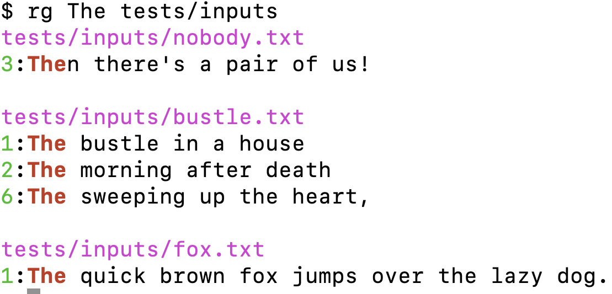

# Chapter 9. Jack the Grepper

> Please explain the expression on your face
>
> They Might Be Giants, “Unrelated Thing” (1994)

In this chapter, you will write a Rust version of `grep`, which will find lines of input that match a given regular expression.^(1) By default the input comes from `STDIN`, but you can provide the names of one or more files or directories if you use a recursive option to find all the files in those directories. The normal output will be the lines that match the given pattern, but you can invert the match to find the lines that don’t match. You can also instruct `grep` to print the number of matching lines instead of the lines of text. Pattern matching is normally case-sensitive, but you can use an option to perform case-insensitive matching. While the original program can do more, the challenge program will go only this far.

In writing this program, you’ll learn about:

- Using a case-sensitive regular expression

- Variations of regular expression syntax

- Another syntax to indicate a trait bound

- Using Rust’s bitwise exclusive-OR operator

# How grep Works

I’ll start by showing the manual page for the BSD `grep` to give you a sense of the many options the command will accept:

```
GREP(1)                   BSD General Commands Manual                  GREP(1)

NAME
     grep, egrep, fgrep, zgrep, zegrep, zfgrep -- file pattern searcher

SYNOPSIS
     grep [-abcdDEFGHhIiJLlmnOopqRSsUVvwxZ] [-A num] [-B num] [-C[num]]
          [-e pattern] [-f file] [--binary-files=value] [--color[=when]]
          [--colour[=when]] [--context[=num]] [--label] [--line-buffered]
          [--null] [pattern] [file ...]

DESCRIPTION
     The grep utility searches any given input files, selecting lines that
     match one or more patterns.  By default, a pattern matches an input line
     if the regular expression (RE) in the pattern matches the input line
     without its trailing newline.  An empty expression matches every line.
     Each input line that matches at least one of the patterns is written to
     the standard output.

     grep is used for simple patterns and basic regular expressions (BREs);
     egrep can handle extended regular expressions (EREs).  See re_format(7)
     for more information on regular expressions.  fgrep is quicker than both
     grep and egrep, but can only handle fixed patterns (i.e. it does not
     interpret regular expressions).  Patterns may consist of one or more
     lines, allowing any of the pattern lines to match a portion of the input.
```

The GNU version is very similar:

```
GREP(1)                     General Commands Manual                    GREP(1)

NAME
       grep, egrep, fgrep - print lines matching a pattern

SYNOPSIS
       grep [OPTIONS] PATTERN [FILE...]
       grep [OPTIONS] [-e PATTERN | -f FILE] [FILE...]

DESCRIPTION
       grep  searches the named input FILEs (or standard input if no files are
       named, or if a single hyphen-minus (-) is given as file name) for lines
       containing  a  match to the given PATTERN.  By default, grep prints the
       matching lines.
```

To demonstrate the features of `grep` that the challenge program is expected to implement, I’ll use some files from the book’s GitHub repository. If you want to follow along, change into the *09_grepr/tests/inputs* directory:

```
$ cd 09_grepr/tests/inputs
```

Here are the files that I’ve included:

- *empty.txt*: an empty file

- *fox.txt*: a file with a single line of text

- *bustle.txt*: a poem by Emily Dickinson with eight lines of text and one blank line

- *nobody.txt*: another poem by the Belle of Amherst with eight lines of text and one blank line

To start, verify for yourself that **`grep fox empty.txt`** will print nothing when using an empty file. As shown by the usage, `grep` accepts a regular expression as the first positional argument and optionally some input files for the rest. Note that an empty regular expression will match all lines of input, and here I’ll use the input file *fox.txt*, which contains one line of text:

```
$ grep "" fox.txt
The quick brown fox jumps over the lazy dog.
```

In the following Emily Dickinson poem, notice that *Nobody* is always capitalized:

```
$ cat nobody.txt
I'm Nobody! Who are you?
Are you—Nobody—too?
Then there's a pair of us!
Don't tell! they'd advertise—you know!

How dreary—to be—Somebody!
How public—like a Frog—
To tell one's name—the livelong June—
To an admiring Bog!
```

If I search for *Nobody*, the two lines containing the string are printed:

```
$ grep Nobody nobody.txt
I'm Nobody! Who are you?
Are you—Nobody—too?
```

If I search for lowercase *nobody* with **`grep nobody nobody.txt`**, nothing is printed. I can, however, use `-i|--ignore-case` to find these lines:

```
$ grep -i nobody nobody.txt
I'm Nobody! Who are you?
Are you—Nobody—too?
```

I can use the `-v|--invert-match` option to find the lines that don’t match the pattern:

```
$ grep -v Nobody nobody.txt
Then there's a pair of us!
Don't tell! they'd advertise—you know!

How dreary—to be—Somebody!
How public—like a Frog—
To tell one's name—the livelong June—
To an admiring Bog!
```

The `-c|--count` option will cause the output to be a summary of the number of times a match occurs:

```
$ grep -c Nobody nobody.txt
2
```

I can combine `-v` and `-c` to count the lines not matching:

```
$ grep -vc Nobody nobody.txt
7
```

When searching multiple input files, each line of output includes the source filename:

```
$ grep The *.txt
bustle.txt:The bustle in a house
bustle.txt:The morning after death
bustle.txt:The sweeping up the heart,
fox.txt:The quick brown fox jumps over the lazy dog.
nobody.txt:Then there's a pair of us!
```

The filename is also included for the counts:

```
$ grep -c The *.txt
bustle.txt:3
empty.txt:0
fox.txt:1
nobody.txt:1
```

Normally, the positional arguments are files, and the inclusion of a directory such as my *\$HOME* directory will cause `grep` to print a warning:

```
$ grep The bustle.txt $HOME fox.txt
bustle.txt:The bustle in a house
bustle.txt:The morning after death
bustle.txt:The sweeping up the heart,
grep: /Users/kyclark: Is a directory
fox.txt:The quick brown fox jumps over the lazy dog.
```

Directory names are acceptable only when using the `-r|--recursive` option to find all the files in a directory that contain matching text. In this command, I’ll use `.` to indicate the current working directory:

```
$ grep -r The .
./nobody.txt:Then there's a pair of us!
./bustle.txt:The bustle in a house
./bustle.txt:The morning after death
./bustle.txt:The sweeping up the heart,
./fox.txt:The quick brown fox jumps over the lazy dog.
```

The `-r` and `-i` short flags can be combined to perform a recursive, case-insensitive search of one or more directories:

```
$ grep -ri the .
./nobody.txt:Then there's a pair of us!
./nobody.txt:Don't tell! they'd advertise—you know!
./nobody.txt:To tell one's name—the livelong June—
./bustle.txt:The bustle in a house
./bustle.txt:The morning after death
./bustle.txt:The sweeping up the heart,
./fox.txt:The quick brown fox jumps over the lazy dog.
```

Without any positional arguments for inputs, `grep` will read `STDIN`:

```
$ cat * | grep -i the
The bustle in a house
The morning after death
The sweeping up the heart,
The quick brown fox jumps over the lazy dog.
Then there's a pair of us!
Don't tell! they'd advertise—you know!
To tell one's name—the livelong June—
```

This is as far as the challenge program is expected to go.

# Getting Started

The name of the challenge program should be `grepr` (pronounced *grep-er*) for a Rust version of `grep`. Start with **`cargo new grepr`**, then copy the book’s *09_grepr/tests* directory into your new project. Modify your *Cargo.toml* to include the following dependencies:

``` toml
[dependencies]
anyhow = "1.0.79"
clap = { version = "4.5.0", features = ["derive"] }
regex = "1.10.3"
walkdir = "2.4.0"

[dev-dependencies]
assert_cmd = "2.0.13"
predicates = "3.0.4"
pretty_assertions = "1.4.0"
rand = "0.8.5"
sys-info = "0.9.1" ①
```

[](#co_jack_the_grepper_CO1-1)  
The tests use this crate to determine whether they are being run on Windows or not.

You can run **`cargo test`** to perform an initial build and run the tests, all of which should fail.

## Defining the Arguments

To start, I’ll update *src/main.rs* to define the `Args` struct for the program’s arguments:

``` rust
#[derive(Debug)]
struct Args {
    pattern: String, ①
    files: Vec<String>, ②
    insensitive: bool, ③
    recursive: bool, ④
    count: bool, ⑤
    invert: bool, ⑥
}
```

[](#co_jack_the_grepper_CO2-1)  
The `pattern` is a required string.

[](#co_jack_the_grepper_CO2-2)  
The `files` option is a vector of strings.

[](#co_jack_the_grepper_CO2-3)  
The `insensitive` option is a Boolean for whether or not to match with case sensitivity.

[](#co_jack_the_grepper_CO2-4)  
The `recursive` option is a Boolean for whether or not to recursively search directories.

[](#co_jack_the_grepper_CO2-5)  
The `count` option is a Boolean for whether or not to display a count of the matches.

[](#co_jack_the_grepper_CO2-6)  
The `invert` option is a Boolean for whether or not to find lines that do not match the pattern.

If you want to use the `clap` derive pattern, then annotate the preceding struct as needed. If you prefer the builder pattern, I suggest you start a `get_args` function like so:

``` rust
fn get_args() -> Args {
    let matches = Command::new("grepr")
        .version("0.1.0")
        .author("Ken Youens-Clark <kyclark@gmail.com>")
        .about("Rust version of `grep`")
        // What goes here?
        .get_matches();

    Args {
        pattern: ...
        files: ...
        insensitive: ...
        recursive: ...
        count: ...
        invert: ...
    }
}
```

Update the `main` function to parse and pretty-print the arguments:

``` rust
fn main() {
    let args = Args::parse();
    println!("{args:#?}");
}
```

Your program should produce the following usage:

```
$ cargo run -- -h
Rust version of `grep`

Usage: grepr [OPTIONS] <PATTERN> [FILE]...

Arguments:
  <PATTERN>  Search pattern ①
  [FILE]...  Input file(s) [default: -] ②

Options:
  -i, --insensitive   Case-insensitive
  -r, --recursive     Recursive search
  -c, --count         Count occurrences
  -v, --invert-match  Invert match
  -h, --help          Print help
  -V, --version       Print version
```

[](#co_jack_the_grepper_CO3-1)  
The search pattern is a required argument.

[](#co_jack_the_grepper_CO3-2)  
The input files are optional and default to a dash for `STDIN`.

Your program should be able to print the arguments like the following when provided a pattern and no input files:

```
$ cargo run -- dog
Args {
    pattern: "dog",
    files: [
        "-",
    ],
    insensitive: false,
    recursive: false,
    count: false,
    invert: false,
}
```

All the Boolean options default to `false`, so ensure they are properly set when the flags are present:

```
$ cargo run -- dog -ricv tests/inputs/*.txt
Args {
    pattern: "dog",
    files: [
        "tests/inputs/bustle.txt",
        "tests/inputs/empty.txt",
        "tests/inputs/fox.txt",
        "tests/inputs/nobody.txt",
    ],
    insensitive: true,
    recursive: true,
    count: true,
    invert: true,
}
```

###### Note

Take a moment to get your program to this point. It should at least pass **`cargo test dies_no_args`**.

Following is how I wrote my `get_args`. Be sure to add `use clap::{Arg, ArgAction, Command}` for this code:

``` rust
fn get_args() -> Args {
    let matches = Command::new("grepr")
        .version("0.1.0")
        .author("Ken Youens-Clark <kyclark@gmail.com>")
        .about("Rust version of `grep`")
        .arg(
            Arg::new("pattern") ①
                .value_name("PATTERN")
                .help("Search pattern")
                .required(true),
        )
        .arg(
            Arg::new("files") ②
                .value_name("FILE")
                .help("Input file(s)")
                .num_args(1..)
                .default_value("-"),
        )
        .arg(
            Arg::new("insensitive") ③
                .short('i')
                .long("insensitive")
                .help("Case-insensitive")
                .action(ArgAction::SetTrue),
        )
        .arg(
            Arg::new("recursive") ④
                .short('r')
                .long("recursive")
                .help("Recursive search")
                .action(ArgAction::SetTrue),
        )
        .arg(
            Arg::new("count") ⑤
                .short('c')
                .long("count")
                .help("Count occurrences")
                .action(ArgAction::SetTrue),
        )
        .arg(
            Arg::new("invert") ⑥
                .short('v')
                .long("invert-match")
                .help("Invert match")
                .action(ArgAction::SetTrue),
        )
        .get_matches();

    Args {
        pattern: matches.get_one("pattern").cloned().unwrap(),
        files: matches.get_many("files").unwrap().cloned().collect(),
        insensitive: matches.get_flag("insensitive"),
        recursive: matches.get_flag("recursive"),
        count: matches.get_flag("count"),
        invert: matches.get_flag("invert"),
    }
}
```

[](#co_jack_the_grepper_CO4-1)  
The first positional argument is for the `pattern`.

[](#co_jack_the_grepper_CO4-2)  
The rest of the positional arguments are for the inputs. The default is a dash.

[](#co_jack_the_grepper_CO4-3)  
The `insensitive` flag will handle case-insensitive options.

[](#co_jack_the_grepper_CO4-4)  
The `recursive` flag will handle searching for files in directories.

[](#co_jack_the_grepper_CO4-5)  
The `count` flag will cause the program to print counts.

[](#co_jack_the_grepper_CO4-6)  
The `invert` flag will search for lines not matching the pattern.

###### Tip

Here, the order in which you declare the positional parameters is important, as the first one defined will be for the first positional argument. You may define the optional arguments before or after the positional parameters.

Following is how I wrote the derive pattern with `use clap::Parser`:

``` rust
#[derive(Debug, Parser)]
#[command(author, version, about)]
/// Rust version of `grep`
struct Args {
    /// Search pattern
    #[arg()]
    pattern: String,

    /// Input file(s)
    #[arg(default_value = "-", value_name = "FILE")]
    files: Vec<String>,

    /// Case-insensitive
    #[arg(short, long)]
    insensitive: bool,

    /// Recursive search
    #[arg(short, long)]
    recursive: bool,

    /// Count occurrences
    #[arg(short, long)]
    count: bool,

    /// Invert match
    #[arg(short('v'), long("invert-match"))]
    invert: bool,
}
```

Next, it’s time to have `main` call a `run` function as in previous programs.

``` rust
fn main() {
    if let Err(e) = run(Args::parse()) {
        eprintln!("{e}");
        std::process::exit(1);
    }
}
```

In the `run` function, I use the arguments to create a regular expression that will incorporate the `insensitive` option. Be sure to use both `regex::RegexBuilder` and `anyhow::{anyhow, Result}` for the following code:

``` rust
fn run(args: Args) -> Result<()> {
    let pattern = RegexBuilder::new(&args.pattern) ①
        .case_insensitive(args.insensitive) ②
        .build() ③
        .map_err(|_| anyhow!(r#"Invalid pattern "{}""#, args.pattern))?; ④
    println!(r#"pattern "{pattern}""#); ⑤
    Ok(())
}
```

[](#co_jack_the_grepper_CO5-1)  
The [`RegexBuilder::new` method](https://oreil.ly/Aw1Hk) will create a new regular expression.

[](#co_jack_the_grepper_CO5-2)  
The [`RegexBuilder::case_insensitive` method](https://oreil.ly/bvRkF) will cause the regex to disregard case in comparisons when the `insensitive` flag is present.

[](#co_jack_the_grepper_CO5-3)  
The [`RegexBuilder::build` method](https://oreil.ly/LbZh5) will compile the regex.

[](#co_jack_the_grepper_CO5-4)  
If `build` returns an error, use [`Result::map_err`](https://oreil.ly/4izCX) to create an error message stating that the given pattern is invalid.

[](#co_jack_the_grepper_CO5-5)  
Print the compiled regex.

Your program should reject an invalid regular expression. For instance, `*` signifies *zero or more* of the preceding pattern. By itself, this is incomplete and should cause an error message, which also means your program should also pass **`cargo test dies_bad_pattern`**:

```
$ cargo run -- \*
Invalid pattern "*"
```

Run the program with a pattern to ensure it prints something reasonable:

```
$ cargo run -- fox
pattern "fox"
```

###### Note

Printing a regular expression means calling the [`Regex::as_str` method](https://oreil.ly/SrNIX). [`RegexBuilder::build`](https://oreil.ly/82KDm) notes that this “will produce the pattern given to `new` verbatim. Notably, it will not incorporate any of the flags set on this builder,” which includes the case-insensitive option.

`RegexBuilder::build` will reject any pattern that is not a valid regular expression, and this raises an interesting point. There are many syntaxes for writing regular expressions. If you look closely at the manual page for `grep`, you’ll notice these options:

```
-E, --extended-regexp
        Interpret pattern as an extended regular expression (i.e. force
        grep to behave as egrep).

-e pattern, --regexp=pattern
        Specify a pattern used during the search of the input: an input
        line is selected if it matches any of the specified patterns.
        This option is most useful when multiple -e options are used to
        specify multiple patterns, or when a pattern begins with a dash
        ('-').
```

The converse of these options is:

```
-G, --basic-regexp
        Interpret pattern as a basic regular expression (i.e. force grep
        to behave as traditional grep).
```

Regular expressions have been around since the 1950s when they were invented by the American mathematician Stephen Cole Kleene.^(2) Since that time, the syntax has been modified and expanded by various groups, perhaps most notably by the Perl community, which created Perl Compatible Regular Expressions (PCRE). By default, `grep` will parse only basic regexes, but the preceding flags can allow it to use other varieties. For instance, I can use the pattern `ee` to search for any lines containing two adjacent *e*s. Note that I have added the bold style in the following output to help you see the pattern that was found:

```
$ grep 'ee' tests/inputs/*
tests/inputs/bustle.txt:The sweeping up the heart,
```

If I want to find any character that is repeated twice, the pattern is `(.)\1`, where the dot (`.`) represents any character, and the capturing parentheses allow me to use the backreference `\1` to refer to the first capture group. This is an example of an extended expression and so requires the `-E` flag:

```
$ grep -E '(.)\1' tests/inputs/*
tests/inputs/bustle.txt:The sweeping up the heart,
tests/inputs/bustle.txt:And putting love away
tests/inputs/bustle.txt:We shall not want to use again
tests/inputs/nobody.txt:Are you—Nobody—too?
tests/inputs/nobody.txt:Don't tell! they'd advertise—you know!
tests/inputs/nobody.txt:To tell one's name—the livelong June—
```

The Rust [`regex` crate’s documentation](https://oreil.ly/qCN0o) notes that the “regex syntax supported by this crate is similar to other regex engines, but it lacks several features that are not known how to implement efficiently. This includes, but is not limited to, look-around and backreferences.” (*Look-around* assertions allow the expression to assert that a pattern must be followed or preceded by another pattern, and *backreferences* allow the pattern to refer to previously captured values.) This means that the challenge program will work more like `egrep` in handling extended regular expressions by default. Sadly, this also means that the program will not be able to handle the preceding pattern because it requires backreferences. It will still be a wicked cool program to write, though, so let’s keep going.

## Finding the Files to Search

Next, I need to find all the files to search. Recall that the user might provide directory names with the `--recursive` option to search for all the files contained in each directory; otherwise, directory names should result in a warning printed to `STDERR`. I decided to write a function called `find_files` that will accept a vector of strings that may be file or directory names along with a Boolean for whether or not to recurse into directories. It returns a vector of `Result` values that will hold a string that is the name of a valid file or an error message. You can start your version with the following skeleton:

``` rust
fn find_files(paths: &[String], recursive: bool) -> Vec<Result<String>> {
    unimplemented!();
}
```

To test this, I can add a `tests` module to *src/main.rs*. Note that this will use the `rand` crate that should be listed in the `[dev-dependencies]` section of your *Cargo.toml*, as noted earlier in the chapter:

``` rust
#[cfg(test)]
mod tests {
    use super::find_files;
    use rand::{distributions::Alphanumeric, Rng};

    #[test]
    fn test_find_files() {
        // Verify that the function finds a file known to exist
        let files =
            find_files(&["./tests/inputs/fox.txt".to_string()], false);
        assert_eq!(files.len(), 1);
        assert_eq!(files[0].as_ref().unwrap(), "./tests/inputs/fox.txt");

        // The function should reject a directory without the recursive option
        let files = find_files(&["./tests/inputs".to_string()], false);
        assert_eq!(files.len(), 1);
        if let Err(e) = &files[0] {
            assert_eq!(e.to_string(), "./tests/inputs is a directory");
        }

        // Verify the function recurses to find four files in the directory
        let res = find_files(&["./tests/inputs".to_string()], true);
        let mut files: Vec<String> = res
            .iter()
            .map(|r| r.as_ref().unwrap().replace("\\", "/"))
            .collect();
        files.sort();
        assert_eq!(files.len(), 4);
        assert_eq!(
            files,
            vec![
                "./tests/inputs/bustle.txt",
                "./tests/inputs/empty.txt",
                "./tests/inputs/fox.txt",
                "./tests/inputs/nobody.txt",
            ]
        );

        // Generate a random string to represent a nonexistent file
        let bad: String = rand::thread_rng()
            .sample_iter(&Alphanumeric)
            .take(7)
            .map(char::from)
            .collect();

        // Verify that the function returns the bad file as an error
        let files = find_files(&[bad], false);
        assert_eq!(files.len(), 1);
        assert!(files[0].is_err());
    }
}
```

###### Note

Stop reading and write the code to pass **`cargo test test_find_files`**.

Here is how I can use `find_files` in my code:

``` rust
fn run(args: Args) -> Result<()> {
    let pattern = RegexBuilder::new(&args.pattern)
        .case_insensitive(args.insensitive)
        .build()
        .map_err(|_| anyhow!(r#"Invalid pattern "{}""#, args.pattern))?;
    println!(r#"pattern "{pattern}""#);

    let entries = find_files(&args.files, args.recursive);
    for entry in entries {
        match entry {
            Err(e) => eprintln!("{e}"),
            Ok(filename) => println!(r#"file "{filename}""#),
        }
    }

    Ok(())
}
```

My solution uses [`WalkDir`](https://oreil.ly/oVQEG), which I introduced in Chapter 7. See if you can get your program to reproduce the following output. To start, the default input should be a dash (`-`), to represent reading from `STDIN`:

```
$ cargo run -- fox
pattern "fox"
file "-"
```

Explicitly listing a dash as the input should produce the same output:

```
$ cargo run -- fox -
pattern "fox"
file "-"
```

The program should handle multiple input files:

```
$ cargo run -- fox tests/inputs/*
pattern "fox"
file "tests/inputs/bustle.txt"
file "tests/inputs/empty.txt"
file "tests/inputs/fox.txt"
file "tests/inputs/nobody.txt"
```

A directory name without the `--recursive` option should be rejected:

```
$ cargo run -- fox tests/inputs
pattern "fox"
tests/inputs is a directory
```

With the `--recursive` flag, it should find the directory’s files:

```
$ cargo run -- -r fox tests/inputs
pattern "fox"
file "tests/inputs/empty.txt"
file "tests/inputs/nobody.txt"
file "tests/inputs/bustle.txt"
file "tests/inputs/fox.txt"
```

Invalid file arguments should be printed to `STDERR` in the course of handling each entry. In the following example, *blargh* represents a nonexistent file:

```
$ cargo run -- -r fox blargh tests/inputs/fox.txt
pattern "fox"
blargh: No such file or directory (os error 2)
file "tests/inputs/fox.txt"
```

## Finding the Matching Lines of Input

Now it’s time for your program to open the files and search for matching lines. I suggest you again use the `open` function and necessary imports from earlier chapters, which will open and read either an existing file or `STDIN` for a filename that equals a dash (`-`):

``` rust
fn open(filename: &str) -> Result<Box<dyn BufRead>> {
    match filename {
        "-" => Ok(Box::new(BufReader::new(io::stdin()))),
        _ => Ok(Box::new(BufReader::new(File::open(filename)?))),
    }
}
```

When reading the lines, be sure to preserve the line endings as one of the input files contains Windows-style CRLF endings. My solution uses a function called `find_lines`, which you can start with the following skeleton. Be sure to add `use regex::Regex` to your imports:

``` rust
fn find_lines<T: BufRead>(
    mut file: T, ①
    pattern: &Regex, ②
    invert: bool, ③
) -> Result<Vec<String>> {
    unimplemented!();
}
```

[](#co_jack_the_grepper_CO6-1)  
The `file` option must implement the [`std::io::BufRead` trait](https://oreil.ly/c5fGP).

[](#co_jack_the_grepper_CO6-2)  
The `pattern` argument is a reference to a compiled regular expression.

[](#co_jack_the_grepper_CO6-3)  
The `invert` argument is a Boolean for whether to reverse the match operation.

###### Note

In the `wcr` program from Chapter 5, I used `impl BufRead` to indicate a value that must implement the `BufRead` trait. In the preceding code, I’m using `<T: BufRead>` to indicate the trait bound for the type `T`. They both accomplish the same thing, but I wanted to show another common way to write this.

To test this function, I expanded my `tests` module by adding the following `test_find_lines` function, which again uses `std::io::Cursor` to create a fake filehandle that implements `BufRead` for testing:

``` rust
#[cfg(test)]
mod test {
    use super::{find_files, find_lines};
    use rand::{distributions::Alphanumeric, Rng};
    use regex::{Regex, RegexBuilder};
    use std::io::Cursor;

    #[test]
    fn test_find_files() {} // Same as before

    #[test]
    fn test_find_lines() {
        let text = b"Lorem\nIpsum\r\nDOLOR";

        // The pattern _or_ should match the one line, "Lorem"
        let re1 = Regex::new("or").unwrap();
        let matches = find_lines(Cursor::new(&text), &re1, false);
        assert!(matches.is_ok());
        assert_eq!(matches.unwrap().len(), 1);

        // When inverted, the function should match the other two lines
        let matches = find_lines(Cursor::new(&text), &re1, true);
        assert!(matches.is_ok());
        assert_eq!(matches.unwrap().len(), 2);

        // This regex will be case-insensitive
        let re2 = RegexBuilder::new("or")
            .case_insensitive(true)
            .build()
            .unwrap();

        // The two lines "Lorem" and "DOLOR" should match
        let matches = find_lines(Cursor::new(&text), &re2, false);
        assert!(matches.is_ok());
        assert_eq!(matches.unwrap().len(), 2);

        // When inverted, the one remaining line should match
        let matches = find_lines(Cursor::new(&text), &re2, true);
        assert!(matches.is_ok());
        assert_eq!(matches.unwrap().len(), 1);
    }
}
```

###### Note

Stop reading and write the function that will pass **`cargo test test_find_lines`**.

Next, I suggest you incorporate these ideas into your `run`:

``` rust
fn run(args: Args) -> Result<()> {
    let pattern = RegexBuilder::new(&args.pattern)
        .case_insensitive(args.insensitive)
        .build()
        .map_err(|_| anyhow!(r#"Invalid pattern "{}""#, args.pattern))?;

    let entries = find_files(&args.files, args.recursive); ①
    for entry in entries {
        match entry {
            Err(e) => eprintln!("{e}"), ②
            Ok(filename) => match open(&filename) { ③
                Err(e) => eprintln!("{filename}: {e}"), ④
                Ok(file) => {
                    let matches = find_lines(file, &pattern, args.invert); ⑤
                    println!("Found {matches:?}");
                }
            },
        }
    }

    Ok(())
}
```

[](#co_jack_the_grepper_CO7-1)  
Look for the input files.

[](#co_jack_the_grepper_CO7-2)  
Handle the errors from finding input files.

[](#co_jack_the_grepper_CO7-3)  
Try to open a valid filename.

[](#co_jack_the_grepper_CO7-4)  
Handle errors opening a file.

[](#co_jack_the_grepper_CO7-5)  
Use the open filehandle to find the lines matching (or not matching) the regex.

At this point, the program should show the following output:

```
$ cargo run -- -r fox tests/inputs/*
Found Ok([])
Found Ok([])
Found Ok(["The quick brown fox jumps over the lazy dog.\n"])
Found Ok([])
```

Modify this version to meet the criteria for the program. Start as simply as possible, perhaps by using an empty regular expression that should match all the lines from the input:

```
$ cargo run -- "" tests/inputs/fox.txt
The quick brown fox jumps over the lazy dog.
```

Be sure you are reading `STDIN` by default:

```
$ cargo run -- "" < tests/inputs/fox.txt
The quick brown fox jumps over the lazy dog.
```

Run with several input files and a case-sensitive pattern:

```
$ cargo run -- The tests/inputs/*
tests/inputs/bustle.txt:The bustle in a house
tests/inputs/bustle.txt:The morning after death
tests/inputs/bustle.txt:The sweeping up the heart,
tests/inputs/fox.txt:The quick brown fox jumps over the lazy dog.
tests/inputs/nobody.txt:Then there's a pair of us!
```

Then try to print the number of matches instead of the lines:

```
$ cargo run -- --count The tests/inputs/*
tests/inputs/bustle.txt:3
tests/inputs/empty.txt:0
tests/inputs/fox.txt:1
tests/inputs/nobody.txt:1
```

Incorporate the `--insensitive` option:

```
$ cargo run -- --count --insensitive The tests/inputs/*
tests/inputs/bustle.txt:3
tests/inputs/empty.txt:0
tests/inputs/fox.txt:1
tests/inputs/nobody.txt:3
```

Next, try to invert the matching:

```
$ cargo run -- --count --invert-match The tests/inputs/*
tests/inputs/bustle.txt:6
tests/inputs/empty.txt:0
tests/inputs/fox.txt:0
tests/inputs/nobody.txt:8
```

Be sure your `--recursive` option works:

```
$ cargo run -- -icr the tests/inputs
tests/inputs/empty.txt:0
tests/inputs/nobody.txt:3
tests/inputs/bustle.txt:3
tests/inputs/fox.txt:1
```

Handle errors such as the nonexistent file *blargh* while processing the files in order:

```
$ cargo run -- fox blargh tests/inputs/fox.txt
blargh: No such file or directory (os error 2)
tests/inputs/fox.txt:The quick brown fox jumps over the lazy dog.
```

Another potential problem you should gracefully handle is failure to open a file, perhaps due to insufficient permissions:

```
$ touch hammer && chmod 000 hammer
$ cargo run -- fox hammer tests/inputs/fox.txt
hammer: Permission denied (os error 13)
tests/inputs/fox.txt:The quick brown fox jumps over the lazy dog.
```

###### Note

It’s go time. These challenges are getting harder, so it’s OK to feel a bit overwhelmed by the requirements. Tackle each task in order, and keep running **`cargo test`** to see how many you’re able to pass. When you get stuck, run `grep` with the arguments from the test and closely examine the output. Then run your program with the same arguments and try to find the differences.

# Solution

I will always stress that your solution can be written however you like as long as it passes the provided test suite. In the following `find_files` function, I choose to use the imperative approach of manually pushing to a vector rather than collecting from an iterator. The function will either collect a single error for a bad path or flatten the iterable `WalkDir` to recursively get the files. Be sure you add `use std::fs` and `use walkdir::WalkDir` for this code:

``` rust
fn find_files(paths: &[String], recursive: bool) -> Vec<Result<String>> {
    let mut results = vec![]; ①

    for path in paths { ②
        match path.as_str() {
            "-" => results.push(Ok(path.to_string())), ③
            _ => match fs::metadata(path) { ④
                Ok(metadata) => {
                    if metadata.is_dir() { ⑤
                        if recursive { ⑥
                            for entry in WalkDir::new(path) ⑦
                                .into_iter()
                                .flatten() ⑧
                                .filter(|e| e.file_type().is_file())
                            {
                                results.push(Ok(entry
                                    .path()
                                    .display()
                                    .to_string()));
                            }
                        } else {
                            results ⑨
                                .push(Err(anyhow!("{path} is a directory")));
                        }
                    } else if metadata.is_file() { ⑩
                        results.push(Ok(path.to_string()));
                    }
                }
                Err(e) => { ⑪
                    Err(e) => results.push(Err(anyhow!("{path}: {e}"))),
                }
            },
        }
    }

    results
}
```

[](#co_jack_the_grepper_CO8-1)  
Initialize an empty vector to hold the `results`.

[](#co_jack_the_grepper_CO8-2)  
Iterate over each of the given paths.

[](#co_jack_the_grepper_CO8-3)  
First, accept a dash (`-`) as a path, for `STDIN`.

[](#co_jack_the_grepper_CO8-4)  
Try to get the path’s metadata.

[](#co_jack_the_grepper_CO8-5)  
Check if the path is a directory.

[](#co_jack_the_grepper_CO8-6)  
Check if the user wants to recursively search directories.

[](#co_jack_the_grepper_CO8-7)  
Add all the files in the given directory to the `results`.

[](#co_jack_the_grepper_CO8-8)  
[`Iterator::flatten`](https://oreil.ly/RzXDz) will take the `Ok` or `Some` variants for `Result` and `Option` types and will ignore the `Err` and `None` variants, meaning it will ignore any errors with files found by recursing through directories.

[](#co_jack_the_grepper_CO8-9)  
Note an error that the given entry is a directory.

[](#co_jack_the_grepper_CO8-10)  
If the path is a file, add it to the `results`.

[](#co_jack_the_grepper_CO8-11)  
This arm will be triggered by nonexistent files.

Next, I will share my `find_lines` function. The following code requires that you add `use std::mem` to your imports. This borrows heavily from previous functions that read files line by line, so I won’t comment on code I’ve used before:

``` rust
fn find_lines<T: BufRead>(
    mut file: T,
    pattern: &Regex,
    invert: bool,
) -> Result<Vec<String>> {
    let mut matches = vec![]; ①
    let mut line = String::new();

    loop {
        let bytes = file.read_line(&mut line)?;
        if bytes == 0 {
            break;
        }
        if pattern.is_match(&line) ^ invert { ②
            matches.push(mem::take(&mut line)); ③
        }
        line.clear();
    }

    Ok(matches)
}
```

[](#co_jack_the_grepper_CO9-1)  
Initialize a mutable vector to hold the matching lines.

[](#co_jack_the_grepper_CO9-2)  
Use the [`BitXor` *bit-wise exclusive OR*](https://oreil.ly/fwIFt) operator (`^`) to determine if the line should be included.

[](#co_jack_the_grepper_CO9-3)  
Use [`std::mem::take`](https://oreil.ly/bKZz9) to take ownership of the line. I could have used [`clone`](https://oreil.ly/NkRmp) to copy the string and add it to the `matches`, but `take` avoids an unnecessary copy.

In the preceding function, the bitwise *XOR* comparison (`^`) could also be expressed using a combination of the logical *AND* (`&&`) and *OR* operators (`||`) like so:

``` rust
if (pattern.is_match(&line) && !invert) ①
    || (!pattern.is_match(&line) && invert) ②
{
    matches.push(line.clone());
}
```

[](#co_jack_the_grepper_CO10-1)  
Verify that the line matches and the user does not want to invert the match.

[](#co_jack_the_grepper_CO10-2)  
Alternatively, check if the line does not match and the user wants to invert the match.

At the beginning of the `run` function, I decided to create a closure to handle the printing of the output with or without the filenames given the number of input files:

``` rust
fn run(args: Args) -> Result<()> {
    let pattern = RegexBuilder::new(&args.pattern)
        .case_insensitive(args.insensitive)
        .build()
        .map_err(|_| anyhow!(r#"Invalid pattern "{}""#, args.pattern))?;

    let entries = find_files(&args.files, args.recursive); ①
    let num_files = entries.len(); ②
    let print = |fname: &str, val: &str| { ③
        if num_files > 1 {
            print!("{fname}:{val}");
        } else {
            print!("{val}");
        }
    };
```

[](#co_jack_the_grepper_CO11-1)  
Find all the inputs.

[](#co_jack_the_grepper_CO11-2)  
Find the number of inputs.

[](#co_jack_the_grepper_CO11-3)  
Create a `print` closure that uses the number of inputs to decide whether to print the filenames in the output.

Continuing from there, the program attempts to find the matching lines from the entries:

``` rust
    for entry in entries {
        match entry {
            Err(e) => eprintln!("{e}"), ①
            Ok(filename) => match open(&filename) { ②
                Err(e) => eprintln!("{filename}: {e}"), ③
                Ok(file) => match find_lines(file, &pattern, args.invert) { ④
                    Err(e) => eprintln!("{e}"), ⑤
                    Ok(matches) => {
                        if args.count { ⑥
                            print(&filename, &format!("{}\n", matches.len()));
                        } else {
                            for line in &matches {
                                print(&filename, line);
                            }
                        }
                    }
                },
            },
        }
    }
    Ok(())
}
```

[](#co_jack_the_grepper_CO12-1)  
Print errors like nonexistent files to `STDERR`.

[](#co_jack_the_grepper_CO12-2)  
Attempt to open a file. This might fail due to permissions.

[](#co_jack_the_grepper_CO12-3)  
Print an error to `STDERR`.

[](#co_jack_the_grepper_CO12-4)  
Attempt to find the matching lines of text.

[](#co_jack_the_grepper_CO12-5)  
Print errors to `STDERR`.

[](#co_jack_the_grepper_CO12-6)  
Decide whether to print the number of matches or the matches themselves.

At this point, the program should pass all the tests.

# Going Further

The [Rust `ripgrep` tool](https://oreil.ly/oqlzw) implements many of the features of `grep` and is worthy of your study. You can install the program using the instructions provided and then execute `rg`. As shown in Figure 9-1, the matching text is highlighted in the output. Try to add that feature to your program using [`Regex::find`](https://oreil.ly/MzvvZ) to find the start and stop positions of the matching pattern and something like [`termcolor`](https://oreil.ly/QRuAE) to highlight the matches.



###### Figure 9-1. The `ripgrep` tool will highlight the matching text.

The author of `ripgrep` wrote an extensive [blog post](https://oreil.ly/JfnB8) about design decisions that went into writing the program. In the section “Repeat After Me: Thou Shalt Not Search Line by Line,” the author discusses the performance hit of searching over lines of text, the majority of which will not match.

# Summary

This chapter challenged you to extend skills you learned in Chapter 7, such as recursively finding files in directories and using regular expressions. In this chapter, you combined those skills to find content inside files matching (or not matching) a given regex. In addition, you learned the following:

- How to use `RegexBuilder` to create more complicated regular expressions using, for instance, the case-insensitive option to match strings regardless of case.

- There are multiple syntaxes for writing regular expressions that different tools recognize, such as PCRE. Rust’s `regex` engine does not implement some features of PCRE, such as look-around assertions or backreferences.

- You can indicate a trait bound like `BufRead` in function signatures using either `impl BufRead` or `<T: BufRead>`.

- Rust’s bitwise *XOR* operator can replace more complex logical operations that combine *AND* and *OR* comparisons.

In the next chapter, you’ll learn more about iterating the lines of a file, how to compare strings, and how to create a more complicated `enum` type.

^(1) The name `grep` comes from the `ed` command `g/re/p`, which means “global regular expression print,” where `ed` is the standard text editor.

^(2) If you would like to learn more about regexes, I recommend [*Mastering Regular Expressions*, 3rd ed.](https://oreil.ly/jwvCB), by Jeffrey E. F. Friedl (O’Reilly).