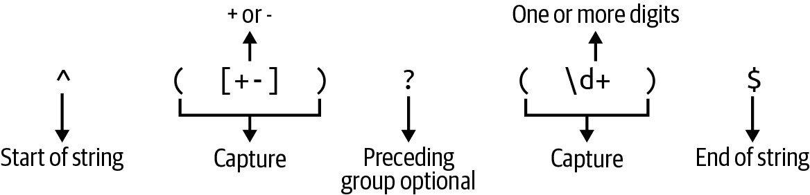

# Chapter 11. Tailor Swyfte

> From the embryonic whale to the monkey with no tail
>
> They Might Be Giants, “Mammal” (1992)

The challenge in this chapter will be to write a version of `tail`, which is the converse of `head` from Chapter 4. The program will show you the last bytes or lines of one or more files or `STDIN`, usually defaulting to the last 10 lines. Again the program will have to deal with bad input and will possibly mangle Unicode characters. The challenge program will read only regular files, so we won’t bother with `STDIN`.

In this chapter, you will learn how to do the following:

- Initialize a static, global, computed value

- Seek to a line or byte position in a filehandle

- Indicate multiple trait bounds on a type using the `where` clause

- Build a release binary with Cargo

- Benchmark programs to compare runtime performance

# How tail Works

To demonstrate how the challenge program should work, I’ll first show you a portion of the manual page for the BSD `tail`. Note that the challenge program will only implement some of these features:

```
TAIL(1)                   BSD General Commands Manual                  TAIL(1)

NAME
     tail -- display the last part of a file

SYNOPSIS
     tail [-F | -f | -r] [-q] [-b number | -c number | -n number] [file ...]

DESCRIPTION
     The tail utility displays the contents of file or, by default, its stan-
     dard input, to the standard output.

     The display begins at a byte, line or 512-byte block location in the
     input.  Numbers having a leading plus ('+') sign are relative to the
     beginning of the input, for example, ''-c +2'' starts the display at the
     second byte of the input.  Numbers having a leading minus ('-') sign or
     no explicit sign are relative to the end of the input, for example,
     ''-n2'' displays the last two lines of the input.  The default starting
     location is ''-n 10'', or the last 10 lines of the input.
```

The BSD version has many options, but these are the only ones relevant to the challenge program:

```
     -c number
             The location is number bytes.

     -n number
             The location is number lines.

     -q      Suppresses printing of headers when multiple files are being
             examined.

     If more than a single file is specified, each file is preceded by a
     header consisting of the string ''==> XXX <=='' where XXX is the name of
     the file unless -q flag is specified.
```

Here’s part of the manual page for GNU `tail`, which includes long option names:

```
TAIL(1)                          User Commands                         TAIL(1)

NAME
    tail - output the last part of files

SYNOPSIS
    tail [OPTION]... [FILE]...

DESCRIPTION
    Print  the  last  10  lines of each FILE to standard output.  With more
    than one FILE, precede each with a header giving the file  name.   With
    no FILE, or when FILE is -, read standard input.

    Mandatory  arguments  to  long  options are mandatory for short options
    too.

    -c, --bytes=K
           output the last K bytes; or use -c +K to output  bytes  starting
           with the Kth of each file

    -n, --lines=K
           output the last K lines, instead of the last 10; or use -n +K to
              output starting with the Kth
```

I’ll use files in the book’s *11_tailr/tests/inputs* directory to demonstrate the features of `tail` that the challenge will implement. As in previous chapters, there are examples with Windows line endings that must be preserved in the output. The files I’ll use are:

- *empty.txt*: an empty file

- *one.txt*: a file with one line of UTF-8 Unicode text

- *two.txt*: a file with two lines of ASCII text

- *three.txt*: a file with three lines of ASCII text and CRLF line terminators

- *twelve.txt*: a file with 12 lines of ASCII text

Change into the chapter’s directory:

```
$ cd 11_tailr
```

By default, `tail` will show the last 10 lines of a file, which you can see with *tests/inputs/twelve.txt*:

```
$ tail tests/inputs/twelve.txt
three
four
five
six
seven
eight
nine
ten
eleven
twelve
```

Run it with `-n 4` to see the last four lines:

```
$ tail -n 4 tests/inputs/twelve.txt
nine
ten
eleven
twelve
```

Use `-c 10` to select the last ten bytes of the file. In the following output, there are eight byte-sized characters and two byte-sized newline characters, for a total of ten bytes. Pipe the output to `cat -e` to display the dollar sign (`$`) to indicate the newlines:

```
$ tail -c 10 tests/inputs/twelve.txt | cat -e
en$
twelve$
```

With multiple input files, `tail` will print separators between each file. Any errors opening files (such as for nonexistent or unreadable files) will be noted to `STDERR` without any file headers. For instance, *blargh* represents a nonexistent file in the following command:

```
$ tail -n 1 tests/inputs/one.txt blargh tests/inputs/three.txt
==> tests/inputs/one.txt <==
Öne line, four wordś.
tail: blargh: No such file or directory

==> tests/inputs/three.txt <==
four words.
```

The `-q` flag will suppress the file headers:

```
$ tail -q -n 1 tests/inputs/*.txt
Öne line, four wordś.
ten
four words.
Four words.
```

Requesting more lines or bytes than a file contains is not an error and will cause `tail` to print the entire file:

```
$ tail -n 1000 tests/inputs/one.txt
Öne line, four wordś.
$ tail -c 1000 tests/inputs/one.txt
Öne line, four wordś.
```

As noted in the manual pages, `-n` or `-c` values may begin with a plus sign to indicate a line or byte position from the *beginning* of the file rather than the end. A start position beyond the end of the file is not an error, and `tail` will print nothing, which you can see if you run **`tail -n +1000 tests/inputs/one.txt`**. In the following command, I use `-n +8` to start printing from line 8:

```
$ tail -n +8 tests/inputs/twelve.txt
eight
nine
ten
eleven
twelve
```

It’s possible to split multibyte characters with byte selection. For example, the *tests​/⁠inputs/one.txt* file starts with the Unicode character *Ö*, which is two bytes long. In the following command, I use `-c +2` to start printing from the second byte, which will split the multibyte character, resulting in the unknown character:

```
$ tail -c +2 tests/inputs/one.txt
�ne line, four wordś.
```

To start printing from the second *character*, I must use `-c +3` to start printing from the third *byte*:

```
$ tail -c +3 tests/inputs/one.txt
ne line, four wordś.
```

The end of *tests/inputs/one.txt* has a funky Unicode *ś* thrown in for good measure, which is a multibyte Unicode character. If you request the last four bytes of the file, two will be for *ś*, one for the period, and one for the final newline:

```
$ tail -c 4 tests/inputs/one.txt
ś.
```

If you ask for only three, the *ś* will be split, and you should see the Unicode *unknown* character:

```
$ tail -c 3 tests/inputs/one.txt
�.
```

Both the BSD and GNU versions will accept `0` and `-0` for `-n` or `-c`. The GNU version will show no output at all, while the BSD version will show no output when run with a single file but will still show the file headers when there are multiple input files. The following behavior of BSD is expected of the challenge program:

```
$ tail -n 0 tests/inputs/*
==> tests/inputs/empty.txt <==

==> tests/inputs/one.txt <==

==> tests/inputs/three.txt <==

==> tests/inputs/twelve.txt <==

==> tests/inputs/two.txt <==
```

Both versions interpret the value `+0` as starting at the zeroth line or byte, so the whole file will be shown:

```
$ tail -n +0 tests/inputs/one.txt
Öne line, four wordś.
$ tail -c +0 tests/inputs/one.txt
Öne line, four wordś.
```

Both versions will reject any value for `-n` or `-c` that cannot be parsed as an integer:

```
$ tail -c foo tests/inputs/one.txt
tail: illegal offset -- foo
```

While `tail` has several more features, this is as much as your program needs to implement.

# Getting Started

The challenge program will be called `tailr` (pronounced *tay-ler*). I recommend you begin with **`cargo new tailr`** and then add the following dependencies to *Cargo.toml*:

``` toml
[dependencies]
anyhow = "1.0.79"
clap = { version = "4.5.0", features = ["derive"] }
num = "0.4.1"
once_cell = "1.19.0" ①
regex = "1.10.3"

[dev-dependencies]
assert_cmd = "2.0.13"
predicates = "3.0.4"
pretty_assertions = "1.4.0"
rand = "0.8.5"
```

  
The [`once_cell` crate](https://oreil.ly/DXeXE) will be used to create a computed static value.

Copy the book’s *11_tailr/tests* directory into your project, and then run **`cargo test`** to download the needed crates, build your program, and ensure that you fail all the tests.

## Defining the Arguments

I’ll start by defining the `Args` struct in *src/main.rs* as in previous chapters:

``` rust
#[derive(Debug)]
struct Args {
    files: Vec<String>, ①
    lines: String, ②
    bytes: Option<String>, ③
    quiet: bool, ④
}
```

  
`files` is a vector of strings.

  
`lines` should default to “10” to indicate the last 10 lines.

  
`bytes` is an optional number of bytes to select.

  
The `quiet` flag is a Boolean for whether or not to suppress the headers between multiple files.

Either annotate the `Args` for the `clap` derive pattern, or use the following as a skeleton for `get_args`:

``` rust
fn get_args() -> Args {
    let matches = Command::new("tailr")
        .version("0.1.0")
        .author("Ken Youens-Clark <kyclark@gmail.com>")
        .about("Rust version of `tail`")
        // What goes here?
        .get_matches();

    Args {
        files: ...
        lines: ...
        bytes: ...
        quiet: ...
    }
}
```

I suggest you start your `main` function by printing the arguments:

``` rust
fn main() {
    let args = get_args();
    println!("{args:#?}");
}
```

First, get your program to print the following usage:

```
$ cargo run -- -h
Rust version of `tail`

Usage: tailr [OPTIONS] <FILE>...

Arguments:
  <FILE>...  Input file(s)

Options:
  -n, --lines <LINES>  Number of lines [default: 10]
  -c, --bytes <BYTES>  Number of bytes
  -q, --quiet          Suppress headers
  -h, --help           Print help
  -V, --version        Print version
```

If you run the program with no arguments, it should fail with an error that at least one file argument is required because this program will not read `STDIN` by default:

```
$ cargo run
error: the following required arguments were not provided:
  <FILE>...

Usage: tailr <FILE>...
```

The `--bytes` and `--lines` options should be mutually exclusive:

```
$ cargo run -- tests/inputs/empty.txt --bytes 1 --lines 1
error: the argument '--bytes <BYTES>' cannot be used with '--lines <LINES>'

Usage: tailr --bytes <BYTES> <FILES>...
```

Run the program with a file argument and see if you can get this output:

```
$ cargo run -- tests/inputs/one.txt
Args {
    files: [
        "tests/inputs/one.txt", ①
    ],
    lines: "10", ②
    bytes: None, ③
    quiet: false, ④
}
```

  
The positional argument goes into `files`.

  
The `lines` argument should default to “10” to take the last 10 lines.

  
The `bytes` argument should default to `None`.

  
The `quiet` option should default to `false`.

Run the program with multiple file arguments and the `-c` option to ensure you get the following output:

```
$ cargo run -- -q -c 4 tests/inputs/*.txt
Args {
    files: [
        "tests/inputs/empty.txt", ①
        "tests/inputs/one.txt",
        "tests/inputs/three.txt",
        "tests/inputs/twelve.txt",
        "tests/inputs/two.txt",
    ],
    lines: "10", ②
    bytes: Some( ③
        "4",
    ),
    quiet: true, ④
}
```

  
The positional arguments are parsed as `files`.

  
The `lines` argument is still set to the default.

  
Now `bytes` is set to `Some("4")` to indicate the last four bytes should be taken.

  
The `-q` flag causes the `quiet` option to be `true`.

###### Note

Pause here and get your program output to match the preceding examples. Your program should also pass two of the tests included with **`cargo test dies`**.

## Parsing and Validating the Command-Line Arguments

I’ll show you how I wrote my `get_args` function. Be sure to add `use clap::{Arg, ArgAction, Command}` for the following:

``` rust
fn get_args() -> Args {
    let matches = Command::new("tailr")
        .version("0.1.0")
        .author("Ken Youens-Clark <kyclark@gmail.com>")
        .about("Rust version of `tail`")
        .arg(
            Arg::new("files") ①
                .value_name("FILE")
                .help("Input file(s)")
                .required(true)
                .num_args(1..),
        )
        .arg(
            Arg::new("lines") ②
                .short('n')
                .long("lines")
                .value_name("LINES")
                .help("Number of lines")
                .default_value("10"),
        )
        .arg(
            Arg::new("bytes") ③
                .short('c')
                .long("bytes")
                .value_name("BYTES")
                .conflicts_with("lines")
                .help("Number of bytes"),
        )
        .arg(
            Arg::new("quiet") ④
                .short('q')
                .long("quiet")
                .action(ArgAction::SetTrue)
                .help("Suppress headers"),
        )
        .get_matches();

    Args {
        files: matches.get_many("files").unwrap().cloned().collect(),
        lines: matches.get_one("lines").cloned().unwrap(),
        bytes: matches.get_one("bytes").cloned(),
        quiet: matches.get_flag("quiet"),
    }
}
```

  
The `files` argument is positional and requires at least one value.

  
The `lines` argument has a default value of `10`.

  
The `bytes` argument is optional and conflicts with `lines`.

  
The `quiet` flag is optional.

###### Note

Because the `--lines` and `--bytes` are mutually exclusive, you might prefer to put them into an `ArgGroup` as in Chapter 8.

For the derive pattern, add `use clap::Parser` and the following annotations to the `Args` struct;

``` rust
#[derive(Debug, Parser)]
#[command(author, version, about)]
/// Rust version of `tail`
struct Args {
    /// Input file(s)
    #[arg(required = true)]
    files: Vec<String>,

    /// Number of lines
    #[arg(value_name = "LINES", short('n'), long, default_value = "10")]
    lines: String,

    /// Number of bytes
    #[arg(value_name = "BYTES", short('c'), long, conflicts_with("lines"))]
    bytes: Option<String>,

    /// Suppress headers
    #[arg(short, long)]
    quiet: bool,
}
```

Next, I’ll restructure my code to call a `run` function as in previous chapters. Add `use anyhow::Result` for the following code:

``` rust
fn main() {
    if let Err(e) = run(Args::parse()) {
        eprintln!("{e}");
        std::process::exit(1);
    }
}

fn run(_args: Args) -> Result<()> {
    Ok(())
}
```

My next challenge is to validate the `lines` and `bytes` arguments.

## Parsing Positive and Negative Numeric Arguments

The challenge program has similar options as `headr`, but this program must handle both positive and negative values for the number of lines or bytes. In `headr`, I used an *unsigned* integer that can represent only positive values. In this program, I will use [`i64`](https://oreil.ly/7grA6), the 64-bit signed integer type, to also store negative numbers. Additionally, I need some way to differentiate between `0`, which means *nothing* should be selected, and `+0`, which means *everything* should be selected. I decided to create an `enum` called `TakeValue` to represent this, but you may choose a different way:

``` rust
#[derive(Debug, PartialEq)] ①
enum TakeValue {
    PlusZero, ②
    TakeNum(i64), ③
}
```

  
The `PartialEq` is needed by the tests to compare values.

  
This variant represents an argument of `+0`.

  
This variant represents a valid integer value.

To refer to the `enum` values without the `TakeValue` prefix, add the following to your imports:

``` rust
use crate::TakeValue::*;
```

Following is the start of the function `parse_num` I’d like you to write that will accept a string and will return a `TakeValue` or an error:

``` rust
fn parse_num(val: String) -> Result<TakeValue> {
    unimplemented!();
}
```

Add the following unit test to a `tests` module in your *src/main.rs*:

``` rust
#[cfg(test)]
mod tests {
    use super::{parse_num, TakeValue::*};

    #[test]
    fn test_parse_num() {
        // All integers should be interpreted as negative numbers
        let res = parse_num("3".to_string());
        assert!(res.is_ok());
        assert_eq!(res.unwrap(), TakeNum(-3));

        // A leading "+" should result in a positive number
        let res = parse_num("+3".to_string());
        assert!(res.is_ok());
        assert_eq!(res.unwrap(), TakeNum(3));

        // An explicit "-" value should result in a negative number
        let res = parse_num("-3".to_string());
        assert!(res.is_ok());
        assert_eq!(res.unwrap(), TakeNum(-3));

        // Zero is zero
        let res = parse_num("0".to_string());
        assert!(res.is_ok());
        assert_eq!(res.unwrap(), TakeNum(0));

        // Plus zero is special
        let res = parse_num("+0".to_string());
        assert!(res.is_ok());
        assert_eq!(res.unwrap(), PlusZero);

        // Test boundaries
        let res = parse_num(i64::MAX.to_string());
        assert!(res.is_ok());
        assert_eq!(res.unwrap(), TakeNum(i64::MIN + 1));

        let res = parse_num((i64::MIN + 1).to_string());
        assert!(res.is_ok());
        assert_eq!(res.unwrap(), TakeNum(i64::MIN + 1));

        let res = parse_num(format!("+{}", i64::MAX));
        assert!(res.is_ok());
        assert_eq!(res.unwrap(), TakeNum(i64::MAX));

        let res = parse_num(i64::MIN.to_string());
        assert!(res.is_ok());
        assert_eq!(res.unwrap(), TakeNum(i64::MIN));

        // A floating-point value is invalid
        let res = parse_num("3.14".to_string());
        assert!(res.is_err());
        assert_eq!(res.unwrap_err().to_string(), "3.14");

        // Any non-integer string is invalid
        let res = parse_num("foo".to_string());
        assert!(res.is_err());
        assert_eq!(res.unwrap_err().to_string(), "foo");
    }
}
```

###### Note

I suggest that you stop reading and take some time to write this function. Do not proceed until it passes **`cargo test test_parse_num`**. In the next section, I’ll share my solution.

Once you have a working function, use it in your `run` to parse the lines and bytes. For the following code, be sure to add `use anyhow::anyhow` to your imports:

``` rust
fn run(args: Args) -> Result<()> {
    let lines = parse_num(args.lines)
        .map_err(|e| anyhow!("illegal line count -- {e}"))?;

    let bytes = args
        .bytes
        .map(parse_num)
        .transpose()
        .map_err(|e| anyhow!("illegal byte count -- {e}"))?;

    println!("lines = {lines:?}");
    println!("bytes = {bytes:?}");
    Ok(())
}
```

When run with the default values, the output should look like the following:

```
$ cargo run -- tests/inputs/empty.txt
lines = TakeNum(-10)
bytes = None
```

Run your program with a value for the bytes to ensure it is parsed correctly:

```
$ cargo run -- -c 4 tests/inputs/empty.txt
lines = TakeNum(-10)
bytes = Some(TakeNum(-4))
```

You probably noticed that the value `4` was parsed as a negative number even though it was provided as a positive value. The numeric values for `lines` and `bytes` should be negative to indicate that the program will take values from the *end* of the file. A plus sign is required to indicate that the starting position is from the *beginning* of the file:

```
$ cargo run -- -n +5 tests/inputs/twelve.txt ①
lines = TakeNum(5) ②
bytes = None
```

  
The `+5` argument indicates the program should start printing on the fifth line.

  
The value is interpreted as a positive integer.

Both `-n` and `-c` are allowed to have a value of `0`, which will mean that no lines or bytes will be shown:

```
$ cargo run -- tests/inputs/empty.txt -c 0
lines = TakeNum(-10)
bytes = Some(TakeNum(0))
```

As with the original versions, the value `+0` indicates that the starting point is the beginning of the file, so all the content will be shown:

```
$ cargo run -- tests/inputs/empty.txt -n +0
lines = PlusZero ①
bytes = None
```

  
The `PlusZero` variant represents `+0`.

Any noninteger value for `-n` and `-c` should be rejected:

```
$ cargo run -- tests/inputs/empty.txt -n foo
illegal line count -- foo
$ cargo run -- tests/inputs/empty.txt -c bar
illegal byte count -- bar
```

###### Note

Stop here and implement this much of the program. If you need some guidance on validating the numeric arguments for `bytes` and `lines`, I’ll discuss that in the next section.

## Using a Regular Expression to Match an Integer with an Optional Sign

Following is one version of the `parse_num` function that passes the tests. Here I chose to use a regular expression to see if the input value matches an expected pattern of text. If you want to include this version in your program, be sure to add `use regex::Regex`:

``` rust
fn parse_num(val: String) -> Result<TakeValue> {
    let num_re = Regex::new(r"^([+-])?(\d+)$").unwrap(); ①

    match num_re.captures(&val) {
        Some(caps) => {
            let sign = caps.get(1).map_or("-", |m| m.as_str()); ②
            let signed_num =
                format!("{sign}{}", caps.get(2).unwrap().as_str()); ③

            if let Ok(num) = signed_num.parse() { ④
                if sign == "+" && num == 0 { ⑤
                    Ok(PlusZero) ⑥
                } else {
                    Ok(TakeNum(num)) ⑦
                }
            } else {
                bail!(val) ⑧
            }
        }
        _ => bail!(val), ⑨
    }
}
```

  
Create a regex to find an optional leading `+` or `-` sign followed by one or more numbers.

  
If the regex matches, the optional sign will be the first capture. Assume the minus sign if there is no match.

  
The digits of the number will be in the second capture. Format the sign and digits into a string.

  
Attempt to parse the number as an `i64`, which Rust infers from the function’s return type.

  
Check if the sign is a plus and the parsed value is `0`.

  
If so, return the `PlusZero` variant.

  
Otherwise, return the parsed value as the `TakeNum` variant.

  
Return the unparsable number as an error.

  
Return an invalid argument as an error.

Regular expression syntax can be daunting to the uninitiated. Figure 11-1 shows each element of the pattern used in the preceding function.



###### Figure 11-1. This is a regular expression that will match a positive or negative integer.

You’ve seen much of this syntax in previous programs. Here’s a review of all the parts of this regex:

- The `^` indicates the beginning of a string. Without this, the pattern could match anywhere inside the string.

- Parentheses group and capture values, making them available through [`Regex::captures`](https://oreil.ly/O6frw).

- Square brackets (`[]`) create a *character class* that will match any of the contained values. A dash (`-`) inside a character class can be used to denote a range, such as `[0-9]` to indicate all the characters from 0 to 9.^(1) To indicate a literal dash, it should occur last.

- A `?` makes the preceding pattern optional.

- The `\d` is shorthand for the character class `[0-9]` and so matches any digit. The `+` suffix indicates *one or more* of the preceding pattern.

- The `$` indicates the end of the string. Without this, the regular expression would match even when additional characters follow a successful match.

I’d like to make one small change. The first line of the preceding function creates a regular expression by parsing the pattern *each time* the function is called:

``` rust
fn parse_num(val: String) -> Result<TakeValue> {
    let num_re = Regex::new(r"^([+-])?(\d+)$").unwrap();
    ...
}
```

I’d like my program to do the work of compiling the regex just once. You’ve seen in earlier tests how I’ve used `const` to create a constant value. It’s common to use `ALL_CAPS` to name global constants and to place them near the top of the crate, like so:

``` rust
// This will not compile
const NUM_RE: Regex = Regex::new(r"^([+-])?(\d+)$").unwrap();
```

If I try to run the test again, I get the following error telling me that I cannot use a computed value for a constant:

```
error[E0015]: cannot call non-const fn `regex::Regex::new` in constants
 --> src/main.rs:7:23
  |
7 | const NUM_RE: Regex = Regex::new(r"^([+-])?(\d+)$").unwrap();
  |                       ^^^^^^^^^^^^^^^^^^^^^^^^^^^^^
  |
  = note: calls in constants are limited to constant functions, tuple structs
    and tuple variants
```

Enter `once_cell`, which provides a mechanism for creating lazily evaluated statics. To use this, you must first add the dependency to *Cargo.toml*, which I included at the start of this chapter. To create a lazily evaluated regular expression just one time in my program, I add the following to the top of *src/main.rs*:

``` rust
use once_cell::sync::OnceCell;

static NUM_RE: OnceCell<Regex> = OnceCell::new();
```

The only change to the `parse_num` function is to initialize `NUM_RE` the first time the function is called:

``` rust
fn parse_num(val: String) -> Result<TakeValue> {
    let num_re =
        NUM_RE.get_or_init(|| Regex::new(r"^([+-])?(\d+)$").unwrap());
    // Same as before
}
```

It is not a requirement that you use a regular expression to parse the numeric arguments. Here’s a method that relies only on Rust’s internal parsing capabilities:

``` rust
fn parse_num(val: String) -> Result<TakeValue> {
    let signs: &[char] = &['+', '-']; ①
    let res = val
        .starts_with(signs) ②
        .then(|| val.parse())
        .unwrap_or_else(|| val.parse().map(i64::wrapping_neg)); ③

    match res {
        Ok(num) => {
            if num == 0 && val.starts_with('+') { ④
                Ok(PlusZero)
            } else {
                Ok(TakeNum(num))
            }
        }
        _ => bail!(val), ⑤
    }
}
```

  
The type annotation is required because Rust infers the type `&[char; 2]`, which is a reference to an array, but I want to coerce the value to a slice.

  
If the given value starts with a plus or minus sign, use `str::parse`, which will use the sign to create a positive or negative number, respectively.

  
Otherwise, parse the number and use [`i64::wrapping_neg`](https://oreil.ly/H2gWn) to compute the negative value; that is, a positive value will be returned as negative, while a negative value will remain negative.

  
If the result is a successfully parsed `i64`, check whether to return `PlusZero` when the number is `0` and the given value starts with a plus sign; otherwise, return the parsed value.

  
Return the unparsable value as an error.

You may have found another way to figure this out, and that’s the point with functions and testing. It doesn’t much matter *how* a function is written as long as it passes the tests. A function is a black box where something goes in and something comes out, and we write enough tests to convince ourselves that the function works correctly.

## Processing the Files

Expand your `run` function to iterate the given files and attempt to open them. Since the challenge does not include reading `STDIN`, you only need to add `use std::fs::File` for the following code:

``` rust
fn run(args: Args) -> Result<()> {
    // Same as before

    for filename in args.files {
        match File::open(&filename) {
            Err(err) => eprintln!("{filename}: {err}"),
            Ok(_) => println!("Opened {filename}"),
        }
    }

    Ok(())
}
```

Run your program with both good and bad filenames to verify this works. Additionally, your program should now pass **`cargo test skips_bad_file`**. In the following command, *blargh* represents a nonexistent file:

```
$ cargo run -- tests/inputs/one.txt blargh
Opened tests/inputs/one.txt
blargh: No such file or directory (os error 2)
```

## Counting the Total Lines and Bytes in a File

Next, it’s time to figure out how to read a file from a given byte or line location. For instance, the default case is to print the last 10 lines of a file, so I need to know how many lines are in the file to figure out which is the tenth from the end. The same is true for bytes. I also need to determine if the user has requested more lines or bytes than the file contains. When this value is negative—meaning the user wants to start beyond the beginning of the file—the program should print the entire file. When this value is positive—meaning the user wants to start beyond the end of the file—the program should print nothing.

I decided to create a function called `count_lines_bytes` that takes a filename and returns a tuple containing the total number of lines and bytes in the file. Here is the function’s signature:

``` rust
fn count_lines_bytes(filename: &str) -> Result<(i64, i64)> {
    unimplemented!()
}
```

If you want to create this function, modify your `tests` module to add the following unit test:

``` rust
#[cfg(test)]
mod tests {
    use super::{count_lines_bytes, parse_num, TakeValue::*};

    #[test]
    fn test_parse_num() {} // Same as before

    #[test]
    fn test_count_lines_bytes() {
        let res = count_lines_bytes("tests/inputs/one.txt");
        assert!(res.is_ok());
        let (lines, bytes) = res.unwrap();
        assert_eq!(lines, 1);
        assert_eq!(bytes, 24);

        let res = count_lines_bytes("tests/inputs/twelve.txt");
        assert!(res.is_ok());
        let (lines, bytes) = res.unwrap();
        assert_eq!(lines, 12);
        assert_eq!(bytes, 63);
    }
}
```

###### Note

Pause here and write the code that passes **`cargo test test_count_lines_bytes`**.

You can expand your `run` to temporarily print the count of lines and bytes in input files:

``` rust
fn run(args: Args) -> Result<()> {
    // Same as before

    for filename in args.files {
        match File::open(&filename) {
            Err(err) => eprintln!("{filename}: {err}"),
            Ok(_) => {
                let (total_lines, total_bytes) =
                    count_lines_bytes(&filename)?;
                println!(
                    "{filename} has {total_lines} lines, {total_bytes} bytes"
                );
            }
        }
    }
    Ok(())
}
```

###### Note

I decided to pass the filename to the `count_lines_bytes` function instead of the filehandle that is returned by `File::open` because the filehandle will be consumed by the function, making it unavailable for use in selecting the bytes or lines.

Verify that it looks OK:

```
$ cargo run tests/inputs/one.txt tests/inputs/twelve.txt
tests/inputs/one.txt has 1 lines, 24 bytes
tests/inputs/twelve.txt has 12 lines, 63 bytes
```

## Finding the Starting Line to Print

My next step was to write a function to print the lines of a given file. Following is the signature of my `print_lines` function. Be sure to add `use std::io::BufRead` for this:

``` rust
fn print_lines(
    mut file: impl BufRead, ①
    num_lines: &TakeValue, ②
    total_lines: i64, ③
) -> Result<()> {
    unimplemented!();
}
```

  
The `file` argument should implement the `BufRead` trait.

  
The `num_lines` argument is a `TakeValue` describing the number of lines to print.

  
The `total_lines` argument is the total number of lines in this file.

###### Note

There is no unit test because this function prints to the command line. If I had chosen to return a vector of lines, I risk reading an entire file into memory, which may exceed the available memory. We will rely on the integration tests for the program’s output to ensure this works correctly.

I can find the starting line’s index using the number of lines the user wants to print and the total number of lines in the file. Since I will also need this logic to find the starting byte position, I decided to write a function called `get_start_index` that will return `Some<u64>` when there is a valid starting position or `None` when there is not. A valid starting position must be a positive number, so I decided to return a `u64`. Additionally, the functions where I will use the returned index also require this type:

``` rust
fn get_start_index(take_val: &TakeValue, total: i64) -> Option<u64> {
    unimplemented!();
}
```

Following is a unit test you can add to the `tests` module that might help you see all the possibilities more clearly. For instance, the function returns `None` when the given file is empty or when trying to read from a position beyond the end of the file. Be sure to add `get_start_index` to the list of `super` imports:

``` rust
#[test]
fn test_get_start_index() {
    // +0 from an empty file (0 lines/bytes) returns None
    assert_eq!(get_start_index(&PlusZero, 0), None);

    // +0 from a nonempty file returns an index that
    // is one less than the number of lines/bytes
    assert_eq!(get_start_index(&PlusZero, 1), Some(0));

    // Taking 0 lines/bytes returns None
    assert_eq!(get_start_index(&TakeNum(0), 1), None);

    // Taking any lines/bytes from an empty file returns None
    assert_eq!(get_start_index(&TakeNum(1), 0), None);

    // Taking more lines/bytes than is available returns None
    assert_eq!(get_start_index(&TakeNum(2), 1), None);

    // When starting line/byte is less than total lines/bytes,
    // return one less than starting number
    assert_eq!(get_start_index(&TakeNum(1), 10), Some(0));
    assert_eq!(get_start_index(&TakeNum(2), 10), Some(1));
    assert_eq!(get_start_index(&TakeNum(3), 10), Some(2));

    // When starting line/byte is negative and less than total,
    // return total - start
    assert_eq!(get_start_index(&TakeNum(-1), 10), Some(9));
    assert_eq!(get_start_index(&TakeNum(-2), 10), Some(8));
    assert_eq!(get_start_index(&TakeNum(-3), 10), Some(7));

    // When starting line/byte is negative and more than total,
    // return 0 to print the whole file
    assert_eq!(get_start_index(&TakeNum(-20), 10), Some(0));
}
```

Once you figure out the line index to start printing, use this information in the `print_lines` function to iterate the lines of the input file and print all the lines after the starting index, if there is one.

## Finding the Starting Byte to Print

I also wrote a function called `print_bytes` that works very similarly to `print_lines`. The function’s signature indicates that the `file` argument must implement the traits [`Read`](https://oreil.ly/wDxvY) and [`Seek`](https://oreil.ly/vJD1W), the latter of which is a word used in many programming languages for moving what’s called a *cursor* or *read head* to a particular position in a stream. For the following code, you will need to expand your imports to include `std::io::{BufRead, Read, Seek}`:

``` rust
fn print_bytes<T: Read + Seek>( ①
    mut file: T, ②
    num_bytes: &TakeValue, ③
    total_bytes: i64, ④
) -> Result<()> {
    unimplemented!();
}
```

  
The generic type `T` has the trait bounds `Read` and `Seek`.

  
The `file` argument must implement the indicated traits.

  
The `num_bytes` argument is a `TakeValue` describing the byte selection.

  
The `total_bytes` argument is the file size in bytes.

I can also write the generic types and bounds using a [`where` clause](https://oreil.ly/aM1vI), which you might find more readable:

``` rust
fn print_bytes<T>(
    mut file: T,
    num_bytes: &TakeValue,
    total_bytes: i64,
) -> Result<()>
where
    T: Read + Seek,
{
    unimplemented!();
}
```

You can use the `get_start_index` function to find the starting byte position from the beginning of the file, and then move the cursor to that position. Remember that the selected byte string may contain invalid UTF-8, so my solution uses [`String::from_utf8_lossy`](https://oreil.ly/Bs4Zl) when printing the selected bytes.

## Testing the Program with Large Input Files

I have included a program in the *util/biggie* directory of my repository that will generate large input text files that you can use to stress test your program. For instance, you can use it to create a file with a million lines of random text to use when selecting various ranges of lines and bytes. Here is the usage for the `biggie` program:

```
Make big text files

Usage: biggie [OPTIONS]

Options:
  -o, --outfile <FILE>  Output filename [default: out.txt]
  -l, --lines <LINES>   Number of lines [default: 100000]
  -h, --help            Print help
  -V, --version         Print version
```

###### Note

This should be enough hints for you to write a solution. There’s no hurry to finish the program. Sometimes you need to step away from a difficult problem for a day or more while your subconscious mind works. Come back when your solution passes **`cargo test`**.

# Solution

I’ll walk you through how I arrived at a solution, which will incorporate several dependencies as follows:

``` rust
use crate::TakeValue::*;
use anyhow::{anyhow, bail, Result};
use clap::Parser;
use once_cell::sync::OnceCell;
use regex::Regex;
use std::{
    fs::File,
    io::{BufRead, BufReader, Read, Seek, SeekFrom},
};
```

I suggested writing several intermediate functions in the first part of this chapter, so next I’ll show my versions that pass the unit tests I provided.

## Counting All the Lines and Bytes in a File

I will start by showing my `count_lines_bytes` function to count all the lines and bytes in a file. In previous programs, I have used [`BufRead::read_line`](https://oreil.ly/aJFkc), which writes into a `String`. In the following function, I use [`BufRead::read_until`](https://oreil.ly/7BJaH) to read raw bytes to avoid the cost of creating strings, which I don’t need:

``` rust
fn count_lines_bytes(filename: &str) -> Result<(i64, i64)> {
    let mut file = BufReader::new(File::open(filename)?); ①
    let mut num_lines = 0; ②
    let mut num_bytes = 0;
    let mut buf = Vec::new();
    loop {
        let bytes_read = file.read_until(b'\n', &mut buf)?; ③
        if bytes_read == 0 { ④
            break;
        }
        num_lines += 1; ⑤
        num_bytes += bytes_read as i64; ⑥
        buf.clear(); ⑦
    }
    Ok((num_lines, num_bytes)) ⑧
}
```

  
Create a mutable filehandle to read the given filename.

  
Initialize counters for the number of lines and bytes as well as a buffer for reading the lines.

  
Use `BufRead::read_until` to read bytes until a newline byte. This function returns the number of bytes that were read from the filehandle.

  
When no bytes were read, exit the loop.

  
Increment the line count.

  
Increment the byte count. Note that `BufRead::read_until` returns a `usize` that must be cast to `i64` to add the value to the `num_bytes` tally.

  
Clear the buffer before reading the next line.

  
Return a tuple containing the number of lines and bytes in the file.

## Finding the Start Index

To find the starting line or byte position, my program relies on a `get_start_index` function that uses the desired location and the total number of lines or bytes in the file:

``` rust
fn get_start_index(take_val: &TakeValue, total: i64) -> Option<u64> {
    match take_val {
        PlusZero => {
            if total > 0 { ①
                Some(0)
            } else {
                None
            }
        }
        TakeNum(num) => {
            if num == &0 || total == 0 || num > &total { ②
                None
            } else {
                let start = if num < &0 { total + num } else { num - 1 }; ③
                Some(if start < 0 { 0 } else { start as u64 }) ④
            }
        }
    }
}
```

  
When the user wants to start at index `0`, return `0` if the file is not empty; otherwise, return `None`.

  
Return `None` if the user wants to select nothing, the file is empty, or the user wants to select more data than is available in the file.

  
If the desired number of lines or bytes is negative, add it to the total; otherwise, subtract one from the desired number to get the zero-based offset.

  
If the starting index is less than `0`, return `0`; otherwise, return the starting index as a `u64`.

## Printing the Lines

The following is my `print_lines` function, much of which is similar to `count_lines_bytes`:

``` rust
fn print_lines(
    mut file: impl BufRead,
    num_lines: &TakeValue,
    total_lines: i64,
) -> Result<()> {
    if let Some(start) = get_start_index(num_lines, total_lines) { ①
        let mut line_num = 0; ②
        let mut buf = Vec::new();
        loop {
            let bytes_read = file.read_until(b'\n', &mut buf)?;
            if bytes_read == 0 {
                break;
            }
            if line_num >= start { ③
                print!("{}", String::from_utf8_lossy(&buf)); ④
            }
            line_num += 1;
            buf.clear();
        }
    }

    Ok(())
}
```

  
Check if there is a valid starting position when trying to read the given number of lines from the total number of lines available.

  
Initialize variables for counting and reading lines from the file.

  
Check if the given line is at or beyond the starting point.

  
If so, convert the bytes to a string and print.

Here is how I can integrate this into my `run` function:

``` rust
fn run(args: Args) -> Result<()> {
    let lines = parse_num(args.lines)
        .map_err(|e| anyhow!("illegal line count -- {e}"))?;

    let _bytes = args
        .bytes
        .map(parse_num)
        .transpose()
        .map_err(|e| anyhow!("illegal byte count -- {e}"))?;

    for filename in args.files {
        match File::open(&filename) {
            Err(err) => eprintln!("{filename}: {err}"),
            Ok(file) => {
                let (total_lines, _total_bytes) =
                    count_lines_bytes(&filename)?; ①
                let file = BufReader::new(file); ②
                print_lines(file, &lines, total_lines)?; ③
            }
        }
    }

    Ok(())
}
```

  
Count the total lines and bytes in the current file.

  
Create a `BufReader` with the opened filehandle.

  
Print the requested number of lines.

A quick check shows this will select, for instance, the last five lines:

```
$ cargo run -- -n 5 tests/inputs/twelve.txt
eight
nine
ten
eleven
twelve
```

I can get the same output by starting on the eighth line:

```
$ cargo run -- -n +8 tests/inputs/twelve.txt
eight
nine
ten
eleven
twelve
```

If I run **`cargo test`** at this point, I pass more than two-thirds of the tests.

## Printing the Bytes

Next, I will show my `print_bytes` function:

``` rust
fn print_bytes<T: Read + Seek>(
    mut file: T,
    num_bytes: &TakeValue,
    total_bytes: i64,
) -> Result<()> {
    if let Some(start) = get_start_index(num_bytes, total_bytes) { ①
        file.seek(SeekFrom::Start(start))?; ②
        let mut buffer = Vec::new(); ③
        file.read_to_end(&mut buffer)?; ④
        if !buffer.is_empty() {
            print!("{}", String::from_utf8_lossy(&buffer)); ⑤
        }
    }

    Ok(())
}
```

  
See if there is a valid starting byte position.

  
Use [`Seek::seek`](https://oreil.ly/ki8DT) to move to the desired byte position as defined by [`SeekFrom::Start`](https://oreil.ly/Bi8Bp).

  
Create a mutable buffer for reading the bytes.

  
Read from the byte position to the end of the file and place the results into the buffer.

  
If the buffer is not empty, convert the selected bytes to a `String` and print.

Here’s how I integrated this into the `run` function:

``` rust
fn run(args: Args) -> Result<()> {
    let lines = parse_num(args.lines)
        .map_err(|e| anyhow!("illegal line count -- {e}"))?;

    let bytes = args
        .bytes
        .map(parse_num)
        .transpose()
        .map_err(|e| anyhow!("illegal byte count -- {e}"))?;

    for filename in args.files {
        match File::open(&filename) {
            Err(err) => eprintln!("{filename}: {err}"),
            Ok(file) => {
                let (total_lines, total_bytes) =
                    count_lines_bytes(&filename)?;
                let file = BufReader::new(file);
                if let Some(num_bytes) = &bytes { ①
                    print_bytes(file, &num_bytes, total_bytes)?; ②
                } else {
                    print_lines(file, &lines, total_lines)?; ③
                }
            }
        }
    }
    Ok(())
}
```

  
Check if the user has requested a byte selection.

  
If so, print the selected bytes.

  
Otherwise, print the line selection.

A quick check with **`cargo test`** shows I’m inching ever closer to passing all my tests. All the failing tests start with *multiple*, and they are failing because my program is not printing the headers separating the output from each file. I’ll modify the code from Chapter 4 for this where we did something similar. Here is my final `run` function that will pass all the tests:

``` rust
fn run(args: Args) -> Result<()> {
    let lines = parse_num(args.lines)
        .map_err(|e| anyhow!("illegal line count -- {e}"))?;

    let bytes = args
        .bytes
        .map(parse_num)
        .transpose()
        .map_err(|e| anyhow!("illegal byte count -- {e}"))?;

    let num_files = args.files.len(); ①
    for (file_num, filename) in args.files.iter().enumerate() { ②
        match File::open(filename) {
            Err(err) => eprintln!("{filename}: {err}"),
            Ok(file) => {
                if !args.quiet && num_files > 1 { ③
                    println!(
                        "{}==> {filename} <==",
                        if file_num > 0 { "\n" } else { "" },
                    );
                }

                let (total_lines, total_bytes) = count_lines_bytes(filename)?;
                let file = BufReader::new(file);
                if let Some(num_bytes) = &bytes {
                    print_bytes(file, num_bytes, total_bytes)?;
                } else {
                    print_lines(file, &lines, total_lines)?;
                }
            }
        }
    }

    Ok(())
}
```

  
Find the number of files.

  
Use `Iterator::enumerate` to iterate through the index positions and filenames.

  
If the `quiet` option is `false` and there are multiple files, print the header.

## Benchmarking the Solution

How does the `tailr` program compare to `tail` for the subset of features it shares? I suggested earlier that you could use the `biggie` program to create large input files to test your program. I created a file called *1M.txt* that has one million lines of randomly generated text to use in testing my program. I can use the `time` command to see how long it takes for `tail` to find the last 10 lines of the *1M.txt* file:^(2)

```
$ time tail 1M.txt > /dev/null ①

real    0m0.022s ②
user    0m0.006s ③
sys     0m0.015s ④
```

  
I don’t want to see the output from the command, so I redirect it to `/dev/null`, a special system device that ignores its input.

  
The `real` time is *wall clock time*, measuring how long the process took from start to finish.

  
The `user` time is how long the CPU spent in *user* mode outside the kernel.

  
The `sys` time is how long the CPU spent working inside the kernel.

I want to build the fastest version of `tailr` possible to compare to `tail`, so I’ll use **`cargo build --release`** to create a [release build](https://oreil.ly/A9BMw). The binary will be created at *target​/⁠release/tailr*. This build of the program appears to be much slower than `tail`:

```
$ time target/release/tailr 1M.txt > /dev/null

real    0m0.505s
user    0m0.072s
sys     0m0.024s
```

This is the start of a process called *benchmarking*, where I try to compare how well different programs work. Running one iteration and eyeballing the output is not very scientific or effective. Luckily, there is a Rust crate called [`hyperfine`](https://oreil.ly/ICXBY) that can do this much better. After installing it with **`cargo install hyperfine`**, I can run benchmarks and find that my Rust program is much slower than the system `tail` when printing the last 10 lines from the *1M.txt* file:

```
$ hyperfine -i -L prg tail,target/release/tailr '{prg} 1M.txt > /dev/null'
Benchmark 1: tail 1M.txt > /dev/null
  Time (mean ± σ):       4.3 ms ±   6.6 ms    [User: 1.7 ms, System: 3.2 ms]
  Range (min … max):     2.6 ms …  49.9 ms    50 runs

Benchmark 2: target/release/tailr 1M.txt > /dev/null
  Time (mean ± σ):      86.9 ms ±   3.2 ms    [User: 70.2 ms, System: 16.5 ms]
  Range (min … max):    84.8 ms … 100.5 ms    27 runs

Summary
  tail 1M.txt > /dev/null ran
   20.32 ± 31.44 times faster than target/release/tailr 1M.txt > /dev/null
```

If I request the last 100K lines, however, the Rust version fares better:

```
$ hyperfine -i -L prg tail,target/release/tailr '{prg} -n 100000 1M.txt
  > /dev/null'
Benchmark 1: tail -n 100000 1M.txt > /dev/null
  Time (mean ± σ):      26.8 ms ±   0.5 ms    [User: 19.8 ms, System: 5.4 ms]
  Range (min … max):    25.9 ms …  28.9 ms    82 runs

Benchmark 2: target/release/tailr -n 100000 1M.txt > /dev/null
  Time (mean ± σ):     154.7 ms ±   1.4 ms    [User: 108.1 ms, System: 43.8 ms]
  Range (min … max):   153.4 ms … 158.1 ms    18 runs

Summary
  tail -n 100000 1M.txt > /dev/null ran
    5.78 ± 0.12 times faster than target/release/tailr -n 100000 1M.txt
    > /dev/null
```

If I change the command to `{prg} -c 100 1M.txt` to print the last 100 bytes, the Rust version is still slower:

```
Summary
  tail -c 100 1M.txt ran
   14.98 ± 2.51 times faster than target/release/tailr -c 100 1M.txt
```

If I request the last million bytes, however, the Rust version is a little faster:

```
Summary
  target/release/tailr -c 1000000 1M.txt ran
    1.34 ± 0.04 times faster than tail -c 1000000 1M.txt
```

To improve the performance, the next step would probably be profiling the code to find where Rust is using most of the time and memory. Program optimization is a fascinating and deep topic well beyond the scope of this book.

# Going Further

See how many of the BSD and GNU options you can implement, including the size suffixes and reading `STDIN`. One of the more challenging options is to *follow* the files. When I’m developing web applications, I often use `tail -f` to watch the access and error logs of a web server to see requests and responses as they happen. I suggest you [search *crates.io* for “tail”](https://oreil.ly/Lo6rG) to see how others have implemented these ideas.

# Summary

Reflect upon your progress in this chapter:

- You learned how to create a regular expression as a static, global variable using the `once_cell` crate.

- You learned how to seek a line or byte position in a filehandle.

- You saw how to indicate multiple trait bounds like `<T: Read + Seek>` and also how to write this using `where`.

- You learned how to make Cargo build a release binary.

- You used `hyperfine` to benchmark programs.

In the next chapter, you will learn how to use and control pseudorandom number generators to make random selections.

^(1) The *range* here means all the characters between those two code points. Refer to the output from the `ascii` program in Chapter 10 to see that the contiguous values from 0 to 9 are all numbers. Contrast this with the values from *A* to *z* where various punctuation characters fall in the middle, which is why you will often see the range `[A-Za-z]` to select ASCII alphabet characters.

^(2) I used macOS 14.2.1 running on a MacBook Pro M1 with 8 cores and 8 GB RAM for all the benchmarking tests.