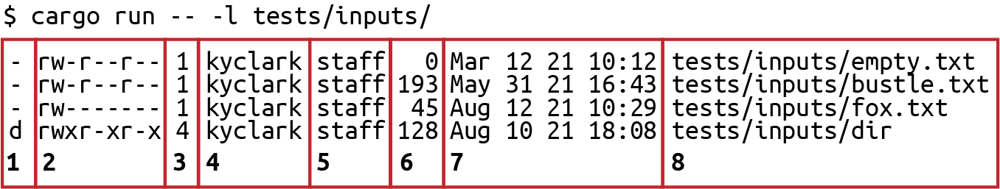
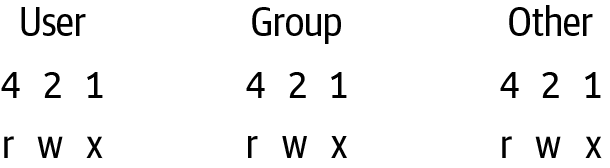
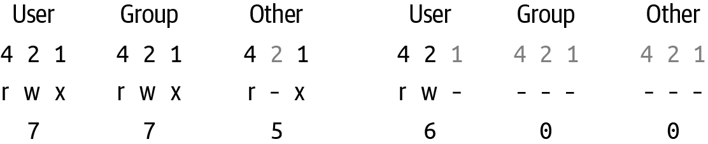
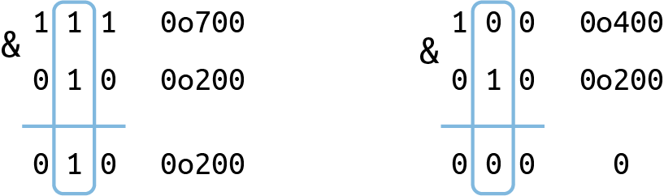
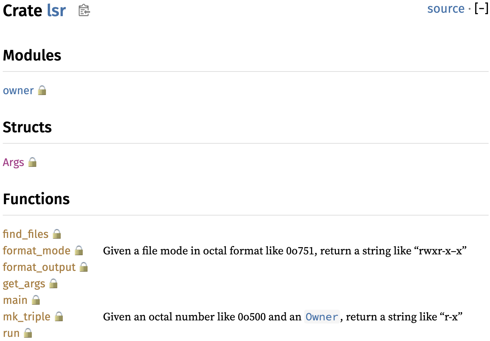

# Chapter 14. Elless Island

> Now you know that the girls are just making it up  
> Now you know that the boys are just pushing their luck  
> Now you know that my ride doesn’t really exist  
> And my name’s not really on that list
>
> They Might Be Giants, “Prevenge” (2004)

In this final chapter, you’ll create a Rust clone of the *list* command, `ls` (pronounced *ell-ess*), which I think is perhaps the hardest-working program in Unix. I use it many times every day to view the contents of a directory or inspect the size or permissions of some files. The original program has more than three dozen options, but the challenge program will implement only a few features, such as printing the contents of directories or lists of files along with their permissions, sizes, and modification times. Note that this challenge program relies on ideas of files and ownership that are specific to Unix and so will not work on Windows. I suggest Windows users install Windows Subsystem for Linux to write and test the program in that environment.

In this chapter, you will learn how to do the following:

- Query and visually represent a file’s permissions

- Add a method to a custom type using an implementation

- Create a module in a separate file to organize code

- Use text tables to create aligned columns of output

- Create documentation comments

# How ls Works

To see what will be expected of the challenge program, start by looking at the manual page for the BSD `ls`. You’ll see that it has 39 options. I’ll include only the first part, as the documentation is rather long, but I encourage you to read the whole thing:

```
LS(1)                     BSD General Commands Manual                    LS(1)

NAME
     ls -- list directory contents

SYNOPSIS
     ls [-ABCFGHLOPRSTUW@abcdefghiklmnopqrstuwx1%] [file ...]

DESCRIPTION
     For each operand that names a file of a type other than directory, ls
     displays its name as well as any requested, associated information.  For
     each operand that names a file of type directory, ls displays the names
     of files contained within that directory, as well as any requested, asso-
     ciated information.

     If no operands are given, the contents of the current directory are dis-
     played.  If more than one operand is given, non-directory operands are
     displayed first; directory and non-directory operands are sorted sepa-
     rately and in lexicographical order.
```

If you execute `ls` with no options, it will show you the contents of the current working directory. For instance, change into the *14_lsr* directory and try it:

```
$ cd 14_lsr
$ ls
Cargo.toml         set-test-perms.sh* src/               tests/
```

The challenge program will implement only two option flags, the `-l|--long` and `-a|--all` options. Per the manual page:

```
The Long Format
 If the -l option is given, the following information is displayed for
 each file: file mode, number of links, owner name, group name, number of
 bytes in the file, abbreviated month, day-of-month file was last modi-
 fied, hour file last modified, minute file last modified, and the path-
 name.  In addition, for each directory whose contents are displayed, the
 total number of 512-byte blocks used by the files in the directory is
 displayed on a line by itself, immediately before the information for the
 files in the directory.
```

Execute **`ls -l`** in the source directory. Of course, you will have different metadata, such as owners and modification times, than what I’m showing:

```
$ ls -l
total 16
-rw-r--r--  1 kyclark  staff  217 Aug 11 08:26 Cargo.toml
-rwxr-xr-x  1 kyclark  staff  447 Aug 12 17:56 set-test-perms.sh*
drwxr-xr-x  5 kyclark  staff  160 Aug 26 09:44 src/
drwxr-xr-x  4 kyclark  staff  128 Aug 17 08:42 tests/
```

The `-a` *all* option will show entries that are normally hidden. For example, the current directory `.` and the parent directory `..` are not usually shown:

```
$ ls -a
./                 Cargo.toml         src/
../                set-test-perms.sh* tests/
```

You can specify these individually, like **`ls -a -l`**, or combined, like **`ls -la`**. These flags can occur in any order, so `-la` or `-al` will work:

```
$ ls -la
total 16
drwxr-xr-x   6 kyclark  staff  192 Oct 15 07:52 ./
drwxr-xr-x  24 kyclark  staff  768 Aug 24 08:22 ../
-rw-r--r--   1 kyclark  staff  217 Aug 11 08:26 Cargo.toml
-rwxr-xr-x   1 kyclark  staff  447 Aug 12 17:56 set-test-perms.sh*
drwxr-xr-x   5 kyclark  staff  160 Aug 26 09:44 src/
drwxr-xr-x   4 kyclark  staff  128 Aug 17 08:42 tests/
```

###### Tip

Any entry (directory or file) with a name starting with a dot (`.`) is hidden, leading to the existence of so-called *dotfiles*, which are often used to store program state and metadata. For example, the root directory of the source code repository contains a directory called *.git* that has all the information Git needs to keep track of the changes to files. It’s also common to create *.gitignore* files that contain filenames and globs that you wish to exclude from Git.

You can provide the name of one or more directories as positional arguments to see their contents:

```
$ ls src/ tests/
src/:
main.rs   owner.rs

tests/:
cli.rs  inputs
```

The positional arguments can also be files:

```
$ ls -l src/*.rs
-rw-r--r--  1 kyclark  staff  8959 Feb 25 12:09 src/main.rs
-rw-r--r--  1 kyclark  staff   313 Feb 25 12:03 src/owner.rs
```

Different operating systems will return the files in different orders. For example, the *.hidden* file is shown before all the other files on macOS:

```
$ ls -la tests/inputs/
total 16
drwxr-xr-x  7 kyclark  staff  224 Aug 12 10:29 ./
drwxr-xr-x  4 kyclark  staff  128 Aug 17 08:42 ../
-rw-r--r--  1 kyclark  staff    0 Mar 19  2021 .hidden
-rw-r--r--  1 kyclark  staff  193 May 31 16:43 bustle.txt
drwxr-xr-x  4 kyclark  staff  128 Aug 10 18:08 dir/
-rw-r--r--  1 kyclark  staff    0 Mar 19  2021 empty.txt
-rw-------  1 kyclark  staff   45 Aug 12 10:29 fox.txt
```

On Linux, the *.hidden* file is listed last:

```
$ ls -la tests/inputs/
total 20
drwxr-xr-x. 3 kyclark staff 4096 Aug 21 12:13 ./
drwxr-xr-x. 3 kyclark staff 4096 Aug 21 12:13 ../
-rw-r--r--. 1 kyclark staff  193 Aug 21 12:13 bustle.txt
drwxr-xr-x. 2 kyclark staff 4096 Aug 21 12:13 dir/
-rw-r--r--. 1 kyclark staff    0 Aug 21 12:13 empty.txt
-rw-------. 1 kyclark staff   45 Aug 21 12:13 fox.txt
-rw-r--r--. 1 kyclark staff    0 Aug 21 12:13 .hidden
```

###### Tip

Due to these differences, the tests will not check for any particular ordering.

Notice that errors involving nonexistent files are printed first, and then the results for valid arguments. As usual, *blargh* is meant as a nonexistent file:

```
$ ls Cargo.toml blargh src/main.rs
ls: blargh: No such file or directory
Cargo.toml   src/main.rs
```

This is about as much as the challenge program should implement. A version of `ls` dates back to the original AT&T Unix, and both the BSD and GNU versions have had decades to evolve. The challenge program won’t even scratch the surface of replacing `ls`, but it will give you a chance to consider some really interesting aspects of operating systems and information storage.

# Getting Started

The challenge program should be named `lsr` (pronounced *lesser* or *lister*, maybe) for a Rust version of `ls`. I suggest you start by running **`cargo new lsr`**. My solution will use the following dependencies that you should add to your *Cargo.toml*:

``` toml
[dependencies]
anyhow = "1.0.79"
chrono = "0.4.31" ①
clap = { version = "4.5.0", features = ["derive"] }
tabular = "0.2.0" ②
users = "0.11.0" ③

[dev-dependencies]
assert_cmd = "2.0.13"
predicates = "3.0.4"
pretty_assertions = "1.4.0"
rand = "0.8.5"
```

[](#co_elless_island_CO1-1)  
`chrono` will be used to handle the file modification times.

[](#co_elless_island_CO1-2)  
`tabular` will be used to present a text table for the long listing.

[](#co_elless_island_CO1-3)  
`users` will be used to get the user and group names of the owners.

Copy *14_lsr/tests* into your project, and then run **`cargo test`** to build and test your program. All the tests should fail. Next, you must run the `bash` script *14_lsr/set-test​-⁠perms.sh* to set the file and directory permissions of the test inputs to known values. Run with `-h|--help` for usage:

```
$ ./set-test-perms.sh --help
Usage: set-test-perms.sh DIR
```

You should give it the path to your new `lsr`. For instance, if you create the project under *~/rust-solutions/lsr*, run it like so:

```
$ ./set-test-perms.sh ~/rust-solutions/lsr
Done, fixed files in "/Users/kyclark/rust-solutions/lsr".
```

## Defining the Arguments

I suggest you update *src/main.rs* to add the following struct for the program’s arguments:

``` rust
#[derive(Debug)]
pub struct Args {
    paths: Vec<String>, ①
    long: bool, ②
    show_hidden: bool, ③
}
```

[](#co_elless_island_CO2-1)  
The `paths` argument will be a vector of strings for files and directories.

[](#co_elless_island_CO2-2)  
The `long` option is a Boolean for whether or not to print the long listing.

[](#co_elless_island_CO2-3)  
The `show_hidden` option is a Boolean for whether or not to print hidden entries.

There’s nothing new in this program when it comes to parsing and validating the arguments. Annotate the struct for the `clap` derive pattern or use this outline for `get_args` you can use:

``` rust
fn get_args() -> Args {
    let matches = Command::new("lsr")
        .version("0.1.0")
        .author("Ken Youens-Clark <kyclark@gmail.com>")
        .about("Rust version of `ls`")
        // What goes here?
        .get_matches();

    Args {
        paths: ...
        long: ...
        show_hidden: ...
    }
}
```

Start your `main` function by printing the arguments:

``` rust
fn main() {
    let args = get_args();
    println!("{args:?}");
}
```

Make sure your program can print a usage like the following:

```
$ cargo run -- -h
Rust version of `ls`

Usage: lsr [OPTIONS] [PATH]...

Arguments:
  [PATH]...  Files and/or directories [default: .]

Options:
  -l, --long     Long listing
  -a, --all      Show all files
  -h, --help     Print help
  -V, --version  Print version
```

Run your program with no arguments and verify that the default for `paths` is a list containing the dot (`.`), which represents the current working directory. The two Boolean values should be `false`:

```
$ cargo run
Args { paths: ["."], long: false, show_hidden: false }
```

Try turning on the two flags and giving one or more positional arguments:

```
$ cargo run -- -la tests/*
Args { paths: ["tests/cli.rs", "tests/inputs"], long: true, show_hidden: true }
```

###### Note

Stop reading and get your program working to this point.

I assume you figured that out, so here is my `get_args`. Be sure to include `use clap::{Arg, ArgAction, Command}` for the following code. It’s similar to that used in previous programs, so I’ll eschew commentary:

``` rust
fn get_args() -> Args {
    let matches = Command::new("lsr")
        .version("0.1.0")
        .author("Ken Youens-Clark <kyclark@gmail.com>")
        .about("Rust version of `ls`")
        .arg(
            Arg::new("paths")
                .value_name("PATH")
                .help("Files and/or directories")
                .default_value(".")
                .num_args(0..),
        )
        .arg(
            Arg::new("long")
                .action(ArgAction::SetTrue)
                .help("Long listing")
                .short('l')
                .long("long"),
        )
        .arg(
            Arg::new("all")
                .action(ArgAction::SetTrue)
                .help("Show all files")
                .short('a')
                .long("all"),
        )
        .get_matches();

    Args {
        paths: matches.get_many("paths").unwrap().cloned().collect(),
        long: matches.get_flag("long"),
        show_hidden: matches.get_flag("all"),
    }
}
```

For the derive pattern, add `use clap::Parser` and the following:

``` rust
#[derive(Debug, Parser)]
#[command(author, version, about)]
/// Rust version of `ls`
struct Args {
    /// Files and/or directories
    #[arg(default_value = ".")]
    paths: Vec<String>,

    /// Long listing
    #[arg(short, long)]
    long: bool,

    /// Show all files
    #[arg(short('a'), long("all"))]
    show_hidden: bool,
}
```

Bring in the `run` function from earlier programs. Add `use anyhow::Result` to your imports for the following code:

``` rust
fn main() {
    if let Err(e) = run(Args::parse()) {
        eprintln!("{e}");
        std::process::exit(1);
    }
}

fn run(_args: Args) -> Result<()> {
    Ok(())
}
```

Next, you’ll figure out how to find the input files.

## Finding the Files

On the face of it, this program seems fairly simple. I want to list the given files and directories, so I’ll start by writing a `find_files` function as in several previous chapters. The found files can be represented by strings, as in Chapter 9, but I’ve chosen to use a `PathBuf`, like I did Chapter 12. If you want to follow this idea, be sure to add `std::path::PathBuf` to your imports:

``` rust
fn find_files(
    paths: &[String], ①
    show_hidden: bool ②
) -> Result<Vec<PathBuf>> { ③
    unimplemented!();
}
```

[](#co_elless_island_CO3-1)  
`paths` is a vector of file or directory names from the user.

[](#co_elless_island_CO3-2)  
`show_hidden` indicates whether or not to include hidden files in directory listings.

[](#co_elless_island_CO3-3)  
The result might be a vector of [`PathBuf` values](https://oreil.ly/Mth0r).

My `find_files` function will iterate through all the given `paths` and check if the value exists using [`std::fs::metadata`](https://oreil.ly/VsRxb). If there is no metadata, then I print an error message to `STDERR` and move to the next entry, so only existing files and directories will be returned by the function. The printing of these error messages will be checked by the integration tests, so the function itself should return just the valid entries. I struggled here with printing the errors rather than returning them as I cannot write a unit test that verifies the expected errors are detected, but writing the function in this way replicates the behavior of the original tool. In the parlance of purely functional programming, printing is a side effect because it is not reflected in the function’s return values.

The metadata can tell me if the entry is a file or directory. If the entry is a file, I create a `PathBuf` and add it to the results. If the entry is a directory, I use [`fs::read_dir`](https://oreil.ly/m95Y5) to read the contents of the directory. The function should skip hidden entries with filenames that begin with a dot (`.`) unless `show_hidden` is `true`.

###### Tip

The filename is commonly called *basename* in command-line tools, and its corollary is *dirname*, which is the leading path information without the filename. There are command-line tools called `basename` and `dirname` that will return these elements:

```
$ basename 14_lsr/src/main.rs
main.rs
$ dirname 14_lsr/src/main.rs
14_lsr/src
```

Following are two unit tests for `find_files` that check for listings that do and do not include hidden files. As noted in the chapter introduction, the files may be returned in a different order depending on your OS, so the tests will sort the entries to disregard the ordering. Note that the `find_files` function is not expected to recurse into subdirectories. Add the following to your *src/main.rs* to start a `tests` module:

``` rust
#[cfg(test)]
mod test {
    use super::find_files;

    #[test]
    fn test_find_files() {
        // Find all nonhidden entries in a directory
        let res = find_files(&["tests/inputs".to_string()], false); ①
        assert!(res.is_ok()); ②
        let mut filenames: Vec<_> = res ③
            .unwrap()
            .iter()
            .map(|entry| entry.display().to_string())
            .collect();
        filenames.sort(); ④
        assert_eq!( ⑤
            filenames,
            [
                "tests/inputs/bustle.txt",
                "tests/inputs/dir",
                "tests/inputs/empty.txt",
                "tests/inputs/fox.txt",
            ]
        );

        // Find all entries in a directory
        let res = find_files(&["tests/inputs".to_string()], true); ⑥
        assert!(res.is_ok());
        let mut filenames: Vec<_> = res
            .unwrap()
            .iter()
            .map(|entry| entry.display().to_string())
            .collect();
        filenames.sort();
        assert_eq!(
            filenames,
            [
                "tests/inputs/.hidden",
                "tests/inputs/bustle.txt",
                "tests/inputs/dir",
                "tests/inputs/empty.txt",
                "tests/inputs/fox.txt",
            ]
        );

        // Any existing file should be found even if hidden
        let res = find_files(&["tests/inputs/.hidden".to_string()], false);
        assert!(res.is_ok());
        let filenames: Vec<_> = res
            .unwrap()
            .iter()
            .map(|entry| entry.display().to_string())
            .collect();
        assert_eq!(filenames, ["tests/inputs/.hidden"]);

        // Test multiple path arguments
        let res = find_files(
            &[
                "tests/inputs/bustle.txt".to_string(),
                "tests/inputs/dir".to_string(),
            ],
            false,
        );
        assert!(res.is_ok());
        let mut filenames: Vec<_> = res
            .unwrap()
            .iter()
            .map(|entry| entry.display().to_string())
            .collect();
        filenames.sort();
        assert_eq!(
            filenames,
            ["tests/inputs/bustle.txt", "tests/inputs/dir/spiders.txt"]
        );
    }
}
```

[](#manual_co_elless_island_CO4-1)  
Look for the entries in the *tests/inputs* directory, ignoring hidden files.

[](#manual_co_elless_island_CO4-2)  
Ensure that the result is an `Ok` variant.

[](#manual_co_elless_island_CO4-3)  
Collect the display names into a `Vec<String>`.

[](#manual_co_elless_island_CO4-4)  
Sort the entry names in alphabetical order.

[](#manual_co_elless_island_CO4-5)  
Verify that the four expected files were found.

[](#manual_co_elless_island_CO4-6)  
Look for the entries in the *tests/inputs* directory, including hidden files.

Following is the test for hidden files:

``` rust
#[cfg(test)]
mod test {
    use super::find_files;

    #[test]
    fn test_find_files() {} // Same as before

    #[test]
    fn test_find_files_hidden() {
        let res = find_files(&["tests/inputs".to_string()], true); ①
        assert!(res.is_ok());
        let mut filenames: Vec<_> = res
            .unwrap()
            .iter()
            .map(|entry| entry.display().to_string())
            .collect();
        filenames.sort();
        assert_eq!(
            filenames,
            [
                "tests/inputs/.hidden", ②
                "tests/inputs/bustle.txt",
                "tests/inputs/dir",
                "tests/inputs/empty.txt",
                "tests/inputs/fox.txt",
            ]
        );
    }
}
```

[](#co_elless_island_CO4-1)  
Include hidden files in the results.

[](#co_elless_island_CO4-2)  
The *.hidden* file should be included in the results.

###### Note

Stop here and ensure that **`cargo test find_files`** passes both tests.

Once your `find_files` function is working, integrate it into the `run` function to print the found entries:

``` rust
fn run(args: Args) -> Result<()> {
    let paths = find_files(&args.paths, args.show_hidden)?; ①
    for path in paths { ②
        println!("{}", path.display()); ③
    }
    Ok(())
}
```

[](#co_elless_island_CO5-1)  
Look for the files in the provided paths and specify whether to show hidden entries.

[](#co_elless_island_CO5-2)  
Iterate through each of the returned paths.

[](#co_elless_island_CO5-3)  
Use [`Path::display`](https://oreil.ly/apWTZ) for safely printing paths that may contain non-Unicode data.

If I run the program in the source directory, I see the following output:

```
$ cargo run
./Cargo.toml
./target
./tests
./Cargo.lock
./src
```

The output from the challenge program is not expected to completely replicate the original `ls`. For example, the default listing for `ls` will create columns:

```
$ ls tests/inputs/
bustle.txt  dir/        empty.txt   fox.txt
```

If your program can produce the following output, then you’ve already implemented the basic directory listing. Note that the order of the files is not important. This is the output I see on macOS:

```
$ cargo run -- -a tests/inputs/
tests/inputs/.hidden
tests/inputs/empty.txt
tests/inputs/bustle.txt
tests/inputs/fox.txt
tests/inputs/dir
```

And this is what I see on Linux:

```
$ cargo run -- -a tests/inputs/
tests/inputs/empty.txt
tests/inputs/.hidden
tests/inputs/fox.txt
tests/inputs/dir
tests/inputs/bustle.txt
```

Provide a nonexistent file such as the trusty old *blargh* and check that your program prints a message to `STDERR`:

```
$ cargo run -q -- blargh 2>err
$ cat err
blargh: No such file or directory (os error 2)
```

###### Note

Stop reading and ensure that **`cargo test`** passes about half of the tests. All the failing tests should have the word *long* in the name, which means you need to implement the long listing.

## Formatting the Long Listing

The next step is to handle the `-l|--long` listing option, which lists metadata for each entry. Figure 14-1 shows an example of the output with the columns numbered in bold font; the column numbers are not part of the expected output. Note that the output from your program will have different owners and modification times.



###### Figure 14-1. The long listing of the program will include eight pieces of metadata.

The metadata displayed in the output, listed here by column number, is as follows:

1.  The entry type, which should be `d` for directory or a dash (`-`) for anything else

2.  The permissions are represented using `r` for read, `w` for write, and `x` for execute for user, group, and other

3.  The number of links pointing to the file

4.  The name of the user that owns the file

5.  The name of the group that owns the file

6.  The size of the file or directory in bytes

7.  The file’s last modification date and time

8.  The path to the file

Creating the output table can be tricky, so I decided to use [`tabular`](https://oreil.ly/5HBqP) to handle this for me. I wrote a function called `format_output` that accepts a list of `PathBuf` values and might return a formatted table with columns of metadata. If you want to follow my lead on this, be sure to add `use tabular::{Row, Table}` to your imports. Note that my function doesn’t exactly replicate the output from BSD `ls`, but it meets the expectations of the test suite:

``` rust
fn format_output(paths: &[PathBuf]) -> Result<String> {
    //         1   2     3     4     5     6     7     8
    let fmt = "{:<}{:<}  {:>}  {:<}  {:<}  {:>}  {:<}  {:<}";
    let mut table = Table::new(fmt);

    for path in paths {
        table.add_row(
            Row::new()
                .with_cell("") // 1 "d" or "-"
                .with_cell("") // 2 permissions
                .with_cell("") // 3 number of links
                .with_cell("") // 4 user name
                .with_cell("") // 5 group name
                .with_cell("") // 6 size
                .with_cell("") // 7 modification
                .with_cell("") // 8 path
        );
    }

    Ok(format!("{table}"))
}
```

You can find much of the data you need to fill in the cells with [`PathBuf::metadata`](https://oreil.ly/2G3en). Here are some pointers to help you fill in the various columns:

- [`metadata::is_dir`](https://oreil.ly/qhXWX) returns a Boolean for whether or not the entry is a directory.

- [`metadata::mode`](https://oreil.ly/LuKo4) will return a `u32` representing the permissions for the entry. In the next section, I will explain how to format this information into a display string.

- You can find the number of links using [`metadata::nlink`](https://oreil.ly/f2RyC).

- For the user and group owners, add `use std::os::unix::fs::MetadataExt` so that you can call [`metadata::uid`](https://oreil.ly/P8YpO) to get the user ID of the owner and [`metadata::gid`](https://oreil.ly/ggddm) to get the group ID. Both the user and group IDs are integer values that must be converted into actual user and group names. For this, I recommend you look at the [`users` crate](https://oreil.ly/nuvE8) that contains the functions [`get_user_by_uid`](https://oreil.ly/gaDwI) and [`get_group_by_gid`](https://oreil.ly/qFRSD).

- Use [`metadata::len`](https://oreil.ly/129cs) to get the size of a file or directory.

- Displaying the file’s [`metadata::modified`](https://oreil.ly/buVC9) time is tricky. This method returns a [`std::time::SystemTime` struct](https://oreil.ly/GIiqd), and I recommend that you use [`chrono​::Date⁠Time::format`](https://oreil.ly/TUBOK) to format the date using [`strftime` syntax](https://oreil.ly/075dF), a format that will likely be familiar to C and Perl programmers.

- Use [`Path::display`](https://oreil.ly/8tnwX) for the file or directory name.

I have unit tests for this function, but first I need to explain more about how to display the permissions.

## Displaying Octal Permissions

The file type and permissions will be displayed using a string of 10 characters like `drwxr-xr-x`, where each letter or dash indicates a specific piece of information. The first character is either a `d` for *directory* or a dash for anything else. The standard `ls` will also use `l` for a *link*, but the challenge program will not distinguish links.

The other nine characters represent the permissions for the entry. In Unix, each file and directory has three levels of sharing for a *user*, a *group*, and *other* for everyone else. Only one user and one group can own a file at a time. For each ownership level, there are permissions for reading, writing, and executing, as shown in Figure 14-2.



###### Figure 14-2. Each level of ownership (user, group, and other) has permissions for read, write, and execute.

These three permissions are either *on* or *off* and can be represented with three bits using `1` and `0`, respectively. This means there are three combinations of two choices, which makes eight possible outcomes because 2³ = 8. In binary encoding, each bit position corresponds to a power of 2, so `001` is the number `1` (2⁰), and `010` is the number `2` (2¹). To represent the number `3`, both bits are added, so the binary version is `011`. You can verify this with Rust by using the prefix `0b` to represent a binary number:

``` rust
assert_eq!(0b001 + 0b010, 3);
```

The number `4` is `100` (2²), and so `5` is `101` (4 + 1). Because a three-bit value can represent only eight numbers, this is called *octal* notation. You can see the binary representation of the first eight numbers with the following loop:

``` rust
for n in 0..=7 { ①
    println!("{n} = {n:03b}"); ②
}
```

[](#co_elless_island_CO6-1)  
The `..=` range operator includes the ending value.

[](#co_elless_island_CO6-2)  
Print the value `n` as is and in binary format to three places using leading zeros.

The preceding code will print this:

```
0 = 000
1 = 001
2 = 010
3 = 011
4 = 100
5 = 101
6 = 110
7 = 111
```

Figure 14-3 shows that each of the three bit positions corresponds to a permission. The `4` position is for *read*, the `2` position for *write*, and the `1` position for *execute*. Octal notation is commonly used with the `chmod` command I mentioned in Chapters 2 and 3. For example, the command `chmod 775` will enable the read/write/execute bits for the user and group of a file but will enable only read and execute for everyone else. This allows anyone to execute a program, but only the owner or group can modify it. The permission `600`, where only the owner can read and write a file, is often used for sensitive data like SSH keys.



###### Figure 14-3. The permissions `775` and `600` in octal notation translate to read/write/execute permissions for user/group/other.

I recommend you read the documentation for [`metadata::mode`](https://oreil.ly/LuKo4) to get a file’s permissions. That documentation shows you how to mask the mode with a value like `0o200` to determine if the user has write access. (The prefix `0o` is the Rust way to write in octal notation.) That is, if you use the binary *AND* operator `&` to combine two binary values, only those bits that are both set (meaning they have a value of `1`) will produce a `1`.

As shown in Figure 14-4, if you `&` the values `0o700` and `0o200`, the *write* bits in position `2` are both set and so the result is `0o200`. The other bits can’t be set because the zeros in `0o200` will *mask* or hide those values, hence the term *masking* for this operation. If you `&` the values `0o400` and `0o200`, the result is `0` because none of the three positions contains a `1` in both operands.



###### Figure 14-4. The binary *AND* operator `&` will set bit values in the result where both bits are set in the operands.

I wrote a function called `format_mode` to create the needed output for the per­mis⁠sions. It accepts the `u32` value returned by `mode` and returns a `String` of nine characters:

``` rust
/// Given a file mode in octal format like 0o751,
/// return a string like "rwxr-x--x"
fn format_mode(mode: u32) -> String {
    unimplemented!();
}
```

The preceding function needs to create three groupings of `rwx` for user, group, and other using the mask values shown in Table 14-1.

**Table 14-1. Read/write/execute mask values for user, group, and other**

| Owner | Read    | Write   | Execute |
|-------|---------|---------|---------|
| User  | `0o400` | `0o200` | `0o100` |
| Group | `0o040` | `0o020` | `0o010` |
| Other | `0o004` | `0o002` | `0o001` |

It might help to see the unit test that you can add to your `tests` module:

``` rust
#[cfg(test)]
mod test {
    use super::{find_files, format_mode}; ①

    #[test]
    fn test_find_files() {} // Same as before

    #[test]
    fn test_find_files_hidden() {} // Same as before

    #[test]
    fn test_format_mode() {
        assert_eq!(format_mode(0o755), "rwxr-xr-x"); ②
        assert_eq!(format_mode(0o421), "r---w---x");
    }
}
```

[](#co_elless_island_CO7-1)  
Import the `format_mode` function.

[](#co_elless_island_CO7-2)  
These are two spot checks for the function. Presumably, the function works if these two pass.

###### Note

Stop reading and write the code that will pass **`cargo test for⁠mat​_mode`**. Then, incorporate the output from `format_mode` into the `format_output` function.

## Testing the Long Format

It’s not easy to test the output from the `format_output` function, because the output on your system will necessarily be different from mine. For instance, you will likely have a different user name, group name, and file modification times. We should still have the same permissions (if you ran the *set-test-perms.sh* script), number of links, file sizes, and paths, so I have written the tests to inspect only those columns. In addition, I can’t rely on the specific widths of the columns or any delimiting characters, as user and group names will vary. The unit tests I’ve created for the `format_output` function should help you write a working solution while also providing enough flexibility to account for the differences in our systems.

The following helper function, which you can add to your `tests` module, will inspect the long output for any one directory entry. Be sure to add `pretty_assertions::assert_eq` to your imports to make failing tests easier to read:

``` rust
fn long_match( ①
    line: &str,
    expected_name: &str,
    expected_perms: &str,
    expected_size: Option<&str>,
) {
    let parts: Vec<_> = line.split_whitespace().collect(); ②
    assert!(parts.len() > 0 && parts.len() <= 10); ③

    let perms = parts.get(0).unwrap(); ④
    assert_eq!(perms, &expected_perms);

    if let Some(size) = expected_size { ⑤
        let file_size = parts.get(4).unwrap();
        assert_eq!(file_size, &size);
    }

    let display_name = parts.last().unwrap(); ⑥
    assert_eq!(display_name, &expected_name);
}
```

[](#co_elless_island_CO8-1)  
The function takes a line of the output along with the expected values for the permissions, size, and path.

[](#co_elless_island_CO8-2)  
Split the line of text on whitespace.

[](#co_elless_island_CO8-3)  
Verify that the line was split into an expected range of fields.

[](#co_elless_island_CO8-4)  
Verify the permissions string, which is in the first column.

[](#co_elless_island_CO8-5)  
Verify the file size, which is in the fifth column. Directory sizes are not tested, so this is an optional argument.

[](#co_elless_island_CO8-6)  
Verify the filepath, which is in the last column.

###### Note

I use [`Iterator::last`](https://oreil.ly/mvd2C) rather than try to use a positive offset because the modification date column has whitespace.

Expand the `tests` with the following unit test for the `format_output` function that checks the long listing for one file. Note that you will need to add `use std​::path::PathBuf` and `format_output` to the imports:

``` rust
#[test]
fn test_format_output_one() {
    let bustle_path = "tests/inputs/bustle.txt";
    let bustle = PathBuf::from(bustle_path); ①

    let res = format_output(&[bustle]); ②
    assert!(res.is_ok());

    let out = res.unwrap();
    let lines: Vec<&str> =
        out.split("\n").filter(|s| !s.is_empty()).collect(); ③
    assert_eq!(lines.len(), 1);

    let line1 = lines.first().unwrap();
    long_match(&line1, bustle_path, "-rw-r--r--", Some("193")); ④
}
```

[](#co_elless_island_CO9-1)  
Create a `PathBuf` value for *tests/inputs/bustle.txt*.

[](#co_elless_island_CO9-2)  
Execute the function with one path.

[](#co_elless_island_CO9-3)  
Break the output on newlines and verify there is just one line.

[](#co_elless_island_CO9-4)  
Use the helper function to inspect the permissions, size, and path.

The following unit test passes two files and checks both lines for the correct output:

``` rust
#[test]
fn test_format_output_two() {
    let res = format_output(&[ ①
        PathBuf::from("tests/inputs/dir"),
        PathBuf::from("tests/inputs/empty.txt"),
    ]);
    assert!(res.is_ok());

    let out = res.unwrap();
    let mut lines: Vec<&str> =
        out.split("\n").filter(|s| !s.is_empty()).collect();
    lines.sort();
    assert_eq!(lines.len(), 2); ②

    let empty_line = lines.remove(0); ③
    long_match(
        &empty_line,
        "tests/inputs/empty.txt",
        "-rw-r--r--",
        Some("0"),
    );

    let dir_line = lines.remove(0); ④
    long_match(&dir_line, "tests/inputs/dir", "drwxr-xr-x", None);
}
```

[](#co_elless_island_CO10-1)  
Execute the function with two arguments, one of which is a directory.

[](#co_elless_island_CO10-2)  
Verify that two lines are returned.

[](#co_elless_island_CO10-3)  
Verify the expected values for the *empty.txt* file.

[](#co_elless_island_CO10-4)  
Verify the expected values for the directory listing. Don’t bother checking the size, as different systems will report different sizes.

###### Note

Stop reading and write the code to pass **`cargo test for⁠mat​_out⁠put`**. Once that works, incorporate the long output into the `run` function. Have at you\!

# Solution

This became a surprisingly complicated program that needed to be decomposed into several smaller functions. I’ll show you how I wrote each function, starting with `find_files`:

``` rust
fn find_files(paths: &[String], show_hidden: bool) -> Result<Vec<PathBuf>> {
    let mut results = vec![]; ①
    for name in paths {
        match fs::metadata(name) { ②
            Err(e) => eprintln!("{name}: {e}"), ③
            Ok(meta) => {
                if meta.is_dir() { ④
                    for entry in fs::read_dir(name)? { ⑤
                        let entry = entry?; ⑥
                        let path = entry.path(); ⑦
                        let is_hidden = ⑧
                            path.file_name().map_or(false, |file_name| {
                                file_name.to_string_lossy().starts_with('.')
                            });
                        if !is_hidden || show_hidden { ⑨
                            results.push(entry.path());
                        }
                    }
                } else {
                    results.push(PathBuf::from(name)); ⑩
                }
            }
        }
    }
    Ok(results)
}
```

[](#co_elless_island_CO11-1)  
Initialize a mutable vector for the results.

[](#co_elless_island_CO11-2)  
Attempt to get the metadata for the path.

[](#co_elless_island_CO11-3)  
In the event of an error such as a nonexistent file, print an error message to `STDERR` and move to the next file.

[](#co_elless_island_CO11-4)  
Check if the entry is a directory.

[](#co_elless_island_CO11-5)  
If so, use `fs::read_dir` to read the entries.

[](#co_elless_island_CO11-6)  
Unpack the `Result`.

[](#co_elless_island_CO11-7)  
Use [`DirEntry::path`](https://oreil.ly/koDWO) to get the `Path` value for the entry.

[](#co_elless_island_CO11-8)  
Check if the basename starts with a dot and is therefore hidden.

[](#co_elless_island_CO11-9)  
If the entry should be displayed, add a `PathBuf` to the results.

[](#co_elless_island_CO11-10)  
Add a `PathBuf` for the file to the results.

Next, I’ll show how to format the permissions. Recall Table 14-1 with the nine masks needed to handle the nine bits that make up the permissions. To encapsulate this data, I created an `enum` type called `Owner`, which I define with variants for `User`, `Group`, and `Other`. By default, all the variables and functions in a module are private, which means they are accessible only to other code within the same module, so I must use the [`pub`](https://oreil.ly/Jmj7b) keyword to make this visible to the rest of the program. Additionally, I want to add a method to my type that will return the masks needed to create the permissions string. I would like to group this code into a separate module called `owner`, so I will place the following code into the file *src/owner.rs*:

``` rust
#[derive(Clone, Copy)]
pub enum Owner { ①
    User,
    Group,
    Other,
}

impl Owner { ②
    pub fn masks(&self) -> [u32; 3] { ③
        match self { ④
            Self::User => [0o400, 0o200, 0o100], ⑤
            Self::Group => [0o040, 0o020, 0o010], ⑥
            Self::Other => [0o004, 0o002, 0o001], ⑦
        }
    }
}
```

[](#co_elless_island_CO12-1)  
An owner can be a user, group, or other.

[](#co_elless_island_CO12-2)  
This is an implementation (`impl`) block for `Owner`.

[](#co_elless_island_CO12-3)  
Define a method called `masks` that will return an array of the mask values for a given owner.

[](#co_elless_island_CO12-4)  
`self` will be one of the `enum` variants.

[](#co_elless_island_CO12-5)  
These are the read, write, and execute masks for `User`.

[](#co_elless_island_CO12-6)  
These are the read, write, and execute masks for `Group`.

[](#co_elless_island_CO12-7)  
These are the read, write, and execute masks for `Other`.

###### Note

If you come from an object-oriented background, you’ll find this syntax is suspiciously similar to a class definition and an object method declaration, complete with a reference to `self` as the invocant.

To use this module, add `mod owner` to the top of *src/main.rs*, then add `use owner::Owner` to the list of imports. As you’ve seen in almost every chapter, the [`mod` keyword](https://oreil.ly/GqfkT) is used to create new modules, such as the `tests` module for unit tests. In this case, adding `mod owner` declares a new module named `owner`. Because you haven’t specified the contents of the module here, the Rust compiler knows to look in *src/owner.rs* for the module’s code. Then, you can import the `Owner` type into the root module’s scope with `use owner::Owner`.

###### Tip

As your programs grow more complicated, it’s useful to organize code into modules. This will make it easier to isolate and test ideas as well as reuse code in other projects.

Following is a list of all the imports I used to finish the program:

``` rust
mod owner;

use anyhow::Result;
use chrono::{DateTime, Local};
use clap::Parser;
use owner::Owner;
use std::{fs, os::unix::fs::MetadataExt, path::PathBuf};
use tabular::{Row, Table};
use users::{get_group_by_gid, get_user_by_uid};
```

I added the following `mk_triple` helper function, which creates part of the permissions string given the file’s `mode` and an `Owner` variant:

``` rust
/// Given an octal number like 0o500 and an [`Owner`],
/// return a string like "r-x"
fn mk_triple(mode: u32, owner: Owner) -> String { ①
    let [read, write, execute] = owner.masks(); ②
    format!(
        "{}{}{}", ③
        if mode & read == 0 { "-" } else { "r" }, ④
        if mode & write == 0 { "-" } else { "w" }, ⑤
        if mode & execute == 0 { "-" } else { "x" }, ⑥
    )
}
```

[](#co_elless_island_CO13-1)  
The function takes a permissions `mode` and an `Owner`.

[](#co_elless_island_CO13-2)  
Unpack the three mask values for this `owner`.

[](#co_elless_island_CO13-3)  
Use the `format!` macro to create a new `String` to return.

[](#co_elless_island_CO13-4)  
If the `mode` masked with the `read` value returns `0`, then the *read* bit is not set. Show a dash (`-`) when unset and `r` when set.

[](#co_elless_island_CO13-5)  
Likewise, mask the `mode` with the `write` value and display `w` if set and a dash otherwise.

[](#co_elless_island_CO13-6)  
Mask the `mode` with the `execute` value and return `x` if set and a dash otherwise.

Following is the unit test for this function, which you can add to the `tests` module. Be sure to add `super::{mk_triple, Owner}` to the list of imports:

``` rust
#[test]
fn test_mk_triple() {
    assert_eq!(mk_triple(0o751, Owner::User), "rwx");
    assert_eq!(mk_triple(0o751, Owner::Group), "r-x");
    assert_eq!(mk_triple(0o751, Owner::Other), "--x");
    assert_eq!(mk_triple(0o600, Owner::Other), "---");
}
```

Finally, I can bring this all together in my `format_mode` function:

``` rust
/// Given a file mode in octal format like 0o751,
/// return a string like "rwxr-x--x"
fn format_mode(mode: u32) -> String { ①
    format!(
        "{}{}{}", ②
        mk_triple(mode, Owner::User), ③
        mk_triple(mode, Owner::Group),
        mk_triple(mode, Owner::Other),
    )
}
```

[](#co_elless_island_CO14-1)  
The function takes a `u32` value and returns a new string.

[](#co_elless_island_CO14-2)  
The returned string will be made of three triple values, like `rwx`.

[](#co_elless_island_CO14-3)  
Create triples for user, group, and other.

###### Tip

You’ve seen throughout the book that Rust uses two slashes (`//`) to indicate that all text that follows on the line will be ignored. This is commonly called a *comment* because it can be used to add commentary to your code, but it’s also a handy way to temporarily disable lines of code. In the preceding functions, you may have noticed the use of three slashes (`///`) to create a special kind of comment that has the [`#[doc]` attribute](https://oreil.ly/VP1AV). Note that the doc com­ment should precede the function declaration. Execute **`cargo doc --open --document-private-items`** to have Cargo create documentation for your code. This should cause your web browser to open with HTML documentation as shown in Figure 14-5, and the triple-commented text should be displayed next to the function name.



###### Figure 14-5. The documentation created by Cargo will include comments that begin with three slashes.

Following is how I use the `format_mode` function in the `format_output` function:

``` rust
fn format_output(paths: &[PathBuf]) -> Result<String> {
    //         1   2     3     4     5     6     7     8
    let fmt = "{:<}{:<}  {:>}  {:<}  {:<}  {:>}  {:<}  {:<}";
    let mut table = Table::new(fmt); ①

    for path in paths {
        let metadata = path.metadata()?; ②

        let uid = metadata.uid(); ③
        let user = get_user_by_uid(uid)
            .map(|u| u.name().to_string_lossy().into_owned())
            .unwrap_or_else(|| uid.to_string());

        let gid = metadata.gid(); ④
        let group = get_group_by_gid(gid)
            .map(|g| g.name().to_string_lossy().into_owned())
            .unwrap_or_else(|| gid.to_string());

        let file_type = if path.is_dir() { "d" } else { "-" }; ⑤
        let perms = format_mode(metadata.mode()); ⑥
        let modified: DateTime<Local> = DateTime::from(metadata.modified()?); ⑦

        table.add_row( ⑧
            Row::new()
                .with_cell(file_type) // 1
                .with_cell(perms) // 2
                .with_cell(metadata.nlink()) // 3 ⑨
                .with_cell(user) // 4
                .with_cell(group) // 5
                .with_cell(metadata.len()) // 6 ⑩
                .with_cell(modified.format("%b %d %y %H:%M")) // 7 ⑪
                .with_cell(path.display()), // 8
        );
    }

    Ok(format!("{table}")) ⑫
}
```

[](#co_elless_island_CO15-1)  
Create a new [`tabular::Table`](https://oreil.ly/z73wW) using the given format string.

[](#co_elless_island_CO15-2)  
Attempt to get the entry’s metadata. This should not fail because of the earlier use of `fs::metadata`. This method is an alias to that function.

[](#co_elless_island_CO15-3)  
Get the user ID of the owner from the metadata. Attempt to convert to a user name and fall back on a string version of the ID.

[](#co_elless_island_CO15-4)  
Do likewise for the group ID and name.

[](#co_elless_island_CO15-5)  
Choose whether to print a `d` if the entry is a directory or a dash (`-`) otherwise.

[](#co_elless_island_CO15-6)  
Use the `format_mode` function to format the entry’s permissions.

[](#co_elless_island_CO15-7)  
Create a `DateTime` struct using the metadata’s [`modified` value](https://oreil.ly/buVC9).

[](#co_elless_island_CO15-8)  
Add a new [`Row`](https://oreil.ly/Mrmvg) to the table using the given cells.

[](#co_elless_island_CO15-9)  
Use [`metadata::nlink`](https://oreil.ly/f2RyC) to find the number of links.

[](#co_elless_island_CO15-10)  
Use [`metadata::len`](https://oreil.ly/129cs) to get the size.

[](#co_elless_island_CO15-11)  
Use [`strftime` format options](https://oreil.ly/075dF) to display the modification time.

[](#co_elless_island_CO15-12)  
Convert the table to a string to return.

Finally, I bring it all together in the `run` function:

``` rust
fn run(args: Args) -> Result<()> {
    let paths = find_files(&args.paths, args.show_hidden)?; ①
    if args.long {
        println!("{}", format_output(&paths)?); ②
    } else {
        for path in paths { ③
            println!("{}", path.display());
        }
    }
    Ok(())
}
```

[](#co_elless_island_CO16-1)  
Find all the entries in the given list of files and directories.

[](#co_elless_island_CO16-2)  
If the user wants the long listing, print the results of `format_output`.

[](#co_elless_island_CO16-3)  
Otherwise, print each path on a separate line.

At this point, the program passes all the tests, and you have implemented a simple replacement for `ls`.

# Notes from the Testing Underground

In this last chapter, I’d like you to consider some of the challenges of writing tests, as I hope this will become an integral part of your coding skills. For example, the output from your `lsr` program will *necessarily* always be different from what I see when I’m creating the tests because you will have different owners and modification times. I’ve found that different systems will report different sizes for directories, and the column widths of the output will be different because you are likely to have shorter or longer user and group names. The most that testing can do is verify that the filenames, permissions, and sizes are the expected values while assuming the layout is kosher.

If you read *tests/cli.rs*, you’ll see I borrowed some of the same ideas from the unit tests for the integration tests. For the long listing, I created a `run_long` function to run for a particular file, checking for the permissions, size, and path:

``` rust
fn run_long(filename: &str, permissions: &str, size: &str) -> Result<()> { ①
    let cmd = Command::cargo_bin(PRG)? ②
        .args(&["--long", filename])
        .assert()
        .success();
    let stdout = String::from_utf8(cmd.get_output().stdout.clone())?; ③
    let parts: Vec<_> = stdout.split_whitespace().collect(); ④
    assert_eq!(parts.get(0).unwrap(), &permissions); ⑤
    assert_eq!(parts.get(4).unwrap(), &size); ⑥
    assert_eq!(parts.last().unwrap(), &filename); ⑦
    Ok(())
}
```

[](#co_elless_island_CO17-1)  
The function accepts the filename and the expected permissions and size.

[](#co_elless_island_CO17-2)  
Run `lsr` with the `--long` option for the given filename.

[](#co_elless_island_CO17-3)  
Convert `STDOUT` to UTF-8.

[](#co_elless_island_CO17-4)  
Break the output on whitespace and collect it into a vector.

[](#co_elless_island_CO17-5)  
Check that the first column is the expected permissions.

[](#co_elless_island_CO17-6)  
Check that the fifth column is the expected size.

[](#co_elless_island_CO17-7)  
Check that the last column is the given path.

I use this function like so:

``` rust
#[test]
fn fox_long() -> Result<()> {
    run_long(FOX, "-rw-------", "45")
}
```

Checking the directory listings is tricky, too. I found I needed to ignore the directory sizes because different systems report different sizes. Here is my `dir_long` function that handles this:

``` rust
#[allow(suspicious_double_ref_op)] ①
fn dir_long(args: &[&str], expected: &[(&str, &str, &str)]) -> Result<()> { ②
    let cmd = Command::cargo_bin(PRG)?.args(args).assert().success(); ③
    let stdout = String::from_utf8(cmd.get_output().stdout.clone())?; ④
    let lines: Vec<&str> =
        stdout.split("\n").filter(|s| !s.is_empty()).collect(); ⑤
    assert_eq!(lines.len(), expected.len()); ⑥

    let mut check = vec![]; ⑦
    for line in lines {
        let parts: Vec<_> = line.split_whitespace().collect(); ⑧
        let path = parts.last().unwrap().clone();
        let permissions = parts.get(0).unwrap().clone();
        let size = match permissions.chars().next() {
            Some('d') => "", ⑨
            _ => parts.get(4).unwrap().clone(),
        };
        check.push((path, permissions, size));
    }

    for entry in expected {
        assert!(check.contains(entry)); ⑩
    }

    Ok(())
}
```

[](#co_elless_island_CO18-1)  
This annotation asks Clippy to ignore the warning “using `.clone()` on a double reference, which returns `&str` instead of cloning the inner type.”

[](#co_elless_island_CO18-2)  
The function accepts the arguments and a slice of tuples with the expected results.

[](#co_elless_island_CO18-3)  
Run `lsr` with the given arguments and assert it is successful.

[](#co_elless_island_CO18-4)  
Convert `STDOUT` to a string.

[](#co_elless_island_CO18-5)  
Break `STDOUT` into lines, ignoring any empty lines.

[](#co_elless_island_CO18-6)  
Check that the number of lines matches the expected number.

[](#co_elless_island_CO18-7)  
Initialize a mutable vector of items to check.

[](#co_elless_island_CO18-8)  
Break the line on whitespace and extract the path, permissions, and size.

[](#co_elless_island_CO18-9)  
Ignore the size of directories.

[](#co_elless_island_CO18-10)  
Ensure that each of the expected paths, permissions, and sizes is present in the `check` vector using [`Vec::contains`](https://oreil.ly/PnrUd).

I use the `dir_long` utility function in a test like this:

``` rust
#[test]
fn dir1_long_all() -> Result<()> {
    dir_long(
        &["-la", "tests/inputs"], ①
        &[
            ("tests/inputs/empty.txt", "-rw-r--r--", "0"), ②
            ("tests/inputs/bustle.txt", "-rw-r--r--", "193"),
            ("tests/inputs/fox.txt", "-rw-------", "45"), ③
            ("tests/inputs/dir", "drwxr-xr-x", ""), ④
            ("tests/inputs/.hidden", "-rw-r--r--", "0"),
        ],
    )
}
```

[](#co_elless_island_CO19-1)  
These are the arguments to `lsr`.

[](#co_elless_island_CO19-2)  
The *empty.txt* file should have permissions of `644` and a file size of `0`.

[](#co_elless_island_CO19-3)  
The *fox.txt* file’s permissions should be set to `600` by *set-test-perms.sh*. If you forget to run this script, then you will fail this test.

[](#co_elless_island_CO19-4)  
The *dir* entry should report `d` and permissions of `755`. Ignore the size.

In many ways, the tests for this program were as challenging as the program itself. I hope I’ve shown throughout the book the importance of writing and using tests to ensure a working program.

# Going Further

The challenge program works fairly differently from the native `ls` programs. Modify your program to mimic the `ls` on your system, then start trying to implement all the other options, making sure that you add tests for every feature. If you want inspiration, check out the source code for other Rust implementations of `ls`, such as [`exa`](https://oreil.ly/2ZWIe) and [`lsd`](https://oreil.ly/u38PE).

Write Rust versions of the command-line utilities `basename` and `dirname`, which will print the filename or directory name of given inputs, respectively. Start by reading the manual pages to decide which features your programs will implement. Use a test-driven approach where you write tests for each feature you add to your programs. Release your code to the world, and reap the fame and fortune that inevitably follow open source development.

In Chapter 7, I suggested writing a Rust version of `tree`, which will find and display the tree structure of files and directories. The program can also display much of the same information as `ls`:

```
$ tree -pughD
.
├── [-rw-r--r-- kyclark  staff     193 May 31 16:43]  bustle.txt
├── [drwxr-xr-x kyclark  staff     128 Aug 10 18:08]  dir
│   └── [-rw-r--r-- kyclark  staff      45 May 31 16:43]  spiders.txt
├── [-rw-r--r-- kyclark  staff       0 Mar 19  2021]  empty.txt
└── [-rw------- kyclark  staff      45 Aug 12 10:29]  fox.txt

1 directory, 4 files
```

Use what you learned from this chapter to write or expand that program.

# Summary

One of my favorite parts of this challenge program is the formatting of the octal permission bits. I also enjoyed finding all the other pieces of metadata that go into the long listing. Consider what you did in this chapter:

- You learned how to summon the metadata of a file to find everything from the file’s owners and size to the last modification time.

- You found that directory entries starting with a dot are normally hidden from view, leading to the existence of *dotfiles* and directories for hiding program data.

- You delved into the mysteries of file permissions, octal notation, and bit masking and came through more knowledgeable about Unix file ownership.

- You discovered how to add `impl` (implementation) to a custom type `Owner` as well as how to segregate this module into *src/owner.rs* and declare it with `mod owner` in *src/main.rs*.

- You learned to use three slashes (`///`) to create doc comments that are included in the documentation created by Cargo and that can be read using **`cargo doc`**.

- You saw how to use the `tabular` crate to create text tables.

- You explored ways to write flexible tests for programs that can create different output on different systems and when run by different people.