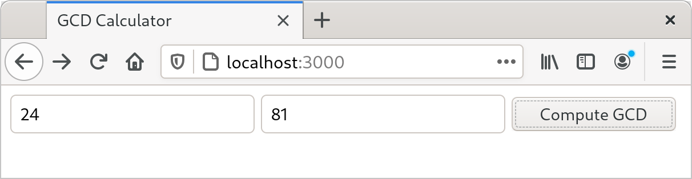
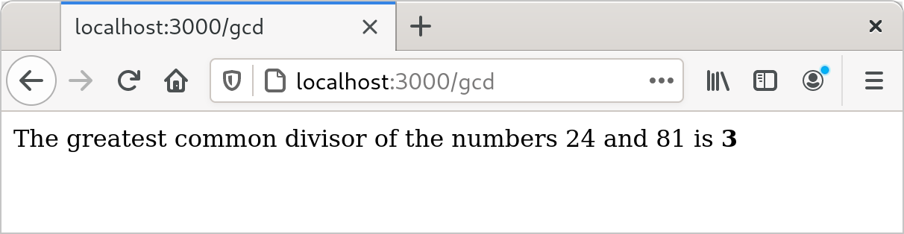
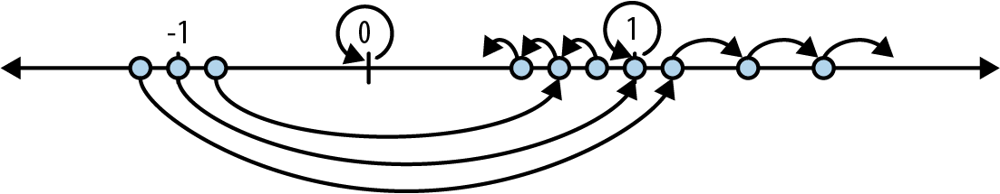
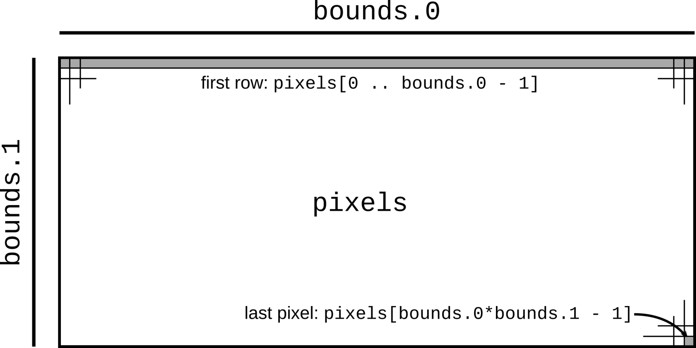
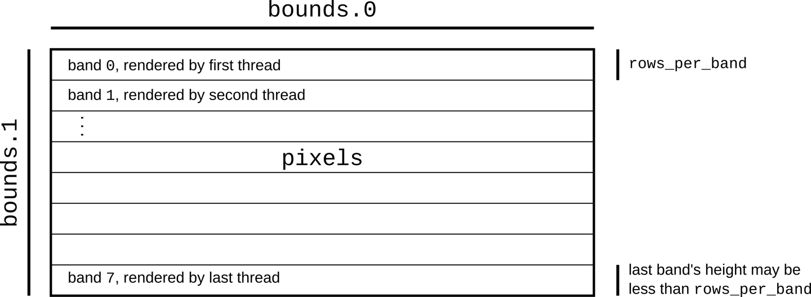

# Chapter 2. A Tour of Rust

Rust presents the authors of a book like this one with a challenge: what gives the language its character is not some specific, amazing feature that we can show off on the first page, but rather, the way all its parts are designed to work together smoothly in service of the goals we laid out in the last chapter: safe, performant systems programming. Each part of the language is best justified in the context of all the rest.

So rather than tackle one language feature at a time, we’ve prepared a tour of a few small but complete programs, each of which introduces some more features of the language, in context:

- As a warm-up, we have a program that does a simple calculation on its command-line arguments, with unit tests. This shows Rust’s core types and introduces *traits*.

- Next, we build a web server. We’ll use a third-party library to handle the details of HTTP and introduce string handling, closures, and error handling.

- Our third program plots a beautiful fractal, distributing the computation across multiple threads for speed. This includes an example of a generic function, illustrates how to handle something like a buffer of pixels, and shows off Rust’s support for concurrency.

- Finally, we show a robust command-line tool that processes files using regular expressions. This presents the Rust standard library’s facilities for working with files, and the most commonly used third-party regular expression library.

Rust’s promise to prevent undefined behavior with minimal impact on performance influences the design of every part of the system, from the standard data structures like vectors and strings to the way Rust programs use third-party libraries. The details of how this is managed are covered throughout the book. But for now, we want to show you that Rust is a capable and pleasant language to use.

First, of course, you need to install Rust on your computer.

# rustup and Cargo

The best way to install Rust is to use `rustup`. Go to [*https://rustup.rs*](https://rustup.rs) and follow the instructions there.

You can, alternatively, go to the [Rust website](https://oreil.ly/4Q2FB) to get pre-built packages for Linux, macOS, and Windows. Rust is also included in some operating system distributions. We prefer `rustup` because it’s a tool for managing Rust installations, like RVM for Ruby or NVM for Node. For example, when a new version of Rust is released, you’ll be able to upgrade with zero clicks by typing `rustup update`.

In any case, once you’ve completed the installation, you should have three new commands available at your command line:

``` console
$ cargo --version
cargo 1.49.0 (d00d64df9 2020-12-05)
$ rustc --version
rustc 1.49.0 (e1884a8e3 2020-12-29)
$ rustdoc --version
rustdoc 1.49.0 (e1884a8e3 2020-12-29)
```

Here, the `$` is the command prompt; on Windows, this would be `C:\>` or something similar. In this transcript we run the three commands we installed, asking each to report which version it is. Taking each command in turn:

- `cargo` is Rust’s compilation manager, package manager, and general-purpose tool. You can use Cargo to start a new project, build and run your program, and manage any external libraries your code depends on.

- `rustc` is the Rust compiler. Usually we let Cargo invoke the compiler for us, but sometimes it’s useful to run it directly.

- `rustdoc` is the Rust documentation tool. If you write documentation in comments of the appropriate form in your program’s source code, `rustdoc` can build nicely formatted HTML from them. Like `rustc`, we usually let Cargo run `rustdoc` for us.

As a convenience, Cargo can create a new Rust package for us, with some standard metadata arranged appropriately:

``` console
$ cargo new hello
     Created binary (application) `hello` package
```

This command creates a new package directory named *hello*, ready to build a command-line executable.

Looking inside the package’s top-level directory:

``` console
$ cd hello
$ ls -la
total 24
drwxrwxr-x.  4 jimb jimb 4096 Sep 22 21:09 .
drwx------. 62 jimb jimb 4096 Sep 22 21:09 ..
drwxrwxr-x.  6 jimb jimb 4096 Sep 22 21:09 .git
-rw-rw-r--.  1 jimb jimb    7 Sep 22 21:09 .gitignore
-rw-rw-r--.  1 jimb jimb   88 Sep 22 21:09 Cargo.toml
drwxrwxr-x.  2 jimb jimb 4096 Sep 22 21:09 src
```

We can see that Cargo has created a file *Cargo.toml* to hold metadata for the package. At the moment this file doesn’t contain much:

```
[package]
name = "hello"
version = "0.1.0"
edition = "2021"

# See more keys and their definitions at
# https://doc.rust-lang.org/cargo/reference/manifest.html

[dependencies]
```

If our program ever acquires dependencies on other libraries, we can record them in this file, and Cargo will take care of downloading, building, and updating those libraries for us. We’ll cover the *Cargo.toml* file in detail in Chapter 8.

Cargo has set up our package for use with the `git` version control system, creating a *.git* metadata subdirectory and a *.gitignore* file. You can tell Cargo to skip this step by passing `--vcs none` to `cargo new` on the command line.

The *src* subdirectory contains the actual Rust code:

``` console
$ cd src
$ ls -l
total 4
-rw-rw-r--. 1 jimb jimb 45 Sep 22 21:09 main.rs
```

It seems that Cargo has begun writing the program on our behalf. The *main.rs* file contains the text:

```
fn main() {
    println!("Hello, world!");
}
```

In Rust, you don’t even need to write your own “Hello, World!” program. And this is the extent of the boilerplate for a new Rust program: two files, totaling thirteen lines.

We can invoke the `cargo run` command from any directory in the package to build and run our program:

``` console
$ cargo run
   Compiling hello v0.1.0 (/home/jimb/rust/hello)
    Finished dev [unoptimized + debuginfo] target(s) in 0.28s
     Running `/home/jimb/rust/hello/target/debug/hello`
Hello, world!
```

Here, Cargo has invoked the Rust compiler, `rustc`, and then run the executable it produced. Cargo places the executable in the *target* subdirectory at the top of the package:

``` console
$ ls -l ../target/debug
total 580
drwxrwxr-x. 2 jimb jimb   4096 Sep 22 21:37 build
drwxrwxr-x. 2 jimb jimb   4096 Sep 22 21:37 deps
drwxrwxr-x. 2 jimb jimb   4096 Sep 22 21:37 examples
-rwxrwxr-x. 1 jimb jimb 576632 Sep 22 21:37 hello
-rw-rw-r--. 1 jimb jimb    198 Sep 22 21:37 hello.d
drwxrwxr-x. 2 jimb jimb     68 Sep 22 21:37 incremental
$ ../target/debug/hello
Hello, world!
```

When we’re through, Cargo can clean up the generated files for us:

``` console
$ cargo clean
$ ../target/debug/hello
bash: ../target/debug/hello: No such file or directory
```

# Rust Functions

Rust’s syntax is deliberately unoriginal. If you are familiar with C, C++, Java, or JavaScript, you can probably find your way through the general structure of a Rust program. Here is a function that computes the greatest common divisor of two integers, using [Euclid’s algorithm](https://oreil.ly/DFpyb). You can add this code to the end of *src/main.rs*:

```
fn gcd(mut n: u64, mut m: u64) -> u64 {
    assert!(n != 0 && m != 0);
    while m != 0 {
        if m < n {
            let t = m;
            m = n;
            n = t;
        }
        m = m % n;
    }
    n
}
```

The `fn` keyword (pronounced “fun”) introduces a function. Here, we’re defining a function named `gcd`, which takes two parameters `n` and `m`, each of which is of type `u64`, an unsigned 64-bit integer. The `->` token precedes the return type: our function returns a `u64` value. Four-space indentation is standard Rust style.

Rust’s machine integer type names reflect their size and signedness: `i32` is a signed 32-bit integer; `u8` is an unsigned 8-bit integer (used for “byte” values), and so on. The `isize` and `usize` types hold pointer-sized signed and unsigned integers, 32 bits long on 32-bit platforms, and 64 bits long on 64-bit platforms. Rust also has two floating-point types, `f32` and `f64`, which are the IEEE single- and double-precision floating-point types, like `float` and `double` in C and C++.

By default, once a variable is initialized, its value can’t be changed, but placing the `mut` keyword (pronounced “mute,” short for *mutable*) before the parameters `n` and `m` allows our function body to assign to them. In practice, most variables don’t get assigned to; the `mut` keyword on those that do can be a helpful hint when reading code.

The function’s body starts with a call to the `assert!` macro, verifying that neither argument is zero. The `!` character marks this as a macro invocation, not a function call. Like the `assert` macro in C and C++, Rust’s `assert!` checks that its argument is true, and if it is not, terminates the program with a helpful message including the source location of the failing check; this kind of abrupt termination is called a *panic*. Unlike C and C++, in which assertions can be skipped, Rust always checks assertions regardless of how the program was compiled. There is also a `debug_assert!` macro, whose assertions are skipped when the program is compiled for speed.

The heart of our function is a `while` loop containing an `if` statement and an assignment. Unlike C and C++, Rust does not require parentheses around the conditional expressions, but it does require curly braces around the statements they control.

A `let` statement declares a local variable, like `t` in our function. We don’t need to write out `t`’s type, as long as Rust can infer it from how the variable is used. In our function, the only type that works for `t` is `u64`, matching `m` and `n`. Rust only infers types within function bodies: you must write out the types of function parameters and return values, as we did before. If we wanted to spell out `t`’s type, we could write:

```
let t: u64 = m;
```

Rust has a `return` statement, but the `gcd` function doesn’t need one. If a function body ends with an expression that is *not* followed by a semicolon, that’s the function’s return value. In fact, any block surrounded by curly braces can function as an expression. For example, this is an expression that prints a message and then yields `x.cos()` as its value:

```
{
    println!("evaluating cos x");
    x.cos()
}
```

It’s typical in Rust to use this form to establish the function’s value when control “falls off the end” of the function, and use `return` statements only for explicit early returns from the midst of a function.

# Writing and Running Unit Tests

Rust has simple support for testing built into the language. To test our `gcd` function, we can add this code at the end of *src/main.rs*:

```
#[test]
fn test_gcd() {
    assert_eq!(gcd(14, 15), 1);

    assert_eq!(gcd(2 * 3 * 5 * 11 * 17,
                   3 * 7 * 11 * 13 * 19),
               3 * 11);
}
```

Here we define a function named `test_gcd`, which calls `gcd` and checks that it returns correct values. The `#[test]` atop the definition marks `test_gcd` as a test function, to be skipped in normal compilations, but included and called automatically if we run our program with the `cargo test` command. We can have test functions scattered throughout our source tree, placed next to the code they exercise, and `cargo test` will automatically gather them up and run them all.

The `#[test]` marker is an example of an *attribute*. Attributes are an open-ended system for marking functions and other declarations with extra information, like attributes in C++ and C#, or annotations in Java. They’re used to control compiler warnings and code style checks, include code conditionally (like `#ifdef` in C and C++), tell Rust how to interact with code written in other languages, and so on. We’ll see more examples of attributes as we go.

With our `gcd` and `test_gcd` definitions added to the *hello* package we created at the beginning of the chapter, and our current directory somewhere within the package’s subtree, we can run the tests as follows:

``` console
$ cargo test
   Compiling hello v0.1.0 (/home/jimb/rust/hello)
    Finished test [unoptimized + debuginfo] target(s) in 0.35s
     Running unittests (/home/jimb/rust/hello/target/debug/deps/hello-2375...)

running 1 test
test test_gcd ... ok

test result: ok. 1 passed; 0 failed; 0 ignored; 0 measured; 0 filtered out
```

# Handling Command-Line Arguments

In order for our program to take a series of numbers as command-line arguments and print their greatest common divisor, we can replace the `main` function in *src/main.rs* with the following:

```
use std::str::FromStr;
use std::env;

fn main() {
    let mut numbers = Vec::new();

    for arg in env::args().skip(1) {
        numbers.push(u64::from_str(&arg)
                     .expect("error parsing argument"));
    }

    if numbers.len() == 0 {
        eprintln!("Usage: gcd NUMBER ...");
        std::process::exit(1);
    }

    let mut d = numbers[0];
    for m in &numbers[1..] {
        d = gcd(d, *m);
    }

    println!("The greatest common divisor of {:?} is {}",
             numbers, d);
}
```

This is a large block of code, so let’s take it piece by piece:

```
use std::str::FromStr;
use std::env;
```

The first `use` declaration brings the standard library *trait* `FromStr` into scope. A trait is a collection of methods that types can implement. Any type that implements the `FromStr` trait has a `from_str` method that tries to parse a value of that type from a string. The `u64` type implements `FromStr`, and we’ll call `u64::from_str` to parse our command-line arguments. Although we never use the name `FromStr` elsewhere in the program, a trait must be in scope in order to use its methods. We’ll cover traits in detail in Chapter 11.

The second `use` declaration brings in the `std::env` module, which provides several useful functions and types for interacting with the execution environment, including the `args` function, which gives us access to the program’s command-line arguments.

Moving on to the program’s `main` function:

```
fn main() {
```

Our `main` function doesn’t return a value, so we can simply omit the `->` and return type that would normally follow the parameter list.

```
let mut numbers = Vec::new();
```

We declare a mutable local variable `numbers` and initialize it to an empty vector. `Vec` is Rust’s growable vector type, analogous to C++’s `std::vector`, a Python list, or a JavaScript array. Even though vectors are designed to be grown and shrunk dynamically, we must still mark the variable `mut` for Rust to let us push numbers onto the end of it.

The type of `numbers` is `Vec<u64>`, a vector of `u64` values, but as before, we don’t need to write that out. Rust will infer it for us, in part because what we push onto the vector are `u64` values, but also because we pass the vector’s elements to `gcd`, which accepts only `u64` values.

```
for arg in env::args().skip(1) {
```

Here we use a `for` loop to process our command-line arguments, setting the variable `arg` to each argument in turn and evaluating the loop body.

The `std::env` module’s `args` function returns an *iterator*, a value that produces each argument on demand, and indicates when we’re done. Iterators are ubiquitous in Rust; the standard library includes other iterators that produce the elements of a vector, the lines of a file, messages received on a communications channel, and almost anything else that makes sense to loop over. Rust’s iterators are very efficient: the compiler is usually able to translate them into the same code as a handwritten loop. We’ll show how this works and give examples in Chapter 15.

Beyond their use with `for` loops, iterators include a broad selection of methods you can use directly. For example, the first value produced by the iterator returned by `args` is always the name of the program being run. We want to skip that, so we call the iterator’s `skip` method to produce a new iterator that omits that first value.

```
numbers.push(u64::from_str(&arg)
             .expect("error parsing argument"));
```

Here we call `u64::from_str` to attempt to parse our command-line argument `arg` as an unsigned 64-bit integer. Rather than a method we’re invoking on some `u64` value we have at hand, `u64::from_str` is a function associated with the `u64` type, akin to a static method in C++ or Java. The `from_str` function doesn’t return a `u64` directly, but rather a `Result` value that indicates whether the parse succeeded or failed. A `Result` value is one of two variants:

- A value written `Ok(v)`, indicating that the parse succeeded and `v` is the value produced

- A value written `Err(e)`, indicating that the parse failed and `e` is an error value explaining why

Functions that do anything that might fail, such as doing input or output or otherwise interacting with the operating system, can return `Result` types whose `Ok` variants carry successful results—the count of bytes transferred, the file opened, and so on—and whose `Err` variants carry an error code indicating what went wrong. Unlike most modern languages, Rust does not have exceptions: all errors are handled using either `Result` or panic, as outlined in Chapter 7.

We use `Result`’s `expect` method to check the success of our parse. If the result is an `Err(e)`, `expect` prints a message that includes a description of `e` and exits the program immediately. However, if the result is `Ok(v)`, `expect` simply returns `v` itself, which we are finally able to push onto the end of our vector of numbers.

```
if numbers.len() == 0 {
    eprintln!("Usage: gcd NUMBER ...");
    std::process::exit(1);
}
```

There’s no greatest common divisor of an empty set of numbers, so we check that our vector has at least one element and exit the program with an error if it doesn’t. We use the `eprintln!` macro to write our error message to the standard error output stream.

```
let mut d = numbers[0];
for m in &numbers[1..] {
    d = gcd(d, *m);
}
```

This loop uses `d` as its running value, updating it to stay the greatest common divisor of all the numbers we’ve processed so far. As before, we must mark `d` as mutable so that we can assign to it in the loop.

The `for` loop has two surprising bits to it. First, we wrote `for m in &numbers[1..]`; what is the `&` operator for? Second, we wrote `gcd(d, *m)`; what is the `*` in `*m` for? These two details are complementary to each other.

Up to this point, our code has operated only on simple values like integers that fit in fixed-size blocks of memory. But now we’re about to iterate over a vector, which could be of any size whatsoever—possibly very large. Rust is cautious when handling such values: it wants to leave the programmer in control over memory consumption, making it clear how long each value lives, while still ensuring memory is freed promptly when no longer needed.

So when we iterate, we want to tell Rust that *ownership* of the vector should remain with `numbers`; we are merely *borrowing* its elements for the loop. The `&` operator in `&numbers[1..]` borrows a *reference* to the vector’s elements from the second onward. The `for` loop iterates over the referenced elements, letting `m` borrow each element in succession. The `*` operator in `*m` *dereferences* `m`, yielding the value it refers to; this is the next `u64` we want to pass to `gcd`. Finally, since `numbers` owns the vector, Rust automatically frees it when `numbers` goes out of scope at the end of `main`.

Rust’s rules for ownership and references are key to Rust’s memory management and safe concurrency; we discuss them in detail in Chapter 4 and its companion, Chapter 5. You’ll need to be comfortable with those rules to be comfortable in Rust, but for this introductory tour, all you need to know is that `&x` borrows a reference to `x`, and that `*r` is the value that the reference `r` refers to.

Continuing our walk through the program:

```
println!("The greatest common divisor of {:?} is {}",
         numbers, d);
```

Having iterated over the elements of `numbers`, the program prints the results to the standard output stream. The `println!` macro takes a template string, substitutes formatted versions of the remaining arguments for the `{...}` forms as they appear in the template string, and writes the result to the standard output stream.

Unlike C and C++, which require `main` to return zero if the program finished successfully, or a nonzero exit status if something went wrong, Rust assumes that if `main` returns at all, the program finished successfully. Only by explicitly calling functions like `expect` or `std::process::exit` can we cause the program to terminate with an error status code.

The `cargo run` command allows us to pass arguments to our program, so we can try out our command-line handling:

``` console
$ cargo run 42 56
   Compiling hello v0.1.0 (/home/jimb/rust/hello)
    Finished dev [unoptimized + debuginfo] target(s) in 0.22s
     Running `/home/jimb/rust/hello/target/debug/hello 42 56`
The greatest common divisor of [42, 56] is 14
$ cargo run 799459 28823 27347
    Finished dev [unoptimized + debuginfo] target(s) in 0.02s
     Running `/home/jimb/rust/hello/target/debug/hello 799459 28823 27347`
The greatest common divisor of [799459, 28823, 27347] is 41
$ cargo run 83
    Finished dev [unoptimized + debuginfo] target(s) in 0.02s
     Running `/home/jimb/rust/hello/target/debug/hello 83`
The greatest common divisor of [83] is 83
$ cargo run
    Finished dev [unoptimized + debuginfo] target(s) in 0.02s
     Running `/home/jimb/rust/hello/target/debug/hello`
Usage: gcd NUMBER ...
```

We’ve used a few features from Rust’s standard library in this section. If you’re curious about what else is available, we strongly encourage you to try out Rust’s online documentation. It has a live search feature that makes exploration easy and even includes links to the source code. The `rustup` command automatically installs a copy on your computer when you install Rust itself. You can view the standard library documentation on the Rust [website](https://oreil.ly/CGsB5), or in your browser with the command:

``` console
$ rustup doc --std
```

# Serving Pages to the Web

One of Rust’s strengths is the collection of freely available library packages published on the website [crates.io](https://crates.io). The `cargo` command makes it easy for your code to use a crates.io package: it will download the right version of the package, build it, and update it as requested. A Rust package, whether a library or an executable, is called a *crate*; Cargo and crates.io both derive their names from this term.

To show how this works, we’ll put together a simple web server using the `actix-web` web framework crate, the `serde` serialization crate, and various other crates on which they depend. As shown in Figure 2-1, our website will prompt the user for two numbers and compute their greatest common divisor.



###### Figure 2-1. Web page offering to compute GCD

First, we’ll have Cargo create a new package for us, named `actix-gcd`:

``` console
$ cargo new actix-gcd
     Created binary (application) `actix-gcd` package
$ cd actix-gcd
```

Then, we’ll edit our new project’s *Cargo.toml* file to list the packages we want to use; its contents should be as follows:

```
[package]
name = "actix-gcd"
version = "0.1.0"
edition = "2021"

# See more keys and their definitions at
# https://doc.rust-lang.org/cargo/reference/manifest.html

[dependencies]
actix-web = "1.0.8"
serde = { version = "1.0", features = ["derive"] }
```

Each line in the `[dependencies]` section of *Cargo.toml* gives the name of a crate on crates.io, and the version of that crate we would like to use. In this case, we want version `1.0.8` of the `actix-web` crate, and version `1.0` of the `serde` crate. There may well be versions of these crates on crates.io newer than those shown here, but by naming the specific versions we tested this code against, we can ensure the code will continue to compile even as new versions of the packages are published. We’ll discuss version management in more detail in Chapter 8.

Crates can have optional features: parts of the interface or implementation that not all users need, but that nonetheless make sense to include in that crate. The `serde` crate offers a wonderfully terse way to handle data from web forms, but according to `serde`’s documentation, it is only available if we select the crate’s `derive` feature, so we’ve requested it in our *Cargo.toml* file as shown.

Note that we need only name those crates we’ll use directly; `cargo` takes care of bringing in whatever other crates those need in turn.

For our first iteration, we’ll keep the web server simple: it will serve only the page that prompts the user for numbers to compute with. In *actix-gcd/src/main.rs*, we’ll place the following text:

```
use actix_web::{web, App, HttpResponse, HttpServer};

fn main() {
    let server = HttpServer::new(|| {
        App::new()
            .route("/", web::get().to(get_index))
    });

    println!("Serving on http://localhost:3000...");
    server
        .bind("127.0.0.1:3000").expect("error binding server to address")
        .run().expect("error running server");
}

fn get_index() -> HttpResponse {
    HttpResponse::Ok()
        .content_type("text/html")
        .body(
            r#"
                <title>GCD Calculator</title>
                <form action="/gcd" method="post">
                <input type="text" name="n"/>
                <input type="text" name="m"/>
                <button type="submit">Compute GCD</button>
                </form>
            "#,
        )
}
```

We start with a `use` declaration to make some of the `actix-web` crate’s definitions easier to get at. When we write `use actix_web::{...}`, each of the names listed inside the curly brackets becomes directly usable in our code; instead of having to spell out the full name `actix_web::HttpResponse` each time we use it, we can simply refer to it as `HttpResponse`. (We’ll get to the `serde` crate in a bit.)

Our `main` function is simple: it calls `HttpServer::new` to create a server that responds to requests for a single path, `"/"`; prints a message reminding us how to connect to it; and then sets it listening on TCP port 3000 on the local machine.

The argument we pass to `HttpServer::new` is the Rust *closure* expression `|| { App::new() ... }`. A closure is a value that can be called as if it were a function. This closure takes no arguments, but if it did, their names would appear between the `||` vertical bars. The `{ ... }` is the body of the closure. When we start our server, Actix starts a pool of threads to handle incoming requests. Each thread calls our closure to get a fresh copy of the `App` value that tells it how to route and handle requests.

The closure calls `App::new` to create a new, empty `App` and then calls its `route` method to add a single route for the path `"/"`. The handler provided for that route, `web::get().to(get_index)`, treats HTTP `GET` requests by calling the function `get_index`. The `route` method returns the same `App` it was invoked on, now enhanced with the new route. Since there’s no semicolon at the end of the closure’s body, the `App` is the closure’s return value, ready for the `HttpServer` thread to use.

The `get_index` function builds an `HttpResponse` value representing the response to an HTTP `GET /` request. `HttpResponse::Ok()` represents an HTTP `200 OK` status, indicating that the request succeeded. We call its `content_type` and `body` methods to fill in the details of the response; each call returns the `HttpResponse` it was applied to, with the modifications made. Finally, the return value from `body` serves as the return value of `get_index`.

Since the response text contains a lot of double quotes, we write it using the Rust “raw string” syntax: the letter `r`, zero or more hash marks (that is, the `#` character), a double quote, and then the contents of the string, terminated by another double quote followed by the same number of hash marks. Any character may occur within a raw string without being escaped, including double quotes; in fact, no escape sequences like `\"` are recognized. We can always ensure the string ends where we intend by using more hash marks around the quotes than ever appear in the text.

Having written *main.rs*, we can use the `cargo run` command to do everything needed to set it running: fetching the needed crates, compiling them, building our own program, linking everything together, and starting it up:

``` console
$ cargo run
    Updating crates.io index
 Downloading crates ...
  Downloaded serde v1.0.100
  Downloaded actix-web v1.0.8
  Downloaded serde_derive v1.0.100
...
   Compiling serde_json v1.0.40
   Compiling actix-router v0.1.5
   Compiling actix-http v0.2.10
   Compiling awc v0.2.7
   Compiling actix-web v1.0.8
   Compiling gcd v0.1.0 (/home/jimb/rust/actix-gcd)
    Finished dev [unoptimized + debuginfo] target(s) in 1m 24s
     Running `/home/jimb/rust/actix-gcd/target/debug/actix-gcd`
Serving on http://localhost:3000...
```

At this point, we can visit the given URL in our browser and see the page shown earlier in Figure 2-1.

Unfortunately, clicking Compute GCD doesn’t do anything, other than navigate our browser to a blank page. Let’s fix that next, by adding another route to our `App` to handle the `POST` request from our form.

It’s finally time to use the `serde` crate we listed in our *Cargo.toml* file: it provides a handy tool that will help us process the form data. First, we’ll need to add the following `use` directive to the top of *src/main.rs*:

```
use serde::Deserialize;
```

Rust programmers typically gather all their `use` declarations together toward the top of the file, but this isn’t strictly necessary: Rust allows declarations to occur in any order, as long as they appear at the appropriate level of nesting.

Next, let’s define a Rust structure type that represents the values we expect from our form:

```
#[derive(Deserialize)]
struct GcdParameters {
    n: u64,
    m: u64,
}
```

This defines a new type named `GcdParameters` that has two fields, `n` and `m`, each of which is a `u64`—the argument type our `gcd` function expects.

The annotation above the `struct` definition is an attribute, like the `#[test]` attribute we used earlier to mark test functions. Placing a `#[derive(Deserialize)]` attribute above a type definition tells the `serde` crate to examine the type when the program is compiled and automatically generate code to parse a value of this type from data in the format that HTML forms use for `POST` requests. In fact, that attribute is sufficient to let you parse a `GcdParameters` value from almost any sort of structured data: JSON, YAML, TOML, or any one of a number of other textual and binary formats. The `serde` crate also provides a `Serialize` attribute that generates code to do the reverse, taking Rust values and writing them out in a structured format.

With this definition in place, we can write our handler function quite easily:

```
fn post_gcd(form: web::Form<GcdParameters>) -> HttpResponse {
    if form.n == 0 || form.m == 0 {
        return HttpResponse::BadRequest()
            .content_type("text/html")
            .body("Computing the GCD with zero is boring.");
    }

    let response =
        format!("The greatest common divisor of the numbers {} and {} \
                 is <b>{}</b>\n",
                form.n, form.m, gcd(form.n, form.m));

    HttpResponse::Ok()
        .content_type("text/html")
        .body(response)
}
```

For a function to serve as an Actix request handler, its arguments must all have types Actix knows how to extract from an HTTP request. Our `post_gcd` function takes one argument, `form`, whose type is `web::Form<GcdParameters>`. Actix knows how to extract a value of any type `web::Form<T>` from an HTTP request if, and only if, `T` can be deserialized from HTML form `POST` data. Since we’ve placed the `#[derive(Deserialize)]` attribute on our `GcdParameters` type definition, Actix can deserialize it from form data, so request handlers can expect a `web::Form<GcdParameters>` value as a parameter. These relationships between types and functions are all worked out at compile time; if you write a handler function with an argument type that Actix doesn’t know how to handle, the Rust compiler lets you know of your mistake immediately.

Looking inside `post_gcd`, the function first returns an HTTP `400 BAD REQUEST` error if either parameter is zero, since our `gcd` function will panic if they are. Then, it constructs a response to the request using the `format!` macro. The `format!` macro is just like the `println!` macro, except that instead of writing the text to the standard output, it returns it as a string. Once it has obtained the text of the response, `post_gcd` wraps it up in an HTTP `200 OK` response, sets its content type, and returns it to be delivered to the sender.

We also have to register `post_gcd` as the handler for the form. We’ll replace our `main` function with this version:

```
fn main() {
    let server = HttpServer::new(|| {
        App::new()
            .route("/", web::get().to(get_index))
            .route("/gcd", web::post().to(post_gcd))
    });

    println!("Serving on http://localhost:3000...");
    server
        .bind("127.0.0.1:3000").expect("error binding server to address")
        .run().expect("error running server");
}
```

The only change here is that we’ve added another call to `route`, establishing `web::post().to(post_gcd)` as the handler for the path `"/gcd"`.

The last remaining piece is the `gcd` function we wrote earlier, which goes in the *actix-gcd/src/main.rs* file. With that in place, you can interrupt any servers you might have left running and rebuild and restart the program:

``` console
$ cargo run
   Compiling actix-gcd v0.1.0 (/home/jimb/rust/actix-gcd)
    Finished dev [unoptimized + debuginfo] target(s) in 0.0 secs
     Running `target/debug/actix-gcd`
Serving on http://localhost:3000...
```

This time, by visiting *http://localhost:3000*, entering some numbers, and clicking the Compute GCD button, you should actually see some results (Figure 2-2).



###### Figure 2-2. Web page showing results of computing GCD

# Concurrency

One of Rust’s great strengths is its support for concurrent programming. The same rules that ensure Rust programs are free of memory errors also ensure threads can share memory only in ways that avoid data races. For example:

- If you use a mutex to coordinate threads making changes to a shared data structure, Rust ensures that you can’t access the data except when you’re holding the lock, and releases the lock automatically when you’re done. In C and C++, the relationship between a mutex and the data it protects is left to the comments.

- If you want to share read-only data among several threads, Rust ensures that you cannot modify the data accidentally. In C and C++, the type system can help with this, but it’s easy to get it wrong.

- If you transfer ownership of a data structure from one thread to another, Rust makes sure you have indeed relinquished all access to it. In C and C++, it’s up to you to check that nothing on the sending thread will ever touch the data again. If you don’t get it right, the effects can depend on what happens to be in the processor’s cache and how many writes to memory you’ve done recently. Not that we’re bitter.

In this section, we’ll walk you through the process of writing your second multi-threaded program.

You’ve already written your first: the Actix web framework you used to implement the Greatest Common Divisor server uses a pool of threads to run request handler functions. If the server receives simultaneous requests, it may run the `get_form` and `post_gcd` functions in several threads at once. That may come as a bit of a shock, since we certainly didn’t have concurrency in mind when we wrote those functions. But Rust guarantees this is safe to do, no matter how elaborate your server gets: if your program compiles, it is free of data races. All Rust functions are thread-safe.

This section’s program plots the Mandelbrot set, a fractal produced by iterating a simple function on complex numbers. Plotting the Mandelbrot set is often called an *embarrassingly parallel* algorithm, because the pattern of communication between the threads is so simple; we’ll cover more complex patterns in Chapter 19, but this task demonstrates some of the essentials.

To get started, we’ll create a fresh Rust project:

``` console
$ cargo new mandelbrot
     Created binary (application) `mandelbrot` package
$ cd mandelbrot
```

All the code will go in *mandelbrot/src/main.rs*, and we’ll add some dependencies to *mandelbrot/Cargo.toml*.

Before we get into the concurrent Mandelbrot implementation, we need to describe the computation we’re going to perform.

## What the Mandelbrot Set Actually Is

When reading code, it’s helpful to have a concrete idea of what it’s trying to do, so let’s take a short excursion into some pure mathematics. We’ll start with a simple case and then add complicating details until we arrive at the calculation at the heart of the Mandelbrot set.

Here’s an infinite loop, written using Rust’s dedicated syntax for that, a `loop` statement:

```
fn square_loop(mut x: f64) {
    loop {
        x = x * x;
    }
}
```

In real life, Rust can see that `x` is never used for anything and so might not bother computing its value. But for the time being, assume the code runs as written. What happens to the value of `x`? Squaring any number smaller than 1 makes it smaller, so it approaches zero; squaring 1 yields 1; squaring a number larger than 1 makes it larger, so it approaches infinity; and squaring a negative number makes it positive, after which it behaves like one of the prior cases (Figure 2-3).



###### Figure 2-3. Effects of repeatedly squaring a number

So depending on the value you pass to `square_loop`, `x` stays at either zero or one, approaches zero, or approaches infinity.

Now consider a slightly different loop:

```
fn square_add_loop(c: f64) {
    let mut x = 0.;
    loop {
        x = x * x + c;
    }
}
```

This time, `x` starts at zero, and we tweak its progress in each iteration by adding in `c` after squaring it. This makes it harder to see how `x` fares, but some experimentation shows that if `c` is greater than 0.25 or less than –2.0, then `x` eventually becomes infinitely large; otherwise, it stays somewhere in the neighborhood of zero.

The next wrinkle: instead of using `f64` values, consider the same loop using complex numbers. The `num` crate on crates.io provides a complex number type we can use, so we must add a line for `num` to the `[dependencies]` section in our program’s *Cargo.toml* file. Here’s the entire file, up to this point (we’ll be adding more later):

```
[package]
name = "mandelbrot"
version = "0.1.0"
edition = "2021"

# See more keys and their definitions at
# https://doc.rust-lang.org/cargo/reference/manifest.html

[dependencies]
num = "0.4"
```

Now we can write the penultimate version of our loop:

```
use num::Complex;

fn complex_square_add_loop(c: Complex<f64>) {
    let mut z = Complex { re: 0.0, im: 0.0 };
    loop {
        z = z * z + c;
    }
}
```

It’s traditional to use `z` for complex numbers, so we’ve renamed our looping variable. The expression `Complex { re: 0.0, im: 0.0 }` is the way we write complex zero using the `num` crate’s `Complex` type. `Complex` is a Rust structure type (or *struct*), defined like this:

```
struct Complex<T> {
    /// Real portion of the complex number
    re: T,

    /// Imaginary portion of the complex number
    im: T,
}
```

The preceding code defines a struct named `Complex`, with two fields, `re` and `im`. `Complex` is a *generic* structure: you can read the `<T>` after the type name as “for any type `T`.” For example, `Complex<f64>` is a complex number whose `re` and `im` fields are `f64` values, `Complex<f32>` would use 32-bit floats, and so on. Given this definition, an expression like `Complex { re: 0.24, im: 0.3 }` produces a `Complex` value with its `re` field initialized to 0.24, and its `im` field initialized to 0.3.

The `num` crate arranges for `*`, `+`, and other arithmetic operators to work on `Complex` values, so the rest of the function works just like the prior version, except that it operates on points on the complex plane, not just points along the real number line. We’ll explain how you can make Rust’s operators work with your own types in Chapter 12.

Finally, we’ve reached the destination of our pure math excursion. The Mandelbrot set is defined as the set of complex numbers `c` for which `z` does not fly out to infinity. Our original simple squaring loop was predictable enough: any number greater than 1 or less than –1 flies away. Throwing a `+ c` into each iteration makes the behavior a little harder to anticipate: as we said earlier, values of `c` greater than 0.25 or less than –2 cause `z` to fly away. But expanding the game to complex numbers produces truly bizarre and beautiful patterns, which are what we want to plot.

Since a complex number `c` has both real and imaginary components `c.re` and `c.im`, we’ll treat these as the `x` and `y` coordinates of a point on the Cartesian plane, and color the point black if `c` is in the Mandelbrot set, or a lighter color otherwise. So for each pixel in our image, we must run the preceding loop on the corresponding point on the complex plane, see whether it escapes to infinity or orbits around the origin forever, and color it accordingly.

The infinite loop takes a while to run, but there are two tricks for the impatient. First, if we give up on running the loop forever and just try some limited number of iterations, it turns out that we still get a decent approximation of the set. How many iterations we need depends on how precisely we want to plot the boundary. Second, it’s been shown that, if `z` ever once leaves the circle of radius 2 centered at the origin, it will definitely fly infinitely far away from the origin eventually. So here’s the final version of our loop, and the heart of our program:

```
use num::Complex;

/// Try to determine if `c` is in the Mandelbrot set, using at most `limit`
/// iterations to decide.
///
/// If `c` is not a member, return `Some(i)`, where `i` is the number of
/// iterations it took for `c` to leave the circle of radius 2 centered on the
/// origin. If `c` seems to be a member (more precisely, if we reached the
/// iteration limit without being able to prove that `c` is not a member),
/// return `None`.
fn escape_time(c: Complex<f64>, limit: usize) -> Option<usize> {
    let mut z = Complex { re: 0.0, im: 0.0 };
    for i in 0..limit {
        if z.norm_sqr() > 4.0 {
            return Some(i);
        }
        z = z * z + c;
    }

    None
}
```

This function takes the complex number `c` that we want to test for membership in the Mandelbrot set and a limit on the number of iterations to try before giving up and declaring `c` to probably be a member.

The function’s return value is an `Option<usize>`. Rust’s standard library defines the `Option` type as follows:

```
enum Option<T> {
    None,
    Some(T),
}
```

`Option` is an *enumerated type*, often called an *enum*, because its definition enumerates several variants that a value of this type could be: for any type `T`, a value of type `Option<T>` is either `Some(v)`, where `v` is a value of type `T`, or `None`, indicating no `T` value is available. Like the `Complex` type we discussed earlier, `Option` is a generic type: you can use `Option<T>` to represent an optional value of any type `T` you like.

In our case, `escape_time` returns an `Option<usize>` to indicate whether `c` is in the Mandelbrot set—and if it’s not, how long we had to iterate to find that out. If `c` is not in the set, `escape_time` returns `Some(i)`, where `i` is the number of the iteration at which `z` left the circle of radius 2. Otherwise, `c` is apparently in the set, and `escape_time` returns `None`.

```
for i in 0..limit {
```

The earlier examples showed `for` loops iterating over command-line arguments and vector elements; this `for` loop simply iterates over the range of integers starting with `0` and up to (but not including) `limit`.

The `z.norm_sqr()` method call returns the square of `z`’s distance from the origin. To decide whether `z` has left the circle of radius 2, instead of computing a square root, we just compare the squared distance with 4.0, which is faster.

You may have noticed that we use `///` to mark the comment lines above the function definition; the comments above the members of the `Complex` structure start with `///` as well. These are *documentation comments*; the `rustdoc` utility knows how to parse them, together with the code they describe, and produce online documentation. The documentation for Rust’s standard library is written in this form. We describe documentation comments in detail in Chapter 8.

The rest of the program is concerned with deciding which portion of the set to plot at what resolution and distributing the work across several threads to speed up the calculation.

## Parsing Pair Command-Line Arguments

The program takes several command-line arguments controlling the resolution of the image we’ll write and the portion of the Mandelbrot set the image shows. Since these command-line arguments all follow a common form, here’s a function to parse them:

```
use std::str::FromStr;

/// Parse the string `s` as a coordinate pair, like `"400x600"` or `"1.0,0.5"`.
///
/// Specifically, `s` should have the form <left><sep><right>, where <sep> is
/// the character given by the `separator` argument, and <left> and <right> are
/// both strings that can be parsed by `T::from_str`. `separator` must be an
/// ASCII character.
///
/// If `s` has the proper form, return `Some<(x, y)>`. If it doesn't parse
/// correctly, return `None`.
fn parse_pair<T: FromStr>(s: &str, separator: char) -> Option<(T, T)> {
    match s.find(separator) {
        None => None,
        Some(index) => {
            match (T::from_str(&s[..index]), T::from_str(&s[index + 1..])) {
                (Ok(l), Ok(r)) => Some((l, r)),
                _ => None
            }
        }
    }
}

#[test]
fn test_parse_pair() {
    assert_eq!(parse_pair::<i32>("",        ','), None);
    assert_eq!(parse_pair::<i32>("10,",     ','), None);
    assert_eq!(parse_pair::<i32>(",10",     ','), None);
    assert_eq!(parse_pair::<i32>("10,20",   ','), Some((10, 20)));
    assert_eq!(parse_pair::<i32>("10,20xy", ','), None);
    assert_eq!(parse_pair::<f64>("0.5x",    'x'), None);
    assert_eq!(parse_pair::<f64>("0.5x1.5", 'x'), Some((0.5, 1.5)));
}
```

The definition of `parse_pair` is a *generic function*:

```
fn parse_pair<T: FromStr>(s: &str, separator: char) -> Option<(T, T)> {
```

You can read the clause `<T: FromStr>` aloud as, “For any type `T` that implements the `FromStr` trait...” This effectively lets us define an entire family of functions at once: `parse_pair::<i32>` is a function that parses pairs of `i32` values, `parse_pair::<f64>` parses pairs of floating-point values, and so on. This is very much like a function template in C++. A Rust programmer would call `T` a *type parameter* of `parse_pair`. When you use a generic function, Rust will often be able to infer type parameters for you, and you won’t need to write them out as we did in the test code.

Our return type is `Option<(T, T)>`: either `None` or a value `Some((v1, v2))`, where `(v1, v2)` is a tuple of two values, both of type `T`. The `parse_pair` function doesn’t use an explicit return statement, so its return value is the value of the last (and the only) expression in its body:

```
match s.find(separator) {
    None => None,
    Some(index) => {
        ...
    }
}
```

The `String` type’s `find` method searches the string for a character that matches `separator`. If `find` returns `None`, meaning that the separator character doesn’t occur in the string, the entire `match` expression evaluates to `None`, indicating that the parse failed. Otherwise, we take `index` to be the separator’s position in the string.

```
match (T::from_str(&s[..index]), T::from_str(&s[index + 1..])) {
    (Ok(l), Ok(r)) => Some((l, r)),
    _ => None
}
```

This begins to show off the power of the `match` expression. The argument to the match is this tuple expression:

```
(T::from_str(&s[..index]), T::from_str(&s[index + 1..]))
```

The expressions `&s[..index]` and `&s[index + 1..]` are slices of the string, preceding and following the separator. The type parameter `T`’s associated `from_str` function takes each of these and tries to parse them as a value of type `T`, producing a tuple of results. This is what we match against:

```
(Ok(l), Ok(r)) => Some((l, r)),
```

This pattern matches only if both elements of the tuple are `Ok` variants of the `Result` type, indicating that both parses succeeded. If so, `Some((l, r))` is the value of the match expression and hence the return value of the function.

```
_ => None
```

The wildcard pattern `_` matches anything and ignores its value. If we reach this point, then `parse_pair` has failed, so we evaluate to `None`, again providing the return value of the function.

Now that we have `parse_pair`, it’s easy to write a function to parse a pair of floating-point coordinates and return them as a `Complex<f64>` value:

```
/// Parse a pair of floating-point numbers separated by a comma as a complex
/// number.
fn parse_complex(s: &str) -> Option<Complex<f64>> {
    match parse_pair(s, ',') {
        Some((re, im)) => Some(Complex { re, im }),
        None => None
    }
}

#[test]
fn test_parse_complex() {
    assert_eq!(parse_complex("1.25,-0.0625"),
               Some(Complex { re: 1.25, im: -0.0625 }));
    assert_eq!(parse_complex(",-0.0625"), None);
}
```

The `parse_complex` function calls `parse_pair`, builds a `Complex` value if the coordinates were parsed successfully, and passes failures along to its caller.

If you were reading closely, you may have noticed that we used a shorthand notation to build the `Complex` value. It’s common to initialize a struct’s fields with variables of the same name, so rather than forcing you to write `Complex { re: re, im: im }`, Rust lets you simply write `Complex { re, im }`. This is modeled on similar notations in JavaScript and Haskell.

## Mapping from Pixels to Complex Numbers

The program needs to work in two related coordinate spaces: each pixel in the output image corresponds to a point on the complex plane. The relationship between these two spaces depends on which portion of the Mandelbrot set we’re going to plot, and the resolution of the image requested, as determined by command-line arguments. The following function converts from *image space* to *complex number space*:

```
/// Given the row and column of a pixel in the output image, return the
/// corresponding point on the complex plane.
///
/// `bounds` is a pair giving the width and height of the image in pixels.
/// `pixel` is a (column, row) pair indicating a particular pixel in that image.
/// The `upper_left` and `lower_right` parameters are points on the complex
/// plane designating the area our image covers.
fn pixel_to_point(bounds: (usize, usize),
                  pixel: (usize, usize),
                  upper_left: Complex<f64>,
                  lower_right: Complex<f64>)
    -> Complex<f64>
{
    let (width, height) = (lower_right.re - upper_left.re,
                           upper_left.im - lower_right.im);
    Complex {
        re: upper_left.re + pixel.0 as f64 * width  / bounds.0 as f64,
        im: upper_left.im - pixel.1 as f64 * height / bounds.1 as f64
        // Why subtraction here? pixel.1 increases as we go down,
        // but the imaginary component increases as we go up.
    }
}

#[test]
fn test_pixel_to_point() {
    assert_eq!(pixel_to_point((100, 200), (25, 175),
                              Complex { re: -1.0, im:  1.0 },
                              Complex { re:  1.0, im: -1.0 }),
               Complex { re: -0.5, im: -0.75 });
}
```

Figure 2-4 illustrates the calculation `pixel_to_point` performs.

The code of `pixel_to_point` is simply calculation, so we won’t explain it in detail. However, there are a few things to point out. Expressions with this form refer to tuple elements:

```
pixel.0
```

This refers to the first element of the tuple `pixel`.

```
pixel.0 as f64
```

This is Rust’s syntax for a type conversion: this converts `pixel.0` to an `f64` value. Unlike C and C++, Rust generally refuses to convert between numeric types implicitly; you must write out the conversions you need. This can be tedious, but being explicit about which conversions occur and when is surprisingly helpful. Implicit integer conversions seem innocent enough, but historically they have been a frequent source of bugs and security holes in real-world C and C++ code.


###### Figure 2-4. The relationship between the complex plane and the image’s pixels

## Plotting the Set

To plot the Mandelbrot set, for every pixel in the image, we simply apply `escape_time` to the corresponding point on the complex plane, and color the pixel depending on the result:

```
/// Render a rectangle of the Mandelbrot set into a buffer of pixels.
///
/// The `bounds` argument gives the width and height of the buffer `pixels`,
/// which holds one grayscale pixel per byte. The `upper_left` and `lower_right`
/// arguments specify points on the complex plane corresponding to the upper-
/// left and lower-right corners of the pixel buffer.
fn render(pixels: &mut [u8],
          bounds: (usize, usize),
          upper_left: Complex<f64>,
          lower_right: Complex<f64>)
{
    assert!(pixels.len() == bounds.0 * bounds.1);

    for row in 0..bounds.1 {
        for column in 0..bounds.0 {
            let point = pixel_to_point(bounds, (column, row),
                                       upper_left, lower_right);
            pixels[row * bounds.0 + column] =
                match escape_time(point, 255) {
                    None => 0,
                    Some(count) => 255 - count as u8
                };
        }
    }
}
```

This should all look pretty familiar at this point.

```
pixels[row * bounds.0 + column] =
    match escape_time(point, 255) {
        None => 0,
        Some(count) => 255 - count as u8
    };
```

If `escape_time` says that `point` belongs to the set, `render` colors the corresponding pixel black (`0`). Otherwise, `render` assigns darker colors to the numbers that took longer to escape the circle.

## Writing Image Files

The `image` crate provides functions for reading and writing a wide variety of image formats, along with some basic image manipulation functions. In particular, it includes an encoder for the PNG image file format, which this program uses to save the final results of the calculation. In order to use `image`, add the following line to the `[dependencies]` section of *Cargo.toml*:

```
image = "0.13.0"
```

With that in place, we can write:

```
use image::ColorType;
use image::png::PNGEncoder;
use std::fs::File;

/// Write the buffer `pixels`, whose dimensions are given by `bounds`, to the
/// file named `filename`.
fn write_image(filename: &str, pixels: &[u8], bounds: (usize, usize))
    -> Result<(), std::io::Error>
{
    let output = File::create(filename)?;

    let encoder = PNGEncoder::new(output);
    encoder.encode(pixels,
                   bounds.0 as u32, bounds.1 as u32,
                   ColorType::Gray(8))?;

    Ok(())
}
```

The operation of this function is pretty straightforward: it opens a file and tries to write the image to it. We pass the encoder the actual pixel data from `pixels`, and its width and height from `bounds`, and then a final argument that says how to interpret the bytes in `pixels`: the value `ColorType::Gray(8)` indicates that each byte is an eight-bit grayscale value.

That’s all straightforward. What’s interesting about this function is how it copes when something goes wrong. If we encounter an error, we need to report that back to our caller. As we’ve mentioned before, fallible functions in Rust should return a `Result` value, which is either `Ok(s)` on success, where `s` is the successful value, or `Err(e)` on failure, where `e` is an error code. So what are `write_image`’s success and error types?

When all goes well, our `write_image` function has no useful value to return; it wrote everything interesting to the file. So its success type is the *unit* type `()`, so called because it has only one value, also written `()`. The unit type is akin to `void` in C and C++.

When an error occurs, it’s because either `File::create` wasn’t able to create the file or `encoder.encode` wasn’t able to write the image to it; the I/O operation returned an error code. The return type of `File::create` is `Result<std::fs::File, std::io::Error>`, while that of `encoder.encode` is `Result<(), std::io::Error>`, so both share the same error type, `std::io::Error`. It makes sense for our `write_image` function to do the same. In either case, failure should result in an immediate return, passing along the `std::io::Error` value describing what went wrong.

So to properly handle `File::create`’s result, we need to `match` on its return value, like this:

```
let output = match File::create(filename) {
    Ok(f) => f,
    Err(e) => {
        return Err(e);
    }
};
```

On success, let `output` be the `File` carried in the `Ok` value. On failure, pass along the error to our own caller.

This kind of `match` statement is such a common pattern in Rust that the language provides the `?` operator as shorthand for the whole thing. So, rather than writing out this logic explicitly every time we attempt something that could fail, you can use the following equivalent and much more legible statement:

```
let output = File::create(filename)?;
```

If `File::create` fails, the `?` operator returns from `write_image`, passing along the error. Otherwise, `output` holds the successfully opened `File`.

###### Note

It’s a common beginner’s mistake to attempt to use `?` in the `main` function. However, since `main` itself doesn’t return a value, this won’t work; instead, you need to use a `match` statement, or one of the shorthand methods like `unwrap` and `expect`. There’s also the option of simply changing `main` to return a `Result`, which we’ll cover later.

## A Concurrent Mandelbrot Program

All the pieces are in place, and we can show you the `main` function, where we can put concurrency to work for us. First, a nonconcurrent version for simplicity:

```
use std::env;

fn main() {
    let args: Vec<String> = env::args().collect();

    if args.len() != 5 {
        eprintln!("Usage: {} FILE PIXELS UPPERLEFT LOWERRIGHT",
                  args[0]);
        eprintln!("Example: {} mandel.png 1000x750 -1.20,0.35 -1,0.20",
                  args[0]);
        std::process::exit(1);
    }

    let bounds = parse_pair(&args[2], 'x')
        .expect("error parsing image dimensions");
    let upper_left = parse_complex(&args[3])
        .expect("error parsing upper left corner point");
    let lower_right = parse_complex(&args[4])
        .expect("error parsing lower right corner point");

    let mut pixels = vec![0; bounds.0 * bounds.1];

    render(&mut pixels, bounds, upper_left, lower_right);

    write_image(&args[1], &pixels, bounds)
        .expect("error writing PNG file");
}
```

After collecting the command-line arguments into a vector of `String`s, we parse each one and then begin calculations.

```
let mut pixels = vec![0; bounds.0 * bounds.1];
```

A macro call `vec![v; n]` creates a vector `n` elements long whose elements are initialized to `v`, so the preceding code creates a vector of zeros whose length is `bounds.0 * bounds.1`, where `bounds` is the image resolution parsed from the command line. We’ll use this vector as a rectangular array of one-byte grayscale pixel values, as shown in Figure 2-5.

The next line of interest is this:

```
render(&mut pixels, bounds, upper_left, lower_right);
```

This calls the `render` function to actually compute the image. The expression `&mut pixels` borrows a mutable reference to our pixel buffer, allowing `render` to fill it with computed grayscale values, even while `pixels` remains the vector’s owner. The remaining arguments pass the image’s dimensions and the rectangle of the complex plane we’ve chosen to plot.

```
write_image(&args[1], &pixels, bounds)
    .expect("error writing PNG file");
```



###### Figure 2-5. Using a vector as a rectangular array of pixels

Finally, we write the pixel buffer out to disk as a PNG file. In this case, we pass a shared (nonmutable) reference to the buffer, since `write_image` should have no need to modify the buffer’s contents.

At this point, we can build and run the program in release mode, which enables many powerful compiler optimizations, and after several seconds, it will write a beautiful image to the file *mandel.png*:

``` console
$ cargo build --release
    Updating crates.io index
   Compiling autocfg v1.0.1
   ...
   Compiling image v0.13.0
   Compiling mandelbrot v0.1.0 ($RUSTBOOK/mandelbrot)
    Finished release [optimized] target(s) in 25.36s
$ time target/release/mandelbrot mandel.png 4000x3000 -1.20,0.35 -1,0.20
real    0m4.678s
user    0m4.661s
sys     0m0.008s
```

This command should create a file called *mandel.png*, which you can view with your system’s image viewing program or in a web browser. If all has gone well, it should look like Figure 2-6.


###### Figure 2-6. Results from parallel Mandelbrot program

In the previous transcript, we used the Unix `time` program to analyze the running time of the program: it took about five seconds total to run the Mandelbrot computation on each pixel of the image. But almost all modern machines have multiple processor cores, and this program used only one. If we could distribute the work across all the computing resources the machine has to offer, we should be able to complete the image much more quickly.

To this end, we’ll divide the image into sections, one per processor, and let each processor color the pixels assigned to it. For simplicity, we’ll break it into horizontal bands, as shown in Figure 2-7. When all processors have finished, we can write out the pixels to disk.



###### Figure 2-7. Dividing the pixel buffer into bands for parallel rendering

The `crossbeam` crate provides a number of valuable concurrency facilities, including a *scoped thread* facility that does exactly what we need here. To use it, we must add the following line to our *Cargo.toml* file:

```
crossbeam = "0.8"
```

Then we need to take out the single line calling `render` and replace it with the following:

```
let threads = 8;
let rows_per_band = bounds.1 / threads + 1;

{
    let bands: Vec<&mut [u8]> =
        pixels.chunks_mut(rows_per_band * bounds.0).collect();
    crossbeam::scope(|spawner| {
        for (i, band) in bands.into_iter().enumerate() {
            let top = rows_per_band * i;
            let height = band.len() / bounds.0;
            let band_bounds = (bounds.0, height);
            let band_upper_left =
                pixel_to_point(bounds, (0, top), upper_left, lower_right);
            let band_lower_right =
                pixel_to_point(bounds, (bounds.0, top + height),
                               upper_left, lower_right);

            spawner.spawn(move |_| {
                render(band, band_bounds, band_upper_left, band_lower_right);
            });
        }
    }).unwrap();
}
```

Breaking this down in the usual way:

```
let threads = 8;
let rows_per_band = bounds.1 / threads + 1;
```

Here we decide to use eight threads.^(1) Then we compute how many rows of pixels each band should have. We round the row count upward to make sure the bands cover the entire image even if the height isn’t a multiple of `threads`.

```
let bands: Vec<&mut [u8]> =
    pixels.chunks_mut(rows_per_band * bounds.0).collect();
```

Here we divide the pixel buffer into bands. The buffer’s `chunks_mut` method returns an iterator producing mutable, nonoverlapping slices of the buffer, each of which encloses `rows_per_band * bounds.0` pixels—in other words, `rows_per_band` complete rows of pixels. The last slice that `chunks_mut` produces may contain fewer rows, but each row will contain the same number of pixels. Finally, the iterator’s `collect` method builds a vector holding these mutable, nonoverlapping slices.

Now we can put the `crossbeam` library to work:

```
crossbeam::scope(|spawner| {
    ...
}).unwrap();
```

The argument `|spawner| { ... }` is a Rust closure that expects a single argument, `spawner`. Note that, unlike functions declared with `fn`, we don’t need to declare the types of a closure’s arguments; Rust will infer them, along with its return type. In this case, `crossbeam::scope` calls the closure, passing as the `spawner` argument a value the closure can use to create new threads. The `crossbeam::scope` function waits for all such threads to finish execution before returning itself. This behavior allows Rust to be sure that such threads will not access their portions of `pixels` after it has gone out of scope, and allows us to be sure that when `crossbeam::scope` returns, the computation of the image is complete. If all goes well, `crossbeam::scope` returns `Ok(())`, but if any of the threads we spawned panicked, it returns an `Err`. We call `unwrap` on that `Result` so that, in that case, we’ll panic too, and the user will get a report.

```
for (i, band) in bands.into_iter().enumerate() {
```

Here we iterate over the pixel buffer’s bands. The `into_iter()` iterator gives each iteration of the loop body exclusive ownership of one band, ensuring that only one thread can write to it at a time. We explain how this works in detail in Chapter 5. Then, the `enumerate` adapter produces tuples pairing each vector element with its index.

```
let top = rows_per_band * i;
let height = band.len() / bounds.0;
let band_bounds = (bounds.0, height);
let band_upper_left =
    pixel_to_point(bounds, (0, top), upper_left, lower_right);
let band_lower_right =
    pixel_to_point(bounds, (bounds.0, top + height),
                   upper_left, lower_right);
```

Given the index and the actual size of the band (recall that the last one might be shorter than the others), we can produce a bounding box of the sort `render` requires, but one that refers only to this band of the buffer, not the entire image. Similarly, we repurpose the renderer’s `pixel_to_point` function to find where the band’s upper-left and lower-right corners fall on the complex plane.

```
spawner.spawn(move |_| {
    render(band, band_bounds, band_upper_left, band_lower_right);
});
```

Finally, we create a thread, running the closure `move |_| { ... }`. The `move` keyword at the front indicates that this closure takes ownership of the variables it uses; in particular, only the closure may use the mutable slice `band`. The argument list `|_|` means that the closure takes one argument, which it doesn’t use (another spawner for making nested threads).

As we mentioned earlier, the `crossbeam::scope` call ensures that all threads have completed before it returns, meaning that it is safe to save the image to a file, which is our next action.

## Running the Mandelbrot Plotter

We’ve used several external crates in this program: `num` for complex number arithmetic, `image` for writing PNG files, and `crossbeam` for the scoped thread creation primitives. Here’s the final *Cargo.toml* file including all those dependencies:

```
[package]
name = "mandelbrot"
version = "0.1.0"
edition = "2021"

[dependencies]
num = "0.4"
image = "0.13"
crossbeam = "0.8"
```

With that in place, we can build and run the program:

``` console
$ cargo build --release
    Updating crates.io index
   Compiling crossbeam-queue v0.3.2
   Compiling crossbeam v0.8.1
   Compiling mandelbrot v0.1.0 ($RUSTBOOK/mandelbrot)
    Finished release [optimized] target(s) in #.## secs
$ time target/release/mandelbrot mandel.png 4000x3000 -1.20,0.35 -1,0.20
real    0m1.436s
user    0m4.922s
sys     0m0.011s
```

Here, we’ve used `time` again to see how long the program took to run; note that even though we still spent almost five seconds of processor time, the elapsed real time was only about 1.5 seconds. You can verify that a portion of that time is spent writing the image file by commenting out the code that does so and measuring again. On the laptop where this code was tested, the concurrent version reduces the Mandelbrot calculation time proper by a factor of almost four. We’ll show how to substantially improve on this in Chapter 19.

As before, this program will have created a file called *mandel.png*. With this faster version, you can more easily explore the Mandelbrot set by changing the command-line arguments to your liking.

## Safety Is Invisible

In the end, the parallel program we ended up with is not substantially different from what we might write in any other language: we apportion pieces of the pixel buffer out among the processors, let each one work on its piece separately, and when they’ve all finished, present the result. So what is so special about Rust’s concurrency support?

What we haven’t shown here is all the Rust programs we *cannot* write. The code we looked at in this chapter partitions the buffer among the threads correctly, but there are many small variations on that code that do not (and thus introduce data races); not one of those variations will pass the Rust compiler’s static checks. A C or C++ compiler will cheerfully help you explore the vast space of programs with subtle data races; Rust tells you, up front, when something could go wrong.

In Chapters 4 and 5, we’ll describe Rust’s rules for memory safety. Chapter 19 explains how these rules also ensure proper concurrency hygiene.

# Filesystems and Command-Line Tools

Rust has found a significant niche in the world of command-line tools. As a modern, safe, and fast systems programming language, it gives programmers a toolbox they can use to assemble slick command-line interfaces that replicate or extend the functionality of existing tools. For instance, the `bat` command provides a syntax-highlighting-aware `cat` alternative with built-in support for paging tools, and `hyperfine` can automatically benchmark anything that can be run with a command or pipeline.

While something that complex is out of scope for this book, Rust makes it easy to dip your toes into the world of ergonomic command-line applications. In this section, we’ll show you how to build your own search-and-replace tool, complete with colorful output and friendly error messages.

To start, we’ll create a new Rust project:

``` console
$ cargo new quickreplace
     Created binary (application) `quickreplace` package
$ cd quickreplace
```

For our program, we’ll need two other crates: `text-colorizer` for creating colorful output in the terminal and `regex` for the actual search-and-replace functionality. As before, we put these crates in *Cargo.toml* to tell `cargo` that we need them:

```
[package]
name = "quickreplace"
version = "0.1.0"
edition = "2021"

# See more keys and their definitions at
# https://doc.rust-lang.org/cargo/reference/manifest.html

[dependencies]
text-colorizer = "1"
regex = "1"
```

Rust crates that have reached version `1.0`, as these have, follow the “semantic versioning” rules: until the major version number `1` changes, newer versions should always be compatible extensions of their predecessors. So if we test our program against version `1.2` of some crate, it should still work with versions `1.3`, `1.4`, and so on; but version `2.0` could introduce incompatible changes. When we simply request version `"1"` of a crate in a *Cargo.toml* file, Cargo will use the newest available version of the crate before `2.0`.

## The Command-Line Interface

The interface for this program is quite simple. It takes four arguments: a string (or regular expression) to search for, a string (or regular expression) to replace it with, the name of an input file, and the name of an output file. We’ll start off our *main.rs* file with a struct containing these arguments:

```
#[derive(Debug)]
struct Arguments {
    target: String,
    replacement: String,
    filename: String,
    output: String,
}
```

The `#[derive(Debug)]` attribute tells the compiler to generate some extra code that allows us to format the `Arguments` struct with `{:?}` in `println!`.

In case the user enters the wrong number of arguments, it’s customary to print out a concise explanation of how to use the program. We’ll do this with a simple function called `print_usage` and import everything from `text-colorizer` so we can add some color:

```
use text_colorizer::*;

fn print_usage() {
    eprintln!("{} - change occurrences of one string into another", 
              "quickreplace".green());
    eprintln!("Usage: quickreplace <target> <replacement> <INPUT> <OUTPUT>");
}
```

Simply adding `.green()` to the end of a string literal produces a string wrapped in the appropriate ANSI escape codes to display as green in a terminal emulator. That string is then interpolated into the rest of the message before it is printed.

Now we can collect and process the program’s arguments:

```
use std::env;

fn parse_args() -> Arguments {

    let args: Vec<String> = env::args().skip(1).collect();

    if args.len() != 4 {
        print_usage();
        eprintln!("{} wrong number of arguments: expected 4, got {}.",
            "Error:".red().bold(), args.len());
        std::process::exit(1);
    }

    Arguments {
        target: args[0].clone(),
        replacement: args[1].clone(),
        filename: args[2].clone(),
        output: args[3].clone()
    }
}
```

In order to get the arguments the user has entered, we use the same `args` iterator as in the previous examples. `.skip(1)` skips the iterator’s first value (the name of the program being run) so that the result has only the command-line arguments.

The `collect()` method produces a `Vec` of arguments. We then check that the right number is present and, if not, print a message and exit with an error code. We again colorize part of the message and use `.bold()` to make the text heavier, as well. If the right number of arguments is present, we put them in an `Arguments` struct, and return it.

Then we’ll add a `main` function that just calls `parse_args` and prints the output:

```
fn main() {
    let args = parse_args();
    println!("{:?}", args);
}
```

At this point, we can run the program and see that it spits out the right error message:

``` console
$ cargo run 
 Updating crates.io index
Compiling libc v0.2.82
Compiling lazy_static v1.4.0
Compiling memchr v2.3.4
Compiling regex-syntax v0.6.22
Compiling thread_local v1.1.0
Compiling aho-corasick v0.7.15
Compiling atty v0.2.14
Compiling text-colorizer v1.0.0
Compiling regex v1.4.3
Compiling quickreplace v0.1.0 (/home/jimb/quickreplace)
Finished dev [unoptimized + debuginfo] target(s) in 6.98s
Running `target/debug/quickreplace`
quickreplace - change occurrences of one string into another
Usage: quickreplace <target> <replacement> <INPUT> <OUTPUT>
Error: wrong number of arguments: expected 4, got 0
```

If you give the program some arguments, it will instead print out a representation of the `Arguments` struct:

``` console
$ cargo run "find" "replace" file output
    Finished dev [unoptimized + debuginfo] target(s) in 0.01s
     Running `target/debug/quickreplace find replace file output`
Arguments { target: "find", replacement: "replace", filename: "file", output: "output" }
```

This is a very good start! The arguments are correctly picked up and placed in the correct parts of the `Arguments` struct.

## Reading and Writing Files

Next, we need some way to actually get data from the filesystem so we can process it, and write it back when we’re done. Rust has a robust set of tools for input and output, but the designers of the standard library know that reading and writing files is very common, and they’ve made it easy on purpose. All we need to do is import one module, `std::fs`, and we get access to the `read_to_string` and `write` functions:

```
use std::fs;
```

`std::fs::read_to_string` returns a `Result<String, std::io::Error>`. If the function succeeds, it produces a `String`. If it fails, it produces a `std::io::Error`, the standard library’s type for representing I/O problems. Similarly, `std::fs::write` returns a `Result<(), std::io::Error>`: nothing in the success case, or the same error details if something goes wrong.

```
fn main() {
    let args = parse_args();

    let data = match fs::read_to_string(&args.filename) {
        Ok(v) => v,
        Err(e) => {
            eprintln!("{} failed to read from file '{}': {:?}",
                      "Error:".red().bold(), args.filename, e);
            std::process::exit(1);
        }
    };

    match fs::write(&args.output, &data) {
        Ok(_) => {},
        Err(e) => {
            eprintln!("{} failed to write to file '{}': {:?}",
                "Error:".red().bold(), args.filename, e);
            std::process::exit(1);
        }
    };
}
```

Here, we’re using the `parse_args()` function we wrote beforehand and passing the resulting filenames to `read_to_string` and `write`. The `match` statements on those functions’ outputs handle errors gracefully, printing out the filename, the provided reason for the error, and a little pop of color to get the user’s attention.

With this updated `main` function, we can run the program and see that, of course, the contents of the new and old files are exactly the same:

``` console
$ cargo run "find" "replace" Cargo.toml Copy.toml
   Compiling quickreplace v0.1.0 (/home/jimb/rust/quickreplace)
    Finished dev [unoptimized + debuginfo] target(s) in 0.01s
     Running `target/debug/quickreplace find replace Cargo.toml Copy.toml`
```

The program *does* read in the input file *Cargo.toml*, and it *does* write to the output file *Copy.toml*, but since we haven’t written any code to actually do finding and replacing, nothing in the output has changed. We can easily check by running the `diff` command, which detects no differences:

``` console
$ diff Cargo.toml Copy.toml
```

## Find and Replace

The final touch for this program is to implement its actual functionality: finding and replacing. For this, we’ll use the `regex` crate, which compiles and executes regular expressions. It provides a struct called `Regex`, which represents a compiled regular expression. `Regex` has a method `replace_all`, which does exactly what it says: it searches a string for all matches of the regular expression and replaces each one with a given replacement string. We can pull this logic out into a function:

```
use regex::Regex;
fn replace(target: &str, replacement: &str, text: &str)
    -> Result<String, regex::Error>
{
    let regex = Regex::new(target)?;
    Ok(regex.replace_all(text, replacement).to_string())
}
```

Note the return type of this function. Just like the standard library functions we used earlier, `replace` returns a `Result`, this time with an error type provided by the `regex` crate.

`Regex::new` compiles the user-provided regex, and it can fail if given an invalid string. As in the Mandelbrot program, we use `?` to short-circuit in case `Regex::new` fails, but in this case the function returns an error type specific to the `regex` crate. Once the regex is compiled, its `replace_all` method replaces any matches in `text` with the given replacement string.

If `replace_all` finds matches, it returns a new `String` with those matches replaced with the text we gave it. Otherwise, `replace_all` returns a pointer to the original text, avoiding unnecessary memory allocation and copying. In this case, however, we always want an independent copy, so we use the `to_string` method to get a `String` in either case and return that string wrapped in `Result::Ok`, as in the other functions.

Now, it’s time to incorporate the new function into our `main` code:

```
fn main() {
    let args = parse_args();

    let data = match fs::read_to_string(&args.filename) {
        Ok(v) => v,
        Err(e) => {
            eprintln!("{} failed to read from file '{}': {:?}",
                "Error:".red().bold(), args.filename, e);
            std::process::exit(1);
        }
    };

    let replaced_data = match replace(&args.target, &args.replacement, &data) {
        Ok(v) => v,
        Err(e) => {
            eprintln!("{} failed to replace text: {:?}",
                "Error:".red().bold(), e);
            std::process::exit(1);
        }
    };

    match fs::write(&args.output, &replaced_data) {
        Ok(v) => v,
        Err(e) => {
            eprintln!("{} failed to write to file '{}': {:?}",
                "Error:".red().bold(), args.filename, e);
            std::process::exit(1);
        }
    };
}
```

With this final touch, the program is ready, and you should be able to test it:

``` console
$ echo "Hello, world" > test.txt
$ cargo run "world" "Rust" test.txt test-modified.txt
   Compiling quickreplace v0.1.0 (/home/jimb/rust/quickreplace)
    Finished dev [unoptimized + debuginfo] target(s) in 0.88s
     Running `target/debug/quickreplace world Rust test.txt test-modified.txt`

$ cat test-modified.txt
Hello, Rust
```

And, of course, the error handling is also in place, gracefully reporting errors to the user:

``` console
$ cargo run "[[a-z]" "0" test.txt test-modified.txt
    Finished dev [unoptimized + debuginfo] target(s) in 0.01s
     Running `target/debug/quickreplace '[[a-z]' 0 test.txt test-modified.txt`
Error: failed to replace text: Syntax(
~~~~~~~~~~~~~~~~~~~~~~~~~~~~~~~~~~~~~~~~~~~~~~~~~~~~~~~~~~~~~~~~~~~~~~~~~~~~~~~
regex parse error:
    [[a-z]
    ^
error: unclosed character class
~~~~~~~~~~~~~~~~~~~~~~~~~~~~~~~~~~~~~~~~~~~~~~~~~~~~~~~~~~~~~~~~~~~~~~~~~~~~~~~
)
```

There are, of course, many features missing from this simple demonstration, but the fundamentals are there. You’ve seen how to read and write files, propagate and display errors, and colorize output for improved user experience in the terminal.

Future chapters will explore more advanced techniques for application development, from collections of data and functional programming with iterators to asynchronous programming techniques for extremely efficient concurrency, but first, you’ll need the next chapter’s solid foundation in Rust’s fundamental data types.

^(1) The `num_cpus` crate provides a function that returns the number of CPUs available on the current system.