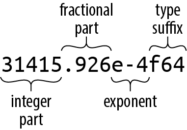
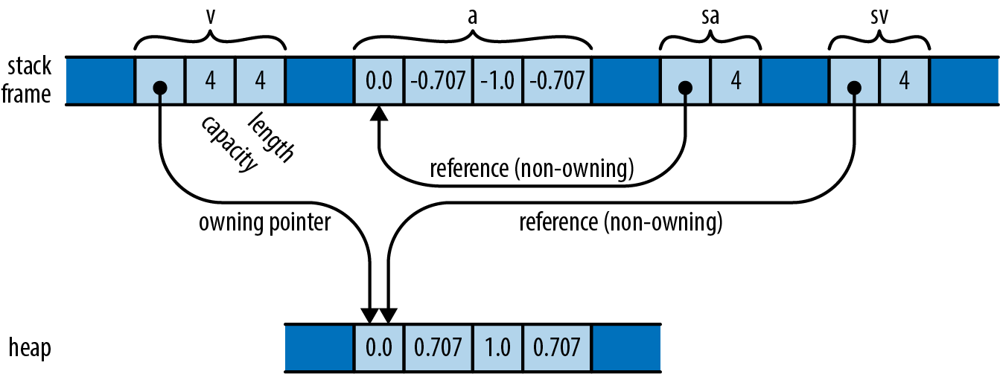
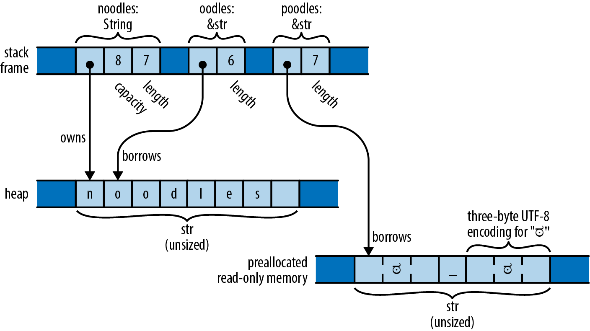

# Chapter 3. Fundamental Types

> There are many, many types of books in the world, which makes good sense, because there are many, many types of people, and everybody wants to read something different.
>
> Lemony Snicket

To a great extent, the Rust language is designed around its types. Its support for high-performance code arises from letting developers choose the data representation that best fits the situation, with the right balance between simplicity and cost. Rust’s memory and thread safety guarantees also rest on the soundness of its type system, and Rust’s flexibility stems from its generic types and traits.

This chapter covers Rust’s fundamental types for representing values. These source-level types have concrete machine-level counterparts with predictable costs and performance. Although Rust doesn’t promise it will represent things exactly as you’ve requested, it takes care to deviate from your requests only when it’s a reliable improvement.

Compared to a dynamically typed language like JavaScript or Python, Rust requires more planning from you up front. You must spell out the types of function arguments and return values, struct fields, and a few other constructs. However, two features of Rust make this less trouble than you might expect:

- Given the types that you do spell out, Rust’s *type inference* will figure out most of the rest for you. In practice, there’s often only one type that will work for a given variable or expression; when this is the case, Rust lets you leave out, or *elide*, the type. For example, you could spell out every type in a function, like this:

  ``` rust
  fn build_vector() -> Vec<i16> {
      let mut v: Vec<i16> = Vec::<i16>::new();
      v.push(10i16);
      v.push(20i16);
      v
  }
  ```

  But this is cluttered and repetitive. Given the function’s return type, it’s obvious that `v` must be a `Vec<i16>`, a vector of 16-bit signed integers; no other type would work. And from that it follows that each element of the vector must be an `i16`. This is exactly the sort of reasoning Rust’s type inference applies, allowing you to instead write:

  ``` rust
  fn build_vector() -> Vec<i16> {
      let mut v = Vec::new();
      v.push(10);
      v.push(20);
      v
  }
  ```

  These two definitions are exactly equivalent, and Rust will generate the same machine code either way. Type inference gives back much of the legibility of dynamically typed languages, while still catching type errors at compile time.

- Functions can be *generic*: a single function can work on values of many different types.

  In Python and JavaScript, all functions work this way naturally: a function can operate on any value that has the properties and methods the function will need. (This is the characteristic often called *duck typing*: if it quacks like a duck, it’s a duck.) But it’s exactly this flexibility that makes it so difficult for those languages to detect type errors early; testing is often the only way to catch such mistakes. Rust’s generic functions give the language a degree of the same flexibility, while still catching all type errors at compile time.

  Despite their flexibility, generic functions are just as efficient as their nongeneric counterparts. There is no inherent performance advantage to be had from writing, say, a specific `sum` function for each integer over writing a generic one that handles all integers. We’ll discuss generic functions in detail in Chapter 11.

The rest of this chapter covers Rust’s types from the bottom up, starting with simple numeric types like integers and floating-point values then moving on to types that hold more data: boxes, tuples, arrays, and strings.

Here’s a summary of the sorts of types you’ll see in Rust. Table 3-1 shows Rust’s primitive types, some very common types from the standard library, and some examples of user-defined types.

**Table 3-1. Examples of types in Rust**

| Type                                                    | Description                                                                                     | Values                                                                             |
|---------------------------------------------------------|-------------------------------------------------------------------------------------------------|------------------------------------------------------------------------------------|
| i8 , i16 , i32 , i64 , i128 u8 , u16 , u32 , u64 , u128 | Signed and unsigned integers, of given bit width                                                | 42 , -5i8 , 0x400u16 , 0o100i16 , 20_922_789_888_000u64 , b'\*' ( u8 byte literal) |
| isize , usize                                           | Signed and unsigned integers, the same size as an address on the machine (32 or 64 bits)        | 137 , -0b0101_0010isize , 0xffff_fc00usize                                         |
| f32 , f64                                               | IEEE floating-point numbers, single and double precision                                        | 1.61803 , 3.14f32 , 6.0221e23f64                                                   |
| `bool`                                                  | Boolean                                                                                         | true , false                                                                       |
| `char`                                                  | Unicode character, 32 bits wide                                                                 | '\*' , '\n' , '字' , '\x7f' , '\u{CA0}'                                            |
| `(char, u8, i32)`                                       | Tuple: mixed types allowed                                                                      | `('%', 0x7f, -1)`                                                                  |
| `()`                                                    | “Unit” (empty tuple)                                                                            | `()`                                                                               |
| `struct S { x: f32, y: f32 }`                           | Named-field struct                                                                              | `S { x: 120.0, y: 209.0 }`                                                         |
| `struct T (i32, char);`                                 | Tuple-like struct                                                                               | `T(120, 'X')`                                                                      |
| `struct E;`                                             | Unit-like struct; has no fields                                                                 | `E`                                                                                |
| `enum Attend { OnTime, Late(u32) }`                     | Enumeration, algebraic data type                                                                | Attend::Late(5) , Attend::OnTime                                                   |
| `Box<Attend>`                                           | Box: owning pointer to value in heap                                                            | `Box::new(Late(15))`                                                               |
| &i32 , &mut i32                                         | Shared and mutable references: non-owning pointers that must not outlive their referent         | &s.y , &mut v                                                                      |
| `String`                                                | UTF-8 string, dynamically sized                                                                 | `"ラーメン: ramen".to_string()`                                                    |
| `&str`                                                  | Reference to str : non-owning pointer to UTF-8 text                                             | "そば: soba" , &s\[0..12\]                                                         |
| \[f64; 4\] , \[u8; 256\]                                | Array, fixed length; elements all of same type                                                  | \[1.0, 0.0, 0.0, 1.0\] , \[b' '; 256\]                                             |
| `Vec<f64>`                                              | Vector, varying length; elements all of same type                                               | `vec![0.367, 2.718, 7.389]`                                                        |
| &\[u8\] , &mut \[u8\]                                   | Reference to slice: reference to a portion of an array or vector, comprising pointer and length | &v\[10..20\] , &mut a\[..\]                                                        |
| `Option<&str>`                                          | Optional value: either None (absent) or Some(v) (present, with value v )                        | Some("Dr.") , None                                                                 |
| `Result<u64, Error>`                                    | Result of operation that may fail: either a success value Ok(v) , or an error Err(e)            | Ok(4096) , Err(Error::last_os_error())                                             |
| &dyn Any , &mut dyn Read                                | Trait object: reference to any value that implements a given set of methods                     | value as &dyn Any , &mut file as &mut dyn Read                                     |
| `fn(&str) -> bool`                                      | Pointer to function                                                                             | `str::is_empty`                                                                    |
| (Closure types have no written form)                    | Closure                                                                                         | `|a, b| { a*a + b*b }`                                                             |

Most of these types are covered in this chapter, except for the following:

- We give `struct` types their own chapter, Chapter 9.

- We give enumerated types their own chapter, Chapter 10.

- We describe trait objects in Chapter 11.

- We describe the essentials of `String` and `&str` here, but provide more detail in Chapter 17.

- We cover function and closure types in Chapter 14.

# Fixed-Width Numeric Types

The footing of Rust’s type system is a collection of fixed-width numeric types, chosen to match the types that almost all modern processors implement directly in hardware.

Fixed-width numeric types can overflow or lose precision, but they are adequate for most applications and can be thousands of times faster than representations like arbitrary-precision integers and exact rationals. If you need those sorts of numeric representations, they are supported in the `num` crate.

The names of Rust’s numeric types follow a regular pattern, spelling out their width in bits, and the representation they use (Table 3-2).

**Table 3-2. Rust numeric types**

| Size (bits)  | Unsigned integer | Signed integer | Floating-point |
|--------------|------------------|----------------|----------------|
| 8            | `u8`             | `i8`           |                |
| 16           | `u16`            | `i16`          |                |
| 32           | `u32`            | `i32`          | `f32`          |
| 64           | `u64`            | `i64`          | `f64`          |
| 128          | `u128`           | `i128`         |                |
| Machine word | `usize`          | `isize`        |                |

Here, a *machine word* is a value the size of an address on the machine the code runs on, 32 or 64 bits.

## Integer Types

Rust’s unsigned integer types use their full range to represent positive values and zero (Table 3-3).

**Table 3-3. Rust unsigned integer types**

| Type    | Range                                                            |
|---------|------------------------------------------------------------------|
| `u8`    | 0 to 2^8–1 (0 to 255)                                            |
| `u16`   | 0 to 2^16−1 (0 to 65,535)                                        |
| `u32`   | 0 to 2^32−1 (0 to 4,294,967,295)                                 |
| `u64`   | 0 to 2^64−1 (0 to 18,446,744,073,709,551,615, or 18 quintillion) |
| `u128`  | 0 to 2^128−1 (0 to around 3.4✕10^38)                             |
| `usize` | 0 to either 2^32−1 or 2^64−1                                     |

Rust’s signed integer types use the two’s complement representation, using the same bit patterns as the corresponding unsigned type to cover a range of positive and negative values (Table 3-4).

**Table 3-4. Rust signed integer types**

| Type    | Range                                                                     |
|---------|---------------------------------------------------------------------------|
| `i8`    | −2^7 to 2^7−1 (−128 to 127)                                               |
| `i16`   | −2^15 to 2^15−1 (−32,768 to 32,767)                                       |
| `i32`   | −2^31 to 2^31−1 (−2,147,483,648 to 2,147,483,647)                         |
| `i64`   | −2^63 to 2^63−1 (−9,223,372,036,854,775,808 to 9,223,372,036,854,775,807) |
| `i128`  | −2^127 to 2^127−1 (roughly -1.7✕10^38 to +1.7✕10^38)                      |
| `isize` | Either −2^31 to 2^31−1, or −2^63 to 2^63−1                                |

Rust uses the `u8` type for byte values. For example, reading data from a binary file or socket yields a stream of `u8` values.

Unlike C and C++, Rust treats characters as distinct from the numeric types: a `char` is not a `u8`, nor is it a `u32` (though it is 32 bits long). We describe Rust’s `char` type in “Characters”.

The `usize` and `isize` types are analogous to `size_t` and `ptrdiff_t` in C and C++. Their precision matches the size of the address space on the target machine: they are 32 bits long on 32-bit architectures, and 64 bits long on 64-bit architectures. Rust requires array indices to be `usize` values. Values representing the sizes of arrays or vectors or counts of the number of elements in some data structure also generally have the `usize` type.

Integer literals in Rust can take a suffix indicating their type: `42u8` is a `u8` value, and `1729isize` is an `isize`. If an integer literal lacks a type suffix, Rust puts off determining its type until it finds the value being used in a way that pins it down: stored in a variable of a particular type, passed to a function that expects a particular type, compared with another value of a particular type, or something like that. In the end, if multiple types could work, Rust defaults to `i32` if that is among the possibilities. Otherwise, Rust reports the ambiguity as an error.

The prefixes `0x`, `0o`, and `0b` designate hexadecimal, octal, and binary literals.

To make long numbers more legible, you can insert underscores among the digits. For example, you can write the largest `u32` value as `4_294_967_295`. The exact placement of the underscores is not significant, so you can break hexadecimal or binary numbers into groups of four digits rather than three, as in `0xffff_ffff`, or set off the type suffix from the digits, as in `127_u8`. Some examples of integer literals are illustrated in Table 3-5.

**Table 3-5. Examples of integer literals**

| Literal       | Type     | Decimal value |
|---------------|----------|---------------|
| `116i8`       | `i8`     | 116           |
| `0xcafeu32`   | `u32`    | 51966         |
| `0b0010_1010` | Inferred | 42            |
| `0o106`       | Inferred | 70            |

Although numeric types and the `char` type are distinct, Rust does provide *byte literals*, character-like literals for `u8` values: `b'X'` represents the ASCII code for the character `X`, as a `u8` value. For example, since the ASCII code for `A` is 65, the literals `b'A'` and `65u8` are exactly equivalent. Only ASCII characters may appear in byte literals.

There are a few characters that you cannot simply place after the single quote, because that would be either syntactically ambiguous or hard to read. The characters in Table 3-6 can only be written using a stand-in notation, introduced by a backslash.

**Table 3-6. Characters requiring a stand-in notation**

| Character       | Byte literal | Numeric equivalent |
|-----------------|--------------|--------------------|
| Single quote, ' | `b'\''`      | `39u8`             |
| Backslash, \\   | `b'\\'`      | `92u8`             |
| Newline         | `b'\n'`      | `10u8`             |
| Carriage return | `b'\r'`      | `13u8`             |
| Tab             | `b'\t'`      | `9u8`              |

For characters that are hard to write or read, you can write their code in hexadecimal instead. A byte literal of the form `b'\xHH'`, where `HH` is any two-digit hexadecimal number, represents the byte whose value is `HH`. For example, you can write a byte literal for the ASCII “escape” control character as `b'\x1b'`, since the ASCII code for “escape” is 27, or 1B in hexadecimal. Since byte literals are just another notation for `u8` values, consider whether a simple numeric literal might be more legible: it probably makes sense to use `b'\x1b'` instead of simply `27` only when you want to emphasize that the value represents an ASCII code.

You can convert from one integer type to another using the `as` operator. We explain how conversions work in “Type Casts”, but here are some examples:

``` rust
assert_eq!(   10_i8  as u16,    10_u16); // in range
assert_eq!( 2525_u16 as i16,  2525_i16); // in range

assert_eq!(   -1_i16 as i32,    -1_i32); // sign-extended
assert_eq!(65535_u16 as i32, 65535_i32); // zero-extended

// Conversions that are out of range for the destination
// produce values that are equivalent to the original modulo 2^N,
// where N is the width of the destination in bits. This
// is sometimes called "truncation."
assert_eq!( 1000_i16 as  u8,   232_u8);
assert_eq!(65535_u32 as i16,    -1_i16);

assert_eq!(   -1_i8  as u8,    255_u8);
assert_eq!(  255_u8  as i8,     -1_i8);
```

The standard library provides some operations as methods on integers. For example:

``` rust
assert_eq!(2_u16.pow(4), 16);            // exponentiation
assert_eq!((-4_i32).abs(), 4);           // absolute value
assert_eq!(0b101101_u8.count_ones(), 4); // population count
```

You can find these in the online documentation. Note, however, that the documentation contains separate pages for the type itself under "`i32` (primitive type),” and for the module dedicated to that type (search for “`std::i32`”).

In real code, you usually won’t need to write out the type suffixes as we’ve done here, because the context will determine the type. When it doesn’t, however, the error messages can be surprising. For example, the following doesn’t compile:

``` rust
println!("{}", (-4).abs());
```

Rust complains:

``` console
error: can't call method `abs` on ambiguous numeric type `{integer}`
```

This can be a little bewildering: all the signed integer types have an `abs` method, so what’s the problem? For technical reasons, Rust wants to know exactly which integer type a value has before it will call the type’s own methods. The default of `i32` applies only if the type is still ambiguous after all method calls have been resolved, so that’s too late to help here. The solution is to spell out which type you intend, either with a suffix or by using a specific type’s function:

``` rust
println!("{}", (-4_i32).abs());
println!("{}", i32::abs(-4));
```

Note that method calls have a higher precedence than unary prefix operators, so be careful when applying methods to negated values. Without the parentheses around `-4_i32` in the first statement, `-4_i32.abs()` would apply the `abs` method to the positive value `4`, producing positive `4`, and then negate that, producing `-4`.

## Checked, Wrapping, Saturating, and Overflowing Arithmetic

When an integer arithmetic operation overflows, Rust panics, in a debug build. In a release build, the operation *wraps around*: it produces the value equivalent to the mathematically correct result modulo the range of the value. (In neither case is overflow undefined behavior, as it is in C and C++.)

For example, the following code panics in a debug build:

``` rust
let mut i = 1;
loop {
    i *= 10; // panic: attempt to multiply with overflow
             // (but only in debug builds!)
}
```

In a release build, this multiplication wraps to a negative number, and the loop runs indefinitely.

When this default behavior isn’t what you need, the integer types provide methods that let you spell out exactly what you want. For example, the following panics in any build:

``` rust
let mut i: i32 = 1;
loop {
    // panic: multiplication overflowed (in any build)
    i = i.checked_mul(10).expect("multiplication overflowed");
}
```

These integer arithmetic methods fall in four general categories:

- *Checked* operations return an `Option` of the result: `Some(v)` if the mathematically correct result can be represented as a value of that type, or `None` if it cannot. For example:

  ``` rust
  // The sum of 10 and 20 can be represented as a u8.
  assert_eq!(10_u8.checked_add(20), Some(30));

  // Unfortunately, the sum of 100 and 200 cannot.
  assert_eq!(100_u8.checked_add(200), None);

  // Do the addition; panic if it overflows.
  let sum = x.checked_add(y).unwrap();

  // Oddly, signed division can overflow too, in one particular case.
  // A signed n-bit type can represent -2ⁿ⁻¹, but not 2ⁿ⁻¹.
  assert_eq!((-128_i8).checked_div(-1), None);
  ```

- *Wrapping* operations return the value equivalent to the mathematically correct result modulo the range of the value:

  ``` rust
  // The first product can be represented as a u16;
  // the second cannot, so we get 250000 modulo 2¹⁶.
  assert_eq!(100_u16.wrapping_mul(200), 20000);
  assert_eq!(500_u16.wrapping_mul(500), 53392);

  // Operations on signed types may wrap to negative values.
  assert_eq!(500_i16.wrapping_mul(500), -12144);

  // In bitwise shift operations, the shift distance
  // is wrapped to fall within the size of the value.
  // So a shift of 17 bits in a 16-bit type is a shift
  // of 1.
  assert_eq!(5_i16.wrapping_shl(17), 10);
  ```

  As explained, this is how the ordinary arithmetic operators behave in release builds. The advantage of these methods is that they behave the same way in all builds.

- *Saturating* operations return the representable value that is closest to the mathematically correct result. In other words, the result is “clamped” to the maximum and minimum values the type can represent:

  ``` rust
  assert_eq!(32760_i16.saturating_add(10), 32767);
  assert_eq!((-32760_i16).saturating_sub(10), -32768);
  ```

  There are no saturating division, remainder, or bitwise shift methods.

- *Overflowing* operations return a tuple `(result, overflowed)`, where `result` is what the wrapping version of the function would return, and `overflowed` is a `bool` indicating whether an overflow occurred:

  ``` rust
  assert_eq!(255_u8.overflowing_sub(2), (253, false));
  assert_eq!(255_u8.overflowing_add(2), (1, true));
  ```

  `overflowing_shl` and `overflowing_shr` deviate from the pattern a bit: they return true for `overflowed` only if the shift distance was as large or larger than the bit width of the type itself. The actual shift applied is the requested shift modulo the bit width of the type:

  ``` rust
  // A shift of 17 bits is too large for `u16`, and 17 modulo 16 is 1.
  assert_eq!(5_u16.overflowing_shl(17), (10, true));
  ```

The operation names that follow the `checked_`, `wrapping_`, `saturating_`, or `overflowing_` prefix are shown in Table 3-7.

**Table 3-7. Operation names**

| Operation           | Name suffix | Example                                 |
|---------------------|-------------|-----------------------------------------|
| Addition            | `add`       | `100_i8.checked_add(27) == Some(127)`   |
| Subtraction         | `sub`       | `10_u8.checked_sub(11) == None`         |
| Multiplication      | `mul`       | `128_u8.saturating_mul(3) == 255`       |
| Division            | `div`       | `64_u16.wrapping_div(8) == 8`           |
| Remainder           | `rem`       | `(-32768_i16).wrapping_rem(-1) == 0`    |
| Negation            | `neg`       | `(-128_i8).checked_neg() == None`       |
| Absolute value      | `abs`       | `(-32768_i16).wrapping_abs() == -32768` |
| Exponentiation      | `pow`       | `3_u8.checked_pow(4) == Some(81)`       |
| Bitwise left shift  | `shl`       | `10_u32.wrapping_shl(34) == 40`         |
| Bitwise right shift | `shr`       | `40_u64.wrapping_shr(66) == 10`         |

## Floating-Point Types

Rust provides IEEE single- and double-precision floating-point types. These types include positive and negative infinities, distinct positive and negative zero values, and a *not-a-number* value (Table 3-8).

**Table 3-8. IEEE single- and double-precision floating-point types**

| Type  | Precision                                          | Range                                  |
|-------|----------------------------------------------------|----------------------------------------|
| `f32` | IEEE single precision (at least 6 decimal digits)  | Roughly –3.4 × 10^38 to +3.4 × 10^38   |
| `f64` | IEEE double precision (at least 15 decimal digits) | Roughly –1.8 × 10^308 to +1.8 × 10^308 |

Rust’s `f32` and `f64` correspond to the `float` and `double` types in C and C++ (in implementations that support IEEE floating point) as well as Java (which always uses IEEE floating point).

Floating-point literals have the general form diagrammed in Figure 3-1.



###### Figure 3-1. A floating-point literal

Every part of a floating-point number after the integer part is optional, but at least one of the fractional part, exponent, or type suffix must be present, to distinguish it from an integer literal. The fractional part may consist of a lone decimal point, so `5.` is a valid floating-point constant.

If a floating-point literal lacks a type suffix, Rust checks the context to see how the values are used, much as it does for integer literals. If it ultimately finds that either floating-point type could fit, it chooses `f64` by default.

For the purposes of type inference, Rust treats integer literals and floating-point literals as distinct classes: it will never infer a floating-point type for an integer literal, or vice versa. Table 3-9 shows some examples of floating-point literals.

**Table 3-9. Examples of floating-point literals**

| Literal               | Type     | Mathematical value            |
|-----------------------|----------|-------------------------------|
| `-1.5625`             | Inferred | −(1 ^9⁄\_16)                  |
| `2.`                  | Inferred | 2                             |
| `0.25`                | Inferred | ¼                             |
| `1e4`                 | Inferred | 10,000                        |
| `40f32`               | `f32`    | 40                            |
| `9.109_383_56e-31f64` | `f64`    | Roughly 9.10938356 × 10^{–31} |

The types `f32` and `f64` have associated constants for the IEEE-required special values like `INFINITY`, `NEG_INFINITY` (negative infinity), `NAN` (the not-a-number value), and `MIN` and `MAX` (the largest and smallest finite values):

``` rust
assert!((-1. / f32::INFINITY).is_sign_negative());
assert_eq!(-f32::MIN, f32::MAX);
```

The `f32` and `f64` types provide a full complement of methods for mathematical calculations; for example, `2f64.sqrt()` is the double-precision square root of two. Some examples:

``` rust
assert_eq!(5f32.sqrt() * 5f32.sqrt(), 5.); // exactly 5.0, per IEEE
assert_eq!((-1.01f64).floor(), -2.0);
```

Again, method calls have a higher precedence than prefix operators, so be sure to correctly parenthesize method calls on negated values.

The `std::f32::consts` and `std::f64::consts` modules provide various commonly used mathematical constants like `E`, `PI`, and the square root of two.

When searching the documentation, remember that there are pages for both the types themselves, named “`f32` (primitive type)” and “`f64` (primitive type)”, and the modules for each type, `std::f32` and `std::f64`.

As with integers, you usually won’t need to write out type suffixes on floating-point literals in real code, but when you do, putting a type on either the literal or the function will suffice:

``` rust
println!("{}", (2.0_f64).sqrt());
println!("{}", f64::sqrt(2.0));
```

Unlike C and C++, Rust performs almost no numeric conversions implicitly. If a function expects an `f64` argument, it’s an error to pass an `i32` value as the argument. In fact, Rust won’t even implicitly convert an `i16` value to an `i32` value, even though every `i16` value is also an `i32` value. But you can always write out *explicit* conversions using the `as` operator: `i as f64`, or `x as i32`.

The lack of implicit conversions sometimes makes a Rust expression more verbose than the analogous C or C++ code would be. However, implicit integer conversions have a well-established record of causing bugs and security holes, especially when the integers in question represent the size of something in memory, and an unanticipated overflow occurs. In our experience, the act of writing out numeric conversions in Rust has alerted us to problems we would otherwise have missed.

We explain exactly how conversions behave in “Type Casts”.

# The bool Type

Rust’s Boolean type, `bool`, has the usual two values for such types, `true` and `false`. Comparison operators like `==` and `<` produce `bool` results: the value of `2 < 5` is `true`.

Many languages are lenient about using values of other types in contexts that require a Boolean value: C and C++ implicitly convert characters, integers, floating-point numbers, and pointers to Boolean values, so they can be used directly as the condition in an `if` or `while` statement. Python permits strings, lists, dictionaries, and even sets in Boolean contexts, treating such values as true if they’re nonempty. Rust, however, is very strict: control structures like `if` and `while` require their conditions to be `bool` expressions, as do the short-circuiting logical operators `&&` and `||`. You must write `if x != 0 { ... }`, not simply `if x { ... }`.

Rust’s `as` operator can convert `bool` values to integer types:

``` rust
assert_eq!(false as i32, 0);
assert_eq!(true  as i32, 1);
```

However, `as` won’t convert in the other direction, from numeric types to `bool`. Instead, you must write out an explicit comparison like `x != 0`.

Although a `bool` needs only a single bit to represent it, Rust uses an entire byte for a `bool` value in memory, so you can create a pointer to it.

# Characters

Rust’s character type `char` represents a single Unicode character, as a 32-bit value.

Rust uses the `char` type for single characters in isolation, but uses the UTF-8 encoding for strings and streams of text. So, a `String` represents its text as a sequence of UTF-8 bytes, not as an array of characters.

Character literals are characters enclosed in single quotes, like `'8'` or `'!'`. You can use the full breadth of Unicode: `'錆'` is a `char` literal representing the Japanese kanji for *sabi* (rust).

As with byte literals, backslash escapes are required for a few characters (Table 3-10).

**Table 3-10. Characters that require backslash escapes**

| Character       | Rust character literal |
|-----------------|------------------------|
| Single quote, ' | `'\''`                 |
| Backslash, \\   | `'\\'`                 |
| Newline         | `'\n'`                 |
| Carriage return | `'\r'`                 |
| Tab             | `'\t'`                 |

If you prefer, you can write out a character’s Unicode code point in hexadecimal:

- If the character’s code point is in the range U+0000 to U+007F (that is, if it is drawn from the ASCII character set), then you can write the character as `'\xHH'`, where `HH` is a two-digit hexadecimal number. For example, the character literals `'*'` and `'\x2A'` are equivalent, because the code point of the character `*` is 42, or 2A in hexadecimal.

- You can write any Unicode character as `'\u{HHHHHH}'`, where `HHHHHH` is a hexadecimal number up to six digits long, with underscores allowed for grouping as usual. For example, the character literal `'\u{CA0}'` represents the character “ಠ”, a Kannada character used in the Unicode Look of Disapproval, “ಠ_ಠ”. The same literal could also be simply written as `'ಠ'`.

A `char` always holds a Unicode code point in the range 0x0000 to 0xD7FF, or 0xE000 to 0x10FFFF. A `char` is never a surrogate pair half (that is, a code point in the range 0xD800 to 0xDFFF), or a value outside the Unicode codespace (that is, greater than 0x10FFFF). Rust uses the type system and dynamic checks to ensure `char` values are always in the permitted range.

Rust never implicitly converts between `char` and any other type. You can use the `as` conversion operator to convert a `char` to an integer type; for types smaller than 32 bits, the upper bits of the character’s value are truncated:

``` rust
assert_eq!('*' as i32, 42);
assert_eq!('ಠ' as u16, 0xca0);
assert_eq!('ಠ' as i8, -0x60); // U+0CA0 truncated to eight bits, signed
```

Going in the other direction, `u8` is the only type the `as` operator will convert to `char`: Rust intends the `as` operator to perform only cheap, infallible conversions, but every integer type other than `u8` includes values that are not permitted Unicode code points, so those conversions would require run-time checks. Instead, the standard library function `std::char::from_u32` takes any `u32` value and returns an `Option<char>`: if the `u32` is not a permitted Unicode code point, then `from_u32` returns `None`; otherwise, it returns `Some(c)`, where `c` is the `char` result.

The standard library provides some useful methods on characters, which you can look up in the online documentation under “`char` (primitive type),” and the module “`std::char`.” For example:

``` rust
assert_eq!('*'.is_alphabetic(), false);
assert_eq!('β'.is_alphabetic(), true);
assert_eq!('8'.to_digit(10), Some(8));
assert_eq!('ಠ'.len_utf8(), 3);
assert_eq!(std::char::from_digit(2, 10), Some('2'));
```

Naturally, single characters in isolation are not as interesting as strings and streams of text. We’ll describe Rust’s standard `String` type and text handling in general in “String Types”.

# Tuples

A *tuple* is a pair, or triple, quadruple, quintuple, etc. (hence, *n-tuple*, or *tuple*), of values of assorted types. You can write a tuple as a sequence of elements, separated by commas and surrounded by parentheses. For example, `("Brazil", 1985)` is a tuple whose first element is a statically allocated string, and whose second is an integer; its type is `(&str, i32)`. Given a tuple value `t`, you can access its elements as `t.0`, `t.1`, and so on.

To a certain extent, tuples resemble arrays: both types represent an ordered sequence of values. Many programming languages conflate or combine the two concepts, but in Rust, they’re completely separate. For one thing, each element of a tuple can have a different type, whereas an array’s elements must be all the same type. Further, tuples allow only constants as indices, like `t.4`. You can’t write `t.i` or `t[i]` to get the `i`th element.

Rust code often uses tuple types to return multiple values from a function. For example, the `split_at` method on string slices, which divides a string into two halves and returns them both, is declared like this:

``` rust
fn split_at(&self, mid: usize) -> (&str, &str);
```

The return type `(&str, &str)` is a tuple of two string slices. You can use pattern-matching syntax to assign each element of the return value to a different variable:

``` rust
let text = "I see the eigenvalue in thine eye";
let (head, tail) = text.split_at(21);
assert_eq!(head, "I see the eigenvalue ");
assert_eq!(tail, "in thine eye");
```

This is more legible than the equivalent:

``` rust
let text = "I see the eigenvalue in thine eye";
let temp = text.split_at(21);
let head = temp.0;
let tail = temp.1;
assert_eq!(head, "I see the eigenvalue ");
assert_eq!(tail, "in thine eye");
```

You’ll also see tuples used as a sort of minimal-drama struct type. For example, in the Mandelbrot program in Chapter 2, we needed to pass the width and height of the image to the functions that plot it and write it to disk. We could declare a struct with `width` and `height` members, but that’s pretty heavy notation for something so obvious, so we just used a tuple:

``` rust
/// Write the buffer `pixels`, whose dimensions are given by `bounds`, to the
/// file named `filename`.
fn write_image(filename: &str, pixels: &[u8], bounds: (usize, usize))
    -> Result<(), std::io::Error>
{ ... }
```

The type of the `bounds` parameter is `(usize, usize)`, a tuple of two `usize` values. Admittedly, we could just as well write out separate `width` and `height` parameters, and the machine code would be about the same either way. It’s a matter of clarity. We think of the size as one value, not two, and using a tuple lets us write what we mean.

The other commonly used tuple type is the zero-tuple `()`. This is traditionally called the *unit type* because it has only one value, also written `()`. Rust uses the unit type where there’s no meaningful value to carry, but context requires some sort of type nonetheless.

For example, a function that returns no value has a return type of `()`. The standard library’s `std::mem::swap` function has no meaningful return value; it just exchanges the values of its two arguments. The declaration for `std::mem::swap` reads:

``` rust
fn swap<T>(x: &mut T, y: &mut T);
```

The `<T>` means that `swap` is *generic*: you can use it on references to values of any type `T`. But the signature omits the `swap`’s return type altogether, which is shorthand for returning the unit type:

``` rust
fn swap<T>(x: &mut T, y: &mut T) -> ();
```

Similarly, the `write_image` example we mentioned before has a return type of `Result<(), std::io::Error>`, meaning that the function returns a `std::io::Error` value if something goes wrong, but returns no value on success.

If you like, you may include a comma after a tuple’s last element: the types `(&str, i32,)` and `(&str, i32)` are equivalent, as are the expressions `("Brazil", 1985,)` and `("Brazil", 1985)`. Rust consistently permits an extra trailing comma everywhere commas are used: function arguments, arrays, struct and enum definitions, and so on. This may look odd to human readers, but it can make diffs easier to read when entries are added and removed at the end of a list.

For consistency’s sake, there are even tuples that contain a single value. The literal `("lonely hearts",)` is a tuple containing a single string; its type is `(&str,)`. Here, the comma after the value is necessary to distinguish the singleton tuple from a simple parenthetic expression.

# Pointer Types

Rust has several types that represent memory addresses.

This is a big difference between Rust and most languages with garbage collection. In Java, if `class Rectangle` contains a field `Vector2D upperLeft;`, then `upperLeft` is a reference to another separately created `Vector2D` object. Objects never physically contain other objects in Java.

Rust is different. The language is designed to help keep allocations to a minimum. Values nest by default. The value `((0, 0), (1440, 900))` is stored as four adjacent integers. If you store it in a local variable, you’ve got a local variable four integers wide. Nothing is allocated in the heap.

This is great for memory efficiency, but as a consequence, when a Rust program needs values to point to other values, it must use pointer types explicitly. The good news is that the pointer types used in safe Rust are constrained to eliminate undefined behavior, so pointers are much easier to use correctly in Rust than in C++.

We’ll discuss three pointer types here: references, boxes, and unsafe pointers.

## References

A value of type `&String` (pronounced “ref String”) is a reference to a `String` value, a `&i32` is a reference to an `i32`, and so on.

It’s easiest to get started by thinking of references as Rust’s basic pointer type. At run time, a reference to an `i32` is a single machine word holding the address of the `i32`, which may be on the stack or in the heap. The expression `&x` produces a reference to `x`; in Rust terminology, we say that it *borrows a reference to `x`*. Given a reference `r`, the expression `*r` refers to the value `r` points to. These are very much like the `&` and `*` operators in C and C++. And like a C pointer, a reference does not automatically free any resources when it goes out of scope.

Unlike C pointers, however, Rust references are never null: there is simply no way to produce a null reference in safe Rust. And unlike C, Rust tracks the ownership and lifetimes of values, so mistakes like dangling pointers, double frees, and pointer invalidation are ruled out at compile time.

Rust references come in two flavors:

`&T`  
An immutable, shared reference. You can have many shared references to a given value at a time, but they are read-only: modifying the value they point to is forbidden, as with `const T*` in C.

`&mut T`  
A mutable, exclusive reference. You can read and modify the value it points to, as with a `T*` in C. But for as long as the reference exists, you may not have any other references of any kind to that value. In fact, the only way you may access the value at all is through the mutable reference.

Rust uses this dichotomy between shared and mutable references to enforce a “single writer *or* multiple readers” rule: either you can read and write the value, or it can be shared by any number of readers, but never both at the same time. This separation, enforced by compile-time checks, is central to Rust’s safety guarantees. Chapter 5 explains Rust’s rules for safe reference use.

## Boxes

The simplest way to allocate a value in the heap is to use `Box::new`:

``` rust
let t = (12, "eggs");
let b = Box::new(t);  // allocate a tuple in the heap
```

The type of `t` is `(i32, &str)`, so the type of `b` is `Box<(i32, &str)>`. The call to `Box::new` allocates enough memory to contain the tuple on the heap. When `b` goes out of scope, the memory is freed immediately, unless `b` has been *moved*—by returning it, for example. Moves are essential to the way Rust handles heap-allocated values; we explain all this in detail in Chapter 4.

## Raw Pointers

Rust also has the raw pointer types `*mut T` and `*const T`. Raw pointers really are just like pointers in C++. Using a raw pointer is unsafe, because Rust makes no effort to track what it points to. For example, raw pointers may be null, or they may point to memory that has been freed or that now contains a value of a different type. All the classic pointer mistakes of C++ are offered for your enjoyment.

However, you may only dereference raw pointers within an `unsafe` block. An `unsafe` block is Rust’s opt-in mechanism for advanced language features whose safety is up to you. If your code has no `unsafe` blocks (or if those it does are written correctly), then the safety guarantees we emphasize throughout this book still hold. For details, see Chapter 22.

# Arrays, Vectors, and Slices

Rust has three types for representing a sequence of values in memory:

- The type `[T; N]` represents an array of `N` values, each of type `T`. An array’s size is a constant determined at compile time and is part of the type; you can’t append new elements or shrink an array.

- The type `Vec<T>`, called a *vector of `T`s*, is a dynamically allocated, growable sequence of values of type `T`. A vector’s elements live on the heap, so you can resize vectors at will: push new elements onto them, append other vectors to them, delete elements, and so on.

- The types `&[T]` and `&mut [T]`, called a *shared slice of `T`s* and *mutable slice of `T`s*, are references to a series of elements that are a part of some other value, like an array or vector. You can think of a slice as a pointer to its first element, together with a count of the number of elements you can access starting at that point. A mutable slice `&mut [T]` lets you read and modify elements, but can’t be shared; a shared slice `&[T]` lets you share access among several readers, but doesn’t let you modify elements.

Given a value `v` of any of these three types, the expression `v.len()` gives the number of elements in `v`, and `v[i]` refers to the `i`th element of `v`. The first element is `v[0]`, and the last element is `v[v.len() - 1]`. Rust checks that `i` always falls within this range; if it doesn’t, the expression panics. The length of `v` may be zero, in which case any attempt to index it will panic. `i` must be a `usize` value; you can’t use any other integer type as an index.

## Arrays

There are several ways to write array values. The simplest is to write a series of values within square brackets:

``` rust
let lazy_caterer: [u32; 6] = [1, 2, 4, 7, 11, 16];
let taxonomy = ["Animalia", "Arthropoda", "Insecta"];

assert_eq!(lazy_caterer[3], 7);
assert_eq!(taxonomy.len(), 3);
```

For the common case of a long array filled with some value, you can write `[`*`V`*`; `*`N`*`]`, where *`V`* is the value each element should have, and *`N`* is the length. For example, `[true; 10000]` is an array of 10,000 `bool` elements, all set to `true`:

``` rust
let mut sieve = [true; 10000];
for i in 2..100 {
    if sieve[i] {
        let mut j = i * i;
        while j < 10000 {
            sieve[j] = false;
            j += i;
        }
    }
}

assert!(sieve[211]);
assert!(!sieve[9876]);
```

You’ll see this syntax used for fixed-size buffers: `[0u8; 1024]` can be a one-kilobyte buffer, filled with zeros. Rust has no notation for an uninitialized array. (In general, Rust ensures that code can never access any sort of uninitialized value.)

An array’s length is part of its type and fixed at compile time. If `n` is a variable, you can’t write `[true; n]` to get an array of `n` elements. When you need an array whose length varies at run time (and you usually do), use a vector instead.

The useful methods you’d like to see on arrays—iterating over elements, searching, sorting, filling, filtering, and so on—are all provided as methods on slices, not arrays. But Rust implicitly converts a reference to an array to a slice when searching for methods, so you can call any slice method on an array directly:

``` rust
let mut chaos = [3, 5, 4, 1, 2];
chaos.sort();
assert_eq!(chaos, [1, 2, 3, 4, 5]);
```

Here, the `sort` method is actually defined on slices, but since it takes its operand by reference, Rust implicitly produces a `&mut [i32]` slice referring to the entire array and passes that to `sort` to operate on. In fact, the `len` method we mentioned earlier is a slice method as well. We cover slices in more detail in “Slices”.

## Vectors

A vector `Vec<T>` is a resizable array of elements of type `T`, allocated on the heap.

There are several ways to create vectors. The simplest is to use the `vec!` macro, which gives us a syntax for vectors that looks very much like an array literal:

``` rust
let mut primes = vec![2, 3, 5, 7];
assert_eq!(primes.iter().product::<i32>(), 210);
```

But of course, this is a vector, not an array, so we can add elements to it dynamically:

``` rust
primes.push(11);
primes.push(13);
assert_eq!(primes.iter().product::<i32>(), 30030);
```

You can also build a vector by repeating a given value a certain number of times, again using a syntax that imitates array literals:

``` rust
fn new_pixel_buffer(rows: usize, cols: usize) -> Vec<u8> {
    vec![0; rows * cols]
}
```

The `vec!` macro is equivalent to calling `Vec::new` to create a new, empty vector and then pushing the elements onto it, which is another idiom:

``` rust
let mut pal = Vec::new();
pal.push("step");
pal.push("on");
pal.push("no");
pal.push("pets");
assert_eq!(pal, vec!["step", "on", "no", "pets"]);
```

Another possibility is to build a vector from the values produced by an iterator:

``` rust
let v: Vec<i32> = (0..5).collect();
assert_eq!(v, [0, 1, 2, 3, 4]);
```

You’ll often need to supply the type when using `collect` (as we’ve done here), because it can build many different sorts of collections, not just vectors. By specifying the type of `v`, we’ve made it unambiguous which sort of collection we want.

As with arrays, you can use slice methods on vectors:

``` rust
// A palindrome!
let mut palindrome = vec!["a man", "a plan", "a canal", "panama"];
palindrome.reverse();
// Reasonable yet disappointing:
assert_eq!(palindrome, vec!["panama", "a canal", "a plan", "a man"]);
```

Here, the `reverse` method is actually defined on slices, but the call implicitly borrows a `&mut [&str]` slice from the vector and invokes `reverse` on that.

`Vec` is an essential type to Rust—it’s used almost anywhere one needs a list of dynamic size—so there are many other methods that construct new vectors or extend existing ones. We’ll cover them in Chapter 16.

A `Vec<T>` consists of three values: a pointer to the heap-allocated buffer for the elements, which is created and owned by the `Vec<T>`; the number of elements that buffer has the capacity to store; and the number it actually contains now (in other words, its length). When the buffer has reached its capacity, adding another element to the vector entails allocating a larger buffer, copying the present contents into it, updating the vector’s pointer and capacity to describe the new buffer, and finally freeing the old one.

If you know the number of elements a vector will need in advance, instead of `Vec::new` you can call `Vec::with_capacity` to create a vector with a buffer large enough to hold them all, right from the start; then, you can add the elements to the vector one at a time without causing any reallocation. The `vec!` macro uses a trick like this, since it knows how many elements the final vector will have. Note that this only establishes the vector’s initial size; if you exceed your estimate, the vector simply enlarges its storage as usual.

Many library functions look for the opportunity to use `Vec::with_capacity` instead of `Vec::new`. For example, in the `collect` example, the iterator `0..5` knows in advance that it will yield five values, and the `collect` function takes advantage of this to pre-allocate the vector it returns with the correct capacity. We’ll see how this works in Chapter 15.

Just as a vector’s `len` method returns the number of elements it contains now, its `capacity` method returns the number of elements it could hold without reallocation:

``` rust
let mut v = Vec::with_capacity(2);
assert_eq!(v.len(), 0);
assert_eq!(v.capacity(), 2);

v.push(1);
v.push(2);
assert_eq!(v.len(), 2);
assert_eq!(v.capacity(), 2);

v.push(3);
assert_eq!(v.len(), 3);
// Typically prints "capacity is now 4":
println!("capacity is now {}", v.capacity());
```

The capacity printed at the end isn’t guaranteed to be exactly 4, but it will be at least 3, since the vector is holding three values.

You can insert and remove elements wherever you like in a vector, although these operations shift all the elements after the affected position forward or backward, so they may be slow if the vector is long:

``` rust
let mut v = vec![10, 20, 30, 40, 50];

// Make the element at index 3 be 35.
v.insert(3, 35);
assert_eq!(v, [10, 20, 30, 35, 40, 50]);

// Remove the element at index 1.
v.remove(1);
assert_eq!(v, [10, 30, 35, 40, 50]);
```

You can use the `pop` method to remove the last element and return it. More precisely, popping a value from a `Vec<T>` returns an `Option<T>`: `None` if the vector was already empty, or `Some(v)` if its last element had been `v`:

``` rust
let mut v = vec!["Snow Puff", "Glass Gem"];
assert_eq!(v.pop(), Some("Glass Gem"));
assert_eq!(v.pop(), Some("Snow Puff"));
assert_eq!(v.pop(), None);
```

You can use a `for` loop to iterate over a vector:

``` rust
// Get our command-line arguments as a vector of Strings.
let languages: Vec<String> = std::env::args().skip(1).collect();
for l in languages {
    println!("{}: {}", l,
             if l.len() % 2 == 0 {
                 "functional"
             } else {
                 "imperative"
             });
}
```

Running this program with a list of programming languages is illuminating:

``` console
$ cargo run Lisp Scheme C C++ Fortran
   Compiling proglangs v0.1.0 (/home/jimb/rust/proglangs)
    Finished dev [unoptimized + debuginfo] target(s) in 0.36s
     Running `target/debug/proglangs Lisp Scheme C C++ Fortran`
Lisp: functional
Scheme: functional
C: imperative
C++: imperative
Fortran: imperative
$
```

Finally, a satisfying definition for the term *functional language*.

Despite its fundamental role, `Vec` is an ordinary type defined in Rust, not built into the language. We’ll cover the techniques needed to implement such types in Chapter 22.

## Slices

A slice, written `[T]` without specifying the length, is a region of an array or vector. Since a slice can be any length, slices can’t be stored directly in variables or passed as function arguments. Slices are always passed by reference.

A reference to a slice is a *fat pointer*: a two-word value comprising a pointer to the slice’s first element, and the number of elements in the slice.

Suppose you run the following code:

``` rust
let v: Vec<f64> = vec![0.0,  0.707,  1.0,  0.707];
let a: [f64; 4] =     [0.0, -0.707, -1.0, -0.707];

let sv: &[f64] = &v;
let sa: &[f64] = &a;
```

In the last two lines, Rust automatically converts the `&Vec<f64>` reference and the `&[f64; 4]` reference to slice references that point directly to the data.

By the end, memory looks like Figure 3-2.



###### Figure 3-2. A vector `v` and an array `a` in memory, with slices `sa` and `sv` referring to each

Whereas an ordinary reference is a non-owning pointer to a single value, a reference to a slice is a non-owning pointer to a range of consecutive values in memory. This makes slice references a good choice when you want to write a function that operates on either an array or a vector. For example, here’s a function that prints a slice of numbers, one per line:

``` rust
fn print(n: &[f64]) {
    for elt in n {
        println!("{}", elt);
    }
}

print(&a);  // works on arrays
print(&v);  // works on vectors
```

Because this function takes a slice reference as an argument, you can apply it to either a vector or an array, as shown. In fact, many methods you might think of as belonging to vectors or arrays are methods defined on slices: for example, the `sort` and `reverse` methods, which sort or reverse a sequence of elements in place, are actually methods on the slice type `[T]`.

You can get a reference to a slice of an array or vector, or a slice of an existing slice, by indexing it with a range:

``` rust
print(&v[0..2]);    // print the first two elements of v
print(&a[2..]);     // print elements of a starting with a[2]
print(&sv[1..3]);   // print v[1] and v[2]
```

As with ordinary array accesses, Rust checks that the indices are valid. Trying to borrow a slice that extends past the end of the data results in a panic.

Since slices almost always appear behind references, we often just refer to types like `&[T]` or `&str` as “slices,” using the shorter name for the more common concept.

# String Types

Programmers familiar with C++ will recall that there are two string types in the language. String literals have the pointer type `const char *`. The standard library also offers a class, `std::string`, for dynamically creating strings at run time.

Rust has a similar design. In this section, we’ll show all the ways to write string literals and then introduce Rust’s two string types. We provide more detail about strings and text handling in Chapter 17.

## String Literals

String literals are enclosed in double quotes. They use the same backslash escape sequences as `char` literals:

``` rust
let speech = "\"Ouch!\" said the well.\n";
```

In string literals, unlike `char` literals, single quotes don’t need a backslash escape, and double quotes do.

A string may span multiple lines:

``` rust
println!("In the room the women come and go,
    Singing of Mount Abora");
```

The newline character in that string literal is included in the string and therefore in the output. So are the spaces at the beginning of the second line.

If one line of a string ends with a backslash, then the newline character and the leading whitespace on the next line are dropped:

``` rust
println!("It was a bright, cold day in April, and \
    there were four of us—\
    more or less.");
```

This prints a single line of text. The string contains a single space between “and” and “there” because there is a space before the backslash in the program, and no space between the em dash and “more.”

In a few cases, the need to double every backslash in a string is a nuisance. (The classic examples are regular expressions and Windows paths.) For these cases, Rust offers *raw strings*. A raw string is tagged with the lowercase letter `r`. All backslashes and whitespace characters inside a raw string are included verbatim in the string. No escape sequences are recognized:

``` rust
let default_win_install_path = r"C:\Program Files\Gorillas";

let pattern = Regex::new(r"\d+(\.\d+)*");
```

You can’t include a double-quote character in a raw string simply by putting a backslash in front of it—remember, we said *no* escape sequences are recognized. However, there is a cure for that too. The start and end of a raw string can be marked with pound signs:

``` rust
println!(r###"
    This raw string started with 'r###"'.
    Therefore it does not end until we reach a quote mark ('"')
    followed immediately by three pound signs ('###'):
"###);
```

You can add as few or as many pound signs as needed to make it clear where the raw string ends.

## Byte Strings

A string literal with the `b` prefix is a *byte string*. Such a string is a slice of `u8` values—that is, bytes—rather than Unicode text:

``` rust
let method = b"GET";
assert_eq!(method, &[b'G', b'E', b'T']);
```

The type of `method` is `&[u8; 3]`: it’s a reference to an array of three bytes. It doesn’t have any of the string methods we’ll discuss in a minute. The most string-like thing about it is the syntax we used to write it.

Byte strings can use all the other string syntax we’ve shown: they can span multiple lines, use escape sequences, and use backslashes to join lines. Raw byte strings start with `br"`.

Byte strings can’t contain arbitrary Unicode characters. They must make do with ASCII and `\xHH` escape sequences.

## Strings in Memory

Rust strings are sequences of Unicode characters, but they are not stored in memory as arrays of `char`s. Instead, they are stored using UTF-8, a variable-width encoding. Each ASCII character in a string is stored in one byte. Other characters take up multiple bytes.

Figure 3-3 shows the `String` and `&str` values created by the following code:

``` rust
let noodles = "noodles".to_string();
let oodles = &noodles[1..];
let poodles = "ಠ_ಠ";
```

A `String` has a resizable buffer holding UTF-8 text. The buffer is allocated on the heap, so it can resize its buffer as needed or requested. In the example, `noodles` is a `String` that owns an eight-byte buffer, of which seven are in use. You can think of a `String` as a `Vec<u8>` that is guaranteed to hold well-formed UTF-8; in fact, this is how `String` is implemented.

A `&str` (pronounced “stir” or “string slice”) is a reference to a run of UTF-8 text owned by someone else: it “borrows” the text. In the example, `oodles` is a `&str` referring to the last six bytes of the text belonging to `noodles`, so it represents the text “oodles.” Like other slice references, a `&str` is a fat pointer, containing both the address of the actual data and its length. You can think of a `&str` as being nothing more than a `&[u8]` that is guaranteed to hold well-formed UTF-8.



###### Figure 3-3. `String`, `&str`, and `str`

A string literal is a `&str` that refers to preallocated text, typically stored in read-only memory along with the program’s machine code. In the preceding example, `poodles` is a string literal, pointing to seven bytes that are created when the program begins execution and that last until it exits.

A `String` or `&str`’s `.len()` method returns its length. The length is measured in bytes, not characters:

``` rust
assert_eq!("ಠ_ಠ".len(), 7);
assert_eq!("ಠ_ಠ".chars().count(), 3);
```

It is impossible to modify a `&str`:

``` rust
let mut s = "hello";
s[0] = 'c';    // error: `&str` cannot be modified, and other reasons
s.push('\n');  // error: no method named `push` found for reference `&str`
```

For creating new strings at run time, use `String`.

The type `&mut str` does exist, but it is not very useful, since almost any operation on UTF-8 can change its overall byte length, and a slice cannot reallocate its referent. In fact, the only operations available on `&mut str` are `make_ascii_uppercase` and `make_ascii_lowercase`, which modify the text in place and affect only single-byte characters, by definition.

## String

`&str` is very much like `&[T]`: a fat pointer to some data. `String` is analogous to `Vec<T>`, as described in Table 3-11.

**Table 3-11. Vec〈T〉 and String comparison**

|                                                         | Vec\<T\>            | String            |
|---------------------------------------------------------|---------------------|-------------------|
| Automatically frees buffers                             | Yes                 | Yes               |
| Growable                                                | Yes                 | Yes               |
| ::new() and ::with_capacity() type-associated functions | Yes                 | Yes               |
| .reserve() and .capacity() methods                      | Yes                 | Yes               |
| .push() and .pop() methods                              | Yes                 | Yes               |
| Range syntax v\[start..stop\]                           | Yes, returns &\[T\] | Yes, returns &str |
| Automatic conversion                                    | &Vec\<T\> to &\[T\] | &String to &str   |
| Inherits methods                                        | From &\[T\]         | From &str         |

Like a `Vec`, each `String` has its own heap-allocated buffer that isn’t shared with any other `String`. When a `String` variable goes out of scope, the buffer is automatically freed, unless the `String` was moved.

There are several ways to create `String`s:

- The `.to_string()` method converts a `&str` to a `String`. This copies the string:

  ``` rust
  let error_message = "too many pets".to_string();
  ```

  The `.to_owned()` method does the same thing, and you may see it used the same way. It works for some other types as well, as we’ll discuss in Chapter 13.

- The `format!()` macro works just like `println!()`, except that it returns a new `String` instead of writing text to stdout, and it doesn’t automatically add a newline at the end:

  ``` rust
  assert_eq!(format!("{}°{:02}′{:02}″N", 24, 5, 23),
             "24°05′23″N".to_string());
  ```

- Arrays, slices, and vectors of strings have two methods, `.concat()` and `.join(sep)`, that form a new `String` from many strings:

  ``` rust
  let bits = vec!["veni", "vidi", "vici"];
  assert_eq!(bits.concat(), "venividivici");
  assert_eq!(bits.join(", "), "veni, vidi, vici");
  ```

The choice sometimes arises of which type to use: `&str` or `String`. Chapter 5 addresses this question in detail. For now it will suffice to point out that a `&str` can refer to any slice of any string, whether it is a string literal (stored in the executable) or a `String` (allocated and freed at run time). This means that `&str` is more appropriate for function arguments when the caller should be allowed to pass either kind of string.

## Using Strings

Strings support the `==` and `!=` operators. Two strings are equal if they contain the same characters in the same order (regardless of whether they point to the same location in memory):

``` rust
assert!("ONE".to_lowercase() == "one");
```

Strings also support the comparison operators `<`, `<=`, `>`, and `>=`, as well as many useful methods and functions that you can find in the online documentation under “`str` (primitive type)” or the “`std::str`” module (or just flip to Chapter 17). Here are a few examples:

``` rust
assert!("peanut".contains("nut"));
assert_eq!("ಠ_ಠ".replace("ಠ", "■"), "■_■");
assert_eq!("    clean\n".trim(), "clean");

for word in "veni, vidi, vici".split(", ") {
    assert!(word.starts_with("v"));
}
```

Keep in mind that, given the nature of Unicode, simple `char`-by-`char` comparison does *not* always give the expected answers. For example, the Rust strings `"th\u{e9}"` and `"the\u{301}"` are both valid Unicode representations for *thé*, the French word for tea. Unicode says they should both be displayed and processed in the same way, but Rust treats them as two completely distinct strings. Similarly, Rust’s ordering operators like `<` use a simple lexicographical order based on character code point values. This ordering only sometimes resembles the ordering used for text in the user’s language and culture. We discuss these issues in more detail in Chapter 17.

## Other String-Like Types

Rust guarantees that strings are valid UTF-8. Sometimes a program really needs to be able to deal with strings that are *not* valid Unicode. This usually happens when a Rust program has to interoperate with some other system that doesn’t enforce any such rules. For example, in most operating systems it’s easy to create a file with a filename that isn’t valid Unicode. What should happen when a Rust program comes across this sort of filename?

Rust’s solution is to offer a few string-like types for these situations:

- Stick to `String` and `&str` for Unicode text.

- When working with filenames, use `std::path::PathBuf` and `&Path` instead.

- When working with binary data that isn’t UTF-8 encoded at all, use `Vec<u8>` and `&[u8]`.

- When working with environment variable names and command-line arguments in the native form presented by the operating system, use `OsString` and `&OsStr`.

- When interoperating with C libraries that use null-terminated strings, use `std::ffi::CString` and `&CStr`.

# Type Aliases

The `type` keyword can be used like `typedef` in C++ to declare a new name for an existing type:

``` rust
type Bytes = Vec<u8>;
```

The type `Bytes` that we’re declaring here is shorthand for this particular kind of `Vec`:

``` rust
fn decode(data: &Bytes) {
    ...
}
```

# Beyond the Basics

Types are a central part of Rust. We’ll continue talking about types and introducing new ones throughout the book. In particular, Rust’s user-defined types give the language much of its flavor, because that’s where methods are defined. There are three kinds of user-defined types, and we’ll cover them in three successive chapters: structs in Chapter 9, enums in Chapter 10, and traits in Chapter 11.

Functions and closures have their own types, covered in Chapter 14. And the types that make up the standard library are covered throughout the book. For example, Chapter 16 presents the standard collection types.

All of that will have to wait, though. Before we move on, it’s time to tackle the concepts that are at the heart of Rust’s safety rules.