# Chapter 4. Ownership and Moves

When it comes to managing memory, there are two characteristics we’d like from our programing languages:

- We ʼ d like memory to be freed promptly, at a time of our choosing. This gives us control over the program’s memory consumption.

- We never want to use a pointer to an object after it’s been freed. This would be undefined behavior, leading to crashes and security holes.

But these seem to be mutually exclusive: freeing a value while pointers exist to it necessarily leaves those pointers dangling. Almost all major programming languages fall into one of two camps, depending on which of the two qualities they give up on:

- The “Safety First” camp uses garbage collection to manage memory, automatically freeing objects when all reachable pointers to them are gone. This eliminates dangling pointers by simply keeping the objects around until there are no pointers to them left to dangle. Almost all modern languages fall in this camp, from Python, JavaScript, and Ruby to Java, C#, and Haskell.

  But relying on garbage collection means relinquishing control over exactly when objects get freed to the collector. In general, garbage collectors are surprising beasts, and understanding why memory wasn’t freed when you expected can be a challenge.

- The “Control First” camp leaves you in charge of freeing memory. Your program’s memory consumption is entirely in your hands, but avoiding dangling pointers also becomes entirely your concern. C and C++ are the only mainstream languages in this camp.

  This is great if you never make mistakes, but evidence suggests that eventually you will. Pointer misuse has been a common culprit in reported security problems for as long as that data has been collected.

Rust aims to be both safe and performant, so neither of these compromises is acceptable. But if reconciliation were easy, someone would have done it long before now. Something fundamental needs to change.

Rust breaks the deadlock in a surprising way: by restricting how your programs can use pointers. This chapter and the next are devoted to explaining exactly what these restrictions are and why they work. For now, suffice it to say that some common structures you are accustomed to using may not fit within the rules, and you’ll need to look for alternatives. But the net effect of these restrictions is to bring just enough order to the chaos to allow Rust’s compile-time checks to verify that your program is free of memory safety errors: dangling pointers, double frees, using uninitialized memory, and so on. At run time, your pointers are simple addresses in memory, just as they would be in C and C++. The difference is that your code has been proven to use them safely.

These same rules also form the basis of Rust’s support for safe concurrent programming. Using Rust’s carefully designed threading primitives, the rules that ensure your code uses memory correctly also serve to prove that it is free of data races. A bug in a Rust program cannot cause one thread to corrupt another’s data, introducing hard-to-reproduce failures in unrelated parts of the system. The nondeterministic behavior inherent in multithreaded code is isolated to those features designed to handle it—mutexes, message channels, atomic values, and so on—rather than appearing in ordinary memory references. Multithreaded code in C and C++ has earned its ugly reputation, but Rust rehabilitates it quite nicely.

Rust’s radical wager, the claim on which it stakes its success and that forms the root of the language, is that even with these restrictions in place, you’ll find the language more than flexible enough for almost every task and that the benefits—the elimination of broad classes of memory management and concurrency bugs—will justify the adaptations you’ll need to make to your style. The authors of this book are bullish on Rust exactly because of our extensive experience with C and C++. For us, Rust’s deal is a no-brainer.

Rust’s rules are probably unlike what you’ve seen in other programming languages. Learning how to work with them and turn them to your advantage is, in our opinion, the central challenge of learning Rust. In this chapter, we’ll first provide insight into the logic and intent behind Rust’s rules by showing how the same underlying issues play out in other languages. Then, we’ll explain Rust’s rules in detail, looking at what ownership means at a conceptual and mechanical level, how changes in ownership are tracked in various scenarios, and types that bend or break some of these rules in order to provide more flexibility.

# Ownership

If you’ve read much C or C++ code, you’ve probably come across a comment saying that an instance of some class *owns* some other object that it points to. This generally means that the owning object gets to decide when to free the owned object: when the owner is destroyed, it destroys its possessions along with it.

For example, suppose you write the following C++ code:

``` cpp
std::string s = "frayed knot";
```

The string `s` is usually represented in memory as shown in Figure 4-1.

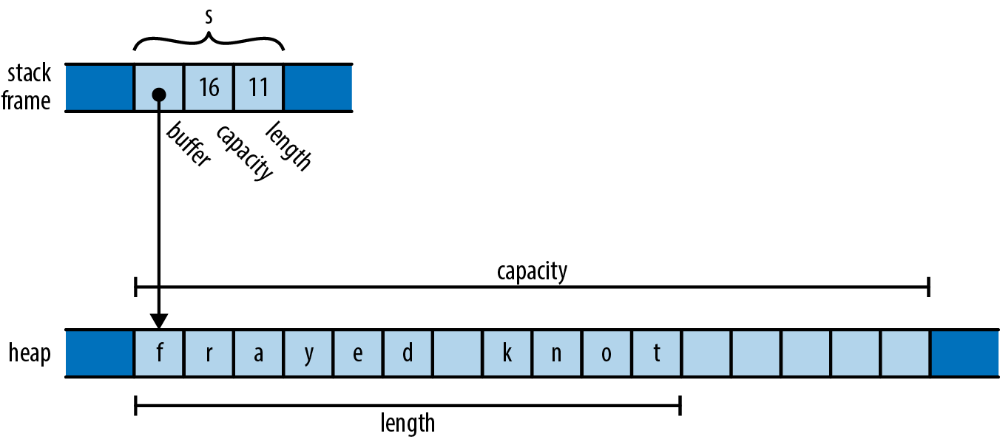

###### Figure 4-1. A C++ `std::string` value on the stack, pointing to its heap-allocated buffer

Here, the actual `std::string` object itself is always exactly three words long, comprising a pointer to a heap-allocated buffer, the buffer’s overall capacity (that is, how large the text can grow before the string must allocate a larger buffer to hold it), and the length of the text it holds now. These are fields private to the `std::string` class, not accessible to the string’s users.

A `std::string` owns its buffer: when the program destroys the string, the string’s destructor frees the buffer. In the past, some C++ libraries shared a single buffer among several `std::string` values, using a reference count to decide when the buffer should be freed. Newer versions of the C++ specification effectively preclude that representation; all modern C++ libraries use the approach shown here.

In these situations it’s generally understood that although it’s fine for other code to create temporary pointers to the owned memory, it is that code’s responsibility to make sure its pointers are gone before the owner decides to destroy the owned object. You can create a pointer to a character living in a `std::string`’s buffer, but when the string is destroyed, your pointer becomes invalid, and it’s up to you to make sure you don’t use it anymore. The owner determines the lifetime of the owned, and everyone else must respect its decisions.

We’ve used `std::string` here as an example of what ownership looks like in C++: it’s just a convention that the standard library generally follows, and although the language encourages you to follow similar practices, how you design your own types is ultimately up to you.

In Rust, however, the concept of ownership is built into the language itself and enforced by compile-time checks. Every value has a single owner that determines its lifetime. When the owner is freed—*dropped*, in Rust terminology—the owned value is dropped too. These rules are meant to make it easy for you to find any given value’s lifetime simply by inspecting the code, giving you the control over its lifetime that a systems language should provide.

A variable owns its value. When control leaves the block in which the variable is declared, the variable is dropped, so its value is dropped along with it. For example:

```
fn print_padovan() {
    let mut padovan = vec![1,1,1];  // allocated here
    for i in 3..10 {
        let next = padovan[i-3] + padovan[i-2];
        padovan.push(next);
    }
    println!("P(1..10) = {:?}", padovan);
}                                   // dropped here
```

The type of the variable `padovan` is `Vec<i32>`, a vector of 32-bit integers. In memory, the final value of `padovan` will look something like Figure 4-2.

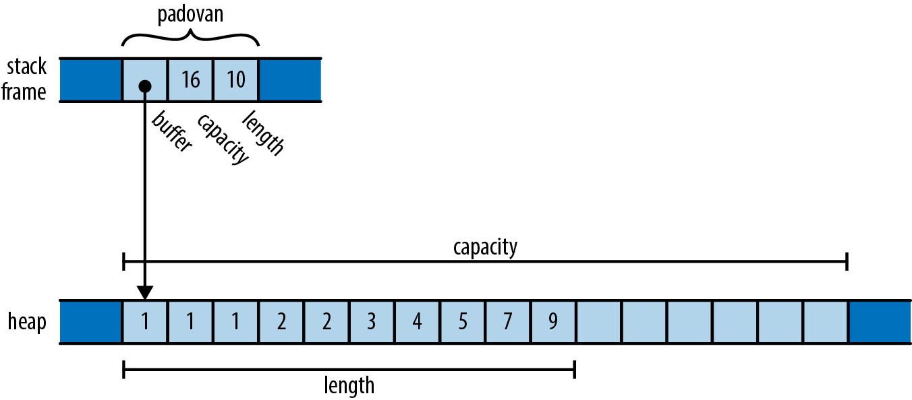

###### Figure 4-2. A `Vec<i32>` on the stack, pointing to its buffer in the heap

This is very similar to the C++ `std::string` we showed earlier, except that the elements in the buffer are 32-bit values, not characters. Note that the words holding `padovan`’s pointer, capacity, and length live directly in the stack frame of the `print_padovan` function; only the vector’s buffer is allocated on the heap.

As with the string `s` earlier, the vector owns the buffer holding its elements. When the variable `padovan` goes out of scope at the end of the function, the program drops the vector. And since the vector owns its buffer, the buffer goes with it.

Rust’s `Box` type serves as another example of ownership. A `Box<T>` is a pointer to a value of type `T` stored on the heap. Calling `Box::new(v)` allocates some heap space, moves the value `v` into it, and returns a `Box` pointing to the heap space. Since a `Box` owns the space it points to, when the `Box` is dropped, it frees the space too.

For example, you can allocate a tuple in the heap like so:

```
{
    let point = Box::new((0.625, 0.5));  // point allocated here
    let label = format!("{:?}", point);  // label allocated here
    assert_eq!(label, "(0.625, 0.5)");
}                                        // both dropped here
```

When the program calls `Box::new`, it allocates space for a tuple of two `f64` values on the heap, moves its argument `(0.625, 0.5)` into that space, and returns a pointer to it. By the time control reaches the call to `assert_eq!`, the stack frame looks like Figure 4-3.

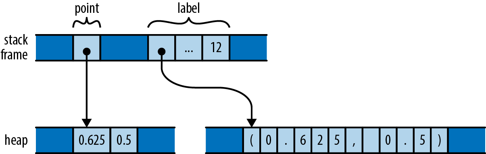

###### Figure 4-3. Two local variables, each owning memory in the heap

The stack frame itself holds the variables `point` and `label`, each of which refers to a heap allocation that it owns. When they are dropped, the allocations they own are freed along with them.

Just as variables own their values, structs own their fields, and tuples, arrays, and vectors own their elements:

```
struct Person { name: String, birth: i32 }

let mut composers = Vec::new();
composers.push(Person { name: "Palestrina".to_string(),
                        birth: 1525 });
composers.push(Person { name: "Dowland".to_string(),
                        birth: 1563 });
composers.push(Person { name: "Lully".to_string(),
                        birth: 1632 });
for composer in &composers {
    println!("{}, born {}", composer.name, composer.birth);
}
```

Here, `composers` is a `Vec<Person>`, a vector of structs, each of which holds a string and a number. In memory, the final value of `composers` looks like Figure 4-4.

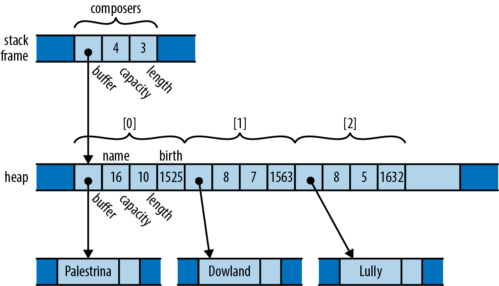

###### Figure 4-4. A more complex tree of ownership

There are many ownership relationships here, but each one is pretty straightforward: `composers` owns a vector; the vector owns its elements, each of which is a `Person` structure; each structure owns its fields; and the string field owns its text. When control leaves the scope in which `composers` is declared, the program drops its value and takes the entire arrangement with it. If there were other sorts of collections in the picture—a `HashMap`, perhaps, or a `BTreeSet`—the story would be the same.

At this point, take a step back and consider the consequences of the ownership relations we’ve presented so far. Every value has a single owner, making it easy to decide when to drop it. But a single value may own many other values: for example, the vector `composers` owns all of its elements. And those values may own other values in turn: each element of `composers` owns a string, which owns its text.

It follows that the owners and their owned values form *trees*: your owner is your parent, and the values you own are your children. And at the ultimate root of each tree is a variable; when that variable goes out of scope, the entire tree goes with it. We can see such an ownership tree in the diagram for `composers`: it’s not a “tree” in the sense of a search tree data structure, or an HTML document made from DOM elements. Rather, we have a tree built from a mixture of types, with Rust’s single-owner rule forbidding any rejoining of structure that could make the arrangement more complex than a tree. Every value in a Rust program is a member of some tree, rooted in some variable.

Rust programs don’t usually explicitly drop values at all, in the way C and C++ programs would use `free` and `delete`. The way to drop a value in Rust is to remove it from the ownership tree somehow: by leaving the scope of a variable, or deleting an element from a vector, or something of that sort. At that point, Rust ensures the value is properly dropped, along with everything it owns.

In a certain sense, Rust is less powerful than other languages: every other practical programming language lets you build arbitrary graphs of objects that point to each other in whatever way you see fit. But it is exactly because Rust is less powerful that the analyses the language can carry out on your programs can be more powerful. Rust’s safety guarantees are possible exactly because the relationships it may encounter in your code are more tractable. This is part of Rust’s “radical wager” we mentioned earlier: in practice, Rust claims, there is usually more than enough flexibility in how one goes about solving a problem to ensure that at least a few perfectly fine solutions fall within the restrictions the language imposes.

That said, the concept of ownership as we’ve explained it so far is still much too rigid to be useful. Rust extends this simple idea in several ways:

- You  can  move  values  from  one  owner  to  another. This allows you to  build,  rearrange, and tear down the tree.

- Very simple types like integers, floating-point numbers, and characters are excused from the ownership rules. These are called `Copy` types.

- The standard library provides the reference-counted pointer types `Rc` and `Arc`, which allow values to have multiple owners, under some restrictions.

- You can “borrow a reference” to a value; references are non-owning pointers, with limited lifetimes.

Each of these strategies contributes flexibility to the ownership model, while still upholding Rust’s promises. We’ll explain each one in turn, with references covered in the next chapter.

# Moves

In Rust, for most types, operations like assigning a value to a variable, passing it to a function, or returning it from a function don’t copy the value: they *move* it. The source relinquishes ownership of the value to the destination and becomes uninitialized; the destination now controls the value’s lifetime. Rust programs build up and tear down complex structures one value at a time, one move at a time.

You may be surprised that Rust would change the meaning of such fundamental operations; surely assignment is something that should be pretty well nailed down at this point in history. However, if you look closely at how different languages have chosen to handle assignment, you’ll see that there’s actually significant variation from one school to another. The comparison also makes the meaning and consequences of Rust’s choice easier to see.

Consider the following Python code:

``` python
s = ['udon', 'ramen', 'soba']
t = s
u = s
```

Each Python object carries a reference count, tracking the number of values that are currently referring to it. So after the assignment to `s`, the state of the program looks like Figure 4-5 (note that some fields are left out).

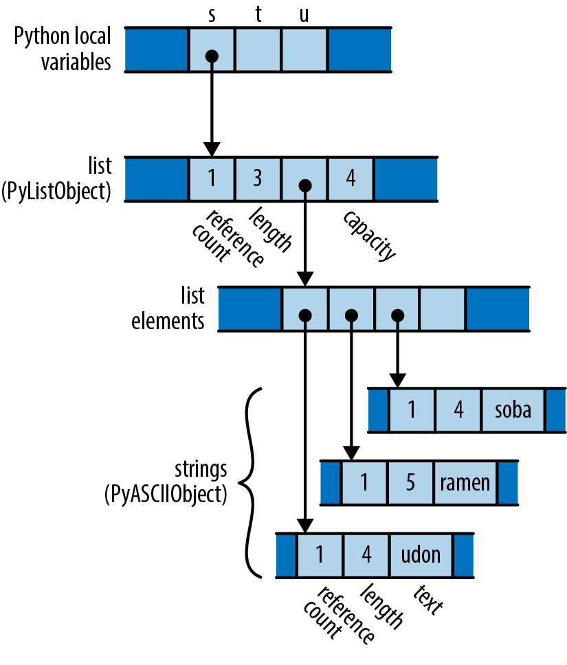

###### Figure 4-5. How Python represents a list of strings in memory

Since only `s` is pointing to the list, the list’s reference count is 1; and since the list is the only object pointing to the strings, each of their reference counts is also 1.

What happens when the program executes the assignments to `t` and `u`? Python implements assignment simply by making the destination point to the same object as the source, and incrementing the object’s reference count. So the final state of the program is something like Figure 4-6.

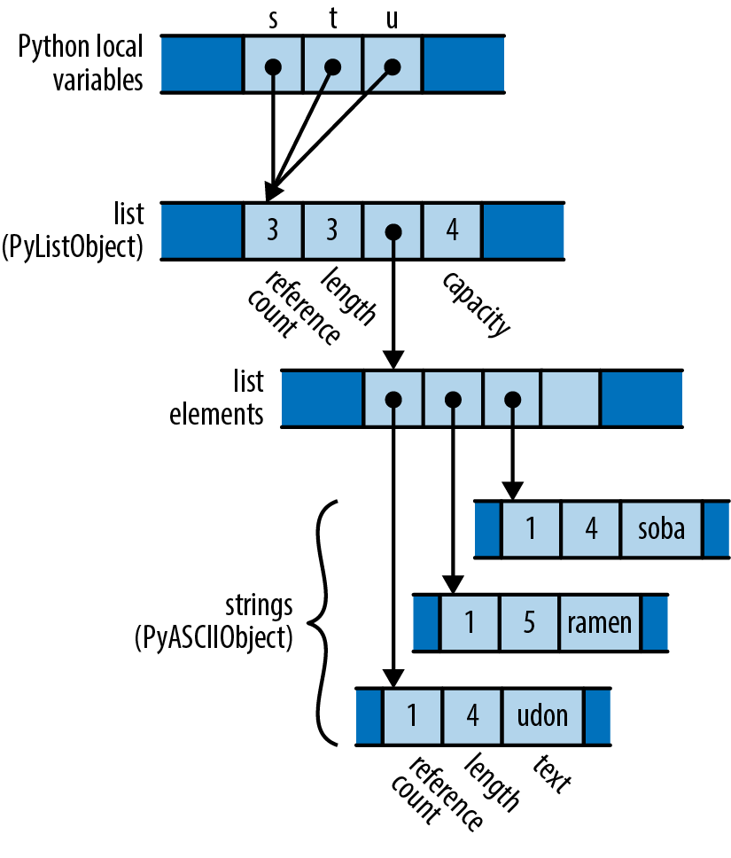

###### Figure 4-6. The result of assigning `s` to both `t` and `u` in Python

Python has copied the pointer from `s` into `t` and `u` and updated the list’s reference count to 3. Assignment in Python is cheap, but because it creates a new reference to the object, we must maintain reference counts to know when we can free the value.

Now consider the analogous C++ code:

``` cpp
using namespace std;
vector<string> s = { "udon", "ramen", "soba" };
vector<string> t = s;
vector<string> u = s;
```

The original value of `s` looks like Figure 4-7 in memory.

What happens when the program assigns `s` to `t` and `u`? Assigning a `std::vector` produces a copy of the vector in C++; `std::string` behaves similarly. So by the time the program reaches the end of this code, it has actually allocated three vectors and nine strings (Figure 4-8).

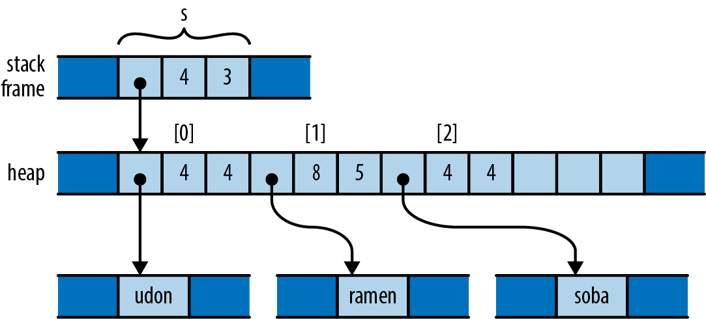

###### Figure 4-7. How C++ represents a vector of strings in memory

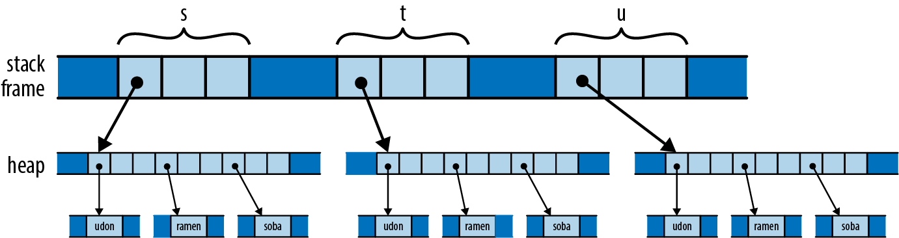

###### Figure 4-8. The result of assigning `s` to both `t` and `u` in C++

Depending on the values involved, assignment in C++ can consume unbounded amounts of memory and processor time. The advantage, however, is that it’s easy for the program to decide when to free all this memory: when the variables go out of scope, everything allocated here gets cleaned up automatically.

In a sense, C++ and Python have chosen opposite trade-offs: Python makes assignment cheap, at the expense of requiring reference counting (and in the general case, garbage collection). C++ keeps the ownership of all the memory clear, at the expense of making assignment carry out a deep copy of the object. C++ programmers are often less than enthusiastic about this choice: deep copies can be expensive, and there are usually more practical alternatives.

So what would the analogous program do in Rust? Here’s the code:

```
let s = vec!["udon".to_string(), "ramen".to_string(), "soba".to_string()];
let t = s;
let u = s;
```

Like C and C++, Rust puts plain string literals like `"udon"` in read-only memory, so for a clearer comparison with the C++ and Python examples, we call `to_string` here to get heap-allocated `String` values.

After carrying out the initialization of `s`, since Rust and C++ use similar representations for vectors and strings, the situation looks just as it did in C++ (Figure 4-9).


###### Figure 4-9. How Rust represents a vector of strings in memory

But recall that, in Rust, assignments of most types *move* the value from the source to the destination, leaving the source uninitialized. So after initializing `t`, the program’s memory looks like Figure 4-10.

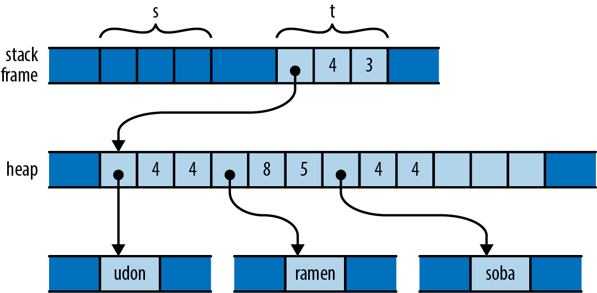

###### Figure 4-10. The result of assigning `s` to `t` in Rust

What has happened here? The initialization `let t = s;` moved the vector’s three header fields from `s` to `t`; now `t` owns the vector. The vector’s elements stayed just where they were, and nothing happened to the strings either. Every value still has a single owner, although one has changed hands. There were no reference counts to be adjusted. And the compiler now considers `s` uninitialized.

So what happens when we reach the initialization `let u = s;`? This would assign the uninitialized value `s` to `u`. Rust prudently prohibits using uninitialized values, so the compiler rejects this code with the following error:

``` console
error: use of moved value: `s`
  |
7 |     let s = vec!["udon".to_string(), "ramen".to_string(), "soba".to_string()];
  |         - move occurs because `s` has type `Vec<String>`,
  |           which does not implement the `Copy` trait
8 |     let t = s;
  |             - value moved here
9 |     let u = s;
  |             ^ value used here after move
```

Consider the consequences of Rust’s use of a move here. Like Python, the assignment is cheap: the program simply moves the three-word header of the vector from one spot to another. But like C++, ownership is always clear: the program doesn’t need reference counting or garbage collection to know when to free the vector elements and string contents.

The price you pay is that you must explicitly ask for copies when you want them. If you want to end up in the same state as the C++ program, with each variable holding an independent copy of the structure, you must call the vector’s `clone` method, which performs a deep copy of the vector and its elements:

```
let s = vec!["udon".to_string(), "ramen".to_string(), "soba".to_string()];
let t = s.clone();
let u = s.clone();
```

You could also re-create Python’s behavior by using Rust’s reference-counted pointer types; we’ll discuss those shortly in “Rc and Arc: Shared Ownership”.

## More Operations That Move

In the examples thus far, we’ve shown initializations, providing values for variables as they come into scope in a `let` statement. Assigning to a variable is slightly different, in that if you move a value into a variable that was already initialized, Rust drops the variable’s prior value. For example:

```
let mut s = "Govinda".to_string();
s = "Siddhartha".to_string(); // value "Govinda" dropped here
```

In this code, when the program assigns the string `"Siddhartha"` to `s`, its prior value `"Govinda"` gets dropped first. But consider the following:

```
let mut s = "Govinda".to_string();
let t = s;
s = "Siddhartha".to_string(); // nothing is dropped here
```

This time, `t` has taken ownership of the original string from `s`, so that by the time we assign to `s`, it is uninitialized. In this scenario, no string is dropped.

We’ve used initializations and assignments in the examples here because they’re simple, but Rust applies move semantics to almost any use of a value. Passing arguments to functions moves ownership to the function’s parameters; returning a value from a function moves ownership to the caller. Building a tuple moves the values into the tuple. And so on.

You may now have better insight into what’s really going on in the examples we offered in the previous section. For example, when we were constructing our vector of composers, we wrote:

```
struct Person { name: String, birth: i32 }

let mut composers = Vec::new();
composers.push(Person { name: "Palestrina".to_string(),
                        birth: 1525 });
```

This code shows several places at which moves occur, beyond initialization and assignment:

*Returning values from a function*  
The call `Vec::new()` constructs a new vector and returns, not a pointer to the vector, but the vector itself: its ownership moves from `Vec::new` to the variable `composers`. Similarly, the `to_string` call returns a fresh `String` instance.

*Constructing new values*  
The `name` field of the new `Person` structure is initialized with the return value of `to_string`. The structure takes ownership of the string.

*Passing values to a function*  
The entire `Person` structure, not a pointer to it, is passed to the vector’s `push` method, which moves it onto the end of the structure. The vector takes ownership of the `Person` and thus becomes the indirect owner of the name `String` as well.

Moving values around like this may sound inefficient, but there are two things to keep in mind. First, the moves always apply to the value proper, not the heap storage they own. For vectors and strings, the *value proper* is the three-word header alone; the potentially large element arrays and text buffers sit where they are in the heap. Second, the Rust compiler’s code generation is good at “seeing through” all these moves; in practice, the machine code often stores the value directly where it belongs.

## Moves and Control Flow

The previous examples all have very simple control flow; how do moves interact with more complicated code? The general principle is that, if it’s possible for a variable to have had its value moved away and it hasn’t definitely been given a new value since, it’s considered uninitialized. For example, if a variable still has a value after evaluating an `if` expression’s condition, then we can use it in both branches:

```
let x = vec![10, 20, 30];
if c {
    f(x); // ... ok to move from x here
} else {
    g(x); // ... and ok to also move from x here
}
h(x); // bad: x is uninitialized here if either path uses it
```

For similar reasons, moving from a variable in a loop is forbidden:

```
let x = vec![10, 20, 30];
while f() {
    g(x); // bad: x would be moved in first iteration,
          // uninitialized in second
}
```

That is, unless we’ve definitely given it a new value by the next iteration:

```
let mut x = vec![10, 20, 30];
while f() {
    g(x);           // move from x
    x = h();        // give x a fresh value
}
e(x);
```

## Moves and Indexed Content

We’ve mentioned that a move leaves its source uninitialized, as the destination takes ownership of the value. But not every kind of value owner is prepared to become uninitialized. For example, consider the following code:

```
// Build a vector of the strings "101", "102", ... "105"
let mut v = Vec::new();
for i in 101 .. 106 {
    v.push(i.to_string());
}

// Pull out random elements from the vector.
let third = v[2]; // error: Cannot move out of index of Vec
let fifth = v[4]; // here too
```

For this to work, Rust would somehow need to remember that the third and fifth elements of the vector have become uninitialized, and track that information until the vector is dropped. In the most general case, vectors would need to carry around extra information with them to indicate which elements are live and which have become uninitialized. That is clearly not the right behavior for a systems programming language; a vector should be nothing but a vector. In fact, Rust rejects the preceding code with the following error:

``` console
error: cannot move out of index of `Vec<String>`
   |
14 |     let third = v[2];
   |                 ^^^^
   |                 |
   |                 move occurs because value has type `String`,
   |                 which does not implement the `Copy` trait
   |                 help: consider borrowing here: `&v[2]`
```

It also makes a similar complaint about the move to `fifth`. In the error message, Rust suggests using a reference, in case you want to access the element without moving it. This is often what you want. But what if you really do want to move an element out of a vector? You need to find a method that does so in a way that respects the limitations of the type. Here are three possibilities:

```
// Build a vector of the strings "101", "102", ... "105"
let mut v = Vec::new();
for i in 101 .. 106 {
    v.push(i.to_string());
}

// 1. Pop a value off the end of the vector:
let fifth = v.pop().expect("vector empty!");
assert_eq!(fifth, "105");

// 2. Move a value out of a given index in the vector,
// and move the last element into its spot:
let second = v.swap_remove(1);
assert_eq!(second, "102");

// 3. Swap in another value for the one we're taking out:
let third = std::mem::replace(&mut v[2], "substitute".to_string());
assert_eq!(third, "103");

// Let's see what's left of our vector.
assert_eq!(v, vec!["101", "104", "substitute"]);
```

Each one of these methods moves an element out of the vector, but does so in a way that leaves the vector in a state that is fully populated, if perhaps smaller.

Collection types like `Vec` also generally offer methods to consume all their elements in a loop:

```
let v = vec!["liberté".to_string(),
             "égalité".to_string(),
             "fraternité".to_string()];

for mut s in v {
    s.push('!');
    println!("{}", s);
}
```

When we pass the vector to the loop directly, as in `for ... in v`, this *moves* the vector out of `v`, leaving `v` uninitialized. The `for` loop’s internal machinery takes ownership of the vector and dissects it into its elements. At each iteration, the loop moves another element to the variable `s`. Since `s` now owns the string, we’re able to modify it in the loop body before printing it. And since the vector itself is no longer visible to the code, nothing can observe it mid-loop in some partially emptied state.

If you do find yourself needing to move a value out of an owner that the compiler can’t track, you might consider changing the owner’s type to something that can dynamically track whether it has a value or not. For example, here’s a variant on the earlier example:

```
struct Person { name: Option<String>, birth: i32 }

let mut composers = Vec::new();
composers.push(Person { name: Some("Palestrina".to_string()),
                        birth: 1525 });
```

You can’t do this:

```
let first_name = composers[0].name;
```

That will just elicit the same “cannot move out of index” error shown earlier. But because you’ve changed the type of the `name` field from `String` to `Option<String>`, that means that `None` is a legitimate value for the field to hold, so this works:

```
let first_name = std::mem::replace(&mut composers[0].name, None);
assert_eq!(first_name, Some("Palestrina".to_string()));
assert_eq!(composers[0].name, None);
```

The `replace` call moves out the value of `composers[0].name`, leaving `None` in its place, and passes ownership of the original value to its caller. In fact, using `Option` this way is common enough that the type provides a `take` method for this very purpose. You could write the preceding manipulation more legibly as follows:

```
let first_name = composers[0].name.take();
```

This call to `take` has the same effect as the earlier call to `replace`.

# Copy Types: The Exception to Moves

The examples we’ve shown so far of values being moved involve vectors, strings, and other types that could potentially use a lot of memory and be expensive to copy. Moves keep ownership of such types clear and assignment cheap. But for simpler types like integers or characters, this sort of careful handling really isn’t necessary.

Compare what happens in memory when we assign a `String` with what happens when we assign an `i32` value:

```
let string1 = "somnambulance".to_string();
let string2 = string1;

let num1: i32 = 36;
let num2 = num1;
```

After running this code, memory looks like Figure 4-11.

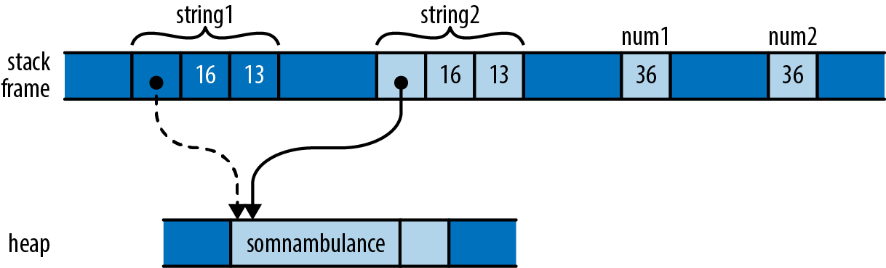

###### Figure 4-11. Assigning a `String` moves the value, whereas assigning an `i32` copies it

As with the vectors earlier, assignment *moves* `string1` to `string2` so that we don’t end up with two strings responsible for freeing the same buffer. However, the situation with `num1` and `num2` is different. An `i32` is simply a pattern of bits in memory; it doesn’t own any heap resources or really depend on anything other than the bytes it comprises. By the time we’ve moved its bits to `num2`, we’ve made a completely independent copy of `num1`.

Moving a value leaves the source of the move uninitialized. But whereas it serves an essential purpose to treat `string1` as valueless, treating `num1` that way is pointless; no harm could result from continuing to use it. The advantages of a move don’t apply here, and it’s inconvenient.

Earlier we were careful to say that *most* types are moved; now we’ve come to the exceptions, the types Rust designates as *`Copy` types*. Assigning a value of a `Copy` type copies the value, rather than moving it. The source of the assignment remains initialized and usable, with the same value it had before. Passing `Copy` types to functions and constructors behaves similarly.

The standard `Copy` types include all the machine integer and floating-point numeric types, the `char` and `bool` types, and a few others. A tuple or fixed-size array of `Copy` types is itself a `Copy` type.

Only types for which a simple bit-for-bit copy suffices can be `Copy`. As we’ve already explained, `String` is not a `Copy` type, because it owns a heap-allocated buffer. For similar reasons, `Box<T>` is not `Copy`; it owns its heap-allocated referent. The `File` type, representing an operating system file handle, is not `Copy`; duplicating such a value would entail asking the operating system for another file handle. Similarly, the `MutexGuard` type, representing a locked mutex, isn’t `Copy`: this type isn’t meaningful to copy at all, as only one thread may hold a mutex at a time.

As a rule of thumb, any type that needs to do something special when a value is dropped cannot be `Copy`: a `Vec` needs to free its elements, a `File` needs to close its file handle, a `MutexGuard` needs to unlock its mutex, and so on. Bit-for-bit duplication of such types would leave it unclear which value was now responsible for the original’s resources.

What about types you define yourself? By default, `struct` and `enum` types are not `Copy`:

```
struct Label { number: u32 }

fn print(l: Label) { println!("STAMP: {}", l.number); }

let l = Label { number: 3 };
print(l);
println!("My label number is: {}", l.number);
```

This won’t compile; Rust complains:

``` console
error: borrow of moved value: `l`
   |
10 |     let l = Label { number: 3 };
   |         - move occurs because `l` has type `main::Label`,
   |           which does not implement the `Copy` trait
11 |     print(l);
   |           - value moved here
12 |     println!("My label number is: {}", l.number);
   |                                        ^^^^^^^^
   |                  value borrowed here after move
```

Since `Label` is not `Copy`, passing it to `print` moved ownership of the value to the `print` function, which then dropped it before returning. But this is silly; a `Label` is nothing but a `u32` with pretensions. There’s no reason passing `l` to `print` should move the value.

But user-defined types being non-`Copy` is only the default. If all the fields of your struct are themselves `Copy`, then you can make the type `Copy` as well by placing the attribute `#[derive(Copy, Clone)]` above the definition, like so:

```
#[derive(Copy, Clone)]
struct Label { number: u32 }
```

With this change, the preceding code compiles without complaint. However, if we try this on a type whose fields are not all `Copy`, it doesn’t work. Suppose we compile the following code:

```
#[derive(Copy, Clone)]
struct StringLabel { name: String }
```

It elicits this error:

``` console
error: the trait `Copy` may not be implemented for this type
  |
7 | #[derive(Copy, Clone)]
  |          ^^^^
8 | struct StringLabel { name: String }
  |                      ------------ this field does not implement `Copy`
```

Why aren’t user-defined types automatically `Copy`, assuming they’re eligible? Whether a type is `Copy` or not has a big effect on how code is allowed to use it: `Copy` types are more flexible, since assignment and related operations don’t leave the original uninitialized. But for a type’s implementer, the opposite is true: `Copy` types are very limited in which types they can contain, whereas non-`Copy` types can use heap allocation and own other sorts of resources. So making a type `Copy` represents a serious commitment on the part of the implementer: if it’s necessary to change it to non-`Copy` later, much of the code that uses it will probably need to be adapted.

While C++ lets you overload assignment operators and define specialized copy and move constructors, Rust doesn’t permit this sort of customization. In Rust, every move is a byte-for-byte, shallow copy that leaves the source uninitialized. Copies are the same, except that the source remains initialized. This does mean that C++ classes can provide convenient interfaces that Rust types cannot, where ordinary-looking code implicitly adjusts reference counts, puts off expensive copies for later, or uses other sophisticated implementation tricks.

But the effect of this flexibility on C++ as a language is to make basic operations like assignment, passing parameters, and returning values from functions less predictable. For example, earlier in this chapter we showed how assigning one variable to another in C++ can require arbitrary amounts of memory and processor time. One of Rust’s principles is that costs should be apparent to the programmer. Basic operations must remain simple. Potentially expensive operations should be explicit, like the calls to `clone` in the earlier example that make deep copies of vectors and the strings they contain.

In this section, we’ve talked about `Copy` and `Clone` in vague terms as characteristics a type might have. They are actually examples of *traits*, Rust’s open-ended facility for categorizing types based on what you can do with them. We describe traits in general in Chapter 11, and `Copy` and `Clone` in particular in Chapter 13.

# Rc and Arc: Shared Ownership

Although most values have unique owners in typical Rust code, in some cases it’s difficult to find every value a single owner that has the lifetime you need; you’d like the value to simply live until everyone’s done using it. For these cases, Rust provides the reference-counted pointer types `Rc` and `Arc`. As you would expect from Rust, these are entirely safe to use: you cannot forget to adjust the reference count, create other pointers to the referent that Rust doesn’t notice, or stumble over any of the other sorts of problems that accompany reference-counted pointer types in C++.

The `Rc` and `Arc` types are very similar; the only difference between them is that an `Arc` is safe to share between threads directly—the name `Arc` is short for *atomic reference count*—whereas a plain `Rc` uses faster non-thread-safe code to update its reference count. If you don’t need to share the pointers between threads, there’s no reason to pay the performance penalty of an `Arc`, so you should use `Rc`; Rust will prevent you from accidentally passing one across a thread boundary. The two types are otherwise equivalent, so for the rest of this section, we’ll only talk about `Rc`.

Earlier we showed how Python uses reference counts to manage its values’ lifetimes. You can use `Rc` to get a similar effect in Rust. Consider the following code:

```
use std::rc::Rc;

// Rust can infer all these types; written out for clarity
let s: Rc<String> = Rc::new("shirataki".to_string());
let t: Rc<String> = s.clone();
let u: Rc<String> = s.clone();
```

For any type `T`, an `Rc<T>` value is a pointer to a heap-allocated `T` that has had a reference count affixed to it. Cloning an `Rc<T>` value does not copy the `T`; instead, it simply creates another pointer to it and increments the reference count. So the preceding code produces the situation illustrated in Figure 4-12 in memory.

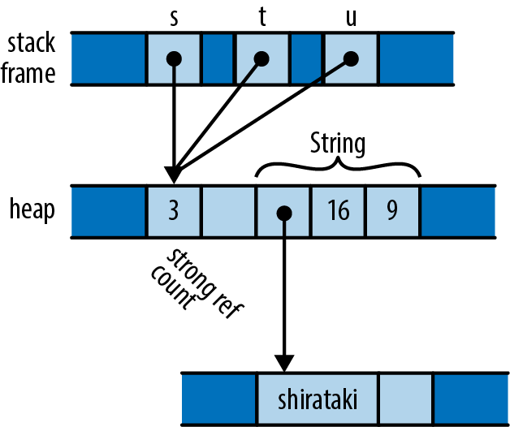

###### Figure 4-12. A reference-counted string with three references

Each of the three `Rc<String>` pointers is referring to the same block of memory, which holds a reference count and space for the `String`. The usual ownership rules apply to the `Rc` pointers themselves, and when the last extant `Rc` is dropped, Rust drops the `String` as well.

You can use any of `String`’s usual methods directly on an `Rc<String>`:

```
assert!(s.contains("shira"));
assert_eq!(t.find("taki"), Some(5));
println!("{} are quite chewy, almost bouncy, but lack flavor", u);
```

A value owned by an `Rc` pointer is immutable. Suppose you try to add some text to the end of the string:

```
s.push_str(" noodles");
```

Rust will decline:

``` console
error: cannot borrow data in an `Rc` as mutable
   |
13 |     s.push_str(" noodles");
   |     ^ cannot borrow as mutable
   |
```

Rust’s memory and thread-safety guarantees depend on ensuring that no value is ever simultaneously shared and mutable. Rust assumes the referent of an `Rc` pointer might in general be shared, so it must not be mutable. We explain why this restriction is important in Chapter 5.

One well-known problem with using reference counts to manage memory is that, if there are ever two reference-counted values that point to each other, each will hold the other’s reference count above zero, so the values will never be freed (Figure 4-13).

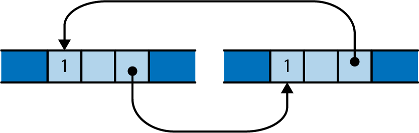

###### Figure 4-13. A reference-counting loop; these objects will not be freed

It is possible to leak values in Rust this way, but such situations are rare. You cannot create a cycle without, at some point, making an older value point to a newer value. This obviously requires the older value to be mutable. Since `Rc` pointers hold their referents immutable, it’s not normally possible to create a cycle. However, Rust does provide ways to create mutable portions of otherwise immutable values; this is called *interior mutability*, and we cover it in “Interior Mutability”. If you combine those techniques with `Rc` pointers, you can create a cycle and leak memory.

You can sometimes avoid creating cycles of `Rc` pointers by using *weak pointers*, `std::rc::Weak`, for some of the links instead. However, we won’t cover those in this book; see the standard library’s documentation for details.

Moves and reference-counted pointers are two ways to relax the rigidity of the ownership tree. In the next chapter, we’ll look at a third way: borrowing references to values. Once you have become comfortable with both ownership and borrowing, you will have climbed the steepest part of Rust’s learning curve, and you’ll be ready to take advantage of Rust’s unique strengths.