# Chapter 5. References

> Libraries cannot provide new inabilities.
>
> Mark Miller

All the pointer types we’ve seen so far—the simple `Box<T>` heap pointer, and the pointers internal to `String` and `Vec` values—are owning pointers: when the owner is dropped, the referent goes with it. Rust also has non-owning pointer types called *references*, which have no effect on their referents’ lifetimes.

In fact, it’s rather the opposite: references must never outlive their referents. You must make it apparent in your code that no reference can possibly outlive the value it points to. To emphasize this, Rust refers to creating a reference to some value as *borrowing* the value: what you have borrowed, you must eventually return to its owner.

If you felt a moment of skepticism when reading the phrase “You must make it apparent in your code,” you’re in excellent company. The references themselves are nothing special—under the hood, they’re just addresses. But the rules that keep them safe are novel to Rust; outside of research languages, you won’t have seen anything like them before. And although these rules are the part of Rust that requires the most effort to master, the breadth of classic, absolutely everyday bugs they prevent is surprising, and their effect on multithreaded programming is liberating. This is Rust’s radical wager, again.

In this chapter, we’ll walk through how references work in Rust; show how references, functions, and user-defined types all incorporate lifetime information to ensure that they’re used safely; and illustrate some common categories of bugs that these efforts prevent, at compile time and without run-time performance penalties.

# References to Values

As an example, let’s suppose we’re going to build a table of murderous Renaissance artists and the works they’re known for. Rust’s standard library includes a hash table type, so we can define our type like this:

``` rust
use std::collections::HashMap;

type Table = HashMap<String, Vec<String>>;
```

In other words, this is a hash table that maps `String` values to `Vec<String>` values, taking the name of an artist to a list of the names of their works. You can iterate over the entries of a `HashMap` with a `for` loop, so we can write a function to print out a `Table`:

``` rust
fn show(table: Table) {
    for (artist, works) in table {
        println!("works by {}:", artist);
        for work in works {
            println!("  {}", work);
        }
    }
}
```

Constructing and printing the table is straightforward:

``` rust
fn main() {
    let mut table = Table::new();
    table.insert("Gesualdo".to_string(),
                 vec!["many madrigals".to_string(),
                      "Tenebrae Responsoria".to_string()]);
    table.insert("Caravaggio".to_string(),
                 vec!["The Musicians".to_string(),
                      "The Calling of St. Matthew".to_string()]);
    table.insert("Cellini".to_string(),
                 vec!["Perseus with the head of Medusa".to_string(),
                      "a salt cellar".to_string()]);

    show(table);
}
```

And it all works fine:

``` console
$ cargo run
     Running `/home/jimb/rust/book/fragments/target/debug/fragments`
works by Gesualdo:
  many madrigals
  Tenebrae Responsoria
works by Cellini:
  Perseus with the head of Medusa
  a salt cellar
works by Caravaggio:
  The Musicians
  The Calling of St. Matthew
$
```

But if you’ve read the previous chapter’s section on moves, this definition for `show` should raise a few questions. In particular, `HashMap` is not `Copy`—it can’t be, since it owns a dynamically allocated table. So when the program calls `show(table)`, the whole structure gets moved to the function, leaving the variable `table` uninitialized. (It also iterates over its contents in no specific order, so if you’ve gotten a different order, don’t worry.) If the calling code tries to use `table` now, it’ll run into trouble:

``` rust
...
show(table);
assert_eq!(table["Gesualdo"][0], "many madrigals");
```

Rust complains that `table` isn’t available anymore:

``` console
error: borrow of moved value: `table`
   |
20 |     let mut table = Table::new();
   |         --------- move occurs because `table` has type 
   |                   `HashMap<String, Vec<String>>`,
   |                   which does not implement the `Copy` trait
...
31 |     show(table);
   |          ----- value moved here
32 |     assert_eq!(table["Gesualdo"][0], "many madrigals");
   |                ^^^^^ value borrowed here after move
```

In fact, if we look into the definition of `show`, the outer `for` loop takes ownership of the hash table and consumes it entirely; and the inner `for` loop does the same to each of the vectors. (We saw this behavior earlier, in the “liberté, égalité, fraternité” example.) Because of move semantics, we’ve completely destroyed the entire structure simply by trying to print it out. Thanks, Rust!

The right way to handle this is to use references. A reference lets you access a value without affecting its ownership. References come in two kinds:

- A *shared reference* lets you read but not modify its referent. However, you can have as many shared references to a particular value at a time as you like. The expression `&e` yields a shared reference to `e`’s value; if `e` has the type `T`, then `&e` has the type `&T`, pronounced “ref `T`.” Shared references are `Copy`.

- If you have a *mutable reference* to a value, you may both read and modify the value. However, you may not have any other references of any sort to that value active at the same time. The expression `&mut e` yields a mutable reference to `e`’s value; you write its type as `&mut T`, which is pronounced “ref mute `T`.” Mutable references are not `Copy`.

You can think of the distinction between shared and mutable references as a way to enforce a *multiple readers or single writer* rule at compile time. In fact, this rule doesn’t apply only to references; it covers the borrowed value’s owner as well. As long as there are shared references to a value, not even its owner can modify it; the value is locked down. Nobody can modify `table` while `show` is working with it. Similarly, if there is a mutable reference to a value, it has exclusive access to the value; you can’t use the owner at all, until the mutable reference goes away. Keeping sharing and mutation fully separate turns out to be essential to memory safety, for reasons we’ll go into later in the chapter.

The printing function in our example doesn’t need to modify the table, just read its contents. So the caller should be able to pass it a shared reference to the table, as follows:

``` rust
show(&table);
```

References are non-owning pointers, so the `table` variable remains the owner of the entire structure; `show` has just borrowed it for a bit. Naturally, we’ll need to adjust the definition of `show` to match, but you’ll have to look closely to see the difference:

``` rust
fn show(table: &Table) {
    for (artist, works) in table {
        println!("works by {}:", artist);
        for work in works {
            println!("  {}", work);
        }
    }
}
```

The type of `show`’s parameter `table` has changed from `Table` to `&Table`: instead of passing the table by value (and hence moving ownership into the function), we’re now passing a shared reference. That’s the only textual change. But how does this play out as we work through the body?

Whereas our original outer `for` loop took ownership of the `HashMap` and consumed it, in our new version it receives a shared reference to the `HashMap`. Iterating over a shared reference to a `HashMap` is defined to produce shared references to each entry’s key and value: `artist` has changed from a `String` to a `&String`, and `works` from a `Vec<String>` to a `&Vec<String>`.

The inner loop is changed similarly. Iterating over a shared reference to a vector is defined to produce shared references to its elements, so `work` is now a `&String`. No ownership changes hands anywhere in this function; it’s just passing around non-owning references.

Now, if we wanted to write a function to alphabetize the works of each artist, a shared reference doesn’t suffice, since shared references don’t permit modification. Instead, the sorting function needs to take a mutable reference to the table:

``` rust
fn sort_works(table: &mut Table) {
    for (_artist, works) in table {
        works.sort();
    }
}
```

And we need to pass it one:

``` rust
sort_works(&mut table);
```

This mutable borrow grants `sort_works` the ability to read and modify our structure, as required by the vectors’ `sort` method.

When we pass a value to a function in a way that moves ownership of the value to the function, we say that we have passed it *by value*. If we instead pass the function a reference to the value, we say that we have passed the value *by reference*. For example, we fixed our `show` function by changing it to accept the table by reference, rather than by value. Many languages draw this distinction, but it’s especially important in Rust, because it spells out how ownership is affected.

# Working with References

The preceding example shows a pretty typical use for references: allowing functions to access or manipulate a structure without taking ownership. But references are more flexible than that, so let’s look at some examples to get a more detailed view of what’s going on.

## Rust References Versus C++ References

If you’re familiar with references in C++, they do have something in common with Rust references. Most importantly, they’re both just addresses at the machine level. But in practice, Rust’s references have a very different feel.

In C++, references are created implicitly by conversion, and dereferenced implicitly too:

``` cpp
// C++ code!
int x = 10;
int &r = x;             // initialization creates reference implicitly
assert(r == 10);        // implicitly dereference r to see x's value
r = 20;                 // stores 20 in x, r itself still points to x
```

In Rust, references are created explicitly with the `&` operator, and dereferenced explicitly with the `*` operator:

``` rust
// Back to Rust code from this point onward.
let x = 10;
let r = &x;             // &x is a shared reference to x
assert!(*r == 10);      // explicitly dereference r
```

To create a mutable reference, use the `&mut` operator:

``` rust
let mut y = 32;
let m = &mut y;        // &mut y is a mutable reference to y
*m += 32;              // explicitly dereference m to set y's value
assert!(*m == 64);     // and to see y's new value
```

But you might recall that, when we fixed the `show` function to take the table of artists by reference instead of by value, we never had to use the `*` operator. Why is that?

Since references are so widely used in Rust, the `.` operator implicitly dereferences its left operand, if needed:

``` rust
struct Anime { name: &'static str, bechdel_pass: bool }
let aria = Anime { name: "Aria: The Animation", bechdel_pass: true };
let anime_ref = &aria;
assert_eq!(anime_ref.name, "Aria: The Animation");

// Equivalent to the above, but with the dereference written out:
assert_eq!((*anime_ref).name, "Aria: The Animation");
```

The `println!` macro used in the `show` function expands to code that uses the `.` operator, so it takes advantage of this implicit dereference as well.

The `.` operator can also implicitly borrow a reference to its left operand, if needed for a method call. For example, `Vec`’s `sort` method takes a mutable reference to the vector, so these two calls are equivalent:

``` rust
let mut v = vec![1973, 1968];
v.sort();           // implicitly borrows a mutable reference to v
(&mut v).sort();    // equivalent, but more verbose
```

In a nutshell, whereas C++ converts implicitly between references and lvalues (that is, expressions referring to locations in memory), with these conversions appearing anywhere they’re needed, in Rust you use the `&` and `*` operators to create and follow references, with the exception of the `.` operator, which borrows and dereferences implicitly.

## Assigning References

Assigning a reference to a variable makes that variable point somewhere new:

``` rust
let x = 10;
let y = 20;
let mut r = &x;

if b { r = &y; }

assert!(*r == 10 || *r == 20);
```

The reference `r` initially points to `x`. But if `b` is true, the code points it at `y` instead, as illustrated in Figure 5-1.

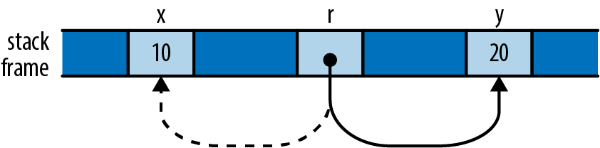

###### Figure 5-1. The reference `r`, now pointing to `y` instead of `x`

This behavior may seem too obvious to be worth mentioning: of course `r` now points to `y`, since we stored `&y` in it. But we point this out because C++ references behave very differently: as shown earlier, assigning a value to a reference in C++ stores the value in its referent. Once a C++ reference has been initialized, there’s no way to make it point at anything else.

## References to References

Rust permits references to references:

``` rust
struct Point { x: i32, y: i32 }
let point = Point { x: 1000, y: 729 };
let r: &Point = &point;
let rr: &&Point = &r;
let rrr: &&&Point = &rr;
```

(We’ve written out the reference types for clarity, but you could omit them; there’s nothing here Rust can’t infer for itself.) The `.` operator follows as many references as it takes to find its target:

``` rust
assert_eq!(rrr.y, 729);
```

In memory, the references are arranged as shown in Figure 5-2.

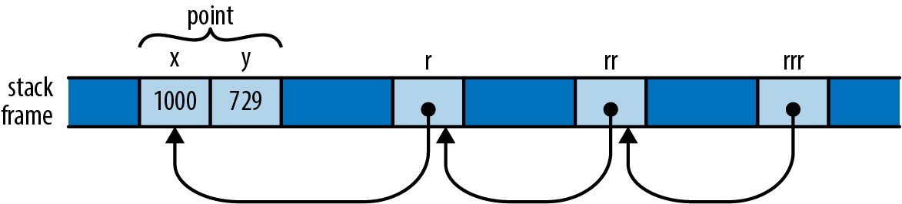

###### Figure 5-2. A chain of references to references

So the expression `rrr.y`, guided by the type of `rrr`, actually traverses three references to get to the `Point` before fetching its `y` field.

## Comparing References

Like the `.` operator, Rust’s comparison operators “see through” any number of references:

``` rust
let x = 10;
let y = 10;

let rx = &x;
let ry = &y;

let rrx = &rx;
let rry = &ry;

assert!(rrx <= rry);
assert!(rrx == rry);
```

The final assertion here succeeds, even though `rrx` and `rry` point at different values (namely, `rx` and `ry`), because the `==` operator follows all the references and performs the comparison on their final targets, `x` and `y`. This is almost always the behavior you want, especially when writing generic functions. If you actually want to know whether two references point to the same memory, you can use `std::ptr::eq`, which compares them as addresses:

``` rust
assert!(rx == ry);              // their referents are equal
assert!(!std::ptr::eq(rx, ry)); // but occupy different addresses
```

Note that the operands of a comparison must have exactly the same type, including the references:

``` rust
assert!(rx == rrx);    // error: type mismatch: `&i32` vs `&&i32`
assert!(rx == *rrx);   // this is okay
```

## References Are Never Null

Rust references are never null. There’s no analogue to C’s `NULL` or C++’s `nullptr`. There is no default initial value for a reference (you can’t use any variable until it’s been initialized, regardless of its type) and Rust won’t convert integers to references (outside of `unsafe` code), so you can’t convert zero into a reference.

C and C++ code often uses a null pointer to indicate the absence of a value: for example, the `malloc` function returns either a pointer to a new block of memory or `nullptr` if there isn’t enough memory available to satisfy the request. In Rust, if you need a value that is either a reference to something or not, use the type `Option<&T>`. At the machine level, Rust represents `None` as a null pointer and `Some(r)`, where `r` is a `&T` value, as the nonzero address, so `Option<&T>` is just as efficient as a nullable pointer in C or C++, even though it’s safer: its type requires you to check whether it’s `None` before you can use it.

## Borrowing References to Arbitrary Expressions

Whereas C and C++ only let you apply the `&` operator to certain kinds of expressions, Rust lets you borrow a reference to the value of any sort of expression at all:

``` rust
fn factorial(n: usize) -> usize {
    (1..n+1).product()
}
let r = &factorial(6);
// Arithmetic operators can see through one level of references.
assert_eq!(r + &1009, 1729);
```

In situations like this, Rust simply creates an anonymous variable to hold the expression’s value and makes the reference point to that. The lifetime of this anonymous variable depends on what you do with the reference:

- If you immediately assign the reference to a variable in a `let` statement (or make it part of some struct or array that is being immediately assigned), then Rust makes the anonymous variable live as long as the variable the `let` initializes. In the preceding example, Rust would do this for the referent of `r`.

- Otherwise, the anonymous variable lives to the end of the enclosing statement. In our example, the anonymous variable created to hold `1009` lasts only to the end of the `assert_eq!` statement.

If you’re used to C or C++, this may sound error-prone. But remember that Rust will never let you write code that would produce a dangling reference. If the reference could ever be used beyond the anonymous variable’s lifetime, Rust will always report the problem to you at compile time. You can then fix your code to keep the referent in a named variable with an appropriate lifetime.

## References to Slices and Trait Objects

The references we’ve shown so far are all simple addresses. However, Rust also includes two kinds of *fat pointers*, two-word values carrying the address of some value, along with some further information necessary to put the value to use.

A reference to a slice is a fat pointer, carrying the starting address of the slice and its length. We described slices in detail in Chapter 3.

Rust’s other kind of fat pointer is a *trait object*, a reference to a value that implements a certain trait. A trait object carries a value’s address and a pointer to the trait’s implementation appropriate to that value, for invoking the trait’s methods. We’ll cover trait objects in detail in “Trait Objects”.

Aside from carrying this extra data, slice and trait object references behave just like the other sorts of references we’ve shown so far in this chapter: they don’t own their referents, they are not allowed to outlive their referents, they may be mutable or shared, and so on.

# Reference Safety

As we’ve presented them so far, references look pretty much like ordinary pointers in C or C++. But those are unsafe; how does Rust keep its references under control? Perhaps the best way to see the rules in action is to try to break them.

To convey the fundamental ideas, we’ll start with the simplest cases, showing how Rust ensures references are used properly within a single function body. Then we’ll look at passing references between functions and storing them in data structures. This entails giving said functions and data types *lifetime parameters*, which we’ll explain. Finally, we’ll present some shortcuts that Rust provides to simplify common usage patterns. Throughout, we’ll be showing how Rust points out broken code and often suggests solutions.

## Borrowing a Local Variable

Here’s a pretty obvious case. You can’t borrow a reference to a local variable and take it out of the variable’s scope:

``` rust
{
    let r;
    {
        let x = 1;
        r = &x;
    }
    assert_eq!(*r, 1);  // bad: reads memory `x` used to occupy
}
```

The Rust compiler rejects this program, with a detailed error message:

``` console
error: `x` does not live long enough
   |
7  |         r = &x;
   |             ^^ borrowed value does not live long enough 
8  |     }
   |     - `x` dropped here while still borrowed
9  |     assert_eq!(*r, 1);  // bad: reads memory `x` used to occupy
10 | }
```

Rust’s complaint is that `x` lives only until the end of the inner block, whereas the reference remains alive until the end of the outer block, making it a dangling pointer, which is verboten.

While it’s obvious to a human reader that this program is broken, it’s worth looking at how Rust itself reached that conclusion. Even this simple example shows the logical tools Rust uses to check much more complex code.

Rust tries to assign each reference type in your program a *lifetime* that meets the constraints imposed by how it is used. A lifetime is some stretch of your program for which a reference could be safe to use: a statement, an expression, the scope of some variable, or the like. Lifetimes are entirely figments of Rust’s compile-time imagination. At run time, a reference is nothing but an address; its lifetime is part of its type and has no run-time representation.

In this example, there are three lifetimes whose relationships we need to work out. The variables `r` and `x` both have a lifetime, extending from the point at which they’re initialized until the point that the compiler can prove they are no longer in use. The third lifetime is that of a reference type: the type of the reference we borrow to `x` and store in `r`.

Here’s one constraint that should seem pretty obvious: if you have a variable `x`, then a reference to `x` must not outlive `x` itself, as shown in Figure 5-3.

Beyond the point where `x` goes out of scope, the reference would be a dangling pointer. We say that the variable’s lifetime must *contain* or *enclose* that of the reference borrowed from it.

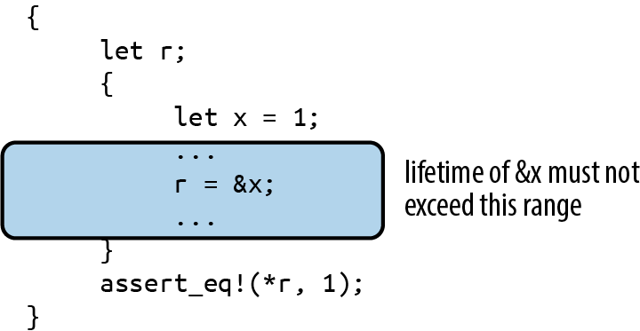

###### Figure 5-3. Permissible lifetimes for &x

Here’s another kind of constraint: if you store a reference in a variable `r`, the reference’s type must be good for the entire lifetime of the variable, from its initialization until its last use, as shown in Figure 5-4.

If the reference can’t live at least as long as the variable does, then at some point `r` will be a dangling pointer. We say that the reference’s lifetime must contain or enclose the variable’s.

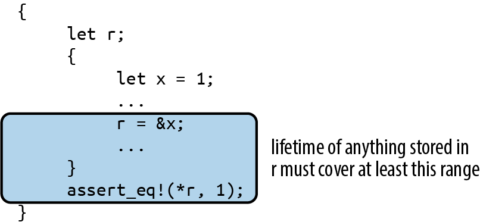

###### Figure 5-4. Permissible lifetimes for reference stored in r

The first kind of constraint limits how large a reference’s lifetime can be, while the second kind limits how small it can be. Rust simply tries to find a lifetime for each reference that satisfies all these constraints. In our example, however, there is no such lifetime, as shown in Figure 5-5.

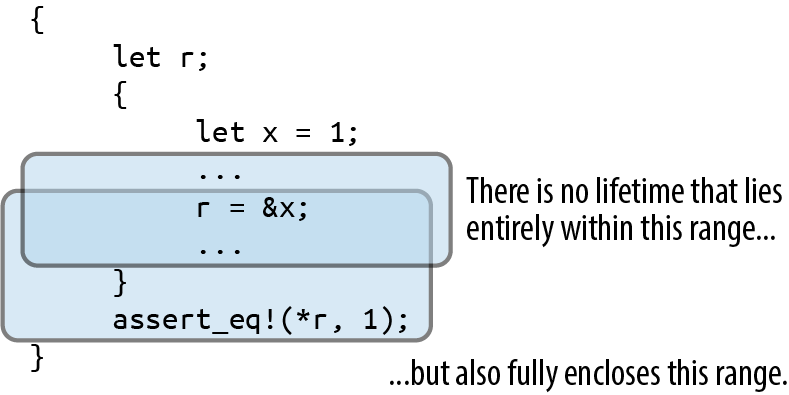

###### Figure 5-5. A reference with contradictory constraints on its lifetime

Let’s now consider a different example where things do work out. We have the same kinds of constraints: the reference’s lifetime must be contained by `x`’s, but fully enclose `r`’s. But because `r`’s lifetime is smaller now, there is a lifetime that meets the constraints, as shown in Figure 5-6.

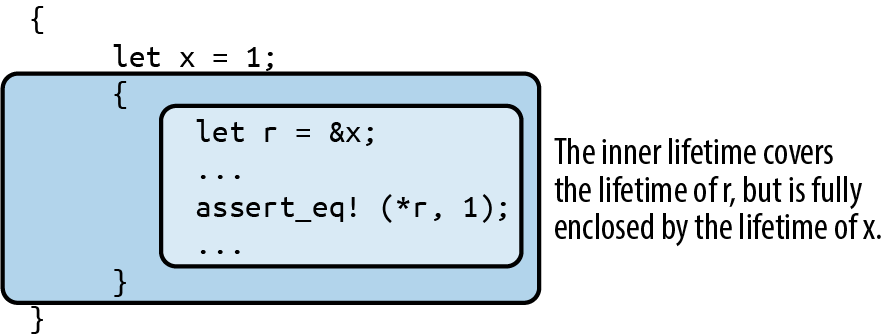

###### Figure 5-6. A reference with a lifetime enclosing `r`’s scope, but within `x`’s scope

These rules apply in a natural way when you borrow a reference to some part of some larger data structure, like an element of a vector:

``` rust
let v = vec![1, 2, 3];
let r = &v[1];
```

Since `v` owns the vector, which owns its elements, the lifetime of `v` must enclose that of the reference type of `&v[1]`. Similarly, if you store a reference in some data structure, its lifetime must enclose that of the data structure. For example, if you build a vector of references, all of them must have lifetimes enclosing that of the variable that owns the vector.

This is the essence of the process Rust uses for all code. Bringing more language features into the picture—e.g., data structures and function calls—introduces new sorts of constraints, but the principle remains the same: first, understand the constraints arising from the way the program uses references; then, find lifetimes that satisfy them. This is not so different from the process C and C++ programmers impose on themselves; the difference is that Rust knows the rules and enforces them.

## Receiving References as Function Arguments

When we pass a reference to a function, how does Rust make sure the function uses it safely? Suppose we have a function `f` that takes a reference and stores it in a global variable. We’ll need to make a few revisions to this, but here’s a first cut:

``` rust
// This code has several problems, and doesn't compile.
static mut STASH: &i32;
fn f(p: &i32) { STASH = p; }
```

Rust’s equivalent of a global variable is called a *static*: it’s a value that’s created when the program starts and lasts until it terminates. (Like any other declaration, Rust’s module system controls where statics are visible, so they’re only “global” in their lifetime, not their visibility.) We cover statics in Chapter 8, but for now we’ll just call out a few rules that the code just shown doesn’t follow:

- Every static must be initialized.

- Mutable statics are inherently not thread-safe (after all, any thread can access a static at any time), and even in single-threaded programs, they can fall prey to other sorts of reentrancy problems. For these reasons, you may access a mutable static only within an `unsafe` block. In this example we’re not concerned with those particular problems, so we’ll just throw in an `unsafe` block and move on.

With those revisions made, we now have the following:

``` rust
static mut STASH: &i32 = &128;
fn f(p: &i32) { // still not good enough
    unsafe {
        STASH = p;
    }
}
```

We’re almost done. To see the remaining problem, we need to write out a few things that Rust is helpfully letting us omit. The signature of `f` as written here is actually shorthand for the following:

``` rust
fn f<'a>(p: &'a i32) { ... }
```

Here, the lifetime `'a` (pronounced “tick A”) is a *lifetime parameter* of `f`. You can read `<'a>` as “for any lifetime `'a`” so when we write `fn f<'a>(p: &'a i32)`, we’re defining a function that takes a reference to an `i32` with any given lifetime `'a`.

Since we must allow `'a` to be any lifetime, things had better work out if it’s the smallest possible lifetime: one just enclosing the call to `f`. This assignment then becomes a point of contention:

``` rust
STASH = p;
```

Since `STASH` lives for the program’s entire execution, the reference type it holds must have a lifetime of the same length; Rust calls this the *`'static` lifetime*. But the lifetime of `p`’s reference is some `'a`, which could be anything, as long as it encloses the call to `f`. So, Rust rejects our code:

``` console
error: explicit lifetime required in the type of `p`
  |
5 |         STASH = p;
  |                 ^ lifetime `'static` required
```

At this point, it’s clear that our function can’t accept just any reference as an argument. But as Rust points out, it ought to be able to accept a reference that has a `'static` lifetime: storing such a reference in `STASH` can’t create a dangling pointer. And indeed, the following code compiles just fine:

``` rust
static mut STASH: &i32 = &10;

fn f(p: &'static i32) {
    unsafe {
        STASH = p;
    }
}
```

This time, `f`’s signature spells out that `p` must be a reference with lifetime `'static`, so there’s no longer any problem storing that in `STASH`. We can only apply `f` to references to other statics, but that’s the only thing that’s certain not to leave `STASH` dangling anyway. So we can write:

``` rust
static WORTH_POINTING_AT: i32 = 1000;
f(&WORTH_POINTING_AT);
```

Since `WORTH_POINTING_AT` is a static, the type of `&WORTH_POINTING_AT` is `&'static i32`, which is safe to pass to `f`.

Take a step back, though, and notice what happened to `f`’s signature as we amended our way to correctness: the original `f(p: &i32)` ended up as `f(p: &'static i32)`. In other words, we were unable to write a function that stashed a reference in a global variable without reflecting that intention in the function’s signature. In Rust, a function’s signature always exposes the body’s behavior.

Conversely, if we do see a function with a signature like `g(p: &i32)` (or with the lifetimes written out, `g<'a>(p: &'a i32)`), we can tell that it *does not* stash its argument `p` anywhere that will outlive the call. There’s no need to look into `g`’s definition; the signature alone tells us what `g` can and can’t do with its argument. This fact ends up being very useful when you’re trying to establish the safety of a call to the function.

## Passing References to Functions

Now that we’ve shown how a function’s signature relates to its body, let’s examine how it relates to the function’s callers. Suppose you have the following code:

``` rust
// This could be written more briefly: fn g(p: &i32),
// but let's write out the lifetimes for now.
fn g<'a>(p: &'a i32) { ... }

let x = 10;
g(&x);
```

From `g`’s signature alone, Rust knows it will not save `p` anywhere that might outlive the call: any lifetime that encloses the call must work for `'a`. So Rust chooses the smallest possible lifetime for `&x`: that of the call to `g`. This meets all constraints: it doesn’t outlive `x`, and it encloses the entire call to `g`. So this code passes muster.

Note that although `g` takes a lifetime parameter `'a`, we didn’t need to mention it when calling `g`. You only need to worry about lifetime parameters when defining functions and types; when using them, Rust infers the lifetimes for you.

What if we tried to pass `&x` to our function `f` from earlier that stores its argument in a static?

``` rust
fn f(p: &'static i32) { ... }

let x = 10;
f(&x);
```

This fails to compile: the reference `&x` must not outlive `x`, but by passing it to `f`, we constrain it to live at least as long as `'static`. There’s no way to satisfy everyone here, so Rust rejects the code.

## Returning References

It’s common for a function to take a reference to some data structure and then return a reference into some part of that structure. For example, here’s a function that returns a reference to the smallest element of a slice:

``` rust
// v should have at least one element.
fn smallest(v: &[i32]) -> &i32 {
    let mut s = &v[0];
    for r in &v[1..] {
        if *r < *s { s = r; }
    }
    s
}
```

We’ve omitted lifetimes from that function’s signature in the usual way. When a function takes a single reference as an argument and returns a single reference, Rust assumes that the two must have the same lifetime. Writing this out explicitly would give us:

``` rust
fn smallest<'a>(v: &'a [i32]) -> &'a i32 { ... }
```

Suppose we call `smallest` like this:

``` rust
let s;
{
    let parabola = [9, 4, 1, 0, 1, 4, 9];
    s = smallest(&parabola);
}
assert_eq!(*s, 0); // bad: points to element of dropped array
```

From `smallest`’s signature, we can see that its argument and return value must have the same lifetime, `'a`. In our call, the argument `&parabola` must not outlive `parabola` itself, yet `smallest`’s return value must live at least as long as `s`. There’s no possible lifetime `'a` that can satisfy both constraints, so Rust rejects the code:

``` console
error: `parabola` does not live long enough
   |
11 |         s = smallest(&parabola);
   |                       -------- borrow occurs here
12 |     }
   |     ^ `parabola` dropped here while still borrowed
13 |     assert_eq!(*s, 0); // bad: points to element of dropped array
   |                 - borrowed value needs to live until here
14 | }
```

Moving `s` so that its lifetime is clearly contained within `parabola`’s fixes the problem:

``` rust
{
    let parabola = [9, 4, 1, 0, 1, 4, 9];
    let s = smallest(&parabola);
    assert_eq!(*s, 0); // fine: parabola still alive
}
```

Lifetimes in function signatures let Rust assess the relationships between the references you pass to the function and those the function returns, and they ensure they’re being used safely.

## Structs Containing References

How does Rust handle references stored in data structures? Here’s the same erroneous program we looked at earlier, except that we’ve put the reference inside a structure:

``` rust
// This does not compile.
struct S {
    r: &i32
}

let s;
{
    let x = 10;
    s = S { r: &x };
}
assert_eq!(*s.r, 10); // bad: reads from dropped `x`
```

The safety constraints Rust places on references can’t magically disappear just because we hid the reference inside a struct. Somehow, those constraints must end up applying to `S` as well. Indeed, Rust is skeptical:

``` console
error: missing lifetime specifier
  |
7 |         r: &i32
  |            ^ expected lifetime parameter
```

Whenever a reference type appears inside another type’s definition, you must write out its lifetime. You can write this:

``` rust
struct S {
    r: &'static i32
}
```

This says that `r` can only refer to `i32` values that will last for the lifetime of the program, which is rather limiting. The alternative is to give the type a lifetime parameter `'a` and use that for `r`:

``` rust
struct S<'a> {
    r: &'a i32
}
```

Now the `S` type has a lifetime, just as reference types do. Each value you create of type `S` gets a fresh lifetime `'a`, which becomes constrained by how you use the value. The lifetime of any reference you store in `r` had better enclose `'a`, and `'a` must outlast the lifetime of wherever you store the `S`.

Turning back to the preceding code, the expression `S { r: &x }` creates a fresh `S` value with some lifetime `'a`. When you store `&x` in the `r` field, you constrain `'a` to lie entirely within `x`’s lifetime.

The assignment `s = S { ... }` stores this `S` in a variable whose lifetime extends to the end of the example, constraining `'a` to outlast the lifetime of `s`. And now Rust has arrived at the same contradictory constraints as before: `'a` must not outlive `x`, yet must live at least as long as `s`. No satisfactory lifetime exists, and Rust rejects the code. Disaster averted!

How does a type with a lifetime parameter behave when placed inside some other type?

``` rust
struct D {
    s: S  // not adequate
}
```

Rust is skeptical, just as it was when we tried placing a reference in `S` without specifying its lifetime:

``` console
error: missing lifetime specifier
  |
8 |     s: S  // not adequate
  |        ^ expected named lifetime parameter
  |
```

We can’t leave off `S`’s lifetime parameter here: Rust needs to know how `D`’s lifetime relates to that of the reference in its `S` in order to apply the same checks to `D` that it does for `S` and plain references.

We could give `s` the `'static` lifetime. This works:

``` rust
struct D {
    s: S<'static>
}
```

With this definition, the `s` field may only borrow values that live for the entire execution of the program. That’s somewhat restrictive, but it does mean that `D` can’t possibly borrow a local variable; there are no special constraints on `D`’s lifetime.

The error message from Rust actually suggests another approach, which is more general:

``` console
help: consider introducing a named lifetime parameter
  |
7 | struct D<'a> {
8 |     s: S<'a>
  |
```

Here, we give `D` its own lifetime parameter and pass that to `S`:

``` rust
struct D<'a> {
    s: S<'a>
}
```

By taking a lifetime parameter `'a` and using it in `s`’s type, we’ve allowed Rust to relate `D` value’s lifetime to that of the reference its `S` holds.

We showed earlier how a function’s signature exposes what it does with the references we pass it. Now we’ve shown something similar about types: a type’s lifetime parameters always reveal whether it contains references with interesting (that is, non-`'static`) lifetimes and what those lifetimes can be.

For example, suppose we have a parsing function that takes a slice of bytes and returns a structure holding the results of the parse:

``` rust
fn parse_record<'i>(input: &'i [u8]) -> Record<'i> { ... }
```

Without looking into the definition of the `Record` type at all, we can tell that, if we receive a `Record` from `parse_record`, whatever references it contains must point into the input buffer we passed in, and nowhere else (except perhaps at `'static` values).

In fact, this exposure of internal behavior is the reason Rust requires types that contain references to take explicit lifetime parameters. There’s no reason Rust couldn’t simply make up a distinct lifetime for each reference in the struct and save you the trouble of writing them out. Early versions of Rust actually behaved this way, but developers found it confusing: it is helpful to know when one value borrows something from another value, especially when working through errors.

It’s not just references and types like `S` that have lifetimes. Every type in Rust has a lifetime, including `i32` and `String`. Most are simply `'static`, meaning that values of those types can live for as long as you like; for example, a `Vec<i32>` is self-contained and needn’t be dropped before any particular variable goes out of scope. But a type like `Vec<&'a i32>` has a lifetime that must be enclosed by `'a`: it must be dropped while its referents are still alive.

## Distinct Lifetime Parameters

Suppose you’ve defined a structure containing two references like this:

``` rust
struct S<'a> {
    x: &'a i32,
    y: &'a i32
}
```

Both references use the same lifetime `'a`. This could be a problem if your code wants to do something like this:

``` rust
let x = 10;
let r;
{
    let y = 20;
    {
        let s = S { x: &x, y: &y };
        r = s.x;
    }
}
println!("{}", r);
```

This code doesn’t create any dangling pointers. The reference to `y` stays in `s`, which goes out of scope before `y` does. The reference to `x` ends up in `r`, which doesn’t outlive `x`.

If you try to compile this, however, Rust will complain that `y` does not live long enough, even though it clearly does. Why is Rust worried? If you work through the code carefully, you can follow its reasoning:

- Both fields of `S` are references with the same lifetime `'a`, so Rust must find a single lifetime that works for both `s.x` and `s.y`.

- We assign `r = s.x`, requiring `'a` to enclose `r`’s lifetime.

- We initialized `s.y` with `&y`, requiring `'a` to be no longer than `y`’s lifetime.

These constraints are impossible to satisfy: no lifetime is shorter than `y`’s scope but longer than `r`’s. Rust balks.

The problem arises because both references in `S` have the same lifetime `'a`. Changing the definition of `S` to let each reference have a distinct lifetime fixes everything:

``` rust
struct S<'a, 'b> {
    x: &'a i32,
    y: &'b i32
}
```

With this definition, `s.x` and `s.y` have independent lifetimes. What we do with `s.x` has no effect on what we store in `s.y`, so it’s easy to satisfy the constraints now: `'a` can simply be `r`’s lifetime, and `'b` can be `s`’s. (`y`’s lifetime would work too for `'b`, but Rust tries to choose the smallest lifetime that works.) Everything ends up fine.

Function signatures can have similar effects. Suppose we have a function like this:

``` rust
fn f<'a>(r: &'a i32, s: &'a i32) -> &'a i32 { r } // perhaps too tight
```

Here, both reference parameters use the same lifetime `'a`, which can unnecessarily constrain the caller in the same way we’ve shown previously. If this is a problem, you can let parameters’ lifetimes vary independently:

``` rust
fn f<'a, 'b>(r: &'a i32, s: &'b i32) -> &'a i32 { r } // looser
```

The downside to this is that adding lifetimes can make types and function signatures harder to read. Your authors tend to try the simplest possible definition first and then loosen restrictions until the code compiles. Since Rust won’t permit the code to run unless it’s safe, simply waiting to be told when there’s a problem is a perfectly acceptable tactic.

## Omitting Lifetime Parameters

We’ve shown plenty of functions so far in this book that return references or take them as parameters, but we’ve usually not needed to spell out which lifetime is which. The lifetimes are there; Rust is just letting us omit them when it’s reasonably obvious what they should be.

In the simplest cases, you may never need to write out lifetimes for your parameters. Rust just assigns a distinct lifetime to each spot that needs one. For example:

``` rust
struct S<'a, 'b> {
    x: &'a i32,
    y: &'b i32
}

fn sum_r_xy(r: &i32, s: S) -> i32 {
    r + s.x + s.y
}
```

This function’s signature is shorthand for:

``` rust
fn sum_r_xy<'a, 'b, 'c>(r: &'a i32, s: S<'b, 'c>) -> i32
```

If you do return references or other types with lifetime parameters, Rust still tries to make the unambiguous cases easy. If there’s only a single lifetime that appears among your function’s parameters, then Rust assumes any lifetimes in your return value must be that one:

``` rust
fn first_third(point: &[i32; 3]) -> (&i32, &i32) {
    (&point[0], &point[2])
}
```

With all the lifetimes written out, the equivalent would be:

``` rust
fn first_third<'a>(point: &'a [i32; 3]) -> (&'a i32, &'a i32)
```

If there are multiple lifetimes among your parameters, then there’s no natural reason to prefer one over the other for the return value, and Rust makes you spell out what’s going on.

If your function is a method on some type and takes its `self` parameter by reference, then that breaks the tie: Rust assumes that `self`’s lifetime is the one to give everything in your return value. (A `self` parameter refers to the value the method is being called on Rust’s equivalent of `this` in C++, Java, or JavaScript, or `self` in Python. We’ll cover methods in “Defining Methods with impl”.)

For example, you can write the following:

``` rust
struct StringTable {
    elements: Vec<String>,
}

impl StringTable {
    fn find_by_prefix(&self, prefix: &str) -> Option<&String> {
        for i in 0 .. self.elements.len() {
            if self.elements[i].starts_with(prefix) {
                return Some(&self.elements[i]);
            }
        }
        None
    }
}
```

The `find_by_prefix` method’s signature is shorthand for:

``` rust
fn find_by_prefix<'a, 'b>(&'a self, prefix: &'b str) -> Option<&'a String>
```

Rust assumes that whatever you’re borrowing, you’re borrowing from `self`.

Again, these are just abbreviations, meant to be helpful without introducing surprises. When they’re not what you want, you can always write the lifetimes out explicitly.

# Sharing Versus Mutation

So far, we’ve discussed how Rust ensures no reference will ever point to a variable that has gone out of scope. But there are other ways to introduce dangling pointers. Here’s an easy case:

``` rust
let v = vec![4, 8, 19, 27, 34, 10];
let r = &v;
let aside = v;  // move vector to aside
r[0];           // bad: uses `v`, which is now uninitialized
```

The assignment to `aside` moves the vector, leaving `v` uninitialized, and turns `r` into a dangling pointer, as shown in Figure 5-7.

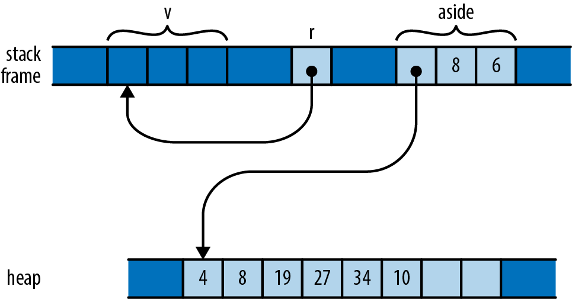

###### Figure 5-7. A reference to a vector that has been moved away

Although `v` stays in scope for `r`’s entire lifetime, the problem here is that `v`’s value gets moved elsewhere, leaving `v` uninitialized while `r` still refers to it. Naturally, Rust catches the error:

``` console
error: cannot move out of `v` because it is borrowed
   |
9  |     let r = &v;
   |              - borrow of `v` occurs here
10 |     let aside = v;  // move vector to aside
   |         ^^^^^ move out of `v` occurs here
```

Throughout its lifetime, a shared reference makes its referent read-only: you may not assign to the referent or move its value elsewhere. In this code, `r`’s lifetime contains the attempt to move the vector, so Rust rejects the program. If you change the program as shown here, there’s no problem:

``` rust
let v = vec![4, 8, 19, 27, 34, 10];
{
    let r = &v;
    r[0];       // ok: vector is still there
}
let aside = v;
```

In this version, `r` goes out of scope earlier, the reference’s lifetime ends before `v` is moved aside, and all is well.

Here’s a different way to wreak havoc. Suppose we have a handy function to extend a vector with the elements of a slice:

``` rust
fn extend(vec: &mut Vec<f64>, slice: &[f64]) {
    for elt in slice {
        vec.push(*elt);
    }
}
```

This is a less flexible (and much less optimized) version of the standard library’s `extend_from_slice` method on vectors. We can use it to build up a vector from slices of other vectors or arrays:

``` rust
let mut wave = Vec::new();
let head = vec![0.0, 1.0];
let tail = [0.0, -1.0];

extend(&mut wave, &head);   // extend wave with another vector
extend(&mut wave, &tail);   // extend wave with an array

assert_eq!(wave, vec![0.0, 1.0, 0.0, -1.0]);
```

So we’ve built up one period of a sine wave here. If we want to add another undulation, can we append the vector to itself?

``` rust
extend(&mut wave, &wave);
assert_eq!(wave, vec![0.0, 1.0, 0.0, -1.0,
                      0.0, 1.0, 0.0, -1.0]);
```

This may look fine on casual inspection. But remember that when we add an element to a vector, if its buffer is full, it must allocate a new buffer with more space. Suppose `wave` starts with space for four elements and so must allocate a larger buffer when `extend` tries to add a fifth. Memory ends up looking like Figure 5-8.

The `extend` function’s `vec` argument borrows `wave` (owned by the caller), which has allocated itself a new buffer with space for eight elements. But `slice` continues to point to the old four-element buffer, which has been dropped.

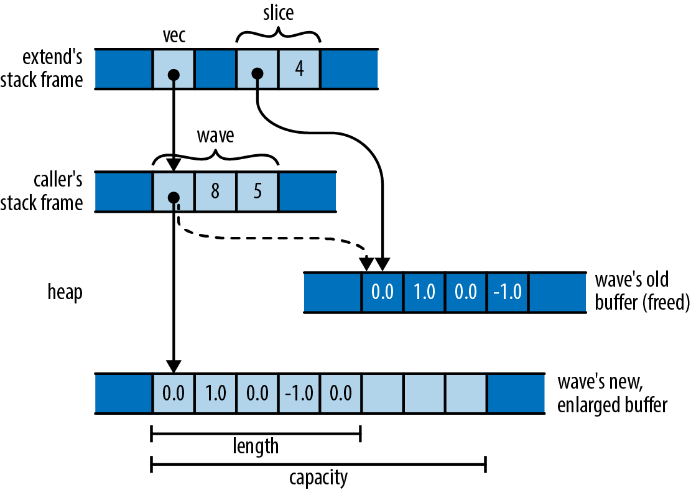

###### Figure 5-8. A slice turned into a dangling pointer by a vector reallocation

This sort of problem isn’t unique to Rust: modifying collections while pointing into them is delicate territory in many languages. In C++, the `std::vector` specification cautions you that “reallocation \[of the vector’s buffer\] invalidates all the references, pointers, and iterators referring to the elements in the sequence.” Similarly, Java says, of modifying a `java.util.Hashtable` object:

> If the Hashtable is structurally modified at any time after the iterator is created, in any way except through the iterator’s own remove method, the iterator will throw a `ConcurrentModificationException`.

What’s especially difficult about this sort of bug is that it doesn’t happen all the time. In testing, your vector might always happen to have enough space, the buffer might never be reallocated, and the problem might never come to light.

Rust, however, reports the problem with our call to `extend` at compile time:

``` console
error: cannot borrow `wave` as immutable because it is also
       borrowed as mutable
  |
9 |     extend(&mut wave, &wave);
  |                 ----   ^^^^- mutable borrow ends here
  |                 |      |
  |                 |      immutable borrow occurs here
  |                 mutable borrow occurs here
```

In other words, we may borrow a mutable reference to the vector, and we may borrow a shared reference to its elements, but those two references’ lifetimes must not overlap. In our case, both references’ lifetimes contain the call to `extend`, so Rust rejects the code.

These errors both stem from violations of Rust’s rules for mutation and sharing:

Shared access is read-only access.  
Values borrowed by shared references are read-only. Across the lifetime of a shared reference, neither its referent, nor anything reachable from that referent, can be changed *by anything*. There exist no live mutable references to anything in that structure, its owner is held read-only, and so on. It’s really frozen.

Mutable access is exclusive access.  
A value borrowed by a mutable reference is reachable exclusively via that reference. Across the lifetime of a mutable reference, there is no other usable path to its referent or to any value reachable from there. The only references whose lifetimes may overlap with a mutable reference are those you borrow from the mutable reference itself.

Rust reported the `extend` example as a violation of the second rule: since we’ve borrowed a mutable reference to `wave`, that mutable reference must be the only way to reach the vector or its elements. The shared reference to the slice is itself another way to reach the elements, violating the second rule.

But Rust could also have treated our bug as a violation of the first rule: since we’ve borrowed a shared reference to `wave`’s elements, the elements and the `Vec` itself are all read-only. You can’t borrow a mutable reference to a read-only value.

Each kind of reference affects what we can do with the values along the owning path to the referent, and the values reachable from the referent (Figure 5-9).

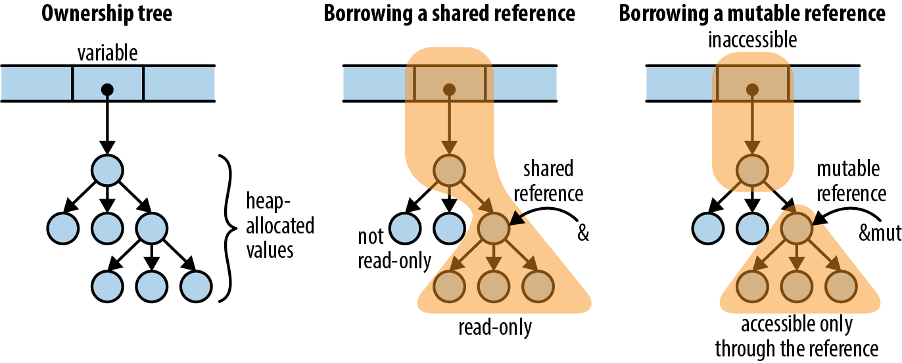

###### Figure 5-9. Borrowing a reference affects what you can do with other values in the same ownership tree

Note that in both cases, the path of ownership leading to the referent cannot be changed for the reference’s lifetime. For a shared borrow, the path is read-only; for a mutable borrow, it’s completely inaccessible. So there’s no way for the program to do anything that will invalidate the reference.

Paring these principles down to the simplest possible examples:

``` rust
let mut x = 10;
let r1 = &x;
let r2 = &x;     // ok: multiple shared borrows permitted
x += 10;         // error: cannot assign to `x` because it is borrowed
let m = &mut x;  // error: cannot borrow `x` as mutable because it is
                 // also borrowed as immutable
println!("{}, {}, {}", r1, r2, m); // the references are used here,
                                   // so their lifetimes must last
                                   // at least this long

let mut y = 20;
let m1 = &mut y;
let m2 = &mut y;  // error: cannot borrow as mutable more than once
let z = y;        // error: cannot use `y` because it was mutably borrowed
println!("{}, {}, {}", m1, m2, z); // references are used here
```

It is OK to reborrow a shared reference from a shared reference:

``` rust
let mut w = (107, 109);
let r = &w;
let r0 = &r.0;         // ok: reborrowing shared as shared
let m1 = &mut r.1;     // error: can't reborrow shared as mutable
println!("{}", r0);    // r0 gets used here
```

You can reborrow from a mutable reference:

``` rust
let mut v = (136, 139);
let m = &mut v;
let m0 = &mut m.0;      // ok: reborrowing mutable from mutable
*m0 = 137;
let r1 = &m.1;          // ok: reborrowing shared from mutable,
                        // and doesn't overlap with m0
v.1;                    // error: access through other paths still forbidden
println!("{}", r1);     // r1 gets used here
```

These restrictions are pretty tight. Turning back to our attempted call `extend(&mut wave, &wave)`, there’s no quick and easy way to fix up the code to work the way we’d like. And Rust applies these rules everywhere: if we borrow, say, a shared reference to a key in a `HashMap`, we can’t borrow a mutable reference to the `HashMap` until the shared reference’s lifetime ends.

But there’s good justification for this: designing collections to support unrestricted, simultaneous iteration and modification is difficult and often precludes simpler, more efficient implementations. Java’s `Hashtable` and C++’s `vector` don’t bother, and neither Python dictionaries nor JavaScript objects define exactly how such access behaves. Other collection types in JavaScript do, but require heavier implementations as a result. C++’s `std::map` promises that inserting new entries doesn’t invalidate pointers to other entries in the map, but by making that promise, the standard precludes more cache-efficient designs like Rust’s `BTreeMap`, which stores multiple entries in each node of the tree.

Here’s another example of the kind of bug these rules catch. Consider the following C++ code, meant to manage a file descriptor. To keep things simple, we’re only going to show a constructor and a copying assignment operator, and we’re going to omit error handling:

``` cpp
struct File {
  int descriptor;

  File(int d) : descriptor(d) { }

  File& operator=(const File &rhs) {
    close(descriptor);
    descriptor = dup(rhs.descriptor);
    return *this;
  }
};
```

The assignment operator is simple enough, but fails badly in a situation like this:

``` cpp
File f(open("foo.txt", ...));
...
f = f;
```

If we assign a `File` to itself, both `rhs` and `*this` are the same object, so `operator=` closes the very file descriptor it’s about to pass to `dup`. We destroy the same resource we were meant to copy.

In Rust, the analogous code would be:

``` rust
struct File {
    descriptor: i32
}

fn new_file(d: i32) -> File {
    File { descriptor: d }
}

fn clone_from(this: &mut File, rhs: &File) {
    close(this.descriptor);
    this.descriptor = dup(rhs.descriptor);
}
```

(This is not idiomatic Rust. There are excellent ways to give Rust types their own constructor functions and methods, which we describe in Chapter 9, but the preceding definitions work for this example.)

If we write the Rust code corresponding to the use of `File`, we get:

``` rust
let mut f = new_file(open("foo.txt", ...));
...
clone_from(&mut f, &f);
```

Rust, of course, refuses to even compile this code:

``` console
error: cannot borrow `f` as immutable because it is also
       borrowed as mutable
   |
18 |     clone_from(&mut f, &f);
   |                     -   ^- mutable borrow ends here
   |                     |   |
   |                     |   immutable borrow occurs here
   |                     mutable borrow occurs here
```

This should look familiar. It turns out that two classic C++ bugs—failure to cope with self-assignment and using invalidated iterators—are the same underlying kind of bug! In both cases, code assumes it is modifying one value while consulting another, when in fact they’re both the same value. If you’ve ever accidentally let the source and destination of a call to `memcpy` or `strcpy` overlap in C or C++, that’s yet another form the bug can take. By requiring mutable access to be exclusive, Rust has fended off a wide class of everyday mistakes.

The immiscibility of shared and mutable references really demonstrates its value when writing concurrent code. A data race is possible only when some value is both mutable and shared between threads—which is exactly what Rust’s reference rules eliminate. A concurrent Rust program that avoids `unsafe` code is free of data races *by construction*. We’ll cover this aspect in more detail when we talk about concurrency in Chapter 19, but in summary, concurrency is much easier to use in Rust than in most other languages.

##### Rust’s Shared References Versus C’s Pointers to const

On first inspection, Rust’s shared references seem to closely resemble C and C++’s pointers to `const` values. However, Rust’s rules for shared references are much stricter. For example, consider the following C code:

``` cpp
int x = 42;             // int variable, not const
const int *p = &x;      // pointer to const int
assert(*p == 42);
x++;                    // change variable directly
assert(*p == 43);       // “constant” referent's value has changed
```

The fact that `p` is a `const int *` means that you can’t modify its referent via `p` itself: `(*p)++` is forbidden. But you can also get at the referent directly as `x`, which is not `const`, and change its value that way. The C family’s `const` keyword has its uses, but constant it is not.

In Rust, a shared reference forbids all modifications to its referent, until its lifetime ends:

``` rust
let mut x = 42;         // non-const i32 variable
let p = &x;             // shared reference to i32
assert_eq!(*p, 42);
x += 1;                 // error: cannot assign to x because it is borrowed
assert_eq!(*p, 42);     // if you take out the assignment, this is true
```

To ensure a value is constant, we need to keep track of all possible paths to that value and make sure that they either don’t permit modification or cannot be used at all. C and C++ pointers are too unrestricted for the compiler to check this. Rust’s references are always tied to a particular lifetime, making it feasible to check them at compile time.

# Taking Arms Against a Sea of Objects

Since the rise of automatic memory management in the 1990s, the default architecture of all programs has been the *sea of objects*, shown in Figure 5-10.

This is what happens if you have garbage collection and you start writing a program without designing anything. We’ve all built systems that look like this.

This architecture has many advantages that don’t show up in the diagram: initial progress is rapid, it’s easy to hack stuff in, and a few years down the road, you’ll have no difficulty justifying a complete rewrite. (Cue AC/DC’s “Highway to Hell.”)

Of course, there are disadvantages too. When everything depends on everything else like this, it’s hard to test, evolve, or even think about any component in isolation.

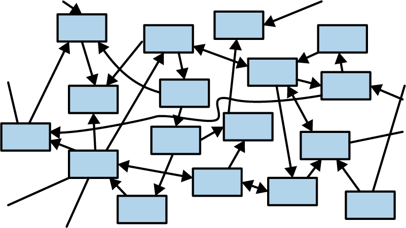

###### Figure 5-10. A sea of objects

One fascinating thing about Rust is that the ownership model puts a speed bump on the highway to hell. It takes a bit of effort to make a cycle in Rust—two values such that each one contains a reference pointing to the other. You have to use a smart pointer type, such as `Rc`, and interior mutability—a topic we haven’t even covered yet. Rust prefers for pointers, ownership, and data flow to pass through the system in one direction, as shown in Figure 5-11.

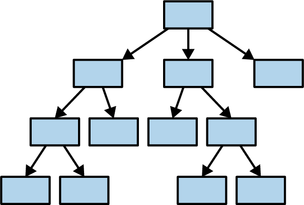

###### Figure 5-11. A tree of values

The reason we bring this up right now is that it would be natural, after reading this chapter, to want to run right out and create a “sea of structs,” all tied together with `Rc` smart pointers, and re-create all the object-oriented antipatterns you’re familiar with. This won’t work for you right away. Rust’s ownership model will give you some trouble. The cure is to do some up-front design and build a better program.

Rust is all about transferring the pain of understanding your program from the future to the present. It works unreasonably well: not only can Rust force you to understand why your program is thread-safe, it can even require some amount of high-level architectural design.