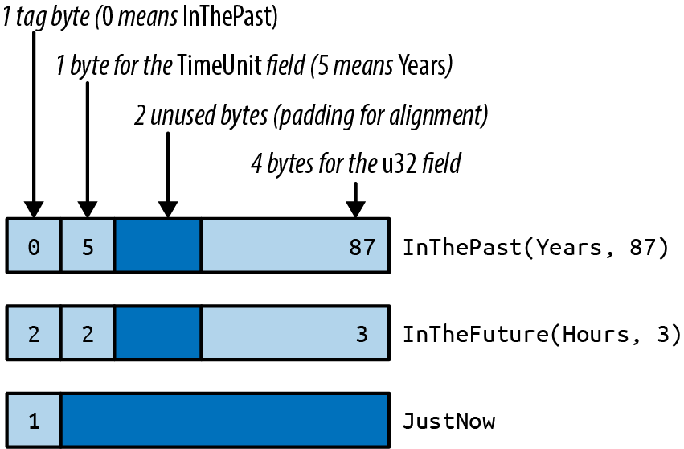
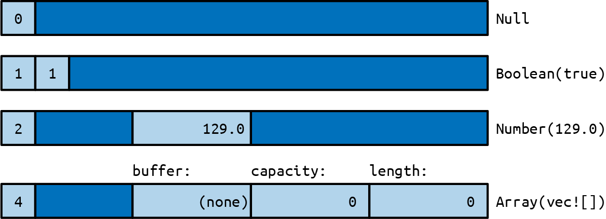
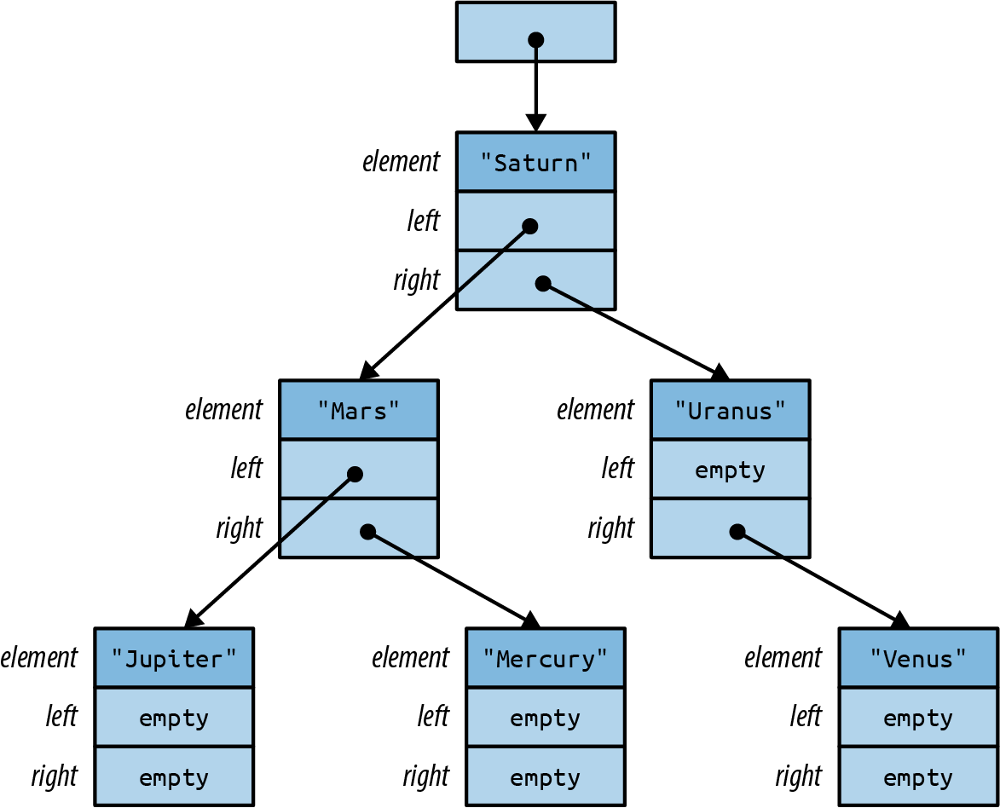
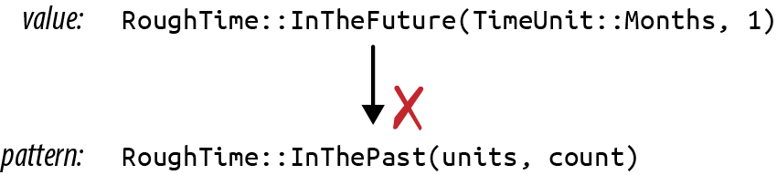
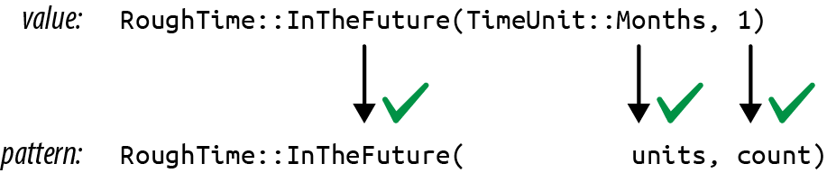
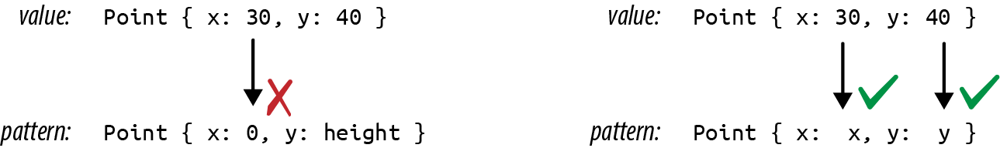
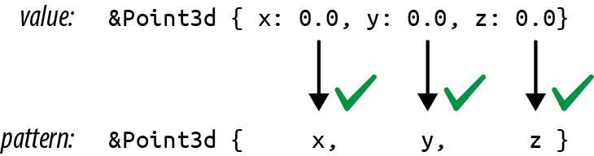

# Chapter 10. Enums and Patterns

> Surprising how much computer stuff makes sense viewed as tragic deprivation of sum types (cf. deprivation of lambdas).
>
> [Graydon Hoare](https://oreil.ly/cyYQc)

The first topic of this chapter is potent, as old as the hills, happy to help you get a lot done in short order (for a price), and known by many names in many cultures. But it’s not the devil. It’s a kind of user-defined data type, long known to ML and Haskell hackers as sum types, discriminated unions, or algebraic data types. In Rust, they are called *enumerations*, or simply *enums*. Unlike the devil, they are quite safe, and the price they ask is no great privation.

C++ and C# have enums; you can use them to define your own type whose values are a set of named constants. For example, you might define a type named `Color` with values `Red`, `Orange`, `Yellow`, and so on. This kind of enum works in Rust, too. But Rust takes enums much further. A Rust enum can also contain data, even data of varying types. For example, Rust’s `Result<String, io::Error>` type is an enum; such a value is either an `Ok` value containing a `String` or an `Err` value containing an `io::Error`. This is beyond what C++ and C# enums can do. It’s more like a C `union`—but unlike unions, Rust enums are type-safe.

Enums are useful whenever a value might be either one thing or another. The “price” of using them is that you must access the data safely, using pattern matching, our topic for the second half of this chapter.

Patterns, too, may be familiar if you’ve used unpacking in Python or destructuring in JavaScript, but Rust takes patterns further. Rust patterns are a little like regular expressions for all your data. They’re used to test whether or not a value has a particular desired shape. They can extract several fields from a struct or tuple into local variables all at once. And like regular expressions, they are concise, typically doing it all in a single line of code.

This chapter starts with the basics of enums, showing how data can be associated with enum variants and how enums are stored in memory. Then we’ll show how Rust’s patterns and `match` statements can concisely specify logic based on enums, structs, arrays, and slices. Patterns can also include references, moves, and `if` conditions, making them even more capable.

# Enums

Simple, C-style enums are straightforward:

``` rust
enum Ordering {
    Less,
    Equal,
    Greater,
}
```

This declares a type `Ordering` with three possible values, called *variants* or *constructors*: `Ordering::Less`, `Ordering::Equal`, and `Ordering::Greater`. This particular enum is part of the standard library, so Rust code can import it, either by itself:

``` rust
use std::cmp::Ordering;

fn compare(n: i32, m: i32) -> Ordering {
    if n < m {
        Ordering::Less
    } else if n > m {
        Ordering::Greater
    } else {
        Ordering::Equal
    }
}
```

or with all its constructors:

``` rust
use std::cmp::Ordering::{self, *};    // `*` to import all children

fn compare(n: i32, m: i32) -> Ordering {
    if n < m {
        Less
    } else if n > m {
        Greater
    } else {
        Equal
    }
}
```

After importing the constructors, we can write `Less` instead of `Ordering::Less`, and so on, but because this is less explicit, it’s generally considered better style *not* to import them except when it makes your code much more readable.

To import the constructors of an enum declared in the current module, use a `self` import:

``` rust
enum Pet {
    Orca,
    Giraffe,
    ...
}

use self::Pet::*;
```

In memory, values of C-style enums are stored as integers. Occasionally it’s useful to tell Rust which integers to use:

``` rust
enum HttpStatus {
    Ok = 200,
    NotModified = 304,
    NotFound = 404,
    ...
}
```

Otherwise Rust will assign the numbers for you, starting at 0.

By default, Rust stores C-style enums using the smallest built-in integer type that can accommodate them. Most fit in a single byte:

``` rust
use std::mem::size_of;
assert_eq!(size_of::<Ordering>(), 1);
assert_eq!(size_of::<HttpStatus>(), 2);  // 404 doesn't fit in a u8
```

You can override Rust’s choice of in-memory representation by adding a `#[repr]` attribute to the enum. For details, see “Finding Common Data Representations”.

Casting a C-style enum to an integer is allowed:

``` rust
assert_eq!(HttpStatus::Ok as i32, 200);
```

However, casting in the other direction, from the integer to the enum, is not. Unlike C and C++, Rust guarantees that an enum value is only ever one of the values spelled out in the `enum` declaration. An unchecked cast from an integer type to an enum type could break this guarantee, so it’s not allowed. You can either write your own checked conversion:

``` rust
fn http_status_from_u32(n: u32) -> Option<HttpStatus> {
    match n {
        200 => Some(HttpStatus::Ok),
        304 => Some(HttpStatus::NotModified),
        404 => Some(HttpStatus::NotFound),
        ...
        _ => None,
    }
}
```

or use [the `enum_primitive` crate](https://oreil.ly/8BGLH). It contains a macro that autogenerates this kind of conversion code for you.

As with structs, the compiler will implement features like the `==` operator for you, but you have to ask:

``` rust
#[derive(Copy, Clone, Debug, PartialEq, Eq)]
enum TimeUnit {
    Seconds, Minutes, Hours, Days, Months, Years,
}
```

Enums can have methods, just like structs:

``` rust
impl TimeUnit {
    /// Return the plural noun for this time unit.
    fn plural(self) -> &'static str {
        match self {
            TimeUnit::Seconds => "seconds",
            TimeUnit::Minutes => "minutes",
            TimeUnit::Hours => "hours",
            TimeUnit::Days => "days",
            TimeUnit::Months => "months",
            TimeUnit::Years => "years",
        }
    }

    /// Return the singular noun for this time unit.
    fn singular(self) -> &'static str {
        self.plural().trim_end_matches('s')
    }
}
```

So much for C-style enums. The more interesting sort of Rust enum is the kind whose variants hold data. We’ll show how these are stored in memory, how to make them generic by adding type parameters, and how to build complex data structures from enums.

## Enums with Data

Some programs always need to display full dates and times down to the millisecond, but for most applications, it’s more user-friendly to use a rough approximation, like “two months ago.” We can write an enum to help with that, using the enum defined earlier:

``` rust
/// A timestamp that has been deliberately rounded off, so our program
/// says "6 months ago" instead of "February 9, 2016, at 9:49 AM".
#[derive(Copy, Clone, Debug, PartialEq)]
enum RoughTime {
    InThePast(TimeUnit, u32),
    JustNow,
    InTheFuture(TimeUnit, u32),
}
```

Two of the variants in this enum, `InThePast` and `InTheFuture`, take arguments. These are called *tuple variants*. Like tuple structs, these constructors are functions that create new `RoughTime` values:

``` rust
let four_score_and_seven_years_ago =
    RoughTime::InThePast(TimeUnit::Years, 4 * 20 + 7);

let three_hours_from_now =
    RoughTime::InTheFuture(TimeUnit::Hours, 3);
```

Enums can also have *struct variants*, which contain named fields, just like ordinary structs:

``` rust
enum Shape {
    Sphere { center: Point3d, radius: f32 },
    Cuboid { corner1: Point3d, corner2: Point3d },
}

let unit_sphere = Shape::Sphere {
    center: ORIGIN,
    radius: 1.0,
};
```

In all, Rust has three kinds of enum variant, echoing the three kinds of struct we showed in the previous chapter. Variants with no data correspond to unit-like structs. Tuple variants look and function just like tuple structs. Struct variants have curly braces and named fields. A single enum can have variants of all three kinds:

``` rust
enum RelationshipStatus {
    Single,
    InARelationship,
    ItsComplicated(Option<String>),
    ItsExtremelyComplicated {
        car: DifferentialEquation,
        cdr: EarlyModernistPoem,
    },
}
```

All constructors and fields of an enum share the same visibility as the enum itself.

## Enums in Memory

In memory, enums with data are stored as a small integer *tag*, plus enough memory to hold all the fields of the largest variant. The tag field is for Rust’s internal use. It tells which constructor created the value and therefore which fields it has.

As of Rust 1.56, `RoughTime` fits in 8 bytes, as shown in Figure 10-1.



###### Figure 10-1. `RoughTime` values in memory

Rust makes no promises about enum layout, however, in order to leave the door open for future optimizations. In some cases, it would be possible to pack an enum more efficiently than the figure suggests. For instance, some generic structs can be stored without a tag at all, as we’ll see later.

## Rich Data Structures Using Enums

Enums are also useful for quickly implementing tree-like data structures. For example, suppose a Rust program needs to work with arbitrary JSON data. In memory, any JSON document can be represented as a value of this Rust type:

``` rust
use std::collections::HashMap;

enum Json {
    Null,
    Boolean(bool),
    Number(f64),
    String(String),
    Array(Vec<Json>),
    Object(Box<HashMap<String, Json>>),
}
```

The explanation of this data structure in English can’t improve much upon the Rust code. The JSON standard specifies the various data types that can appear in a JSON document: `null`, Boolean values, numbers, strings, arrays of JSON values, and objects with string keys and JSON values. The `Json` enum simply spells out these types.

This is not a hypothetical example. A very similar enum can be found in `serde_json`, a serialization library for Rust structs that is one of the most-downloaded crates on crates.io.

The `Box` around the `HashMap` that represents an `Object` serves only to make all `Json` values more compact. In memory, values of type `Json` take up four machine words. `String` and `Vec` values are three words, and Rust adds a tag byte. `Null` and `Boolean` values don’t have enough data in them to use up all that space, but all `Json` values must be the same size. The extra space goes unused. Figure 10-2 shows some examples of how `Json` values actually look in memory.

A `HashMap` is larger still. If we had to leave room for it in every `Json` value, they would be quite large, eight words or so. But a `Box<HashMap>` is a single word: it’s just a pointer to heap-allocated data. We could make `Json` even more compact by boxing more fields.



###### Figure 10-2. `Json` values in memory

What’s remarkable here is how easy it was to set this up. In C++, one might write a class for this:

``` cpp
class JSON {
private:
    enum Tag {
        Null, Boolean, Number, String, Array, Object
    };
    union Data {
        bool boolean;
        double number;
        shared_ptr<string> str;
        shared_ptr<vector<JSON>> array;
        shared_ptr<unordered_map<string, JSON>> object;

        Data() {}
        ~Data() {}
        ...
    };

    Tag tag;
    Data data;

public:
    bool is_null() const { return tag == Null; }
    bool is_boolean() const { return tag == Boolean; }
    bool get_boolean() const {
        assert(is_boolean());
        return data.boolean;
    }
    void set_boolean(bool value) {
        this->~JSON();  // clean up string/array/object value
        tag = Boolean;
        data.boolean = value;
    }
    ...
};
```

At 30 lines of code, we have barely begun the work. This class will need constructors, a destructor, and an assignment operator. An alternative would be to create a class hierarchy with a base class `JSON` and subclasses `JSONBoolean`, `JSONString`, and so on. Either way, when it’s done, our C++ JSON library will have more than a dozen methods. It will take a bit of reading for other programmers to pick it up and use it. The entire Rust enum is eight lines of code.

## Generic Enums

Enums can be generic. Two examples from the standard library are among the most-used data types in the language:

``` rust
enum Option<T> {
    None,
    Some(T),
}

enum Result<T, E> {
    Ok(T),
    Err(E),
}
```

These types are familiar enough by now, and the syntax for generic enums is the same as for generic structs.

One unobvious detail is that Rust can eliminate the tag field of `Option<T>` when the type `T` is a reference, `Box`, or other smart pointer type. Since none of those pointer types is allowed to be zero, Rust can represent `Option<Box<i32>>`, say, as a single machine word: 0 for `None` and nonzero for `Some` pointer. This makes such `Option` types close analogues to C or C++ pointer values that could be null. The difference is that Rust’s type system requires you to check that an `Option` is `Some` before you can use its contents. This effectively eliminates null pointer dereferences.

Generic data structures can be built with just a few lines of code:

``` rust
// An ordered collection of `T`s.
enum BinaryTree<T> {
    Empty,
    NonEmpty(Box<TreeNode<T>>),
}

// A part of a BinaryTree.
struct TreeNode<T> {
    element: T,
    left: BinaryTree<T>,
    right: BinaryTree<T>,
}
```

These few lines of code define a `BinaryTree` type that can store any number of values of type `T`.

A great deal of information is packed into these two definitions, so we will take the time to translate the code word for word into English. Each `BinaryTree` value is either `Empty` or `NonEmpty`. If it’s `Empty`, then it contains no data at all. If `NonEmpty`, then it has a `Box`, a pointer to a heap-allocated `TreeNode`.

Each `TreeNode` value contains one actual element, as well as two more `BinaryTree` values. This means a tree can contain subtrees, and thus a `NonEmpty` tree can have any number of descendants.

A sketch of a value of type `BinaryTree<&str>` is shown in Figure 10-3. As with `Option<Box<T>>`, Rust eliminates the tag field, so a `BinaryTree` value is just one machine word.

Building any particular node in this tree is straightforward:

``` rust
use self::BinaryTree::*;
let jupiter_tree = NonEmpty(Box::new(TreeNode {
    element: "Jupiter",
    left: Empty,
    right: Empty,
}));
```

Larger trees can be built from smaller ones:

``` rust
let mars_tree = NonEmpty(Box::new(TreeNode {
    element: "Mars",
    left: jupiter_tree,
    right: mercury_tree,
}));
```

Naturally, this assignment transfers ownership of `jupiter_node` and `mercury_node` to their new parent node.



###### Figure 10-3. A `BinaryTree` containing six strings

The remaining parts of the tree follow the same patterns. The root node is no different from the others:

``` rust
let tree = NonEmpty(Box::new(TreeNode {
    element: "Saturn",
    left: mars_tree,
    right: uranus_tree,
}));
```

Later in this chapter, we’ll show how to implement an `add` method on the `BinaryTree` type so that we can instead write:

``` rust
let mut tree = BinaryTree::Empty;
for planet in planets {
    tree.add(planet);
}
```

No matter what language you’re coming from, creating data structures like `BinaryTree` in Rust will likely take some practice. It won’t be obvious at first where to put the `Box`es. One way to find a design that will work is to draw a picture like Figure 10-3 that shows how you want things laid out in memory. Then work backward from the picture to the code. Each collection of rectangles is a struct or tuple; each arrow is a `Box` or other smart pointer. Figuring out the type of each field is a bit of a puzzle, but a manageable one. The reward for solving the puzzle is control over your program’s memory usage.

Now comes the “price” we mentioned in the introduction. The tag field of an enum costs a little memory, up to eight bytes in the worst case, but that is usually negligible. The real downside to enums (if it can be called that) is that Rust code cannot throw caution to the wind and try to access fields regardless of whether they are actually present in the value:

``` rust
let r = shape.radius;  // error: no field `radius` on type `Shape`
```

The only way to access the data in an enum is the safe way: using patterns.

# Patterns

Recall the definition of our `RoughTime` type from earlier in this chapter:

``` rust
enum RoughTime {
    InThePast(TimeUnit, u32),
    JustNow,
    InTheFuture(TimeUnit, u32),
}
```

Suppose you have a `RoughTime` value and you’d like to display it on a web page. You need to access the `TimeUnit` and `u32` fields inside the value. Rust doesn’t let you access them directly, by writing `rough_time.0` and `rough_time.1`, because after all, the value might be `RoughTime::JustNow`, which has no fields. But then, how can you get the data out?

You need a `match` expression:

``` rust
 1  fn rough_time_to_english(rt: RoughTime) -> String {
 2      match rt {
 3          RoughTime::InThePast(units, count) =>
 4              format!("{} {} ago", count, units.plural()),
 5          RoughTime::JustNow =>
 6              format!("just now"),
 7          RoughTime::InTheFuture(units, count) =>
 8              format!("{} {} from now", count, units.plural()),
 9      }
10  }
```

`match` performs pattern matching; in this example, the *patterns* are the parts that appear before the `=>` symbol on lines 3, 5, and 7. Patterns that match `RoughTime` values look just like the expressions used to create `RoughTime` values. This is no coincidence. Expressions *produce* values; patterns *consume* values. The two use a lot of the same syntax.

Let’s step through what happens when this `match` expression runs. Suppose `rt` is the value `RoughTime::InTheFuture(TimeUnit::Months, 1)`. Rust first tries to match this value against the pattern on line 3. As you can see in Figure 10-4, it doesn’t match.



###### Figure 10-4. A `RoughTime` value and pattern that do not match

Pattern matching an enum, struct, or tuple works as though Rust is doing a simple left-to-right scan, checking each component of the pattern to see if the value matches it. If it doesn’t, Rust moves on to the next pattern.

The patterns on lines 3 and 5 fail to match. But the pattern on line 7 succeeds (Figure 10-5).



###### Figure 10-5. A successful match

When a pattern contains simple identifiers like `units` and `count`, those become local variables in the code following the pattern. Whatever is present in the value is copied or moved into the new variables. Rust stores `TimeUnit::Months` in `units` and `1` in `count`, runs line 8, and returns the string `"1 months from now"`.

That output has a minor grammatical issue, which can be fixed by adding another arm to the `match`:

``` rust
RoughTime::InTheFuture(unit, 1) =>
    format!("a {} from now", unit.singular()),
```

This arm matches only if the `count` field is exactly 1. Note that this new code must be added before line 7. If we add it at the end, Rust will never get to it, because the pattern on line 7 matches all `InTheFuture` values. The Rust compiler will warn about an “unreachable pattern” if you make this kind of mistake.

Even with the new code, `RoughTime::InTheFuture(TimeUnit::Hours, 1)` still presents a problem: the result `"a hour from now"` is not quite right. Such is the English language. This too can be fixed by adding another arm to the `match`.

As this example shows, pattern matching works hand in hand with enums and can even test the data they contain, making `match` a powerful, flexible replacement for C’s `switch` statement. So far, we’ve only seen patterns that match enum values. There’s more to it than that. Rust patterns are their own little language, summarized in Table 10-1. We’ll spend most of the rest of the chapter on the features shown in this table.

**Table 10-1. Patterns**

| Pattern type            | Example                                                                              | Notes                                                                       |
|-------------------------|--------------------------------------------------------------------------------------|-----------------------------------------------------------------------------|
| Literal                 | 100 "name"                                                                           | Matches an exact value; the name of a const is also allowed                 |
| Range                   | 0 ..= 100 'a' ..= 'k' 256..                                                          | Matches any value in range, including the end value if given                |
| Wildcard                | `_`                                                                                  | Matches any value and ignores it                                            |
| Variable                | name mut count                                                                       | Like \_ but moves or copies the value into a new local variable             |
| ref variable            | ref field ref mut field                                                              | Borrows a reference to the matched value instead of moving or copying it    |
| Binding with subpattern | val @ 0 ..= 99 ref circle @ Shape::Circle { .. }                                     | Matches the pattern to the right of @ , using the variable name to the left |
| Enum pattern            | Some(value) None Pet::Orca                                                           |                                                                             |
| Tuple pattern           | (key, value) (r, g, b)                                                               |                                                                             |
| Array pattern           | \[a, b, c, d, e, f, g\] \[heading, carom, correction\]                               |                                                                             |
| Slice pattern           | \[first, second\] \[first, \_, third\] \[first, .., nth\] \[\]                       |                                                                             |
| Struct pattern          | Color(r, g, b) Point { x, y } Card { suit: Clubs, rank: n } Account { id, name, .. } |                                                                             |
| Reference               | &value &(k, v)                                                                       | Matches only reference values                                               |
| Or patterns             | 'a' \| 'A' Some("left" \| "right")                                                   |                                                                             |
| Guard expression        | `x if x * x <= r2`                                                                   | In match only (not valid in let , etc.)                                     |

## Literals, Variables, and Wildcards in Patterns

So far, we’ve shown `match` expressions working with enums. Other types can be matched too. When you need something like a C `switch` statement, use `match` with an integer value. Integer literals like `0` and `1` can serve as patterns:

``` rust
match meadow.count_rabbits() {
    0 => {}  // nothing to say
    1 => println!("A rabbit is nosing around in the clover."),
    n => println!("There are {} rabbits hopping about in the meadow", n),
}
```

The pattern `0` matches if there are no rabbits in the meadow. `1` matches if there is just one. If there are two or more rabbits, we reach the third pattern, `n`. This pattern is just a variable name. It can match any value, and the matched value is moved or copied into a new local variable. So in this case, the value of `meadow.count_rabbits()` is stored in a new local variable `n`, which we then print.

Other literals can be used as patterns too, including Booleans, characters, and even strings:

``` rust
let calendar = match settings.get_string("calendar") {
    "gregorian" => Calendar::Gregorian,
    "chinese" => Calendar::Chinese,
    "ethiopian" => Calendar::Ethiopian,
    other => return parse_error("calendar", other),
};
```

In this example, `other` serves as a catchall pattern like `n` in the previous example. These patterns play the same role as a `default` case in a `switch` statement, matching values that don’t match any of the other patterns.

If you need a catchall pattern, but you don’t care about the matched value, you can use a single underscore `_` as a pattern, the *wildcard pattern*:

``` rust
let caption = match photo.tagged_pet() {
    Pet::Tyrannosaur => "RRRAAAAAHHHHHH",
    Pet::Samoyed => "*dog thoughts*",
    _ => "I'm cute, love me", // generic caption, works for any pet
};
```

The wildcard pattern matches any value, but without storing it anywhere. Since Rust requires every `match` expression to handle all possible values, a wildcard is often required at the end. Even if you’re very sure the remaining cases can’t occur, you must at least add a fallback arm, perhaps one that panics:

``` rust
// There are many Shapes, but we only support "selecting"
// either some text, or everything in a rectangular area.
// You can't select an ellipse or trapezoid.
match document.selection() {
    Shape::TextSpan(start, end) => paint_text_selection(start, end),
    Shape::Rectangle(rect) => paint_rect_selection(rect),
    _ => panic!("unexpected selection type"),
}
```

## Tuple and Struct Patterns

Tuple patterns match tuples. They’re useful any time you want to get multiple pieces of data involved in a single `match`:

``` rust
fn describe_point(x: i32, y: i32) -> &'static str {
    use std::cmp::Ordering::*;
    match (x.cmp(&0), y.cmp(&0)) {
        (Equal, Equal) => "at the origin",
        (_, Equal) => "on the x axis",
        (Equal, _) => "on the y axis",
        (Greater, Greater) => "in the first quadrant",
        (Less, Greater) => "in the second quadrant",
        _ => "somewhere else",
    }
}
```

Struct patterns use curly braces, just like struct expressions. They contain a subpattern for each field:

``` rust
match balloon.location {
    Point { x: 0, y: height } =>
        println!("straight up {} meters", height),
    Point { x: x, y: y } =>
        println!("at ({}m, {}m)", x, y),
}
```

In this example, if the first arm matches, then `balloon.location.y` is stored in the new local variable `height`.

Suppose `balloon.location` is `Point { x: 30, y: 40 }`. As always, Rust checks each component of each pattern in turn Figure 10-6.



###### Figure 10-6. Pattern matching with structs

The second arm matches, so the output would be `at (30m, 40m)`.

Patterns like `Point { x: x, y: y }` are common when matching structs, and the redundant names are visual clutter, so Rust has a shorthand for this: `Point {x, y}`. The meaning is the same. This pattern still stores a point’s `x` field in a new local `x` and its `y` field in a new local `y`.

Even with the shorthand, it is cumbersome to match a large struct when we only care about a few fields:

``` rust
match get_account(id) {
    ...
    Some(Account {
            name, language,  // <--- the 2 things we care about
            id: _, status: _, address: _, birthday: _, eye_color: _,
            pet: _, security_question: _, hashed_innermost_secret: _,
            is_adamantium_preferred_customer: _, }) =>
        language.show_custom_greeting(name),
}
```

To avoid this, use `..` to tell Rust you don’t care about any of the other fields:

``` rust
Some(Account { name, language, .. }) =>
    language.show_custom_greeting(name),
```

## Array and Slice Patterns

Array patterns match arrays. They’re often used to filter out some special-case values and are useful any time you’re working with arrays whose values have a different meaning based on position.

For example, when converting hue, saturation, and lightness (HSL) color values to red, green, blue (RGB) color values, colors with zero lightness or full lightness are just black or white. We could use a `match` expression to deal with those cases simply.

``` rust
fn hsl_to_rgb(hsl: [u8; 3]) -> [u8; 3] {
    match hsl {
        [_, _, 0] => [0, 0, 0],
        [_, _, 255] => [255, 255, 255],
        ...
    }
}
```

Slice patterns are similar, but unlike arrays, slices have variable lengths, so slice patters match not only on values but also on length. `..` in a slice pattern matches any number of elements:

``` rust
fn greet_people(names: &[&str]) {
    match names {
        [] => { println!("Hello, nobody.") },
        [a] => { println!("Hello, {}.", a) },
        [a, b] => { println!("Hello, {} and {}.", a, b) },
        [a, .., b] => { println!("Hello, everyone from {} to {}.", a, b) }
    }
}
```

## Reference Patterns

Rust patterns support two features for working with references. `ref` patterns borrow parts of a matched value. `&` patterns match references. We’ll cover `ref` patterns first.

Matching a noncopyable value moves the value. Continuing with the account example, this code would be invalid:

``` rust
match account {
    Account { name, language, .. } => {
        ui.greet(&name, &language);
        ui.show_settings(&account);  // error: borrow of moved value: `account`
    }
}
```

Here, the fields `account.name` and `account.language` are moved into local variables `name` and `language`. The rest of `account` is dropped. That’s why we can’t borrow a reference to it afterward.

If `name` and `language` were both copyable values, Rust would copy the fields instead of moving them, and this code would be fine. But suppose these are `String`s. What can we do?

We need a kind of pattern that *borrows* matched values instead of moving them. The `ref` keyword does just that:

``` rust
match account {
    Account { ref name, ref language, .. } => {
        ui.greet(name, language);
        ui.show_settings(&account);  // ok
    }
}
```

Now the local variables `name` and `language` are references to the corresponding fields in `account`. Since `account` is only being borrowed, not consumed, it’s OK to continue calling methods on it.

You can use `ref mut` to borrow `mut` references:

``` rust
match line_result {
    Err(ref err) => log_error(err),  // `err` is &Error (shared ref)
    Ok(ref mut line) => {            // `line` is &mut String (mut ref)
        trim_comments(line);         // modify the String in place
        handle(line);
    }
}
```

The pattern `Ok(ref mut line)` matches any success result and borrows a `mut` reference to the success value stored inside it.

The opposite kind of reference pattern is the `&` pattern. A pattern starting with `&` matches a reference:

``` rust
match sphere.center() {
    &Point3d { x, y, z } => ...
}
```

In this example, suppose `sphere.center()` returns a reference to a private field of `sphere`, a common pattern in Rust. The value returned is the address of a `Point3d`. If the center is at the origin, then `sphere.center()` returns `&Point3d { x: 0.0, y: 0.0, z: 0.0 }`.

Pattern matching proceeds as shown in Figure 10-7.



###### Figure 10-7. Pattern matching with references

This is a bit tricky because Rust is following a pointer here, an action we usually associate with the `*` operator, not the `&` operator. The thing to remember is that patterns and expressions are natural opposites. The expression `(x, y)` makes two values into a new tuple, but the pattern `(x, y)` does the opposite: it matches a tuple and breaks out the two values. It’s the same with `&`. In an expression, `&` creates a reference. In a pattern, `&` matches a reference.

Matching a reference follows all the rules we’ve come to expect. Lifetimes are enforced. You can’t get `mut` access via a shared reference. And you can’t move a value out of a reference, even a `mut` reference. When we match `&Point3d { x, y, z }`, the variables `x`, `y`, and `z` receive copies of the coordinates, leaving the original `Point3d` value intact. It works because those fields are copyable. If we try the same thing on a struct with noncopyable fields, we’ll get an error:

``` rust
match friend.borrow_car() {
    Some(&Car { engine, .. }) =>  // error: can't move out of borrow
        ...
    None => {}
}
```

Scrapping a borrowed car for parts is not nice, and Rust won’t stand for it. You can use a `ref` pattern to borrow a reference to a part. You just don’t own it:

``` rust
    Some(&Car { ref engine, .. }) =>  // ok, engine is a reference
```

Let’s look at one more example of an `&` pattern. Suppose we have an iterator `chars` over the characters in a string, and it has a method `chars.peek()` that returns an `Option<&char>`: a reference to the next character, if any. (Peekable iterators do in fact return an `Option<&ItemType>`, as we’ll see in Chapter 15.)

A program can use an `&` pattern to get the pointed-to character:

``` rust
match chars.peek() {
    Some(&c) => println!("coming up: {:?}", c),
    None => println!("end of chars"),
}
```

## Match Guards

Sometimes a match arm has additional conditions that must be met before it can be considered a match. Suppose we’re implementing a board game with hexagonal spaces, and the player just clicked to move a piece. To confirm that the click was valid, we might try something like this:

``` rust
fn check_move(current_hex: Hex, click: Point) -> game::Result<Hex> {
    match point_to_hex(click) {
        None =>
            Err("That's not a game space."),
        Some(current_hex) =>  // try to match if user clicked the current_hex
                              // (it doesn't work: see explanation below)
            Err("You are already there! You must click somewhere else."),
        Some(other_hex) =>
            Ok(other_hex)
    }
}
```

This fails because identifiers in patterns introduce *new* variables. The pattern `Some(current_hex)` here creates a new local variable `current_hex`, shadowing the argument `current_hex`. Rust emits several warnings about this code—in particular, the last arm of the `match` is unreachable. One way to fix this is simply to use an `if` expression in the match arm:

``` rust
match point_to_hex(click) {
    None => Err("That's not a game space."),
    Some(hex) => {
        if hex == current_hex {
            Err("You are already there! You must click somewhere else")
        } else {
            Ok(hex)
        }
    }
}
```

But Rust also provides *match guards*, extra conditions that must be true in order for a match arm to apply, written as `if CONDITION`, between the pattern and the arm’s `=>` token:

``` rust
match point_to_hex(click) {
    None => Err("That's not a game space."),
    Some(hex) if hex == current_hex =>
        Err("You are already there! You must click somewhere else"),
    Some(hex) => Ok(hex)
}
```

If the pattern matches, but the condition is false, matching continues with the next arm.

## Matching Multiple Possibilities

A pattern of the form `pat1`` | ``pat2` matches if either subpattern matches:

``` rust
let at_end = match chars.peek() {
    Some(&'\r' | &'\n') | None => true,
    _ => false,
};
```

In an expression, `|` is the bitwise OR operator, but here it works more like the `|` symbol in a regular expression. `at_end` is set to `true` if `chars.peek()` is `None`, or a `Some` holding a carriage return or line feed.

Use `..=` to match a whole range of values. Range patterns include the begin and end values, so `'0' ..= '9'` matches all the ASCII digits:

``` rust
match next_char {
    '0'..='9' => self.read_number(),
    'a'..='z' | 'A'..='Z' => self.read_word(),
    ' ' | '\t' | '\n' => self.skip_whitespace(),
    _ => self.handle_punctuation(),
}
```

Rust also permits range patterns like `x..`, which match any value from `x` up to the maximum value of the type. However, the other varieties of end-exclusive ranges, like `0..100` or `..100`, and unbounded ranges like `..` aren’t allowed in patterns yet.

## Binding with @ Patterns

Finally, `x`` @ ``pattern` matches exactly like the given `pattern`, but on success, instead of creating variables for parts of the matched value, it creates a single variable `x` and moves or copies the whole value into it. For example, say you have this code:

``` rust
match self.get_selection() {
    Shape::Rect(top_left, bottom_right) => {
        optimized_paint(&Shape::Rect(top_left, bottom_right))
    }
    other_shape => {
        paint_outline(other_shape.get_outline())
    }
}
```

Note that the first case unpacks a `Shape::Rect` value, only to rebuild an identical `Shape::Rect` value on the next line. This can be rewritten to use an `@` pattern:

``` rust
    rect @ Shape::Rect(..) => {
        optimized_paint(&rect)
    }
```

`@` patterns are also useful with ranges:

``` rust
match chars.next() {
    Some(digit @ '0'..='9') => read_number(digit, chars),
    ...
},
```

## Where Patterns Are Allowed

Although patterns are most prominent in `match` expressions, they are also allowed in several other places, typically in place of an identifier. The meaning is always the same: instead of just storing a value in a single variable, Rust uses pattern matching to take the value apart.

This means patterns can be used to...

``` rust
// ...unpack a struct into three new local variables
let Track { album, track_number, title, .. } = song;

// ...unpack a function argument that's a tuple
fn distance_to((x, y): (f64, f64)) -> f64 { ... }

// ...iterate over keys and values of a HashMap
for (id, document) in &cache_map {
    println!("Document #{}: {}", id, document.title);
}

// ...automatically dereference an argument to a closure
// (handy because sometimes other code passes you a reference
// when you'd rather have a copy)
let sum = numbers.fold(0, |a, &num| a + num);
```

Each of these saves two or three lines of boilerplate code. The same concept exists in some other languages: in JavaScript, it’s called *destructuring*, while in Python, it’s *unpacking*.

Note that in all four examples, we use patterns that are guaranteed to match. The pattern `Point3d { x, y, z }` matches every possible value of the `Point3d` struct type, `(x, y)` matches any `(f64, f64)` pair, and so on. Patterns that always match are special in Rust. They’re called *irrefutable patterns*, and they’re the only patterns allowed in the four places shown here (after `let`, in function arguments, after `for`, and in closure arguments).

A *refutable pattern* is one that might not match, like `Ok(x)`, which doesn’t match an error result, or `'0' ..= '9'`, which doesn’t match the character `'Q'`. Refutable patterns can be used in `match` arms, because `match` is designed for them: if one pattern fails to match, it’s clear what happens next. The four preceding examples are places in Rust programs where a pattern can be handy, but the language doesn’t allow for match failure.

Refutable patterns are also allowed in `if let` and `while let` expressions, which can be used to...

``` rust
// ...handle just one enum variant specially
if let RoughTime::InTheFuture(_, _) = user.date_of_birth() {
    user.set_time_traveler(true);
}

// ...run some code only if a table lookup succeeds
if let Some(document) = cache_map.get(&id) {
    return send_cached_response(document);
}

// ...repeatedly try something until it succeeds
while let Err(err) = present_cheesy_anti_robot_task() {
    log_robot_attempt(err);
    // let the user try again (it might still be a human)
}

// ...manually loop over an iterator
while let Some(_) = lines.peek() {
    read_paragraph(&mut lines);
}
```

For details about these expressions, see “if let” and “Loops”.

## Populating a Binary Tree

Earlier we promised to show how to implement a method, `BinaryTree::add()`, that adds a node to a `BinaryTree` of this type:

``` rust
// An ordered collection of `T`s.
enum BinaryTree<T> {
    Empty,
    NonEmpty(Box<TreeNode<T>>),
}

// A part of a BinaryTree.
struct TreeNode<T> {
    element: T,
    left: BinaryTree<T>,
    right: BinaryTree<T>,
}
```

You now know enough about patterns to write this method. An explanation of binary search trees is beyond the scope of this book, but for readers already familiar with the topic, it’s worth seeing how it plays out in Rust.

``` rust
 1  impl<T: Ord> BinaryTree<T> {
 2      fn add(&mut self, value: T) {
 3          match *self {
 4              BinaryTree::Empty => {
 5                  *self = BinaryTree::NonEmpty(Box::new(TreeNode {
 6                      element: value,
 7                      left: BinaryTree::Empty,
 8                      right: BinaryTree::Empty,
 9                  }))
10              }
11              BinaryTree::NonEmpty(ref mut node) => {
12                  if value <= node.element {
13                      node.left.add(value);
14                  } else {
15                      node.right.add(value);
16                  }
17              }
18          }
19      }
20  }
```

Line 1 tells Rust that we’re defining a method on `BinaryTree`s of ordered types. This is exactly the same syntax we use to define methods on generic structs, explained in “Defining Methods with impl”.

If the existing tree `*self` is empty, that’s the easy case. Lines 5–9 run, changing the `Empty` tree to a `NonEmpty` one. The call to `Box::new()` here allocates a new `TreeNode` in the heap. When we’re done, the tree contains one element. Its left and right subtrees are both `Empty`.

If `*self` is not empty, we match the pattern on line 11:

``` rust
BinaryTree::NonEmpty(ref mut node) => {
```

This pattern borrows a mutable reference to the `Box<TreeNode<T>>`, so we can access and modify data in that tree node. That reference is named `node`, and it’s in scope from line 12 to line 16. Since there’s already an element in this node, the code must recursively call `.add()` to add the new element to either the left or the right subtree.

The new method can be used like this:

``` rust
let mut tree = BinaryTree::Empty;
tree.add("Mercury");
tree.add("Venus");
...
```

# The Big Picture

Rust’s enums may be new to systems programming, but they are not a new idea. Traveling under various academic-sounding names, like *algebraic data types*, they’ve been used in functional programming languages for more than forty years. It’s unclear why so few other languages in the C tradition have ever had them. Perhaps it is simply that for a programming language designer, combining variants, references, mutability, and memory safety is extremely challenging. Functional programming languages dispense with mutability. C `union`s, by contrast, have variants, pointers, and mutability—but are so spectacularly unsafe that even in C, they’re a last resort. Rust’s borrow checker is the magic that makes it possible to combine all four without compromise.

Programming is data processing. Getting data into the right shape can be the difference between a small, fast, elegant program and a slow, gigantic tangle of duct tape and virtual method calls.

This is the problem space enums address. They are a design tool for getting data into the right shape. For cases when a value may be one thing, or another thing, or perhaps nothing at all, enums are better than class hierarchies on every axis: faster, safer, less code, easier to document.

The limiting factor is flexibility. End users of an enum can’t extend it to add new variants. Variants can be added only by changing the enum declaration. And when that happens, existing code breaks. Every `match` expression that individually matches each variant of the enum must be revisited—it needs a new arm to handle the new variant. In some cases, trading flexibility for simplicity is just good sense. After all, the structure of JSON is not expected to change. And in some cases, revisiting all uses of an enum when it changes is exactly what we want. For example, when an `enum` is used in a compiler to represent the various operators of a programming language, adding a new operator *should* involve touching all code that handles operators.

But sometimes more flexibility is needed. For those situations, Rust has traits, the topic of our next chapter.