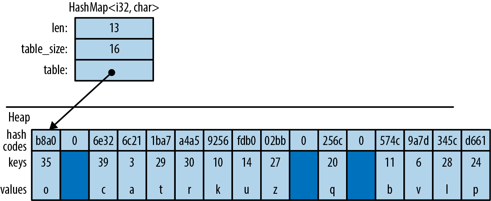

# Chapter 16. Collections

> We all behave like Maxwell’s demon. Organisms organize. In everyday experience lies the reason sober physicists across two centuries kept this cartoon fantasy alive. We sort the mail, build sand castles, solve jigsaw puzzles, separate wheat from chaff, rearrange chess pieces, collect stamps, alphabetize books, create symmetry, compose sonnets and sonatas, and put our rooms in order, and all this we do requires no great energy, as long as we can apply intelligence.
>
> James Gleick, *The Information: A History, a Theory, a Flood*

The Rust standard library contains several *collections*, generic types for storing data in memory. We’ve already been using collections, such as `Vec` and `HashMap`, throughout this book. In this chapter, we’ll cover the methods of these two types in detail, along with the other half-dozen standard collections. Before we begin, let’s address a few systematic differences between Rust’s collections and those in other languages.

First, moves and borrowing are everywhere. Rust uses moves to avoid deep-copying values. That’s why the method `Vec<T>::push(item)` takes its argument by value, not by reference. The value is moved into the vector. The diagrams in Chapter 4 show how this works out in practice: pushing a Rust `String` to a `Vec<String>` is quick, because Rust doesn’t have to copy the string’s character data, and ownership of the string is always clear.

Second, Rust doesn’t have invalidation errors—the kind of dangling-pointer bug where a collection is resized, or otherwise changed, while the program is holding a pointer to data inside it. Invalidation errors are another source of undefined behavior in C++, and they cause the occasional `ConcurrentModificationException` even in memory-safe languages. Rust’s borrow checker rules them out at compile time.

Finally, Rust does not have `null`, so we’ll see `Option`s in places where other languages would use `null`.

Apart from these differences, Rust’s collections are about what you’d expect. If you’re an experienced programmer in a hurry, you can skim here, but don’t miss “Entries”.

# Overview

Table 16-1 shows Rust’s eight standard collections. All of them are generic types.

**Table 16-1. Summary of the standard collections**

| Collection                         | Description                               | Similar collection type in... |                 |                     |
|------------------------------------|-------------------------------------------|-------------------------------|-----------------|---------------------|
| C++                                | Java                                      | Python                        |                 |                     |
| `Vec<T>`                           | Growable array                            | `vector`                      | `ArrayList`     | `list`              |
| `VecDeque<T>`                      | Double-ended queue (growable ring buffer) | `deque`                       | `ArrayDeque`    | `collections​.deque` |
| `LinkedList<T>`                    | Doubly linked list                        | `list`                        | `LinkedList`    | —                   |
| BinaryHeap\<T\> where T: Ord       | Max heap                                  | `priority_queue`              | `PriorityQueue` | `heapq`             |
| HashMap\<K, V\> where K: Eq + Hash | Key-value hash table                      | `unordered_map`               | `HashMap`       | `dict`              |
| BTreeMap\<K, V\> where K: Ord      | Sorted key-value table                    | `map`                         | `TreeMap`       | —                   |
| HashSet\<T\> where T: Eq + Hash    | Unordered, hash-based set                 | `unordered_set`               | `HashSet`       | `set`               |
| BTreeSet\<T\> where T: Ord         | Sorted set                                | `set`                         | `TreeSet`       | —                   |

`Vec<T>`, `HashMap<K, V>`, and `HashSet<T>` are the most generally useful collection types. The rest have niche uses. This chapter discusses each collection type in turn:

`Vec<T>`  
A growable, heap-allocated array of values of type `T`. About half of this chapter is dedicated to `Vec` and its many useful methods.

`VecDeque<T>`  
Like `Vec<T>`, but better for use as a first-in-first-out queue. It supports efficiently adding and removing values at the front of the list as well as the back. This comes at the cost of making all other operations slightly slower.

`BinaryHeap<T>`  
A priority queue. The values in a `BinaryHeap` are organized so that it’s always efficient to find and remove the maximum value.

`HashMap<K, V>`  
A table of key-value pairs. Looking up a value by its key is fast. The entries are stored in an arbitrary order.

`BTreeMap<K, V>`  
Like `HashMap<K, V>`, but it keeps the entries sorted by key. A `BTreeMap<String, i32>` stores its entries in `String` comparison order. Unless you need the entries to stay sorted, a `HashMap` is faster.

`HashSet<T>`  
A set of values of type `T`. Adding and removing values is fast, and it’s fast to ask whether a given value is in the set or not.

`BTreeSet<T>`  
Like `HashSet<T>`, but it keeps the elements sorted by value. Again, unless you need the data sorted, a `HashSet` is faster.

Because `LinkedList` is rarely used (and there are better alternatives, both in performance and interface, for most use cases), we do not describe it here.

# Vec\<T\>

We’ll assume some familiarity with `Vec`, since we’ve been using it throughout the book. For an introduction, see “Vectors”. Here we’ll finally describe its methods and its inner workings in depth.

The easiest way to create a vector is to use the `vec!` macro:

``` rust
// Create an empty vector
let mut numbers: Vec<i32> = vec![];

// Create a vector with given contents
let words = vec!["step", "on", "no", "pets"];
let mut buffer = vec![0u8; 1024];  // 1024 zeroed-out bytes
```

As described in Chapter 4, a vector has three fields: the length, the capacity, and a pointer to a heap allocation where the elements are stored. Figure 16-1 shows how the preceding vectors would appear in memory. The empty vector, `numbers`, initially has a capacity of 0. No heap memory is allocated for it until the first element is added.

Like all collections, `Vec` implements `std::iter::FromIterator`, so you can create a vector from any iterator using the iterator’s `.collect()` method, as described in “Building Collections: collect and FromIterator”:

``` rust
// Convert another collection to a vector.
let my_vec = my_set.into_iter().collect::<Vec<String>>();
```


###### Figure 16-1. Vector layout in memory: each element of words is a `&str` value consisting of a pointer and a length

## Accessing Elements

Getting elements of an array, slice, or vector by index is straightforward:

``` rust
// Get a reference to an element
let first_line = &lines[0];

// Get a copy of an element
let fifth_number = numbers[4];       // requires Copy
let second_line = lines[1].clone();  // requires Clone

// Get a reference to a slice
let my_ref = &buffer[4..12];

// Get a copy of a slice
let my_copy = buffer[4..12].to_vec();  // requires Clone
```

All of these forms panic if an index is out of bounds.

Rust is picky about numeric types, and it makes no exceptions for vectors. Vector lengths and indices are of type `usize`. Trying to use a `u32`, `u64`, or `isize` as a vector index is an error. You can use an `n as usize` cast to convert as needed; see “Type Casts”.

Several methods provide easy access to particular elements of a vector or slice (note that all slice methods are available on arrays and vectors too):

`slice.first()`  
Returns a reference to the first element of `slice`, if any.

The return type is `Option<&T>`, so the return value is `None` if `slice` is empty and `Some(&slice[0])` if it’s not empty:

``` rust
if let Some(item) = v.first() {
    println!("We got one! {}", item);
}
```

`slice.last()`  
Similar but returns a reference to the last element.

`slice.get(index)`  
Returns `Some` reference to `slice[index]`, if it exists. If `slice` has fewer than `index+1` elements, this returns `None`:

``` rust
let slice = [0, 1, 2, 3];
assert_eq!(slice.get(2), Some(&2));
assert_eq!(slice.get(4), None);
```

`slice.first_mut()`, `slice.last_mut()`, `slice.get_mut(index)`  
Variations of the preceding that borrow `mut` references:

``` rust
let mut slice = [0, 1, 2, 3];
{
    let last = slice.last_mut().unwrap();   // type of last: &mut i32
    assert_eq!(*last, 3);
    *last = 100;
}
assert_eq!(slice, [0, 1, 2, 100]);
```

Because returning a `T` by value would mean moving it, methods that access elements in place typically return those elements by reference.

An exception is the `.to_vec()` method, which makes copies:

`slice.to_vec()`  
Clones a whole slice, returning a new vector:

``` rust
let v = [1, 2, 3, 4, 5, 6, 7, 8, 9];
assert_eq!(v.to_vec(),
           vec![1, 2, 3, 4, 5, 6, 7, 8, 9]);
assert_eq!(v[0..6].to_vec(),
           vec![1, 2, 3, 4, 5, 6]);
```

This method is available only if the elements are cloneable, that is, `where T: Clone`.

## Iteration

Vectors, arrays, and slices are iterable, either by value or by reference, following the pattern described in “IntoIterator Implementations”:

- Iterating over a `Vec<T>` or array `[T; N]` produces items of type `T`. The elements are moved out of the vector or array one by one, consuming it.

- Iterating over a value of type `&[T; N]`, `&[T]`, or `&Vec<T>`—that is, a reference to an array, slice, or vector—produces items of type `&T`, references to the individual elements, which are not moved.

- Iterating over a value of type `&mut [T; N]`, `&mut [T]`, or `&mut Vec<T>` produces items of type `&mut T`.

Arrays, slices, and vectors also have `.iter()` and `.iter_mut()` methods (described in “iter and iter_mut Methods”) for creating iterators that produce references to their elements.

We’ll cover some fancier ways to iterate over a slice in “Splitting”.

## Growing and Shrinking Vectors

The *length* of an array, slice, or vector is the number of elements it contains:

`slice.len()`  
Returns a `slice`’s length, as a `usize`.

`slice.is_empty()`  
Is true if `slice` contains no elements (that is, `slice.len() == 0`).

The remaining methods in this section are about growing and shrinking vectors. They are not present on arrays and slices, which can’t be resized once created.

All of a vector’s elements are stored in a contiguous, heap-allocated chunk of memory. The *capacity* of a vector is the maximum number of elements that would fit in this chunk. `Vec` normally manages the capacity for you, automatically allocating a larger buffer and moving the elements into it when more space is needed. There are also a few methods for managing capacity explicitly:

`Vec::with_capacity(n)`  
Creates a new, empty vector with capacity `n`.

`vec.capacity()`  
Returns `vec`’s capacity, as a `usize`. It’s always true that `vec.capacity() >= vec.len()`.

`vec.reserve(n)`  
Makes sure the vector has at least enough spare capacity for `n` more elements: that is, `vec.capacity()` is at least `vec.len() + n`. If there’s already enough room, this does nothing. If not, this allocates a larger buffer and moves the vector’s contents into it.

`vec.reserve_exact(n)`  
Like `vec.reserve(n)`, but tells `vec` not to allocate any extra capacity for future growth, beyond `n`. Afterward, `vec.capacity()` is exactly `vec.len() + n`.

`vec.shrink_to_fit()`  
Tries to free up the extra memory if `vec.capacity()` is greater than `vec.len()`.

`Vec<T>` has many methods that add or remove elements, changing the vector’s length. Each of these takes its `self` argument by `mut` reference.

These two methods add or remove a single value at the end of a vector:

`vec.push(value)`  
Adds the given `value` to the end of `vec`.

`vec.pop()`  
Removes and returns the last element. The return type is `Option<T>`. This returns `Some(x)` if the popped element is `x` and `None` if the vector was already empty.

Note that `.push()` takes its argument by value, not by reference. Likewise, `.pop()` returns the popped value, not a reference. The same is true of most of the remaining methods in this section. They move values in and out of vectors.

These two methods add or remove a value anywhere in a vector:

`vec.insert(index, value)`  
Inserts the given `value` at `vec[index]`, sliding any existing values in `vec[index..]` one spot to the right to make room.

Panics if `index > vec.len()`.

`vec.remove(index)`  
Removes and returns `vec[index]`, sliding any existing values in `vec[index+1..]` one spot to the left to close the gap.

Panics if `index >= vec.len()`, since in that case there is no element `vec[index]` to remove.

The longer the vector, the slower this operation gets. If you find yourself doing `vec.remove(0)` a lot, consider using a `VecDeque` (explained in “VecDeque\<T\>”) instead of a `Vec`.

Both `.insert()` and `.remove()` are slower the more elements have to be shifted.

Four methods change the length of a vector to a specific value:

`vec.resize(new_len, value)`  
Sets `vec`’s length to `new_len`. If this increases `vec`’s length, copies of `value` are added to fill the new space. The element type must implement the `Clone` trait.

`vec.resize_with(new_len, closure)`  
Just like `vec.resize`, but calls the closure to construct each new element. It can be used with vectors of elements that are not `Clone`.

`vec.truncate(new_len)`  
Reduces the length of `vec` to `new_len`, dropping any elements that were in the range `vec[new_len..]`.

If `vec.len()` is already less than or equal to `new_len`, nothing happens.

`vec.clear()`  
Removes all elements from `vec`. It’s the same as `vec.truncate(0)`.

Four methods add or remove many values at once:

`vec.extend(iterable)`  
Adds all items from the given `iterable` value at the end of `vec`, in order. It’s like a multivalue version of `.push()`. The `iterable` argument can be anything that implements `IntoIterator<Item=T>`.

This method is so useful that there’s a standard trait for it, the `Extend` trait, which all standard collections implement. Unfortunately, this causes `rustdoc` to lump `.extend()` with other trait methods in a big pile at the bottom of the generated HTML, so it’s hard to find when you need it. You just have to remember it’s there! See “The Extend Trait” for more.

`vec.split_off(index)`  
Like `vec.truncate(index)`, except that it returns a `Vec<T>` containing the values removed from the end of `vec`. It’s like a multivalue version of `.pop()`.

`vec.append(&mut vec2)`  
This moves all elements from `vec2` into `vec`, where `vec2` is another vector of type `Vec<T>`. Afterward, `vec2` is empty.

This is like `vec.extend(vec2)` except that `vec2` still exists afterward, with its capacity unaffected.

`vec.drain(range)`  
This removes the `range` `vec[range]` from `vec` and returns an iterator over the removed elements, where `range` is a range value, like `..` or `0..4`.

There are also a few oddball methods for selectively removing some of a vector’s elements:

`vec.retain(test)`  
Removes all elements that don’t pass the given test. The `test` argument is a function or closure that implements `FnMut(&T) -> bool`. For each element of `vec`, this calls `test(&element)`, and if it returns `false`, the element is removed from the vector and dropped.

Apart from performance, this is like writing:

``` rust
vec = vec.into_iter().filter(test).collect();
```

`vec.dedup()`  
Drops repeated elements. It’s like the Unix `uniq` shell utility. It scans `vec` for places where adjacent elements are equal and drops the extra equal values so that only one is left:

``` rust
let mut byte_vec = b"Misssssssissippi".to_vec();
byte_vec.dedup();
assert_eq!(&byte_vec, b"Misisipi");
```

Note that there are still two `'s'` characters in the output. This method only removes *adjacent* duplicates. To eliminate all duplicates, you have three options: sort the vector before calling `.dedup()`, move the data into a set, or (to keep the elements in their original order) use this `.retain()` trick:

``` rust
let mut byte_vec = b"Misssssssissippi".to_vec();

let mut seen = HashSet::new();
byte_vec.retain(|r| seen.insert(*r));

assert_eq!(&byte_vec, b"Misp");
```

This works because `.insert()` returns `false` when the set already contains the item we’re inserting.

`vec.dedup_by(same)`  
The same as `vec.dedup()`, but it uses the function or closure `same(&mut elem1, &mut elem2)`, instead of the `==` operator, to check whether two elements should be considered equal.

`vec.dedup_by_key(key)`  
The same as `vec.dedup()`, but it treats two elements as equal if `key(&mut elem1) == key(&mut elem2)`.

For example, if `errors` is a `Vec<Box<dyn Error>>`, you can write:

``` rust
// Remove errors with redundant messages.
errors.dedup_by_key(|err| err.to_string());
```

Of all the methods covered in this section, only `.resize()` ever clones values. The others work by moving values from one place to another.

## Joining

Two methods work on *arrays of arrays*, by which we mean any array, slice, or vector whose elements are themselves arrays, slices, or vectors:

`slices.concat()`  
Returns a new vector made by concatenating all the slices:

``` rust
assert_eq!([[1, 2], [3, 4], [5, 6]].concat(),
           vec![1, 2, 3, 4, 5, 6]);
```

`slices.join(&separator)`  
The same, except a copy of the value `separator` is inserted between slices:

``` rust
assert_eq!([[1, 2], [3, 4], [5, 6]].join(&0),
           vec![1, 2, 0, 3, 4, 0, 5, 6]);
```

## Splitting

It’s easy to get many non-`mut` references into an array, slice, or vector at once:

``` rust
let v = vec![0, 1, 2, 3];
let a = &v[i];
let b = &v[j];

let mid = v.len() / 2;
let front_half = &v[..mid];
let back_half = &v[mid..];
```

Getting multiple `mut` references is not so easy:

``` rust
let mut v = vec![0, 1, 2, 3];
let a = &mut v[i];
let b = &mut v[j];  // error: cannot borrow `v` as mutable
                    //        more than once at a time

*a = 6;             // references `a` and `b` get used here,
*b = 7;             // so their lifetimes must overlap
```

Rust forbids this because if `i == j`, then `a` and `b` would be two `mut` references to the same integer, in violation of Rust’s safety rules. (See “Sharing Versus Mutation”.)

Rust has several methods that can borrow `mut` references to two or more parts of an array, slice, or vector at once. Unlike the preceding code, these methods are safe, because by design, they always split the data into *nonoverlapping* regions. Many of these methods are also handy for working with non-`mut` slices, so there are `mut` and non-`mut` versions of each.

Figure 16-2 illustrates these methods.


###### Figure 16-2. Splitting methods illustrated (note: the little rectangle in the output of `slice.split()` is an empty slice caused by the two adjacent separators, and `rsplitn` produces its output in end-to-start order, unlike the others)

None of these methods directly modifies an array, slice, or vector; they merely return new references to parts of the data inside:

`slice.iter()`, `slice.iter_mut()`  
Produce a reference to each element of `slice`. We covered them in “Iteration”.

`slice.split_at(index)`, `slice.split_at_mut(index)`  
Break a slice in two, returning a pair. `slice.split_at(index)` is equivalent to `(&slice[..index], &slice[index..])`. These methods panic if `index` is out of bounds.

`slice.split_first()`, `slice.split_first_mut()`  
Also return a pair: a reference to the first element (`slice[0]`) and a slice reference to all the rest (`slice[1..]`).

The return type of `.split_first()` is `Option<(&T, &[T])>`; the result is `None` if `slice` is empty.

`slice.split_last()`, `slice.split_last_mut()`  
These are analogous but split off the last element rather than the first.

The return type of `.split_last()` is `Option<(&T, &[T])>`.

`slice.split(is_sep)`, `slice.split_mut(is_sep)`  
Split `slice` into one or more subslices, using the function or closure `is_sep` to figure out where to split. They return an iterator over the subslices.

As you consume the iterator, it calls `is_sep(&element)` for each element in the slice. If `is_sep(&element)` is `true`, the element is a separator. Separators are not included in any output subslice.

The output always contains at least one subslice, plus one per separator. Empty subslices are included whenever separators appear adjacent to each other or to the ends of `slice`.

`slice.split_inclusive(is_sep)`, `slice.split_inclusive_mut(is_sep)`  
These work just like `split` and `split_mut`, but include the separator at the end of the previous subslice rather than excluding it.

`slice.rsplit(is_sep)`, `slice.rsplit_mut(is_sep)`  
Just like `slice` and `slice_mut`, but start at the end of the slice.

`slice.splitn(n, is_sep)`, `slice.splitn_mut(n, is_sep)`  
The same but they produce at most `n` subslices. After the first `n-1` slices are found, `is_sep` is not called again. The last subslice contains all the remaining elements.

`slice.rsplitn(n, is_sep)`, `slice.rsplitn_mut(n, is_sep)`  
Just like `.splitn()` and `.splitn_mut()` except that the slice is scanned in reverse order. That is, these methods split on the *last* `n-1` separators in the slice, rather than the first, and the subslices are produced starting from the end.

`slice.chunks(n)`, `slice.chunks_mut(n)`  
Return an iterator over nonoverlapping subslices of length `n`. If `n` doesn’t divide `slice.len()` exactly, the last chunk will contain fewer than `n` elements.

`slice.rchunks(n)`, `slice.rchunks_mut(n)`  
Just like `slice.chunks` and `slice.chunks_mut`, but start at the end of the slice.

`slice.chunks_exact(n)`, `slice.chunks_exact_mut(n)`  
Return an iterator over nonoverlapping subslices of length `n`. If `n` doesn’t divide `slice.len()`, the last chunk (with less than `n` elements) is available in the result’s `remainder()` method.

`slice.rchunks_exact(n)`, `slice.rchunks_exact_mut(n)`  
Just like `slice.chunks_exact` and `slice.chunks_exact_mut`, but start at the end of the slice.

There’s one more method for iterating over subslices:

`slice.windows(n)`  
Returns an iterator that behaves like a “sliding window” over the data in `slice`. It produces subslices that span `n` consecutive elements of `slice`. The first value produced is `&slice[0..n]`, the second is `&slice[1..n+1]`, and so on.

If `n` is greater than the length of `slice`, then no slices are produced. If `n` is 0, the method panics.

For example, if `days.len() == 31`, then we can produce all seven-day spans in `days` by calling `days.windows(7)`.

A sliding window of size 2 is handy for exploring how a data series changes from one data point to the next:

``` rust
let changes = daily_high_temperatures
                  .windows(2)             // get adjacent days' temps
                  .map(|w| w[1] - w[0])   // how much did it change?
                  .collect::<Vec<_>>();
```

Because the subslices overlap, there is no variation of this method that returns `mut` references.

## Swapping

There are convenience methods for swapping the contents of slices:

`slice.swap(i, j)`  
Swaps the two elements `slice[i]` and `slice[j]`.

`slice_a.swap(&mut slice_b)`  
Swaps the entire contents of `slice_a` and `slice_b`. `slice_a` and `slice_b` must be the same length.

Vectors have a related method for efficiently removing any element:

`vec.swap_remove(i)`  
Removes and returns `vec[i]`. This is like `vec.remove(i)` except that instead of sliding the rest of the vector’s elements over to close the gap, it simply moves `vec`’s last element into the gap. It’s useful when you don’t care about the order of the items left in the vector.

## Filling

There are two convenience methods for replacing the contents of mutable slices:

`slice.fill(value)`  
Fills the slice with clones of `value`.

`slice.fill_with(function)`  
Fills the slice with values made by calling the given function. This is especially useful for types that implement `Default`, but are not `Clone`, like `Option<T>` or `Vec<T>` when `T` is not `Clone`.

## Sorting and Searching

Slices offer three methods for sorting:

`slice.sort()`  
Sorts the elements into increasing order. This method is present only when the element type implements `Ord`.

`slice.sort_by(cmp)`  
Sorts the elements of `slice` using a function or closure `cmp` to specify the sort order. `cmp` must implement `Fn(&T, &T) -> std::cmp::Ordering`.

Hand-implementing `cmp` is a pain, unless you delegate to a `.cmp()` method:

``` rust
students.sort_by(|a, b| a.last_name.cmp(&b.last_name));
```

To sort by one field, using a second field as a tiebreaker, compare tuples:

``` rust
students.sort_by(|a, b| {
    let a_key = (&a.last_name, &a.first_name);
    let b_key = (&b.last_name, &b.first_name);
    a_key.cmp(&b_key)
});
```

`slice.sort_by_key(key)`  
Sorts the elements of `slice` into increasing order by a sort key, given by the function or closure `key`. The type of `key` must implement `Fn(&T) -> K` where `K: Ord`.

This is useful when `T` contains one or more ordered fields, so that it could be sorted multiple ways:

``` rust
// Sort by grade point average, lowest first.
students.sort_by_key(|s| s.grade_point_average());
```

Note that these sort-key values are not cached during sorting, so the `key` function may be called more than *n* times.

For technical reasons, `key(element)` can’t return any references borrowed from the element. This won’t work:

``` rust
students.sort_by_key(|s| &s.last_name);  // error: can't infer lifetime
```

Rust can’t figure out the lifetimes. But in these cases, it’s easy enough to fall back on `.sort_by()`.

All three methods perform a stable sort.

To sort in reverse order, you can use `sort_by` with a `cmp` closure that swaps the two arguments. Taking arguments `|b, a|` rather than `|a, b|` effectively produces the opposite order. Or, you can just call the `.reverse()` method after sorting:

`slice.reverse()`  
Reverses a slice in place.

Once a slice is sorted, it can be efficiently searched:

`slice.binary_search(&value)`, `slice.binary_search_by(&value, cmp)`, `slice.binary_search_by_key(&value, key)`  
All search for `value` in the given sorted `slice`. Note that `value` is passed by reference.

The return type of these methods is `Result<usize, usize>`. They return `Ok(index)` if `slice[index]` equals `value` under the specified sort order. If there is no such index, then they return `Err(insertion_point)` such that inserting `value` at `insertion_point` would preserve the order.

Of course, a binary search only works if the slice is in fact sorted in the specified order. Otherwise, the results are arbitrary—garbage in, garbage out.

Since `f32` and `f64` have NaN values, they do not implement `Ord` and can’t be used directly as keys with the sorting and binary search methods. To get similar methods that work on floating-point data, use the `ord_subset` crate.

There’s one method for searching a vector that is not sorted:

`slice.contains(&value)`  
Returns `true` if any element of `slice` is equal to `value`. This simply checks each element of the slice until a match is found. Again, `value` is passed by reference.

To find the location of a value in a slice, like `array.indexOf(value)` in JavaScript, use an iterator:

``` rust
slice.iter().position(|x| *x == value)
```

This returns an `Option<usize>`.

## Comparing Slices

If a type `T` supports the `==` and `!=` operators (the `PartialEq` trait, described in “Equivalence Comparisons”), then arrays `[T; N]`, slices `[T]`, and vectors `Vec<T>` support them too. Two slices are equal if they’re the same length and their corresponding elements are equal. The same goes for arrays and vectors.

If `T` supports the operators `<`, `<=`, `>`, and `>=` (the `PartialOrd` trait, described in “Ordered Comparisons”), then arrays, slices, and vectors of `T` do too. Slice comparisons are lexicographical.

Two convenience methods perform common slice comparisons:

`slice.starts_with(other)`  
Returns `true` if `slice` starts with a sequence of values that are equal to the elements of the slice `other`:

``` rust
assert_eq!([1, 2, 3, 4].starts_with(&[1, 2]), true);
assert_eq!([1, 2, 3, 4].starts_with(&[2, 3]), false);
```

`slice.ends_with(other)`  
Similar but checks the end of `slice`:

``` rust
assert_eq!([1, 2, 3, 4].ends_with(&[3, 4]), true);
```

## Random Elements

Random numbers are not built into the Rust standard library. The `rand` crate, which provides them, offers these two methods for getting random output from an array, slice, or vector:

`slice.choose(&mut rng)`  
Returns a reference to a random element of a slice. Like `slice.first()` and `slice.last()`, this returns an `Option<&T>` that is `None` only if the slice is empty.

`slice.shuffle(&mut rng)`  
Randomly reorders the elements of a slice in place. The slice must be passed by `mut` reference.

These are methods of the `rand::Rng` trait, so you need a `Rng`, a random number generator, in order to call them. Fortunately, it’s easy to get one by calling `rand::thread_rng()`. To shuffle the vector `my_vec`, we can write:

``` rust
use rand::seq::SliceRandom;
use rand::thread_rng;

my_vec.shuffle(&mut thread_rng());
```

## Rust Rules Out Invalidation Errors

Most mainstream programming languages have collections and iterators, and they all have some variation on this rule: don’t modify a collection while you’re iterating over it. For example, the Python equivalent of a vector is a list:

``` python
my_list = [1, 3, 5, 7, 9]
```

Suppose we try to remove all values greater than 4 from `my_list`:

``` python
for index, val in enumerate(my_list):
    if val > 4:
        del my_list[index]  # bug: modifying list while iterating

print(my_list)
```

(The `enumerate` function is Python’s equivalent of Rust’s `.enumerate()` method, described in “enumerate”.)

This program, surprisingly, prints `[1, 3, 7]`. But seven is greater than four. How did that slip through? This is an invalidation error: the program modifies data while iterating over it, *invalidating* the iterator. In Java, the result would be an exception; in C++ it is undefined behavior. In Python, while the behavior is well-defined, it’s unintuitive: the iterator skips an element. `val` is never `7`.

Let’s try to reproduce this bug in Rust:

``` rust
fn main() {
    let mut my_vec = vec![1, 3, 5, 7, 9];

    for (index, &val) in my_vec.iter().enumerate() {
        if val > 4 {
            my_vec.remove(index);  // error: can't borrow `my_vec` as mutable
        }
    }
    println!("{:?}", my_vec);
}
```

Naturally, Rust rejects this program at compile time. When we call `my_vec.iter()`, it borrows a shared (non-`mut`) reference to the vector. The reference lives as long as the iterator, to the end of the `for` loop. We can’t modify the vector by calling `my_vec.remove(index)` while a non-`mut` reference exists.

Having an error pointed out to you is nice, but of course, you still need to find a way to get the desired behavior! The easiest fix here is to write:

``` rust
my_vec.retain(|&val| val <= 4);
```

Or, you can do what you’d do in Python or any other language: create a new vector using a `filter`.

# VecDeque\<T\>

`Vec` supports efficiently adding and removing elements only at the end. When a program needs a place to store values that are “waiting in line,” `Vec` can be slow.

Rust’s `std::collections::VecDeque<T>` is a *deque* (pronounced “deck”), a double-ended queue. It supports efficient add and remove operations at both the front and the back:

`deque.push_front(value)`  
Adds a value at the front of the queue.

`deque.push_back(value)`  
Adds a value at the end. (This method is used much more than `.push_front()`, because the usual convention for queues is that values are added at the back and removed at the front, like people waiting in a line.)

`deque.pop_front()`  
Removes and returns the front value of the queue, returning an `Option<T>` that is `None` if the queue is empty, like `vec.pop()`.

`deque.pop_back()`  
Removes and returns the value at the back, again returning an `Option<T>`.

`deque.front()`, `deque.back()`  
Work like `vec.first()` and `vec.last()`. They return a reference to the front or back element of the queue. The return value is an `Option<&T>` that is `None` if the queue is empty.

`deque.front_mut()`, `deque.back_mut()`  
Work like `vec.first_mut()` and `vec.last_mut()`, returning `Option<&mut T>`.

The implementation of `VecDeque` is a ring buffer, as shown in Figure 16-3.

Like a `Vec`, it has a single heap allocation where elements are stored. Unlike `Vec`, the data does not always start at the beginning of this region, and it can “wrap around” the end, as shown. The elements of this deque, in order, are `['A', 'B', 'C', 'D', 'E']`. `VecDeque` has private fields, labeled `start` and `stop` in the figure, that it uses to remember where in the buffer the data begins and ends.

Adding a value to the queue, on either end, means claiming one of the unused slots, illustrated as the darker blocks, wrapping around or allocating a bigger chunk of memory if needed.

`VecDeque` manages wrapping, so you don’t have to think about it. Figure 16-3 is a behind-the-scenes view of how Rust makes `.pop_front()` fast.


###### Figure 16-3. How a `VecDeque` is stored in memory

Oftentimes, when you need a deque, `.push_back()` and `.pop_front()` are the only two methods that you’ll need. The type-associated functions `VecDeque::new()` and `VecDeque::with_capacity(n)`, for creating queues, are just like their counterparts in `Vec`. Many `Vec` methods are also implemented for `VecDeque`: `.len()` and `.is_empty()`, `.insert(index, value)`, `.remove(index)`, `.extend(iterable)`, and so on.

Deques, like vectors, can be iterated by value, by shared reference, or by `mut` reference. They have the three iterator methods `.into_iter()`, `.iter()`, and `.iter_mut()`. They can be indexed in the usual way: `deque[index]`.

Because deques don’t store their elements contiguously in memory, they can’t inherit all the methods of slices. But if you’re willing to pay the cost of shifting the contents around, `VecDeque` provides a method that will fix that:

`deque.make_contiguous()`  
Takes `&mut self` and rearranges the `VecDeque` into contiguous memory, returning `&mut [T]`.

`Vec`s and `VecDeque`s are closely related, and the standard library provides two trait implementations for easily converting between the two:

`Vec::from(deque) `  
`Vec<T>` implements `From<VecDeque<T>>`, so this turns a deque into a vector. This costs O(*n*) time, since it may require rearranging the elements.

`VecDeque::from(vec)`  
`VecDeque<T>` implements `From<Vec<T>>`, so this turns a vector into a deque. This is also O(*n*), but it’s usually fast, even if the vector is large, because the vector’s heap allocation can simply be moved to the new deque.

This method makes it easy to create a deque with specified elements, even though there is no standard `vec_deque![]` macro:

``` rust
use std::collections::VecDeque;

let v = VecDeque::from(vec![1, 2, 3, 4]);
```

# BinaryHeap\<T\>

A `BinaryHeap` is a collection whose elements are kept loosely organized so that the greatest value always bubbles up to the front of the queue. Here are the three most commonly used `BinaryHeap` methods:

`heap.push(value)`  
Adds a value to the heap.

`heap.pop()`  
Removes and returns the greatest value from the heap. It returns an `Option<T>` that is `None` if the heap was empty.

`heap.peek()`  
Returns a reference to the greatest value in the heap. The return type is `Option<&T>`.

`heap.peek_mut()`  
Returns a `PeekMut<T>`, which acts as a mutable reference to the greatest value in the heap and provides the type-associated function `pop()` to pop this value from the heap. Using this method, we can choose to pop or not pop from the heap based on the maximum value:

``` rust
use std::collections::binary_heap::PeekMut;

if let Some(top) = heap.peek_mut() {
    if *top > 10 {
        PeekMut::pop(top);
    }
}
```

`BinaryHeap` also supports a subset of the methods on `Vec`, including `BinaryHeap::new()`, `.len()`, `.is_empty()`, `.capacity()`, `.clear()`, and `.append(&mut heap2)`.

For example, suppose we populate a `BinaryHeap` with a bunch of numbers:

``` rust
use std::collections::BinaryHeap;

let mut heap = BinaryHeap::from(vec![2, 3, 8, 6, 9, 5, 4]);
```

The value `9` is at the top of the heap:

``` rust
assert_eq!(heap.peek(), Some(&9));
assert_eq!(heap.pop(), Some(9));
```

Removing the value `9` also rearranges the other elements slightly so that `8` is now at the front, and so on:

``` rust
assert_eq!(heap.pop(), Some(8));
assert_eq!(heap.pop(), Some(6));
assert_eq!(heap.pop(), Some(5));
...
```

Of course, `BinaryHeap` is not limited to numbers. It can hold any type of value that implements the `Ord` built-in trait.

This makes `BinaryHeap` useful as a work queue. You can define a task struct that implements `Ord` on the basis of priority so that higher-priority tasks are `Greater` than lower-priority tasks. Then, create a `BinaryHeap` to hold all pending tasks. Its `.pop()` method will always return the most important item, the task your program should work on next.

Note: `BinaryHeap` is iterable, and it has an `.iter()` method, but the iterators produce the heap’s elements in an arbitrary order, not from greatest to least. To consume values from a `BinaryHeap` in order of priority, use a `while` loop:

``` rust
while let Some(task) = heap.pop() {
    handle(task);
}
```

# HashMap\<K, V\> and BTreeMap\<K, V\>

A *map* is a collection of key-value pairs (called *entries*). No two entries have the same key, and the entries are kept organized so that if you have a key, you can efficiently look up the corresponding value in a map. In short, a map is a lookup table.

Rust offers two map types: `HashMap<K, V>` and `BTreeMap<K, V>`. The two share many of the same methods; the difference is in how the two keep entries arranged for fast lookup.

A `HashMap` stores the keys and values in a hash table, so it requires a key type `K` that implements `Hash` and `Eq`, the standard traits for hashing and equality.

Figure 16-4 shows how a `HashMap` is arranged in memory. Darker regions are unused. All keys, values, and cached hash codes are stored in a single heap-allocated table. Adding entries eventually forces the `HashMap` to allocate a larger table and move all the data into it.



###### Figure 16-4. A `HashMap` in memory

A `BTreeMap` stores the entries in order by key, in a tree structure, so it requires a key type `K` that implements `Ord`. Figure 16-5 shows a `BTreeMap`. Again, the darker regions are unused spare capacity.

A `BTreeMap` stores its entries in *nodes*. Most nodes in a `BTreeMap` contain only key-value pairs. Nonleaf nodes, like the root node shown in this figure, also have room for pointers to child nodes. The pointer between `(20, 'q')` and `(30, 'r')` points to a child node containing keys between `20` and `30`. Adding entries often requires sliding some of a node’s existing entries to the right, to keep them sorted, and occasionally involves allocating new nodes.

This picture is a bit simplified to fit on the page. For example, real `BTreeMap` nodes have room for 11 entries, not 4.


###### Figure 16-5. A `BTreeMap` in memory

The Rust standard library uses B-trees rather than balanced binary trees because B-trees are faster on modern hardware. A binary tree may use fewer comparisons per search than a B-tree, but searching a B-tree has better *locality*—that is, the memory accesses are grouped together rather than scattered across the whole heap. This makes CPU cache misses rarer. It’s a significant speed boost.

There are several ways to create a map:

`HashMap::new()`, `BTreeMap::new()`  
Create new, empty maps.

`iter.collect()`  
Can be used to create and populate a new `HashMap` or `BTreeMap` from key-value pairs. `iter` must be an `Iterator<Item=(K, V)>`.

`HashMap::with_capacity(n)`  
Creates a new, empty hash map with room for at least *n* entries. `HashMap`s, like vectors, store their data in a single heap allocation, so they have a capacity and the related methods `hash_map.capacity()`, `hash_map.reserve(additional)`, and `hash_map.shrink_to_fit()`. `BTreeMap`s do not.

`HashMap`s and `BTreeMap`s have the same core methods for working with keys and values:

`map.len()`  
Returns the number of entries.

`map.is_empty()`  
Returns `true` if `map` has no entries.

`map.contains_key(&key)`  
Returns `true` if the map has an entry for the given `key`.

`map.get(&key)`  
Searches `map` for an entry with the given `key`. If a matching entry is found, this returns `Some(r)`, where `r` is a reference to the corresponding value. Otherwise, this returns `None`.

`map.get_mut(&key)`  
Similar, but it returns a `mut` reference to the value.

In general, maps let you have `mut` access to the values stored inside them, but not the keys. The values are yours to modify however you like. The keys belong to the map itself; it needs to ensure that they don’t change, because the entries are organized by their keys. Modifying a key in-place would be a bug.

`map.insert(key, value)`  
Inserts the entry `(key, value)` into `map` and returns the old value, if any. The return type is `Option<V>`. If there’s already an entry for `key` in the map, the newly inserted `value` overwrites the old one.

`map.extend(iterable)`  
Iterates over the `(K, V)` items of `iterable` and inserts each of those key-value pairs into `map`.

`map.append(&mut map2)`  
Moves all entries from `map2` into `map`. Afterward, `map2` is empty.

`map.remove(&key)`  
Finds and removes any entry with the given `key` from `map`, returning the removed value, if any. The return type is `Option<V>`.

`map.remove_entry(&key)`  
Finds and removes any entry with the given `key` from `map`, returning the removed key and value, if any. The return type is `Option<(K, V)>`.

`map.retain(test)`  
Removes all elements that don’t pass the given test. The `test` argument is a function or closure that implements `FnMut(&K, &mut V) -> bool`. For each element of `map`, this calls `test(&key, &mut value)`, and if it returns `false`, the element is removed from the map and dropped.

Apart from performance, this is like writing:

``` rust
map = map.into_iter().filter(test).collect();
```

`map.clear()`  
Removes all entries.

A map can also be queried using square brackets: `map[&key]`. That is, maps implement the `Index` built-in trait. However, this panics if there is not already an entry for the given `key`, like an out-of-bounds array access, so use this syntax only if the entry you’re looking up is sure to be populated.

The `key` argument to `.contains_key()`, `.get()`, `.get_mut()`, and `.remove()` does not have to have the exact type `&K`. These methods are generic over types that can be borrowed from `K`. It’s OK to call `fish_map.contains_key("conger")` on a `HashMap<String, Fish>`, even though `"conger"` isn’t exactly a `String`, because `String` implements `Borrow<&str>`. For details, see “Borrow and BorrowMut”.

Because a `BTreeMap<K, V>` keeps its entries sorted by key, it supports an additional operation:

`btree_map.split_off(&key)`  
Splits `btree_map` in two. Entries with keys less than `key` are left in `btree_map`. Returns a new `BTreeMap<K, V>` containing the other entries.

## Entries

Both `HashMap` and `BTreeMap` have a corresponding `Entry` type. The point of entries is to eliminate redundant map lookups. For example, here’s some code to get or create a student record:

``` rust
// Do we already have a record for this student?
if !student_map.contains_key(name) {
    // No: create one.
    student_map.insert(name.to_string(), Student::new());
}
// Now a record definitely exists.
let record = student_map.get_mut(name).unwrap();
...
```

This works fine, but it accesses `student_map` two or three times, doing the same lookup each time.

The idea with entries is that we do the lookup just once, producing an `Entry` value that is then used for all subsequent operations. This one-liner is equivalent to all the preceding code, except that it does the lookup only once:

``` rust
let record = student_map.entry(name.to_string()).or_insert_with(Student::new);
```

The `Entry` value returned by `student_map.entry(name.to_string())` acts like a mutable reference to a place within the map that’s either *occupied* by a key-value pair, or *vacant*, meaning there’s no entry there yet. If vacant, the entry’s `.or_insert_with()` method inserts a new `Student`. Most uses of entries are like this: short and sweet.

All `Entry` values are created by the same method:

`map.entry(key)`  
Returns an `Entry` for the given `key`. If there’s no such key in the map, this returns a vacant `Entry`.

This method takes its `self` argument by `mut` reference and returns an `Entry` with a matching lifetime:

``` rust
pub fn entry<'a>(&'a mut self, key: K) -> Entry<'a, K, V>
```

The `Entry` type has a lifetime parameter `'a` because it’s effectively a fancy kind of borrowed `mut` reference to the map. As long as the `Entry` exists, it has exclusive access to the map.

Back in “Structs Containing References”, we saw how to store references in a type and how that affects lifetimes. Now we’re seeing what that looks like from a user’s perspective. That’s what’s going on with `Entry`.

Unfortunately, it is not possible to pass a reference of type `&str` to this method if the map has `String` keys. The `.entry()` method, in that case, requires a real `String`.

`Entry` values provide three methods to deal with vacant entries:

`map.entry(key).or_insert(value)`  
Ensures that `map` contains an entry with the given `key`, inserting a new entry with the given `value` if needed. It returns a `mut` reference to the new or existing value.

Suppose we need to count votes. We can write:

``` rust
let mut vote_counts: HashMap<String, usize> = HashMap::new();
for name in ballots {
    let count = vote_counts.entry(name).or_insert(0);
    *count += 1;
}
```

`.or_insert()` returns a `mut` reference, so the type of `count` is `&mut usize`.

`map.entry(key).or_default()`  
Ensures that `map` contains an entry with the given key, inserting a new entry with the value returned by `Default::default()` if needed. This only works for types that implement `Default`. Like `or_insert`, this method returns a `mut` reference to the new or existing value.

`map.entry(key).or_insert_with(default_fn)`  
This is the same, except that if it needs to create a new entry, it calls `default_fn()` to produce the default value. If there’s already an entry for `key` in the `map`, then `default_fn` is not used.

Suppose we want to know which words appear in which files. We can write:

``` rust
// This map contains, for each word, the set of files it appears in.
let mut word_occurrence: HashMap<String, HashSet<String>> =
    HashMap::new();
for file in files {
    for word in read_words(file)? {
        let set = word_occurrence
            .entry(word)
            .or_insert_with(HashSet::new);
        set.insert(file.clone());
    }
}
```

`Entry` also provides a convenient way to modify only extant fields.

`map.entry(key).and_modify(closure)`  
Calls `closure` if an entry with the key `key` exists, passing in a mutable reference to the value. It returns the `Entry`, so it can be chained with other methods.

For instance, we could use this to count the number of occurrences of words in a string:

``` rust
// This map contains all the words in a given string,
// along with the number of times they occur.
let mut word_frequency: HashMap<&str, u32> = HashMap::new();
for c in text.split_whitespace() {
    word_frequency.entry(c)
        .and_modify(|count| *count += 1)
        .or_insert(1);
}
```

The `Entry` type is an enum, defined like this for `HashMap` (and similarly for `BTreeMap`):

``` rust
// (in std::collections::hash_map)
pub enum Entry<'a, K, V> {
    Occupied(OccupiedEntry<'a, K, V>),
    Vacant(VacantEntry<'a, K, V>)
}
```

The `OccupiedEntry` and `VacantEntry` types have methods for inserting, removing, and accessing entries without repeating the initial lookup. You can find them in the online documentation. The extra methods can occasionally be used to eliminate a redundant lookup or two, but `.or_insert()` and `.or_insert_with()` cover the common cases.

## Map Iteration

There are several ways to iterate over a map:

- Iterating by value (`for (k, v) in map`) produces `(K, V)` pairs. This consumes the map.

- Iterating over a shared reference (`for (k, v) in &map`) produces `(&K, &V)` pairs.

- Iterating over a `mut` reference (`for (k, v) in &mut map`) produces `(&K, &mut V)` pairs. (Again, there’s no way to get `mut` access to keys stored in a map, because the entries are organized by their keys.)

Like vectors, maps have `.iter()` and `.iter_mut()` methods that return by-reference iterators, just like iterating over `&map` or `&mut map`. In addition:

`map.keys()`  
Returns an iterator over just the keys, by reference.

`map.values()`  
Returns an iterator over the values, by reference.

`map.values_mut()`  
Returns an iterator over the values, by `mut` reference.

`map.into_iter()`, `map.into_keys()`, `map.into_values()`  
Consume the map, returning an iterator over tuples `(K, V)` of keys and values, keys, or values, respectively.

All `HashMap` iterators visit the map’s entries in an arbitrary order. `BTreeMap` iterators visit them in order by key.

# HashSet\<T\> and BTreeSet\<T\>

*Sets* are collections of values arranged for fast membership testing:

``` rust
let b1 = large_vector.contains(&"needle");    // slow, checks every element
let b2 = large_hash_set.contains(&"needle");  // fast, hash lookup
```

A set never contains multiple copies of the same value.

Maps and sets have different methods, but behind the scenes, a set is like a map with only keys, rather than key-value pairs. In fact, Rust’s two set types, `HashSet<T>` and `BTreeSet<T>`, are implemented as thin wrappers around `HashMap<T, ()>` and `BTreeMap<T, ()>`.

`HashSet::new()`, `BTreeSet::new()`  
Create new sets.

`iter.collect()`  
Can be used to create a new set from any iterator. If `iter` produces any values more than once, the duplicates are dropped.

`HashSet::with_capacity(n)`  
Creates an empty `HashSet` with room for at least `n` values.

`HashSet<T>` and `BTreeSet<T>` have all the basic methods in common:

`set.len()`  
Returns the number of values in `set`.

`set.is_empty()`  
Returns `true` if the set contains no elements.

`set.contains(&value)`  
Returns `true` if the set contains the given `value`.

`set.insert(value)`  
Adds a `value` to the set. Returns `true` if a value was added, `false` if it was already a member of the set.

`set.remove(&value)`  
Removes a `value` from the set. Returns `true` if a value was removed, `false` if it already wasn’t a member of the set.

`set.retain(test)`  
Removes all elements that don’t pass the given test. The `test` argument is a function or closure that implements `FnMut(&T) -> bool`. For each element of `set`, this calls `test(&value)`, and if it returns `false`, the element is removed from the set and dropped.

Apart from performance, this is like writing:

``` rust
set = set.into_iter().filter(test).collect();
```

As with maps, the methods that look up a value by reference are generic over types that can be borrowed from `T`. For details, see “Borrow and BorrowMut”.

## Set Iteration

There are two ways to iterate over sets:

- Iterating by value (“`for v in set`”) produces the members of the set (and consumes the set).

- Iterating by shared reference (“`for v in &set`”) produces shared references to the members of the set.

Iterating over a set by `mut` reference is not supported. There’s no way to get a `mut` reference to a value stored in a set.

`set.iter()`  
Returns an iterator over the members of `set` by reference.

`HashSet` iterators, like `HashMap` iterators, produce their values in an arbitrary order. `BTreeSet` iterators produce values in order, like a sorted vector.

## When Equal Values Are Different

Sets have a few odd methods that you need to use only if you care about differences between “equal” values.

Such differences do often exist. Two identical `String` values, for example, store their characters in different locations in memory:

``` rust
let s1 = "hello".to_string();
let s2 = "hello".to_string();
println!("{:p}", &s1 as &str);  // 0x7f8b32060008
println!("{:p}", &s2 as &str);  // 0x7f8b32060010
```

Usually, we don’t care.

But in case you ever do, you can get access to the actual values stored inside a set by using the following methods. Each one returns an `Option` that’s `None` if `set` did not contain a matching value:

`set.get(&value)`  
Returns a shared reference to the member of `set` that’s equal to `value`, if any. Returns an `Option<&T>`.

`set.take(&value)`  
Like `set.remove(&value)`, but it returns the removed value, if any. Returns an `Option<T>`.

`set.replace(value)`  
Like `set.insert(value)`, but if `set` already contains a value that’s equal to `value`, this replaces and returns the old value. Returns an `Option<T>`.

## Whole-Set Operations

So far, most of the set methods we’ve seen are focused on a single value in a single set. Sets also have methods that operate on whole sets:

`set1.intersection(&set2)`  
Returns an iterator over all values that are in both `set1` and `set2`.

For example, if we want to print the names of all students who are taking both brain surgery and rocket science classes, we could write:

``` rust
for student in &brain_class {
    if rocket_class.contains(student) {
        println!("{}", student);
    }
}
```

Or, shorter:

``` rust
for student in brain_class.intersection(&rocket_class) {
    println!("{}", student);
}
```

Amazingly, there’s an operator for this.

`&set1 & &set2` returns a new set that’s the intersection of `set1` and `set2`. This is the binary bitwise AND operator, applied to two references. This finds values that are in both `set1` *and* `set2`:

``` rust
let overachievers = &brain_class & &rocket_class;
```

`set1.union(&set2)`  
Returns an iterator over values that are in either `set1` or `set2`, or both.

`&set1 | &set2` returns a new set containing all those values. It finds values that are in either `set1` *or* `set2`.

`set1.difference(&set2)`  
Returns an iterator over values that are in `set1` but not in `set2`.

`&set1 - &set2` returns a new set containing all those values.

`set1.symmetric_difference(&set2)`  
Returns an iterator over values that are in either `set1` or `set2`, but not both.

`&set1 ^ &set2` returns a new set containing all those values.

And there are three methods for testing relationships between sets:

`set1.is_disjoint(set2)`  
True if `set1` and `set2` have no values in common—the intersection between them is empty.

`set1.is_subset(set2)`  
True if `set1` is a subset of `set2`—that is, all values in `set1` are also in `set2`.

`set1.is_superset(set2)`  
This is the reverse: it’s true if `set1` is a superset of `set2`.

Sets also support equality testing with `==` and `!=`; two sets are equal if they contain the same values.

# Hashing

`std::hash::Hash` is the standard library trait for hashable types. `HashMap` keys and `HashSet` elements must implement both `Hash` and `Eq`.

Most built-in types that implement `Eq` also implement `Hash`. The integer types, `char`, and `String` are all hashable; so are tuples, arrays, slices, and vectors, as long as their elements are hashable.

One principle of the standard library is that a value should have the same hash code regardless of where you store it or how you point to it. Therefore, a reference has the same hash code as the value it refers to, and a `Box` has the same hash code as the boxed value. A vector `vec` has the same hash code as the slice containing all its data, `&vec[..]`. A `String` has the same hash code as a `&str` with the same characters.

Structs and enums don’t implement `Hash` by default, but an implementation can be derived:

``` rust
/// The ID number for an object in the British Museum's collection.
#[derive(Clone, PartialEq, Eq, Hash)]
enum MuseumNumber {
    ...
}
```

This works as long as the type’s fields are all hashable.

If you implement `PartialEq` by hand for a type, you should also implement `Hash` by hand. For example, suppose we have a type that represents priceless historical treasures:

``` rust
struct Artifact {
    id: MuseumNumber,
    name: String,
    cultures: Vec<Culture>,
    date: RoughTime,
    ...
}
```

Two `Artifact`s are considered equal if they have the same ID:

``` rust
impl PartialEq for Artifact {
    fn eq(&self, other: &Artifact) -> bool {
        self.id == other.id
    }
}

impl Eq for Artifact {}
```

Since we compare artifacts purely on the basis of their ID, we must hash them the same way:

``` rust
use std::hash::{Hash, Hasher};

impl Hash for Artifact {
    fn hash<H: Hasher>(&self, hasher: &mut H) {
        // Delegate hashing to the MuseumNumber.
        self.id.hash(hasher);
    }
}
```

(Otherwise, `HashSet<Artifact>` would not work properly; like all hash tables, it requires that `hash(a) == hash(b)` if `a == b`.)

This allows us to create a `HashSet` of `Artifacts`:

``` rust
let mut collection = HashSet::<Artifact>::new();
```

As this code shows, even when you implement `Hash` by hand, you don’t need to know anything about hashing algorithms. `.hash()` receives a reference to a `Hasher`, which represents the hashing algorithm. You simply feed this `Hasher` all the data that’s relevant to the `==` operator. The `Hasher` computes a hash code from whatever you give it.

# Using a Custom Hashing Algorithm

The `hash` method is generic, so the `Hash` implementations shown earlier can feed data to any type that implements `Hasher`. This is how Rust supports pluggable hashing algorithms.

A third trait, `std::hash::BuildHasher`, is the trait for types that represent the initial state of a hashing algorithm. Each `Hasher` is single use, like an iterator: you use it once and throw it away. A `BuildHasher` is reusable.

Every `HashMap` contains a `BuildHasher` that it uses each time it needs to compute a hash code. The `BuildHasher` value contains the key, initial state, or other parameters that the hashing algorithm needs every time it runs.

The complete protocol for computing a hash code looks like this:

``` rust
use std::hash::{Hash, Hasher, BuildHasher};

fn compute_hash<B, T>(builder: &B, value: &T) -> u64
    where B: BuildHasher, T: Hash
{
    let mut hasher = builder.build_hasher();  // 1. start the algorithm
    value.hash(&mut hasher);                  // 2. feed it data
    hasher.finish()                           // 3. finish, producing a u64
}
```

`HashMap` calls these three methods every time it needs to compute a hash code. All the methods are inlineable, so it’s very fast.

Rust’s default hashing algorithm is a well-known algorithm called SipHash-1-3. SipHash is fast, and it’s very good at minimizing hash collisions. In fact, it’s a cryptographic algorithm: there’s no known efficient way to generate SipHash-1-3 collisions. As long as a different, unpredictable key is used for each hash table, Rust is secure against a kind of denial-of-service attack called HashDoS, where attackers deliberately use hash collisions to trigger worst-case performance in a server.

But perhaps you don’t need that for your application. If you’re storing many small keys, such as integers or very short strings, it is possible to implement a faster hash function, at the expense of HashDoS security. The `fnv` crate implements one such algorithm, the Fowler–Noll–Vo (FNV) hash. To try it, add this line to your *Cargo.toml*:

```
[dependencies]
fnv = "1.0"
```

Then import the map and set types from `fnv`:

``` rust
use fnv::{FnvHashMap, FnvHashSet};
```

You can use these two types as drop-in replacements for `HashMap` and `HashSet`. A peek inside the `fnv` source code reveals how they’re defined:

``` rust
/// A `HashMap` using a default FNV hasher.
pub type FnvHashMap<K, V> = HashMap<K, V, FnvBuildHasher>;

/// A `HashSet` using a default FNV hasher.
pub type FnvHashSet<T> = HashSet<T, FnvBuildHasher>;
```

The standard `HashMap` and `HashSet` collections accept an optional extra type parameter specifying the hashing algorithm; `FnvHashMap` and `FnvHashSet` are generic type aliases for `HashMap` and `HashSet`, specifying an FNV hasher for that parameter.

# Beyond the Standard Collections

Creating a new, custom collection type in Rust is much the same as in any other language. You arrange data by combining the parts the language provides: structs and enums, standard collections, `Option`s, `Box`es, and so on. For an example, see the `BinaryTree<T>` type defined in “Generic Enums”.

If you’re used to implementing data structures in C++, using raw pointers, manual memory management, placement `new`, and explicit destructor calls to get the best possible performance, you’ll undoubtedly find safe Rust rather limiting. All of those tools are inherently unsafe. They are available in Rust, but only if you opt in to unsafe code. Chapter 22 shows how; it includes an example that uses some unsafe code to implement a safe custom collection.

For now, we’ll just bask in the warm glow of the standard collections and their safe, efficient APIs. Like much of the Rust standard library, they’re designed to ensure that the need to write `unsafe` is as rare as possible.