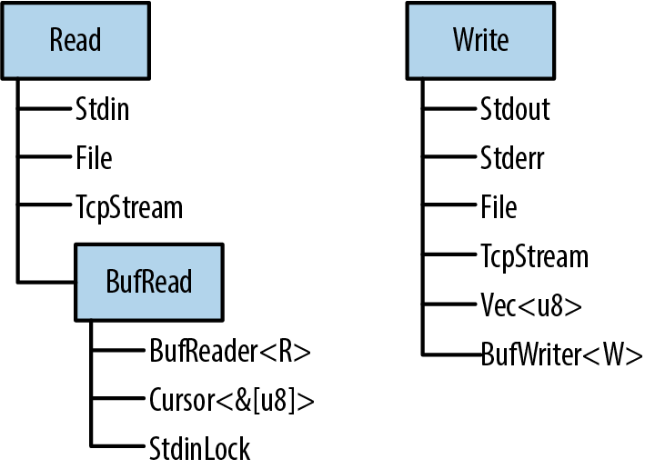

# Chapter 18. Input and Output

> Doolittle: What concrete evidence do you have that you exist?
>
> Bomb \#20: Hmmmm... well... I think, therefore I am.
>
> Doolittle: That’s good. That’s very good. But how do you know that anything else exists?
>
> Bomb \#20: My sensory apparatus reveals it to me.
>
> *Dark Star*

Rust’s standard library features for input and output are organized around three traits, `Read`, `BufRead`, and `Write`:

- Values that implement `Read` have methods for byte-oriented input. They’re called *readers*.

- Values that implement `BufRead` are *buffered* readers. They support all the methods of `Read`, plus methods for reading lines of text and so forth.

- Values that implement `Write` support both byte-oriented and UTF-8 text output. They’re called *writers*.

Figure 18-1 shows these three traits and some examples of reader and writer types.

In this chapter, we’ll explain how to use these traits and their methods, cover the reader and writer types shown in the figure, and show other ways to interact with files, the terminal, and the network.



###### Figure 18-1. Rust’s three main I/O traits and selected types that implement them

# Readers and Writers

*Readers* are values that your program can read bytes from. Examples include:

- Files opened using `std::fs::File::open(filename)`

- `std::net::TcpStream`s, for receiving data over the network

- `std::io::stdin()`, for reading from the process’s standard input stream

- `std::io::Cursor<&[u8]>` and `std::io::Cursor<Vec<u8>>` values, which are readers that “read” from a byte array or vector that’s already in memory

*Writers* are values that your program can write bytes to. Examples include:

- Files opened using `std::fs::File::create(filename)`

- `std::net::TcpStream`s, for sending data over the network

- `std::io::stdout()` and `std::io:stderr()`, for writing to the terminal

- `Vec<u8>`, a writer whose `write` methods append to the vector

- `std::io::Cursor<Vec<u8>>`, which is similar but lets you both read and write data, and seek to different positions within the vector

- `std::io::Cursor<&mut [u8]>`, which is much like `std::io::Cursor<Vec<u8>>`, except that it can’t grow the buffer, since it’s just a slice of some existing byte array

Since there are standard traits for readers and writers (`std::io::Read` and `std::io::Write`), it’s quite common to write generic code that works across a variety of input or output channels. For example, here’s a function that copies all bytes from any reader to any writer:

``` rust
use std::io::{self, Read, Write, ErrorKind};

const DEFAULT_BUF_SIZE: usize = 8 * 1024;

pub fn copy<R: ?Sized, W: ?Sized>(reader: &mut R, writer: &mut W)
    -> io::Result<u64>
    where R: Read, W: Write
{
    let mut buf = [0; DEFAULT_BUF_SIZE];
    let mut written = 0;
    loop {
        let len = match reader.read(&mut buf) {
            Ok(0) => return Ok(written),
            Ok(len) => len,
            Err(ref e) if e.kind() == ErrorKind::Interrupted => continue,
            Err(e) => return Err(e),
        };
        writer.write_all(&buf[..len])?;
        written += len as u64;
    }
}
```

This is the implementation of `std::io::copy()` from Rust’s standard library. Since it’s generic, you can use it to copy data from a `File` to a `TcpStream`, from `Stdin` to an in-memory `Vec<u8>`, etc.

If the error-handling code here is unclear, revisit Chapter 7. We’ll be using the `Result` type constantly in the pages ahead; it’s important to have a good grasp of how it works.

The three `std::io` traits `Read`, `BufRead`, and `Write`, along with `Seek`, are so commonly used that there’s a `prelude` module containing only those traits:

``` rust
use std::io::prelude::*;
```

You’ll see this once or twice in this chapter. We also make a habit of importing the `std::io` module itself:

``` rust
use std::io::{self, Read, Write, ErrorKind};
```

The `self` keyword here declares `io` as an alias to the `std::io` module. That way, `std::io::Result` and `std::io::Error` can be written more concisely as `io::Result` and `io::Error`, and so on.

## Readers

`std::io::Read` has several methods for reading data. All of them take the reader itself by `mut` reference.

`reader.read(&mut buffer)`  
Reads some bytes from the data source and stores them in the given `buffer`. The type of the `buffer` argument is `&mut [u8]`. This reads up to `buffer.len()` bytes.

The return type is `io::Result<u64>`, which is a type alias for `Result<u64, io::Error>`. On success, the `u64` value is the number of bytes read—which may be equal to or less than `buffer.len()`, *even if there’s more data to come,* at the whim of the data source. `Ok(0)` means there is no more input to read.

On error, `.read()` returns `Err(err)`, where `err` is an `io::Error` value. An `io::Error` is printable, for the benefit of humans; for programs, it has a `.kind()` method that returns an error code of type `io::ErrorKind`. The members of this enum have names like `PermissionDenied` and `ConnectionReset`. Most indicate serious errors that can’t be ignored, but one kind of error should be handled specially. `io::ErrorKind::Interrupted` corresponds to the Unix error code `EINTR`, which means the read happened to be interrupted by a signal. Unless the program is designed to do something clever with signals, it should just retry the read. The code for `copy()`, in the preceding section, shows an example of this.

As you can see, the `.read()` method is very low level, even inheriting quirks of the underlying operating system. If you’re implementing the `Read` trait for a new type of data source, this gives you a lot of leeway. If you’re trying to read some data, it’s a pain. Therefore, Rust provides several higher-level convenience methods. All of them have default implementations in terms of `.read()`. They all handle `ErrorKind::Interrupted`, so you don’t have to.

`reader.read_to_end(&mut byte_vec)`  
Reads all remaining input from this reader, appending it to `byte_vec`, which is a `Vec<u8>`. Returns an `io::Result<usize>`, the number of bytes read.

There is no limit on the amount of data this method will pile into the vector, so don’t use it on an untrusted source. (You can impose a limit using the `.take()` method, described in the next list.)

`reader.read_to_string(&mut string)`  
This is the same, but appends the data to the given `String`. If the stream isn’t valid UTF-8, this returns an `ErrorKind::InvalidData` error.

In some programming languages, byte input and character input are handled by different types. These days, UTF-8 is so dominant that Rust acknowledges this de facto standard and supports UTF-8 everywhere. Other character sets are supported with the open source `encoding` crate.

`reader.read_exact(&mut buf)`  
Reads exactly enough data to fill the given buffer. The argument type is `&[u8]`. If the reader runs out of data before reading `buf.len()` bytes, this returns an `ErrorKind::UnexpectedEof` error.

Those are the main methods of the `Read` trait. In addition, there are three adapter methods that take the `reader` by value, transforming it into an iterator or a different reader:

`reader.bytes()`  
Returns an iterator over the bytes of the input stream. The item type is `io::Result<u8>`, so an error check is required for every byte. Furthermore, this calls `reader.read()` once per byte, which will be very inefficient if the reader is not buffered.

`reader.chain(reader2)`  
Returns a new reader that produces all the input from `reader`, followed by all the input from `reader2`.

`reader.take(n)`  
Returns a new reader that reads from the same source as `reader`, but is limited to `n` bytes of input.

There is no method for closing a reader. Readers and writers typically implement `Drop` so that they are closed automatically.

## Buffered Readers

For efficiency, readers and writers can be *buffered*, which simply means they have a chunk of memory (a buffer) that holds some input or output data in memory. This saves on system calls, as shown in Figure 18-2. The application reads data from the `BufReader`, in this example by calling its `.read_line()` method. The `BufReader` in turn gets its input in larger chunks from the operating system.

This picture is not to scale. The actual default size of a `BufReader`’s buffer is several kilobytes, so a single system `read` can serve hundreds of `.read_line()` calls. This matters because system calls are slow.

(As the picture shows, the operating system has a buffer too, for the same reason: system calls are slow, but reading data from a disk is slower.)


###### Figure 18-2. A buffered file reader

Buffered readers implement both `Read` and a second trait, `BufRead`, which adds the following methods:

`reader.read_line(&mut line)`  
Reads a line of text and appends it to `line`, which is a `String`. The newline character `'\n'` at the end of the line is included in `line`. If the input has Windows-style line endings, `"\r\n"`, both characters are included in `line`.

The return value is an `io::Result<usize>`, the number of bytes read, including the line ending, if any.

If the reader is at the end of the input, this leaves `line` unchanged and returns `Ok(0)`.

`reader.lines()`  
Returns an iterator over the lines of the input. The item type is `io::Result<String>`. Newline characters are *not* included in the strings. If the input has Windows-style line endings, `"\r\n"`, both characters are stripped.

This method is almost always what you want for text input. The next two sections show some examples of its use.

`reader.read_until(stop_byte, &mut byte_vec)`, `reader.split(stop​_byte)`  
These are just like `.read_line()` and `.lines()`, but byte-oriented, producing `Vec<u8>`s instead of `String`s. You choose the delimiter `stop_byte`.

`BufRead` also provides a pair of low-level methods, `.fill_buf()` and `.consume(n)`, for direct access to the reader’s internal buffer. For more about these methods, see the online documentation.

The next two sections cover buffered readers in more detail.

## Reading Lines

Here is a function that implements the Unix `grep` utility. It searches many lines of text, typically piped in from another command, for a given string:

``` rust
use std::io;
use std::io::prelude::*;

fn grep(target: &str) -> io::Result<()> {
    let stdin = io::stdin();
    for line_result in stdin.lock().lines() {
        let line = line_result?;
        if line.contains(target) {
            println!("{}", line);
        }
    }
    Ok(())
}
```

Since we want to call `.lines()`, we need a source of input that implements `BufRead`. In this case, we call `io::stdin()` to get the data that’s being piped to us. However, the Rust standard library protects `stdin` with a mutex. We call `.lock()` to lock `stdin` for the current thread’s exclusive use; it returns an `StdinLock` value that implements `BufRead`. At the end of the loop, the `StdinLock` is dropped, releasing the mutex. (Without a mutex, two threads trying to read from `stdin` at the same time would cause undefined behavior. C has the same issue and solves it the same way: all of the C standard input and output functions obtain a lock behind the scenes. The only difference is that in Rust, the lock is part of the API.)

The rest of the function is straightforward: it calls `.lines()` and loops over the resulting iterator. Because this iterator produces `Result` values, we use the `?` operator to check for errors.

Suppose we want to take our `grep` program a step further and add support for searching files on disk. We can make this function generic:

``` rust
fn grep<R>(target: &str, reader: R) -> io::Result<()>
    where R: BufRead
{
    for line_result in reader.lines() {
        let line = line_result?;
        if line.contains(target) {
            println!("{}", line);
        }
    }
    Ok(())
}
```

Now we can pass it either an `StdinLock` or a buffered `File`:

``` rust
let stdin = io::stdin();
grep(&target, stdin.lock())?;  // ok

let f = File::open(file)?;
grep(&target, BufReader::new(f))?;  // also ok
```

Note that a `File` is not automatically buffered. `File` implements `Read` but not `BufRead`. However, it’s easy to create a buffered reader for a `File`, or any other unbuffered reader. `BufReader::new(reader)` does this. (To set the size of the buffer, use `BufReader::with_capacity(size, reader)`.)

In most languages, files are buffered by default. If you want unbuffered input or output, you have to figure out how to turn buffering off. In Rust, `File` and `BufReader` are two separate library features, because sometimes you want files without buffering, and sometimes you want buffering without files (for example, you may want to buffer input from the network).

The full program, including error handling and some crude argument parsing, is shown here:

``` rust
// grep - Search stdin or some files for lines matching a given string.

use std::error::Error;
use std::io::{self, BufReader};
use std::io::prelude::*;
use std::fs::File;
use std::path::PathBuf;

fn grep<R>(target: &str, reader: R) -> io::Result<()>
    where R: BufRead
{
    for line_result in reader.lines() {
        let line = line_result?;
        if line.contains(target) {
            println!("{}", line);
        }
    }
    Ok(())
}

fn grep_main() -> Result<(), Box<dyn Error>> {
    // Get the command-line arguments. The first argument is the
    // string to search for; the rest are filenames.
    let mut args = std::env::args().skip(1);
    let target = match args.next() {
        Some(s) => s,
        None => Err("usage: grep PATTERN FILE...")?
    };
    let files: Vec<PathBuf> = args.map(PathBuf::from).collect();

    if files.is_empty() {
        let stdin = io::stdin();
        grep(&target, stdin.lock())?;
    } else {
        for file in files {
            let f = File::open(file)?;
            grep(&target, BufReader::new(f))?;
        }
    }

    Ok(())
}

fn main() {
    let result = grep_main();
    if let Err(err) = result {
        eprintln!("{}", err);
        std::process::exit(1);
    }
}
```

## Collecting Lines

Several reader methods, including `.lines()`, return iterators that produce `Result` values. The first time you want to collect all the lines of a file into one big vector, you’ll run into a problem getting rid of the `Result`s:

``` rust
// ok, but not what you want
let results: Vec<io::Result<String>> = reader.lines().collect();

// error: can't convert collection of Results to Vec<String>
let lines: Vec<String> = reader.lines().collect();
```

The second try doesn’t compile: what would happen to the errors? The straightforward solution is to write a `for` loop and check each item for errors:

``` rust
let mut lines = vec![];
for line_result in reader.lines() {
    lines.push(line_result?);
}
```

Not bad; but it would be nice to use `.collect()` here, and it turns out that we can. We just have to know which type to ask for:

``` rust
let lines = reader.lines().collect::<io::Result<Vec<String>>>()?;
```

How does this work? The standard library contains an implementation of `FromIterator` for `Result`—easy to overlook in the online documentation—that makes this possible:

``` rust
impl<T, E, C> FromIterator<Result<T, E>> for Result<C, E>
    where C: FromIterator<T>
{
    ...
}
```

This requires some careful reading, but it’s a nice trick. Assume `C` is any collection type, like `Vec` or `HashSet`. As long we already know how to build a `C` from an iterator of `T` values, we can build a `Result<C, E>` from an iterator producing `Result<T, E>` values. We just need to draw values from the iterator and build the collection from the `Ok` results, but if we ever see an `Err`, stop and pass that along.

In other words, `io::Result<Vec<String>>` is a collection type, so the `.collect()` method can create and populate values of that type.

## Writers

As we’ve seen, input is mostly done using methods. Output is a bit different.

Throughout the book, we’ve used `println!()` to produce plain-text output:

``` rust
println!("Hello, world!");

println!("The greatest common divisor of {:?} is {}",
         numbers, d);

println!();  // print a blank line
```

There’s also a `print!()` macro, which does not add a newline character at the end, and `eprintln!` and `eprint!` macros that write to the standard error stream. The formatting codes for all of these are the same as those for the `format!` macro, described in “Formatting Values”.

To send output to a writer, use the `write!()` and `writeln!()` macros. They are the same as `print!()` and `println!()`, except for two differences:

``` rust
writeln!(io::stderr(), "error: world not helloable")?;

writeln!(&mut byte_vec, "The greatest common divisor of {:?} is {}",
         numbers, d)?;
```

One difference is that the `write` macros each take an extra first argument, a writer. The other is that they return a `Result`, so errors must be handled. That’s why we used the `?` operator at the end of each line.

The `print` macros don’t return a `Result`; they simply panic if the write fails. Since they write to the terminal, this is rare.

The `Write` trait has these methods:

`writer.write(&buf)`  
Writes some of the bytes in the slice `buf` to the underlying stream. It returns an `io::Result<usize>`. On success, this gives the number of bytes written, which may be less than `buf.len()`, at the whim of the stream.

Like `Reader::read()`, this is a low-level method that you should avoid using directly.

`writer.write_all(&buf)`  
Writes all the bytes in the slice `buf`. Returns `Result<()>`.

`writer.flush()`  
Flushes any buffered data to the underlying stream. Returns `Result<()>`.

Note that while the `println!` and `eprintln!` macros automatically flush the stdout and stderr stream, the `print!` and `eprint!` macros do not. You may have to call `flush()` manually when using them.

Like readers, writers are closed automatically when they are dropped.

Just as `BufReader::new(reader)` adds a buffer to any reader, `BufWriter::new(writer)` adds a buffer to any writer:

``` rust
let file = File::create("tmp.txt")?;
let writer = BufWriter::new(file);
```

To set the size of the buffer, use `BufWriter::with_capacity(size, writer)`.

When a `BufWriter` is dropped, all remaining buffered data is written to the underlying writer. However, if an error occurs during this write, the error is *ignored*. (Since this happens inside `BufWriter`’s `.drop()` method, there is no useful place to report the error.) To make sure your application notices all output errors, manually `.flush()` buffered writers before dropping them.

## Files

We’ve already seen two ways to open a file:

`File::open(filename)`  
Opens an existing file for reading. It returns an `io::Result<File>`, and it’s an error if the file doesn’t exist.

`File::create(filename)`  
Creates a new file for writing. If a file exists with the given filename, it is truncated.

Note that the `File` type is in the filesystem module, `std::fs`, not `std::io`.

When neither of these fits the bill, you can use `OpenOptions` to specify the exact desired behavior:

``` rust
use std::fs::OpenOptions;

let log = OpenOptions::new()
    .append(true)  // if file exists, add to the end
    .open("server.log")?;

let file = OpenOptions::new()
    .write(true)
    .create_new(true)  // fail if file exists
    .open("new_file.txt")?;
```

The methods `.append()`, `.write()`, `.create_new()`, and so on are designed to be chained like this: each one returns `self`. This method-chaining design pattern is common enough to have a name in Rust: it’s called a *builder*. `std::process::Command` is another example. For more details on `OpenOptions`, see the online documentation.

Once a `File` has been opened, it behaves like any other reader or writer. You can add a buffer if needed. The `File` will be closed automatically when you drop it.

## Seeking

`File` also implements the `Seek` trait, which means you can hop around within a `File` rather than reading or writing in a single pass from the beginning to the end. `Seek` is defined like this:

``` rust
pub trait Seek {
    fn seek(&mut self, pos: SeekFrom) -> io::Result<u64>;
}

pub enum SeekFrom {
    Start(u64),
    End(i64),
    Current(i64)
}
```

Thanks to the enum, the `seek` method is nicely expressive: use `file.seek(SeekFrom::Start(0))` to rewind to the beginning and use `file.seek(SeekFrom::Current(-8))` to go back a few bytes, and so on.

Seeking within a file is slow. Whether you’re using a hard disk or a solid-state drive (SSD), a seek takes as long as reading several megabytes of data.

## Other Reader and Writer Types

So far, this chapter has used `File` as its example workhorse, but there are many other useful reader and writer types:

`io::stdin()`  
Returns a reader for the standard input stream. Its type is `io::Stdin`. Since this is shared by all threads, each read acquires and releases a mutex.

`Stdin` has a `.lock()` method that acquires the mutex and returns an `io::StdinLock`, a buffered reader that holds the mutex until it’s dropped. Individual operations on the `StdinLock` therefore avoid the mutex overhead. We showed example code using this method in “Reading Lines”.

For technical reasons, `io::stdin().lock()` doesn’t work. The lock holds a reference to the `Stdin` value, and that means the `Stdin` value must be stored somewhere so that it lives long enough:

``` rust
let stdin = io::stdin();
let lines = stdin.lock().lines();  // ok
```

`io::stdout()`, `io::stderr()`  
Return `Stdout` and `Stderr` writer types for the standard output and standard error streams. These too have mutexes and `.lock()` methods.

`Vec<u8>`  
Implements `Write`. Writing to a `Vec<u8>` extends the vector with the new data.

(`String`, however, does *not* implement `Write`. To build a string using `Write`, first write to a `Vec<u8>`, and then use `String::from_utf8(vec)` to convert the vector to a string.)

`Cursor::new(buf)`  
Creates a `Cursor`, a buffered reader that reads from `buf`. This is how you create a reader that reads from a `String`. The argument `buf` can be any type that implements `AsRef<[u8]>`, so you can also pass a `&[u8]`, `&str`, or `Vec<u8>`.

`Cursor`s are trivial internally. They have just two fields: `buf` itself and an integer, the offset in `buf` where the next read will start. The position is initially 0.

Cursors implement `Read`, `BufRead`, and `Seek`. If the type of `buf` is `&mut [u8]` or `Vec<u8>`, then the `Cursor` also implements `Write`. Writing to a cursor overwrites bytes in `buf` starting at the current position. If you try to write past the end of a `&mut [u8]`, you’ll get a partial write or an `io::Error`. Using a cursor to write past the end of a `Vec<u8>` is fine, though: it grows the vector. `Cursor<&mut [u8]>` and `Cursor<Vec<u8>>` thus implement all four of the `std::io::prelude` traits.

`std::net::TcpStream`  
Represents a TCP network connection. Since TCP enables two-way communication, it’s both a reader and a writer.

The type-associated function `TcpStream::connect(("hostname", PORT))` tries to connect to a server and returns an `io::Result<TcpStream>`.

`std::process::Command`  
Supports spawning a child process and piping data to its standard input, like so:

``` rust
use std::process::{Command, Stdio};

let mut child =
    Command::new("grep")
    .arg("-e")
    .arg("a.*e.*i.*o.*u")
    .stdin(Stdio::piped())
    .spawn()?;

let mut to_child = child.stdin.take().unwrap();
for word in my_words {
    writeln!(to_child, "{}", word)?;
}
drop(to_child);  // close grep's stdin, so it will exit
child.wait()?;
```

The type of `child.stdin` is `Option<std::process::ChildStdin>`; here we’ve used `.stdin(Stdio::piped())` when setting up the child process, so `child.stdin` is definitely populated when `.spawn()` succeeds. If we hadn’t, `child.stdin` would be `None`.

`Command` also has similar methods `.stdout()` and `.stderr()`, which can be used to request readers in `child.stdout` and `child.stderr`.

The `std::io` module also offers a handful of functions that return trivial readers and writers:

`io::sink()`  
This is the no-op writer. All the write methods return `Ok`, but the data is just discarded.

`io::empty()`  
This is the no-op reader. Reading always succeeds, but returns end-of-input.

`io::repeat(byte)`  
Returns a reader that repeats the given byte endlessly.

## Binary Data, Compression, and Serialization

Many open source crates build on the `std::io` framework to offer extra features.

The `byteorder` crate offers `ReadBytesExt` and `WriteBytesExt` traits that add methods to all readers and writers for binary input and output:

``` rust
use byteorder::{ReadBytesExt, WriteBytesExt, LittleEndian};

let n = reader.read_u32::<LittleEndian>()?;
writer.write_i64::<LittleEndian>(n as i64)?;
```

The `flate2` crate provides adapter methods for reading and writing `gzip`ped data:

``` rust
use flate2::read::GzDecoder;
let file = File::open("access.log.gz")?; 
let mut gzip_reader = GzDecoder::new(file);
```

The `serde` crate, and its associated format crates such as `serde_json`, implement serialization and deserialization: they convert back and forth between Rust structs and bytes. We mentioned this once before, in “Traits and Other People’s Types”. Now we can take a closer look.

Suppose we have some data—the map for a text adventure game—stored in a `HashMap`:

``` rust
type RoomId = String;                       // each room has a unique name
type RoomExits = Vec<(char, RoomId)>;       // ...and a list of exits
type RoomMap = HashMap<RoomId, RoomExits>;  // room names and exits, simple

// Create a simple map.
let mut map = RoomMap::new();
map.insert("Cobble Crawl".to_string(),
           vec![('W', "Debris Room".to_string())]);
map.insert("Debris Room".to_string(),
           vec![('E', "Cobble Crawl".to_string()),
                ('W', "Sloping Canyon".to_string())]);
...
```

Turning this data into JSON for output is a single line of code:

``` rust
serde_json::to_writer(&mut std::io::stdout(), &map)?;
```

Internally, `serde_json::to_writer` uses the `serialize` method of the `serde::Serialize` trait. The library attaches this trait to all types that it knows how to serialize, and that includes all of the types that appear in our data: strings, characters, tuples, vectors, and `HashMap`s.

`serde` is flexible. In this program, the output is JSON data, because we chose the `serde_json` serializer. Other formats, like MessagePack, are also available. Likewise, you could send this output to a file, a `Vec<u8>`, or any other writer. The preceding code prints the data on `stdout`. Here it is:

``` json
{"Debris Room":[["E","Cobble Crawl"],["W","Sloping Canyon"]],"Cobble Crawl":
[["W","Debris Room"]]}
```

`serde` also includes support for deriving the two key `serde` traits:

``` rust
#[derive(Serialize, Deserialize)]
struct Player {
    location: String,
    items: Vec<String>,
    health: u32
}
```

This `#[derive]` attribute can make your compiles take a bit longer, so you need to explicitly ask `serde` to support it when you list it as a dependency in your *Cargo.toml* file. Here’s what we used for the preceding code:

```
[dependencies]
serde = { version = "1.0", features = ["derive"] }
serde_json = "1.0"
```

See the `serde` documentation for more details. In short, the build system autogenerates implementations of `serde::Serialize` and `serde::Deserialize` for `Player`, so that serializing a `Player` value is simple:

``` rust
serde_json::to_writer(&mut std::io::stdout(), &player)?;
```

The output looks like this:

``` json
{"location":"Cobble Crawl","items":["a wand"],"health":3}
```

# Files and Directories

Now that we’ve shown how to work with readers and writers, the next few sections cover Rust’s features for working with files and directories, which live in the `std::path` and `std::fs` modules. All of these features involve working with filenames, so we’ll start with the filename types.

## OsStr and Path

Inconveniently, your operating system does not force filenames to be valid Unicode. Here are two Linux shell commands that create text files. Only the first uses a valid UTF-8 filename:

``` console
$ echo "hello world" > ô.txt
$ echo "O brave new world, that has such filenames in't" > $'\xf4'.txt
```

Both commands pass without comment, because the Linux kernel doesn’t know UTF-8 from Ogg Vorbis. To the kernel, any string of bytes (excluding null bytes and slashes) is an acceptable filename. It’s a similar story on Windows: almost any string of 16-bit “wide characters” is an acceptable filename, even strings that are not valid UTF-16. The same is true of other strings the operating system handles, like command-line arguments and environment variables.

Rust strings are always valid Unicode. Filenames are *almost* always Unicode in practice, but Rust has to cope somehow with the rare case where they aren’t. This is why Rust has `std::ffi::OsStr` and `OsString`.

`OsStr` is a string type that’s a superset of UTF-8. Its job is to be able to represent all filenames, command-line arguments, and environment variables on the current system, *whether they’re valid Unicode or not.* On Unix, an `OsStr` can hold any sequence of bytes. On Windows, an `OsStr` is stored using an extension of UTF-8 that can encode any sequence of 16-bit values, including unmatched surrogates.

So we have two string types: `str` for actual Unicode strings; and `OsStr` for whatever nonsense your operating system can dish out. We’ll introduce one more: `std::path::Path`, for filenames. This one is purely a convenience. `Path` is exactly like `OsStr`, but it adds many handy filename-related methods, which we’ll cover in the next section. Use `Path` for both absolute and relative paths. For an individual component of a path, use `OsStr`.

Lastly, for each string type, there’s a corresponding *owning* type: a `String` owns a heap-allocated `str`, a `std::ffi::OsString` owns a heap-allocated `OsStr`, and a `std::path::PathBuf` owns a heap-allocated `Path`. Table 18-1 outlines some of the features of each type.

**Table 18-1. Filename types**

|                                            | str            | OsStr             | Path             |
|--------------------------------------------|----------------|-------------------|------------------|
| Unsized type, always passed by reference   | Yes            | Yes               | Yes              |
| Can contain any Unicode text               | Yes            | Yes               | Yes              |
| Looks just like UTF-8, normally            | Yes            | Yes               | Yes              |
| Can contain non-Unicode data               | No             | Yes               | Yes              |
| Text processing methods                    | Yes            | No                | No               |
| Filename-related methods                   | No             | No                | Yes              |
| Owned, growable, heap-allocated equivalent | `String`       | `OsString`        | `PathBuf`        |
| Convert to owned type                      | `.to_string()` | `.to_os_string()` | `.to_path_buf()` |

All three of these types implement a common trait, `AsRef<Path>`, so we can easily declare a generic function that accepts “any filename type” as an argument. This uses a technique we showed in “AsRef and AsMut”:

``` rust
use std::path::Path;
use std::io;

fn swizzle_file<P>(path_arg: P) -> io::Result<()>
   where P: AsRef<Path>
{
    let path = path_arg.as_ref();
    ...
}
```

All the standard functions and methods that take `path` arguments use this technique, so you can freely pass string literals to any of them.

## Path and PathBuf Methods

`Path` offers the following methods, among others:

`Path::new(str)`  
Converts a `&str` or `&OsStr` to a `&Path`. This doesn’t copy the string. The new `&Path` points to the same bytes as the original `&str` or `&OsStr`:

``` rust
use std::path::Path;
let home_dir = Path::new("/home/fwolfe");
```

(The similar method `OsStr::new(str)` converts a `&str` to a `&OsStr`.)

`path.parent()`  
Returns the path’s parent directory, if any. The return type is `Option<&Path>`.

This doesn’t copy the path. The parent directory of `path` is always a substring of `path`:

``` rust
assert_eq!(Path::new("/home/fwolfe/program.txt").parent(),
           Some(Path::new("/home/fwolfe")));
```

`path.file_name()`  
Returns the last component of `path`, if any. The return type is `Option<&OsStr>`.

In the typical case, where `path` consists of a directory, then a slash, and then a filename, this returns the filename:

``` rust
use std::ffi::OsStr;
assert_eq!(Path::new("/home/fwolfe/program.txt").file_name(),
           Some(OsStr::new("program.txt")));
```

`path.is_absolute()`, `path.is_relative()`  
These tell whether the file is absolute, like the Unix path */usr/bin/advent* or the Windows path *C:\Program Files*, or relative, like *src/main.rs*.

`path1.join(path2)`  
Joins two paths, returning a new `PathBuf`:

``` rust
let path1 = Path::new("/usr/share/dict");
assert_eq!(path1.join("words"),
           Path::new("/usr/share/dict/words"));
```

If `path2` is an absolute path, this just returns a copy of `path2`, so this method can be used to convert any path to an absolute path:

``` rust
let abs_path = std::env::current_dir()?.join(any_path);
```

`path.components()`  
Returns an iterator over the components of the given path, from left to right. The item type of this iterator is `std::path::Component`, an enum that can represent all the different pieces that can appear in filenames:

``` rust
pub enum Component<'a> {
    Prefix(PrefixComponent<'a>),  // a drive letter or share (on Windows)
    RootDir,                      // the root directory, `/` or `\`
    CurDir,                       // the `.` special directory
    ParentDir,                    // the `..` special directory
    Normal(&'a OsStr)             // plain file and directory names
}
```

For example, the Windows path *\\\venice\Music\A Love Supreme\04-Psalm.mp3* consists of a `Prefix` representing *\\\venice\Music*, followed by a `RootDir`, and then two `Normal` components representing *A Love Supreme* and *04-Psalm.mp3*.

For details, see [the online documentation](https://oreil.ly/mtHCk).

`path.ancestors()`  
Returns an iterator that walks from `path` up to the root. Each item produced is a `Path`: first `path` itself, then its parent, then its grandparent, and so on:

``` rust
let file = Path::new("/home/jimb/calendars/calendar-18x18.pdf");
assert_eq!(file.ancestors().collect::<Vec<_>>(),
           vec![Path::new("/home/jimb/calendars/calendar-18x18.pdf"),
                Path::new("/home/jimb/calendars"),
                Path::new("/home/jimb"),
                Path::new("/home"),
                Path::new("/")]);
```

This is much like calling `parent` repeatedly until it returns `None`. The final item is always a root or prefix path.

These methods work on strings in memory. `Path`s also have some methods that query the filesystem: `.exists()`, `.is_file()`, `.is_dir()`, `.read_dir()`, `.canonicalize()`, and so on. See the online documentation to learn more.

There are three methods for converting `Path`s to strings. Each one allows for the possibility of invalid UTF-8 in the `Path`:

`path.to_str()`  
Converts a `Path` to a string, as an `Option<&str>`. If `path` isn’t valid UTF-8, this returns `None`:

``` rust
if let Some(file_str) = path.to_str() {
    println!("{}", file_str);
}  // ...otherwise skip this weirdly named file
```

`path.to_string_lossy()`  
This is basically the same thing, but it manages to return some sort of string in all cases. If `path` isn’t valid UTF-8, these methods make a copy, replacing each invalid byte sequence with the Unicode replacement character, U+FFFD ('�').

The return type is `std::borrow::Cow<str>`: an either borrowed or owned string. To get a `String` from this value, use its `.to_owned()` method. (For more about `Cow`, see “Borrow and ToOwned at Work: The Humble Cow”.)

`path.display()`  
This is for printing paths:

``` rust
println!("Download found. You put it in: {}", dir_path.display());
```

The value this returns isn’t a string, but it implements `std::fmt::Display`, so it can be used with `format!()`, `println!()`, and friends. If the path isn’t valid UTF-8, the output may contain the � character.

## Filesystem Access Functions

Table 18-2 shows some of the functions in `std::fs` and their approximate equivalents on Unix and Windows. All of these functions return `io::Result` values. They are `Result<()>` unless otherwise noted.

**Table 18-2. Summary of filesystem access functions**

|                              | Rust function                                | Unix          | Windows                        |
|------------------------------|----------------------------------------------|---------------|--------------------------------|
| Creating and deleting        | `create_dir(path)`                           | `mkdir()`     | `CreateDirectory()`            |
| Creating and deleting        | `create_dir_all(path)`                       | like mkdir -p | like mkdir                     |
| Creating and deleting        | `remove_dir(path)`                           | `rmdir()`     | `RemoveDirectory()`            |
| Creating and deleting        | `remove_dir_all(path)`                       | like rm -r    | like rmdir /s                  |
| Creating and deleting        | `remove_file(path)`                          | `unlink()`    | `DeleteFile()`                 |
| Copying, moving, and linking | `copy(src_path, dest_path) -> Result<u64>`   | like cp -p    | `CopyFileEx()`                 |
| Copying, moving, and linking | `rename(src_path, dest_path)`                | `rename()`    | `MoveFileEx()`                 |
| Copying, moving, and linking | `hard_link(src_path, dest_path)`             | `link()`      | `CreateHardLink()`             |
| Inspecting                   | `canonicalize(path) -> Result<PathBuf>`      | `realpath()`  | `GetFinalPathNameByHandle()`   |
| Inspecting                   | `metadata(path) -> Result<Metadata>`         | `stat()`      | `GetFileInformationByHandle()` |
| Inspecting                   | `symlink_metadata(path) -> Result<Metadata>` | `lstat()`     | `GetFileInformationByHandle()` |
| Inspecting                   | `read_dir(path) -> Result<ReadDir>`          | `opendir()`   | `FindFirstFile()`              |
| Inspecting                   | `read_link(path) -> Result<PathBuf>`         | `readlink()`  | `FSCTL_GET_REPARSE_POINT`      |
| Permissions                  | `set_permissions(path, perm)`                | `chmod()`     | `SetFileAttributes()`          |

(The number returned by `copy()` is the size of the copied file, in bytes. For creating symbolic links, see “Platform-Specific Features”.)

As you can see, Rust strives to provide portable functions that work predictably on Windows as well as macOS, Linux, and other Unix systems.

A full tutorial on filesystems is beyond the scope of this book, but if you’re curious about any of these functions, you can easily find more about them online. We’ll show some examples in the next section.

All of these functions are implemented by calling out to the operating system. For example, `std::fs::canonicalize(path)` does not merely use string processing to eliminate `.` and `..` from the given `path`. It resolves relative paths using the current working directory, and it chases symbolic links. It’s an error if the path doesn’t exist.

The `Metadata` type that’s produced by `std::fs::metadata(path)` and `std::fs::symlink_metadata(path)` contains such information as the file type and size, permissions, and timestamps. As always, consult the documentation for details.

As a convenience, the `Path` type has a few of these built in as methods: `path.metadata()`, for example, is the same thing as `std::fs::metadata(path)`.

## Reading Directories

To list the contents of a directory, use `std::fs::read_dir` or, equivalently, the `.read_dir()` method of a `Path`:

``` rust
for entry_result in path.read_dir()? {
    let entry = entry_result?;
    println!("{}", entry.file_name().to_string_lossy());
}
```

Note the two uses of `?` in this code. The first line checks for errors opening the directory. The second line checks for errors reading the next entry.

The type of `entry` is `std::fs::DirEntry`, and it’s a struct with just a few methods:

`entry.file_name()`  
The name of the file or directory, as an `OsString`.

`entry.path()`  
This is the same, but with the original path joined to it, producing a new `PathBuf`. If the directory we’re listing is `"/home/jimb"`, and `entry.file_name()` is `".emacs"`, then `entry.path()` would return `PathBuf::from("/home/jimb/.emacs")`.

`entry.file_type()`  
Returns an `io::Result<FileType>`. `FileType` has `.is_file()`, `.is_dir()`, and `.is_symlink()` methods.

`entry.metadata()`  
Gets the rest of the metadata about this entry.

The special directories `.` and `..` are *not* listed when reading a directory.

Here’s a more substantial example. The following code recursively copies a directory tree from one place to another on disk:

``` rust
use std::fs;
use std::io;
use std::path::Path;

/// Copy the existing directory `src` to the target path `dst`.
fn copy_dir_to(src: &Path, dst: &Path) -> io::Result<()> {
    if !dst.is_dir() {
        fs::create_dir(dst)?;
    }

    for entry_result in src.read_dir()? {
        let entry = entry_result?;
        let file_type = entry.file_type()?;
        copy_to(&entry.path(), &file_type, &dst.join(entry.file_name()))?;
    }

    Ok(())
}
```

A separate function, `copy_to`, copies individual directory entries:

``` rust
/// Copy whatever is at `src` to the target path `dst`.
fn copy_to(src: &Path, src_type: &fs::FileType, dst: &Path)
    -> io::Result<()>
{
    if src_type.is_file() {
        fs::copy(src, dst)?;
    } else if src_type.is_dir() {
        copy_dir_to(src, dst)?;
    } else {
        return Err(io::Error::new(io::ErrorKind::Other,
                                  format!("don't know how to copy: {}",
                                          src.display())));
    }
    Ok(())
}
```

## Platform-Specific Features

So far, our `copy_to` function can copy files and directories. Suppose we also want to support symbolic links on Unix.

There is no portable way to create symbolic links that work on both Unix and Windows, but the standard library offers a Unix-specific `symlink` function:

``` rust
use std::os::unix::fs::symlink;
```

With this, our job is easy. We need only add a branch to the `if` expression in `copy_to`:

``` rust
...
} else if src_type.is_symlink() {
    let target = src.read_link()?;
    symlink(target, dst)?;
...
```

This will work as long as we compile our program only for Unix systems, such as Linux and macOS.

The `std::os` module contains various platform-specific features, like `symlink`. The actual body of `std::os` in the standard library looks like this (taking some poetic license):

``` rust
//! OS-specific functionality.

#[cfg(unix)]                    pub mod unix;
#[cfg(windows)]                 pub mod windows;
#[cfg(target_os = "ios")]       pub mod ios;
#[cfg(target_os = "linux")]     pub mod linux;
#[cfg(target_os = "macos")]     pub mod macos;
...
```

The `#[cfg]` attribute indicates conditional compilation: each of these modules exists only on some platforms. This is why our modified program, using `std::os::unix`, will successfully compile only for Unix: on other platforms, `std::os::unix` doesn’t exist.

If we want our code to compile on all platforms, with support for symbolic links on Unix, we must use `#[cfg]` in our program as well. In this case, it’s easiest to import `symlink` on Unix, while defining our own `symlink` stub on other systems:

``` rust
#[cfg(unix)]
use std::os::unix::fs::symlink;

/// Stub implementation of `symlink` for platforms that don't provide it.
#[cfg(not(unix))]
fn symlink<P: AsRef<Path>, Q: AsRef<Path>>(src: P, _dst: Q)
    -> std::io::Result<()>
{
    Err(io::Error::new(io::ErrorKind::Other,
                       format!("can't copy symbolic link: {}",
                               src.as_ref().display())))
}
```

It turns out that `symlink` is something of a special case. Most Unix-specific features are not standalone functions but rather extension traits that add new methods to standard library types. (We covered extension traits in “Traits and Other People’s Types”.) There’s a `prelude` module that can be used to enable all of these extensions at once:

``` rust
use std::os::unix::prelude::*;
```

For example, on Unix, this adds a `.mode()` method to `std::fs::Permissions`, providing access to the underlying `u32` value that represents permissions on Unix. Similarly, it extends `std::fs::Metadata` with accessors for the fields of the underlying `struct stat` value—such as `.uid()`, the user ID of the file’s owner.

All told, what’s in `std::os` is pretty basic. Much more platform-specific functionality is available via third-party crates, like [`winreg`](https://oreil.ly/UkEzd) for accessing the Windows registry.

# Networking

A tutorial on networking is well beyond the scope of this book. However, if you already know a bit about network programming this section will help you get started with networking in Rust.

For low-level networking code, start with the `std::net` module, which provides cross-platform support for TCP and UDP networking. Use the `native_tls` crate for SSL/TLS support.

These modules provide the building blocks for straightforward, blocking input and output over the network. You can write a simple server in a few lines of code, using `std::net` and spawning a thread for each connection. For example, here’s an “echo” server:

``` rust
use std::net::TcpListener;
use std::io;
use std::thread::spawn;

/// Accept connections forever, spawning a thread for each one.
fn echo_main(addr: &str) -> io::Result<()> {
    let listener = TcpListener::bind(addr)?;
    println!("listening on {}", addr);
    loop {
        // Wait for a client to connect.
        let (mut stream, addr) = listener.accept()?;
        println!("connection received from {}", addr);

        // Spawn a thread to handle this client.
        let mut write_stream = stream.try_clone()?;
        spawn(move || {
            // Echo everything we receive from `stream` back to it.
            io::copy(&mut stream, &mut write_stream)
                .expect("error in client thread: ");
            println!("connection closed");
        });
    }
}

fn main() {
    echo_main("127.0.0.1:17007").expect("error: ");
}
```

An echo server simply repeats back everything you send to it. This kind of code is not so different from what you’d write in Java or Python. (We’ll cover `std::thread::spawn()` in the next chapter.)

However, for high-performance servers, you’ll need to use asynchronous input and output. Chapter 20 covers Rust’s support for asynchronous programming, and shows the full code for a network client and server.

Higher-level protocols are supported by third-party crates. For example, the `reqwest` crate offers a beautiful API for HTTP clients. Here is a complete command-line program that fetches any document with an `http:` or `https:` URL and dumps it to your terminal. This code was written using `reqwest = "0.11"`, with its `"blocking"` feature enabled. `reqwest` also provides an asynchronous interface.

``` rust
use std::error::Error;
use std::io;

fn http_get_main(url: &str) -> Result<(), Box<dyn Error>> {
    // Send the HTTP request and get a response.
    let mut response = reqwest::blocking::get(url)?;
    if !response.status().is_success() {
        Err(format!("{}", response.status()))?;
    }

    // Read the response body and write it to stdout.
    let stdout = io::stdout();
    io::copy(&mut response, &mut stdout.lock())?;

    Ok(())
}

fn main() {
    let args: Vec<String> = std::env::args().collect();
    if args.len() != 2 {
        eprintln!("usage: http-get URL");
        return;
    }

    if let Err(err) = http_get_main(&args[1]) {
        eprintln!("error: {}", err);
    }
}
```

The `actix-web` framework for HTTP servers offers high-level touches such as the `Service` and `Transform` traits, which help you compose an app from pluggable parts. The `websocket` crate implements the WebSocket protocol. And so on. Rust is a young language with a busy open source ecosystem. Support for networking is rapidly expanding.