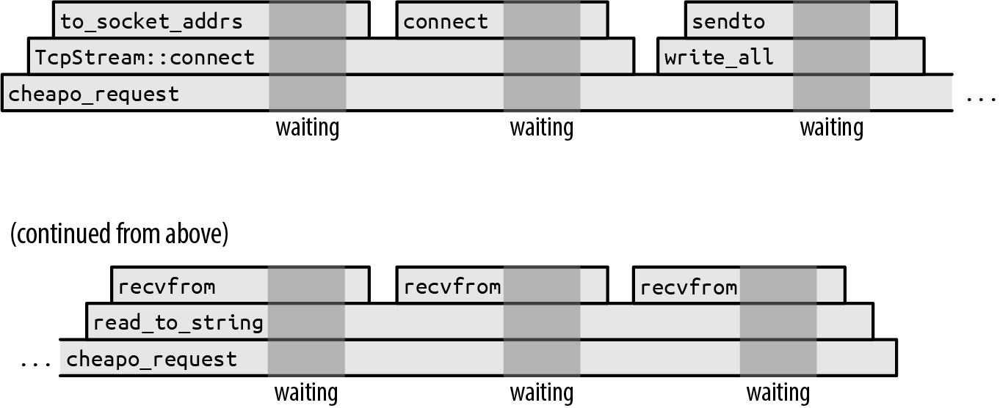
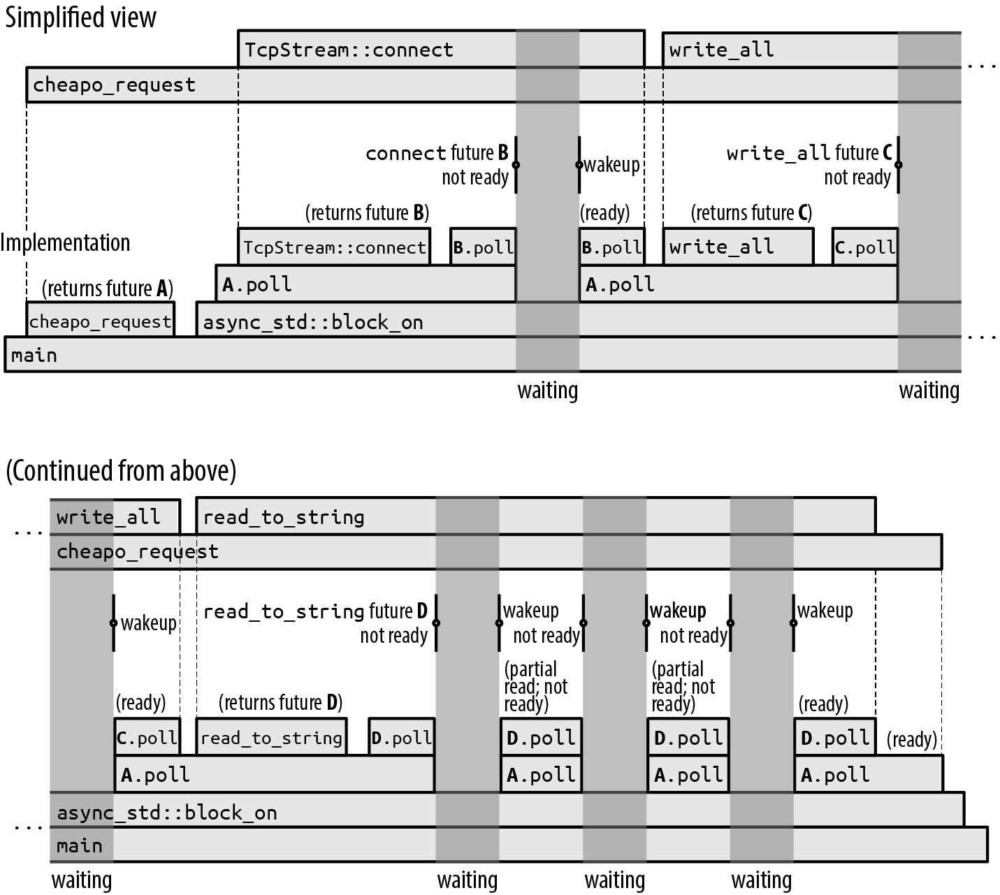
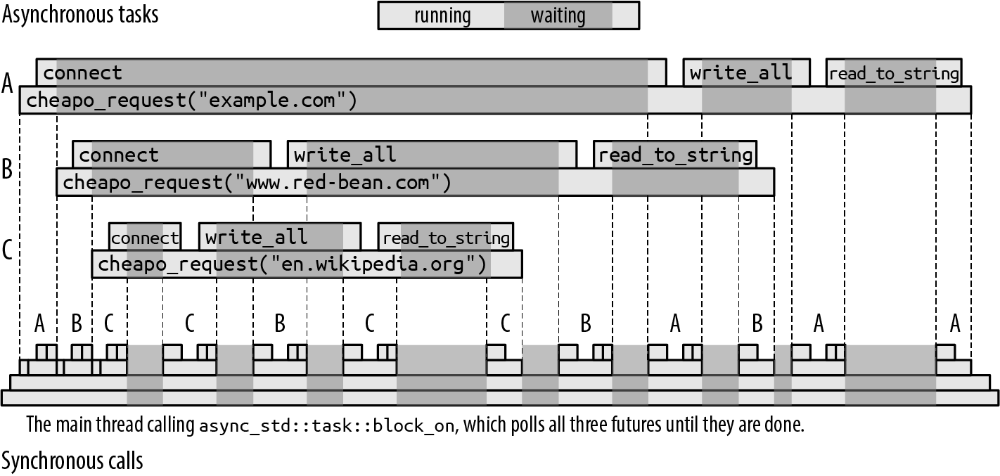
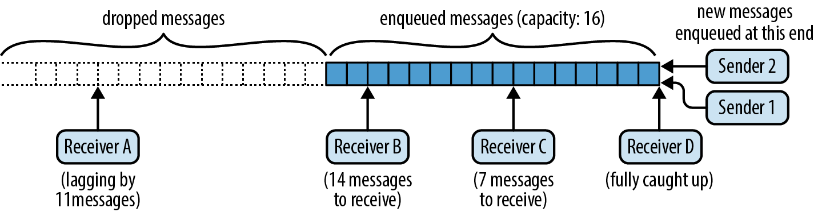
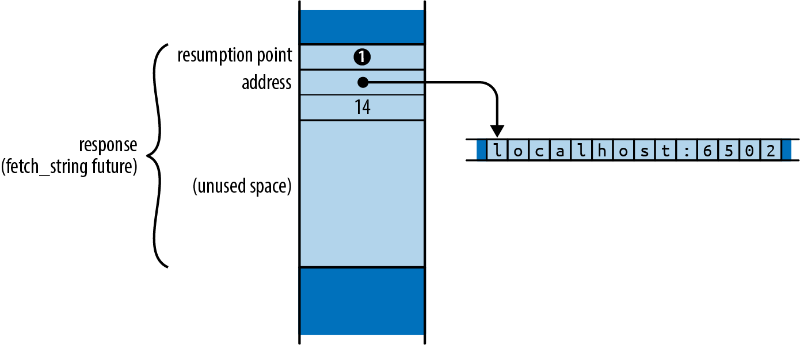
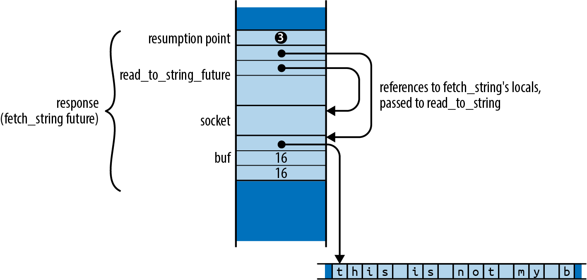
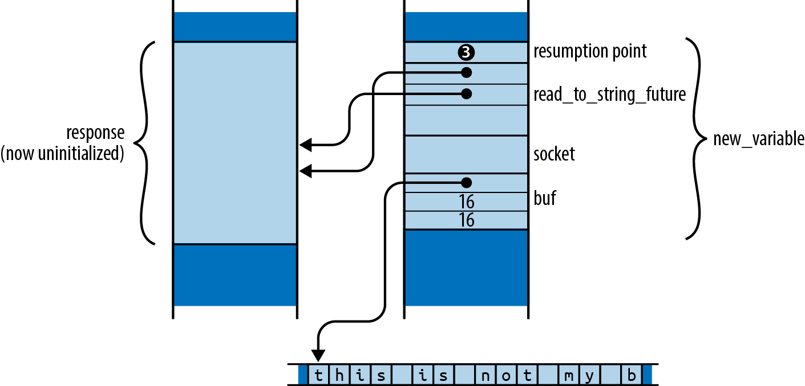

# Chapter 20. Asynchronous Programming

Suppose you’re writing a chat server. For each network connection, there are incoming packets to parse, outgoing packets to assemble, security parameters to manage, chat group subscriptions to track, and so on. Managing all this for many connections simultaneously is going to take some organization.

Ideally, you could just start a separate thread for each incoming connection:

```
use std::{net, thread};

let listener = net::TcpListener::bind(address)?;

for socket_result in listener.incoming() {
    let socket = socket_result?;
    let groups = chat_group_table.clone();
    thread::spawn(|| {
        log_error(serve(socket, groups));
    });
}
```

For each new connection, this spawns a fresh thread running the `serve` function, which is able to focus on managing a single connection’s needs.

This works well, until everything goes much better than planned and suddenly you have tens of thousands of users. It’s not unusual for a thread’s stack to grow to 100 KiB or more, and that is probably not how you want to spend gigabytes of server memory. Threads are good and necessary for distributing work across multiple processors, but their memory demands are such that we often need complementary ways, used together with threads, to break the work down.

You can use Rust *asynchronous tasks* to interleave many independent activities on a single thread or a pool of worker threads. Asynchronous tasks are similar to threads, but are much quicker to create, pass control amongst themselves more efficiently, and have memory overhead an order of magnitude less than that of a thread. It is perfectly feasible to have hundreds of thousands of asynchronous tasks running simultaneously in a single program. Of course, your application may still be limited by other factors like network bandwidth, database speed, computation, or the work’s inherent memory requirements, but the memory overhead inherent in the use of tasks is much less significant than that of threads.

Generally, asynchronous Rust code looks very much like ordinary multithreaded code, except that operations that might block, like I/O or acquiring mutexes, need to be handled a bit differently. Treating these specially gives Rust more information about how your code will behave, which is what makes the improved performance possible. The asynchronous version of the previous code looks like this:

```
use async_std::{net, task};

let listener = net::TcpListener::bind(address).await?;

let mut new_connections = listener.incoming();
while let Some(socket_result) = new_connections.next().await {
    let socket = socket_result?;
    let groups = chat_group_table.clone();
    task::spawn(async {
        log_error(serve(socket, groups).await);
    });
}
```

This uses the `async_std` crate’s networking and task modules and adds `.await` after the calls that may block. But the overall structure is the same as the thread-based version.

The goal of this chapter is not only to help you write asynchronous code, but also to show how it works in enough detail that you can anticipate how it will perform in your applications and see where it can be most valuable.

- To show the mechanics of asynchronous programming, we lay out a minimal set of language features that covers all the core concepts: futures, asynchronous functions, `await` expressions, tasks, and the `block_on` and `spawn_local` executors.

- Then we present asynchronous blocks and the `spawn` executor. These are essential to getting real work done, but conceptually, they’re just variants on the features we just mentioned. In the process, we point out a few issues you’re likely to encounter that are unique to asynchronous programming and explain how to handle them.

- To show all these pieces working together, we walk through the complete code for a chat server and client, of which the preceding code fragment is a part.

- To illustrate how primitive futures and executors work, we present simple but functional implementations of `spawn_blocking` and `block_on`.

- Finally, we explain the `Pin` type, which appears from time to time in asynchronous interfaces to ensure that asynchronous function and block futures are used safely.

# From Synchronous to Asynchronous

Consider what happens when you call the following (not async, completely traditional) function:

```
use std::io::prelude::*;
use std::net;

fn cheapo_request(host: &str, port: u16, path: &str)
                      -> std::io::Result<String>
{
    let mut socket = net::TcpStream::connect((host, port))?;

    let request = format!("GET {} HTTP/1.1\r\nHost: {}\r\n\r\n", path, host);
    socket.write_all(request.as_bytes())?;
    socket.shutdown(net::Shutdown::Write)?;

    let mut response = String::new();
    socket.read_to_string(&mut response)?;

    Ok(response)
}
```

This opens a TCP connection to a web server, sends it a bare-bones HTTP request in an outdated protocol,^(1) and then reads the response. Figure 20-1 shows this function’s execution over time.

This diagram shows how the function call stack behaves as time runs from left to right. Each function call is a box, placed atop its caller. Obviously, the `cheapo_request` function runs throughout the entire execution. It calls functions from the Rust standard library like `TcpStream::connect` and `TcpStream`’s implementations of `write_all` and `read_to_string`. These call other functions in turn, but eventually the program makes *system calls*, requests to the operating system to actually get something done, like open a TCP connection, or read or write some data.



###### Figure 20-1. Progress of a synchronous HTTP request (darker gray areas are waiting for the operating system)

The darker gray backgrounds mark the times when the program is waiting for the operating system to finish the system call. We didn’t draw these times to scale. If we had, the entire diagram would be darker gray: in practice, this function spends almost all of its time waiting for the operating system. The execution of the preceding code would be narrow slivers between the system calls.

While this function is waiting for the system calls to return, its single thread is blocked: it can’t do anything else until the system call finishes. It’s not unusual for a thread’s stack to be tens or hundreds of kilobytes in size, so if this were a fragment of some larger system, with many threads working away at similar jobs, locking down those threads’ resources to do nothing but wait could become quite expensive.

To get around this, a thread needs to be able to take up other work while it waits for system calls to complete. But it’s not obvious how to accomplish this. For example, the signature of the function we’re using to read the response from the socket is:

```
fn read_to_string(&mut self, buf: &mut String) -> std::io::Result<usize>;
```

It’s written right into the type: this function doesn’t return until the job is done, or something goes wrong. This function is *synchronous*: the caller resumes when the operation is complete. If we want to use our thread for other things while the operating system does its work, we’re going need a new I/O library that provides an *asynchronous* version of this function.

## Futures

Rust’s approach to supporting asynchronous operations is to introduce a trait, `std::future::Future`:

```
trait Future {
    type Output;
    // For now, read `Pin<&mut Self>` as `&mut Self`.
    fn poll(self: Pin<&mut Self>, cx: &mut Context<'_>) -> Poll<Self::Output>;
}

enum Poll<T> {
    Ready(T),
    Pending,
}
```

A `Future` represents an operation that you can test for completion. A future’s `poll` method never waits for the operation to finish: it always returns immediately. If the operation is complete, `poll` returns `Poll::Ready(output)`, where `output` is its final result. Otherwise, it returns `Pending`. If and when the future is worth polling again, it promises to let us know by invoking a *waker*, a callback function supplied in the `Context`. We call this the “piñata model” of asynchronous programming: the only thing you can do with a future is whack it with a `poll` until a value falls out.

All modern operating systems include variants of their system calls that we can use to implement this sort of polling interface. On Unix and Windows, for example, if you put a network socket in nonblocking mode, then reads and writes return an error if they would block; you have to try again later.

So an asynchronous version of `read_to_string` would have a signature roughly like this:

```
fn read_to_string(&mut self, buf: &mut String)
    -> impl Future<Output = Result<usize>>;
```

This is the same as the signature we showed earlier, except for the return type: the asynchronous version returns *a future of* a `Result<usize>`. You’ll need to poll this future until you get a `Ready(result)` from it. Each time it’s polled, the read proceeds as far as it can. The final `result` gives you the success value or an error value, just like an ordinary I/O operation. This is the general pattern: the asynchronous version of any function takes the same arguments as the synchronous version, but the return type has a `Future` wrapped around it.

Calling this version of `read_to_string` doesn’t actually read anything; its sole responsibility is to construct and return a future that will do the real work when polled. This future must hold all the information necessary to carry out the request made by the call. For example, the future returned by this `read_to_string` must remember the input stream it was called on, and the `String` to which it should append the incoming data. In fact, since the future holds the references `self` and `buf`, the proper signature for `read_to_string` must be:

```
fn read_to_string<'a>(&'a mut self, buf: &'a mut String)
    -> impl Future<Output = Result<usize>> + 'a;
```

This adds lifetimes to indicate that the future returned can live only as long as the values that `self` and `buf` are borrowing.

The `async-std` crate provides asynchronous versions of all of `std`’s I/O facilities, including an asynchronous `Read` trait with a `read_to_string` method. `async-std` closely follows the design of `std`, reusing `std`’s types in its own interfaces whenever possible, so errors, results, network addresses, and most of the other associated data are compatible between the two worlds. Familiarity with `std` helps you use `async-std`, and vice versa.

One of the rules of the `Future` trait is that, once a future has returned `Poll::Ready`, it may assume it will never be polled again. Some futures just return `Poll::Pending` forever if they are overpolled; others may panic or hang. (They must not, however, violate memory or thread safety, or otherwise cause undefined behavior.) The `fuse` adaptor method on the `Future` trait turns any future into one that simply returns `Poll::Pending` forever. But all the usual ways of consuming futures respect this rule, so `fuse` is usually not necessary.

If polling sounds inefficient, don’t worry. Rust’s asynchronous architecture is carefully designed so that, as long as your basic I/O functions like `read_to_string` are implemented correctly, you’ll only poll a future when it’s worthwhile. Every time `poll` is called, something somewhere should return `Ready`, or at least make progress toward that goal. We’ll explain how this works in “Primitive Futures and Executors: When Is a Future Worth Polling Again?”.

But using futures seems like a challenge: when you poll, what should you do when you get `Poll::Pending`? You’ll have to scrounge around for some other work this thread can do for the time being, without forgetting to come back to this future later and poll it again. Your entire program will be overgrown with plumbing keeping track of who’s pending and what should be done once they’re ready. The simplicity of our `cheapo_request` function is ruined.

Good news! It isn’t.

## Async Functions and Await Expressions

Here’s a version of `cheapo_request` written as an *asynchronous function*:

```
use async_std::io::prelude::*;
use async_std::net;

async fn cheapo_request(host: &str, port: u16, path: &str)
                            -> std::io::Result<String>
{
    let mut socket = net::TcpStream::connect((host, port)).await?;

    let request = format!("GET {} HTTP/1.1\r\nHost: {}\r\n\r\n", path, host);
    socket.write_all(request.as_bytes()).await?;
    socket.shutdown(net::Shutdown::Write)?;

    let mut response = String::new();
    socket.read_to_string(&mut response).await?;

    Ok(response)
}
```

This is token for token the same as our original version, except:

- The function starts with `async fn` instead of `fn`.

- It uses the `async_std` crate’s asynchronous versions of `TcpStream::connect`, `write_all`, and `read_to_string`. These all return futures of their results. (The examples in this section use version `1.7` of `async_std`.)

- After each call that returns a future, the code says `.await`. Although this looks like a reference to a struct field named `await`, it is actually special syntax built into the language for waiting until a future is ready. An `await` expression evaluates to the final value of the future. This is how the function obtains the results from `connect`, `write_all`, and `read_to_string`.

Unlike an ordinary function, when you call an asynchronous function, it returns immediately, before the body begins execution at all. Obviously, the call’s final return value hasn’t been computed yet; what you get is a *future of* its final value. So if you execute this code:

```
let response = cheapo_request(host, port, path);
```

then `response` will be a future of a `std::io::Result<String>`, and the body of `cheapo_request` has not yet begun execution. You don’t need to adjust an asynchronous function’s return type; Rust automatically treats `async fn f(...) -> T` as a function that returns a future of a `T`, not a `T` directly.

The future returned by an async function wraps up all the information the function body will need to run: the function’s arguments, space for its local variables, and so on. (It’s as if you’d captured the call’s stack frame as an ordinary Rust value.) So `response` must hold the values passed for `host`, `port`, and `path`, since `cheapo_request`’s body is going to need those to run.

The future’s specific type is generated automatically by the compiler, based on the function’s body and arguments. This type doesn’t have a name; all you know about it is that it implements `Future<Output=R>`, where `R` is the async function’s return type. In this sense, futures of asynchronous functions are like closures: closures also have anonymous types, generated by the compiler, that implement the `FnOnce`, `Fn`, and `FnMut` traits.

When you first poll the future returned by `cheapo_request`, execution begins at the top of the function body and runs until the first `await` of the future returned by `TcpStream::connect`. The `await` expression polls the `connect` future, and if it is not ready, then it returns `Poll::Pending` to its own caller: polling `cheapo_request`’s future cannot proceed past that first `await` until a poll of `TcpStream::connect`’s future returns `Poll::Ready`. So a rough equivalent of the expression `TcpStream::connect(...).await` might be:

```
{
    // Note: this is pseudocode, not valid Rust
    let connect_future = TcpStream::connect(...);
    'retry_point:
    match connect_future.poll(cx) {
        Poll::Ready(value) => value,
        Poll::Pending => {
            // Arrange for the next `poll` of `cheapo_request`'s
            // future to resume execution at 'retry_point.
            ...
            return Poll::Pending;
        }
    }
}
```

An `await` expression takes ownership of the future and then polls it. If it’s ready, then the future’s final value is the value of the `await` expression, and execution continues. Otherwise, it returns the `Poll::Pending` to its own caller.

But crucially, the next poll of `cheapo_request`’s future doesn’t start at the top of the function again: instead, it *resumes* execution mid-function at the point where it is about to poll `connect_future`. We don’t progress to the rest of the async function until that future is ready.

As `cheapo_request`’s future continues to be polled, it will work its way through the function body from one `await` to the next, moving on only when the subfuture it’s awaiting is ready. Thus, how many times `cheapo_request`’s future must be polled depends on both the behavior of the subfutures and the function’s own control flow. `cheapo_request`’s future tracks the point at which the next `poll` should resume, and all the local state—variables, arguments, temporaries—that resumption will need.

The ability to suspend execution mid-function and then resume later is unique to async functions. When an ordinary function returns, its stack frame is gone for good. Since `await` expressions depend on the ability to resume, you can only use them inside async functions.

As of this writing, Rust does not yet allow traits to have asynchronous methods. Only free functions and functions inherent to a specific type can be asynchronous. Lifting this restriction will require a number of changes to the language. In the meantime, if you need to define traits that include async functions, consider using the `async-trait` crate, which provides a macro-based workaround.

## Calling Async Functions from Synchronous Code: block_on

In a sense, async functions just pass the buck. True, it’s easy to get a future’s value in an async function: just `await` it. But the async function *itself* returns a future, so it’s now the caller’s job to do the polling somehow. Ultimately, someone has to actually wait for a value.

We can call `cheapo_request` from an ordinary, synchronous function (like `main`, for example) using `async_std`’s `task::block_on` function, which takes a future and polls it until it produces a value:

```
fn main() -> std::io::Result<()> {
    use async_std::task;

    let response = task::block_on(cheapo_request("example.com", 80, "/"))?;
    println!("{}", response);
    Ok(())
}
```

Since `block_on` is a synchronous function that produces the final value of an asynchronous function, you can think of it as an adapter from the asynchronous world to the synchronous world. But its blocking character also means that you should never use `block_on` within an async function: it would block the entire thread until the value is ready. Use `await` instead.

Figure 20-2 shows one possible execution of `main`.

The upper timeline, “Simplified view,” shows an abstracted view of the program’s asynchronous calls: `cheapo_request` first calls `TcpStream::connect` to obtain a socket and then calls `write_all` and `read_to_string` on that socket. Then it returns. This is very similar to the timeline for the synchronous version of `cheapo_request` earlier in this chapter.



###### Figure 20-2. Blocking on an asynchronous function

But each of those asynchronous calls is a multistep process: a future is created and then polled until it’s ready, perhaps creating and polling other subfutures in the process. The lower timeline, “Implementation,” shows the actual synchronous calls that implement this asynchronous behavior. This is a good opportunity to walk through exactly what’s going on in ordinary asynchronous execution:

- First, `main` calls `cheapo_request`, which returns future `A` of its final result. Then `main` passes that future to `async_std::block_on`, which polls it.

- Polling future `A` allows the body of `cheapo_request` to begin execution. It calls `TcpStream::connect` to obtain a future `B` of a socket and then awaits that. More precisely, since `TcpStream::connect` might encounter an error, `B` is a future of a `Result<TcpStream, std::io::Error>`.

- Future `B` gets polled by the `await`. Since the network connection is not yet established, `B.poll` returns `Poll::Pending`, but arranges to wake up the calling task once the socket is ready.

- Since future `B` wasn’t ready, `A.poll` returns `Poll::Pending` to its own caller, `block_on`.

- Since `block_on` has nothing better to do, it goes to sleep. The entire thread is blocked now.

- When `B`’s connection is ready to use, it wakes up the task that polled it. This stirs `block_on` into action, and it tries polling the future `A` again.

- Polling `A` causes `cheapo_request` to resume in its first `await`, where it polls `B` again.

- This time, `B` is ready: socket creation is complete, so it returns `Poll::Ready(Ok(socket))` to `A.poll`.

- The asynchronous call to `TcpStream::connect` is now complete. The value of the `TcpStream::connect(...).await` expression is thus `Ok(socket)`.

- The execution of `cheapo_request`’s body proceeds normally, building the request string using the `format!` macro and passing it to `socket.write_all`.

- Since `socket.write_all` is an asynchronous function, it returns a future `C` of its result, which `cheapo_request` duly awaits.

The rest of the story is similar. In the execution shown in Figure 20-2, the future of `socket.read_to_string` gets polled four times before it is ready; each of these wakeups reads *some* data from the socket, but `read_to_string` is specified to read all the way to the end of the input, and this takes several operations.

It doesn’t sound too hard to just write a loop that calls `poll` over and over. But what makes `async_std::task::block_on` valuable is that it knows how to go to sleep until the future is actually worth polling again, rather than wasting your processor time and battery life making billions of fruitless `poll` calls. The futures returned by basic I/O functions like `connect` and `read_to_string` retain the waker supplied by the `Context` passed to `poll` and invoke it when `block_on` should wake up and try polling again. We’ll show exactly how this works by implementing a simple version of `block_on` ourselves in “Primitive Futures and Executors: When Is a Future Worth Polling Again?”.

Like the original, synchronous version we presented earlier, this asynchronous version of `cheapo_request` spends almost all of its time waiting for operations to complete. If the time axis were drawn to scale, the diagram would be almost entirely dark gray, with tiny slivers of computation occurring when the program gets woken up.

This is a lot of detail. Fortunately, you can usually just think in terms of the simplified upper timeline: some function calls are sync, others are async and need an `await`, but they’re all just function calls. The success of Rust’s asynchronous support depends on helping programmers work with the simplified view in practice, without being distracted by the back-and-forth of the implementation.

## Spawning Async Tasks

The `async_std::task::block_on` function blocks until a future’s value is ready. But blocking a thread completely on a single future is no better than a synchronous call: the goal of this chapter is to get the thread *doing other work* while it’s waiting.

For this, you can use `async_std::task::spawn_local`. This function takes a future and adds it to a pool that `block_on` will try polling whenever the future it’s blocking on isn’t ready. So if you pass a bunch of futures to `spawn_local` and then apply `block_on` to a future of your final result, `block_on` will poll each spawned future whenever it is able to make progress, running the entire pool concurrently until your result is ready.

As of this writing, `spawn_local` is available in `async-std` only if you enable that crate’s `unstable` feature. To do this, you’ll need to refer to `async-std` in your *Cargo.toml* with a line like this:

```
async-std = { version = "1", features = ["unstable"] }
```

The `spawn_local` function is an asynchronous analogue of the standard library’s `std::thread::spawn` function for starting threads:

- `std::thread::spawn(c)` takes a closure `c` and starts a thread running it, returning a `std::thread::JoinHandle` whose `join` method waits for the thread to finish and returns whatever `c` returned.

- `async_std::task::spawn_local(f)` takes the future `f` and adds it to the pool to be polled when the current thread calls `block_on`. `spawn_local` returns its own `async_std::task::JoinHandle` type, itself a future that you can await to retrieve `f`’s final value.

For example, suppose we want to make a whole set of HTTP requests concurrently. Here’s a first attempt:

```
pub async fn many_requests(requests: Vec<(String, u16, String)>)
                           -> Vec<std::io::Result<String>>
{
    use async_std::task;

    let mut handles = vec![];
    for (host, port, path) in requests {
        handles.push(task::spawn_local(cheapo_request(&host, port, &path)));
    }

    let mut results = vec![];
    for handle in handles {
        results.push(handle.await);
    }

    results
}
```

This function calls `cheapo_request` on each element of `requests`, passing each call’s future to `spawn_local`. It collects the resulting `JoinHandle`s in a vector and then awaits each of them. It’s fine to await the join handles in any order: since the requests are already spawned, their futures will be polled as needed whenever this thread calls `block_on` and has nothing better to do. All the requests will run concurrently. Once they’re complete, `many_requests` returns the results to its caller.

The previous code is almost correct, but Rust’s borrow checker is worried about the lifetime of `cheapo_request`’s future:

``` console
error: `host` does not live long enough

    handles.push(task::spawn_local(cheapo_request(&host, port, &path)));
                                   ---------------^^^^^--------------
                                   |              |
                                   |              borrowed value does not
                                   |              live long enough
                     argument requires that `host` is borrowed for `'static`
}
- `host` dropped here while still borrowed
```

There’s a similar error for `path` as well.

Naturally, if we pass references to an asynchronous function, the future it returns must hold those references, so the future cannot safely outlive the values they borrow. This is the same restriction that applies to any value that holds references.

The problem is that `spawn_local` can’t be sure you’ll wait for the task to finish before `host` and `path` are dropped. In fact, `spawn_local` only accepts futures whose lifetimes are `'static`, because you could simply ignore the `JoinHandle` it returns and let the task continue to run for the rest of the program’s execution. This isn’t unique to asynchronous tasks: you’ll get a similar error if you try to use `std::thread::spawn` to start a thread whose closure captures references to local variables.

One way to fix this is to create another asynchronous function that takes owned versions of the arguments:

```
async fn cheapo_owning_request(host: String, port: u16, path: String)
                               -> std::io::Result<String> {
    cheapo_request(&host, port, &path).await
}
```

This function takes `String`s instead of `&str` references, so its future owns the `host` and `path` strings itself, and its lifetime is `'static`. The borrow checker can see that it immediately awaits `cheapo_request`’s future, and hence, if that future is getting polled at all, the `host` and `path` variables it borrows must still be around. All is well.

Using `cheapo_owning_request`, you can spawn off all your requests like so:

```
for (host, port, path) in requests {
    handles.push(task::spawn_local(cheapo_owning_request(host, port, path)));
}
```

You can call `many_requests` from your synchronous `main` function, with `block_on`:

```
let requests = vec![
    ("example.com".to_string(),      80, "/".to_string()),
    ("www.red-bean.com".to_string(), 80, "/".to_string()),
    ("en.wikipedia.org".to_string(), 80, "/".to_string()),
];

let results = async_std::task::block_on(many_requests(requests));
for result in results {
    match result {
        Ok(response) => println!("{}", response),
        Err(err) => eprintln!("error: {}", err),
    }
}
```

This code runs all three requests concurrently from within the call to `block_on`. Each one makes progress as the opportunity arises while the others are blocked, all on the calling thread. Figure 20-3 shows one possible execution of the three calls to `cheapo_request`.

(We encourage you to try running this code yourself, with `eprintln!` calls added at the top of `cheapo_request` and after each `await` expression so that you can see how the calls interleave differently from one execution to the next.)



###### Figure 20-3. Running three asynchronous tasks on a single thread

The call to `many_requests` (not shown, for simplicity) has spawned three asynchronous tasks, which we’ve labeled `A`, `B`, and `C`. `block_on` begins by polling `A`, which starts connecting to `example.com`. As soon as this returns `Poll::Pending`, `block_on` turns its attention to the next spawned task, polling future `B`, and eventually `C`, which each begin connecting to their respective servers.

When all the pollable futures have returned `Poll::Pending`, `block_on` goes to sleep until one of the `TcpStream::connect` futures indicates that its task is worth polling again.

In this execution, the server `en.wikipedia.org` responds more quickly than the others, so that task finishes first. When a spawned task is done, it saves its value in its `JoinHandle` and marks it as ready, so that `many_requests` can proceed when it awaits it. Eventually, the other calls to `cheapo_request` will either succeed or return an error, and `many_requests` itself can return. Finally, `main` receives the vector of results from `block_on`.

All this execution takes place on a single thread, the three calls to `cheapo_request` being interleaved with each other through successive polls of their futures. An asynchronous call offers the appearance of a single function call running to completion, but this asynchronous call is realized by a series of synchronous calls to the future’s `poll` method. Each individual `poll` call returns quickly, yielding the thread so that another async call can take a turn.

We have finally achieved the goal we set out at the beginning of the chapter: letting a thread take on other work while it waits for I/O to complete so that the thread’s resources aren’t tied up doing nothing. Even better, this goal was met with code that looks very much like ordinary Rust code: some of the functions are marked `async`, some of the function calls are followed by `.await`, and we use functions from `async_std` instead of `std`, but otherwise, it’s ordinary Rust code.

One important difference to keep in mind between asynchronous tasks and threads is that switching from one async task to another happens only at `await` expressions, when the future being awaited returns `Poll::Pending`. This means that if you put a long-running computation in `cheapo_request`, none of the other tasks you passed to `spawn_local` will get a chance to run until it’s done. With threads, this problem doesn’t arise: the operating system can suspend any thread at any point and sets timers to ensure that no thread monopolizes the processor. Asynchronous code depends on the willing cooperation of the futures sharing the thread. If you need to have long-running computations coexist with asynchronous code, “Long Running Computations: yield_now and spawn_blocking” later in this chapter describes some options.

## Async Blocks

In addition to asynchronous functions, Rust also supports *asynchronous blocks*. Whereas an ordinary block statement returns the value of its last expression, an async block returns *a future of* the value of its last expression. You can use `await` expressions within an async block.

An async block looks like an ordinary block statement, preceded by the `async` keyword:

```
let serve_one = async {
    use async_std::net;

    // Listen for connections, and accept one.
    let listener = net::TcpListener::bind("localhost:8087").await?;
    let (mut socket, _addr) = listener.accept().await?;

    // Talk to client on `socket`.
    ...
};
```

This initializes `serve_one` with a future that, when polled, listens for and handles a single TCP connection. The block’s body does not begin execution until `serve_one` gets polled, just as an async function call doesn’t begin execution until its future is polled.

If you apply the `?` operator to an error in an async block, it just returns from the block, not from the surrounding function. For example, if the preceding `bind` call returns an error, the `?` operator returns it as `serve_one`’s final value. Similarly, `return` expressions return from the async block, not the enclosing function.

If an async block refers to variables defined in the surrounding code, its future captures their values, just as a closure would. And just like `move` closures (see “Closures That Steal”), you can start the block with `async move` to take ownership of the captured values, rather than just holding references to them.

Async blocks provide a concise way to separate out a section of code you’d like to run asynchronously. For example, in the previous section, `spawn_local` required a `'static` future, so we defined the `cheapo_owning_request` wrapper function to give us a future that took ownership of its arguments. You can get the same effect without the distraction of a wrapper function simply by calling `cheapo_request` from an async block:

```
pub async fn many_requests(requests: Vec<(String, u16, String)>)
                           -> Vec<std::io::Result<String>>
{
    use async_std::task;

    let mut handles = vec![];
    for (host, port, path) in requests {
        handles.push(task::spawn_local(async move {
            cheapo_request(&host, port, &path).await
        }));
    }
    ...
}
```

Since this is an `async move` block, its future takes ownership of the `String` values `host` and `path`, just the way a `move` closure would. It then passes references to `cheapo_request`. The borrow checker can see that the block’s `await` expression takes ownership of `cheapo_request`’s future, so the references to `host` and `path` cannot outlive the captured variables they borrow. The async block accomplishes the same thing as `cheapo_owning_request`, but with less boilerplate.

One rough edge you may encounter is that there is no syntax for specifying the return type of an async block, analogous to the `-> T` following the arguments of an async function. This can cause problems when using the `?` operator:

```
let input = async_std::io::stdin();
let future = async {
    let mut line = String::new();

    // This returns `std::io::Result<usize>`.
    input.read_line(&mut line).await?;

    println!("Read line: {}", line);

    Ok(())
};
```

This fails with the following error:

``` console
error: type annotations needed
   |
48 |     let future = async {
   |         ------ consider giving `future` a type
...
60 |         Ok(())
   |         ^^ cannot infer type for type parameter `E` declared
   |            on the enum `Result`
```

Rust can’t tell what the return type of the async block should be. The `read_line` method returns `Result<(), std::io::Error>`, but because the `?` operator uses the `From` trait to convert the error type at hand to whatever the situation requires, the async block’s return type could be `Result<(), E>` for any type `E` that implements `From<std::io::Error>`.

Future versions of Rust will probably add syntax for indicating an `async` block’s return type. For now, you can work around the problem by spelling out the type of the block’s final `Ok`:

```
let future = async {
    ...
    Ok::<(), std::io::Error>(())
};
```

Since `Result` is a generic type that expects the success and error types as its parameters, we can specify those type parameters when using `Ok` or `Err` as shown here.

## Building Async Functions from Async Blocks

Asynchronous blocks give us another way to get the same effect as an asynchronous function, with a little more flexibility. For example, we could write our `cheapo_request` example as an ordinary, synchronous function that returns the future of an async block:

```
use std::io;
use std::future::Future;

fn cheapo_request<'a>(host: &'a str, port: u16, path: &'a str)
    -> impl Future<Output = io::Result<String>> + 'a
{
    async move {
        ... function body ...
    }
}
```

When you call this version of the function, it immediately returns the future of the async block’s value. This captures the function’s arguments and behaves just like the future the asynchronous function would have returned. Since we’re not using the `async fn` syntax, we need to write out the `impl Future` in the return type, but as far as callers are concerned, these two definitions are interchangeable implementations of the same function signature.

This second approach can be useful when you want to do some computation immediately when the function is called, before creating the future of its result. For example, yet another way to reconcile `cheapo_request` with `spawn_local` would be to make it into a synchronous function returning a `'static` future that captures fully owned copies of its arguments:

```
fn cheapo_request(host: &str, port: u16, path: &str)
    -> impl Future<Output = io::Result<String>> + 'static
{
    let host = host.to_string();
    let path = path.to_string();

    async move {
        ... use &*host, port, and path ...
    }
}
```

This version lets the async block capture `host` and `path` as owned `String` values, not `&str` references. Since the future owns all the data it needs to run, it is valid for the `'static` lifetime. (We’ve spelled out `+ 'static` in the signature shown earlier, but `'static` is the default for `-> impl` return types, so omitting it would have no effect.)

Since this version of `cheapo_request` returns futures that are `'static`, we can pass them directly to `spawn_local`:

```
let join_handle = async_std::task::spawn_local(
    cheapo_request("areweasyncyet.rs", 80, "/")
);

... other work ...

let response = join_handle.await?;
```

## Spawning Async Tasks on a Thread Pool

The examples we’ve shown so far spend almost all their time waiting for I/O, but some workloads are more of a mix of processor work and blocking. When you have enough computation to do that a single processor can’t keep up, you can use `async_std::task::spawn` to spawn a future onto a pool of worker threads dedicated to polling futures that are ready to make progress.

`async_std::task::spawn` is used like `async_std::task::spawn_local`:

```
use async_std::task;

let mut handles = vec![];
for (host, port, path) in requests {
    handles.push(task::spawn(async move {
        cheapo_request(&host, port, &path).await
    }));
}
...
```

Like `spawn_local`, `spawn` returns a `JoinHandle` value you can await to get the future’s final value. But unlike `spawn_local`, the future doesn’t have to wait for you to call `block_on` before it gets polled. As soon as one of the threads from the thread pool is free, it will try polling it.

In practice, `spawn` is more widely used than `spawn_local`, simply because people like to know that their workload, no matter what its mix of computation and blocking, is balanced across the machine’s resources.

One thing to keep in mind when using `spawn` is that the thread pool tries to stay busy, so your future gets polled by whichever thread gets around to it first. An async call may begin execution on one thread, block on an `await` expression, and get resumed in a different thread. So while it’s a reasonable simplification to view an async function call as a single, connected execution of code (indeed, the purpose of asynchronous functions and `await` expressions is to encourage you to think of it that way), the call may actually be carried out by many different threads.

If you’re using thread-local storage, it may be surprising to see the data you put there before an `await` expression replaced by something entirely different afterward, because your task is now being polled by a different thread from the pool. If this is a problem, you should instead use *task-local storage*; see the `async-std` crate’s documentation for the `task_local!` macro for details.

## But Does Your Future Implement Send?

There is one restriction `spawn` imposes that `spawn_local` does not. Since the future is being sent off to another thread to run, the future must implement the `Send` marker trait. We presented `Send` in “Thread Safety: Send and Sync”. A future is `Send` only if all the values it contains are `Send`: all the function arguments, local variables, and even anonymous temporary values must be safe to move to another thread.

As before, this requirement isn’t unique to asynchronous tasks: you’ll get a similar error if you try to use `std::thread::spawn` to start a thread whose closure captures non-`Send` values. The difference is that, whereas the closure passed to `std::thread::spawn` stays on the thread that was created to run it, a future spawned on a thread pool can move from one thread to another any time it awaits.

This restriction is easy to trip over by accident. For example, the following code looks innocent enough:

```
use async_std::task;
use std::rc::Rc;

async fn reluctant() -> String {
    let string = Rc::new("ref-counted string".to_string());

    some_asynchronous_thing().await;

    format!("Your splendid string: {}", string)
}

task::spawn(reluctant());
```

An asynchronous function’s future needs to hold enough information for the function to continue from an `await` expression. In this case, `reluctant`’s future must use `string` after the `await`, so the future will, at least sometimes, contain an `Rc<String>` value. Since `Rc` pointers cannot be safely shared between threads, the future itself cannot be `Send`. And since `spawn` only accepts futures that are `Send`, Rust objects:

``` console
error: future cannot be sent between threads safely
    |
17  |     task::spawn(reluctant());
    |     ^^^^^^^^^^^ future returned by `reluctant` is not `Send`
    |

    |
127 | T: Future + Send + 'static,
    |             ---- required by this bound in `async_std::task::spawn`
    |
    = help: within `impl Future`, the trait `Send` is not implemented
            for `Rc<String>`
note: future is not `Send` as this value is used across an await
    |
10  |         let string = Rc::new("ref-counted string".to_string());
    |             ------ has type `Rc<String>` which is not `Send`
11  |
12  |         some_asynchronous_thing().await;
    |         ^^^^^^^^^^^^^^^^^^^^^^^^^^^^^^^
                  await occurs here, with `string` maybe used later
...
15  |     }
    |     - `string` is later dropped here
```

This error message is long, but it has a lot of helpful detail:

- It explains why the future needs to be `Send`: `task::spawn` requires it.

- It explains which value is not `Send`: the local variable `string`, whose type is `Rc<String>`.

- It explains why `string` affects the future: it is in scope across the indicated `await`.

There are two ways to fix this problem. One is to restrict the scope of the non-`Send` value so that it doesn’t cover any `await` expressions and thus doesn’t need to be saved in the function’s future:

```
async fn reluctant() -> String {
    let return_value = {
        let string = Rc::new("ref-counted string".to_string());
        format!("Your splendid string: {}", string)
        // The `Rc<String>` goes out of scope here...
    };

    // ... and thus is not around when we suspend here.
    some_asynchronous_thing().await;

    return_value
}
```

Another solution is simply to use `std::sync::Arc` instead of `Rc`. `Arc` uses atomic updates to manage its reference counts, which makes it a bit slower, but `Arc` pointers are `Send`.

Although eventually you’ll learn to recognize and avoid non-`Send` types, they can be a bit surprising at first. (At least, your authors were often surprised.) For example, older Rust code sometimes uses generic result types like this:

```
// Not recommended!
type GenericError = Box<dyn std::error::Error>;
type GenericResult<T> = Result<T, GenericError>;
```

This `GenericError` type uses a boxed trait object to hold a value of any type that implements `std::error::Error`. But it doesn’t place any further restrictions on it: if someone had a non-`Send` type that implemented `Error`, they could convert a boxed value of that type to a `GenericError`. Because of this possibility, `GenericError` is not `Send`, and the following code won’t work:

```
fn some_fallible_thing() -> GenericResult<i32> {
    ...
}

// This function's future is not `Send`...
async fn unfortunate() {
    // ... because this call's value ...
    match some_fallible_thing() {
        Err(error) => {
            report_error(error);
        }
        Ok(output) => {
            // ... is alive across this await ...
            use_output(output).await;
        }
    }
}

// ... and thus this `spawn` is an error.
async_std::task::spawn(unfortunate());
```

As with the earlier example, the error message from the compiler explains what’s going on, pointing to the `Result` type as the culprit. Since Rust considers the result of `some_fallible_thing` to be present for the entire `match` statement, including the `await` expression, it determines that the future of `unfortunate` is not `Send`. This error is overcautious on Rust’s part: although it’s true that `GenericError` is not safe to send to another thread, the `await` only occurs when the result is `Ok`, so the error value never actually exists when we await `use_output`’s future.

The ideal solution is to use stricter generic error types like the ones we suggested in “Working with Multiple Error Types”:

```
type GenericError = Box<dyn std::error::Error + Send + Sync + 'static>;
type GenericResult<T> = Result<T, GenericError>;
```

This trait object explicitly requires the underlying error type to implement `Send`, and all is well.

If your future is not `Send` and you cannot conveniently make it so, then you can still use `spawn_local` to run it on the current thread. Of course, you’ll need to make sure the thread calls `block_on` at some point, to give it a chance to run, and you won’t benefit from distributing the work across multiple processors.

## Long Running Computations: yield_now and spawn_blocking

For a future to share its thread nicely with other tasks, its `poll` method should always return as quickly as possible. But if you’re carrying out a long computation, it could take a long time to reach the next `await`, making other asynchronous tasks wait longer than you’d like for their turn on the thread.

One way to avoid this is simply to `await` something occasionally. The `async_std::task::yield_now` function returns a simple future designed for this:

```
while computation_not_done() {
    ... do one medium-sized step of computation ...
    async_std::task::yield_now().await;
}
```

The first time the `yield_now` future is polled, it returns `Poll::Pending`, but says it’s worth polling again soon. The effect is that your asynchronous call gives up the thread and other tasks get a chance to run, but your call will get another turn soon. The second time `yield_now`’s future is polled, it returns `Poll::Ready(())`, and your async function can resume execution.

This approach isn’t always feasible, however. If you’re using an external crate to do the long-running computation or calling out to C or C++, it may not be convenient to change that code to be more async-friendly. Or it may be difficult to ensure that every path through the computation is sure to hit the `await` from time to time.

For cases like this, you can use `async_std::task::spawn_blocking`. This function takes a closure, starts it running on its own thread, and returns a future of its return value. Asynchronous code can await that future, yielding its thread to other tasks until the computation is ready. By putting the hard work on a separate thread, you can let the operating system take care of making it share the processor nicely.

For example, suppose we need to check passwords supplied by users against the hashed versions we’ve stored in our authentication database. For security, verifying a password needs to be computationally intensive so that even if attackers get a copy of our database, they can’t simply try trillions of possible passwords to see if any match. The `argonautica` crate provides a hash function designed specifically for storing passwords: a properly generated `argonautica` hash takes a significant fraction of a second to verify. We can use `argonautica` (version `0.2`) in our asynchronous application like this:

```
async fn verify_password(password: &str, hash: &str, key: &str)
                        -> Result<bool, argonautica::Error>
{
    // Make copies of the arguments, so the closure can be 'static.
    let password = password.to_string();
    let hash = hash.to_string();
    let key = key.to_string();

    async_std::task::spawn_blocking(move || {
        argonautica::Verifier::default()
            .with_hash(hash)
            .with_password(password)
            .with_secret_key(key)
            .verify()
    }).await
}
```

This returns `Ok(true)` if `password` matches `hash`, given `key`, a key for the database as a whole. By doing the verification in the closure passed to `spawn_blocking`, we push the expensive computation onto its own thread, ensuring that it will not affect our responsiveness to other users’ requests.

## Comparing Asynchronous Designs

In many ways Rust’s approach to asynchronous programming resembles that taken by other languages. For example, JavaScript, C#, and Rust all have asynchronous functions with `await` expressions. And all these languages have values that represent incomplete computations: Rust calls them “futures,” JavaScript calls them “promises,” and C# calls them “tasks,” but they all represent a value that you may have to wait for.

Rust’s use of polling, however, is unusual. In JavaScript and C#, an asynchronous function begins running as soon as it is called, and there is a global event loop built into the system library that resumes suspended async function calls when the values they were awaiting become available. In Rust, however, an async call does nothing until you pass it to a function like `block_on`, `spawn`, or `spawn_local` that will poll it and drive the work to completion. These functions, called *executors*, play the role that other languages cover with a global event loop.

Because Rust makes you, the programmer, choose an executor to poll your futures, Rust has no need for a global event loop built into the system. The `async-std` crate offers the executor functions we’ve used in this chapter so far, but the `tokio` crate, which we’ll use later in this chapter, defines its own set of similar executor functions. And toward the end of this chapter, we’ll implement our own executor. You can use all three in the same program.

## A Real Asynchronous HTTP Client

We would be remiss if we did not show an example of using a proper asynchronous HTTP client crate, since it is so easy, and there are several good crates to choose from, including `reqwest` and `surf`.

Here’s a rewrite of `many_requests`, even simpler than the one based on `cheapo_request`, that uses `surf` to run a series of requests concurrently. You’ll need these dependencies in your *Cargo.toml* file:

```
[dependencies]
async-std = "1.7"
surf = "1.0"
```

Then, we can define `many_requests` as follows:

```
pub async fn many_requests(urls: &[String])
                           -> Vec<Result<String, surf::Exception>>
{
    let client = surf::Client::new();

    let mut handles = vec![];
    for url in urls {
        let request = client.get(&url).recv_string();
        handles.push(async_std::task::spawn(request));
    }

    let mut results = vec![];
    for handle in handles {
        results.push(handle.await);
    }

    results
}

fn main() {
    let requests = &["http://example.com".to_string(),
                     "https://www.red-bean.com".to_string(),
                     "https://en.wikipedia.org/wiki/Main_Page".to_string()];

    let results = async_std::task::block_on(many_requests(requests));
    for result in results {
        match result {
            Ok(response) => println!("*** {}\n", response),
            Err(err) => eprintln!("error: {}\n", err),
        }
    }
}
```

Using a single `surf::Client` to make all our requests lets us reuse HTTP connections if several of them are directed at the same server. And no async block is needed: since `recv_string` is an asynchronous method that returns a `Send + 'static` future, we can pass its future directly to `spawn`.

# An Asynchronous Client and Server

It’s time to take the key ideas we’ve discussed so far and assemble them into a working program. To a large extent, asynchronous applications resemble ordinary multi-threaded applications, but there are new opportunities for compact and expressive code that you can look out for.

This section’s example is a chat server and client. Check out the [complete code](https://oreil.ly/QFSUS). Real chat systems are complicated, with concerns ranging from security and reconnection to privacy and moderation, but we’ve pared ours down to an austere set of features in order to focus on a few points of interest.

In particular, we want to handle *backpressure* well. By this we mean that if one client has a slow net connection or drops its connection entirely, that must never affect other clients’ ability to exchange messages at their own pace. And since a slow client should not make the server spend unbounded memory holding on to its ever-growing backlog of messages, our server should drop messages for clients that can’t keep up, but notify them that their stream is incomplete. (A real chat server would log messages to disk and let clients retrieve those they’ve missed, but we’ve left that out.)

We start the project with the command `cargo new --lib async-chat` and put the following text in *async-chat/Cargo.toml*:

```
[package]
name = "async-chat"
version = "0.1.0"
authors = ["You <you@example.com>"]
edition = "2021"

[dependencies]
async-std = { version = "1.7", features = ["unstable"] }
tokio = { version = "1.0", features = ["sync"] }
serde = { version = "1.0", features = ["derive", "rc"] }
serde_json = "1.0"
```

We’re depending on four crates:

- The `async-std` crate is the collection of asynchronous I/O primitives and utilities we’ve been using throughout the chapter.

- The `tokio` crate is another collection of asynchronous primitives like `async-std`, one of the oldest and most mature. It’s widely used and holds its design and implementation to high standards, but requires a bit more care to use than `async-std`.

  `tokio` is a large crate, but we need only one component from it, so the `features = ["sync"]` field in the *Cargo.toml* dependency line pares `tokio` down to the parts that we need, making this a light dependency.

  When the asynchronous library ecosystem was less mature, people avoided using both `tokio` and `async-std` in the same program, but the two projects have been cooperating to make sure this works, as long as each crate’s documented rules are followed.

- The `serde` and `serde_json` crates we’ve seen before, in Chapter 18. These give us convenient and efficient tools for generating and parsing JSON, which our chat protocol uses to represent data on the network. We want to use some optional features from `serde`, so we select those when we give the dependency.

The entire structure of our chat application, client and server, looks like this:

``` console
async-chat
├── Cargo.toml
└── src
    ├── lib.rs
    ├── utils.rs
    └── bin
        ├── client.rs
        └── server
            ├── main.rs
            ├── connection.rs
            ├── group.rs
            └── group_table.rs
```

This package layout uses a Cargo feature we touched on in “The src/bin Directory”: in addition to the main library crate, *src/lib.rs*, with its submodule *src/utils.rs*, it also includes two executables:

- *src/bin/client.rs* is a single-file executable for the chat client.

- *src/bin/server* is the server executable, spread across four files: *main.rs* holds the `main` function, and there are three submodules, *connection.rs*, *group.rs*, and *group_table.rs*.

We’ll present the contents of each source file over the course of the chapter, but once they’re all in place, if you type `cargo build` in this tree, that compiles the library crate and then builds both executables. Cargo automatically includes the library crate as a dependency, making it a convenient place to put definitions shared by the client and server. Similarly, `cargo check` checks the entire source tree. To run either of the executables, you can use commands like these:

``` console
$ cargo run --release --bin server -- localhost:8088
$ cargo run --release --bin client -- localhost:8088
```

The `--bin` option indicates which executable to run, and any arguments following the `--` option get passed to the executable itself. Our client and server just want to know the server’s address and TCP port.

## Error and Result Types

The library crate’s `utils` module defines the result and error types we’ll use throughout the application. From *src/utils.rs*:

```
use std::error::Error;

pub type ChatError = Box<dyn Error + Send + Sync + 'static>;
pub type ChatResult<T> = Result<T, ChatError>;
```

These are the general-purpose error types we suggested in “Working with Multiple Error Types”. The `async_std`, `serde_json`, and `tokio` crates each define their own error types, but the `?` operator can automatically convert them all into a `ChatError`, using the standard library’s implementation of the `From` trait that can convert any suitable error type to `Box<dyn Error + Send + Sync + 'static>`. The `Send` and `Sync` bounds ensure that if a task spawned onto another thread fails, it can safely report the error to the main thread.

In a real application, consider using the `anyhow` crate, which provides `Error` and `Result` types similar to these. The `anyhow` crate is easy to use and provides some nice features beyond what our `ChatError` and `ChatResult` can offer.

## The Protocol

The library crate captures our entire chat protocol in these two types, defined in *lib.rs*:

```
use serde::{Deserialize, Serialize};
use std::sync::Arc;

pub mod utils;

#[derive(Debug, Deserialize, Serialize, PartialEq)]
pub enum FromClient {
    Join { group_name: Arc<String> },
    Post {
        group_name: Arc<String>,
        message: Arc<String>,
    },
}

#[derive(Debug, Deserialize, Serialize, PartialEq)]
pub enum FromServer {
    Message {
        group_name: Arc<String>,
        message: Arc<String>,
    },
    Error(String),
}


#[test]
fn test_fromclient_json() {
    use std::sync::Arc;

    let from_client = FromClient::Post {
        group_name: Arc::new("Dogs".to_string()),
        message: Arc::new("Samoyeds rock!".to_string()),
    };

    let json = serde_json::to_string(&from_client).unwrap();
    assert_eq!(json,
               r#"{"Post":{"group_name":"Dogs","message":"Samoyeds rock!"}}"#);

    assert_eq!(serde_json::from_str::<FromClient>(&json).unwrap(),
               from_client);
}
```

The `FromClient` enum represents the packets a client can send to the server: it can ask to join a group and post messages to any group it has joined. `FromServer` represents what the server can send back: messages posted to some group, and error messages. Using a reference-counted `Arc<String>` instead of a plain `String` helps the server avoid making copies of strings as it manages groups and distributes messages.

The `#[derive]` attributes tell the `serde` crate to generate implementations of its `Serialize` and `Deserialize` traits for `FromClient` and `FromServer`. This lets us call `serde_json::to_string` to convert them to JSON values, send them across the network, and finally call `serde_json::from_str` to convert them back into their Rust forms.

The `test_fromclient_json` unit test illustrates how this is used. Given the `Serialize` implementation derived by `serde`, we can call `serde_json::to_string` to turn the given `FromClient` value into this JSON:

``` json
{"Post":{"group_name":"Dogs","message":"Samoyeds rock!"}}
```

Then the derived `Deserialize` implementation parses that back into an equivalent `FromClient` value. Note that the `Arc` pointers in `FromClient` have no effect on the serialized form: the reference-counted strings appear directly as JSON object member values.

## Taking User Input: Asynchronous Streams

Our chat client’s first responsibility is to read commands from the user and send the corresponding packets to the server. Managing a proper user interface is beyond the scope of this chapter, so we’re going to do the simplest possible thing that works: reading lines directly from standard input. The following code goes in *src/bin/client.rs*:

```
use async_std::prelude::*;
use async_chat::utils::{self, ChatResult};
use async_std::io;
use async_std::net;

async fn send_commands(mut to_server: net::TcpStream) -> ChatResult<()> {
    println!("Commands:\n\
              join GROUP\n\
              post GROUP MESSAGE...\n\
              Type Control-D (on Unix) or Control-Z (on Windows) \
              to close the connection.");

    let mut command_lines = io::BufReader::new(io::stdin()).lines();
    while let Some(command_result) = command_lines.next().await {
        let command = command_result?;
        // See the GitHub repo for the definition of `parse_command`.
        let request = match parse_command(&command) {
            Some(request) => request,
            None => continue,
        };

        utils::send_as_json(&mut to_server, &request).await?;
        to_server.flush().await?;
    }

    Ok(())
}
```

This calls `async_std::io::stdin` to get an asynchronous handle on the client’s standard input, wraps it in an `async_std::io::BufReader` to buffer it, and then calls `lines` to process the user’s input line by line. It tries to parse each line as a command corresponding to some `FromClient` value and, if it succeeds, sends that value to the server. If the user enters an unrecognized command, `parse_command` prints an error message and returns `None`, so `send_commands` can go around the loop again. If the user types an end-of-file indication, then the `lines` stream returns `None`, and `send_commands` returns. This is very much like the code you would write in an ordinary, synchronous program, except that it uses `async_std`’s versions of the library features.

The asynchronous `BufReader`’s `lines` method is interesting. It can’t return an iterator, the way the standard library does: the `Iterator::next` method is an ordinary synchronous function, so calling `command_lines.next()` would block the thread until the next line was ready. Instead, `lines` returns a *stream* of `Result<String>` values. A stream is the asynchronous analogue of an iterator: it produces a sequence of values on demand, in an async-friendly fashion. Here’s the definition of the `Stream` trait, from the `async_std::stream` module:

```
trait Stream {
    type Item;

    // For now, read `Pin<&mut Self>` as `&mut Self`.
    fn poll_next(self: Pin<&mut Self>, cx: &mut Context<'_>)
        -> Poll<Option<Self::Item>>;
}
```

You can look at this as a hybrid of the `Iterator` and `Future` traits. Like an iterator, a `Stream` has an associated `Item` type and uses `Option` to indicate when the sequence has ended. But like a future, a stream must be polled: to get the next item (or learn that the stream has ended), you must call `poll_next` until it returns `Poll::Ready`. A stream’s `poll_next` implementation should always return quickly, without blocking. And if a stream returns `Poll::Pending`, it must notify the caller when it’s worth polling again via the `Context`.

The `poll_next` method is awkward to use directly, but you won’t generally need to do that. Like iterators, streams have a broad collection of utility methods like `filter` and `map`. Among these is a `next` method, which returns a future of the stream’s next `Option<Self::Item>`. Rather than polling the stream explicitly, you can call `next` and await the future it returns instead.

Putting these pieces together, `send_commands` consumes the stream of input lines by looping over the values produced by a stream using `next` with `while let`:

```
while let Some(item) = stream.next().await {
    ... use item ...
}
```

(Future versions of Rust will probably introduce an asynchronous variant of the `for` loop syntax for consuming streams, just as an ordinary `for` loop consumes `Iterator` values.)

Polling a stream after it has ended—that is, after it has returned `Poll::Ready(None)` to indicate the end of the stream—is like calling `next` on an iterator after it has returned `None`, or polling a future after it has returned `Poll::Ready`: the `Stream` trait doesn’t specify what the stream should do, and some streams may misbehave. Like futures and iterators, streams have a `fuse` method to ensure such calls behave predictably, when that’s needed; see the documentation for details.

When working with streams, it’s important to remember to use the `async_std` prelude:

```
use async_std::prelude::*;
```

This is because the utility methods for the `Stream` trait, like `next`, `map`, `filter`, and so on, are actually not defined on `Stream` itself. Instead, they are default methods of a separate trait, `StreamExt`, which is automatically implemented for all `Stream`s:

```
pub trait StreamExt: Stream {
    ... define utility methods as default methods ...
}

impl<T: Stream> StreamExt for T { }
```

This is an example of the *extension trait* pattern we described in “Traits and Other People’s Types”. The `async_std::prelude` module brings the `StreamExt` methods into scope, so using the prelude ensures its methods are visible in your code.

## Sending Packets

For transmitting packets on a network socket, our client and server use the `send_as_json` function from our library crate’s `utils` module:

```
use async_std::prelude::*;
use serde::Serialize;
use std::marker::Unpin;

pub async fn send_as_json<S, P>(outbound: &mut S, packet: &P) -> ChatResult<()>
where
    S: async_std::io::Write + Unpin,
    P: Serialize,
{
    let mut json = serde_json::to_string(&packet)?;
    json.push('\n');
    outbound.write_all(json.as_bytes()).await?;
    Ok(())
}
```

This function builds the JSON representation of `packet` as a `String`, adds a newline to the end, and then writes it all to `outbound`.

From its `where` clause, you can see that `send_as_json` is quite flexible. The type of packet to be sent, `P`, can be anything that implements `serde::Serialize`. The output stream `S` can be anything that implements `async_std::io::Write`, the asynchronous version of the `std::io::Write` trait for output streams. This is sufficient for us to send `FromClient` and `FromServer` values on an asynchronous `TcpStream`. Keeping the definition of `send_as_json` generic ensures that it doesn’t depend on the details of the stream or packet types in surprising ways: `send_as_json` can only use methods from those traits.

The `Unpin` constraint on `S` is required to use the `write_all` method. We’ll cover pinning and unpinning later in this chapter, but for the time being, it should suffice to just add `Unpin` constraints to type variables where required; the Rust compiler will point these cases out if you forget.

Rather than serializing the packet directly to the `outbound` stream, `send_as_json` serializes it to a temporary `String` and then writes that to `outbound`. The `serde_json` crate does provide functions to serialize values directly to output streams, but those functions only support synchronous streams. Writing to asynchronous streams would require fundamental changes to both `serde_json` and the `serde` crate’s format-independent core, since the traits they are designed around have synchronous methods.

As with streams, many of the methods of `async_std`’s I/O traits are actually defined on extension traits, so it’s important to remember to `use async_std::prelude::*` whenever you are using them.

## Receiving Packets: More Asynchronous Streams

For receiving packets, our server and client will use this function from the `utils` module to receive `FromClient` and `FromServer` values from an asynchronous buffered TCP socket, an `async_std::io::BufReader<TcpStream>`:

```
use serde::de::DeserializeOwned;

pub fn receive_as_json<S, P>(inbound: S) -> impl Stream<Item = ChatResult<P>>
    where S: async_std::io::BufRead + Unpin,
          P: DeserializeOwned,
{
    inbound.lines()
        .map(|line_result| -> ChatResult<P> {
            let line = line_result?;
            let parsed = serde_json::from_str::<P>(&line)?;
            Ok(parsed)
        })
}
```

Like `send_as_json`, this function is generic in the input stream and packet types:

- The stream type `S` must implement `async_std::io::BufRead`, the asynchronous analogue of `std::io::BufRead`, representing a buffered input byte stream.

- The packet type `P` must implement `DeserializeOwned`, a stricter variant of `serde`’s `Deserialize` trait. For efficiency, `Deserialize` can produce `&str` and `&[u8]` values that borrow their contents directly from the buffer they were deserialized from, to avoid copying data. In our case, however, that’s no good: we need to return the deserialized values to our caller, so they must be able to outlive the buffers we parsed them from. A type that implements `DeserializeOwned` is always independent of the buffer it was deserialized from.

Calling `inbound.lines()` gives us a `Stream` of `std::io::Result<String>` values. We then use the stream’s `map` adapter to apply a closure to each item, handling errors and parsing each line as the JSON form of a value of type `P`. This gives us a stream of `ChatResult<P>` values, which we return directly. The function’s return type is:

```
impl Stream<Item = ChatResult<P>>
```

This indicates that we return *some* type that produces a sequence of `ChatResult<P>` values asynchronously, but our caller can’t tell exactly which type that is. Since the closure we pass to `map` has an anonymous type anyway, this is the most specific type `receive_as_json` could possibly return.

Notice that `receive_as_json` is not, itself, an asynchronous function. It is an ordinary function that returns an async value, a stream. Understanding the mechanics of Rust’s asynchronous support more deeply than “just add `async` and `.await` everywhere” opens up the potential for clear, flexible, and efficient definitions like this one that take full advantage of the language.

To see how `receive_as_json` gets used, here is our chat client’s `handle_replies` function from *src/bin/client.rs*, which receives a stream of `FromServer` values from the network and prints them out for the user to see:

```
use async_chat::FromServer;

async fn handle_replies(from_server: net::TcpStream) -> ChatResult<()> {
    let buffered = io::BufReader::new(from_server);
    let mut reply_stream = utils::receive_as_json(buffered);

    while let Some(reply) = reply_stream.next().await {
        match reply? {
            FromServer::Message { group_name, message } => {
                println!("message posted to {}: {}", group_name, message);
            }
            FromServer::Error(message) => {
                println!("error from server: {}", message);
            }
        }
    }

    Ok(())
}
```

This function takes a socket receiving data from the server, wraps a `BufReader` around it (note well, the `async_std` version), and then passes that to `receive_as_json` to obtain a stream of incoming `FromServer` values. Then it uses a `while let` loop to handle incoming replies, checking for error results and printing each server reply for the user to see.

## The Client’s Main Function

Since we’ve presented both `send_commands` and `handle_replies`, we can show the chat client’s main function, from *src/bin/client.rs*:

```
use async_std::task;

fn main() -> ChatResult<()> {
    let address = std::env::args().nth(1)
        .expect("Usage: client ADDRESS:PORT");

    task::block_on(async {
        let socket = net::TcpStream::connect(address).await?;
        socket.set_nodelay(true)?;

        let to_server = send_commands(socket.clone());
        let from_server = handle_replies(socket);

        from_server.race(to_server).await?;

        Ok(())
    })
}
```

Having obtained the server’s address from the command line, `main` has a series of asynchronous functions it would like to call, so it wraps the remainder of the function in an asynchronous block and passes the block’s future to `async_std::task::block_on` to run.

Once the connection is established, we want the `send_commands` and `handle_replies` functions to run in tandem, so we can see others’ messages arrive while we type. If we enter the end-of-file indicator or if the connection to the server drops, the program should exit.

Given what we’ve done elsewhere in the chapter, you might expect code like this:

```
let to_server = task::spawn(send_commands(socket.clone()));
let from_server = task::spawn(handle_replies(socket));

to_server.await?;
from_server.await?;
```

But since we await both of the join handles, that gives us a program that exits once *both* tasks have finished. We want to exit as soon as *either* one has finished. The `race` method on futures accomplishes this. The call `from_server.race(to_server)` returns a new future that polls both `from_server` and `to_server` and returns `Poll::Ready(v)` as soon as either of them is ready. Both futures must have the same output type: the final value is that of whichever future finished first. The uncompleted future is dropped.

The `race` method, along with many other handy utilities, is defined on the `async_std::prelude::FutureExt` trait, which `async_std::prelude` makes visible to us.

At this point, the only part of the client’s code that we haven’t shown is the `parse_command` function. That’s pretty straightforward text-handling code, so we won’t show its definition here. See the complete code in the Git repository for details.

## The Server’s Main Function

Here are the entire contents of the main file for the server, *src/bin/server/main.rs*:

```
use async_std::prelude::*;
use async_chat::utils::ChatResult;
use std::sync::Arc;

mod connection;
mod group;
mod group_table;

use connection::serve;

fn main() -> ChatResult<()> {
    let address = std::env::args().nth(1).expect("Usage: server ADDRESS");

    let chat_group_table = Arc::new(group_table::GroupTable::new());

    async_std::task::block_on(async {
        // This code was shown in the chapter introduction.
        use async_std::{net, task};

        let listener = net::TcpListener::bind(address).await?;

        let mut new_connections = listener.incoming();
        while let Some(socket_result) = new_connections.next().await {
            let socket = socket_result?;
            let groups = chat_group_table.clone();
            task::spawn(async {
                log_error(serve(socket, groups).await);
            });
        }

        Ok(())
    })
}

fn log_error(result: ChatResult<()>) {
    if let Err(error) = result {
        eprintln!("Error: {}", error);
    }
}
```

The server’s `main` function resembles the client’s: it does a little bit of setup and then calls `block_on` to run an async block that does the real work. To handle incoming connections from clients, it creates a `TcpListener` socket, whose `incoming` method returns a stream of `std::io::Result<TcpStream>` values.

For each incoming connection, we spawn an asynchronous task running the `connection::serve` function. Each task also receives a reference to a `GroupTable` value representing our server’s current list of chat groups, shared by all the connections via an `Arc` reference-counted pointer.

If `connection::serve` returns an error, we log a message to the standard error output and let the task exit. Other connections continue to run as usual.

## Handling Chat Connections: Async Mutexes

Here’s the server’s workhorse: the `serve` function from the `connection` module in *src/bin/server/connection.rs*:

```
use async_chat::{FromClient, FromServer};
use async_chat::utils::{self, ChatResult};
use async_std::prelude::*;
use async_std::io::BufReader;
use async_std::net::TcpStream;
use async_std::sync::Arc;

use crate::group_table::GroupTable;

pub async fn serve(socket: TcpStream, groups: Arc<GroupTable>)
                   -> ChatResult<()>
{
    let outbound = Arc::new(Outbound::new(socket.clone()));

    let buffered = BufReader::new(socket);
    let mut from_client = utils::receive_as_json(buffered);
    while let Some(request_result) = from_client.next().await {
        let request = request_result?;

        let result = match request {
            FromClient::Join { group_name } => {
                let group = groups.get_or_create(group_name);
                group.join(outbound.clone());
                Ok(())
            }

            FromClient::Post { group_name, message } => {
                match groups.get(&group_name) {
                    Some(group) => {
                        group.post(message);
                        Ok(())
                    }
                    None => {
                        Err(format!("Group '{}' does not exist", group_name))
                    }
                }
            }
        };

        if let Err(message) = result {
            let report = FromServer::Error(message);
            outbound.send(report).await?;
        }
    }

    Ok(())
}
```

This is almost a mirror image of the client’s `handle_replies` function: the bulk of the code is a loop handling an incoming stream of `FromClient` values, built from a buffered TCP stream with `receive_as_json`. If an error occurs, we generate a `FromServer::Error` packet to convey the bad news back to the client.

In addition to error messages, clients would also like to receive messages from the chat groups they’ve joined, so the connection to the client needs to be shared with each group. We could simply give everyone a clone of the `TcpStream`, but if two of these sources try to write a packet to the socket at the same time, their output might be interleaved, and the client would end up receiving garbled JSON. We need to arrange safe concurrent access to the connection.

This is managed with the `Outbound` type, defined in *src/bin/server/connection.rs* as follows:

```
use async_std::sync::Mutex;

pub struct Outbound(Mutex<TcpStream>);

impl Outbound {
    pub fn new(to_client: TcpStream) -> Outbound {
        Outbound(Mutex::new(to_client))
    }

    pub async fn send(&self, packet: FromServer) -> ChatResult<()> {
        let mut guard = self.0.lock().await;
        utils::send_as_json(&mut *guard, &packet).await?;
        guard.flush().await?;
        Ok(())
    }
}
```

When created, an `Outbound` value takes ownership of a `TcpStream` and wraps it in a `Mutex` to ensure that only one task can use it at a time. The `serve` function wraps each `Outbound` in an `Arc` reference-counted pointer so that all the groups the client joins can point to the same shared `Outbound` instance.

A call to `Outbound::send` first locks the mutex, returning a guard value that dereferences to the `TcpStream` inside. We use `send_as_json` to transmit `packet`, and then finally we call `guard.flush()` to ensure it won’t languish half-transmitted in some buffer somewhere. (To our knowledge, `TcpStream` doesn’t actually buffer data, but the `Write` trait permits its implementations to do so, so we shouldn’t take any chances.)

The expression `&mut *guard` lets us work around the fact that Rust doesn’t apply deref coercions to meet trait bounds. Instead, we explicitly dereference the mutex guard and then borrow a mutable reference to the `TcpStream` it protects, producing the `&mut TcpStream` that `send_as_json` requires.

Note that `Outbound` uses the `async_std::sync::Mutex` type, not the standard library’s `Mutex`. There are three reasons for this.

First, the standard library’s `Mutex` may misbehave if a task is suspended while holding a mutex guard. If the thread that had been running that task picks up another task that tries to lock the same `Mutex`, trouble ensues: from the `Mutex`’s point of view, the thread that already owns it is trying to lock it again. The standard `Mutex` isn’t designed to handle this case, so it panics or deadlocks. (It will never grant the lock inappropriately.) There is work underway to make Rust detect this problem at compile time and issue a warning whenever a `std::sync::Mutex` guard is live across an `await` expression. Since `Outbound::send` needs to hold the lock while it awaits the futures of `send_as_json` and `guard.flush`, it must use `async_std`’s `Mutex`.

Second, the asynchronous `Mutex`’s `lock` method returns a future of a guard, so a task waiting to lock a mutex yields its thread for other tasks to use until the mutex is ready. (If the mutex is already available, the `lock` future is ready immediately, and the task doesn’t suspend itself at all.) The standard `Mutex`’s `lock` method, on the other hand, pins down the entire thread while it waits to acquire the lock. Since the preceding code holds the mutex while it transmits a packet across the network, that might take quite a while.

Finally, the standard `Mutex` must only be unlocked by the same thread that locked it. To enforce this, the standard mutex’s guard type does not implement `Send`: it cannot be transmitted to other threads. This means that a future holding such a guard does not itself implement `Send`, and cannot be passed to `spawn` to run on a thread pool; it can only be run with `block_on` or `spawn_local`. The guard for an `async_std` `Mutex` does implement `Send` so there’s no problem using it in spawned tasks.

## The Group Table: Synchronous Mutexes

But the moral of the story is not as simple as, “Always use `async_std::sync::Mutex` in asynchronous code.” Often there is no need to await anything while holding a mutex, and the lock is not held for long. In such cases, the standard library’s `Mutex` can be much more efficient. Our chat server’s `GroupTable` type illustrates this case. Here are the full contents of *src/bin/server/group_table.rs*:

```
use crate::group::Group;
use std::collections::HashMap;
use std::sync::{Arc, Mutex};

pub struct GroupTable(Mutex<HashMap<Arc<String>, Arc<Group>>>);

impl GroupTable {
    pub fn new() -> GroupTable {
        GroupTable(Mutex::new(HashMap::new()))
    }

    pub fn get(&self, name: &String) -> Option<Arc<Group>> {
        self.0.lock()
            .unwrap()
            .get(name)
            .cloned()
    }

    pub fn get_or_create(&self, name: Arc<String>) -> Arc<Group> {
        self.0.lock()
            .unwrap()
            .entry(name.clone())
            .or_insert_with(|| Arc::new(Group::new(name)))
            .clone()
    }
}
```

A `GroupTable` is simply a mutex-protected hash table, mapping chat group names to actual groups, both managed using reference-counted pointers. The `get` and `get_or_create` methods lock the mutex, perform a few hash table operations, perhaps some allocations, and return.

In `GroupTable`, we use a plain old `std::sync::Mutex`. There is no asynchronous code in this module at all, so there are no `await`s to avoid. Indeed, if we wanted to use `async_std::sync::Mutex` here, we would need to make `get` and `get_or_create` into asynchronous functions, which introduces the overhead of future creation, suspensions, and resumptions for little benefit: the mutex is locked only for some hash operations and perhaps a few allocations.

If our chat server found itself with millions of users, and the `GroupTable` mutex did become a bottleneck, making it asynchronous wouldn’t address that problem. It would probably be better to use some sort of collection type specialized for concurrent access instead of `HashMap`. For example, the `dashmap` crate provides such a type.

## Chat Groups: tokio’s Broadcast Channels

In our server, the `group::Group` type represents a chat group. This type only needs to support the two methods that `connection::serve` calls: `join`, to add a new member, and `post`, to post a message. Each message posted needs to be distributed to all the members.

This is where we address the challenge mentioned earlier of *backpressure*. There are several needs in tension with each other:

- If one member can’t keep up with the messages being posted to the group—if they have a slow network connection, for example—other members in the group should not be affected.

- Even if a member falls behind, there should be means for them to rejoin the conversation and continue to participate somehow.

- Memory spent buffering messages should not grow without bound.

Because these challenges are common when implementing many-to-many communication patterns, the `tokio` crate provides a *broadcast channel* type that implements one reasonable set of tradeoffs. A `tokio` broadcast channel is a queue of values (in our case, chat messages) that allows any number of different threads or tasks to send and receive values. It’s called a “broadcast” channel because every consumer gets its own copy of each value sent. (The value type must implement `Clone`.)

Normally, a broadcast channel retains a message in the queue until every consumer has gotten their copy. But if the length of the queue would exceed the channel’s maximum capacity, specified when it is created, the oldest messages get dropped. Any consumers who couldn’t keep up get an error the next time they try to get their next message, and the channel catches them up to the oldest message still available.

For example, Figure 20-4 shows a broadcast channel with a maximum capacity of 16 values.



###### Figure 20-4. A tokio broadcast channel

There are two senders enqueuing messages and four receivers dequeueing them—or more precisely, copying messages out of the queue. Receiver B has 14 messages still to receive, receiver C has 7, and receiver D is fully caught up. Receiver A has fallen behind, and 11 messages were dropped before it could see them. Its next attempt to receive a message will fail, returning an error indicating the situation, and it will be caught up to the current end of the queue.

Our chat server represents each chat group as a broadcast channel carrying `Arc<String>` values: posting a message to the group broadcasts it to all current members. Here’s the definition of the `group::Group` type, defined in *src/bin/server/group.rs*:

```
use async_std::task;
use crate::connection::Outbound;
use std::sync::Arc;
use tokio::sync::broadcast;

pub struct Group {
    name: Arc<String>,
    sender: broadcast::Sender<Arc<String>>
}

impl Group {
    pub fn new(name: Arc<String>) -> Group {
        let (sender, _receiver) = broadcast::channel(1000);
        Group { name, sender }
    }

    pub fn join(&self, outbound: Arc<Outbound>) {
        let receiver = self.sender.subscribe();

        task::spawn(handle_subscriber(self.name.clone(),
                                      receiver,
                                      outbound));
    }

    pub fn post(&self, message: Arc<String>) {
        // This only returns an error when there are no subscribers. A
        // connection's outgoing side can exit, dropping its subscription,
        // slightly before its incoming side, which may end up trying to send a
        // message to an empty group.
        let _ignored = self.sender.send(message);
    }
}
```

A `Group` struct holds the name of the chat group, together with a `broadcast::Sender` representing the sending end of the group’s broadcast channel. The `Group::new` function calls `broadcast::channel` to create a broadcast channel with a maximum capacity of 1,000 messages. The `channel` function returns both a sender and a receiver, but we have no need for the receiver at this point, since the group doesn’t have any members yet.

To add a new member to the group, the `Group::join` method calls the sender’s `subscribe` method to create a new receiver for the channel. Then it spawns a new asynchronous task to monitor that receiver for messages and write them back to the client, in the `handle_subscribe` function.

With those details in hand, the `Group::post` method is straightforward: it simply sends the message to the broadcast channel. Since the values carried by the channel are `Arc<String>` values, giving each receiver its own copy of a message just increases the message’s reference count, without any copies or heap allocation. Once all the subscribers have transmitted the message, the reference count drops to zero, and the message is freed.

Here’s the definition of `handle_subscriber`:

```
use async_chat::FromServer;
use tokio::sync::broadcast::error::RecvError;

async fn handle_subscriber(group_name: Arc<String>,
                           mut receiver: broadcast::Receiver<Arc<String>>,
                           outbound: Arc<Outbound>)
{
    loop {
        let packet = match receiver.recv().await {
            Ok(message) => FromServer::Message {
                group_name: group_name.clone(),
                message: message.clone(),
            },

            Err(RecvError::Lagged(n)) => FromServer::Error(
                format!("Dropped {} messages from {}.", n, group_name)
            ),

            Err(RecvError::Closed) => break,
        };

        if outbound.send(packet).await.is_err() {
            break;
        }
    }
}
```

Although the details are different, the form of this function is familiar: it’s a loop that receives messages from the broadcast channel and transmits them back to the client via the shared `Outbound` value. If the loop can’t keep up with the broadcast channel, it receives a `Lagged` error, which it dutifully reports to the client.

If sending a packet back to the client fails completely, perhaps because the connection has closed, `handle_subscriber` exits its loop and returns, causing the asynchronous task to exit. This drops the broadcast channel’s `Receiver`, unsubscribing it from the channel. This way, when a connection is dropped, each of its group memberships is cleaned up the next time the group tries to send it a message.

Our chat groups never close down, since we never remove a group from the group table, but just for completeness, `handle_subscriber` is ready to handle a `Closed` error by exiting the task.

Note that we’re creating a new asynchronous task for every group membership of every client. This is feasible because asynchronous tasks use so much less memory than threads and because switching from one asynchronous task to another within a process is quite efficient.

This, then, is the complete code for the chat server. It is a bit spartan, and there are many more valuable features in the `async_std`, `tokio`, and `futures` crates than we can cover in this book, but ideally this extended example manages to illustrate how some of the features of asynchronous ecosystem work together: asynchronous tasks, streams, the asynchronous I/O traits, channels, and mutexes of both flavors.

# Primitive Futures and Executors: When Is a Future Worth Polling Again?

The chat server shows how we can write code using asynchronous primitives like `TcpListener` and the `broadcast` channel, and use executors like `block_on` and `spawn` to drive their execution. Now we can take a look at how these things are implemented. The key question is, when a future returns `Poll::Pending`, how does it coordinate with the executor to poll it again at the right time?

Think about what happens when we run code like this, from the chat client’s `main` function:

```
task::block_on(async {
    let socket = net::TcpStream::connect(address).await?;
    ...
})
```

The first time `block_on` polls the async block’s future, the network connection is almost certainly not ready immediately, so `block_on` goes to sleep. But when should it wake up? Somehow, once the network connection is ready, `TcpStream` needs to tell `block_on` that it should try polling the async block’s future again, because it knows that this time, the `await` will complete, and execution of the async block can make progress.

When an executor like `block_on` polls a future, it must pass in a callback called a *waker*. If the future is not ready yet, the rules of the `Future` trait say that it must return `Poll::Pending` for now, and arrange for the waker to be invoked later, if and when the future is worth polling again.

So a handwritten implementation of `Future` often looks something like this:

```
use std::task::Waker;

struct MyPrimitiveFuture {
    ...
    waker: Option<Waker>,
}

impl Future for MyPrimitiveFuture {
    type Output = ...;

    fn poll(mut self: Pin<&mut Self>, cx: &mut Context<'_>) -> Poll<...> {
        ...

        if ... future is ready ... {
            return Poll::Ready(final_value);
        }

        // Save the waker for later.
        self.waker = Some(cx.waker().clone());
        Poll::Pending
    }
}
```

In other words, if the future’s value is ready, return it. Otherwise, stash a clone of the `Context`’s waker somewhere, and return `Poll::Pending`.

When the future is worth polling again, the future must notify the last executor that polled it by calling its waker’s `wake` method:

```
// If we have a waker, invoke it, and clear `self.waker`.
if let Some(waker) = self.waker.take() {
    waker.wake();
}
```

Ideally, the executor and the future take turns polling and waking: the executor polls the future and goes to sleep, then the future invokes the waker, so the executor wakes up and polls the future again.

Futures of async functions and blocks don’t deal with wakers themselves. They simply pass along the context they’re given to the subfutures they await, delegating to them the obligation to save and invoke wakers. In our chat client, the first poll of the async block’s future just passes the context along when it awaits `TcpStream::connect`’s future. Subsequent polls similarly pass their context through to whatever future the block awaits next.

`TcpStream::connect`’s future handles being polled as shown in the preceding example: it hands the waker over to a helper thread that waits for the connection to be ready and then invokes the waker.

`Waker` implements `Clone` and `Send`, so a future can always make its own copy of the waker and send it to other threads as needed. The `Waker::wake` method consumes the waker. There is also a `wake_by_ref` method that does not, but some executors can implement the consuming version a bit more efficiently. (The difference is at most a `clone`.)

It’s harmless for an executor to overpoll a future, just inefficient. Futures, however, should be careful to invoke a waker only when polling would make actual progress: a cycle of spurious wakeups and polls can prevent an executor from ever sleeping at all, wasting power and leaving the processor less responsive to other tasks.

Now that we have shown how executors and primitive futures communicate, we’ll implement a primitive future ourselves and then walk through an implementation of the `block_on` executor.

## Invoking Wakers: spawn_blocking

Earlier in the chapter, we described the `spawn_blocking` function, which starts a given closure running on another thread and returns a future of its return value. We now have all the pieces we need to implement `spawn_blocking` ourselves. For simplicity, our version creates a fresh thread for each closure, rather than using a thread pool, as `async_std`’s version does.

Although `spawn_blocking` returns a future, we’re not going to write it as an `async fn`. Rather, it’ll be an ordinary, synchronous function that returns a struct, `SpawnBlocking`, on which we’ll implement `Future` ourselves.

The signature of our `spawn_blocking` is as follows:

```
pub fn spawn_blocking<T, F>(closure: F) -> SpawnBlocking<T>
where F: FnOnce() -> T,
      F: Send + 'static,
      T: Send + 'static,
```

Since we need to send the closure to another thread and bring the return value back, both the closure `F` and its return value `T` must implement `Send`. And since we don’t have any idea how long the thread will run, they must both be `'static` as well. These are the same bounds that `std::thread::spawn` itself imposes.

`SpawnBlocking<T>` is a future of the closure’s return value. Here is its definition:

```
use std::sync::{Arc, Mutex};
use std::task::Waker;

pub struct SpawnBlocking<T>(Arc<Mutex<Shared<T>>>);

struct Shared<T> {
    value: Option<T>,
    waker: Option<Waker>,
}
```

The `Shared` struct must serve as a rendezvous between the future and the thread running the closure, so it is owned by an `Arc` and protected with a `Mutex`. (A synchronous mutex is fine here.) Polling the future checks whether `value` is present and saves the waker in `waker` if not. The thread that runs the closure saves its return value in `value` and then invokes `waker`, if present.

Here’s the full definition of `spawn_blocking`:

```
pub fn spawn_blocking<T, F>(closure: F) -> SpawnBlocking<T>
where F: FnOnce() -> T,
      F: Send + 'static,
      T: Send + 'static,
{
    let inner = Arc::new(Mutex::new(Shared {
        value: None,
        waker: None,
    }));

    std::thread::spawn({
        let inner = inner.clone();
        move || {
            let value = closure();

            let maybe_waker = {
                let mut guard = inner.lock().unwrap();
                guard.value = Some(value);
                guard.waker.take()
            };

            if let Some(waker) = maybe_waker {
                waker.wake();
            }
        }
    });

    SpawnBlocking(inner)
}
```

After creating the `Shared` value, this spawns a thread to run the closure, store the result in the `Shared`’s `value` field, and invoke the waker, if any.

We can implement `Future` for `SpawnBlocking` as follows:

```
use std::future::Future;
use std::pin::Pin;
use std::task::{Context, Poll};

impl<T: Send> Future for SpawnBlocking<T> {
    type Output = T;

    fn poll(self: Pin<&mut Self>, cx: &mut Context<'_>) -> Poll<T> {
        let mut guard = self.0.lock().unwrap();
        if let Some(value) = guard.value.take() {
            return Poll::Ready(value);
        }

        guard.waker = Some(cx.waker().clone());
        Poll::Pending
    }
}
```

Polling a `SpawnBlocking` checks if the closure’s value is ready, taking ownership and returning it if so. Otherwise, the future is still pending, so it saves a clone of the context’s waker in the future’s `waker` field.

Once a `Future` has returned `Poll::Ready`, you’re not supposed to poll it again. The usual ways of consuming futures, like `await` and `block_on`, all respect this rule. If a `SpawnBlocking` future is overpolled, nothing especially terrible happens, but it doesn’t go to any effort to handle that case, either. This is typical for handwritten futures.

## Implementing block_on

In addition to being able to implement primitive futures, we also have all the pieces we need to build a simple executor. In this section, we’ll write our own version of `block_on`. It will be quite a bit simpler than `async_std`’s version; for example, it won’t support `spawn_local`, task-local variables, or nested invocations (calling `block_on` from asynchronous code). But it is sufficient to run our chat client and server.

Here’s the code:

```
use waker_fn::waker_fn;      // Cargo.toml: waker-fn = "1.1"
use futures_lite::pin;       // Cargo.toml: futures-lite = "1.11"
use crossbeam::sync::Parker; // Cargo.toml: crossbeam = "0.8"
use std::future::Future;
use std::task::{Context, Poll};

fn block_on<F: Future>(future: F) -> F::Output {
    let parker = Parker::new();
    let unparker = parker.unparker().clone();
    let waker = waker_fn(move || unparker.unpark());
    let mut context = Context::from_waker(&waker);

    pin!(future);

    loop {
        match future.as_mut().poll(&mut context) {
            Poll::Ready(value) => return value,
            Poll::Pending => parker.park(),
        }
    }
}
```

This is pretty short, but there’s a lot going on, so let’s take it one piece at a time.

```
let parker = Parker::new();
let unparker = parker.unparker().clone();
```

The `crossbeam` crate’s `Parker` type is a simple blocking primitive: calling `parker.park()` blocks the thread until someone else calls `.unpark()` on the corresponding `Unparker`, which you obtain beforehand by calling `parker.unparker()`. If you `unpark` a thread that isn’t parked yet, its next call to `park` returns immediately, without blocking. Our `block_on` will use the `Parker` to wait whenever the future isn’t ready, and the waker we pass to futures will unpark it.

```
let waker = waker_fn(move || unparker.unpark());
```

The `waker_fn` function, from the crate of the same name, creates a `Waker` from a given closure. Here, we make a `Waker` that, when invoked, calls the closure `move || unparker.unpark()`. You can also create wakers by implementing the `std::task::Wake` trait, but `waker_fn` is a bit more convenient here.

```
pin!(future);
```

Given a variable holding a future of type `F`, the `pin!` macro takes ownership of the future and declares a new variable of the same name whose type is `Pin<&mut F>` and that borrows the future. This gives us the `Pin<&mut Self>` required by the `poll` method. For reasons we’ll explain in the next section, futures of asynchronous functions and blocks must be referenced via a `Pin` before they can be polled.

```
loop {
    match future.as_mut().poll(&mut context) {
        Poll::Ready(value) => return value,
        Poll::Pending => parker.park(),
    }
}
```

Finally, the polling loop is quite simple. Passing a context carrying our waker, we poll the future until it returns `Poll::Ready`. If it returns `Poll::Pending`, we park the thread, which blocks until `waker` is invoked. Then we try again.

The `as_mut` call lets us poll `future` without giving up ownership; we’ll explain this more in the next section.

# Pinning

Although asynchronous functions and blocks are essential for writing clear asynchronous code, handling their futures requires a bit of care. The `Pin` type helps Rust ensure they’re used safely.

In this section, we’ll show why futures of asynchronous function calls and blocks can’t be handled as freely as ordinary Rust values. Then we’ll show how `Pin` serves as a “seal of approval” on pointers that can be counted on to manage such futures safely. Finally, we’ll show a few ways to work with `Pin` values.

## The Two Life Stages of a Future

Consider this simple asynchronous function:

```
use async_std::io::prelude::*;
use async_std::{io, net};

async fn fetch_string(address: &str) -> io::Result<String> {
    ❶
    let mut socket = net::TcpStream::connect(address).await❷?;
    let mut buf = String::new();
    socket.read_to_string(&mut buf).await❸?;
    Ok(buf)
}
```

This opens a TCP connection to the given address and returns, as a `String`, whatever the server there wants to send. The points labeled ❶, ❷, and ❸ are the *resumption points*, the points in the asynchronous function’s code at which execution may be suspended.

Suppose you call it, without awaiting, like so:

```
let response = fetch_string("localhost:6502");
```

Now `response` is a future ready to begin execution at the start of `fetch_string`, with the given argument. In memory, the future looks something like Figure 20-5.



###### Figure 20-5. The future constructed for a call to `fetch_string`

Since we just created this future, it says that execution should begin at resumption point ❶, at the top of the function body. In this state, the only values a future needs to proceed are the function arguments.

Now suppose that you poll `response` a few times and it reaches this point in the function’s body:

```
socket.read_to_string(&mut buf).await❸?;
```

Suppose further that the result of `read_to_string` isn’t ready, so the poll returns `Poll::Pending`. At this point, the future looks like Figure 20-6.

A future must always hold all the information needed to resume execution the next time it is polled. In this case that is:

- Resumption point ❸, saying that execution should resume in the `await` polling `read_to_string`’s future.

- The variables that are alive at that resumption point: `socket` and `buf`. The value of `address` is no longer present in the future, since the function no longer needs it.

- The `read_to_string` subfuture, which the `await` expression is in the midst of polling.



###### Figure 20-6. The same future, in the midst of awaiting `read_to_string`

Note that the call to `read_to_string` has borrowed references to `socket` and `buf`. In a synchronous function, all local variables live on the stack, but in an asynchronous function, local variables that are alive across an `await` must be located in the future, so they’ll be available when it is polled again. Borrowing a reference to such a variable borrows a part of the future.

However, Rust requires that values not be moved while they are borrowed. Suppose you were to move this future to a new location:

```
let new_variable = response;
```

Rust has no means to find all the active references and adjust them accordingly. Instead of pointing to `socket` and `buf` at their new locations, the references continue to point at their old locations in the now-uninitialized `response`. They have become dangling pointers, as shown in Figure 20-7.

Preventing borrowed values from being moved is generally the borrow checker’s responsibility. The borrow checker treats variables as the roots of ownership trees, but unlike variables stored on the stack, variables stored in futures get moved if the future itself moves. This means the borrows of `socket` and `buf` affect not just what `fetch_string` can do with its own variables, but what its caller can safely do with `response`, the future that holds them. Futures of async functions are a blind spot for the borrow checker, which Rust must cover somehow if it wants to keep its memory safety promises.



###### Figure 20-7. `fetch_string`’s future, moved while borrowed (Rust prevents this)

Rust’s solution to this problem rests on the insight that futures are always safe to move when they are first created, and only become unsafe to move when they are polled. A future that has just been created by calling an asynchronous function simply holds a resumption point and the argument values. These are only in scope for the asynchronous function’s body, which has not yet begun execution. Only polling a future can borrow its contents.

From this, we can see that every future has two life stages:

- The first stage begins when the future is created. Because the function’s body hasn’t begun execution, no part of it could possibly be borrowed yet. At this point, it’s as safe to move as any other Rust value.

- The second stage begins the first time the future is polled. Once the function’s body has begun execution, it could borrow references to variables stored in the future and then await, leaving that part of the future borrowed. Starting after its first poll, we must assume the future may not be safe to move.

The flexibility of the first life stage is what lets us pass futures to `block_on` and `spawn` and call adapter methods like `race` and `fuse`, all of which take futures by value. In fact, even the asynchronous function call that created the future in the first place had to return it to the caller; that was a move as well.

To enter its second life stage, the future must be polled. The `poll` method requires the future be passed as a `Pin<&mut Self>` value. `Pin` is a wrapper for pointer types (like `&mut Self`) that restricts how the pointers can be used, ensuring that their referents (like `Self`) cannot ever be moved again. So you must produce a `Pin`-wrapped pointer to the future before you can poll it.

This, then, is Rust’s strategy for keeping futures safe: a future can’t become dangerous to move until it’s polled; you can’t poll a future until you’ve constructed a `Pin`-wrapped pointer to it; and once you’ve done that, the future can’t be moved.

“A value you can’t move” sounds impossible: moves are everywhere in Rust. We’ll explain exactly how `Pin` protects futures in the next section.

Although this section has discussed asynchronous functions, everything here applies to asynchronous blocks as well. A freshly created future of an asynchronous block simply captures the variables it will use from the surrounding code, like a closure. Only polling the future can create references to its contents, rendering it unsafe to move.

Keep in mind that this move fragility is limited to futures of asynchronous functions and blocks, with their special compiler-generated `Future` implementations. If you implement `Future` by hand for your own types, as we did for our `SpawnBlocking` type in “Invoking Wakers: spawn_blocking”, such futures are perfectly safe to move both before and after they’ve been polled. In any handwritten `poll` implementation, the borrow checker ensures that whatever references you had borrowed to parts of `self` are gone by the time `poll` returns. It is only because asynchronous functions and blocks have the power to suspend execution in the midst of a function call, with borrows in progress, that we must handle their futures with care.

## Pinned Pointers

The `Pin` type is a wrapper for pointers to futures that restricts how the pointers may be used to make sure that futures can’t be moved once they’ve been polled. These restrictions can be lifted for futures that don’t mind being moved, but they are essential to safely polling futures of asynchronous functions and blocks.

By *pointer*, we mean any type that implements `Deref`, and possibly `DerefMut`. A `Pin` wrapped around a pointer is called a *pinned pointer*. `Pin<&mut T>` and `Pin<Box<T>>` are typical.

The definition of `Pin` in the standard library is simple:

```
pub struct Pin<P> {
    pointer: P,
}
```

Note that the `pointer` field is *not* `pub`. This means that the only way to construct or use a `Pin` is through the carefully chosen methods the type provides.

Given a future of an asynchronous function or block, there are only a few ways to get a pinned pointer to it:

- The `pin!` macro, from the `futures-lite` crate, shadows a variable of type `T` with a new one of type `Pin<&mut T>`. The new variable points to the original’s value, which has been moved to an anonymous temporary location on the stack. When the variable goes out of scope, the value is dropped. We used `pin!` in our `block_on` implementation to pin the future we wanted to poll.

- The standard library’s `Box::pin` constructor takes ownership of a value of any type `T`, moves it into the heap, and returns a `Pin<Box<T>>`.

- `Pin<Box<T>>` implements `From<Box<T>>`, so `Pin::from(boxed)` takes ownership of `boxed` and gives you back a pinned box pointing at the same `T` on the heap.

Every way to obtain a pinned pointer to these futures entails giving up ownership of the future, and there is no way to get it back out. The pinned pointer itself can be moved in any way you please, of course, but moving a pointer doesn’t move its referent. So possession of a pinned pointer to a future serves as proof that you have permanently given up the ability to move that future. This is all we need to know that it can be polled safely.

Once you’ve pinned a future, if you’d like to poll it, all `Pin<pointer to T>` types have an `as_mut` method that dereferences the pointer and returns the `Pin<&mut T>` that `poll` requires.

The `as_mut` method can also help you poll a future without giving up ownership. Our `block_on` implementation used it in this role:

```
pin!(future);

loop {
    match future.as_mut().poll(&mut context) {
        Poll::Ready(value) => return value,
        Poll::Pending => parker.park(),
    }
}
```

Here, the `pin!` macro has redeclared `future` as a `Pin<&mut F>`, so we could just pass that to `poll`. But mutable references are not `Copy`, so `Pin<&mut F>` cannot be `Copy` either, meaning that calling `future.poll()` directly would take ownership of `future`, leaving the next iteration of the loop with an uninitialized variable. To avoid this, we call `future.as_mut()` to reborrow a fresh `Pin<&mut F>` for each loop iteration.

There is no way to get a `&mut` reference to a pinned future: if you could, you could use `std::mem::replace` or `std::mem::swap` to move it out and put a different future in its place.

The reason we don’t have to worry about pinning futures in ordinary asynchronous code is that the most common ways to obtain a future’s value—awaiting it or passing to an executor—all take ownership of the future and manage the pinning internally. For example, our `block_on` implementation takes ownership of the future and uses the `pin!` macro to produce the `Pin<&mut F>` needed to poll. An `await` expression also takes ownership of the future and uses an approach similar to the `pin!` macro internally.

## The Unpin Trait

However, not all futures require this kind of careful handling. For any handwritten implementation of `Future` for an ordinary type, like our `SpawnBlocking` type mentioned earlier, the restrictions on constructing and using pinned pointers are unnecessary.

Such durable types implement the `Unpin` marker trait:

```
trait Unpin { }
```

Almost all types in Rust automatically implement `Unpin`, using special support in the compiler. Asynchronous function and block futures are the exceptions to this rule.

For `Unpin` types, `Pin` imposes no restrictions whatsoever. You can make a pinned pointer from an ordinary pointer with `Pin::new` and get the pointer back out with `Pin::into_inner`. The `Pin` itself passes along the pointer’s own `Deref` and `DerefMut` implementations.

For example, `String` implements `Unpin`, so we can write:

```
let mut string = "Pinned?".to_string();
let mut pinned: Pin<&mut String> = Pin::new(&mut string);

pinned.push_str(" Not");
Pin::into_inner(pinned).push_str(" so much.");

let new_home = string;
assert_eq!(new_home, "Pinned? Not so much.");
```

Even after making a `Pin<&mut String>`, we have full mutable access to the string and can move it to a new variable once the `Pin` has been consumed by `into_inner` and the mutable reference is gone. So for types that are `Unpin`—which is almost all of them—`Pin` is a boring wrapper around pointers to that type.

This means that when you implement `Future` for your own `Unpin` types, your `poll` implementation can treat `self` as if it were `&mut Self`, not `Pin<&mut Self>`. Pinning becomes something you can mostly ignore.

It may be surprising to learn that `Pin<&mut F>` and `Pin<Box<F>>` implement `Unpin`, even if `F` does not. This doesn’t read well—how can a `Pin` be `Unpin`?—but if you think carefully about what each term means, it does make sense. Even if `F` is not safe to move once it has been polled, a pointer to it is always safe to move, polled or not. Only the pointer moves; its fragile referent stays put.

This is useful to know when you would like to pass the future of an asynchronous function or block to a function that only accepts `Unpin` futures. (Such functions are rare in `async_std`, but less so elsewhere in the async ecosystem.) `Pin<Box<F>>` is `Unpin` even if `F` is not, so applying `Box::pin` to an asynchronous function or block future gives you a future you can use anywhere, at the cost of a heap allocation.

There are various unsafe methods for working with `Pin` that let you do whatever you like with the pointer and its target, even for target types that are not `Unpin`. But as explained in Chapter 22, Rust cannot check that these methods are being used correctly; you become responsible for ensuring the safety of the code that uses them.

# When Is Asynchronous Code Helpful?

Asynchronous code is trickier to write than multithreaded code. You have to use the right I/O and synchronization primitives, break up long-running computations by hand or spin them off on other threads, and manage other details like pinning that don’t arise in threaded code. So what specific advantages does asynchronous code offer?

Two claims you’ll often hear don’t stand up to careful inspection:

- “Async code is great for I/O.” This is not quite correct. If your application is spending its time waiting for I/O, making it async will not make that I/O run faster. There is nothing about the asynchronous I/O interfaces generally used today that makes them more efficient than their synchronous counterparts. The operating system has the same work to do either way. (In fact, an asynchronous I/O operation that isn’t ready must be tried again later, so it takes two system calls to complete instead of one.)

- “Async code is easier to write than multithreaded code.” In languages like JavaScript and Python, this may well be true. In those languages, programmers use async/await as well-behaved form of concurrency: there’s a single thread of execution, and interruptions only occur at `await` expressions, so there’s often no need for a mutex to keep data consistent: just don’t await while you’re in the midst of using it! It’s much easier to understand your code when task switches occur only with your explicit permission.

  But this argument doesn’t carry over to Rust, where threads aren’t nearly as troublesome. Once your program compiles, it is free of data races. Nondeterministic behavior is confined to synchronization features like mutexes, channels, atomics, and so on, which were designed to cope with it. So asynchronous code has no unique advantage at helping you see when other threads might impact you; that’s clear in *all* safe Rust code.

  And of course, Rust’s asynchronous support really shines when used in combination with threads. It would be a pity to give that up.

So, what are the real advantages of asynchronous code?

- *Asynchronous tasks can use less memory.* On Linux, a thread’s memory use starts at 20 KiB, counting both user and kernel space.^(2) Futures can be much smaller: our chat server’s futures are a few hundred bytes in size and have been getting smaller as the Rust compiler improves.

- *Asynchronous tasks are faster to create.* On Linux, creating a thread takes around 15 µs. Spawning an asynchronous task takes around 300 ns, about one-fiftieth the time.

- *Context switches are faster between asynchronous tasks than between operating system threads*, 0.2 µs versus 1.7 µs on Linux.^(3) However, these are best-case numbers for each: if the switch is due to I/O readiness, both costs rise to 1.7 µs. Whether the switch is between threads or tasks on different processor cores also makes a big difference: communication between cores is very slow.

This gives us a hint as to what sorts of problems asynchronous code can solve. For example, an asynchronous server might use less memory per task and thus be able to handle more simultaneous connections. (This is probably where asynchronous code gets its reputation for being “good for I/O.”) Or, if your design is naturally organized as many independent tasks communicating with each other, then low per-task costs, short creation times, and quick context switches are all important advantages. This is why chat servers are the classic example for asynchronous programming, but multi-player games and network routers would probably be good uses too.

In other situations, the case for using async is less clear. If your program has a pool of threads doing heavy computations or sitting idle waiting for I/O to finish, the advantages listed earlier are probably not a big influence on its performance. You’ll have to optimize your computation, find a faster net connection, or do something else that actually affects the limiting factor.

In practice, every account of implementing high-volume servers that we could find emphasized the importance of measurement, tuning, and a relentless campaign to identify and remove sources of contention between tasks. An asynchronous architecture won’t let you skip any of this work. In fact, while there are plenty of off-the-shelf tools for assessing the behavior of multithreaded programs, Rust asynchronous tasks are invisible to those tools and thus require tooling of their own. (As a wise elder once said, “Now you have *two* problems.”)

Even if you don’t use asynchronous code now, it’s nice to know that the option is there if you ever have the good fortune to be vastly busier than you are now.

^(1) If you actually need an HTTP client, consider using any one of the many excellent crates like `surf` or `reqwest` that will do the job properly and asynchronously. This client mostly just manages to get HTTPS redirects.

^(2) This includes kernel memory and counts physical pages allocated for the thread, not virtual, yet-to-be-allocated pages. The numbers are similar on macOS and Windows.

^(3) Linux context switches used to be in the 0.2 µs range, too, until the kernel was forced to use slower techniques due to processor security flaws.