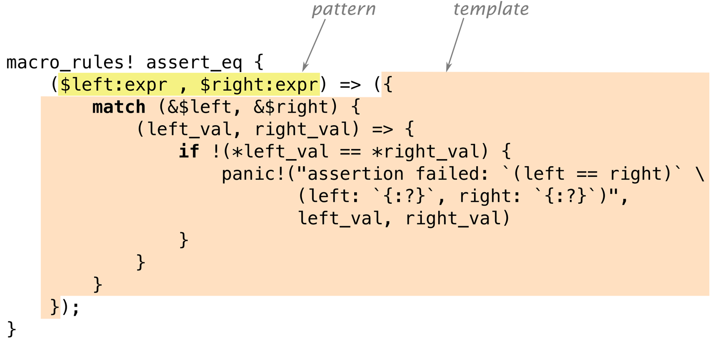
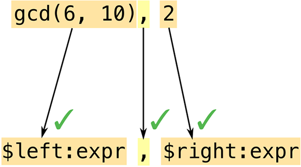
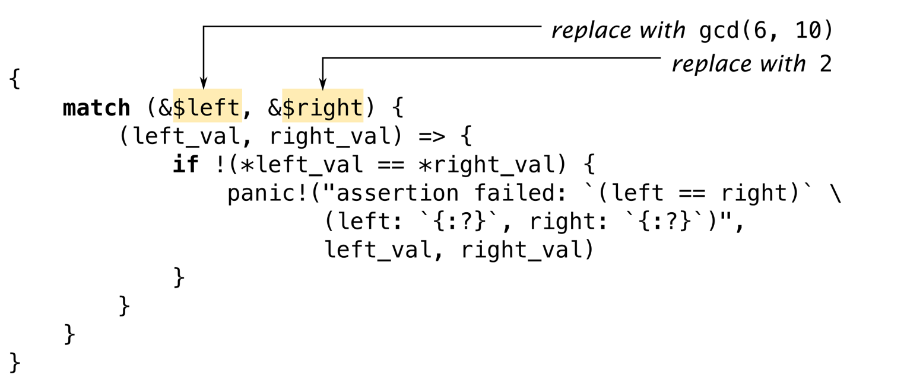

# Chapter 21. Macros

> A *cento* (from the Latin for “patchwork”) is a poem made up entirely of lines quoted from another poet.
>
> Matt Madden

Rust supports *macros*, a way to extend the language in ways that go beyond what you can do with functions alone. For example, we’ve seen the `assert_eq!` macro, which is handy for tests:

``` rust
assert_eq!(gcd(6, 10), 2);
```

This could have been written as a generic function, but the `assert_eq!` macro does several things that functions can’t do. One is that when an assertion fails, `assert_eq!` generates an error message containing the filename and line number of the assertion. Functions have no way of getting that information. Macros can, because the way they work is completely different.

Macros are a kind of shorthand. During compilation, before types are checked and long before any machine code is generated, each macro call is *expanded*—that is, it’s replaced with some Rust code. The preceding macro call expands to something roughly like this:

``` rust
match (&gcd(6, 10), &2) {
    (left_val, right_val) => {
        if !(*left_val == *right_val) {
            panic!("assertion failed: `(left == right)`, \
                    (left: `{:?}`, right: `{:?}`)", left_val, right_val);
        }
    }
}
```

`panic!` is also a macro, which itself expands to yet more Rust code (not shown here). That code uses two other macros, `file!()` and `line!()`. Once every macro call in the crate is fully expanded, Rust moves on to the next phase of compilation.

At run time, an assertion failure would look like this (and would indicate a bug in the `gcd()` function, since `2` is the correct answer):

``` console
thread 'main' panicked at 'assertion failed: `(left == right)`, (left: `17`,
right: `2`)', gcd.rs:7
```

If you’re coming from C++, you may have had some bad experiences with macros. Rust macros take a different approach, similar to Scheme’s `syntax-rules`. Compared to C++ macros, Rust macros are better integrated with the rest of the language and therefore less error prone. Macro calls are always marked with an exclamation point, so they stand out when you’re reading code, and they can’t be called accidentally when you meant to call a function. Rust macros never insert unmatched brackets or parentheses. And Rust macros come with pattern matching, making it easier to write macros that are both maintainable and appealing to use.

In this chapter, we’ll show how to write macros using several simple examples. But like much of Rust, macros reward deep understanding, so we’ll walk through the design of a more complicated macro that lets us embed JSON literals directly in our programs. But there’s more to macros than we can cover in this book, so we’ll end with some pointers for further study, both of advanced techniques for the tools we’ve shown you here, and for an even more powerful facility called *procedural macros*.

# Macro Basics

Figure 21-1 shows part of the source code for the `assert_eq!` macro.

`macro_rules!` is the main way to define macros in Rust. Note that there is no `!` after `assert_eq` in this macro definition: the `!` is only included when calling a macro, not when defining it.

Not all macros are defined this way: a few, like `file!`, `line!`, and `macro_rules!` itself, are built into the compiler, and we’ll talk about another approach, called procedural macros, at the end of this chapter. But for the most part, we’ll focus on `macro_rules!`, which is (so far) the easiest way to write your own.

A macro defined with `macro_rules!` works entirely by pattern matching. The body of a macro is just a series of rules:

```
( pattern1 ) => ( template1 );

( pattern2 ) => ( template2 );

...
```



###### Figure 21-1. The `assert_eq!` macro

The version of `assert_eq!` in Figure 21-1 has just one pattern and one template.

Incidentally, you can use square brackets or curly braces instead of parentheses around the pattern or the template; it makes no difference to Rust. Likewise, when you call a macro, these are all equivalent:

``` rust
assert_eq!(gcd(6, 10), 2);
assert_eq![gcd(6, 10), 2];
assert_eq!{gcd(6, 10), 2}
```

The only difference is that semicolons are usually optional after curly braces. By convention, we use parentheses when calling `assert_eq!`, square brackets for `vec!`, and curly braces for `macro_rules!`.

Now that we’ve shown a simple example of a macro’s expansion and the definition that generated it, we can get into the details necessary to put this to work:

- We’ll explain exactly how Rust goes about finding and expanding macro definitions in your program.

- We’ll point out some subtleties inherent in the process of generating code from macro templates.

- Finally, we’ll show how patterns handle repetitive structure.

## Basics of Macro Expansion

Rust expands macros very early during compilation. The compiler reads your source code from beginning to end, defining and expanding macros as it goes. You can’t call a macro before it is defined, because Rust expands each macro call before it even looks at the rest of the program. (By contrast, functions and other items don’t have to be in any particular order. It’s OK to call a function that won’t be defined until later in the crate.)

When Rust expands an `assert_eq!` macro call, what happens is a lot like evaluating a `match` expression. Rust first matches the arguments against the pattern, as shown in Figure 21-2.



###### Figure 21-2. Expanding a macro, part 1: pattern-matching the arguments

Macro patterns are a mini-language within Rust. They’re essentially regular expressions for matching code. But where regular expressions operate on characters, patterns operate on *tokens*—the numbers, names, punctuation marks, and so forth that are the building blocks of Rust programs. This means you can use comments and whitespace freely in macro patterns to make them as readable as possible. Comments and whitespace aren’t tokens, so they don’t affect matching.

Another important difference between regular expressions and macro patterns is that parentheses, brackets, and braces always occur in matched pairs in Rust. This is checked before macros are expanded, not only in macro patterns but throughout the language.

In this example, our pattern contains the *fragment* `$left:expr`, which tells Rust to match an expression (in this case, `gcd(6, 10)`) and assign it the name `$left`. Rust then matches the comma in the pattern with the comma following `gcd`’s arguments. Just like regular expressions, patterns have only a few special characters that trigger interesting matching behavior; everything else, like this comma, has to match verbatim or else matching fails. Lastly, Rust matches the expression `2` and gives it the name `$right`.

Both code fragments in this pattern are of type `expr`: they expect expressions. We’ll see other types of code fragments in “Fragment Types”.

Since this pattern matched all of the arguments, Rust expands the corresponding *template* (Figure 21-3).



###### Figure 21-3. Expanding a macro, part 2: filling in the template

Rust replaces `$left` and `$right` with the code fragments it found during matching.

It’s a common mistake to include the fragment type in the output template: writing `$left:expr` rather than just `$left`. Rust does not immediately detect this kind of error. It sees `$left` as a substitution, and then it treats `:expr` just like everything else in the template: tokens to be included in the macro’s output. So the errors won’t happen until you *call* the macro; then it will generate bogus output that won’t compile. If you get error messages like `` cannot find type `expr` in this scope `` and `help: maybe you meant to use a path separator here` when using a new macro, check it for this mistake. (“Debugging Macros” offers more general advice for situations like this.)

Macro templates aren’t much different from any of a dozen template languages commonly used in web programming. The only difference—and it’s a significant one—is that the output is Rust code.

## Unintended Consequences

Plugging fragments of code into templates is subtly different from regular code that works with values. These differences aren’t always obvious at first. The macro we’ve been looking at, `assert_eq!`, contains some slightly strange bits of code for reasons that say a lot about macro programming. Let’s look at two funny bits in particular.

First, why does this macro create the variables `left_val` and `right_val`? Is there some reason we can’t simplify the template to look like this?

``` rust
if !($left == $right) {
    panic!("assertion failed: `(left == right)` \
            (left: `{:?}`, right: `{:?}`)", $left, $right)
}
```

To answer this question, try mentally expanding the macro call `assert_eq!(letters.pop(), Some('z'))`. What would the output be? Naturally, Rust would plug the matched expressions into the template in multiple places. It seems like a bad idea to evaluate the expressions all over again when building the error message, though, and not just because it would take twice as long: since `letters.pop()` removes a value from a vector, it’ll produce a different value the second time we call it! That’s why the real macro computes `$left` and `$right` only once and stores their values.

Moving on to the second question: why does this macro borrow references to the values of `$left` and `$right`? Why not just store the values in variables, like this?

``` rust
macro_rules! bad_assert_eq {
    ($left:expr, $right:expr) => ({
        match ($left, $right) {
            (left_val, right_val) => {
                if !(left_val == right_val) {
                    panic!("assertion failed" /* ... */);
                }
            }
        }
    });
}
```

For the particular case we’ve been considering, where the macro arguments are integers, this would work fine. But if the caller passed, say, a `String` variable as `$left` or `$right`, this code would move the value out of the variable!

``` rust
fn main() {
    let s = "a rose".to_string();
    bad_assert_eq!(s, "a rose");
    println!("confirmed: {} is a rose", s);  // error: use of moved value "s"
}
```

Since we don’t want assertions to move values, the macro borrows references instead.

(You may have wondered why the macro uses `match` rather than `let` to define the variables. We wondered too. It turns out there’s no particular reason for this. `let` would have been equivalent.)

In short, macros can do surprising things. If strange things happen around a macro you’ve written, it’s a good bet that the macro is to blame.

One bug that you *won’t* see is this classic C++ macro bug:

``` cpp
// buggy C++ macro to add 1 to a number
#define ADD_ONE(n)  n + 1
```

For reasons familiar to most C++ programmers, and not worth explaining fully here, unremarkable code like `ADD_ONE(1) * 10` or `ADD_ONE(1 << 4)` produces very surprising results with this macro. To fix it, you’d add more parentheses to the macro definition. This isn’t necessary in Rust, because Rust macros are better integrated with the language. Rust knows when it’s handling expressions, so it effectively adds parentheses whenever it pastes one expression into another.

## Repetition

The standard `vec!` macro comes in two forms:

``` rust
// Repeat a value N times
let buffer = vec![0_u8; 1000];

// A list of values, separated by commas
let numbers = vec!["udon", "ramen", "soba"];
```

It can be implemented like this:

``` rust
macro_rules! vec {
    ($elem:expr ; $n:expr) => {
        ::std::vec::from_elem($elem, $n)
    };
    ( $( $x:expr ),* ) => {
        <[_]>::into_vec(Box::new([ $( $x ),* ]))
    };
    ( $( $x:expr ),+ ,) => {
        vec![ $( $x ),* ]
    };
}
```

There are three rules here. We’ll explain how multiple rules work and then look at each rule in turn.

When Rust expands a macro call like `vec![1, 2, 3]`, it starts by trying to match the arguments `1, 2, 3` with the pattern for the first rule, in this case `$elem:expr ; $n:expr`. This fails to match: `1` is an expression, but the pattern requires a semicolon after that, and we don’t have one. So Rust then moves on to the second rule, and so on. If no rules match, it’s an error.

The first rule handles uses like `vec![0u8; 1000]`. It happens that there is a standard (but undocumented) function, `std::vec::from_elem`, that does exactly what’s needed here, so this rule is straightforward.

The second rule handles `vec!["udon", "ramen", "soba"]`. The pattern, `$( $x:expr ),*`, uses a feature we haven’t seen before: repetition. It matches 0 or more expressions, separated by commas. More generally, the syntax `$( PATTERN ),*` is used to match any comma-separated list, where each item in the list matches `PATTERN`.

The `*` here has the same meaning as in regular expressions (“0 or more”) although admittedly regexps do not have a special `,*` repeater. You can also use `+` to require at least one match, or `?` for zero or one match. Table 21-1 gives the full suite of repetition patterns.

**Table 21-1. Repetition patterns**

| Pattern      | Meaning                                        |
|--------------|------------------------------------------------|
| `$( ... )*`  | Match 0 or more times with no separator        |
| `$( ... ),*` | Match 0 or more times, separated by commas     |
| `$( ... );*` | Match 0 or more times, separated by semicolons |
| `$( ... )+`  | Match 1 or more times with no separator        |
| `$( ... ),+` | Match 1 or more times, separated by commas     |
| `$( ... );+` | Match 1 or more times, separated by semicolons |
| `$( ... )?`  | Match 0 or 1 times with no separator           |
| `$( ... ),?` | Match 0 or 1 times, separated by commas        |
| `$( ... );?` | Match 0 or 1 times, separated by semicolons    |

The code fragment `$x` is not just a single expression but a list of expressions. The template for this rule uses repetition syntax too:

``` rust
<[_]>::into_vec(Box::new([ $( $x ),* ]))
```

Again, there are standard methods that do exactly what we need. This code creates a boxed array and then uses the `[T]::into_vec` method to convert the boxed array to a vector.

The first bit, `<[_]>`, is an unusual way to write the type “slice of something,” while expecting Rust to infer the element type. Types whose names are plain identifiers can be used in expressions without any fuss, but types like `fn()`, `&str`, or `[_]` must be wrapped in angle brackets.

Repetition comes in at the end of the template, where we have `$($x),*`. This `$(...),*` is the same syntax we saw in the pattern. It iterates over the list of expressions that we matched for `$x` and inserts them all into the template, separated by commas.

In this case, the repeated output looks just like the input. But that doesn’t have to be the case. We could have written the rule like this:

``` rust
( $( $x:expr ),* ) => {
    {
        let mut v = Vec::new();
        $( v.push($x); )*
        v
    }
};
```

Here, the part of the template that reads `$( v.push($x); )*` inserts a call to `v.push()` for each expression in `$x`. A macro arm can expand to a sequence of expressions, but here we need just a single expression, so we wrap the assembly of the vector in a block.

Unlike the rest of Rust, patterns using `$( ... ),*` do not automatically support an optional trailing comma. However, there’s a standard trick for supporting trailing commas by adding an extra rule. That is what the third rule of our `vec!` macro does:

``` rust
( $( $x:expr ),+ ,) => {  // if trailing comma is present,
    vec![ $( $x ),* ]     // retry without it
};
```

We use `$( ... ),+ ,` to match a list with an extra comma. Then, in the template, we call `vec!` recursively, leaving the extra comma out. This time the second rule will match.

# Built-In Macros

The Rust compiler supplies several macros that are helpful when you’re defining your own macros. None of these could be implemented using `macro_rules!` alone. They’re hardcoded in `rustc`:

`file!()`, `line!()`, `column!()`  
`file!()` expands to a string literal: the current filename. `line!()` and `column!()` expand to `u32` literals giving the current line and column (counting from 1).

If one macro calls another, which calls another, all in different files, and the last macro calls `file!()`, `line!()`, or `column!()`, it will expand to indicate the location of the *first* macro call.

`stringify!(...tokens...)`  
Expands to a string literal containing the given tokens. The `assert!` macro uses this to generate an error message that includes the code of the assertion.

Macro calls in the argument are *not* expanded: `stringify!(line!())` expands to the string `"line!()"`.

Rust constructs the string from the tokens, so there are no line breaks or comments in the string.

`concat!(str0, str1, ...)`  
Expands to a single string literal made by concatenating its arguments.

Rust also defines these macros for querying the build environment:

`cfg!(...)`  
Expands to a Boolean constant, `true` if the current build configuration matches the condition in parentheses. For example, `cfg!(debug_assertions)` is true if you’re compiling with debug assertions enabled.

This macro supports exactly the same syntax as the `#[cfg(...)]` attribute described in “Attributes” but instead of conditional compilation, you get a true or false answer.

`env!("VAR_NAME")`  
Expands to a string: the value of the specified environment variable at compile time. If the variable doesn’t exist, it’s a compilation error.

This would be fairly worthless except that Cargo sets several interesting environment variables when it compiles a crate. For example, to get your crate’s current version string, you can write:

``` rust
let version = env!("CARGO_PKG_VERSION");
```

A full list of these environment variables is included in the [Cargo documentation](https://oreil.ly/CQyuz).

`option_env!("VAR_NAME")`  
This is the same as `env!` except that it returns an `Option<&'static str>` that is `None` if the specified variable is not set.

Three more built-in macros let you bring in code or data from another file:

`include!("file.rs")`  
Expands to the contents of the specified file, which must be valid Rust code—either an expression or a sequence of items.

`include_str!("file.txt")`  
Expands to a `&'static str` containing the text of the specified file. You can use it like this:

``` rust
const COMPOSITOR_SHADER: &str =
    include_str!("../resources/compositor.glsl");
```

If the file doesn’t exist or is not valid UTF-8, you’ll get a compilation error.

`include_bytes!("file.dat")`  
This is the same except the file is treated as binary data, not UTF-8 text. The result is a `&'static [u8]`.

Like all macros, these are processed at compile time. If the file doesn’t exist or can’t be read, compilation fails. They can’t fail at run time. In all cases, if the filename is a relative path, it’s resolved relative to the directory that contains the current file.

Rust also provides several convenient macros we haven’t covered previously:

`todo!()`, `unimplemented!()`  
These are equivalent to `panic!()`, but convey a different intent. `unimplemented!()` goes in `if` clauses, `match` arms, and other cases that are not yet handled. It always panics. `todo!()` is much the same, but conveys the idea that this code simply has yet to be written; some IDEs flag it for notice.

`matches!(value, pattern)`  
Compares a value to a pattern, and returns `true` if it matches, or `false` otherwise. It’s equivalent to writing:

``` rust
match value {
  pattern => true,
  _ => false
}
```

If you’re looking for an exercise in basic macro-writing, this is a good macro to replicate—especially since the real implementation, which you can see in the standard library documentation, is quite simple.

# Debugging Macros

Debugging a wayward macro can be challenging. The biggest problem is the lack of visibility into the process of macro expansion. Rust will often expand all macros, find some kind of error, and then print an error message that does not show the fully expanded code that contains the error!

Here are three tools to help troubleshoot macros. (These features are all unstable, but since they’re really designed to be used during development, not in code that you’d check in, that isn’t a big problem in practice.)

First and simplest, you can ask `rustc` to show what your code looks like after expanding all macros. Use `cargo build --verbose` to see how Cargo is invoking `rustc`. Copy the `rustc` command line and add `-Z unstable-options --pretty expanded` as options. The fully expanded code is dumped to your terminal. Unfortunately, this works only if your code is free of syntax errors.

Second, Rust provides a `log_syntax!()` macro that simply prints its arguments to the terminal at compile time. You can use this for `println!`-style debugging. This macro requires the `#![feature(log_syntax)]` feature flag.

Third, you can ask the Rust compiler to log all macro calls to the terminal. Insert `trace_macros!(true);` somewhere in your code. From that point on, each time Rust expands a macro, it will print the macro name and arguments. For example, consider this program:

``` rust
#![feature(trace_macros)]

fn main() {
    trace_macros!(true);
    let numbers = vec![1, 2, 3];
    trace_macros!(false);
    println!("total: {}", numbers.iter().sum::<u64>());
}
```

It produces this output:

``` console
$ rustup override set nightly
...
$ rustc trace_example.rs
note: trace_macro
 --> trace_example.rs:5:19
  |
5 |     let numbers = vec![1, 2, 3];
  |                   ^^^^^^^^^^^^^
  |
  = note: expanding `vec! { 1 , 2 , 3 }`
  = note: to `< [ _ ] > :: into_vec ( box [ 1 , 2 , 3 ] )`
```

The compiler shows the code of each macro call, both before and after expansion. The line `trace_macros!(false);` turns tracing off again, so the call to `println!()` is not traced.

# Building the json! Macro

We’ve now discussed the core features of `macro_rules!`. In this section, we’ll incrementally develop a macro for building JSON data. We’ll use this example to show what it’s like to develop a macro, present the few remaining pieces of `macro_rules!`, and offer some advice on how to make sure your macros behave as desired.

Back in Chapter 10, we presented this enum for representing JSON data:

``` rust
#[derive(Clone, PartialEq, Debug)]
enum Json {
    Null,
    Boolean(bool),
    Number(f64),
    String(String),
    Array(Vec<Json>),
    Object(Box<HashMap<String, Json>>)
}
```

The syntax for writing out `Json` values is unfortunately rather verbose:

``` rust
let students = Json::Array(vec![
    Json::Object(Box::new(vec![
        ("name".to_string(), Json::String("Jim Blandy".to_string())),
        ("class_of".to_string(), Json::Number(1926.0)),
        ("major".to_string(), Json::String("Tibetan throat singing".to_string()))
    ].into_iter().collect())),
    Json::Object(Box::new(vec![
        ("name".to_string(), Json::String("Jason Orendorff".to_string())),
        ("class_of".to_string(), Json::Number(1702.0)),
        ("major".to_string(), Json::String("Knots".to_string()))
    ].into_iter().collect()))
]);
```

We would like to be able to write this using a more JSON-like syntax:

``` rust
let students = json!([
    {
        "name": "Jim Blandy",
        "class_of": 1926,
        "major": "Tibetan throat singing"
    },
    {
        "name": "Jason Orendorff",
        "class_of": 1702,
        "major": "Knots"
    }
]);
```

What we want is a `json!` macro that takes a JSON value as an argument and expands to a Rust expression like the one in the previous example.

## Fragment Types

The first job in writing any complex macro is figuring out how to match, or *parse*, the desired input.

We can already see that the macro will have several rules, because there are several different sorts of things in JSON data: objects, arrays, numbers, and so forth. In fact, we might guess that we’ll have one rule for each JSON type:

```
macro_rules! json {
    (null)    => { Json::Null };
    ([ ... ]) => { Json::Array(...) };
    ({ ... }) => { Json::Object(...) };
    (???)     => { Json::Boolean(...) };
    (???)     => { Json::Number(...) };
    (???)     => { Json::String(...) };
}
```

This is not quite correct, as macro patterns offer no way to tease apart the last three cases, but we’ll see how to deal with that later. The first three cases, at least, clearly begin with different tokens, so let’s start with those.

The first rule already works:

``` rust
macro_rules! json {
    (null) => {
        Json::Null
    }
}

#[test]
fn json_null() {
    assert_eq!(json!(null), Json::Null);  // passes!
}
```

To add support for JSON arrays, we might try matching the elements as `expr`s:

``` rust
macro_rules! json {
    (null) => {
        Json::Null
    };
    ([ $( $element:expr ),* ]) => {
        Json::Array(vec![ $( $element ),* ])
    };
}
```

Unfortunately, this does not match all JSON arrays. Here’s a test that illustrates the problem:

``` rust
#[test]
fn json_array_with_json_element() {
    let macro_generated_value = json!(
        [
            // valid JSON that doesn't match `$element:expr`
            {
                "pitch": 440.0
            }
        ]
    );
    let hand_coded_value =
        Json::Array(vec![
            Json::Object(Box::new(vec![
                ("pitch".to_string(), Json::Number(440.0))
            ].into_iter().collect()))
        ]);
    assert_eq!(macro_generated_value, hand_coded_value);
}
```

The pattern `$( $element:expr ),*` means “a comma-separated list of Rust expressions.” But many JSON values, particularly objects, aren’t valid Rust expressions. They won’t match.

Since not every bit of code you want to match is an expression, Rust supports several other fragment types, listed in Table 21-2.

**Table 21-2. Fragment types supported by macro_rules!**

| Fragment type | Matches (with examples)                                                                                     | Can be followed by...         |
|---------------|-------------------------------------------------------------------------------------------------------------|-------------------------------|
| `expr`        | An expression: 2 + 2 , "udon" , x.len()                                                                     | `=> , ;`                      |
| `stmt`        | An expression or declaration, not including any trailing semicolon (hard to use; try expr or block instead) | `=> , ;`                      |
| `ty`          | A type: String , Vec\<u8\> , (&str, bool) , dyn Read + Send                                                 | `=> , ; = \| { [ : > as where` |
| `path`        | A path (discussed ): ferns , ::std::sync::mpsc                                                              | `=> , ; = \| { [ : > as where` |
| `pat`         | A pattern (discussed ): \_ , Some(ref x)                                                                    | `=> , = \| if in`              |
| `item`        | An item (discussed ): struct Point { x: f64, y: f64 } , mod ferns;                                          | Anything                      |
| `block`       | A block (discussed ): { s += "ok\n"; true }                                                                 | Anything                      |
| `meta`        | The body of an attribute (discussed ): inline , derive(Copy, Clone) , doc="3D models."                      | Anything                      |
| `literal`     | A literal value: 1024 , "Hello, world!" , 1_000_000f64                                                      | Anything                      |
| `lifetime`    | A lifetime: 'a , 'item , 'static                                                                            | Anything                      |
| `vis`         | A visibility specifier: pub , pub(crate) , pub(in module::submodule)                                        | Anything                      |
| `ident`       | An identifier: std , Json , longish_variable_name                                                           | Anything                      |
| `tt`          | A token tree (see text): ; , \>= , {} , \[0 1 (+ 0 1)\]                                                     | Anything                      |

Most of the options in this table strictly enforce Rust syntax. The `expr` type matches only Rust expressions (not JSON values), `ty` matches only Rust types, and so on. They’re not extensible: there’s no way to define new arithmetic operators or new keywords that `expr` would recognize. We won’t be able to make any of these match arbitrary JSON data.

The last two, `ident` and `tt`, support matching macro arguments that don’t look like Rust code. `ident` matches any identifier. `tt` matches a single *token tree*: either a properly matched pair of brackets, `(...)`, `[...]`, or `{...}`, and everything in between, including nested token trees, or a single token that isn’t a bracket, like `1926` or `"Knots"`.

Token trees are exactly what we need for our `json!` macro. Every JSON value is a single token tree: numbers, strings, Boolean values, and `null` are all single tokens; objects and arrays are bracketed. So we can write the patterns like this:

``` rust
macro_rules! json {
    (null) => {
        Json::Null
    };
    ([ $( $element:tt ),* ]) => {
        Json::Array(...)
    };
    ({ $( $key:tt : $value:tt ),* }) => {
        Json::Object(...)
    };
    ($other:tt) => {
        ... // TODO: Return Number, String, or Boolean
    };
}
```

This version of the `json!` macro can match all JSON data. Now we just need to produce correct Rust code.

To make sure Rust can gain new syntactic features in the future without breaking any macros you write today, Rust restricts tokens that appear in patterns right after a fragment. The “Can be followed by...” column of Table 21-2 shows which tokens are allowed. For example, the pattern `$x:expr ~ $y:expr` is an error, because `~` isn’t allowed after an `expr`. The pattern `$vars:pat => $handler:expr` is OK, because `$vars:pat` is followed by the arrow `=>`, one of the allowed tokens for a `pat`, and `$handler:expr` is followed by nothing, which is always allowed.

## Recursion in Macros

You’ve already seen one trivial case of a macro calling itself: our implementation of `vec!` uses recursion to support trailing commas. Here we can show a more significant example: `json!` needs to call itself recursively.

We might try supporting JSON arrays without using recursion, like this:

``` rust
([ $( $element:tt ),* ]) => {
    Json::Array(vec![ $( $element ),* ])
};
```

But this wouldn’t work. We’d be pasting JSON data (the `$element` token trees) right into a Rust expression. They’re two different languages.

We need to convert each element of the array from JSON form to Rust. Fortunately, there’s a macro that does this: the one we’re writing!

``` rust
([ $( $element:tt ),* ]) => {
    Json::Array(vec![ $( json!($element) ),* ])
};
```

Objects can be supported in the same way:

``` rust
({ $( $key:tt : $value:tt ),* }) => {
    Json::Object(Box::new(vec![
        $( ($key.to_string(), json!($value)) ),*
    ].into_iter().collect()))
};
```

The compiler imposes a recursion limit on macros: 64 calls, by default. That’s more than enough for normal uses of `json!`, but complex recursive macros sometimes hit the limit. You can adjust it by adding this attribute at the top of the crate where the macro is used:

``` rust
#![recursion_limit = "256"]
```

Our `json!` macro is nearly complete. All that remains is to support Boolean, number, and string values.

## Using Traits with Macros

Writing complex macros always poses puzzles. It’s important to remember that macros themselves are not the only puzzle-solving tool at your disposal.

Here, we need to support `json!(true)`, `json!(1.0)`, and `json!("yes")`, converting the value, whatever it may be, to the appropriate kind of `Json` value. But macros are not good at distinguishing types. We can imagine writing:

``` rust
macro_rules! json {
    (true) => {
        Json::Boolean(true)
    };
    (false) => {
        Json::Boolean(false)
    };
    ...
}
```

This approach breaks down right away. There are only two Boolean values, but rather more numbers than that, and even more strings.

Fortunately, there is a standard way to convert values of various types to one specified type: the `From` trait, covered . We simply need to implement this trait for a few types:

``` rust
impl From<bool> for Json {
    fn from(b: bool) -> Json {
        Json::Boolean(b)
    }
}

impl From<i32> for Json {
    fn from(i: i32) -> Json {
        Json::Number(i as f64)
    }
}

impl From<String> for Json {
    fn from(s: String) -> Json {
        Json::String(s)
    }
}

impl<'a> From<&'a str> for Json {
    fn from(s: &'a str) -> Json {
        Json::String(s.to_string())
    }
}
...
```

In fact, all 12 numeric types should have very similar implementations, so it might make sense to write a macro, just to avoid the copy and paste:

``` rust
macro_rules! impl_from_num_for_json {
    ( $( $t:ident )* ) => {
        $(
            impl From<$t> for Json {
                fn from(n: $t) -> Json {
                    Json::Number(n as f64)
                }
            }
        )*
    };
}

impl_from_num_for_json!(u8 i8 u16 i16 u32 i32 u64 i64 u128 i128
                        usize isize f32 f64);
```

Now we can use `Json::from(value)` to convert a `value` of any supported type to `Json`. In our macro, it’ll look like this:

``` rust
( $other:tt ) => {
    Json::from($other)  // Handle Boolean/number/string
};
```

Adding this rule to our `json!` macro makes it pass all the tests we’ve written so far. Putting together all the pieces, it currently looks like this:

``` rust
macro_rules! json {
    (null) => {
        Json::Null
    };
    ([ $( $element:tt ),* ]) => {
        Json::Array(vec![ $( json!($element) ),* ])
    };
    ({ $( $key:tt : $value:tt ),* }) => {
        Json::Object(Box::new(vec![
            $( ($key.to_string(), json!($value)) ),*
        ].into_iter().collect()))
    };
    ( $other:tt ) => {
        Json::from($other)  // Handle Boolean/number/string
    };
}
```

As it turns out, the macro unexpectedly supports the use of variables and even arbitrary Rust expressions inside the JSON data, a handy extra feature:

``` rust
let width = 4.0;
let desc =
    json!({
        "width": width,
        "height": (width * 9.0 / 4.0)
    });
```

Because `(width * 9.0 / 4.0)` is parenthesized, it’s a single token tree, so the macro successfully matches it with `$value:tt` when parsing the object.

## Scoping and Hygiene

A surprisingly tricky aspect of writing macros is that they involve pasting code from different scopes together. So the next few pages cover the two ways Rust handles scoping: one way for local variables and arguments, and another way for everything else.

To show why this matters, let’s rewrite our rule for parsing JSON objects (the third rule in the `json!` macro shown previously) to eliminate the temporary vector. We can write it like this:

``` rust
({ $($key:tt : $value:tt),* }) => {
    {
        let mut fields = Box::new(HashMap::new());
        $( fields.insert($key.to_string(), json!($value)); )*
        Json::Object(fields)
    }
};
```

Now we’re populating the `HashMap` not by using `collect()` but by repeatedly calling the `.insert()` method. This means we need to store the map in a temporary variable, which we’ve called `fields`.

But then what happens if the code that calls `json!` happens to use a variable of its own, also named `fields`?

``` rust
let fields = "Fields, W.C.";
let role = json!({
    "name": "Larson E. Whipsnade",
    "actor": fields
});
```

Expanding the macro would paste together two bits of code, both using the name `fields` for different things!

``` rust
let fields = "Fields, W.C.";
let role = {
    let mut fields = Box::new(HashMap::new());
    fields.insert("name".to_string(), Json::from("Larson E. Whipsnade"));
    fields.insert("actor".to_string(), Json::from(fields));
    Json::Object(fields)
};
```

This may seem like an unavoidable pitfall whenever macros use temporary variables, and you may already be thinking through the possible fixes. Perhaps we should rename the variable that the `json!` macro defines to something that its callers aren’t likely to pass in: instead of `fields`, we could call it `__json$fields`.

The surprise here is that *the macro works as is*. Rust renames the variable for you! This feature, first implemented in Scheme macros, is called *hygiene*, and so Rust is said to have *hygienic macros*.

The easiest way to understand macro hygiene is to imagine that every time a macro is expanded, the parts of the expansion that come from the macro itself are painted a different color.

Variables of different colors, then, are treated as if they had different names:


    let fields = "Fields, W.C.";
    let role = {
        let mut fields = Box::new(HashMap::new());
        fields.insert("name".to_string(), Json::from("Larson E. Whipsnade"));
        fields.insert("actor".to_string(), Json::from(fields));
        Json::Object(fields)
    };

Note that bits of code that were passed in by the macro caller and pasted into the output, such as `"name"` and `"actor"`, keep their original color (black). Only tokens that originate from the macro template are painted.

Now there’s one variable named `fields` (declared in the caller) and a separate variable named `fields` (introduced by the macro). Since the names are different colors, the two variables don’t get confused.

If a macro really does need to refer to a variable in the caller’s scope, the caller has to pass the name of the variable to the macro.

(The paint metaphor isn’t meant to be an exact description of how hygiene works. The real mechanism is even a little smarter than that, recognizing two identifiers as the same, regardless of “paint,” if they refer to a common variable that’s in scope for both the macro and its caller. But cases like this are rare in Rust. If you understand the preceding example, you know enough to use hygienic macros.)

You may have noticed that many other identifiers were painted one or more colors as the macros were expanded: `Box`, `HashMap`, and `Json`, for example. Despite the paint, Rust had no trouble recognizing these type names. That’s because hygiene in Rust is limited to local variables and arguments. When it comes to constants, types, methods, modules, statics, and macro names, Rust is “colorblind.”

This means that if our `json!` macro is used in a module where `Box`, `HashMap`, or `Json` is not in scope, the macro won’t work. We’ll show how to avoid this problem in the next section.

First, we’ll consider a case where Rust’s strict hygiene gets in the way, and we need to work around it. Suppose we have many functions that contain this line of code:

``` rust
let req = ServerRequest::new(server_socket.session());
```

Copying and pasting that line is a pain. Can we use a macro instead?

``` rust
macro_rules! setup_req {
    () => {
        let req = ServerRequest::new(server_socket.session());
    }
}

fn handle_http_request(server_socket: &ServerSocket) {
    setup_req!();  // declares `req`, uses `server_socket`
    ... // code that uses `req`
}
```

As written, this doesn’t work. It would require the name `server_socket` in the macro to refer to the local `server_socket` declared in the function, and vice versa for the variable `req`. But hygiene prevents names in macros from “colliding” with names in other scopes—even in cases like this, where that’s what you want.

The solution is to pass the macro any identifiers you plan on using both inside and outside the macro code:

``` rust
macro_rules! setup_req {
    ($req:ident, $server_socket:ident) => {
        let $req = ServerRequest::new($server_socket.session());
    }
}

fn handle_http_request(server_socket: &ServerSocket) {
    setup_req!(req, server_socket);
    ... // code that uses `req`
}
```

Since `req` and `server_socket` are now provided by the function, they’re the right “color” for that scope.

Hygiene makes this macro a little wordier to use, but that’s a feature, not a bug: it’s easier to reason about hygienic macros knowing that they can’t mess with local variables behind your back. If you search for an identifier like `server_socket` in a function, you’ll find all the places where it’s used, including macro calls.

## Importing and Exporting Macros

Since macros are expanded early in compilation, before Rust knows the full module structure of your project, the compiler has special affordances for exporting and importing them.

Macros that are visible in one module are automatically visible in its child modules. To export macros from a module “upward” to its parent module, use the `#[macro_use]` attribute. For example, suppose our *lib.rs* looks like this:

``` rust
#[macro_use] mod macros;
mod client;
mod server;
```

All macros defined in the `macros` module are imported into *lib.rs* and therefore visible throughout the rest of the crate, including in `client` and `server`.

Macros marked with `#[macro_export]` are automatically `pub` and can be referred to by path, like other items.

For example, the `lazy_static` crate provides a macro called `lazy_static`, which is marked with `#[macro_export]`. To use this macro in your own crate, you would write:

``` rust
use lazy_static::lazy_static;
lazy_static!{ }
```

Once a macro is imported, it can be used like any other item:

``` rust
use lazy_static::lazy_static;

mod m {
    crate::lazy_static!{ }
}
```

Of course, actually doing any of these things means your macro may be called in other modules. An exported macro therefore shouldn’t rely on anything being in scope—there’s no telling what will be in scope where it’s used. Even features of the standard prelude can be shadowed.

Instead, the macro should use absolute paths to any names it uses. `macro_rules!` provides the special fragment `$crate` to help with this. This is not the same as `crate`, which is a keyword that can be used in paths anywhere, not just in macros. `$crate` acts like an absolute path to the root module of the crate where the macro was defined. Instead of saying `Json`, we can write `$crate::Json`, which works even if `Json` was not imported. `HashMap` can be changed to either `::std::collections::HashMap` or `$crate::macros::HashMap`. In the latter case, we’ll have to re-export `HashMap`, because `$crate` can’t be used to access private features of a crate. It really just expands to something like `::jsonlib`, an ordinary path. Visibility rules are unaffected.

After moving the macro to its own module `macros` and modifying it to use `$crate`, it looks like this. This is the final version:

``` rust
// macros.rs
pub use std::collections::HashMap;
pub use std::boxed::Box;
pub use std::string::ToString;

#[macro_export]
macro_rules! json {
    (null) => {
        $crate::Json::Null
    };
    ([ $( $element:tt ),* ]) => {
        $crate::Json::Array(vec![ $( json!($element) ),* ])
    };
    ({ $( $key:tt : $value:tt ),* }) => {
        {
            let mut fields = $crate::macros::Box::new(
                $crate::macros::HashMap::new());
            $(
                fields.insert($crate::macros::ToString::to_string($key),
                              json!($value));
            )*
            $crate::Json::Object(fields)
        }
    };
    ($other:tt) => {
        $crate::Json::from($other)
    };
}
```

Since the `.to_string()` method is part of the standard `ToString` trait, we use `$crate` to refer to that as well, using syntax we introduced in “Fully Qualified Method Calls”: `$crate::macros::ToString::to_string($key)`. In our case, this isn’t strictly necessary to make the macro work, because `ToString` is in the standard prelude. But if you’re calling methods of a trait that may not be in scope at the point where the macro is called, a fully qualified method call is the best way to do it.

# Avoiding Syntax Errors During Matching

The following macro seems reasonable, but it gives Rust some trouble:

``` rust
macro_rules! complain {
    ($msg:expr) => {
        println!("Complaint filed: {}", $msg)
    };
    (user : $userid:tt , $msg:expr) => {
        println!("Complaint from user {}: {}", $userid, $msg)
    };
}
```

Suppose we call it like this:

``` rust
complain!(user: "jimb", "the AI lab's chatbots keep picking on me");
```

To human eyes, this obviously matches the second pattern. But Rust tries the first rule first, attempting to match all of the input with `$msg:expr`. This is where things start to go badly for us. `user: "jimb"` is not an expression, of course, so we get a syntax error. Rust refuses to sweep a syntax error under the rug—macros are already hard enough to debug. Instead, it’s reported immediately and compilation halts.

If any other token in a pattern fails to match, Rust moves on the next rule. Only syntax errors are fatal, and they happen only when trying to match fragments.

The problem here is not so hard to understand: we’re attempting to match a fragment, `$msg:expr`, in the wrong rule. It’s not going to match because we’re not even supposed to be here. The caller wanted the other rule. There are two easy ways to avoid this.

First, avoid confusable rules. We could, for example, change the macro so that every pattern starts with a different identifier:

``` rust
macro_rules! complain {
    (msg : $msg:expr) => {
        println!("Complaint filed: {}", $msg);
    };
    (user : $userid:tt , msg : $msg:expr) => {
        println!("Complaint from user {}: {}", $userid, $msg);
    };
}
```

When the macro arguments start with `msg`, we’ll get rule 1. When they start with `user`, we’ll get rule 2. Either way, we know we’ve got the right rule before we try to match a fragment.

The other way to avoid spurious syntax errors is by putting more specific rules first. Putting the `user:` rule first fixes the problem with `complain!`, because the rule that causes the syntax error is never reached.

# Beyond macro_rules!

Macro patterns can parse input that’s even more intricate than JSON, but we’ve found that the complexity quickly gets out of hand.

[*The Little Book of Rust Macros*](https://oreil.ly/nZ2HP), by Daniel Keep et al., is an excellent handbook of advanced `macro_rules!` programming. The book is clear and smart, and it describes every aspect of macro expansion in more detail than we have here. It also presents several very clever techniques for pressing `macro_rules!` patterns into service as a sort of esoteric programming language, to parse complex input. This we’re less enthusiastic about. Use with care.

Rust 1.15 introduced a separate mechanism called *procedural macros*. Procedural macros support extending the `#[derive]` attribute to handle custom derivations, as shown in Figure 21-4, as well as creating custom attributes and new macros that are invoked just like the `macro_rules!` macros discussed earlier.

![(Picture of a struct with a \#\[derive(IntoJson)\] attibute.)](media/Images/pr2e_2104.png)

###### Figure 21-4. Invoking a hypothetical `IntoJson` procedural macro via a `#[derive]` attribute

There is no `IntoJson` trait, but it doesn’t matter: a procedural macro can use this hook to insert whatever code it wants (in this case, probably `impl From<Money> for Json { ... }`).

What makes a procedural macro “procedural” is that it’s implemented as a Rust function, not a declarative rule set. This function interacts with the compiler through a thin layer of abstraction and can be arbitrarily complex. For example, the `diesel` database library uses procedural macros to connect to a database and generate code based on the schema of that database at compile time.

Because procedural macros interact with compiler internals, writing effective macros requires an understanding of how the compiler operates that is out of the scope of this book. It is, however, extensively covered in the [online documentation](https://oreil.ly/0xB2x).

Perhaps, having read all this, you’ve decided that you hate macros. What then? An alternative is to generate Rust code using a build script. The [Cargo documentation](https://oreil.ly/42irF) shows how to do it step by step. It involves writing a program that generates the Rust code you want, adding a line to *Cargo.toml* to run that program as part of the build process and using `include!` to get the generated code into your crate.