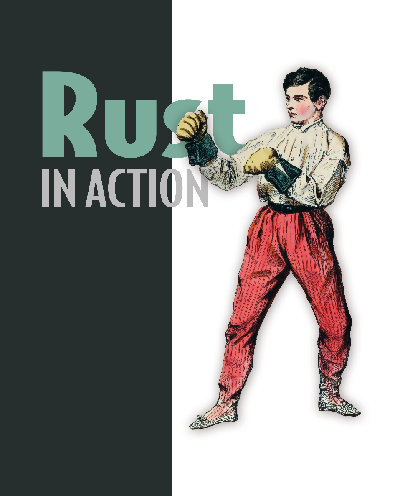
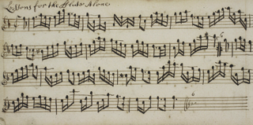
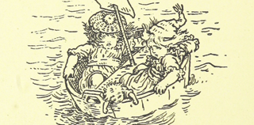

Systems programming concepts

and techniques

Timothy Samuel McNamara

M A N N I N G

**Raw Pointer**

**Box\<T\>**

**Rc\<T\>**

**Arc\<T\>**

The cousins mut

\*

T and

Store anything in a box. Accepts

The reference counted pointer, Rc\<T\>

Arc\<T\> is Rust’s ambassador.

\*const T are the free radicals

almost any type for long-term

is Rust's competent, yet miserly

It can share values across threads,

of the pointer world. Lightning

storage. The workhorse of a

bookkeeper. It knows who has

guaranteeing that these will

fast, but wildly unsafe.

new, safe programming era.

borrowed what and when.

not interfere with each other.

**Powers**

**Weaknesses**

**Powers**

**Weaknesses**

**Powers**

**Weaknesses**

**Powers**

**Weaknesses**

• Speed

• Unsafe

• Store a value in

• Size increase

• Shared access

• Size increase

• Shared access

• Size increase

• Can interact with

central storage

to values

• Runtime cost

to values

• Runtime cost

the outside world

in a location

• Threadsafe

called “the heap”

• Not threadsafe

**Cell\<T\>**

**RefCell\<T\>**

**Cow\<T\>**

**String**

An expert in metamorphosis,

Performs mutation on immutable

Why write something down when

Acting as a guide on how to

Cell\<T\> confers the ability to

references with RefCel\<T\>.

you only need to read it? Perhaps

deal with the uncertainties of

mutate immutable values.

Its mind-bending powers

you only want to make modifications.

user input, String shows us how

come with some costs.

This is the role of Cow (copy on write).

to build safe abstractions.

**Powers**

**Weaknesses**

**Powers**

**Weaknesses**

**Powers**

**Weaknesses**

**Powers**

**Weaknesses**

• Interior mutability

• Size increase

• Interior mutability

• Size increase

• Avoids writes

• Possible size

• Grows dynamically

• Can over

• Performance

• Can be nested

• Runtime cost

when only read

increase

as required

allocate size

access is used

within Rc and Arc,

• Lack of compile-

• Guarantees correct

which only accept

time guarantees

encoding at runtime

immutable refs

**Arc\<T\>**

**RawVec\<T\>**

**Unique\<T\>**

**Shared\<T\>**

Your program’s main storage system.

The bedrock of Vec\<T\> and

Sole owner of a value,

Sharing ownership is hard.

Vec\<T\> keeps your data orderly

other dynamically sized types.

a unique pointer is guaranteed

Shared\<T\> makes life

as values are created and destroyed.

Understands how to provide a

to possess full control.

a little bit easier.

home for your data as needed.

**Powers**

**Weaknesses**

**Powers**

**Weaknesses**

**Powers**

**Weaknesses**

**Powers**

**Weaknesses**

• Grows dynamically

• Can over

• Grows dynamically

• Not directly

• Base for types

• Not appropriate

• Shared ownership

• Not appropriate

as required

allocate size

as required

applicable from

such as Strings,

for application

• Can align memory

for application

• Works with the

your code

requiring exclusive

code directly

to T’s width, even

code directly

memory allocator

possession of values.

when empty

to find space

*Rust in Action*

*Rust in Action*

**SYSTEMS PROGRAMMING**

**CONCEPTS AND TECHNIQUES**

TIM MCNAMARA

M A N N I N G

SHELTER ISLAND

For online information and ordering of this and other Manning books, please visit

[www.manning.com](http://www.manning.com). The publisher offers discounts on this book when ordered in quantity.

For more information, please contact

Special Sales Department

Manning Publications Co.

20 Baldwin Road

PO Box 761

Shelter Island, NY 11964

Email: orders@manning.com

©2021 by Manning Publications Co. All rights reserved.

No part of this publication may be reproduced, stored in a retrieval system, or transmitted, in any form or by means electronic, mechanical, photocopying, or otherwise, without prior written permission of the publisher.

Many of the designations used by manufacturers and sellers to distinguish their products are claimed as trademarks. Where those designations appear in the book, and Manning Publications was aware of a trademark claim, the designations have been printed in initial caps or all caps.

Recognizing the importance of preserving what has been written, it is Manning’s policy to have the books we publish printed on acid-free paper, and we exert our best efforts to that end.

Recognizing also our responsibility to conserve the resources of our planet, Manning books are printed on paper that is at least 15 percent recycled and processed without the use of elemental chlorine.

Development editor: Elesha Hyde

Technical development editor: René van den Berg

Manning Publications Co.

Review editor: Mihaela Batinic

20 Baldwin Road

Production editor: Deirdre S. Hiam

PO Box 761

Copy editor: Frances Buran

Shelter Island, NY 11964

Proofreader: Melody Dolab

Technical proofreader: Jerry Kuch

Typesetter: Dennis Dalinnik

Cover designer: Marija Tudor

ISBN: 9781617294556

Printed in the United States of America

*To everyone aspiring to write safer software.*

*contents*

*preface*

*xv*

*acknowledgments*

*xvii*

*about this book*

*xix*

*about the author*

*xxii*

*about the cover illustration*

*xxiii*

*1 **Introducing Rust 1***

1.1

Where is Rust used?

2

1.2

Advocating for Rust at work

3

1.3

A taste of the language

4

*Cheating your way to “Hello, world!”*

*5* ■ *Your first Rust*

*program*

*7*

1.4

Downloading the book’s source code

8

1.5

What does Rust look and feel like?

8

1.6

What is Rust?

11

*Goal of Rust: Safety*

*12* ■ *Goal of Rust: Productivity*

*16*

*Goal of Rust: Control*

*18*

1.7

Rust’s big features

19

*Performance*

*19* ■ *Concurrency*

*20* ■ *Memory efficiency*

*20*

**vii**

**viii**