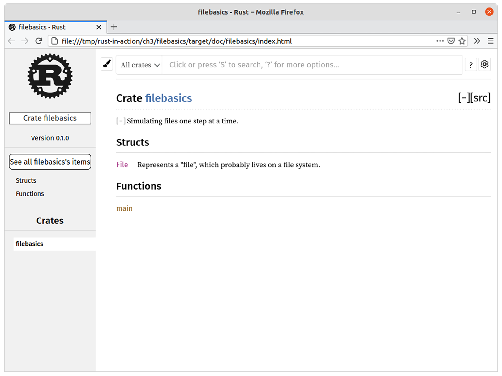

*Compound data types*

***This chapter covers***

 Composing data with structs

 Creating enumerated data types

 Adding methods and handling errors in a type-

safe manner

 Defining and implementing common behavior

with traits

 Understanding how to keep implementation

details private

 Using cargo to build documentation for your

project

Welcome to chapter 3. If we spent the last chapter looking at Rust’s atoms, this chapter is focused more on its molecules.

This chapter focuses on two key building blocks for Rust programmers, struct and enum. Both are forms of *compound data types*. Together, struct and enum can compose other types to create something more useful than what those other types would be alone. Consider how a 2D point (x,y) is composed from two numbers, *x* and *y*. We wouldn’t want to maintain two variables, x and y, in our program. Instead, **77**

**78**

CHAPTER 3

***Compound data types***

we would like to refer to the point as a whole entity. In this chapter, we also discuss how to add methods to types with impl blocks. Lastly, we take a deeper look at *traits*, Rust’s system for defining interfaces.

Throughout this chapter, you’ll work through how to represent files in code.

Although conceptually simple—if you’re reading this book, it’s highly likely you’ve interacted with a file through code before—there are enough edge cases to make things interesting. Our strategy will be to create a mock version of everything using our own imaginary API. Then, toward the latter part of the chapter, you’ll learn how to interact with your actual operating system (OS) and its filesystem(s).

***3.1***

***Using plain functions to experiment with an API***

To start, let’s see how far we can get by making use of the tools we already know. Listing 3.1 lays out a few things that we would expect, such as opening and closing a file.

We’ll use a rudimentary mock type to model one: a simple alias around String that holds a filename and little else.

To make things slightly more interesting than writing lots of boilerplate code, listing 3.1 sprinkles in a few new concepts. These show you how to tame the compiler while you’re experimenting with your design. It provides attributes (#\![allow(unused \_variables)\]) to relax compiler warnings. The read function illustrates how to define a function that never returns. The code actually doesn’t do anything, however.

That will come shortly. You’ll find the source for this listing in the file ch3/ch3-not-quite-file-1.rs.

Listing 3.1

Using type aliases to stub out a type

1 \#\![allow(unused_variables)\]

**Relaxes compiler warnings**

2

**while working through ideas**

3 type File = String;

**Creates a type alias. The compiler**

4

**won’t distinguish between String &**

5 fn open(f: &mut File) -\> bool {

**File, but your source code will.**

6 true

7

**Let’s assume for the moment that**

8 fn close(f: &mut File) -\> bool {

**these two functions always succeed.**

9 true

10 }

**Relaxes a compiler warning**

11

**about an unused function**

12 \#\[allow(dead_code)\]

13 fn read(f: &mut File,

14 save_to: &mut Vec\<u8\>) -\> ! {

**The ! return type**

15 unimplemented!()

**A macro that crashes**

**indicates to the Rust**

16 }

**the program if it’s**

**compiler that this**

17

**encountered**

**function never returns.**

18 fn main() {

19 let mut f1 = File::from("f1.txt");

**With the type declaration at line 3,**

20 open(&mut f1);

**File inherits all of String’s methods.**

21 //read(f1, vec\![\]);

22 close(&mut f1);

**There’s little point in**

23 }

**calling this method.**

***Using plain functions to experiment with an API***

**79**

There are *lots* of things that needs to be built on from listing 3.1. For example

 *We haven’t created a persistent object that would represent a file.* There’s only so much that can be encoded in a string.

 *There’s no attempt to implement read().* If we did, how would we handle the failure case?

 *open() and close() return bool.* Perhaps there is a way to provide a more sophisticated result type that might be able to contain an error message if the OS reports one.

 *None of our functions are methods.* From a stylistic point of view, it might be nice to call f.open() rather than open(f).

Let’s begin at the top and work our way through this list. Brace yourself for a few sce-nic detours along the way as we encounter a few side roads that will be profitable to explore.

Special return types in Rust

If you are new to the language, some return types are difficult to interpret. These are also especially difficult to search for because they are made from symbols rather than words.

Known as the *unit type*, () formally is a zero-length tuple. It is used to express that a function returns no value. Functions that appear to have no return type return (), and expressions that are terminated with a semicolon (;) return (). For example, the report() function in the following code block returns the unit type implicitly: use std::fmt::Debug;

**item can be any type**

**that implements**

**std::fmt::Debug.**

fn report\<T: Debug\>(item: T) {

println!("{:?}", item);

**{:?} directs the println! macro to**

**use std::fmt::Debug to convert**

}

**item to a printable string.**

And this example returns the unit type explicitly:

fn clear(text: &mut String) -\> () {

**Replaces the string at text**

\*text = String::from("");

**with an empty string**

}

The unit type often occurs in error messages. It’s common to forget that the last expression of a function shouldn’t end with a semicolon.

The exclamation symbol, !, is known as the “Never” type. Never indicates that a function never returns, especially when it is guaranteed to crash. For example, take this code:

**The panic! macro causes the**

fn dead_end() -\> ! {

**program to crash. This means**

panic!("you have reached a dead end");

**the function is guaranteed**

}

**never to return.**

**80**

CHAPTER 3

***Compound data types***

***(continued)***

The following example creates an infinite loop that prevents the function from returning: fn forever() -\> ! {

loop {

**Unless it contains a break, the**

//...

**loop never finishes. This prevents**

};

**the function from returning.**

}

As with the unit type, Never sometimes occurs within error messages. The Rust compiler complains about mismatched types when you forget to add a break in your loop block if you’ve indicated that the function returns a non-Never type.

***3.2***

***Modeling files with struct***

We need something to represent that thing we’re trying to model. struct allows you to create a composite type made up of other types. Depending on your programming heritage, you may be more familiar with terms such as object or record.

We’ll start with requiring that our files have a name and zero or more bytes of data.

Listing 3.2 prints the following two lines to the console:

File { name: "f1.txt", data: \[\] }

f1.txt is 0 bytes long

To represent data, listing 3.2 uses Vec\<u8\>, which is a growable list of u8 (single byte) values. The bulk of the main() function demonstrates usage (e.g., field access). The file ch3/ch3-mock-file.rs contains the code for this listing.

Listing 3.2

Defining an instance of **struct** to represent files

1 \#\[derive(Debug)\]

**Allows println! to print File. The std::fmt::Debug**

2 struct File {

**trait works in conjunction with {:?} within the**

3 name: String,

**macro to enable File as a printable string.**

4 data: Vec\<u8\>,

5 }

**Using Vec\<u8\>, provides access to some useful**

**Here the**

6

**conveniences like dynamic sizing, which makes it**

**vec! macro**

7 fn main() {

**possible to simulate writing to a file**

**simulates**

8 let f1 = File {

**an empty**

9 name: String::from("f1.txt"),

**String::from generates**

**file.**

10 data: Vec::new(),

**owned strings from string**

11 };

**literals, which are slices.**

12

13 let f1_name = &f1.name;

**Accessing fields uses the . operator.**

14 let f1_length = &f1.data.len();

**Accessing fields by reference prevents**

15

**their use after move issues.**

16 println!("{:?}", f1);

17 println!("{} is {} bytes long", f1_name, f1_length); 18 }

***Modeling files with struct***

**81**

Here is a detailed overview of listing 3.2:

 *Lines 1–5 define the File struct.* Definitions include fields and their associated types. These also include each field’s lifetimes, which happened to be elided here. Explicit lifetimes are required when a field is a reference to another object.

 *Lines 8–11 create our first instance of File.* We use a literal syntax here, but typically structs in the wild are created via a convenience method. String::from() is one of those convenience methods. It takes a value of another type; in this case, a string slice (&str), which returns a String instance. Vec::new() is the more common case.

 *Lines 13–17 demonstrate accessing our new instance’s fields.* We prepend an ampersand to indicate that we want to access this data by reference. In Rust parlance, this means that the variables f1_name and f1_length are borrowing the data these refer to.

You have probably noticed that our File struct doesn’t actually store anything to disk at all. That’s actually OK for now. If you’re interested, figure 3.1 shows its internals. In the figure, its two fields (name and data) are themselves both created by structs. If you’re unfamiliar with the term pointer (ptr), consider pointers to be the same thing as references for now. Pointers are variables that refer to some location in memory.

The details are explained at length in chapter 6.

**File struct**

**Field name**

name

data

**Field data type**

String

Vec\<u8\>

ptr

size

capacity

ptr

size

capacity

**In-memory**

**representation**

Figure 3.1

Inspecting

\[u8; name.size\]

\[u8; data.size\]

the internals of the

```cpp
...

...
```

**File** struct

We’ll leave interacting with the hard disk drive or other persistent storage until later in the chapter. For the meantime, let’s recreate listing 3.1 and add the File type as promised.

The **newtype** pattern

Sometimes the type keyword is all that you need. But what about when you need the compiler to treat your new “type” as a fully-fledged, distinct type rather than just an alias? Enter newtype. The newtype pattern consists of wrapping a core type within a single field struct (or perhaps a tuple). The following code shows how to distinguish network hostnames from ordinary strings. You’ll find this code in ch3/ch3-newtype-pattern.rs:

**82**

CHAPTER 3

***Compound data types***

***(continued)***

**Hostname is**

struct Hostname(String);

**our new type.**

**Uses the type system**

**to guard against**

fn connect(host: Hostname) {

**invalid usage**

println!("connected to {}", host.0);

**Accesses the underlying**

}

**data with a numeric**

**index**

fn main() {

let ordinary_string = String::from("localhost");

let host = Hostname ( ordinary_string.clone() );

connect(ordinary_string);

}

Here is the compiler output from rustc:

**\$ rustc ch3-newtype-pattern.rs**

error\[E0308\]: mismatched types

--\> ch3-newtype-pattern.rs:11:13

\|

11 \| connect(ordinary_string);

\| ^^^^^^^^^^^^^^^ expected struct \`Hostnamè,

found struct \`Stringèrror: aborting due to previous error

For more information about this error, try \`rustc --explain E0308\`.

Using the newtype pattern can strengthen a program by preventing data from being silently used in inappropriate contexts. The downside of using the pattern is that each new type must opt in to all of its intended behavior. This can feel cumbersome.

We can now add a little bit of functionality to the first listing of the chapter. Listing 3.3

(available at ch3/ch3-not-quite-file-2.rs) adds the ability to read a file that has some data in it. It demonstrates how to use a struct to mimic a file and simulate reading its contents. It then converts opaque data into a String. All functions are assumed to always succeed, but the code is still littered with hard-coded values. Still, the code finally prints something to the screen. Here is partially obscured output from the program: File { name: "2.txt", data: \[114, 117, 115, 116, 33\] }

2.txt is 5 bytes long

**Revealing this line would**

\*\*\*\*\*

**spoil all of the fun!**

Listing 3.3

Using **struct** to mimic a file and simulate reading its contents 1 \#\![allow(unused_variables)\]

**Silences**

2

**Enables File to work with println!**

**warnings**

3 \#\[derive(Debug)\]

**and its fmt! sibling macros (used**

4 struct File {

**at the bottom of the listing)**

***Modeling files with struct***

**83**

5 name: String,

6 data: Vec\<u8\>,

7 }

8

9 fn open(f: &mut File) -\> bool {

10 true

**These two**

11 }

**functions remain**

12

**inert for now.**

13 fn close(f: &mut File) -\> bool {

14 true

15 }

16

**Returns the number**

**of bytes read**

17 fn read(

18 f: &File,

19 save_to: &mut Vec\<u8\>,

**Makes a copy of the data here**

**because save_to.append()**

20 ) -\> usize {

**shrinks the input Vec\<T\>**

21 let mut tmp = f.data.clone();

22 let read_length = tmp.len();

23

24 save_to.reserve(read_length);

**Ensures that there is**

25 save_to.append(&mut tmp);

**sufficient space to fit**

26 read_length

**the incoming data**

27 }

28

**Allocates sufficient data in the save_to**

29 fn main() {

**buffer to hold the contents of f**

30 let mut f2 = File {

31 name: String::from("2.txt"),

32 data: vec\![114, 117, 115, 116, 33\],

33 };

34

35 let mut buffer: Vec\<u8\> = vec\![\];

36

37 open(&mut f2);

**Does the hard work of**

38 let f2_length = read(&f2, &mut buffer);

**interacting with the file**

39 close(&mut f2);

40

41 let text = String::from_utf8_lossy(&buffer);

**Converts Vec\<u8\> to**

42

**String. Any bytes that**

43 println!("{:?}", f2);

**are not valid UTF-8 are**

44 println!("{} is {} bytes long", &f2.name, f2_length); **replaced with** �**.**

45 println!("{}", text)

46 }

**Views the bytes 114, 117, 115,**

**11**

47

**6, and 33 as an actual word**

The code so far has tackled two of the four issues raised at the end of listing 3.1:

 Our File struct is a bona fide type.

 read() is implemented, albeit in a memory-inefficient manner.

These last two points remain:

 open() and close() return bool.

 None of our functions are methods.

**84**

CHAPTER 3

***Compound data types***

***3.3***

***Adding methods to a struct with impl***

This section explains briefly what methods are and describes how to make use of them in Rust. Methods are functions that are coupled to some object. From a syntactic point of view, these are just functions that don’t need to specify one of their arguments. Rather than calling open() and passing a File object in as an argument (read(f, buffer)), methods allow the main object to be implicit in the function call (f.read(buffer)) using the dot operator.1

Rust is different than other languages that support methods: there is no class keyword. Types created with struct (and enum, which is described later) feel like classes at times, but as they don’t support inheritance, it’s probably a good thing that they’re named something different.

To define methods, Rust programmers use an impl block, which is physically distinct in source code from the struct and enum blocks that you have already encountered. Figure 3.2 shows the differences.

Classes

Struct and enum

in other languages

in Rust

class File {

struct File {

Data

Data

Methods

}

}

impl File {

Methods

Figure 3.2

Illustrating syntactic differences

between Rust and most object oriented

languages. Within Rust, methods are defined

}

separately from fields.

***3.3.1***

***Simplifying object creation by implementing new()***

Creating objects with reasonable defaults is done through the new() method. Every struct can be instantiated through a literal syntax. This is handy for getting started, but leads to unnecessary verbosity in most code.

Using new() is a convention within the Rust community. Unlike other languages, new is not a keyword and isn’t given some sort of blessed status above other methods.

Table 3.1 summarizes the conventions.

1 There are a number of theoretical differences between methods and functions, but a detailed discussion of those computer science topics is available in other books. Briefly, functions are regarded as *pure*, meaning their behavior is determined solely by their arguments. Methods are inherently *impure*, given that one of their arguments is effectively a side effect. These are muddy waters, though. Functions are perfectly capable of acting on side effects themselves. Moreover, methods are implemented with functions. And, to add an exception to an exception, objects sometimes implement *static methods*, which do not include implicit arguments.

***Adding methods to a struct with impl***

**85**

Table 3.1

Comparing Rust’s literal syntax for creating objects with the use of the **new()** method Current usage

With File::new()

File {

File::new("f1.txt", vec\![\]);

name: String::from("f1.txt"),

data: Vec::new(),

};

File {

File::new("f2.txt", vec\![114, 117,

name: String::from("f2.txt"),

115, 116, 33\]);

data: vec\![114, 117, 115, 116, 33\],

};

To enable these changes, make use of an impl block as the next listing shows (see ch3/ch3-defining-files-neatly.rs). The resulting executable should print out the same message as listing 3.3, substituting f3.txt for the original’s f1.txt.

Listing 3.4

Using **impl** blocks to add methods to a struct

1 \#\[derive(Debug)\]

2 struct File {

3 name: String,

4 data: Vec\<u8\>,

**As File::new() is a completely**

5 }

**normal function, we need to**

6

**tell Rust that it will return a**

7 impl File {

**File from this function.**

8 fn new(name: &str) -\> File {

9 File {

**File::new() does little more than**

10 name: String::from(name),

**encapsulate the object creation**

11 data: Vec::new(),

**syntax, which is normal.**

12 }

13 }

14 }

15

16 fn main() {

**Fields are private by default but can**

17 let f3 = File::new("f3.txt");

**be accessed within the module that**

18

**defines the struct. The module system**

19 let f3_name = &f3.name;

**is discussed later in the chapter.**

20 let f3_length = f3.data.len();

21

22 println!("{:?}", f3);

23 println!("{} is {} bytes long", f3_name, f3_length); 24 }

Merging this new knowledge with the example that we already have, listing 3.5 is the result (see ch3/ch3-defining-files-neatly.rs). It prints the following three lines to the console:

File { name: "2.txt", data: \[114, 117, 115, 116, 33\] }

2.txt is 5 bytes long

\*\*\*\*\*

**Still hidden!**

**86**

CHAPTER 3

***Compound data types***

Listing 3.5

Using **impl** to improve the ergonomics of **File**

1 \#\![allow(unused_variables)\]

2

3 \#\[derive(Debug)\]

4 struct File {

5 name: String,

6 data: Vec\<u8\>,

7 }

8

9 impl File {

10 fn new(name: &str) -\> File {

11 File {

12 name: String::from(name),

13 data: Vec::new(),

14 }

15 }

16

17 fn new_with_data(

18 name: &str,

**This method sneaked in to deal with**

**cases where we want to simulate**

19 data: &Vec\<u8\>,

**that a file has pre-existing data.**

20 ) -\> File {

21 let mut f = File::new(name);

22 f.data = data.clone();

23 f

24 }

25

26 fn read(

27 self: &File,

**Replaces the f**

28 save_to: &mut Vec\<u8\>,

**argument with self**

29 ) -\> usize {

30 let mut tmp = self.data.clone();

31 let read_length = tmp.len();

32 save_to.reserve(read_length);

33 save_to.append(&mut tmp);

34 read_length

35 }

36 }

37

38 fn open(f: &mut File) -\> bool {

39 true

40 }

41

**An explicit type needs to be**

**provided as vec! and can’t**

42 fn close(f: &mut File) -\> bool {

**infer the necessary type**

43 true

**through the function**

44 }

**boundary.**

45

46 fn main() {

47 let f3_data: Vec\<u8\> = vec\![

48 114, 117, 115, 116, 33

49 \];

50 let mut f3 = File::new_with_data("2.txt", &f3_data); 51

52 let mut buffer: Vec\<u8\> = vec\![\];

53

***Returning errors***

**87**

54 open(&mut f3);

55 let f3_length = f3.read(&mut buffer);

**Here is the**

56 close(&mut f3);

**change in the**

57

**calling code.**

58 let text = String::from_utf8_lossy(&buffer);

59

60 println!("{:?}", f3);

61 println!("{} is {} bytes long", &f3.name, f3_length); 62 println!("{}", text);

63 }

***3.4***

***Returning errors***

Early on in the chapter, two points were raised discussing dissatisfaction with being unable to properly signify errors:

 *There was no attempt at implementing read().* If we did, how would we handle the failure case?

 *The methods open() and close() return bool.* Is there a way to provide a more sophisticated result type to contain an error message if the OS reports one?

The issue arises because dealing with hardware is unreliable. Even ignoring hardware faults, the disk might be full or the OS might intervene and tell you that you don’t have permission to delete a particular file. This section discusses different methods for signalling that an error has occurred, beginning with approaches common in other languages and finishing with idiomatic Rust.

***3.4.1***

***Modifying a known global variable***

One of the simplest methods for signalling that an error has occurred is by checking the value of a global variable. Although notoriously error-prone, this is a common idiom in systems programming.

C programmers are used to checking the value of errno once system calls return.

As an example, the close() system call closes a *file descriptor* (an integer representing a file with numbers assigned by the OS) and can modify errno. The section of the POSIX standard discussing the close() system call includes this snippet:

*“If close() is interrupted by a signal that is to be caught, it shall return -1 with errno* *set to EINTR and the state of fildes \[file descriptor\] is unspecified. If an I/O error* *occurred while reading from or writing to the file system during close(), it may return*

*-1 with errno set to EIO; if this error is returned, the state of fildes is unspecified.”*

—The Open Group Base Specifications (2018)

Setting errno to either EIO or EINTR means to set it to some magical internal constant.

The specific values are arbitrary and defined per OS. With the Rust syntax, checking global variables for error codes would look something like the following listing.

**88**

CHAPTER 3

***Compound data types***

Listing 3.6

Rust-like code that checks error codes from a global variable

static mut ERROR: i32 = 0;

**A global variable, static mut (or**

**mutable static), with a static lifetime**

// ...

**that’s valid for the life of the program**

fn main() {

let mut f = File::new("something.txt");

read(f, buffer);

unsafe {

**Accessing and**

if ERROR != 0 {

**Checks**

**modifying static**

panic!("An error has occurred while reading the file ") **the ERROR**

**mut variables**

}

**value. Error**

**requires the use of**

}

**checking**

**an unsafe block.**

**relies on the**

**This is Rust’s way**

**convention**

close(f);

**of disclaiming all**

**that 0 means**

unsafe {

**responsibility.**

**no error.**

if ERROR != 0 {

panic!("An error has occurred while closing the file ")

}

}

}

Listing 3.7, presented next, introduces some new syntax. The most significant is probably the unsafe keyword, whose significance we’ll discuss later in the book. In the meantime, consider unsafe to be a warning sign rather than an indicator that you’re embarking on anything illegal. Unsafe means “the same level of safety offered by C at all times.” There are also some other small additions to the Rust language that you know already:

 Mutable global variables are denoted with static mut.

 By convention, global variables use ALL CAPS.

 A const keyword is included for values that never change.

Figure 3.3 provides a visual overview of the flow control error and error handling in listing 3.7.

***Returning errors***

**89**

Start

Set ERROR to OK

main()

Initialize File object f

Vec\<u8\> object buffer

read()

Read from disk,

load to buffer

No

Read successful?

Set ERROR to not OK

Yes

Return number

Issue:

of bytes

error is not

saved to buffer

encoded in result

No

Is ERROR OK?

Panic

Yes

Issue:

Issue:

error checking

handling errors

not enforced

away from their origin

(Rest of program)

End

End

Figure 3.3

A visual overview of listing 3.7,

including explanations of problems with

using global error codes

**90**

CHAPTER 3

***Compound data types***

Listing 3.7

Using global variables to propagate error information

1 use rand::{random};

**Brings the rand crate**

2

**into local scope**

3 static mut ERROR: isize = 0;

**Initializes ERROR to 0**

4

5 struct File;

**Creates a zero-sized type to stand in for**

6

**a struct while we’re experimenting**

7 \#\[allow(unused_variables)\]

8 fn read(f: &File, save_to: &mut Vec\<u8\>) -\> usize {

9 if random() && random() && random() {

**Returns true one out**

10 unsafe {

**Sets ERROR to 1, notifying**

**of eight times this**

11 ERROR = 1;

**the rest of the system that**

**function is called**

12 }

**an error has occurred**

13 }

14 0

**Always reads 0 bytes**

15 }

16

17 \#\[allow(unused_mut)\]

**Keeping buffer mutable for**

18 fn main() {

**consistency with other code even**

19 let mut f = File;

**though it isn’t touched here**

20 let mut buffer = vec\![\];

21

22 read(&f, &mut buffer);

**Accessing static mut variables is**

**an unsafe operation.**

23 unsafe {

24 if ERROR != 0 {

25 panic!("An error has occurred!")

26 }

27 }

28 }

Here are the commands that you will need to use to experiment with the project at listing 3.7:

1

git clone --depth=1 https:/ /github.com/rust-in-action/code rust-inaction to download the book’s source code

2

cd rust-in-action/ch3/globalerror to move into the project directory 3

cargo run to execute the code

If you prefer to do things manually, there are more steps to follow: 1

cargo new --vcs none globalerror to create a new blank project.

2

cd globalerror to move into the project directory.

3

cargo add rand@0.8 to add version 0.8 of the rand crate as a dependency (run cargo install cargo-edit if you receive an error message that cargo add command is unavailable).

4

As an optional step, you can verify that the rand crate is now a dependency by inspecting Cargo.toml at the root of the project. It will contain the following two lines:

\[dependencies\]

rand = "0.8"

***Returning errors***

**91**

5

Replace the contents of src/main.rs with the code in listing 3.7 (see ch3/

globalerror/src/main.rs).

6

Now that your source code is in place, execute cargo run.

You should see output like this:

**\$ cargo run**

Compiling globalerror v0.1.0 (file:/ / /path/to/globalerror)

\*Finished\* dev \[unoptimized + debuginfo\] target(s) in 0.74 secs

\*Running\* \`target/debug/globalerror\`

Most of the time, the program will not do anything. Occasionally, if the book has enough readers with sufficient motivation, it will print a much louder message: **\$ cargo run**

thread 'main' panicked at 'An error has occurred!',

\<linearrow /\>src/main.rs:27:13

note: run with \`RUST_BACKTRACE=1ènvironment variable to display

a backtrace

Experienced programmers will know that using the global variable errno is commonly adjusted by the OS during system calls. This style of programming would typically be discouraged in Rust because it omits both type safety (errors are encoded as plain integers) and can reward sloppy programmers with unstable programs when they forget to check the errno value. However, it’s an important style to be aware of because

 Systems programmers may need to interact with OS-defined global values.

 Software that interacts with CPU registers and other low-level hardware needs to get used to inspecting flags to check that operations were completed successfully.

The difference between **const** and **let**

If variables defined with let are immutable, then why does Rust include a const keyword? The short answer is that data behind let *can* change. Rust allows types to have an apparently contradictory property of *interior* *mutability*.

Some types such as std:sync::Arc and std:rc::Rc present an immutable façade, yet change their internal state over time. In the case of those two types, these increment a *reference count* as references to those are made and decrement that count when those references expire.

At the level of the compiler, let relates more to aliasing than immutability. *Aliasing* in compiler terminology refers to having multiple references to the same location in memory at the same time. Read-only references (borrows) to variables declared with let can alias the same data. Read-write references (mutable borrows) are guaranteed to never alias data.

**92**

CHAPTER 3

***Compound data types***

***3.4.2***

***Making use of the Result return type***

Rust’s approach to error handling is to use a type that stands for both the standard case and the error case. This type is known as Result. Result has two states, Ok and Err. This two-headed type is versatile and is put to work all through the standard library.

We’ll consider *how* a single type can act as two later on. For the moment, let’s investigate the mechanics of working with it. Listing 3.8 makes changes from previous iterations:

 Functions that interact with the file system, such as open() on line 39, return Result\<File, String\>. This effectively allows two types to be returned. When the function successfully executes, File is returned within a wrapper as Ok(File).

When the function encounters an error, it returns a String within its own wrapper as Err(String). Using a String as an error type provides an easy way to report error messages.

 Calling functions that return Result\<File, String\> requires an extra method (unwrap()) to actually extract the value. The unwrap() call unwraps Ok(File) to produce File. It will crash the program if it encounters Err(String). More sophisticated error handling is explained in chapter 4.

 open() and close() now take full ownership of their File arguments. While we’ll defer a full explanation of the term ownership until chapter 4, it deserves a short explanation here.

Rust’s ownership rules dictate when values are deleted. Passing the File argument to open() or close() without prepending an ampersand, e.g. &File or &mut File, passes ownership to the function that is being called. This would ordinarily mean that the argument is deleted when the function ends, but these two also return their arguments at the end.

 The f4 variable now needs to reclaim ownership. Associated with the changes to the open() and close() functions is a change to the number of times that let f4 is used. f4 is now rebound after each call to open() and close(). Without this, we would run into issues with using data that is no longer valid.

To run the code in listing 3.8, execute these commands from a terminal window: **\$ git clone --depth=1 https:/ /github.com/rust-in-action/code rust-in-action** **\$ cd rust-in-action/ch3/fileresult**

**\$ cargo run**

To do things by hand, here are the recommended steps:

1

Move to a scratch directory, such as /tmp; for example, cd \$TMP (cd %TMP% on MS Windows).

2

Execute cargo new --bin --vcs none fileresult.

3

Ensure that the crate’s Cargo.toml file specifies the 2018 edition and includes the rand crate as a dependency:

***Returning errors***

**93**

\[package\]

name = "fileresult"

version = "0.1.0"

authors = \["Tim McNamara \<author@rustinaction.com\>"\]

edition = "2018"

\[dependencies\]

rand = "0.8"

4

Replace the contents of fileresult/src/main.rs with the code in listing 3.8 (ch3/

fileresult/src/main.rs).

5

Execute cargo run.

Executing cargo run produces debugging output, but nothing from the executable itself:

**\$ cargo run**

Compiling fileresult v0.1.0 (file:/ / /path/to/fileresult)

Finished dev \[unoptimized + debuginfo\] target(s) in 1.04 secs

Running \`target/debug/fileresult\`

Listing 3.8

Using **Result** to mark functions liable to filesystem errors 1 use rand::prelude::\*;

**Brings common traits and**

2

**types from the rand crate**

3 fn one_in(denominator: u32) -\> bool {

**into this crate’s scope**

4 thread_rng().gen_ratio(1, denominator)

5 }

6

**Helper function**

**thread_rng() creates a**

**that triggers**

7 \#\[derive(Debug)\]

**thread-local random number**

**sporadic errors**

8 struct File {

**generator; gen_ratio(n, m)**

9 name: String,

**returns a Boolean value with**

10 data: Vec\<u8\>,

**an n/m probability.**

11 }

12

13 impl File {

14 fn new(name: &str) -\> File {

15 File {

16 name: String::from(name),

17 data: Vec::new()

18 }

**Stylistic change to**

19 }

**shorten the code block**

20

21 fn new_with_data(name: &str, data: &Vec\<u8\>) -\> File {

22 let mut f = File::new(name);

23 f.data = data.clone();

24 f

25 }

26

27 fn read(

**First appearance of Result\<T, E\>,**

28 self: &File,

**where T is an integer of type usize**

**and E is a String. Using String**

29 save_to: &mut Vec\<u8\>,

**provides arbitrary error messages.**

30 ) -\> Result\<usize, String\> {

**94**

CHAPTER 3

***Compound data types***

31 let mut tmp = self.data.clone();

32 let read_length = tmp.len();

33 save_to.reserve(read_length);

**In this code, read() never fails, but**

**we still wrap read_length in Ok**

34 save_to.append(&mut tmp);

**because we’re returning Result.**

35 Ok(read_length)

36 }

37 }

38

**Once in 10,000**

**executions,**

39 fn open(f: File) -\> Result\<File, String\> {

**returns an error**

40 if one_in(10_000) {

41 let err_msg = String::from("Permission denied"); 42 return Err(err_msg);

43 }

44 Ok(f)

45 }

46

47 fn close(f: File) -\> Result\<File, String\> {

48 if one_in(100_000) {

**Once in 100,000**

49 let err_msg = String::from("Interrupted by signal!"); **executions,**

50 return Err(err_msg);

**returns an error**

51 }

52 Ok(f)

53 }

54

55 fn main() {

56 let f4_data: Vec\<u8\> = vec\![114, 117, 115, 116, 33\];

57 let mut f4 = File::new_with_data("4.txt", &f4_data); 58

59 let mut buffer: Vec\<u8\> = vec\![\];

60

61 f4 = open(f4).unwrap();

**Unwraps T from**

62 let f4_length = f4.read(&mut buffer).unwrap();

**Ok, leaving T**

63 f4 = close(f4).unwrap();

67

65 let text = String::from_utf8_lossy(&buffer);

66

67 println!("{:?}", f4);

68 println!("{} is {} bytes long", &f4.name, f4_length); 69 println!("{}", text);

70 }

NOTE

Calling .unwrap() on a Result is often considered poor style. When called on an error type, the program crashes without a helpful error message.

As the chapter progresses, we’ll encounter sophisticated mechanisms to handle errors.

Using Result provides compiler-assisted code correctness: your code won’t compile unless you’ve taken the time to handle the edge cases. This program will fail on error, but at least we have made this explicit.

So, what is a Result? Result is an enum defined in Rust’s standard library. It has the same status as any other type but is tied together with the rest of the language through strong community conventions. You may be wondering, “Wait. What is an enum?” I’m glad you asked. That’s the topic of our next section.

***Defining and making use of an enum***

**95**

***3.5***

***Defining and making use of an enum***

An *enum*, or enumeration, is a type that can represent multiple known variants. Classi-cally, an enum represents several predefined known options like the suits of playing cards or planets in the solar system. The following listing shows one such enum.

Listing 3.9

Defining an enum to represent the suits in a deck of cards

enum Suit {

Clubs,

Spades,

Diamonds,

Hearts,

}

If you haven’t programmed in a language that makes use of enums, understanding their value takes some effort. As you program with these for a while, though, you’re likely to experience a minor epiphany.

Consider creating some code that parses event logs. Each event has a name, perhaps UPDATE or DELETE. Rather than storing those values as strings in your application, which can lead to subtle bugs later on when string comparisons become unwieldy, enums allow you to give the compiler some knowledge of the event codes. Later, you’ll be given a warning such as “Hi there, I see that you have considered the UPDATE case, but it looks like you’ve forgotten the DELETE case. You should fix that.”

Listing 3.10 shows the beginnings of an application that parses text and emits structured data. When run, the program produces the following output. You’ll find the code for this listing in ch3/ch3-parse-log.rs:

(Unknown, "BEGIN Transaction XK342")

(Update, "234:LS/32231 {\\price\\: 31.00} -\> {\\price\\: 40.00}") (Delete, "342:LO/22111")

Listing 3.10

Defining an enum and using it to parse an event log

**Prints this enum to the screen**

1 \#\[derive(Debug)\]

**via auto-generated code**

2 enum Event {

3 Update,

**Creates three variants of**

4 Delete,

**Event, including a value**

5 Unknown,

**for unrecognized events**

6 }

**A function for**

**Vec\<\_\>**

7

**parsing a line and**

**A convenient name for String**

**asks Rust**

8 type Message = String;

**converting it into**

**for use in this crate’s context**

**semi-structured**

**to infer the**

9

**data**

**elements’**

10 fn parse_log(line: &str) -\> (Event, Message) {

**type.**

11 let parts: Vec\<\_\> = line

12 .splitn(2, ' ')

**collect() consumes an iterator from**

13 .collect();

**line.splitn() and returns Vec\<T\>.**

14 if parts.len() == 1 {

**If line.splitn() doesn’t**

15 return (Event::Unknown, String::from(line))

**split log into two parts,**

16 }

**returns an error**

**96**

CHAPTER 3

***Compound data types***

17

18 let event = parts\[0\]; **Assigns each part of parts to a**

19 let rest = String::from(parts\[1\]); **variable to ease future use** 20

21 match event {

22 "UPDATE" \| "update" =\> (Event::Update, rest), **When we match a known event,**

23 "DELETE" \| "delete" =\> (Event::Delete, rest), **returns structured data**

24 \_ =\> (Event::Unknown, String::from(line)),

25 }

**If we don’t recognize**

26 }

**the event type, returns**

**the whole line**

27

28 fn main() {

29 let log = "BEGIN Transaction XK342

30 UPDATE 234:LS/32231 {\\price\\: 31.00} -\> {\\price\\: 40.00}

31 DELETE 342:LO/22111";

32

33 for line in log.lines() {

34 let parse_result = parse_log(line);

35 println!("{:?}", parse_result);

36 }

37 }

Enums have a few tricks up their sleeves:

 These work together with Rust’s pattern-matching capabilities to help you build robust, readable code (visible on lines 19–3 of listing 3.10).

 Like structs, enums support methods via impl blocks.

 Rust’s enums are more powerful than a set of constants.

It’s possible to include data within an enum’s variants, granting them a struct-like persona. For example

enum Suit {

Clubs,

Spades,

**The last element of enums**

**also ends with a comma to**

Diamonds,

**ease refactoring.**

Hearts,

}

enum Card {

King(Suit),

Queen(Suit),

**Face cards**

Jack(Suit),

**have a suit.**

Ace(Suit),

Pip(Suit, usize),

**Pip cards have a**

}

**suit and a rank.**

***3.5.1***

***Using an enum to manage internal state***

Now that you’ve seen how to define and use an enum, how is this useful when applied to modelling files? We can expand our File type and allow it to change as it is opened and closed. Listing 3.11 (ch3/ch3-file-states.rs) produces code that prints a short alert to the console:

***Defining and making use of an enum***

**97**

Error checking is working

File { name: "5.txt", data: \[\], state: Closed }

5.txt is 0 bytes long

Listing 3.11

An enum that represents a **File** being open or closed

1 \#\[derive(Debug,PartialEq)\]

2 enum FileState {

3 Open,

4 Closed,

5 }

6

7 \#\[derive(Debug)\]

8 struct File {

9 name: String,

10 data: Vec\<u8\>,

11 state: FileState,

12 }

13

14 impl File {

15 fn new(name: &str) -\> File {

16 File {

17 name: String::from(name),

18 data: Vec::new(),

19 state: FileState::Closed,

20 }

21 }

22

23 fn read(

24 self: &File,

25 save_to: &mut Vec\<u8\>,

26 ) -\> Result\<usize, String\> {

27 if self.state != FileState::Open {

28 return Err(String::from("File must be open for reading")); 29 }

30 let mut tmp = self.data.clone();

31 let read_length = tmp.len();

32 save_to.reserve(read_length);

33 save_to.append(&mut tmp);

34 Ok(read_length)

35 }

36 }

37

38 fn open(mut f: File) -\> Result\<File, String\> {

39 f.state = FileState::Open;

40 Ok(f)

41 }

42

43 fn close(mut f: File) -\> Result\<File, String\> {

44 f.state = FileState::Closed;

45 Ok(f)

46 }

47

48 fn main() {

49 let mut f5 = File::new("5.txt");

**98**

CHAPTER 3

***Compound data types***

50

51 let mut buffer: Vec\<u8\> = vec\![\];

52

53 if f5.read(&mut buffer).is_err() {

54 println!("Error checking is working");

55 }

56

57 f5 = open(f5).unwrap();

58 let f5_length = f5.read(&mut buffer).unwrap();

59 f5 = close(f5).unwrap();

60

61 let text = String::from_utf8_lossy(&buffer);

62

63 println!("{:?}", f5);

64 println!("{} is {} bytes long", &f5.name, f5_length); 65 println!("{}", text);

66 }

Enums can be a powerful aide in your quest to produce reliable, robust software. Consider them for your code when you discover yourself introducing “stringly-typed” data, such as message codes.

***3.6***

***Defining common behavior with traits***

A robust definition of the term *file* needs to be agnostic to storage medium. Files support two main operations: reading and writing streams of bytes. Focusing on those two capabilities allows us to ignore where the reads and writes are actually taking place.

These actions can be from a hard disk drive, an in-memory cache, over a network, or via something more exotic.

Irrespective of whether a file is a network connection, a spinning metal platter, or a superposition of an electron, it’s possible to define rules that say, “To call yourself a file, you must implement this.”

You have already seen traits in action several times. Traits have close relatives in other languages. These are often named interfaces, protocols, type classes, abstract base classes, or, perhaps, contracts.

Every time you’ve used \#\[derive(Debug)\] in a type definition, you’ve implemented the Debug trait for that type. Traits permeate the Rust language. Let’s see how to create one.

***3.6.1***

***Creating a Read trait***

Traits enable the compiler (and other humans) to know that multiple types are attempting to perform the same task. Types that use \#\[derive(Debug)\] all print to the console via the println! macro and its relatives. Allowing multiple types to implement a Read trait enables code reuse and allows the Rust compiler to perform its *zero* *cost abstraction* wizardry.

For the sake of brevity, listing 3.12 (ch3/ch3-skeleton-read-trait.rs) is a bare-bones version of the code that we’ve already seen. It shows the distinction between the trait keyword, which is used for definitions, and the impl keyword, which attaches a trait to

***Defining common behavior with traits***

**99**

a specific type. When built with rustc and executed, listing 3.12 prints the following line to the console:

0 byte(s) read from File

Listing 3.12

Defining the bare bones of a **Read** trait for **File**

1 \#\![allow(unused_variables)\]

**Silences any warnings relating to**

2

**unused variables within functions**

3 \#\[derive(Debug)\]

4 struct File;

**Defines a stub File type**

5

6 trait Read {

**Provides a specific**

7 fn read(

**name for the trait**

8 self: &Self,

**A trait block includes the type**

9 save_to: &mut Vec\<u8\>,

**signatures of functions that**

10 ) -\> Result\<usize, String\>;

**implementors must comply with. The**

11 }

**pseudo-type Self is a placeholder for the**

12

**type that eventually implements Read.**

13 impl Read for File {

14 fn read(self: &File, save_to: &mut Vec\<u8\>) -\> Result\<usize, String\> {

15 Ok(0)

**A simple stub value that**

16 }

**complies with the type**

17 }

**signature required**

18

19 fn main() {

20 let f = File{};

21 let mut buffer = vec!();

22 let n_bytes = f.read(&mut buffer).unwrap();

23 println!("{} byte(s) read from {:?}", n_bytes, f); 24 }

Defining a trait and implementing it on the same page can feel quite drawn out in small examples such as this. File is spread across three code blocks within listing 3.12.

The flip side of this is that many common traits become second nature as your experience grows. Once you’ve learned what the PartialEq trait does for one type, you’ll understand it for every other type.

What does PartialEq do for types? It enables comparisons with the == operator.

“Partial” allows for cases where two values that match exactly should not be treated as equal, such as the floating point’s NAN value or SQL’s NULL.

NOTE

If you’ve spent some time looking through the Rust community’s forums and documentation, you might have noticed that they’ve formed their own idioms of English grammar. When you see a sentence with the following structure,

“…T is Debug…”, what they’re saying is that T implements the Debug trait.

***3.6.2***

***Implementing std::fmt::Display for your own types***

The println! macro and a number of others live within a family of macros that all use the same underlying machinery. The macros println!, print!, write!, writeln!, and format! all rely on the Display and Debug traits, and these rely on trait implementations provided by programmers to convert from {} to what is printed to the console.

**100**

CHAPTER 3

***Compound data types***

Looking back a few pages to listing 3.11, the File type was composed of a few fields and a custom subtype, FileState. If you recall, that listing illustrated the use of the Debug trait as repeated in the following listing.

Listing 3.13

Snippets from listing 3.11

\#\[derive(Debug,PartialEq)\]

enum FileState {

Open,

Closed,

}

\#\[derive(Debug)\]

struct File {

name: String,

data: Vec\<u8\>,

state: FileState,

}

//...

fn main() {

**Lines**

**skipped**

let f5 = File::new("f5.txt");

**from the**

**original**

//...

**Debug relies on the**

println!("{:?}", f5);

**colon and question**

// ...

**mark syntax.**

}

It’s possible to rely on the Debug trait auto-implementations as a crutch, but what should you do if you want to provide custom text? Display requires that types implement a fmt method, which returns fmt::Result. The following listing shows this implementation.

Listing 3.14

Using **std::fmt::Display** for **File** and its associated **FileState** impl Display for FileState {

fn fmt(&self, f:

&mut fmt::Formatter,

) -\> fmt::Result {

match \*self {

FileState::Open =\> write!(f, "OPEN"),

FileState::Closed =\> write!(f, "CLOSED"),

**To implement**

}

**std::fmt::Display, a**

}

**single fmt method**

}

**must be defined for**

**your type.**

impl Display for File {

fn fmt(&self, f:

&mut fmt::Formatter,

) -\> fmt::Result {

write!(f, "\<{} ({})\>",

***Defining common behavior with traits***

**101**

self.name, self.state)

**It is common to defer to the inner**

}

**types’ Display implementation via**

}

**the write! macro.**

The following listing shows how to implement Display for a struct that includes fields that also need to implement Display. You’ll find the code for this listing in ch3/ch3-implementing-display.rs.

Listing 3.15

Working code snippet to implement **Display**

1 \#\![allow(dead_code)\]

**Silences warnings related to**

2

**FileState::Open not being used**

3 use std::fmt;

4 use std::fmt::{Display};

**Brings the std::fmt crate into local**

5

**scope, making use of fmt::Result**

6 \#\[derive(Debug,PartialEq)\]

7 enum FileState {

**Brings Display into local scope,**

8 Open,

**avoiding the need to prefix it as**

9 Closed,

**fmt::Display**

10 }

11

12 \#\[derive(Debug)\]

13 struct File {

14 name: String,

15 data: Vec\<u8\>,

16 state: FileState,

17 }

18

19 impl Display for FileState {

20 fn fmt(&self, f: &mut fmt::Formatter) -\> fmt::Result {

21 match \*self {

22 FileState::Open =\> write!(f, "OPEN"),

**Sneakily, we can make use**

23 FileState::Closed =\> write!(f, "CLOSED"), **of write! to do the grunt**

24 }

**work for us. Strings**

25 }

**already implement**

26 }

**Display, so there’s little**

27

**left for us to do.**

28 impl Display for File {

29 fn fmt(&self, f: &mut fmt::Formatter) -\> fmt::Result {

30 write!(f, "\<{} ({})\>",

31 self.name, self.state)

**We can rely on this**

32 }

**FileState Display**

33 }

**implementation.**

34

35 impl File {

36 fn new(name: &str) -\> File {

37 File {

38 name: String::from(name),

39 data: Vec::new(),

40 state: FileState::Closed,

41 }

42 }

43 }

**102**

CHAPTER 3

***Compound data types***

44

45 fn main() {

46 let f6 = File::new("f6.txt");

**The Debug implementation prints a familiar**

47 //...

**message in common with all other**

48 println!("{:?}", f6);

**implementors of Debug: File { … }.**

49 println!("{}", f6);

**Our Display implementation**

50 }

**follows its own rules, displaying**

**itself as \<f6.txt (CLOSED)\>.**

We’ll see many uses of traits throughout the course of the book. These underlie Rust’s generics system and the language’s robust type checking. With a little bit of abuse, these also support a form of inheritance that’s common in most object oriented languages. For now, though, the thing to remember is that traits represent common behavior that types opt into via the syntax impl Trait for Type.

***3.7***

***Exposing your types to the world***

Your crates will interact with others that you build over time. You might want to make that process easier for your future self by hiding internal details and documenting what’s public. This section describes some of the tooling available within the language and within cargo to make that process easier.

***3.7.1***

***Protecting private data***

Rust defaults to keeping things private. If you were to create a library with only the code that you have seen so far, importing your crate would provide no extra benefit.

To remedy this, use the pub keyword to make things public.

Listing 3.16 provides a few examples of prefixing types and methods with pub. As you’ll note, its output is not very exciting:

File { name: "f7.txt", data: \[\], state: Closed }

Listing 3.16

Using **pub** to mark the name and state fields of **File** public 1 \#\[derive(Debug,PartialEq)\]

2 pub enum FileState {

**An enum’s variants are**

3 Open,

**assumed to be public if the**

4 Closed,

**overall type is made public.**

5 }

6

7 \#\[derive(Debug)\]

8 pub struct File {

**File.data remains private if**

**a third party were to import**

9 pub name: String,

**this crate via use.**

10 data: Vec\<u8\>,

11 pub state: FileState,

12 }

**Even though the File struct**

13

**is public, its methods must**

14 impl File {

**also be explicitly marked**

**as public.**

15 pub fn new(name: &str) -\> File {

16 File {

17 name: String::from(name),

***Creating inline documentation for your projects***

**103**

18 data: Vec::new(),

19 state: FileState::Closed

20 }

21 }

22 }

23

24 fn main() {

25 let f7 = File::new("f7.txt");

26 //...

27 println!("{:?}", f7);

28 }

***3.8***

***Creating inline documentation for your projects***

When software systems become larger, it becomes more important to document one’s progress. This section walks through adding documentation to your code and generating HTML versions of that content.

In listing 3.17, you’ll see the familiar code with some added lines beginning with

/// or //!. The first form is much more common. It generates documents that refer to the item that immediately follows. The second form refers to the current item as the compiler scans the code. By convention, it is only used to annotate the current module but is available in other places as well. The code for this listing is in the file ch3-file-doced.rs.

Listing 3.17

Adding doc comments to code

1 //! Simulating files one step at a time.

**//! refers to the current**

2

**item, the module that’s**

3 /// Represents a "file",

**just been entered by the**

4 /// which probably lives on a file system.

**compiler.**

5 \#\[derive(Debug)\]

6 pub struct File {

**/// annotates whatever**

7 name: String,

**immediately follows it.**

8 data: Vec\<u8\>,

9 }

10

11 impl File {

12 /// New files are assumed to be empty, but a name is required.

13 pub fn new(name: &str) -\> File {

14 File {

15 name: String::from(name),

16 data: Vec::new(),

17 }

18 }

19

20 /// Returns the file's length in bytes.

21 pub fn len(&self) -\> usize {

22 self.data.len()

23 }

24

25 /// Returns the file's name.

26 pub fn name(&self) -\> String {

**104**

CHAPTER 3

***Compound data types***

27 self.name.clone()

28 }

29 }

30

31 fn main() {

32 let f1 = File::new("f1.txt");

33

34 let f1_name = f1.name();

35 let f1_length = f1.len();

36

37 println!("{:?}", f1);

38 println!("{} is {} bytes long", f1_name, f1_length); 39 }

***3.8.1***

***Using rustdoc to render docs for a single source file***

You may not know it, but you also installed a command-line tool called rustdoc when you installed Rust. rustdoc is like a special-purpose Rust compiler. Instead of producing executable code, it produces HTML versions of your inline documentation.

Here is how to use it. Assuming that you have the code from listing 3.17 saved as ch3-file-doced.rs, follow these steps:

1

Open a terminal.

2

Move to the location of your source file.

3

Execute rustdoc ch3-file-doced.rs.

rustdoc creates a directory (doc/) for you. The documentation’s entry point is actually within a subdirectory: doc/ch3_file_doced/index.html.

When your programs start to get larger and span multiple files, invoking rustdoc manually can become a bit of a pain. Thankfully, cargo can do the grunt work on your behalf. That’s discussed in the next section.

***3.8.2***

***Using cargo to render docs for a crate and its dependencies***

Your documentation can be rendered as rich HTML output with cargo. cargo works with crates rather than the individual files as we’ve worked with so far. To get around this, we’ll move our project into a crate documentation: To manually create the crate, following these instructions:

1

Open a terminal.

2

Move to a working directory, such as /tmp/, or for Windows, type cd %TEMP%.

3

Run cargo new filebasics.

You should end up with a project directory tree that looks like this: filebasics

├──Cargo.toml

**This file is what**

└──

**you’ll edit in the**

src

**following steps.**

└──main.rs

4

Now save the source code from listing 3.17 to filebasics/src/main.rs, overwriting the “Hello World!” boilerplate code that is already in the file.



***Creating inline documentation for your projects***

**105**

To skip a few steps, clone the repository. Execute these commands from a terminal: **\$ git clone https:/ /github.com/rust-in-action/code rust-in-action** **\$ cd rust-in-action/ch3/filebasics**

To build an HTML version of the crate’s documentation, follow these steps: 1

Move to the project’s root directory (filebasics/), which includes the Cargo

.toml file.

2

Run cargo doc --open.

Rust will now starts to compile an HTML version of your code’s documentation. You should see output similar to the following in the console:

Documenting filebasics v0.1.0 (file:/ / /C:/.../Temp/filebasics) Finished dev \[unoptimized + debuginfo\] target(s) in 1.68 secs

Opening C:\\..\Temp\files\target\doc\filebasics\index.html

Launching cmd /C

If you added the --open flag, your web browser will automatically. Figure 3.4 shows the documentation that should now be visible.

Figure 3.4

Rendered output of cargo doc

**106**

CHAPTER 3

***Compound data types***

TIP

If you have lots of dependencies in your crate, the build process may take a while. A useful flag is cargo doc --no-deps. Adding --no-deps can significantly restrict the work rustdoc has to do.

rustdoc supports rendering rich text written in Markdown. That allows you to add headings, lists, and links within your documentation. Code snippets that are wrapped in triple backticks (\`\`\`) are given syntax highlighting.

Listing 3.18

Documenting Rust code with in-line comments

1 //! Simulating files one step at a time.

2

3

4 impl File {

5 /// Creates a new, empty \`Filè.

6 ///

7 /// \# Examples

8 ///

9 /// \`\`\`

10 /// let f = File::new("f1.txt");

11 /// \`\`\`

12 pub fn new(name: &str) -\> File {

13 File {

14 name: String::from(name),

15 data: Vec::new(),

16 }

17 }

18 }

***Summary***

 A struct is the foundational compound data type. Paired with traits, structs are the closest thing to objects from other domains.

 An enum is more powerful than a simple list. Enum’s strength lies in its ability to work with the compiler to consider all edge cases.

 Methods are added to types via impl blocks.

 You can use global error codes in Rust, but this can be cumbersome and generally is frowned on.

 The Result type is the mechanism the Rust community prefers to use to signal the possibility of error.

 Traits enable common behavior through Rust programs.

 Data and methods remain private until they are declared public with pub.

 You can use cargo to build the documentation for your crate and all of its dependencies.