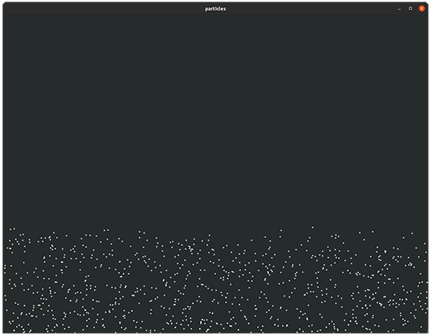
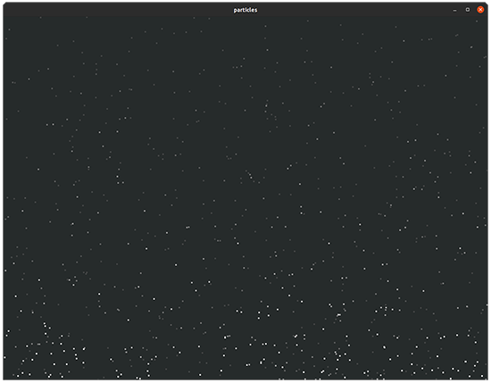
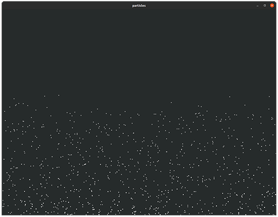
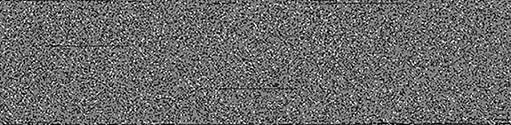

***Memory***

In this chapter, you’ll create your first graphical application. The chapter introduces little new Rust syntax, as the material is quite dense. You’ll learn how to construct pointers, how to interact with an OS via its native API, and how to interact with other programs through Rust’s foreign function interface.

***6.1***

***Pointers***

*Pointers* are how computers refer to data that isn’t immediately accessible. This topic tends to have an aura of mystique to it. That’s not necessary. If you’ve ever read a book’s table of contents, then you’ve used a pointer. Pointers are just numbers that refer to somewhere else.

If you’ve never encountered systems programming before, there is a lot of terminology to grapple with that describes unfamiliar concepts. Thankfully, though, what’s sitting underneath the abstraction is not too difficult to understand. The first thing to grasp is the notation used in this chapter’s figures. Figure 6.1 introduces three concepts:

 The arrow refers to some location in memory that is determined at runtime rather than at compile time.

 Each box represents a block of memory, and each block refers to a usize width.

Other figures use a byte or perhaps even a bit as the chunk of memory these refer to.

 The rounded box underneath the Value label represents three contiguous blocks of memory.

**Pointers are typically denoted as arrows.**

Pointer

**Inside the computer, these are encoded as**

Value

**an integer (equivalent to usize), which is the**

**memory adddress of their referent (the data**

**that the pointer refers to).**

Figure 6.1

Depicting notation used in this chapter’s figures for

illustrating a pointer. In Rust, pointers are most frequently encountered as **&T** and **&mut** **T**, where **T** is the type of the value.

For newcomers, pointers are scary and, at the same time, awe-inspiring. Their proper use requires that you know exactly how your program is laid out in memory. Imagine reading a table of contents that says chapter 4 starts on page 97, but it actually starts on page 107. That would be frustrating, but at least you could cope with the mistake.

A computer doesn’t experience frustration. It also lacks any intuition that it has pointed to the wrong place. It just keeps working, correctly or incorrectly, as if it had been given the correct location. The fear of pointers is that you will introduce some impossible-to-debug error.

***Pointers***

**177**

We can think of data stored within the program’s memory as being scattered around somewhere within physical RAM. To make use of that RAM, there needs to be some sort of retrieval system in place. An *address space* is that retrieval system.

Pointers are encoded as memory addresses, which are represented as integers of type usize. An address points to somewhere within the address space. For the moment, think of the address space as all of your RAM laid out end to end in a single line.

Why are memory addresses encoded as usize? Surely there’s no 64-bit computer with 264 bytes of RAM. The range of the address space is a façade provided by the OS

and the CPU. Programs only know an orderly series of bytes, irrespective of the amount of RAM that is actually available in the system. We discuss how this works later in the virtual memory section of this chapter.

NOTE

Another interesting example is the Option\<T\> type. Rust uses null pointer optimization to ensure that an Option\<T\> occupies 0 bytes in the compiled binary. The None variant is represented by a *null pointer* (a pointer to invalid memory), allowing the Some(T) variant to have no additional indirection.

What are the differences between references, pointers, and memory addresses?

References, pointers, and memory addresses are confusingly similar:

 *A memory address, often shortened to address, is a number that happens to* *refer to a single byte in memory.* Memory addresses are abstractions provided by assembly languages.

 *A pointer, sometimes expanded to raw pointer, is a memory address that points* *to a value of some type.* Pointers are abstractions provided by higher-level languages.

 *A reference is a pointer, or in the case of dynamically sized types, a pointer and* *an integer with extra guarantees.* References are abstractions provided by Rust.

Compilers are able to determine spans of valid bytes for many types. For example, when a compiler creates a pointer to an i32, it can verify that there are 4 bytes that encode an integer. This is more useful than simply having a memory address, which may or may not point to any valid data type. Unfortunately, the programmer bears the responsibility for ensuring the validity for types with no known size at compile time.

Rust’s references offer substantial benefits over pointers:

 *References always refer to valid data.* Rust’s references can only be used when it’s legal to access their referent. I’m sure you’re familiar with this core tenet of Rust by now!

 *References are correctly aligned to multiples of usize.* For technical reasons, CPUs become quite temperamental when asked to fetch unaligned memory.

**178**

***Memory***

***(continued)***

They operate much more slowly. To mitigate this problem, Rust’s types actually include padding bytes so that creating references to these does not slow down your program.

 *References are able to provide these guarantees for dynamically sized types.*

For types with no fixed width in memory, Rust ensures that a length is kept alongside the internal pointer. That way Rust can ensure that the program never overruns the type’s space in memory.

NOTE

The distinguishing characteristic between memory addresses and the two higher abstractions is that the latter two have information about the type of their referent.

***6.2***

***Exploring Rust’s reference and pointer types***

This section teaches you how to work with several of Rust’s pointer types. *Rust in Action* tries to stick to the following guidelines when discussing these types:

 *References*—Signal that the Rust compiler will provide its safety guarantees.

 *Pointers*—Refer to something more primitive. This also includes the implication that we are responsible for maintaining safety. (There is an implied connota-tion of being unsafe.)

 *Raw pointers*—Used for types where it’s important to make their unsafe nature explicit.

Throughout this section, we’ll expand on a common code fragment introduced by listing 6.1. Its source code is available in ch6/ch6-pointer-intro.rs. In the listing, two global variables, B and C, are pointed to by references. Those references hold the addresses of B and C, respectively. A view of what’s happening follows the code in figures 6.2 and 6.3.

Listing 6.1

Mimicking pointers with references

static B: \[u8; 10\] = \[99, 97, 114, 114, 121, 116, 111, 119, 101, 108\]; static C: \[u8; 11\] = \[116, 104, 97, 110, 107, 115, 102, 105, 115, 104, 0\]; **For simplicity, uses the same**

fn main() {

**reference type for this example.**

**The {:p} syntax asks**

let a = 42;

**Later examples distinguish smart**

**Rust to format the**

let b = &B;

**pointers from raw pointers and**

**variable as a pointer**

let c = &C;

**require different types.**

**and prints the memory**

**address that the value**

println!("a: {}, b: {:p}, c: {:p}", a, b, c);

**points to.**

}

***Exploring Rust’s reference and pointer types***

**179**

**Variables *c*** **and *b*** **are references.**

**Assuming *a*** **is**

**References are 4 bytes wide on**

**an** i32**, it takes**

**32-bit CPUs and 8 bytes wide on**

**4 bytes of**

**64-bit CPUs.**

**memory.**

**c**

**b**

**a**

42

**B**

99

97

114

114

121

116

111

119

101

108

**C**

116

104

97

110

107

115

102

105

115

104

0

**A partial view of the program’s address space**

Figure 6.2

An abstract view of how two pointers operate alongside a standard integer.

The important lesson here is that the programmer might not know the location of the referent data beforehand.

Listing 6.1 has three variables within its main() function. a is rather trivial; it’s just an integer. The other two are more interesting. b and c are references. These refer to two opaque arrays of data, B and C. For the moment, consider Rust references as equivalent to pointers. The output from one execution on a 64-bit machine is as follows: **If you run the code, the exact**

a: 42, b: 0x556fd40eb480, c: 0x556fd40eb48a

**memory addresses will be**

**different on your machine.**

Figure 6.3 provides a view of the same example in an imaginary address space of 49

bytes. It has a pointer width of two bytes (16 bits). You’ll notice that the variables b and c look different in memory, despite being the same type as in listing 6.1. That’s due to that because the listing is lying to you. The gritty details and a code example that more closely represents the diagram in figure 6.3 are coming shortly.

As evidenced in figure 6.2, there’s one problem with portraying pointers as arrows to disconnected arrays. These tend to de-emphasize that the address space is contiguous and shared between all variables.

For a more thorough examination of what happens under the hood, listing 6.2

produces much more output. It uses more sophisticated types instead of references to

**180**

***Memory***

Variable

**c**

**b**

**a**

Raw pointer

Smart pointer

Integer

Abstract data type

Length field

Address field

u16 (16 == 0x10) i16

u16 (32 == 0x20) i16

Concrete

representation

Memory layout

0x2A

0x2B

0x2C

0x2D

0x2E

0x2F

0x30

0x31

0

16

0

10

0

32

0

42

0x22

0x23

0x24

0x25

0x26

0x27

0x28

0x29

**B**

114

114

121

116

111

119

101

108

**A fixed-width**

**buffer of length**

**C**

0x1A

0x1B

0x1C

0x1D

0x1E

0x1F

0x20

0x21

**10 that contains**

**0**

99

97

**A zero-terminated**

**bytes without a**

**buffer, which is**

**terminator.**

**the internal**

0x12

0x13

0x14

0x15

0x16

0x17

0x18

0x19

97

110

107

115

102

105

115

104

**representation**

**When used behind**

**of strings in the**

**a pointer type, a**

**C language.**

0xA

0xB

0xC

0xD

0xE

0xF

0x10

0x11

**buffer is often called**

116

104

**the backing array.**

**Knowing how to**

**convert these**

0x1

0x2

0x3

0x4

0x5

0x6

0x7

0x8

**Together,** b **and** B

**to Rust types is**

**can almost create**

**useful for working**

**the** String **type**

**with external code**

0x0

**in Rust, which**

**via its foreign**

**The NULL byte—a program’s dead zone. If a**

**also contains a**

**function interface.**

**pointer points to here and is then dereferenced,**

**capacity parameter.**

**the program typically crashes.**

**Together,** c **and**

C **are a** CStr **in**

**Rust’s type system.**

Figure 6.3

An illustrative address space of the program provided in listing 6.1. It provides an illustration of the relationship between addresses (typically written in hexadecimal) and integers (typically written in decimal). White cells represent unused memory.

demonstrate how these differ internally and to correlate more accurately what is presented in figure 6.3. The following shows the output from listing 6.2: a (an unsigned integer):

location: 0x7ffe8f7ddfd0

size: 8 bytes

value: 42

b (a reference to B):

location: 0x7ffe8f7ddfd8

size: 8 bytes

points to: 0x55876090c830

c (a "box" for C):

location: 0x7ffe8f7ddfe0

size: 16 bytes

points to: 0x558762130a40

***Exploring Rust’s reference and pointer types***

**181**

B (an array of 10 bytes):

location: 0x55876090c830

size: 10 bytes

value: \[99, 97, 114, 114, 121, 116, 111, 119, 101, 108\]

C (an array of 11 bytes):

location: 0x55876090c83a

size: 11 bytes

value: \[116, 104, 97, 110, 107, 115, 102, 105, 115, 104, 0

Listing 6.2

Comparing references and **Box\<T\>** to several types

**&\[u8; 10\] reads as “a reference to an array of 10 bytes.” The array is located in static** **memory, and the reference itself (a pointer of width usize bytes) is placed on the stack.**

1 use std::mem::size_of;

2

3 static B: \[u8; 10\] = \[99, 97, 114, 114, 121, 116, 111, 119, 101, 108\]; 4 static C: \[u8; 11\] = \[116, 104, 97, 110, 107, 115, 102, 105, 115, 104, 0\]; 5

6 fn main() {

**usize is the memory address size for the**

7 let a: usize = 42;

**CPU the code is compiled for. That CPU is**

8

**called the compile target.**

9 let b: &\[u8; 10\] = &B;

10

**The Box\<\[u8\]\> type is a boxed byte**

11 let c: Box\<\[u8\]\> = Box::new(C);

**slice. When we place values inside a**

12

**box, ownership of the value moves to**

13 println!("a (an unsigned integer):");

**the owner of the box.**

14 println!(" location: {:p}", &a);

15 println!(" size: {:?} bytes", size_of::\<usize\>()); 16 println!(" value: {:?}", a);

17 println!();

18

19 println!("b (a reference to B):");

20 println!(" location: {:p}", &b);

21 println!(" size: {:?} bytes", size_of::\<&\[u8; 10\]\>()); 22 println!(" points to: {:p}", b);

23 println!();

24

25 println!("c (a "box" for C):");

26 println!(" location: {:p}", &c);

27 println!(" size: {:?} bytes", size_of::\<Box\<\[u8\]\>\>()); 28 println!(" points to: {:p}", c);

29 println!();

30

31 println!("B (an array of 10 bytes):");

32 println!(" location: {:p}", &B);

33 println!(" size: {:?} bytes", size_of::\<\[u8; 10\]\>()); 34 println!(" value: {:?}", B);

35 println!();

36

37 println!("C (an array of 11 bytes):");

38 println!(" location: {:p}", &C);

39 println!(" size: {:?} bytes", size_of::\<\[u8; 11\]\>()); 40 println!(" value: {:?}", C);

41 }

**182**

***Memory***

For readers who are interested in decoding the text within B and C, listing 6.3 is a short program that (almost) creates a memory address layout that resembles figure 6.3 more closely. It contains a number of new Rust features and some relatively arcane syntax, both of which haven’t been introduced yet. These will be explained shortly.

Listing 6.3

Printing from strings provided by external sources

**A smart pointer type that reads from its pointer**

**CStr is a C-like string type**

**location without needing to copy it first**

**that allows Rust to read in**

**zero-terminated strings.**

use std::borrow::Cow;

use std::ffi::CStr;

**c_char, a type alias for Rust’s i8**

**type, presents the possibility of**

**a platform-specific nuances.**

use std::os::raw::c_char;

static B: \[u8; 10\] = \[99, 97, 114, 114, 121, 116, 111, 119, 101, 108\]; static C: \[u8; 11\] = \[116, 104, 97, 110, 107, 115, 102, 105, 115, 104, 0\]; fn main() {

**Introduces each of the variables so that these are accessible** let a = 42;

**from println! later. If we created b and c within the unsafe**

**block, these would be out of scope later.**

let b: String;

**Cow accepts a type parameter for**

**the data it points to; str is the type**

let c: Cow\<str\>;

**returned by CStr.to_string_lossy(),**

**References cannot be**

**so it is appropriate here.**

**cast directly to \*mut T,**

unsafe {

**the type required by**

let b_ptr = &B as \*const u8 as \*mut u8;

**String::from_raw_parts().**

**But \*const T can be cast**

**to \*mut T, leading to this**

b = String::from_raw_parts(b_ptr, 10, 10);

**double cast syntax.**

let c_ptr = &C as \*const u8 as \*const c_char;

**String::from_raw_parts()**

**accepts a pointer (\*mut T)**

c = CStr::from_ptr(c_ptr).to_string_lossy();

**to an array of bytes, a size,**

}

**and a capacity parameter.**

println!("a: {}, b: {}, c: {}", a, b, c);

**Converts a \*const u8 to a**

}

**Conceptually, CStr::from_ptr()**

**\*const i8, aliased to c_char.**

**String is a smart pointer**

**takes responsibility for reading**

**The conversion to i8 works**

**type that holds a pointer to**

**the pointer until it reaches 0;**

**because we remain under 128,**

**a backing array and a field**

**then it generates Cow\<str\>**

**following the ASCII standard.**

**to store its size.**

**from the result.**

In listing 6.3, Cow stands for *copy on write*. This smart pointer type is handy when an external source provides a buffer. Avoiding copies increases runtime performance.

std::ffi is the foreign function interface module from Rust’s standard library. use std::os::raw::c_char; is not strictly needed, but it does make the code’s intent clear. C does not define the width of its char type in its standard, although it’s one byte wide in practice. Retrieving the type alias c_char from the std::os:raw module allows for differences.

***Exploring Rust’s reference and pointer types***

**183**

To thoroughly understand the code in listing 6.3, there is quite a bit of ground to cover. We first need to work through what raw pointers are and then discuss a number of feature-rich alternatives that have been built around them.

***6.2.1***

***Raw pointers in Rust***

A *raw pointer* is a memory address without Rust’s standard guarantees. These are inherently unsafe. For example, unlike references (&T), raw pointers can be null.

If you’ll forgive the syntax, raw pointers are denoted as \*const T and \*mut T for immutable and mutable raw pointers, respectively. Even though each is a single type, these contain three tokens: \*, const or mut. Their type, T, a raw pointer to a String, looks like \*const String. A raw pointer to an i32 looks like \*mut i32. But before we put pointers into practice, here are two other things that are useful to know:

 *The difference between a \*mut T and a \*const T is minimal.* These can be freely cast between one another and tend to be used interchangeably, acting as in-source documentation.

 *Rust references (&mut T and &T) compile down to raw pointers.* That means that it’s possible to access the performance of raw pointers without needing to venture into unsafe blocks.

The next listing provides a small example that coerces a reference to a value (&T), creating a raw pointer from an i64 value. It then prints the value and its address in memory via the {:p} syntax.

Listing 6.4

Creating a raw pointer (**\*const T**)

fn main() {

**Casts a reference to the**

**variable a (&a) to a constant**

let a: i64 = 42;

**raw pointer i64 (\*const i64)**

let a_ptr = &a as \*const i64;

println!("a: {} ({:p})", a, a_ptr);

**Prints the value of the variable**

}

**a (42) and its address in**

**memory (0x7ff…)**

The terms *pointer* and *memory address* are sometimes used interchangeably. These are integers that represent a location in virtual memory. From the compiler’s point of view, though, there is one important difference. Rust’s pointer types \*const T and

\*mut T always point to the starting byte of T, and these also know the width of type T in bytes. A memory address might refer to anywhere in memory.

An i64 is 8-bytes wide (64 bits ÷ 8 bits per byte). Therefore, if an i64 is stored at address 0x7fffd, then each of the bytes between 0x7ffd..0x8004 must be fetched from RAM to recreate the integer’s value. The process of fetching data from RAM

from a pointer is known as *dereferencing a pointer*. The following listing identifies a value’s address by casting a reference to it as a raw pointer via std::mem::transmute.

**184**

***Memory***

Listing 6.5

Identifying a value’s address

fn main() {

let a: i64 = 42;

**Interprets \*const i64 as usize.**

let a_ptr = &a as \*const i64;

**Using transmute() is highly unsafe**

let a_addr: usize = unsafe {

**but is used here to postpone**

std::mem::transmute(a_ptr)

**introducing more syntax.**

};

println!("a: {} ({:p}...0x{:x})", a, a_ptr, a_addr + 7);

}

Under the hood, references (&T and &mut T) are implemented as raw pointers. These come with extra guarantees and should always be preferred.

WARNING

Accessing the value of a raw pointer is always unsafe. Handle with care.

Using raw pointers in Rust code is like working with pyrotechnics. Usually the results are fantastic, sometimes they’re painful, and occasionally they’re tragic. Raw pointers are often handled in Rust code by the OS or a third-party library.

To demonstrate their volatility, let’s work through a quick example with Rust’s raw pointers. Creating a pointer of arbitrary types from any integer is perfectly legal.

Dereferencing that pointer must occur within an unsafe block, as the following snippet shows. An unsafe block implies that the programmer takes full responsibility for any consequences:

fn main() {

**You can create pointers safely from**

let ptr = 42 as \*const Vec\<String\>;

**any integral value. An i32 is not a**

**Vec\<String\>, but Rust is quite**

unsafe {

**comfortable ignoring that here.**

let new_addr = ptr.offset(4);

println!("{:p} -\> {:p}", ptr, new_addr);

}

}

To reiterate, raw pointers are not safe. These have a number of properties that mean that their use is strongly discouraged within day-to-day Rust code:

 *Raw pointers do not own their values.* The Rust compiler does not check that the referent data is still valid when these are accessed.

 *Multiple raw pointers to the same data are allowed.* Every raw pointer can have write, read-write access to data. This means that there is no time when Rust can guarantee that shared data is valid.

Notwithstanding those warnings, there are a small number of valid reasons to make use of raw pointers:

***Exploring Rust’s reference and pointer types***

**185**

 *It’s unavoidable.* Perhaps some OS call or third-party code requires a raw pointer.

Raw pointers are common within C code that provides an external interface.

 *Shared access to something is essential and runtime performance is paramount.* Perhaps multiple components within your application require equal access to some expensive-to-compute variable. If you’re willing to take on the risk of one of those components poisoning every other component with some silly mistake, then raw pointers are an option of last resort.

***6.2.2***

***Rust’s pointer ecosystem***

Given that raw pointers are unsafe, what is the safer alternative? The alternative is to use smart pointers. In the Rust community, a *smart pointer* is a pointer type that has some kind of superpower, over and above the ability to deference a memory address.

You will probably encounter the term *wrapper type* as well. Rust’s smart pointer types tend to wrap raw pointers and bestow them with added semantics.

A narrower definition of smart pointer is common in the C communities. There authors (generally) imply that the term smart pointer means the C equivalents of Rust’s core::ptr::Unique, core::ptr::Shared, and std::rc::Weak types. We will introduce these types shortly.

NOTE

The term *fat pointer* refers to memory layout. Thin pointers, such as raw pointers, are a single usize wide. Fat pointers are usually two usize wide, and occasionally more.

Rust has an extensive set of pointer (and pointer-like) types in its standard library.

Each has its own role, strengths, and weaknesses. Given their unique properties, rather than writing these out as a list, let’s model these as characters in a card-based role-playing game, as shown in figure 6.4.

Each of the pointer types introduced here are used extensively throughout the book. As such, we’ll give these fuller treatment when that’s needed. For now, the two novel attributes that appear within the Powers section of some of these cards are interior mutability and shared ownership. These two terms warrant some discussion.

With interior mutability, you may want to provide an argument to a method that takes immutable values, yet you need to retain mutability. If you’re willing to pay the runtime performance cost, it’s possible to fake immutability. If the method requires an owned value, wrap the argument in Cell\<T\>. References can also be wrapped in RefCell\<T\>. It is common when using the reference counted types Rc\<T\> and Arc\<T\>, which only accept immutable arguments, to also wrap those in Cell\<T\> or RefCell\<T\>. The resulting type might look like Rc\<RefCell\<T\>\>. This means that you pay the runtime cost twice but with significantly more flexibility.

With shared ownership, some objects, such as a network connection or, perhaps, access to some OS service, are difficult to mould into the pattern of having a single place with read-write access at any given time. Code might be simplified if two parts of

**186**

***Memory***

**Raw Pointer**

**Box\<T\>**

**Rc\<T\>**

**Arc\<T\>**

The cousins mut

\*

T and

Store anything in a box. Accepts

The reference counted pointer, Rc\<T\>

Arc\<T\> is Rust’s ambassador.

\*const T are the free radicals

almost any type for long-term

is Rust's competent, yet miserly

It can share values across threads,

of the pointer world. Lightning

storage. The workhorse of a

bookkeeper. It knows who has

guaranteeing that these will

fast, but wildly unsafe.

new, safe programming era.

borrowed what and when.

not interfere with each other.

**Powers**

**Weaknesses**

**Powers**

**Weaknesses**

**Powers**

**Weaknesses**

**Powers**

**Weaknesses**

• Speed

• Unsafe

• Store a value in

• Size increase

• Shared access

• Size increase

• Shared access

• Size increase

• Can interact with

central storage

to values

• Runtime cost

to values

• Runtime cost

the outside world

in a location

• Threadsafe

called “the heap”

• Not threadsafe

**Cell\<T\>**

**RefCell\<T\>**

**Cow\<T\>**

**String**

An expert in metamorphosis,

Performs mutation on immutable

Why write something down when

Acting as a guide on how to

Cell\<T\> confers the ability to

references with RefCel\<T\>.

you only need to read it? Perhaps

deal with the uncertainties of

mutate immutable values.

Its mind-bending powers

you only want to make modifications.

user input, String shows us how

come with some costs.

This is the role of Cow (copy on write).

to build safe abstractions.

**Powers**

**Weaknesses**

**Powers**

**Weaknesses**

**Powers**

**Weaknesses**

**Powers**

**Weaknesses**

• Interior mutability

• Size increase

• Interior mutability

• Size increase

• Avoids writes

• Possible size

• Grows dynamically

• Can over

• Performance

• Can be nested

• Runtime cost

when only read

increase

as required

allocate size

access is used

within Rc and Arc,

• Lack of compile-

• Guarantees correct

which only accept

time guarantees

encoding at runtime

immutable refs

**Arc\<T\>**

**RawVec\<T\>**

**Unique\<T\>**

**Shared\<T\>**

Your program’s main storage system.

The bedrock of Vec\<T\> and

Sole owner of a value,

Sharing ownership is hard.

Vec\<T\> keeps your data orderly

other dynamically sized types.

a unique pointer is guaranteed

Shared\<T\> makes life

as values are created and destroyed.

Understands how to provide a

to possess full control.

a little bit easier.

home for your data as needed.

**Powers**

**Weaknesses**

**Powers**

**Weaknesses**

**Powers**

**Weaknesses**

**Powers**

**Weaknesses**

• Grows dynamically

• Can over

• Grows dynamically

• Not directly

• Base for types

• Not appropriate

• Shared ownership

• Not appropriate

as required

allocate size

as required

applicable from

such as Strings,

for application

• Can align memory

for application

• Works with the

your code

requiring exclusive

code directly

to T’s width, even

code directly

memory allocator

possession of values.

when empty

to find space

Figure 6.4

A fictitious role-playing card game describing the characteristics of Rust's smart pointer types the program can share access to that single resource. Rust allows you to do this, but again, at the expense of a runtime cost.

***6.2.3***

***Smart pointer building blocks***

You might find yourself in a situation where you want to build your own smart pointer type with its own semantics. Perhaps a new research paper has been released, and you want to incorporate its results into your own work. Perhaps you’re conducting the

***Providing programs with memory for their data***

**187**

research. Regardless, it might be useful to know that Rust’s pointer types are extensible—these are designed with extension in mind.

All of the programmer-facing pointer types like Box\<T\> are built from more primitive types that live deeper within Rust, often in its core or alloc modules. Additionally, the C++ smart pointer types have Rust counterparts. Here are some useful starting points for you when building your own smart pointer types:

 core::ptr::Unique is the basis for types such as String, Box\<T\>, and the pointer field Vec\<T\>.

 core::ptr::Shared is the basis for Rc\<T\> and Arc\<T\>, and it can handle situations where shared access is desired.

In addition, the following tools can also be handy in certain situations:

 *Deeply interlinked data structures can benefit from std::rc::Weak and std::arc::* *Weak for single and multi-threaded programs, respectively.* These allow access to data within an Rc/Arc without incrementing its reference count. This can prevent never-ending cycles of pointers.

 *The alloc::raw_vec::RawVec type underlies Vec\<T\> and VecDeq\<T\>.* An expand-able, double-ended queue that hasn’t appeared in the book so far, it understands how to allocate and deallocate memory in a smart way for any given type.

 *The std::cell::UnsafeCell type sits behind both Cell\<T\> and RefCell\<T\>.* If you would like to provide interior mutability to your types, its implementation is worth investigating.

A full treatment of building new safe pointers touches on some of Rust’s internals.

These building blocks have their own building blocks. Unfortunately, explaining every detail will diverge too far from our goals for this chapter.

NOTE

Inquisitive readers should investigate the source code of the standard library’s pointer types. For example, the std::cell::RefCell type is documented at [https://doc.rust-lang.org/std/cell/struct.RefCell.html.](https://doc.rust-lang.org/std/cell/struct.RefCell.html) Clicking the \[src\] button on that web page directs you to the type’s definition.

***6.3***

***Providing programs with memory for their data***

This section attempts to demystify the terms *the stack* and *the heap*. These terms often appear in contexts that presuppose you already know what they mean. That isn’t the case here. We’ll cover the details of what they are, why they exist, and how to make use of that knowledge to make your programs leaner and faster.

Some people hate wading through the details, though. For those readers, here is the salient difference between the stack and the heap:

 The stack is fast.

 The heap is slow.

That difference leads to the following axiom: “When in doubt, prefer the stack.” To place data onto the stack, the compiler must know the type’s size at compile time.

**188**

***Memory***

Translated to Rust, that means, “When in doubt, use types that implement Sized.”

Now that you’ve got the gist of those terms, it’s time to learn when to take the slow path and how to avoid it when you want to take a faster one.

***6.3.1***

***The stack***

The stack is often described by analogy. Think of a stack of dinner plates waiting in the cupboard of a commercial kitchen. Cooks are taking plates off the stack to serve food, and dishwashers are placing new plates on the top.

The unit (the plate) of a computing stack is the stack frame, also known as the *allocation record*. You are probably used to thinking of this as a group of variables and other data. Like many descriptions in computing, the stack and the heap are analogies that only partially fit. Even though the stack is often compared by analogy to a stack of dinner plates waiting in the cupboard, unfortunately, that mental picture is inaccurate.

Here are some differences:

 The stack actually contains two levels of objects: stack frames and data.

 The stack grants programmers access to multiple elements stored within it, rather than the top item only.

 The stack can include elements of arbitrary size, where the implication of the dinner plate analogy is that all elements must be of the same size.

So why is the stack called the stack? Because of the usage pattern. Entries on the stack are made in a Last In, First Out (LIFO) manner.

The entries in the stack are called *stack frames*. Stack frames are created as function calls are made. As a program progresses, a cursor within the CPU updates to reflect the current address of the current stack frame. The cursor is known as the *stack pointer*.

As functions are called within functions, the stack pointer decreases in value as the stack grows. When a function returns, the stack pointer increases.

Stack frames contain a function’s state during the call. When a function is called within a function, the older function’s values are effectively frozen in time. Stack frames are also known as *activation frames*, and less commonly *allocation records*.1

Unlike dinner plates, every stack frame is a different size. The stack frame contains space for its function’s arguments, a pointer to the original call site, and local variables (except the data which is allocated on the heap).

NOTE

If you are unfamiliar with what the term *call site* means, see the CPU

emulation section in chapter 5.

To understand what is happening more fully, let’s consider a thought experiment.

Imagine a diligent, yet absurdly single-minded cook in a commercial kitchen. The cook takes each table’s docket and places those in a queue. The cook has a fairly bad memory, so each current order is written down a notebook. As new orders come in, 1 To be precise, the activation frame is called a stack frame when allocated on the stack.

***Providing programs with memory for their data***

**189**

the cook updates the notebook to refer to the new order. When orders are complete, the notebook page is changed to the next item in the queue. Unfortunately, for cus-tomers in this restaurant, the book operates in a LIFO manner. Hopefully, you will not be one of the early orders during tomorrow’s lunch rush.

In this analogy, the notebook plays the role of the stack pointer. The stack itself is comprised of variable-length dockets, representing stack frames. Like stack frames, restaurant dockets contain some metadata. For example, the table number can act as the return address.

The stack’s primary role is to make space for local variables. Why is the stack fast?

All of a function’s variables are side by side in memory. That speeds up access.

Improving the ergonomics of functions that can only accept **String** or **&str** As a library author, it can simplify downstream application code if your functions can accept both &str and String types. Unfortunately, these two types have different representations in memory. One (&str) is allocated on the stack, the other (String) allocates memory on the heap. That means that types cannot be trivially cast between one another. It’s possible, however, to work around this with Rust’s generics.

Consider the example of validating a password. For the purposes of the example, a strong password is one that’s at least 6 characters long. The following shows how to validate the password by checking its length:

fn is_strong(password: String) -\> bool {

password.len() \> 5

}

is_strong can only accept String. That means that the following code won’t work: let pw = "justok";

let is_strong = is_strong(pw);

But generic code can help. In cases where read-only access is required, use functions with the type signature fn x\<T: AsRef\<str\>\> (a: T) rather than fn x(a: String).

The fairly unwieldy type signature reads “as function x takes an argument password of type T, where T implements AsRef\<str\>.” Implementors of AsRef\<str\> behave as a reference to str even when these are not.

Here is the code snippet again for the previous listing, accepting any type T that implements AsRef\<str\>. It now has the new signature in place: fn is_strong\<T: AsRef\<str\>\>(password: T) -\> bool {

**Provides a**

password.as_ref().len() \> 5

**String or a &str**

}

**as password**

When read-write access to the argument is required, normally you can make use of AsRef\<T\>'s sibling trait AsMut\<T\>. Unfortunately for this example, &'static str cannot become mutable and so another strategy can be deployed: implicit conversion.

**190**

***Memory***

***(continued)***

It’s possible to ask Rust to accept only those types that can be converted to String.

The following example performs that conversion within the function and applies any required business logic to that newly created String. This can circumvent the issue of &str being an immutable value.

fn is_strong\<T: Into\<String\>\>(password: T) -\> bool {

password.into().len() \> 5

}

This implicit conversion strategy does have significant risks, though. If a string-ified version of the password variable needs to be created multiple times in the pipeline, it would be much more efficient to require an explicit conversion within the calling application. That way the String would be created once and reused.

***6.3.2***

***The heap***

This section introduces the heap. The heap is an area of program memory for types that do not have known sizes at compile time.

What does it mean to have no known size at compile time? In Rust, there are two meanings. Some types grow and shrink over time as required. Obvious cases are String and Vec\<T\>. Other types are unable to tell the Rust compiler how much memory to allocate even though these don’t change size at runtime. These are known as dynamically sized types. Slices (\[T\]) are the commonly cited example. Slices have no compile-time length. Internally, these are a pointer to some part of an array. But slices actually represent some number of elements within that array.

Another example is a *trait object*, which we’ve not described in this book so far. Trait objects allow Rust programmers to mimic some features of dynamic languages by allowing multiple types to be wedged into the same container.

WHAT IS THE HEAP?

You will gain a fuller understanding of *what* the heap is once you work through the next section on virtual memory. For now, let’s concentrate on what it is *not*. Once those points are clarified, we’ll then work our way back toward some form of truth.

The word “heap” implies disorganization. A closer analogy would be warehouse space in some medium-sized business. As deliveries arrive (as variables are created), the warehouse makes space available. As the business carries out its work, those materials are used, and the warehouse space can now be made available for new deliveries.

At times, there are gaps and perhaps a bit of clutter. But overall, there is a good sense of order.

Another mistake is that the heap has no relationship to the data structure that is also known as a heap. That data structure is often used to create priority queues. It’s an incredibly clever tool in its own right, but right now it’s a complete distraction. The heap is not a data structure. It’s an area of memory.

***Providing programs with memory for their data***

**191**

Now that those two distinctions are made, let’s inch toward an explanation. The critical difference from a usage point of view is that variables on the heap must be accessed via a pointer, whereas this is not required with variables accessed on the stack.

Although it’s a trivial example, let’s consider two variables, a and b. These both represent the integers 40 and 60, respectively. In one of those cases though, the integer happens to live on the heap, as in this example:

let a: i32 = 40;

let b: Box\<i32\> = Box::new(60);

Now, let’s demonstrate that critical difference. The following code won’t compile: let result = a + b;

The boxed value assigned to b is only accessible via a pointer. To access that value, we need to dereference it. The dereference operator is a unary \*, which prefixes the variable name:

let result = a + \*b;

This syntax can be difficult to follow at first because the symbol is also used for multiplication. It does, however, become more natural over time. The following listing shows a complete example where creating variables on the heap implies constructing that variable via a pointer type such as Box\<T\>.

Listing 6.6

Creating variables on the heap

fn main() {

**40 lives on the stack.**

let a: i32 = 40;

let b: Box\<i32\> = Box::new(60);

**60 lives on the heap.**

println!("{} + {} = {}", a, b, a + \*b);

**To access 60, we need**

**to dereference it.**

}

To get a feel for what the heap is and what is happening within memory as a program runs, let’s consider a tiny example. In this example, all we will do is to create some numbers on the heap and then add their values together. When run, the program in listing 6.7 produces some fairly trivial output: two 3s. Still, it’s really the internals of the program’s memory that are important here, not its results.

The code for the next listing is in the file ch6/ch6-heap-via-box/src/main.rs. A pictorial view of the program’s memory as it runs (figure 6.5) follows the code. Let’s first look at the program’s output:

3 3

**192**

***Memory***

Listing 6.7

Allocating and deallocating memory on the heap via **Box\<T\>** 1 use std::mem::drop;

**Brings manual drop()**

2

**into local scope**

3 fn main() {

4 let a = Box::new(1);

**Allocates values**

5 let b = Box::new(1);

**on the heap**

6 let c = Box::new(1);

7

8 let result1 = \*a + \*b + \*c;

**The unary \*, the dereference operator,**

9

**returns the value within the box, and**

10 drop(a);

**result1 holds the value 3.**

11 let d = Box::new(1);

12 let result2 = \*b + \*c + \*d;

**Invokes drop(), freeing**

13

**memory for other uses**

14 println!("{} {}", result1, result2);

15 }

Listing 6.7 places four values on the heap and removes one. It contains some new or, at least, less familiar syntax that might be worthwhile to cover and/or recap:

 *Box::new(T) allocates T on the heap.* *Box* is a term that can be deceptive if you don’t share its intuition.

Something that has been *boxed* lives on the heap, with a pointer to it on the stack. This is demonstrated in the first column of figure 6.5, where the number 0x100 at address 0xfff points to the value 1 at address 0x100. However, no actual box of bytes encloses a value, nor is the value hidden or concealed in some way.

 *std::mem::drop brings the function drop() into local scope.* drop() deletes objects before their scope ends.

Types that implement Drop have a drop() method, but explicitly calling it is illegal within user code. std::mem::drop is an escape hatch from that rule.

 *Asterisks next to variables (\*a, \*b, \*c, and \*d) are unary operators.* This is the *dereference operator*. Dereferencing a Box::(T) returns T. In our case, the variables a, b, c, and d are references that refer to integers.

In figure 6.5, each column illustrates what happens inside memory at 6 lines of code.

The stack appears as the boxes along the top, and the heap appears along the bottom.

The figure omits several details, but it should help you gain an intuition about the relationship between the stack and the heap.

NOTE

If you have experience with a debugger and want to explore what is happening, be sure to compile your code with no optimizations. Compile your code with cargo build (or cargo run) rather than cargo build --release.

Using the --release flag actually ends up optimizing all the allocations and arithmetic. If you are invoking rustc manually, use the command rustc

--codegen opt-level=0.

***Providing programs with memory for their data***

**193**

**Program execution over time**

let a = Box::new(1)

let b = Box::new(1)

let c = Box::new(1)

let result1 = \*a + \*b + \*c;

drop(a)

let d = Box::new(1)

**Memory layout over time**

0xfff

1 0 0

1 0 0

1 0 0

1 0 0

1 0 0

1 0 0

0xff7

1 0 8

1 0 8

1 0 8

1 0 8

1 0 8

0xfef

1 1 0

1 1 0

1 1 0

1 1 0

0xfe7

3

3

3

0xfdf

1 0 0

0x120

0x118

0x110

1

1

1

1

0x108

1

1

1

1

1

0x100

1

1

1

1

1

1

**i32 values are allocated on**

**The three integers**

**The boxed value**

**The space**

**the heap and a pointer to**

**are added together**

**probably hasn’t**

**occupied by a**

**that value’s address is**

**and their sum is**

**been deleted from**

**is reused by d.**

**placed on the stack**

**placed on the stack.**

**the heap, but the**

**(the integers are boxed).**

**memory allocator**

**has marked that**

**location as free**

**for reuse.**

**How to interpret this diagram**

**Rust's super power**

The top box represents the **stack**.

0xfff

1 0 0

The bottom box represents

The lifetime of the variable

0xff7

the heap.

a has ended at this point.

0xfef

The stack grows downwards, rather

0xfe7

The heap begins at the

than upwards as its name suggests.

Accessing this memory

0xfdf

bottom of the address space,

address is now invalid. Its data

For simplicity’s sake, this example’s

0x120

plus an offset, which is

will still be there on the stack,

address space is 4096 bytes. In a

0x118

256 (0x100) here.

but it's impossible to access

0x110

more realistic scenario, such as with

0x108

The space between 0 and

it within safe Rust.

a a 64-bit CPU, the address space

0x100

the offset is reserved for the

1

is 264 bytes long.

program’s executable

instructions and variables

that last the lifetime of

the program.

Figure 6.5

A view into a program’s memory layout during the execution of listing 6.7

**194**

***Memory***

***6.3.3***

***What is dynamic memory allocation?***

At any given time, a running program has a fixed number of bytes with which to get its work done. When the program would like more memory, it needs to ask for more from the OS. This is known as *dynamic memory allocation* and is shown in figure 6.6.

Dynamic memory allocation is a three-step process:

1

Request memory from the OS via a system call. In the UNIX family of operating systems, this system call is alloc(). In MS Windows, the call is HeapAlloc().

2

Make use of the allocated memory in the program.

3

Release memory that isn’t needed back to the OS via free() for UNIX systems and HeapFree() for Windows.

**Within program’s control**

**Outside of program’s control**

Request for memory

Program

Allocator

OS

Hardware

**Smart bookkeeping by the allocator can avoid lots of extra work** **by the operating system and the computer’s hardware.**

Figure 6.6

Conceptual view of dynamic memory allocation. Requests

for memory originate and terminate at the program level but involve several other components. At each stage, the components may short-circuit the process and return quickly.

As it turns out, there is an intermediary between the program and the OS: the *allocator*, a specialist subprogram that is embedded in your program behind the scenes. It will often perform optimizations that avoid lots of work within the OS and CPU.

Let’s examine the performance impact of dynamic memory allocation and strategies to reduce that impact. Before starting, let’s recap why there’s a performance difference between the stack and the heap. Remember that the stack and the heap are conceptual abstractions only. These do not exist as physical partitions of your computer’s memory. What accounts for their different performance characteristics?

Accessing data on the stack is fast because a function’s local variables, which are allocated on the stack, reside next to each other in RAM. This is sometimes referred to as a *contiguous layout*.

A contiguous layout is cache-friendly. Alternatively, variables allocated on the heap are unlikely to reside next to each other. Moreover, accessing data on the heap involves dereferencing the pointer. That implies a page table lookup and a trip to main memory. Table 6.1 summarizes these differences.

***Providing programs with memory for their data***

**195**

Table 6.1

A simplistic, yet practical table for comparing the

stack and the heap

Stack

Heap

Simple

Complex

Safe

Dangerous\*

Fast

Slow

Rigid

Flexible

\* Not in safe Rust!

There is a trade-off for the stack’s increased speed. Data structures on the stack must stay the same size during the lifetime of the program. Data structures allocated on the heap are more flexible. Because these are accessed via a pointer, that pointer can be changed.

To quantify this impact, we need to learn how to measure the cost. To get a large number of measurements, we need a program that creates and destroys many values.

Let’s create a toy program. Figure 6.7 shows show a background element to a video game.

Figure 6.7

Screenshots from the result of running listing 6.9

After running listing 6.9, you should see a window appear on your screen filled with a dark grey background. White snow-like dots will start to float from the bottom and fade as they approach the top. If you check the console output, streams of numbers will appear. Their significance will be explained once we discuss the code. Listing 6.9

contains three major sections:

 A memory allocator (the ReportingAllocator struct) records the time that dynamic memory allocations take.

 Definitions of the structs World and Particle and how these behave over time.

 The main() function deals with window creation and initialization.

**196**

***Memory***

The following listing shows the dependencies for our toy program (listing 6.9). The source for the following listing is in ch6/ch6-particles/Cargo.toml. The source for listing 6.9 is in ch6/ch6-particles/main.rs.

Listing 6.8

Build dependencies for listing 6.9

\[package\]

name = "ch6-particles"

version = "0.1.0"

authors = \["TS McNamara \<author@rustinaction.com\>"\]

edition = "2018"

**Provides a wrapper around the core functionality of**

**the piston game engine, letting us easily draw things**

\[dependencies\]

**onscreen; largely irrespective of the host environment**

piston_window = "0.117"

**Provides vector mathematics, which**

piston2d-graphics = "0.39"

**is important to simulate movement**

rand = "0.8"

**Provides random number generators**

**and associated functionality**

Listing 6.9

A graphical application to create and destroy objects on the heap **graphics::math::Vec2d provides mathematical operations**

**rand provides random number**

**and conversion functionality for 2D vectors.**

**generators and related functionality.**

1 use graphics::math::{Vec2d, add, mul_scalar};

2

3 use piston_window::\*;

**piston_window provides the tools to create**

4

**a GUI program and draws shapes to it.**

5 use rand::prelude::\*;

6

**std::alloc provides**

7 use std::alloc::{GlobalAlloc, System, Layout};

**facilities for controlling**

8

**memory allocation.**

9 use std::time::Instant;

**std::time**

10

**\#\[global_allocator\] marks the**

**provides**

**following value (ALLOCATOR) as**

11

**access to the**

**satisfying the GlobalAlloc trait.**

12 \#\[global_allocator\]

**system’s**

13 static ALLOCATOR: ReportingAllocator = ReportingAllocator;

**clock.**

14

15 struct ReportingAllocator;

**Prints the time taken for each**

16

**allocation to STDOUT as the**

17 unsafe impl GlobalAlloc for ReportingAllocator {

**program runs. This provides**

18 unsafe fn alloc(&self, layout: Layout) -\> \*mut u8 {

**a fairly accurate indication of**

19 let start = Instant::now();

**the time taken for dynamic**

20 let ptr = System.alloc(layout);

**memory allocation.**

21 let end = Instant::now();

22 let time_taken = end - start;

**Defers the actual memory**

23 let bytes_requested = layout.size();

**allocation to the system’s**

**default memory allocator**

24

25 eprintln!("{}\t{}", bytes_requested, time_taken.as_nanos()); 26 ptr

27 }

28

29 unsafe fn dealloc(&self, ptr: \*mut u8, layout: Layout) {

***Providing programs with memory for their data***

**197**

30 System.dealloc(ptr, layout);

31 }

32 }

33

34 struct World {

35 current_turn: u64,

**Contains the data**

36 particles: Vec\<Box\<Particle\>\>,

**that is useful for**

37 height: f64,

**the lifetime of the**

38 width: f64,

**program**

39 rng: ThreadRng,

40 }

41

42 struct Particle {

43 height: f64,

44 width: f64,

**Defines an**

45 position: Vec2d\<f64\>,

**object in**

46 velocity: Vec2d\<f64\>,

**2D space**

47 acceleration: Vec2d\<f64\>,

48 color: \[f32; 4\],

49 }

50

51 impl Particle {

52 fn new(world : &World) -\> Particle {

53 let mut rng = thread_rng();

54 let x = rng.gen_range(0.0..=world.width);

**Starts at a random position**

55 let y = world.height;

**along the bottom of the window**

56 let x_velocity = 0.0;

**Rises vertically over time**

57 let y_velocity = rng.gen_range(-2.0..0.0);

58 let x_acceleration = 0.0; **Increases the speed**

59 let y_acceleration = rng.gen_range(0.0..0.15); **of the rise over time** 60

61 Particle {

62 height: 4.0,

63 width: 4.0,

64 position: \[x, y\].into(),

65 velocity: \[x_velocity, y_velocity\].into(),

**into() converts the**

66 acceleration: \[x_acceleration,

**arrays of type \[f64; 2\]**

67 y_acceleration\].into(),

**into Vec2d.**

68 color: \[1.0, 1.0, 1.0, 0.99\],

**Inserts a fully saturated**

69 }

**white that has a tiny**

70 }

**amount of transparency**

71

72 fn update(&mut self) {

73 self.velocity = add(self.velocity,

74 self.acceleration);

**Moves the particle**

75 self.position = add(self.position,

**to its next position**

76 self.velocity);

77 self.acceleration = mul_scalar(

**Slows down the particle’s**

78 self.acceleration,

**rate of increase as it travels**

79 0.7

**across the screen**

80 );

81 self.color\[3\] \*= 0.995;

82 }

**Makes the particle**

83 }

**more transparent**

84

**over time**

**198**

***Memory***

85 impl World {

86 fn new(width: f64, height: f64) -\> World {

**Uses Box\<Particle\> rather**

87 World {

**than Particle to incur an extra**

88 current_turn: 0,

**memory allocation when**

**every particle is created**

89 particles: Vec::\<Box\<Particle\>\>::new(),

90 height: height,

91 width: width,

92 rng: thread_rng(),

93 }

**Creates a Particle as a**

94 }

**local variable on the stack**

95

96 fn add_shapes(&mut self, n: i32) {

**Takes ownership of particle,**

97 for \_ in 0..n.abs() {

**moving its data to the heap,**

98 let particle = Particle::new(&self);

**and creates a reference to**

**that data on the stack**

99 let boxed_particle = Box::new(particle);

100 self.particles.push(boxed_particle);

**Pushes the reference**

101 }

**into self.shapes**

102 }

103

104 fn remove_shapes(&mut self, n: i32) {

105 for \_ in 0..n.abs() {

106 let mut to_delete = None;

107

108 let particle_iter = self.particles **particle_iter is split into** 109 .iter() **its own variable to more** 110 .enumerate(); **easily fit on the page.**

111

112 for (i, particle) in particle_iter {

113 if particle.color\[3\] \< 0.02 {

114 to_delete = Some(i);

115 }

116 break;

**For n iterations, removes**

117 }

**the first particle that’s**

**invisible. If there are no**

118

**invisible particles, then**

119 if let Some(i) = to_delete {

**removes the oldest.**

120 self.particles.remove(i);

121 } else {

122 self.particles.remove(0);

123 };

124 }

125 }

126

127 fn update(&mut self) {

128 let n = self.rng.gen_range(-3..=3);

**Returns a random**

129

**integer between –3**

130 if n \> 0 {

**and 3, inclusive**

131 self.add_shapes(n);

132 } else {

133 self.remove_shapes(n);

134 }

135

136 self.particles.shrink_to_fit();

137 for shape in &mut self.particles {

138 shape.update();

139 }

***Providing programs with memory for their data***

**199**

140 self.current_turn += 1;

141 }

142 }

143

144 fn main() {

145 let (width, height) = (1280.0, 960.0);

146 let mut window: PistonWindow = WindowSettings::new(

147 "particles", \[width, height\]

148 )

149 .exit_on_esc(true)

150 .build()

151 .expect("Could not create a window.");

152

153 let mut world = World::new(width, height);

154 world.add_shapes(1000);

155

156 while let Some(event) = window.next() {

157 world.update();

158

159 window.draw_2d(&event, \|ctx, renderer, \_device\| {

160 clear(\[0.15, 0.17, 0.17, 0.9\], renderer);

161

162 for s in &mut world.particles {

163 let size = \[s.position\[0\], s.position\[1\], s.width, s.height\]; 164 rectangle(s.color, size, ctx.transform, renderer);

165 }

166 });

167 }

168 }

Listing 6.9 is a fairly long code example, but hopefully, it does not contain any code that’s too alien compared to what you’ve already seen. Toward the end, the code example introduces Rust’s closure syntax. If you look at the call to window.draw_2d(), it has a second argument with vertical bars surrounding two variable names (\|ctx, renderer, \_device\| { … }). Those vertical bars provide space for the closure’s arguments, and the curly braces are its body.

A *closure* is a function that is defined in line and can access variables from its surrounding scope. These are often called *anonymous* or *lambda* functions.

Closures are a common feature within idiomatic Rust code, but this book tends to avoid those where possible to keep examples approachable to programmers from an imperative or object-oriented background. Closures are explained fully in chapter 11.

In the interim, it’s sufficient to say that these are a convenient shorthand for defining functions. Let’s next focus on generating some evidence that allocating variables on the heap (many millions of times) can have a performance impact on your code.

***6.3.4***

***Analyzing the impact of dynamic memory allocation***

If you run listing 6.9 from a terminal window, you’ll soon see two columns of numbers filling it up. These columns represent the number of bytes allocated, and the duration in nanoseconds taken to fulfil the request. That output can be sent to a file for further

**200**

***Memory***

analysis, as shown in the following listing, which redirects stderr from ch6-particles to a file.

Listing 6.10

Creating a report of memory allocations

**\$ cd ch6-particles**

**Runs ch6-particles**

**in quiet mode**

**\$ cargo run -q 2\> alloc.tsv**

**\$ head alloc.tsv**

**Views the first 10**

4 219

**lines of output**

5 83

48 87

9 78

9 93

19 69

15 960

16 40

14 70

16 53

One interesting aspect from this short extract is that memory allocation speed is not well-correlated with allocation size. When every heap allocation is plotted, this becomes even clearer as figure 6.8 shows.

10000

1000

100

Allocation duration (ns)

10

1

4

16

64

256

1024

4096

16384

65536

Allocation size (bytes)

Figure 6.8

Plotting heap allocation times against allocation size shows that there is no clear relationship between the two. The time taken to allocate memory is essentially unpredictable, even when requesting the same amount of memory multiple times.

***Providing programs with memory for their data***

**201**

To generate your own version of figure 6.8, the following listing shows a gnuplot script that can be tweaked as desired. You’ll find this source in the file ch6/alloc.plot.

Listing 6.11

Script used to generate figure 6.8 with gnuplot

set key off

set rmargin 5

set grid ytics noxtics nocbtics back

set border 3 back lw 2 lc rgbcolor "#222222"

set xlabel "Allocation size (bytes)"

set logscale x 2

set xtics nomirror out

set xrange \[0 to 100000\]

set ylabel "Allocation duration (ns)"

set logscale y

set yrange \[10 to 10000\]

set ytics nomirror out

plot "alloc.tsv" with points \\

pointtype 6 \\

pointsize 1.25 \\

linecolor rgbcolor "#22dd3131"

Although larger memory allocations do tend to take longer than shorter ones, it’s not guaranteed. The range of durations for allocating memory of the same number is over an order of magnitude. It might take 100 nanoseconds; it might take 1,000.

Does it matter? Probably not. But it might. If you have a 3 GHz CPU, then your processor is capable of performing 3 billion operations per second. If there is a 100

nanosecond delay between each of those operations, your computer can only perform 30 million operations in the same time frame. Perhaps those hundreds of microsec-onds really do count for your application. Some general strategies for minimizing heap allocations include

 *Using arrays of uninitialized objects.* Instead of creating objects from scratch as required, create a bulk lot of those with zeroed values. When the time comes to activate one of those objects, set its values to non-zero. This can be a very dangerous strategy because you’re circumventing Rust’s lifetime checks.

 *Using an allocator that is tuned for your application’s access memory profile.* Memory allocators are often sensitive to the sizes where these perform best.

 *Investigate arena::Arena and arena::TypedArena.* These allow objects to be created on the fly, but alloc() and free() are only called when the arena is created and destroyed.

**202**

***Memory***

***6.4***

***Virtual memory***

This section explains what the term virtual memory means and why it exists. You will be able to use this knowledge to speed up your programs by building software that goes with the grain. CPUs can compute faster when they’re able to access memory quickly. Understanding some of the dynamics of the computer architecture can help to provide CPUs with memory efficiently.

***6.4.1***

***Background***

I have spent far too much of my life playing computer games. As enjoyable and challenging as I’ve found these, I’ve often wondered about whether I would have been better off spending my teenage years doing something more productive. Still, it’s left me with plenty of memories. But some of those memories still leave a bitter taste.

Occasionally, someone would enter the game and obliterate everyone with near perfect aim and seemingly impossibly high health ratings. Other players would decry,

“Cheater!” but were more or less helpless in defeat. While waiting in in-game purga-tory, I would sit wondering, “How is that possible? How are those tweaks to the game actually made?”

By working through this section’s examples, you would have built the core of a tool that’s capable of inspecting and modifying values of a running program.

Terms related to virtual memory

Terminology within this area is particularly arcane. It is often tied to decisions made many decades ago when the earliest computers were being designed. Here is a quick reference to some of the most important terms:

 *Page*—A fixed-size block of words of real memory. Typically 4 KB in size for 64-bit operating systems.

 *Word*—Any type that is size of a pointer. This corresponds to the width of the CPU’s registers. In Rust, usize and isize are word-length types.

 *Page fault*—An error raised by the CPU when a valid memory address is requested that is not currently in physical RAM. This signals to the OS that at least one page must be swapped back into memory.

 *Swapping*—Migrating a page of memory stored temporarily on disk from main memory upon request.

 *Virtual memory*—The program’s view of its memory. All data accessible to a program is provided in its address space by the OS.

 *Real memory*—The operating system’s view of the physical memory available on the system. In many technical texts, real memory is defined independently from physical memory, which becomes much more of an electrical engineering term.

 *Page table*—The data structure maintained by the OS to manage translating from virtual to real memory.

***Virtual memory***

**203**

 *Segment*—A block within virtual memory. Virtual memory is divided into blocks to minimize the space required to translate between virtual and physical addresses.

 *Segmentation fault*—An error raised by the CPU when an illegal memory address is requested.

 *MMU*—A component of the CPU that manages memory address translation.

Maintains a cache of recently translated addresses (called the TLB), which stands for the translation lookaside buffer, although that terminology has fallen from fashion.

One term that has not been defined in any technical sense so far in this book is *process*. If you’ve encountered it before and have been wondering why it has been omitted, it will be introduced properly when we talk about concurrency. For now, consider the terms *process* and its peer *operating system process* to refer to a running program.

***6.4.2***

***Step 1: Having a process scan its own memory***

Intuitively, a program’s memory is a series of bytes that starts at location 0 and ends at location *n*. If a program reports 100 KB of RAM usage, it would seem that *n* would be somewhere near 100,000. Let’s test that intuition.

We’ll create a small command-line program that looks through memory, starting at location 0 and ending at 10,000. As it’s a small program, it shouldn’t occupy more than 10,000 bytes. But when executed, the program will not perform as intended. Sadly, it will crash. You’ll learn why the crash occurs as you follow through this section.

Listing 6.12 shows the command-line program. You can find its source in ch6/ch6-memscan-1/src/main.rs. The listing scans through a running program’s memory byte by byte, starting at 0. It introduces the syntax for creating raw pointers and dereferencing (reading) those.

Listing 6.12

Attempting to scan a running program’s memory byte by byte

1 fn main() {

**Converts i to a \*const T, a raw pointer**

**of type u8 to inspect raw memory**

2 let mut n_nonzero = 0;

**addresses. We treat every address as**

3

**a unit, ignoring the fact that most**

4 for i in 0..10000 {

**values span multiple bytes.**

5 let ptr = i as \*const u8;

6 let byte_at_addr = unsafe { \*ptr };

**Dereferences the pointer, it**

7

**reads the value at address i.**

8 if byte_at_addr != 0 {

**Another way of saying this**

9 n_nonzero += 1;

**is “read the value being**

10 }

**pointed to.”**

11 }

12

13 println!("non-zero bytes in memory: {}", n_nonzero); 14 }

**204**

***Memory***

Listing 6.12 crashes because it is attempting to dereference a NULL pointer. When i equals 0, ptr can’t really be dereferenced. Incidentally, this is why all raw pointer dereferences must occur within an unsafe block.

How about we attempt to start from a non-zero memory address? Given that the program is executable code, there should be at least several thousand bytes of nonzero data to iterate through. The following listing scans the process’s memory starting from 1 to avoid dereferencing a NULL pointer.

Listing 6.13

Scanning a process’s memory

1 fn main() {

2 let mut n_nonzero = 0;

**Starts at 1 rather**

**than 0 to avoid a NULL**

3

**pointer exception**

4 for i in 1..10000 {

5 let ptr = i as \*const u8;

6 let byte_at_addr = unsafe { \*ptr };

7

8 if byte_at_addr != 0 {

9 n_nonzero += 1;

10 }

11 }

12

13 println!("non-zero bytes in memory: {}", n_nonzero); 14 }

This unfortunately does not completely solve the issue. Listing 6.13 still crashes upon execution, and the number of non-zero bytes is never printed to the console. This is due to what’s known as a *segmentation fault*.

Segmentation faults are generated when the CPU and OS detect that your program is attempting to access memory regions that they aren’t entitled to. Memory regions are divided into segments. That explains the name.

Let’s try a different approach. Rather than attempting to scan through bytes, let’s look for the addresses of things that we know exist. We’ve spent lots of time learning about pointers, so let’s put that to use. Listing 6.14 creates several values, examining their addresses.

Every run of listing 6.14 may generate unique values. Here is the output of one run: GLOBAL: 0x7ff6d6ec9310

local_str: 0x7ff6d6ec9314

local_int: 0x23d492f91c

boxed_int: 0x18361b78320

boxed_str: 0x18361b78070

fn_int: 0x23d492f8ec

As you can see, values appear to be scattered across a wide range. So despite your program (hopefully) only needing a few kilobytes of RAM, a few variables live in giant locations. These are *virtual addresses*.

***Virtual memory***

**205**

As explained in the heap versus stack section, the stack starts at the top of the address space and the heap starts near the bottom. In this run, the highest value is 0x7ff6d6ec9314. That’s approximately 264 ÷ 2. That number is due to the OS reserving half of the address space for itself.

The following listing returns the address of several variables within a program to examine its address space. The source for this listing in ch6/ch6-memscan-3/src/

main.rs.

Listing 6.14

Printing the address of variables within a program

static GLOBAL: i32 = 1000;

**Creates a global static, which is a**

**global variable in Rust programs**

fn noop() -\> \*const i32 {

let noop_local = 12345;

**Creates a global static, which is a**

&noop_local as \*const i32

**global variable in Rust programs**

}

**Creates a local variable within noop() so that**

fn main() {

**something outside of main() has a memory address**

let local_str = "a";

let local_int = 123; **Creates various values of**

let boxed_str = Box::new('b'); **several types including**

let boxed_int = Box::new(789); **values on the heap**

let fn_int = noop();

println!("GLOBAL: {:p}", &GLOBAL as \*const i32); println!("local_str: {:p}", local_str as \*const str);

println!("local_int: {:p}", &local_int as \*const i32); println!("boxed_int: {:p}", Box::into_raw(boxed_int)); println!("boxed_str: {:p}", Box::into_raw(boxed_str)); println!("fn_int: {:p}", fn_int);}

By now, you should be pretty good at accessing addresses of stored values. There are actually two small lessons that you may have also picked up on:

 *Some memory addresses are illegal.* The OS will shut your program down if it attempts to access memory that is out of bounds.

 *Memory addresses are not arbitrary.* Although values seem to be spread quite far apart within the address space, values are clustered together within pockets.

Before pressing on with the cheat program, let’s step back and look at the system that’s operating behind the scenes to translate these virtual addresses to real memory.

***6.4.3***

***Translating virtual addresses to physical addresses***

Accessing data in a program requires virtual addresses—the only addresses that the program itself has access to. These get translated into physical addresses. This process involves a dance between the program, the OS, the CPU, the RAM hardware, and occasionally hard drives and other devices. The CPU is responsible for performing this translation, but the OS stores the instructions.

**206**

***Memory***

CPUs contain a *memory management unit* (MMU) that is designed for this one job.

For every running program, every virtual address is mapped to a physical address.

Those instructions are stored at a predefined address in memory as well. That means, in the worst case, every attempt at accessing memory addresses incurs two memory lookups. But it’s possible to avoid the worst case.

The CPU maintains a cache of recently translated addresses. It has its own (fast) memory to speed up accessing memory. For historic reasons, this cache is known as the *translation lookaside buffer*, often abbreviated as TLB. Programmers optimizing for performance need to keep data structures lean and avoid deeply nested structures.

Reaching the capacity of the TLB (typically around 100 pages for x86 processors) can be costly.

Looking into how the translation system operates reveals more, often quite complex, details. Virtual addresses are grouped into blocks called *pages*, which are typically 4 KB in size. This practice avoids the need to store a translation mapping for every single variable in every program. Having a uniform size for each page also assists in avoiding a phenomenon known as *memory fragmentation*, where pockets of empty, yet unusable, space appear within available RAM.

NOTE

This is a general guide only. The details of how the OS and CPU coop-erate to manage memory differs significantly in some environments. In particular, constrained environments such as microcontrollers can use real addressing. For those interested in learning more, the research field is known as *computer architecture*.

The OS and CPU can play some interesting tricks when data lives within pages of virtual memory. For example

 *Having a virtual address space allows the OS to overallocate.* Programs that ask for more memory than the machine can physically provide are able to be accommodated.

 *Inactive memory pages can be swapped to disk in a byte-for-byte manner until it’s* *requested by the active program.* Swapping is often used during periods of high contention for memory but can be used more generally, depending on an operating system’s whims.

 *Other size optimizations such as compression can be performed.* A program sees its memory intact. Behind the scenes, the OS compresses the program’s wasteful data usage.

 *Programs are able to share data quickly.* If your program requests a large block of zeroes, say, for a newly created array, the OS might point you towards a page filled with zeroes that is currently being used by three other programs. None of the programs are aware that the others are looking at the same physical memory, and the zeroes have different positions within their virtual address space.

***Virtual memory***

**207**

 *Paging can speed up the loading of shared libraries.* As a special case of the previous point, if a shared library is already loaded by another program, the OS

can avoid loading it into memory twice by pointing the new program to the old data.

 *Paging adds security between programs.* As you discovered earlier in this section, some parts of the address space are illegal to access. The OS has other attributes that it can add. If an attempt is made to write to a read-only page, the OS terminates the program.

Making effective use of the virtual memory system in day-to-day programs requires thinking about how data is represented in RAM. Here are some guidelines:

 *Keep hot working portions of your program within 4 KB of size.* This maintains fast lookups.

 *If 4 KB is unreasonable for your application, then the next target to keep under is 4 KB \**

*100.* That rough guide should mean that the CPU can maintain its translation cache (the TLB) in good order to support your program.

 *Avoid deeply nested data structures with pointer spaghetti.* If a pointer points to another page, then performance suffers.

 *Test the ordering of your nested loops.* CPUs read small blocks of bytes, known as a *cache line*, from the RAM hardware. When processing an array, you can take advantage of this by investigating whether you are doing column-wise or row-wise operations.

One thing to note: virtualization makes this situation worse. If you’re running an app inside a virtual machine, the hypervisor must also translate addresses for its guest operating systems. This is why many CPUs ship with virtualization support, which can reduce this extra overhead. Running containers within virtual machines adds another layer of indirection and, therefore, latency. For bare-metal performance, run apps on bare metal.

How does an executable file turn into a program’s virtual address space?

The layout of executable files (aka binaries) has many similarities to the address space diagram that we saw earlier in the heap versus stack section of the chapter.

While the exact process is dependent on the OS and file format, the following figure shows a representative example. Each of the segments of the address space that we have discussed are described by binary files. When the executable is started, the OS

loads the right bytes into the right places. Once the virtual address space is created, the CPU can be told to jump to the start of the .text segment, and the program begins executing.

**208**

***Memory***

***(continued)***

**Executable file (ELF)**

**Virtual address space**

**File header:**

describes the file type

**Program header:**

describes the memory .bss

segments used by the program

and their attributes .rodata

**Kernel address space:**

.data

**Common segments:**

inaccessible to the

.bss

program

Historic name originally stood for

;

Block Started by Symbol. Location

for uninitialized static variables. Takes

up little space in the file, typically

only a length of needed bytes.

.rodata

**Environment variables and**

Stands for read-only data. Location

**command-line arguments:**

for initialized immutable values with a

read-only to the program

static lifetime, such as string literals

(static T).

**The stack:**

writeable by the program

.data

Location for initialized mutable .text

global variables with a static

lifetime (static mut T).

.text

.bss

**The heap:**

Location for executable code

writeable by the program

.rodata

.data

**Linker metadata:**

.text

symbol names and other data

**Black and very dark gray blocks are**

**inaccessible from inside the program.**

***6.4.4***

***Step 2: Working with the OS to scan an address space***

Our task is to scan our program’s memory while it’s running. As we’ve discovered, the OS maintains the instructions for mapping between a virtual address and a physical address. Can we ask the OS to tell us what is happening?

Operating systems provide an interface for programs to be able to make requests; this is known as a *system call*. Within Windows, the KERNEL.DLL provides the necessary functionality to inspect and manipulate the memory of a running process.

NOTE

Why Windows? Well, many Rust programmers use MS Windows as a platform. Also, its functions are well named and don’t require as much prior knowledge as the POSIX API.

When you run listing 6.16, you should see lots of output with many sections. This may be similar to the following:

MEMORY_BASIC_INFORMATION {

**This struct is defined**

BaseAddress: 0x00007ffbe8d9b000,

**within the Windows API.**

***Virtual memory***

**209**

AllocationBase: 0x0000000000000000,

AllocationProtect: 0,

**These fields are the integer representations**

RegionSize: 17568124928,

**of enums defined in the Windows API. It’s**

State: 65536,

**possible to decode these to the enum**

Protect: 1,

**variant names, but this isn’t available**

Type: 0

**without adding extra code to the listing.**

}

MEMORY_BASIC_INFORMATION {

BaseAddress: 0x00007ffffffe0000,

AllocationBase: 0x00007ffffffe0000,

AllocationProtect: 2,

RegionSize: 65536,

State: 8192,

Protect: 1,

Type: 131072

The following listing shows the dependencies for listing 6.16. You can find its source in ch6/ch6-meminfo-win/Cargo.toml.

Listing 6.15

Dependencies for listing 6.16

\[package\]

name = "meminfo"

version = "0.1.0"

authors = \["Tim McNamara \<author@rustinaction.com\>"\]

edition = "2018"

**Defines some useful**

**type aliases**

\[dependencies\]

winapi = "0.2" \#

kernel32-sys = "0.2" \#

**Provides interaction**

**with KERNEL.DLL from**

**the Windows API**

The following listing shows how to inspect memory via the Windows API. The source code for this listing is in ch6/ch6-meminfo-win/src/main.rs.

Listing 6.16

Inspecting a program’s memory

use kernel32;

**In Rust,**

use winapi;

**Pointer types for various internal APIs**

**this would**

**without an associated type. In Rust,**

**be a u32.**

**std::os::raw::c_void defines void pointers;**

use winapi::{

**a HANDLE is a pointer to some opaque**

DWORD,

**resource within Windows.**

HANDLE,

**u64 is the**

LPVOID,

**In Windows, data type names are often prefixed**

**usize on this**

PVOID,

**with a shorthand for their type. P stands for**

**machine.**

SIZE_T,

**pointer; LP stands for long pointer (e.g., 64 bit).**

LPSYSTEM_INFO,

**A pointer to a**

SYSTEM_INFO,

**SYSTEM_INFO**

**Some structs defined by**

MEMORY_BASIC_INFORMATION as MEMINFO,

**struct**

**Windows internally**

};

**210**

***Memory***

fn main() {

let this_pid: DWORD;

let this_proc: HANDLE;

**Initializes these variables**

let min_addr: LPVOID;

**from within unsafe blocks.**

let max_addr: LPVOID;

**To make these accessible in**

let mut base_addr: PVOID;

**the outer scope, these need**

let mut proc_info: SYSTEM_INFO;

**to be defined here.**

let mut mem_info: MEMORY_BASIC_INFORMATION;

const MEMINFO_SIZE: usize = std::mem::size_of::\<MEMINFO\>(); unsafe {

**This block guarantees that**

base_addr = std::mem::zeroed();

**all memory is initialized.**

proc_info = std::mem::zeroed();

mem_info = std::mem::zeroed();

**Rather than use** }

**a**

**return value, this**

**This block of code is where**

**function makes** unsafe {

**system calls are made.**

**use of a C idiom to** this_pid = kernel32::GetCurrentProcessId(); **provide its result** this_proc = kernel32::GetCurrentProcess(); **to the caller. We** kernel32::GetSystemInfo(

**provide a pointer** &mut proc_info as LPSYSTEM_INFO

**to some predefined** );

**struct, then read** };

**that struct’s new**

**values once the**

min_addr = proc_info.lpMinimumApplicationAddress;

**function returns to**

**Renaming these variables**

max_addr = proc_info.lpMaximumApplicationAddress;

**see the results.**

**for convenience**

println!("{:?} @ {:p}", this_pid, this_proc);

println!("{:?}", proc_info);

println!("min: {:p}, max: {:p}", min_addr, max_addr);

**This loop does the work**

**of scanning through the**

loop {

**address space.**

let rc: SIZE_T = unsafe {

kernel32::VirtualQueryEx(

**Provides**

this_proc, base_addr,

**information about**

&mut mem_info, MEMINFO_SIZE as SIZE_T)

**a specific segment**

};

**of the running**

**program’s**

if rc == 0 {

**memory address**

break

**space, starting**

}

**at base_addr**

println!("{:#?}", mem_info);

base_addr = ((base_addr as u64) + mem_info.RegionSize) as PVOID;

}

}

Finally, we have been able to explore an address space without the OS killing our program. Now the question remains: How do we inspect individual variables and modify those?

***Summary***

**211**

***6.4.5***

***Step 3: Reading from and writing to process memory***

Operating systems provide tools to read and write memory, even in other programs.

This is essential for Just-In-Time compilers (JITs), debuggers, and programs to help people “cheat” at games. On Windows, the general process looks something like this in Rust-like pseudocode:

let pid = some_process_id;

OpenProcess(pid);

loop address space {

\*call\* VirtualQueryEx() to access the next memory segment

\*scan\* the segment by calling ReadProcessMemory(),

looking for a selected pattern

\*call\* WriteProcessMemory() with the desired value

}

Linux provides an even simpler API via process_vm_readv() and process_vm\_ writev().

These are analogous to ReadProcessMemory() and WriteProcessMemory() in Windows.

Memory management is a complicated area with many levels of abstraction to uncover. This chapter has tried to focus on those elements that are most salient to your work as a programmer. Now, when you read your next blog post on some low-level coding technique, you should be able to follow along with the terminology.

***Summary***

 Pointers, references, and memory addresses are identical from the CPU’s perspective, but these are significantly different at the programming language level.

 Strings and many other data structures are implemented with a backing array pointed to by a pointer.

 The term *smart pointer* refers to data structures that behave like pointers but have additional capabilities. These almost always incur a space overhead. Additionally, data can include integer length and capacity fields or things that are more sophisticated, such as locks.

 Rust has a rich collection of smart pointer types. Types with more features typically incur greater runtime costs.

 The standard library’s smart pointer types are built from building blocks that you can also use to define your own smart pointers if required.

 The heap and the stack are abstractions provided by operating systems and programming languages. These do not exist at the level of the CPU.

 Operating systems often provide mechanisms such as memory allocations to inspect a program’s behavior.

*Files and storage*

***This chapter covers***

 Learning how data is represented on physical

storage devices

 Writing data structures to your preferred file

format

 Building a tool to read from a file and inspect

its contents

 Creating a working key-value store that’s

immune from corruption

Storing data permanently on digital media is trickier than it looks. This chapter takes you though some of the details. To transfer information held by ephemeral electrical charges in RAM to (semi)permanent storage media and then be able to retrieve it again later takes several layers of software indirection.

The chapter introduces some new concepts such as how to structure projects into library crates for Rust developers. This task is needed because one of the projects is ambitious. By the end of the chapter, you’ll have built a working key-value store that’s guaranteed to be durable to hardware failure at any stage. During the chapter, we’ll work through a small number of side quests. For example, we implement parity **212**

***What is a file format?***

**213**

bit checking and explore what it means to hash a value. To start with, however, let’s see if we can create patterns from the raw byte sequence within files.

***7.1***

***What is a file format?***

File formats are standards for working with data as an single, ordered sequence of bytes. Storage media like hard disk drives work faster when reading or writing large blocks of data in serial. This contrasts with in-memory data structures, where data layout has less of an impact.

File formats live in a large design space with trade-offs in performance, human-readability, and portability. Some formats are highly portable and self-describing. Others restrict themselves to being accessible within a single environment and are unable to be read by third-party tools, yet they are high performance.

Table 7.1 illustrates some of the design space for file formats. Each row reveals the file format’s internal patterns, which are generated from the same source text. By color-coding each byte within the file, it’s possible to see structural differences between each representation.

Table 7.1

The internals of four digital versions of William Shakespeare’s ***Much Ado About Nothing***

produced by Project Gutenberg.

The plain text version of the play contains printable char-

acters only. These are indicated by dark grey for letters

and punctuation, and white for whitespace.

Visually, the image appears to be noisy. It lacks internal

structure. That’s due to the variation in length of the natu-

ral language that the file represents. A file with regular,

repeating structures, such as a file format designed to

hold arrays of floating-point numbers, tends to look quite

different.

The EPUB format is actually a compressed ZIP archive

with a bespoke file extension. There are many bytes

within the file that fall out of the range of the printable

category as indicated by the mid-grey pixels.

MOBI includes four bands of NULL bytes (0x00), repre-

sented as black pixels. These bands probably represent

the result of an engineering trade-off. In some sense,

these empty bytes are wasted space. They’re probably

added as padding so that the file’s sections are easy to

parse later on.

The other notable feature of this file is its size. It’s larger

than the other versions of the play. This might imply that

the file is harboring more data than just the text. Candi-

dates include display elements like fonts, or encryption

keys that enforce anti-copying restrictions within the file.

**214**

CHAPTER 7