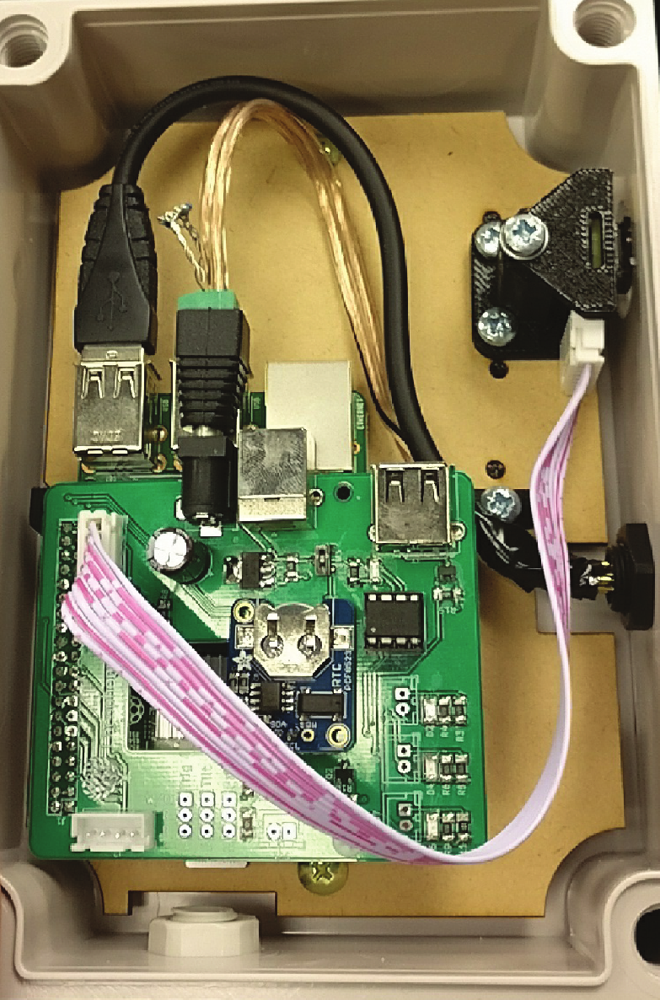
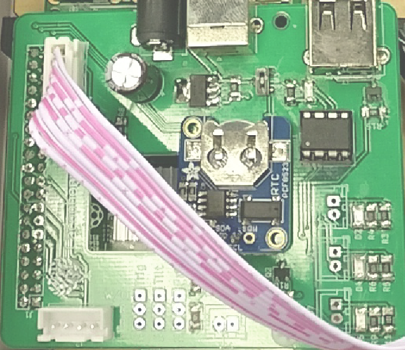

*Time and timekeeping*

***This chapter covers***

 Understanding how a computer keeps time

 How operating systems represent timestamps

 Synchronizing atomic clocks with the Network

Time Protocol (NTP)

In this chapter, you’ll produce an NTP (Network Time Protocol) client that requests the current time from the world’s network of public time servers. It’s a fully functioning client that can be included in your own computer’s boot process to keep it in sync with the world.

Understanding how time works within computers supports your efforts to build resilient applications. The system clock jumps both backwards and forwards in time.

Knowing why this happens allows you to anticipate and prepare for that eventuality.

Your computer also contains multiple physical and virtual clocks. It takes some knowledge to understand the limitations of each and when these are appropriate.

Understanding the limitations of each should foster a healthy skepticism about micro benchmarks and other time-sensitive code.

Some of the hardest software engineering involves distributed systems that need to agree on what the time is. If you have the resources of Google, then **293**

**294**

CHAPTER 9

***Time and timekeeping***

you’re able to maintain a network atomic clock that provides a worldwide time synchronization of 7 ms. The closest open source alternative is CockroachDB ([https://](https://www.cockroachlabs.com/)

[www.cockroachlabs.com/).](https://www.cockroachlabs.com/) It relies on the NTP, which can have a (worldwide) latency of approximately dozens of milliseconds. But that doesn’t make it useless. When deployed within a local network, NTP allows computers to agree on the time to within a few milliseconds or less.

On the Rust side of the equation, this chapter invests lots of time interacting with the OS internals. You’ll become more confident with unsafe blocks and with using raw pointers. Readers will become familiar with chrono, the de facto standard crate for high-level time and clock operations.

***9.1***

***Background***

It’s easy to think that a day has 86,400 seconds (60 s × 60 min × 24 h = 86,400 s). But the earth’s rotation isn’t quite that perfect. The length of each day fluctuates due to tidal friction with the moon and other effects such as torque at the boundary of the earth’s core and its mantle.

Software does not tolerate these imperfections. Most systems assume that most seconds have an equal duration. The mismatch presents several problems.

In 2012, a large number of services—including high profile sites such as Reddit and Mozilla’s Hadoop infrastructure—stopped functioning after a leap second was added to their clocks. And, at times, clocks can go back in time (this chapter does not, however, cover time travel). Few software systems are prepared for the same timestamp to appear twice. That makes it difficult to debug the logs. There are two options for resolving this impasse:

 *Keep the length of each second fixed.* This is good for computers but irritating for humans. Over time, “midday” drifts towards sunset or sunrise.

 *Adjust the length of each year to keep the sun’s position relative to noon in the same place* *from year to year.* This is good for humans but sometimes highly irritating for computers.

In practice, we can chose both options as we do in this chapter. The world’s atomic clocks use their own time zone with fixed-length seconds, called TAI. Everything else uses time zones that are periodically adjusted; these are called UTC.

TAI is used by the world’s atomic clocks and maintains a fixed-length year. UTC

adds leap seconds to TAI about once every 18 months. In 1972, TAI and UTC were 10

seconds apart. By 2016, they had drifted to 36 seconds apart.

In addition to the issues with earth’s fickle rotational speed, the physics of your own computer make it challenging to keep accurate time. There are also (at least) two clocks running on your system. One is a battery-powered device, called the *real-time* *clock*. The other one is known as *system time*. System time increments itself based on hardware interrupts provided by the computer’s motherboard. Somewhere in your system, a quartz crystal is oscillating rapidly.

***Background***

**295**

Dealing with hardware platforms without a real-time clock

The Raspberry Pi device does not include a battery-supported, real-time clock. When the computer turns on, the system clock is set to *epoch time*. That it, it is set to the number of elapsed seconds since 1 Jan 1970. During boot, it uses the NTP to identify the current time.

What about situations where there is no network connection? This is the situation faced by the Cacophony Project [(https://cacophony.org.nz/)](https://cacophony.org.nz/), which develops devices to support New Zealand’s native bird species by applying computer vision to accurately identify pest species.

The main sensor of the device is a thermal imaging camera. Footage needs to be annotated with accurate timestamps. To enable this, the Cacophony Project team decided to add an additional real-time clock, Raspberry Pi Hat, to their custom board.

The following figure shows the internals of the prototype for the Cacophony Project’s automated pest detection system.

Thermal imaging camera

Raspberry Pi

Cacophony Project Pi Hat

Real-time clock board

Real-time clock chip

**296**

CHAPTER 9

***Time and timekeeping***

***9.2***

***Sources of time***

Computers can’t look at the clock on the wall to determine what time it is. They need to figure it out by themselves. To explain how this happens, let’s consider how digital clocks operate generally, then how computer systems operate given some difficult constraints, such as operating without power.

Digital clocks consist of two main parts. The first part is some component that ticks at regular intervals. The second part is a pair of counters. One counter increments as ticks occur. The other increments as seconds occur. Determining “now” within digital clocks means comparing the number of seconds against some predetermined starting point. The starting point is known as the *epoch*.

Embedded hardware aside, when your computer is turned off, a small battery-powered clock continues to run. Its electric charge causes a quartz crystal to oscillate rapidly. The clock measures those oscillations and updates its internal counters. In a running computer, the CPU clock frequency becomes the source of regular ticks. A CPU core operates at a fixed frequency.1 Inside the hardware, a counter can be accessed via CPU instructions and/or by accessing predefined CPU registers.2

Relying on a CPU’s clock can actually cause problems in niche scientific and other high-accuracy domains, such as profiling an application’s behavior. When computers use multiple CPUs, which is especially common in high performance computing, each CPU has a slightly different clock rate. Moreover, CPUs perform out-of-order execution. This means that it’s impossible for someone creating a benchmarking/

profiling software suite to know how long a function takes between two timestamps.

The CPU instructions requesting the current timestamp may have shifted.

***9.3***

***Definitions***

Unfortunately, this chapter needs to introduce some jargon:

 *Absolute time*—Describes the time that you would tell someone if they were to ask for the time. Also referred to as *wall clock time* and *calendar time*.

 *Real-time clock*—A physical clock that’s embedded in the computer’s motherboard, which keeps time when the power is off. It’s also known as the *CMOS clock*.

 *System clock*—The operating system’s view of the time. Upon boot, the OS takes over timekeeping duties from the real-time clock.

All applications derive their idea of time from the system time. The system clock experiences jumps, as it can be manually set to a different position. This jumpiness can confuse some applications.

 *Monotonically increasing*—A clock that never provides the same time twice. This is a useful property for a computer application because, among other advantages, 1 Dynamic adjustments to a CPU’s clock speed do occur in many processors to conserve power, but these happen infrequently enough from the point of view of the clock as to be insignificant.

2 For example, Intel-based processors support the RDTSC instruction, which stands for *Read Time Stamp Counter*.

***Encoding time***

**297**

log messages will never have a repeated timestamp. Unfortunately, preventing time adjustments means being permanently bound to the local clock’s skew.

Note that the *system clock* is not monotonically increasing.

 *Steady clock*—This clock provides two guarantees: its seconds are all equal length and it is monotonically increasing. Values from steady clocks are unlikely to align with the system clock’s time or absolute time. These typically start at 0

when computers boot up, then count upwards as an internal counter progresses.

Although potentially useless for knowing the absolute time, these are handy for calculating the duration between two points in time.

 *High accuracy*—A clock is highly accurate if the length of its seconds are regular.

The difference between two clocks is known as *skew*. Highly accurate clocks have little skew against the atomic clocks that are humanity’s best engineering effort at keeping accurate time.

 *High resolution*—Provides accuracy down to 10 nanoseconds or below. High resolution clocks are typically implemented within CPU chips because there are few devices that can maintain time at such high frequency. CPUs are able to do this. Their units of work are measured in cycles, and cycles have the same duration. A 1 GHz CPU core takes 1 nanosecond to compute one cycle.

 *Fast clock*—A clock that takes little time to read the time. Fast clocks sacrifice accuracy and precision for speed, however.

***9.4***

***Encoding time***

There are many ways to represent time within a computer. The typical approach is to use a pair of 32-bit integers. The first counts the number of seconds that have elapsed.

The second represents a fraction of a second. The precision of the fractional part depends on the device in question.

The starting point is arbitrary. The most common epoch in UNIX-based systems is 1 Jan 1970 UTC. Alternatives include 1 Jan 1900 (which happens to be used by NTP), 1 Jan 2000 for more recent applications, and 1 Jan 1601 (which is the beginning of the Gregorian calendar). Using fixed-width integers presents two key advantages and two main challenges:

 Advantages include

– *Simplicity*—It’s easy to understand the format.

– *Efficiency*—Integer arithmetic is the CPU’s favorite activity.

 Disadvantages include

– *Fixed-range*—All fixed-integer types are finite, implying that time eventually wraps around to 0 again.

– *Imprecise*—Integers are discrete, while time is continuous. Different systems make different trade-offs relating to subsecond accuracy, leading to rounding errors.

**298**

CHAPTER 9

***Time and timekeeping***

It’s also important to note that the general approach is inconsistently implemented.

Here are some things seen in the wild to represent the seconds component:

 UNIX timestamps, a 32-bit integer, represents milliseconds since epoch (e.g., 1 Jan 1970).

 MS Windows FILETIME structures (since Windows 2000), a 64-bit unsigned integer, represents 100 nanosecond increments since 1 Jan 1601 (UTC).

 Rust community’s chronos crate, a 32-bit signed integer, implements NaiveTime alongside an enum to represent time zones where appropriate.3

 time_t (meaning *time type* but also called *simple time* or *calendar time*) within the C standard library (libc) varies:

– Dinkumware’s libc provides an unsigned long int (e.g., a 32-bit unsigned integer).

– GNU’s libc includes a long int (e.g., a 32-bit signed integer).

– AVR’s libc uses a 32-bit unsigned integer, and its epoch begins at midnight, 1 January 2000 (UTC).

Fractional parts tend to use the same type as their whole-second counterparts, but this isn’t guaranteed. Now, let’s take a peek a time zones.

***9.4.1***

***Representing time zones***

Time zones are political divisions, rather than technical ones. A soft consensus appears to have been formed around storing another integer that represents the number of seconds offset from UTC.

***9.5***

***clock v0.1.0: Teaching an application how***

***to tell the time***

To begin coding our NTP client, let’s start by learning how to read time. Figure 9.1

provides a quick overview of how an application does that.

What’s the time?

What’s the time?

What’s the time?

O

O

O

h,

h

it

,

h

’s 9:12 a.m.

it

,

’s 9:12 a.m.

it’s 9:12 a.m.

Application

libc

Operating system

Hardware

Figure 9.1

An application gets time information from the OS, usually functionally provided by the system’s libc implementation.

3 chronos has relatively few quirks, but one of which is sneaking leap seconds into the nanoseconds field.

***clock v0.1.1: Formatting timestamps to comply with ISO 8601 and email standards***

**299**

Listing 9.2, which reads the system time in the local time zone, might almost feel too small to be a full-fledged example. But running the code results in the current timestamp formatted according to the ISO 8601 standard. The following listing provides its configuration. You’ll find the source for this listing in ch9/ch9-clock0/Cargo.toml.

Listing 9.1

Crate configuration for listing 9.2

\[package\]

name = "clock"

version = "0.1.0"

authors = \["Tim McNamara \<author@rustinaction.com\>"\]

edition = "2018"

\[dependencies\]

chrono = "0.4"

The following listing reads and prints the system time. You’ll find the source code for the listing in ch9/ch9-clock0/src/main.rs.

Listing 9.2

Reading the system time and printing it on the screen

1 use chrono::Local;

2

**Asks for the time in**

**the system’s local**

3 fn main() {

**time zone**

4 let now = Local::now();

5 println!("{}", now);

6 }

In listing 9.2, there is a lot of complexity hidden by these eight lines of code. Much of it will be peeled away during the course of the chapter. For now, it’s enough to know that chrono::Local provides the magic. It returns a typed value, containing a time zone.

NOTE

Interacting with timestamps that don’t include time zones or performing other forms of illegal time arithmetic results in the program refusing to compile.

***9.6***

***clock v0.1.1: Formatting timestamps to comply with***

***ISO 8601 and email standards***

The application that we’ll create is called clock, which reports the current time. You’ll find the full application in listing 9.7. Throughout the chapter, the application will be incrementally enhanced to support setting the time manually and via NTP. For the moment, however, the following code shows the result of compiling and running the code from listing 9.8 and sending it the --use-standard timestamp flag.

**\$ cd ch9/ch9-clock1**

**\$ cargo run -- --use-standard rfc2822**

warning: associated function is never used: \`set\`

--\> src/main.rs:12:8

**300**

CHAPTER 9

***Time and timekeeping***

\|

12 \| fn set() -\> ! {

\| ^^^

\|

= note: \`#\[warn(dead_code)\]òn by default

warning: 1 warning emitted

Finished dev \[unoptimized + debuginfo\] target(s) in 0.01s

Running \`target/debug/clock --use-standard rfc2822\`

Sat, 20 Feb 2021 15:36:12 +1300

***9.6.1***

***Refactoring the clock v0.1.0 code to support a wider***

***architecture***

It makes sense to spend a short period of time creating a scaffold for the larger application that clock will become. Within the application, we’ll first make a small cosmetic change. Rather than using functions to read the time and adjust it, we’ll use static methods of a Clock struct. The following listing, an excerpt from listing 9.7, shows the change from listing 9.2.

Listing 9.3

Reading the time from the local system clock

2 use chrono::{DateTime};

3 use chrono::{Local};

4

5 struct Clock;

6

**DateTime\<Local\> is a**

**DateTime with the Local**

7 impl Clock {

**time zone information.**

8 fn get() -\> DateTime\<Local\> {

9 Local::now()

10 }

11

12 fn set() -\> ! {

13 unimplemented!()

14 }

15 }

What on earth is the return type of set()? The exclamation mark (!) indicates to the compiler that the function never returns (a return value is impossible). It’s referred to as the Never type. If the unimplemented!() macro (or its shorter cousin todo!()) is reached at runtime, then the program panics.

Clock is purely acting as a namespace at this stage. Adding a struct now provides some extensibility later on. As the application grows, it might become useful for Clock to contain some state between calls or implement some trait to support new functionality.

NOTE

A struct with no fields is known as a *zero-sized type* or ZST. It does not occupy any memory in the resulting application and is purely a compile-time construct.

***clock v0.1.1: Formatting timestamps to comply with ISO 8601 and email standards***

**301**

***9.6.2***

***Formatting the time***

This section looks at formatting the time as a UNIX timestamp or a formatted string according to ISO 8601, RFC 2822, and RFC 3339 conventions. The following listing, an excerpt from listing 9.7, demonstrates how to produce timestamps using the functionality provided by chrono. The timestamps are then sent to stdout.

Listing 9.4

Showing the methods used to format timestamps

48 let now = Clock::get();

49 match std {

50 "timestamp" =\> println!("{}", now.timestamp()), 51 "rfc2822" =\> println!("{}", now.to_rfc2822()), 52 "rfc3339" =\> println!("{}", now.to_rfc3339()), 53 \_ =\> unreachable!(),

54 }

Our clock application (thanks to chrono) supports three time formats—timestamp, rfc2822, and rfc3339:

 *timestamp*—Formats the number of seconds since the epoch, also known as a *UNIX timestamp*.

 *rfc2822*—Corresponds to RPC 2822 [(https://tools.ietf.org/html/rfc2822),](https://tools.ietf.org/html/rfc2822) which is how time is formatted within email message headers.

 *rfc3339*—Corresponds to RFC 3339 (<https://tools.ietf.org/html/rfc3339>). RFC

3339 formats time in a way that is more commonly associated with the ISO 8601

standard. However, ISO 8601 is a slightly stricter standard. Every RFC 3339-compliant timestamp is an ISO 8601-compliant timestamp, but the inverse is not true.

***9.6.3***

***Providing a full command-line interface***

Command-line arguments are part of the environment provided to an application from its OS when it’s established. These are raw strings. Rust provides some support for accessing the raw Vec\<String\> via std::env::args, but it can be tedious to develop lots of parsing logic for moderately-sized applications.

Our code wants to be able to validate certain input, such that the desired output format is one that the clock app actually supports. But validating input tends to be irritatingly complex. To avoid this frustration, clock makes use of the clap crate.

There are two main types that are useful for getting started: clap::App and clap::Arg. Each clap::Arg represents a command-line argument and the options that it can represent. clap::App collects these into a single application. To support the public API in table 9.1, the code in listing 9.5 uses three Arg structs that are wrapped together within a single App.

Listing 9.5 is an excerpt from listing 9.7. It demonstrates how to implement the API presented in table 9.1 using clap.

**302**

CHAPTER 9

***Time and timekeeping***

Table 9.1

Usage examples for executing the clock application from the command line. Each command needs to be supported by our parser.

Use

Description

Example output

clock

Default usage. Prints the current

2018-06-17T11:25:19...

time.

clock get

Provides a get action explicitly with

2018-06-17T11:25:19...

default formatting.

clock get --use-

Provides a get action and a for-

1529191458

standard timestamp

matting standard.

clock get -s timestamp

Provides a get action and a for-

1529191458

matting standard using shorter

notation.

clock set \<datetime\>

Provides a set action explicitly with

default parsing rules.

clock set --use-

Provides a set action explicitly and

standard timestamp

indicates that the input will be a

\<datetime\>

UNIX timestamp.

Listing 9.5

Using clap to parse command-line arguments

18 let app = App::new("clock")

19 .version("0.1")

20 .about("Gets and (aspirationally) sets the time.") 21 .arg(

22 Arg::with_name("action")

23 .takes_value(true)

24 .possible_values(&\["get", "set"\]) 25 .default_value("get"),

26 )

27 .arg(

28 Arg::with_name("std")

29 .short("s")

30 .long("standard")

31 .takes_value(true)

32 .possible_values(&\[

33 "rfc2822",

34 "rfc3339",

35 "timestamp",

36 \])

**The backslash asks**

37 .default_value("rfc3339"),

**Rust to escape the**

38 )

**newline and the**

39 .arg(Arg::with_name("datetime").help(

**following**

40 "When \<action\> is 'set', apply \<datetime\>. \\ **indentation.**

41 Otherwise, ignore.",

42 ));

43

44 let args = app.get_matches();

***clock v0.1.1: Formatting timestamps to comply with ISO 8601 and email standards***

**303**

clap automatically generates some usage documentation for our clock application on your behalf. Using the --help option triggers its output.

***9.6.4***

***clock v0.1.1: Full project***

The following terminal session demonstrates the process of downloading and compiling the clock v0.1.1 project from the public Git repository. It also includes a fragment for accessing the --help option that is mentioned in the previous section: **\$ git clone https:/ /github.com/rust-in-action/code rust-in-action** **\$ cd rust-in-action/ch9/ch9-clock1**

**\$ cargo build**

...

Compiling clock v0.1.1 (rust-in-action/ch9/ch9-clock1)

warning: associated function is never used: \`set\`

**This warning is**

--\> src/main.rs:12:6

**eliminated in**

\|

**clock v0.1.2.**

12 \| fn set() -\> ! {

\| ^^^

\|

= note: \`#\[warn(dead_code)\]òn by default

warning: 1 warning emitted

**Arguments to the right**

**\$ cargo run -- --help**

**of -- are sent to the**

...

**resulting executable.**

clock 0.1

Gets and sets (aspirationally) the time.

USAGE:

clock.exe \[OPTIONS\] \[ARGS\]

FLAGS:

-h, --help Prints help information

-V, --version Prints version information

OPTIONS:

-s, --use-standard \<std\> \[default: rfc3339\]

\[possible values: rfc2822,

rfc3339, timestamp\]

ARGS:

\<action\> \[default: get\] \[possible values: get, set\]

\<datetime\> When \<action\> is 'set', apply \<datetime\>.

Otherwise, ignore.

**Executes the**

**\$ target/debug/clock**

**target/debug/clock**

2021-04-03T15:48:23.984946724+13:00

**executable directly**

Creating the project step by step takes slightly more work. As clock v0.1.1 is a project managed by cargo, it follows the standard structure:

**304**

CHAPTER 9

***Time and timekeeping***

clock

├──

**See listing 9.6.**

Cargo.toml

└── src

**See listing 9.7.**

└── main.rs

To create it manually, follow these steps:

1

From the command-line, execute these commands:

**\$ cargo new clock**

**\$ cd clock**

**\$ cargo install cargo-edit**

**\$ cargo add clap@2**

**\$ cargo add chrono@0.4**

2

Compare the contents of your project’s Cargo.toml file with listing 9.6. With the exception of the authors field, these should match.

3

Replace the contents of src/main.rs with listing 9.7.

The next listing is the project’s Cargo.toml file. You’ll find it at ch9/ch9-clock1/

Cargo.toml. Following that is the project’s src/main.rs file, listing 9.7. Its source is in ch9/ch9-clock1/src/main.rs.

Listing 9.6

Crate configuration for clock v0.1.1

\[package\]

name = "clock"

version = "0.1.1"

authors = \["Tim McNamara \<author@rustinaction.com\>"\]

edition = "2018"

\[dependencies\]

chrono = "0.4"

clap = "2"

Listing 9.7

Producing formatted dates from the command line, clock v0.1.1

1 use chrono::DateTime;

2 use chrono::Local;

3 use clap::{App, Arg};

4

5 struct Clock;

6

7 impl Clock {

8 fn get() -\> DateTime\<Local\> {

9 Local::now()

10 }

11

12 fn set() -\> ! {

13 unimplemented!()

14 }

15 }

***clock v0.1.2: Setting the time***

**305**

16

17 fn main() {

18 let app = App::new("clock")

19 .version("0.1")

20 .about("Gets and (aspirationally) sets the time.") 21 .arg(

22 Arg::with_name("action")

23 .takes_value(true)

24 .possible_values(&\["get", "set"\]) 25 .default_value("get"),

26 )

27 .arg(

28 Arg::with_name("std")

29 .short("s")

30 .long("use-standard")

31 .takes_value(true)

32 .possible_values(&\[

33 "rfc2822",

34 "rfc3339",

35 "timestamp",

36 \])

37 .default_value("rfc3339"),

38 )

39 .arg(Arg::with_name("datetime").help(

40 "When \<action\> is 'set', apply \<datetime\>. \\ 41 Otherwise, ignore.",

42 ));

43

**Supplies a default value**

44 let args = app.get_matches();

**to each argument via**

45

**default_value("get") and**

46 let action = args.value_of("action").unwrap();

**default_value("rfc3339").**

47 let std = args.value_of("std").unwrap();

**It’s safe to call unwrap()**

48

**on these two lines.**

49 if action == "set" {

50 unimplemented!()

**Aborts early as**

51 }

**we’re not ready to**

52

**set the time yet**

53 let now = Clock::get();

54 match std {

55 "timestamp" =\> println!("{}", now.timestamp()), 56 "rfc2822" =\> println!("{}", now.to_rfc2822()), 57 "rfc3339" =\> println!("{}", now.to_rfc3339()), 58 \_ =\> unreachable!(),

59 }

60 }

***9.7***

***clock v0.1.2: Setting the time***

Setting the time is complicated because each OS has its own mechanism for doing so. This requires that we use OS-specific conditional compilation to create a cross-portable tool.

**306**

CHAPTER 9

***Time and timekeeping***

***9.7.1***

***Common behavior***

Listing 9.11 provides two implementations of setting the time. These both follow a common pattern:

1

Parsing a command-line argument to create a DateTime\<FixedOffset\> value.

The FixedOffset time zone is provided by chrono as a proxy for “whichever time zone is provided by the user.” chrono doesn’t know at compile time which time zone will be selected.

2

Converting the DateTime\<FixedOffset\> to a DateTime\<Local\> to enable time zone comparisons.

3

Instantiating an OS-specific struct that’s used as an argument for the necessary system call ( *system calls* are function calls provided by the OS).

4

Setting the system’s time within an unsafe block. This block is required because responsibility is delegated to the OS.

5

Printing the updated time.

WARNING

This code uses functions to teleport the system’s clock to a different time. This jumpiness can cause system instability.

Some applications expect monotonically increasing time. A smarter (but more complex) approach is to adjust the length of a second for *n* seconds until the desired time is reached. Functionality is implemented within the Clock struct that was introduced in section 9.6.1.

***9.7.2***

***Setting the time for operating systems that use libc***

POSIX-compliant operating systems can have their time set via a call to settimeofday(), which is provided by libc. libc is the C Standard Library and has lots of historic connections with UNIX operating systems. The C language, in fact, was developed to write UNIX. Even today, interacting with a UNIX derivative involves using the tools provided by the C language. There are two mental hurdles required for Rust programmers to understanding the code in listing 9.11, which we’ll address in the following sections:

 The arcane types provided by libc

 The unfamiliarity of providing arguments as pointers

LIBC TYPE NAMING CONVENTIONS

libc uses conventions for naming types that differ from Rust’s. libc does not use PascalCase to denote a type, preferring to use lowercase. That is, where Rust would use TimeVal, libc uses timeval. The convention changes slightly when dealing with type aliases. Within libc, type aliases append an underscore followed by the letter t (\_t) to the type’s name. The next two snippets show some libc imports and the equivalent Rust code for building those types.

On line 64 of listing 9.8, you will encounter this line:

libc::{timeval, time_t, suseconds_t};

***clock v0.1.2: Setting the time***

**307**

It represents two type aliases and a struct definition. In Rust syntax, these are defined like this:

\#\![allow(non_camel_case_types)\]

type time_t = i64;

type suseconds_t = i64;

pub struct timeval {

pub tv_sec: time_t,

pub tv_usec: suseconds_t,

}

time_t represents the seconds that have elapsed since the epoch. suseconds_t represents the fractional component of the current second.

The types and functions relating to timekeeping involve a lot of indirection. The code is intended to be easy to implement, which means providing local implementors (hardware designers) the opportunity to change aspects as their platforms require. The way this is done is to use type aliases everywhere, rather than sticking to a defined integer type.

NON-WINDOWS CLOCK CODE

The libc library provides a handy function, settimeofday, which we’ll use in listing 9.8.

The project’s Cargo.toml file requires two extra lines to bring libc bindings into the crate for non-Windows platforms:

\[target.'cfg(not(windows))'.dependencies\]

**You can add these two lines**

libc = "0.2"

**to the end of the file.**

The following listing, an extract from listing 9.11, shows how to set the time with C’s standard library, libc. In the listing, we use Linux and BSD operating systems or other similar ones.

Listing 9.8

Setting the time in a libc environment

62 \#\[cfg(not(windows))\]

63 fn set\<Tz: TimeZone\>(t: DateTime\<Tz\>) -\> () {

64 use libc::{timeval, time_t, suseconds_t};

**The timezone parameter of**

65 use libc::{settimeofday, timezone }

**settimeofday() appears to**

66

**be some sort of historic**

**t is sourced**

67 let t = t.with_timezone(&Local);

**accident. Non-null values**

**from the**

68 let mut u: timeval = unsafe { zeroed() };

**generate an error.**

**command**

69

**line and**

70 u.tv_sec = t.timestamp() as time_t;

**has already**

71 u.tv_usec =

**been parsed.**

72 t.timestamp_subsec_micros() as suseconds_t;

73

74 unsafe {

75 let mock_tz: \*const timezone = std::ptr::null();

76 settimeofday(&u as \*const timeval, mock_tz);

77 }

78 }

**308**

CHAPTER 9

***Time and timekeeping***

Makes OS-specific imports within the function to avoid polluting the global scope.

libc::settimeofday is a function that modifies the system clock, and suseconds_t, time_t, timeval, and timezone are all types used to interact with it.

This code cheekily, and probably perilously, avoids checking whether the settimeofday function is successful. It’s quite possible that it isn’t. That will be remedied in the next iteration of the clock application.

***9.7.3***

***Setting the time on MS Windows***

The code for MS Windows is similar to its libc peers. It is somewhat wordier, as the struct that sets the time has more fields than the second and subsecond part. The rough equivalent of the libc library is called kernel32.dll, which is accessible after including the winapi crate.

WINDOWS API INTEGER TYPES

Windows provides its own take on what to call integral types. This code only makes use of the WORD type, but it can be useful to remember the two other common types that have emerged since computers have used 16-bit CPUs. The following table shows how integer types from kernel32.dll correspond to Rust types.

Windows type

Rust type

Remarks

WORD

u16

Refers to the width of a CPU “word” as it was when Windows was

initially created

DWORD

u32

Double word

QWORD

u64

Quadruple word

LARGE_INTEGER

i64

A type defined as a crutch to enable 32-bit and 64-bit platforms to share code

ULARGE_INTEGER

u64

An unsigned version of LARGE_INTEGER

REPRESENTING TIME IN WINDOWS

Windows provides multiple time types. Within our clock application, however, we’re mostly interested in SYSTEMTIME. Another type that is provided is FILETIME. The following table describes these types to avoid confusion.

Windows type

Rust type

Remarks

SYSTEMTIME

winapi::SYSTEMTIME

Contains fields for the year, month, day of the week, day

of the month, hour, minute, second, and millisecond.

FILETIME

winapi::FILETIME

Analogous to libc::timeval. Contains second and

millisecond fields. Microsoft’s documentation warns

that on 64-bit platforms, its use can cause irritating

overflow bugs without finicky type casting, which is why

it’s not employed here.

***clock v0.1.2: Setting the time***

**309**

WINDOWS CLOCK CODE

As the SYSTEMTIME struct contains many fields, generating one takes a little bit longer.

The following listing shows this construct.

Listing 9.9

Setting the time using the Windows kernel32.dll API

19 \#\[cfg(windows)\]

20 fn set\<Tz: TimeZone\>(t: DateTime\<Tz\>) -\> () {

21 use chrono::Weekday;

22 use kernel32::SetSystemTime;

23 use winapi::{SYSTEMTIME, WORD};

24

25 let t = t.with_timezone(&Local);

26

27 let mut systime: SYSTEMTIME = unsafe { zeroed() };

28

29 let dow = match t.weekday() {

30 Weekday::Mon =\> 1,

**The chrono::Datelike**

31 Weekday::Tue =\> 2,

**trait provides the**

32 Weekday::Wed =\> 3,

**weekday() method.**

33 Weekday::Thu =\> 4,

**Microsoft’s developer**

34 Weekday::Fri =\> 5,

**documentation provides**

35 Weekday::Sat =\> 6,

**the conversion table.**

36 Weekday::Sun =\> 0,

37 };

38

39 let mut ns = t.nanosecond();

**As an implementation detail,**

40 let mut leap = 0;

**chrono represents leap seconds**

41 let is_leap_second = ns \> 1_000_000_000;

**by adding an extra second**

42

**within the nanoseconds field. To**

43 if is_leap_second {

**convert the nanoseconds to**

44 ns -= 1_000_000_000;

**milliseconds as required by**

45 leap += 1;

**Windows, we need to account**

46 }

**for this.**

47

48 systime.wYear = t.year() as WORD;

49 systime.wMonth = t.month() as WORD;

50 systime.wDayOfWeek = dow as WORD;

51 systime.wDay = t.day() as WORD;

52 systime.wHour = t.hour() as WORD;

53 systime.wMinute = t.minute() as WORD;

54 systime.wSecond = (leap + t.second()) as WORD;

55 systime.wMilliseconds = (ns / 1_000_000) as WORD;

56

57 let systime_ptr = &systime as \*const SYSTEMTIME;

58

59 unsafe {

**From the perspective of the Rust compiler,**

60 SetSystemTime(systime_ptr);

**giving something else direct access to memory**

61 }

**is unsafe. Rust cannot guarantee that the**

62 }

**Windows kernel will be well-behaved.**

**310**

CHAPTER 9

***Time and timekeeping***

***9.7.4***

***clock v0.1.2: The full code listing***

clock v0.1.2 follows the same project structure as v0.1.1, which is repeated here. To create platform-specific behavior, some adjustments are required to Cargo.toml.

clock

├──

**See listing 9.10.**

Cargo.toml

└── src

**See listing 9.11.**

└── main.rs

Listings 9.10 and 9.11 provide the full source code for the project. These are available for download from ch9/ch9-clock0/Cargo.toml and ch9/ch9-clock0/src/main.rs, respectively.

Listing 9.10

Crate configuration for listing 9.11

\[package\]

name = "clock"

version = "0.1.2"

authors = \["Tim McNamara \<author@rustinaction.com\>"\]

edition = "2018"

\[dependencies\]

chrono = "0.4"

clap = "2"

\[target.'cfg(windows)'.dependencies\]

winapi = "0.2"

kernel32-sys = "0.2"

\[target.'cfg(not(windows))'.dependencies\]

libc = "0.2"

Listing 9.11

Cross-portable code for setting the system time

1 \#\[cfg(windows)\]

2 use kernel32;

3 \#\[cfg(not(windows))\]

4 use libc;

5 \#\[cfg(windows)\]

6 use winapi;

7

8 use chrono::{DateTime, Local, TimeZone};

9 use clap::{App, Arg};

10 use std::mem::zeroed;

11

12 struct Clock;

13

14 impl Clock {

15 fn get() -\> DateTime\<Local\> {

16 Local::now()

17 }

18

***clock v0.1.2: Setting the time***

**311**

19 \#\[cfg(windows)\]

20 fn set\<Tz: TimeZone\>(t: DateTime\<Tz\>) -\> () {

21 use chrono::Weekday;

22 use kernel32::SetSystemTime;

23 use winapi::{SYSTEMTIME, WORD};

24

25 let t = t.with_timezone(&Local);

26

27 let mut systime: SYSTEMTIME = unsafe { zeroed() };

28

29 let dow = match t.weekday() {

30 Weekday::Mon =\> 1,

31 Weekday::Tue =\> 2,

32 Weekday::Wed =\> 3,

33 Weekday::Thu =\> 4,

34 Weekday::Fri =\> 5,

35 Weekday::Sat =\> 6,

36 Weekday::Sun =\> 0,

37 };

38

39 let mut ns = t.nanosecond();

40 let is_leap_second = ns \> 1_000_000_000;

41

42 if is_leap_second {

43 ns -= 1_000_000_000;

44 }

45

46 systime.wYear = t.year() as WORD;

47 systime.wMonth = t.month() as WORD;

48 systime.wDayOfWeek = dow as WORD;

49 systime.wDay = t.day() as WORD;

50 systime.wHour = t.hour() as WORD;

51 systime.wMinute = t.minute() as WORD;

52 systime.wSecond = t.second() as WORD;

53 systime.wMilliseconds = (ns / 1_000_000) as WORD;

54

55 let systime_ptr = &systime as \*const SYSTEMTIME;

56

57 unsafe {

58 SetSystemTime(systime_ptr);

59 }

60 }

61

62 \#\[cfg(not(windows))\]

63 fn set\<Tz: TimeZone\>(t: DateTime\<Tz\>) -\> () {

64 use libc::{timeval, time_t, suseconds_t};

65 use libc::{settimeofday, timezone};

66

67 let t = t.with_timezone(&Local);

68 let mut u: timeval = unsafe { zeroed() };

69

70 u.tv_sec = t.timestamp() as time_t;

71 u.tv_usec =

72 t.timestamp_subsec_micros() as suseconds_t;

73

**312**

CHAPTER 9

***Time and timekeeping***

74 unsafe {

75 let mock_tz: \*const timezone = std::ptr::null();

76 settimeofday(&u as \*const timeval, mock_tz);

77 }

78 }

79 }

80

81 fn main() {

82 let app = App::new("clock")

83 .version("0.1.2")

84 .about("Gets and (aspirationally) sets the time.") 85 .after_help(

86 "Note: UNIX timestamps are parsed as whole \\

87 seconds since 1st January 1970 0:00:00 UTC. \\

88 For more accuracy, use another format.",

89 )

90 .arg(

91 Arg::with_name("action")

92 .takes_value(true)

93 .possible_values(&\["get", "set"\]) 94 .default_value("get"),

95 )

96 .arg(

97 Arg::with_name("std")

98 .short("s")

99 .long("use-standard")

100 .takes_value(true)

101 .possible_values(&\[

102 "rfc2822",

103 "rfc3339",

104 "timestamp",

105 \])

106 .default_value("rfc3339"),

107 )

108 .arg(Arg::with_name("datetime").help(

109 "When \<action\> is 'set', apply \<datetime\>. \\ 110 Otherwise, ignore.",

111 ));

112

113 let args = app.get_matches();

114

115 let action = args.value_of("action").unwrap();

116 let std = args.value_of("std").unwrap();

117

118 if action == "set" {

119 let t\_ = args.value_of("datetime").unwrap();

120

121 let parser = match std {

122 "rfc2822" =\> DateTime::parse_from_rfc2822, 123 "rfc3339" =\> DateTime::parse_from_rfc3339, 124 \_ =\> unimplemented!(),

125 };

126

127 let err_msg = format!(

128 "Unable to parse {} according to {}",

***Improving error handling***

**313**

129 t\_, std

130 );

131 let t = parser(t\_).expect(&err_msg);

132

133 Clock::set(t)

134 }

135

136 let now = Clock::get();

137

138 match std {

139 "timestamp" =\> println!("{}", now.timestamp()), 140 "rfc2822" =\> println!("{}", now.to_rfc2822()), 141 "rfc3339" =\> println!("{}", now.to_rfc3339()), 142 \_ =\> unreachable!(),

143 }

144 }

***9.8***

***Improving error handling***

Those readers who have dealt with operating systems before will probably be dismayed at some of the code in section 9.7. Among other things, it doesn’t check to see whether the calls to settimeofday() and SetSystemTime() were actually successful.

There are multiple reasons why setting the time might fail. The most obvious one is that the user who is attempting to set the time lacks permission to do so. The robust approach is to have Clock::set(t) return Result. As that requires modifying two functions that we have already spent some time explaining in depth, let’s introduce a workaround that instead makes use of the operating system’s error reporting: fn main() {

// ...

if action == "set" {

// ...

**Deconstructs maybe_error, a Rust**

Clock::set(t);

**type, to convert it into a raw i32**

**value that’s easy to match**

let maybe_error =

std::io::Error::last_os_error();

let os_error_code =

**Matching on a raw integer saves**

&maybe_error.raw_os_error();

**importing an enum, but sacrifices**

**type safety. Production-ready code**

match os_error_code {

**shouldn’t cheat in this way.**

Some(0) =\> (),

Some(\_) =\> eprintln!("Unable to set the time: {:?}", maybe_error), None =\> (),

}

}

}

After calls to Clock::set(t), Rust happily talks to the OS via std::io::Error::last \_os_error(). Rust checks to see if an error code has been generated.

**314**

CHAPTER 9

***Time and timekeeping***

***9.9***

***clock v0.1.3: Resolving differences between clocks***

***with the Network Time Protocol (NTP)***

Coming to a consensus about the correct time is known formally as *clock synchronization*. There are multiple international standards for synchronizing clocks. This section focuses on the most prominent one—the Network Time Protocol (NTP).

NTP has existed since the mid-1980s, and it has proven to be very stable. Its on-wire format has not changed in the first four revisions of the protocol, with backwards compatibility retained the entire time. NTP operates in two modes that can loosely be described as *always on* and *request/response*.

The always on mode allows multiple computers to work in a peer-to-peer fashion to converge on an agreed definition of *now*. It requires a software daemon or service to run constantly on each device, but it can achieve tight synchronization within local networks.

The request/response mode is much simpler. Local clients request the time via a single message and then parse the response, keeping track of the elapsed time. The client can then compare the original timestamp with the timestamp sent from the server, alter any delays caused by network latency, and make any necessary adjustments to move the local clock towards the server’s time.

Which server should your computer connect to? NTP works by establishing a hierarchy. At the center is a small network of atomic clocks. There are also national pools of servers.

NTP allows clients to request the time from computers that are closer to atomic clocks. But that only gets us part of the way. Let’s say that your computer asks 10 computers what they think the time is. Now we have 10 assertions about the time, and the network lag will differ for each source!

***9.9.1***

***Sending NTP requests and interpreting responses***

Let’s consider a client-server situation where your computer wants to correct its own time. For every computer that you check with—let’s call these *time servers*—there are two messages:

 The message from your computer to each time server is the *request*.

 The reply is known as the *response*.

These two messages generate four time points. Note that these occur in serial:

 *T* —The client’s timestamp for when the request was sent. Referred to as t1 in *1*

code.

 *T* —The time server’s timestamp for when the request was received. Referred *2*

to as t2 in code.

 *T* —The time server’s timestamp for when it sends its response. Referred to as *3*

t3 in code.

 *T* —The client’s timestamp for when the response was received. Referred to as *4*

t4 in code.

***clock v0.1.3: Resolving differences between clocks with the Network Time Protocol (NTP)***

**315**

The names T –T are designated by the RFC 2030 specification. Figure 9.2 shows the 1

4

timestamps.

T is the local computer's record of the time

T is the local computer's record of the time

1

1

when the first message is transmitted.

when the second message is received.

T

T

1

4

Local computer

**T1 is specified**

**Header identifies**

**Header that identifies**

**but not needed**

**the message as**

**T**

**the message as request**

**1, T2, and T3 are**

**in practice.**

**a response**

**sent from the server.**

**for the time**

T

T

T

T

1

1

2

3

Outbound message

Inbound message

T

T

2

3

Remote server

T and T are recorded by the remote server

2

3

at the time that the first message is received

and the time that the second message is sent.

Time

Figure 9.2

Timestamps that are defined within the NTP standard

To see what this means in code, spend a few moments looking through the following listing. Lines 2–12 deal with establishing a connection. Lines 14–21 produce T –T .

1

4

Listing 9.12

Defining a function that sends NTP messages

1 fn ntp_roundtrip(

2 host: &str,

3 port: u16,

4 ) -\> Result\<NTPResult, std::io::Error\> {

5 let destination = format!("{}:{}", host, port);

6 let timeout = Duration::from_secs(1);

7

8 let request = NTPMessage::client();

9 let mut response = NTPMessage::new();

10

11 let message = request.data;

12

13 let udp = UdpSocket::bind(LOCAL_ADDR)?;

14 udp.connect(&destination).expect("unable to connect"); 15

**This code cheats slightly by not encoding t1 in the**

16 let t1 = Utc::now();

**outbound message. In practice, however, this works**

17

**perfectly well and requires fractionally less work.**

**316**

CHAPTER 9

***Time and timekeeping***

18 udp.send(&message)?;

**Sends a request payload (defined**

19 udp.set_read_timeout(Some(timeout))?;

**elsewhere) to the server**

20 udp.recv_from(&mut response.data)?;

21

**Blocks the application until**

22 let t4 = Utc::now();

**data is ready to be received**

23

24 let t2: DateTime\<Utc\> =

**rx_time() stands for received**

25 response

**timestamp and is the time**

26 .rx_time()

**that the server received the**

27 .unwrap()

**client’s message.**

28 .into();

29

30 let t3: DateTime\<Utc\> =

**tx_time() stands for**

31 response

**transmitted timestamp**

32 .tx_time()

**and is the time that the**

33 .unwrap()

**server sent the reply.**

34 .into();

35

36 Ok(NTPResult {

37 t1: t1,

38 t2: t2,

39 t3: t3,

40 t4: t4,

41 })

42 }

T –T , encapsulated in listing 9.12 as NTPResult, are all that’s required to judge 1

4

whether the local time matches the server’s time. The protocol contains more related to error handling, but that’s avoided here for simplicity. Otherwise, it’s a perfectly capable NTP client.

***9.9.2***

***Adjusting the local time as a result of the server’s response***

Given that our client has received at least one (and hopefully a few more) NTP

responses, all that’s left to do is to calculate the “right” time. But wait, which time is right? All we have are relative timestamps. There is still no universal “truth” that we’ve been given access to.

NOTE

For those readers who don’t enjoy Greek letters, feel free to skim or even skip the next few paragraphs.

The NTP documentation provides two equations to help resolve the situation. Our aim is to calculate two values. Table 9.2 shows the calculations.

 *The time offset is what we’re ultimately interested in.* It is denoted as  (theta) by the official documentation. When  is a positive number, our clock is fast. When it is negative, our clock is slow.

 *The delay caused by network congestion, latency, and other noise.* This is denoted as 

(delta). A large  implies that the reading is less reliable. Our code uses this value to follow servers that respond quickly.

***clock v0.1.3: Resolving differences between clocks with the Network Time Protocol (NTP)***

**317**

Table 9.2

How to calculate  and  in NTP

 = (T – T ) – (T – T )

(T – T ) calculates the total time spent on the client’s side. (T – T ) 4

1

3

2

4

1

3

2

calculates the total time spent on the server’s side.

The distinction between the two differences (e.g., ), is an estimate of the difference between the clocks, plus a delay caused by network traffic and processing.

 = ( (T – T ) + (T – T ) ) / 2

We take the average of the two pairs of timestamps.

2

1

4

3

The mathematics can be confusing because there is always an innate desire to know what the time *actually is*. That’s impossible to know. All we have are assertions.

NTP is designed to operate multiple times per day, with participants nudging their clocks incrementally over time. Given sufficient adjustments,  tends to 0 while 

remains relatively stable.

The standard is quite prescriptive about the formula to carry out the adjustments.

For example, the reference implementation of NTP includes some useful filtering to limit the effect of bad actors and other spurious results. But we’re going to cheat.

We’ll just take a mean of the differences, weighted by 1 / 2. This aggressively penal-izes slow servers. To minimize the likelihood of any negative outcomes:

 *We’ll check the time with known “good” actors.* In particular, we’ll use time servers hosted by major OS vendors and other reliable sources to minimize the chances of someone sending us a questionable result.

 *No single result will affect the result too much.* We’ll provide a cap of 200 ms on any adjustments we make to the local time.

The following listing, an extract from listing 9.15, shows this process for multiple time servers.

Listing 9.13

Adjusting the time according to the responses

175 fn check_time() -\> Result\<f64, std::io::Error\> {

176 const NTP_PORT: u16 = 123;

177

178 let servers = \[

**Google’s time servers implement leap seconds**

179 "time.nist.gov",

**by expanding the length of a second rather than**

180 "time.apple.com",

**adding an extra second. Thus, for one day**

181 "time.euro.apple.com",

**approximately every 18 months, this server**

182 "time.google.com", **reports a different time than the others.**

183 "time2.google.com",

184 / /"time.windows.com",

**At the time of writing, Microsoft’s time server**

185 \];

**provides a time that’s 15 s ahead of its peers.**

186

187 let mut times = Vec::with_capacity(servers.len());

188

189 for &server in servers.iter() {

190 print!("{} =\>", server);

191

192 let calc = ntp_roundtrip(&server, NTP_PORT);

**318**

CHAPTER 9

***Time and timekeeping***

193

194 match calc {

195 Ok(time) =\> {

196 println!(" {}ms away from local system time", time.offset()); 197 times.push(time);

198 }

199 Err(\_) =\> {

200 println!(" ? \[response took too long\]")

201 }

202 };

203 }

204

205 let mut offsets = Vec::with_capacity(servers.len());

206 let mut offset_weights = Vec::with_capacity(servers.len()); 207

208 for time in &times {

209 let offset = time.offset() as f64;

210 let delay = time.delay() as f64;

211

212 let weight = 1_000_000.0 / (delay \* delay);

**Penalizes slow servers**

213 if weight.is_finite() {

**by substantially**

214 offsets.push(offset);

**decreasing their**

215 offset_weights.push(weight);

**relative weights**

216 }

217 }

218

219 let avg_offset = weighted_mean(&offsets, &offset_weights); 220

221 Ok(avg_offset)

222 }

***9.9.3***

***Converting between time representations that use different***

***precisions and epochs***

chrono represents the fractional part of a second, down to a nanosecond precision, whereas NTP can represent times that differ by approximately 250 picoseconds. That’s roughly four times more precise! The different internal representations used imply that some accuracy is likely to be lost during conversions.

The From trait is the mechanism for telling Rust that two types can be converted.

From provides the from() method, which is encountered early on in one’s Rust career (in examples such as String::from("Hello, world!")).

The next listing, a combination of three extracts from listing 9.15, provides implementations of the std::convert::From trait. This code enables the .into() calls on lines 28 and 34 of listing 9.13.

Listing 9.14

Converting between **chrono::DateTime** and NTP timestamps

19 const NTP_TO_UNIX_SECONDS: i64 = 2_208_988_800;

**Number of seconds between 1 Jan 1900**

**(the NTP epoch) and 1 Jan 1970 (the UNIX epoch)**

***clock v0.1.3: Resolving differences between clocks with the Network Time Protocol (NTP)***

**319**

22 \#\[derive(Default,Debug,Copy,Clone)\]

23 struct NTPTimestamp {

**Our internal type**

24 seconds: u32,

**represents an NTP**

25 fraction: u32,

**timestamp.**

26 }

52 impl From\<NTPTimestamp\> for DateTime\<Utc\> {

53 fn from(ntp: NTPTimestamp) -\> Self {

54 let secs = ntp.seconds as i64 - NTP_TO_UNIX_SECONDS;

55 let mut nanos = ntp.fraction as f64;

56 nanos \*= 1e9;

57 nanos /= 2_f64.powi(32);

58

59 Utc.timestamp(secs, nanos as u32)

**You can implement**

60 }

**these conversions**

61 }

**using bit-shift**

62

**operations, but at**

63 impl From\<DateTime\<Utc\>\> for NTPTimestamp {

**the expense of even**

64 fn from(utc: DateTime\<Utc\>) -\> Self {

**less readability.**

65 let secs = utc.timestamp() + NTP_TO_UNIX_SECONDS;

66 let mut fraction = utc.nanosecond() as f64;

67 fraction \*= 2_f64.powi(32);

68 fraction /= 1e9;

69

70 NTPTimestamp {

71 seconds: secs as u32,

72 fraction: fraction as u32,

73 }

74 }

75 }

From has a reciprocal peer, Into. Implementing From allows Rust to automatically generate an Into implementation on its own, except in advanced cases. In those cases, it’s likely that developers already possess the knowledge required to implement Into manually and so probably don’t need assistance here.

***9.9.4***

***clock v0.1.3: The full code listing***

The complete code listing for our clock application is presented in listing 9.15. Taken in its full glory, the whole of the clock application can look quite large and imposing.

Hopefully, there is no new Rust syntax to digest within the listing. The source for this listing is in ch9/ch9-clock3/src/main.rs.

Listing 9.15

Full listing for the command-line NTP client, clock

1 \#\[cfg(windows)\]

2 use kernel32;

3 \#\[cfg(not(windows))\]

4 use libc;

5 \#\[cfg(windows)\]

6 use winapi;

7

**320**

CHAPTER 9

***Time and timekeeping***

8 use byteorder::{BigEndian, ReadBytesExt};

9 use chrono::{

10 DateTime, Duration as ChronoDuration, TimeZone, Timelike,

11 };

12 use chrono::{Local, Utc};

13 use clap::{App, Arg};

14 use std::mem::zeroed;

15 use std::net::UdpSocket;

16 use std::time::Duration;

**12 \* 4 bytes (the width**

17

**of 12, 32-bit integers)**

18 const NTP_MESSAGE_LENGTH: usize = 48;

19 const NTP_TO_UNIX_SECONDS: i64 = 2_208_988_800;

20 const LOCAL_ADDR: &'static str = "0.0.0.0:12300"; **12300 is the**

21

**default port**

22 \#\[derive(Default, Debug, Copy, Clone)\]

**for NTP.**

23 struct NTPTimestamp {

24 seconds: u32,

25 fraction: u32,

26 }

27

28 struct NTPMessage {

29 data: \[u8; NTP_MESSAGE_LENGTH\],

30 }

31

32 \#\[derive(Debug)\]

33 struct NTPResult {

34 t1: DateTime\<Utc\>,

35 t2: DateTime\<Utc\>,

36 t3: DateTime\<Utc\>,

37 t4: DateTime\<Utc\>,

38 }

39

40 impl NTPResult {

41 fn offset(&self) -\> i64 {

42 let duration = (self.t2 - self.t1) + (self.t4 - self.t3); 43 duration.num_milliseconds() / 2

44 }

45

46 fn delay(&self) -\> i64 {

47 let duration = (self.t4 - self.t1) - (self.t3 - self.t2); 48 duration.num_milliseconds()

49 }

50 }

51

52 impl From\<NTPTimestamp\> for DateTime\<Utc\> {

53 fn from(ntp: NTPTimestamp) -\> Self {

54 let secs = ntp.seconds as i64 - NTP_TO_UNIX_SECONDS;

55 let mut nanos = ntp.fraction as f64;

56 nanos \*= 1e9;

57 nanos /= 2_f64.powi(32);

58

59 Utc.timestamp(secs, nanos as u32)

60 }

61 }

62

***clock v0.1.3: Resolving differences between clocks with the Network Time Protocol (NTP)***

**321**

63 impl From\<DateTime\<Utc\>\> for NTPTimestamp {

64 fn from(utc: DateTime\<Utc\>) -\> Self {

65 let secs = utc.timestamp() + NTP_TO_UNIX_SECONDS;

66 let mut fraction = utc.nanosecond() as f64;

67 fraction \*= 2_f64.powi(32);

68 fraction /= 1e9;

69

70 NTPTimestamp {

71 seconds: secs as u32,

72 fraction: fraction as u32,

73 }

74 }

75 }

76

77 impl NTPMessage {

78 fn new() -\> Self {

79 NTPMessage {

80 data: \[0; NTP_MESSAGE_LENGTH\],

81 }

82 }

83

**Underscores delimit the**

84 fn client() -\> Self {

**NTP fields: leap indicator (2**

85 const VERSION: u8 = 0b00_011_000;

**bits), version (3 bits), and**

86 const MODE: u8 = 0b00_000_011;

**mode (3 bits).**

87

88 let mut msg = NTPMessage::new();

**The first byte of every NTP**

89

**message contains three**

90 msg.data\[0\] \|= VERSION;

**fields, but we only need to**

91 msg.data\[0\] \|= MODE;

**set two of these.**

92 msg

93 }

**msg.data\[0\] is now equal to**

94

**0001_1011 (27 in decimal).**

95 fn parse_timestamp(

96 &self,

97 i: usize,

**Takes a slice to**

98 ) -\> Result\<NTPTimestamp, std::io::Error\> {

**the first byte**

99 let mut reader = &self.data\[i..i + 8\];

100 let seconds = reader.read_u32::\<BigEndian\>()?;

101 let fraction = reader.read_u32::\<BigEndian\>()?;

102

103 Ok(NTPTimestamp {

104 seconds: seconds,

105 fraction: fraction,

106 })

107 }

108

109 fn rx_time(

**RX stands**

110 &self

**for receive.**

111 ) -\> Result\<NTPTimestamp, std::io::Error\> {

112 self.parse_timestamp(32)

113 }

114

115 fn tx_time(

**TX stands for**

116 &self

**transmit.**

117 ) -\> Result\<NTPTimestamp, std::io::Error\> {

**322**

CHAPTER 9

***Time and timekeeping***

118 self.parse_timestamp(40)

119 }

120 }

121

122 fn weighted_mean(values: &\[f64\], weights: &\[f64\]) -\> f64 {

123 let mut result = 0.0;

124 let mut sum_of_weights = 0.0;

125

126 for (v, w) in values.iter().zip(weights) {

127 result += v \* w;

128 sum_of_weights += w;

129 }

130

131 result / sum_of_weights

132 }

133

134 fn ntp_roundtrip(

135 host: &str,

136 port: u16,

137 ) -\> Result\<NTPResult, std::io::Error\> {

138 let destination = format!("{}:{}", host, port);

139 let timeout = Duration::from_secs(1);

140

141 let request = NTPMessage::client();

142 let mut response = NTPMessage::new();

143

144 let message = request.data;

145

146 let udp = UdpSocket::bind(LOCAL_ADDR)?;

147 udp.connect(&destination).expect("unable to connect"); 148

149 let t1 = Utc::now();

150

151 udp.send(&message)?;

152 udp.set_read_timeout(Some(timeout))?;

153 udp.recv_from(&mut response.data)?;

154 let t4 = Utc::now();

155

156 let t2: DateTime\<Utc\> =

157 response

158 .rx_time()

159 .unwrap()

160 .into();

161 let t3: DateTime\<Utc\> =

162 response

163 .tx_time()

164 .unwrap()

165 .into();

166

167 Ok(NTPResult {

168 t1: t1,

169 t2: t2,

170 t3: t3,

171 t4: t4,

172 })

***clock v0.1.3: Resolving differences between clocks with the Network Time Protocol (NTP)***

**323**

173 }

174

175 fn check_time() -\> Result\<f64, std::io::Error\> {

176 const NTP_PORT: u16 = 123;

177

178 let servers = \[

179 "time.nist.gov",

180 "time.apple.com",

181 "time.euro.apple.com",

182 "time.google.com",

183 "time2.google.com",

184 / /"time.windows.com",

185 \];

186

187 let mut times = Vec::with_capacity(servers.len());

188

189 for &server in servers.iter() {

190 print!("{} =\>", server);

191

192 let calc = ntp_roundtrip(&server, NTP_PORT);

193

194 match calc {

195 Ok(time) =\> {

196 println!(" {}ms away from local system time", time.offset()); 197 times.push(time);

198 }

199 Err(\_) =\> {

200 println!(" ? \[response took too long\]")

201 }

202 };

203 }

204

205 let mut offsets = Vec::with_capacity(servers.len());

206 let mut offset_weights = Vec::with_capacity(servers.len()); 207

208 for time in &times {

209 let offset = time.offset() as f64;

210 let delay = time.delay() as f64;

211

212 let weight = 1_000_000.0 / (delay \* delay);

213 if weight.is_finite() {

214 offsets.push(offset);

215 offset_weights.push(weight);

216 }

217 }

218

219 let avg_offset = weighted_mean(&offsets, &offset_weights); 220

221 Ok(avg_offset)

222 }

223

224 struct Clock;

225

226 impl Clock {

227 fn get() -\> DateTime\<Local\> {

**324**

CHAPTER 9

***Time and timekeeping***

228 Local::now()

229 }

230

231 \#\[cfg(windows)\]

232 fn set\<Tz: TimeZone\>(t: DateTime\<Tz\>) -\> () {

233 use chrono::Weekday;

234 use kernel32::SetSystemTime;

235 use winapi::{SYSTEMTIME, WORD};

236

237 let t = t.with_timezone(&Local);

238

239 let mut systime: SYSTEMTIME = unsafe { zeroed() };

240

241 let dow = match t.weekday() {

242 Weekday::Mon =\> 1,

243 Weekday::Tue =\> 2,

244 Weekday::Wed =\> 3,

245 Weekday::Thu =\> 4,

246 Weekday::Fri =\> 5,

247 Weekday::Sat =\> 6,

248 Weekday::Sun =\> 0,

249 };

250

251 let mut ns = t.nanosecond();

252 let is_leap_second = ns \> 1_000_000_000;

253

254 if is_leap_second {

255 ns -= 1_000_000_000;

256 }

257

258 systime.wYear = t.year() as WORD;

259 systime.wMonth = t.month() as WORD;

260 systime.wDayOfWeek = dow as WORD;

261 systime.wDay = t.day() as WORD;

262 systime.wHour = t.hour() as WORD;

263 systime.wMinute = t.minute() as WORD;

264 systime.wSecond = t.second() as WORD;

265 systime.wMilliseconds = (ns / 1_000_000) as WORD;

266

267 let systime_ptr = &systime as \*const SYSTEMTIME;

268 unsafe {

269 SetSystemTime(systime_ptr);

270 }

271 }

272

273 \#\[cfg(not(windows))\]

274 fn set\<Tz: TimeZone\>(t: DateTime\<Tz\>) -\> () {

275 use libc::settimeofday;

276 use libc::{suseconds_t, time_t, timeval, timezone};

277

278 let t = t.with_timezone(&Local);

279 let mut u: timeval = unsafe { zeroed() };

280

281 u.tv_sec = t.timestamp() as time_t;

282 u.tv_usec = t.timestamp_subsec_micros() as suseconds_t;

***clock v0.1.3: Resolving differences between clocks with the Network Time Protocol (NTP)***

**325**

283

284 unsafe {

285 let mock_tz: \*const timezone = std::ptr::null();

286 settimeofday(&u as \*const timeval, mock_tz);

287 }

288 }

289 }

290

291 fn main() {

292 let app = App::new("clock")

293 .version("0.1.3")

294 .about("Gets and sets the time.")

295 .after_help(

296 "Note: UNIX timestamps are parsed as whole seconds since 1st \\ 297 January 1970 0:00:00 UTC. For more accuracy, use another \\ 298 format.",

299 )

300 .arg(

301 Arg::with_name("action")

302 .takes_value(true)

303 .possible_values(&\["get", "set", "check-ntp"\]) 304 .default_value("get"),

305 )

306 .arg(

307 Arg::with_name("std")

308 .short("s")

309 .long("use-standard")

310 .takes_value(true)

311 .possible_values(&\["rfc2822", "rfc3339", "timestamp"\]) 312 .default_value("rfc3339"),

313 )

314 .arg(Arg::with_name("datetime").help(

315 "When \<action\> is 'set', apply \<datetime\>. Otherwise, ignore.", 316 ));

317

318 let args = app.get_matches();

319

320 let action = args.value_of("action").unwrap();

321 let std = args.value_of("std").unwrap();

322

323 if action == "set" {

324 let t\_ = args.value_of("datetime").unwrap();

325

326 let parser = match std {

327 "rfc2822" =\> DateTime::parse_from_rfc2822, 328 "rfc3339" =\> DateTime::parse_from_rfc3339, 329 \_ =\> unimplemented!(),

330 };

331

332 let err_msg =

333 format!("Unable to parse {} according to {}", t\_, std); 334 let t = parser(t\_).expect(&err_msg);

335

336 Clock::set(t);

337

**326**

CHAPTER 9

***Time and timekeeping***

338 } else if action == "check-ntp" {

339 let offset = check_time().unwrap() as isize;

340

341 let adjust_ms\_ = offset.signum() \* offset.abs().min(200) / 5; 342 let adjust_ms = ChronoDuration::milliseconds(adjust_ms\_ as i64); 343

344 let now: DateTime\<Utc\> = Utc::now() + adjust_ms;

345

346 Clock::set(now);

347 }

348

349 let maybe_error =

350 std::io::Error::last_os_error();

351 let os_error_code =

352 &maybe_error.raw_os_error();

353

354 match os_error_code {

355 Some(0) =\> (),

356 Some(\_) =\> eprintln!("Unable to set the time: {:?}", maybe_error), 357 None =\> (),

358 }

359

360 let now = Clock::get();

361

362 match std {

363 "timestamp" =\> println!("{}", now.timestamp()), 364 "rfc2822" =\> println!("{}", now.to_rfc2822()), 365 "rfc3339" =\> println!("{}", now.to_rfc3339()), 366 \_ =\> unreachable!(),

367 }

368 }

***Summary***

 Keeping track of elapsed time is difficult. Digital clocks ultimately rely on fuzzy signals from analog systems.

 Representing time is difficult. Libraries and standards disagree about how much precision is required and when to start.

 Establishing truth in a distributed system is difficult. Although we continually deceive ourselves otherwise, there is no single arbiter of what time it is. The best we can hope for is that all of the computers in our network are reasonably close to each other.

 A struct with no fields is known as a zero-sized type or ZST. It does not occupy any memory in the resulting application and is purely a compile-time construct.

 Creating cross-portable applications is possible with Rust. Adding platform-specific implementations of functions requires the precise use of the cfg annotation, but it can be done.

 When interfacing with external libraries, such as the API provided by the operating system (OS), a type conversion step is almost always required. Rust’s type system does not extend to libraries that it did not create!

***Summary***

**327**

 System calls are used to make function calls to the OS. This invokes a complex interaction between the OS, the CPU, and the application.

 The Windows API typically uses verbose PascalCase identifiers, whereas operating systems from the POSIX tradition typically use terse lowercase identifiers.

 Be precise when making assumptions about the meaning of terms such as epoch and time zone. There is often hidden context lurking beneath the surface.

 Time can go backwards. Never write an application that relies on monotonically increasing time without ensuring that it requests a monotonically increasing clock from the OS.