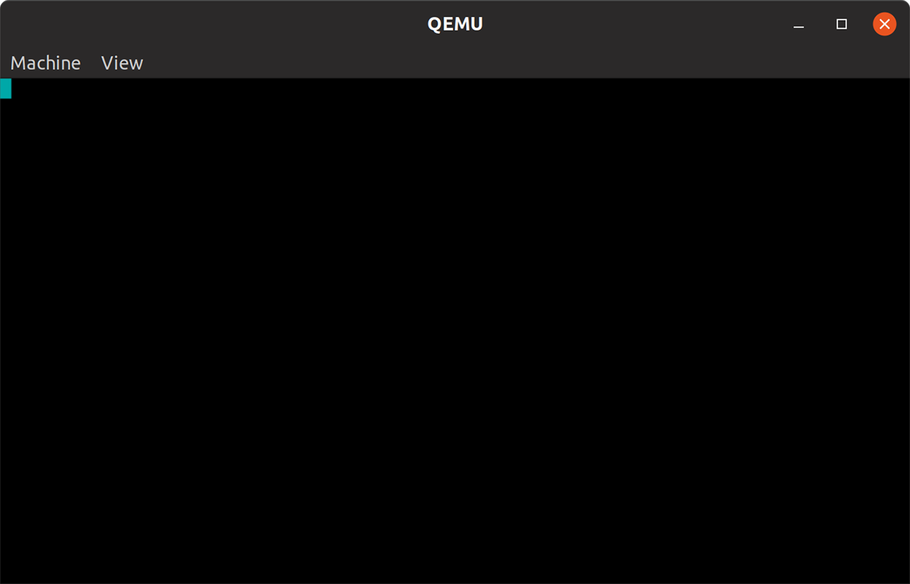
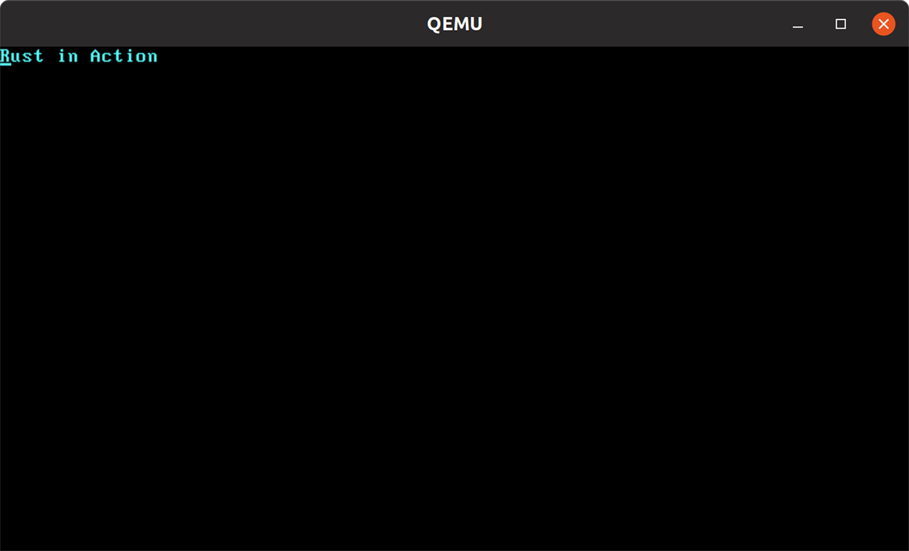
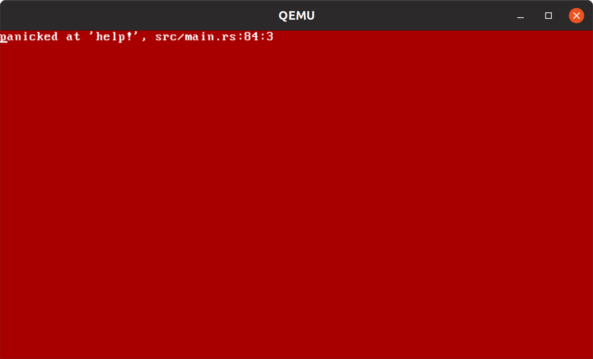

*Kernel*

***This chapter covers***

 Writing and compiling your own OS kernel

 Gaining a deeper understanding of the Rust

compiler’s capabilities

 Extending cargo with custom subcommands

Let’s build an operating system (OS). By the end of the chapter, you’ll be running your own OS (or, at least, a minimal subset of one). Not only that, but you will have compiled your own bootloader, your own kernel, and the Rust language directly for that new target (which doesn’t exist yet).

This chapter covers many features of Rust that are important for programming without an OS. Accordingly, the chapter is important for programmers who intend to work with Rust on embedded devices.

***11.1***

***A fledgling operating system (FledgeOS)***

In this section, we’ll implement an OS kernel. The OS kernel performs several important roles, such as interacting with hardware and memory management, and coordinating work. Typically, work is coordinated through processes and threads.

We won’t be able to cover much of that in this chapter, but we will get off the ground. We’ll fledge, so let’s call the system we’re building *FledgeOS*.

**365**

**366**

CHAPTER 11

***Kernel***

***11.1.1***

***Setting up a development environment***

***for developing an OS kernel***

Creating an executable for an OS that doesn’t exist yet is a complicated process. For instance, we need to compile the core Rust language for the OS from your current one. But your current environment only understands your current environment. Let’s extend that. We need several tools to help us out. Here are several components that you will need to install and/or configure before creating FledgeOS:

 *QEMU*—A virtualization technology. Formally part of a class of software called *virtual machine monitors*,” it runs operating systems for any machine on any of its supported hosted architectures. Visit <https://www.qemu.org/> for installation instructions.

 *The bootimage crate and some supporting tools*—The bootimage crate does the heavy lifting for our project. Thankfully, installing it and the tools needed to work with it effectively is a lightweight process. To do that, enter the following commands from the command line:

**\$ cargo install cargo-binutils**

...

Installed packagècargo-binutils v0.3.3\` (executables \`cargo-cov\`,

\`cargo-nm\`, \`cargo-objcopy\`, \`cargo-objdump\`, \`cargo-profdatà,

\`cargo-readobj\`, \`cargo-sizè, \`cargo-strip\`, \`rust-ar\`, \`rust-cov\`,

\`rust-ld\`, \`rust-lld\`, \`rust-nm\`, \`rust-objcopy\`, \`rust-objdump\`,

\`rust-profdatà, \`rust-readobj\`, \`rust-sizè, \`rust-strip\`)

**\$ cargo install bootimage**

...

Installed packagèbootimage v0.10.3\` (executables \`bootimagè,

\`cargo-bootimagè)

**\$ rustup toolchain install nightly**

info: syncing channel updates for 'nightly-x86_64-unknown-linux-gnu'

...

**\$ rustup default nightly**

info: using existing install for 'nightly-x86_64-unknown-linux-gnu'

info: default toolchain set to 'nightly-x86_64-unknown-linux-gnu'

...

**\$ rustup component add rust-src**

info: downloading component 'rust-src'

...

**Over time, this may**

**become the llvm-tools**

**component.**

**\$ rustup component add llvm-tools-preview**

info: downloading component 'llvm-tools-preview'

...

Each of these tools performs an important role:

 *The cargo-binutils crate*—Enables cargo to directly manipulate executable files via subcommands using utilities built with Rust and installed by cargo. Using

***A fledgling operating system (FledgeOS)***

**367**

cargo-binutils rather than installing binutils via another route prevents any potential version mismatches.

 *The bootimage crate*—Enables cargo to build a *boot image*, an executable that can be booted directly on hardware.

 *The nightly toolchain*—Installing the nightly version of the Rust compiler unlocks features that have not yet been marked as stable, and thus constrained by Rust’s backward-compatibility guarantees. Some of the compiler internals that we will be accessing in this chapter are unlikely to ever be stabilized.

We set nightly to be our default toolchain to simplify the build steps for projects in this chapter. To revert the change, use the command rustup default stable.

 *The rust-src component*—Downloads the source code for the Rust programming language. This enables Rust to compile a compiler for the new OS.

 *The llvm-tools-preview component*—Installs extensions for the LLVM compiler, which makes up part of the Rust compiler.

***11.1.2***

***Verifying the development environment***

To prevent significant frustration later on, it can be useful to double-check that everything is installed correctly. To do that, here’s a checklist:

 *QEMU*—The qemu-system-x86_64 utility should be on your PATH. You can check that this is the case by providing the --version flag:

**\$ qemu-system-x86_64 --version**

QEMU emulator version 4.2.1 (Debian 1:4.2-3ubuntu6.14)

Copyright (c) 2003-2019 Fabrice Bellard and the QEMU Project developers

 *The cargo-binutils crate*—As indicated by the output of cargo install cargo-binutils, several executables were installed on your system. Executing any of those with the --help flag should indicate that all of these are available. For example, to check that rust-strip is installed, use this command: **\$ rust-strip --help**

OVERVIEW: llvm-strip tool

USAGE: llvm-strip \[options\] inputs..

...

 *The bootimage crate*—Use the following command to check that all of the pieces are wired together:

**\$ cargo bootimage --help**

Creates a bootable disk image from a Rust kernel

...

**368**

***Kernel***

 *The llvm-tools-preview toolchain component*—The LLVM tools are a set of auxiliary utilities for working with LLVM. On Linux and macOS, you can use the following commands to check that these are accessible to rustc:

**\$ export SYSROOT=\$(rustc --print sysroot)**

**\$ find "\$SYSROOT" -type f -name 'llvm-\*' -printf '%f\n' \| sort** llvm-ar

llvm-as

llvm-cov

llvm-dis

llvm-nm

llvm-objcopy

llvm-objdump

llvm-profdata

llvm-readobj

llvm-size

llvm-strip

On MS Windows, the following commands produce a similar result:

**C:\\\> rustc --print sysroot**

**Replace \<sysroot\> with the**

**C:\\\> cd \<sysroot\>**

**output of the previous command**

**C:\\\> dir llvm\*.exe /s /b**

Great, the environment has been set up. If you encounter any problems, try reinstalling the components from scratch.

***11.2***

***Fledgeos-0: Getting something working***

FledgeOS requires some patience to fully comprehend. Although the code may be short, it includes many concepts that are probably novel because they are not exposed to programmers who make use of an OS. Before getting started with the code, let’s see FledgeOS fly.

***11.2.1***

***First boot***

FledgeOS is not the world’s most powerful operating system. Truthfully, it doesn’t look like much at all. At least it’s a graphical environment. As you can see from figure 11.1, it creates a pale blue box in the top-left corner of the screen.

To get fledgeos-0 up and running, execute these commands from a command-line prompt:

**\$ git clone https:/ /github.com/rust-in-action/code rust-in-action** Cloning into 'rust-in-action'...

...

**\$ cd rust-in-action/ch11/ch11-fledgeos-0**

**Adding +nightly ensures that**

**\$ cargo +nightly run**

**the nightly compiler is used.**

...

Running: qemu-system-x86_64 -drive

format=raw,file=target/fledge/debug/bootimage-fledgeos.bin

***Fledgeos-0: Getting something working***

**369**

Figure 11.1

Expected output from running fledgeos-0 (listings 11.1–11.4)

Don’t worry about *how* the block at the top left changed color. We’ll discuss the retro-computing details for that shortly. For now, success is being able to compile your own version of Rust, an OS kernel using that Rust, a bootloader that puts your kernel in the right place, and having these all work together.

Getting this far is a big achievement. As mentioned earlier, creating a program that targets an OS kernel that doesn’t exist yet is complicated. Several steps are required: 1

Create a machine-readable definition of the conventions that the OS uses, such as the intended CPU architecture. This is the *target platform*, also known as a *compiler target* or simply *target*. You have seen targets before. Try executing rustup target list for a list that you can compile Rust to.

2

Compile Rust for the target definition to create the new target. We’ll suffice with a subset of Rust called *core* that excludes the standard library (crates under std).

3

Compile the OS kernel for the new target using the “new” Rust.

4

Compile a bootloader that can load the new kernel.

5

Execute the bootloader in a virtual environment, which, in turn, runs the kernel.

Thankfully, the bootimage crate does all of this for us. With all of that fully automated, we’re able to focus on the interesting pieces.

**370**

***Kernel***

***11.2.2***

***Compilation instructions***

To make use of the publicly available source code, follow the steps in section 11.1.3.

That is, execute these commands from a command prompt:

**\$ git clone https:/ /github.com/rust-in-action/code rust-in-action** Cloning into 'rust-in-action'...

...

**\$ cd rust-in-action/ch11/ch11-fledgeos-0**

To create the project by hand, here is the recommended process:

1

From a command-line prompt, execute these commands:

**\$ cargo new fledgeos-0**

**\$ cargo install cargo-edit**

**\$ cd fledgeos-0**

**\$ mkdir .cargo**

**\$ cargo add bootloader@0.9**

**\$ cargo add x86_64@0.13**

2

Add the following snippet to the end of project’s Cargo.toml file. Compare the result with listing 11.1, which can be downloaded from ch11/ch11-fledgeos-0/

Cargo.toml:

\[package.metadata.bootimage\]

build-command = \["build"\]

run-command = \[

"qemu-system-x86_64", "-drive", "format=raw,file={}"

\]

3

Create a new fledge.json file at the root of the project with the contents from listing 11.2. You can download this from the listing in ch11/ch11-fledgeos-0/

fledge.json.

4

Create a new .cargo/config.toml file from listing 11.3, which is available in ch11/ch11-fledgeos-0/.cargo/config.toml.

5

Replace the contents of src/main with listing 11.4, which is available in ch11/

ch11-fledgeos-0/src/main.rs.

***11.2.3***

***Source code listings***

The source code for the FledgeOS projects (code/ch11/ch11-fledgeos-\*) uses a slightly different structure than most cargo projects. Here is a view of their layout, using fledgeos-0 as a representative example:

fledgeos-0

├──

**See listing 11.1.**

Cargo.toml

├── fledge.json

**See listing 11.2.**

├── .cargo

│

└── config.toml

**See listing 11.3.**

***Fledgeos-0: Getting something working***

**371**

└── src

└── main.rs

**See listing 11.4.**

The projects include two extra files:

 *The project root directory contains a fledge.json file.* This is the definition of the compiler target that bootimage and friends will be building.

 *The .cargo/config.toml file provides extra configuration parameters.* These tell cargo that it needs to compile the std::core module itself for this project, rather than relying on it being preinstalled.

The following listing provides the project’s Cargo.toml file. It is available in ch11/

ch11-fledgeos-0/Cargo.toml.

Listing 11.1

Project metadata for fledgeos-0

\[package\]

name = "fledgeos"

version = "0.1.0"

authors = \["Tim McNamara \<author@rustinaction.com\>"\]

edition = "2018"

\[dependencies\]

bootloader = "0.9"

x86_64 = "0.13"

**Updates cargo run to invoke a**

\[package.metadata.bootimage\]

**QEMU session. The path to the OS**

build-command = \["build"\]

**image created during the build**

**replaces the curly braces ({}).**

run-command = \[

"qemu-system-x86_64", "-drive", "format=raw,file={}"

\]

The project’s Cargo.toml file is slightly unique. It includes a new table, \[package

.metadata.bootimage\], which contains a few directives that are probably confusing.

This table provides instructions to the bootimage crate, which is a dependency of bootloader:

 bootimage—Creates a bootable disk image from a Rust kernel

 build-command—Instructs bootimage to use the cargo build command rather than cargo xbuild for cross-compiling

 run_command—Replaces the default behavior of cargo run to use QEMU rather than invoking the executable directly

TIP

See the documentation at <https://github.com/rust-osdev/bootimage/>

for more information about how to configure bootimage.

The following listing shows our kernel target’s definition. It is available from ch11/

ch11-fledgeos-0/fledge.json.

**372**

***Kernel***

Listing 11.2

Kernel definition for FledgeOS

{

"llvm-target": "x86_64-unknown-none",

"data-layout": "e-m:e-i64:64-f80:128-n8:16:32:64-S128",

"arch": "x86_64",

"target-endian": "little",

"target-pointer-width": "64",

"target-c-int-width": "32",

"os": "none",

"linker": "rust-lld",

"linker-flavor": "ld.lld",

"executables": true,

"features": "-mmx,-sse,+soft-float",

"disable-redzone": true,

"panic-strategy": "abort"

}

Among other things, the target kernel’s definition specifies that it is a 64-bit OS built for x86-64 CPUs. This JSON specification is understood by the Rust compiler.

TIP

Learn more about custom targets from the “Custom Targets” section of the rustc book at [https://doc.rust-lang.org/stable/rustc/targets/custom.html.](https://doc.rust-lang.org/stable/rustc/targets/custom.html)

The following listing, available from ch11/ch11-fledgeos-0/.cargo/config.toml, provides an additional configuration for building FledgeOS. We need to instruct cargo to compile the Rust language for the compiler target that we defined in the previous listing.

Listing 11.3

Extra build-time configuration for cargo

\[build\]

target = "fledge.json"

\[unstable\]

build-std = \["core", "compiler_builtins"\]

build-std-features = \["compiler-builtins-mem"\]

\[target.'cfg(target_os = "none")'\]

runner = "bootimage runner"

We are finally ready to see the kernel’s source code. The next listing, available from ch11/ch11-fledgeos-0/src/main.rs, sets up the boot process, and then writes the value 0x30 to a predefined memory address. You’ll read about how this works in section 11.2.5.

Listing 11.4

Creating an OS kernel that paints a block of color

1 \#\![no_std\]

**Prepares the program for**

2 \#\![no_main\]

**running without an OS**

3 \#\![feature(core_intrinsics)\]

**Unlocks the LLVM compiler’s**

4

**intrinsic functions**

5 use core::intrinsics;

***Fledgeos-0: Getting something working***

**373**

6 use core::panic::PanicInfo;

**Allows the panic handler**

7

**to inspect where the**

8 \#\[panic_handler\]

**panic occurred**

9 \#\[no_mangle\]

10 pub fn panic(\_info: &PanicInfo) -\> ! {

11 intrinsics::abort();

**Crashes the**

12 }

**program**

13

14 \#\[no_mangle\]

15 pub extern "C" fn \_start() -\> ! {

16 let framebuffer = 0xb8000 as \*mut u8;

17

18 unsafe {

**Increments the**

**pointer’s address**

19 framebuffer

**by 1 to 0xb8001**

20 .offset(1)

21 .write_volatile(0x30);

**Sets the background**

22 }

**to cyan**

23

24 loop {}

25 }

Listing 11.4 looks very different from the Rust projects that we have seen so far. Here are some of the changes to ordinary programs that are intended to be executed alongside an OS:

 *The central FledgeOS functions never return.* There is no place to return to. There are no other running programs. To indicate this, our functions’ return type is the Never type (!).

 *If the program crashes, the whole computer crashes.* The only thing that our program can do when an error occurs is terminate. We indicate this by relying on LLVM’s abort() function. This is explained in more detail in section 11.2.4.

 *We must disable the standard library with \![no_std\].* As our application cannot rely on an OS to provide dynamic memory allocation, it’s important to avoid any code that dynamically allocates memory. The \![no_std\] annotation excludes the Rust standard library from our crate. This has the side effect of preventing many types, such as Vec\<T\>, from being available to our program.

 *We need to unlock the unstable core_intrinsics API with the \#\![core_intrinsics\]*

*attribute.* Part of the Rust compiler is provided by LLVM, the compiler produced by the LLVM project. LLVM exposes parts of its internals to Rust, which are known as *intrinsic functions*. As LLVM’s internals are not subject to Rust’s stability guarantees, there is always a risk that what is offered to Rust will change.

Therefore, this implies that we must use the nightly compiler toolchain and explicitly opt into the unstable API in our program.

 *We need to disable the Rust symbol-naming conventions with the \#\![no_mangle\] attribute.*

Symbol names are strings within the compiled binary. For multiple libraries to coexist at runtime, it’s important that these names do not collide. Ordinarily, Rust avoids this by creating symbols via a process called *name mangling*. We need

**374**

***Kernel***

to disable this from occurring in our program; otherwise, the boot process may fail.

 *We should opt into C’s calling conventions with extern "C".* An operating system’s calling convention relates to the way function arguments are laid out in memory, among other details. Rust does not define its calling convention. By annotating the \_start() function with extern "C", we instruct Rust to use the C

language’s calling conventions. Without this, the boot process may fail.

 *Writing directly to memory changes the display.* Traditionally, operating systems used a simplistic model for adjusting the screen’s output. A predefined block of memory, known as the *frame buffer*, was monitored by the video hardware. When the frame buffer changed, the display changed to match. One standard, used by our bootloader, is VGA (Video Graphics Array). The bootloader sets up address 0xb8000 as the start of the frame buffer. Changes to its memory are reflected onscreen. This is explained in detail in section 11.2.5.

 *We should disable the inclusion of a main() function with the \#\![no_main\] attribute.* The main() function is actually quite special because its arguments are provided by a function that is ordinarily included by the compiler (\_start()), and its return values are interpreted before the program exits. The behavior of main() is part of the Rust runtime. Read section 11.2.6 for more details.

Where to go to learn more about OS development

The cargo bootimage command takes care of lots of nuisances and irritation. It provides a simple interface—a single command—to a complicated process. But if you’re a tinkerer, you might like to know what’s happening beneath the surface. In that case, you should search Philipp Oppermann’s blog, “Writing an OS in Rust,” at [https://os](https://os.phil-opp.com/)

[.phil-opp.com/](https://os.phil-opp.com/) and look into the small ecosystem of tools that has emerged from it

[at https://github.com/rust-osdev/.](https://github.com/rust-osdev/)

Now that our first kernel is live, let’s learn a little bit about how it works. First, let’s look at panic handling.

***11.2.4***

***Panic handling***

Rust won’t allow you to compile a program that doesn’t have a mechanism to deal with panics. Normally, it inserts panic handling itself. This is one of the actions of the Rust runtime, but we started our code with \#\[no_std\]. Avoiding the standard library is useful in that it greatly simplifies compilation, but manual panic handling is one of its costs. The following listing is an excerpt from listing 11.4. It introduces our panic-handling functionality.

Listing 11.5

Focusing on panic handling for FledgeOS

1 \#\![no_std\]

2 \#\![no_main\]

***Fledgeos-0: Getting something working***

**375**

3 \#\![feature(core_intrinsics)\]

4

5 use core::intrinsics;

6 use core::panic::PanicInfo;

7

8 \#\[panic_handler\]

9 \#\[no_mangle\]

10 pub fn panic(\_info: &PanicInfo) -\> ! {

11 unsafe {

12 intrinsics::abort();

13 }

14 }

There is an alternative to intrinsics::abort(). We could use an infinite loop as the panic handler, shown in the following listing. The disadvantage of that approach is that any errors in the program trigger the CPU core to run at 100% until it is shut down manually.

Listing 11.6

Using an infinite loop as a panic handler

\#\[panic_handler\]

\#\[no_mangle\]

pub fn panic(\_info: &PanicInfo) -\> ! {

loop { }

}

The PanicInfo struct provides information about where the panic originates. This information includes the filename and line number of the source code. It’ll come in handy when we implement proper panic handling.

***11.2.5***

***Writing to the screen with VGA-compatible text mode***

The bootloader sets some magic bytes with raw assembly code in boot mode. At startup, the bytes are interpreted by the hardware. The hardware switches its display to an 80x25 grid. It also sets up a fixed-memory buffer that is interpreted by the hardware for printing to the screen.

VGA-compatible text mode in 20 seconds

Normally, the display is split into an 80x25 grid of cells. Each cell is represented in memory by 2 bytes. In Rust-like syntax, those bytes include several fields. The following code snippet shows the fields:

struct VGACell {

is_blinking: u1,

**These four fields**

background_color: u3,

**occupy a single**

is_bright: u1,

**byte in memory.**

character_color: u3,

character: u8,

**Available characters are drawn from**

}

**the code page 437 encoding, which is**

**(approximately) an extension of ASCII.**

**376**

***Kernel***

***(continued)***

VGA text mode has a 16-color palette, where 3 bits make up the main 8 colors. Foreground colors also have an additional bright variant, shown in the following:

\#\[repr(u8)\]

enum Color {

Black = 0, White = 8,

Blue = 1, BrightBlue = 9,

Green = 2, BrightGreen = 10,

Cyan = 3, BrightCyan = 11,

Red = 4, BrightRed = 12,

Magenta = 5, BrightMagenta = 13,

Brown = 6, Yellow = 14,

Gray = 7, DarkGray = 15,

}

This initialization at boot time makes it easy to display things onscreen. Each of the points in the 80x25 grid are mapped to locations in memory. This area of memory is called the *frame buffer*.

Our bootloader designates 0xb8000 as the start of a 4,000 byte frame buffer. To actually set the value, our code uses two new methods, offset() and write_volatile(), that you haven’t encountered before. The following listing, an excerpt from listing 11.4, shows how these are used.

Listing 11.7

Focusing on modifying the VGA frame buffer

18 let mut framebuffer = 0xb8000 as \*mut u8;

19 unsafe {

20 framebuffer

21 .offset(1)

22 .write_volatile(0x30);

23 }

Here is a short explanation of the two new methods:

 *Moving through an address space with offset()*—A pointer type’s offset() method moves through the address space in increments that align to the size of the pointer. For example, calling .offset(1) on a \*mut u8 (mutable pointer to a u8) adds 1 to its address. When that same call is made to a \*mut u32 (mutable pointer to a u32), the pointer’s address moves by 4 bytes.

 *Forcing a value to be written to memory with write_volatile()*—Pointers provide a write_volatile() method that issues a “volatile” write. Volatile prevents the compiler’s optimizer from optimizing away the write instruction. A smart compiler might simply notice that we are using lots of constants everywhere and initialize the program such that the memory is simply set to the value that we want it to be.

***fledgeos-1: Avoiding a busy loop***

**377**

The following listing shows another way to write framebuffer.offset(1).write\_

volatile(0x30). Here we use the dereference operator (\*) and manually set the memory to 0x30.

Listing 11.8

Manually incrementing a pointer

18 let mut framebuffer = 0xb8000 as \*mut u8;

19 unsafe {

**Sets the memory location**

20 \*(framebuffer + 1) = 0x30;

**0xb8001 to 0x30**

21 }

The coding style from listing 11.8 may be more familiar to programmers who have worked heavily with pointers before. Using this style requires diligence. Without the aid of type safety provided by offset(), it’s easy for a typo to cause memory corruption. The verbose coding style used in listing 11.7 is also friendlier to programmers with less experience performing pointer arithmetic. It declares its own intent.

***11.2.6***

***\_start(): The main() function for FledgeOS***

An OS kernel does not include the concept of a main() function, in the sense that you’re used to. For one thing, an OS kernel’s main loop never returns. Where would it return to? By convention, programs return an error code when they exit to an OS. But operating systems don’t have an OS to provide an exit code to. Secondly, starting a program at main() is also a convention. But that convention also doesn’t exist for OS

kernels. To start an OS kernel, we require some software to talk directly to the CPU.

The software is called a *bootloader*.

The linker expects to see one symbol defined, \_start, which is the program’s *entry* *point*. It links \_start to a function that’s defined by your source code.

In an ordinary environment, the \_start() function has three jobs. Its first is to reset the system. On an embedded system, for example, \_start() might clear registers and reset memory to 0. Its second job is to call main(). Its third is to call \_exit(), which cleans up after main(). Our \_start() function doesn’t perform the last two jobs. Job two is unnecessary as the application’s functionality is simple enough to keep within \_start(). Job three is unnecessary, as is main(). If it were to be called, it would never return.

***11.3***

***fledgeos-1: Avoiding a busy loop***

Now that the foundations are in place, we can begin to add features to FledgeOS.

***11.3.1***

***Being power conscious by interacting with the CPU directly***

Before proceeding, FledgeOS needs to address one major shortcoming: it is extremely power hungry. The \_start() function from listing 11.4 actually runs a CPU core at 100%. It’s possible to avoid this by issuing the halt instruction (hlt) to the CPU.

The halt instruction, referred to as HLT in the technical literature, notifies the CPU that there’s no more work to be done. The CPU resumes operating when an

**378**

***Kernel***

interrupt triggers new action. As listing 11.9 shows, making use of the x84_64 crate allows us to issue instructions directly to the CPU. The listing, an excerpt of listing 11.10, makes use of the x86_64 crate to access the hlt instruction. It is passed to the CPU during the main loop of \_start() to prevent excessive power consumption.

Listing 11.9

Using the **hlt** instruction

7 use x86_64::instructions::{hlt};

17 \#\[no_mangle\]

18 pub extern "C" fn \_start() -\> ! {

19 let mut framebuffer = 0xb8000 as \*mut u8;

20 unsafe {

21 framebuffer

22 .offset(1)

23 .write_volatile(0x30);

24 }

25 loop {

26 hlt();

**This saves**

27 }

**electricity.**

28 }

The alternative to using hlt is for the CPU to run at 100% utilization, performing no work. This turns your computer into a very expensive space heater.

***11.3.2***

***fledgeos-1 source code***

fledgeos-1 is mostly the same as fledgeos-0, except that its src/main.rs file includes the additions from the previous section. The new file is presented in the following listing and is available to download from code/ch11/ch11-fledgeos-1/src/main.rs. To compile the project, repeat the instructions in section 11.2.1, replacing references to fledgeos-0 with fledgeos-1.

Listing 11.10

Project source code for fledgeos-1

1 \#\![no_std\]

2 \#\![no_main\]

3 \#\![feature(core_intrinsics)\]

4

5 use core::intrinsics;

6 use core::panic::PanicInfo;

7 use x86_64::instructions::{hlt};

8

9 \#\[panic_handler\]

10 \#\[no_mangle\]

11 pub fn panic(\_info: &PanicInfo) -\> ! {

12 unsafe {

13 intrinsics::abort();

14 }

15 }

16

17 \#\[no_mangle\]

***fledgeos-2: Custom exception handling***

**379**

18 pub extern "C" fn \_start() -\> ! {

19 let mut framebuffer = 0xb8000 as \*mut u8;

20 unsafe {

21 framebuffer

22 .offset(1)

23 .write_volatile(0x30);

24 }

25 loop {

26 hlt();

27 }

28 }

The x86_64 crate provided us with the ability to inject assembly instructions into our code. Another approach to explore is to use *inline assembly*. The latter approach is demonstrated briefly in section 12.3.

***11.4***

***fledgeos-2: Custom exception handling***

The next iteration of FledgeOS improves on its error-handling capabilities. FledgeOS

still crashes when an error is triggered, but we now have a framework for building something more sophisticated.

***11.4.1***

***Handling exceptions properly, almost***

FledgeOS cannot manage any exceptions generated from the CPU when it detects an abnormal operation. To handle exceptions, our program needs to define an exception-handling personality function.

Personality functions are called on each stack frame as the stack is unwound after an exception. This means the call stack is traversed, invoking the personality function at each stage. The personality function’s role is to determine whether the current stack frame is able to handle the exception. Exception handling is also known as *catch-ing an exception*.

NOTE

What is *stack unwinding*? When functions are called, stack frames accu-mulate. Traversing the stack in reverse is called *unwinding*. Eventually, unwinding the stack will hit \_start().

Because handling exceptions in a rigorous way is not necessary for FledgeOS, we’ll implement only the bare minimum. Listing 11.11, an excerpt from listing 11.12, provides a snippet of code with the minimal handler. Inject it into main.rs. An empty function implies that any exception is fatal because none will be marked as the handler. When an exception occurs, we don’t need to do anything.

Listing 11.11

Minimalist exception-handling personality routine

4 \#\![feature(lang_items)\]

18 \#\[lang = "eh_personality"\]

19 \#\[no_mangle\]

20 pub extern "C" fn eh_personality() { }

**380**

***Kernel***

NOTE

What is a *language item*? Language items are elements of Rust implemented as libraries outside of the compiler itself. As we strip away the standard library with \#\[no_std\], we’ll need to implement some of its functionality ourselves.

Admittedly, that’s a lot of work to do nothing. But at least we can be comforted knowing that we are doing nothing in the right way.

***11.4.2***

***fledgeos-2 source code***

fledgeos-2 builds on fledgeos-0 and fledgeos-1. Its src/main.rs file includes the additions from the previous listing. The new file is presented in the following listing and is available to download from code/ch11/ch11-fledgeos-2/src/main.rs. To compile the project, repeat the instructions in section 11.2.1, replacing references to fledgeos-0

with fledgeos-2.

Listing 11.12

Source code for fledgeos-2

1 \#\![no_std\]

2 \#\![no_main\]

3 \#\![feature(core_intrinsics)\]

4 \#\![feature(lang_items)\]

5

6 use core::intrinsics;

7 use core::panic::PanicInfo;

8 use x86_64::instructions::{hlt};

9

10 \#\[panic_handler\]

11 \#\[no_mangle\]

12 pub fn panic(\_info: &PanicInfo) -\> ! {

13 unsafe {

14 intrinsics::abort();

15 }

16 }

17

18 \#\[lang = "eh_personality"\]

19 \#\[no_mangle\]

20 pub extern "C" fn eh_personality() { }

21

22 \#\[no_mangle\]

23 pub extern "C" fn \_start() -\> ! {

24 let framebuffer = 0xb8000 as \*mut u8;

25

26 unsafe {

27 framebuffer

28 .offset(1)

29 .write_volatile(0x30);

30 }

31

32 loop {

33 hlt();

34 }

***fledgeos-3: Text output***

**381**

***11.5***

***fledgeos-3: Text output***

Let’s write some text to the screen. That way, if we really do encounter a panic, we can report it properly. This section explains the process of sending text to the frame buffer in more detail. Figure 11.2 shows the output from running fledgeos-3.

Figure 11.2

Output produced by fledgeos-3

***11.5.1***

***Writing colored text to the screen***

To start, we’ll create a type for the color numeric constants that are used later in listing 11.16. Using an enum rather than defining a series of const values provides enhanced type safety. In some sense, it adds a semantic relationship between the values. These are all treated as members of the same group.

The following listing defines an enum that represents the VGA-compatible text mode color palette. The mapping between bit patterns and colors is defined by the VGA standard, and our code should comply with it.

Listing 11.13

Representing related numeric constants as an enum

9 \#\[allow(unused)\]

**We won’t be using every**

10 \#\[derive(Clone,Copy)\]

**color variant in our code, so**

11 \#\[repr(u8)\]

**we can silence warnings.**

12 enum Color {

13 Black = 0x0, White = 0xF,

**Opts into copy semantics**

14 Blue = 0x1, BrightBlue = 0x9,

15 Green = 0x2, BrightGreen = 0xA,

**Instructs the compiler to use a**

16 Cyan = 0x3, BrightCyan = 0xB,

**single byte to represent the values**

**382**

***Kernel***

17 Red = 0x4, BrightRed = 0xC,

18 Magenta = 0x5, BrightMagenta = 0xD,

19 Brown = 0x6, Yellow = 0xE,

20 Gray = 0x7, DarkGray = 0x8

21 }

***11.5.2***

***Controlling the in-memory representation of enums***

We’ve been content to allow the compiler to determine how an enum is represented.

But there are times when we need to pull in the reins. External systems often demand that our data matches their requirements.

Listing 11.13 provides an example of fitting the colors from the VGA-compatible text mode palette enum into a single u8. It removes any discretion from the compiler about which bit pattern (formally called the *discriminant*) to associate with particular variants. To prescribe a representation, add the repr attribute. You are then able to specify any integer type (i32, u8, i16, u16,…), as well as some special cases.

Using a prescribed representation has some disadvantages. In particular, it reduces your flexibility. It also prevents Rust from making space optimizations. Some enums, those with a single variant, require no representation. These appear in source code but occupy zero space in the running program.

***11.5.3***

***Why use enums?***

You could model colors differently. For instance, it’s possible to create numeric constants that look identical in memory. The following shows one such possibility: const BLACK: u8 = 0x0;

const BLUE: u8 = 0x1;

// ...

Using an enum adds an extra guard. It becomes much more difficult to use an illegal value in our code than if we were using an u8 directly. You will see this demonstrated when the Cursor struct is introduced in listing 11.17.

***11.5.4***

***Creating a type that can print to the VGA frame buffer***

To print to the screen, we’ll use a Cursor struct that handles the raw memory manipulation and can convert between our Color type and what is expected by VGA. As the following listing shows, this type manages the interface between our code and the VGA frame buffer. This listing is another excerpt from listing 11.16.

Listing 11.14

Definition and methods for **Cursor**

25 struct Cursor {

26 position: isize,

27 foreground: Color,

28 background: Color,

29 }

30

***fledgeos-3: Text output***

**383**

31 impl Cursor {

32 fn color(&self) -\> u8 {

**Uses the foreground color as a**

33 let fg = self.foreground as u8;

**base, which occupies the lower 4**

34 let bg = (self.background as u8) \<\< 4;

**bits. Shift the background color**

35 fg \| bg

**left to occupy the higher bits, then**

**merge these together.**

36 }

37

38 fn print(&mut self, text: &\[u8\]) {

**For expediency, the input uses**

39 let color = self.color();

**a raw byte stream rather than**

40

**a type that guarantees the**

41 let framebuffer = 0xb8000 as \*mut u8;

**correct encoding.**

42

43 for &character in text {

44 unsafe {

45 framebuffer.offset(self.position).write_volatile(character); 46 framebuffer.offset(self.position + 1).write_volatile(color); 47 }

48 self.position += 2;

49 }

50 }

51 }

***11.5.5***

***Printing to the screen***

Making use of Cursor involves setting its position and then sending a reference to Cursor.print(). The following listing, an excerpt from listing 11.16, expands the \_start() function to also print to the screen.

Listing 11.15

Demonstrating printing to the screen

67 \#\[no_mangle\]

68 pub extern "C" fn \_start() -\> ! {

69 let text = b"Rust in Action";

70

71 let mut cursor = Cursor {

72 position: 0,

73 foreground: Color::BrightCyan,

74 background: Color::Black,

75 };

76 cursor.print(text);

77

78 loop {

79 hlt();

80 }

81 }

***11.5.6***

***fledgeos-3 source code***

fledgeos-3 continues to build on fledgeos-0, fledgeos-1, and fledgeos-2. Its src/main.rs file includes the additions from the this section. The complete file is presented in the following listing and is available to download from code/ch11/ch11-fledgeos-3/src/

main.rs. To compile the project, repeat the instructions in section 11.2.1, replacing references to fledgeos-0 with fledgeos-3.

**384**

***Kernel***

Listing 11.16

FledgeOS now prints text to the screen

1 \#\![feature(core_intrinsics)\]

2 \#\![feature(lang_items)\]

3 \#\![no_std\]

4 \#\![no_main\]

5

6 use core::intrinsics;

7 use core::panic::PanicInfo;

8

9 use x86_64::instructions::{hlt};

10

11 \#\[allow(unused)\]

12 \#\[derive(Clone,Copy)\]

13 \#\[repr(u8)\]

14 enum Color {

15 Black = 0x0, White = 0xF,

16 Blue = 0x1, BrightBlue = 0x9,

17 Green = 0x2, BrightGreen = 0xA,

18 Cyan = 0x3, BrightCyan = 0xB,

19 Red = 0x4, BrightRed = 0xC,

20 Magenta = 0x5, BrightMagenta = 0xD,

21 Brown = 0x6, Yellow = 0xE,

22 Gray = 0x7, DarkGray = 0x8

23 }

24

25 struct Cursor {

26 position: isize,

27 foreground: Color,

28 background: Color,

29 }

30

31 impl Cursor {

32 fn color(&self) -\> u8 {

33 let fg = self.foreground as u8;

34 let bg = (self.background as u8) \<\< 4;

35 fg \| bg

36 }

37

38 fn print(&mut self, text: &\[u8\]) {

39 let color = self.color();

40

41 let framebuffer = 0xb8000 as \*mut u8;

42

43 for &character in text {

44 unsafe {

45 framebuffer.offset(self.position).write_volatile(character); 46 framebuffer.offset(self.position + 1).write_volatile(color); 47 }

48 self.position += 2;

49 }

50 }

51 }

52

53 \#\[panic_handler\]

***fledgeos-4: Custom panic handling***

**385**

54 \#\[no_mangle\]

55 pub fn panic(\_info: &PanicInfo) -\> ! {

56 unsafe {

57 intrinsics::abort();

58 }

59 }

60

61 \#\[lang = "eh_personality"\]

62 \#\[no_mangle\]

63 pub extern "C" fn eh_personality() { }

64

65 \#\[no_mangle\]

66 pub extern "C" fn \_start() -\> ! {

67 let text = b"Rust in Action";

68

69 let mut cursor = Cursor {

70 position: 0,

71 foreground: Color::BrightCyan,

72 background: Color::Black,

73 };

74 cursor.print(text);

75

76 loop {

77 hlt();

78 }

79 }

***11.6***

***fledgeos-4: Custom panic handling***

Our panic handler, repeated in the following snippet, calls core::intrinsics:: abort(). This shuts down the computer immediately, without providing any further input:

\#\[panic_handler\]

\#\[no_mangle\]

pub fn panic(\_info: &PanicInfo) -\> ! {

unsafe {

intrinsics::abort();

}

}

***11.6.1***

***Implementing a panic handler that reports the error to the user***

For the benefit of anyone doing embedded development or wanting to execute Rust on microcontrollers, it’s important to learn how to report where a panic occurs. A good place to start is with core::fmt::Write. That trait can be associated with the panic handler to display a message, as figure 11.3 shows.

***11.6.2***

***Reimplementing panic() by making use of core::fmt::Write***

The output shown by figure 11.3 is produced by listing 11.17. panic() now goes through a two-stage process. In the first stage, panic() clears the screen. The second stage involves the core::write! macro. core::write! takes a destination object as its

**386**

***Kernel***

Figure 11.3

Displaying a message when a panic occurs

first argument (cursor), which implements the core::fmt::Write trait. The following listing, an excerpt from listing 11.19, provides a panic handler that reports that an error has occurred using this process.

Listing 11.17

Clearing the screen and printing the message

61 pub fn panic(info: &PanicInfo) -\> ! {

62 let mut cursor = Cursor {

63 position: 0,

64 foreground: Color::White,

65 background: Color::Red,

66 };

67 for \_ in 0..(80\*25) {

**Clears the screen by**

68 cursor.print(b" ");

**filling it with red**

69 }

70 cursor.position = 0;

**Resets the position**

71 write!(cursor, "{}", info).unwrap();

**of the cursor**

72

73 loop {}

**Spins in an infinite loop, allowing**

**Prints PanicInfo**

74 }

**the user to read the message and**

**to the screen**

**restart the machine manually**

***11.6.3***

***Implementing core::fmt::Write***

Implementing core::fmt::Write involves calling one method: write_str(). The trait defines several others, but the compiler can autogenerate these once an implementation of write_str() is available. The implementation in the following listing

***fledgeos-4: Custom panic handling***

**387**

reuses the print() method and converts the UTF-8 encoded &str into &\[u8\] with the to_bytes() method. The code for this listing is in ch11/ch11-fledgeos-4/src/main.rs.

Listing 11.18

Implementing **core::fmt::Write** for the **Cursor** type

54 impl fmt::Write for Cursor {

55 fn write_str(&mut self, s: &str) -\> fmt::Result {

56 self.print(s.as_bytes());

57 Ok(())

58 }

59 }

***11.6.4***

***fledge-4 source code***

The following listing shows the user-friendly panic-handling code for FledgeOS. You’ll find the source for this listing in ch11/ch11-fledgeos-4/src/main.rs. As with earlier versions, to compile the project, repeat the instructions at section 11.2.1 but replace references to fledgeos-0 with fledgeos-4.

Listing 11.19

Full code listing of FledgeOS with complete panic handling

1 \#\![feature(core_intrinsics)\]

2 \#\![feature(lang_items)\]

3 \#\![no_std\]

4 \#\![no_main\]

5

6 use core::fmt;

7 use core::panic::PanicInfo;

8 use core::fmt::Write;

9

10 use x86_64::instructions::{hlt};

11

12 \#\[allow(unused)\]

13 \#\[derive(Copy, Clone)\]

14 \#\[repr(u8)\]

15 enum Color {

16 Black = 0x0, White = 0xF,

17 Blue = 0x1, BrightBlue = 0x9,

18 Green = 0x2, BrightGreen = 0xA,

19 Cyan = 0x3, BrightCyan = 0xB,

20 Red = 0x4, BrightRed = 0xC,

21 Magenta = 0x5, BrightMagenta = 0xD,

22 Brown = 0x6, Yellow = 0xE,

23 Gray = 0x7, DarkGray = 0x8

24 }

25

26 struct Cursor {

27 position: isize,

28 foreground: Color,

29 background: Color,

30 }

31

32 impl Cursor {

**388**

***Kernel***

33 fn color(&self) -\> u8 {

34 let fg = self.foreground as u8;

35 let bg = (self.background as u8) \<\< 4;

36 fg \| bg

37 }

38

39 fn print(&mut self, text: &\[u8\]) {

40 let color = self.color();

41

42 let framebuffer = 0xb8000 as \*mut u8;

43

44 for &character in text {

45 unsafe {

46 framebuffer.offset(self.position).write_volatile(character); 47 framebuffer.offset(self.position + 1).write_volatile(color); 48 }

49 self.position += 2;

50 }

51 }

52 }

53

54 impl fmt::Write for Cursor {

55 fn write_str(&mut self, s: &str) -\> fmt::Result {

56 self.print(s.as_bytes());

57 Ok(())

58 }

59 }

60

61 \#\[panic_handler\]

62 \#\[no_mangle\]

63 pub fn panic(info: &PanicInfo) -\> ! {

64 let mut cursor = Cursor {

65 position: 0,

66 foreground: Color::White,

67 background: Color::Red,

68 };

69 for \_ in 0..(80\*25) {

70 cursor.print(b" ");

71 }

72 cursor.position = 0;

73 write!(cursor, "{}", info).unwrap();

74

75 loop { unsafe { hlt(); }}

76 }

77

78 \#\[lang = "eh_personality"\]

79 \#\[no_mangle\]

80 pub extern "C" fn eh_personality() { }

81

82 \#\[no_mangle\]

83 pub extern "C" fn \_start() -\> ! {

84 panic!("help!");

85 }

***Summary***

**389**

***Summary***

 Writing a program that is intended to run without an operating system can feel like programming in a barren desert. Functionality that you take for granted, such as dynamic memory or multithreading, is not available to you.

 In environments such as embedded systems that do not have dynamic memory management, you will need to avoid the Rust standard library with the \#\![no_std\]

annotation.

 When interfacing with external components, naming symbols becomes significant. To opt out of Rust’s name-mangling facilities, use the \#\![no_mangle\]

attribute.

 Rust’s internal representations can be controlled through annotations. For example, annotating an enum with \#\![repr(u8\]) forces the values to be packed into a single byte. If this doesn’t work, Rust refuses to compile the program.

 Raw pointer manipulation is available to you, but type-safe alternatives exist.

When it’s practical to do so, use the offset() method to correctly calculate the number of bytes to traverse through the address space.

 The compiler’s internals are always accessible to you at the cost of requiring a nightly compiler. Access compiler intrinsics like intrinsics::abort() to provide functionality to the program that’s ordinarily inaccessible.

 cargo should be thought of as an extensible tool. It sits at the center of the Rust programmer’s workflow, but its standard behavior can be changed when necessary.

 To access raw machine instructions, such as HTL, you can use helper crates like x86_64 or rely on inline assembly.

 Don’t be afraid to experiment. With modern tools like QEMU, the worst that can happen is that your tiny OS crashes, and you’ll need to run it again instantly.