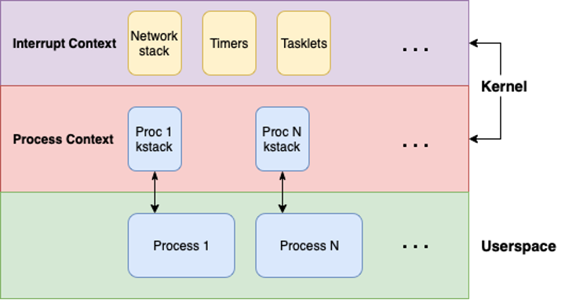

# Linternals: Exploring The mm Subsystem via mmap \[0x01\]

December 16, 2024

[\#linux](https://sam4k.com/tags/linux/)

[\#kernel](https://sam4k.com/tags/kernel/)

[\#memory](https://sam4k.com/tags/memory/)


That’s right, you’re not hallucinating, Linternals is back! It’s been a *while*, I know, but after some travelling and moving to a new role, I’ve finally found some time to ramble.

For those of you unfamiliar with the series (or have understandably forgotten that it existed), I’ve covered several topics relating to kernel memory management previously:

- [The “Virtual Memory” series](https://sam4k.com/linternals/#virtual-memory) of posts discusses the differences between physical and virtual memory, exploring both the user and kernel virtual address spaces
- [The series on “Memory Allocators”](https://sam4k.com/linternals/#memory-allocators) covers the role of memory allocators in general before moving onto to detailing the kernel’s page and slab allocators

This post might be a little different, as I’m writing this introduction before I’ve actually planned 100% what I’ll be writing about. I know I want to explore the memory management (mm) subsystem in more detail, building on what we’ve covered so far, but the issue is…


There’s a LOT to this subsystem, it’s integral to the kernel and interacts with lots of other components. This had me thinking - how do I cover this gargantuan, messy topic in a structured and accessible way?! Where do I begin?? What do I cover???

My plan is to take a leaf out of how I would normally approach researching a new topic like this: start with a high level action (e.g. what the user sees) and follow the source, building up an understanding of the relevant structures and API as we go.

So we’ll take a simple action - mapping and writing to some (anonymous) memory in userspace - and see how deep we can go into the kernel, exploring what is actually going on under the hood. *Hopefully* this will provide an interesting and informative read, giving some insights on some of the key structures and functions of the kernel’s mm subsystem.

🐧

This post is based on the latest kernel at the time of writing, 6.11.5, and x86_64.

## Contents

- [What is Memory Management?](https://sam4k.com/linternals-exploring-the-mm-subsystem-part-1/#what-is-memory-management)
- [Overview of The MM Subsystem](https://sam4k.com/linternals-exploring-the-mm-subsystem-part-1/#overview-of-the-mm-subsystem)
  - [Representing Memory](https://sam4k.com/linternals-exploring-the-mm-subsystem-part-1/#representing-memory)
  - [Allocating Memory](https://sam4k.com/linternals-exploring-the-mm-subsystem-part-1/#allocating-memory)
  - [Mapping Memory](https://sam4k.com/linternals-exploring-the-mm-subsystem-part-1/#mapping-memory)
  - [Managing Memory](https://sam4k.com/linternals-exploring-the-mm-subsystem-part-1/#managing-memory)
- [Getting Lost in The Source](https://sam4k.com/linternals-exploring-the-mm-subsystem-part-1/#getting-lost-in-the-source)
- [Mapping Memory](https://sam4k.com/linternals-exploring-the-mm-subsystem-part-1/#mapping-memory-1)
  - [Entering The Kernel](https://sam4k.com/linternals-exploring-the-mm-subsystem-part-1/#entering-the-kernel)
  - [`__x64_sys_mmap()`](https://sam4k.com/linternals-exploring-the-mm-subsystem-part-1/#x64sysmmap)
  - [`ksys_mmap_pgoff()`](https://sam4k.com/linternals-exploring-the-mm-subsystem-part-1/#ksysmmappgoff)
  - [`vm_mmap_pgoff()`](https://sam4k.com/linternals-exploring-the-mm-subsystem-part-1/#vmmmappgoff)
    - [Fetching Our `mm_struct`](https://sam4k.com/linternals-exploring-the-mm-subsystem-part-1/#fetching-our-mmstruct)
    - [A Bit Of Security](https://sam4k.com/linternals-exploring-the-mm-subsystem-part-1/#a-bit-of-security)
    - [Locking](https://sam4k.com/linternals-exploring-the-mm-subsystem-part-1/#locking)
- [Next Time](https://sam4k.com/linternals-exploring-the-mm-subsystem-part-1/#next-time)

## What is Memory Management?

So before we get stuck into the nitty-gritty details, let’s talk about what we mean by memory management. Fortunately, unlike some of the topics we’ve covered (I’m looking at you SLUB), this one’s fairly self explanatory: it’s about managing a system’s memory.


Memory, in this sense, covers the range of storage a modern system may use: HDDs and SSDs, RAM, CPU registers and caches etc. Managing this involves providing representations of the various types of memory and means for the kernel and userspace to efficiently access and utilise them.

Let’s take the everyday (and oversimplified) example of running a program on our computer. We can see involvement of memory management every step of the way:

- First, the program itself is stored on disk and must be read
- It is then loaded into RAM, where the physical address in memory is mapped into our process’ virtual address space; commonly loaded data will make use of caches
- We’ve talked about how the kernel and userspace have their own virtual address spaces, with their own mappings and protections which need to be managed
- Then we have the execution of the code itself which will make use of various CPU registers, it will also need to ask the kernel to do privileged things via system calls, so we also need to consider the transition between userspace and the kernel!

Hopefully this highlights how fundamental the memory management subsystem is and gives a glimpse at its many responsibilities.

## Overview of The MM Subsystem


Okay, what does this *actually* look like? The kernel has several [core subsystems](https://docs.kernel.org/subsystem-apis.html), one of which is the [memory management subsystem](https://docs.kernel.org/mm/index.html). Looking at the kernel source tree, this is located in the aptly named `[mm/](https://elixir.bootlin.com/linux/v6.11.5/source/mm)` subdirectory.

I figured we could highlight some of the key files in there to give a sense of the subsystems role and structure in a more tangible context. Like many of my decisions, this turned out to be harder than I thought, but we’ll give it a go.

### Representing Memory

To be able to manage memory, we need to be able represent it in a way the kernel can work with. There are a number of key structures used by the `[mm/](https://elixir.bootlin.com/linux/v6.11.5/source/mm)` subsystem, many of which can be found in [include/linux/mm_types.h](https://elixir.bootlin.com/linux/v6.11.5/source/include/linux/mm_types.h). This includes:

- Representations for chunks of physically contiguous memory (`[struct page](https://elixir.bootlin.com/linux/v6.11.5/source/include/linux/mm_types.h#L72)`) and the tables used to organise how this memory is accessed.
- The `[struct mm_struct](https://elixir.bootlin.com/linux/v6.11.5/source/include/linux/mm_types.h#L779)` provides a description of a process’ virtual address space, including its different areas of virtual memory (`[struct vm_area_struct](https://elixir.bootlin.com/linux/v6.11.5/source/include/linux/mm_types.h#L664)`).
- The `[mm_struct](https://elixir.bootlin.com/linux/v6.11.5/source/include/linux/mm_types.h#L779)` also includes a pointer to the upper most table (`[pgd_t * pgd](https://elixir.bootlin.com/linux/v6.11.5/source/include/linux/mm_types.h#L806)`) which is used to map our process’ virtual addresses to a specific page in physical memory.

### Allocating Memory

With our memory represented, we need a way to actually make use of it! The various allocation mechanisms fall under the memory management subsystem, providing ways to manage the pool of available physical memory and allocate it to be used. This includes:

- The page allocator (`[mm/page_alloc.c](https://elixir.bootlin.com/linux/v6.11.5/source/mm/page_alloc.c)`) for allocating physically contiguous memory of at least `[PAGE_SIZE](https://elixir.bootlin.com/linux/v6.11.5/source/arch/x86/include/asm/page_types.h#L11)`.
- The slab allocator for the efficient allocation of (physically contiguous) objects, via the `[kmalloc()](https://elixir.bootlin.com/linux/v6.11.5/source/include/linux/slab.h#L687)` API. `[mm/slab.h](https://elixir.bootlin.com/linux/v6.11.5/source/mm/slab.h)` and `[mm/slab_common.c](https://elixir.bootlin.com/linux/v6.11.5/source/mm/slab_common.c)` define the common API, while the SLUB implementation can be found at `[mm/slub.c](https://elixir.bootlin.com/linux/v6.11.5/source/mm/slub.c)`.
- `[mm/vmalloc.c](https://elixir.bootlin.com/linux/v6.11.5/source/mm/vmalloc.c)` provides an alternative API for allocating ***virtually*** contiguous memory and is used for large allocations that may be hard to find physically contiguous space for. E.g. `[kvmalloc()](https://elixir.bootlin.com/linux/v6.11.5/source/include/linux/slab.h#L817)` will `[kmalloc()](https://elixir.bootlin.com/linux/v6.11.5/source/include/linux/slab.h#L687)` but use `[vmalloc()](https://elixir.bootlin.com/linux/v6.11.5/source/include/linux/vmalloc.h#L144)` as a fallback!

### Mapping Memory

So far we’ve touched mainly on how to manage physical memory, but as we know there’s a lot more to it than that! Sure, we can map chunks of physical memory into our virtual address space to work on, but what about stuff that sits on disk?

- `[mmap(2)](https://man7.org/linux/man-pages/man2/mmap.2.html)` (`[mm/mmap.c](https://elixir.bootlin.com/linux/v6.11.5/source/mm/mmap.c#L1521)`) is one-stop shop for userspace mappings and allows us to map physical memory into our processes’ virtual address space so we can access it. This can be anonymous memory (i.e. just a chunk of physical memory for us to use) or it can also be used to map a previously opened file into physical memory too!
- `[mm/filemap.c](https://elixir.bootlin.com/linux/v6.11.5/source/mm/filemap.c)` contains some core, generic, functionality for managing file mappings, including the use of a page cache for file data. This can then be utilised by file systems when they `[read(2)](https://man7.org/linux/man-pages/man2/read.2.html)` or `[write(2)](https://man7.org/linux/man-pages/man2/write.2.html)` files for example.
- The `[ioremap()](https://elixir.bootlin.com/linux/v6.11.5/source/arch/x86/mm/ioremap.c#L322)` API ( is used for mapping device memory into the kernel virtual address space. An example would be a GPU kernel driver mapping some GPU memory into the kernel virtual address so it can access it. If you recall the [post on the kernel virtual address space](https://sam4k.com/linternals-virtual-memory-part-3/#kernel-virtual-memory-map), you’ll see that the kernel memory map has a specific region for `[ioremap()](https://elixir.bootlin.com/linux/v6.11.5/source/arch/x86/mm/ioremap.c#L322)`/`[vmalloc()](https://elixir.bootlin.com/linux/v6.11.5/source/include/linux/vmalloc.h#L144)`’d memory! And why do they share memory? Because under the hood `[ioremap()](https://elixir.bootlin.com/linux/v6.11.5/source/arch/x86/mm/ioremap.c#L322)` uses the `[vmap()](https://elixir.bootlin.com/linux/v6.11.5/source/mm/vmalloc.c#L3404)` API…
- The `[vmap()](https://elixir.bootlin.com/linux/v6.11.5/source/mm/vmalloc.c#L3404)` API allows the kernel to map a set of physical pages to a range of a contiguous virtual addresses (within the vmalloc/ioremap space) space. As we’ve mentioned, this used by both `[vmalloc()](https://elixir.bootlin.com/linux/v6.11.5/source/include/linux/vmalloc.h#L144)` and `[ioremap()](https://elixir.bootlin.com/linux/v6.11.5/source/arch/x86/mm/ioremap.c#L322)`. As a result you can find some functionality for all of them in `[mm/vmalloc.c](https://elixir.bootlin.com/linux/v6.11.5/source/mm/vmalloc.c)`.

### Managing Memory

We’ve talked a lot about the building blocks for managing memory, but what about actual high level management of memory? Well there’s plenty of that too!

- There are a number of syscalls found in `[mm/](https://elixir.bootlin.com/linux/v6.11.5/source/mm)` related to memory management: `[mmap(2)](https://man7.org/linux/man-pages/man2/mmap.2.html)` and `[munmap(2)](https://man7.org/linux/man-pages/man2/mmap.2.html)` for managing mappings, `[mprotect(2)](https://man7.org/linux/man-pages/man2/mprotect.2.html)` for managing access protections of mappings, `[madvise(2)](https://man7.org/linux/man-pages/man2/madvise.2.html)` for giving the kernel advise on how to handle mapped pages, `[mlock(2)](https://man7.org/linux/man-pages/man2/mlock.2.html)` and `[munlock(2)](https://man7.org/linux/man-pages/man2/mlock.2.html)` to un/lock memory in RAM etc.
- We also have other key management functionality such as how to handle when the system runs out of memory (`[mm/oom_kill.c](https://elixir.bootlin.com/linux/v6.11.5/source/mm/oom_kill.c)`) and the memory control groups (memcgs, `[mm/memcontrol.c](https://elixir.bootlin.com/linux/v6.11.5/source/mm/memcontrol.c)`) which provide a way to manage the resources available to specific groups of processes.
- `[mm/swapfile.c](https://elixir.bootlin.com/linux/v6.11.5/source/mm/swapfile.c)` allows us to allocate “swap” files. This allows the kernel to use the a portion of disk space (the swap file) as an extension of physical memory. When physical memory availability is low, the kernel will “swap” out inactive/old pages of physical memory to the swap file in order to free up physical memory.

## Getting Lost in The Source


Alright, here’s the plan: we will begin our journey with a simple C program that maps some anonymous memory, writes to it and then unmaps it. Sounds easy enough right?

To refresh, “mapping” memory essentially involves pointing some portion of our processes virtual address space to somewhere in physical memory. This could be a file read into physical memory, but we can also map “anonymous” memory. This is just physical memory that has been allocated specifically for this mapping and wasn’t previously tied to a file. But we’ll get into that more shortly, for now, here’s the code:

``` c
#include <sys/mman.h>

int main()
{
    void *addr;

    addr = mmap(NULL, 0x1000, PROT_READ | PROT_WRITE, MAP_ANONYMOUS | MAP_PRIVATE, -1, 0);
    *(long*)addr = 0x4142434445464748;

    munmap(addr, 0x1000);
    return 0;
}
```

So what’s going on here? We map `0x1000` bytes (i.e. a page) of anonymous memory into our virtual address space, pointed to by `addr`. We then write 8 bytes, `0x4142434445464748`, to that address (which points to a page in physical memory). With our work done, we then unmap the anonymous memory and exit.

Okay, now we understand what the program is doing from a user’s perspective - we’re just writing some bytes to some physical memory we allocated. But what’s the kernel actually doing under the hood? The primary API between the userspace and the kernel is system calls, so we can use `[strace](https://man7.org/linux/man-pages/man1/strace.1.html)` to understand how our little program interacts with the kernel. Perhaps unsurprisingly, it’s not too dissimilar:

``` console
> strace ./mm_example
// snip (process setup)
mmap(NULL, 4096, PROT_READ|PROT_WRITE, MAP_PRIVATE|MAP_ANONYMOUS, -1, 0) = 0x7f487ed24000
munmap(0x7f487ed24000, 4096)            = 0
exit_group(0)
+++ exited with 0 +++
```

The libc `mmap()` and `munmap()` calls are just wrappers around the respective system calls, which we can see here. The only part of the program that doesn’t use system calls is when we write to the memory, but as we’ll soon see, that doesn’t mean the kernel isn’t involved!

## Mapping Memory


So let’s start our dive into into the kernel with seeing how memory is mapped.

``` c
void *mmap(void addr[.length], size_t length, int prot, int flags,
                  int fd, off_t offset);
int munmap(void addr[.length], size_t length);
```

`[mmap(2)](https://man7.org/linux/man-pages/man2/mmap.2.html)` is the system call which “creates a new mapping in the virtual address space of the calling process”, for usage information check out the man page.

In our case we’re creating a mapping of `0x1000` bytes, AKA `PAGE_SIZE`. We want to be able to read and write to it, so have specified the `PROT_READ | PROT_WRITE` protection flags. As we touched on before, we’re not mapping a file or anything, so we specify `MAP_ANONYMOUS` - we just want to map a page of unused physical memory.

We also specify `MAP_PRIVATE`, which in the context of an anonymous mapping means that this mapping won’t be shared with other processes, for example if we fork a child process. More broadly speaking it means “Updates to the mapping are not visible to other processes mapping the same file, and are not carried through to the underlying file.” [\[1\]](https://man7.org/linux/man-pages/man2/mmap.2.html).

Finally, because it’s an anonymous mapping the file descriptor and offset fields are ignored (some implementations require the `fd` to be -1, so that’s why we set it) as we’re not mapping a file in which we might want to map from a specific offset within.

### Entering The Kernel

Okay, so we understand the system call from a userspace perspective, how do we go about understanding how it’s implemented? Well, without going into detail on how system calls work, we can generally find out a system calls “entry point” in the kernel by grepping the source for `SYSCALL_DEFINE.*<syscall name>`:

``` c
SYSCALL_DEFINE6(mmap, unsigned long, addr, unsigned long, len,
      unsigned long, prot, unsigned long, flags,
      unsigned long, fd, unsigned long, off)
{
  if (off & ~PAGE_MASK)
      return -EINVAL;

  return ksys_mmap_pgoff(addr, len, prot, flags, fd, off >> PAGE_SHIFT);
}
```

[arch/x86/kernel/sys_x86_64.c](https://elixir.bootlin.com/linux/v6.11.5/source/arch/x86/kernel/sys_x86_64.c#L79) (v6.11.5)

Check out the macros over in `[include/linux/syscalls.h](https://elixir.bootlin.com/linux/v6.11.5/source/include/linux/syscalls.h)` if you’re curious; this will also explain how to figure out the actual symbol for kernel debugging (spoiler: it’s `__x64_sys_<name>` in our case).

That said, `[mmap(2)](https://man7.org/linux/man-pages/man2/mmap.2.html)` was a terrible example for this little auditing tidbit as there’s actually a lot of results for `SYSCALL_DEFINE.*mmap`. This is due to architecture specific implementations and legacy versions. If you wanted to be extra sure you can compare the arguments and architecture, or even whip out a debugger and break further in (e.g. on `[do_mmap()](https://elixir.bootlin.com/linux/v6.11.5/source/mm/mmap.c#L1255)`) \[2\] and check the back trace:

``` gdb
(gdb) bt
#0  do_mmap (file=file@entry=0x0 <fixed_percpu_data>, addr=addr@entry=0, len=len@entry=8192, prot=prot@entry=3, flags=flags@entry=34, 
    pgoff=pgoff@entry=0, populate=0xffffc900004f7d08, uf=0xffffc900004f7d28) at mm/mmap.c:1408
#1  0xffffffff81890ae1 in vm_mmap_pgoff (file=file@entry=0x0 <fixed_percpu_data>, addr=addr@entry=0, len=len@entry=8192, prot=prot@entry=3, 
    flag=flag@entry=34, pgoff=pgoff@entry=0) at mm/util.c:551
#2  0xffffffff819139db in ksys_mmap_pgoff (addr=<optimized out>, len=8192, prot=prot@entry=3, flags=34, fd=<optimized out>, 
    pgoff=<optimized out>) at mm/mmap.c:1624
#3  0xffffffff810beff6 in __do_sys_mmap (addr=<optimized out>, len=<optimized out>, prot=3, flags=<optimized out>, fd=<optimized out>, 
    off=<optimized out>) at arch/x86/kernel/sys_x86_64.c:93
#4  __se_sys_mmap (addr=<optimized out>, len=<optimized out>, prot=3, flags=<optimized out>, fd=<optimized out>, off=<optimized out>)
    at arch/x86/kernel/sys_x86_64.c:86
#5  __x64_sys_mmap (regs=0xffffc900004f7f58) at arch/x86/kernel/sys_x86_64.c:86
#6  0xffffffff81008c2e in x64_sys_call (regs=regs@entry=0xffffc900004f7f58, nr=<optimized out>)
    at ./arch/x86/include/generated/asm/syscalls_64.h:10
#7  0xffffffff83be17a6 in do_syscall_x64 (regs=0xffffc900004f7f58, nr=<optimized out>) at arch/x86/entry/common.c:50
#8  do_syscall_64 (regs=0xffffc900004f7f58, nr=<optimized out>) at arch/x86/entry/common.c:80
#9  0xffffffff83e00124 in entry_SYSCALL_64 () at arch/x86/entry/entry_64.S:119
```

Backtrace from a 5.15 kernel using GDB

### `__x64_sys_mmap()`

``` c
SYSCALL_DEFINE6(mmap, unsigned long, addr, unsigned long, len,
      unsigned long, prot, unsigned long, flags,
      unsigned long, fd, unsigned long, off)
{
  if (off & ~PAGE_MASK) // [0]
       return -EINVAL;

  return ksys_mmap_pgoff(addr, len, prot, flags, fd, off >> PAGE_SHIFT /* [1] */);
}
```

[arch/x86/kernel/sys_x86_64.c](https://elixir.bootlin.com/linux/v6.11.5/source/arch/x86/kernel/sys_x86_64.c#L79) (v6.11.5)

Now we have a starting point, let’s start exploring! `[__x64_sys_mmap()](https://elixir.bootlin.com/linux/v6.11.5/source/arch/x86/kernel/sys_x86_64.c#L79)` starts off validating the `off` field, making sure it’s page aligned (i.e. a multiple of `PAGE_SIZE`) \[0\] and then shifting it so that `[ksys_mmap_pgoff()](https://elixir.bootlin.com/linux/v6.11.5/source/mm/mmap.c#L1476)` gets the page offset (instead off the byte offset) \[1\].

### `ksys_mmap_pgoff()`

``` c
unsigned long ksys_mmap_pgoff(unsigned long addr, unsigned long len,
                unsigned long prot, unsigned long flags,
                unsigned long fd, unsigned long pgoff)
{
  struct file *file = NULL;
  unsigned long retval;

  if (!(flags & MAP_ANONYMOUS)) {
      // SNIP, we have this flag set!
   } else if (flags & MAP_HUGETLB) {
      // SNIP, we don't have this flag set!
   }

  retval = vm_mmap_pgoff(file, addr, len, prot, flags, pgoff);
out_fput:
  if (file)
      fput(file);
  return retval;
}
```

[mm/mmap.c](https://elixir.bootlin.com/linux/v6.11.5/source/mm/mmap.c#L1476) (v6.11.5)

Well this one’s nice and simple for us anonymous mappers! As there’s no `file` involved and we’re not using huge pages[\[3\]](https://docs.kernel.org/admin-guide/mm/hugetlbpage.html) we cruise on into `[vm_mmap_pgoff()](https://elixir.bootlin.com/linux/v6.11.5/source/mm/util.c#L575)`.

### `vm_mmap_pgoff()`

Hopefully we’re warmed up now, as we’ve got a bit more going on here!

``` c
unsigned long vm_mmap_pgoff(struct file *file, unsigned long addr,
  unsigned long len, unsigned long prot,
  unsigned long flag, unsigned long pgoff)
{
  unsigned long ret;
  struct mm_struct *mm = current->mm;          // [0]
   unsigned long populate;
  LIST_HEAD(uf);

  ret = security_mmap_file(file, prot, flag);  // [1]
   if (!ret) {
      if (mmap_write_lock_killable(mm))    // [2]
           return -EINTR;
      ret = do_mmap(file, addr, len, prot, flag, 0, pgoff, &populate,
                &uf);
      mmap_write_unlock(mm);
      userfaultfd_unmap_complete(mm, &uf);
      if (populate)
          mm_populate(ret, populate);
  }
  return ret;
}
```

[mm/util.c](https://elixir.bootlin.com/linux/v6.11.5/source/mm/util.c#L575) (v6.11.5)

#### Fetching Our `mm_struct`

First we fetch a reference to an `[mm_struct](https://elixir.bootlin.com/linux/v6.11.5/source/include/linux/mm_types.h#L779)` \[0\], which as we covered earlier, is a key structure that provides a description of a process’ virtual address space.



stolen from some of my old slides

But whose `[mm_struct](https://elixir.bootlin.com/linux/v6.11.5/source/include/linux/mm_types.h#L779)` are we grabbing? The kernel maintains a thread (i.e. a kernel stack) for each userspace process. When a userspace process makes a system call, the kernel executes in the “context” of that process, using it’s associated kernel stack.

Along with its own kernel stack, each process has a `[task_struct](https://elixir.bootlin.com/linux/v6.11.5/source/include/linux/sched.h#L758)`  which keeps important data about the process such as its `[mm_struct](https://elixir.bootlin.com/linux/v6.11.5/source/include/linux/mm_types.h#L779)`. When the kernel is executing in a processes’ context, it can fetch the `[task_struct](https://elixir.bootlin.com/linux/v6.11.5/source/include/linux/sched.h#L758)` of the associated userspace process via `[current](https://elixir.bootlin.com/linux/v6.11.5/source/arch/x86/include/asm/current.h#L52)`.

`[current](https://elixir.bootlin.com/linux/v6.11.5/source/arch/x86/include/asm/current.h#L52)` is a definition for `[get_current()](https://elixir.bootlin.com/linux/v6.11.5/source/arch/x86/include/asm/current.h#L44)` which returns the `[task_struct](https://elixir.bootlin.com/linux/v6.11.5/source/include/linux/sched.h#L758)` of the “current” kernel thread, from there we can fetch our `[mm_struct](https://elixir.bootlin.com/linux/v6.11.5/source/include/linux/mm_types.h#L779)` from the task’s `mm` member.

#### A Bit Of Security

Next up we do some security checks \[1\], via `security_mmap_file()`. Generally, if we see a kernel function with the `security_` prefix it’s a hook belonging to the kernel’s modular security framework[\[6\]](https://docs.kernel.org/admin-guide/LSM/index.html).

Looking at the code we’ll notice two definitions[\[4\]](https://elixir.bootlin.com/linux/v6.11.5/source/include/linux/security.h#L1053)[\[5\]](https://elixir.bootlin.com/linux/v6.11.5/source/security/security.c#L2849), depending on if `[CONFIG_SECURITY](https://cateee.net/lkddb/web-lkddb/SECURITY.html)` is enabled. We’ll consider the default case, where it is enabled:

``` c
/**
 * security_mmap_file() - Check if mmap'ing a file is allowed
 * @file: file
 * @prot: protection applied by the kernel
 * @flags: flags
 *
 * Check permissions for a mmap operation.  The @file may be NULL, e.g. if
 * mapping anonymous memory.
 *
 * Return: Returns 0 if permission is granted.
 */
int security_mmap_file(struct file *file, unsigned long prot,
             unsigned long flags)
{
  return call_int_hook(mmap_file, file, prot, mmap_prot(file, prot),
               flags);
}
```

[/security/security.c](https://elixir.bootlin.com/linux/v6.11.5/source/security/security.c#L2860) (v6.11.5)

If we look for references to `mmap_file`, we can see these hooks are registered by the `[LSM_HOOK_INIT()](https://elixir.bootlin.com/linux/v6.11.5/source/include/linux/lsm_hooks.h#L114)` macro and that different security modules implement their own `mmap_file` hooks (e.g. capabilities, apparmor, selinux, smack).

Multiple security modules can be active on a system: the capabilities module is always active, along with any number of “minor” modules and up to one “major” module (e.g. apparmor, selinux). We can check which one’s are active via `/sys/kernel/security/lsm`, the output on my VM is:

``` console
$ cat /sys/kernel/security/lsm
lockdown,capability,landlock,yama,apparmor
```

Of these, the capability and apparmor security modules both define hooks for `mmap_file`. In this case, both hooks will be run when `security_mmap_file()` is called.


I hope that was interesting, because in our example neither of these checks actually do anything. Capabilities’ `[cap_mmap_file()](https://elixir.bootlin.com/linux/v6.11.5/source/security/commoncap.c#L1436)` always returns a success and apparmor’s `[apparmor_mmap_file()](https://elixir.bootlin.com/linux/v6.11.5/source/security/apparmor/lsm.c#L582)` only does checks if a `file` is specified.

#### Locking

Before we delve another call deeper into the mm subsystem, let’s quickly talk about locking. The call to `[do_mmap()](https://elixir.bootlin.com/linux/v6.11.5/source/mm/mmap.c#L1255)` is protected by the mmap write lock \[2\]:

``` c
unsigned long vm_mmap_pgoff(struct file *file, unsigned long addr,
  unsigned long len, unsigned long prot,
  unsigned long flag, unsigned long pgoff)
{
// SNIP
       if (mmap_write_lock_killable(mm))
          return -EINTR;
      ret = do_mmap(file, addr, len, prot, flag, 0, pgoff, &populate,
                &uf);
      mmap_write_unlock(mm);
```

[mm/util.c](https://elixir.bootlin.com/linux/v6.11.5/source/mm/util.c#L575) (v6.11.5)

Locking is extremely important within the kernel and is used to protect shared resources by serialising access or prevent concurrent writes. Insufficient locking can lead to all sorts of undefined behaviour and security issues.

`[mmap_write_lock_killable()](https://elixir.bootlin.com/linux/v6.11.5/source/include/linux/mmap_lock.h#L117)` provides a wrapper for the `mm->mmap_lock`, which is a R/W semaphore. In laymans term, multiple “readers” can take this lock (i.e. if the calling code is just planning to read the protected resource) or a single writer can \[7\].

So what does the mmap lock actually protect? That’s a great question and I’m not sure there’s a definitive, detailed “specification” or anything for this (?). More generally though, it protects access to a processes address space. We’ll understand more about what that entails as we delve deeper, but think add/changing/removing mappings as well as other fields within the `mm` structure too \[8\].

For the curious, the `_killable` suffix indicates that the process can be killed while waiting for the lock\[9\]\[10\]. In which case the function returns an error, which is caught here.

------------------------------------------------------------------------

1.  <https://man7.org/linux/man-pages/man2/mmap.2.html>
2.  If you’re testing this at home, be mindful that other places will call `do_mmap()`, particularly when running a program
3.  <https://docs.kernel.org/admin-guide/mm/hugetlbpage.html>
4.  <https://elixir.bootlin.com/linux/v6.11.5/source/include/linux/security.h#L1053>
5.  <https://elixir.bootlin.com/linux/v6.11.5/source/security/security.c#L2849>
6.  <https://docs.kernel.org/admin-guide/LSM/index.html>
7.  Checkout Linux Inside’s deep dive into semaphores [here](https://0xax.gitbooks.io/linux-insides/content/SyncPrim/linux-sync-3.html).
8.  LWN has a good article, [“The ongoing search for mmap_lock scalability”](https://lwn.net/Articles/893906/) (2022), on the importance of the `mmap_lock` and attempts to scale it
9.  The `_killable` variant for rw semaphores was actually added in 2016, you can checkout the [initial patch series](https://lwn.net/Articles/677962/) for details
10. [“The Linux Kernel Locking API and Shared Objects”](https://medium.com/geekculture/the-linux-kernel-locking-api-and-shared-objects-1169c2ae88ff) (2021) by Pakt is a nice resource on locking if you want to dive into the topic a bit more

## Next Time


Hopefully this isn’t too much of a cliff hanger, but this post has been in my drafts for far too long now and I fear if I don’t post it soon it’ll never get finished 💀.

I went for a bit of a different approach with this topic, due to the scope of the mm subsystem. The aim was to use a simple case study to provide some structure and context to an otherwise complex topic. I also wanted to present an approach and workflow that could perhaps be transferable to researching other parts of the kernel, if that makes sense?

If folks are interested in a part 2, we’ll continue to delve deeper into the mm subsystem, carrying on where we left off with `do_mmap()`. We’ve barely scratched the surface so far! I’d love to go into more detail on how mappings are represented and managed within the kernel and then move onto paging and who knows what other topics we stumble into.

As always feel free to @me (on [X](https://twitter.com/sam4k1), [Bluesky](https://bsky.app/profile/sam4k.com) or less commonly used [Mastodon](https://infosec.exchange/@sam4k)) if you have any questions, suggestions or corrections :)
