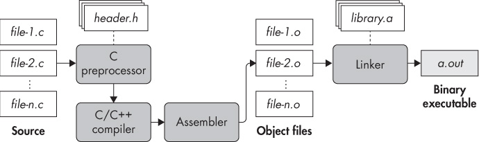
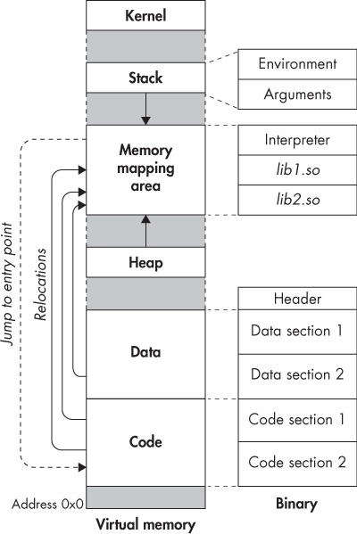

## 1 ANATOMY OF A BINARY

Binary analysis is all about analyzing binaries. But what exactly is a binary? This chapter introduces you to the general anatomy of binary formats and the binary life cycle. After reading this chapter, you’ll be ready to tackle the next two chapters on ELF and PE binaries, two of the most widely used binary formats on Linux and Windows systems.

Modern computers perform their computations using the binary numerical system, which expresses all numbers as strings of ones and zeros. The machine code that these systems execute is called *binary code*. Every program consists of a collection of binary code (the machine instructions) and data (variables, constants, and the like). To keep track of all the different programs on a given system, you need a way to store all the code and data belonging to each program in a single self-contained file. Because these files contain executable binary programs, they are called *binary executable files*, or simply *binaries*. Analyzing these binaries is the goal of this book.

Before getting into the specifics of binary formats such as ELF and PE, let’s start with a high-level overview of how executable binaries are produced from source. After that, I’ll disassemble a sample binary to give you a solid idea of the code and data contained in binary files. You’ll use what you learn here to explore ELF and PE binaries in Chapters 2 and 3, and you’ll build your own binary loader to parse binaries and open them up for analysis in Chapter 4.

### 1.1 The C Compilation Process

Binaries are produced through *compilation*, which is the process of translating human-readable source code, such as C or C++, into machine code that your processor can execute.^(1) Figure 1-1 shows the steps involved in a typical compilation process for C code (the steps for C++ compilation are similar). Compiling C code involves four phases, one of which (awkwardly enough) is also called *compilation*, just like the full compilation process. The phases are *preprocessing*, *compilation*, *assembly*, and *linking*. In practice, modern compilers often merge some or all of these phases, but for demonstration purposes, I will cover them all separately.



*Figure 1-1: The C compilation process*

#### *1.1.1 The Preprocessing Phase*

The compilation process starts with a number of source files that you want to compile (shown as *file-1.c* through *file-n.c* in Figure 1-1). It’s possible to have just one source file, but large programs are typically composed of many files. Not only does this make the project easier to manage, but it speeds up compilation because if one file changes, you only have to recompile that file rather than all of the code.

C source files contain macros (denoted by `#define`) and `#include` directives. You use the `#include` directives to include *header files* (with the extension *.h*) on which the source file depends. The preprocessing phase expands any `#define` and `#include` directives in the source file so all that’s left is pure C code ready to be compiled.

Let’s make this more concrete by looking at an example. This example uses the `gcc` compiler, which is the default on many Linux distributions (including Ubuntu, the operating system installed on the virtual machine). The results for other compilers, such as `clang` or Visual Studio, would be similar. As mentioned in the Introduction, I’ll compile all code examples in this book (including the current example) into x86-64 code, except where stated otherwise.

Suppose you want to compile a C source file, as shown in Listing 1-1, that prints the ubiquitous “Hello, world!” message to the screen.

*Listing 1-1:* compilation_example.c

```
#include <stdio.h>

#define FORMAT_STRING    "%s"
#define MESSAGE          "Hello, world!\n"

int
main(int argc, char *argv[]) {
  printf(FORMAT_STRING, MESSAGE);
  return 0;
}
```

In a moment, you’ll see what happens with this file in the rest of the compilation process, but for now, we’ll just consider the output of the preprocessing stage. By default, `gcc` will automatically execute all compilation phases, so you have to explicitly tell it to stop after preprocessing and show you the intermediate output. For `gcc`, this can be done using the command `gcc -E -P`, where `-E` tells `gcc` to stop after preprocessing and `-P` causes the compiler to omit debugging information so that the output is a bit cleaner. Listing 1-2 shows the output of the preprocessing stage, edited for brevity. Start the VM and follow along to see the full output of the preprocessor.

*Listing 1-2: Output of the C preprocessor for the “Hello, world!” program*

```
$ gcc -E -P compilation_example.c

typedef long unsigned int size_t;
typedef unsigned char __u_char;
typedef unsigned short int __u_short;
typedef unsigned int __u_int;
typedef unsigned long int __u_long;

/* ... */

extern int sys_nerr;
extern const char *const sys_errlist[];
extern int fileno (FILE *__stream) __attribute__ ((__nothrow__ , __leaf__)) ;
extern int fileno_unlocked (FILE *__stream) __attribute__ ((__nothrow__ , __leaf__)) ;
extern FILE *popen (const char *__command, const char *__modes) ;
extern int pclose (FILE *__stream);
extern char *ctermid (char *__s) __attribute__ ((__nothrow__ , __leaf__));
extern void flockfile (FILE *__stream) __attribute__ ((__nothrow__ , __leaf__));
extern int ftrylockfile (FILE *__stream) __attribute__ ((__nothrow__ , __leaf__)) ;
extern void funlockfile (FILE *__stream) __attribute__ ((__nothrow__ , __leaf__));

int
main(int argc, char *argv[]) {
  printf(➊"%s", ➋"Hello, world!\n");
  return 0;
}
```

The *stdio.h* header is included in its entirety, with all of its type definitions, global variables, and function prototypes “copied in” to the source file. Because this happens for every `#include` directive, preprocessor output can be quite verbose. The preprocessor also fully expands all uses of any macros you defined using `#define`. In the example, this means both arguments to `printf` (`FORMAT_STRING` ➊ and `MESSAGE` ➋) are evaluated and replaced by the constant strings they represent.

#### *1.1.2 The Compilation Phase*

After the preprocessing phase is complete, the source is ready to be compiled. The compilation phase takes the preprocessed code and translates it into assembly language. (Most compilers also perform heavy optimization in this phase, typically configurable as an *optimization level* through command line switches such as options `-O0` through `-O3` in `gcc`. As you’ll see in Chapter 6, the degree of optimization during compilation can have a profound effect on disassembly.)

Why does the compilation phase produce assembly language and not machine code? This design decision doesn’t seem to make sense in the context of just one language (in this case, C), but it does when you think about all the other languages out there. Some examples of popular compiled languages include C, C++, Objective-C, Common Lisp, Delphi, Go, and Haskell, to name a few. Writing a compiler that directly emits machine code for each of these languages would be an extremely demanding and time-consuming task. It’s better to instead emit assembly code (a task that is already challenging enough) and have a single dedicated assembler that can handle the final translation of assembly to machine code for every language.

So, the output of the compilation phase is assembly, in reasonably human-readable form, with symbolic information intact. As mentioned, `gcc` normally calls all compilation phases automatically, so to see the emitted assembly from the compilation stage, you have to tell `gcc` to stop after this stage and store the assembly files to disk. You can do this using the `-S` flag (*.s* is a conventional extension for assembly files). You also pass the option `-masm=intel` to `gcc` so that it emits assembly in Intel syntax rather than the default AT&T syntax. Listing 1-3 shows the output of the compilation phase for the example program.^(2)

*Listing 1-3: Assembly generated by the compilation phase for the “Hello, world!” program*

```
  $ gcc -S -masm=intel compilation_example.c
  $ cat compilation_example.s


          .file    "compilation_example.c"
          .intel_syntax noprefix
          .section       .rodata
➊ .LC0:
          .string        "Hello, world!"
          .text
          .globl  main
          .type   main, @function
➋ main:
  .LFB0:
          .cfi_startproc
          push    rbp
          .cfi_def_cfa_offset 16
          .cfi_offset 6, -16
          mov     rbp, rsp
          .cfi_def_cfa_register 6
          sub      rsp, 16
          mov     DWORD PTR [rbp-4], edi
          mov     QWORD PTR [rbp-16], rsi
          mov     edi, ➌OFFSET FLAT:.LC0
          call    puts
          mov     eax, 0
          leave
          .cfi_def_cfa 7, 8
          ret
          .cfi_endproc
.LFE0:
          .size    main, .-main
          .ident   "GCC: (Ubuntu 5.4.0-6ubuntu1~16.04.4) 5.4.0 20160609"
          .section .note.GNU-stack,"",@progbits
```

For now, I won’t go into detail about the assembly code. What’s interesting to note in Listing 1-3 is that the assembly code is relatively easy to read because the symbols and functions have been preserved. For instance, constants and variables have symbolic names rather than just addresses (even if it’s just an automatically generated name, such as `LC0` ➊ for the nameless “Hello, world!” string), and there’s an explicit label for the `main` function ➋ (the only function in this case). Any references to code and data are also symbolic, such as the reference to the “Hello, world!” string ➌. You’ll have no such luxury when dealing with stripped binaries later in the book!

#### *1.1.3 The Assembly Phase*

In the assembly phase, you finally get to generate some real machine code! The input of the assembly phase is the set of assembly language files generated in the compilation phase, and the output is a set of *object files*, sometimes also referred to as *modules*. Object files contain machine instructions that are in principle executable by the processor. But as I’ll explain in a minute, you need to do some more work before you have a ready-torun binary executable file. Typically, each source file corresponds to one assembly file, and each assembly file corresponds to one object file. To generate an object file, you pass the `-c` flag to `gcc`, as shown in Listing 1-4.

*Listing 1-4: Generating an object file with* *`gcc`*

```
$ gcc -c compilation_example.c
$ file compilation_example.o
compilation_example.o: ELF 64-bit LSB relocatable, x86-64, version 1 (SYSV), not stripped
```

You can use the `file` utility (a handy utility that I’ll return to in Chapter 5) to confirm that the produced file, *compilation_example.o*, is indeed an object file. As you can see in Listing 1-4, this is the case: the file shows up as an `ELF 64-bit LSB relocatable` file.

What exactly does this mean? The first part of the `file` output shows that the file conforms to the ELF specification for binary executables (which I’ll discuss in detail in Chapter 2). More specifically, it’s a 64-bit ELF file (since you’re compiling for x86-64 in this example), and it is *LSB*, meaning that numbers are ordered in memory with their least significant byte first. But most important, you can see that the file is *relocatable*.

Relocatable files don’t rely on being placed at any particular address in memory; rather, they can be moved around at will without this breaking any assumptions in the code. When you see the term *relocatable* in the `file` output, you know you’re dealing with an object file and not with an executable.^(3)

Object files are compiled independently from each other, so the assembler has no way of knowing the memory addresses of other object files when assembling an object file. That’s why object files need to be relocatable; that way, you can link them together in any order to form a complete binary executable. If object files were not relocatable, this would not be possible.

You’ll see the contents of the object file later in this chapter, when you’re ready to disassemble a file for the first time.

#### *1.1.4 The Linking Phase*

The linking phase is the final phase of the compilation process. As the name implies, this phase links together all the object files into a single binary executable. In modern systems, the linking phase sometimes incorporates an additional optimization pass, called *link-time optimization (LTO)*.^(4)

Unsurprisingly, the program that performs the linking phase is called a *linker*, or *link editor*. It’s typically separate from the compiler, which usually implements all the preceding phases.

As I’ve already mentioned, object files are relocatable because they are compiled independently from each other, preventing the compiler from assuming that an object will end up at any particular base address. Moreover, object files may reference functions or variables in other object files or in libraries that are external to the program. Before the linking phase, the addresses at which the referenced code and data will be placed are not yet known, so the object files only contain *relocation symbols* that specify how function and variable references should eventually be resolved. In the context of linking, references that rely on a relocation symbol are called *symbolic references*. When an object file references one of its own functions or variables by absolute address, the reference will also be symbolic.

The linker’s job is to take all the object files belonging to a program and merge them into a single coherent executable, typically intended to be loaded at a particular memory address. Now that the arrangement of all modules in the executable is known, the linker can also resolve most symbolic references. References to libraries may or may not be completely resolved, depending on the type of library.

Static libraries (which on Linux typically have the extension *.a*, as shown in Figure 1-1) are merged into the binary executable, allowing any references to them to be resolved entirely. There are also dynamic (shared) libraries, which are shared in memory among all programs that run on a system. In other words, rather than copying the library into every binary that uses it, dynamic libraries are loaded into memory only once, and any binary that wants to use the library needs to use this shared copy. During the linking phase, the addresses at which dynamic libraries will reside are not yet known, so references to them cannot be resolved. Instead, the linker leaves symbolic references to these libraries even in the final executable, and these references are not resolved until the binary is actually loaded into memory to be executed.

Most compilers, including `gcc`, automatically call the linker at the end of the compilation process. Thus, to produce a complete binary executable, you can simply call `gcc` without any special switches, as shown in Listing 1-5.

*Listing 1-5: Generating a binary executable with* *`gcc`*

```
$ gcc compilation_example.c
$ file a.out
a.out: ➊ELF 64-bit LSB executable, x86-64, version 1 (SYSV), ➋dynamically
linked, ➌interpreter /lib64/ld-linux-x86-64.so.2, for GNU/Linux 2.6.32,
BuildID[sha1]=d0e23ea731bce9de65619cadd58b14ecd8c015c7, ➍not stripped
$ ./a.out
Hello, world!
```

By default, the executable is called *a.out*, but you can override this naming by passing the `-o` switch to `gcc`, followed by a name for the output file. The `file` utility now tells you that you’re dealing with an `ELF 64-bit LSB executable` ➊, rather than a relocatable file as you saw at the end of the assembly phase. Other important information is that the file is dynamically linked ➋, meaning that it uses some libraries that are not merged into the executable but are instead shared among all programs running on the same system. Finally, `interpreter /lib64/ld-linux-x86-64.so.2` ➌ in the `file` output tells you which *dynamic linker* will be used to resolve the final dependencies on dynamic libraries when the executable is loaded into memory to be executed. When you run the binary (using the command `./a.out`), you can see that it produces the expected output (printing “Hello, world!” to standard output), which confirms that you have produced a working binary.

But what’s this bit about the binary not being “stripped” ➍? I’ll discuss that next!

### 1.2 Symbols and Stripped Binaries

High-level source code, such as C code, centers around functions and variables with meaningful, human-readable names. When compiling a program, compilers emit *symbols*, which keep track of such symbolic names and record which binary code and data correspond to each symbol. For instance, function symbols provide a mapping from symbolic, high-level function names to the first address and the size of each function. This information is normally used by the linker when combining object files (for instance, to resolve function and variable references between modules) and also aids debugging.

#### *1.2.1 Viewing Symbolic Information*

To give you an idea of what the symbolic information looks like, Listing 1-6 shows some of the symbols in the example binary.

*Listing 1-6: Symbols in the* *`a.out`* *binary as shown by* *`readelf`*

```
$ ➊readelf --syms a.out

Symbol table '.dynsym' contains 4 entries:
  Num:    Value          Size Type    Bind   Vis      Ndx Name
    0: 0000000000000000     0 NOTYPE  LOCAL  DEFAULT  UND
    1: 0000000000000000     0 FUNC    GLOBAL DEFAULT  UND puts@GLIBC_2.2.5 (2)
    2: 0000000000000000     0 FUNC    GLOBAL DEFAULT  UND __libc_start_main@GLIBC_2.2.5 (2)
    3: 0000000000000000     0 NOTYPE WEAK    DEFAULT  UND __gmon_start__
Symbol table '.symtab' contains 67 entries:
  Num:    Value          Size Type    Bind   Vis      Ndx Name
   ...
   56: 0000000000601030     0 OBJECT  GLOBAL HIDDEN    25 __dso_handle
   57: 00000000004005d0     4 OBJECT  GLOBAL DEFAULT   16 _IO_stdin_used
   58: 0000000000400550   101 FUNC    GLOBAL DEFAULT   14 __libc_csu_init
   59: 0000000000601040     0 NOTYPE  GLOBAL DEFAULT   26 _end
   60: 0000000000400430    42 FUNC    GLOBAL DEFAULT   14 _start
   61: 0000000000601038     0 NOTYPE  GLOBAL DEFAULT   26 __bss_start
   62: 0000000000400526    32 FUNC    GLOBAL DEFAULT   14 ➋main
   63: 0000000000000000     0 NOTYPE  WEAK   DEFAULT  UND _Jv_RegisterClasses
   64: 0000000000601038     0 OBJECT  GLOBAL HIDDEN    25 __TMC_END__
   65: 0000000000000000     0 NOTYPE  WEAK   DEFAULT  UND _ITM_registerTMCloneTable
   66: 00000000004003c8     0 FUNC    GLOBAL DEFAULT   11 _init
```

In Listing 1-6, I’ve used `readelf` to display the symbols ➊. You’ll return to using the `readelf` utility, and interpreting all its output, in Chapter 5. For now, just note that, among many unfamiliar symbols, there’s a symbol for the `main` function ➋. You can see that it specifies the address (`0x400526`) at which `main` will reside when the binary is loaded into memory. The output also shows the code size of `main` (32 bytes) and indicates that you’re dealing with a function symbol (type `FUNC`).

Symbolic information can be emitted as part of the binary (as you’ve seen just now) or in the form of a separate symbol file, and it comes in various flavors. The linker needs only basic symbols, but far more extensive information can be emitted for debugging purposes. Debugging symbols go as far as providing a full mapping between source lines and binary-level instructions, and they even describe function parameters, stack frame information, and more. For ELF binaries, debugging symbols are typically generated in the DWARF format,^(5) while PE binaries usually use the proprietary Microsoft Portable Debugging (PDB) format.^(6) DWARF information is usually embedded within the binary, while PDB comes in the form of a separate symbol file.

As you might imagine, symbolic information is extremely useful for binary analysis. To name just one example, having a set of well-defined function symbols at your disposal makes disassembly much easier because you can use each function symbol as a starting point for disassembly. This makes it much less likely that you’ll accidentally disassemble data as code, for instance (which would lead to bogus instructions in the disassembly output). Knowing which parts of a binary belong to which function, and what the function is called, also makes it much easier for a human reverse engineer to compartmentalize and understand what the code is doing. Even just basic linker symbols (as opposed to more extensive debugging information) are already a tremendous help in many binary analysis applications.

You can parse symbols with `readelf`, as I mentioned above, or programmatically with a library like `libbfd`, as I’ll explain in Chapter 4. There are also libraries like `libdwarf` specifically designed for parsing DWARF debug symbols, but I won’t cover them in this book.

Unfortunately, extensive debugging information typically isn’t included in production-ready binaries, and even basic symbolic information is often stripped to reduce file sizes and prevent reverse engineering, especially in the case of malware or proprietary software. This means that as a binary analyst, you often have to deal with the far more challenging case of stripped binaries without any form of symbolic information. Throughout this book, I therefore assume as little symbolic information as feasible and focus on stripped binaries, except where noted otherwise.

#### *1.2.2 Another Binary Turns to the Dark Side: Stripping a Binary*

You may remember that the example binary is not yet stripped (as shown in the output from the `file` utility in Listing 1-5). Apparently, the default behavior of `gcc` is not to automatically strip newly compiled binaries. In case you’re wondering how binaries with symbols end up stripped, it’s as simple as using a single command, aptly named `strip`, as shown in Listing 1-7.

*Listing 1-7: Stripping an executable*

```
  $ ➊strip --strip-all a.out
  $ file a.out
  a.out: ELF 64-bit LSB executable, x86-64, version 1 (SYSV), dynamically
  linked, interpreter /lib64/ld-linux-x86-64.so.2, for GNU/Linux 2.6.32,
  BuildID[sha1]=d0e23ea731bce9de65619cadd58b14ecd8c015c7, ➋stripped
  $ readelf --syms a.out

➌ Symbol table '.dynsym' contains 4 entries:
     Num:    Value          Size Type    Bind   Vis     Ndx Name
       0: 0000000000000000     0 NOTYPE  LOCAL  DEFAULT UND
       1: 0000000000000000     0 FUNC    GLOBAL DEFAULT UND puts@GLIBC_2.2.5 (2)
       2: 0000000000000000     0 FUNC    GLOBAL DEFAULT UND __libc_start_main@GLIBC_2.2.5 (2)
       3: 0000000000000000     0 NOTYPE  WEAK   DEFAULT UND __gmon_start__
```

Just like that, the example binary is now stripped ➊, as confirmed by the `file` output ➋. Only a few symbols are left in the `.dynsym` symbol table ➌. These are used to resolve dynamic dependencies (such as references to dynamic libraries) when the binary is loaded into memory, but they’re not much use when disassembling. All the other symbols, including the one for the `main` function that you saw in Listing 1-6, have disappeared.

### 1.3 Disassembling a Binary

Now that you’ve seen how to compile a binary, let’s take a look at the contents of the object file produced in the assembly phase of compilation. After that, I’ll disassemble the main binary executable to show you how its contents differ from those of the object file. This way, you’ll get a clearer understanding of what’s in an object file and what’s added during the linking phase.

#### *1.3.1 Looking Inside an Object File*

For now, I’ll use the `objdump` utility to show how to do all the disassembling (I’ll discuss other disassembly tools in Chapter 6). It’s a simple, easy-to-use disassembler included with most Linux distributions, and it’s perfect to get a quick idea of the code and data contained in a binary. Listing 1-8 shows the disassembled version of the example object file, *compilation_example.o*.

*Listing 1-8: Disassembling an object file*

```
$ ➊objdump -sj .rodata compilation_example.o

compilation_example.o:   file format elf64-x86-64

Contents of section .rodata:
 0000 48656c6c 6f2c2077 6f726c64 2100    Hello, world!.

$ ➋objdump -M intel -d compilation_example.o

compilation_example.o:   file format elf64-x86-64

Disassembly of section .text:

0000000000000000 ➌<main>:
   0:  55                     push   rbp
   1:  48 89 e5               mov    rbp,rsp
   4:  48 83 ec 10            sub    rsp,0x10
   8:  89 7d fc               mov    DWORD PTR [rbp-0x4],edi
   b:  48 89 75 f0            mov    QWORD PTR [rbp-0x10],rsi
   f:  bf 00 00 00 00         mov    edi,➍0x0
  14:  e8 00 00 00 00       ➎call   19 <main+0x19>
  19:  b8 00 00 00 00         mov    eax,0x0
  1e:  c9                     leave
  1f:  c3                     ret
```

If you look carefully at Listing 1-8, you’ll see I’ve called `objdump` twice. First, at ➊, I tell `objdump` to show the contents of the `.rodata` section. This stands for “read-only data,” and it’s the part of the binary where all constants are stored, including the “Hello, world!” string. I’ll return to a more detailed discussion of `.rodata` and other sections in ELF binaries in Chapter 2, which covers the ELF binary format. For now, notice that the contents of `.rodata` consist of an ASCII encoding of the string, shown on the left side of the output. On the right side, you can see the human-readable representation of those same bytes.

The second call to `objdump` at ➋ disassembles all the code in the object file in Intel syntax. As you can see, it contains only the code of the `main` function ➌ because that’s the only function defined in the source file. For the most part, the output conforms pretty closely to the assembly code previously produced by the compilation phase (give or take a few assembly-level macros). What’s interesting to note is that the pointer to the “Hello, world!” string (at ➍) is set to zero. The subsequent call ➎ that should print the string to the screen using `puts` also points to a nonsensical location (offset 19, in the middle of `main`).

Why does the call that should reference `puts` point instead into the middle of `main`? I previously mentioned that data and code references from object files are not yet fully resolved because the compiler doesn’t know at what base address the file will eventually be loaded. That’s why the call to `puts` is not yet correctly resolved in the object file. The object file is waiting for the linker to fill in the correct value for this reference. You can confirm this by asking `readelf` to show you all the relocation symbols present in the object file, as shown in Listing 1-9.

*Listing 1-9: Relocation symbols as shown by* *`readelf`*

```
   $ readelf --relocs compilation_example.o

   Relocation section '.rela.text' at offset 0x210 contains 2 entries:
      Offset             Info         Type            Sym. Value    Sym. Name + Addend
➊ 000000000010      00050000000a R_X86_64_32     0000000000000000    .rodata + 0
➋ 000000000015      000a00000002 R_X86_64_PC32   0000000000000000    puts - 4
   ...
```

The relocation symbol at ➊ tells the linker that it should resolve the reference to the string to point to whatever address it ends up at in the `.rodata` section. Similarly, the line marked ➋ tells the linker how to resolve the call to `puts`.

You may notice the value 4 being subtracted from the `puts` symbol. You can ignore that for now; the way the linker computes relocations is a bit involved, and the `readelf` output can be confusing, so I’ll just gloss over the details of relocation here and focus on the bigger picture of disassembling a binary instead. I’ll provide more information about relocation symbols in Chapter 2.

The leftmost column of each line in the `readelf` output (shaded) in Listing 1-9 is the offset in the object file where the resolved reference must be filled in. If you’re paying close attention, you may have noticed that in both cases, it’s equal to the offset of the instruction that needs to be fixed, plus 1. For instance, the call to `puts` is at code offset `0x14` in the `objdump` output, but the relocation symbol points to offset `0x15` instead. This is because you only want to overwrite the *operand* of the instruction, not the *opcode* of the instruction. It just so happens that for both instructions that need fixing up, the opcode is 1 byte long, so to point to the instruction’s operand, the relocation symbol needs to skip past the opcode byte.

#### *1.3.2 Examining a Complete Binary Executable*

Now that you’ve seen the innards of an object file, it’s time to disassemble a complete binary. Let’s start with an example binary with symbols and then move on to the stripped equivalent to see the difference in disassembly output. There is a big difference between disassembling an object file and a binary executable, as you can see in the `objdump` output in Listing 1-10.

*Listing 1-10: Disassembling an executable with* *`objdump`*

```
$ objdump -M intel -d a.out

a.out:       file format elf64-x86-64

Disassembly   of section ➊.init:

00000000004003c8 <_init>:
  4003c8:  48 83 ec 08             sub    rsp,0x8
  4003cc:  48 8b 05 25 0c 20 00    mov    rax,QWORD PTR [rip+0x200c25]
  4003d3:  48 85 c0                test   rax,rax
  4003d6:  74 05                   je     4003dd <_init+0x15>
  4003d8:  e8 43 00 00 00          call   400420 <__libc_start_main@plt+0x10>
  4003dd:  48 83 c4 08             add    rsp,0x8
  4003e1:  c3                      ret

Disassembly of section ➋.plt:

00000000004003f0 <puts@plt-0x10>:
  4003f0: ff 35 12 0c 20 00        push   QWORD PTR [rip+0x200c12]
  4003f6: ff 25  14 0c 20 00       jmp    QWORD PTR [rip+0x200c14]
  4003fc: 0f 1f  40 00             nop    DWORD PTR [rax+0x0]

0000000000400400 <puts@plt>:
  400400:  ff 25 12 0c 20 00       jmp    QWORD PTR [rip+0x200c12]
  400406:  68 00 00 00 00          push   0x0
  40040b:  e9 e0 ff ff ff          jmp    4003f0 <_init+0x28>

...

Disassembly of section ➌.text:

0000000000400430 <_start>:

  400430:   31 ed                  xor    ebp,ebp
  400432:   49 89 d1               mov    r9,rdx
  400435:   5e                     pop    rsi
  400436:   48 89 e2               mov    rdx,rsp
  400439:   48 83 e4 f0            and    rsp,0xfffffffffffffff0
  40043d:   50                     push   rax
  40043e:   54                     push   rsp
  40043f:   49 c7 c0 c0 05 40 00   mov    r8,0x4005c0
  400446:   48 c7 c1 50 05 40 00   mov    rcx,0x400550
  40044d:   48 c7 c7 26 05 40 00   mov    rdi,0x400526
  400454:   e8 b7 ff ff ff         call   400410 <__libc_start_main@plt>
  400459:   f4                     hlt
  40045a:   66 0f 1f 44 00 00      nop    WORD PTR [rax+rax*1+0x0]

0000000000400460 <deregister_tm_clones>:
...

0000000000400526 ➍<main>:
  400526:  55                      push   rbp
  400527:  48 89 e5                mov    rbp,rsp
  40052a:  48 83 ec 10             sub    rsp,0x10
  40052e:  89 7d fc                mov    DWORD PTR [rbp-0x4],edi
  400531:  48 89 75 f0             mov    QWORD PTR [rbp-0x10],rsi
  400535:  bf d4 05 40 00          mov    edi,0x4005d4
  40053a:  e8 c1 fe ff ff          call   400400 ➎<puts@plt>
  40053f:  b8 00 00 00 00          mov    eax,0x0
  400544:  c9                      leave
  400545:  c3                      ret
  400546:  66 2e 0f 1f 84 00 00    nop    WORD PTR cs:[rax+rax*1+0x0]
  40054d:  00 00 00

0000000000400550 <__libc_csu_init>:
...

Disassembly of section .fini:

00000000004005c4 <_fini>:
  4005c4:  48 83 ec 08             sub   rsp,0x8
  4005c8:  48 83 c4 08             add   rsp,0x8
  4005cc:  c3                      ret
```

You can see that the binary has a lot more code than the object file. It’s no longer just the `main` function or even just a single code section. There are multiple sections now, with names like `.init` ➊, `.plt` ➋, and `.text` ➌. These sections all contain code serving different functions, such as program initialization or stubs for calling shared libraries.

The `.text` section is the main code section, and it contains the `main` function ➍. It also contains a number of other functions, such as `_start`, that are responsible for tasks such as setting up the command line arguments and runtime environment for `main` and cleaning up after `main`. These extra functions are standard functions, present in any ELF binary produced by `gcc`.

You can also see that the previously incomplete code and data references have now been resolved by the linker. For instance, the call to `puts` ➎ now points to the proper stub (in the `.plt` section) for the shared library that contains `puts`. (I’ll explain the workings of PLT stubs in Chapter 2.)

So, the full binary executable contains significantly more code (and data, though I haven’t shown it) than the corresponding object file. But so far, the output isn’t much more difficult to interpret. That changes when the binary is stripped, as shown in Listing 1-11, which uses `objdump` to disassemble the stripped version of the example binary.

*Listing 1-11: Disassembling a stripped executable with* *`objdump`*

```
  $ objdump -M intel -d ./a.out.stripped

  ./a.out.stripped:        file format elf64-x86-64

  Disassembly of section ➊.init:

  00000000004003c8 <.init>:
    4003c8:  48 83 ec 08             sub    rsp,0x8
    4003cc:  48 8b 05 25 0c 20 00    mov    rax,QWORD PTR [rip+0x200c25]
    4003d3:  48 85 c0                test   rax,rax
    4003d6:  74 05                   je     4003dd <puts@plt-0x23>
    4003d8:  e8 43 00 00 00          call   400420 <__libc_start_main@plt+0x10>
    4003dd:  48 83 c4 08             add    rsp,0x8
    4003e1:  c3                      ret

  Disassembly of section ➋.plt:
  ...

  Disassembly of section ➌.text:

  0000000000400430   <.text>:
➍  400430: 31 ed                     xor   ebp,ebp
    400432: 49 89    d1               mov   r9,rdx
    400435: 5e                        pop   rsi
    400436: 48 89    e2               mov   rdx,rsp
    400439: 48 83    e4 f0            and   rsp,0xfffffffffffffff0
    40043d: 50                        push  rax
    40043e: 54                        push  rsp
    40043f: 49 c7    c0 c0 05 40 00   mov   r8,0x4005c0
    400446: 48 c7    c1 50 05 40 00   mov   rcx,0x400550
    40044d: 48 c7    c7 26 05 40 00   mov   rdi,0x400526
➎  400454: e8 b7 ff ff ff            call  400410 <__libc_start_main@plt>
    400459: f4                        hlt
    40045a: 66 0f 1f 44 00 00         nop   WORD PTR [rax+rax*1+0x0]
➏  400460: b8 3f 10 60 00            mov   eax,0x60103f
    ...
    400520: 5d                        pop   rbp
    400521: e9   7a ff ff ff          jmp   4004a0 <__libc_start_main@plt+0x90>
➐  400526: 55                        push  rbp
    400527: 48   89   e5              mov   rbp,rsp
    40052a: 48   83   ec   10         sub   rsp,0x10
    40052e: 89   7d   fc              mov   DWORD PTR [rbp-0x4],edi
    400531: 48   89   75   f0         mov   QWORD PTR [rbp-0x10],rsi
    400535: bf   d4   05   40 00      mov   edi,0x4005d4
    40053a: e8   c1   fe   ff ff      call  400400 <puts@plt>
    40053f: b8   00   00   00 00      mov   eax,0x0
    400544: c9                        leave
➑  400545: c3                        ret
    400546: 66   2e 0f 1f 84 00 00    nop   WORD PTR cs:[rax+rax*1+0x0]
    40054d: 00   00 00
    400550: 41   57                   push  r15
    400552: 41   56                   push  r14
    ...

  Disassembly of section .fini:

  00000000004005c4 <.fini>:
    4005c4: 48 83 ec 08               sub   rsp,0x8
    4005c8: 48 83 c4 08               add   rsp,0x8
    4005cc: c3                        ret
```

The main takeaway from Listing 1-11 is that while the different sections are still clearly distinguishable (marked ➊, ➋, and ➌), the functions are not. Instead, all functions have been merged into one big blob of code. The `_start` function begins at ➍, and `deregister_tm_clones` begins at ➏. The `main` function starts at ➐ and ends at ➑, but in all of these cases, there’s nothing special to indicate that the instructions at these markers represent function starts. The only exceptions are the functions in the `.plt` section, which still have their names as before (as you can see in the call to `__libc_start_main` at ➎). Other than that, you’re on your own to try to make sense of the disassembly output.

Even in this simple example, things are already confusing; imagine trying to make sense of a larger binary containing hundreds of different functions all fused together! This is exactly why accurate automated function detection is so important in many areas of binary analysis, as I’ll discuss in detail in Chapter 6.

### 1.4 Loading and Executing a Binary

Now you know how compilation works as well as how binaries look on the inside. You also learned how to statically disassemble binaries using `objdump`. If you’ve been following along, you should even have your own shiny new binary sitting on your hard drive. Now you’ll learn what happens when you load and execute a binary, which will be helpful when I discuss dynamic analysis concepts in later chapters.

Although the exact details vary depending on the platform and binary format, the process of loading and executing a binary typically involves a number of basic steps. Figure 1-2 shows how a loaded ELF binary (like the one just compiled) is represented in memory on a Linux-based platform. At a high level, loading a PE binary on Windows is quite similar.



*Figure 1-2: Loading an ELF binary on a Linux-based system*

Loading a binary is a complicated process that involves a lot of work by the operating system. It’s also important to note that a binary’s representation in memory does not necessarily correspond one-to-one with its on-disk representation. For instance, large regions of zero-initialized data may be collapsed in the on-disk binary (to save disk space), while all those zeros will be expanded in memory. Some parts of the on-disk binary may be ordered differently in memory or not loaded into memory at all. Because the details depend on the binary format, I defer the topic of on-disk versus in-memory binary representations to Chapter 2 (on the ELF format) and Chapter 3 (on the PE format). For now, let’s stick to a high-level overview of what happens during the loading process.

When you decide to run a binary, the operating system starts by setting up a new process for the program to run in, including a virtual address space.^(7) Subsequently, the operating system maps an *interpreter* into the process’s virtual memory. This is a user space program that knows how to load the binary and perform the necessary relocations. On Linux, the interpreter is typically a shared library called *ld-linux.so*. On Windows, the interpreter functionality is implemented as part of *ntdll.dll*. After loading the interpreter, the kernel transfers control to it, and the interpreter begins its work in user space.

Linux ELF binaries come with a special section called `.interp` that specifies the path to the interpreter that is to be used to load the binary, as you can see with `readelf`, as shown in Listing 1-12.

*Listing 1-12: Contents of the* *`.interp`* *section*

```
$ readelf -p .interp a.out

String dump of section '.interp':
  [     0] /lib64/ld-linux-x86-64.so.2
```

As mentioned, the interpreter loads the binary into its virtual address space (the same space in which the interpreter is loaded). It then parses the binary to find out (among other things) which dynamic libraries the binary uses. The interpreter maps these into the virtual address space (using `mmap` or an equivalent function) and then performs any necessary last-minute relocations in the binary’s code sections to fill in the correct addresses for references to the dynamic libraries. In reality, the process of resolving references to functions in dynamic libraries is often deferred until later. In other words, instead of resolving these references immediately at load time, the interpreter resolves references only when they are invoked for the first time. This is known as *lazy binding*, which I’ll explain in more detail in Chapter 2. After relocation is complete, the interpreter looks up the entry point of the binary and transfers control to it, beginning normal execution of the binary.

### 1.5 Summary

Now that you’re familiar with the general anatomy and life cycle of a binary, it’s time to dive into the details of a specific binary format. Let’s start with the widespread ELF format, which is the subject of the next chapter.

Exercises

1\. Locating Functions

Write a C program that contains several functions and compile it into an assembly file, an object file, and an executable binary, respectively. Try to locate the functions you wrote in the assembly file and in the disassembled object file and executable. Can you see the correspondence between the C code and the assembly code? Finally, strip the executable and try to identify the functions again.

2\. Sections

As you’ve seen, ELF binaries (and other types of binaries) are divided into sections. Some sections contain code, and others contain data. Why do you think the distinction between code and data sections exists? How do you think the loading process differs for code and data sections? Is it necessary to copy all sections into memory when a binary is loaded for execution?