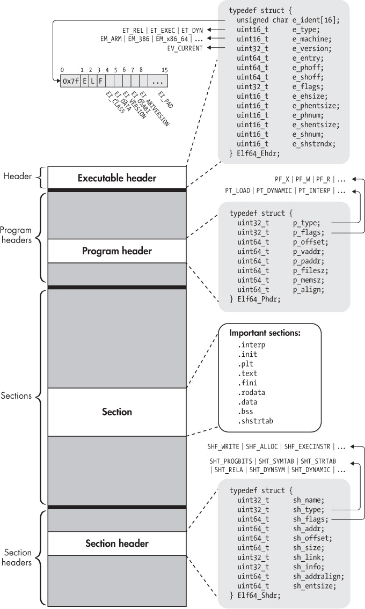
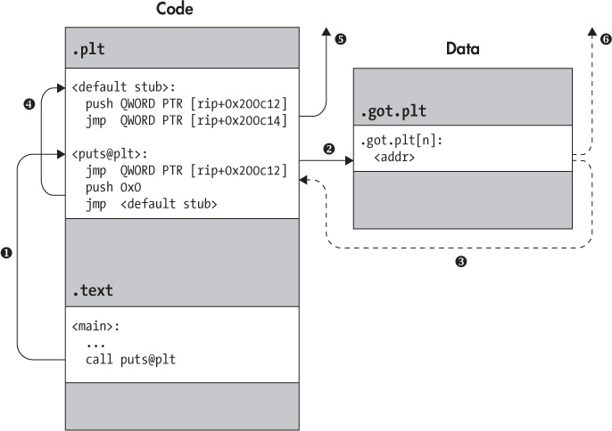

## 2 THE ELF FORMAT

Now that you have a high-level idea of what binaries look like and how they work, you’re ready to dive into a real binary format. In this chapter, you’ll investigate the Executable and Linkable Format (ELF), which is the default binary format on Linux-based systems and the one you’ll be working with in this book.

ELF is used for executable files, object files, shared libraries, and core dumps. I’ll focus on ELF executables here, but the same concepts apply to other ELF file types. Because you will deal mostly with 64-bit binaries in this book, I’ll center the discussion around 64-bit ELF files. However, the 32-bit format is similar, differing mainly in the size and order of certain header fields and other data structures. You shouldn’t have any trouble generalizing the concepts discussed here to 32-bit ELF binaries.

Figure 2-1 illustrates the format and contents of a typical 64-bit ELF executable. When you first start analyzing ELF binaries in detail, all the intricacies involved may seem overwhelming. But in essence, ELF binaries really consist of only four types of components: an *executable header*, a series of (optional) *program headers*, a number of *sections*, and a series of (optional) *section headers*, one per section. I’ll discuss each of these components next.



*Figure 2-1: A 64-bit ELF binary at a glance*

As you can see in Figure 2-1, the executable header comes first in standard ELF binaries, the program headers come next, and the sections and section headers come last. To make the following discussion easier to follow, I’ll use a slightly different order and discuss sections and section headers before program headers. Let’s start with the executable header.

### 2.1 The Executable Header

Every ELF file starts with an *executable header*, which is just a structured series of bytes telling you that it’s an ELF file, what kind of ELF file it is, and where in the file to find all the other contents. To find out what the format of the executable header is, you can look up its type definition (and the definitions of other ELF-related types and constants) in */usr/include/elf.h* or in the ELF specification.^(1) Listing 2-1 shows the type definition for the 64-bit ELF executable header.

*Listing 2-1: Definition of* ELF64_Ehdr *in* /usr/include/elf.h

```
typedef struct {
  unsigned char e_ident[16];   /* Magic number and other info       */
  uint16_t     e_type;         /* Object file type                  */
  uint16_t     e_machine;      /* Architecture                      */
  uint32_t     e_version;      /* Object file version               */
  uint64_t     e_entry;        /* Entry point virtual address       */
  uint64_t     e_phoff;        /* Program header table file offset  */
  uint64_t     e_shoff;        /* Section header table file offset  */
  uint32_t     e_flags;        /* Processor-specific flags          */
  uint16_t     e_ehsize;       /* ELF header size in bytes          */
  uint16_t     e_phentsize;    /* Program header table entry size   */
  uint16_t     e_phnum;        /* Program header table entry count  */
  uint16_t     e_shentsize;    /* Section header table entry size   */
  uint16_t     e_shnum;        /* Section header table entry count  */
  uint16_t     e_shstrndx;     /* Section header string table index */
} Elf64_Ehdr;
```

The executable header is represented here as a C `struct` called `Elf64 _Ehdr`. If you look it up in */usr/include/elf.h*, you may notice that the `struct` definition given there contains types such as `Elf64_Half` and `Elf64_Word`. These are just `typedef`s for integer types such as `uint16_t` and `uint32_t`. For simplicity, I’ve expanded all the `typedef`s in Figure 2-1 and Listing 2-1.

#### *2.1.1 The e_ident Array*

The executable header (and the ELF file) starts with a 16-byte array called `e_ident`. The `e_ident` array always starts with a 4-byte “magic value” identifying the file as an ELF binary. The magic value consists of the hexadecimal number `0x7f`, followed by the ASCII character codes for the letters *E*, *L*, and *F*. Having these bytes right at the start is convenient because it allows tools such as `file`, as well as specialized tools such as the binary loader, to quickly discover that they’re dealing with an ELF file.

Following the magic value, there are a number of bytes that give more detailed information about the specifics of the type of ELF file. In *elf.h*, the indexes for these bytes (indexes 4 through 15 in the `e_ident` array) are symbolically referred to as `EI_CLASS`, `EI_DATA`, `EI_VERSION`, `EI_OSABI`, `EI_ABIVERSION`, and `EI_PAD`, respectively. Figure 2-1 shows a visual representation of them.

The `EI_PAD` field actually contains multiple bytes, namely, indexes 9 through 15 in `e_ident`. All of these bytes are currently designated as padding; they are reserved for possible future use but currently set to zero.

The `EI_CLASS` byte denotes what the ELF specification refers to as the binary’s “class.” This is a bit of a misnomer since the word *class* is so generic, it could mean almost anything. What the byte really denotes is whether the binary is for a 32-bit or 64-bit architecture. In the former case, the `EI_CLASS` byte is set to the constant `ELFCLASS32` (which is equal to 1), while in the latter case, it’s set to `ELFCLASS64` (equal to 2).

Related to the architecture’s bit width is the *endianness* of the architecture. In other words, are multibyte values (such as integers) ordered in memory with the least significant byte first (*little-endian*) or the most significant byte first (*big-endian*)? The `EI_DATA` byte indicates the endianness of the binary. A value of `ELFDATA2LSB` (equal to 1) indicates little-endian, while `ELFDATA2MSB` (equal to 2) means big-endian.

The next byte, called `EI_VERSION`, indicates the version of the ELF specification used when creating the binary. Currently, the only valid value is `EV_CURRENT`, which is defined to be equal to 1.

Finally, the `EI_OSABI` and `EI_ABIVERSION` bytes denote information regarding the application binary interface (ABI) and operating system (OS) for which the binary was compiled. If the `EI_OSABI` byte is set to nonzero, it means that some ABI- or OS-specific extensions are used in the ELF file; this can change the meaning of some other fields in the binary or can signal the presence of nonstandard sections. The default value of zero indicates that the binary targets the UNIX System V ABI. The `EI_ABIVERSION` byte denotes the specific version of the ABI indicated in the `EI_OSABI` byte that the binary targets. You’ll usually see this set to zero because it’s not necessary to specify any version information when the default `EI_OSABI` is used.

You can inspect the `e_ident` array of any ELF binary by using `readelf` to view the binary’s header. For instance, Listing 2-2 shows the output for the `compilation_example` binary from Chapter 1 (I’ll also refer to this output when discussing the other fields in the executable header).

*Listing 2-2: Executable header as shown by* readelf

```
  $ readelf -h a.out
  ELF Header:
➊ Magic:     7f 45 4c 46 02 01 01 00 00 00 00 00 00 00 00 00
➋ Class:                               ELF64
   Data:                                2's complement, little endian
   Version:                             1 (current)
   OS/ABI:                              UNIX - System V
   ABI Version:                         0
➌ Type:                                EXEC (Executable file)
➍ Machine:                             Advanced Micro Devices X86-64
➎ Version:                             0x1
➏ Entry point address:                 0x400430
➐ Start of program headers:            64 (bytes into file)
   Start of section headers:            6632 (bytes into file)
   Flags:                               0x0
➑ Size of this header:                 64 (bytes)
➒ Size of program headers:             56 (bytes)
   Number of program headers:           9
   Size of section headers:             64 (bytes)
   Number of section headers:           31
➓ Section header string table index:   28
```

In Listing 2-2, the `e_ident` array is shown on the line marked `Magic` ➊. It starts with the familiar four magic bytes, followed by a value of 2 (indicating `ELFCLASS64`), then a 1 (`ELFDATA2LSB`), and finally another 1 (`EV_CURRENT`). The remaining bytes are all zeroed out since the `EI_OSABI` and `EI_ABIVERSION` bytes are at their default values; the padding bytes are all set to zero as well. The information contained in some of the bytes is explicitly repeated on dedicated lines, marked `Class`, `Data`, `Version`, `OS/ABI`, and `ABI Version`, respectively ➋.

#### *2.1.2 The e_type, e_machine, and e_version Fields*

After the `e_ident` array comes a series of multibyte integer fields. The first of these, called `e_type`, specifies the type of the binary. The most common values you’ll encounter here are `ET_REL` (indicating a relocatable object file), `ET_EXEC` (an executable binary), and `ET_DYN` (a dynamic library, also called a shared object file). In the `readelf` output for the example binary, you can see you’re dealing with an executable file (`Type: EXEC` ➌ in Listing 2-2).

Next comes the `e_machine` field, which denotes the architecture that the binary is intended to run on ➍. For this book, this will usually be set to `EM_X86_64` (as it is in the `readelf` output) since you will mostly be working on 64-bit x86 binaries. Other values you’re likely to encounter include `EM_386` (32-bit x86) and `EM_ARM` (for ARM binaries).

The `e_version` field serves the same role as the `EI_VERSION` byte in the `e_ident` array; specifically, it indicates the version of the ELF specification that was used when creating the binary. As this field is 32 bits wide, you might think there are numerous possible values, but in reality, the only possible value is 1 (`EV_CURRENT`) to indicate version 1 of the specification ➎.

#### *2.1.3 The e_entry Field*

The `e_entry` field denotes the *entry point* of the binary; this is the virtual address at which execution should start (see also Section 1.4). For the example binary, execution starts at address `0x400430` (marked ➏ in the `readelf` output in Listing 2-2). This is where the interpreter (typically *ld-linux.so*) will transfer control after it finishes loading the binary into virtual memory. The entry point is also a useful starting point for recursive disassembly, as I’ll discuss in Chapter 6.

#### *2.1.4 The e_phoff and e_shoff Fields*

As shown in Figure 2-1, ELF binaries contain tables of program headers and section headers, among other things. I’ll revisit the meaning of these header types after I finish discussing the executable header, but one thing I can already reveal is that the program header and section header tables need not be located at any particular offset in the binary file. The only data structure that can be assumed to be at a fixed location in an ELF binary is the executable header, which is always at the beginning.

How can you know where to find the program headers and section headers? For this, the executable header contains two dedicated fields, called `e_phoff` and `e_shoff`, that indicate the file offsets to the beginning of the program header table and the section header table. For the example binary, the offsets are 64 and 6632 bytes, respectively (the two lines at ➐ in Listing 2-2). The offsets can also be set to zero to indicate that the file does not contain a program header or section header table. It’s important to note here that these fields are *file offsets*, meaning the number of bytes you should read into the file to get to the headers. In other words, in contrast to the `e_entry` field discussed earlier, `e_phoff` and `e_shoff` are *not* virtual addresses.

#### *2.1.5 The e_flags Field*

The `e_flags` field provides room for flags specific to the architecture for which the binary is compiled. For instance, ARM binaries intended to run on embedded platforms can set ARM-specific flags in the `e_flags` field to indicate additional details about the interface they expect from the embedded operating system (file format conventions, stack organization, and so on). For x86 binaries, `e_flags` is typically set to zero and thus not of interest.

#### *2.1.6 The e_ehsize Field*

The `e_ehsize` field specifies the size of the executable header, in bytes. For 64-bit x86 binaries, the executable header size is always 64 bytes, as you can see in the `readelf` output, while it’s 52 bytes for 32-bit x86 binaries (see ➑ in Listing 2-2).

#### *2.1.7 The e\_\*entsize and e\_\*num Fields*

As you now know, the `e_phoff` and `e_shoff` fields point to the file offsets where the program header and section header tables begin. But for the linker or loader (or another program handling an ELF binary) to actually traverse these tables, additional information is needed. Specifically, they need to know the size of the individual program or section headers in the tables, as well as the number of headers in each table. This information is provided by the `e_phentsize` and `e_phnum` fields for the program header table and by the `e_shentsize` and `e_shnum` fields for the section header table. In the example binary in Listing 2-2, there are nine program headers of 56 bytes each, and there are 31 section headers of 64 bytes each ➒.

#### *2.1.8 The e_shstrndx Field*

The `e_shstrndx` field contains the index (in the section header table) of the header associated with a special *string table* section, called `.shstrtab`. This is a dedicated section that contains a table of null-terminated ASCII strings, which store the names of all the sections in the binary. It is used by ELF processing tools such as `readelf` to correctly show the names of sections. I’ll describe `.shstrtab` (and other sections) later in this chapter.

In the example binary in Listing 2-2, the section header for `.shstrtab` has index 28 ➓. You can view the contents of the `.shstrtab` section (as a hexadecimal dump) using `readelf`, as shown in Listing 2-3.

*Listing 2-3: The* .shstrtab *section as shown by* readelf

```
$ readelf -x .shstrtab a.out

Hex dump of section '.shstrtab':
  0x00000000 002e7379 6d746162 002e7374 72746162 ➊..symtab..strtab
  0x00000010 002e7368 73747274 6162002e 696e7465 ..shstrtab..inte
  0x00000020 7270002e 6e6f7465 2e414249 2d746167 rp..note.ABI-tag
  0x00000030 002e6e6f 74652e67 6e752e62 75696c64 ..note.gnu.build
  0x00000040 2d696400 2e676e75 2e686173 68002e64 -id..gnu.hash..d
  0x00000050 796e7379 6d002e64 796e7374 72002e67 ynsym..dynstr..g
  0x00000060 6e752e76 65727369 6f6e002e 676e752e nu.version..gnu.
  0x00000070 76657273 696f6e5f 72002e72 656c612e version_r..rela.
  0x00000080 64796e00 2e72656c 612e706c 74002e69 dyn..rela.plt..i
  0x00000090 6e697400 2e706c74 2e676f74 002e7465 nit..plt.got..te
  0x000000a0 7874002e 66696e69 002e726f 64617461 xt..fini..rodata
  0x000000b0 002e6568 5f667261 6d655f68 6472002e ..eh_frame_hdr..
  0x000000c0 65685f66 72616d65 002e696e 69745f61 eh_frame..init_a
  0x000000d0 72726179 002e6669 6e695f61 72726179 rray..fini_array
  0x000000e0 002e6a63 72002e64 796e616d 6963002e ..jcr..dynamic..
  0x000000f0 676f742e 706c7400 2e646174 61002e62 got.plt..data..b
  0x00000100 7373002e 636f6d6d 656e7400          ss..comment.
```

You can see the section names (such as `.symtab`, `.strtab`, and so on) contained in the string table at the right side of Listing 2-3 ➊. Now that you’re familiar with the format and contents of the ELF executable header, let’s move on to the section headers.

### 2.2 Section Headers

The code and data in an ELF binary are logically divided into contiguous nonoverlapping chunks called *sections*. Sections don’t have any predetermined structure; instead, the structure of each section varies depending on the contents. In fact, a section may not even have any particular structure at all; often a section is nothing more than an unstructured blob of code or data. Every section is described by a *section header*, which denotes the properties of the section and allows you to locate the bytes belonging to the section. The section headers for all sections in the binary are contained in the *section header table*.

Strictly speaking, the division into sections is intended to provide a convenient organization for use by the linker (of course, sections can also be parsed by other tools, such as static binary analysis tools). This means that not every section is actually needed when setting up a process and virtual memory to execute the binary. Some sections contain data that isn’t needed for execution at all, such as symbolic or relocation information.

Because sections are intended to provide a view for the linker only, the section header table is an optional part of the ELF format. ELF files that don’t need linking aren’t required to have a section header table. If no section header table is present, the `e_shoff` field in the executable header is set to zero.

To load and execute a binary in a process, you need a different organization of the code and data in the binary. For this reason, ELF executables specify another logical organization, called *segments*, which are used at execution time (as opposed to sections, which are used at link time). I’ll cover segments later in this chapter when I talk about program headers. For now, let’s focus on sections, but keep in mind that the logical organization I discuss here exists only at link time (or when used by a static analysis tool) and not at runtime.

Let’s begin by discussing the format of the section headers. After that, we’ll take a look at the contents of the sections. Listing 2-4 shows the format of an ELF section header as specified in */usr/include/elf.h*.

*Listing 2-4: Definition of* Elf64_Shdr *in* /usr/include/elf.h

```
typedef struct {
  uint32_t  sh_name;       /* Section name (string tbl index)   */
  uint32_t  sh_type;       /* Section type                      */
  uint64_t  sh_flags;      /* Section flags                     */
  uint64_t  sh_addr;       /* Section virtual addr at execution */
  uint64_t  sh_offset;     /* Section file offset               */
  uint64_t  sh_size;       /* Section size in bytes             */
  uint32_t  sh_link;       /* Link to another section           */
  uint32_t  sh_info;       /* Additional section information    */
  uint64_t  sh_addralign;  /* Section alignment                 */
  uint64_t  sh_entsize;    /* Entry size if section holds table */
} Elf64_Shdr;
```

#### *2.2.1 The sh_name Field*

As you can see in Listing 2-4, the first field in a section header is called `sh_name`. If set, it contains an index into the *string table*. If the index is zero, it means the section doesn’t have a name.

In Section 2.1, I discussed a special section called `.shstrtab`, which contains an array of `NULL`-terminated strings, one for every section name. The index of the section header describing the string table is given in the `e_shstrndx` field of the executable header. This allows tools like `readelf` to easily find the `.shstrtab` section and then index it with the `sh_name` field of every section header (including the header of `.shstrtab`) to find the string describing the name of the section in question. This allows a human analyst to easily identify the purpose of each section.^(2)

#### *2.2.2 The sh_type Field*

Every section has a type, indicated by an integer field called `sh_type`, that tells the linker something about the structure of a section’s contents. Figure 2-1 shows the most important section types for our purposes. I’ll discuss each of the important section types in turn.

Sections with type `SHT_PROGBITS` contain program data, such as machine instructions or constants. These sections have no particular structure for the linker to parse.

There are also special section types for symbol tables (`SHT_SYMTAB` for static symbol tables and `SHT_DYNSYM` for symbol tables used by the dynamic linker) and string tables (`SHT_STRTAB`). Symbol tables contain symbols in a well-defined format (`struct Elf64_Sym` in *elf.h* if you’re interested), which describes the symbolic name and type for particular file offsets or addresses,among other things. The static symbol table may not be present if the binary is stripped, for example. String tables, as discussed, simply contain an array of `NULL`-terminated strings, with the first byte in the string table set to `NULL` by convention.

Sections with type `SHT_REL` or `SHT_RELA` are particularly important for the linker because they contain relocation entries in a well-defined format (`struct Elf64_Rel` and `struct Elf64_Rela` in *elf.h*), which the linker can parse to perform the necessary relocations in other sections. Each relocation entry tells the linker about a particular location in the binary where a relocation is needed and which symbol the relocation should be resolved to. The actual relocation process is quite involved, and I won’t go into the details right now. The important takeaway is that the `SHT_REL` and `SHT_RELA` sections are used for static linking purposes.

Sections of type `SHT_DYNAMIC` contain information needed for dynamic linking. This information is formatted using `struct Elf64_Dyn` as specified in *elf.h*.

#### *2.2.3 The sh_flags Field*

Section flags (specified in the `sh_flags` field) describe additional information about a section. The most important flags for the purposes here are `SHF_WRITE`, `SHF_ALLOC`, and `SHF_EXECINSTR`.

`SHF_WRITE` indicates that the section is writable at runtime. This makes it easy to distinguish between sections that contain static data (such as constants) and those that contain variables. The `SHF_ALLOC` flag indicates that the contents of the section are to be loaded into virtual memory when executing the binary (though the actual loading happens using the segment view of the binary, not the section view). Finally, `SHF_EXECINSTR` tells you that the section contains executable instructions, which is useful to know when disassembling a binary.

#### *2.2.4 The sh_addr, sh_offset, and sh_size Fields*

The `sh_addr`, `sh_offset`, and `sh_size` fields describe the virtual address, file offset (in bytes from the start of the file), and size (in bytes) of the section, respectively. At first glance, a field describing the virtual address of a section, like `sh_addr`, may seem out of place here; after all, I said that sections are used only for linking, not for creating and executing a process. While this is still true, the linker sometimes needs to know at which addresses particular pieces of code and data will end up at runtime to do relocations. The `sh_addr` field provides this information. Sections that aren’t intended to be loaded into virtual memory when setting up the process have an `sh_addr` value of zero.

#### *2.2.5 The sh_link Field*

Sometimes there are relationships between sections that the linker needs to know about. For instance, an `SHT_SYMTAB`, `SHT_DYNSYM`, or `SHT_DYNAMIC` has an associated string table section, which contains the symbolic names for the symbols in question. Similarly, relocation sections (type `SHT_REL` or `SHT_RELA`) are associated with a symbol table describing the symbols involved in the relocations. The `sh_link` field makes these relationships explicit by denoting the index (in the section header table) of the related section.

#### *2.2.6 The sh_info Field*

The `sh_info` field contains additional information about the section. The meaning of the additional information varies depending on the section type. For instance, for relocation sections, `sh_info` denotes the index of the section to which the relocations are to be applied.

#### *2.2.7 The sh_addralign Field*

Some sections may need to be aligned in memory in a particular way for efficiency of memory accesses. For example, a section may need to be loaded at some address that is a multiple of 8 bytes or 16 bytes. These alignment requirements are specified in the `sh_addralign` field. For instance, if this field is set to 16, it means the base address of the section (as chosen by the linker) must be some multiple of 16. The values 0 and 1 are reserved to indicate no special alignment needs.

#### *2.2.8 The sh_entsize Field*

Some sections, such as symbol tables or relocation tables, contain a table of well-defined data structures (such as `Elf64_Sym` or `Elf64_Rela`). For such sections, the `sh_entsize` field indicates the size in bytes of each entry in the table. When the field is unused, it is set to zero.

### 2.3 Sections

Now that you are familiar with the structure of a section header, let’s look at some specific sections found in an ELF binary. Typical ELF files that you’ll find on a GNU/Linux system are organized into a series of standard (or de facto standard) sections. Listing 2-5 shows the `readelf` output with the sections in the example binary.

*Listing 2-5: A listing of sections in the example binary*

```
$ readelf --sections --wide a.out
There are 31 section headers, starting at offset 0x19e8:

Section Headers:
  [Nr] Name             Type             Address          Off    Size   ES  Flg Lk Inf Al
  [ 0]                 ➊NULL             0000000000000000 000000 000000 00      0  0  0
  [ 1] .interp          PROGBITS         0000000000400238 000238 00001c 00     A  0  0  1
  [ 2] .note.ABI-tag    NOTE             0000000000400254 000254 000020 00     A  0  0  4
  [ 3] .note.gnu.build-id NOTE           0000000000400274 000274 000024 00     A  0  0  4
  [ 4] .gnu.hash        GNU_HASH        0000000000400298 000298 00001c 00     A  5  0  8
  [ 5] .dynsym          DYNSYM          00000000004002b8 0002b8 000060 18     A  6  1  8
  [ 6] .dynstr          STRTAB          0000000000400318 000318 00003d 00     A  0  0  1
  [ 7] .gnu.version     VERSYM          0000000000400356 000356 000008 02     A  5  0  2
  [ 8] .gnu.version_r   VERNEED         0000000000400360 000360 000020 00     A  6  1  8
  [ 9] .rela.dyn        RELA            0000000000400380 000380 000018 18     A  5  0  8
  [10] .rela.plt        RELA            0000000000400398 000398 000030 18    AI  5 24  8
  [11] .init            PROGBITS        00000000004003c8 0003c8 00001a 00  ➋AX  0  0  4
  [12] .plt             PROGBITS        00000000004003f0 0003f0 000030 10    AX  0  0 16
  [13] .plt.got         PROGBITS        0000000000400420 000420 000008 00    AX  0  0  8
  [14] .text           ➌PROGBITS        0000000000400430 000430 000192 00  ➍AX  0  0 16
  [15] .fini            PROGBITS        00000000004005c4 0005c4 000009 00    AX  0  0  4
  [16] .rodata          PROGBITS        00000000004005d0 0005d0 000011 00     A  0  0  4
  [17] .eh_frame_hdr    PROGBITS        00000000004005e4 0005e4 000034 00     A  0  0  4
  [18] .eh_frame        PROGBITS        0000000000400618 000618 0000f4 00     A  0  0  8
  [19] .init_array      INIT_ARRAY      0000000000600e10 000e10 000008 00    WA  0  0  8
  [20] .fini_array      FINI_ARRAY      0000000000600e18 000e18 000008 00    WA  0  0  8
  [21] .jcr             PROGBITS        0000000000600e20 000e20 000008 00    WA  0  0  8
  [22] .dynamic         DYNAMIC         0000000000600e28 000e28 0001d0 10    WA  6  0  8
  [23] .got             PROGBITS        0000000000600ff8 000ff8 000008 08    WA  0  0  8
  [24] .got.plt         PROGBITS        0000000000601000 001000 000028 08    WA  0  0  8
  [25] .data            PROGBITS        0000000000601028 001028 000010 00    WA  0  0  8
  [26] .bss             NOBITS          0000000000601038 001038 000008 00    WA  0  0  1
  [27] .comment         PROGBITS        0000000000000000 001038 000034 01    MS  0  0  1
  [28] .shstrtab        STRTAB          0000000000000000 0018da 00010c 00        0  0  1
  [29] .symtab          SYMTAB          0000000000000000 001070 000648 18       30 47  8
  [30] .strtab          STRTAB          0000000000000000 0016b8 000222 00        0  0  1
Key to Flags:
  W (write), A (alloc), X (execute), M (merge), S (strings), l (large)
  I (info), L (link order), G (group), T (TLS), E (exclude), x (unknown)
  O (extra OS processing required) o (OS specific), p (processor specific)
```

For each section, `readelf` shows the relevant basic information, including the index (in the section header table), name, and type of the section. Moreover, you can also see the virtual address, file offset, and size in bytes of the section. For sections containing a table (such as symbol tables and relocation tables), there’s also a column showing the size of each table entry. Finally, `readelf` also shows the relevant flags for each section, as well as the index of the linked section (if any), additional information (specific to the section type), and alignment requirements.

As you can see, the output conforms closely to the structure of a section header. The first entry in the section header table of every ELF file is defined by the ELF standard to be a `NULL` entry. The type of the entry is `SHT_NULL` ➊, and all fields in the section header are zeroed out. This means it has no name and no associated bytes (in other words, it is a section header without an actual section). Let’s now delve a bit deeper into the contents and purpose of the most interesting remaining sections that you’re likely to see in your binary analysis endeavors.^(3)

#### *2.3.1 The .init and .fini Sections*

The `.init` section (index 11 in Listing 2-5) contains executable code that performs initialization tasks and needs to run before any other code in the binary is executed. You can tell that it contains executable code by the `SHF_EXECINSTR` flag, denoted as an `X` by `readelf` (in the `Flg` column) ➋. The system executes the code in the `.init` section before transferring control to the main entry point of the binary. Thus, if you’re familiar with object-oriented programming, you can think of this section as a constructor. The `.fini` section (index 15) is analogous to the `.init` section, except that it runs after the main program completes, essentially functioning as a kind of destructor.

#### *2.3.2 The .text Section*

The `.text` section (index 14) is where the main code of the program resides, so it will frequently be the main focus of your binary analysis or reverse engineering efforts. As you can see in the `readelf` output in Listing 2-5, the `.text` section has type `SHT_PROGBITS` ➌ because it contains user-defined code. Also note the section flags, which indicate that the section is executable but not writable ➍. In general, executable sections should almost never be writable (and vice versa) because that would make it easy for an attacker exploiting a vulnerability to modify the behavior of the program by directly overwriting the code.

Besides the application-specific code compiled from the program’s source, the `.text` section of a typical binary compiled by `gcc` contains a number of standard functions that perform initialization and finalization tasks, such as `_start`, `register_tm_clones`, and `frame_dummy`. For now, the `_start` function is the most important of these standard functions for you. Listing 2-6 shows why (don’t worry about understanding all of the assembly code in the listing; I’ll point out the important parts next).

*Listing 2-6: Disassembly of the standard* \_start *function*

```
  $ objdump -M intel -d a.out
  ...

  Disassembly of section .text:

➊ 0000000000400430 <_start>:
    400430: 31 ed                   xor    ebp,ebp
    400432: 49 89 d1                mov    r9,rdx
    400435: 5e                      pop    rsi
    400436: 48 89 e2                       mov  rdx,rsp
    400439: 48 83 e4 f0                    and  rsp,0xfffffffffffffff0
    40043d: 50                             push rax
    40043e: 54                             push rsp
    40043f: 49 c7 c0 c0 05 40 00    mov    r8,0x4005c0
    400446: 48 c7 c1 50 05 40 00    mov    rcx,0x400550
    40044d: 48 c7 c7 26 05 40 00    mov  ➋rdi,0x400526
    400454: e8 b7 ff ff ff          call   400410 ➌<__libc_start_main@plt>
    400459: f4                      hlt
    40045a: 66 0f 1f 44 00 00       nop    WORD PTR [rax+rax*1+0x0]
  ...

➍ 0000000000400526 <main>:
    400526: 55                             push   rbp
    400527: 48 89 e5                       mov    rbp,rsp
    40052a: 48 83 ec 10                    sub    rsp,0x10
    40052e: 89 7d fc                       mov    DWORD PTR [rbp-0x4],edi
    400531: 48 89 75 f0                    mov    QWORD PTR [rbp-0x10],rsi
    400535: bf d4 05 40 00                 mov    edi,0x4005d4
    40053a: e8 c1 fe ff ff                 call   400400 <puts@plt>
    40053f: b8 00 00 00 00                 mov    eax,0x0
    400544: c9                             leave
    400545: c3                             ret
    400546: 66 2e 0f 1f 84 00 00           nop    WORD PTR cs:[rax+rax*1+0x0]
    40054d: 00 00 00
...
```

When you write a C program, there’s always a `main` function where your program begins. But if you inspect the entry point of the binary, you’ll find that it *doesn’t* point to `main` at address `0x400526` ➍. Instead, it points to address `0x400430`, the beginning of `_start` ➊.

So, how does execution eventually reach `main`? If you look closely, you can see that `_start` contains an instruction at address `0x40044d` that moves the address of `main` into the `rdi` register ➋, which is one of the registers used to pass parameters for function calls on the x64 platform. Then, `_start` calls a function called `__libc_start_main` ➌. It resides in the `.plt` section, which means the function is part of a shared library (I’ll cover this in more detail in Section 2.3.4).

As its name implies, `__libc_start_main` finally calls to the address of `main` to begin execution of the user-defined code.

#### *2.3.3 The .bss, .data, and .rodata Sections*

Because code sections are generally not writable, variables are kept in one or more dedicated sections, which are writable. Constant data is usually also kept in its own section to keep the binary neatly organized, though compilers *do* sometimes output constant data in code sections. (Modern versions of `gcc` and `clang` generally don’t mix code and data, but Visual Studio sometimes does.) As you’ll see in Chapter 6, this can make disassembly considerably more difficult because it’s not always clear which bytes represent instructions and which represent data.

The `.rodata` section, which stands for “read-only data,” is dedicated to storing constant values. Because it stores constant values, `.rodata` is not writable. The default values of initialized variables are stored in the `.data` section, which *is* marked as writable since the values of variables may change at runtime. Finally, the `.bss` section reserves space for uninitialized variables. The name historically stands for “block started by symbol,” referring to the reserving of blocks of memory for (symbolic) variables.

Unlike `.rodata` and `.data`, which have type `SHT_PROGBITS`, the `.bss` section has type `SHT_NOBITS`. This is because `.bss` doesn’t occupy any bytes in the binary as it exists on disk—it’s simply a directive to allocate a properly sized block of memory for uninitialized variables when setting up an execution environment for the binary. Typically, variables that live in `.bss` are zero initialized, and the section is marked as writable.

#### *2.3.4 Lazy Binding and the .plt, .got, and .got.plt Sections*

In Chapter 1, we discussed that when a binary is loaded into a process for execution, the dynamic linker performs last-minute relocations. For instance, it resolves references to functions located in shared libraries, where the load address is not yet known at compile time. I also briefly mentioned that, in reality, many of the relocations are typically not done right away when the binary is loaded but are deferred until the first reference to the unresolved location is actually made. This is known as *lazy binding*.

##### **Lazy Binding and the PLT**

Lazy binding ensures that the dynamic linker never needlessly wastes time on relocations; it only performs those relocations that are truly needed at runtime. On Linux, lazy binding is the default behavior of the dynamic linker. It’s possible to force the linker to perform all relocations right away by exporting an environment variable called `LD_BIND_NOW`,^(4) but this is usually not done unless the application calls for real-time performance guarantees.

Lazy binding in Linux ELF binaries is implemented with the help of two special sections, called the *Procedure Linkage Table* (`.plt`) and the *Global Offset Table* (`.got`). Though the following discussion focuses on lazy binding, the GOT is actually used for more than just that. ELF binaries often contain a separate GOT section called `.got.plt` for use in conjunction with `.plt` in the lazy binding process. The `.got.plt` section is analogous to the regular `.got`, and for your purposes here, you can consider them to be the same (in fact, historically, they were).^(5) Figure 2-2 illustrates the lazy binding process and the role of the PLT and GOT.



*Figure 2-2: Calling a shared library function via the PLT*

As the figure and the `readelf` output in Listing 2-5 show, `.plt` is a code section that contains executable code, just like `.text`, while `.got.plt` is a data section.^(6) The PLT consists entirely of stubs of a well-defined format, dedicated to directing calls from the `.text` section to the appropriate library location. To explore the format of the PLT, let’s look at a disassembly of the `.plt` section from the example binary, as shown in Listing 2-7. (The instruction opcodes have been omitted for brevity.)

*Listing 2-7: Disassembly of a* .plt *section*

```
  $ objdump -M intel --section .plt -d a.out

  a.out:        file format elf64-x86-64

  Disassembly of section .plt:

➊ 00000000004003f0 <puts@plt-0x10>:
   4003f0: push QWORD PTR [rip+0x200c12] # 601008 <_GLOBAL_OFFSET_TABLE_+0x8>
   4003f6: jmp  QWORD PTR [rip+0x200c14] # 601010 <_GLOBAL_OFFSET_TABLE_+0x10>
   4003fc: nop  DWORD PTR [rax+0x0]

➋ 0000000000400400 <puts@plt>:
   400400: jmp  QWORD PTR [rip+0x200c12] # 601018 <_GLOBAL_OFFSET_TABLE_+0x18>
   400406: push ➌0x0
   40040b: jmp  4003f0 <_init+0x28>

➍ 0000000000400410 <__libc_start_main@plt>:
   400410: jmp  QWORD PTR [rip+0x200c0a] # 601020 <_GLOBAL_OFFSET_TABLE_+0x20>
   400416: push ➎0x1
   40041b: jmp  4003f0 <_init+0x28>
```

The format of the PLT is as follows: First, there is a default stub ➊, which I’ll talk about in a second. After that comes a series of function stubs ➋➍, one per library function, all following the same pattern. Also note that for each consecutive function stub, the value pushed onto the stack is incremented ➌➎. This value is an identifier, the use of which I’ll cover shortly. Now let’s explore how PLT stubs like those shown in Listing 2-7 allow you to call a shared library function, as illustrated in Figure 2-2, and how this aids the lazy binding process.

### Dynamically Resolving a Library Function Using the PLT

Let’s say you want to call the `puts` function, which is part of the well-known `libc` library. Instead of calling it directly (which isn’t possible for the aforementioned reasons), you can make a call to the corresponding PLT stub, `puts@plt` (step ➊ in Figure 2-2).

The PLT stub begins with an indirect jump instruction, which jumps to an address stored in the `.got.plt` section (step ➋ in Figure 2-2). Initially, before the lazy binding has happened, this address is simply the address of the next instruction in the function stub, which is a `push` instruction. Thus, the indirect jump simply transfers control to the instruction directly after it (step ➌ in Figure 2-2)! That’s a rather roundabout way of getting to the next instruction, but there’s a good reason for doing it this way, as you’ll now see.

The `push` instruction pushes an integer (in this case, `0x0`) onto the stack. As mentioned, this integer serves as an identifier for the PLT stub in question. Subsequently, the next instruction jumps to the common default stub shared among all PLT function stubs (step ➍ in Figure 2-2). The default stub pushes another identifier (taken from the GOT), identifying the executable itself, and then jumps (indirectly, again through the GOT) to the dynamic linker (step ➎ in Figure 2-2).

Using the identifiers pushed by the PLT stubs, the dynamic linker figures out that it should resolve the address of `puts` and should do so on behalf of the main executable loaded into the process. This last bit is important because there may be multiple libraries loaded in the same process as well, each with their own PLT and GOT. The dynamic linker then looks up the address at which the `puts` function is located and plugs the address of that function into the GOT entry associated with `puts@plt`. Thus, the GOT entry no longer points back into the PLT stub, as it did initially, but now points to the actual address of `puts`. At this point, the lazy binding process is complete.

Finally, the dynamic linker satisfies the original intention of calling `puts` by transferring control to it. For any subsequent calls to `puts@plt`, the GOT entry already contains the appropriate (patched) address of `puts` so that the jump at the start of the PLT stub goes directly to `puts` without involving the dynamic linker (step ➏ in the figure).

### Why Use a GOT?

At this point, you may wonder why the GOT is needed at all. For example, wouldn’t it be simpler to just patch the resolved library address directly into the code of the PLT stubs? One of the main reasons things don’t work that way essentially boils down to security. If there’s a vulnerability in the binary somewhere (which, for any nontrivial binary, there surely is), it would be all too easy for an attacker to modify the code of the binary if executable sections like `.text` and `.plt` were writable. But because the GOT is a data section and it’s okay for it to be writable, it makes sense to have the additional layer of indirection through the GOT. In other words, this extra layer of indirection allows you to avoid creating writable code sections. While an attacker may still succeed in changing the addresses in the GOT, this attack model is a lot less powerful than the ability to inject arbitrary code.

The other reason has to do with code shareability in shared libraries. As discussed, modern operating systems save (physical) memory by sharing the code of libraries among all processes using them. That way, instead of having to load a separate copy of every library for each process using it, the operating system has to load only a single copy of each library. However, even though there is only a single *physical* copy of each library, the same library will likely be mapped to a completely different *virtual* address for each process. The implication is that you can’t patch addresses resolved on behalf of a library directly into the code because the address would work only in the context of one process and break the others. Patching them into the GOT instead does work because each process has its own private copy of the GOT.

As you may have already guessed, references from the code to relocatable data symbols (such as variables and constants exported from shared libraries) also need to be redirected via the GOT to avoid patching data addresses directly into the code. The difference is that data references go directly through the GOT, without the intermediate step of the PLT. This also clarifies the distinction between the `.got` and `.got.plt` sections: `.got` is for references to data items, while `.got.plt` is dedicated to storing resolved addresses for library functions accessed via the PLT.

#### *2.3.5 The .rel.\* and .rela.\* Sections*

As you can see in the `readelf` dump of the example binary’s section headers, there are several sections with names of the form `rela.*`. These sections are of type `SHT_RELA`, meaning that they contain information used by the linker for performing relocations. Essentially, each section of type `SHT_RELA` is a table of relocation entries, with each entry detailing a particular address where a relocation needs to be applied, as well as instructions on how to resolve the particular value that needs to be plugged in at this address. Listing 2-8 shows the contents of the relocation sections in the example binary. As you’ll see, only the dynamic relocations (to be performed by the dynamic linker) remain, as all the static relocations that existed in the object file have already been resolved during static linking. In any real-world binary (as opposed to this simple example), there would of course be many more dynamic relocations.

*Listing 2-8: The relocation sections in the example binary*

```
   $ readelf --relocs a.out

   Relocation section '.rela.dyn' at offset 0x380 contains 1 entries:
    Offset       Info           Type           Sym. Value    Sym. Name + Addend
➊ 0000600ff8 000300000006 R_X86_64_GLOB_DAT 0000000000000000 __gmon_start__ + 0

   Relocation section '.rela.plt' at offset 0x398 contains 2 entries:
    Offset       Info           Type           Sym. Value    Sym. Name + Addend
➋ 0000601018 000100000007 R_X86_64_JUMP_SLO 0000000000000000 puts@GLIBC_2.2.5 + 0
➌ 0000601020 000200000007 R_X86_64_JUMP_SLO 0000000000000000 __libc_start_main@GLIBC_2.2.5 + 0
```

There are two types of relocations here, called `R_X86_64_GLOB_DAT` and `R_X86_64_JUMP_SLO`. While you may encounter many more types in the wild, these are some of the most common and important ones. What all relocation types have in common is that they specify an offset at which to apply the relocation. The details of how to compute the value to plug in at that offset differ per relocation type and are sometimes rather involved. You can find all these specifics in the ELF specification, though for normal binary analysis tasks you don’t need to know them.

The first relocation shown in Listing 2-8, of type `R_X86_64_GLOB_DAT`, has its offset in the `.got` section ➊, as you can tell by comparing the offset to the `.got` base address shown in the `readelf` output in Listing 2-5. Generally, this type of relocation is used to compute the address of a data symbol and plug it into the correct offset in `.got`.

The `R_X86_64_JUMP_SLO` entries are called *jump slots*➋➌; they have their offset in the `.got.plt` section and represent slots where the addresses of library functions can be plugged in. If you look back at the dump of the PLT of the example binary in Listing 2-7, you can see that each of these slots is used by one of the PLT stubs to retrieve its indirect jump target. The addresses of the jump slots (computed from the relative offset to the `rip` register) appear on the right side of the output in Listing 2-7, just after the \# symbol.

#### *2.3.6 The .dynamic Section*

The `.dynamic` section functions as a “road map” for the operating system and dynamic linker when loading and setting up an ELF binary for execution. If you’ve forgotten how the loading process works, you may want to refer to Section 1.4.

The `.dynamic` section contains a table of `Elf64_Dyn` structures (as specified in */usr/include/elf.h*), also referred to as *tags*. There are different types of tags, each of which comes with an associated value. As an example, let’s take a look at the contents of `.dynamic` in the example binary, shown in Listing 2-9.

*Listing 2-9: Contents of the* .dynamic *section*

```
   $ readelf --dynamic a.out

   Dynamic section at offset 0xe28 contains 24 entries:
     Tag                Type                 Name/Value
➊ 0x0000000000000001  (NEEDED)             Shared library: [libc.so.6]
   0x000000000000000c  (INIT)               0x4003c8
   0x000000000000000d  (FINI)               0x4005c4
   0x0000000000000019  (INIT_ARRAY)         0x600e10
   0x000000000000001b  (INIT_ARRAYSZ)       8 (bytes)
   0x000000000000001a  (FINI_ARRAY)         0x600e18
   0x000000000000001c  (FINI_ARRAYSZ)       8 (bytes)
   0x000000006ffffef5  (GNU_HASH)           0x400298
   0x0000000000000005  (STRTAB)             0x400318
   0x0000000000000006  (SYMTAB)             0x4002b8
   0x000000000000000a  (STRSZ)              61 (bytes)
   0x000000000000000b  (SYMENT)             24 (bytes)
   0x0000000000000015  (DEBUG)              0x0
   0x0000000000000003  (PLTGOT)             0x601000
   0x0000000000000002  (PLTRELSZ)           48 (bytes)
   0x0000000000000014  (PLTREL)             RELA
   0x0000000000000017  (JMPREL)             0x400398
   0x0000000000000007  (RELA)               0x400380
   0x0000000000000008  (RELASZ)             24 (bytes)
   0x0000000000000009  (RELAENT)            24 (bytes)
➋ 0x000000006ffffffe  (VERNEED)            0x400360
➌ 0x000000006fffffff  (VERNEEDNUM)         1
   0x000000006ffffff0  (VERSYM)             0x400356
   0x0000000000000000  (NULL)               0x0
```

As you can see, the type of each tag in the `.dynamic` section is shown in the second output column. Tags of type `DT_NEEDED` inform the dynamic linker about dependencies of the executable. For instance, the binary uses the `puts` function from the *libc.so.6* shared library ➊, so it needs to be loaded when executing the binary. The `DT_VERNEED` ➋ and `DT_VERNEEDNUM` ➌ tags specify the starting address and number of entries of the *version dependency table*, which indicates the expected version of the various dependencies of the executable.

In addition to listing dependencies, the `.dynamic` section also contains pointers to other important information required by the dynamic linker (for instance, the dynamic string table, dynamic symbol table, `.got.plt` section, and dynamic relocation section pointed to by tags of type `DT_STRTAB`, `DT_SYMTAB`, `DT_PLTGOT`, and `DT_RELA`, respectively).

#### *2.3.7 The .init_array and .fini_array Sections*

The `.init_array` section contains an array of pointers to functions to use as constructors. Each of these functions is called in turn when the binary is initialized, before `main` is called. While the aforementioned `.init` section contains a single startup function that performs some crucial initialization needed to start the executable, `.init_array` is a data section that can contain as many function pointers as you want, including pointers to your own custom constructors. In `gcc`, you can mark functions in your C source files as constructors by decorating them with `__attribute__((constructor))`.

In the example binary, `.init_array` contains only a single entry. It’s a pointer to another default initialization function, called `frame_dummy`, as you can see in the `objdump` output shown in Listing 2-10.

*Listing 2-10: Contents of the* .init_array *section*

```
➊ $ objdump -d --section .init_array a.out

  a.out:      file format elf64-x86-64

  Disassembly of section .init_array:

  0000000000600e10 <__frame_dummy_init_array_entry>:
    600e10:  ➋00 05 40 00 00 00 00 00 ..@.....

➌ $ objdump -d a.out | grep '<frame_dummy>'
  0000000000400500 <frame_dummy>:
```

The first `objdump` invocation shows the contents of `.init_array` ➊. As you can see, there’s a single function pointer (shaded in the output) that contains the bytes `00 05 40 00 00 00 00 00` ➋. This is just little-endian-speak for the address `0x400500` (obtained by reversing the byte order and stripping off the leading zeros). The second call to `objdump` shows that this is indeed the starting address of the `frame_dummy` function ➌.

As you may have guessed by now, `.fini_array` is analogous to `.init_array`, except that `.fini_array` contains pointers to destructors rather than constructors. The pointers contained in `.init_array` and `.fini_array` are easy to change, making them convenient places to insert hooks that add initialization or finalization code to the binary to modify its behavior. Note that binaries produced by older `gcc` versions may contain sections called `.ctors` and `.dtors` instead of `.init_array` and `.fini_array`.

#### *2.3.8 The .shstrtab, .symtab, .strtab, .dynsym, and .dynstr Sections*

As mentioned during the discussion of section headers, the `.shstrtab` section is simply an array of `NULL`-terminated strings that contain the names of all the sections in the binary. It’s indexed by the section headers to allow tools like `readelf` to find out the names of the sections.

The `.symtab` section contains a symbol table, which is a table of `Elf64_Sym` structures, each of which associates a symbolic name with a piece of code or data elsewhere in the binary, such as a function or variable. The actual strings containing the symbolic names are located in the `.strtab` section. These strings are pointed to by the `Elf64_Sym` structures. In practice, the binaries you’ll encounter during binary analysis will often be stripped, which means that the `.symtab` and `.strtab` tables are removed.

The `.dynsym` and `.dynstr` sections are analogous to `.symtab` and `.strtab`, except that they contain symbols and strings needed for dynamic linking rather than static linking. Because the information in these sections is needed during dynamic linking, they cannot be stripped.

Note that the static symbol table has section type `SHT_SYMTAB`, while the dynamic symbol table has type `SHT_DYNSYM`. This makes it easy for tools like `strip` to recognize which symbol tables can be safely removed when stripping a binary and which cannot.

### 2.4 Program Headers

The *program header table* provides a *segment view* of the binary, as opposed to the *section view* provided by the section header table. The section view of an ELF binary, which I discussed earlier, is meant for static linking purposes only. In contrast, the segment view, which I’ll discuss next, is used by the operating system and dynamic linker when loading an ELF into a process for execution to locate the relevant code and data and decide what to load into virtual memory.

An ELF segment encompasses zero or more sections, essentially bundling these into a single chunk. Since segments provide an execution view, they are needed only for executable ELF files and not for nonexecutable files such as relocatable objects. The program header table encodes the segment view using program headers of type `struct Elf64_Phdr`. Each program header contains the fields shown in Listing 2-11.

*Listing 2-11: Definition of* Elf64_Phdr *in* /usr/include/elf.h

```
typedef struct {
  uint32_t  p_type;   /* Segment type             */
  uint32_t  p_flags;  /* Segment flags            */
  uint64_t  p_offset; /* Segment file offset      */
  uint64_t  p_vaddr;  /* Segment virtual address  */
  uint64_t  p_paddr;  /* Segment physical address */
  uint64_t  p_filesz; /* Segment size in file     */
  uint64_t  p_memsz;  /* Segment size in memory   */
  uint64_t  p_align;  /* Segment alignment        */
} Elf64_Phdr;
```

I’ll describe each of these fields in the next few sections. Listing 2-12 shows the program header table for the example binary, as displayed by `readelf`.

*Listing 2-12: A typical program header as shown by* readelf

```
 $ readelf --wide --segments a.out

 Elf file type is EXEC (Executable file)
 Entry point 0x400430
 There are 9 program headers, starting at offset 64

 Program Headers:
   Type           Offset   VirtAddr           PhysAddr           FileSiz  MemSiz   Flg Align
   PHDR           0x000040 0x0000000000400040 0x0000000000400040 0x0001f8 0x0001f8 R E 0x8
   INTERP         0x000238 0x0000000000400238 0x0000000000400238 0x00001c 0x00001c R   0x1
       [Requesting program interpreter: /lib64/ld-linux-x86-64.so.2]          
   LOAD           0x000000 0x0000000000400000 0x0000000000400000 0x00070c 0x00070c R E 0x200000
   LOAD           0x000e10 0x0000000000600e10 0x0000000000600e10 0x000228 0x000230 RW  0x200000
   DYNAMIC        0x000e28 0x0000000000600e28 0x0000000000600e28 0x0001d0 0x0001d0 RW  0x8
   NOTE           0x000254 0x0000000000400254 0x0000000000400254 0x000044 0x000044 R   0x4
   GNU_EH_FRAME   0x0005e4 0x00000000004005e4 0x00000000004005e4 0x000034 0x000034 R   0x4
   GNU_STACK      0x000000 0x0000000000000000 0x0000000000000000 0x000000 0x000000 RW  0x10
   GNU_RELRO      0x000e10 0x0000000000600e10 0x0000000000600e10 0x0001f0 0x0001f0 R   0x1

➊ Section to Segment mapping:
   Segment Sections...
    00
    01     .interp
    02     .interp .note.ABI-tag .note.gnu.build-id .gnu.hash .dynsym .dynstr .gnu.version
           .gnu.version_r .rela.dyn .rela.plt .init .plt .plt.got .text .fini .rodata
           .eh_frame_hdr .eh_frame
    03     .init_array .fini_array .jcr .dynamic .got .got.plt .data .bss
    04     .dynamic
    05     .note.ABI-tag .note.gnu.build-id
    06     .eh_frame_hdr
    07
    08     .init_array .fini_array .jcr .dynamic .got
```

Note the section-to-segment mapping at the bottom of the `readelf` output, which clearly illustrates that segments are simply a bunch of sections bundled together ➊. This specific section-to-segment mapping is typical for most ELF binaries you’ll encounter. In the rest of this section, I’ll discuss the program header fields shown in Listing 2-11.

#### *2.4.1 The p_type Field*

The `p_type` field identifies the type of the segment. Important values for this field include `PT_LOAD`, `PT_DYNAMIC`, and `PT_INTERP`.

Segments of type `PT_LOAD`, as the name implies, are intended to be loaded into memory when setting up the process. The size of the loadable chunk and the address to load it at are described in the rest of the program header. As you can see in the `readelf` output, there are usually at least two `PT_LOAD` segments—one encompassing the nonwritable sections and one containing the writable data sections.

The `PT_INTERP` segment contains the `.interp` section, which provides the name of the interpreter that is to be used to load the binary. In turn, the `PT_DYNAMIC` segment contains the `.dynamic` section, which tells the interpreter how to parse and prepare the binary for execution. It’s also worth mentioning the `PT_PHDR` segment, which encompasses the program header table.

#### *2.4.2 The p_flags Field*

The flags specify the runtime access permissions for the segment. Three important types of flags exist: `PF_X`, `PF_W`, and `PF_R`. The `PF_X` flag indicates that the segment is executable and is set for code segments (`readelf` displays it as an `E` rather than an `X` in the `Flg` column in Listing 2-12). The `PF_W` flag means that the segment is writable, and it is normally set only for writable data segments, never for code segments. Finally, `PF_R` means that the segment is readable, as is normally the case for both code and data segments.

#### *2.4.3 The p_offset, p_vaddr, p_paddr, p_filesz, and p_memsz Fields*

The `p_offset`, `p_vaddr`, and `p_filesz` fields in Listing 2-11 are analogous to the `sh_offset`, `sh_addr`, and `sh_size` fields in a section header. They specify the file offset at which the segment starts, the virtual address at which it is to be loaded, and the file size of the segment, respectively. For loadable segments, `p_vaddr` must be equal to `p_offset`, modulo the page size (which is typically 4,096 bytes).

On some systems, it’s possible to use the `p_paddr` field to specify at which address in physical memory to load the segment. On modern operating systems such as Linux, this field is unused and set to zero since they execute all binaries in virtual memory.

At first glance, it may not be obvious why there are distinct fields for the file size of the segment (`p_filesz`) and the size in memory (`p_memsz`). To understand this, recall that some sections only indicate the need to allocate some bytes in memory but don’t actually occupy these bytes in the binary file. For instance, the `.bss` section contains zero-initialized data. Since all data in this section is known to be zero anyway, there’s no need to actually include all these zeros in the binary. However, when loading the segment containing `.bss` into virtual memory, all the bytes in `.bss` *should* be allocated. Thus, it’s possible for `p_memsz` to be larger than `p_filesz`. When this happens, the loader adds the extra bytes at the end of the segment when loading the binary and initializes them to zero.

#### *2.4.4 The p_align Field*

The `p_align` field is analogous to the `sh_addralign` field in a section header. It indicates the required memory alignment (in bytes) for the segment. Just as with `sh_addralign`, an alignment value of 0 or 1 indicates that no particular alignment is required. If `p_align` isn’t set to 0 or 1, then its value must be a power of 2, and `p_vaddr` must be equal to `p_offset`, modulo `p_align`.

### 2.5 Summary

In this chapter, you learned all the intricacies of the ELF format. I covered the format of the executable header, the section header and program header tables, and the contents of sections. That was quite an endeavor! It was worth it because now that you’re familiar with the innards of ELF binaries, you have a great foundation for learning more about binary analysis. In the next chapter, you’ll take a detailed look at the PE format, which is a binary format used in Windows-based systems. If you’re interested only in analyzing ELF binaries, you can skip the next chapter and move straight to Chapter 4.

Exercises

1\. Manual Header Inspection

Use a hex viewer such as `xxd` to view the bytes in an ELF binary in hexadecimal format. For example, you can use the command `xxd /bin/ls | head -n 30` to view the first 30 lines of bytes for the */bin/ls* program. Can you identify the bytes representing the ELF header? Try to find all of the ELF header fields in the `xxd` output and see whether the contents of those fields make sense to you.

2\. Sections and Segments

Use `readelf` to view the sections and segments in an ELF binary. How are the sections mapped into segments? Make an illustration of the binary’s on-disk representation versus its representation in memory. What are the major differences?

3\. C and C++ Binaries

Use `readelf` to disassemble two binaries, namely a binary produced from C source and one produced from C++ source. What differences are there?

4. Lazy Binding

Use `objdump` to disassemble the PLT section of an ELF binary. Which GOT entries do the PLT stubs use? Now view the contents of those GOT entries (again with `objdump`) and analyze their relationship with the PLT.