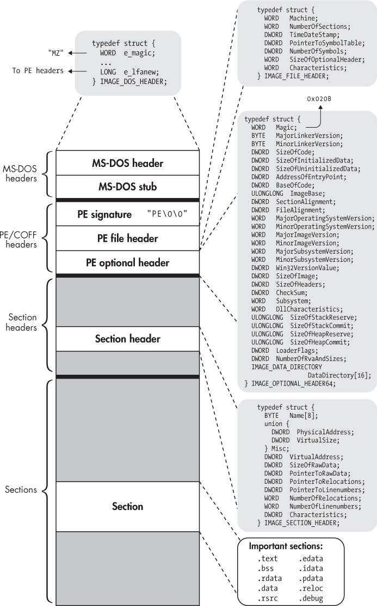

## 3 THE PE FORMAT: A BRIEF INTRODUCTION

Now that you know all about the ELF format, let’s take a brief look at another popular binary format: the Portable Executable (PE) format. Because PE is the main binary format used on Windows, being familiar with PE is useful for analyzing the Windows binaries common in malware analysis.

PE is a modified version of the Common Object File Format (COFF), which was also used on Unix-based systems before being replaced by ELF. For this historic reason, PE is sometimes also referred to as PE/COFF. Confusingly, the 64-bit version of PE is called PE32+. Because PE32+ has only minor differences compared to the original PE format, I’ll simply refer to it as “PE.”

In the following overview of the PE format, I’ll highlight its main differences from ELF in case you want to work on the Windows platform. I won’t go into quite as much detail as I did with ELF since PE isn’t the main focus in this book. That said, PE (along with most other binary formats) shares many similarities with ELF. Now that you’re up to speed on ELF, you’ll notice it’s much easier to learn about new binary formats!

I’ll center the discussion around Figure 3-1. The data structures shown in the figure are defined in *WinNT.h*, which is included in the Microsoft Windows Software Developer Kit.

### 3.1 The MS-DOS Header and MS-DOS Stub

Looking at Figure 3-1, you’ll see a lot of similarities to the ELF format, as well as a few crucial differences. One of the main differences is the presence of an MS-DOS header. That’s right, MS-DOS, the old Microsoft operating system from 1981! What’s Microsoft’s excuse for including this in a supposedly modern binary format? As you may have guessed, the reason is backward compatibility.

When PE was introduced, there was a transitional period when users used both old-fashioned MS-DOS binaries and the newer PE binaries. To make the transition less confusing, every PE file starts with an MS-DOS header so that it can also be interpreted as an MS-DOS binary, at least in a limited sense. The main function of the MS-DOS header is to describe how to load and execute an *MS-DOS stub*, which comes right after the MSDOS header. This stub is usually just a small MS-DOS program, which is run instead of the main program when the user executes a PE binary in MSDOS. The MS-DOS stub program typically prints a string like “This program cannot be run in DOS mode” and then exits. However, in principle, it can be a full-fledged MS-DOS version of the program!

The MS-DOS header starts with a magic value, which consists of the ASCII characters “MZ.”^(1) For this reason, it’s also sometimes referred to as an *MZ header*. For the purposes of this chapter, the only other important field in the MS-DOS header is the last field, called `e_lfanew`. This field contains the file offset at which the *real* PE binary begins. Thus, when a PE-aware program loader opens the binary, it can read the MS-DOS header and then skip past it and the MS-DOS stub to go right to the start of the PE headers.

### 3.2 The PE Signature, File Header, and Optional Header

You can consider the PE headers analogous to ELF’s executable header, except that in PE, the “executable header” is split into three parts: a 32-bit signature, a *PE file header*, and a *PE optional header*. If you take a look in *WinNT.h*, you can see that there’s a `struct` called `IMAGE_NT_HEADERS64`, which encompasses all three of these parts. You could say that `struct IMAGE_NT_HEADERS64` as a whole is PE’s version of the executable header. However, in practice, the signature, file header, and optional header are considered separate entities.



*Figure 3-1: A PE32+ binary at a glance*

In the next few sections, I’ll discuss each of these header components. To see all the header elements in action, let’s look at *hello.exe*, a PE version of the `compilation_example` program from Chapter 1. Listing 3-1 shows a dump of the most important header elements and the `DataDirectory` of *hello.exe*. I’ll explain what the `DataDirectory` is in a moment.

*Listing 3-1: Example dump of PE headers and* DataDirectory

```
   $ objdump -x hello.exe

   hello.exe:    ➊file format pei-x86-64
   hello.exe
   architecture: i386:x86-64, flags 0x0000012f:
   HAS_RELOC, EXEC_P, HAS_LINENO, HAS_DEBUG, HAS_LOCALS, D_PAGED
   start address 0x0000000140001324

➋ Characteristics 0x22
           executable
           large address aware


   Time/Date               Thu Mar 30 14:27:09 2017
➌ Magic                   020b     (PE32+)
   MajorLinkerVersion      14
   MinorLinkerVersion      10
   SizeOfCode              00000e00
   SizeOfInitializedData   00001c00
   SizeOfUninitializedData 00000000
➍ AddressOfEntryPoint     0000000000001324
➎ BaseOfCode              0000000000001000
➏ ImageBase               0000000140000000
   SectionAlignment        0000000000001000
   FileAlignment           0000000000000200
   MajorOSystemVersion     6
   MinorOSystemVersion     0
   MajorImageVersion       0
   MinorImageVersion       0
   MajorSubsystemVersion   6
   MinorSubsystemVersion   0
   Win32Version            00000000
   SizeOfImage             00007000
   SizeOfHeaders           00000400
   CheckSum                00000000
   Subsystem               00000003     (Windows CUI)
   DllCharacteristics      00008160
   SizeOfStackReserve      0000000000100000
   SizeOfStackCommit       0000000000001000
   SizeOfHeapReserve       0000000000100000
   SizeOfHeapCommit        0000000000001000
   LoaderFlags             00000000
   NumberOfRvaAndSizes     00000010

➐ The Data Directory
   Entry 0 0000000000000000 00000000 Export Directory [.edata]
   Entry 1 0000000000002724 000000a0 Import Directory [parts of .idata]
   Entry 2 0000000000005000 000001e0 Resource Directory [.rsrc]
   Entry 3 0000000000004000 00000168 Exception Directory [.pdata]
   Entry 4 0000000000000000 00000000 Security Directory
   Entry 5 0000000000006000 0000001c Base Relocation Directory [.reloc]
   Entry 6 0000000000002220 00000070 Debug Directory
   Entry 7 0000000000000000 00000000 Description Directory
   Entry 8 0000000000000000 00000000 Special Directory
   Entry 9 0000000000000000 00000000 Thread Storage Directory [.tls]
   Entry a 0000000000002290 000000a0 Load Configuration Directory
   Entry b 0000000000000000 00000000 Bound Import Directory
   Entry c 0000000000002000 00000188 Import Address Table Directory
   Entry d 0000000000000000 00000000 Delay Import Directory
   Entry e 0000000000000000 00000000 CLR Runtime Header
   Entry f 0000000000000000 00000000 Reserved

   ...
```

#### *3.2.1 The PE Signature*

The PE signature is simply a string containing the ASCII characters “PE,” followed by two `NULL` characters. It’s analogous to the magic bytes in the `e_ident` field in ELF’s executable header.

#### *3.2.2 The PE File Header*

The file header describes general properties of the file. The most important fields are `Machine`, `NumberOfSections`, `SizeOfOptionalHeader`, and `Characteristics`. The two fields describing the symbol table are deprecated, and PE files should no longer make use of embedded symbols and debugging information. Instead, these symbols are optionally emitted as part of a separate debugging file.

As in ELF’s `e_machine`, the `Machine` field describes the architecture of the machine for which the PE file is intended. In this case, this is x86-64 (defined as the constant `0x8664`) ➊. The `NumberOfSections` field is simply the number of entries in the section header table, and `SizeOfOptionalHeader` is the size in bytes of the optional header that follows the file header. The `Characteristics` field contains flags describing things such as the endianness of the binary, whether it’s a DLL, and whether it has been stripped. As shown in the `objdump` output, the example binary contains `Characteristics` flags that mark it as a large-address-aware executable file ➋.

#### *3.2.3 The PE Optional Header*

Despite what the name suggests, the PE optional header is not really optional for executables (though it may be missing in object files). In fact, you’ll likely find the PE optional header in any PE executable you’ll encounter. It contains lots of fields, and I’ll go over the most important ones here.

First, there’s a 16-bit magic value, which is set to `0x020b` for 64-bit PE files ➌. There are also several fields describing the major and minor version numbers of the linker that was used to create the binary, as well as the minimal operating system version needed to run the binary. The `ImageBase` field ➏ describes the address at which to load the binary (PE binaries are designed to be loaded at a specific virtual address). Other pointer fields contain *relative virtual addresses (RVAs)*, which are intended to be added to the base address to derive a virtual address. For instance, the `BaseOfCode` field ➎ specifies the base address of the code sections as an RVA. Thus, you can find the base virtual address of the code sections by computing `ImageBase+BaseOfCode`. As you may have guessed, the `AddressOfEntryPoint` field ➍ contains the entry point address of the binary, also specified as an RVA.

Probably the least self-explanatory field in the optional header is the `DataDirectory` array ➐. The `DataDirectory` contains entries of a `struct` type called `IMAGE_DATA_DIRECTORY`, which contains an RVA and a size. Every entry in the array describes the starting RVA and size of an important portion of the binary; the precise interpretation of the entry depends on its index in the array. The most important entries are the one at index 0, which describes the base RVA and size of the *export directory* (basically a table of exported functions); the entry at index 1, which describes the *import directory* (a table of imported functions); and the entry at index 5, which describes the relocation table. I’ll talk more about the export and import tables when I discuss PE sections. The `DataDirectory` essentially serves as a shortcut for the loader, allowing it to quickly look up particular portions of data without having to iterate through the section header table.

### 3.3 The Section Header Table

In most ways, the PE section header table is analogous to ELF’s section header table. It’s an array of `IMAGE_SECTION_HEADER` structures, each of which describes a single section, denoting its size in the file and in memory (`SizeOfRawData` and `VirtualSize`), its file offset and virtual address (`PointerToRawData` and `VirtualAddress`), relocation information, and any flags (`Characteristics`). Among other things, the flags describe whether the section is executable, readable, writable, or some combination of these. Instead of referring to a string table as the ELF section headers do, PE section headers specify the section name using a simple character array field, aptly called `Name`. Because the array is only 8 bytes long, PE section names are limited to 8 characters.

Unlike ELF, the PE format does not explicitly distinguish between sections and segments. The closest thing PE files have to ELF’s execution view is the `DataDirectory`, which provides the loader with a shortcut to certain portions of the binary needed for setting up the execution. Other than that, there is no separate program header table; the section header table is used for both linking and loading.

### 3.4 Sections

Many of the sections in PE files are directly comparable to ELF sections, often even having (almost) the same name. Listing 3-2 shows an overview of the sections in *hello.exe*.

*Listing 3-2: Overview of sections in example PE binary*

```
$ objdump -x hello.exe
...

Sections:
Idx Name       Size        VMA              LMA               File off Algn
  0 .text      00000db8    0000000140001000 0000000140001000  00000400 2**4
               CONTENTS,   ALLOC, LOAD, READONLY, CODE       
  1 .rdata     00000d72    0000000140002000 0000000140002000  00001200 2**4
               CONTENTS,   ALLOC, LOAD, READONLY, DATA       
  2 .data      00000200    0000000140003000 0000000140003000  00002000 2**4
               CONTENTS,   ALLOC, LOAD, DATA                 
  3 .pdata     00000168    0000000140004000 0000000140004000  00002200 2**2
               CONTENTS,   ALLOC, LOAD, READONLY, DATA       
  4 .rsrc      000001e0    0000000140005000 0000000140005000  00002400 2**2
               CONTENTS,   ALLOC, LOAD, READONLY, DATA       
  5 .reloc     0000001c    0000000140006000 0000000140006000  00002600 2**2
               CONTENTS,   ALLOC, LOAD, READONLY, DATA
...
```

As you can see in Listing 3-2, there’s a `.text` section containing code, an .rdata section containing read-only data (roughly equivalent to `.rodata` in ELF), and a `.data` section containing readable/writable data. Usually there’s also a `.bss` section for zero-initialized data, though it’s missing in this simple example binary. There’s also a `.reloc` section, which contains relocation information. One important thing to note is that PE compilers like Visual Studio sometimes place read-only data in the `.text` section (mixed in with the code) instead of in `.rdata`. This can be problematic during disassembly, because it makes it possible to accidentally interpret constant data as instructions.

#### *3.4.1 The .edata and .idata Sections*

The most important PE sections that have no direct equivalent in ELF are `.edata` and `.idata`, which contain tables of exported and imported functions, respectively. The export directory and import directory entries in the `DataDirectory` array refer to these sections. The `.idata` section specifies which symbols (functions and data) the binary imports from shared libraries, or DLLs in Windows terminology. The `.edata` section lists the symbols and their addresses that the binary exports. Thus, to resolve references to external symbols, the loader needs to match up the required imports with the export table of the DLL that provides the required symbols.

In practice, you may find that there are no separate `.idata` and .edata sections. In fact, they’re not present in the example binary in Listing 3-2 either! When these sections aren’t present, they’re usually merged into `.rdata`, but their contents and workings remain the same.

When the loader resolves dependencies, it writes the resolved addresses into the *Import Address Table (IAT)*. Similar to the Global Offset Table in ELF, the IAT is simply a table of resolved pointers with one slot per pointer. The IAT is also part of the `.idata` section, and it initially contains pointers to the names or identifying numbers of the symbols to be imported. The dynamic loader then replaces these pointers with pointers to the actual imported functions or variables. A call to a library function is then implemented as a call to a *thunk* for that function, which is nothing more than an indirect jump through the IAT slot for the function. Listing 3-3 shows what thunks look like in practice.

*Listing 3-3: Example PE thunks*

```
$ objdump -M intel -d hello.exe
...
140001cd0: ff 25 b2 03 00 00    jmp QWORD PTR [rip+0x3b2]   # ➊0x140002088
140001cd6: ff 25 a4 03 00 00    jmp QWORD PTR [rip+0x3a4]   # ➋0x140002080
140001cdc: ff 25 06 04 00 00    jmp QWORD PTR [rip+0x406]   # ➌0x1400020e8
140001ce2: ff 25 f8 03 00 00    jmp QWORD PTR [rip+0x3f8]   # ➍0x1400020e0
140001ce8: ff 25 ca 03 00 00    jmp QWORD PTR [rip+0x3ca]   # ➎0x1400020b8
...
```

You’ll often see thunks grouped together as in Listing 3-3. Note that the target addresses for the jumps ➊ through ➎ are all stored in the import directory, contained in the `.rdata` section, which starts at address `0x140002000`. These are jump slots in the IAT.

#### *3.4.2 Padding in PE Code Sections*

Incidentally, when disassembling PE files, you may notice that there are lots of `int3` instructions. Visual Studio emits these instructions as padding (instead of the `nop` instructions used by `gcc`) to align functions and blocks of code in memory such that they can be accessed efficiently.^(2) The `int3` instruction is normally used by debuggers to set breakpoints; it causes the program to trap to the debugger or to crash if no debugger is present. This is okay for padding code since padding instructions are not intended to be executed.

### 3.5 Summary

If you’ve made it through both Chapter 2 and this chapter, I applaud your perseverance. After reading this chapter, you should now be aware of the main similarities and differences between ELF and PE. This will help you if you are interested in analyzing binaries on the Windows platform. In the next chapter, you’ll get your hands dirty and start building your first real binary analysis tool: a binary loading library that can load up ELF and PE binaries for analysis.

Exercises

1\. Manual Header Inspection

Just as you did for ELF binaries in Chapter 2, use a hex viewer like `xxd` to view the bytes in a PE binary. You can use the same command as before, `xxd` *program.exe* `| head -n 30`, where *program.exe* is your PE binary. Can you identify the bytes representing the PE header and make sense of all of the header fields?

### 2. Disk Representation vs. Memory Representation

Use `readelf` to view the contents of a PE binary. Then make an illustration of the binary’s on-disk representation versus its representation in memory. What are the major differences?

### 3. PE vs. ELF

Use `objdump` to disassemble an ELF and a PE binary. Do the binaries use different kinds of code and data constructs? Can you identify some code or data patterns that are typical for the ELF compiler and the PE compiler you’re using, respectively?