## 6 DISASSEMBLY AND BINARY ANALYSIS FUNDAMENTALS

Now that you know how binaries are structured and are familiar with basic binary analysis tools, it’s time to start disassembling some binaries! In this chapter, you’ll learn about the advantages and disadvantages of some of the major disassembly approaches and tools. I’ll also discuss some more advanced analysis techniques to analyze the control- and data-flow properties of disassembled code.

Note that this chapter is not a guide to reverse engineering; for that, I recommend Chris Eagle’s *The IDA Pro Book* (No Starch Press, 2011). The goal is to get familiar with the main algorithms behind disassembly and learn what disassemblers can and cannot do. This knowledge will help you better understand the more advanced techniques discussed in later chapters, as these techniques invariably rely on disassembly at their core. Throughout this chapter, I’ll use `objdump` and IDA Pro for most of the examples. In some of the examples, I’ll use pseudocode to simplify the discussion. Appendix C contains a list of well-known disassemblers you can try if you want to use a disassembler other than IDA Pro or `objdump`.

### 6.1 Static Disassembly

You can classify all binary analysis as either static analysis, dynamic analysis, or a combination of both. When people say “disassembly,” they usually mean *static disassembly*, which involves extracting the instructions from a binary without executing it. In contrast, *dynamic disassembly*, more commonly known as *execution tracing*, logs each executed instruction as the binary runs.

The goal of every static disassembler is to translate *all* code in a binary into a form that a human can read or a machine can process (for further analysis). To achieve this goal, static disassemblers need to perform the following steps:

1.  Load a binary for processing, using a binary loader like the one implemented in Chapter 4.
2.  Find all the machine instructions in the binary.
3.  Disassemble these instructions into a human- or machine-readable form.

Unfortunately, step 2 is often very difficult in practice, resulting in disassembly errors. There are two major approaches to static disassembly, each of which tries to avoid disassembly errors in its own way: *linear disassembly* and *recursive disassembly*. Unfortunately, neither approach is perfect in every case. Let’s discuss the trade-offs of these two static disassembly techniques. I’ll return to dynamic disassembly later in this chapter.

Figure 6-1 illustrates the basic principles of linear and recursive disassembly. It also highlights some types of disassembly errors that may occur with each approach.

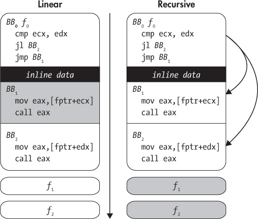

*Figure 6-1: Linear versus recursive disassembly. Arrows show the disassembly flow. Gray blocks show missed or corrupted code.*

#### *6.1.1 Linear Disassembly*

Let’s begin with linear disassembly, which is conceptually the simplest approach. It iterates through all code segments in a binary, decoding all bytes consecutively and parsing them into a list of instructions. Many simple disassemblers, including `objdump` from Chapter 1, use this approach.

The risk of using linear disassembly is that not all bytes may be instructions. For example, some compilers, such as Visual Studio, intersperse data such as jump tables with the code, without leaving any clues as to where exactly that data is. If disassemblers accidentally parse this *inline data* as code, they may encounter invalid opcodes. Even worse, the data bytes may coincidentally correspond to valid opcodes, leading the disassembler to output bogus instructions. This is especially likely on dense ISAs like x86, where most byte values represent a valid opcode.

In addition, on ISAs with variable-length opcodes, such as x86, inline data may even cause the disassembler to become desynchronized with respect to the true instruction stream. Though the disassembler will typically self-resynchronize, desynchronization can cause the first few real instructions following inline data to be missed, as shown in Figure 6-2.

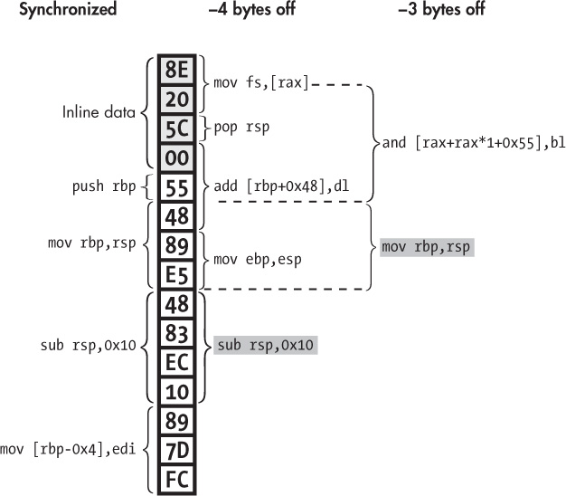

*Figure 6-2: Disassembly desynchronization due to inline data interpreted as code. The instruction where the disassembly resynchronizes is shaded gray.*

The figure illustrates *disassembler desynchronization* in part of a binary’s code section. You can see a number of inline data bytes (`0x8e 0x20 0x5c 0x00`), followed by some instructions (`push rbp`, `mov rbp,rsp`, and so on). The correct decoding of all the bytes, as would be found by a perfectly synchronized disassembler, is shown on the left of the figure under “synchronized.” But a naive linear disassembler instead interprets the inline data as code, thus decoding the bytes as shown under “−4 bytes off.” As you can see, the inline data is decoded as a `mov fs,[rax]` instruction, followed by a `pop rsp` and an `add [rbp+0x48],dl`. This last instruction is especially nasty because it stretches beyond the inline data region and into the real instructions! In doing so, the `add` instruction “eats up” some of the real instruction bytes, causing the disassembler to miss the first two real instructions altogether. The disassembler encounters similar problems if it starts 3 bytes too early (“−3 bytes off”), which may happen if the disassembler tries to skip the inline data but fails to recognize all of it.

Fortunately, on x86, the disassembled instruction stream tends to automatically resynchronize itself after just a few instructions. But missing even a few instructions can still be bad news if you’re doing any kind of automated analysis or you want to modify the binary based on the disassembled code. As you’ll see in Chapter 8, malicious programs sometimes intentionally contain bytes designed to desynchronize disassemblers to hide the program’s true behavior.

In practice, linear disassemblers such as `objdump` are safe to use for disassembling ELF binaries compiled with recent versions of compilers such as `gcc` or LLVM’s `clang`. The x86 versions of these compilers don’t typically emit inline data. On the other hand, Visual Studio *does*, so it’s good to keep an eye out for disassembly errors when using `objdump` to look at PE binaries. The same is true when analyzing ELF binaries for architectures other than x86, such as ARM. And if you’re analyzing malicious code with a linear disassembler, well, all bets are off, as it may include obfuscations far worse than inline data!

#### *6.1.2 Recursive Disassembly*

Unlike linear disassembly, recursive disassembly is sensitive to control flow. It starts from known entry points into the binary (such as the main entry point and exported function symbols) and from there recursively follows control flow (such as jumps and calls) to discover code. This allows recursive disassembly to work around data bytes in all but a handful of corner cases.^(1) The downside of this approach is that not all control flow is so easy to follow. For instance, it’s often difficult, if not impossible, to statically figure out the possible targets of indirect jumps or calls. As a result, the disassembler may miss blocks of code (or even entire functions, such as *f*₁ and *f*₂ in Figure 6-1) targeted by indirect jumps or calls, unless it uses special (compiler-specific and error-prone) heuristics to resolve the control flow.

Recursive disassembly is the de facto standard in many reverse-engineering applications, such as malware analysis. IDA Pro (shown in Figure 6-3) is one of the most advanced and widely used recursive disassemblers. Short for *Interactive DisAssembler*, IDA Pro is meant to be used interactively and offers many features for code visualization, code exploration, scripting (in Python), and even decompilation^(2) that aren’t available in simple tools like `objdump`. Of course, there’s a price tag to match: at the time of writing, licenses for IDA Starter (a simplified edition of IDA Pro) start at \$739, while full-fledged IDA Professional licenses go for \$1,409 and up. But don’t worry—you don’t need to buy IDA Pro to use this book. This book focuses not on interactive reverse engineering but on creating your own automated binary analysis tools based on free frameworks.

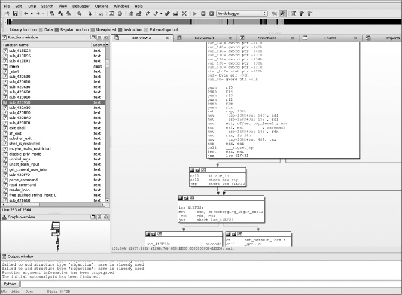

*Figure 6-3: IDA Pro’s graph view*

Figure 6-4 illustrates some of the challenges that recursive disassemblers like IDA Pro face in practice. Specifically, the figure shows how a simple function from `opensshd` v7.1p2 is compiled by `gcc` v5.1.1 from C to x64 code.

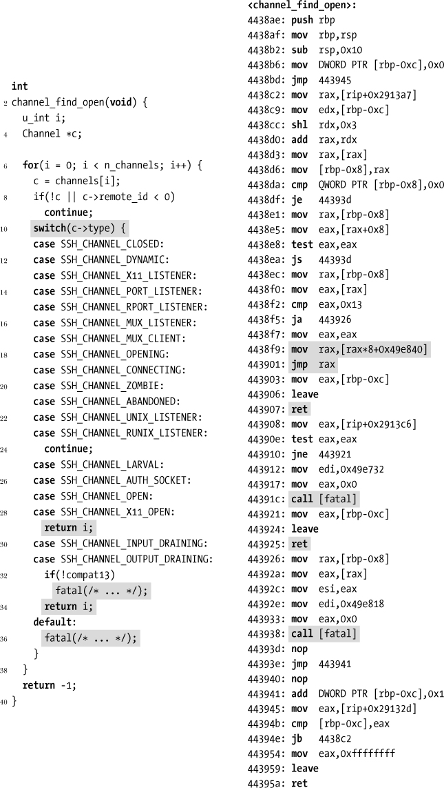

*Figure 6-4: Example of a disassembled switch statement (from* `opensshd` *v7.1p2 compiled with* `gcc` *5.1.1 for x64, source edited for brevity). Interesting lines are shaded.*

As you can see on the left side of the figure, which shows the C representation of the function, the function does nothing special. It uses a `for` loop to iterate over an array, applying a `switch` statement in each iteration to determine what to do with the current array element: skip uninteresting elements, return the index of an element that meets some criteria, or print an error and exit if something unexpected happens. Despite the simplicity of the C code, the compiled version of this function (shown on the right side of the figure) is far from trivial to disassemble correctly.

As you can see in Figure 6-4, the x64 implementation of the switch statement is based on a *jump table*, a construct commonly emitted by modern compilers. This jump table implementation avoids the need for a complicated tangle of conditional jumps. Instead, the instruction at address `0x4438f9` uses the switch input value to compute (in `rax`) an index into a table, which stores at that index the address of the appropriate case block. This way, only the single indirect jump at address `0x443901` is required to transfer control to any case address the jump table defines.

While efficient, jump tables make recursive disassembly more difficult because they use *indirect control flow*. The lack of an explicit target address in the indirect jump makes it difficult for the disassembler to track the flow of instructions past this point. As a result, any instructions that the indirect jump may target remain undiscovered unless the disassembler implements specific (compiler-dependent) heuristics to discover and parse jump tables.^(3) For this example, this means a recursive disassembler that doesn’t implement switch-detection heuristics won’t discover the instructions at addresses `0x443903`–`0x443925` at all.

Things get even more complicated because there are multiple `ret` instructions in the switch, as well as calls to the `fatal` function, which throws an error and never returns. In general, it is not safe to assume that there are instructions following a `ret` instruction or nonreturning `call`; instead, these instructions may be followed by data or padding bytes not intended to be parsed as code. However, the converse assumption that these instructions are *not* followed by more code may lead the disassembler to miss instructions, leading to an incomplete disassembly.

These are just some of the challenges faced by recursive disassemblers; many more complex cases exist, especially in more complicated functions than the one shown in the example. As you can see, neither linear nor recursive disassembly is perfect. For benign x86 ELF binaries, linear disassembly is a good choice because it will yield both a complete and accurate disassembly: such binaries typically don’t contain inline data that will throw the disassembler off, and the linear approach won’t miss code because of unresolved indirect control flow. On the other hand, if inline data or malicious code is involved, it’s probably a better idea to use a recursive disassembler that’s not as easily fooled into producing bogus output as a linear disassembler is.

In cases where disassembly correctness is paramount, even at the expense of completeness, you can use *dynamic disassembly*. Let’s look at how this approach differs from the static disassembly methods just discussed.

### 6.2 Dynamic Disassembly

In the previous sections, you saw the challenges that static disassemblers face, such as distinguishing data from code, resolving indirect calls, and so on. Dynamic analysis solves many of these problems because it has a rich set of runtime information at its disposal, such as concrete register and memory contents. When execution reaches a particular address, you can be absolutely sure there’s an instruction there, so dynamic disassembly doesn’t suffer from the inaccuracy problems involved in static disassembly. This allows dynamic disassemblers, also known as *execution tracers* or *instruction tracers*, to simply dump instructions (and possibly memory/register contents) as the program executes. The main downside of this approach is the *code coverage problem*: the fact that dynamic disassemblers don’t see all instructions but only those they execute. I’ll get back to the code coverage problem later in this section. First, let’s take a look at a concrete execution trace.

#### *6.2.1 Example: Tracing a Binary Execution with gdb*

Surprisingly enough, there’s no widely accepted standard tool on Linux to do “fire-and-forget” execution tracing (unlike on Windows, where excellent tools such as OllyDbg are available^(4)). The easiest way using only standard tools is with a few `gdb` commands, as shown in Listing 6-1.

*Listing 6-1: Dynamic disassembly with* gdb

```
   $ gdb /bin/ls
   GNU gdb (Ubuntu 7.11.1-0ubuntu1~16.04) 7.11.1
   ...
   Reading symbols from /bin/ls...(no debugging symbols found)...done.
➊ (gdb) info files
   Symbols from "/bin/ls".
   Local exec file:
          `/bin/ls', file type elf64-x86-64.
➋        Entry point: 0x4049a0
          0x0000000000400238 - 0x0000000000400254 is .interp
          0x0000000000400254 - 0x0000000000400274 is .note.ABI-tag
          0x0000000000400274 - 0x0000000000400298 is .note.gnu.build-id
          0x0000000000400298 - 0x0000000000400358 is .gnu.hash
          0x0000000000400358 - 0x0000000000401030 is .dynsym
          0x0000000000401030 - 0x000000000040160c is .dynstr
          0x000000000040160c - 0x000000000040171e is .gnu.version
          0x0000000000401720 - 0x0000000000401790 is .gnu.version_r
          0x0000000000401790 - 0x0000000000401838 is .rela.dyn
          0x0000000000401838 - 0x00000000004022b8 is .rela.plt
          0x00000000004022b8 - 0x00000000004022d2 is .init
          0x00000000004022e0 - 0x00000000004029f0 is .plt
          0x00000000004029f0 - 0x00000000004029f8 is .plt.got
          0x0000000000402a00 - 0x0000000000413c89 is .text
          0x0000000000413c8c - 0x0000000000413c95 is .fini
          0x0000000000413ca0 - 0x000000000041a654 is .rodata
          0x000000000041a654 - 0x000000000041ae60 is .eh_frame_hdr
          0x000000000041ae60 - 0x000000000041dae4 is .eh_frame
          0x000000000061de00 - 0x000000000061de08 is .init_array
          0x000000000061de08 - 0x000000000061de10 is .fini_array
          0x000000000061de10 - 0x000000000061de18 is .jcr
          0x000000000061de18 - 0x000000000061dff8 is .dynamic
          0x000000000061dff8 - 0x000000000061e000 is .got
          0x000000000061e000 - 0x000000000061e398 is .got.plt
          0x000000000061e3a0 - 0x000000000061e600 is .data
          0x000000000061e600 - 0x000000000061f368 is .bss
➌ (gdb) b *0x4049a0
   Breakpoint 1 at 0x4049a0
➍ (gdb) set pagination off
➎ (gdb) set logging on
   Copying output to gdb.txt.
   (gdb) set logging redirect on
   Redirecting output to gdb.txt.
➏ (gdb) run
➐ (gdb) display/i $pc
➑ (gdb) while 1
➑ >si
   >end
   chapter1 chapter2 chapter3 chapter4 chapter5
   chapter6 chapter7 chapter8 chapter9 chapter10
   chapter11 chapter12 chapter13 inc
   (gdb)
```

This example loads */bin/ls* into `gdb` and produces a trace of all instructions executed when listing the contents of the current directory. After starting `gdb`, you can list information on the files loaded into `gdb` (in this case, it’s just the executable */bin/ls*) ➊. This tells you the binary’s entry point address ➋ so that you can set a breakpoint there that will halt execution as soon as the binary starts running ➌. You then disable pagination ➍ and configure `gdb` such that it logs to file instead of standard output ➎. By default, the log file is called *gdb.txt*. Pagination means that `gdb` pauses after outputting a certain number of lines, allowing the user to read all the output on the screen before moving on. It’s enabled by default. Since you’re logging to file, you don’t want these pauses, as you would have to constantly press a key to continue, which gets annoying quickly.

After setting everything up, you run the binary ➏. It pauses immediately, as soon as the entry point is hit. This gives you a chance to tell `gdb` to log this first instruction to file ➐ and then enter a `while` loop ➑ that continuously executes a single instruction at a time ➒ (this is called *single stepping* ) until there are no more instructions left to execute. Each single-stepped instruction is automatically printed to the log file in the same format as before. Once the execution is complete, you get a log file containing all the executed instructions. As you might expect, the output is quite lengthy; even a simple run of a small program traverses tens or hundreds of thousands of instructions, as shown in Listing 6-2.

*Listing 6-2: Output of dynamic disassembly with* gdb

```
➊ $ wc -l gdb.txt
   614390 gdb.txt
➋ $ head -n 20 gdb.txt
   Starting program: /bin/ls
   [Thread debugging using libthread_db enabled]
   Using host libthread_db library "/lib/x86_64-linux-gnu/libthread_db.so.1".

   Breakpoint 1, 0x00000000004049a0 in ?? ()
➌ 1: x/i $pc
   => 0x4049a0:          xor     %ebp,%ebp
   0x00000000004049a2   in ?? ()
   1: x/i $pc
   => 0x4049a2:          mov     %rdx,%r9
   0x00000000004049a5   in ?? ()
   1: x/i $pc
   => 0x4049a5:          pop     %rsi
   0x00000000004049a6   in ?? ()
   1: x/i $pc
   => 0x4049a6:          mov     %rsp,%rdx
   0x00000000004049a9   in ?? ()
   1: x/i $pc
   => 0x4049a9:          and     $0xfffffffffffffff0,%rsp
   0x00000000004049ad   in ?? ()
```

Using `wc` to count the lines in the log file, you can see that the file contains 614,390 lines, far too many to list here ➊. To give you an idea of what the output looks like, you can use `head` to take a look at the first 20 lines in the log ➋. The actual execution trace starts at ➌. For each executed instruction, `gdb` prints the command used to log the instruction, then the instruction itself, and finally some context on the instruction’s location (which is unknown since the binary is stripped). Using a `grep`, you can filter out everything but the lines showing the executed instructions, since they’re all you’re interested in, yielding output as shown in Listing 6-3.

*Listing 6-3: Filtered output of dynamic disassembly with* gdb

```
$ egrep '^=> 0x[0-9a-f]+:' gdb.txt | head -n 20
=> 0x4049a0:        xor    %ebp,%ebp
=> 0x4049a2:        mov    %rdx,%r9
=> 0x4049a5:        pop    %rsi
=> 0x4049a6:        mov    %rsp,%rdx
=> 0x4049a9:        and    $0xfffffffffffffff0,%rsp
=> 0x4049ad:        push   %rax
=> 0x4049ae:        push   %rsp
=> 0x4049af:        mov    $0x413c50,%r8
=> 0x4049b6:        mov    $0x413be0,%rcx
=> 0x4049bd:        mov    $0x402a00,%rdi
=> 0x4049c4:        callq  0x402640 <__libc_start_main@plt>
=> 0x4022e0:        pushq  0x21bd22(%rip)         # 0x61e008
=> 0x4022e6:        jmpq   *0x21bd24(%rip)        # 0x61e010
=> 0x413be0:        push   %r15
=> 0x413be2:        push   %r14
=> 0x413be4:        mov    %edi,%r15d
=> 0x413be7:        push   %r13
=> 0x413be9:        push   %r12
=> 0x413beb:        lea    0x20a20e(%rip),%r12   # 0x61de00
=> 0x413bf2:        push   %rbp
```

As you can see, this is a lot more readable than the unfiltered `gdb` log.

#### *6.2.2 Code Coverage Strategies*

The main disadvantage of all dynamic analysis, not just dynamic disassembly, is the code coverage problem: the analysis only ever sees the instructions that are actually executed during the analysis run. Thus, if any crucial information is hidden in other instructions, the analysis will never know about it. For instance, if you’re dynamically analyzing a program that contains a logic bomb (for instance, triggering malicious behavior at a certain time in the future), you’ll never find out until it’s too late. In contrast, a close inspection using static analysis might have revealed this. As another example, when dynamically testing software for bugs, you’ll never be sure that there isn’t a bug in some rarely executed code path that you failed to cover in your tests.

Many malware samples even try to actively hide from dynamic analysis tools or debuggers like `gdb`. Virtually all such tools produce some kind of detectable artifact in the environment; if nothing else, the analysis inevitably slows down execution, typically enough to be detectable. Malware detects these artifacts and hides its true behavior if it knows it’s being analyzed. To enable dynamic analysis on these samples, you must reverse engineer and then disable the malware’s anti-analysis checks (for instance, by overwriting those code bytes with patched values). These anti-analysis tricks are the reason why, if possible, it’s usually a good idea to at least augment your dynamic malware analysis with static analysis methods.

Because it’s difficult and time-consuming to find the correct inputs to cover every possible program path, dynamic disassembly will almost never reveal all possible program behavior. There are several methods you can use to improve the coverage of dynamic analysis tools, though in general none of them achieves the level of completeness provided by static analysis. Let’s take a look at some of the methods used most often.

### Test Suites

One of the easiest and most popular methods to increase code coverage is running the analyzed binary with known test inputs. Software developers often manually develop test suites for their programs, crafting inputs designed to cover as much of the program’s functionality as possible. Such test suites are perfect for dynamic analysis. To achieve good code coverage, simply run an analysis pass on the program with each of the test inputs. Of course, the downside of this approach is that a ready-made test suite isn’t always available, for instance, for proprietary software or malware.

The exact way to use test suites for code coverage differs per application, depending on how the application’s test suite is structured. Typically, there’s a special Makefile `test` target, which you can use to run the test suite by entering `make test` on the command line. Inside the Makefile, the `test` target is often structured something like Listing 6-4.

*Listing 6-4: Structure of a Makefile* test *target*

```
PROGRAM := foo

test: test1 test2 test3 # ...

test1:
        $(PROGRAM) < input > output
        diff correct output

# ...
```

The `PROGRAM` variable contains the name of the application that’s being tested, in this case `foo`. The `test` target depends on a number of test cases (`test1`, `test2`, and so on), each of which gets called when you run `make test`. Each test case consists of running `PROGRAM` on some input, recording the output, and then checking it against a correct output using `diff`.

There are many different (and more concise) ways of implementing this type of testing framework, but the key point is that you can run your dynamic analysis tool on each of the test cases by simply overriding the `PROGRAM` variable. For instance, say you want to run each of `foo`’s test cases with `gdb`. (In reality, instead of `gdb`, you’d more likely use a fully automated dynamic analysis, which you’ll learn how to build in Chapter 9.) You could do this as follows:

```
make test PROGRAM="gdb foo"
```

Essentially, this redefines `PROGRAM` so that instead of just running `foo` with each test, you now run `foo` *inside* *gdb*. This way, `gdb` or whatever dynamic analysis tool you’re using runs `foo` with each of its test cases, allowing the dynamic analysis to cover all of `foo`’s code that’s covered by the test cases. In cases where there isn’t a `PROGRAM` variable to override, you’ll have to do a search and replace, but the idea remains the same.

### Fuzzing

There are also tools, called *fuzzers*, that try to automatically generate inputs to cover new code paths in a given binary. Well-known fuzzers include AFL, Microsoft’s Project Springfield, and Google’s OSS-Fuzz. Broadly speaking, fuzzers fall into two categories based on the way they generate inputs.

1.  Generation-based fuzzers: These generate inputs from scratch (possibly with knowledge of the expected input format).
2.  Mutation-based fuzzers: These fuzzers generate new inputs by mutating known valid inputs in some way, for instance, starting from an existing test suite.

The success and performance of fuzzers depend greatly on the information available to the fuzzer. For instance, it helps if source information is available or if the program’s expected input format is known. If none of these things is known (and even if they all are known), fuzzing can require a lot of compute time and may not reach code hidden behind complex sequences of `if`/`else` conditions that the fuzzer fails to “guess.” Fuzzers are typically used to search programs for bugs, permuting inputs until a crash is detected.

Although I won’t go into details on fuzzing in this book, I encourage you to play around with one of the free tools available. Each fuzzer has its own usage method. A great choice for experimentation is AFL, which is free and comes with good online documentation.^(5) Additionally, in Chapter 10 I’ll discuss how dynamic taint analysis can be used to augment fuzzing.

### Symbolic Execution

Symbolic execution is an advanced technique that I discuss in detail in Chapters 12 and 13. It’s a broad technique with a multitude of applications, not just code coverage. Here, I’ll just give you a rough idea of how symbolic execution applies to code coverage, glossing over many details, so don’t worry if you can’t follow all of it yet.

Normally, when you execute an application, you do so using concrete values for all variables. At each point in the execution, every CPU register and memory area contains some particular value, and these values change over time as the application’s computation proceeds. Symbolic execution is different.

In a nutshell, symbolic execution allows you to execute an application not with *concrete values* but with *symbolic values*. You can think of symbolic values as mathematical symbols. A symbolic execution is essentially an emulation of a program, where all or some of the variables (or register and memory states) are represented using such symbols.^(6) To get a clearer idea of what this means, consider the pseudocode program shown in Listing 6-5.

*Listing 6-5: Pseudocode example to illustrate symbolic execution*

```
➊ x = int(argv[0])
   y = int(argv[1])

➋ z = x + y
➌ if(x < 5)
       foo(x, y, z)
➍ else
       bar(x, y, z)
```

The program starts by taking two command line arguments, converting them to numbers, and storing them in two variables called `x` and `y` ➊. At the start of a symbolic execution, you might define the `x` variable to contain the symbolic value *α*₁, while `y` may be initialized to *α*₂. Both *α*₁ and *α*₂ are symbols that could represent any possible numerical value. Then, as the emulation proceeds, the program essentially computes formulas over these symbols. For instance, the operation `z = x + y` causes `z` to assume the symbolic expression *α*₁ + *α*₂ ➋.

At the same time, the symbolic execution also computes *path constraints*, which are just restrictions on the concrete values that the symbols could take, given the branches that have been traversed so far. For instance, if the branch `if(x < 5)` is taken, the symbolic execution adds a path constraint saying that *α*₁ \< 5 ➌. This constraint expresses the fact that if the `if` branch is taken, then *α*₁ (the symbolic value in `x`) must always be less than 5. Otherwise, the branch wouldn’t have been taken. For each branch, the symbolic execution extends the list of path constraints accordingly.

How does all this apply to code coverage? The key point is that *given the list of path constraints, you can check whether there’s any concrete input that would satisfy all these constraints.* There are special programs, called *constraint solvers*, that check, given a list of constraints, whether there’s any way to satisfy these constraints. For instance, if the only constraint is *α*₁ \< 5, the solver may yield the solution *α*₁ = 4 ^ *α*₂ = 0. Note that the path constraints don’t say anything about *α*₂, so it can take any value. This means that, at the start of a concrete execution of the program, you can (via user input) set the value 4 for `x` and the value 0 for `y`, and the execution will then take the same series of branches taken in the symbolic execution. If there’s no solution, the solver will inform you.

Now, to increase code coverage, you can change the path constraints and ask the solver if there’s any way to satisfy the changed constraints. For instance, you could “flip” the constraint *α*₁ \< 5 to instead say *α*₁ ≥ *α*₅ and ask the solver for a solution. The solver will then inform you of a possible solution, such as *α*₁ = 5 ^ *α*₂ = 0, which you can feed as input to a concrete execution of the program, thereby forcing that execution to take the `else` branch and thus increasing code coverage ➍. If the solver informs you that there’s no possible solution, you know that there’s no way to “flip” the branch, and you should continue looking for new paths by changing other path constraints.

As you may have gathered from this discussion, symbolic execution (or even just its application to code coverage) is a complex subject. Even given the ability to “flip” path constraints, it’s still infeasible to cover all program paths since the number of possible paths increases exponentially with the number of branch instructions in a program. Moreover, solving a set of path constraints is computationally intensive; if you don’t take care, your symbolic execution approach can easily become unscalable. In practice, it takes a lot of care to apply symbolic execution in a scalable and effective way. I’ve only covered the gist of the ideas behind symbolic execution so far, but ideally it’s given you a taste of what to expect in Chapters 12 and 13.

### 6.3 Structuring Disassembled Code and Data

So far, I’ve shown you how static and dynamic disassemblers find instructions in a binary, but disassembly doesn’t end there. Large unstructured heaps of disassembled instructions are nearly impossible to analyze, so most disassemblers structure the disassembled code in some way that’s easier to analyze. In this section, I’ll discuss the common code and data structures that disassemblers recover and how they help binary analysis.

#### *6.3.1 Structuring Code*

First, let’s take a look at the various ways of structuring disassembled code. Broadly speaking, the code structures I’ll show you make code easier to analyze in two ways.

- Compartmentalizing: By breaking the code into logically connected chunks, it becomes easier to analyze what each chunk does and how chunks of code relate to each other.

- Revealing control flow: Some of the code structures I’ll discuss next explicitly represent not only the code itself but also the control transfers between blocks of code. These structures can be represented visually, making it much easier to quickly see how control flows through the code and to get a quick idea of what the code does.

The following code structures are useful in both automated and manual analysis.

### Functions

In most high-level programming languages (including C, C++, Java, Python, and so on), functions are the fundamental building blocks used to group logically connected pieces of code. As any programmer knows, programs that are well structured and properly divided into functions are much easier to understand than poorly structured programs with “spaghetti code.” For this reason, most disassemblers make some effort to recover the original program’s function structure and use it to group disassembled instructions by function. This is known as *function detection*. Not only does function detection make the code much easier to understand for human reverse engineers, but it also helps in automated analysis. For instance, in automated binary analysis, you may want to search for bugs at a per-function level or modify the code so that a particular security check happens at the start and end of each function.

For binaries with symbolic information, function detection is trivial; the symbol table specifies the set of functions, along with their names, start addresses, and sizes. Unfortunately, as you may recall from Chapter 1, many binaries are stripped of this information, which makes function detection far more challenging. Source-level functions have no real meaning at the binary level, so their boundaries may become blurred during compilation. The code belonging to a particular function might not even be arranged contiguously in the binary. Bits and pieces of the function might be scattered throughout the code section, and chunks of code may even be shared between functions (known as *overlapping code blocks*). In practice, most disassemblers make the assumption that functions are contiguous and don’t share code, which holds true in many but not all cases. This is especially not true if you’re analyzing things such as firmware or code for embedded systems.

The predominant strategy that disassemblers use for function detection is based on *function signatures*, which are patterns of instructions often used at the start or end of a function. This strategy is used in all well-known recursive disassemblers, including IDA Pro. Linear disassemblers like `objdump` typically don’t do function detection, except when symbols are available.

Typically, signature-based function detection algorithms start with a pass over the disassembled binary to locate functions that are directly addressed by a `call` instruction. These cases are easy for the disassembler to find; functions that are called only indirectly or tail-called are more of a challenge.^(7) To locate these challenging cases, signature-based function detectors consult a database of known function signatures.

Function signature patterns include well-known *function prologues* (instructions used to set up the function’s stack frame) and *function epilogues* (used to tear down the stack frame). For instance, a typical pattern that many x86 compilers emit for unoptimized functions starts with the prologue `push ebp; mov ebp,esp` and ends with the epilogue `leave; ret`. Many function detectors scan the binary for such signatures and use them to recognize where functions start and end.

Although functions are an essential and useful way to structure disassembled code, you should always be wary of errors. In practice, function patterns vary depending on the platform, compiler, and optimization level used to create the binary. Optimized functions may not have well-known function prologues or epilogues at all, making them impossible to recognize using a signature-based approach. As a result, errors in function detection occur quite regularly. For example, it’s not rare for disassemblers to get 20 percent or more of the function start addresses wrong or even to report a function where there is none.

Recent research explores different methods for function detection, based not on signatures but on the structure of the code.^(8) While this approach is potentially more accurate than signature-based approaches, detection errors are still a fact of life. The approach has been integrated into Binary Ninja, and the research prototype tool can interoperate with IDA Pro, so you can give it a go if you want.

### Function Detection Using the .eh_frame Section

An interesting alternative approach to function detection for ELF binaries is based on the `.eh_frame` section, which you can use to circumvent the function detection problem entirely. The `.eh_frame` section contains information related to DWARF-based debugging features such as stack unwinding. This includes function boundary information that identifies all functions in the binary. The information is present even in stripped binaries, unless the binary was compiled with `gcc`’s `-fno-asynchronous-unwind-tables` flag. It’s used primarily for C++ exception handling but also for various other applications such as `backtrace()` and `gcc` intrinsics such as `__attribute__((__cleanup__(f)))` and `__builtin_return_address(n)`. Because of its many uses, `.eh_frame` is present by default not only in C++ binaries that use exception handling but in all binaries produced by `gcc`, including plain C binaries.

As far as I know, this method was first described by Ryan O’Neill (aka ElfMaster). On his website, he provides code to parse the `.eh_frame` section into a set of function addresses and sizes.^(a)

a. <http://www.bitlackeys.org/projects/eh_frame.tgz>

### Control-Flow Graphs

Breaking the disassembled code into functions is one thing, but some functions are quite large, which means analyzing even one function can be a complex task. To organize the internals of each function, disassemblers and binary analysis frameworks use another code structure, called a *control-flow graph (CFG)*. CFGs are useful for automated analysis, as well as manual analysis. They also offer a convenient graphical representation of the code structure, which makes it easy to get a feel for a function’s structure at a glance. Figure 6-5 shows an example of the CFG of a function disassembled with IDA Pro.

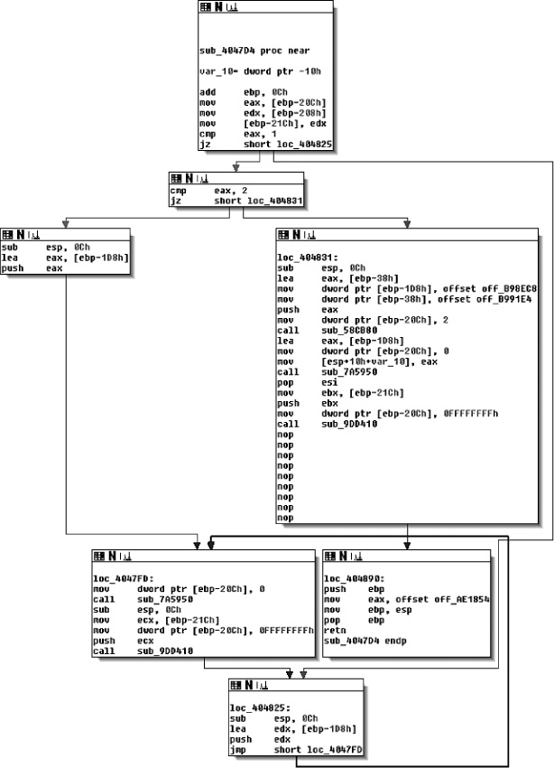

*Figure 6-5: A CFG as seen in IDA Pro*

As you can see in the figure, CFGs represent the code inside a function as a set of code blocks, called *basic blocks*, connected by *branch edges*, shown here as arrows. A basic block is a sequence of instructions, where the first instruction is the only entry point (the only instruction targeted by any jump in the binary), and the last instruction is the only exit point (the only instruction in the sequence that may jump to another basic block). In other words, you’ll never see a basic block with an arrow connected to any instruction other than the first or last.

An edge in the CFG from a basic block *B* to another basic block *C* means that the last instruction in *B* may jump to the start of *C*. If *B* has only one outbound edge, that means it will definitely transfer control to the target of that edge. For instance, this is what you’ll see for an indirect jump or call instruction. On the other hand, if *B* ends in a conditional jump, then it will have two outbound edges, and which edge is taken at runtime depends on the outcome of the jump condition.

Call edges are not part of a CFG because they target code outside of the function. Instead, the CFG shows only the “fallthrough” edge that points to the instruction where control will return after the function call completes. There is another code structure, called a *call graph*, that is designed to represent the edges between call instructions and functions. I’ll discuss call graphs next.

In practice, disassemblers often omit indirect edges from the CFG because it’s difficult to resolve the potential targets of such edges statically. Disassemblers also sometimes define a global CFG rather than per-function CFGs. Such a global CFG is called an *interprocedural CFG (ICFG)* since it’s essentially the union of all per-function CFGs (*procedure* is another word for function). ICFGs avoid the need for error-prone function detection but don’t offer the compartmentalization benefits that per-function CFGs have.

### Call Graphs

*Call graphs* are similar to CFGs, except they show the relationship between call sites and functions rather than basic blocks. In other words, CFGs show you how control may flow within a function, while call graphs show you which functions may call each other. Just as with CFGs, call graphs often omit indirect call edges because it’s infeasible to accurately figure out which functions may be called by a given indirect call site.

The left side of Figure 6-6 shows a set of functions (labeled *f*₁ through *f*₄) and the call relationships between them. Each function consists of some basic blocks (the gray circles) and branch edges (the arrows). The corresponding call graph is on the right side of the figure. As you can see, the call graph contains a node for each function and has edges showing that function *f*₁ can call both *f*₂ and *f*₃, as well as an edge representing the call from *f*₃ to *f*₁. Tail calls, which are really implemented as jump instructions, are shown as a regular call in the call graph. However, notice that the indirect call from *f*₂ to *f*₄ is *not* shown in the call graph.

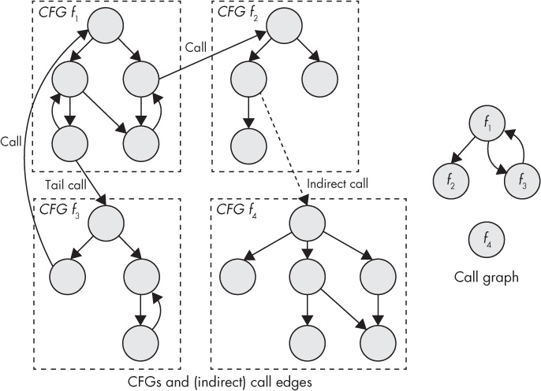

*Figure 6-6: CFGs and connections between functions (left) and the corresponding call graph (right)*

IDA Pro can also display partial call graphs, which show only the potential callers of a particular function of your choice. For manual analysis, these are often more useful than complete call graphs because complete call graphs often contain too much information. Figure 6-7 shows an example of a partial call graph in IDA Pro that reveals the references to function `sub_404610`. As you can see, the graph shows from where the function is called; for instance, `sub_404610` is called by `sub_4e1bd0`, which is itself called by `sub_4e2fa0`.

In addition, the call graphs produced by IDA Pro show instructions that store the address of a function somewhere. For instance, at address `0x4e072c` in the `.text` section, there’s an instruction that stores the address of function `sub_4e2fa0` in memory. This is called “taking the address” of function `sub_4e2fa0`. Functions that have their address taken anywhere in the code are called *address-taken functions*.

It’s nice to know which functions are address-taken because this tells you they might be called indirectly, even if you don’t know exactly by which call site. If a function’s address is never taken and doesn’t appear in any data sections, you know it will never be called indirectly.^(9) That’s useful for some kinds of binary analysis or security applications, such as if you’re trying to secure the binary by restricting indirect calls to only legal targets.

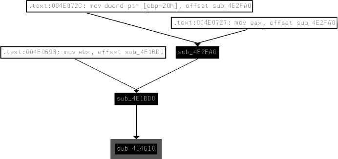

*Figure 6-7: A call graph of calls targeting function* `sub_404610`*, as seen in IDA Pro*

### Object-Oriented Code

You’ll find that many binary analysis tools, including fully featured disassemblers like IDA Pro, are targeted at programs written in *procedural languages* like C. Because code is structured mainly through the use of functions in these languages, binary analysis tools and disassemblers provide features such as function detection to recover programs’ function structure, and they call graphs to examine the relationship between functions.

Object-oriented languages like C++ structure code using *classes* that group logically connected functions and data. They typically also offer complex exception-handling features that allow any instruction to throw an exception, which is then caught by a special block of code that handles the exception. Unfortunately, current binary analysis tools lack the ability to recover class hierarchies and exception-handling structures.

To make matters worse, C++ programs often contain lots of function pointers because of the way virtual methods are typically implemented. *Virtual methods* are class methods (functions) that are allowed to be overridden in a derived class. In a classic example, you might define a class called `Shape` that has a derived class called `Circle`. `Shape` defines a virtual method called `area` that computes the area of the shape, and `Circle` overrides that method with its own implementation appropriate to circles.

When compiling a C++ program, the compiler may not know whether a pointer will point to a base `Shape` object or a derived `Circle` object at runtime, so it cannot statically determine which implementation of the `area` method should be used at runtime. To solve this issue, compilers emit tables of function pointers, called *vtables*, that contain pointers to all the virtual functions of a particular class. Vtables are usually kept in read-only memory, and each polymorphic object has a pointer (called a *vptr*) to the vtable for the object’s type. To invoke a virtual method, the compiler emits code that follows the object’s vptr at runtime and indirectly calls the correct entry in its vtable. Unfortunately, all these indirect calls make the program’s control flow even more difficult to follow.

The lack of support for object-oriented programs in binary analysis tools and disassemblers means that if you want to structure your analysis around the class hierarchy, you’re on your own. When reverse engineering a C**++** program manually, you can often piece together the functions and data structures belonging to different classes, but this requires significant effort. I won’t go into details on this subject here in order to keep our focus on (semi)automated binary analysis techniques. If you’re interested in learning how to manually reverse C++ code, I recommend Eldad Eilam’s book *Reversing: Secrets of Reverse Engineering* (Wiley, 2005).

In case of automated analysis, you can (as most binary analysis tools do) simply pretend classes don’t exist and treat object-oriented programs the same as procedural programs. In fact, this “solution” works adequately for many kinds of analysis and saves you from the pain of having to implement special C++ support unless really necessary.

#### *6.3.2 Structuring Data*

As you saw, disassemblers automatically identify various types of code structures to help your binary analysis efforts. Unfortunately, the same cannot be said for data structures. Automatic data structure detection in stripped binaries is a notoriously difficult problem, and aside from some research work,^(10) disassemblers generally don’t even attempt it.

But there are some exceptions. For example, if a reference to a data object is passed to a well-known function, such as a library function, disassemblers like IDA Pro can automatically infer the data type based on the specification of the library function. Figure 6-8 shows an example.

Near the bottom of the basic block, there’s a call to the well-known `send` function used to send a message over a network. Since IDA Pro knows the parameters of the `send` function, it can label the parameter names (`flags`, `len`, `buf`, `s`) and infer the data types of the registers and memory objects used to load the parameters.

Additionally, primitive types can sometimes be inferred by the registers they’re kept in or the instructions used to manipulate the data. For instance, if you see a floating-point register or instruction being used, you know the data in question is a floating-point number. If you see a `lodsb` (*load string byte*) or `stosb` (*store string byte*) instruction, it’s likely manipulating a string.

For composite types such as `struct` types or arrays, all bets are off, and you’ll have to rely on your own analysis. As an example of why automatic identification of composite types is hard, take a look at how the following line of C code is compiled into machine code:

```
ccf->user = pwd->pw_uid;
```

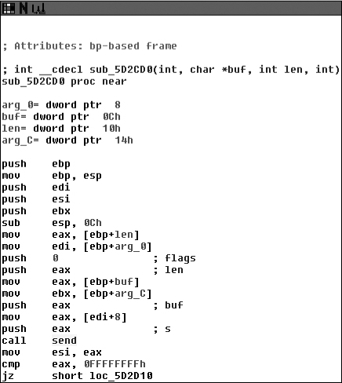

*Figure 6-8: IDA Pro automatically infers data types based on the use of the* `send` *function.*

This is a line from the `nginx` v1.8.0 source, where an integer field from one `struct` is assigned to a field in another `struct`. When compiled with `gcc` v5.1 at optimization level `-O2`, this results in the following machine code:

```
mov eax,DWORD PTR [rax+0x10]
mov DWORD PTR [rbx+0x60],eax
```

Now let’s take a look at the following line of C code, which copies an integer from a heap-allocated array called `b` into another array `a`:

```
a[24] = b[4];
```

Here’s the result of compiling that with `gcc` v5.1, again at optimization level `-O2`:

```
mov eax,DWORD PTR [rsi+0x10]
mov DWORD PTR [rdi+0x60],eax
```

As you can see, the code pattern is exactly the same as for the `struct` assignment! This shows that there’s no way for any automated analysis to tell from a series of instructions like this whether they represent an array lookup, a `struct` access, or something else entirely. Problems like this make accurate detection of composite data types difficult, if not impossible in the general case. Keep in mind that this example is quite simple; imagine reversing a program that contains an array of `struct` types, or nested `struct`s, and trying to figure out which instructions index which data structure! Clearly, that’s a complex task that requires an in-depth analysis of the code. Given the complexity of accurately recognizing nontrivial data types, you can see why disassemblers make no attempt at automated data structure detection.

To facilitate structuring data manually, IDA Pro allows you to define your own composite types (which you have to infer by reversing the code) and assign these to data items. Chris Eagle’s *The IDA Pro Book* (No Starch Press, 2011) is a great resource on manually reversing data structures with IDA Pro.

#### *6.3.3 Decompilation*

As the name implies, *decompilers* are tools that attempt to “reverse the compilation process.” They typically start from disassembled code and translate it into a higher-level language, usually a form of C-like pseudocode. Decompilers are useful when reversing large programs because decompiled code is easier to read than lots of assembly instructions. But decompilers are limited to manual reversing because the decompilation process is too error-prone to serve as a reliable basis for any automated analysis. Although you won’t use decompilation in this book, let’s take a look at Listing 6-6 to give you an idea of what decompiled code looks like.

The most widely used decompiler is Hex-Rays, a plugin that ships with IDA Pro.^(11) Listing 6-6 shows the Hex-Rays output for the function shown earlier in Figure 6-5.

*Listing 6-6: A function decompiled with Hex-Rays*

```
➊ void **__usercall sub_4047D4<eax>(int a1<ebp>)
   {
➋    int   v1; // eax@1
      int   v2; // ebp@1
      int   v3; // ecx@4
      int   v5; // ST10_4@6
      int   i; // [sp+0h] [bp-10h]@3

➌    v2 = a1 + 12;
      v1 = *(_DWORD *)(v2 - 524);
      *(_DWORD *)(v2 - 540) = *(_DWORD *)(v2 - 520);
➍     if ( v1 == 1 )
         goto LABEL_5;
       if ( v1 != 2 )
       {
➎      for ( i = v2 - 472; ; i = v2 - 472 )
       {
         *(_DWORD *)(v2 - 524) = 0;
➏       sub_7A5950(i);
         v3 = *(_DWORD *)(v2 - 540);
         *(_DWORD *)(v2 - 524) = -1;
         sub_9DD410(v3);
   LABEL_5:
          ;
        }
     }
     *(_DWORD *)(v2 - 472) = &off_B98EC8;
     *(_DWORD *)(v2 - 56) = off_B991E4;
     *(_DWORD *)(v2 - 524) = 2;
     sub_58CB80(v2 - 56);
     *(_DWORD *)(v2 - 524) = 0;
     sub_7A5950(v2 - 472);
     v5 = *(_DWORD *)(v2 - 540);
     *(_DWORD *)(v2 - 524) = -1;
     sub_9DD410(v5);
➐   return &off_AE1854;
   }
```

As you can see in the listing, the decompiled code is a lot easier to read than raw assembly. The decompiler guesses the function’s signature ➊ and local variables ➋. Moreover, instead of assembly mnemonics, arithmetic and logical operations are expressed more intuitively, using C’s normal operators ➌. The decompiler also attempts to reconstruct control-flow constructs, such as `if`/`else` branches ➍, loops ➎, and function calls ➏. There’s also a C-style return statement, making it easier to see what the end result of the function is ➐.

Useful as all this is, keep in mind that decompilation is nothing more than a tool to help you understand what the program is doing. The decompiled code is nowhere close to the original C source, may fail explicitly, and suffers from any inaccuracies in the underlying disassembly as well as inaccuracies in the decompilation process itself. That’s why it’s generally not a good idea to layer more advanced analyses on top of decompilation.

#### *6.3.4 Intermediate Representations*

Instruction sets like x86 and ARM contain many different instructions with complex semantics. For instance, on x86, even seemingly simple instructions like `add` have side effects, such as setting status flags in the `eflags` register. The sheer number of instructions and side effects makes it difficult to reason about binary programs in an automated way. For example, as you’ll see in Chapters 10 through 13, dynamic taint analysis and symbolic execution engines must implement explicit handlers that capture the data-flow semantics of all the instructions they analyze. Accurately implementing all these handlers is a daunting task.

*Intermediate representations (IR)*, also known as *intermediate languages*, are designed to remove this burden. An IR is a simple language that serves as an abstraction from low-level machine languages like x86 and ARM. Popular IRs include *Reverse Engineering Intermediate Language (REIL)* and *VEX IR* (the IR used in the *valgrind* instrumentation framework^(12)). There’s even a tool called *McSema* that translates binaries into *LLVM bitcode* (also known as *LLVM IR*).^(13)

The idea of IR languages is to automatically translate real machine code, such as x86 code, into an IR that captures all of the machine code’s semantics but is much simpler to analyze. For comparison, REIL contains only 17 different instructions, as opposed to x86’s hundreds of instructions. Moreover, languages like REIL, VEX and LLVM IR explicitly express all operations, with no obscure instruction side effects.

It’s still a lot of work to implement the translation step from low-level machine code to IR code, but once that work is done, it’s much easier to implement new binary analyses on top of the translated code. Instead of having to write instruction-specific handlers for every binary analysis, with IRs you only have to do that once to implement the translation step. Moreover, you can write translators for many ISAs, such as x86, ARM, and MIPS, and map them all onto the same IR. That way, any binary analysis tool that works on that IR automatically inherits support for all of the ISAs that the IR supports.

The trade-off of translating a complex instruction set like x86 into a simple language like REIL, VEX, or LLVM IR is that IR languages are far less concise. That’s an inherent result of expressing complex operations, including all side effects, with a limited number of simple instructions. This is generally not an issue for automated analyses, but it does tend to make intermediate representations hard to read for humans. To give you an idea of what an IR looks like, take a look at Listing 6-7, which shows how the x86-64 instruction `add rax,rdx` translates into VEX IR.^(14)

*Listing 6-7: Translation of the x86-64 instruction* add rax,rdx *into VEX IR*

```
➊ IRSB {
➋    t0:Ity_I64 t1:Ity_I64 t2:Ity_I64 t3:Ity_I64
➌    00   |   ------ IMark(0x40339f, 3, 0) ------
➍    01   |   t2 = GET:I64(rax)
      02   |   t1 = GET:I64(rdx)
➎    03   |   t0 = Add64(t2,t1)
➏    04   |   PUT(cc_op) = 0x0000000000000004
      05   |   PUT(cc_dep1) = t2
      06   |   PUT(cc_dep2) = t1 
➐    07   |   PUT(rax) = t0
➑    08   |   PUT(pc) = 0x00000000004033a2
      09   |   t3 = GET:I64(pc) 
➒   NEXT: PUT(rip) = t3; Ijk_Boring
   }
```

As you can see, the single `add` instruction results in 10 VEX instructions, plus some metadata. First, there’s some metadata that says this is an *IR super block (IRSB)* ➊ corresponding to one machine instruction. The IRSB contains four temporary values labeled `t0`–`t3`, all of type `Ity_I64` (64-bit integer) ➋. Then there’s an *IMark* ➌, which is metadata stating the machine instruction’s address and length, among other things.

Next come the actual IR instructions modeling the `add`. First, there are two `GET` instructions that fetch 64-bit values from `rax` and `rdx` into temporary stores `t2` and `t1`, respectively ➍. Note that, here, `rax` and `rdx` are just symbolic names for the parts of VEX’s state used to model these registers—the VEX instructions don’t fetch from the real `rax` or `rdx` registers but rather from VEX’s mirror state of those registers. To perform the actual addition, the IR uses VEX’s `Add64` instruction, adding the two 64-bit integers `t2` and `t1` and storing the result in `t0` ➎.

After the addition, there are some `PUT` instructions that model the `add` instruction’s side effects, such as updating the x86 status flags ➏. Then, another `PUT` stores the result of the addition into VEX’s state representing `rax` ➐. Finally, the VEX IR models updating the program counter to the next instruction ➑. The `Ijk_Boring` (*Jump Kind Boring* ) ➒ is a control-flow hint that says the `add` instruction doesn’t affect the control flow in any interesting way; since the `add` isn’t a branch of any kind, control just “falls through” to the next instruction in memory. In contrast, branch instructions can be marked with hints like `Ijk_Call` or `Ijk_Ret` to inform the analysis that a call or return is taking place, for example.

When implementing tools on top of an existing binary analysis framework, you typically won’t have to deal with IR. The framework will handle all IR-related stuff internally. However, it’s useful to know about IRs if you ever plan to implement your own binary analysis framework or modify an existing one.

### 6.4 Fundamental Analysis Methods

The disassembly techniques you’ve learned so far in this chapter are the foundation of binary analysis. Many of the advanced techniques discussed in later chapters, such as binary instrumentation and symbolic execution, are based on these basic disassembly methods. But before moving on to those techniques, there are a few “standard” analyses I’d like to cover because they’re widely applicable. Note that these aren’t stand-alone binary analysis techniques, but you can use them as ingredients of more advanced binary analyses. Unless I note otherwise, these are all normally implemented as static analyses, though you can also modify them to work for dynamic execution traces.

#### *6.4.1 Binary Analysis Properties*

First, let’s go over some of the different properties that any binary analysis approach can have. This will help to classify the different techniques I’ll cover here and in later chapters and help you understand their trade-offs.

### Interprocedural and Intraprocedural Analysis

Recall that functions are one of the fundamental code structures that disassemblers attempt to recover because it’s more intuitive to analyze code at the function level. Another reason for using functions is scalability: some analyses are simply infeasible when applied to a complete program.

The number of possible paths through a program increases exponentially with the number of control transfers (such as jumps and calls) in the program. In a program with just 10 `if`/`else` branches, there are up to 2¹⁰ = 1,024 possible paths through the code. In a program with a hundred such branches, there are up to 1.27 × 10³⁰ possible paths, and a thousand branches yield up to 1.07 × 10³⁰¹ paths! Many programs have far more branches than that, so it’s not computationally feasible to analyze every possible path through a nontrivial program.

That’s why computationally expensive binary analyses are often *intraprocedural*: they consider the code only within a single function at a time. Typically, an intraprocedural analysis will analyze the CFG of each function in turn. This is in contrast to *interprocedural* analysis, which considers an entire program as a whole, typically by linking all the function CFGs together via the call graph.

Because most functions contain only a few dozen control transfer instructions, complex analyses are computationally feasible at the function level. If you individually analyze 10 functions with 1,024 possible paths each, you analyze a total of 10 × 1,024 = 10,240 paths; that’s a lot better than the 1,024¹⁰ ≈ 1.27 × 10³⁰ paths you’d have to analyze if you considered the whole program at once.

The downside of intraprocedural analysis is that it’s not complete. For instance, if your program contains a bug that’s triggered only after a very specific combination of function calls, an intraprocedural bug detection tool won’t find the bug. It will simply consider each function on its own and conclude there’s nothing wrong. In contrast, an interprocedural tool would find the bug but might take so long to do so that the results won’t matter anymore.

As another example, let’s consider how a compiler might decide to optimize the code shown in Listing 6-8, depending on whether it’s using intraprocedural or interprocedural optimization.

*Listing 6-8: A program containing a dead function*

```
   #include <stdio.h>

   static void
➊ dead(int x)
   {
➋    if(x == 5) {
        printf("Never reached\n");
     }
   }

   int
   main(int argc, char *argv[])
   {
➌   dead(4);
     return 0;
   }
```

In this example, there’s a function called `dead` that takes a single integer parameter `x` and returns nothing ➊. Inside the function, there is a branch that will print a message only if `x` is equal to 5 ➋. As it happens, `dead` is invoked from only one location, with the constant value 4 as its argument ➌. Thus, the branch at ➋ is never taken, and no message is ever printed.

Compilers use an optimization called *dead code elimination* to find instances of code that can never be reached in practice so that they can omit such useless code in the compiled binary. In this case, though, a purely intraprocedural dead code elimination pass would fail to eliminate the useless branch at ➋. This is because when the pass is optimizing `dead`, it doesn’t know about any of the code in other functions, so it doesn’t know where and how `dead` is invoked. Similarly, when it’s optimizing `main`, it cannot look inside `dead` to notice that the specific argument passed to `dead` at ➌ results in `dead` doing nothing.

It takes an interprocedural analysis to conclude that `dead` is only ever called from `main` with the value 4 and that this means the branch at ➋ will never be taken. Thus, an intraprocedural dead code elimination pass will output the entire `dead` function (and its invocations) in the compiled binary, even though it serves no purpose, while an interprocedural pass will omit the entire useless function.

### Flow-Sensitivity

A binary analysis can be either *flow-sensitive* or *flow-insensitive*.^(15) Flow-sensitivity means that the analysis takes the order of the instructions into account. To make this clearer, take a look at the following example in pseudocode.

```
x = unsigned_int(argv[0]) #  ➊x ∊ [0,∞]
x = x + 5                 #  ➋x ∊ [5,∞]
x = x + 10                #  ➌x ∊ [15,∞]
```

The code takes an unsigned integer from user input and then performs some computation on it. For this example, let’s assume you’re interested in doing an analysis that tries to determine the potential values each variable can assume; this is called *value set analysis*. A flow-insensitive version of this analysis would simply determine that `x` may contain any value since it gets its value from user input. While it’s true in general that `x` could take on any value at some point in the program, this isn’t true for *all* points in the program. So, the information provided by the flow-insensitive analysis is not very precise, but the analysis is relatively cheap in terms of computational complexity.

A flow-sensitive version of the analysis would yield more precise results. In contrast to the flow-insensitive variant, it provides an estimate of `x`’s possible value set *at each point in the program*, taking into account the previous instructions. At ➊, the analysis concludes that `x` can have any unsigned value since it’s taken from user input and there haven’t yet been any instructions to constrain the value of `x`. However, at ➋, you can refine the estimate: since the value 5 is added to `x`, you know that from this point on, `x` can only have a value of at least 5. Similarly, after the instruction at ➌, you know that `x` is at least equal to 15.

Of course, things aren’t quite so simple in real life, where you must deal with more complex constructs such as branches, loops, and (recursive) function calls instead of simple straight-line code. As a result, flow-sensitive analyses tend to be much more complex and also more computationally intensive than flow-insensitive analyses.

### Context-Sensitivity

While flow-sensitivity considers the order of instructions, *context-sensitivity* takes the order of function invocations into account. Context-sensitivity is meaningful only for interprocedural analyses. A *context-insensitive* interprocedural analysis computes a single, global result. On the other hand, a *context-sensitive* analysis computes a separate result for each possible path through the call graph (in other words, for each possible order in which functions may appear on the call stack). Note that this implies that the accuracy of a context-sensitive analysis is bounded by the accuracy of the call graph. The *context* of the analysis is the state accrued while traversing the call graph. I’ll represent this state as a list of previously traversed functions, denoted as \< *f*₁, *f*₂, . . . , *f*_(n) \>.

In practice, the context is usually limited, because very large contexts make flow-sensitive analysis too computationally expensive. For instance, the analysis may only compute results for contexts of five (or any arbitrary number of) consecutive functions, instead of for complete paths of indefinite length. As an example of the benefits of context-sensitive analysis, take a look at Figure 6-9.

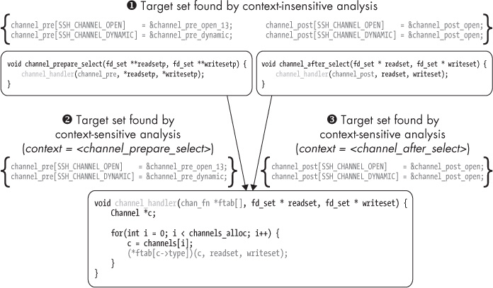

*Figure 6-9: Context-sensitive versus context-insensitive indirect call analysis in* `opensshd`

The figure shows how context-sensitivity affects the outcome of an indirect call analysis in `opensshd` v3.5. The goal of the analysis is to figure out the possible targets of an indirect call site in the `channel_handler` function (the line that reads `(*ftab[c->type])(c, readset, writeset);`). The indirect call site takes its target from a table of function pointers, which is passed in as an argument called `ftab` to `channel_handler`. The `channel_handler` function is called from two other functions: `channel_prepare_select` and `channel_after_select`. Each of these passes its own function pointer table as the `ftab` argument.

A context-insensitive indirect call analysis concludes that the indirect call in `channel_handler` could target any function pointer in either the `channel_pre` table (passed in from `channel_prepare_select`) or the `channel_post` table (passed in from `channel_after_select`). Effectively, it concludes that the set of possible targets is the union of all the possible sets in any path through the program ➊.

In contrast, the context-sensitive analysis determines a different target set for each possible context of preceding calls. If `channel_handler` was invoked by `channel_prepare_select`, then the only valid targets are those in the `channel_pre` table that it passes to `channel_handler` ➋. On the other hand, if `channel_handler` was called from `channel_after_select`, then only the targets in `channel_post` are possible ➌. In this example, I’ve discussed only a context of length 1, but in general the context could be arbitrarily long (as long as the longest possible path through the call graph).

As with flow-sensitivity, the upside of context-sensitivity is increased precision, while the downside is the greater computational complexity. In addition, context-sensitive analyses must deal with the large amount of state that must be kept to track all the different contexts. Moreover, if there are any recursive functions, the number of possible contexts is infinite, so special measures are needed to deal with these cases.^(16) Often, it may not be feasible to create a scalable context-sensitive version of an analysis without resorting to cost and benefit trade-offs such as limiting the context size.

#### *6.4.2 Control-Flow Analysis*

The purpose of any binary analysis is to figure out information about a program’s control-flow properties, its data-flow properties, or both. A binary analysis that looks at control-flow properties is aptly called a *control-flow analysis*, while a data flow–oriented analysis is called a *data-flow analysis*. The distinction is based purely on whether the analysis focuses on control or data flow; it doesn’t say anything about whether the analysis is intraprocedural or interprocedural, flow-sensitive or insensitive, or context-sensitive or insensitive. Let’s start by looking at a common type of control-flow analysis, called *loop detection*. In the next section, you’ll see some common data-flow analyses.

### Loop Detection

As the name implies, the purpose of loop detection is to find loops in the code. At the source level, keywords like `while` or `for` give you an easy way to spot loops. At the binary level, it’s a little harder, because loops are implemented using the same (conditional or unconditional) jump instructions used to implement `if`/`else` branches and switches.

The ability to find loops is useful for many reasons. For instance, from the compiler perspective, loops are interesting because much of a program’s execution time is spent inside loops (an often quoted number is 90 percent). That means that loops are an interesting target for optimization. From a security perspective, analyzing loops is useful because vulnerabilities such as buffer overflows tend to occur in loops.

Loop detection algorithms used in compilers use a different definition of a loop than what you might intuitively expect. These algorithms look for *natural loops*, which are loops that have certain well-formedness properties that make them easier to analyze and optimize. There are also algorithms that detect any *cycle* in a CFG, even those that don’t conform to the stricter definition of a natural loop. Figure 6-10 shows an example of a CFG containing a natural loop, as well as a cycle that isn’t a natural loop.

First, I’ll show you the typical algorithm used to detect natural loops. After that, it will be clearer to you why not every cycle fits that definition. To understand what a natural loop is, you’ll need to learn what a *dominance tree* is. The right side of Figure 6-10 shows an example of a dominance tree, which corresponds to the CFG shown on the left side of the figure.

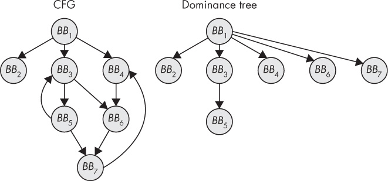

*Figure 6-10: A CFG and the corresponding dominance tree*

A basic block *A* is said to *dominate* another basic block *B* if the only way to get to *B* from the entry point of the CFG is to go through *A* first. For instance, in Figure 6-10, *BB*₃ dominates *BB*₅ but not *BB*₆, since *BB*₆ can also be reached via *BB*₄. Instead, *BB*₆ is dominated by *BB*₁, which is the last node that any path from the entry point to *BB*₆ must flow through. The dominance tree encodes all the dominance relationships in the CFG.

Now, a natural loop is induced by a *back edge* from a basic block *B* to *A*, where *A* dominates *B*. The loop resulting from this back edge contains all basic blocks dominated by *A* from which there is a path to *B*. Conventionally, *B* itself is excluded from this set. Intuitively, this definition means that natural loops cannot be entered somewhere in the middle but only at a well-defined *header node*. This simplifies the analysis of natural loops.

For instance, in Figure 6-10, there’s a natural loop spanning basic blocks *BB*₃ and *BB*₅ since there’s a back edge from *BB*₅ to *BB*₃ and *BB*₃ dominates *BB*₅. In this case, *BB*₃ is the header node of the loop, *BB*₅ is the “loopback” node, and the loop “body” (which by definition doesn’t include the header and loopback nodes) doesn’t contain any nodes.

### Cycle Detection

You may have noticed another back edge in the graph, leading from *BB*₇ to *BB*₄. This back edge induces a cycle, but *not* a natural loop, since the loop can be entered “in the middle” at *BB*₆ or *BB*₇. Because of this, *BB*₄ doesn’t dominate *BB*₇, so the cycle does not meet the definition of a natural loop.

To find cycles like this, including any natural loops, you only need the CFG, not the dominance tree. Simply start a depth-first search (DFS) from the entry node of the CFG, then keep a stack where you push any basic block that the DFS traverses and “pop” it back off when the DFS backtracks. If the DFS ever hits a basic block that’s already on the stack, then you’ve found a cycle.

For instance, let’s assume you’re doing a DFS on the CFG shown in Figure 6-10. The DFS starts at the entry point, *BB*₁. Listing 6-9 shows how the DFS state evolves and how the DFS detects both cycles in the CFG (for brevity, I don’t show how the DFS continues after finding both cycles).

*Listing 6-9: Cycle detection using DFS*

```
    0:   [BB1]
    1:   [BB1,BB2]
    2:   [BB1]
    3:   [BB1,BB3]
    4:   [BB1,BB3,BB5]
➊   5:   [BB1,BB3,BB5,BB3]                 *cycle found*
    6:   [BB1,BB3,BB5]
    7:   [BB1,BB3,BB5,BB7]
    8:   [BB1,BB3,BB5,BB7,BB4]
    9:   [BB1,BB3,BB5,BB7,BB4,BB6]
➋  10:  [BB1,BB3,BB5,BB7,BB4,BB6,BB7]      *cycle found*
...
```

First, the DFS explores the leftmost branch of *BB*₁ but quickly backtracks as it hits a dead end. It then enters the middle branch, leading from *BB*₁ to *BB*₃, and continues its search through *BB*₅, after which it hits *BB*₃ again, thereby finding the cycle encompassing *BB*₃ and *BB*₅ ➊. It then backtracks to *BB*₅ and continues its search down the path leading to *BB*₇, then *BB*₄, *BB*₆, until finally hitting *BB*₇ again, finding the second cycle ➋.

#### *6.4.3 Data-Flow Analysis*

Now let’s take a look at some common data-flow analysis techniques: reaching definitions analysis, use-def chains, and program slicing.

### Reaching Definitions Analysis

*Reaching definitions analysis* answers the question, “Which data definitions can reach this point in the program?” When I say a data definition can “reach” a point in the program, I mean that a value assigned to a variable (or, at a lower level, a register or memory location) can reach that point without the value being overwritten by another assignment in the meantime. Reaching definitions analysis is usually applied at the CFG level, though it can also be used interprocedurally.

The analysis starts by considering for each individual basic block which definitions the block *generates* and which it *kills*. This is usually expressed by computing a *gen* and *kill* set for each basic block. Figure 6-11 shows an example of a basic block’s *gen* and *kill* sets.

The *gen* set for *BB*₃ contains the statements numbered 6 and 8 since those are data definitions in *BB*₃ that survive until the end of the basic block. Statement 7 doesn’t survive since `z` is overwritten by statement 8. The *kill* set contains statements 1, 3, and 4 from *BB*₁ and *BB*₂ since those assignments are overwritten by other assignments in *BB*₃.

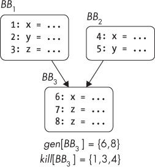

*Figure 6-11: Example of* gen *and* kill *sets for a basic block*

After computing each basic block’s *gen* and *kill* sets, you have a *local* solution that tells you which data definitions each basic block generates and kills. From that, you can compute a *global* solution that tells you which definitions (from anywhere in the CFG) can reach the start of a basic block and which can still be alive after the basic block. The global set of definitions that can reach a basic block *B* is expressed as a set *in*\[*B*\], defined as follows:

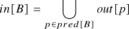

Intuitively, this means the set of definitions reaching *B* is the union of all sets of definitions leaving other basic blocks that precede *B*. The set of definitions leaving a basic block *B* is denoted as *out*\[*B*\] and defined as follows:

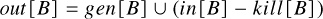

In other words, the definitions that leave *B* are those *B* either generates itself or that *B* receives from its predecessors (as part of its *in* set) and doesn’t kill. Note that there’s a mutual dependency between the definitions of the *in* and *out* sets: *in* is defined in terms of *out*, and vice versa. This means that in practice, it’s not enough for a reaching definitions analysis to compute the *in* and *out* sets for each basic block just once. Instead, the analysis must be iterative: in each iteration, it computes the sets for every basic block, and it continues iterating until there are no more changes in the sets. Once all of the *in* and *out* sets have reached a stable state, the analysis is complete.

Reaching definitions analysis forms the basis of many data-flow analyses. This includes *use-def analysis*, which I’ll discuss next.

### Use-Def Chains

*Use-def chains* tell you, at each point in the program where a variable is used, where that variable may have been defined. For instance, in Figure 6-12, the use-def chain for `y` in *B*₂ contains statements 2 and 7. This is because at that point in the CFG, `y` could have gotten its value from the original assignment at statement 2 or (after one iteration of the loop) at statement 7. Note that there’s no use-def chain for `z` in *B*₂, as `z` is only assigned in that basic block, not used.

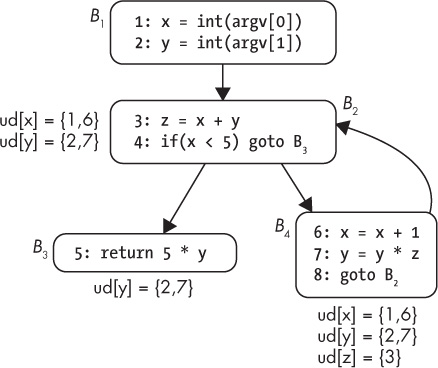

*Figure 6-12: Example of use-def chains*

One instance where use-def chains come in handy is decompilation: they allow the decompiler to track where a value used in a conditional jump was compared. This way, the decompiler can take a `cmp x,5` and `je` (jump if equal) instruction and merge them into a higher-level expression like `if(x == 5)`. Use-def chains are also used in compiler optimizations such as *constant propagation*, which replaces a variable by a constant if that’s the only possible value at that point in the program. They’re also useful in a myriad of other binary analysis scenarios.

At first glance, computing use-def chains may seem complex. But given a reaching definitions analysis of the CFG, it’s quite straightforward to compute the use-def chain for a variable in a basic block using the *in* set to find the definitions of that variable that may reach the basic block. In addition to use-def chains, it’s also possible to compute def-use chains. In contrast to use-def chains, def-use chains tell you where in the program a given data definition may be used.

### Program Slicing

*Slicing* is a data-flow analysis that aims to extract all instructions (or, for source-based analysis, lines of code) that contribute to the values of a chosen set of variables at a certain point in the program (called the *slicing criterion*). This is useful for debugging when you want to find out which parts of the code may be responsible for a bug, as well as when reverse engineering. Computing slices can get pretty complicated, and it’s still more of an active research topic than a production-ready technique. Still, it’s an interesting technique, so it’s worth learning about. Here, I’ll just give you the general idea, but if you want to play around with slicing, I suggest taking a look at the angr reverse-engineering framework,^(17) which offers built-in slicing functionality. You’ll also see how to implement a practical slicing tool with symbolic execution in Chapter 13.

Slices are computed by tracking control and data flows to figure out which parts of the code are irrelevant to the slice and then deleting those parts. The final slice is whatever remains after deleting all the irrelevant code. As an example, let’s say you want to know which lines in Listing 6-10 contribute to the value of `y` on line 14.

*Listing 6-10: Using slicing to find the lines contributing to* y *on line 14*

```
1:  x = int(argv[0])
2:  y = int(argv[1])
3:
4:  z = x +   y
5:  while(x   <  5) {
6:    x = x   +  1
7:    y = y   +  2
8:    z = z   +  x
9:    z = z   +  y
10:   z = z  *   5
11: }
12:
13: print(x)
14: print(y)
15: print(z)
```

The slice contains the lines shaded gray in this code. Note that all the assignments to `z` are completely irrelevant to the slice because they make no difference to the eventual value of `y`. What happens with `x` *is* relevant since it determines how often the loop on line 5 iterates, which in turn affects the value of `y`. If you compile a program with just the lines included in the slice, it will yield exactly the same output for the `print(y)` statement as the full program would.

Originally, slicing was proposed as a static analysis, but nowadays it’s often applied to dynamic execution traces instead. Dynamic slicing has the advantage that it tends to produce smaller (and therefore more readable) slices than static slicing does.

What you just saw is known as *backward slicing* since it searches backward for lines that affect the chosen slicing criterion. But there’s also *forward slicing*, which starts from a point in the program and then searches forward to determine which other parts of the code are somehow affected by the instruction and variable in the chosen slicing criterion. Among other things, this can predict which parts of the code will be impacted by a change to the code at the chosen point.

### 6.5 Effects of Compiler Settings on Disassembly

Compilers optimize code to minimize its size or execution time. Unfortunately, optimized code is usually significantly harder to accurately disassemble (and therefore analyze) than unoptimized code.

Optimized code corresponds less closely to the original source, making it less intuitive to a human. For instance, when optimizing arithmetic code, compilers will go out of their way to avoid the very slow `mul` and `div` instructions and instead implement multiplications and divisions using a series of bitshift and add operations. These can be challenging to decipher when reverse engineering the code.

Also, compilers often merge small functions into the larger functions calling them, to avoid the cost of the `call` instruction; this merging is called *inlining*. Thus, not all functions you see in the source code are necessarily there in the binary, at least not as a separate function. In addition, common function optimizations such as tail calls and optimized calling conventions make function detection significantly less accurate.

At higher optimization levels, compilers often emit padding bytes between functions and basic blocks to align them at memory addresses where they can be most efficiently accessed. Interpreting these padding bytes as code can cause disassembly errors if the padding bytes aren’t valid instructions. Moreover, compilers may “unroll” loops to avoid the overhead of jumping to the next iteration. This hinders loop detection algorithms and decompilers, which try to find high-level constructs like `while` and `for` loops in the code.

Optimizations may also hinder data structure detection, not just code discovery. For instance, optimized code may use the same base register to index different arrays at the same time, making it difficult to recognize them as separate data structures.

Nowadays, *link-time optimization (LTO)* is gaining in popularity, which means that optimizations that were traditionally applied on a per-module basis can now be used on the whole program. This increases the optimization surface for many optimizations, making the effects even more profound.

When writing and testing your own binary analysis tools, always keep in mind that their accuracy may suffer from optimized binaries.

In addition to the previous optimizations, binaries are increasingly often compiled as *position-independent code (PIC)* to accommodate security features like *address-space layout randomization (ASLR)*, which need to be able to move code and data around without this breaking the binary.^(18) Binaries compiled with PIC are called *position-independent executables (PIEs)*. In contrast to position-dependent binaries, PIE binaries don’t use absolute addresses to reference code and data. Instead, they use references relative to the program counter. This also means that some common constructs, such as the PLT in ELF binaries, look different in PIE binaries than in non-PIE binaries. Thus, binary analysis tools that aren’t built with PIC in mind may not work properly for such binaries.

### 6.6 Summary

You’re now familiar with the inner workings of disassemblers as well as the essential binary analysis techniques you’ll need to understand the rest of this book. Now you’re ready to move on to techniques that will allow you to not only disassemble binaries but also modify them. Let’s start with basic binary modification techniques in Chapter 7!

Exercises

1\. Confusing objdump

Write a program that confuses `objdump` such that it interprets data as code, or vice versa. You’ll probably need to use some inline disassembly to achieve this (for instance, using `gcc`’s `asm` keyword).

2\. Confusing a Recursive Disassembler

Write another program, this time so that it tricks your favorite recursive disassembler’s function detection algorithm. There are various ways to do this. For instance, you could create a tail-called function or a function that has a `switch` with multiple return cases. See how far you can go with confusing the disassembler!

3\. Improving Function Detection

Write a plugin for your recursive disassembler of choice so that it can better detect functions such as those the disassembler missed in the previous exercise. You’ll need a recursive disassembler that you can write plugins for, such as IDA Pro, Hopper, or Medusa.