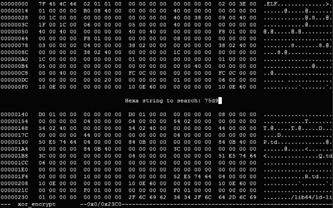
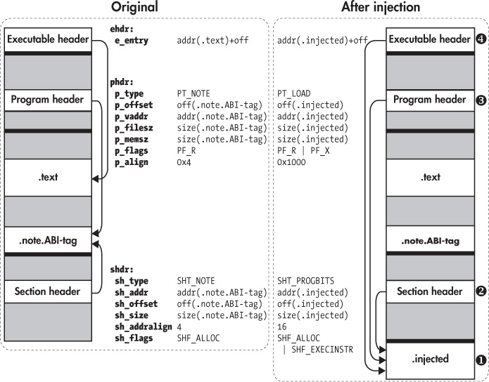

## 7 SIMPLE CODE INJECTION TECHNIQUES FOR ELF

In this chapter, you’ll learn several techniques for injecting code into an existing ELF binary, allowing you to modify or augment the binary’s behavior. Although the techniques discussed in this chapter are convenient for making small modifications, they’re not very flexible. This chapter will demonstrate their limitations so you can understand the need for more comprehensive code modification techniques, which you’ll learn in Chapter 9.

### 7.1 Bare-Metal Binary Modification Using Hex Editing

The most straightforward way to modify an existing binary is by directly editing it using a *hex editor*, which is a program that represents the bytes of a binary file in hexadecimal format and allows you to edit these bytes. Usually, you’ll first use a disassembler to identify the code or data bytes you want to change and then use a hex editor to make the changes.

The advantage of this approach is that it’s simple and requires only basic tools. The disadvantage is that it only allows in-place editing: you can change code or data bytes but not add anything new. Inserting a new byte causes all the bytes after it to shift to another address, which breaks references to the shifted bytes. It’s difficult (or even impossible) to correctly identify and fix all the broken references, because the relocation information needed for this is usually discarded after the linking phase. If the binary contains any padding bytes, dead code (such as unused functions), or unused data, you can overwrite those parts of the binary with something new. However, this approach is limited since most binaries don’t contain a lot of dead bytes that you can safely overwrite.

Still, in some cases hex editing may be all you need. For instance, malware uses anti-debugging techniques to check the environment it’s running in for signs of analysis software. If the malware suspects it’s being analyzed, it will refuse to run or attack the analysis environment. When you’re analyzing a malware sample and you suspect that it contains anti-debugging checks, you can disable them using hex editing to overwrite the checks with `nop` (do-nothing) instructions. Sometimes, you can even fix simple bugs in a program using a hex editor. To show you an example of this, I’ll use a hex editor called `hexedit`, an open source editor for Linux that comes preinstalled on the virtual machine, to fix an off-by-one bug in a simple program.

### Finding the Right Opcode

When you’re editing code in a binary, you need to know which values to insert, and for that, you need to know the format and hexadecimal encodings of the machine instructions. There are handy overviews online of the opcodes and operand formats for x86 instructions, such as *<http://ref.x86asm.net>*. For more detailed information about how a given x86 instruction works, consult the official Intel manual.*^(a)*

*a*. *<https://software.intel.com/sites/default/files/managed/39/c5/325462-sdm-vol-1-2abcd-3abcd.pdf>*

#### *7.1.1 Observing an Off-by-One Bug in Action*

*Off-by-one bugs* typically occur in loops when the programmer uses an erroneous loop condition that causes the loop to read or write one too few or one too many bytes. The example program in Listing 7-1 encrypts a file but accidentally leaves the last byte unencrypted because of an off-by-one bug. To fix this bug, I’ll first use `objdump` to disassemble the binary and locate the offending code. Then I’ll use `hexedit` to edit that code and remove the offby-one bug.

*Listing 7-1:* xor_encrypt.c

```
   #include  <stdio.h>
   #include  <stdlib.h>
   #include  <string.h>
   #include  <stdarg.h>

   void
   die(char const *fmt, ...)
   {
     va_list args;

     va_start(args, fmt);
     vfprintf(stderr, fmt, args);
     va_end(args);

     exit(1);
   }

   int
   main(int argc, char *argv[])
   {
     FILE *f;
     char *infile, *outfile;
     unsigned char *key, *buf;
     size_t i, j, n;

     if(argc != 4)
       die("Usage: %s <in file> <out file> <key>\n", argv[0]);

     infile  = argv[1];
     outfile = argv[2];
     key     = (unsigned char*)argv[3];

➊   f = fopen(infile, "rb");
     if(!f) die("Failed to open file '%s'\n", infile);

➋   fseek(f, 0, SEEK_END);
     n = ftell(f);
     fseek(f, 0, SEEK_SET);

➌   buf = malloc(n);
     if(!buf) die("Out of memory\n");

➍   if(fread(buf, 1, n, f) != n)
       die("Failed to read file '%s'\n", infile);

➎   fclose(f);

     j = 0;
➏   for(i = 0; i < n-1; i++) { /* Oops! An off-by-one error! */
       buf[i] ^= key[j];
       j = (j+1) % strlen(key);
     }

➐   f = fopen(outfile, "wb");
    if(!f) die("Failed to open file '%s'\n", outfile);

➑   if(fwrite(buf, 1, n, f) != n)
       die("Failed to write file '%s'\n", outfile);

➒   fclose(f);

     return 0;
  }
```

After parsing its command line arguments, the program opens the input file to encrypt ➊, determines the file size and stores it in a variable called `n` ➋, allocates a buffer ➌ to store the file in, reads the entire file into the buffer ➍, and then closes the file ➎. If anything goes wrong along the way, the program calls the `die` function to print an appropriate error message and exit.

The bug is in the next part of the program, which encrypts the file bytes using a simple `xor`-based algorithm. The program enters a `for` loop to loop over the buffer containing all the file bytes and encrypts each byte by computing its `xor` with the provided key ➏. Note the loop condition of the `for` loop: the loop starts at `i = 0` but only loops while `i < n-1`. That means the last encrypted byte is at index `n-2` in the buffer, so the final byte (at index `n-1`) is left unencrypted! This is the off-by-one bug, which we’ll fix using a hex editor to edit the binary.

After encrypting the file buffer, the program opens an output file ➐, writes the encrypted bytes to it ➑, and finally closes the output file ➒. Listing 7-2 shows an example run of the program (compiled using the Makefile provided on the virtual machine) where you can observe the off-by-one bug in action.

*Listing 7-2: Observing the off-by-one bug in the* xor_encrypt *program*

```
➊  $ ./xor_encrypt xor_encrypt.c encrypted foobar
➋  $ xxd xor_encrypt.c | tail
   000003c0: 6420 746f 206f 7065 6e20 6669 6c65 2027  d to open file '
   000003d0: 2573 275c 6e22 2c20 6f75 7466 696c 6529  %s'\n", outfile)
   000003e0: 3b0a 0a20 2069 6628 6677 7269 7465 2862  ;.. if(fwrite(b
   000003f0: 7566 2c20 312c 206e 2c20 6629 2021 3d20  uf, 1, n, f) !=
   00000400: 6e29 0a20 2020 2064 6965 2822 4661 696c  n).    die("Fail
   00000410: 6564 2074 6f20 7772 6974 6520 6669 6c65  ed to write file
   00000420: 2027 2573 275c 6e22 2c20 6f75 7466 696c  '%s'\n", outfil
   00000430: 6529 3b0a 0a20 2066 636c 6f73 6528 6629  e);.. fclose(f)
   00000440: 3b0a 0a20 2072 6574 7572 6e20 303b 0a7d  ;..   return 0;.}
   00000450: 0a➌0a                             ..
➍  $ xxd encrypted | tail
   000003c0: 024f 1b0d 411d 160a 0142 071b 0a0a 4f45  .O..A....B....OE
   000003d0: 4401 4133 0140 4d52 091a 1b04 081e 0346  D.A3.@MR.......F
   000003e0: 5468 6b52 4606 094a 0705 1406 1b07 4910  ThkRF..J......I.
   000003f0: 1309 4342 505e 4601 4342 075b 464e 5242  ..CBP.CB.[FNRB
   00000400: 0f5b 6c4f 4f42 4116 0f0a 4740 2713 0f03  .[lOOBA...G@'...
   00000410: 0a06 4106 094f 1810 0806 034f 090b 0d17  ..A..O.....O....
   00000420: 4648 4a11 462e 084d 4342 0e07 1209 060e  FHJ.F..MCB......
   00000430: 045b 5d65 6542 4114 0503 0011 045a 0046  .[]eeBA......Z.F
   00000440: 5468 6b52 461d 0a16 1400 084f 5f59 6b0f  ThkRF......O_Yk.
   00000450: 6c➎0a                                    l.
```

In this example, I’ve used the `xor_encrypt` program to encrypt its own source file using the key `foobar`, writing the output to a file called *encrypted* ➊. Using `xxd` to view the contents of the original source file ➋, you can see that it ends with the byte `0x0a` ➌. In the encrypted file, all bytes are garbled ➍except the last one, which is the same as in the original file ➎. This is because the off-by-one bug causes the last byte to be left unencrypted.

#### *7.1.2 Fixing the Off-by-One Bug*

Now let’s take a look at how to fix the off-by-one bug in the binary. In all examples in this chapter, you can pretend you don’t have the source code of the binaries you’re editing, even though you really do. This is to simulate real-life cases where you’re forced to use binary modification techniques, such as when you’re working on a proprietary or malicious program or a program whose source code is lost.

### Finding the Bytes That Cause the Bug

To fix the off-by-one bug, you need to change the loop condition so that it loops one more time to encrypt the last byte. Therefore, you first need to disassemble the binary and find the instructions responsible for enforcing the loop condition. Listing 7-3 contains the relevant instructions as shown by `objdump`.

*Listing 7-3: Disassembled code showing the off-by-one bug*

```
  $ objdump -M intel -d xor_encrypt
  ...
  4007c2:  49 8d 45 ff             lea         rax,[r13-0x1]
  4007c6:  31 d2                   xor         edx,edx
  4007c8:  48 85 c0                test        rax,rax
  4007cb:  4d 8d 24 06             lea         r12,[r14+rax*1]
  4007cf:  74 2e                   je          4007ff <main+0xdf>
  4007d1:  0f 1f 80 00 00 00 00    nop         DWORD PTR [rax+0x0]
➊ 4007d8: 41 0f b6 04 17           movzx       eax,BYTE PTR [r15+rdx*1]
  4007dd:  48 8d 6a 01             lea         rbp,[rdx+0x1]
  4007e1:  4c 89 ff                mov         rdi,r15
  4007e4:  30 03                   xor         BYTE PTR [rbx],al
  4007e6:  48 83 c3 01            ➋add         rbx,0x1
  4007ea:  e8 a1 fe ff ff          call        400690 <strlen@plt>
  4007ef:  31 d2                   xor         edx,edx
  4007f1:  48 89 c1                mov         rcx,rax
  4007f4:  48 89 e8                mov         rax,rbp
  4007f7:  48 f7 f1                div         rcx
  4007fa:  49 39 dc               ➌cmp         r12,rbx
  4007fd:  75 d9                  ➍jne         4007d8 <main+0xb8>
  4007ff:  48 8b 7c 24 08          mov         rdi,QWORD PTR [rsp+0x8]
  400804:  be 66 0b 40 00          mov         esi,0x400b66
...
```

The loop starts at address `0x4007d8` ➊, and the loop counter (`i`) is contained in the `rbx` register. You can see the loop counter being incremented in each loop iteration ➋. You can also see a `cmp` instruction ➌ that checks whether another loop iteration is needed. The `cmp` compares `i` (stored in `rbx`) to the value `n-1` (stored in `r12`). If another loop iteration is needed, the `jne` instruction ➍ jumps back to the start of the loop. If not, it falls through to the next instruction, ending the loop.

The `jne` instruction stands for “jump if not equal”^(1): it jumps back to the start of the loop if `i` is not equal to `n-1` (as determined by the `cmp`). In other words, since `i` is incremented in each loop iteration, the loop will run while `i < n-1`. But to fix the off-by-one bug, you want the loop to run while `i <= n-1` so that it runs one more time.

### Replacing the Offending Bytes

To implement this fix, you can use a hex editor to replace the opcode for the `jne` instruction, turning it into a different kind of jump. The `cmp` has `r12` (containing `n-1`) as its first operand, followed by `rbx` (containing `i`). Thus, you should use a `jae` (“jump if above or equal”) instruction so that the loop runs while `n-1 >= i`, which is just another way of saying `i <= n-1`. Now you can implement this fix using `hexedit`.

To follow along, go to the code folder for this chapter, run the Makefile, and then type `hexedit xor_encrypt` on the command line and press ENTER to open the `xor_encrypt` binary in the hex editor (it’s an interactive program). To find the specific bytes to modify, you can search for a byte pattern taken from a disassembler like `objdump`. In the case of Listing 7-3, you can see that the `jne` instruction you need to modify is encoded with the hexadecimal byte string `75d9`, so you’ll search for that pattern. In larger binaries, you’ll want to use longer patterns, possibly including bytes from other instructions, to ensure uniqueness. To search for a pattern in `hexedit`, press the / key. This should open up a prompt like the one shown in Figure 7-1, where you can enter the search pattern `75d9` and then press ENTER to start the search.



*Figure 7-1: Searching for a byte string with* `hexedit`

The search finds the pattern and moves the cursor to the first byte of the pattern. Referring to an x86 opcode reference or the Intel x86 manual, you can see that the `jne` instruction is encoded as an opcode byte (`0x75`) followed by a byte that encodes an offset to the jump location (`0xd9`). For these purposes, you just want to replace the `jne` opcode, `0x75`, with the opcode for a `jae` instruction, which is `0x73`, leaving the jump offset unchanged. Since the cursor is already on the byte you want to modify, all it takes to make the edit is to type the new byte value, `73`. As you type, `hexedit` highlights the modified byte value in boldface. Now, all that’s left is to save the modified binary by pressing CTRL-X to exit and then pressing Y to confirm the change. You’ve now fixed the off-by-one bug in the binary! Let’s confirm the change by using `objdump` again, as shown in Listing 7-4.

*Listing 7-4: Disassembly showing the patch for the off-by-one bug*

```
$ objdump -M intel -d xor_encrypt.fixed
...
4007c2:  49 8d 45 ff              lea         rax,[r13-0x1]
4007c6:  31 d2                    xor         edx,edx
4007c8:  48 85 c0                 test        rax,rax
4007cb:  4d 8d 24 06              lea         r12,[r14+rax*1]
4007cf:  74 2e                    je          4007ff <main+0xdf>
4007d1:  0f 1f 80 00 00 00 00     nop         DWORD PTR [rax+0x0]
4007d8:  41 0f b6 04 17           movzx       eax,BYTE PTR [r15+rdx*1]
4007dd:  48 8d 6a 01              lea         rbp,[rdx+0x1]
4007e1:  4c 89 ff                 mov         rdi,r15
4007e4:  30 03                    xor         BYTE PTR [rbx],al
4007e6:  48 83 c3 01              add         rbx,0x1
4007ea:  e8 a1 fe ff ff           call        400690 <strlen@plt>
4007ef:  31 d2                    xor         edx,edx
4007f1:  48 89 c1                 mov         rcx,rax
4007f4:  48 89 e8                 mov         rax,rbp
4007f7:  48 f7 f1                 div         rcx
4007fa:  49 39 dc                 cmp         r12,rbx
4007fd:  73 d9                   ➊jae         4007d8 <main+0xb8>
4007ff:  48 8b 7c 24 08           mov         rdi,QWORD PTR [rsp+0x8]
400804:  be 66 0b 40 00           mov         esi,0x400b66
...
```

As you can see, the original `jne` instruction is now replaced by `jae` ➊. To check that the fix works, let’s run the program again to see whether it encrypts the last byte. Listing 7-5 shows the results.

*Listing 7-5: Output of the fixed* xor_encrypt *program*

```
➊ $ ./xor_encrypt xor_encrypt.c encrypted foobar
➋ $ xxd encrypted | tail
  000003c0: 024f 1b0d 411d 160a 0142 071b 0a0a 4f45 .O..A....B....OE
  000003d0: 4401 4133 0140 4d52 091a 1b04 081e 0346 D.A3.@MR.......F
  000003e0: 5468 6b52 4606 094a 0705 1406 1b07 4910 ThkRF..J......I.
  000003f0: 1309 4342 505e 4601 4342 075b 464e 5242 ..CBP.CB.[FNRB
  00000400: 0f5b 6c4f 4f42 4116 0f0a 4740 2713 0f03 .[lOOBA...G@'...
  00000410: 0a06 4106 094f 1810 0806 034f 090b 0d17 ..A..O.....O....
  00000420: 4648 4a11 462e 084d 4342 0e07 1209 060e FHJ.F..MCB......
  00000430: 045b 5d65 6542 4114 0503 0011 045a 0046 .[]eeBA......Z.F
  00000440: 5468 6b52 461d 0a16 1400 084f 5f59 6b0f ThkRF......O_Yk.
  00000450: 6c➌65                                   le
```

As before, you run the `xor_encrypt` program to encrypt its own source code ➊. Recall that in the original source file, the last byte’s value was `0x0a` (see Listing 7-2). Using `xxd` to inspect the encrypted file ➋, you can see that even the last byte is now properly encrypted ➌: it’s now `0x65` instead of `0x0a`.

You now know how to edit a binary using a hex editor! Although this example was simple, the procedure is the same for more complex binaries and edits.

### 7.2 Modifying Shared Library Behavior Using LD_PRELOAD

Hex editing is a nice way of making modifications to your binaries because it requires only basic tools, and since the modifications are small, edited binaries usually have virtually no performance or code/data size overhead compared to the original. However, as you’ve seen in the example in the previous section, hex editing is also tedious, error-prone, and restrictive because you cannot add new code or data. If your goal is to modify the behavior of shared library functions, you can achieve this more easily using `LD_PRELOAD`.

`LD_PRELOAD` is the name of an environment variable that influences the behavior of the dynamic linker. It allows you to specify one or more libraries for the linker to load before any other library, including standard system libraries such as *libc.so*. If a preloaded library contains a function with the same name as a function in a library loaded later, the first function is the one that will be used at runtime. This allows you to *override* library functions (even standard library functions like `malloc` or `printf`) with your own versions of those functions. This is useful not only for binary modification but also for programs for which source code is available, because the ability to modify the behavior of a library function can save you the trouble of having to painstakingly modify all points in the source where that library function is used. Let’s look at an example of how `LD_PRELOAD` can be useful to modify a binary’s behavior.

#### *7.2.1 A Heap Overflow Vulnerability*

The program I’ll be modifying in this example is `heapoverflow`, which contains a heap overflow vulnerability that you can fix using `LD_PRELOAD`. Listing 7-6 shows the source for the program.

*Listing 7-6:* heapoverflow.c

```
  #include <stdio.h>
  #include <stdlib.h>
  #include <string.h>

  int
  main(int argc, char *argv[])
  {
    char *buf;
    unsigned long len;

    if(argc != 3) {
      printf("Usage: %s <len> <string>\n", argv[0]);
      return 1;
    }

➊   len = strtoul(argv[1], NULL, 0);
    printf("Allocating %lu bytes\n", len);

➋   buf = malloc(len);

     if(buf && len > 0) {
       memset(buf, 0, len);

➌     strcpy(buf, argv[2]);
       printf("%s\n", buf);

➍     free(buf);
    }

    return 0;
  }
```

The `heapoverflow` program takes two command line arguments: a number and a string. It takes the given number, interpreting it as a buffer length ➊, and then allocates a buffer of that size using `malloc` ➋. Next, it uses `strcpy` ➌ to copy the given string into the buffer and then prints the buffer contents to the screen. Finally, it deallocates the buffer again using `free` ➍.

The overflow vulnerability is in the `strcpy` operation: since the length of the string is never checked, it may be too large to fit into the buffer. If that’s the case, the copy will result in a heap overflow, potentially corrupting other data on the heap and resulting in a crash or even exploitation of the program. But if the given string fits into the buffer, everything works fine, as you can see in Listing 7-7.

*Listing 7-7: Behavior of the* heapoverflow *program when given a benign input*

```
$ ./heapoverflow 13 'Hello world!'
Allocating 13 bytes
Hello world!
```

Here, I’ve told `heapoverflow` to allocate a 13-byte buffer and then copy the message “Hello world!” into it ➊. The program allocates the requested buffer, copies the message into it, and prints it back to screen as expected, since the buffer is exactly large enough to hold the string, including its terminating `NULL` character. Let’s examine Listing 7-8 to see what happens if you give a message that doesn’t fit into the buffer.

*Listing 7-8: Crash of the* heapoverflow *program when the input is too long*

```
➊ $ ./heapoverflow 13 `perl -e 'print "A"x100'`
➋ Allocating 13 bytes
➌ AAAAAAAAAAAAAAAAAAAAAAAAAAAAAAAAAAAAAAAAAAAAAAAAAAAAAAAAAAAAAAAAAAAAAAAAAAAAAAAAAAAAAAAAAAAA...
➍ *** Error in `./heapoverflow': free(): invalid next size (fast): 0x0000000000a10420 ***
  ======= Backtrace: =========
  /lib/x86_64-linux-gnu/libc.so.6(+0x777e5)[0x7f19129587e5]
  /lib/x86_64-linux-gnu/libc.so.6(+0x8037a)[0x7f191296137a]
  /lib/x86_64-linux-gnu/libc.so.6(cfree+0x4c)[0x7f191296553c]
  ./heapoverflow[0x40063e]
  /lib/x86_64-linux-gnu/libc.so.6(__libc_start_main+0xf0)[0x7f1912901830]
  ./heapoverflow[0x400679]
  ======= Memory map: ========
  00400000-00401000 r-xp 00000000 fc:03 37226406          /home/binary/code/chapter7/heapoverflow
  00600000-00601000 r--p 00000000 fc:03 37226406          /home/binary/code/chapter7/heapoverflow
  00601000-00602000 rw-p 00001000 fc:03 37226406          /home/binary/code/chapter7/heapoverflow
  00a10000-00a31000 rw-p 00000000 00:00 0                 [heap]
  7f190c000000-7f190c021000 rw-p 00000000 00:00 0
  7f190c021000-7f1910000000 ---p 00000000 00:00 0
  7f19126cb000-7f19126e1000 r-xp 00000000 fc:01 2101767   /lib/x86_64-linux-gnu/libgcc_s.so.1
  7f19126e1000-7f19128e0000 ---p 00016000 fc:01 2101767   /lib/x86_64-linux-gnu/libgcc_s.so.1
  7f19128e0000-7f19128e1000 rw-p 00015000 fc:01 2101767   /lib/x86_64-linux-gnu/libgcc_s.so.1
  7f19128e1000-7f1912aa1000 r-xp 00000000 fc:01 2097475   /lib/x86_64-linux-gnu/libc-2.23.so
  7f1912aa1000-7f1912ca1000 ---p 001c0000 fc:01 2097475   /lib/x86_64-linux-gnu/libc-2.23.so
  7f1912ca1000-7f1912ca5000 r--p 001c0000 fc:01 2097475   /lib/x86_64-linux-gnu/libc-2.23.so
  7f1912ca5000-7f1912ca7000 rw-p 001c4000 fc:01 2097475   /lib/x86_64-linux-gnu/libc-2.23.so
  7f1912ca7000-7f1912cab000 rw-p 00000000 00:00 0
  7f1912cab000-7f1912cd1000 r-xp 00000000 fc:01 2097343   /lib/x86_64-linux-gnu/ld-2.23.so
  7f1912ea5000-7f1912ea8000 rw-p 00000000 00:00 0
  7f1912ecd000-7f1912ed0000 rw-p 00000000 00:00 0
  7f1912ed0000-7f1912ed1000 r--p 00025000 fc:01 2097343   /lib/x86_64-linux-gnu/ld-2.23.so
  7f1912ed1000-7f1912ed2000 rw-p 00026000 fc:01 2097343   /lib/x86_64-linux-gnu/ld-2.23.so
  7f1912ed2000-7f1912ed3000 rw-p 00000000 00:00 0
  7ffe66fbb000-7ffe66fdc000 rw-p 00000000 00:00 0         [stack]
  7ffe66ff3000-7ffe66ff5000 r--p 00000000 00:00 0         [vvar]
  7ffe66ff5000-7ffe66ff7000 r-xp 00000000 00:00 0         [vdso]
  ffffffffff600000-ffffffffff601000 r-xp 00000000 00:00 0 [vsyscall]
➎ Aborted (core dumped)
```

Again, I’ve told the program to allocate 13 bytes, but now the message is far too large to fit into the buffer: it’s a string consisting of 100 *A*s in a row ➊. The program allocates the 13-byte buffer as earlier ➋ and then copies the message into it and prints it to screen ➌. However, things go wrong when `free` is called ➍ to deallocate the buffer: the overflowing message has overwritten metadata on the heap that’s used by `malloc` and `free` to keep track of heap buffers. The corrupted heap metadata ultimately causes the program to crash ➎. In the worst case, overflows like this can allow an attacker to take over the vulnerable program using a carefully crafted string for the overflow. Now let’s see how you can detect and prevent the overflow using `LD_PRELOAD`.

#### *7.2.2 Detecting the Heap Overflow*

The key idea is to implement a shared library that overrides the `malloc` and `free` functions so that they internally keep track of the size of all allocated buffers and also overrides `strcpy` so that it automatically checks whether the buffer is large enough for the string before copying anything. Note that for the sake of the example, this idea is oversimplified and should not be used in production settings. For example, it doesn’t take into account that buffer sizes can be changed using `realloc`, and it uses simple bookkeeping that can track only the last 1,024 allocated buffers. However, it should be enough to show how you can use `LD_PRELOAD` to solve real-world problems. Listing 7-9 shows the code for the library (*heapcheck.c*) containing the alternative `malloc`/`free`/`strcpy` implementations.

*Listing 7-9:* heapcheck.c

```
   #include  <stdio.h>
   #include  <stdlib.h>
   #include  <string.h>
   #include  <stdint.h>
➊ #include  <dlfcn.h>

➋ void* (*orig_malloc)(size_t);
   void (*orig_free)(void*);
   char* (*orig_strcpy)(char*, const char*);

➌ typedef struct {
      uintptr_t addr;
      size_t    size;
    } alloc_t;

    #define MAX_ALLOCS 1024

➍ alloc_t allocs[MAX_ALLOCS];
   unsigned alloc_idx = 0;

➎ void*
   malloc(size_t s)
   {
➏   if(!orig_malloc) orig_malloc = dlsym(RTLD_NEXT, "malloc");

➐  void *ptr = orig_malloc(s);
    if(ptr) {
      allocs[alloc_idx].addr = (uintptr_t)ptr;
      allocs[alloc_idx].size = s;
      alloc_idx = (alloc_idx+1) % MAX_ALLOCS;
    }

    return ptr;
   }

➑ void
   free(void *p)
   {
     if(!orig_free) orig_free = dlsym(RTLD_NEXT, "free");

     orig_free(p);
     for(unsigned i = 0; i < MAX_ALLOCS; i++) {
       if(allocs[i].addr == (uintptr_t)p) {
         allocs[i].addr = 0;
         allocs[i].size = 0;
         break;
       }
     }
   }

➒ char*
   strcpy(char *dst, const char *src)
   {
     if(!orig_strcpy) orig_strcpy = dlsym(RTLD_NEXT, "strcpy");

     for(unsigned i = 0; i < MAX_ALLOCS; i++) {
       if(allocs[i].addr == (uintptr_t)dst) {
➓       if(allocs[i].size <= strlen(src)) {
           printf("Bad idea! Aborting strcpy to prevent heap overflow\n");
           exit(1);
          }
          break;
        }
      }

      return orig_strcpy(dst, src);
   }
```

First, note the *dlfcn.h* header ➊, which you’ll often include when writing libraries for use with `LD_PRELOAD` because it provides the `dlsym` function. You can use `dlsym` to get pointers to shared library functions. In this case, I’ll use it to get access to the original `malloc`, `free`, and `strcpy` functions to avoid having to reimplement them completely. There’s a set of global function pointers that keep track of these original functions as found by `dlsym` ➋.

To keep track of the sizes of allocated buffers, I’ve defined a `struct` type called `alloc_t`, which can store the address and size of a buffer ➌. I use a global circular array of these structures, called `allocs`, to keep track of the 1,024 most recent allocations ➍.

Now, let’s take a look at the modified `malloc` function ➎. The first thing it does is check whether the pointer to the original (`libc`) version of `malloc` (which I call `orig_malloc`) is initialized yet. If not, it calls `dlsym` to look up this pointer ➏.

Note that I use the `RTLD_NEXT` flag for `dlsym`, which causes `dlsym` to return a pointer to the next version of `malloc` in the chain of shared libraries. When you preload a library, it will be at the start of the chain. Thus, the *next* version of `malloc`, to which `dlsym` returns a pointer, will be the original `libc` version since `libc` is loaded later than your preloaded library.

Next, the modified `malloc` calls `orig_malloc` to do the actual allocation ➐ and then stores the address and size of the allocated buffer in the global `allocs` array. Now that this information is stored, `strcpy` can later check whether it’s safe to copy a string into a given buffer.

The new version of `free` is similar to the new `malloc`. It simply resolves and calls the original `free` (`orig_free`) and then invalidates the metadata for the freed buffer in the `allocs` array ➑.

Finally, let’s look at the new `strcpy` ➒. Again, it starts by resolving the original `strcpy` (`orig_strcpy`). However, *before* calling it, it checks whether the copy would be safe by searching the global `allocs` array for an entry that tells you the size of the destination buffer. If the metadata is found, `strcpy` checks whether the buffer would be large enough to accomodate the string ➓. If so, it allows the copy. If not, it prints an error message and aborts the program to prevent an attacker from exploiting the vulnerability. Note that if no metadata is found because the destination buffer wasn’t one of the 1,024 most recent allocations, `strcpy` allows the copy. Practically, you would probably want to avoid this situation by using a more complex data structure for tracking the metadata, one that isn’t limited to 1,024 (or any hard limit) of allocations.

Listing 7-10 shows how to use the *heapcheck.so* library in practice.

*Listing 7-10: Using the* heapcheck.so *library to prevent heap overflows*

```
   $ ➊LD_PRELOAD=`pwd`/heapcheck.so ./heapoverflow 13 `perl -e 'print "A"x100'`
   Allocating 13 bytes
➋ Bad idea! Aborting strcpy to prevent heap overflow
```

Here, the important thing to note is the definition of the `LD_PRELOAD` environment variable ➊ when starting the `heapoverflow` program. This causes the linker to preload the specified library, *heapcheck.so*, which contains the modified `malloc`, `free`, and `strcpy` functions. Note that the paths given in `LD_PRELOAD` need to be absolute. If you use a relative path, the dynamic linker will fail to find the library, and the preload won’t happen.

The parameters to the `heapoverflow` program are the same as those in Listing 7-8: a 13-byte buffer and a 100-byte string. As you can see, now the heap overflow does not cause a crash. The modified `strcpy` successfully detects the unsafe copy, prints an error, and safely aborts the program ➋, making the vulnerability impossible for an attacker to exploit.

If you look carefully at the Makefile for the `heapoverflow` program, you’ll note that I used `gcc`’s `-fno-builtin` flag to build the program. For essential functions like `malloc`, `gcc` sometimes uses built-in versions, which it statically links into the compiled program. In this case, I used `-fno-builtin` to make sure that doesn’t happen because statically linked functions cannot be overridden using `LD_PRELOAD`.

### 7.3 Injecting a Code Section

The binary modification techniques you learned so far are pretty limited in their applicability. Hex editing is useful for small modifications, but you can’t add much (if any) new code or data. `LD_PRELOAD` allows you to easily add new code, but you can use it only to modify library calls. Before exploring more flexible binary modification techniques in Chapter 9, let’s explore how to inject a completely new code section into an ELF binary; this relatively simple trick is more flexible than those just discussed.

On the virtual machine, there’s a complete tool called `elfinject` that implements this code injection technique. Because the `elfinject` source code is pretty lengthy, I won’t go through it here, but I include an explanation of how `elfinject` is implemented in Appendix B if you’re interested. The appendix also doubles as an introduction to `libelf`, a popular open source library for parsing ELF binaries. While you won’t need to know `libelf` to understand the rest of this book, it can be useful when implementing your own binary analysis tools, so I encourage you to read Appendix B.

In this section, I’ll give you a high-level overview that explains the main steps involved in the code section injection technique. I’ll then show you how to use the `elfinject` tool provided on the virtual machine to inject a code section into an ELF binary.

#### *7.3.1 Injecting an ELF Section: A High-Level Overview*

Figure 7-2 shows the main steps needed to inject a new code section into an ELF. The left side of the figure shows an original (unmodified) ELF, while the right side shows the altered file with the new section added, called `.injected`.

To add a new section to an ELF binary, you first inject the bytes that the section will contain (step ➊ in Figure 7-2) by appending them to the end of the binary. Next, you create a section header ➋ and a program header ➌ for the injected section.

As you may recall from Chapter 2, the program header table is usually located right after the executable header ➍. Because of this, adding an extra program header would shift all of the sections and headers that come after it. To avoid the need for complex shifting, you can simply overwrite an existing one instead of adding a new program header, as shown in Figure 7-2. This is what `elfinject` implements, and you can apply the same header-overwriting trick to avoid adding a new section header to the binary.^(2)



*Figure 7-2: Replacing* `.note.ABI-tag` *with an injected code section*

### Overwriting the PT_NOTE Segment

As you just saw, it’s easier to overwrite an existing section header and program header than to add completely new ones. But how do you know which headers you can safely overwrite without breaking the binary? One program header that you can always safely overwrite is the `PT_NOTE` header, which describes the `PT_NOTE` segment.

The `PT_NOTE` segment encompasses sections that contain auxiliary information about the binary. For example, it may tell you that it’s a GNU/Linux binary, what kernel version the binary expects, and so on. In the `/bin/ls` executable on the virtual machine in particular, the `PT_NOTE` segment contains this information in two sections called `.note.ABI-tag` and `.note.gnu.build-id`. If this information is missing, the loader simply assumes it’s a native binary, so it’s safe to overwrite the `PT_NOTE` header without fear of breaking the binary. This trick is commonly used by malicious parasites to infect binaries, but it also works for benign modifications.

Now, let’s consider the changes needed for step ➋ in Figure 7-2, where you overwrite one of the `.note.*` section headers to turn it into a header for your new code section (`.injected`). I’ll (arbitrarily) choose to overwrite the header for the `.note.ABI-tag` section. As you can see in Figure 7-2, I change the `sh_type` from `SHT_NOTE` to `SHT_PROGBITS` to denote that the header now describes a code section. Moreover, I change the `sh_addr`, `sh_offset`, and `sh_size` fields to describe the location and size of the new `.injected` section instead of the now obsolete `.note.ABI-tag` section. Finally, I change the section alignment (`sh_addralign`) to 16 bytes to ensure that the code will be properly aligned when loaded into memory, and I add the `SHF_EXECINSTR` flag to the `sh_flags` field to mark the section as executable.

The changes for step ➌ are similar, except that here I change the `PT_NOTE` program header instead of a section header. Again, I change the header type by setting `p_type` to `PT_LOAD` to indicate that the header now describes a loadable segment instead of a `PT_NOTE` segment. This causes the loader to load the segment (which encompasses the new `.injected` section) into memory when the program starts. I also change the required address, offset, and size fields: `p_offset`, `p_vaddr` (and `p_paddr`, not shown), `p_filesz`, and `p_memsz`. I set `p_flags` to mark the segment as readable and executable, instead of just readable, and I fix the alignment (`p_align`).

Although it’s not shown in Figure 7-2, it’s nice to also update the string table to change the name of the old `.note.ABI-tag` section to something like `.injected` to reflect the fact that a new code section was added. I discuss this step in detail in Appendix B.

### Redirecting the ELF Entry Point

Step ➍ in Figure 7-2 is optional. In this step, I change the `e_entry` field in the ELF executable header to point to an address in the new `.injected` section, instead of the original entry point, which is usually somewhere in `.text`. You need to do this only if you want some code in the `.injected` section to run right at the start of the program. Otherwise, you can just leave the entry point as is, though in that case, the new injected code will never run unless you redirect some calls in the original `.text` section to injected code, use some of the injected code as constructors, or apply another method to reach the injected code. I’ll discuss more ways to call into the injected code in Section 7.4.

#### *7.3.2 Using elfinject to Inject an ELF Section*

To make the `PT_NOTE` injection technique more concrete, let’s look at how to use the `elfinject` tool provided on the virtual machine. Listing 7-11 shows how to use `elfinject` to inject a code section into a binary.

*Listing 7-11:* elfinject *usage*

```
➊ $ ls hello.bin
   hello.bin
➋ $ ./elfinject
   Usage: ./elfinject <elf> <inject> <name> <addr> <entry>

   Inject the file <inject> into the given <elf>, using
   the given <name> and base <addr>. You can optionally specify
   an offset to a new <entry> point (-1 if none)
➌ $ cp /bin/ls .
➍ $ ./ls

   elfinject elfinject.c hello.s     hello.bin   ls   Makefile
   $ readelf --wide --headers ls
   ...

   Section Headers:
     [Nr] Name              Type            Address          Off    Size   ES  Flg Lk Inf Al
     [ 0]                   NULL            0000000000000000 000000 000000 00       0   0  0
     [ 1] .interp           PROGBITS        0000000000400238 000238 00001c 00    A  0   0  1
     [ 2] ➎.note.ABI-tag     NOTE           0000000000400254 000254 000020 00    A  0   0  4
     [ 3] .note.gnu.build-id NOTE           0000000000400274 000274 000024 00    A  0   0  4
     [ 4] .gnu.hash         GNU_HASH        0000000000400298 000298 0000c0 00    A  5   0  8
     [ 5] .dynsym           DYNSYM          0000000000400358 000358 000cd8 18    A  6   1  8
     [ 6] .dynstr           STRTAB          0000000000401030 001030 0005dc 00    A  0   0  1
     [ 7] .gnu.version      VERSYM          000000000040160c 00160c 000112 02    A  5   0  2
     [ 8] .gnu.version_r    VERNEED         0000000000401720 001720 000070 00    A  6   1  8
     [ 9] .rela.dyn         RELA            0000000000401790 001790 0000a8 18    A  5   0  8
     [10] .rela.plt         RELA            0000000000401838 001838 000a80 18   AI  5  24  8
     [11] .init             PROGBITS        00000000004022b8 0022b8 00001a 00   AX  0   0  4
     [12] .plt              PROGBITS        00000000004022e0 0022e0 000710 10   AX  0   0 16
     [13] .plt.got          PROGBITS        00000000004029f0 0029f0 000008 00   AX  0   0  8
     [14] .text             PROGBITS        0000000000402a00 002a00 011259 00   AX  0   0 16
     [15] .fini             PROGBITS        0000000000413c5c 013c5c 000009 00   AX  0   0  4
     [16] .rodata           PROGBITS        0000000000413c80 013c80 006974 00    A  0   0 32
     [17] .eh_frame_hdr     PROGBITS        000000000041a5f4 01a5f4 000804 00    A  0   0  4
     [18] .eh_frame         PROGBITS        000000000041adf8 01adf8 002c6c 00    A  0   0  8
     [19] .init_array       INIT_ARRAY      000000000061de00 01de00 000008 00   WA  0   0  8
     [20] .fini_array       FINI_ARRAY      000000000061de08 01de08 000008 00   WA  0   0  8
     [21] .jcr              PROGBITS        000000000061de10 01de10 000008 00   WA  0   0  8
     [22] .dynamic          DYNAMIC         000000000061de18 01de18 0001e0 10   WA  6   0  8
     [23] .got              PROGBITS        000000000061dff8 01dff8 000008 08   WA  0   0  8
     [24] .got.plt          PROGBITS        000000000061e000 01e000 000398 08   WA  0   0  8
     [25] .data             PROGBITS        000000000061e3a0 01e3a0 000260 00   WA  0   0 32
     [26] .bss              NOBITS          000000000061e600 01e600 000d68 00   WA  0   0 32
     [27] .gnu_debuglink    PROGBITS        0000000000000000 01e600 000034 00       0   0  1
     [28] .shstrtab         STRTAB          0000000000000000 01e634 000102 00       0   0  1
   Key to Flags:
     W (write), A (alloc), X (execute), M (merge), S (strings), l (large)
     I (info), L (link order), G (group), T (TLS), E (exclude), x (unknown)
     O (extra OS processing required) o (OS specific), p (processor specific)

   Program Headers:
     Type           Offset     VirtAddr             PhysAddr             FileSiz    MemSiz   Flg Align
     PHDR           0x000040   0x0000000000400040   0x0000000000400040   0x0001f8   0x0001f8 R E 0x8
     INTERP         0x000238   0x0000000000400238   0x0000000000400238   0x00001c   0x00001c R   0x1
         [Requesting program   interpreter: /lib64/ld-linux-x86-64.so.2]
     LOAD           0x000000   0x0000000000400000   0x0000000000400000   0x01da64   0x01da64 R E 0x200000
     LOAD           0x01de00   0x000000000061de00   0x000000000061de00   0x000800   0x001568 RW  0x200000
     DYNAMIC        0x01de18   0x000000000061de18   0x000000000061de18   0x0001e0   0x0001e0 RW  0x8
➏   NOTE           0x000254   0x0000000000400254   0x0000000000400254   0x000044   0x000044  R   0x4
     GNU_EH_FRAME   0x01a5f4   0x000000000041a5f4   0x000000000041a5f4   0x000804   0x000804  R   0x4
     GNU_STACK      0x000000   0x0000000000000000   0x0000000000000000   0x000000   0x000000  RW  0x10
     GNU_RELRO      0x01de00   0x000000000061de00   0x000000000061de00   0x000200   0x000200  R   0x1

   Section to Segment mapping:
    Segment Sections...
      00
      01    .interp
      02    .interp .note.ABI-tag .note.gnu.build-id .gnu.hash .dynsym .dynstr .gnu.version
            .gnu.version_r .rela.dyn .rela.plt .init .plt .plt.got .text .fini .rodata
             .eh_frame_hdr .eh_frame
      03    .init_array .fini_array .jcr .dynamic .got .got.plt .data .bss
      04    .dynamic
      05    .note.ABI-tag .note.gnu.build-id
      06    .eh_frame_hdr
      07
      08    .init_array .fini_array .jcr .dynamic .got
➐  $ ./elfinject ls hello.bin ".injected" 0x800000 0
    $ readelf --wide --headers ls
    ...

    Section Headers:
      [Nr] Name              Type             Address          Off    Size   ES Flg Lk Inf Al
      [ 0]                   NULL             0000000000000000 000000 000000 00      0   0   0
      [ 1] .interp           PROGBITS         0000000000400238 000238 00001c 00   A  0   0   1
      [ 2] .init             PROGBITS         00000000004022b8 0022b8 00001a 00  AX  0   0   4
      [ 3] .note.gnu.build-id NOTE             0000000000400274 000274 000024 00   A  0   0   4
      [ 4] .gnu.hash         GNU_HASH         0000000000400298 000298 0000c0 00   A  5   0   8
      [ 5] .dynsym           DYNSYM           0000000000400358 000358 000cd8 18   A  6   1   8
      [ 6] .dynstr           STRTAB           0000000000401030 001030 0005dc 00   A  0   0   1
      [ 7] .gnu.version      VERSYM           000000000040160c 00160c 000112 02   A  5   0   2
      [ 8] .gnu.version_r    VERNEED          0000000000401720 001720 000070 00   A  6   1   8
      [ 9] .rela.dyn         RELA             0000000000401790 001790 0000a8 18   A  5   0   8
      [10] .rela.plt         RELA             0000000000401838 001838 000a80 18  AI  5  24   8
      [11] .plt              PROGBITS         00000000004022e0 0022e0 000710 10  AX  0   0   16
      [12] .plt.got          PROGBITS         00000000004029f0 0029f0 000008 00  AX  0   0   8
      [13] .text             PROGBITS         0000000000402a00 002a00 011259 00  AX  0   0   16
      [14] .fini             PROGBITS         0000000000413c5c 013c5c 000009 00  AX  0   0   4
      [15] .rodata           PROGBITS         0000000000413c80 013c80 006974 00   A  0   0   32
      [16] .eh_frame_hdr     PROGBITS         000000000041a5f4 01a5f4 000804 00   A  0   0   4
      [17] .eh_frame         PROGBITS         000000000041adf8 01adf8 002c6c 00   A  0   0   8
      [18] .jcr              PROGBITS         000000000061de10 01de10 000008 00  WA  0   0   8
      [19] .init_array       INIT_ARRAY       000000000061de00 01de00 000008 00  WA  0   0   8
      [20] .fini_array       FINI_ARRAY       000000000061de08 01de08 000008 00  WA  0   0   8
      [21] .got              PROGBITS         000000000061dff8 01dff8 000008 08  WA  0   0   8
      [22] .dynamic          DYNAMIC          000000000061de18 01de18 0001e0 10  WA  6   0   8
      [23] .got.plt          PROGBITS         000000000061e000 01e000 000398 08  WA  0   0   8
      [24] .data             PROGBITS         000000000061e3a0 01e3a0 000260 00  WA  0   0  32
      [25] .gnu_debuglink    PROGBITS         0000000000000000 01e600 000034 00      0   0   1
      [26] .bss              NOBITS           000000000061e600 01e600 000d68 00  WA  0   0  32
      [27] ➑.injected        PROGBITS         0000000000800e78 01f000 00003f 00  AX  0   0  16
      [28] .shstrtab         STRTAB           0000000000000000 01e634 000102 00      0   0   1
   Key to Flags:
     W (write), A (alloc), X (execute), M (merge), S (strings), l (large)
     I (info), L (link order), G (group), T (TLS), E (exclude), x (unknown)
     O (extra OS processing required) o (OS specific), p (processor specific)

   Program Headers:
   Type           Offset      VirtAddr           PhysAddr           FileSiz    MemSiz     Flg   Align
   PHDR           0x000040    0x0000000000400040 0x0000000000400040 0x0001f8   0x0001f8   R E   0x8
   INTERP         0x000238    0x0000000000400238 0x0000000000400238 0x00001c   0x00001c   R     0x1
       [Requesting program    interpreter: /lib64/ld-linux-x86-64.so.2]
   LOAD           0x000000    0x0000000000400000 0x0000000000400000 0x01da64   0x01da64   R E   0x200000
   LOAD           0x01de00    0x000000000061de00 0x000000000061de00 0x000800   0x001568   RW    0x200000
   DYNAMIC        0x01de18    0x000000000061de18 0x000000000061de18 0x0001e0   0x0001e0   RW    0x8
➒ LOAD            0x01ee78   0x0000000000800e78 0x0000000000800e78 0x00003f   0x00003f   R E   0x1000
   GNU_EH_FRAME   0x01a5f4    0x000000000041a5f4 0x000000000041a5f4 0x000804   0x000804   R     0x4
   GNU_STACK      0x000000    0x0000000000000000 0x0000000000000000 0x000000   0x000000   RW    0x10
   GNU_RELRO      0x01de00    0x000000000061de00 0x000000000061de00 0x000200   0x000200   R     0x1

   Section to Segment mapping:
    Segment Sections...
     00
     01     .interp
     02     .interp .init .note.gnu.build-id .gnu.hash .dynsym .dynstr .gnu.version
            .gnu.version_r .rela.dyn .rela.plt .plt .plt.got .text .fini .rodata
            .eh_frame_hdr .eh_frame
     03     .jcr .init_array .fini_array .got .dynamic .got.plt .data .bss
     04     .dynamic
     05     .injected
     06     .eh_frame_hdr
     07
     08     .jcr .init_array .fini_array .got .dynamic
➓  $ ./ls
   hello world!
   elfinject elfinject.c hello.s hello.bin ls Makefile
```

In the code folder for this chapter on the virtual machine, you’ll see a file called *hello.bin* ➊, which contains the new code you’ll inject in raw binary form (without any ELF headers). As you’ll see shortly, the code prints a `hello world!` message and then transfers control to the original entry point of the host binary, resuming normal execution of the binary. If you’re interested, you can find the assembly instructions for the injected code in the file called *hello.s* or in Section 7.4.

Let’s now take a look at the `elfinject` usage ➋. As you can see, `elfinject` expects five arguments: a path to a host binary, a path to an inject file, a name and an address for the injected section, and an offset to the entry point of the injected code (or −1 if it has no entry point). The inject file *hello.bin* is injected into the host binary, with the given name, address, and entry point.

I use a copy of `/bin/ls` as a host binary in this example ➌. As you can see, `ls` behaves normally before the inject, printing a listing of the current directory ➍. You can see with `readelf` that the binary contains a `.note.ABI-tag` section ➎ and a `PT_NOTE` segment ➏, which the inject will overwrite.

Now, it’s time to inject some code. In the example, I use `elfinject` to inject the *hello.bin* file into the `ls` binary, using the name `.injected` and load address `0x800000` for the injected section (which `elfinject` appends to the end of the binary) ➐. I use `0` as the entry point because the entry point of *hello.bin* is right at its start.

After `elfinject` completes successfully, `readelf` shows that the `ls` binary now contains a code section called `.injected` ➑ and a new executable segment of type `PT_LOAD` ➒ that contains this section. Also, the `.note.ABI-tag` section and `PT_NOTE` segment are gone because they have been overwritten. Looks like the inject succeeded!

Now, let’s check whether the injected code behaves as expected. Executing the modified `ls` binary ➓, you can see that the binary now runs the injected code at startup, printing the `hello world!` message. The injected code then passes execution to the binary’s original entry point so that it resumes its normal behavior of printing a directory listing.

### 7.4 Calling Injected Code

In the previous section, you learned how to use `elfinject` to inject a new code section into an existing binary. To get the new code to execute, you modified the ELF entry point, causing the new code to run as soon as the loader transfers control to the binary. But you may not always want to use the injected code immediately when the binary starts. Sometimes, you’ll want to use the injected code for different reasons, such as substituting a replacement for an existing function.

In this section, I’ll discuss alternative techniques for transferring control to the injected code, other than modifying the ELF entry point. I’ll also recap the ELF entry point modification technique, this time using only a hex editor to change the entry point. This will let you redirect the entry point not only to code injected with `elfinject` but also to code that’s been inserted in other ways, for instance, by overwriting dead code like padding instructions. Note that all of the techniques discussed in this section are suitable for use with any code injection method, not just `PT_NOTE` overwriting.

#### *7.4.1 Entry Point Modification*

First, let’s briefly recap the ELF entry point modification technique. In the following example, I’ll transfer control to a code section injected using `elfinject`, but instead of using `elfinject` to update the entry point itself, I’ll use a hex editor. This will show you how to generalize the technique to code injected in various ways.

Listing 7-12 shows the assembly instructions for the code I’ll inject. It’s the “hello world” example used in the previous section.

*Listing 7-12:* hello.s

```
➊ BITS 64

  SECTION .text
  global main

  main:
➋   push   rax                 ; save all clobbered registers
     push   rcx                ; (rcx and r11 destroyed by kernel)
     push   rdx
     push   rsi
     push   rdi
     push   r11

➌    mov rax,1                 ;   sys_write
     mov rdi,1                 ;   stdout
     lea rsi,[rel $+hello-$]   ;   hello
     mov rdx,[rel $+len-$]     ;   len
➍   syscall

➎   pop   r11
     pop   rdi
     pop   rsi
     pop   rdx
     pop   rcx
     pop   rax

➏    push 0x4049a0             ; jump to original entry point
     ret

➐ hello: db "hello world",33,10
➑ len  : dd 13
```

The code is in Intel syntax, intended to be assembled with the `nasm` assembler in 64-bit mode ➊. The first few assembly instructions save the `rax`, `rcx`, `rdx`, `rsi`, and `rdi` registers by pushing them onto the stack ➋. These registers may be clobbered by the kernel, and you’ll want to restore them to their original values after the injected code completes to avoid interfering with other code.

The next instructions set up the arguments for a `sys_write` system call ➌, which will print `hello world!` to the screen. (You’ll find more information on all standard Linux system call numbers and arguments in the `syscall man` page.) For `sys_write`, the syscall number (which is placed in `rax`) is 1, and there are three arguments: the file descriptor to write to (1 for `stdout`), a pointer to the string to print, and the length of the string. Now that all the arguments are prepared, the `syscall` instruction ➍ invokes the actual system call, printing the string.

After invoking the `sys_write` system call, the code restores the registers to their previously saved state ➎. It then pushes the address `0x4049a0` of the original entry point (which I found using `readelf`, as you’ll see shortly) and returns to that address, starting execution of the original program ➏.

The “hello world” string ➐ is declared after the assembly instructions, along with an integer containing the length of the string ➑, both of which are used for the `sys_write` system call.

To make the code suitable for injection, you need to assemble it into a raw binary file that contains nothing more than the binary encodings of the assembly instructions and data. This because you don’t want to create a full-fledged ELF binary that contains headers and other overhead not needed for the inject. To assemble *hello.s* into a raw binary file, you can use the `nasm` assembler’s `-f bin` option, as shown in Listing 7-13. The *Makefile* for this chapter comes with a *hello.bin* target that automatically runs this command.

*Listing 7-13: Assembling* hello.s *into* hello.bin *using* nasm

```
$ nasm -f bin -o hello.bin hello.s
```

This creates the file *hello.bin*, which contains the raw binary instructions and data suitable for injection. Now let’s use `elfinject` to inject this file and redirect the ELF entry point using a hex editor so that the injected code runs on startup of the binary. Listing 7-14 shows how to do this.

*Listing 7-14: Calling injected code by overwriting the ELF entry point*

```
➊ $ cp /bin/ls ls.entry
➋ $ ./elfinject ls.entry hello.bin ".injected" 0x800000 -1
   $ readelf -h ./ls.entry
   ELF Header:
     Magic:    7f 45 4c 46 02 01 01 00 00 00 00 00 00 00 00 00
     Class:                              ELF64
     Data:                               2's complement, little endian
     Version:                            1 (current)
     OS/ABI:                             UNIX - System V
     ABI Version:                        0
     Type:                               EXEC (Executable file)
     Machine:                            Advanced Micro Devices X86-64
     Version:                            0x1
     Entry point address:                ➌0x4049a0
     Start of program headers:           64 (bytes into file)
     Start of section headers:           124728 (bytes into file)
     Flags:                              0x0
     Size of this header:                64 (bytes)
     Size of program headers:            56 (bytes)
     Number of program headers:          9
     Size of section headers:            64 (bytes)
     Number of section headers:          29
     Section header string table index:  28
   $ readelf --wide -S code/chapter7/ls.entry
   There are 29 section headers, starting at offset 0x1e738:

   Section Headers:
     [Nr] Name               Type            Address          Off   Size ES Flg Lk Inf Al
     ...
     [27] .injected          PROGBITS        ➍0000000000800e78 01ee78 00003f 00 AX 0 0 16
     ...
➎ $ ./ls.entry
   elfinject elfinject.c hello.s hello.bin ls Makefile
➏ $ hexedit ./ls.entry
   $ readelf -h ./ls.entry
   ELF Header:
     Magic:    7f 45 4c 46 02 01 01 00 00 00 00 00 00 00 00 00
     Class:                              ELF64
     Data:                               2's complement, little endian
     Version:                            1 (current)
     OS/ABI:                             UNIX - System V
     ABI Version:                        0
     Type:                               EXEC (Executable file)
     Machine:                            Advanced Micro Devices X86-64
     Version:                            0x1
     Entry point address:                ➐0x800e78
     Start of program headers:           64 (bytes into file)
     Start of section headers:           124728 (bytes into file)
     Flags:                              0x0
     Size of this header:                64 (bytes)
     Size of program headers:            56 (bytes)
     Number of program headers:          9
     Size of section headers:            64 (bytes)
     Number of section headers:          29
     Section header string table index:  28
➑ $ ./ls.entry
   hello world!
   elfinject elfinject.c hello.s hello.bin ls Makefile
```

First, copy the `/bin/ls` binary into `ls.entry` ➊. This will serve as a host binary for the inject. Then you can use `elfinject` to inject the just-prepared code into the binary with load address `0x800000` ➋, exactly as discussed in Section 7.3.2, with one crucial difference: set the last `elfinject` argument to −1 so that `elfinject` leaves the entry point unmodified (because you’ll overwrite it manually).

With `readelf`, you can see the original entry point of the binary: `0x4049a0` ➌. Note that this is the address that the injected code jumps to when it’s done printing the `hello world` message, as shown in Listing 7-12. You can also see with `readelf` that the injected section actually starts at the address `0x800e78` ➍ instead of the address `0x800000`. This is because `elfinject` slightly changed the address to meet the alignment requirements of the ELF format, as I discuss in more detail in Appendix B. What’s important here is that `0x800e78` is the new address you’ll want to use to overwrite the entry point address with.

Because the entry point is still unmodified, if you run `ls.entry` now, it simply behaves like the normal `ls` command without the added “hello world” message at the start ➎. To modify the entry point, you open up the `ls.entry` binary in `hexedit` ➏ and search for the original entry point address. Recall that you can open the search dialog in `hexedit` using the / key and then enter the address to search for. The address is stored in little-endian format, so you’ll need to search for the bytes `a04940` instead of `4049a0`. After you’ve found the entry point, overwrite it with the new one, again with the byte order reversed: `780e80`. Now, press CTRL-X to exit and press Y to save your changes.

You can now see with `readelf` that the entry point is updated to `0x800e78` ➐, pointing to the start of the injected code. Now when you run `ls.entry`, it prints `hello world` before showing the directory listing ➑. You’ve successfully overwritten the entry point!

#### *7.4.2 Hijacking Constructors and Destructors*

Now let’s take a look at another way to ensure your injected code gets called once during the lifetime of the binary, either at the start or end of execution. Recall from Chapter 2 that x86 ELF binaries compiled with `gcc` contain sections called `.init_array` and `.fini_array`, which contain pointers to a series of constructors and destructors, respectively. By overwriting one of these pointers, you can cause the injected code to be invoked before or after the binary’s `main` function, depending on whether you overwrite a constructor or a destructor pointer.

Of course, after the injected code completes, you’ll want to transfer control back to the constructor or destructor that you hijacked. This requires some small changes to the injected code, as shown in Listing 7-15. In this listing, I assume you’ll pass control back to a specific constructor whose address you’ll find using `objdump`.

*Listing 7-15:* hello-ctor.s

```
   BITS 64

   SECTION .text
   global main

   main:
     push   rax                 ; save all clobbered registers
     push   rcx                 ; (rcx and r11 destroyed by kernel)
     push   rdx
     push   rsi
     push   rdi
     push   r11

     mov rax,1                  ; sys_write
     mov rdi,1                  ; stdout
     lea rsi,[rel $+hello-$]    ; hello
     mov rdx,[rel $+len-$]      ; len
     syscall

     pop   r11
     pop   rdi
     pop   rsi
     pop   rdx
     pop   rcx
     pop   rax

➊  push 0x404a70               ; jump to original constructor
    ret

   hello: db "hello world",33,10
   len : dd 13
```

The code shown in Listing 7-15 is the same as the code in Listing 7-12, except that I’ve inserted the address of the hijacked constructor to return to ➊ instead of the entry point address. The command to assemble the code into a raw binary file is the same as discussed in the previous section. Listing 7-16 shows how to inject the code into a binary and hijack a constructor.

*Listing 7-16: Calling injected code by hijacking a constructor*

```
➊   $ cp /bin/ls ls.ctor
➋   $ ./elfinject ls.ctor hello-ctor.bin ".injected" 0x800000 -1
    $ readelf --wide -S ls.ctor
    There are 29 section headers, starting at offset 0x1e738:
    Section Headers:
    [Nr] Name              Type            Address          Off    Size   ES Flg Lk Inf Al
    [ 0]                   NULL            0000000000000000 000000 000000 00     0   0   0
    [ 1] .interp           PROGBITS        0000000000400238 000238 00001c 00   A 0   0   1
    [ 2] .init             PROGBITS        00000000004022b8 0022b8 00001a 00  AX 0   0   4
    [ 3] .note.gnu.build-id NOTE           0000000000400274 000274 000024 00   A 0   0   4
    [ 4] .gnu.hash         GNU_HASH        0000000000400298 000298 0000c0 00   A 5   0   8
    [ 5] .dynsym           DYNSYM          0000000000400358 000358 000cd8 18   A 6   1   8
    [ 6] .dynstr           STRTAB          0000000000401030 001030 0005dc 00   A 0   0   1
    [ 7] .gnu.version      VERSYM          000000000040160c 00160c 000112 02   A 5   0   2
    [ 8] .gnu.version_r    VERNEED         0000000000401720 001720 000070 00   A 6   1   8
    [ 9] .rela.dyn         RELA            0000000000401790 001790 0000a8 18   A 5   0   8
    [10] .rela.plt         RELA            0000000000401838 001838 000a80 18  AI 5  24   8
    [11] .plt              PROGBITS        00000000004022e0 0022e0 000710 10  AX 0   0   16
    [12] .plt.got          PROGBITS        00000000004029f0 0029f0 000008 00  AX 0   0   8
    [13] .text             PROGBITS        0000000000402a00 002a00 011259 00  AX 0   0   16
    [14] .fini             PROGBITS        0000000000413c5c 013c5c 000009 00  AX 0   0   4
    [15] .rodata           PROGBITS        0000000000413c80 013c80 006974 00   A 0   0   32
    [16] .eh_frame_hdr     PROGBITS        000000000041a5f4 01a5f4 000804 00   A 0   0   4
    [17] .eh_frame         PROGBITS        000000000041adf8 01adf8 002c6c 00   A 0   0   8
    [18] .jcr              PROGBITS        000000000061de10 01de10 000008 00  WA 0   0   8
➌   [19] .init_array       INIT_ARRAY      000000000061de00 01de00 000008 00  WA 0   0   8
    [20] .fini_array       FINI_ARRAY      000000000061de08 01de08 000008 00  WA 0   0   8
    [21] .got              PROGBITS        000000000061dff8 01dff8 000008 08  WA 0   0   8
    [22] .dynamic          DYNAMIC         000000000061de18 01de18 0001e0 10  WA 6   0   8
    [23] .got.plt          PROGBITS        000000000061e000 01e000 000398 08  WA 0   0   8
    [24] .data             PROGBITS        000000000061e3a0 01e3a0 000260 00  WA 0   0   32
    [25] .gnu_debuglink    PROGBITS        0000000000000000 01e600 000034 00     0   0   1
    [26] .bss              NOBITS          000000000061e600 01e600 000d68 00  WA 0   0   32
    [27] .injected         PROGBITS        0000000000800e78 01ee78 00003f 00  AX 0   0   16
    [28] .shstrtab         STRTAB          0000000000000000 01e634 000102 00     0   0   1
  Key to Flags:
    W (write), A (alloc), X (execute), M (merge), S (strings), l (large)
    I (info), L (link order), G (group), T (TLS), E (exclude), x (unknown)
    O (extra OS processing required) o (OS specific), p (processor specific)
  $ objdump ls.ctor -s --section=.init_array


  ls:     file format elf64-x86-64


  Contents of section .init_array:
   61de00 ➍704a4000 00000000                      pJ@.....
➎ $ hexedit ls.ctor
  $ objdump ls.ctor -s --section=.init_array

  ls.ctor:     file format elf64-x86-64
  Contents of section .init_array:
    61de00 ➏780e8000 00000000                                 x.......
➐ $ ./ls.ctor
  hello world!
  elfinject elfinject.c hello.s hello.bin   ls Makefile
```

As before, you begin by copying `/bin/ls` ➊ and injecting the new code into the copy ➋, without changing the entry point. Using `readelf`, you can see that the `.init_array` section exists ➌.^(3) The `.fini_array` section is also there, but in this case I’m hijacking a constructor, not a destructor.

You can view the contents of `.init_array` using `objdump`, which reveals a single constructor function pointer with the value `0x404a70` (stored in little-endian format) ➍. Now, you can use `hexedit` to search for this address and change it ➎ to the entry address `0x800e78` of your injected code.

After you do this, the single pointer in `.init_array` points to the injected code instead of the original constructor ➏. Keep in mind that when this is done, the injected code transfers control back to the original constructor. After overwriting the constructor pointer, the updated `ls` binary starts by showing the “hello world” message and then prints a directory listing as normal ➐. Using this technique, you can get code to run once at the start or termination of a binary without having to modify its entry point.

#### *7.4.3 Hijacking GOT Entries*

Both of the techniques discussed so far—entry point modification and constructor/destructor hijacking—allow the injected code to run only once at startup or at termination of the binary. What if you want to invoke the injected function repeatedly, for instance, to replace an existing library function? I’ll now show you how to hijack a GOT entry to replace a library call with an injected function. Recall from Chapter 2 that the Global Offset Table (GOT) is a table containing pointers to shared library functions, used for dynamic linking. Overwriting one or more of these entries essentially gives you the same level of control as the `LD_PRELOAD` technique but without the need for an external library containing the new function, allowing you to keep the binary self-contained. Moreover, GOT hijacking is a suitable technique not only for persistent binary modification but also for exploiting a binary at runtime.

The GOT hijacking technique requires a slight modification to the injected code, as shown in Listing 7-17.

*Listing 7-17:* hello-got.s

```
   BITS 64

   SECTION .text
   global main

   main:
     push   rax                ; save all clobbered registers
     push   rcx                ; (rcx and r11 destroyed by kernel)
     push   rdx
     push   rsi
     push   rdi
     push   r11

     mov rax,1                 ; sys_write
     mov rdi,1                 ; stdout
     lea rsi,[rel $+hello-$]   ; hello
     mov rdx,[rel $+len-$]     ; len
     syscall

     pop   r11
     pop   rdi
     pop   rsi
     pop   rdx
     pop   rcx
     pop   rax

➊   ret                       ; return

   hello: db "hello world",33,10
   len : dd 13
```

With GOT hijacking, you’re completely replacing a library function, so there’s no need to transfer control back to the original implementation when the injected code completes. Thus, Listing 7-17 doesn’t contain any hard-coded address to which it transfers control at the end. Instead, it simply ends with a normal return ➊.

Let’s take a look at how to implement the GOT hijacking technique in practice. Listing 7-18 shows an example that replaces the GOT entry for the `fwrite_unlocked` library function in the `ls` binary with a pointer to the “hello world” function, as shown in Listing 7-17. The `fwrite_unlocked` function is the function that `ls` uses to print all of its messages to screen.

*Listing 7-18: Calling injected code by hijacking a GOT entry*

```
➊  $ cp /bin/ls ls.got
➋  $ ./elfinject ls.got hello-got.bin ".injected" 0x800000 -1
   $ objdump -M intel -d ls.got
   ...
➌  0000000000402800 <fwrite_unlocked@plt>:
    402800: ff 25 9a ba 21 00 jmp     QWORD PTR [rip+0x21ba9a] # ➍61e2a0 <_fini@@Base+0x20a644>
    402806: 68 51 00 00 00      push 0x51
    40280b: e9 d0 fa ff ff      jmp   4022e0 <_init@@Base+0x28>
   ...
   $ objdump ls.got -s --section=.got.plt

   ls.got:           file format elf64-x86-64

   Contents of section .got.plt:
   ...
    61e290 e6274000 00000000 f6274000 00000000 .'@......'@.....
    61e2a0 ➎06284000 00000000 16284000 00000000 .(@......(@.....
    61e2b0 26284000 00000000 36284000 00000000 &(@.....6(@.....
   ...
➏  $ hexedit ls.got
   $ objdump ls.got -s --section=.got.plt

   ls.got:           file format elf64-x86-64

   Contents of section .got.plt:
   ...
   61e290 e6274000 00000000 f6274000 00000000 .'@......'@.....
   61e2a0 ➐780e8000 00000000 16284000 00000000 x........(@.....
   61e2b0 26284000 00000000 36284000 00000000 &(@.....6(@.....
   ...
➑ $ ./ls.got
   hello world!
   hello world!
   hello world!
   hello world!
   hello world!
   ...
```

After creating a fresh copy of `ls` ➊ and injecting your code into it ➋, you can use `objdump` to view the binary’s PLT entries (where the GOT entries are used) and find the one for `fwrite_unlocked` ➌. It starts at address `0x402800`, and the GOT entry it uses is located at address `0x61e2a0` ➍, which is in the `.got.plt` section.

Using `objdump` to view the `.got.plt` section, you can see the original address stored in the GOT entry ➎: `402806` (encoded in little-endian format).

As explained in Chapter 2, this is the address of the next instruction in `fwrite_unlocked`’s PLT entry, which you want to overwrite with the address of your injected code. Thus, the next step is to start `hexedit`, search for the string `062840`, and replace it with the address `0x800e78` of your injected code ➏, as usual. You confirm the changes by using `objdump` again to view the modified GOT entry ➐.

After changing the GOT entry to point to your “hello world” function, the `ls` program now prints `hello world` every time it invokes `fwrite_unlocked` ➑, replacing all of the usual `ls` output with copies of the `"hello world"` string. Of course, in real life, you’d want to replace `fwrite_unlocked` with a more useful function.

A benefit of GOT hijacking is that it’s not only straightforward but can also be easily done at runtime. This is because, unlike code sections, `.got.plt` is writable at runtime. As a result, GOT hijacking is a popular technique not only for static binary modifications, as I’ve demonstrated here, but also for exploits that aim to change the behavior of a running process.

#### *7.4.4 Hijacking PLT Entries*

The next technique for calling injected code, PLT hijacking, is similar to GOT hijacking. Like GOT hijacking, PLT hijacking allows you to insert a replacement for an existing library function. The only difference is that instead of changing the function address stored in a GOT entry used by a PLT stub, you change the PLT stub itself. Because this technique involves changing the PLT, which is a code section, it’s not suitable for modifying a binary’s behavior at runtime. Listing 7-19 shows how to use the PLT hijacking technique.

*Listing 7-19: Calling injected code by hijacking a PLT entry*

```
➊ $ cp /bin/ls ls.plt
➋ $ ./elfinject ls.plt hello-got.bin ".injected" 0x800000 -1
   $ objdump -M intel -d ls.plt
   ...
➌ 0000000000402800 <fwrite_unlocked@plt>:
     402800: ➍ff 25 9a ba 21 00    jmp    QWORD PTR [rip+0x21ba9a] # 61e2a0 <_fini@@Base+0x20a644>
     402806: 68 51 00 00 00       push  0x51
     40280b: e9 d0 fa ff ff       jmp   4022e0 <_init@@Base+0x28>
   ...
➎ $ hexedit ls.plt
   $ objdump -M intel -d ls.plt
   ...
➏ 0000000000402800 <fwrite_unlocked@plt>:
     402800: e9 73 e6 3f 00     jmp    800e78 <_end@@Base+0x1e1b10>
     402805: 00 68 51           add    BYTE PTR [rax+0x51],ch
     402808: 00 00              add    BYTE PTR [rax],al
     40280a: 00 e9              add    cl,ch
     40280c: d0 fa              sar    dl,1
     40280e: ff                 (bad)
     40280f: ff                 .byte 0xff
    ...
➐ $ ./ls.plt
   hello world!
   hello world!
   hello world!
   hello world!
   hello world!
   ...
```

As before, start by creating a copy of the `ls` binary ➊ and injecting the new code into it ➋. Note that this example uses the same code payload as for the GOT hijacking technique. As in the GOT hijacking example, you’ll replace the `fwrite_unlocked` library call with the “hello world” function.

Using `objdump`, take a look at the PLT entry for `fwrite_unlocked` ➌. But this time, you’re not interested in the address of the GOT entry used by the PLT stub. Instead, look at the binary encoding of the first instruction of the PLT stub. As `objdump` shows, the encoding is `ff259aba2100` ➍, corresponding to an indirect `jmp` instruction with an offset relative to the `rip` register. You can hijack the PLT entry by overwriting this instruction with another that jumps directly to the injected code.

Next, using `hexedit`, search for the byte sequence `ff259aba2100` corresponding to the first instruction of the PLT stub ➎. Once you’ve found it, replace it with `e973e63f00`, which is the encoding for a direct `jmp` to address `0x800e78`, where the injected code resides. The first byte, `e9`, of the replacement string is the opcode for a direct `jmp`, and the next 4 bytes are an offset to the injected code, relative to the `jmp` instruction itself.

After completing the modifications, disassemble the PLT again, using `objdump` to verify the changes ➏. As you can see, the first disassembled instruction of the `fwrite_unlocked` PLT entry now reads `jmp 800e78`: a direct jump to the injected code. After that, the disassembler shows a few bogus instructions resulting from the leftover bytes from the original PLT entry that you didn’t overwrite. The bogus instructions are no problem since the first instruction is the only one that will ever be executed anyway.

Now, let’s see whether the modifications worked. When you run the modified `ls` binary, you can see that the “hello world” message is printed for every invocation of the `fwrite_unlocked` function ➐ as expected, creating the same result as the GOT hijacking technique.

#### *7.4.5 Redirecting Direct and Indirect Calls*

So far, you’ve learned how to run injected code at the start or end of a binary or when a library function is invoked. But when you want to use an injected function to replace a nonlibrary function, hijacking a GOT or PLT entry doesn’t work. In that case, you can use a disassembler to locate the calls you want to modify and then overwrite them, using a hex editor to replace them with calls to the injected function instead of the original. The hex editing process is the same as for modifying a PLT entry, so I won’t repeat the steps here.

When redirecting an indirect call (as opposed to a direct one), the easiest way is to replace the indirect call with a direct one. However, this isn’t always possible since the encoding of the direct call may be longer than the encoding of the indirect call. In that case, you’ll first need to find the address of the indirectly called function that you want to replace, for instance, by using `gdb` to set a breakpoint on the indirect call instruction and inspecting the target address.

Once you know the address of the function to replace, you can use `objdump` or a hex editor to search for the address in the binary’s `.rodata` section. If you’re lucky, this may reveal a function pointer containing the target address. You can then use a hex editor to overwrite this function pointer, setting it to the address of the injected code. If you’re unlucky, the function pointer may be computed in some way at runtime, requiring more complex hex editing to replace the computed target with the address of the injected function.

### 7.5 Summary

In this chapter, you learned how to modify ELF binaries using several simple techniques: hex editing, `LD_PRELOAD`, and ELF section injection. Because these techniques aren’t very flexible, they’re suitable only for making small changes to binaries. This chapter should have made clear to you that there’s a real need for more general and powerful binary modification techniques. Fortunately, these techniques do exist, and I’ll discuss them in Chapter 9!

Exercises

1\. Changing the Date Format

Create a copy of the */bin/date* program and use `hexedit` to change the default date format string. You may want to use `strings` to look for the default format string.

2\. Limiting the Scope of ls

Use the `LD_PRELOAD` technique to modify a copy of */bin/ls* such that it will show directory listings only for paths within your home directory.

3\. An ELF Parasite

Write your own ELF parasite and use `elfinject` to inject it into a program of your choice. See whether you can make the parasite fork off a child process that opens a backdoor. Bonus points if you can create a modified copy of `ps` that doesn’t show the parasite process in the process listing.